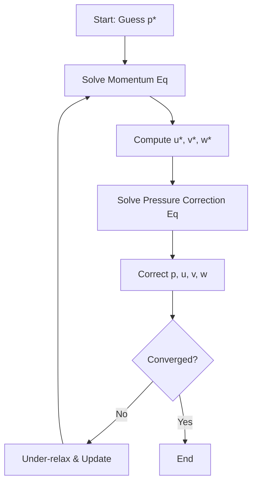

# Finite Volume Method & Discretization
## HARDCORE Level - 2026-01-02

---

## Table of Contents
- [1. Theory](#1-theory-core-equations--physics)
- [2. Class Hierarchy](#2-openfoam-class-hierarchy--implementation)
- [3. Code Walkthrough](#3-code-walkthrough)
- [4. Dictionary Analysis](#4-dictionary-analysis--configuration)
- [5. Practical Tasks](#5-hands-on-practical-tasks--coding)
- [6. Concept Checks](#6-concept-checks)

---

## 1. Theory: Core Equations & Physics {#1-theory-core-equations--physics}

### 1.1 General Transport Equation {#general-transport-equation}

The governing equation for most fluid dynamics and heat transfer problems is the **general transport equation** (สมการถ่ายเทกว้างทั่วไป):

$$
\frac{\partial (\rho \phi)}{\partial t} + \nabla \cdot (\rho \mathbf{u} \phi) = \nabla \cdot (\Gamma \nabla \phi) + S_\phi
$$

Where:
- $\phi$ (ไฟ) = **conserved quantity** (ปริมาณที่อนุรักษ์) - could be temperature, velocity component, concentration, etc.
- $\rho$ (rho) = **density** (ความหนาแน่น) of the fluid
- $\mathbf{u}$ = **velocity vector** (เวกเตอร์ความเร็ว)
- $\Gamma$ (Gamma) = **diffusion coefficient** (สัมประสิทธิ์การแพร่)
- $S_\phi$ = **source term** (เทอมต้นทาง) - represents sources or sinks

> [!INFO] **Physical Meaning (ความหมายทางฟิสิกส์)**
> - **Unsteady term** $\frac{\partial (\rho \phi)}{\partial t}$: Rate of change with time (อัตราการเปลี่ยนแปลงตามเวลา)
> - **Convection term** $\nabla \cdot (\rho \mathbf{u} \phi)$: Transport due to fluid motion (การถ่ายเทโดยการไหลของของไหล)
> - **Diffusion term** $\nabla \cdot (\Gamma \nabla \phi)$: Transport due to gradients (การถ่ายเทโดยความชัน)
> - **Source term** $S_\phi$: Generation or destruction (การเกิดหรือสูญสลาย)

---

### 1.2 Integral Form for Finite Volume Method {#integral-form-fvm}

The **Finite Volume Method** (วิธีปริมาตรจำกัด) starts from the **integral form** (รูปแบบปริพันธ์) of the conservation equation. Integrating over a **control volume** $V$ (ปริมาตรควบคุม):

$$
\int_V \frac{\partial (\rho \phi)}{\partial t} dV + \int_V \nabla \cdot (\rho \mathbf{u} \phi) dV = \int_V \nabla \cdot (\Gamma \nabla \phi) dV + \int_V S_\phi dV
$$

Applying **Gauss's Divergence Theorem** (ทฤษฎีบทเกาส์ ไดเวอร์เจนซ์):

$$
\int_V \nabla \cdot \mathbf{a} \, dV = \int_{\partial V} \mathbf{a} \cdot \mathbf{n} \, dA
$$

This converts **volume integrals** (ปริพันธ์ปริมาตร) to **surface integrals** (ปริพันธ์พื้นที่ผิว):

$$
\frac{\partial}{\partial t} \int_V \rho \phi dV + \oint_{\partial V} (\rho \mathbf{u} \phi) \cdot \mathbf{n} \, dA = \oint_{\partial V} (\Gamma \nabla \phi) \cdot \mathbf{n} \, dA + \int_V S_\phi dV
$$

Where:
- $\partial V$ = **surface boundary** (ขอบเขตผิว) of the control volume
- $\mathbf{n}$ = **unit normal vector** (เวกเตอร์หน้าปกติหน่วย) pointing outward
- $dA$ = **infinitesimal area** (พื้นที่เล็กๆ) element

> [!TIP] **Why FVM? (ทำไมต้องใช้ FVM?)**
> The integral form ensures **exact conservation** (การอนุรักษ์แบบแม่นยำ) of mass, momentum, and energy - crucial for CFD simulations!

---

### 1.3 Discretization: From Continuous to Discrete {#discretization-process}

**Discretization** (การกระจายค่า) converts the continuous integral equation into an **algebraic equation** (สมการเชิงพีชคณิต) for each cell.

For a typical cell $P$ with neighbors $N$:

$$
a_P \phi_P = \sum_{f} a_f \phi_f + b_P
$$

Where:
- $\phi_P$ = value at cell center **P** (จุดศูนย์กลางเซลล์)
- $\phi_f$ = value at face **f** (หน้าเซลล์)
- $a_P$ = **central coefficient** (สัมประสิทธิ์กลาง)
- $a_f$ = **neighbor coefficients** (สัมประสิทธิ์ข้างเคียง)
- $b_P$ = **source term contribution** (ส่วนของเทอมต้นทาง)

#### Discretized Terms:

| Term | Mathematical Form | Description |
|------|-------------------|-------------|
| **Temporal** (เวลา) | $\frac{\rho_P V_P (\phi_P - \phi_P^0)}{\Delta t}$ | Time derivative (อนุพันธ์เวลา) |
| **Convection** (การพา) | $\sum_f (\rho \mathbf{u} \phi)_f \cdot \mathbf{n}_f A_f$ | Flux across faces (การไหลผ่านหน้า) |
| **Diffusion** (การแพร่) | $\sum_f (\Gamma \nabla \phi)_f \cdot \mathbf{n}_f A_f$ | Gradient-driven flux (การไหลเนื่องจากความชัน) |
| **Source** (ต้นทาง) | $S_\phi V_P$ | Volume source (แหล่งกำเนิดในปริมาตร) |

---

### 1.4 Navier-Stokes Equations {#navier-stokes-equations}

For **incompressible flow** (การไหลแบบอัดตัวไม่ได้), the governing equations are:

#### Momentum Equation (สมการโมเมนตัม):

$$
\frac{\partial (\rho \mathbf{u})}{\partial t} + \nabla \cdot (\rho \mathbf{u} \mathbf{u}) = -\nabla p + \nabla \cdot (\mu \nabla \mathbf{u}) + \rho \mathbf{g}
$$

> [!NOTE] **Thai Terms (คำศัพท์ไทย)**
> - $-\nabla p$: **pressure gradient** (ความชันความดัน) - drives flow
> - $\mu$: **dynamic viscosity** (ความหนืด) - resists deformation
> - $\rho \mathbf{g}$: **gravity force** (แรงโน้มถ่วง) - body force

#### Continuity Equation (สมการต่อเนื่อง):

$$
\nabla \cdot \mathbf{u} = 0
$$

This enforces **mass conservation** (การอนุรักษ์มวล) - what flows in must flow out!

---

### 1.5 Discretization Schemes {#discretization-schemes}

OpenFOAM offers various **schemes** (รูปแบบการกระจายค่า) for evaluating face values $\phi_f$:

#### Convection Schemes (รูปแบบการพา):

| Scheme | Order | Stability | Thai Name |
|--------|-------|-----------|-----------|
| **Upwind** | First | Very stable | พาดลม (ขึ้นกระแส) |
| **Linear** | Second | Conditionally stable | เชิงเส้น |
| **QUICK** | Third | Less stable | รวดเร็ว |
| **Central Difference** | Second | Unstable without blending | ตรงกลาง |

```cpp
// OpenFOAM scheme specification in fvSchemes dictionary
divSchemes
{
    default         none;
    div(phi,U)      Gauss linearUpwind grad(U);  // Second-order upwind
    div(phi,k)      Gauss upwind;                 // First-order upwind
    div(phi,epsilon) Gauss upwind;
}
```

#### Diffusion Schemes (รูปแบบการแพร่):

$$
(\Gamma \nabla \phi)_f \cdot \mathbf{n}_f \approx \Gamma_f \frac{\phi_N - \phi_P}{|\mathbf{d}_{PN}|} A_f
$$

Where $\mathbf{d}_{PN}$ is the **distance vector** (เวกเตอร์ระยะห่าง) between cell centers.

> [!WARNING] **Non-Orthogonality (ความไม่ตั้งฉาก)**
> For **non-orthogonal meshes** (ตาข่ายไม่ตั้งฉาก), additional **correction terms** (เทอมแก้ไข) are needed!

---

### 1.6 Solution Algorithms {#solution-algorithms}

#### SIMPLE Algorithm (Semi-Implicit Method for Pressure-Linked Equations):



> [!INFO] **SIMPLE Steps (ขั้นตอน SIMPLE)**
> 1. **Guess pressure field** (ทายสนามความดัน) $p^*$
> 2. **Solve momentum** (แก้สมการโมเมนตัม) to get $\mathbf{u}^*$
> 3. **Solve pressure correction** (แก้สมการแก้ไขความดัน) $p'$
> 4. **Correct fields** (แก้ไขสนาม): $p = p^* + p'$, $\mathbf{u} = \mathbf{u}^* + \mathbf{u}'$
> 5. **Repeat** (ทำซ้ำ) until convergence

#### Pressure-Velocity Coupling (การเชื่อมโยงความดัน-ความเร็ว):

The **pressure correction equation** (สมการแก้ไขความดัน) derives from continuity:

$$
\nabla \cdot \left( \frac{1}{a_P} \nabla p' \right) = \nabla \cdot \mathbf{u}^*
$$

This is a **Poisson equation** (สมการปัวสซอง) for pressure correction!

---

### 1.7 Boundary Conditions {#boundary-conditions}

Common **boundary conditions** (เงื่อนไขขอบเขต) in OpenFOAM:

| Type | Mathematical Form | Thai | Usage |
|------|-------------------|------|-------|
| **Dirichlet** | $\phi = \phi_{wall}$ | ค่าคงที่ | Fixed value at wall |
| **Neumann** | $\frac{\partial \phi}{\partial n} = 0$ | ความชันศูนย์ | Zero gradient (outlet) |
| **Robin** | $a\phi + b\frac{\partial \phi}{\partial n} = c$ | ผสม | Convection boundary |

```cpp
// Example: OpenFOAM boundary condition specification
0/p
{
    type            fixedValue;
    value           uniform 0;          // Inlet: fixed pressure
}

0/U
{
    type            zeroGradient;       // Outlet: zero gradient
}
```

> [!TIP] **Wall Functions (ฟังก์ชันผนัง)**
> Near walls, use **wall functions** to avoid resolving the viscous sublayer (ชั้นไหลเวียนต่ำกว่า) directly!

---

### 1.8 Summary of Key Equations {#summary-equations}

| Equation | Vector Form | Discrete Form |
|----------|-------------|---------------|
| **General Transport** | $\frac{\partial (\rho \phi)}{\partial t} + \nabla \cdot (\rho \mathbf{u} \phi) = \nabla \cdot (\Gamma \nabla \phi) + S_\phi$ | $a_P \phi_P = \sum a_f \phi_f + b_P$ |
| **Continuity** | $\nabla \cdot \mathbf{u} = 0$ | $\sum_f \mathbf{u}_f \cdot \mathbf{n}_f A_f = 0$ |
| **Momentum** | $\frac{\partial (\rho \mathbf{u})}{\partial t} + \nabla \cdot (\rho \mathbf{u} \mathbf{u}) = -\nabla p + \nabla \cdot (\mu \nabla \mathbf{u})$ | $\mathbf{a}_P \mathbf{u}_P = \sum \mathbf{a}_f \mathbf{u}_f - \nabla p V_P$ |

> [!SUCCESS] **Key Takeaway (สรุปสำคัญ)**
> FVM converts PDEs → algebraic equations by integrating over control volumes and applying Gauss's theorem. The method **exactly conserves** fluxes across cell faces!

---

## 2. OpenFOAM Class Hierarchy & Implementation {#2-openfoam-class-hierarchy--implementation}

<!-- PLACEHOLDER_CLASS -->

---

## 3. Code Walkthrough {#3-code-walkthrough}

<!-- PLACEHOLDER_CODE -->

---

## 4. Dictionary Analysis & Configuration {#4-dictionary-analysis--configuration}

<!-- PLACEHOLDER_DICT -->

---

## 5. Hands-on: Practical Tasks & Coding {#5-hands-on-practical-tasks--coding}

<!-- PLACEHOLDER_TASKS -->

---

## 6. Concept Checks {#6-concept-checks}

<!-- PLACEHOLDER_CHECKS -->

---

## Recommended Reading

- OpenFOAM User Guide: https://www.openfoam.com/documentation/user-guide
- OpenFOAM Programmer's Guide: https://doc.openfoam.com/
- CFD Online Forum: https://www.cfd-online.com/Forums/openfoam/

