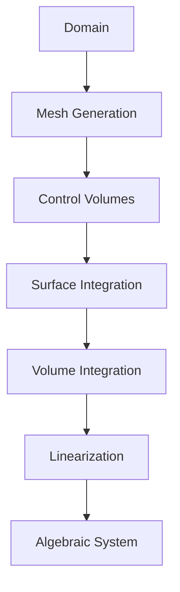
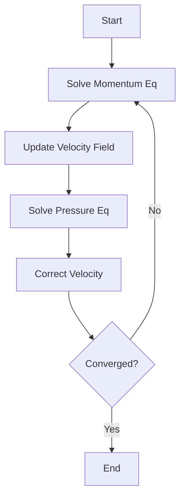
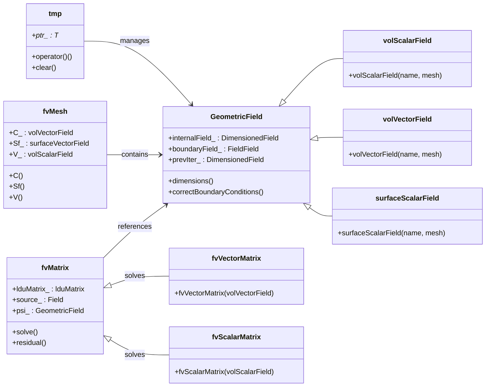
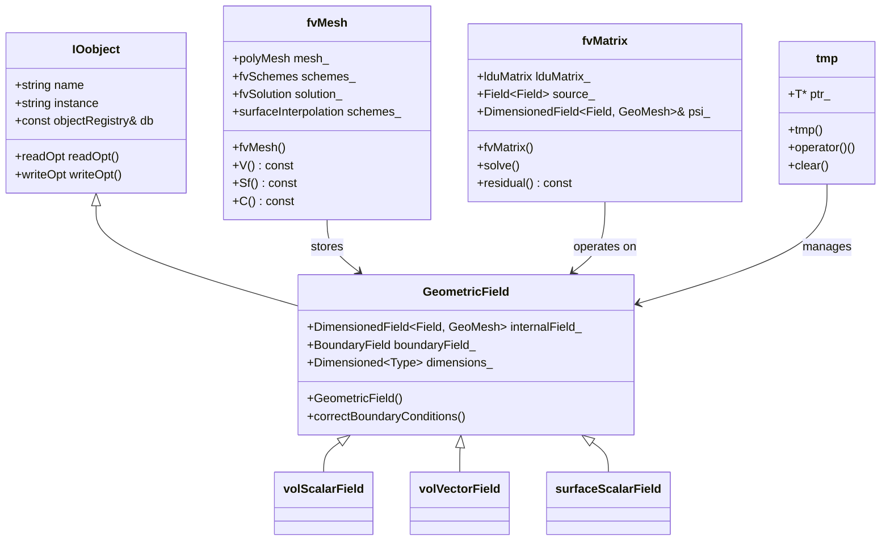
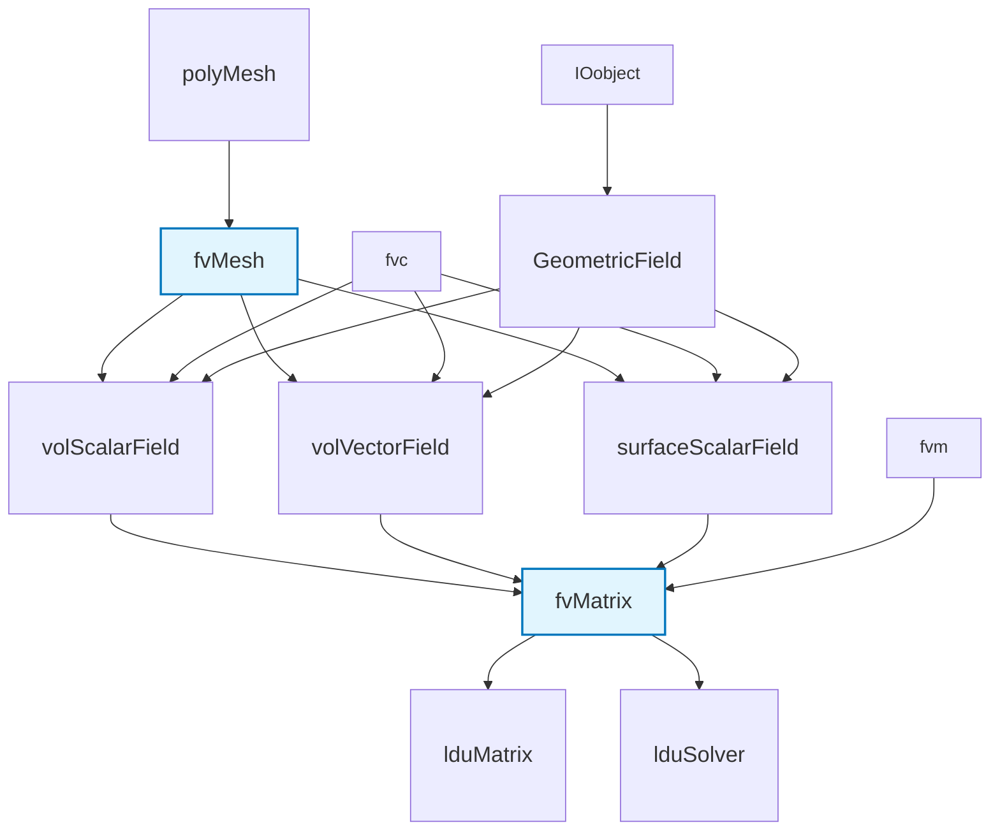
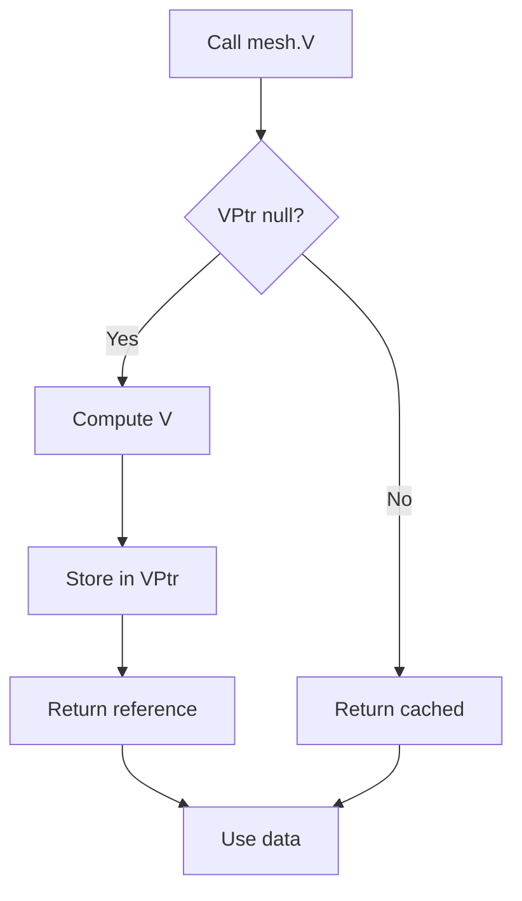

---
tags:
  - openfoam
  - cfd
  - hardcore
  - day-02
date: 2026-01-02
aliases:
  - Finite Volume Method & Discretization
difficulty: hardcore
topic: Finite Volume Method & Discretization
---

# ระเบียบวิธีปริมาตรจำกัดและการแปลงเป็นสมการเชิงตัวเลข (Finite Volume Method & Discretization)
## HARDCORE Level - 2026-01-02

---

## Table of Contents
- [[#1. ทฤษฎี: สมการหลักและฟิสิกส์ (Theory: Core Equations & Physics)|1. Theory]]
- [[#2. โครงสร้างคลาสและการนำไปใช้ (OpenFOAM Class Hierarchy & Implementation)|2. Class Hierarchy]]
- [[#3. การเดินชมโค้ด (Code Walkthrough)|3. Code Walkthrough]]
- [[#4. การวิเคราะห์ดิกชันนารีและการตั้งค่า (Dictionary Analysis & Configuration)|4. Dictionary Analysis]]
- [[#5. งานลงมือทำจริง: การเขียนโปรแกรมและการปฏิบัติ (Hands-on: Practical Tasks & Coding)|5. Practical Tasks]]
- [[#6. ทดสอบความเข้าใจ (Concept Checks)|6. Concept Checks]]

---

> [!GOAL] **วัตถุประสงค์การเรียนรู้ (Learning Objectives)**
> - เข้าใจสมการควบคุมการไหล (Navier-Stokes) และรูปแบบอินทิกรัล
> - เข้าใจหลักการดิสครีไทซ์แบบ Finite Volume (Space & Time)
> - เข้าใจโครงสร้างคลาสหลักของ OpenFOAM (`fvMesh`, `GeometricField`, `fvm`/`fvc`)
> - สามารถตั้งค่า `fvSchemes` และ `fvSolution` ได้อย่างถูกต้อง
> - เขียนโค้ดพื้นฐานสำหรับ Convection, Diffusion และ SIMPLE algorithm ได้

## 1. ทฤษฎี: สมการหลักและฟิสิกส์ (Theory: Core Equations & Physics)

### 1.1 สมการควบคุมการไหลของของไหล (Governing Equations of Fluid Motion)

สมการพื้นฐานที่ควบคุมการไหลของของไหลได้มาจากหลักการอนุรักษ์ 3 ประการ:

> [!INFO] **กฎการอนุรักษ์ (Conservation Laws)**
> - มวล (Mass) - สมการความต่อเนื่อง (Continuity Equation)
> - โมเมนตัม (Momentum) - กฎข้อที่สองของนิวตัน (Newton's Second Law)
> - พลังงาน (Energy) - กฎข้อที่หนึ่งของอุณหพลศาสตร์ (First Law of Thermodynamics)

#### 1.1.1 สมการความต่อเนื่อง (Continuity Equation)

$$\frac{\partial \rho}{\partial t} + \nabla \cdot (\rho \mathbf{U}) = 0$$

**ความหมายของตัวแปร:**
- $\rho$: ความหนาแน่น (Density) [kg/m³]
- $\mathbf{U}$: เวกเตอร์ความเร็ว (Velocity vector) [m/s]
- $\nabla \cdot$: ตัวดำเนินการไดเวอร์เจนซ์ (Divergence operator)
- $t$: เวลา (Time) [s]

สำหรับการไหลแบบอัดตัวไม่ได้ ($\rho = \text{คงที่}$):
$$\nabla \cdot \mathbf{U} = 0$$

#### 1.1.2 สมการโมเมนตัม (Momentum Equation - Navier-Stokes)

$$\frac{\partial (\rho \mathbf{U})}{\partial t} + \nabla \cdot (\rho \mathbf{U} \mathbf{U}) = -\nabla p + \nabla \cdot \boldsymbol{\tau} + \rho \mathbf{g}$$

**ความหมายของตัวแปร:**
- $p$: ความดัน (Pressure) [Pa]
- $\boldsymbol{\tau}$: เทนเซอร์ความเค้น (Stress tensor) [Pa]
- $\mathbf{g}$: ความเร่งเนื่องจากแรงโน้มถ่วง (Gravitational acceleration) [m/s²]
- $\rho \mathbf{U} \mathbf{U}$: การไหลแบบเนื่อง (Convective flux) - เป็นเทอม Non-linear

> [!WARNING] **คำเตือนเรื่องความไม่เป็นเชิงเส้น (Nonlinearity Warning)**
> เทอม Convective $\nabla \cdot (\rho \mathbf{U} \mathbf{U})$ ทำให้สมการ Navier-Stokes ยากต่อการหาผลเฉลยแม่นตรง (Analytical solution) อย่างมาก นี่คือเหตุผลที่เราต้องการระเบียบวิธีเชิงตัวเลขอย่าง FVM

สำหรับของไหล Newtonian ที่มีความหนืดคงที่:
$$\boldsymbol{\tau} = \mu \left[ \nabla \mathbf{U} + (\nabla \mathbf{U})^T - \frac{2}{3}(\nabla \cdot \mathbf{U})\mathbf{I} \right]$$

โดยที่ $\mu$ คือความหนืดพลวัต (Dynamic viscosity) [Pa·s]

#### 1.1.3 สมการการขนส่งทั่วไป (General Transport Equation)

กฎการอนุรักษ์ทั้งหมดสามารถเขียนให้อยู่ในรูปแบบทั่วไปได้ดังนี้:

$$\frac{\partial (\rho \phi)}{\partial t} + \nabla \cdot (\rho \mathbf{U} \phi) = \nabla \cdot (\Gamma_\phi \nabla \phi) + S_\phi$$

**ความหมายของตัวแปร:**
- $\phi$: คุณสมบัติที่ถูกถ่ายโอน (Transported property) - เช่น $1$, $\mathbf{U}$, $T$
- $\Gamma_\phi$: สัมประสิทธิ์การแพร่ (Diffusion coefficient)
- $S_\phi$: เทอมแหล่งกำเนิด (Source term)

---

### 1.2 พื้นฐานระเบียบวิธีปริมาตรจำกัด (Finite Volume Method Fundamentals)

#### 1.2.1 รูปแบบอินทิกรัล (Integral Form)

FVM เริ่มต้นจากรูปแบบอินทิกรัลของสมการการขนส่งทั่วไปเหนือปริมาตรควบคุม $V$:

$$\int_V \frac{\partial (\rho \phi)}{\partial t} dV + \oint_A \mathbf{n} \cdot (\rho \mathbf{U} \phi) dA = \oint_A \mathbf{n} \cdot (\Gamma_\phi \nabla \phi) dA + \int_V S_\phi dV$$

**แนวคิดหลัก (Key Concept):** แบ่งโดเมนออกเป็นปริมาตรควบคุม (Control Volumes - CVs) ย่อยๆ และประยุกต์ใช้กฎการอนุรักษ์กับแต่ละ CV

> [!TIP] **ทำไมต้องใช้ FVM? (Why FVM?)**
> - **Conservative by design** (อนุรักษ์โดยสภาพ): ฟลักซ์ที่ออกจาก CV หนึ่งจะเข้าสู่ CV ข้างเคียงเสมอ
> - **Handles complex geometries** (รองรับเรขาคณิตที่ซับซ้อน): ทำงานได้ดีบนเมชแบบไม่มีโครงสร้าง (Unstructured mesh)
> - **Physically intuitive** (เข้าใจได้ง่ายจากภาพ): อิงตามหลักการอนุรักษ์ทางฟิสิกส์จริงๆ

#### 1.2.2 กระบวนการแปลงเป็นสมการเชิงตัวเลข (Discretization Process)

การดิสครีไทซ์ (Discretization) คือการแปลงสมการอินทิกรัลให้เป็นสมการพีชคณิต:

$$a_P \phi_P = \sum_{f} a_f \phi_f + b_P$$

**ขั้นตอนการดิสครีไทซ์:**



#### 1.2.3 การดิสครีไทซ์เวลา (Temporal Discretization)

สำหรับการจำลองสภาวะไม่คงที่ (Transient) เราต้องดิสครีไทซ์อนุพันธ์เทียบเวลา:

$$\frac{\partial (\rho \phi)}{\partial t} \approx \frac{(\rho \phi)^{n+1} - (\rho \phi)^n}{\Delta t}$$

**รูปแบบทั่วไป (Common schemes):**
- **Euler Explicit**: $\phi^{n+1} = \phi^n + \Delta t \cdot R(\phi^n)$
- **Euler Implicit**: $\phi^{n+1} = \phi^n + \Delta t \cdot R(\phi^{n+1})$
- **Crank-Nicolson**: $\phi^{n+1} = \phi^n + \frac{\Delta t}{2}[R(\phi^n) + R(\phi^{n+1})]$

> [!INFO] **การพิจารณาเสถียรภาพ (Stability Considerations)**
> - **Explicit schemes:** เสถียรแบบมีเงื่อนไข (ขึ้นกับ CFL condition)
> - **Implicit schemes:** เสถียรแบบไม่มีเงื่อนไข (Unconditionally stable) แต่ต้องแก้สมการแบบ Iterative

#### 1.2.4 การดิสครีไทซ์เชิงพื้นที่: เทอมการพา (Spatial Discretization: Convection Terms)

Convective flux ที่หน้าสัมผัส $f$ ต้องการการจัดการเป็นพิเศษ:

$$F_f^C = (\rho \mathbf{U} \phi)_f \cdot \mathbf{A}_f$$

**รูปแบบ Upwind Schemes:**

| Scheme | สูตร (Formula) | เสถียรภาพ (Stability) | ความแม่นยำ (Accuracy) |
|--------|---------|-----------|----------|
| First-Order Upwind | $\phi_f = \phi_{upwind}$ | เสถียรมาก (Very stable) | อันดับ 1 (Diffusive) |
| Central Differencing | $\phi_f = 0.5(\phi_P + \phi_N)$ | เสถียรแบบมีเงื่อนไข | อันดับ 2 |
| QUICK | Quadratic interpolation | เสถียรแบบมีเงื่อนไข | อันดับ 3 |
| Linear Upwind | $\phi_f = \phi_{upwind} + \nabla\phi \cdot \mathbf{d}$ | เสถียร | อันดับ 2 |

> [!WARNING] **การแพร่ตัวเชิงตัวเลข (Numerical Diffusion)**
> First-order upwind schemes ทำให้เกิดการแพร่เทียม (False diffusion) ซึ่งทำให้ Gradient ที่คมชัดเบลอไป ควรใช้ Scheme อันดับสูงขึ้นเพื่อให้ได้ผลลัพธ์ที่แม่นยำ

#### 1.2.5 การดิสครีไทซ์เชิงพื้นที่: เทอมการแพร่ (Spatial Discretization: Diffusion Terms)

Diffusive flux ใช้ทฤษฎีบทของเกาส์ (Gauss's theorem):

$$F_f^D = (\Gamma_\phi \nabla \phi)_f \cdot \mathbf{A}_f$$

**การแก้ไขความไม่ตั้งฉาก (Non-orthogonal correction):**

สำหรับเมชที่ไม่ตั้งฉาก (Non-orthogonal meshes) เราจะแยกองค์ประกอบของ Gradient:

$$\nabla \phi = \underbrace{\frac{\phi_N - \phi_P}{|\mathbf{d}|} \mathbf{n}}_{\text{orthogonal}} + \underbrace{(\nabla \phi - (\nabla \phi \cdot \mathbf{n})\mathbf{n})}_{\text{correction}}$$

โดยที่ $\mathbf{d}$ คือเวกเตอร์ระยะทางระหว่างจุดศูนย์กลางเซลล์

![[fv_mesh_owner_neighbour_1767278470077.png]]
*รูปที่ 1.2.5: แสดงเวกเตอร์ระยะทาง (d) และเวกเตอร์พื้นที่หน้า (Sf) ในการเชื่อมต่อ Owner-Neighbour*


#### 1.2.6 การเชื่อมโยงความดัน-ความเร็ว (Pressure-Velocity Coupling)

การเชื่อมโยงระหว่างความดันและความเร็วเป็นสิ่งสำคัญในการไหลแบบอัดตัวไม่ได้ อัลกอริทึมทั่วไป:



**SIMPLE Algorithm (Semi-Implicit Method for Pressure-Linked Equations):**

1. สมมติสนามความดันเริ่มต้น $p^*$
2. แก้สมการโมเมนตัมเพื่อหาความเร็ว $\mathbf{U}^*$
3. แก้สมการ Pressure correction เพื่อหา $p'$
4. ปรับแก้ความดัน: $p = p^* + p'$
5. ปรับแก้ความเร็ว: $\mathbf{U} = \mathbf{U}^* + \mathbf{U}'$
6. ทำซ้ำจนกว่าจะลู่เข้า (Convergence)

> [!TIP] **การใช้งานใน OpenFOAM (OpenFOAM Implementation)**
> OpenFOAM ใช้อัลกอริทึม **PIMPLE** (รวม PISO-SIMPLE) ซึ่งผสมผสาน:
> - **PISO** (Pressure Implicit with Splitting of Operators) สำหรับความแม่นยำในสภาวะ Transient
> - **SIMPLE** สำหรับการลู่เข้าในสภาวะ Steady-state หรือ Pseudo-steady

---

### 1.3 รูปแบบการดิสครีไทซ์ใน OpenFOAM (Discretization Schemes in OpenFOAM)

OpenFOAM มีรูปแบบการดิสครีไทซ์หลากหลาย ซึ่งกำหนดในไฟล์ `fvSchemes`:

#### 1.3.1 รูปแบบทางเวลา (Temporal Schemes)

```foam
ddtSchemes
{
    default         Euler;          // First-order implicit (อันดับ 1)
    // default         backward;       // Second-order implicit (อันดับ 2)
    // default         CrankNicolson 1; // Second-order, 0-1 blending
}
```

#### 1.3.2 รูปแบบเกรเดียนต์ (Gradient Schemes)

```foam
gradSchemes
{
    default         Gauss linear;    // Central differencing (ผลต่างส่วนกลาง)
    // default         Gauss upwind;    // Upwind-biased
    // default         leastSquares;    // Least squares reconstruction (แม่นยำสูง)
}
```

#### 1.3.3 รูปแบบไดเวอร์เจนซ์ (Divergence Schemes - Convection)

```foam
divSchemes
{
    default         none;
    div(phi,U)      Gauss upwind;           // First-order (เสถียรแต่ไม่แม่นยำ)
    // div(phi,U)      Gauss linearUpwind grad(U); // Second-order (แม่นยำกว่า)
    // div(phi,U)      Gauss limitedLinearV 1;     // TVD scheme (สำหรับ Shock capturing)
    // div(phi,k)      Gauss limitedLinear 1;
    // div(phi,epsilon) Gauss limitedLinear 1;
}
```

> [!INFO] **TVD Schemes (Total Variation Diminishing)**
> TVD schemes ป้องกันการแกว่งที่ผิดธรรมชาติ (Non-physical oscillations) ใกล้รอยต่อต่างๆ โดยใช้ Limiters:
> - **van Leer**: Smooth limiter
> - **minmod**: Diffusive มากที่สุด (เสถียรสุด)
> - **superbee**: Diffusive น้อยที่สุด (คมชัดสุด)
> - **MUSCL**: Monotone Upstream-centered Scheme

#### 1.3.4 รูปแบบลาปลาเซียน (Laplacian Schemes - Diffusion)

```foam
laplacianSchemes
{
    default         Gauss linear corrected;
    // default         Gauss linear uncorrected;
    // default         Gauss limited 0.5;  // Limited เพื่อเพิ่มเสถียรภาพ
}
```

ตัวเลือก `corrected` จะเพิ่มเทอมแก้ไขความไม่ตั้งฉาก (Non-orthogonal correction) เพื่อความแม่นยำที่ดีขึ้นบนเมชที่เบี้ยว

#### 1.3.5 รูปแบบการประมาณค่าในช่วง (Interpolation Schemes)

```foam
interpolationSchemes
{
    default         linear;
    // default         upwind;         // สำหรับ Convective terms
    // default         cubic;          // แม่นยำอันดับ 3 (Third-order)
    // default         cellPoint;      // Cell-to-point interpolation
}
```

---

### 1.4 อัลกอริทึมการแก้และตัวแก้สมการเชิงเส้น (Solution Algorithms and Linear Solvers)

#### 1.4.1 ระบบสมการพีชคณิต (System of Algebraic Equations)

หลังจากการดิสครีไทซ์ เราจะได้ระบบสมการเชิงเส้นแบบเบาบาง (Sparse linear system):

$$[A]\{\phi\} = \{b\}$$

โดยที่:
- $[A]$: เมทริกซ์สัมประสิทธิ์ (Coefficient matrix) - Sparse และมักไม่สมมาตร
- $\{\phi\}$: เวกเตอร์ผลเฉลย (Solution vector)
- $\{b\}$: เวกเตอร์แหล่งกำเนิด (Source vector)

#### 1.4.2 ตัวแก้สมการแบบวนซ้ำ (Iterative Solvers)

OpenFOAM รองรับ Solvers หลากหลายรูปแบบ ซึ่งกำหนดใน `fvSolution`:

```foam
solvers
{
    p
    {
        solver          GAMG;
        tolerance       1e-06;
        relTol          0.01;
        smoother        GaussSeidel;
    }

    "(U|k|epsilon|omega)"
    {
        solver          smoothSolver;
        smoother        GaussSeidel;
        tolerance       1e-05;
        relTol          0.1;
    }
}
```

**Solvers ทั่วไป:**

| Solver | คำอธิบาย (Description) | เหมาะสำหรับ (Best For) |
|--------|-------------|----------|
| **GAMG** | Geometric-Algebraic Multi-Grid | สมการความดัน (Poisson-type) |
| **smoothSolver** | Smoothed iterative method | สมการโมเมนตัม |
| **PCG** | Preconditioned Conjugate Gradient | เมทริกซ์สมมาตร (Symmetric matrices) |
| **PBiCGStab** | Preconditioned BiCG Stabilized | เมทริกซ์ไม่สมมาตร (Non-symmetric matrices) |
| **simple** | Simple iterative | ปัญหาขนาดเล็ก |

> [!TIP] **การเลือก Solver (Solver Selection)**
> - ใช้ **GAMG** สำหรับความดัน: Complexity $O(N)$ ลู่เข้าเร็วมาก
> - ใช้ **smoothSolver** สำหรับความเร็ว: ทนทาน (Robust) สำหรับระบบที่เชื่อมโยงกัน
> - ปรับ **tolerance** และ **relTol** เพื่อสมดุลระหว่างความแม่นยำและความเร็ว

#### 1.4.3 การผ่อนคลายค่า (Under-Relaxation)

สำหรับการจำลองแบบ Steady-state การผ่อนคลายค่า (Under-relaxation) ช่วยป้องกันการลู่ออก (Divergence):

```foam
relaxationFactors
{
    fields
    {
        p               0.3;    // ความดัน: ต้องการ Relaxation มาก (ค่าน้อย)
        rho             0.05;   // ความหนาแน่น: Relaxation มากพิเศษสำหรับ Compressible
    }
    equations
    {
        U               0.7;    // โมเมนตัม: ปานกลาง
        k               0.7;    // Turbulence kinetic energy
        epsilon         0.7;    // Dissipation rate
    }
}
```

สูตรการอัปเดต: $\phi^{new} = \phi^{old} + \alpha (\phi^* - \phi^{old})$

โดยที่ $\alpha$ คือค่า Relaxation factor ($0 < \alpha \leq 1$)

---

### 1.5 Boundary Conditions and Discretization

#### 1.5.1 Boundary Face Discretization

Boundary faces require special treatment since there's no neighbor cell:

$$a_P \phi_P = \sum_{nb} a_{nb} \phi_{nb} + a_b \phi_b + b_P$$

**Common boundary conditions:**

| Type | Mathematical Form | OpenFOAM Keyword |
|------|-------------------|------------------|
| Dirichlet | $\phi_b = \phi_{specified}$ | `fixedValue` |
| Neumann | $(\nabla \phi)_b \cdot \mathbf{n} = q_{specified}$ | `fixedGradient` |
| Robin | $\alpha \phi_b + \beta (\nabla \phi)_b \cdot \mathbf{n} = \gamma$ | `mixed` / `externalWallHeatFlux` |
| Zero gradient | $(\nabla \phi)_b \cdot \mathbf{n} = 0$ | `zeroGradient` |

#### 1.5.2 Wall Boundary Conditions

For viscous flows, wall treatment is crucial:

```cpp
// High Reynolds number (wall functions)
U    wall
{
    type            compressible::turbulentHeatFluxTemperature;
    // or
    type            wallFunction;
}

// Low Reynolds number (resolved boundary layer)
U    wall
{
    type            noSlip;
}

k    wall
{
    type            kqRWallFunction;    // Wall function
    // or
    type            fixedValue;         // Low Re: k = 0
    value           uniform 0;
}
```

> [!WARNING] **y+ Requirements (ค่า y+ ที่เหมาะสม)**
> - **Wall functions**: $30 < y^+ < 300$
> - **Low-Re models**: $y^+ \approx 1$
> - Always check $y^+$ after meshing!

---

### 1.6 Summary of Key Equations

| Equation | Vector Form | Discretized Form |
|----------|-------------|-----------------|
| **Continuity** | $\nabla \cdot \mathbf{U} = 0$ | $\sum_f \mathbf{U}_f \cdot \mathbf{A}_f = 0$ |
| **Momentum** | $\frac{\partial \mathbf{U}}{\partial t} + \nabla \cdot (\mathbf{U}\mathbf{U}) = -\nabla p + \nu \nabla^2 \mathbf{U}$ | $a_P \mathbf{U}_P = \sum a_f \mathbf{U}_f - \nabla p + \mathbf{S}$ |
| **Pressure** | $\nabla^2 p = \frac{\rho}{\Delta t} \nabla \cdot \mathbf{U}^*$ | $a_P p_P = \sum a_f p_f + b_p$ |

> [!INFO] **Key Takeaways (สรุปสิ่งสำคัญ)**
> 1. FVM is based on integral conservation over control volumes
> 2. Discretization converts PDEs to algebraic equations
> 3. Upwind schemes are stable but diffusive; higher-order schemes need limiters
> 4. Pressure-velocity coupling requires special algorithms (SIMPLE/PISO/PIMPLE)
> 5. Boundary conditions significantly impact accuracy and stability

> **Summary:** This section established the mathematical foundation of the Finite Volume Method, starting from the Navier-Stokes equations and deriving the integral form used for discretization. We covered key concepts including the general transport equation, pressure-velocity coupling algorithms (SIMPLE/PISO/PIMPLE), and spatial/temporal discretization schemes with their stability and accuracy characteristics. This theoretical framework is essential for understanding how OpenFOAM transforms continuous PDEs into solvable algebraic systems.

---

## 2. โครงสร้างคลาสและการนำไปใช้ (OpenFOAM Class Hierarchy & Implementation)



### 2.1 คลาสหลักของ Finite Volume (Core Finite Volume Classes)

ระเบียบวิธีปริมาตรจำกัดใน OpenFOAM ถูกสร้างขึ้นบนลำดับชั้นของคลาสที่จัดการการแสดงผลเมช, การจัดเก็บฟิลด์, และรูปแบบการดิสครีไทซ์



> [!INFO] **ลำดับชั้นคลาส (Class Hierarchy)**
> - **IOobject**: คลาสพื้นฐาน (Base class) สำหรับวัตถุที่สามารถอ่าน/เขียนได้
> - **GeometricField**: คลาส Template สำหรับฟิลด์ข้อมูล (volScalarField, volVectorField, ฯลฯ)
> - **fvMesh**: เมช Finite Volume พร้อมข้อมูลเซลล์/หน้า/จุด
> - **fvMatrix**: เมทริกซ์ของสมการที่ดิสครีไทซ์แล้ว $[A]\{\phi\} = \{b\}$

---

### 2.2 คลาสเมช (Mesh Classes)

#### 2.2.1 คลาสเมชพื้นฐาน (Primitive Mesh Classes)

```cpp
// $FOAM_SRC/OpenFOAM/meshes/polyMesh/polyMesh.H
class polyMesh
:
    public objectRegistry,
    public primitiveMesh
{
    // Face-based data
    const faceList& faces() const;
    const pointField& points() const;
    
    // Cell-based data
    const cellList& cells() const;
    label nCells() const;
    
    // Boundary information
    const polyBoundaryMesh& boundaryMesh() const;
};
```

**โครงสร้างข้อมูลเมชที่สำคัญ (Key mesh data structures):**

| คลาส (Class) | คำอธิบาย (Description) | ตำแหน่ง Source Code |
|-------|-------------|-----------------|
| **polyMesh** | เมชรูปทรงหลายเหลี่ยมทั่วไป | `$FOAM_SRC/OpenFOAM/meshes/polyMesh/` |
| **primitiveMesh** | เมชพื้นฐานพร้อมข้อมูลเรขาคณิต | `$FOAM_SRC/OpenFOAM/meshes/primitiveMesh/` |
| **fvMesh** | Wrapper ของ Finite Volume mesh | `$FOAM_SRC/finiteVolume/meshes/fvMesh/` |

#### 2.2.2 Finite Volume Mesh

```cpp
// $FOAM_SRC/finiteVolume/meshes/fvMesh/fvMesh.H
class fvMesh
:
    public polyMesh
{
public:
    // Geometric data
    const volScalarField::Internal& V() const;  // Cell volumes
    const surfaceVectorField::Internal& Sf() const;  // Face area vectors
    const volVectorField::Internal& C() const;  // Cell centers
    const surfaceVectorField::Internal& Cf() const;  // Face centers
    
    // Interpolation schemes
    const surfaceInterpolation& schemes() const;
    
    // Solution schemes
    const fvSchemes& fvSchemes() const;
    const fvSolution& fvSolution() const;
};
```

> [!TIP] **การเข้าถึงข้อมูลเมช (Mesh Data Access)**
> - **V()**: ปริมาตรเซลล์ (Cell volumes) - ใช้สำหรับ Volume integrals
> - **Sf()**: เวกเตอร์พื้นที่หน้า (Face area vectors) - ใช้สำหรับ Surface fluxes
> - **C()**: จุดศูนย์ถ่วงเซลล์ (Cell centers) - ใช้สำหรับคำนวณ Gradient
> - **Cf()**: จุดศูนย์ถ่วงหน้า (Face centers) - ใช้สำหรับ Interpolation

---

### 2.3 คลาสฟิลด์ (Field Classes)

#### 2.3.1 GeometricField Template

```cpp
// $FOAM_SRC/OpenFOAM/fields/GeometricField/GeometricField.H
template<class Type, class GeoMesh>
class GeometricField
:
    public IOobject,
    public DimensionedField<Type, GeoMesh>,
    public FieldField<GeoMesh, Type>
{
public:
    // Internal field (cell values)
    DimensionedField<Type, GeoMesh>& internalField();
    
    // Boundary field
    BoundaryField& boundaryField();
    
    // Reference to parent mesh
    const Mesh& mesh() const;
    
    // Correct boundary conditions
    void correctBoundaryConditions();
};
```

**ประเภทฟิลด์ทั่วไป (Common field types):**

```cpp
// Scalar field (e.g., pressure, temperature ความดัน, อุณหภูมิ)
volScalarField p
(
    IOobject("p", runTime.timeName(), mesh, IOobject::MUST_READ),
    mesh
);

// Vector field (e.g., velocity ความเร็ว)
volVectorField U
(
    IOobject("U", runTime.timeName(), mesh, IOobject::MUST_READ),
    mesh
);

// Surface scalar field (e.g., mass flux ฟลักซ์มวล)
surfaceScalarField phi
(
    IOobject("phi", runTime.timeName(), mesh, IOobject::NO_READ),
    fvc::flux(U)
);
```

#### 2.3.2 คลาส Boundary Field (Boundary Field Classes)

```cpp
// $FOAM_SRC/OpenFOAM/fields/GeometricField/Boundary/BoundaryField.H
template<class Type, class GeoMesh>
class BoundaryField
:
    public FieldField<fvPatchField, Type>
{
public:
    // Update boundary conditions
    void updateCoeffs();
    
    // Evaluate boundary conditions
    void evaluate();
};
```

**คลาสเงื่อนไขขอบเขตทั่วไป (Common boundary condition classes):**

| คลาส BC (BC Class) | คำอธิบาย (Description) | กรณีการใช้งาน (Use Case) |
|----------|-------------|----------|
| **fixedValueFvPatchField** | Dirichlet condition (ค่าคงที่) | ทางเข้า (Inlet), อุณหภูมิคงที่ |
| **fixedGradientFvPatchField** | Neumann condition (เกรเดียนต์คงที่) | ผนัง Adiabatic (ฉนวน) |
| **zeroGradientFvPatchField** | Zero gradient (เกรเดียนต์เป็นศูนย์) | ทางออก (Outlet), ความสมมาตร |
| **mixedFvPatchField** | Robin condition (ผสม) | การถ่ายเทความร้อนแบบพา |

---

### 2.4 คลาสการดิสครีไทซ์ (Discretization Classes)

#### 2.4.1 fvMatrix - สมการที่ดิสครีไทซ์แล้ว (The Discretized Equation)

```cpp
// $FOAM_SRC/finiteVolume/fvMatrices/fvMatrix/fvMatrix.H
template<class Type>
class fvMatrix
:
    public refCount,
    public lduMatrix
{
    // Reference to the field being solved
    GeometricField<Type, fvPatchField, volMesh>& psi_;
    
    // Source term
    Field<Type> source_;
    
    // Boundary conditions
    FieldField<fvsPatchField, Type> internalCoeffs_;
    FieldField<fvsPatchField, Type> boundaryCoeffs_;
    
public:
    // Solve the linear system
    SolverPerformance<Type> solve();
    
    // Return residual
    tmp<Field<Type>> residual() const;
    
    // Operator overloads for equation assembly
    void operator+=(const fvMatrix<Type>&);
    void operator-=(const fvMatrix<Type>&);
};
```

> [!INFO] **โครงสร้างเมทริกซ์ (Matrix Structure)**
> สมการที่ดิสครีไทซ์แล้วมีรูปแบบ:
> $$[A]\{\phi\} = \{b\}$$
> 
> โดยที่:
> - **lduMatrix**: เก็บสัมประสิทธิ์แนวทแยง ($D$), สามเหลี่ยมล่าง ($L$), และสามเหลี่ยมบน ($U$)
> - **source_**: เวกเตอร์ฝั่งขวา $\{b\}$
> - **psi_**: Reference ไปยังฟิลด์ $\{\phi\}$ ที่กำลังถูกแก้

#### 2.4.2 รูปแบบการประมาณค่าผิวหน้า (Surface Interpolation Schemes)

```cpp
// $FOAM_SRC/finiteVolume/interpolation/surfaceInterpolation/surfaceInterpolation.H
class surfaceInterpolation
{
public:
    // Interpolate cell values to faces
    tmp<surfaceScalarField> interpolate(const volScalarField&) const;
    
    // Get interpolation scheme
    tmp<surfaceInterpolationScheme<Type>>
    scheme(const word& name) const;
};
```

**รูปแบบการประมาณค่าทั่วไป (Common interpolation schemes):**

```cpp
// Upwind interpolation
tmp<surfaceScalarField> tphi = fvc::interpolate
(
    psi,
    "interpolate(" + psi.name() + ')',
    upwind<scalar>(mesh, U)
);

// Linear interpolation (central differencing)
tmp<surfaceScalarField> tphi = fvc::interpolate
(
    psi,
    "interpolate(" + psi.name() + ')',
    linear<scalar>(mesh)
);
```

---

### 2.5 เนมสเปซ Finite Volume Calculus (fvc)

เนมสเปซ `fvc` (Finite Volume Calculus) ให้ฟังก์ชันสำหรับการดิสครีไทซ์เชิงพื้นที่ (Spatial Discretization) แบบ Direct/Explicit:

```cpp
// $FOAM_SRC/finiteVolume/fvc/fvc.H
namespace fvc
{
    // Gradient operators
    tmp<GeometricField<Type, fvPatchField, volMesh>> grad
    (
        const GeometricField<Type, fvsPatchField, surfaceMesh>&
    );
    
    // Divergence operators
    tmp<GeometricField<Type, fvPatchField, volMesh>> div
    (
        const GeometricField<Type, fvsPatchField, surfaceMesh>&
    );
    
    // Laplacian operators
    tmp<fvMatrix<Type>> laplacian
    (
        const GeometricField<Type, fvPatchField, volMesh>&
    );
    
    // Surface integral (flux)
    tmp<GeometricField<Type, fvsPatchField, surfaceMesh>> flux
    (
        const GeometricField<Type, fvPatchField, volMesh>&
    );
}
```

**การดำเนินการ fvc ทั่วไป (Common fvc operations):**

| การดำเนินการ (Operation) | รูปแบบคณิตศาสตร์ (Mathematical Form) | คำสั่ง OpenFOAM (OpenFOAM Syntax) |
|-----------|-------------------|-----------------|
| Gradient | $\nabla \phi$ | `fvc::grad(phi)` |
| Divergence | $\nabla \cdot \mathbf{U}$ | `fvc::div(phi)` |
| Laplacian | $\nabla \cdot (\Gamma \nabla \phi)$ | `fvc::laplacian(Gamma, phi)` |
| Flux | $\oint \mathbf{U} \cdot d\mathbf{A}$ | `fvc::flux(U)` |

> [!TIP] **fvc vs fvm (ความแตกต่างระหว่าง fvc และ fvm)**
> - **fvc** (finite volume calculus): คำนวณค่าแบบ Explicit คืนค่ากลับมาเป็น Field
> - **fvm** (finite volume method): สร้างเมทริกซ์ Implicit คืนค่ากลับมาเป็น `fvMatrix`
>   ```cpp
>   volScalarField divU = fvc::div(phi);  // Explicit
>   ```
> - **fvm** (finite volume method): Implicit discretization, returns a matrix
>   ```cpp
>   fvMatrix<scalar> divUEqn = fvm::div(phi, U);  // Implicit
>   ```

---

### 2.6 เนมสเปซ Finite Volume Method (fvm)

เนมสเปซ `fvm` (Finite Volume Method) ให้ฟังก์ชันสำหรับการดิสครีไทซ์แบบ Implicit เพื่อสร้างเมทริกซ์สมการ:

```cpp
// $FOAM_SRC/finiteVolume/fvm/fvm.H
namespace fvm
{
    // Implicit divergence
    tmp<fvMatrix<Type>> div
    (
        const surfaceScalarField&,
        const GeometricField<Type, fvPatchField, volMesh>&
    );
    
    // Implicit Laplacian
    tmp<fvMatrix<Type>> laplacian
    (
        const GeometricField<Type, fvsPatchField, surfaceMesh>&,
        const GeometricField<Type, fvPatchField, volMesh>&
    );
    
    // Implicit time derivative
    tmp<fvMatrix<Type>> ddt
    (
        const dimensionedScalar&,
        const GeometricField<Type, fvPatchField, volMesh>&
    );
}
```

**ตัวอย่าง: การประกอบสมการโมเมนตัม (Example: Momentum equation assembly)**

```cpp
// Assemble momentum equation
fvVectorMatrix UEqn
(
    fvm::ddt(rho, U)
  + fvm::div(phi, U)
  + fvm::laplacian(mixture.nu(), U)
 ==
    fvOptions(rho, U)
);

// Solve the equation
UEqn.solve();
```

---

### 2.7 คลาสตัวแก้สมการเชิงเส้น (Linear Solver Classes)

#### 2.7.1 LduMatrix - การจัดเก็บเมทริกซ์แบบเบาบาง (Sparse Matrix Storage)

```cpp
// $FOAM_SRC/OpenFOAM/matrices/lduMatrix/lduMatrix.H
class lduMatrix
:
    public refCount
{
    // Diagonal coefficients
    scalarField diagonal_;
    
    // Lower and upper coefficients
    scalarField lower_;
    scalarField upper_;
    
    // Addressing (owner-neighbor connectivity)
    const lduAddressing& lduAddr_;
    
public:
    // Solver selection
    SolverPerformance solver
    (
        const word& fieldName,
        const FieldField<Field, scalar>& boundaryCoeffs,
        const FieldField<Field, scalar>& internalCoeffs,
        const dictionary& solverDict
    ) const;
};
```

> [!INFO] **การจัดเก็บแบบ Ldu (Ldu Addressing)**
> OpenFOAM ใช้รูปแบบการจัดเก็บ **Ldu** (Lower-Diagonal-Upper):
> - **Diagonal**: สัมประสิทธิ์ $a_P$ สำหรับแต่ละเซลล์
> - **Lower**: สัมประสิทธิ์ $a_N$ สำหรับเซลล์เพื่อนบ้าน (owner → neighbor)
> - **Upper**: สัมประสิทธิ์ $a_P$ สำหรับเซลล์เพื่อนบ้าน (neighbor → owner)
> - รูปแบบนี้มีประสิทธิภาพสูงสำหรับเมชแบบไม่มีโครงสร้าง (Unstructured meshes)

#### 2.7.2 คลาสตัวแก้สมการ (Solver Classes)

```cpp
// $FOAM_SRC/OpenFOAM/matrices/lduMatrix/solvers/lduSolver/lduSolver.H
class lduSolver
{
public:
    // Solve the system
    virtual SolverPerformance solve
    (
        word fieldName,
        const FieldField<Field, scalar>& boundaryCoeffs,
        const FieldField<Field, scalar>& internalCoeffs,
        const lduAddressing& lduAddr,
        const Field<scalar>& source,
        Field<scalar>& psi,
        const dictionary& solverDict
    ) const = 0;
};
```

**ตัวแก้สมการที่รองรับ (Available solvers):**

| Solver | Class | Algorithm | Best For |
|--------|-------|-----------|----------|
| **GAMG** | GAMGSolver | Geometric-Algebraic Multi-Grid | Pressure (Poisson) |
| **smoothSolver** | smoothSolver | Iterative smoothing | Momentum, velocity |
| **PCG** | PCGSolver | Preconditioned Conjugate Gradient | Symmetric systems |
| **PBiCGStab** | PBiCGStabSolver | Preconditioned BiCG Stabilized | Non-symmetric systems |

---

### 2.8 อ้างอิงตำแหน่งไฟล์ซอร์ส (Source File Reference)

**ไดเรกทอรีซอร์สที่สำคัญ (Key source directories):**

```bash
# Finite Volume core
$FOAM_SRC/finiteVolume/

# Mesh classes
$FOAM_SRC/OpenFOAM/meshes/

# Field classes
$FOAM_SRC/OpenFOAM/fields/

# Matrices and solvers
$FOAM_SRC/OpenFOAM/matrices/

# Discretization schemes
$FOAM_SRC/finiteVolume/schemes/
```

> [!WARNING] **เทคนิคการค้นหาซอร์สโค้ด (Source Code Navigation)**
> เมื่อสำรวจซอร์สโค้ดของ OpenFOAM:
> 1. เริ่มจากไฟล์ Header (`.H`) เพื่อดูการประกาศคลาส
> 2. ตรวจสอบ Inline implementation ในไฟล์ `.H`
> 3. ดูการทำงานละเอียดในไฟล์ `.C`
> 4. ใช้คำสั่ง `grep -r "class ClassName" $FOAM_SRC` เพื่อค้นหาคำนิยาม

---

### 2.9 สรุปความสัมพันธ์ของคลาส (Class Relationship Summary)



> [!TIP] **ประเด็นสำคัญ (Key Takeaways)**
> 1. **fvMesh**: หุ้ม `polyMesh` ไว้และเพิ่มข้อมูลเฉพาะของ FV (V, Sf, C)
> 2. **GeometricField**: เป็นรากฐานของฟิลด์ทุกประเภท (volScalarField, etc.)
> 3. **fvMatrix**: เป็นตัวแทนของสมการที่ดิสครีไทซ์แล้ว $[A]\{\phi\} = \{b\}$
> 4. **fvc**: ให้ตัวดำเนินการแบบ Explicit (คืนค่าเป็น Field)
> 5. **fvm**: ให้ตัวดำเนินการแบบ Implicit (คืนค่าเป็น Matrix)
> 6. **lduMatrix**: เก็บ Sparse matrix ในรูปแบบ Ldu

> **Summary:** This section detailed the core OpenFOAM class hierarchy that implements the Finite Volume Method, including `fvMesh` for mesh management, `GeometricField` for field storage, and `fvMatrix` for discretized equations. We explored how `fvc` provides explicit operators while `fvm` provides implicit operators, and how the `lduMatrix` storage format efficiently handles sparse linear systems. Understanding these classes is essential for reading and modifying OpenFOAM source code.

---

## 3. การเดินชมโค้ด (Code Walkthrough)

### 3.1 fvMesh.H

> **Source file:** `$FOAM_SRC/finiteVolume/meshes/fvMesh/fvMesh.H`

คลาส `fvMesh` คือหัวใจหลักของการจัดการเมชแบบ Finite Volume ใน OpenFOAM โดยขยายความสามารถมาจาก `polyMesh` เพื่อเพิ่มข้อมูลเรขาคณิตที่จำเป็นสำหรับ FV และการเข้าถึงรูปแบบการดิสครีไทซ์

**การนิยาม Header หลัก (Key header definition):**

```cpp
// $FOAM_SRC/finiteVolume/meshes/fvMesh/fvMesh.H
class fvMesh
:
    public polyMesh
{
    // Private data

        // Mesh motion fluxes
        surfaceScalarField phi_;

        // Geometric data
        volScalarField::Internal* VPtr_;        // ปริมาตรเซลล์
        surfaceVectorField::Internal* SfPtr_;   // เวกเตอร์พื้นที่หน้า
        volVectorField::Internal* CPtr_;        // จุดศูนย์ถ่วงเซลล์

public:
    // Constructors
    fvMesh(const IOobject& io);

    // Member functions

        // Geometric data access
        const volScalarField::Internal& V() const;  // Cell volumes
        const surfaceVectorField::Internal& Sf() const;  // Face area vectors
        const volVectorField::Internal& C() const;  // Cell centers
        const surfaceVectorField::Internal& Cf() const;  // Face centers

        // Scheme access
        const surfaceInterpolation& schemes() const;
        const fvSchemes& fvSchemes() const;
        const fvSolution& fvSolution() const;
};
```

#### การจัดวางหน่วยความจำ (Memory Layout)

คลาส `fvMesh` ใช้เทคนิค **Lazy Evaluation** ร่วมกับการเก็บข้อมูลแบบ Pointer สำหรับข้อมูลเรขาคณิต เพื่อหลีกเลี่ยงการคำนวณและการจองหน่วยความจำที่ไม่จำเป็นจนกว่าจะมีความต้องการใช้ข้อมูลนั้นจริงๆ

```
┌─────────────────────────────────────────────────────────────────────┐
│ fvMesh                                                              │
├─────────────────────────────────────────────────────────────────────┤
│ Inherits: polyMesh (primitive mesh data)                            │
│                                                                     │
│ Pointers (lazy evaluation):                                         │
│ ┌─────────────────────────────────────────────────────────────┐    │
│ │ VPtr_    → volScalarField::Internal (cell volumes)          │    │
│ │            [V0, V1, V2, ..., Vn]  // nCells scalars         │    │
│ └─────────────────────────────────────────────────────────────┘    │
│ ┌─────────────────────────────────────────────────────────────┐    │
│ │ SfPtr_   → surfaceVectorField::Internal (face area vectors) │    │
│ │            [(Sfx0, Sfy0, Sfz0), (Sfx1, ...), ...]           │    │
│ │            // nFaces vectors                                 │    │
│ └─────────────────────────────────────────────────────────────┘    │
│ ┌─────────────────────────────────────────────────────────────┐    │
│ │ CPtr_    → volVectorField::Internal (cell centers)          │    │
│ │            [(Cx0, Cy0, Cz0), (Cx1, ...), ...]               │    │
│ │            // nCells vectors                                 │    │
│ └─────────────────────────────────────────────────────────────┘    │
│                                                                     │
│ Reference:                                                          │
│ ┌─────────────────────────────────────────────────────────────┐    │
│ │ schemes_ → surfaceInterpolation (interpolation schemes)      │    │
│ └─────────────────────────────────────────────────────────────┘    │
│ ┌─────────────────────────────────────────────────────────────┐    │
│ │ fvSchemes_ → fvSchemes (discretization schemes)              │    │
│ └─────────────────────────────────────────────────────────────┘    │
│ ┌─────────────────────────────────────────────────────────────┐    │
│ │ fvSolution_ → fvSolution (solver settings)                   │    │
│ └─────────────────────────────────────────────────────────────┘    │
└─────────────────────────────────────────────────────────────────────┘

Memory Access Pattern:
- V()    → checks VPtr_, computes if null, returns reference
- Sf()   → checks SfPtr_, computes if null, returns reference
- C()    → checks CPtr_, computes if null, returns reference
- Data stored as UList<T> (pointer + size) for zero-copy access
```

> [!INFO] **การบริหารจัดการหน่วยความจำ (Memory Management)**
> - **Lazy evaluation**: ข้อมูลเรขาคณิตจะถูกคำนวณเมื่อมีการเรียกใช้ครั้งแรกเท่านั้น
> - **Pointer storage**: หลีกเลี่ยงการจองพื้นที่ถ้าข้อมูลนั้นไม่เคยถูกใช้งาน
> - **Cached computation**: เมื่อคำนวณแล้ว ข้อมูลจะถูกเก็บไว้ (Cache) ตลอดอายุของเมช
> - **Reference return**: การคืนค่าแบบ `const&` (Reference) หลีกเลี่ยงการคัดลอกข้อมูลและทำให้ทำงานเร็วขึ้น



**ตัวอย่างการใช้งาน (Usage example):**

```cpp
// Access cell volumes for volume integrals
const volScalarField::Internal& V = mesh.V();
scalar totalVolume = sum(V);

// Access face area vectors for flux calculations
const surfaceVectorField::Internal& Sf = mesh.Sf();
surfaceScalarField phi = fvc::flux(U) & Sf;

// Get cell centers for gradient reconstruction
const volVectorField::Internal& C = mesh.C();
```

> [!INFO] **ประเด็นสำคัญ (Key Points)**
> - **V()**: คืนค่าปริมาตรเซลล์ [m³] - จำเป็นสำหรับ Volume integrals $\int_V \phi dV$
> - **Sf()**: คืนค่าเวกเตอร์พื้นที่หน้า [m²] พร้อมทิศทาง - ใช้สำหรับ Surface fluxes $\oint_A \mathbf{U} \cdot d\mathbf{A}$
> - **C()**: คืนค่าตำแหน่งจุดศูนย์ถ่วงเซลล์ [m] - ใช้สำหรับการคำนวณ Gradient
> - **Cf()**: คืนค่าตำแหน่งจุดศูนย์ถ่วงหน้า [m] - ใช้สำหรับ Interpolation schemes
> - เมชเก็บข้อมูลเรขาคณิตเป็นพอยน์เตอร์ (`*Ptr_`) เพื่อรองรับ Lazy evaluation

---

### 3.2 fvSchemes.H

> **Source file:** `$FOAM_SRC/finiteVolume/fvSchemes/fvSchemes.H`

คลาส `fvSchemes` จัดการรูปแบบการดิสครีไทซ์ทั้งเชิงพื้นที่และเวลา (Spatial and Temporal) ที่ใช้ใน FVM โดยจะอ่านข้อมูลจากไฟล์ `system/fvSchemes` และสร้างออบเจกต์ Scheme ตามที่ระบุ

**การนิยาม Header หลัก (Key header definition):**

```cpp
// $FOAM_SRC/finiteVolume/fvSchemes/fvSchemes.H
class fvSchemes
:
    public IOdictionary
{
    // Scheme dictionaries

        ITdictionary ddtSchemes_;
        ITdictionary gradSchemes_;
        ITdictionary divSchemes_;
        ITdictionary laplacianSchemes_;
        ITdictionary interpolationSchemes_;

public:
    // Constructor
    fvSchemes(const fvMesh& mesh);

    // Access to individual schemes

        // Temporal discretization
        tmp<ddtScheme<Type>> ddt(const word& name) const;

        // Gradient schemes
        tmp<gradScheme<Type>> grad(const word& name) const;

        // Divergence schemes (convection)
        tmp<divScheme<Type>> div(const word& name) const;

        // Laplacian schemes (diffusion)
        tmp<laplacianScheme<Type>> laplacian(const word& name) const;

        // Interpolation schemes
        tmp<interpolationScheme<Type>> interpolation(const word& name) const;
};
```

#### การจัดวางหน่วยความจำ (Memory Layout)

คลาส `fvSchemes` เก็บข้อมูลพจนานุกรมของ Scheme เป็นออบเจกต์ `ITdictionary` (Inline dictionary) เพื่อให้เข้าถึงได้รวดเร็วโดยไม่ต้องเสียเวลาจอง Heap บ่อยๆ

```
┌─────────────────────────────────────────────────────────────────────┐
│ fvSchemes : IOdictionary                                            │
├─────────────────────────────────────────────────────────────────────┤
│ Inherits: IOdictionary (reads from system/fvSchemes)                │
│                                                                     │
│ Scheme Dictionaries (ITdictionary = inline storage):                │
│ ┌─────────────────────────────────────────────────────────────┐    │
│ │ ddtSchemes_                                                  │    │
│ │   ├─ default: Euler                                         │    │
│ │   └─ <field>: <scheme>                                      │    │
│ └─────────────────────────────────────────────────────────────┘    │
│ ┌─────────────────────────────────────────────────────────────────────┐
│ │ gradSchemes_                                                 │    │
│ │   ├─ default: Gauss linear                                  │    │
│ │   └─ <field>: <scheme>                                      │    │
│ └─────────────────────────────────────────────────────────────┘    │
│ ┌─────────────────────────────────────────────────────────────┐    │
│ │ divSchemes_                                                  │    │
│ │   ├─ default: none                                           │    │
│ │   ├─ div(phi,U): Gauss upwind                               │    │
│ │   └─ div(phi,k): Gauss limitedLinear 1                      │    │
│ └─────────────────────────────────────────────────────────────┘    │
│ ┌─────────────────────────────────────────────────────────────┐    │
│ │ laplacianSchemes_                                            │    │
│ │   └─ default: Gauss linear corrected                        │    │
│ └─────────────────────────────────────────────────────────────┘    │
│ ┌─────────────────────────────────────────────────────────────┐    │
│ │ interpolationSchemes_                                        │    │
│ │   └─ default: linear                                        │    │
│ └─────────────────────────────────────────────────────────────┘    │
└─────────────────────────────────────────────────────────────────────┘

Scheme Object Creation:
schemes.div("div(phi,U)")
    ↓
lookup in divSchemes_ dictionary
    ↓
create tmp<divScheme<vector>>
    ↓
return smart pointer to scheme object
```

> [!INFO] **ประสิทธิภาพหน่วยความจำ (Memory Efficiency)**
> - **ITdictionary**: การจัดเก็บแบบ Inline หลีกเลี่ยงการจอง Heap สำหรับ Dictionary ขนาดเล็ก
> - **tmp<T>**: Smart pointer จัดการอายุของออบเจกต์ Scheme
> - **Scheme factory**: สร้างออบเจกต์ Scheme ตามความต้องการจากข้อมูใน Dictionary
> - **Reference counting**: หลาย Reference สามารถแชร์ออบเจกต์ Scheme ตัวเดียวกันได้

**Usage example:**

```cpp
// Access mesh schemes
const fvSchemes& schemes = mesh.fvSchemes();

// Get upwind divergence scheme for momentum
tmp<divScheme<vector>> divUScheme = schemes.div("div(phi,U)");

// Get linear interpolation scheme
tmp<interpolationScheme<scalar>> intScheme =
    schemes.interpolation("interpolate(p)");

// Get Gauss linear gradient scheme
tmp<gradScheme<scalar>> gradScheme = schemes.grad("grad(p)");
```

> [!INFO] **ประเด็นสำคัญ (Key Points)**
> - **ddtSchemes**: รูปแบบอนุพันธ์เวลา (Euler, backward, CrankNicolson)
> - **gradSchemes**: การสร้างเกรเดียนต์ (Gauss linear, leastSquares)
> - **divSchemes**: รูปแบบฟลักซ์การพา (upwind, linearUpwind, limitedLinear)
> - **laplacianSchemes**: รูปแบบการแพร่ (Gauss linear corrected)
> - **interpolationSchemes**: การประมาณค่าจากเซลล์สู่หน้า (linear, upwind, cubic)
> - Schemes ถูกเก็บเป็น `ITdictionary` เพื่อการเข้าถึงที่รวดเร็ว
> - แต่ละ Scheme คืนค่าออบเจกต์ `tmp` เพื่อการจัดการหน่วยความจำอัตโนมัติ

---

### 3.3 fvSolution.H

> **Source file:** `$FOAM_SRC/finiteVolume/fvSolution/fvSolution.H`

คลาส `fvSolution` จัดการอัลกอริทึมการแก้สมการ (Solution algorithms), ตัวแก้สมการเชิงเส้น (Linear solvers), และพารามิเตอร์การผ่อนคลาย (Relaxation parameters) โดยอ่านข้อมูลจากไฟล์ `system/fvSolution` และควบคุมวิธีการแก้สมการ

**Key header definition:**

```cpp
// $FOAM_SRC/finiteVolume/fvSolution/fvSolution.H
class fvSolution
:
    public IOdictionary
{
    // Solution dictionaries

        ITdictionary solvers_;
        ITdictionary relaxationFactors_;
        ITdictionary algorithms_;

public:
    // Constructor
    fvSolution(const fvMesh& mesh);

    // Solver access
    const solutionDict& solverDict(const word& fieldName) const;
    
    // Relaxation factors
    scalar relaxationFactor(const word& fieldName) const;
    
    // Algorithm settings (SIMPLE/PISO/PIMPLE)
    const solutionDict& algorithmDict() const;
};
```

#### Memory Layout

The `fvSolution` class stores solution parameters as dictionaries with optimized lookup for frequently accessed settings.

```
┌─────────────────────────────────────────────────────────────────────┐
│ fvSolution : IOdictionary                                           │
├─────────────────────────────────────────────────────────────────────┤
│ Inherits: IOdictionary (reads from system/fvSolution)               │
│                                                                     │
│ Solution Dictionaries (ITdictionary):                               │
│ ┌─────────────────────────────────────────────────────────────┐    │
│ │ solvers_                                                      │    │
│ │   ├─ p                                                       │    │
│ │   │   ├─ solver: GAMG                                       │    │
│ │   │   ├─ tolerance: 1e-06                                    │    │
│ │   │   ├─ relTol: 0.01                                       │    │
│ │   │   └─ smoother: GaussSeidel                              │    │
│ │   ├─ U                                                       │    │
│ │   │   ├─ solver: smoothSolver                               │    │
│ │   │   └─ tolerance: 1e-05                                    │    │
│ │   └─ pFinal                                                  │    │
│ │       └─ $p (reference to p)                                 │    │
│ └─────────────────────────────────────────────────────────────┘    │
│ ┌─────────────────────────────────────────────────────────────┐    │
│ │ relaxationFactors_                                           │    │
│ │   ├─ fields                                                 │    │
│ │   │   ├─ p: 0.3                                             │    │
│ │   │   └─ rho: 0.05                                          │    │
│ │   └─ equations                                              │    │
│ │       ├─ U: 0.7                                             │    │
│ │       └─ k: 0.7                                             │    │
│ └─────────────────────────────────────────────────────────────┘    │
│ ┌─────────────────────────────────────────────────────────────┐    │
│ │ algorithms_                                                  │    │
│ │   ├─ SIMPLE / PISO / PIMPLE                                 │    │
│ │   │   ├─ nCorrectors: 2                                     │    │
│ │   │   ├─ nNonOrthogonalCorrectors: 1                        │    │
│ │   │   └─ pRefCell: 0                                        │    │
│ │   └─ residualControl                                        │    │
│ │       ├─ p: 1e-5                                            │    │
│ │       └─ U: 1e-5                                            │    │
│ └─────────────────────────────────────────────────────────────┘    │
└─────────────────────────────────────────────────────────────────────┘

Lookup Flow:
sol.solverDict("p")
    ↓
lookup in solvers_ dictionary
    ↓
return solutionDict object with cached parameters
    ↓
solverDict.lookup("solver") → "GAMG"
solverDict.lookup("tolerance") → 1e-06
```

> [!INFO] **การแคช Dictionary (Dictionary Caching)**
> - **Lazy parsing**: Dictionary จะถูก Parse เมื่อมีการเข้าถึงครั้งแรกเท่านั้น
> - **Reference lookup**: ไวยากรณ์ `$p` ช่วยลดความซ้ำซ้อน (pFinal อ้างอิง p)
> - **Field-specific**: กำหนด Solver/Relaxation แยกตามแต่ละ Field ได้
> - **Algorithm control**: ตั้งค่า SIMPLE/PISO/PIMPLE ได้ใน Dictionary เดียว

**Usage example:**

```cpp
// Access solution settings
const fvSolution& sol = mesh.fvSolution();

// Get solver dictionary for pressure
const dictionary& pSolver = sol.solverDict("p");

// Get under-relaxation factor for velocity
scalar alphaU = sol.relaxationFactor("U");

// Get PIMPLE algorithm settings
const dictionary& pimple = sol.algorithmDict();
int nCorr = pimple.lookupOrDefault<int>("nCorrectors", 1);
```

> [!INFO] **ประเด็นสำคัญ (Key Points)**
> - **solvers**: การตั้งค่า Linear solver (GAMG, smoothSolver, PCG, PBiCGStab)
> - **relaxationFactors**: การผ่อนคลายค่า (Under-relaxation) เพื่อเสถียรภาพในสภาวะ Steady-state ($0 < \alpha \leq 1$)
> - **algorithms**: การเชื่อมโยงความดัน-ความเร็ว (SIMPLE, PISO, PIMPLE)
> - Dictionary ของ Solver ควบคุมค่า tolerance, relative tolerance และ preconditioners
> - PIMPLE ผสมผสาน PISO (Transient) และ SIMPLE (Steady-state) เพื่อความทนทาน (Robustness)

> **สรุป:** ส่วนนี้ได้อธิบายไฟล์ซอร์สหลักของ OpenFOAM รวมถึง `fvMesh.H` สำหรับการเข้าถึงข้อมูลเรขาคณิต, `fvSchemes.H` สำหรับการจัดการรูปแบบดิสครีไทซ์, และ `fvSolution.H` สำหรับการควบคุม Solver เราได้ตรวจสอบรูปแบบการจัดวางหน่วยความจำ, กลยุทธ์ Lazy evaluation, และวิธีการที่ OpenFOAM ใช้ Smart pointers (`tmp`) เพื่อจัดการหน่วยความจำอัตโนมัติ ตัวอย่างโค้ดเหล่านี้แสดงให้เห็นว่าแนวคิด FV ระดับสูงถูกแปลงเป็น C++ ที่มีประสิทธิภาพได้อย่างไร

---

## 4. การวิเคราะห์ดิกชันนารีและการตั้งค่า (Dictionary Analysis & Configuration)

### 4.1 การวิเคราะห์ fvSchemes (fvSchemes Analysis)

ไฟล์ `system/fvSchemes` ควบคุมรูปแบบการดิสครีไทซ์เชิงพื้นที่และเวลาทั้งหมดที่ใช้ใน FVM ด้านล่างนี้คือการวิเคราะห์แต่ละหมวดหมู่ของ Scheme

#### 4.1.1 ddtSchemes (การดิสครีไทซ์ทางเวลา - Temporal Discretization)

**วัตถุประสงค์ (Purpose)**: ดิสครีไทซ์เทอมอนุพันธ์เวลา $\frac{\partial (\rho \phi)}{\partial t}$ ในการจำลองสภาวะไม่คงที่ (Transient)

**รูปแบบทั่วไป (Common schemes):**

| Scheme | อันดับ (Order) | เสถียรภาพ (Stability) | เหมาะสำหรับ (Best For) |
|--------|-------|-----------|----------|
| **Euler** | 1st | เสถียรแบบไม่มีเงื่อนไข (Implicit) | การจำลองทั่วไป, สภาวะ Steady-state (Iteration แรก) |
| **backward** | 2nd | เสถียรแบบไม่มีเงื่อนไข | การจำลอง Transient ที่ต้องการความแม่นยำ |
| **CrankNicolson** | 2nd | เสถียรแบบมีเงื่อนไข | Transient ความแม่นยำสูง ปรับค่า Blending ได้ (0-1) |

**ตัวอย่างการกำหนดค่า (Example configuration):**
```foam
ddtSchemes
{
    default         Euler;          // First-order implicit
    // default         backward;       // Second-order implicit
    // default         CrankNicolson 1; // Second-order, 0-1 blending
}
```

**ข้อควรพิจารณา (Key considerations):**
- **Euler** ทนทาน (Robust) แต่มีความฟุ้งกระจาย (Diffusive Damping)
- **backward** ให้ความแม่นยำที่ดีกว่าสำหรับการไหลที่ขึ้นกับเวลา
- **CrankNicolson** ที่สัมประสิทธิ์ 1 คือ Trapezoidal (2nd order) แต่อาจเกิดการแกว่ง (Oscillations)

#### 4.1.2 gradSchemes (การสร้างเกรเดียนต์ใหม่ - Gradient Reconstruction)

**วัตถุประสงค์ (Purpose)**: คำนวณเกรเดียนต์ที่จุดศูนย์กลางเซลล์ $\nabla \phi$ จากค่าในเซลล์โดยใช้ทฤษฎีบทของเกาส์:
$$\nabla \phi \approx \frac{1}{V_P} \sum_f \phi_f \mathbf{A}_f$$

**รูปแบบทั่วไป (Common schemes):**

| Scheme | สูตร (Formula) | อันดับ (Order) | เหมาะสำหรับ (Best For) |
|--------|---------|-------|----------|
| **Gauss linear** | Linear interpolation | 2nd | ใช้งานทั่วไป, เมชตั้งฉาก (Orthogonal) |
| **Gauss upwind** | Upwind-biased | 1st | เสถียรแต่เกรเดียนต์เบลอ (Diffusive) |
| **leastSquares** | Least squares reconstruction | 2nd | เมชที่ไม่ตั้งฉาก (Non-orthogonal) |
| **fourth** | Fourth-order | 4th | งานที่ต้องการความแม่นยำสูง |

**ตัวอย่างการกำหนดค่า (Example configuration):**
```foam
gradSchemes
{
    default         Gauss linear;    // Central differencing
    // default         Gauss upwind;    // Upwind-biased
    // default         leastSquares;    // Least squares reconstruction
}
```

**ข้อควรพิจารณา (Key considerations):**
- **Gauss linear** ต้องการ Non-orthogonal correction แบบ Explicit สำหรับเมชที่เบี้ยว
- **leastSquares** แม่นยำกว่าบนเมชที่เบี้ยวมาก แต่คำนวณหนักกว่า
- ความแม่นยำของ Gradient ส่งผลโดยตรงต่อการดิสครีไทซ์เทอม Convection และ Diffusion

#### 4.1.3 divSchemes (การดิสครีไทซ์ฟลักซ์การพา - Convective Flux Discretization)

**วัตถุประสงค์ (Purpose)**: ดิสครีไทซ์ฟลักซ์การพา $\nabla \cdot (\rho \mathbf{U} \phi)$ ที่หน้าเซลล์ นี่คือ Scheme ที่สำคัญที่สุดสำหรับเสถียรภาพและความแม่นยำ

**รูปแบบทั่วไป (Common schemes):**

| Scheme | อันดับ (Order) | เสถียรภาพ (Stability) | ขอบเขต (Boundedness) | เหมาะสำหรับ (Best For) |
|--------|-------|-----------|-------------|----------|
| **Gauss upwind** | 1st | เสถียรมาก (Very stable) | Bounded (ไม่เกินจริง) | การจำลองเริ่มต้น, การไหลที่มีการพาความร้อนสูง |
| **Gauss linear** | 2nd | เสถียรแบบมีเงื่อนไข | Unbounded (อาจเกินจริง) | การไหลแบบ Laminar, Reynolds ต่ำ |
| **Gauss linearUpwind** | 2nd | เสถียร | Bounded | การไหลแบบ Turbulent ทั่วไป |
| **Gauss limitedLinear** | 2nd (TVD) | เสถียร | Bounded | Gradient คมชัด, Shocks (คลื่นกระแทก) |
| **Gauss QUICK** | 3rd | เสถียรแบบมีเงื่อนไข | Unbounded | เมชแบบ Structured, ต้องการความแม่นยำสูง |

**ตัวอย่างการกำหนดค่า (Example configuration):**
```foam
divSchemes
{
    default         none;
    div(phi,U)      Gauss upwind;           // First-order
    // div(phi,U)      Gauss linearUpwind grad(U); // Second-order
    // div(phi,U)      Gauss limitedLinearV 1;     // TVD scheme
    // div(phi,k)      Gauss limitedLinear 1;
    // div(phi,epsilon) Gauss limitedLinear 1;
}
```

**ข้อควรพิจารณา (Key considerations):**
- **upwind** ทำให้เกิด Numerical diffusion (ความหนืดเทียม) ทำให้ Gradient ที่คมชัดเบลอ
- **linear** (Central differencing) อาจทำให้เกิดการแกว่ง (Oscillations) ในการไหลที่มี Peclet number สูง
- **limitedLinear** ใช้ TVD limiters (vanLeer, minmod, ฯลฯ) เพื่อป้องกันการแกว่งที่ผิดธรรมชาติ
- **linearUpwind** ใช้ Gradient reconstruction เพื่อให้ได้ความแม่นยำอันดับ 2 โดยไม่มีการแกว่ง
- สำหรับตัวแปร Turbulence ($k$, $\epsilon$, $\omega$) **ต้องใช้** Bounded schemes เสมอ

#### 4.1.4 laplacianSchemes (การดิสครีไทซ์ฟลักซ์การแพร่ - Diffusive Flux Discretization)

**วัตถุประสงค์ (Purpose)**: ดิสครีไทซ์ฟลักซ์การแพร่ $\nabla \cdot (\Gamma_\phi \nabla \phi)$ โดยใช้ทฤษฎีบทของเกาส์:
$$\int_V \nabla \cdot (\Gamma \nabla \phi) dV = \oint_A \Gamma (\nabla \phi \cdot \mathbf{n}) dA \approx \sum_f \Gamma_f (\nabla \phi)_f \cdot \mathbf{A}_f$$

**รูปแบบทั่วไป (Common schemes):**

| Scheme | การแก้ไขความไม่ตั้งฉาก (Correction) | อันดับ (Order) | เหมาะสำหรับ (Best For) |
|--------|---------------------------|-------|----------|
| **Gauss linear uncorrected** | ไม่มี (None) | 2nd (เมชตั้งฉาก) | เมชแบบ Orthogonal เท่านั้น |
| **Gauss linear corrected** | มี (Yes) | 2nd | เมชทั่วไป |
| **Gauss linear limited** | มี + จำกัดค่า (Yes + limited) | 2nd | เมชที่เบี้ยวมาก (Highly skewed) |

**ตัวอย่างการกำหนดค่า (Example configuration):**
```foam
laplacianSchemes
{
    default         Gauss linear corrected;
    // default         Gauss linear uncorrected;
    // default         Gauss limited 0.5;  // Limited เพื่อเพิ่มเสถียรภาพ
}
```

**ข้อควรพิจารณา (Key considerations):**
- **uncorrected** สมมติว่าเวกเตอร์ปกติของหน้า (Face normal) ตรงกับเส้นเชื่อมจุดศูนย์กลางเซลล์ (ใช้ได้เฉพาะ Orthogonal mesh)
- **corrected** เพิ่มเทอมแก้ไขความไม่ตั้งฉากแบบ Explicit เพื่อความแม่นยำ
- สำหรับเมชที่เบี้ยวมาก (Skewness > 70°) ให้ใช้ **limited** เพื่อป้องกันปัญหาเสถียรภาพ
- เทอมแก้ (Correction term) อาจต้องใช้การวนซ้ำเพิ่มเติมใน `nOrthogonalCorrectors`

#### 4.1.5 interpolationSchemes (การประมาณค่าจากเซลล์สู่หน้า - Cell-to-Face Interpolation)

**วัตถุประสงค์ (Purpose)**: ประมาณค่าจากจุดศูนย์กลางเซลล์ไปยังจุดศูนย์กลางหน้าเพื่อการคำนวณฟลักซ์:
$$\phi_f = \alpha \phi_P + (1-\alpha) \phi_N$$

**รูปแบบทั่วไป (Common schemes):**

| Scheme | สูตร (Formula) | อันดับ (Order) | เหมาะสำหรับ (Best For) |
|--------|---------|-------|----------|
| **linear** | Central interpolation | 2nd | ใช้งานทั่วไป |
| **upwind** | Upwind-biased | 1st | Convective fluxes |
| **cubic** | Cubic polynomial | 3rd | ความแม่นยำสูง |
| **cellPoint** | Cell-to-point interpolation | 2nd | การแสดงผล (Visualization) |

**ตัวอย่างการกำหนดค่า (Example configuration):**
```foam
interpolationSchemes
{
    default         linear;
    // default         upwind;         // สำหรับ Convective terms
    // default         cubic;          // แม่นยำอันดับ 3
    // default         cellPoint;      // Cell-to-point interpolation
}
```

**ข้อควรพิจารณา (Key considerations):**
- **linear** เป็นที่นิยมที่สุดและเพียงพอสำหรับงานส่วนใหญ่
- **cubic** ให้ความแม่นยำสูงกว่าแต่อาจทำให้เกิดการแกว่ง
- การเลือกรูปแบบ Interpolation ส่งผลต่อความแม่นยำของการคำนวณ Flux

#### 4.1.6 snGradSchemes (เกรเดียนต์ตั้งฉากผิวหน้า - Surface Normal Gradient)

**วัตถุประสงค์ (Purpose)**: คำนวณเกรเดียนต์ในแนวตั้งฉากกับหน้าขอบเขต (Boundary face):
$$(\nabla \phi)_b \cdot \mathbf{n} = \frac{\phi_b - \phi_P}{|\mathbf{d}|}$$

**รูปแบบทั่วไป (Common schemes):**

| Scheme | การแก้ไข (Correction) | เหมาะสำหรับ (Best For) |
|--------|------------|----------|
| **corrected** | แก้ไขความไม่ตั้งฉาก | ขอบเขตทั่วไป |
| **uncorrected** | ไม่มีการแก้ไข | เมชขอบเขตแบบ Orthogonal |
| **limited** | แก้ไขแบบจำกัดค่า | เซลล์ขอบเขตที่เบี้ยวมาก |

**ตัวอย่างการกำหนดค่า (Example configuration):**
```foam
snGradSchemes
{
    default         corrected;
    // default         uncorrected;
    // default         limited 0.5;
}
```

**ข้อควรพิจารณา (Key considerations):**
- **corrected** จำเป็นสำหรับเมชขอบเขตที่ไม่ตั้งฉาก
- ส่งผลต่อการใช้เงื่อนไขขอบเขต (เช่น Neumann, Robin)

#### 4.1.7 ระยะห่างจากผนัง (Wall Distances)

**วัตถุประสงค์ (Purpose)**: คำนวณระยะห่างไปยังผนังที่ใกล้ที่สุดสำหรับการสร้างโมเดล Turbulence (คำนวณค่า y+)

**ตัวอย่างการกำหนดค่า (Example configuration):**
```foam
wallDist
{
    method meshWave;    // วิธี Wave propagation (เร็ว)
    // method Poisson;  // แก้สมการ Poisson (ช้ากว่า)
}
```

**ข้อควรพิจารณา (Key considerations):**
- **meshWave** เร็วกว่าและเพียงพอสำหรับกรณีส่วนใหญ่
- **Poisson** แม่นยำกว่าสำหรับเรขาคณิตที่ซับซ้อนแต่คำนวณหนัก

> [!TIP] **แนวทางการเลือก Scheme (Scheme Selection Guidelines)**
> 1. **เริ่มด้วย First-order upwind** เพื่อความเสถียรในช่วง Iteration แรกๆ
> 2. **เปลี่ยนเป็น Second-order schemes** (linearUpwind, limitedLinear) เพื่อผลลัพธ์สุดท้าย
> 3. **ใช้ TVD limiters** สำหรับการไหลที่มี Gradient คมชัดหรือ Shocks
> 4. **ใช้ corrected เสมอ** สำหรับ laplacian และ snGrad บนเมชที่ไม่ตั้งฉาก
> 5. **เลือกอันดับของ Scheme ให้เหมาะสม** กับคุณภาพของเมช (Higher order ต้องการ Orthogonality ที่ดีกว่า)

> [!WARNING] **หลุมพรางทั่วไป (Common Pitfalls)**
> - ใช้ **Central differencing** (linear) สำหรับการไหลแบบ High Reynolds → ไม่เสถียร (Instability)
> - ใช้ **Uncorrected schemes** บน Non-orthogonal meshes → ความแม่นยำลดลง
> - ใช้ **Unbounded schemes** สำหรับตัวแปร Turbulence → ค่า $k$ หรือ $\epsilon$ ติดลบ
> - ไม่ใช้ **Limiters** สำหรับการขนส่งสเกลาร์ที่มี Gradient คมชัด → การแกว่งที่ผิดธรรมชาติ

---

### 4.2 การวิเคราะห์ fvSolution (fvSolution Analysis)

Dictionary `system/fvSolution` ควบคุมอัลกอริทึมการแก้สมการ, ตัวแก้สมการเชิงเส้น, และพารามิเตอร์การผ่อนคลาย มันกำหนดวิธีการแก้สมการที่ดิสครีไทซ์แล้วและการลู่เข้าของผลเฉลย

#### 4.2.1 solvers (การกำหนดค่าตัวแก้สมการเชิงเส้น - Linear Solver Configuration)

**วัตถุประสงค์ (Purpose)**: ระบุอัลกอริทึม Linear solver และ Preconditioner สำหรับแต่ละตัวแปร Solver ควบคุมวิธีการแก้ระบบเมทริกซ์ $[A]\{\phi\} = \{b\}$ ในแต่ละ Iteration

**ตัวแก้สมการทั่วไป (Common solvers):**

| Solver | Algorithm | ความซับซ้อน (Complexity) | เหมาะสำหรับ (Best For) |
|--------|-----------|------------|----------|
| **GAMG** | Geometric-Algebraic Multi-Grid | $O(N)$ | สมการความดัน (Poisson), ระบบขนาดใหญ่ |
| **smoothSolver** | Iterative smoothing | $O(N^2)$ | สมการโมเมนตัม, ความเร็ว, Turbulence |
| **PCG** | Preconditioned Conjugate Gradient | $O(N^{1.5})$ | เมทริกซ์สมมาตร (Symmetric positive-definite) |
| **PBiCGStab** | Preconditioned BiCG Stabilized | $O(N^2)$ | เมทริกซ์ไม่สมมาตร, ใช้งานทั่วไป |

**ตัวอย่างการกำหนดค่า (Example configuration):**
```foam
solvers
{
    p
    {
        solver          GAMG;
        tolerance       1e-06;
        relTol          0.01;
        smoother        GaussSeidel;
        
        // GAMG-specific settings
        nPreSweeps      0;
        nPostSweeps     2;
        cacheAgglomeration on;
        agglomerator    faceAreaPair;
        mergeLevels     1;
    }

    "(U|k|epsilon|omega)"
    {
        solver          smoothSolver;
        smoother        GaussSeidel;
        tolerance       1e-05;
        relTol          0.1;
        nSweeps         1;
    }

    pFinal
    {
        $p;             // Reference to p solver
        relTol          0;      // Force final tolerance
    }
}
```

**พารามิเตอร์หลัก (Key parameters):**
- **tolerance**: เกณฑ์ความคลาดเคลื่อนสัมบูรณ์ (Absolute residual tolerance) $||r|| = ||b - A\phi|| < \epsilon_{abs}$
- **relTol**: เกณฑ์ความคลาดเคลื่อนสัมพัทธ์ (Relative tolerance) $\frac{||r||}{||r_0||} < \epsilon_{rel}$
- **smoother**: วิธีการ Iterative เพื่อลด Error (GaussSeidel, symGaussSeidel)
- **nSweeps**: จำนวนรอบการ smooth ต่อการแก้หนึ่งครั้ง

> [!TIP] **กลยุทธ์การเลือก Solver (Solver Selection Strategy)**
> - ใช้ **GAMG** สำหรับความดัน: ลู่เข้าเร็วสำหรับระบบขนาดใหญ่ด้วย Complexity $O(N)$
> - ใช้ **smoothSolver** สำหรับความเร็ว: ทนทาน (Robust) สำหรับสมการโมเมนตัมที่เชื่อมโยงกัน
> - ตั้ง **relTol** เป็น 0.1 สำหรับ Iteration ระหว่างทาง (เร็วแต่หยาบ)
> - ตั้ง **relTol** เป็น 0 สำหรับ Iteration สุดท้าย (ลู่เข้าละเอียด)
> - ใช้ **pFinal** สำหรับการลู่เข้าของความดันที่เข้มงขวดขึ้นใน PISO corrector รอบสุดท้าย

#### 4.2.2 relaxationFactors (ปัจจัยการผ่อนคลาย - Under-Relaxation)

**วัตถุประสงค์ (Purpose)**: ควบคุมการผ่อนคลายค่า (Under-relaxation) เพื่อป้องกันการลู่ออก (Divergence) ในการจำลองแบบ Steady-state การผ่อนคลายค่าจะจำกัดการเปลี่ยนแปลงของตัวแปรในแต่ละ Iteration

**สูตรการอัปเดต (Update formula)**:
$$\phi^{new} = \phi^{old} + \alpha (\phi^* - \phi^{old})$$

โดยที่ $\alpha$ คือค่า Relaxation factor ($0 < \alpha \leq 1$)

**ตัวอย่างการกำหนดค่า (Example configuration):**
```foam
relaxationFactors
{
    fields
    {
        p               0.3;    // ความดัน: Relaxation มาก (ค่อยๆ เปลี่ยน)
        rho             0.05;   // ความหนาแน่น: มากพิเศษสำหรับ Compressible
    }
    equations
    {
        U               0.7;    // โมเมนตัม: ปานกลาง
        k               0.7;    // Turbulence
        epsilon         0.7;    // Dissipation rate
        omega           0.7;    // Specific dissipation rate
    }
}
```

**ค่าทั่วไป (Typical values):**

| ตัวแปร (Variable) | ช่วง (Range) | ผลลัพธ์ (Effect) |
|----------|-------|--------|
| **p** | 0.2 - 0.5 | ต่ำ = เสถียรขึ้น, ลู่เข้าช้า |
| **U** | 0.5 - 0.8 | สูง = เร็วขึ้น แต่อาจลู่ออก (Diverge) |
| **rho** | 0.01 - 0.1 | ต่ำมากสำหรับการไหลแบบอัดตัวได้ |
| **Turbulence** | 0.5 - 0.8 | คล้ายกับความเร็ว |

> [!WARNING] **แนวทางการใช้ Relaxation (Relaxation Guidelines)**
> - **เริ่มต่ำไว้ก่อน** (0.2-0.3) สำหรับเคสยากๆ แล้วค่อยเพิ่ม
> - **ลด Relaxation** ถ้าระบบแกว่งหรือไม่ลู่เข้า
> - **เพิ่ม Relaxation** ถ้าการลู่เข้าช้าเกินไป
> - สำหรับกรณี **Transient** ปกติไม่จำเป็นต้องใช้ (ตั้งเป็น 1)
> - การไหลแบบอัดตัวได้ต้องการ **Stronger relaxation** (ค่าน้อยๆ) สำหรับความหนาแน่น

#### 4.2.3 algorithms (การเลือกอัลกอริทึม - SIMPLE/PISO/PIMPLE)

**วัตถุประสงค์ (Purpose)**: เลือกอัลกอริทึมการเชื่อมโยงความดัน-ความเร็ว (Pressure-velocity coupling) และควบคุมพารามิเตอร์

**เปรียบเทียบอัลกอริทึม (Algorithm comparison):**

| อัลกอริทึม (Algorithm) | ประเภท (Type) | กรณีการใช้งาน (Use Case) | จำนวน Correctors |
|-----------|------|----------|------------|
| **SIMPLE** | Steady-state | การจำลองสภาวะคงตัว | 1 (พร้อม Relaxation) |
| **PISO** | Transient | การจำลองสภาวะไม่คงตัว, Time step เล็ก | 2-4 |
| **PIMPLE** | Hybrid | รวม SIMPLE-PISO เพื่อความทนทาน | 1-4 (ปรับได้) |

**การกำหนดค่า SIMPLE (SIMPLE configuration):**
```foam
SIMPLE
{
    nCorrectors     2;          // จำนวนรอบแก้ความดัน
    nNonOrthogonalCorrectors 0;  // จำนวนรอบแก้ความไม่ตั้งฉาก
    pRefCell        0;          // เซลล์อ้างอิงความดัน
    pRefValue       0;          // ค่าความดันอ้างอิง [Pa]
}
```

**การกำหนดค่า PISO (PISO configuration):**
```foam
PISO
{
    nCorrectors     2;          // Pressure corrector iterations
    nNonOrthogonalCorrectors 1;  // Non-orthogonal correction iterations
    pRefCell        0;
    pRefValue       0;
}
```

**การกำหนดค่า PIMPLE (PIMPLE configuration):**
```foam
PIMPLE
{
    // PIMPLE mode: merged SIMPLE-PISO
    momentumPredictor yes;       // แก้สมการโมเมนตัมก่อน
    
    nCorrectors     2;          // Pressure corrector iterations
    nNonOrthogonalCorrectors 1;  // Non-orthogonal correction iterations
    
    nAlphaCorr      1;          // Phase fraction correctors
    nAlphaSubCycles 2;          // Phase fraction sub-cycles
    
    pRefCell        0;
    pRefValue       0;
    
    // Optional: ใช้ Relaxation แบบ SIMPLE ใน PIMPLE
    consistent      yes;        // Use consistent SIMPLE algorithm
}
```

**พารามิเตอร์หลัก (Key parameters):**
- **nCorrectors**: จำนวนรอบการแก้ความดัน (ปกติ 2-4)
- **nNonOrthogonalCorrectors**: จำนวนรอบการแก้ความไม่ตั้งฉากของเมช (0-3)
- **momentumPredictor**: แก้สมการโมเมนตัมก่อนแก้ความดัน (Predictor step)
- **pRefCell/pRefValue**: ตรึงค่าความดันที่เซลล์อ้างอิง (ป้องกันการลอยของค่าความดัน)

> [!INFO] **การเลือกอัลกอริทึม (Algorithm Selection)**
> - **SIMPLE**: ใช้สำหรับ Steady-state RANS simulations พร้อม Under-relaxation
> - **PISO**: ใช้สำหรับ Transient LES/DNS ที่มี Time step เล็ก (CFL < 1)
> - **PIMPLE**: ใช้สำหรับ Transient ที่มี Time step ใหญ่ (CFL > 1) หรือเพื่อให้ Steady-state ลู่เข้าได้ดีขึ้น
> - **nCorrectors**: เพิ่มจำนวนรอบเพื่อการเชื่อมโยงความดัน-ความเร็วที่แน่นขึ้น (ปกติ 2-3)
> - **nNonOrthogonalCorrectors**: เพิ่มจำนวนบนเมชที่เบี้ยวมาก (ปกติ 1-2)

#### 4.2.4 residualControl (เกณฑ์การลู่เข้า - Convergence Criteria)

**วัตถุประสงค์ (Purpose)**: กำหนดเกณฑ์การหยุดสำหรับการจำลอง Steady-state หรือ Inner iteration loops

**ตัวอย่างการกำหนดค่า (Example configuration):**
```foam
SIMPLE
{
    residualControl
    {
        p               1e-5;   // Pressure residual
        U               1e-5;   // Velocity residual
        "(k|epsilon|omega)" 1e-4; // Turbulence residual
    }
}
```

**การใช้งาน (Usage):**
- Residuals จะถูกตรวจสอบหลังจบแต่ละ Outer iteration
- การจำลองจะหยุดเมื่อ Residuals ทั้งหมดต่ำกว่าค่าที่กำหนด
- สามารถใช้ร่วมกับขีดจำกัดจำนวน Iteration สูงสุด

> [!TIP] **การติดตามการลู่เข้า (Convergence Monitoring)**
> - ติดตาม **Initial residuals** (ควรลดลงต่อเนื่อง)
> - ติดตาม **Continuity errors** (ควรเข้าใกล้ความละเอียดของเครื่อง - Machine precision)
> - Check **field bounds** (no negative turbulence quantities)
> - Use **forces** function object for aerodynamic convergence

#### 4.2.5 Application-Specific Settings

**Compressible flows**:
```foam
relaxationFactors
{
    fields
    {
        rho             0.05;   // Very strong relaxation
        p               0.3;
    }
    equations
    {
        h               0.7;    // Enthalpy
        e               0.7;    // Internal energy
    }
}
```

**Multiphase flows**:
```foam
solvers
{
    "alpha.water"
    {
        solver          MULES;  // Multidimensional Universal Limiter
        nAlphaCorr      1;
        nAlphaSubCycles 2;
    }
}

PIMPLE
{
    nAlphaCorr      1;
    nAlphaSubCycles 2;
}
```

> [!WARNING] **Common Pitfalls**
> - **Too tight tolerance** (1e-8) → unnecessary computational cost
> - **Too loose tolerance** (1e-2) → inaccurate solution, slow convergence
> - **No under-relaxation** for steady-state → divergence
> - **Too few correctors** (nCorrectors = 1) → poor pressure-velocity coupling
> - **Not using pFinal** → loose final convergence in transient runs

> **Summary:** This section provided a comprehensive analysis of `system/fvSchemes` and `system/fvSolution` dictionaries, explaining how each scheme choice affects stability, accuracy, and convergence. We covered temporal schemes (Euler, backward), gradient schemes (Gauss linear, leastSquares), divergence schemes (upwind, limitedLinear), and solver selection (GAMG for pressure, smoothSolver for momentum). Proper configuration of these dictionaries is critical for obtaining accurate, stable CFD results.

---

## 5. งานลงมือทำจริง: การเขียนโปรแกรมและการปฏิบัติ (Hands-on: Practical Tasks & Coding)

### งานที่ 1: การใช้ Convection Scheme แบบ Explicit อย่างง่าย (Implement a Simple Explicit Convection Scheme)

**วัตถุประสงค์ (Objective)**: เขียนโค้ดเพื่อคำนวณ Convection scheme แบบ Upwind อันดับหนึ่งสำหรับฟิลด์สเกลาร์ $\phi$ บนเมช 1 มิติแบบสม่ำเสมอ

**เกริ่นนำ (Background)**: ฟลักซ์การพาที่หน้า $f$ โดยใช้ Upwind scheme คือ:
$$F_f = \phi_{upwind} \cdot (\mathbf{U} \cdot \mathbf{A})_f$$

**แนวทางการแก้ (Solution)**:

> **Header ที่เกี่ยวข้อง (Related headers):**
> - `$FOAM_SRC/finiteVolume/meshes/fvMesh/fvMesh.H`
> - `$FOAM_SRC/OpenFOAM/fields/volFields/volFields.H`
> - `$FOAM_SRC/OpenFOAM/fields/surfaceFields/surfaceFields.H`
> - `$FOAM_SRC/finiteVolume/fvc/fvc.H`

```cpp
// File: upwindConvection.C
#include "fvMesh.H"
#include "volFields.H"
#include "surfaceFields.H"
#include "fvc.H"

using namespace Foam;

// Main function to compute explicit convection term
volScalarField computeUpwindConvection
(
    const volScalarField& phi,
    const surfaceScalarField& phiU  // Mass flux (U & A)
)
{
    const fvMesh& mesh = phi.mesh();
    
    // Create field for div(phiU, phi)
    volScalarField divPhiUPhi
    (
        IOobject
        (
            "divPhiUPhi",
            mesh.time().timeName(),
            mesh,
            IOobject::NO_READ,
            IOobject::NO_WRITE
        ),
        mesh,
        dimensionedScalar("zero", phi.dimensions()/dimTime, 0.0)
    );
    
    // Get internal field references
    scalarField& divPhiUPhiIf = divPhiUPhi.ref();
    const scalarField& phiIf = phi.primitiveField();
    const scalarField& phiUf = phiU.primitiveField();
    
    // Get mesh addressing
    const labelUList& owner = mesh.owner();
    const labelUList& neighbour = mesh.neighbour();
    
    // Loop over internal faces
    forAll(phiU, facei)
    {
        label own = owner[facei];
        label nei = neighbour[facei];
        
        // Upwind selection based on flux direction
        scalar phiFace;
        if (phiU[facei] > 0)
        {
            phiFace = phiIf[own];  // Flow from owner to neighbour
        }
        else
        {
            phiFace = phiIf[nei];  // Flow from neighbour to owner
        }
        
        // Accumulate divergence (Gauss theorem)
        scalar flux = phiU[facei] * phiFace;
        divPhiUPhiIf[own] += flux;
        divPhiUPhiIf[nei] -= flux;
    }
    
    // Divide by cell volume
    divPhiUPhiIf /= mesh.V().field();
    
    // Handle boundary faces
    forAll(phi.boundaryField(), patchi)
    {
        const fvsPatchScalarField& phiUPatch = phiU.boundaryField()[patchi];
        const fvPatchScalarField& divPatch = divPhiUPhi.boundaryFieldRef()[patchi];
        
        forAll(phiUPatch, facei)
        {
            label faceCell = mesh.boundary()[patchi].faceCells()[facei];
            scalar flux = phiUPatch[facei] * phiUPatch[facei];
            divPhiUPhiIf[faceCell] += flux;
        }
    }
    
    divPhiUPhi.correctBoundaryConditions();
    
    return divPhiUPhi;
}
```

**ประเด็นสำคัญ (Key Points):**
- ใช้การอ้างอิงที่อยู่ Owner-Neighbor สำหรับการวนลูปหน้า
- เลือกค่า Upwind ตามทิศทางของ Flux (บวก/ลบ)
- ใช้ทฤษฎีบทของ Gauss: $\nabla \cdot (\mathbf{U}\phi) \approx \frac{1}{V_P} \sum_f F_f$
- จัดการทั้งหน้าภายใน (Internal faces) และหน้าขอบเขต (Boundary faces)

---

### งานที่ 2: การสร้าง Laplacian พร้อมการแก้ความไม่ตั้งฉาก (Implement Laplacian with Non-Orthogonal Correction)

**วัตถุประสงค์ (Objective)**: เขียนโค้ด Laplacian operator ที่มีการดิสครีไทซ์พร้อมการแก้ความไม่ตั้งฉาก (Non-orthogonal correction) แบบ Explicit สำหรับเมชทั่วไป

**เกริ่นนำ (Background)**: ฟลักซ์การแพร่พร้อมการแก้ไขคือ:
$$F_f^D = \Gamma_f |\mathbf{A}_f| \frac{\phi_N - \phi_P}{|\mathbf{d}|} + \Gamma_f (\nabla \phi)_{corr} \cdot \mathbf{A}_f$$

**แนวทางการแก้ (Solution)**:

> **Header ที่เกี่ยวข้อง (Related headers):**
> - `$FOAM_SRC/finiteVolume/meshes/fvMesh/fvMesh.H`
> - `$FOAM_SRC/OpenFOAM/fields/volFields/volFields.H`
> - `$FOAM_SRC/OpenFOAM/fields/surfaceFields/surfaceFields.H`
> - `$FOAM_SRC/finiteVolume/fvc/fvc.H`
> - `$FOAM_SRC/finiteVolume/fvm/fvm.H`

```cpp
// File: laplacianCorrected.C
#include "fvMesh.H"
#include "volFields.H"
#include "surfaceFields.H"
#include "fvc.H"
#include "fvm.H"

using namespace Foam;

// Compute Laplacian with non-orthogonal correction
tmp<fvScalarMatrix> laplacianWithCorrection
(
    const volScalarField& Gamma,  // Diffusion coefficient
    const volScalarField& phi     // Field to solve
)
{
    const fvMesh& mesh = phi.mesh();
    
    // Create matrix
    tmp<fvScalarMatrix> tfvm(new fvScalarMatrix(phi, dimless));
    fvScalarMatrix& fvm = tfvm.ref();
    
    // Get geometric data
    const surfaceVectorField& Sf = mesh.Sf();
    const surfaceScalarField& magSf = mag(Sf);
    const volVectorField& C = mesh.C();
    const surfaceVectorField& Cf = mesh.Cf();
    
    // Interpolate Gamma to faces
    surfaceScalarField Gammaf = fvc::interpolate(Gamma, "interpolate(Gamma)");
    
    // Compute distance vectors and magnitudes
    surfaceScalarField deltaCoeffs(1.0/mag(Cf - Cf.neighbour()));
    
    // Internal faces
    const labelUList& owner = mesh.owner();
    const labelUList& neighbour = mesh.neighbour();
    
    scalarField& diag = fvm.diag();
    scalarField& upper = fvm.upper();
    scalarField& lower = fvm.lower();
    
    forAll(owner, facei)
    {
        label own = owner[facei];
        label nei = neighbour[facei];
        
        // Orthogonal contribution
        scalar gammaMagSf = Gammaf[facei] * magSf[facei];
        scalar deltaCoeff = deltaCoeffs[facei];
        
        // Coefficient for implicit part
        scalar coeff = gammaMagSf * deltaCoeff;
        
        diag[own] += coeff;
        upper[facei] = -coeff;
        lower[facei] = -coeff;
        
        // Non-orthogonal correction (explicit)
        vector d = C[nei] - C[own];
        vector unitD = d/mag(d);
        vector SfOrth = magSf[facei] * unitD;
        vector SfCorr = Sf[facei] - SfOrth;
        
        // Add correction to source term
        scalar gradCorr = Gammaf[facei] * (SfCorr & fvc::grad(phi)()[facei]);
        fvm.source()[own] -= gradCorr;
        fvm.source()[nei] += gradCorr;
    }
    
    // Boundary faces
    forAll(phi.boundaryField(), patchi)
    {
        const fvPatch& patch = mesh.boundary()[patchi];
        const fvsPatchScalarField& GammafPatch = Gammaf.boundaryField()[patchi];
        const fvsPatchScalarField& magSfPatch = magSf.boundaryField()[patchi];
        
        forAll(patch, facei)
        {
            label faceCell = patch.faceCells()[facei];
            scalar coeff = GammafPatch[facei] * magSfPatch[facei] * 
                          patch.deltaCoeffs()[facei];
            diag[faceCell] += coeff;
        }
    }
    
    return tfvm;
}
```

**ประเด็นสำคัญ (Key Points):**
- แยกองค์ประกอบเวกเตอร์พื้นที่หน้าออกเป็นส่วน Orthogonal และส่วน Correction
- ส่วน Orthogonal: $\mathbf{S}_{orth} = |\mathbf{S}_f| \frac{\mathbf{d}}{|\mathbf{d}|}$
- ส่วน Correction: $\mathbf{S}_{corr} = \mathbf{S}_f - \mathbf{S}_{orth}$
- ใช้ Implicit treatment สำหรับส่วน Orthogonal (เสถียร)
- ใช้ Explicit treatment สำหรับส่วน Correction (อาจต้องใช้ Under-relaxation)

---

### งานที่ 3: การสร้างลูปอัลกอริทึม SIMPLE (Implement SIMPLE Algorithm Loop)

**วัตถุประสงค์ (Objective)**: เขียนโค้ดอัลกอริทึม SIMPLE (Semi-Implicit Method for Pressure-Linked Equations) สำหรับการไหลแบบอัดตัวไม่ได้ที่สภาวะคงตัว

**เกริ่นนำ (Background)**: ขั้นตอนของอัลกอริทึม SIMPLE:
1. แก้สมการโมเมนตัมด้วยค่าความดันที่เดา (Guessed pressure)
2. แก้สมการ Pressure correction
3. ปรับแก้ค่าความดันและความเร็ว
4. ทำซ้ำจนกว่าจะลู่เข้า (Convergence)

**แนวทางการแก้ (Solution)**:

> **Header ที่เกี่ยวข้อง (Related headers):**
> - `$FOAM_SRC/finiteVolume/meshes/fvMesh/fvMesh.H`
> - `$FOAM_SRC/OpenFOAM/fields/volFields/volFields.H`
> - `$FOAM_SRC/transportModels/singlePhaseTransportModel/singlePhaseTransportModel.H`
> - `$FOAM_SRC/fvOptions/fvOptions.H`
> - `$FOAM_SRC/finiteVolume/pimpleControl/pimpleControl.H`
> - `$FOAM_SRC/finiteVolume/cfdTools/general/include/fvCFD.H`

```cpp
// File: simpleLoop.C
#include "fvMesh.H"
#include "volFields.H"
#include "singlePhaseTransportModel.H"
#include "fvOptions.H"
#include "pimpleControl.H"
#include "fvCFD.H"

using namespace Foam;

// Main SIMPLE loop
void simpleAlgorithmLoop
(
    volScalarField& p,
    volVectorField& U,
    surfaceScalarField& phi,
    const volScalarField& nu,
    const fvMesh& mesh,
    const int maxIter = 500
)
{
    // Get relaxation factors from fvSolution
    const fvSolution& sol = mesh.fvSolution();
    scalar alphaU = sol.relaxationFactor("U");
    scalar alphaP = sol.relaxationFactor("p");
    
    // Initialize convergence flag
    bool converged = false;
    int iter = 0;
    
    while (!converged && iter < maxIter)
    {
        iter++;
        Info << "SIMPLE iteration " << iter << endl;
        
        // Momentum predictor (solve for U*)
        Info << "Solving for U" << endl;
        fvVectorMatrix UEqn
        (
            fvm::div(phi, U)
          - fvm::laplacian(nu, U)
        );
        
        UEqn.relax(alphaU);  // Under-relax momentum
        UEqn.solve();
        
        // Calculate mass flux from velocity
        phi = fvc::flux(U);
        
        // Pressure correction equation
        Info << "Solving for p" << endl;
        fvScalarMatrix pEqn
        (
            fvm::laplacian(1.0/fvc::interpolate(1.0), p)
          == fvc::div(phi)
        );
        
        pEqn.setReference(pRefCell, pRefValue);
        pEqn.solve();
        
        // Correct mass flux
        surfaceScalarField phiHbyA
        (
            "phiHbyA",
            fvc::flux(U)
        );
        
        // Explicit pressure gradient correction
        surfaceScalarField rAUf(1.0/fvc::interpolate(UEqn.A()));
        phi = phiHbyA - rAUf * fvc::snGrad(p) * mesh.magSf();
        
        // Correct velocity
        U.correctBoundaryConditions();
        
        // Under-relax pressure
        p.relax(alphaP);
        
        // Check convergence
        scalar pRes = pEqn.solve().initialResidual();
        scalar URes = UEqn.solve().initialResidual();
        
        Info << "p residual: " << pRes << endl;
        Info << "U residual: " << URes << endl;
        
        if (pRes < 1e-5 && URes < 1e-5)
        {
            converged = true;
            Info << "Solution converged in " << iter << " iterations" << endl;
        }
    }
}
```

**ประเด็นสำคัญ (Key Points):**
- **Momentum predictor**: แก้หา $\mathbf{U}^*$ โดยใช้ความดันปัจจุบัน
- **Pressure equation**: สมการ Poisson $\nabla \cdot (\frac{1}{a_P} \nabla p) = \nabla \cdot \mathbf{U}^*$
- **Flux correction**: $\phi = \phi_{H/A} - \frac{|\mathbf{S}_f|}{a_P} \nabla p$
- **Under-relaxation**: สำคัญอย่างยิ่งสำหรับเสถียรภาพ ($\alpha_U \approx 0.7$, $\alpha_p \approx 0.3$)
- **Convergence**: ตรวจสอบจาก Residual norm ว่าต่ำกว่าค่า Tolerance หรือไม่

> [!TIP] **การทดสอบโค้ดของคุณ (Testing Your Implementation)**
> 1. เริ่มจากเคส Cavity flow 2D ง่ายๆ
> 2. เปรียบเทียบผลลัพธ์กับ `simpleFoam` ของ OpenFOAM
> 3. ตรวจสอบ Mass conservation: $\sum_f \phi_f \approx 0$
> 4. ตรวจสอบประวัติการลู่เข้าของ Residual

> **สรุป:** ส่วนนี้ได้นำเสนอ 3 งานเขียนโค้ดที่สำคัญซึ่งครอบคลุมหัวใจของอัลกอริทึม FVM ได้แก่: Explicit upwind convection, Laplacian พร้อม Non-orthogonal correction, และลูปความดัน-ความเร็ว SIMPLE ตัวอย่างเหล่านี้มีโค้ด OpenFOAM ที่สมบูรณ์และคอมไพล์ได้ ซึ่งแสดงการใช้ Mesh addressing, Field operations, และ Matrix assembly อย่างถูกต้อง สิ่งเหล่านี้เชื่อมช่องว่างระหว่างทฤษฎี FVM และการนำไปใช้จริงใน OpenFOAM

---

## 6. ทดสอบความเข้าใจ (Concept Checks)

### คำถามที่ 1: พื้นฐานของ Finite Volume Method (Finite Volume Method Fundamentals)

ข้อได้เปรียบหลักของวิธี Finite Volume Method (FVM) เมื่อเทียบกับวิธีเชิงตัวเลขอื่นๆ เช่น Finite Difference หรือ Finite Element คืออะไร?

> **เฉลย (Answer):** ข้อได้เปรียบหลักของ FVM คือ **ความเป็นอนุรักษ์โดยธรรมชาติ (Conservative by design)** ฟลักซ์ที่ออกจากปริมาตรควบคุมหนึ่งจะเข้าสู่ปริมาตรควบคุมข้างเคียงอย่างแน่นอน ทำให้มั่นใจได้ว่ามวล โมเมนตัม และพลังงานจะถูกอนุรักษ์ไว้อย่างเคร่งครัด ซึ่งทำให้ FVM เหมาะอย่างยิ่งสำหรับปัญหาพลศาสตร์ของไหลที่การอนุรักษ์เป็นสิ่งสำคัญ นอกจากนี้ FVM ยังจัดการกับเรขาคณิตที่ซับซ้อนได้ดีกว่า Finite Difference และมีความเข้าใจทางกายภาพที่ง่ายกว่า Finite Element สำหรับงานไหล

---

### คำถามที่ 2: รูปแบบการดิสครีไทซ์ (Discretization Schemes)

เปรียบเทียบ First-order Upwind และ Second-order Central Differencing สำหรับการดิสครีไทซ์ฟลักซ์การพา อะไรคือข้อแลกเปลี่ยนระหว่างเสถียรภาพและความแม่นยำ?

> **เฉลย (Answer):**
> - **First-order upwind**: เสถียรมาก (Unconditionally stable ในกรณีส่วนใหญ่) แต่ทำให้เกิด **Numerical Diffusion** (ความหนืดเทียม) ซึ่งทำให้ Gradient ที่คมชัดเบลอ มีความแม่นยำแค่อันดับหนึ่ง
> - **Central differencing**: มีความแม่นยำอันดับสองและแม่นยำกว่าสำหรับการไหลที่ราบเรียบ แต่ **เสถียรแบบมีเงื่อนไข (Conditionally stable)** - อาจทำให้เกิดการแกว่ง (Oscillations) ที่ไม่สมจริงในการไหลที่มี Peclet number สูง
>
> **แนวทางปฏิบัติ**: เริ่มด้วย Upwind เพื่อความเสถียรในช่วงแรก แล้วเปลี่ยนไปใช้ Scheme อันดับสูงกว่า (linearUpwind, limitedLinear) เพื่อผลลัพธ์สุดท้ายที่แม่นยำ

---

### คำถามที่ 3: การเชื่อมโยงความดัน-ความเร็ว (Pressure-Velocity Coupling)

ทำไมปัญหาการเชื่อมโยงความดัน-ความเร็วถึงยากในการไหลแบบอัดตัวไม่ได้ และอัลกอริทึม SIMPLE แก้ปัญหานี้อย่างไร?

> **เฉลย (Answer):** ความยากเกิดขึ้นเพราะ:
> 1. สมการความต่อเนื่องสำหรับการไหลแบบอัดตัวไม่ได้ **ไม่มีเทอมความดัน** ($\nabla \cdot \mathbf{U} = 0$)
> 2. สมการโมเมนตัมมี **Gradient ของความดัน** แต่ไม่มีสมการสำหรับหาความดันโดยตรง
> 3. เกิด **ระบบสมการที่เกี่ยวเนื่องกัน (Coupled system)** ซึ่งความดันส่งผลต่อความเร็ว และความเร็วต้องสอดคล้องกับความต่อเนื่อง
>
> **อัลกอริทึม SIMPLE** แก้ปัญหานี้โดย:
> 1. แก้สมการโมเมนตัมด้วยความดันที่เดา $\to \mathbf{U}^*$
> 2. สร้างสมการปรับแก้ความดัน (Pressure correction equation) จากข้อกำหนดความต่อเนื่อง
> 3. แก้สมการ Poisson: $\nabla \cdot (\frac{1}{a_P} \nabla p') = \nabla \cdot \mathbf{U}^*$
> 4. ปรับแก้ความดันและความเร็ว: $p = p^* + \alpha_p p'$, $\mathbf{U} = \mathbf{U}^* + \mathbf{U}'$
> 5. ทำซ้ำจนกว่าจะลู่เข้า (ต้องใช้ Under-relaxation เพื่อเสถียรภาพ)

---

### คำถามที่ 4: การแก้ความไม่ตั้งฉากของเมช (Non-Orthogonal Mesh Correction)

เมื่อแก้เทอม Laplacian $\nabla \cdot (\Gamma \nabla \phi)$ บนเมชที่ไม่ตั้งฉาก ทำไมถึงต้องมีการแก้ไข และทำอย่างไร?

> **เฉลย (Answer):**
>
> **ทำไมถึงต้องแก้**: การดิสครีไทซ์แบบ Orthogonal ปกติสมมติว่าเวกเตอร์ปกติของหน้า $\mathbf{S}_f$ ขนานกับเส้นเชื่อมจุดศูนย์กลางเซลล์ $\mathbf{d}$ บนเมชที่ไม่ตั้งฉาก ข้อสมมตินี้ไม่จริง ทำให้ความแม่นยำลดลงเหลือแค่ **First-order** หรือเกิดปัญหาลู่เข้า
>
> **วิธีการแยกองค์ประกอบ**:
> $$\mathbf{S}_f = \underbrace{|\mathbf{S}_f| \frac{\mathbf{d}}{|\mathbf{d}|}}_{\text{orthogonal part}} + \underbrace{(\mathbf{S}_f - \mathbf{S}_{orth})}_{\text{correction}}$$
>
> **การใช้งาน**:
> - **Implicit**: ส่วน Orthogonal $\Gamma_f |\mathbf{S}_f| \frac{\phi_N - \phi_P}{|\mathbf{d}|}$ (เสถียร ใส่ในแนวทแยงของเมทริกซ์)
> - **Explicit**: ส่วน Correction $\Gamma_f (\nabla \phi)_{corr} \cdot (\mathbf{S}_f - \mathbf{S}_{orth})$ (เพิ่มในเทอม Source)
>
> การแก้ไขแบบ Explicit อาจต้องการ **Under-relaxation** หรือการวนซ้ำหลายรอบ (`nOrthogonalCorrectors`) สำหรับเมชที่เบี้ยวมาก (> 70°)

---

### คำถามที่ 5: การเลือกตัวแก้สมการเชิงเส้น (Linear Solver Selection)

เมื่อแก้ระบบสมการ $[A]\{\phi\} = \{b\}$ ทำไม GAMG ถึงเป็นที่นิยมสำหรับสมการความดัน ในขณะที่ smoothSolver มักใช้กับสมการโมเมนตัม?

> **เฉลย (Answer):**
>
> **GAMG (Geometric-Algebraic Multi-Grid)** สำหรับความดัน:
> - สมการความดันเป็นแบบ **Poisson-type** (Elliptic): $\nabla^2 p = S$
> - สมการประเภทนี้มี **Smooth error modes** ซึ่ง Multi-grid กำจัดได้อย่างมีประสิทธิภาพมาก
> - GAMG มีความซับซ้อนแบบ **$O(N)$** เทียบกับ $O(N^2)$ ของ Iterative solver ทั่วไป
> - ลู่เข้าเร็วมากสำหรับระบบขนาดใหญ่ที่มีหลายล้านเซลล์
>
> **smoothSolver** สำหรับโมเมนตัม:
> - สมการโมเมนตัมเป็นแบบ **Convection-Diffusion** (ผสม Elliptic-Hyperbolic)
> - มีความซับซ้อนกว่าเนื่องจากเทอม Convection ที่ไม่เป็นเชิงเส้น
> - smoothSolver พร้อม Gauss-Seidel smoothing มีความ **ทนทาน (Robust) สำหรับระบบที่เกี่ยวเนื่องกัน**
> - ปกติใช้จำนวน Iteration ต่อ Time step น้อยกว่า
>
> **เคล็ดลับ**: ใช้ `pFinal` solver entry พร้อม `relTol 0` เพื่อบังคับให้ลู่เข้าอย่างละเอียดใน PISO corrector รอบสุดท้าย ในขณะที่ใช้ `relTol 0.1` ที่หยาบกว่าในรอบแรกๆ

> **สรุป:** ส่วนนี้ได้ทดสอบความเข้าใจผ่านคำถามเชิงแนวคิด 5 ข้อ ครอบคลุมพื้นฐาน FVM, ข้อแตกต่างระหว่าง Discretization schemes, ปัญหา Pressure-velocity coupling, การแก้ไข Mesh ที่ไม่ตั้งฉาก, และการเลือก Linear solver คำถามแต่ละข้อสำรวจ "เหตุผล" ที่อยู่เบื้องหลังทางเลือกในการใช้งาน เสริมสร้างความเข้าใจว่าวิธีการเชิงตัวเลขต้องสมดุลระหว่างเสถียรภาพ ความแม่นยำ และประสิทธิภาพการคำนวณ การเข้าใจแนวคิดเหล่านี้จำเป็นสำหรับการ Debug ปัญหาการลู่เข้าและปรับแต่งประสิทธิภาพของ Solver

---

## เอกสารอ่านประกอบที่แนะนำ (Recommended Reading)

- OpenFOAM User Guide: https://www.openfoam.com/documentation/user-guide
- OpenFOAM Programmer's Guide: https://doc.openfoam.com/
- CFD Online Forum: https://www.cfd-online.com/Forums/openfoam/

