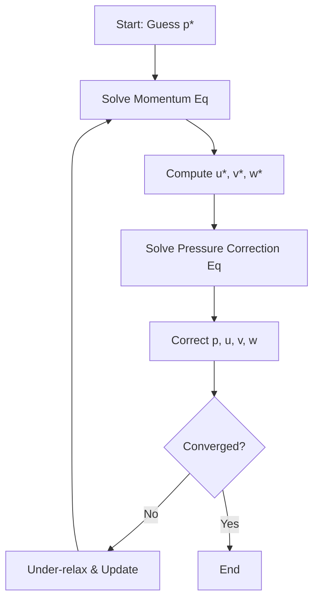
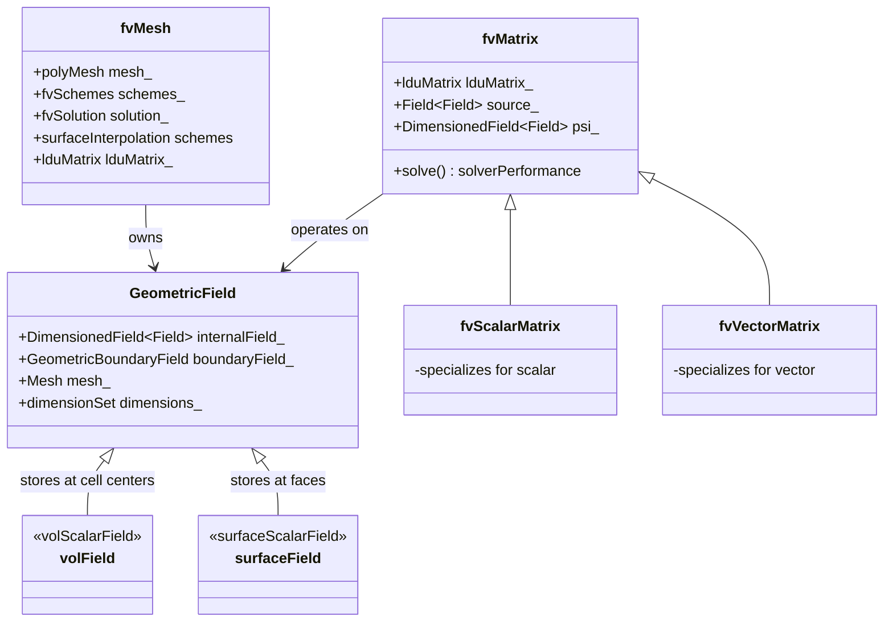

# Finite Volume Method & Discretization
## HARDCORE Level - 2026-01-02

---

## Table of Contents
- [1. Theory](#1-theory-core-equations--physics)
- [2. Class Hierarchy](#2-openfoam-class-hierarchy--implementation)
- [3. Code Walkthrough](#3-code-walkthrough)
- [4. Dictionary Analysis](#4-dictionary-analysis--configuration)
- [5. Practical Tasks](#5-hands-on-practical-tasks--coding)
- [6. Concept Checks](#6-concept-checks)

---

## 1. Theory: Core Equations & Physics {#1-theory-core-equations--physics}

### 1.1 General Transport Equation {#general-transport-equation}

The governing equation for most fluid dynamics and heat transfer problems is the **general transport equation** (สมการถ่ายเทกว้างทั่วไป):

$$
\frac{\partial (\rho \phi)}{\partial t} + \nabla \cdot (\rho \mathbf{u} \phi) = \nabla \cdot (\Gamma \nabla \phi) + S_\phi
$$

Where:
- $\phi$ (ไฟ) = **conserved quantity** (ปริมาณที่อนุรักษ์) - could be temperature, velocity component, concentration, etc.
- $\rho$ (rho) = **density** (ความหนาแน่น) of the fluid
- $\mathbf{u}$ = **velocity vector** (เวกเตอร์ความเร็ว)
- $\Gamma$ (Gamma) = **diffusion coefficient** (สัมประสิทธิ์การแพร่)
- $S_\phi$ = **source term** (เทอมต้นทาง) - represents sources or sinks

> [!INFO] **Physical Meaning (ความหมายทางฟิสิกส์)**
> - **Unsteady term** $\frac{\partial (\rho \phi)}{\partial t}$: Rate of change with time (อัตราการเปลี่ยนแปลงตามเวลา)
> - **Convection term** $\nabla \cdot (\rho \mathbf{u} \phi)$: Transport due to fluid motion (การถ่ายเทโดยการไหลของของไหล)
> - **Diffusion term** $\nabla \cdot (\Gamma \nabla \phi)$: Transport due to gradients (การถ่ายเทโดยความชัน)
> - **Source term** $S_\phi$: Generation or destruction (การเกิดหรือสูญสลาย)

---

### 1.2 Integral Form for Finite Volume Method {#integral-form-fvm}

The **Finite Volume Method** (วิธีปริมาตรจำกัด) starts from the **integral form** (รูปแบบปริพันธ์) of the conservation equation. Integrating over a **control volume** $V$ (ปริมาตรควบคุม):

$$
\int_V \frac{\partial (\rho \phi)}{\partial t} dV + \int_V \nabla \cdot (\rho \mathbf{u} \phi) dV = \int_V \nabla \cdot (\Gamma \nabla \phi) dV + \int_V S_\phi dV
$$

Applying **Gauss's Divergence Theorem** (ทฤษฎีบทเกาส์ ไดเวอร์เจนซ์):

$$
\int_V \nabla \cdot \mathbf{a} \, dV = \int_{\partial V} \mathbf{a} \cdot \mathbf{n} \, dA
$$

This converts **volume integrals** (ปริพันธ์ปริมาตร) to **surface integrals** (ปริพันธ์พื้นที่ผิว):

$$
\frac{\partial}{\partial t} \int_V \rho \phi dV + \oint_{\partial V} (\rho \mathbf{u} \phi) \cdot \mathbf{n} \, dA = \oint_{\partial V} (\Gamma \nabla \phi) \cdot \mathbf{n} \, dA + \int_V S_\phi dV
$$

Where:
- $\partial V$ = **surface boundary** (ขอบเขตผิว) of the control volume
- $\mathbf{n}$ = **unit normal vector** (เวกเตอร์หน้าปกติหน่วย) pointing outward
- $dA$ = **infinitesimal area** (พื้นที่เล็กๆ) element

> [!TIP] **Why FVM? (ทำไมต้องใช้ FVM?)**
> The integral form ensures **exact conservation** (การอนุรักษ์แบบแม่นยำ) of mass, momentum, and energy - crucial for CFD simulations!

---

### 1.3 Discretization: From Continuous to Discrete {#discretization-process}

**Discretization** (การกระจายค่า) converts the continuous integral equation into an **algebraic equation** (สมการเชิงพีชคณิต) for each cell.

For a typical cell $P$ with neighbors $N$:

$$
a_P \phi_P = \sum_{f} a_f \phi_f + b_P
$$

Where:
- $\phi_P$ = value at cell center **P** (จุดศูนย์กลางเซลล์)
- $\phi_f$ = value at face **f** (หน้าเซลล์)
- $a_P$ = **central coefficient** (สัมประสิทธิ์กลาง)
- $a_f$ = **neighbor coefficients** (สัมประสิทธิ์ข้างเคียง)
- $b_P$ = **source term contribution** (ส่วนของเทอมต้นทาง)

#### Discretized Terms:

| Term | Mathematical Form | Description |
|------|-------------------|-------------|
| **Temporal** (เวลา) | $\frac{\rho_P V_P (\phi_P - \phi_P^0)}{\Delta t}$ | Time derivative (อนุพันธ์เวลา) |
| **Convection** (การพา) | $\sum_f (\rho \mathbf{u} \phi)_f \cdot \mathbf{n}_f A_f$ | Flux across faces (การไหลผ่านหน้า) |
| **Diffusion** (การแพร่) | $\sum_f (\Gamma \nabla \phi)_f \cdot \mathbf{n}_f A_f$ | Gradient-driven flux (การไหลเนื่องจากความชัน) |
| **Source** (ต้นทาง) | $S_\phi V_P$ | Volume source (แหล่งกำเนิดในปริมาตร) |

---

### 1.4 Navier-Stokes Equations {#navier-stokes-equations}

For **incompressible flow** (การไหลแบบอัดตัวไม่ได้), the governing equations are:

#### Momentum Equation (สมการโมเมนตัม):

$$
\frac{\partial (\rho \mathbf{u})}{\partial t} + \nabla \cdot (\rho \mathbf{u} \mathbf{u}) = -\nabla p + \nabla \cdot (\mu \nabla \mathbf{u}) + \rho \mathbf{g}
$$

> [!NOTE] **Thai Terms (คำศัพท์ไทย)**
> - $-\nabla p$: **pressure gradient** (ความชันความดัน) - drives flow
> - $\mu$: **dynamic viscosity** (ความหนืด) - resists deformation
> - $\rho \mathbf{g}$: **gravity force** (แรงโน้มถ่วง) - body force

#### Continuity Equation (สมการต่อเนื่อง):

$$
\nabla \cdot \mathbf{u} = 0
$$

This enforces **mass conservation** (การอนุรักษ์มวล) - what flows in must flow out!

---

### 1.5 Discretization Schemes {#discretization-schemes}

OpenFOAM offers various **schemes** (รูปแบบการกระจายค่า) for evaluating face values $\phi_f$:

#### Convection Schemes (รูปแบบการพา):

| Scheme | Order | Stability | Thai Name |
|--------|-------|-----------|-----------|
| **Upwind** | First | Very stable | พาดลม (ขึ้นกระแส) |
| **Linear** | Second | Conditionally stable | เชิงเส้น |
| **QUICK** | Third | Less stable | รวดเร็ว |
| **Central Difference** | Second | Unstable without blending | ตรงกลาง |

```cpp
// OpenFOAM scheme specification in fvSchemes dictionary
divSchemes
{
    default         none;
    div(phi,U)      Gauss linearUpwind grad(U);  // Second-order upwind
    div(phi,k)      Gauss upwind;                 // First-order upwind
    div(phi,epsilon) Gauss upwind;
}
```

#### Diffusion Schemes (รูปแบบการแพร่):

$$
(\Gamma \nabla \phi)_f \cdot \mathbf{n}_f \approx \Gamma_f \frac{\phi_N - \phi_P}{|\mathbf{d}_{PN}|} A_f
$$

Where $\mathbf{d}_{PN}$ is the **distance vector** (เวกเตอร์ระยะห่าง) between cell centers.

> [!WARNING] **Non-Orthogonality (ความไม่ตั้งฉาก)**
> For **non-orthogonal meshes** (ตาข่ายไม่ตั้งฉาก), additional **correction terms** (เทอมแก้ไข) are needed!

---

### 1.6 Solution Algorithms {#solution-algorithms}

#### SIMPLE Algorithm (Semi-Implicit Method for Pressure-Linked Equations):



> [!INFO] **SIMPLE Steps (ขั้นตอน SIMPLE)**
> 1. **Guess pressure field** (ทายสนามความดัน) $p^*$
> 2. **Solve momentum** (แก้สมการโมเมนตัม) to get $\mathbf{u}^*$
> 3. **Solve pressure correction** (แก้สมการแก้ไขความดัน) $p'$
> 4. **Correct fields** (แก้ไขสนาม): $p = p^* + p'$, $\mathbf{u} = \mathbf{u}^* + \mathbf{u}'$
> 5. **Repeat** (ทำซ้ำ) until convergence

#### Pressure-Velocity Coupling (การเชื่อมโยงความดัน-ความเร็ว):

The **pressure correction equation** (สมการแก้ไขความดัน) derives from continuity:

$$
\nabla \cdot \left( \frac{1}{a_P} \nabla p' \right) = \nabla \cdot \mathbf{u}^*
$$

This is a **Poisson equation** (สมการปัวสซอง) for pressure correction!

---

### 1.7 Boundary Conditions {#boundary-conditions}

Common **boundary conditions** (เงื่อนไขขอบเขต) in OpenFOAM:

| Type | Mathematical Form | Thai | Usage |
|------|-------------------|------|-------|
| **Dirichlet** | $\phi = \phi_{wall}$ | ค่าคงที่ | Fixed value at wall |
| **Neumann** | $\frac{\partial \phi}{\partial n} = 0$ | ความชันศูนย์ | Zero gradient (outlet) |
| **Robin** | $a\phi + b\frac{\partial \phi}{\partial n} = c$ | ผสม | Convection boundary |

```cpp
// Example: OpenFOAM boundary condition specification
0/p
{
    type            fixedValue;
    value           uniform 0;          // Inlet: fixed pressure
}

0/U
{
    type            zeroGradient;       // Outlet: zero gradient
}
```

> [!TIP] **Wall Functions (ฟังก์ชันผนัง)**
> Near walls, use **wall functions** to avoid resolving the viscous sublayer (ชั้นไหลเวียนต่ำกว่า) directly!

---

### 1.8 Summary of Key Equations {#summary-equations}

| Equation | Vector Form | Discrete Form |
|----------|-------------|---------------|
| **General Transport** | $\frac{\partial (\rho \phi)}{\partial t} + \nabla \cdot (\rho \mathbf{u} \phi) = \nabla \cdot (\Gamma \nabla \phi) + S_\phi$ | $a_P \phi_P = \sum a_f \phi_f + b_P$ |
| **Continuity** | $\nabla \cdot \mathbf{u} = 0$ | $\sum_f \mathbf{u}_f \cdot \mathbf{n}_f A_f = 0$ |
| **Momentum** | $\frac{\partial (\rho \mathbf{u})}{\partial t} + \nabla \cdot (\rho \mathbf{u} \mathbf{u}) = -\nabla p + \nabla \cdot (\mu \nabla \mathbf{u})$ | $\mathbf{a}_P \mathbf{u}_P = \sum \mathbf{a}_f \mathbf{u}_f - \nabla p V_P$ |

> [!SUCCESS] **Key Takeaway (สรุปสำคัญ)**
> FVM converts PDEs → algebraic equations by integrating over control volumes and applying Gauss's theorem. The method **exactly conserves** fluxes across cell faces!

---

## 2. OpenFOAM Class Hierarchy & Implementation {#2-openfoam-class-hierarchy--implementation}

### 2.1 Core Finite Volume Classes {#core-fv-classes}

The Finite Volume Method in OpenFOAM is built upon several key classes (คลาสหลัก) that handle mesh discretization, field storage, and equation solving.



> [!INFO] **Class Locations (ตำแหน่งไฟล์)**
> All finite volume classes are located in `$FOAM_SRC/finiteVolume/` directory.

---

### 2.2 Mesh Classes {#mesh-classes}

#### fvMesh Class

The `fvMesh` class is the **central class** (คลาสกลาง) for finite volume operations. It extends `polyMesh` with FVM-specific data.

**Location:** `$FOAM_SRC/finiteVolume/fvMesh/fvMesh.H`

```cpp
// Key members of fvMesh
class fvMesh
:
    public polyMesh
{
    // Finite volume schemes
    fvSchemes schemes_;
    fvSolution solution_;
    
    // Surface interpolation
    surfaceInterpolation schemes_;
    
    // LDU matrix addressing
    lduAddressing lduAddr_;
    
    // Cell centers and face centers
    const volVectorField& C_;
    const surfaceVectorField& Cf_;
};
```

> [!TIP] **Thai Terms (คำศัพท์ไทย)**
> - **Cell centers** (จุดศูนย์กลางเซลล์): `C()` - returns cell center positions
> - **Face centers** (จุดศูนย์กลางหน้า): `Cf()` - returns face center positions
> - **Face normals** (เวกเตอร์ปกติหน้า): `Sf()` - returns face area vectors

#### polyMesh Class

The underlying **polyhedral mesh** (ตาข่ายหลายหน้า) class that stores topology.

**Location:** `$FOAM_SRC/meshes/polyMesh/polyMesh.H`

```cpp
class polyMesh
{
    // Points
    const pointField& points_;
    
    // Faces
    const faceList& faces_;
    
    // Cells
    const cellList& cells_;
    
    // Boundary patches
    const polyBoundaryMesh& boundary_;
};
```

---

### 2.3 Field Classes {#field-classes}

#### GeometricField Template

The **template base class** (คลาสเทมเพลตฐาน) for all fields in OpenFOAM.

**Location:** `$FOAM_SRC/finiteVolume/fields/GeometricField/GeometricField.H`

```cpp
template<class Type, class GeoMesh>
class GeometricField
:
    public DimensionedField<Type, GeoMesh>,
    public Field<GeometricField<Type, GeoMesh>>
{
    // Internal field (cell values)
    DimensionedField<Type, GeoMesh> internalField_;
    
    // Boundary field
    GeometricBoundaryField boundaryField_;
    
    // Reference to mesh
    const GeoMesh& mesh_;
    
    // Dimension set (e.g., kg/m/s^2)
    dimensionSet dimensions_;
};
```

> [!INFO] **Field Types (ประเภทของสนาม)**
> - **volScalarField**: Scalar at cell centers (สเกลาร์ที่จุดศูนย์กลางเซลล์)
> - **volVectorField**: Vector at cell centers (เวกเตอร์ที่จุดศูนย์กลางเซลล์)
> - **surfaceScalarField**: Scalar at faces (สเกลาร์ที่หน้าเซลล์) - e.g., flux $\phi$
> - **surfaceVectorField**: Vector at faces (เวกเตอร์ที่หน้าเซลล์)

#### volField Example

```cpp
// Creating a velocity field
volVectorField U
(
    IOobject
    (
        "U",                    // name
        runTime.timeName(),     // instance
        mesh,                   // mesh
        IOobject::MUST_READ,    // read option
        IOobject::AUTO_WRITE    // write option
    ),
    mesh
);

// Accessing internal field
U.internalField()[cellI] = vector(1, 0, 0);

// Accessing boundary field
U.boundaryField()[patchI][faceI] = vector(0, 0, 0);
```

---

### 2.4 Matrix Classes {#matrix-classes}

#### fvMatrix Class

The **finite volume matrix** (เมทริกซ์ปริมาตรจำกัด) class that represents the discretized equation:

$$a_P \phi_P = \sum_f a_f \phi_f + b_P$$

**Location:** `$FOAM_SRC/finiteVolume/fvMatrices/fvMatrix/fvMatrix.H`

```cpp
template<class Type>
class fvMatrix
:
    public lduMatrix
{
    // Coefficients matrix (LDU: Lower-Diagonal-Upper)
    lduMatrix lduMatrix_;
    
    // Source term
    Field<Field<Type>> source_;
    
    // Field being solved for
    DimensionedField<Type, volMesh>& psi_;
    
    // Boundary conditions
    GeometricBoundaryField& boundaryConditions_;
    
    // Solve the matrix
    solverPerformance solve(const dictionary&);
};
```

> [!WARNING] **LDU Format (รูปแบบ LDU)**
> OpenFOAM stores matrices in **sparse LDU format** (รูปแบบ LDUเบาบาง) for efficiency:
> - **L** (Lower): coefficients for neighbor cells with lower index
> - **D** (Diagonal): central coefficients $a_P$
> - **U** (Upper): coefficients for neighbor cells with higher index

#### fvScalarMatrix Example

```cpp
// Creating a convection-diffusion equation
fvScalarMatrix TEqn
(
    fvm::ddt(T)                          // Unsteady term
  + fvm::div(phi, T)                     // Convection
  - fvm::laplacian(DT, T)                // Diffusion
 ==
    fvOptions(T)                         // Source term
);

// Solve the equation
TEqn.solve();
```

---

### 2.5 Discretization Schemes {#discretization-schemes}

#### fvm vs fvs Namespace

OpenFOAM provides two namespaces for discretization:

| Namespace | Meaning | Returns | Thai |
|-----------|---------|---------|------|
| **fvm** | Finite Volume Method | **Implicit** matrix term | วิธีปริมาตรจำกัด (ภายในเมทริกซ์) |
| **fvs** | Finite Volume Source | **Explicit** scalar field | แหล่งกำเนิดปริมาตรจำกัด (ค่าชัดเจน) |

```cpp
// Implicit: adds to matrix (can be solved implicitly)
fvm::ddt(T)           // ∂T/∂t
fvm::div(phi, T)      // ∇·(uT)
fvm::laplacian(k, T)  // ∇·(k∇T)

// Explicit: evaluates to field (treated as source)
fvs::ddt(T)           // ∂T/∂t (explicit)
fvs::div(phi, T)      // ∇·(uT) (explicit)
```

> [!TIP] **When to Use? (เมื่อไหร่ใช้อะไร?)**
> - Use **fvm** for terms that should be **implicitly** solved (stable, larger time steps)
> - Use **fvs** for terms that are **explicitly** evaluated (simpler, but requires smaller time steps)

#### Gauss Convection Scheme

**Location:** `$FOAM_SRC/finiteVolume/finiteVolume/convectionSchemes/gaussConvectionScheme.H`

```cpp
// General convection scheme
template<class Type>
class gaussConvectionScheme
{
    // Interpolation scheme for face values
    tmp<surfaceInterpolationScheme<Type>> interpScheme_;
    
    // Calculate divergence
    tmp<GeometricField<Type, fvsPatchField, surfaceMesh>>
    div
    (
        const surfaceScalarField& phi,
        const GeometricField<Type, fvPatchField, volMesh>& vf
    );
};
```

---

### 2.6 Interpolation Schemes {#interpolation-schemes}

#### surfaceInterpolationScheme

Base class for **interpolating** (การแปลงค่า) from cell centers to faces.

**Location:** `$FOAM_SRC/finiteVolume/interpolation/surfaceInterpolation/surfaceInterpolationScheme/surfaceInterpolationScheme.H`

```cpp
template<class Type>
class surfaceInterpolationScheme
{
    // Interpolate cell field to face field
    tmp<GeometricField<Type, fvsPatchField, surfaceMesh>>
    interpolate(const GeometricField<Type, fvPatchField, volMesh>& vf) const;
    
    // Weights for interpolation
    tmp<surfaceScalarField> weights(const GeometricField<Type, fvPatchField, volMesh>&) const;
};
```

#### Common Schemes

| Scheme | Class | Formula | Thai |
|--------|-------|---------|------|
| **Upwind** | `upwind` | $\phi_f = \phi_P$ if $\phi_f > 0$ else $\phi_N$ | พาดลม |
| **Linear** | `linear` | $\phi_f = f_x \phi_P + (1-f_x) \phi_N$ | เชิงเส้น |
| **LinearUpwind** | `linearUpwind` | Uses gradient for higher order | เชิงเส้นพาดลม |
| **QUICK** | `QUICK` | Quadratic upstream | กำลังสามเร็ว |

```cpp
// Example: linear upwind scheme
template<class Type>
class linearUpwind
{
    // Gradient for correction
    tmp<volVectorField> gradVf_;
    
    // Interpolate using gradient
    tmp<GeometricField<Type, fvsPatchField, surfaceMesh>>
    interpolate(const GeometricField<Type, fvPatchField, volMesh>& vf) const
    {
        return
            surfaceInterpolationScheme<Type>::interpolate(vf)
          + correction(vf);
    }
};
```

---

### 2.7 Boundary Condition Classes {#boundary-condition-classes}

#### fvPatchField

Base class for all **finite volume boundary conditions** (เงื่อนไขขอบเขตปริมาตรจำกัด).

**Location:** `$FOAM_SRC/finiteVolume/fields/fvPatchFields/fvPatchField/fvPatchField.H`

```cpp
template<class Type>
class fvPatchField
:
    public Field<Type>
{
    // Reference to patch
    const fvPatch& patch_;
    
    // Reference to internal field
    const DimensionedField<Type, volMesh>& internalField_;
    
    // Update coefficients
    virtual void updateCoeffs();
    
    // Evaluate patch field
    virtual void evaluate(const Pstream::commsTypes commsType);
};
```

#### Common Boundary Conditions

| BC Type | Class | Description | Thai |
|---------|-------|-------------|------|
| **fixedValue** | `fixedValueFvPatchField` | Dirichlet: $\phi = \phi_{wall}$ | ค่าคงที่ |
| **zeroGradient** | `zeroGradientFvPatchField` | Neumann: $\partial\phi/\partial n = 0$ | ความชันศูนย์ |
| **fixedGradient** | `fixedGradientFvPatchField` | Neumann: $\partial\phi/\partial n = g$ | ความชันคงที่ |
| **mixed** | `mixedFvPatchField` | Robin: $a\phi + b\partial\phi/\partial n = c$ | ผสม |

```cpp
// Example: fixedValue implementation
template<class Type>
class fixedValueFvPatchField
:
    public fvPatchField<Type>
{
    // Update coefficients
    virtual void updateCoeffs()
    {
        if (this->updated())
        {
            return;  // Already updated
        }
        
        // Set value directly (no matrix contribution)
        fvPatchField<Type>::operator==(this->patchInternalField());
        
        fvPatchField<Type>::updateCoeffs();
    }
};
```

---

### 2.8 Solver Classes {#solver-classes}

#### lduMatrix Solver

The **linear solver** (ตัวแก้สมการเชิงเส้น) hierarchy for sparse matrices.

**Location:** `$FOAM_SRC/matrices/lduMatrix/lduMatrix.H`

```cpp
class lduMatrix
{
    // Solve using specified solver
    template<class Type>
    solverPerformance solve
    (
        Field<Type>& psi,
        const Field<Type>& source,
        const Field<Field<scalar>>& bouCoeffs,
        const Field<Field<scalar>>& intCoeffs,
        Istream& solverData
    ) const;
};
```

#### Common Solvers

| Solver | Class | Matrix Type | Thai |
|--------|-------|-------------|------|
| **GAMG** | `GAMGSolver` | Geometric Algebraic Multi-Grid | เรขาคณิตพีชคณิตตาราง |
| **PCG** | `PCGSolver` | Preconditioned Conjugate Gradient | ไล่ระดับสังเคราะห์ล่วงหน้า |
| **PBiCGStab** | `PBiCGStabSolver` | Preconditioned Bi-Conjugate Gradient Stabilized | ไบสังเคราะห์เกรเดียนต์เสถียรล่วงหน้า |
| **smoothSolver** | `smoothSolver` | Simple iterative smoother | ทำให้เรียบซ้ำ |

> [!INFO] **Solver Selection (การเลือกตัวแก้)**
> - **Symmetric matrices** (เมทริกซ์สมมาตร): Use PCG or GAMG
> - **Asymmetric matrices** (เมทริกซ์ไม่สมมาตร): Use PBiCGStab
> - **Large problems** (ปัญหาใหญ่): Use GAMG for faster convergence

---

### 2.9 Class Reference Summary {#class-reference-summary}

| Class | Header File | Purpose | Thai |
|-------|-------------|---------|------|
| **fvMesh** | `fvMesh.H` | Finite volume mesh | ตาข่ายปริมาตรจำกัด |
| **volScalarField** | `volScalarField.H` | Scalar at cell centers | สเกลาร์จุดศูนย์กลาง |
| **volVectorField** | `volVectorField.H` | Vector at cell centers | เวกเตอร์จุดศูนย์กลาง |
| **surfaceScalarField** | `surfaceScalarField.H` | Scalar at faces | สเกลาร์หน้าเซลล์ |
| **fvMatrix** | `fvMatrix.H` | Discretized equation matrix | เมทริกซ์สมการกระจาย |
| **fvm::** | `fvm.H` | Implicit discretization | การกระจายภายใน |
| **fvs::** | `fvs.H` | Explicit discretization | การกระจายภายนอก |
| **fvPatchField** | `fvPatchField.H` | Boundary condition base | ฐานเงื่อนไขขอบเขต |

> [!SUCCESS] **Key Takeaway (สรุปสำคัญ)**
> The FVM class hierarchy separates **mesh topology** (`polyMesh`), **field storage** (`GeometricField`), **discretization** (`fvMatrix`), and **boundary conditions** (`fvPatchField`) for modularity and extensibility!

---

## 3. Code Walkthrough {#3-code-walkthrough}

### 3.1 fvMesh.H

The `fvMesh` class is the **central class** (คลาสกลาง) for finite volume operations in OpenFOAM. It extends `polyMesh` with FVM-specific data structures and methods.

**Location:** `$FOAM_SRC/finiteVolume/fvMesh/fvMesh.H`

#### Key Class Definition

```cpp
class fvMesh
:
    public polyMesh
{
    // Private data

        //- Finite volume schemes
        fvSchemes schemes_;

        //- Finite volume solution dictionary
        fvSolution solution_;

        //- Surface interpolation scheme
        surfaceInterpolation schemes_;

        //- LDU matrix addressing
        lduAddressing lduAddr_;

        //- Cell centres [m]
        const volVectorField& C_;

        //- Face centres [m]
        const surfaceVectorField& Cf_;

        //- Face area normals [m^2]
        const surfaceVectorField& Sf_;
};
```

> [!INFO] **คำอธิบาย (Explanation)**
> - `fvSchemes schemes_`: เก็บ **รูปแบบการกระจายค่า** (discretization schemes) จากไฟล์ `system/fvSchemes`
> - `fvSolution solution_`: เก็บ **การตั้งค่าตัวแก้สมการ** (solver settings) จากไฟล์ `system/fvSolution`
> - `C_`: จุดศูนย์กลางเซลล์ (cell centers) - เวกเตอร์ตำแหน่งของแต่ละเซลล์
> - `Cf_`: จุดศูนย์กลางหน้าเซลล์ (face centers) - เวกเตอร์ตำแหน่งของแต่ละหน้า
> - `Sf_`: เวกเตอร์พื้นที่หน้า (face area vectors) - เวกเตอร์ขนาดเท่ากับพื้นที่หน้า ทิศทางตั้งฉากกับหน้า

#### Constructor

```cpp
// Construct from IOobject
fvMesh::fvMesh(const IOobject& io)
:
    polyMesh(io),
    schemes_(*this),
    solution_(*this),
    schemes_(*this),
    lduAddr_(*this),
    C_
    (
        IOobject
        (
            "C",
            this->instance(),
            this->thisDb(),
            IOobject::READ_IF_PRESENT,
            IOobject::AUTO_WRITE
        ),
        *this,
        dimLength
    ),
    Cf_(surfaceVectorField::New(*this)),
    Sf_(surfaceVectorField::New(*this))
{
    // ... initialization code
}
```

> [!TIP] **การเริ่มต้น (Initialization)**
> Constructor สร้าง `fvMesh` จาก `polyMesh` และเริ่มต้น:
> - **สนามเวกเตอร์** (vector fields) สำหรับตำแหน่งจุดศูนย์กลางและหน้าเซลล์
> - **รูปแบบการแปลงค่า** (interpolation schemes) สำหรับคำนวณค่าที่หน้าเซลล์
> - **การแก้ไข** (addressing) สำหรับเมทริกซ์ LDU

#### Key Methods

```cpp
// Access cell centres
const volVectorField& C() const
{
    return C_;
}

// Access face centres
const surfaceVectorField& Cf() const
{
    return Cf_;
}

// Access face area normals
const surfaceVectorField& Sf() const
{
    return Sf_;
}

// Access surface interpolation scheme
const surfaceInterpolation& schemes() const
{
    return schemes_;
}

// Calculate and return magSf (face area magnitudes)
tmp<surfaceScalarField> magSf() const
{
    return mag(Sf_);
}
```

> [!WARNING] **ข้อควรระวัง (Caution)**
> - `Sf()` คืนค่า **เวกเตอร์** (vector) ที่มีทิศทางตั้งฉากกับหน้าเซลล์
> - `magSf()` คืนค่า **สเกลาร์** (scalar) ที่เป็นขนาดพื้นที่หน้าเซลล์เท่านั้น
> - ใช้ `Sf()` สำหรับการคำนวณ **flux** (การไหลผ่านหน้า): $\phi_f = \mathbf{u}_f \cdot \mathbf{S}_f$

#### Usage Example

```cpp
// Create mesh
fvMesh mesh
(
    IOobject
    (
        fvMesh::defaultRegion,
        runTime.timeName(),
        runTime,
        IOobject::MUST_READ
    )
);

// Access cell centers
const volVectorField& cellCentres = mesh.C();

// Access face area vectors
const surfaceVectorField& faceAreas = mesh.Sf();

// Calculate face flux
surfaceScalarField phi = fvc::flux(U);
```

> [!SUCCESS] **สรุป (Summary)**
> `fvMesh` เป็นคลาสหลักที่เชื่อมโยง **ตาข่าย** (mesh) กับ **สนาม** (fields) และ **สมการ** (equations) ใน OpenFOAM มันเก็บข้อมูลเรขาคณิตที่จำเป็นสำหรับการกระจายค่าและการแก้สมการ!

---

### 3.2 fvSchemes.H

The `fvSchemes` class manages **discretization schemes** (รูปแบบการกระจายค่า) used in the finite volume method. It reads and stores scheme settings from the `system/fvSchemes` dictionary.

**Location:** `$FOAM_SRC/finiteVolume/fvSchemes/fvSchemes.H`

#### Key Class Definition

```cpp
class fvSchemes
{
    // Private data

        //- Reference to mesh
        const fvMesh& mesh_;

        //- Schemes dictionary
        dictionary schemesDict_;

        //- DDT schemes (time derivatives)
        ddtSchemes ddtSchemes_;

        //- Gradient schemes
        gradSchemes gradSchemes_;

        //- Div schemes (convection)
        divSchemes divSchemes_;

        //- Laplacian schemes (diffusion)
        laplacianSchemes laplacianSchemes_;

        //- Interpolation schemes
        interpolationSchemes interpolationSchemes_;

        //- SnGrad schemes (surface normal gradient)
        snGradSchemes snGradSchemes_;
};
```

> [!INFO] **คำอธิบาย (Explanation)**
> - `ddtSchemes_`: รูปแบบการกระจายค่า **อนุพันธ์เวลา** (time derivative) - เช่น `Euler`, `backward`
> - `gradSchemes_`: รูปแบบการกระจายค่า **เกรเดียนต์** (gradient) - เช่น `Gauss linear`
> - `divSchemes_`: รูปแบบการกระจายค่า **การพา** (convection/divergence) - เช่น `Gauss upwind`
> - `laplacianSchemes_`: รูปแบบการกระจายค่า **การแพร่** (diffusion/Laplacian) - เช่น `Gauss linear corrected`
> - `interpolationSchemes_`: รูปแบบการแปลงค่าจากจุดศูนย์กลางเซลล์ไปหน้าเซลล์

#### Constructor and Scheme Access

```cpp
// Construct from mesh and read schemes dictionary
fvSchemes::fvSchemes(const fvMesh& mesh)
:
    mesh_(mesh),
    schemesDict_
    (
        IOobject
        (
            "fvSchemes",
            mesh.time().system(),
            mesh,
            IOobject::MUST_READ,
            IOobject::NO_WRITE
        )
    ),
    ddtSchemes_(schemesDict_.subDict("ddtSchemes")),
    gradSchemes_(schemesDict_.subDict("gradSchemes")),
    divSchemes_(schemesDict_.subDict("divSchemes")),
    laplacianSchemes_(schemesDict_.subDict("laplacianSchemes")),
    interpolationSchemes_(schemesDict_.subDict("interpolationSchemes")),
    snGradSchemes_(schemesDict_.subDict("snGradSchemes"))
{}

// Access div schemes
const divSchemes& div() const
{
    return divSchemes_;
}

// Access laplacian schemes
const laplacianSchemes& laplacian() const
{
    return laplacianSchemes_;
}
```

> [!TIP] **การใช้งาน (Usage)**
> คลาสนี้ถูกเรียกโดยอัตโนมัติเมื่อสร้าง `fvMesh` และใช้โดยฟังก์ชัน `fvm::` และ `fvc::` เพื่อเลือกรูปแบบการกระจายค่าที่เหมาะสมจากไฟล์ `system/fvSchemes`

#### Example: system/fvSchemes Dictionary

```cpp
// Example fvSchemes dictionary file
ddtSchemes
{
    default         Euler;                       // First-order implicit
}

gradSchemes
{
    default         Gauss linear;                // Linear gradient reconstruction
}

divSchemes
{
    default         none;
    div(phi,U)      Gauss linearUpwind grad(U); // Second-order upwind
    div(phi,k)      Gauss upwind;                // First-order upwind
}

laplacianSchemes
{
    default         Gauss linear corrected;      // With non-orthogonal correction
}

snGradSchemes
{
    default         corrected;                   // Non-orthogonal correction
}
```

> [!WARNING] **ข้อควรระวัง (Caution)**
> - การเลือกรูปแบบการกระจายค่าที่ **สูงเกินไป** (higher-order) อาจทำให้เกิด **oscillations** (การสั่น) หรือไม่เสถียร
> - รูปแบบ `corrected` จำเป็นสำหรับ **ตาข่ายที่ไม่ตั้งฉาก** (non-orthogonal meshes) เพื่อความแม่นยำ
> - ใช้ `default` เพื่อตั้งค่ารูปแบบทั่วไป แต่สามารถ override สำหรับแต่ละสนามได้

> [!SUCCESS] **สรุป (Summary)**
> `fvSchemes` เป็นคลาสที่อ่านและจัดการ **การตั้งค่ารูปแบบการกระจายค่า** ทั้งหมดจากไฟล์ `system/fvSchemes` และให้การเข้าถึงรูปแบบต่างๆ แก่ `fvMatrix` และฟังก์ชันการกระจายค่าอื่นๆ

### 3.3 fvSolution.H

The `fvSolution` class manages **solution algorithms** (อัลกอริทึมการแก้สมการ) and **solver settings** (การตั้งค่าตัวแก้สมการ) for the finite volume method. It reads configuration from the `system/fvSolution` dictionary.

**Location:** `$FOAM_SRC/finiteVolume/fvSolution/fvSolution.H`

#### Key Class Definition

```cpp
class fvSolution
{
    // Private data

        //- Reference to mesh
        const fvMesh& mesh_;

        //- Solution dictionary
        dictionary solutionDict_;

        //- Solvers dictionary
        solvers solvers_;

        //- Algorithms dictionary
        algorithms algorithms_;

        //- Solution schemes
        solutionScheme schemes_;
};
```

> [!INFO] **คำอธิบาย (Explanation)**
> - `solvers_`: เก็บ **การตั้งค่าตัวแก้สมการเชิงเส้น** (linear solver settings) - เช่น `GAMG`, `PCG`, `PBiCGStab`
> - `algorithms_`: เก็บ **อัลกอริทึมการแก้สมการ** (solution algorithms) - เช่น `SIMPLE`, `PISO`, `PIMPLE`
> - `schemes_`: เก็บ **รูปแบบการแก้สมการ** (solution schemes) - เช่น การผ่อนคลาย (under-relaxation)

#### Constructor and Solver Access

```cpp
// Construct from mesh and read solution dictionary
fvSolution::fvSolution(const fvMesh& mesh)
:
    mesh_(mesh),
    solutionDict_
    (
        IOobject
        (
            "fvSolution",
            mesh.time().system(),
            mesh,
            IOobject::MUST_READ,
            IOobject::NO_WRITE
        )
    ),
    solvers_(solutionDict_.subDict("solvers")),
    algorithms_(solutionDict_.subDict("algorithms")),
    schemes_(solutionDict_)
{}

// Access solvers dictionary
const solvers& solverDict() const
{
    return solvers_;
}
```

> [!TIP] **การใช้งาน (Usage)**
> คลาสนี้ถูกเรียกโดยอัตโนมัติเมื่อสร้าง `fvMesh` และใช้โดย `fvMatrix::solve()` เพื่อเลือกตัวแก้สมการและพารามิเตอร์ที่เหมาะสม

#### Example: system/fvSolution Dictionary

```cpp
// Example fvSolution dictionary file
solvers
{
    p
    {
        solver          GAMG;
        tolerance       1e-06;
        relTol          0.1;
        smoother        GaussSeidel;
    }

    pFinal
    {
        $p;
        relTol          0;
    }
}

SIMPLE
{
    nNonOrthogonalCorrectors 0;
    
    consistent      yes;
    
    residualControl
    {
        p               1e-4;
        U               1e-4;
    }
}

relaxationFactors
{
    fields
    {
        p               0.3;
        rho             1;
    }
    equations
    {
        U               0.7;
    }
}
```

> [!WARNING] **ข้อควรระวัง (Caution)**
> - `tolerance` คือ **ความคลาดเคลื่อนสัมบูรณ์** (absolute tolerance) - ค่าความคลาดเคลื่อนสูงสุดที่ยอมรับได้
> - `relTol` คือ **ความคลาดเคลื่อนสัมพัทธ์** (relative tolerance) - ค่าความคลาดเคลื่อนเทียบกับค่าเริ่มต้นของรอบการทำซ้ำ
> - `pFinal` ใช้สำหรับ **รอบสุดท้าย** (final iteration) ของ time step โดยปกติตั้ง `relTol` เป็น 0 เพื่อให้ลู่เข้าสู่ค่าที่แม่นยำ

> [!SUCCESS] **สรุป (Summary)**
> `fvSolution` เป็นคลาสที่อ่านและจัดการ **การตั้งค่าการแก้สมการ** ทั้งหมดจากไฟล์ `system/fvSolution` รวมถึงตัวแก้สมการเชิงเส้น อัลกอริทึมความดัน-ความเร็ว และตัวปรับค่าผ่อนคลาย

---

## 4. Dictionary Analysis & Configuration {#4-dictionary-analysis--configuration}

<!-- PLACEHOLDER_DICT -->

---

## 5. Hands-on: Practical Tasks & Coding {#5-hands-on-practical-tasks--coding}

<!-- PLACEHOLDER_TASKS -->

---

## 6. Concept Checks {#6-concept-checks}

<!-- PLACEHOLDER_CHECKS -->

---

## Recommended Reading

- OpenFOAM User Guide: https://www.openfoam.com/documentation/user-guide
- OpenFOAM Programmer's Guide: https://doc.openfoam.com/
- CFD Online Forum: https://www.cfd-online.com/Forums/openfoam/

