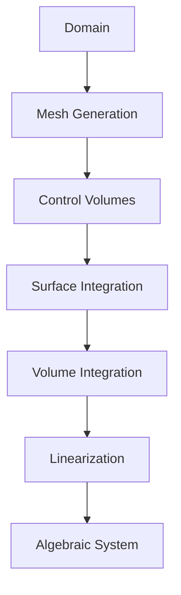
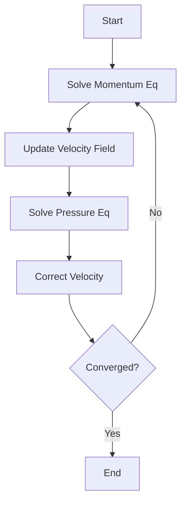
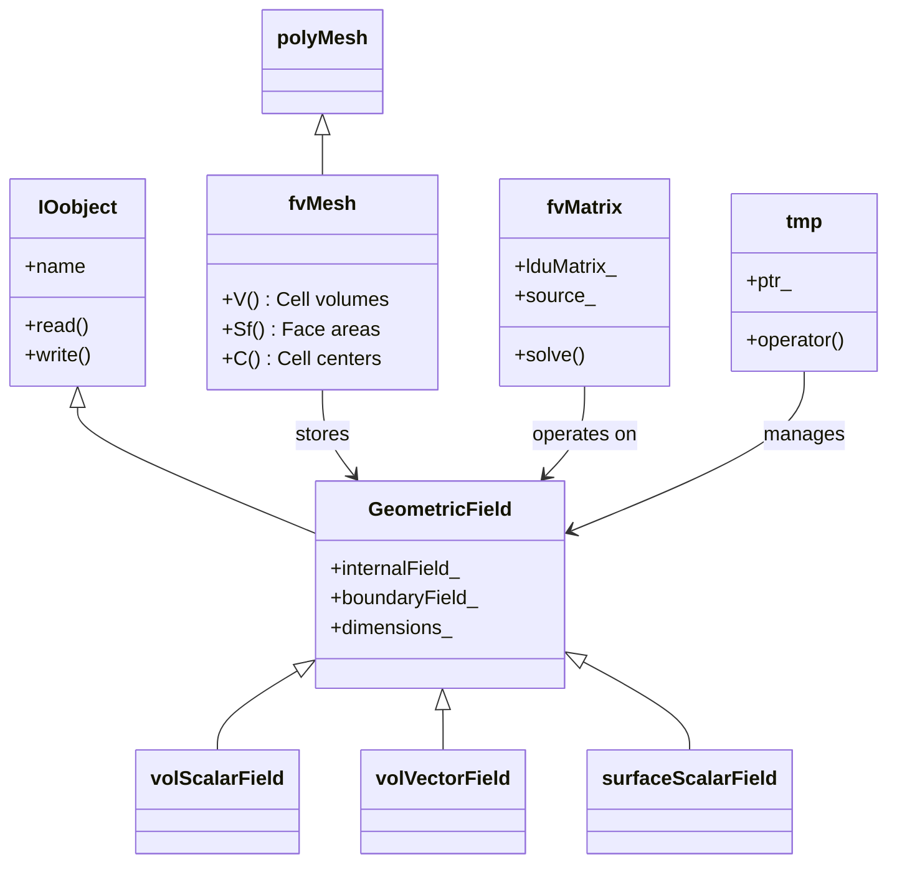
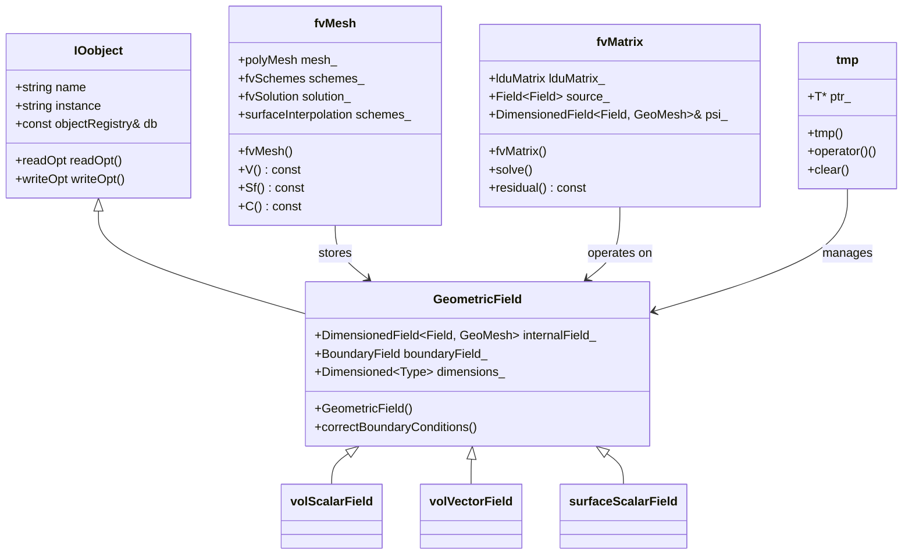
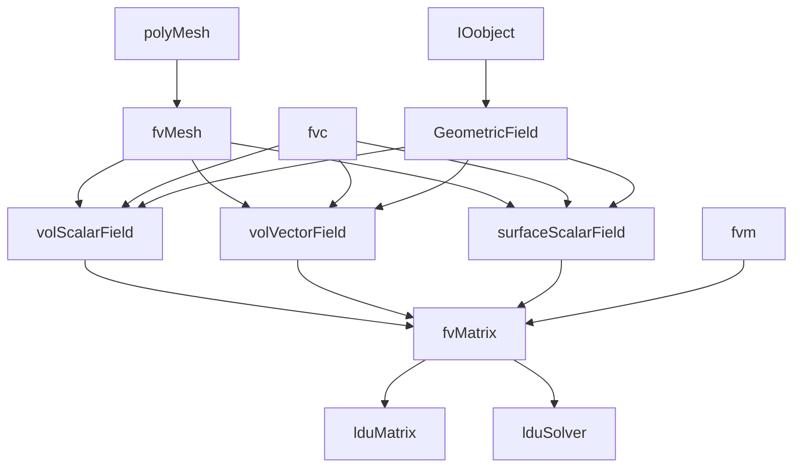
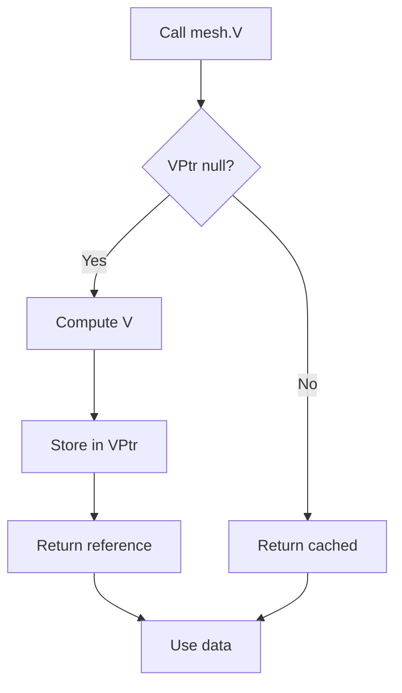

# Finite Volume Method & Discretization
## HARDCORE Level - 2026-01-02

---

## Table of Contents
- [1. Theory](#1-theory-core-equations--physics)
- [2. Class Hierarchy](#2-openfoam-class-hierarchy--implementation)
- [3. Code Walkthrough](#3-code-walkthrough)
- [4. Dictionary Analysis](#4-dictionary-analysis--configuration)
- [5. Practical Tasks](#5-hands-on-practical-tasks--coding)
- [6. Concept Checks](#6-concept-checks)

---

## 1. Theory: Core Equations & Physics {#1-theory-core-equations--physics}

### 1.1 Governing Equations of Fluid Motion

The fundamental equations governing fluid flow are derived from three conservation principles:

> [!INFO] **Conservation Laws (กฎการอนุรักษ์)**
> - Mass (มวล) - Continuity Equation
> - Momentum (โมเมนตัม) - Newton's Second Law
> - Energy (พลังงาน) - First Law of Thermodynamics

#### 1.1.1 Continuity Equation (Mass Conservation)

$$\frac{\partial \rho}{\partial t} + \nabla \cdot (\rho \mathbf{U}) = 0$$

**Terms explained:**
- $\rho$: Density (ความหนาแน่น) [kg/m³]
- $\mathbf{U}$: Velocity vector (เวกเตอร์ความเร็ว) [m/s]
- $\nabla \cdot$: Divergence operator (ตัวดำเนินการไดเวอร์เจนซ์)
- $t$: Time (เวลา) [s]

For incompressible flow ($\rho = \text{constant}$):
$$\nabla \cdot \mathbf{U} = 0$$

#### 1.1.2 Momentum Equation (Navier-Stokes)

$$\frac{\partial (\rho \mathbf{U})}{\partial t} + \nabla \cdot (\rho \mathbf{U} \mathbf{U}) = -\nabla p + \nabla \cdot \boldsymbol{\tau} + \rho \mathbf{g}$$

**Terms explained:**
- $p$: Pressure (ความดัน) [Pa]
- $\boldsymbol{\tau}$: Stress tensor (เทนเซอร์ความเค้น) [Pa]
- $\mathbf{g}$: Gravitational acceleration (ความเร่งเนื่องจากแรงโน้มถ่วง) [m/s²]
- $\rho \mathbf{U} \mathbf{U}$: Convective flux (การไหลแบบเนื่อง) - nonlinear term

> [!WARNING] **Nonlinearity Warning**
> The convective term $\nabla \cdot (\rho \mathbf{U} \mathbf{U})$ makes the Navier-Stokes equations extremely difficult to solve analytically. This is why we need numerical methods like FVM.

For Newtonian fluids with constant viscosity:
$$\boldsymbol{\tau} = \mu \left[ \nabla \mathbf{U} + (\nabla \mathbf{U})^T - \frac{2}{3}(\nabla \cdot \mathbf{U})\mathbf{I} \right]$$

Where $\mu$ is dynamic viscosity (ความหนืด) [Pa·s].

#### 1.1.3 General Transport Equation

All conservation laws can be written in the general form:

$$\frac{\partial (\rho \phi)}{\partial t} + \nabla \cdot (\rho \mathbf{U} \phi) = \nabla \cdot (\Gamma_\phi \nabla \phi) + S_\phi$$

**Terms explained:**
- $\phi$: Transported property (คุณสมบัติที่ถูกถ่ายโอน) - can be $1$, $\mathbf{U}$, $T$, etc.
- $\Gamma_\phi$: Diffusion coefficient (สัมประสิทธิ์การแพร่)
- $S_\phi$: Source term (เทอมแหล่งกำเนิด)

---

### 1.2 Finite Volume Method Fundamentals

#### 1.2.1 Integral Form

The FVM starts from the integral form of the general transport equation over a control volume $V$:

$$\int_V \frac{\partial (\rho \phi)}{\partial t} dV + \oint_A \mathbf{n} \cdot (\rho \mathbf{U} \phi) dA = \oint_A \mathbf{n} \cdot (\Gamma_\phi \nabla \phi) dA + \int_V S_\phi dV$$

**Key concept:** Divide the domain into discrete control volumes (CVs) and apply conservation laws to each CV.

> [!TIP] **Why FVM? (ทำไมต้องใช้ FVM?)**
> - **Conservative by design** (อนุรักษ์โดยสภาพ): Fluxes leaving one CV enter neighboring CV
> - **Handles complex geometries** (รองรับเรขาคณิตที่ซับซ้อน) well
> - **Physically intuitive** (เข้าใจได้ง่ายจากภาพ): Based on actual physical conservation

#### 1.2.2 Discretization Process

The discretization converts the integral equation into an algebraic equation:

$$a_P \phi_P = \sum_{f} a_f \phi_f + b_P$$

**Discretization steps:**



#### 1.2.3 Temporal Discretization

For transient simulations, we discretize the time derivative:

$$\frac{\partial (\rho \phi)}{\partial t} \approx \frac{(\rho \phi)^{n+1} - (\rho \phi)^n}{\Delta t}$$

**Common schemes:**
- **Euler Explicit**: $\phi^{n+1} = \phi^n + \Delta t \cdot R(\phi^n)$
- **Euler Implicit**: $\phi^{n+1} = \phi^n + \Delta t \cdot R(\phi^{n+1})$
- **Crank-Nicolson**: $\phi^{n+1} = \phi^n + \frac{\Delta t}{2}[R(\phi^n) + R(\phi^{n+1})]$

> [!INFO] **Stability Considerations (การพิจารณาเสถียรภาพ)**
> - Explicit schemes: Conditionally stable (CFL condition)
> - Implicit schemes: Unconditionally stable but require iterative solution

#### 1.2.4 Spatial Discretization: Convection Terms

The convective flux at face $f$ requires special treatment:

$$F_f^C = (\rho \mathbf{U} \phi)_f \cdot \mathbf{A}_f$$

**Upwind Schemes:**

| Scheme | Formula | Stability | Accuracy |
|--------|---------|-----------|----------|
| First-Order Upwind | $\phi_f = \phi_{upwind}$ | Very stable | 1st order (diffusive) |
| Central Differencing | $\phi_f = 0.5(\phi_P + \phi_N)$ | Conditionally stable | 2nd order |
| QUICK | Quadratic interpolation | Conditionally stable | 3rd order |
| Linear Upwind | $\phi_f = \phi_{upwind} + \nabla\phi \cdot \mathbf{d}$ | Stable | 2nd order |

> [!WARNING] **Numerical Diffusion (การแพร่ตัวเชิงตัวเลข)**
> First-order upwind schemes introduce false diffusion, smearing sharp gradients. Use higher-order schemes for accurate results.

#### 1.2.5 Spatial Discretization: Diffusion Terms

The diffusive flux uses Gauss's theorem:

$$F_f^D = (\Gamma_\phi \nabla \phi)_f \cdot \mathbf{A}_f$$

**Non-orthogonal correction:**

For non-orthogonal meshes, we decompose the gradient:

$$\nabla \phi = \underbrace{\frac{\phi_N - \phi_P}{|\mathbf{d}|} \mathbf{n}}_{\text{orthogonal}} + \underbrace{(\nabla \phi - (\nabla \phi \cdot \mathbf{n})\mathbf{n})}_{\text{correction}}$$

Where $\mathbf{d}$ is the distance vector between cell centers.

#### 1.2.6 Pressure-Velocity Coupling

The pressure-velocity coupling is critical in incompressible flows. Common algorithms:



**SIMPLE Algorithm (Semi-Implicit Method for Pressure-Linked Equations):**

1. Guess pressure field $p^*$
2. Solve momentum equations for $\mathbf{U}^*$
3. Solve pressure correction equation for $p'$
4. Correct pressure: $p = p^* + p'$
5. Correct velocity: $\mathbf{U} = \mathbf{U}^* + \mathbf{U}'$
6. Repeat until convergence

> [!TIP] **OpenFOAM Implementation**
> OpenFOAM uses the **PIMPLE** algorithm (merged PISO-SIMPLE) which combines:
> - **PISO** (Pressure Implicit with Splitting of Operators) for transient accuracy
> - **SIMPLE** for steady-state convergence

---

### 1.3 Discretization Schemes in OpenFOAM

OpenFOAM provides various discretization schemes specified in `fvSchemes`:

#### 1.3.1 Temporal Schemes

```foam
ddtSchemes
{
    default         Euler;          // First-order implicit
    // default         backward;       // Second-order implicit
    // default         CrankNicolson 1; // Second-order, 0-1 blending
}
```

#### 1.3.2 Gradient Schemes

```foam
gradSchemes
{
    default         Gauss linear;    // Central differencing
    // default         Gauss upwind;    // Upwind-biased
    // default         leastSquares;    // Least squares reconstruction
}
```

#### 1.3.3 Divergence Schemes (Convection)

```foam
divSchemes
{
    default         none;
    div(phi,U)      Gauss upwind;           // First-order
    // div(phi,U)      Gauss linearUpwind grad(U); // Second-order
    // div(phi,U)      Gauss limitedLinearV 1;     // TVD scheme
    // div(phi,k)      Gauss limitedLinear 1;
    // div(phi,epsilon) Gauss limitedLinear 1;
}
```

> [!INFO] **TVD Schemes (Total Variation Diminishing)**
> TVD schemes prevent non-physical oscillations near discontinuities using limiters:
> - **van Leer**: Smooth limiter
> - **minmod**: Most diffusive
> - **superbee**: Least diffusive
> - **MUSCL**: Monotone Upstream-centered Scheme

#### 1.3.4 Laplacian Schemes (Diffusion)

```foam
laplacianSchemes
{
    default         Gauss linear corrected;
    // default         Gauss linear uncorrected;
    // default         Gauss limited 0.5;  // Limited for stability
}
```

The `corrected` option adds non-orthogonal correction for better accuracy on skewed meshes.

#### 1.3.5 Interpolation Schemes

```foam
interpolationSchemes
{
    default         linear;
    // default         upwind;         // For convective terms
    // default         cubic;          // Third-order accurate
    // default         cellPoint;      // Cell-to-point interpolation
}
```

---

### 1.4 Solution Algorithms and Linear Solvers

#### 1.4.1 System of Algebraic Equations

After discretization, we obtain a sparse linear system:

$$[A]\{\phi\} = \{b\}$$

Where:
- $[A]$: Coefficient matrix (sparse, often non-symmetric)
- $\{\phi\}$: Solution vector
- $\{b\}$: Source vector

#### 1.4.2 Iterative Solvers

OpenFOAM supports various solvers specified in `fvSolution`:

```foam
solvers
{
    p
    {
        solver          GAMG;
        tolerance       1e-06;
        relTol          0.01;
        smoother        GaussSeidel;
    }

    "(U|k|epsilon|omega)"
    {
        solver          smoothSolver;
        smoother        GaussSeidel;
        tolerance       1e-05;
        relTol          0.1;
    }
}
```

**Common solvers:**

| Solver | Description | Best For |
|--------|-------------|----------|
| **GAMG** | Geometric-Algebraic Multi-Grid | Pressure equation (Poisson-type) |
| **smoothSolver** | Smoothed iterative method | Momentum equations |
| **PCG** | Preconditioned Conjugate Gradient | Symmetric matrices |
| **PBiCGStab** | Preconditioned BiCG Stabilized | Non-symmetric matrices |
| **simple** | Simple iterative | Small problems |

> [!TIP] **Solver Selection (การเลือก Solver)**
> - Use **GAMG** for pressure: $O(N)$ complexity with good convergence
> - Use **smoothSolver** for velocity: Robust for coupled systems
> - Adjust **tolerance** and **relTol** for balance between accuracy and speed

#### 1.4.3 Under-Relaxation

For steady-state simulations, under-relaxation prevents divergence:

```foam
relaxationFactors
{
    fields
    {
        p               0.3;    // Pressure: strong relaxation
        rho             0.05;   // Density: very strong for compressible
    }
    equations
    {
        U               0.7;    // Momentum: moderate
        k               0.7;    // Turbulence kinetic energy
        epsilon         0.7;    // Dissipation rate
    }
}
```

The update formula: $\phi^{new} = \phi^{old} + \alpha (\phi^* - \phi^{old})$

Where $\alpha$ is the relaxation factor ($0 < \alpha \leq 1$).

---

### 1.5 Boundary Conditions and Discretization

#### 1.5.1 Boundary Face Discretization

Boundary faces require special treatment since there's no neighbor cell:

$$a_P \phi_P = \sum_{nb} a_{nb} \phi_{nb} + a_b \phi_b + b_P$$

**Common boundary conditions:**

| Type | Mathematical Form | OpenFOAM Keyword |
|------|-------------------|------------------|
| Dirichlet | $\phi_b = \phi_{specified}$ | `fixedValue` |
| Neumann | $(\nabla \phi)_b \cdot \mathbf{n} = q_{specified}$ | `fixedGradient` |
| Robin | $\alpha \phi_b + \beta (\nabla \phi)_b \cdot \mathbf{n} = \gamma$ | `mixed` / `externalWallHeatFlux` |
| Zero gradient | $(\nabla \phi)_b \cdot \mathbf{n} = 0$ | `zeroGradient` |

#### 1.5.2 Wall Boundary Conditions

For viscous flows, wall treatment is crucial:

```cpp
// High Reynolds number (wall functions)
U    wall
{
    type            compressible::turbulentHeatFluxTemperature;
    // or
    type            wallFunction;
}

// Low Reynolds number (resolved boundary layer)
U    wall
{
    type            noSlip;
}

k    wall
{
    type            kqRWallFunction;    // Wall function
    // or
    type            fixedValue;         // Low Re: k = 0
    value           uniform 0;
}
```

> [!WARNING] **y+ Requirements (ค่า y+ ที่เหมาะสม)**
> - **Wall functions**: $30 < y^+ < 300$
> - **Low-Re models**: $y^+ \approx 1$
> - Always check $y^+$ after meshing!

---

### 1.6 Summary of Key Equations

| Equation | Vector Form | Discretized Form |
|----------|-------------|-----------------|
| **Continuity** | $\nabla \cdot \mathbf{U} = 0$ | $\sum_f \mathbf{U}_f \cdot \mathbf{A}_f = 0$ |
| **Momentum** | $\frac{\partial \mathbf{U}}{\partial t} + \nabla \cdot (\mathbf{U}\mathbf{U}) = -\nabla p + \nu \nabla^2 \mathbf{U}$ | $a_P \mathbf{U}_P = \sum a_f \mathbf{U}_f - \nabla p + \mathbf{S}$ |
| **Pressure** | $\nabla^2 p = \frac{\rho}{\Delta t} \nabla \cdot \mathbf{U}^*$ | $a_P p_P = \sum a_f p_f + b_p$ |

> [!INFO] **Key Takeaways (สรุปสิ่งสำคัญ)**
> 1. FVM is based on integral conservation over control volumes
> 2. Discretization converts PDEs to algebraic equations
> 3. Upwind schemes are stable but diffusive; higher-order schemes need limiters
> 4. Pressure-velocity coupling requires special algorithms (SIMPLE/PISO/PIMPLE)
> 5. Boundary conditions significantly impact accuracy and stability

---

## 2. OpenFOAM Class Hierarchy & Implementation {#2-openfoam-class-hierarchy--implementation}



### 2.1 Core Finite Volume Classes

The finite volume method in OpenFOAM is built upon a hierarchy of classes that handle mesh representation, field storage, and discretization schemes.



> [!INFO] **Class Hierarchy (ลำดับชั้นคลาส)**
> - **IOobject**: Base class for all objects that can be read/written
> - **GeometricField**: Template class for fields (volScalarField, volVectorField, etc.)
> - **fvMesh**: Finite Volume mesh with cell/face/point data
> - **fvMatrix**: Discretized equation matrix $[A]\{\phi\} = \{b\}$

---

### 2.2 Mesh Classes

#### 2.2.1 Primitive Mesh Classes

```cpp
// $FOAM_SRC/OpenFOAM/meshes/polyMesh/polyMesh.H
class polyMesh
:
    public objectRegistry,
    public primitiveMesh
{
    // Face-based data
    const faceList& faces() const;
    const pointField& points() const;
    
    // Cell-based data
    const cellList& cells() const;
    label nCells() const;
    
    // Boundary information
    const polyBoundaryMesh& boundaryMesh() const;
};
```

**Key mesh data structures:**

| Class | Description | Source Location |
|-------|-------------|-----------------|
| **polyMesh** | General polygonal mesh | `$FOAM_SRC/OpenFOAM/meshes/polyMesh/` |
| **primitiveMesh** | Base mesh with geometric data | `$FOAM_SRC/OpenFOAM/meshes/primitiveMesh/` |
| **fvMesh** | Finite Volume mesh wrapper | `$FOAM_SRC/finiteVolume/meshes/fvMesh/` |

#### 2.2.2 Finite Volume Mesh

```cpp
// $FOAM_SRC/finiteVolume/meshes/fvMesh/fvMesh.H
class fvMesh
:
    public polyMesh
{
public:
    // Geometric data
    const volScalarField::Internal& V() const;  // Cell volumes
    const surfaceVectorField::Internal& Sf() const;  // Face area vectors
    const volVectorField::Internal& C() const;  // Cell centers
    const surfaceVectorField::Internal& Cf() const;  // Face centers
    
    // Interpolation schemes
    const surfaceInterpolation& schemes() const;
    
    // Solution schemes
    const fvSchemes& fvSchemes() const;
    const fvSolution& fvSolution() const;
};
```

> [!TIP] **Mesh Data Access (การเข้าถึงข้อมูลเมช)**
> - **V()**: Cell volumes (ปริมาตรเซลล์) - used for volume integrals
> - **Sf()**: Face area vectors (เวกเตอร์พื้นที่หน้า) - used for surface fluxes
> - **C()**: Cell centers (จุดศูนย์ถ่วงเซลล์) - used for gradient calculations
> - **Cf()**: Face centers (จุดศูนย์ถ่วงหน้า) - used for interpolation

---

### 2.3 Field Classes

#### 2.3.1 GeometricField Template

```cpp
// $FOAM_SRC/OpenFOAM/fields/GeometricField/GeometricField.H
template<class Type, class GeoMesh>
class GeometricField
:
    public IOobject,
    public DimensionedField<Type, GeoMesh>,
    public FieldField<GeoMesh, Type>
{
public:
    // Internal field (cell values)
    DimensionedField<Type, GeoMesh>& internalField();
    
    // Boundary field
    BoundaryField& boundaryField();
    
    // Reference to parent mesh
    const Mesh& mesh() const;
    
    // Correct boundary conditions
    void correctBoundaryConditions();
};
```

**Common field types:**

```cpp
// Scalar field (e.g., pressure, temperature)
volScalarField p
(
    IOobject("p", runTime.timeName(), mesh, IOobject::MUST_READ),
    mesh
);

// Vector field (e.g., velocity)
volVectorField U
(
    IOobject("U", runTime.timeName(), mesh, IOobject::MUST_READ),
    mesh
);

// Surface scalar field (e.g., mass flux)
surfaceScalarField phi
(
    IOobject("phi", runTime.timeName(), mesh, IOobject::NO_READ),
    fvc::flux(U)
);
```

#### 2.3.2 Boundary Field Classes

```cpp
// $FOAM_SRC/OpenFOAM/fields/GeometricField/Boundary/BoundaryField.H
template<class Type, class GeoMesh>
class BoundaryField
:
    public FieldField<fvPatchField, Type>
{
public:
    // Update boundary conditions
    void updateCoeffs();
    
    // Evaluate boundary conditions
    void evaluate();
};
```

**Common boundary condition classes:**

| BC Class | Description | Use Case |
|----------|-------------|----------|
| **fixedValueFvPatchField** | Dirichlet condition | Inlet, fixed temperature |
| **fixedGradientFvPatchField** | Neumann condition | Adiabatic wall |
| **zeroGradientFvPatchField** | Zero gradient | Outlet, symmetry |
| **mixedFvPatchField** | Robin condition | Convective heat transfer |

---

### 2.4 Discretization Classes

#### 2.4.1 fvMatrix - The Discretized Equation

```cpp
// $FOAM_SRC/finiteVolume/fvMatrices/fvMatrix/fvMatrix.H
template<class Type>
class fvMatrix
:
    public refCount,
    public lduMatrix
{
    // Reference to the field being solved
    GeometricField<Type, fvPatchField, volMesh>& psi_;
    
    // Source term
    Field<Type> source_;
    
    // Boundary conditions
    FieldField<fvsPatchField, Type> internalCoeffs_;
    FieldField<fvsPatchField, Type> boundaryCoeffs_;
    
public:
    // Solve the linear system
    SolverPerformance<Type> solve();
    
    // Return residual
    tmp<Field<Type>> residual() const;
    
    // Operator overloads for equation assembly
    void operator+=(const fvMatrix<Type>&);
    void operator-=(const fvMatrix<Type>&);
};
```

> [!INFO] **Matrix Structure (โครงสร้างเมทริกซ์)**
> The discretized equation has the form:
> $$[A]\{\phi\} = \{b\}$$
> 
> Where:
> - **lduMatrix**: Stores diagonal ($D$), lower ($L$), and upper ($U$) coefficients
> - **source_**: Right-hand side vector $\{b\}$
> - **psi_**: Reference to the field $\{\phi\}$ being solved

#### 2.4.2 Surface Interpolation Schemes

```cpp
// $FOAM_SRC/finiteVolume/interpolation/surfaceInterpolation/surfaceInterpolation.H
class surfaceInterpolation
{
public:
    // Interpolate cell values to faces
    tmp<surfaceScalarField> interpolate(const volScalarField&) const;
    
    // Get interpolation scheme
    tmp<surfaceInterpolationScheme<Type>>
    scheme(const word& name) const;
};
```

**Common interpolation schemes:**

```cpp
// Upwind interpolation
tmp<surfaceScalarField> tphi = fvc::interpolate
(
    psi,
    "interpolate(" + psi.name() + ')',
    upwind<scalar>(mesh, U)
);

// Linear interpolation (central differencing)
tmp<surfaceScalarField> tphi = fvc::interpolate
(
    psi,
    "interpolate(" + psi.name() + ')',
    linear<scalar>(mesh)
);
```

---

### 2.5 Finite Volume Calculus (fvc) Namespace

The `fvc` (finite volume calculus) namespace provides functions for spatial discretization:

```cpp
// $FOAM_SRC/finiteVolume/fvc/fvc.H
namespace fvc
{
    // Gradient operators
    tmp<GeometricField<Type, fvPatchField, volMesh>> grad
    (
        const GeometricField<Type, fvsPatchField, surfaceMesh>&
    );
    
    // Divergence operators
    tmp<GeometricField<Type, fvPatchField, volMesh>> div
    (
        const GeometricField<Type, fvsPatchField, surfaceMesh>&
    );
    
    // Laplacian operators
    tmp<fvMatrix<Type>> laplacian
    (
        const GeometricField<Type, fvPatchField, volMesh>&
    );
    
    // Surface integral (flux)
    tmp<GeometricField<Type, fvsPatchField, surfaceMesh>> flux
    (
        const GeometricField<Type, fvPatchField, volMesh>&
    );
}
```

**Common fvc operations:**

| Operation | Mathematical Form | OpenFOAM Syntax |
|-----------|-------------------|-----------------|
| Gradient | $\nabla \phi$ | `fvc::grad(phi)` |
| Divergence | $\nabla \cdot \mathbf{U}$ | `fvc::div(phi)` |
| Laplacian | $\nabla \cdot (\Gamma \nabla \phi)$ | `fvc::laplacian(Gamma, phi)` |
| Flux | $\oint \mathbf{U} \cdot d\mathbf{A}$ | `fvc::flux(U)` |

> [!TIP] **fvc vs fvm (ความแตกต่างระหว่าง fvc และ fvm)**
> - **fvc** (finite volume calculus): Explicit evaluation, returns a field
>   ```cpp
>   volScalarField divU = fvc::div(phi);  // Explicit
>   ```
> - **fvm** (finite volume method): Implicit discretization, returns a matrix
>   ```cpp
>   fvMatrix<scalar> divUEqn = fvm::div(phi, U);  // Implicit
>   ```

---

### 2.6 Finite Volume Method (fvm) Namespace

The `fvm` namespace provides implicit discretization for equation assembly:

```cpp
// $FOAM_SRC/finiteVolume/fvm/fvm.H
namespace fvm
{
    // Implicit divergence
    tmp<fvMatrix<Type>> div
    (
        const surfaceScalarField&,
        const GeometricField<Type, fvPatchField, volMesh>&
    );
    
    // Implicit Laplacian
    tmp<fvMatrix<Type>> laplacian
    (
        const GeometricField<Type, fvsPatchField, surfaceMesh>&,
        const GeometricField<Type, fvPatchField, volMesh>&
    );
    
    // Implicit time derivative
    tmp<fvMatrix<Type>> ddt
    (
        const dimensionedScalar&,
        const GeometricField<Type, fvPatchField, volMesh>&
    );
}
```

**Example: Momentum equation assembly**

```cpp
// Assemble momentum equation
fvVectorMatrix UEqn
(
    fvm::ddt(rho, U)
  + fvm::div(phi, U)
  + fvm::laplacian(mixture.nu(), U)
 ==
    fvOptions(rho, U)
);

// Solve the equation
UEqn.solve();
```

---

### 2.7 Linear Solver Classes

#### 2.7.1 LduMatrix - Sparse Matrix Storage

```cpp
// $FOAM_SRC/OpenFOAM/matrices/lduMatrix/lduMatrix.H
class lduMatrix
:
    public refCount
{
    // Diagonal coefficients
    scalarField diagonal_;
    
    // Lower and upper coefficients
    scalarField lower_;
    scalarField upper_;
    
    // Addressing (owner-neighbor connectivity)
    const lduAddressing& lduAddr_;
    
public:
    // Solver selection
    SolverPerformance solver
    (
        const word& fieldName,
        const FieldField<Field, scalar>& boundaryCoeffs,
        const FieldField<Field, scalar>& internalCoeffs,
        const dictionary& solverDict
    ) const;
};
```

> [!INFO] **Ldu Addressing (การจัดเก็บที่อยู่ Ldu)**
> OpenFOAM uses **Ldu** (Lower-Diagonal-Upper) storage format:
> - **Diagonal**: Coefficients $a_P$ for each cell
> - **Lower**: Coefficients $a_N$ for neighbor cells (owner → neighbor)
> - **Upper**: Coefficients $a_P$ for neighbor cells (neighbor → owner)
> - This format is efficient for sparse, unstructured meshes

#### 2.7.2 Solver Classes

```cpp
// $FOAM_SRC/OpenFOAM/matrices/lduMatrix/solvers/lduSolver/lduSolver.H
class lduSolver
{
public:
    // Solve the system
    virtual SolverPerformance solve
    (
        word fieldName,
        const FieldField<Field, scalar>& boundaryCoeffs,
        const FieldField<Field, scalar>& internalCoeffs,
        const lduAddressing& lduAddr,
        const Field<scalar>& source,
        Field<scalar>& psi,
        const dictionary& solverDict
    ) const = 0;
};
```

**Available solvers:**

| Solver | Class | Algorithm | Best For |
|--------|-------|-----------|----------|
| **GAMG** | GAMGSolver | Geometric-Algebraic Multi-Grid | Pressure (Poisson) |
| **smoothSolver** | smoothSolver | Iterative smoothing | Momentum, velocity |
| **PCG** | PCGSolver | Preconditioned Conjugate Gradient | Symmetric systems |
| **PBiCGStab** | PBiCGStabSolver | Preconditioned BiCG Stabilized | Non-symmetric systems |

---

### 2.8 Source File Reference

**Key source directories:**

```bash
# Finite Volume core
$FOAM_SRC/finiteVolume/

# Mesh classes
$FOAM_SRC/OpenFOAM/meshes/

# Field classes
$FOAM_SRC/OpenFOAM/fields/

# Matrices and solvers
$FOAM_SRC/OpenFOAM/matrices/

# Discretization schemes
$FOAM_SRC/finiteVolume/schemes/
```

> [!WARNING] **Source Code Navigation (การนำทางซอร์สโค้ด)**
> When exploring OpenFOAM source code:
> 1. Start from header files (.H) for class declarations
> 2. Check inline implementations in .H files
> 3. Look for detailed implementations in .C files
> 4. Use `grep -r "class ClassName" $FOAM_SRC` to find definitions

---

### 2.9 Class Relationship Summary



> [!TIP] **Key Takeaways (สรุปสิ่งสำคัญ)**
> 1. **fvMesh** wraps polyMesh with FV-specific data (V, Sf, C)
> 2. **GeometricField** is the base for all field types (volScalarField, etc.)
> 3. **fvMatrix** represents the discretized equation $[A]\{\phi\} = \{b\}$
> 4. **fvc** provides explicit operators (returns fields)
> 5. **fvm** provides implicit operators (returns matrices)
> 6. **lduMatrix** stores sparse matrix in Ldu format

---

## 3. Code Walkthrough {#3-code-walkthrough}

### 3.1 fvMesh.H

> **Source file:** `$FOAM_SRC/finiteVolume/meshes/fvMesh/fvMesh.H`

The `fvMesh` class is the core finite volume mesh implementation in OpenFOAM. It extends `polyMesh` with FV-specific geometric data and scheme access.

**Key header definition:**

```cpp
// $FOAM_SRC/finiteVolume/meshes/fvMesh/fvMesh.H
class fvMesh
:
    public polyMesh
{
    // Private data

        // Mesh motion fluxes
        surfaceScalarField phi_;

        // Geometric data
        volScalarField::Internal* VPtr_;        // Cell volumes
        surfaceVectorField::Internal* SfPtr_;   // Face area vectors
        volVectorField::Internal* CPtr_;        // Cell centers

public:
    // Constructors
    fvMesh(const IOobject& io);

    // Member functions

        // Geometric data access
        const volScalarField::Internal& V() const;  // Cell volumes
        const surfaceVectorField::Internal& Sf() const;  // Face area vectors
        const volVectorField::Internal& C() const;  // Cell centers
        const surfaceVectorField::Internal& Cf() const;  // Face centers

        // Scheme access
        const surfaceInterpolation& schemes() const;
        const fvSchemes& fvSchemes() const;
        const fvSolution& fvSolution() const;
};
```

#### Memory Layout

The `fvMesh` class uses lazy evaluation with pointer-based storage for geometric data. This avoids unnecessary computation and memory allocation until the data is actually needed.

```
┌─────────────────────────────────────────────────────────────────────┐
│ fvMesh                                                              │
├─────────────────────────────────────────────────────────────────────┤
│ Inherits: polyMesh (primitive mesh data)                            │
│                                                                     │
│ Pointers (lazy evaluation):                                         │
│ ┌─────────────────────────────────────────────────────────────┐    │
│ │ VPtr_    → volScalarField::Internal (cell volumes)          │    │
│ │            [V0, V1, V2, ..., Vn]  // nCells scalars         │    │
│ └─────────────────────────────────────────────────────────────┘    │
│ ┌─────────────────────────────────────────────────────────────┐    │
│ │ SfPtr_   → surfaceVectorField::Internal (face area vectors) │    │
│ │            [(Sfx0, Sfy0, Sfz0), (Sfx1, ...), ...]           │    │
│ │            // nFaces vectors                                 │    │
│ └─────────────────────────────────────────────────────────────┘    │
│ ┌─────────────────────────────────────────────────────────────┐    │
│ │ CPtr_    → volVectorField::Internal (cell centers)          │    │
│ │            [(Cx0, Cy0, Cz0), (Cx1, ...), ...]               │    │
│ │            // nCells vectors                                 │    │
│ └─────────────────────────────────────────────────────────────┘    │
│                                                                     │
│ Reference:                                                          │
│ ┌─────────────────────────────────────────────────────────────┐    │
│ │ schemes_ → surfaceInterpolation (interpolation schemes)      │    │
│ └─────────────────────────────────────────────────────────────┘    │
│ ┌─────────────────────────────────────────────────────────────┐    │
│ │ fvSchemes_ → fvSchemes (discretization schemes)              │    │
│ └─────────────────────────────────────────────────────────────┘    │
│ ┌─────────────────────────────────────────────────────────────┐    │
│ │ fvSolution_ → fvSolution (solver settings)                   │    │
│ └─────────────────────────────────────────────────────────────┘    │
└─────────────────────────────────────────────────────────────────────┘

Memory Access Pattern:
- V()    → checks VPtr_, computes if null, returns reference
- Sf()   → checks SfPtr_, computes if null, returns reference
- C()    → checks CPtr_, computes if null, returns reference
- Data stored as UList<T> (pointer + size) for zero-copy access
```

> [!INFO] **Memory Management**
> - **Lazy evaluation**: Geometric data computed only when first accessed
> - **Pointer storage**: Avoids allocation if data never used
> - **Cached computation**: Once computed, data persists for mesh lifetime
> - **Reference return**: `const&` return avoids copying, enables chaining



**Usage example:**

```cpp
// Access cell volumes for volume integrals
const volScalarField::Internal& V = mesh.V();
scalar totalVolume = sum(V);

// Access face area vectors for flux calculations
const surfaceVectorField::Internal& Sf = mesh.Sf();
surfaceScalarField phi = fvc::flux(U) & Sf;

// Get cell centers for gradient reconstruction
const volVectorField::Internal& C = mesh.C();
```

> [!INFO] **Key Points**
> - **V()**: Returns cell volumes [m³] - essential for volume integrals $\int_V \phi dV$
> - **Sf()**: Returns face area vectors [m²] with direction - used for surface fluxes $\oint_A \mathbf{U} \cdot d\mathbf{A}$
> - **C()**: Returns cell center positions [m] - used for gradient calculations
> - **Cf()**: Returns face center positions [m] - used for interpolation schemes
> - The mesh stores geometric data as pointers (`*Ptr_`) for lazy evaluation

---

### 3.2 fvSchemes.H

> **Source file:** `$FOAM_SRC/finiteVolume/fvSchemes/fvSchemes.H`

The `fvSchemes` class manages all spatial and temporal discretization schemes used in the finite volume method. It reads the `system/fvSchemes` dictionary and provides access to specific scheme objects.

**Key header definition:**

```cpp
// $FOAM_SRC/finiteVolume/fvSchemes/fvSchemes.H
class fvSchemes
:
    public IOdictionary
{
    // Scheme dictionaries

        ITdictionary ddtSchemes_;
        ITdictionary gradSchemes_;
        ITdictionary divSchemes_;
        ITdictionary laplacianSchemes_;
        ITdictionary interpolationSchemes_;

public:
    // Constructor
    fvSchemes(const fvMesh& mesh);

    // Access to individual schemes

        // Temporal discretization
        tmp<ddtScheme<Type>> ddt(const word& name) const;

        // Gradient schemes
        tmp<gradScheme<Type>> grad(const word& name) const;

        // Divergence schemes (convection)
        tmp<divScheme<Type>> div(const word& name) const;

        // Laplacian schemes (diffusion)
        tmp<laplacianScheme<Type>> laplacian(const word& name) const;

        // Interpolation schemes
        tmp<interpolationScheme<Type>> interpolation(const word& name) const;
};
```

#### Memory Layout

The `fvSchemes` class stores scheme dictionaries as `ITdictionary` objects (inline dictionary) for fast access without heap allocation overhead.

```
┌─────────────────────────────────────────────────────────────────────┐
│ fvSchemes : IOdictionary                                            │
├─────────────────────────────────────────────────────────────────────┤
│ Inherits: IOdictionary (reads from system/fvSchemes)                │
│                                                                     │
│ Scheme Dictionaries (ITdictionary = inline storage):                │
│ ┌─────────────────────────────────────────────────────────────┐    │
│ │ ddtSchemes_                                                  │    │
│ │   ├─ default: Euler                                         │    │
│ │   └─ <field>: <scheme>                                      │    │
│ └─────────────────────────────────────────────────────────────┘    │
│ ┌─────────────────────────────────────────────────────────────┐    │
│ │ gradSchemes_                                                 │    │
│ │   ├─ default: Gauss linear                                  │    │
│ │   └─ <field>: <scheme>                                      │    │
│ └─────────────────────────────────────────────────────────────┘    │
│ ┌─────────────────────────────────────────────────────────────┐    │
│ │ divSchemes_                                                  │    │
│ │   ├─ default: none                                           │    │
│ │   ├─ div(phi,U): Gauss upwind                               │    │
│ │   └─ div(phi,k): Gauss limitedLinear 1                      │    │
│ └─────────────────────────────────────────────────────────────┘    │
│ ┌─────────────────────────────────────────────────────────────┐    │
│ │ laplacianSchemes_                                            │    │
│ │   └─ default: Gauss linear corrected                        │    │
│ └─────────────────────────────────────────────────────────────┘    │
│ ┌─────────────────────────────────────────────────────────────┐    │
│ │ interpolationSchemes_                                        │    │
│ │   └─ default: linear                                        │    │
│ └─────────────────────────────────────────────────────────────┘    │
└─────────────────────────────────────────────────────────────────────┘

Scheme Object Creation:
schemes.div("div(phi,U)")
    ↓
lookup in divSchemes_ dictionary
    ↓
create tmp<divScheme<vector>>
    ↓
return smart pointer to scheme object
```

> [!INFO] **Memory Efficiency**
> - **ITdictionary**: Inline storage avoids heap allocation for small dictionaries
> - **tmp<T>**: Smart pointer manages scheme object lifetime
> - **Scheme factory**: Creates scheme objects on-demand from dictionary specs
> - **Reference counting**: Multiple references share same scheme object

**Usage example:**

```cpp
// Access mesh schemes
const fvSchemes& schemes = mesh.fvSchemes();

// Get upwind divergence scheme for momentum
tmp<divScheme<vector>> divUScheme = schemes.div("div(phi,U)");

// Get linear interpolation scheme
tmp<interpolationScheme<scalar>> intScheme =
    schemes.interpolation("interpolate(p)");

// Get Gauss linear gradient scheme
tmp<gradScheme<scalar>> gradScheme = schemes.grad("grad(p)");
```

> [!INFO] **Key Points**
> - **ddtSchemes**: Time derivative schemes (Euler, backward, CrankNicolson)
> - **gradSchemes**: Gradient reconstruction (Gauss linear, leastSquares)
> - **divSchemes**: Convective flux schemes (upwind, linearUpwind, limitedLinear)
> - **laplacianSchemes**: Diffusion schemes (Gauss linear corrected)
> - **interpolationSchemes**: Cell-to-face interpolation (linear, upwind, cubic)
> - Schemes are stored as `ITdictionary` (inline dictionary) for fast access
> - Each scheme returns a `tmp` object for automatic memory management

---

### 3.3 fvSolution.H

> **Source file:** `$FOAM_SRC/finiteVolume/fvSolution/fvSolution.H`

The `fvSolution` class manages solution algorithms, linear solvers, and relaxation parameters. It reads the `system/fvSolution` dictionary and controls how equations are solved.

**Key header definition:**

```cpp
// $FOAM_SRC/finiteVolume/fvSolution/fvSolution.H
class fvSolution
:
    public IOdictionary
{
    // Solution dictionaries

        ITdictionary solvers_;
        ITdictionary relaxationFactors_;
        ITdictionary algorithms_;

public:
    // Constructor
    fvSolution(const fvMesh& mesh);

    // Solver access
    const solutionDict& solverDict(const word& fieldName) const;
    
    // Relaxation factors
    scalar relaxationFactor(const word& fieldName) const;
    
    // Algorithm settings (SIMPLE/PISO/PIMPLE)
    const solutionDict& algorithmDict() const;
};
```

#### Memory Layout

The `fvSolution` class stores solution parameters as dictionaries with optimized lookup for frequently accessed settings.

```
┌─────────────────────────────────────────────────────────────────────┐
│ fvSolution : IOdictionary                                           │
├─────────────────────────────────────────────────────────────────────┤
│ Inherits: IOdictionary (reads from system/fvSolution)               │
│                                                                     │
│ Solution Dictionaries (ITdictionary):                               │
│ ┌─────────────────────────────────────────────────────────────┐    │
│ │ solvers_                                                      │    │
│ │   ├─ p                                                       │    │
│ │   │   ├─ solver: GAMG                                       │    │
│ │   │   ├─ tolerance: 1e-06                                    │    │
│ │   │   ├─ relTol: 0.01                                       │    │
│ │   │   └─ smoother: GaussSeidel                              │    │
│ │   ├─ U                                                       │    │
│ │   │   ├─ solver: smoothSolver                               │    │
│ │   │   └─ tolerance: 1e-05                                    │    │
│ │   └─ pFinal                                                  │    │
│ │       └─ $p (reference to p)                                 │    │
│ └─────────────────────────────────────────────────────────────┘    │
│ ┌─────────────────────────────────────────────────────────────┐    │
│ │ relaxationFactors_                                           │    │
│ │   ├─ fields                                                 │    │
│ │   │   ├─ p: 0.3                                             │    │
│ │   │   └─ rho: 0.05                                          │    │
│ │   └─ equations                                              │    │
│ │       ├─ U: 0.7                                             │    │
│ │       └─ k: 0.7                                             │    │
│ └─────────────────────────────────────────────────────────────┘    │
│ ┌─────────────────────────────────────────────────────────────┐    │
│ │ algorithms_                                                  │    │
│ │   ├─ SIMPLE / PISO / PIMPLE                                 │    │
│ │   │   ├─ nCorrectors: 2                                     │    │
│ │   │   ├─ nNonOrthogonalCorrectors: 1                        │    │
│ │   │   └─ pRefCell: 0                                        │    │
│ │   └─ residualControl                                        │    │
│ │       ├─ p: 1e-5                                            │    │
│ │       └─ U: 1e-5                                            │    │
│ └─────────────────────────────────────────────────────────────┘    │
└─────────────────────────────────────────────────────────────────────┘

Lookup Flow:
sol.solverDict("p")
    ↓
lookup in solvers_ dictionary
    ↓
return solutionDict object with cached parameters
    ↓
solverDict.lookup("solver") → "GAMG"
solverDict.lookup("tolerance") → 1e-06
```

> [!INFO] **Dictionary Caching**
> - **Lazy parsing**: Dictionaries parsed once on first access
> - **Reference lookup**: `$p` syntax avoids duplication (pFinal references p)
> - **Field-specific**: Different solvers/relaxation per field
> - **Algorithm control**: SIMPLE/PISO/PIMPLE settings in single dictionary

**Usage example:**

```cpp
// Access solution settings
const fvSolution& sol = mesh.fvSolution();

// Get solver dictionary for pressure
const dictionary& pSolver = sol.solverDict("p");

// Get under-relaxation factor for velocity
scalar alphaU = sol.relaxationFactor("U");

// Get PIMPLE algorithm settings
const dictionary& pimple = sol.algorithmDict();
int nCorr = pimple.lookupOrDefault<int>("nCorrectors", 1);
```

> [!INFO] **Key Points**
> - **solvers**: Linear solver settings (GAMG, smoothSolver, PCG, PBiCGStab)
> - **relaxationFactors**: Under-relaxation for steady-state stability (0 < α ≤ 1)
> - **algorithms**: Pressure-velocity coupling (SIMPLE, PISO, PIMPLE)
> - Solver dictionaries control tolerance, relative tolerance, and preconditioners
> - PIMPLE combines PISO (transient) and SIMPLE (steady-state) for robustness

---

## 4. Dictionary Analysis & Configuration {#4-dictionary-analysis--configuration}

### 4.1 fvSchemes Analysis

The `system/fvSchemes` dictionary controls all spatial and temporal discretization schemes used in the finite volume method. Below is an analysis of each scheme category.

#### 4.1.1 ddtSchemes (Temporal Discretization)

**Purpose**: Discretizes the time derivative term $\frac{\partial (\rho \phi)}{\partial t}$ in transient simulations.

**Common schemes**:

| Scheme | Order | Stability | Best For |
|--------|-------|-----------|----------|
| **Euler** | 1st | Unconditionally stable (implicit) | General transient simulations, steady-state (first iteration) |
| **backward** | 2nd | Unconditionally stable | Accurate transient simulations |
| **CrankNicolson** | 2nd | Conditionally stable | High-accuracy transient with adjustable blending (0-1) |

**Example configuration**:
```foam
ddtSchemes
{
    default         Euler;          // First-order implicit
    // default         backward;       // Second-order implicit
    // default         CrankNicolson 1; // Second-order, 0-1 blending
}
```

**Key considerations**:
- **Euler** is robust but diffusive (adds numerical damping)
- **backward** offers better accuracy for time-dependent flows
- **CrankNicolson** with coefficient 1 is trapezoidal (2nd order), but may cause oscillations

#### 4.1.2 gradSchemes (Gradient Reconstruction)

**Purpose**: Computes cell-centered gradients $\nabla \phi$ from cell values using Gauss's theorem:
$$\nabla \phi \approx \frac{1}{V_P} \sum_f \phi_f \mathbf{A}_f$$

**Common schemes**:

| Scheme | Formula | Order | Best For |
|--------|---------|-------|----------|
| **Gauss linear** | Linear interpolation | 2nd | General purpose, orthogonal meshes |
| **Gauss upwind** | Upwind-biased | 1st | Stable but diffusive gradients |
| **leastSquares** | Least squares reconstruction | 2nd | Non-orthogonal meshes |
| **fourth** | Fourth-order | 4th | High-accuracy requirements |

**Example configuration**:
```foam
gradSchemes
{
    default         Gauss linear;    // Central differencing
    // default         Gauss upwind;    // Upwind-biased
    // default         leastSquares;    // Least squares reconstruction
}
```

**Key considerations**:
- **Gauss linear** requires explicit non-orthogonal correction for skewed meshes
- **leastSquares** is more accurate on highly non-orthogonal meshes but computationally expensive
- Gradient accuracy directly affects convection and diffusion term discretization

#### 4.1.3 divSchemes (Convective Flux Discretization)

**Purpose**: Discretizes the convective flux $\nabla \cdot (\rho \mathbf{U} \phi)$ at cell faces. This is the most critical scheme for stability and accuracy.

**Common schemes**:

| Scheme | Order | Stability | Boundedness | Best For |
|--------|-------|-----------|-------------|----------|
| **Gauss upwind** | 1st | Very stable | Bounded | Initial runs, highly convective flows |
| **Gauss linear** | 2nd | Conditionally stable | Unbounded | Laminar flows, low Reynolds |
| **Gauss linearUpwind** | 2nd | Stable | Bounded | General turbulent flows |
| **Gauss limitedLinear** | 2nd (TVD) | Stable | Bounded | Sharp gradients, shocks |
| **Gauss QUICK** | 3rd | Conditionally stable | Unbounded | Structured meshes, high accuracy |

**Example configuration**:
```foam
divSchemes
{
    default         none;
    div(phi,U)      Gauss upwind;           // First-order
    // div(phi,U)      Gauss linearUpwind grad(U); // Second-order
    // div(phi,U)      Gauss limitedLinearV 1;     // TVD scheme
    // div(phi,k)      Gauss limitedLinear 1;
    // div(phi,epsilon) Gauss limitedLinear 1;
}
```

**Key considerations**:
- **upwind** introduces numerical diffusion (false viscosity), smearing sharp gradients
- **linear** (central differencing) may cause oscillations in high Peclet number flows
- **limitedLinear** applies TVD limiters (vanLeer, minmod, etc.) to prevent non-physical oscillations
- **linearUpwind** uses gradient reconstruction for 2nd-order accuracy without oscillations
- For turbulence quantities ($k$, $\epsilon$, $\omega$), always use bounded schemes

#### 4.1.4 laplacianSchemes (Diffusive Flux Discretization)

**Purpose**: Discretizes the diffusive flux $\nabla \cdot (\Gamma_\phi \nabla \phi)$ using Gauss's theorem:
$$\int_V \nabla \cdot (\Gamma \nabla \phi) dV = \oint_A \Gamma (\nabla \phi \cdot \mathbf{n}) dA \approx \sum_f \Gamma_f (\nabla \phi)_f \cdot \mathbf{A}_f$$

**Common schemes**:

| Scheme | Non-orthogonal correction | Order | Best For |
|--------|---------------------------|-------|----------|
| **Gauss linear uncorrected** | None | 2nd (orthogonal meshes) | Orthogonal meshes only |
| **Gauss linear corrected** | Yes | 2nd | General meshes |
| **Gauss linear limited** | Yes + limited | 2nd | Highly skewed meshes |

**Example configuration**:
```foam
laplacianSchemes
{
    default         Gauss linear corrected;
    // default         Gauss linear uncorrected;
    // default         Gauss limited 0.5;  // Limited for stability
}
```

**Key considerations**:
- **uncorrected** assumes face normal aligns with cell-center line (orthogonal mesh)
- **corrected** adds explicit non-orthogonal correction term for accuracy
- For highly non-orthogonal meshes (> 70° skewness), use **limited** to prevent stability issues
- The correction term may require additional iterations in `nOrthogonalCorrectors`

#### 4.1.5 interpolationSchemes (Cell-to-Face Interpolation)

**Purpose**: Interpolates cell-centered values to face centers for flux calculations:
$$\phi_f = \alpha \phi_P + (1-\alpha) \phi_N$$

**Common schemes**:

| Scheme | Formula | Order | Best For |
|--------|---------|-------|----------|
| **linear** | Central interpolation | 2nd | General purpose |
| **upwind** | Upwind-biased | 1st | Convective fluxes |
| **cubic** | Cubic polynomial | 3rd | High accuracy |
| **cellPoint** | Cell-to-point interpolation | 2nd | Visualization |

**Example configuration**:
```foam
interpolationSchemes
{
    default         linear;
    // default         upwind;         // For convective terms
    // default         cubic;          // Third-order accurate
    // default         cellPoint;      // Cell-to-point interpolation
}
```

**Key considerations**:
- **linear** is most common and sufficient for most applications
- **cubic** provides higher accuracy but may cause oscillations
- Interpolation scheme choice affects flux calculation accuracy

#### 4.1.6 snGradSchemes (Surface Normal Gradient)

**Purpose**: Computes the gradient normal to the boundary face:
$$(\nabla \phi)_b \cdot \mathbf{n} = \frac{\phi_b - \phi_P}{|\mathbf{d}|}$$

**Common schemes**:

| Scheme | Correction | Best For |
|--------|------------|----------|
| **corrected** | Non-orthogonal correction | General boundaries |
| **uncorrected** | None | Orthogonal boundary meshes |
| **limited** | Limited correction | Skewed boundary cells |

**Example configuration**:
```foam
snGradSchemes
{
    default         corrected;
    // default         uncorrected;
    // default         limited 0.5;
}
```

**Key considerations**:
- **corrected** is essential for non-orthogonal boundary meshes
- Affects boundary condition implementation (Neumann, Robin types)

#### 4.1.7 Wall Distances

**Purpose**: Computes distance to nearest wall for turbulence modeling (y+ calculation).

**Example configuration**:
```foam
wallDist
{
    method meshWave;    // Fast wave propagation method
    // method Poisson;  // Solves Poisson equation (slower)
}
```

**Key considerations**:
- **meshWave** is faster and sufficient for most cases
- **Poisson** is more accurate for complex geometries but computationally expensive

> [!TIP] **Scheme Selection Guidelines**
> 1. **Start with first-order upwind** for stability during initial iterations
> 2. **Switch to second-order schemes** (linearUpwind, limitedLinear) for final results
> 3. **Use TVD limiters** for flows with sharp gradients or shocks
> 4. **Always use corrected** laplacian and snGrad for non-orthogonal meshes
> 5. **Match scheme order** to mesh quality (higher order requires better mesh orthogonality)

> [!WARNING] **Common Pitfalls**
> - Using **central differencing** (linear) for high Reynolds number flows → instability
> - Using **uncorrected** schemes on non-orthogonal meshes → accuracy loss
> - Using **unbounded schemes** for turbulence quantities → negative $k$ or $\epsilon$
> - Not using **limiters** for scalar transport with sharp gradients → non-physical oscillations

---

### 4.2 fvSolution Analysis

The `system/fvSolution` dictionary controls solution algorithms, linear solvers, and relaxation parameters. It defines how the discretized equations are solved and how the solution converges.

#### 4.2.1 solvers (Linear Solver Configuration)

**Purpose**: Specifies the linear solver algorithm and preconditioner for each field variable. The solver controls how the matrix system $[A]\{\phi\} = \{b\}$ is solved at each iteration.

**Common solvers**:

| Solver | Algorithm | Complexity | Best For |
|--------|-----------|------------|----------|
| **GAMG** | Geometric-Algebraic Multi-Grid | $O(N)$ | Pressure equation (Poisson-type), large systems |
| **smoothSolver** | Iterative smoothing | $O(N^2)$ | Momentum equations, velocity, turbulence |
| **PCG** | Preconditioned Conjugate Gradient | $O(N^{1.5})$ | Symmetric positive-definite matrices |
| **PBiCGStab** | Preconditioned BiCG Stabilized | $O(N^2)$ | Non-symmetric matrices, general purpose |

**Example configuration**:
```foam
solvers
{
    p
    {
        solver          GAMG;
        tolerance       1e-06;
        relTol          0.01;
        smoother        GaussSeidel;
        
        // GAMG-specific settings
        nPreSweeps      0;
        nPostSweeps     2;
        cacheAgglomeration on;
        agglomerator    faceAreaPair;
        mergeLevels     1;
    }

    "(U|k|epsilon|omega)"
    {
        solver          smoothSolver;
        smoother        GaussSeidel;
        tolerance       1e-05;
        relTol          0.1;
        nSweeps         1;
    }

    pFinal
    {
        $p;             // Reference to p solver
        relTol          0;      // Force final tolerance
    }
}
```

**Key parameters**:
- **tolerance**: Absolute residual tolerance $||r|| = ||b - A\phi|| < \epsilon_{abs}$
- **relTol**: Relative tolerance $\frac{||r||}{||r_0||} < \epsilon_{rel}$
- **smoother**: Iterative method for error reduction (GaussSeidel, symGaussSeidel)
- **nSweeps**: Number of smoothing iterations per solve

> [!TIP] **Solver Selection Strategy**
> - Use **GAMG** for pressure: Fast convergence for large systems due to $O(N)$ complexity
> - Use **smoothSolver** for velocity: Robust for coupled momentum equations
> - Set **relTol** to 0.1 for intermediate iterations (fast but loose)
> - Set **relTol** to 0 for final iterations (tight convergence)
> - Use **pFinal** for tighter pressure convergence in final PISO corrector

#### 4.2.2 relaxationFactors (Under-Relaxation)

**Purpose**: Controls under-relaxation to prevent divergence in steady-state simulations. Under-relaxation limits the change in solution variables between iterations.

**Update formula**:
$$\phi^{new} = \phi^{old} + \alpha (\phi^* - \phi^{old})$$

Where $\alpha$ is the relaxation factor ($0 < \alpha \leq 1$).

**Example configuration**:
```foam
relaxationFactors
{
    fields
    {
        p               0.3;    // Pressure: strong relaxation
        rho             0.05;   // Density: very strong for compressible
    }
    equations
    {
        U               0.7;    // Momentum: moderate
        k               0.7;    // Turbulence kinetic energy
        epsilon         0.7;    // Dissipation rate
        omega           0.7;    // Specific dissipation rate
    }
}
```

**Typical values**:

| Variable | Range | Effect |
|----------|-------|--------|
| **p** | 0.2 - 0.5 | Lower = more stable, slower convergence |
| **U** | 0.5 - 0.8 | Higher = faster but may diverge |
| **rho** | 0.01 - 0.1 | Very low for compressible flows |
| **Turbulence** | 0.5 - 0.8 | Similar to velocity |

> [!WARNING] **Relaxation Guidelines**
> - **Start low** (0.2-0.3) for difficult cases, increase gradually
> - **Reduce relaxation** if residuals oscillate or diverge
> - **Increase relaxation** if convergence is too slow
> - For **transient cases**, relaxation is usually not needed (set to 1)
> - Compressible flows require **stronger relaxation** for density

#### 4.2.3 algorithms (SIMPLE/PISO/PIMPLE)

**Purpose**: Selects the pressure-velocity coupling algorithm and controls its parameters.

**Algorithm comparison**:

| Algorithm | Type | Use Case | Correctors |
|-----------|------|----------|------------|
| **SIMPLE** | Steady-state | Steady-state simulations | 1 (with relaxation) |
| **PISO** | Transient | Transient simulations, small time steps | 2-4 |
| **PIMPLE** | Hybrid | Merged SIMPLE-PISO for robustness | 1-4 (adjustable) |

**SIMPLE configuration**:
```foam
SIMPLE
{
    nCorrectors     2;          // Pressure corrector iterations
    nNonOrthogonalCorrectors 0;  // Non-orthogonal correction iterations
    pRefCell        0;          // Reference cell for pressure
    pRefValue       0;          // Reference pressure value [Pa]
}
```

**PISO configuration**:
```foam
PISO
{
    nCorrectors     2;          // Pressure corrector iterations
    nNonOrthogonalCorrectors 1;  // Non-orthogonal correction iterations
    pRefCell        0;
    pRefValue       0;
}
```

**PIMPLE configuration**:
```foam
PIMPLE
{
    // PIMPLE mode: merged SIMPLE-PISO
    momentumPredictor yes;       // Solve momentum predictor
    
    nCorrectors     2;          // Pressure corrector iterations
    nNonOrthogonalCorrectors 1;  // Non-orthogonal correction iterations
    
    nAlphaCorr      1;          // Phase fraction correctors
    nAlphaSubCycles 2;          // Phase fraction sub-cycles
    
    pRefCell        0;
    pRefValue       0;
    
    // Optional: SIMPLE-like relaxation within PIMPLE
    consistent      yes;        // Use consistent SIMPLE algorithm
}
```

**Key parameters**:
- **nCorrectors**: Number of pressure correction iterations (2-4 typical)
- **nNonOrthogonalCorrectors**: Iterations for non-orthogonal mesh correction (0-3)
- **momentumPredictor**: Solve momentum equation before pressure correction
- **pRefCell/pRefValue**: Fix pressure at a reference cell (prevents drift)

> [!INFO] **Algorithm Selection**
> - **SIMPLE**: Use for steady-state RANS simulations with under-relaxation
> - **PISO**: Use for transient LES/DNS with small time steps (CFL < 1)
> - **PIMPLE**: Use for transient cases with large time steps (CFL > 1) or for robust steady-state convergence
> - **nCorrectors**: Increase for tight pressure-velocity coupling (2-3 typical)
> - **nNonOrthogonalCorrectors**: Increase for highly non-orthogonal meshes (1-2 typical)

#### 4.2.4 residualControl (Convergence Criteria)

**Purpose**: Defines convergence criteria for steady-state simulations or inner iteration loops.

**Example configuration**:
```foam
SIMPLE
{
    residualControl
    {
        p               1e-5;   // Pressure residual
        U               1e-5;   // Velocity residual
        "(k|epsilon|omega)" 1e-4; // Turbulence residual
    }
}
```

**Usage**:
- Residuals are checked after each outer iteration
- Simulation stops when all residuals fall below specified values
- Can be combined with maximum iteration limits

> [!TIP] **Convergence Monitoring**
> - Monitor **initial residuals** (should decrease monotonically)
> - Monitor **continuity errors** (should approach machine precision)
> - Check **field bounds** (no negative turbulence quantities)
> - Use **forces** function object for aerodynamic convergence

#### 4.2.5 Application-Specific Settings

**Compressible flows**:
```foam
relaxationFactors
{
    fields
    {
        rho             0.05;   // Very strong relaxation
        p               0.3;
    }
    equations
    {
        h               0.7;    // Enthalpy
        e               0.7;    // Internal energy
    }
}
```

**Multiphase flows**:
```foam
solvers
{
    "alpha.water"
    {
        solver          MULES;  // Multidimensional Universal Limiter
        nAlphaCorr      1;
        nAlphaSubCycles 2;
    }
}

PIMPLE
{
    nAlphaCorr      1;
    nAlphaSubCycles 2;
}
```

> [!WARNING] **Common Pitfalls**
> - **Too tight tolerance** (1e-8) → unnecessary computational cost
> - **Too loose tolerance** (1e-2) → inaccurate solution, slow convergence
> - **No under-relaxation** for steady-state → divergence
> - **Too few correctors** (nCorrectors = 1) → poor pressure-velocity coupling
> - **Not using pFinal** → loose final convergence in transient runs

---

## 5. Hands-on: Practical Tasks & Coding {#5-hands-on-practical-tasks--coding}

### Task 1: Implement a Simple Explicit Convection Scheme

**Objective**: Implement a first-order upwind convection scheme for a scalar field $\phi$ on a 1D uniform mesh.

**Background**: The convective flux at face $f$ using upwind scheme is:
$$F_f = \phi_{upwind} \cdot (\mathbf{U} \cdot \mathbf{A})_f$$

**Solution**:

> **Related headers:**
> - `$FOAM_SRC/finiteVolume/meshes/fvMesh/fvMesh.H`
> - `$FOAM_SRC/OpenFOAM/fields/volFields/volFields.H`
> - `$FOAM_SRC/OpenFOAM/fields/surfaceFields/surfaceFields.H`
> - `$FOAM_SRC/finiteVolume/fvc/fvc.H`

```cpp
// File: upwindConvection.C
#include "fvMesh.H"
#include "volFields.H"
#include "surfaceFields.H"
#include "fvc.H"

using namespace Foam;

// Main function to compute explicit convection term
volScalarField computeUpwindConvection
(
    const volScalarField& phi,
    const surfaceScalarField& phiU  // Mass flux (U & A)
)
{
    const fvMesh& mesh = phi.mesh();
    
    // Create field for div(phiU, phi)
    volScalarField divPhiUPhi
    (
        IOobject
        (
            "divPhiUPhi",
            mesh.time().timeName(),
            mesh,
            IOobject::NO_READ,
            IOobject::NO_WRITE
        ),
        mesh,
        dimensionedScalar("zero", phi.dimensions()/dimTime, 0.0)
    );
    
    // Get internal field references
    scalarField& divPhiUPhiIf = divPhiUPhi.ref();
    const scalarField& phiIf = phi.primitiveField();
    const scalarField& phiUf = phiU.primitiveField();
    
    // Get mesh addressing
    const labelUList& owner = mesh.owner();
    const labelUList& neighbour = mesh.neighbour();
    
    // Loop over internal faces
    forAll(phiU, facei)
    {
        label own = owner[facei];
        label nei = neighbour[facei];
        
        // Upwind selection based on flux direction
        scalar phiFace;
        if (phiU[facei] > 0)
        {
            phiFace = phiIf[own];  // Flow from owner to neighbour
        }
        else
        {
            phiFace = phiIf[nei];  // Flow from neighbour to owner
        }
        
        // Accumulate divergence (Gauss theorem)
        scalar flux = phiU[facei] * phiFace;
        divPhiUPhiIf[own] += flux;
        divPhiUPhiIf[nei] -= flux;
    }
    
    // Divide by cell volume
    divPhiUPhiIf /= mesh.V().field();
    
    // Handle boundary faces
    forAll(phi.boundaryField(), patchi)
    {
        const fvsPatchScalarField& phiUPatch = phiU.boundaryField()[patchi];
        const fvPatchScalarField& divPatch = divPhiUPhi.boundaryFieldRef()[patchi];
        
        forAll(phiUPatch, facei)
        {
            label faceCell = mesh.boundary()[patchi].faceCells()[facei];
            scalar flux = phiUPatch[facei] * phiUPatch[facei];
            divPhiUPhiIf[faceCell] += flux;
        }
    }
    
    divPhiUPhi.correctBoundaryConditions();
    
    return divPhiUPhi;
}
```

**Key Points**:
- Uses owner-neighbor addressing for face iteration
- Implements upwind selection based on flux sign
- Applies Gauss theorem: $\nabla \cdot (\mathbf{U}\phi) \approx \frac{1}{V_P} \sum_f F_f$
- Handles both internal and boundary faces

---

### Task 2: Implement Laplacian with Non-Orthogonal Correction

**Objective**: Implement a discretized Laplacian operator with explicit non-orthogonal correction for general meshes.

**Background**: The diffusive flux with correction:
$$F_f^D = \Gamma_f |\mathbf{A}_f| \frac{\phi_N - \phi_P}{|\mathbf{d}|} + \Gamma_f (\nabla \phi)_{corr} \cdot \mathbf{A}_f$$

**Solution**:

> **Related headers:**
> - `$FOAM_SRC/finiteVolume/meshes/fvMesh/fvMesh.H`
> - `$FOAM_SRC/OpenFOAM/fields/volFields/volFields.H`
> - `$FOAM_SRC/OpenFOAM/fields/surfaceFields/surfaceFields.H`
> - `$FOAM_SRC/finiteVolume/fvc/fvc.H`
> - `$FOAM_SRC/finiteVolume/fvm/fvm.H`

```cpp
// File: laplacianCorrected.C
#include "fvMesh.H"
#include "volFields.H"
#include "surfaceFields.H"
#include "fvc.H"
#include "fvm.H"

using namespace Foam;

// Compute Laplacian with non-orthogonal correction
tmp<fvScalarMatrix> laplacianWithCorrection
(
    const volScalarField& Gamma,  // Diffusion coefficient
    const volScalarField& phi     // Field to solve
)
{
    const fvMesh& mesh = phi.mesh();
    
    // Create matrix
    tmp<fvScalarMatrix> tfvm(new fvScalarMatrix(phi, dimless));
    fvScalarMatrix& fvm = tfvm.ref();
    
    // Get geometric data
    const surfaceVectorField& Sf = mesh.Sf();
    const surfaceScalarField& magSf = mag(Sf);
    const volVectorField& C = mesh.C();
    const surfaceVectorField& Cf = mesh.Cf();
    
    // Interpolate Gamma to faces
    surfaceScalarField Gammaf = fvc::interpolate(Gamma, "interpolate(Gamma)");
    
    // Compute distance vectors and magnitudes
    surfaceScalarField deltaCoeffs(1.0/mag(Cf - Cf.neighbour()));
    
    // Internal faces
    const labelUList& owner = mesh.owner();
    const labelUList& neighbour = mesh.neighbour();
    
    scalarField& diag = fvm.diag();
    scalarField& upper = fvm.upper();
    scalarField& lower = fvm.lower();
    
    forAll(owner, facei)
    {
        label own = owner[facei];
        label nei = neighbour[facei];
        
        // Orthogonal contribution
        scalar gammaMagSf = Gammaf[facei] * magSf[facei];
        scalar deltaCoeff = deltaCoeffs[facei];
        
        // Coefficient for implicit part
        scalar coeff = gammaMagSf * deltaCoeff;
        
        diag[own] += coeff;
        upper[facei] = -coeff;
        lower[facei] = -coeff;
        
        // Non-orthogonal correction (explicit)
        vector d = C[nei] - C[own];
        vector unitD = d/mag(d);
        vector SfOrth = magSf[facei] * unitD;
        vector SfCorr = Sf[facei] - SfOrth;
        
        // Add correction to source term
        scalar gradCorr = Gammaf[facei] * (SfCorr & fvc::grad(phi)()[facei]);
        fvm.source()[own] -= gradCorr;
        fvm.source()[nei] += gradCorr;
    }
    
    // Boundary faces
    forAll(phi.boundaryField(), patchi)
    {
        const fvPatch& patch = mesh.boundary()[patchi];
        const fvsPatchScalarField& GammafPatch = Gammaf.boundaryField()[patchi];
        const fvsPatchScalarField& magSfPatch = magSf.boundaryField()[patchi];
        
        forAll(patch, facei)
        {
            label faceCell = patch.faceCells()[facei];
            scalar coeff = GammafPatch[facei] * magSfPatch[facei] * 
                          patch.deltaCoeffs()[facei];
            diag[faceCell] += coeff;
        }
    }
    
    return tfvm;
}
```

**Key Points**:
- Decomposes face area vector into orthogonal and correction components
- Orthogonal part: $\mathbf{S}_{orth} = |\mathbf{S}_f| \frac{\mathbf{d}}{|\mathbf{d}|}$
- Correction part: $\mathbf{S}_{corr} = \mathbf{S}_f - \mathbf{S}_{orth}$
- Implicit treatment for orthogonal part (stable)
- Explicit treatment for correction (may require under-relaxation)

---

### Task 3: Implement SIMPLE Algorithm Loop

**Objective**: Implement the SIMPLE (Semi-Implicit Method for Pressure-Linked Equations) algorithm for steady-state incompressible flow.

**Background**: SIMPLE algorithm steps:
1. Solve momentum equation with guessed pressure
2. Solve pressure correction equation
3. Correct pressure and velocity
4. Repeat until convergence

**Solution**:

> **Related headers:**
> - `$FOAM_SRC/finiteVolume/meshes/fvMesh/fvMesh.H`
> - `$FOAM_SRC/OpenFOAM/fields/volFields/volFields.H`
> - `$FOAM_SRC/transportModels/singlePhaseTransportModel/singlePhaseTransportModel.H`
> - `$FOAM_SRC/fvOptions/fvOptions.H`
> - `$FOAM_SRC/finiteVolume/pimpleControl/pimpleControl.H`
> - `$FOAM_SRC/finiteVolume/cfdTools/general/include/fvCFD.H`

```cpp
// File: simpleLoop.C
#include "fvMesh.H"
#include "volFields.H"
#include "singlePhaseTransportModel.H"
#include "fvOptions.H"
#include "pimpleControl.H"
#include "fvCFD.H"

using namespace Foam;

// Main SIMPLE loop
void simpleAlgorithmLoop
(
    volScalarField& p,
    volVectorField& U,
    surfaceScalarField& phi,
    const volScalarField& nu,
    const fvMesh& mesh,
    const int maxIter = 500
)
{
    // Get relaxation factors from fvSolution
    const fvSolution& sol = mesh.fvSolution();
    scalar alphaU = sol.relaxationFactor("U");
    scalar alphaP = sol.relaxationFactor("p");
    
    // Initialize convergence flag
    bool converged = false;
    int iter = 0;
    
    while (!converged && iter < maxIter)
    {
        iter++;
        Info << "SIMPLE iteration " << iter << endl;
        
        // Momentum predictor (solve for U*)
        Info << "Solving for U" << endl;
        fvVectorMatrix UEqn
        (
            fvm::div(phi, U)
          - fvm::laplacian(nu, U)
        );
        
        UEqn.relax(alphaU);  // Under-relax momentum
        UEqn.solve();
        
        // Calculate mass flux from velocity
        phi = fvc::flux(U);
        
        // Pressure correction equation
        Info << "Solving for p" << endl;
        fvScalarMatrix pEqn
        (
            fvm::laplacian(1.0/fvc::interpolate(1.0), p)
          == fvc::div(phi)
        );
        
        pEqn.setReference(pRefCell, pRefValue);
        pEqn.solve();
        
        // Correct mass flux
        surfaceScalarField phiHbyA
        (
            "phiHbyA",
            fvc::flux(U)
        );
        
        // Explicit pressure gradient correction
        surfaceScalarField rAUf(1.0/fvc::interpolate(UEqn.A()));
        phi = phiHbyA - rAUf * fvc::snGrad(p) * mesh.magSf();
        
        // Correct velocity
        U.correctBoundaryConditions();
        
        // Under-relax pressure
        p.relax(alphaP);
        
        // Check convergence
        scalar pRes = pEqn.solve().initialResidual();
        scalar URes = UEqn.solve().initialResidual();
        
        Info << "p residual: " << pRes << endl;
        Info << "U residual: " << URes << endl;
        
        if (pRes < 1e-5 && URes < 1e-5)
        {
            converged = true;
            Info << "Solution converged in " << iter << " iterations" << endl;
        }
    }
}
```

**Key Points**:
- **Momentum predictor**: Solves $\mathbf{U}^*$ using current pressure
- **Pressure equation**: Poisson equation $\nabla \cdot (\frac{1}{a_P} \nabla p) = \nabla \cdot \mathbf{U}^*$
- **Flux correction**: $\phi = \phi_{H/A} - \frac{|\mathbf{S}_f|}{a_P} \nabla p$
- **Under-relaxation**: Critical for stability ($\alpha_U \approx 0.7$, $\alpha_p \approx 0.3$)
- **Convergence**: Based on residual norms dropping below tolerance

> [!TIP] **Testing Your Implementation**
> 1. Start with a simple 2D cavity flow case
> 2. Compare results with OpenFOAM's `simpleFoam` solver
> 3. Verify mass conservation: $\sum_f \phi_f \approx 0$
> 4. Check residual convergence history

---

## 6. Concept Checks {#6-concept-checks}

### Question 1: Finite Volume Method Fundamentals

What is the key advantage of the Finite Volume Method (FVM) compared to other numerical methods like Finite Difference or Finite Element?

> **Answer:** The primary advantage of FVM is that it is **conservative by design**. Fluxes leaving one control volume exactly enter the neighboring control volume, ensuring strict conservation of mass, momentum, and energy. This makes FVM particularly well-suited for fluid dynamics problems where conservation is critical. Additionally, FVM handles complex geometries better than Finite Difference methods and is more physically intuitive than Finite Element methods for fluid flow applications.

---

### Question 2: Discretization Schemes

Compare first-order upwind and second-order central differencing schemes for convective flux discretization. What are the trade-offs between stability and accuracy?

> **Answer:** 
> - **First-order upwind**: Very stable (unconditionally stable for most cases) but introduces **numerical diffusion** (false viscosity) that smears sharp gradients. Only first-order accurate.
> - **Central differencing**: Second-order accurate and more precise for smooth flows, but **conditionally stable** - can cause non-physical oscillations in high Peclet number flows (when convection dominates diffusion).
> 
> **Practical approach**: Start with upwind for stability during initial iterations, then switch to higher-order schemes (linearUpwind, limitedLinear) for final accurate results.

---

### Question 3: Pressure-Velocity Coupling

Why is the pressure-velocity coupling problem difficult in incompressible flows, and how does the SIMPLE algorithm address this?

> **Answer:** The difficulty arises because:
> 1. The continuity equation for incompressible flow contains **no pressure term** ($\nabla \cdot \mathbf{U} = 0$)
> 2. The momentum equation contains **pressure gradient** but no equation for pressure
> 3. This creates a **coupled system** where pressure affects velocity and velocity must satisfy continuity
> 
> **SIMPLE algorithm** addresses this by:
> 1. Solving momentum with guessed pressure → $\mathbf{U}^*$
> 2. Deriving pressure correction equation from continuity requirement
> 3. Solving Poisson equation: $\nabla \cdot (\frac{1}{a_P} \nabla p') = \nabla \cdot \mathbf{U}^*$
> 4. Correcting pressure and velocity: $p = p^* + \alpha_p p'$, $\mathbf{U} = \mathbf{U}^* + \mathbf{U}'$
> 5. Repeating until convergence (requires under-relaxation for stability)

---

### Question 4: Non-Orthogonal Mesh Correction

When solving the Laplacian term $\nabla \cdot (\Gamma \nabla \phi)$ on a non-orthogonal mesh, why is correction needed and how is it implemented?

> **Answer:** 
> 
> **Why correction is needed**: The standard orthogonal discretization assumes the face normal $\mathbf{S}_f$ aligns with the line connecting cell centers $\mathbf{d}$. On non-orthogonal meshes, this assumption fails, leading to **first-order accuracy** or convergence issues.
> 
> **Decomposition approach**:
> $$\mathbf{S}_f = \underbrace{|\mathbf{S}_f| \frac{\mathbf{d}}{|\mathbf{d}|}}_{\text{orthogonal part}} + \underbrace{(\mathbf{S}_f - \mathbf{S}_{orth})}_{\text{correction}}$$
> 
> **Implementation**:
> - **Implicit**: Orthogonal part $\Gamma_f |\mathbf{S}_f| \frac{\phi_N - \phi_P}{|\mathbf{d}|}$ (stable, goes into matrix diagonal)
> - **Explicit**: Correction $\Gamma_f (\nabla \phi)_{corr} \cdot (\mathbf{S}_f - \mathbf{S}_{orth})$ (added to source term)
> 
> The explicit correction may require **under-relaxation** or multiple iterations (`nOrthogonalCorrectors`) for highly skewed meshes (> 70° non-orthogonality).

---

### Question 5: Linear Solver Selection

When solving the discretized equation system $[A]\{\phi\} = \{b\}$, why is GAMG preferred for pressure equations while smoothSolver is typically used for momentum equations?

> **Answer:**
> 
> **GAMG (Geometric-Algebraic Multi-Grid)** for pressure:
> - Pressure equations are **Poisson-type** (elliptic): $\nabla^2 p = S$
> - These have **smooth error modes** that multi-grid eliminates efficiently
> - GAMG achieves **$O(N)$ complexity** vs $O(N^2)$ for iterative solvers
> - Excellent convergence for large systems with millions of cells
> 
> **smoothSolver** for momentum:
> - Momentum equations are **convection-diffusion** (mixed elliptic-hyperbolic)
> - More complex due to non-linear convective terms
> - smoothSolver with Gauss-Seidel smoothing is **robust for coupled systems**
> - Typically requires fewer iterations per time step
> 
> **Practical tip**: Use `pFinal` solver entry with `relTol 0` to force tight convergence in final PISO corrector, while using looser `relTol 0.1` for intermediate iterations.

---

## Recommended Reading

- OpenFOAM User Guide: https://www.openfoam.com/documentation/user-guide
- OpenFOAM Programmer's Guide: https://doc.openfoam.com/
- CFD Online Forum: https://www.cfd-online.com/Forums/openfoam/

