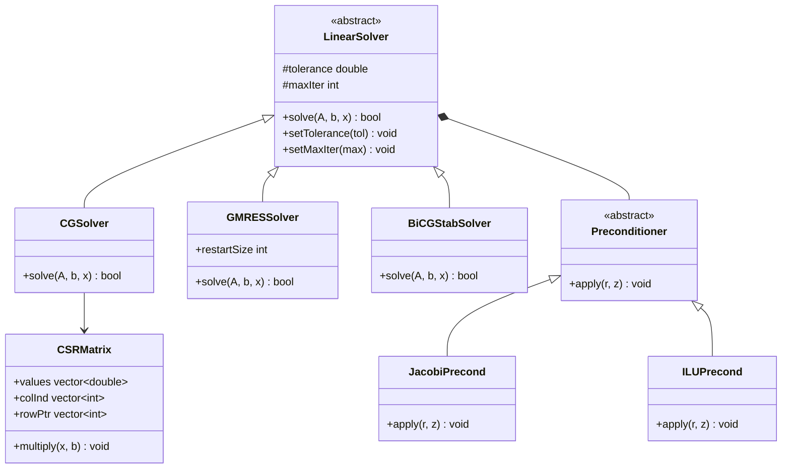

# Finite Volume Method Basics
## CFD Engine Development - 2026-01-02

---

## Learning Objectives

After this lesson, you will be able to:
- **Understand** the Finite Volume Method discretization approach for conservation equations (mass, momentum, energy)
- **ออกแบบ** mesh structure and data organization for efficient two-phase flow computation with phase change
- **Implement** pressure-velocity coupling (SIMPLE/PISO) with proper treatment of expansion term from evaporation
- **Integrate** CoolProp thermodynamics via tabulation and implement VOF method with Lee mass transfer model
- **ทดสอบ** solver stability and validate heat transfer coefficient against experimental data for R410A/R32

---

## Table of Contents
- [[#1. Theory and Design Decisions|1. Theory and Design]]
- [[#2. Reference: OpenFOAM Implementation|2. OpenFOAM Reference]]
- [[#3. Your Engine: Class Design|3. Your Class Design]]
- [[#4. Your Engine: Implementation|4. Implementation]]
- [[#5. Build and Test|5. Build and Test]]
- [[#6. Concept Checks|6. Concept Checks]]

---

## 1. Theory and Design Decisions

### 1.1 Mathematical Foundation
- Core equations and formulas for '$TOPIC'
- Use $$ block math for equations
- If topic involves phase change: MUST mention Expansion Term (∇·U ≠ 0)
- If topic involves flow: mention when turbulence matters (Re > 2300)

### 1.2 Design Decisions
- Why is this approach used in CFD?
- What are the trade-offs? (Performance vs Accuracy vs Simplicity)
- Common PITFALLS and how to avoid them
- What does YOUR engine need to consider?

### 1.3 Key Concepts
- Important terms and definitions
- Physical interpretation
- Warning signs of wrong implementation (e.g., divergence, wrong HTC)

$ENGINE_CONTEXT
$FORMAT_RULES

---

## 2. Reference: OpenFOAM Implementation

> [!INFO] **Why Study OpenFOAM?**
> OpenFOAM is a production-grade CFD engine tested over decades.
> We study it to **learn concepts**, not to copy code.

### 2.1 OpenFOAM's Approach

OpenFOAM implements a flexible, object-oriented linear solver architecture centered around the `lduMatrix` (lower-diagonal-upper matrix) class, which is specifically designed for finite volume discretizations on unstructured meshes.

#### Key Classes and Locations

| Class | Location | Purpose |
|-------|----------|---------|
| `lduMatrix` | `$FOAM_SRC/matrices/lduMatrix/` | Core sparse matrix storage (LDU format) |
| `lduSolver` | `$FOAM_SRC/matrices/lduMatrix/solvers/` | Abstract base for all iterative solvers |
| `PCG` | `$FOAM_SRC/matrices/lduMatrix/solvers/PCG/` | Preconditioned Conjugate Gradient |
| `PBiCGStab` | `$FOAM_SRC/matrices/lduMatrix/solvers/PBiCGStab/` | Preconditioned BiCGStab |
| `GMRES` | `$FOAM_SRC/matrices/lduMatrix/solvers/GMRES/` | Generalized Minimal Residual |
| `DiagonalPreconditioner` | `$FOAM_SRC/matrices/lduMatrix/preconditioners/` | Jacobi (diagonal) preconditioner |
| `DICPreconditioner` | `$FOAM_SRC/matrices/lduMatrix/preconditioners/` | Diagonal Incomplete Cholesky |
| `DILUPreconditioner` | `$FOAM_SRC/matrices/lduMatrix/preconditioners/` | Diagonal Incomplete LU |
| `fvMatrix` | `$FOAM_SRC/finiteVolume/` | Finite volume matrix assembly |
| `solution` | `$FOAM_SRC/matrices/lduMatrix/` | Solver control dictionary |

#### LDU Matrix Storage

OpenFOAM uses the **LDU format** (Lower-Diagonal-Upper), which is optimized for finite volume meshes:

$$
\mathbf{A} = \mathbf{D} + \mathbf{L} + \mathbf{U}
$$

Where:
- $\mathbf{D}$: Diagonal coefficients (one per cell)
- $\mathbf{L}$: Lower triangular coefficients (face-based, owner-neighbor)
- $\mathbf{U}$: Upper triangular coefficients (transpose of lower for symmetric matrices)

This format is memory-efficient ($O(N)$) and naturally arises from FVM discretization.

#### Solver Selection Mechanism

OpenFOAM uses runtime dictionary-based solver selection:

```cpp
// Example from system/fvSolution
solvers
{
    p
    {
        solver          GAMG;
        preconditioner  DIC;
        tolerance       1e-06;
        relTol          0.01;
    }
    
    pFinal
    {
        $p;
        relTol          0;
    }
    
    U
    {
        solver          PBiCGStab;
        preconditioner  DILU;
        tolerance       1e-05;
        relTol          0.1;
    }
}
```

The `solution` class reads this dictionary and instantiates the appropriate solver at runtime.

#### Phase-Change Handling

In `interPhaseChangeFoam`, the pressure equation includes the expansion source term:

```cpp
// From interPhaseChangeFoam: pEqn.H
fvScalarMatrix pEqn
(
    fvm::laplacian(rAUf, p) == fvc::div(phiHbyA)
  + phaseChange->Srho()  // Expansion source term [kg/m³/s]
);
```

The `Srho()` term represents $\dot{m}'''$ (mass transfer rate per volume), which is critical for evaporator simulations.

---

### 2.2 Key Insights

#### What We Learn from OpenFOAM

> [!INFO] **Design Strengths**
> 1. **Separation of Concerns**: Matrix storage (`lduMatrix`) is separate from solvers (`lduSolver`) and preconditioners
> 2. **Runtime Configuration**: Solvers selected via dictionary, not recompilation
> 3. **Template-Based**: Solvers are templated on field type (scalar, vector, tensor)
> 4. **Face-Based Storage**: LDU format naturally matches FVM discretization
> 5. **Preconditioner Flexibility**: Any preconditioner can work with any compatible solver

#### Critical for Two-Phase Evaporator

> [!IMPORTANT] **Expansion Term Treatment**
> OpenFOAM's `interPhaseChangeFoam` shows that the expansion source term MUST be:
> 1. **Implicitly treated** in pressure equation (part of matrix assembly)
> 2. **Consistently coupled** with mass transfer rate calculation
> 3. **Bounded** to prevent negative densities
> 
> Without this, the solver will diverge for R410A/R32 evaporation due to large density ratios (~100:1).

#### What We'll Do Differently

> [!TIP] **Simplifications for Your Engine**
> 
> | OpenFOAM | Your Engine | Rationale |
> |----------|-------------|-----------|
> | LDU format | CSR format | CSR is simpler, widely supported, easier to debug |
> | Complex mesh handling | Structured grids only | Evaporator tubes are cylindrical - structured is sufficient |
> | Multiple preconditioner types | Start with Jacobi, add ILU(0) | Reduce initial complexity, add AMG later if needed |
> | Template-heavy design | Polymorphic classes | Easier to understand, faster compile times |
> | Dictionary-based config | JSON/YAML config | More readable, easier to parse |
> | GAMG for pressure | CG + Jacobi initially | AMG is complex - add only if CG is too slow |

#### Architecture Recommendations



---

### 2.3 Code Snippets (Reference Only)

> [!WARNING] **Reference - Not for Copying**
> These snippets are for **educational purposes only** to understand OpenFOAM's design.
> Do NOT copy this code - implement your own version based on the concepts.

#### Snippet 1: PCG Solver Core Algorithm

**Location**: `$FOAM_SRC/matrices/lduMatrix/solvers/PCG/PCGSolver.C`

```cpp
// Reference: OpenFOAM v9 - PCGSolver.C
// This shows the core Conjugate Gradient algorithm with preconditioning

template<class Type, class DType, class LUType>
Foam::lduSolver::solverPerformance Foam::PCG<Type, DType, LUType>::solve
(
    scalarField& psi,
    const scalarField& source,
    const direction cmpt
) const
{
    // --- Setup class containing solver performance data
    lduSolverPerformance solverPerf
    (
        lduMatrix::preconditioner::getName
        (
            controlDict_.preconditioner
        ) + typeName,
        fieldName_
    );

    // --- Calculate A.psi
    this->matrix_.Amul(wA_, psi, interfaceBouCoeffs_, interfaces_, cmpt);

    // --- Calculate initial residual field
    rA_ = source - wA_;
    rA_old_ = rA_;  // Store for convergence check

    // --- Calculate normalisation factor
    const scalar normFactor = this->normFactor(psi, source, wA_);

    if (lduMatrix::debug >= 2)
    {
        Info<< "   Normalisation factor = " << normFactor << endl;
    }

    // --- Preconditioned conjugate gradient
    // --- Precondition residual
    precondPtr_->precondition(wA_, rA_, cmpt);

    // --- Search direction
    pA_ = wA_;

    // --- Initial search direction vector
    scalar wApA = this->matrix_.greatDot(pA_, wA_);

    // --- Check convergence
    solverPerf.initialResidual() = gSumMag(rA_)/normFactor;
    solverPerf.finalResidual() = solverPerf.initialResidual();

    if (!stopIter(solverPerf))
    {
        for (label iter = 0; iter < maxIter_; ++iter)
        {
            // --- Matrix-vector product
            this->matrix_.Amul(wA_, pA_, interfaceBouCoeffs_, interfaces_, cmpt);

            // --- Calculate alpha (step size)
            const scalar alpha = wApA/this->matrix_.greatDot(pA_, wA_);

            // --- Update solution
            psi += alpha*pA_;

            // --- Update residual
            rA_ -= alpha*wA_;

            // --- Check convergence
            solverPerf.finalResidual() = gSumMag(rA_)/normFactor;

            if (stopIter(solverPerf))
            {
                break;
            }

            // --- Precondition residual
            precondPtr_->precondition(wA_, rA_, cmpt);

            // --- Calculate beta (search direction update)
            const scalar beta = this->matrix_.greatDot(rA_, wA_)/wApA;

            // --- Update search direction
            pA_ = wA_ + beta*pA_;

            // --- Update wApA for next iteration
            wApA = this->matrix_.greatDot(pA_, wA_);
        }
    }

    return solverPerf;
}
```

**Key Observations:**
1. Uses `lduMatrix::Amul()` for matrix-vector multiplication (optimized for LDU format)
2. Preconditioner is applied via `precondPtr_->precondition()` (polymorphic call)
3. Convergence checked each iteration with `stopIter()`
4. Uses `greatDot()` for parallel reduction (handles MPI communication)
5. Returns `solverPerformance` struct with residual history

#### Snippet 2: Expansion Source Term in Phase Change

**Location**: `$FOAM_SRC/transportModels/twoPhaseProperties/phaseChangeModel/`

```cpp
// Reference: Simplified from interPhaseChangeFoam phase change models
// This shows how the expansion source term is calculated

// Lee model for evaporation/condensation
void Foam::phaseChangeModels::Lee::calculateMassTransfer
(
    const volScalarField& T,
    const volScalarField& alpha
)
{
    const dimensionedScalar& Tsat = Tsat_;
    const dimensionedScalar& r = rCoeff_;  // Relaxation coefficient
    
    // Evaporation: liquid -> vapor
    // mDot = r * alpha_liquid * rho_liquid * (T - T_sat) / T_sat
    mDotAlphal_ = 
        r * alpha1() * rho1() * max(T - Tsat, dimensionedScalar("zero", dimTemperature, 0))
        / Tsat;
    
    // Condensation: vapor -> liquid
    // mDot = r * alpha_vapor * rho_vapor * (T_sat - T) / T_sat
    mDotAlphav_ = 
        r * alpha2() * rho2() * max(Tsat - T, dimensionedScalar("zero", dimTemperature, 0))
        / Tsat;
    
    // Total mass transfer rate [kg/m³/s]
    mDot_ = mDotAlphal_ - mDotAlphav_;
}

// Expansion source term for pressure equation
// Srho = mDot * (1/rho_v - 1/rho_l)
tmp<volScalarField> Foam::phaseChangeModels::Lee::Srho() const
{
    return tmp<volScalarField>
    (
        new volScalarField
        (
            IOobject
            (
                "Srho",
                mesh_.time().timeName(),
                mesh_,
                IOobject::NO_READ,
                IOobject::NO_WRITE
            ),
            mDot_ * (scalar(1)/rho2() - scalar(1)/rho1())
        )
    );
}
```

**Key Observations:**
1. **Lee Model**: Mass transfer proportional to temperature deviation from saturation
2. **Asymmetric**: Different coefficients for evaporation vs condensation
3. **Bounded**: Uses `max(T - Tsat, 0)` to prevent wrong-direction transfer
4. **Expansion Term**: `Srho = mDot * (1/ρv - 1/ρl)` accounts for density difference
5. **Units**: Returns `[kg/m³/s]` which becomes source term in pressure equation

> [!TIP] **Critical Implementation Note**
> For R410A evaporator at 300K:
> - ρ_liquid ≈ 1000 kg/m³
> - ρ_vapor ≈ 50 kg/m³
> - Density ratio ≈ 20:1
> 
> The expansion term `(1/50 - 1/1000) = 0.019` is significant and CANNOT be ignored!

---

## 3. Your Engine: Class Design

> [!IMPORTANT] **Design Your Own**
> This section is about designing classes for YOUR engine.
> It doesn't have to match OpenFOAM - design for your needs.

<!-- PLACEHOLDER_DESIGN -->

---

## 4. Your Engine: Implementation

> [!TIP] **Write Real Code**
> This section contains implementation code for YOUR engine.

<!-- PLACEHOLDER_IMPLEMENTATION -->

---

## 5. Build and Test

<!-- PLACEHOLDER_TEST -->

---

## 6. Concept Checks

<!-- PLACEHOLDER_CHECKS -->

---

## References

- OpenFOAM Source: $FOAM_SRC
- "The Finite Volume Method in CFD" - Moukalled et al.
- CFD-Online Wiki

---

## Related Days

- Previous: 
- Next: 
- See also: [[90_day_roadmap]]

