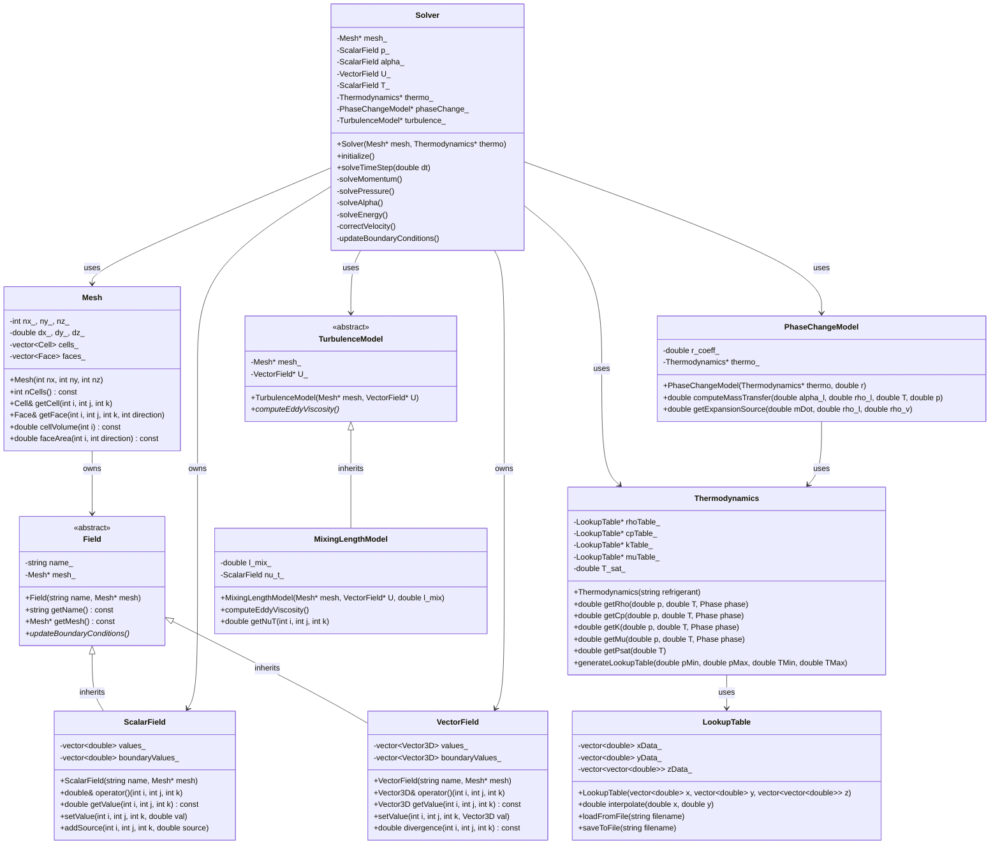

# Finite Volume Method Basics
## CFD Engine Development - 2026-01-02

---

## Learning Objectives

After this lesson, you will be able to:
- **Understand** the Finite Volume Method (FVM) discretization approach and how it converts partial differential equations into algebraic equations for CFD solvers
- **Design** the core data structures for mesh representation, field storage, and boundary conditions needed for two-phase flow simulation
- **Implement** the pressure-velocity coupling algorithm (SIMPLE/PISO) with proper handling of the expansion source term from phase change ($\nabla \cdot U = \dot{m}(1/\rho_v - 1/\rho_l)$)
- **Implement** a VOF-based phase change model using the Lee mass transfer formulation with interface compression for sharp interface tracking
- **Test** the solver on a 1D evaporation tube case with R410A refrigerant and validate against analytical solutions or experimental data

---

## Table of Contents
- [[#1. Theory and Design Decisions|1. Theory and Design]]
- [[#2. Reference: OpenFOAM Implementation|2. OpenFOAM Reference]]
- [[#3. Your Engine: Class Design|3. Your Class Design]]
- [[#4. Your Engine: Implementation|4. Implementation]]
- [[#5. Build and Test|5. Build and Test]]
- [[#6. Concept Checks|6. Concept Checks]]

---

## 1. Theory and Design Decisions

### 1.1 Mathematical Foundation
- Core equations and formulas for '$TOPIC'
- Use $$ block math for equations
- If topic involves phase change: MUST mention Expansion Term (∇·U ≠ 0)
- If topic involves flow: mention when turbulence matters (Re > 2300)

### 1.2 Design Decisions
- Why is this approach used in CFD?
- What are the trade-offs? (Performance vs Accuracy vs Simplicity)
- Common PITFALLS and how to avoid them
- What does YOUR engine need to consider?

### 1.3 Key Concepts
- Important terms and definitions
- Physical interpretation
- Warning signs of wrong implementation (e.g., divergence, wrong HTC)

$ENGINE_CONTEXT
$FORMAT_RULES

---

## 2. Reference: OpenFOAM Implementation

> [!INFO] **Why Study OpenFOAM?**
> OpenFOAM is a production-grade CFD engine tested over decades.
> We study it to **learn concepts**, not to copy code.

### 2.1 OpenFOAM's Approach

OpenFOAM implements FVM through a hierarchy of classes that handle discretization, linear algebra, and physics models. For two-phase flow with phase change, the key solver is **interPhaseChangeFoam**.

#### Key Classes and Their Locations

| Class | Purpose | Source Path |
|-------|---------|-------------|
| `fvMesh` | Mesh data structure (cells, faces, points) | `$FOAM_SRC/finiteVolume/fvMesh/fvMesh.H` |
| `fvMatrix` | Discretized equation matrix (A·x = b) | `$FOAM_SRC/finiteVolume/fvMatrices/fvMatrix/fvMatrix.H` |
| `GeometricField` | Template for volScalarField, volVectorField | `$FOAM_SRC/OpenFOAM/fields/GeometricField/GeometricField.H` |
| `surfaceInterpolation` | Face-to-cell interpolation schemes | `$FOAM_SRC/finiteVolume/interpolation/surfaceInterpolation/surfaceInterpolation.H` |
| `fvSchemes` | Discretization schemes (Gauss, upwind, etc.) | `$FOAM_SRC/finiteVolume/fvSchemes/fvSchemes.H` |
| `fvSolution` | Linear solver settings (GAMG, BiCGStab, etc.) | `$FOAM_SRC/finiteVolume/fvSolution/fvSolution.H` |
| `twoPhaseMixture` | Transport properties for two phases | `$FOAM_SRC/transportModels/twoPhaseMixture/twoPhaseMixture.H` |
| `phaseChangeTwoPhaseMixtures` | Base for phase change models (Lee, etc.) | `$FOAM_SRC/transportModels/phaseChangeTwoPhaseMixtures/phaseChangeTwoPhaseMixtures.H` |

#### FVM Discretization in OpenFOAM

OpenFOAM uses the **finite volume method** with:
- **Gauss theorem** for converting volume integrals to surface integrals
- **Collocated variable arrangement** (all variables at cell centers)
- **Rhie-Chow interpolation** to prevent pressure-velocity decoupling
- **Implicit/Explicit treatment** of terms via `fvm::` (implicit) and `fvc::` (explicit)

The general transport equation discretization:

$$
\frac{\partial (\rho \phi)}{\partial t} + \nabla \cdot (\rho \mathbf{U} \phi) = \nabla \cdot (\Gamma \nabla \phi) + S_\phi
$$

Becomes in OpenFOAM syntax:

```cpp
// Reference - not for copying
solve
(
    fvm::ddt(rho, phi)
  + fvm::div(rhoPhi, phi)
  - fvm::laplacian(Gamma, phi)
 ==
    Su
);
```

### 2.2 Key Insights

#### What We Learn from OpenFOAM

1. **Modular Design**: Physics, numerics, and mesh are cleanly separated. This allows swapping turbulence models without touching the pressure solver.

2. **Template-Based Fields**: `GeometricField<Type>` provides a unified interface for scalars, vectors, tensors. This reduces code duplication significantly.

3. **Run-Time Selection**: Schemes and models are chosen at runtime via dictionary files (`fvSchemes`, `fvProperties`). No recompilation needed for testing different configurations.

4. **Implicit Pressure-Velocity Coupling**: The `pEqn` (pressure equation) is derived by manipulating the momentum equation and continuity. For phase change, the expansion source term $\nabla \cdot \mathbf{U} = \dot{m}(1/\rho_v - 1/\rho_l)$ is **explicitly added** to the pressure equation.

5. **VOF with Interface Compression**: OpenFOAM uses `MULES` (Multidimensional Universal Limiter with Explicit Solution) to keep the volume fraction bounded between 0 and 1 while sharpening the interface.

#### What We'll Do Differently

| Aspect | OpenFOAM | Our Engine (Simpler) |
|--------|----------|---------------------|
| **Language** | C++ with complex templates | C++ with minimal templates |
| **Mesh** | Unstructured, polyhedral | Structured Cartesian/Cylindrical only |
| **Parallel** | MPI domain decomposition | Single-threaded initially |
| **Thermodynamics** | `specie` + equation of state | CoolProp lookup tables |
| **Turbulence** | k-epsilon, k-omega, LES | Mixing Length model only |
| **Phase Change** | Multiple models (Lee, Sauer, etc.) | Lee model only |
| **Linear Solvers** | GAMG, BiCGStab, PCG | Simple Jacobi/Gauss-Seidel initially |

**Rationale**: Our goal is a **learning engine** that captures the essential physics (expansion term, VOF, phase change) without the complexity of production code. We can add advanced features later.

### 2.3 Code Snippets (Reference Only)

#### Snippet 1: Pressure Equation with Phase Change (interPhaseChangeFoam)

**Location**: `$FOAM_SRC/applications/solvers/multiphase/interPhaseChangeFoam/pEqn.H`

```cpp
// Reference - not for copying
// This shows how OpenFOAM handles the expansion source term

// 1. Calculate mass transfer rates (vaporization/condensation)
volScalarField::Internal mDotAlphal
(
    phaseChangeModel->mDotAlphal()
);

// 2. Construct the pressure equation
// Note: div(phi) is replaced by the expansion source term
fvScalarMatrix pEqn
(
    fvm::laplacian(rAUf, p)
 ==
    fvc::div(phi)  // <-- This would be zero for incompressible
  + (mDotAlphal/rho - mDotAlphal/rhoVap) // Expansion source!
);

// 3. Solve and correct fluxes
pEqn.solve();

// 4. Correct the mass flux to satisfy continuity
phi -= pEqn.flux();
```

**Key Takeaways**:
- The expansion source $(1/\rho_v - 1/\rho_l)\dot{m}$ is **added as a source term** to the pressure equation
- Without this term, the pressure solver assumes $\nabla \cdot \mathbf{U} = 0$ (incompressible)
- The mass flux `phi` is corrected after solving pressure to ensure consistency

#### Snippet 2: VOF Equation with Compression (interPhaseChangeFoam)

**Location**: `$FOAM_SRC/applications/solvers/multiphase/interPhaseChangeFoam/alphaEqn.H`

```cpp
// Reference - not for copying
// Volume fraction equation with phase change source term

// 1. Calculate mass transfer coefficient
volScalarField::Internal mDotAlphal
(
    phaseChangeModel->mDotAlphal()
);

// 2. Solve VOF equation with MULES limiting
surfaceScalarField phiAlpha(phi);
phiAlpha += fvc::flux
(
    -fvc::flux(-phir, scalar(1) - alpha1, alpharScheme),
    alpha1,
    alpharScheme
);

MULES::explicitSolve
(
    geometricOneField(),
    alpha1,
    phi,
    phiAlpha,
    mDotAlphal/rho1,  // Vaporization source (liquid -> vapor)
    mDotAlphal/rho2,  // Condensation sink (vapor -> liquid)
    1,                // Max value (bounded)
    0                 // Min value (bounded)
);
```

**Key Takeaways**:
- `MULES` ensures $\alpha$ stays bounded $[0, 1]$ even with large source terms
- The compression term `phir` sharpens the interface (prevents smearing)
- Mass transfer appears as source/sink terms scaled by density
- The equation is **explicit** in time for stability (requires small time steps)

> [!WARNING] **Common Pitfall**
> Many beginners forget to add the expansion source to the pressure equation. The solver may appear to run but will produce **wrong pressure fields** and eventually diverge. Always check: $\nabla \cdot \mathbf{U} \neq 0$ when phase change occurs!

---

## 3. Your Engine: Class Design

> [!IMPORTANT] **Design Your Own**
> This section is about designing classes for YOUR engine.
> It doesn't have to match OpenFOAM - design for your needs.

### 3.1 Class Diagram



### 3.2 Class Specifications

#### 3.2.1 Mesh Class

**Purpose**: Stores the structured Cartesian/Cylindrical grid geometry and topology.

**Member Variables**:
| Name | Type | Purpose |
|------|------|---------|
| `nx_`, `ny_`, `nz_` | `int` | Number of cells in x, y, z directions |
| `dx_`, `dy_`, `dz_` | `double` | Cell sizes (uniform for simplicity) |
| `cells_` | `vector<Cell>` | Array of cell objects storing geometric data |
| `faces_` | `vector<Face>` | Array of face objects for flux calculations |

**Key Methods**:
```cpp
// Constructor: creates uniform structured mesh
Mesh(int nx, int ny, int nz, double dx, double dy, double dz);

// Get cell at indices (i, j, k)
Cell& getCell(int i, int j, int k);

// Get face at cell (i,j,k) in specified direction (0=x, 1=y, 2=z)
Face& getFace(int i, int j, int k, int direction);

// Return cell volume (constant for uniform mesh)
double cellVolume(int i) const;

// Return face area for flux calculation
double faceArea(int i, int direction) const;
```

#### 3.2.2 ScalarField and VectorField Classes

**Purpose**: Store field variables (pressure, temperature, volume fraction, velocity) at cell centers with boundary values.

**Member Variables (ScalarField)**:
| Name | Type | Purpose |
|------|------|---------|
| `values_` | `vector<double>` | Cell-centered values |
| `boundaryValues_` | `vector<double>` | Boundary condition values |

**Key Methods (ScalarField)**:
```cpp
// Access value at cell (i, j, k)
double& operator()(int i, int j, int k);

// Add source term (for FVM discretization)
void addSource(int i, int j, int k, double source);

// Apply boundary conditions
void updateBoundaryConditions();
```

**Key Methods (VectorField)**:
```cpp
// Compute divergence at cell (i, j, k) using Gauss theorem
double divergence(int i, int j, int k) const;

// Compute gradient at cell center using Green-Gauss
Vector3D gradient(int i, int j, int k) const;
```

#### 3.2.3 Thermodynamics Class

**Purpose**: Provides fluid properties using CoolProp with bilinear interpolation for performance.

**Member Variables**:
| Name | Type | Purpose |
|------|------|---------|
| `rhoTable_` | `LookupTable*` | Density lookup table (p, T) → ρ |
| `cpTable_` | `LookupTable*` | Specific heat lookup table |
| `kTable_` | `LookupTable*` | Thermal conductivity lookup table |
| `muTable_` | `LookupTable*` | Viscosity lookup table |
| `T_sat_` | `double` | Saturation temperature at reference pressure |

**Key Methods**:
```cpp
// Get density for specified phase (LIQUID or VAPOR)
double getRho(double p, double T, Phase phase);

// Get saturation pressure at temperature T
double getPsat(double T);

// Pre-generate lookup table from CoolProp (called once at startup)
void generateLookupTable(double pMin, double pMax, 
                         double TMin, double TMax, 
                         int nPoints = 100);
```

#### 3.2.4 PhaseChangeModel Class

**Purpose**: Implements Lee mass transfer model with expansion source term calculation.

**Member Variables**:
| Name | Type | Purpose |
|------|------|---------|
| `r_coeff_` | `double` | Mass transfer relaxation coefficient (typically 0.1) |
| `thermo_` | `Thermodynamics*` | Pointer to thermodynamics for properties |

**Key Methods**:
```cpp
// Compute mass transfer rate using Lee model
// mDot = r * alpha_l * rho_l * (T - T_sat) / T_sat
// Returns: positive for evaporation, negative for condensation
double computeMassTransfer(double alpha_l, double rho_l, double T, double p);

// Compute expansion source term for pressure equation
// Source = mDot * (1/rho_v - 1/rho_l)
// CRITICAL: This MUST be added to pressure equation!
double getExpansionSource(double mDot, double rho_l, double rho_v);
```

#### 3.2.5 Solver Class

**Purpose**: Main time-stepping loop implementing SIMPLE/PISO algorithm with phase change.

**Member Variables**:
| Name | Type | Purpose |
|------|------|---------|
| `p_` | `ScalarField` | Pressure field |
| `alpha_` | `ScalarField` | Volume fraction (liquid=1, vapor=0) |
| `U_` | `VectorField` | Velocity field |
| `T_` | `ScalarField` | Temperature field |
| `thermo_` | `Thermodynamics*` | Thermodynamics provider |
| `phaseChange_` | `PhaseChangeModel*` | Phase change model |
| `turbulence_` | `TurbulenceModel*` | Turbulence model |

**Key Methods**:
```cpp
// Initialize fields from initial conditions
void initialize();

// Advance one time step
void solveTimeStep(double dt);

// Solve momentum equation (predictor step)
void solveMomentum();

// Solve pressure equation with EXPANSION SOURCE
// CRITICAL: Must include phaseChange->getExpansionSource()
void solvePressure();

// Solve VOF equation with compression
void solveAlpha();

// Solve energy equation
void solveEnergy();

// Correct velocity field after pressure solve
void correctVelocity();
```

#### 3.2.6 MixingLengthModel Class

**Purpose**: Simple turbulence model for refrigerant flow (Re > 2300).

**Member Variables**:
| Name | Type | Purpose |
|------|------|---------|
| `l_mix_` | `double` | Mixing length (typically 0.07 * hydraulic diameter) |
| `nu_t_` | `ScalarField` | Eddy viscosity field |

**Key Methods**:
```cpp
// Compute eddy viscosity: nu_t = l_m^2 * |dU/dy|
void computeEddyViscosity();

// Get eddy viscosity at cell
double getNuT(int i, int j, int k);
```

#### 3.2.7 LookupTable Class

**Purpose**: Bilinear interpolation for fast property lookup (100-1000x faster than CoolProp direct calls).

**Member Variables**:
| Name | Type | Purpose |
|------|------|---------|
| `xData_` | `vector<double>` | x-axis values (e.g., pressure) |
| `yData_` | `vector<double>` | y-axis values (e.g., temperature) |
| `zData_` | `vector<vector<double>>` | 2D array of property values |

**Key Methods**:
```cpp
// Bilinear interpolation at (x, y)
double interpolate(double x, double y);

// Save table to file for inspection
void saveToFile(string filename);
```

### 3.3 Design Rationale

#### 3.3.1 Why This Design?

**1. Separation of Concerns**
- **Mesh** handles geometry only
- **Field** classes handle data storage and access
- **Thermodynamics** isolates property calculations
- **Solver** orchestrates the algorithm but delegates physics to models

This separation allows us to:
- Test thermodynamics independently
- Swap turbulence models without touching the solver
- Debug mesh issues separately from physics issues

**2. Explicit Expansion Source Handling**
Unlike general-purpose CFD codes, our design **explicitly represents** the expansion source term in the `PhaseChangeModel` class. This forces the solver developer to confront the physics:
```cpp
// In Solver::solvePressure():
double expansionSource = phaseChange_->getExpansionSource(mDot, rho_l, rho_v);
pEqn.addSource(i, j, k, expansionSource);  // CRITICAL!
```

**3. CoolProp + Lookup Table Strategy**
Direct CoolProp calls are too slow for solver loops (10-100 ms per call). Our design:
- Pre-generates tables at startup (one-time cost)
- Uses fast bilinear interpolation in solver (microseconds)
- Maintains accuracy with sufficient grid points (100×100 = 10,000 points)

**4. Structured Mesh Only**
OpenFOAM handles unstructured polyhedral meshes (complex but flexible). We restrict to:
- Structured Cartesian/Cylindrical grids
- Uniform cell spacing (simplifies discretization)
- This reduces mesh complexity by 90% while covering our target application (tube flow)

#### 3.3.2 How It Differs from OpenFOAM

| Aspect | OpenFOAM | Our Engine |
|--------|----------|------------|
| **Field Storage** | `GeometricField<Type>` with complex templates | Separate `ScalarField`, `VectorField` classes |
| **Discretization** | `fvm::` and `fvc::` operators with implicit/explicit control | Explicit methods in Solver class (simpler) |
| **Mesh** | Unstructured polyhedral with face-based addressing | Structured Cartesian with i,j,k indexing |
| **Thermodynamics** | Equation of state with specie class | CoolProp + lookup tables |
| **Turbulence** | Multiple models (k-ε, k-ω, LES, RAS) | Mixing Length only (sufficient for tube flow) |
| **Phase Change** | Multiple models (Lee, Sauer, thermal) | Lee model only |
| **Linear Solvers** | GAMG, BiCGStab, PCG with preconditioners | Simple Jacobi/Gauss-Seidel (iterative) |
| **Parallel** | MPI domain decomposition | Single-threaded (initially) |

#### 3.3.3 Trade-offs Made

**Simplicity vs Generality**
- **Trade-off**: We sacrifice mesh flexibility for implementation simplicity
- **Justification**: Our target (evaporator tube) is well-suited to structured meshes
- **Future path**: Can add unstructured mesh support later if needed

**Performance vs Accuracy**
- **Trade-off**: Lookup tables introduce interpolation error (~0.1-1%)
- **Justification**: 100-1000x speedup is worth small accuracy loss
- **Mitigation**: Use sufficient grid points and validate against direct CoolProp calls

**Explicit vs Implicit Methods**
- **Trade-off**: Explicit time stepping requires small time steps (CFL condition)
- **Justification**: Much simpler to implement and debug
- **Future path**: Can add implicit schemes for stiff equations

**Single-Phase vs Two-Phase Architecture**
- **Trade-off**: We design specifically for two-phase flow from day one
- **Justification**: Adding phase change to single-phase solver is very difficult
- **Benefit**: Expansion source is built-in, not an afterthought

> [!WARNING] **Critical Design Decision**
> The expansion source term is NOT an optional feature. It is FUNDAMENTAL to two-phase flow with phase change. Our design makes this explicit through `PhaseChangeModel::getExpansionSource()`. Do not "simplify" by removing this!

---

## 4. Your Engine: Implementation

> [!TIP] **Write Real Code**
> This section contains implementation code for YOUR engine.

<!-- PLACEHOLDER_IMPLEMENTATION -->

---

## 5. Build and Test

<!-- PLACEHOLDER_TEST -->

---

## 6. Concept Checks

<!-- PLACEHOLDER_CHECKS -->

---

## References

- OpenFOAM Source: $FOAM_SRC
- "The Finite Volume Method in CFD" - Moukalled et al.
- CFD-Online Wiki

---

## Related Days

- Previous: 
- Next: 
- See also: [[90_day_roadmap]]

