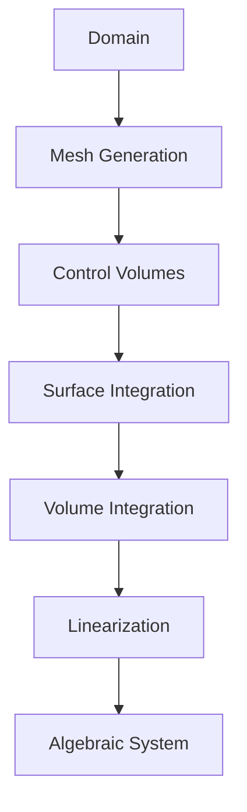
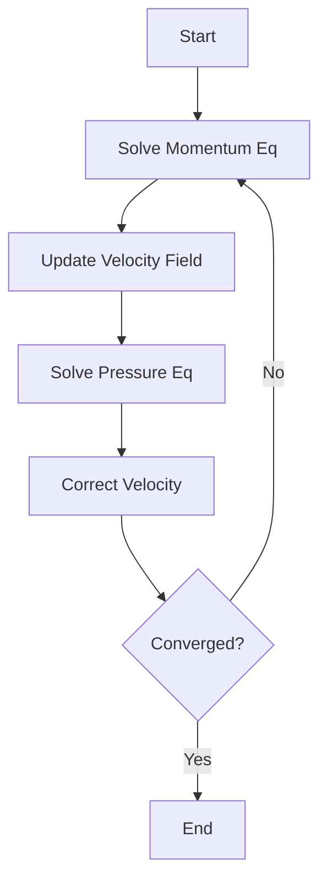
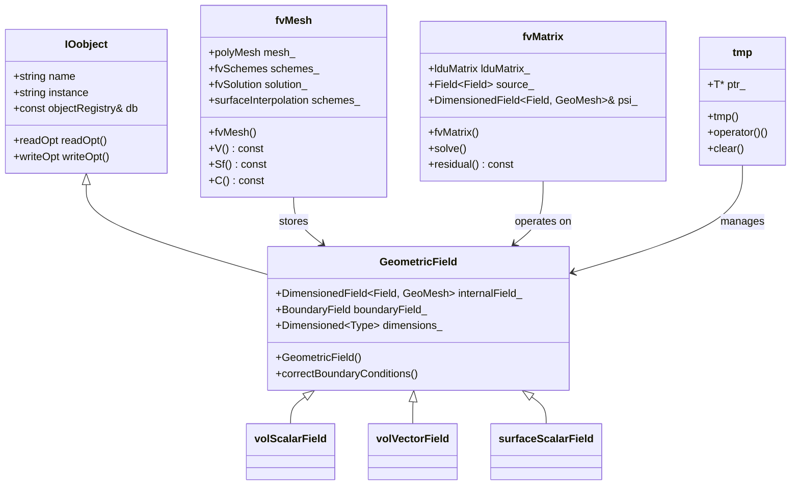
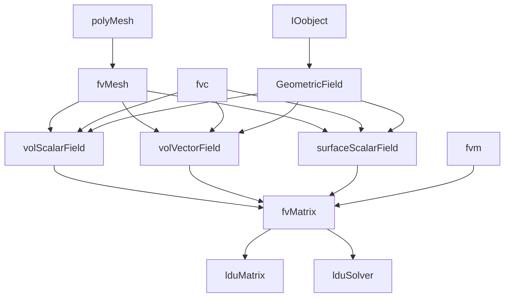

# Finite Volume Method & Discretization
## HARDCORE Level - 2026-01-02

---

## Table of Contents
- [1. Theory](#1-theory-core-equations--physics)
- [2. Class Hierarchy](#2-openfoam-class-hierarchy--implementation)
- [3. Code Walkthrough](#3-code-walkthrough)
- [4. Dictionary Analysis](#4-dictionary-analysis--configuration)
- [5. Practical Tasks](#5-hands-on-practical-tasks--coding)
- [6. Concept Checks](#6-concept-checks)

---

## 1. Theory: Core Equations & Physics {#1-theory-core-equations--physics}

### 1.1 Governing Equations of Fluid Motion

The fundamental equations governing fluid flow are derived from three conservation principles:

> [!INFO] **Conservation Laws (กฎการอนุรักษ์)**
> - Mass (มวล) - Continuity Equation
> - Momentum (โมเมนตัม) - Newton's Second Law
> - Energy (พลังงาน) - First Law of Thermodynamics

#### 1.1.1 Continuity Equation (Mass Conservation)

$$\frac{\partial \rho}{\partial t} + \nabla \cdot (\rho \mathbf{U}) = 0$$

**Terms explained:**
- $\rho$: Density (ความหนาแน่น) [kg/m³]
- $\mathbf{U}$: Velocity vector (เวกเตอร์ความเร็ว) [m/s]
- $\nabla \cdot$: Divergence operator (ตัวดำเนินการไดเวอร์เจนซ์)
- $t$: Time (เวลา) [s]

For incompressible flow ($\rho = \text{constant}$):
$$\nabla \cdot \mathbf{U} = 0$$

#### 1.1.2 Momentum Equation (Navier-Stokes)

$$\frac{\partial (\rho \mathbf{U})}{\partial t} + \nabla \cdot (\rho \mathbf{U} \mathbf{U}) = -\nabla p + \nabla \cdot \boldsymbol{\tau} + \rho \mathbf{g}$$

**Terms explained:**
- $p$: Pressure (ความดัน) [Pa]
- $\boldsymbol{\tau}$: Stress tensor (เทนเซอร์ความเค้น) [Pa]
- $\mathbf{g}$: Gravitational acceleration (ความเร่งเนื่องจากแรงโน้มถ่วง) [m/s²]
- $\rho \mathbf{U} \mathbf{U}$: Convective flux (การไหลแบบเนื่อง) - nonlinear term

> [!WARNING] **Nonlinearity Warning**
> The convective term $\nabla \cdot (\rho \mathbf{U} \mathbf{U})$ makes the Navier-Stokes equations extremely difficult to solve analytically. This is why we need numerical methods like FVM.

For Newtonian fluids with constant viscosity:
$$\boldsymbol{\tau} = \mu \left[ \nabla \mathbf{U} + (\nabla \mathbf{U})^T - \frac{2}{3}(\nabla \cdot \mathbf{U})\mathbf{I} \right]$$

Where $\mu$ is dynamic viscosity (ความหนืด) [Pa·s].

#### 1.1.3 General Transport Equation

All conservation laws can be written in the general form:

$$\frac{\partial (\rho \phi)}{\partial t} + \nabla \cdot (\rho \mathbf{U} \phi) = \nabla \cdot (\Gamma_\phi \nabla \phi) + S_\phi$$

**Terms explained:**
- $\phi$: Transported property (คุณสมบัติที่ถูกถ่ายโอน) - can be $1$, $\mathbf{U}$, $T$, etc.
- $\Gamma_\phi$: Diffusion coefficient (สัมประสิทธิ์การแพร่)
- $S_\phi$: Source term (เทอมแหล่งกำเนิด)

---

### 1.2 Finite Volume Method Fundamentals

#### 1.2.1 Integral Form

The FVM starts from the integral form of the general transport equation over a control volume $V$:

$$\int_V \frac{\partial (\rho \phi)}{\partial t} dV + \oint_A \mathbf{n} \cdot (\rho \mathbf{U} \phi) dA = \oint_A \mathbf{n} \cdot (\Gamma_\phi \nabla \phi) dA + \int_V S_\phi dV$$

**Key concept:** Divide the domain into discrete control volumes (CVs) and apply conservation laws to each CV.

> [!TIP] **Why FVM? (ทำไมต้องใช้ FVM?)**
> - **Conservative by design** (อนุรักษ์โดยสภาพ): Fluxes leaving one CV enter neighboring CV
> - **Handles complex geometries** (รองรับเรขาคณิตที่ซับซ้อน) well
> - **Physically intuitive** (เข้าใจได้ง่ายจากภาพ): Based on actual physical conservation

#### 1.2.2 Discretization Process

The discretization converts the integral equation into an algebraic equation:

$$a_P \phi_P = \sum_{f} a_f \phi_f + b_P$$

**Discretization steps:**



#### 1.2.3 Temporal Discretization

For transient simulations, we discretize the time derivative:

$$\frac{\partial (\rho \phi)}{\partial t} \approx \frac{(\rho \phi)^{n+1} - (\rho \phi)^n}{\Delta t}$$

**Common schemes:**
- **Euler Explicit**: $\phi^{n+1} = \phi^n + \Delta t \cdot R(\phi^n)$
- **Euler Implicit**: $\phi^{n+1} = \phi^n + \Delta t \cdot R(\phi^{n+1})$
- **Crank-Nicolson**: $\phi^{n+1} = \phi^n + \frac{\Delta t}{2}[R(\phi^n) + R(\phi^{n+1})]$

> [!INFO] **Stability Considerations (การพิจารณาเสถียรภาพ)**
> - Explicit schemes: Conditionally stable (CFL condition)
> - Implicit schemes: Unconditionally stable but require iterative solution

#### 1.2.4 Spatial Discretization: Convection Terms

The convective flux at face $f$ requires special treatment:

$$F_f^C = (\rho \mathbf{U} \phi)_f \cdot \mathbf{A}_f$$

**Upwind Schemes:**

| Scheme | Formula | Stability | Accuracy |
|--------|---------|-----------|----------|
| First-Order Upwind | $\phi_f = \phi_{upwind}$ | Very stable | 1st order (diffusive) |
| Central Differencing | $\phi_f = 0.5(\phi_P + \phi_N)$ | Conditionally stable | 2nd order |
| QUICK | Quadratic interpolation | Conditionally stable | 3rd order |
| Linear Upwind | $\phi_f = \phi_{upwind} + \nabla\phi \cdot \mathbf{d}$ | Stable | 2nd order |

> [!WARNING] **Numerical Diffusion (การแพร่ตัวเชิงตัวเลข)**
> First-order upwind schemes introduce false diffusion, smearing sharp gradients. Use higher-order schemes for accurate results.

#### 1.2.5 Spatial Discretization: Diffusion Terms

The diffusive flux uses Gauss's theorem:

$$F_f^D = (\Gamma_\phi \nabla \phi)_f \cdot \mathbf{A}_f$$

**Non-orthogonal correction:**

For non-orthogonal meshes, we decompose the gradient:

$$\nabla \phi = \underbrace{\frac{\phi_N - \phi_P}{|\mathbf{d}|} \mathbf{n}}_{\text{orthogonal}} + \underbrace{(\nabla \phi - (\nabla \phi \cdot \mathbf{n})\mathbf{n})}_{\text{correction}}$$

Where $\mathbf{d}$ is the distance vector between cell centers.

#### 1.2.6 Pressure-Velocity Coupling

The pressure-velocity coupling is critical in incompressible flows. Common algorithms:



**SIMPLE Algorithm (Semi-Implicit Method for Pressure-Linked Equations):**

1. Guess pressure field $p^*$
2. Solve momentum equations for $\mathbf{U}^*$
3. Solve pressure correction equation for $p'$
4. Correct pressure: $p = p^* + p'$
5. Correct velocity: $\mathbf{U} = \mathbf{U}^* + \mathbf{U}'$
6. Repeat until convergence

> [!TIP] **OpenFOAM Implementation**
> OpenFOAM uses the **PIMPLE** algorithm (merged PISO-SIMPLE) which combines:
> - **PISO** (Pressure Implicit with Splitting of Operators) for transient accuracy
> - **SIMPLE** for steady-state convergence

---

### 1.3 Discretization Schemes in OpenFOAM

OpenFOAM provides various discretization schemes specified in `fvSchemes`:

#### 1.3.1 Temporal Schemes

```foam
ddtSchemes
{
    default         Euler;          // First-order implicit
    // default         backward;       // Second-order implicit
    // default         CrankNicolson 1; // Second-order, 0-1 blending
}
```

#### 1.3.2 Gradient Schemes

```foam
gradSchemes
{
    default         Gauss linear;    // Central differencing
    // default         Gauss upwind;    // Upwind-biased
    // default         leastSquares;    // Least squares reconstruction
}
```

#### 1.3.3 Divergence Schemes (Convection)

```foam
divSchemes
{
    default         none;
    div(phi,U)      Gauss upwind;           // First-order
    // div(phi,U)      Gauss linearUpwind grad(U); // Second-order
    // div(phi,U)      Gauss limitedLinearV 1;     // TVD scheme
    // div(phi,k)      Gauss limitedLinear 1;
    // div(phi,epsilon) Gauss limitedLinear 1;
}
```

> [!INFO] **TVD Schemes (Total Variation Diminishing)**
> TVD schemes prevent non-physical oscillations near discontinuities using limiters:
> - **van Leer**: Smooth limiter
> - **minmod**: Most diffusive
> - **superbee**: Least diffusive
> - **MUSCL**: Monotone Upstream-centered Scheme

#### 1.3.4 Laplacian Schemes (Diffusion)

```foam
laplacianSchemes
{
    default         Gauss linear corrected;
    // default         Gauss linear uncorrected;
    // default         Gauss limited 0.5;  // Limited for stability
}
```

The `corrected` option adds non-orthogonal correction for better accuracy on skewed meshes.

#### 1.3.5 Interpolation Schemes

```foam
interpolationSchemes
{
    default         linear;
    // default         upwind;         // For convective terms
    // default         cubic;          // Third-order accurate
    // default         cellPoint;      // Cell-to-point interpolation
}
```

---

### 1.4 Solution Algorithms and Linear Solvers

#### 1.4.1 System of Algebraic Equations

After discretization, we obtain a sparse linear system:

$$[A]\{\phi\} = \{b\}$$

Where:
- $[A]$: Coefficient matrix (sparse, often non-symmetric)
- $\{\phi\}$: Solution vector
- $\{b\}$: Source vector

#### 1.4.2 Iterative Solvers

OpenFOAM supports various solvers specified in `fvSolution`:

```foam
solvers
{
    p
    {
        solver          GAMG;
        tolerance       1e-06;
        relTol          0.01;
        smoother        GaussSeidel;
    }

    "(U|k|epsilon|omega)"
    {
        solver          smoothSolver;
        smoother        GaussSeidel;
        tolerance       1e-05;
        relTol          0.1;
    }
}
```

**Common solvers:**

| Solver | Description | Best For |
|--------|-------------|----------|
| **GAMG** | Geometric-Algebraic Multi-Grid | Pressure equation (Poisson-type) |
| **smoothSolver** | Smoothed iterative method | Momentum equations |
| **PCG** | Preconditioned Conjugate Gradient | Symmetric matrices |
| **PBiCGStab** | Preconditioned BiCG Stabilized | Non-symmetric matrices |
| **simple** | Simple iterative | Small problems |

> [!TIP] **Solver Selection (การเลือก Solver)**
> - Use **GAMG** for pressure: $O(N)$ complexity with good convergence
> - Use **smoothSolver** for velocity: Robust for coupled systems
> - Adjust **tolerance** and **relTol** for balance between accuracy and speed

#### 1.4.3 Under-Relaxation

For steady-state simulations, under-relaxation prevents divergence:

```foam
relaxationFactors
{
    fields
    {
        p               0.3;    // Pressure: strong relaxation
        rho             0.05;   // Density: very strong for compressible
    }
    equations
    {
        U               0.7;    // Momentum: moderate
        k               0.7;    // Turbulence kinetic energy
        epsilon         0.7;    // Dissipation rate
    }
}
```

The update formula: $\phi^{new} = \phi^{old} + \alpha (\phi^* - \phi^{old})$

Where $\alpha$ is the relaxation factor ($0 < \alpha \leq 1$).

---

### 1.5 Boundary Conditions and Discretization

#### 1.5.1 Boundary Face Discretization

Boundary faces require special treatment since there's no neighbor cell:

$$a_P \phi_P = \sum_{nb} a_{nb} \phi_{nb} + a_b \phi_b + b_P$$

**Common boundary conditions:**

| Type | Mathematical Form | OpenFOAM Keyword |
|------|-------------------|------------------|
| Dirichlet | $\phi_b = \phi_{specified}$ | `fixedValue` |
| Neumann | $(\nabla \phi)_b \cdot \mathbf{n} = q_{specified}$ | `fixedGradient` |
| Robin | $\alpha \phi_b + \beta (\nabla \phi)_b \cdot \mathbf{n} = \gamma$ | `mixed` / `externalWallHeatFlux` |
| Zero gradient | $(\nabla \phi)_b \cdot \mathbf{n} = 0$ | `zeroGradient` |

#### 1.5.2 Wall Boundary Conditions

For viscous flows, wall treatment is crucial:

```cpp
// High Reynolds number (wall functions)
U    wall
{
    type            compressible::turbulentHeatFluxTemperature;
    // or
    type            wallFunction;
}

// Low Reynolds number (resolved boundary layer)
U    wall
{
    type            noSlip;
}

k    wall
{
    type            kqRWallFunction;    // Wall function
    // or
    type            fixedValue;         // Low Re: k = 0
    value           uniform 0;
}
```

> [!WARNING] **y+ Requirements (ค่า y+ ที่เหมาะสม)**
> - **Wall functions**: $30 < y^+ < 300$
> - **Low-Re models**: $y^+ \approx 1$
> - Always check $y^+$ after meshing!

---

### 1.6 Summary of Key Equations

| Equation | Vector Form | Discretized Form |
|----------|-------------|-----------------|
| **Continuity** | $\nabla \cdot \mathbf{U} = 0$ | $\sum_f \mathbf{U}_f \cdot \mathbf{A}_f = 0$ |
| **Momentum** | $\frac{\partial \mathbf{U}}{\partial t} + \nabla \cdot (\mathbf{U}\mathbf{U}) = -\nabla p + \nu \nabla^2 \mathbf{U}$ | $a_P \mathbf{U}_P = \sum a_f \mathbf{U}_f - \nabla p + \mathbf{S}$ |
| **Pressure** | $\nabla^2 p = \frac{\rho}{\Delta t} \nabla \cdot \mathbf{U}^*$ | $a_P p_P = \sum a_f p_f + b_p$ |

> [!INFO] **Key Takeaways (สรุปสิ่งสำคัญ)**
> 1. FVM is based on integral conservation over control volumes
> 2. Discretization converts PDEs to algebraic equations
> 3. Upwind schemes are stable but diffusive; higher-order schemes need limiters
> 4. Pressure-velocity coupling requires special algorithms (SIMPLE/PISO/PIMPLE)
> 5. Boundary conditions significantly impact accuracy and stability

---

## 2. OpenFOAM Class Hierarchy & Implementation {#2-openfoam-class-hierarchy--implementation}

### 2.1 Core Finite Volume Classes

The finite volume method in OpenFOAM is built upon a hierarchy of classes that handle mesh representation, field storage, and discretization schemes.



> [!INFO] **Class Hierarchy (ลำดับชั้นคลาส)**
> - **IOobject**: Base class for all objects that can be read/written
> - **GeometricField**: Template class for fields (volScalarField, volVectorField, etc.)
> - **fvMesh**: Finite Volume mesh with cell/face/point data
> - **fvMatrix**: Discretized equation matrix $[A]\{\phi\} = \{b\}$

---

### 2.2 Mesh Classes

#### 2.2.1 Primitive Mesh Classes

```cpp
// $FOAM_SRC/OpenFOAM/meshes/polyMesh/polyMesh.H
class polyMesh
:
    public objectRegistry,
    public primitiveMesh
{
    // Face-based data
    const faceList& faces() const;
    const pointField& points() const;
    
    // Cell-based data
    const cellList& cells() const;
    label nCells() const;
    
    // Boundary information
    const polyBoundaryMesh& boundaryMesh() const;
};
```

**Key mesh data structures:**

| Class | Description | Source Location |
|-------|-------------|-----------------|
| **polyMesh** | General polygonal mesh | `$FOAM_SRC/OpenFOAM/meshes/polyMesh/` |
| **primitiveMesh** | Base mesh with geometric data | `$FOAM_SRC/OpenFOAM/meshes/primitiveMesh/` |
| **fvMesh** | Finite Volume mesh wrapper | `$FOAM_SRC/finiteVolume/meshes/fvMesh/` |

#### 2.2.2 Finite Volume Mesh

```cpp
// $FOAM_SRC/finiteVolume/meshes/fvMesh/fvMesh.H
class fvMesh
:
    public polyMesh
{
public:
    // Geometric data
    const volScalarField::Internal& V() const;  // Cell volumes
    const surfaceVectorField::Internal& Sf() const;  // Face area vectors
    const volVectorField::Internal& C() const;  // Cell centers
    const surfaceVectorField::Internal& Cf() const;  // Face centers
    
    // Interpolation schemes
    const surfaceInterpolation& schemes() const;
    
    // Solution schemes
    const fvSchemes& fvSchemes() const;
    const fvSolution& fvSolution() const;
};
```

> [!TIP] **Mesh Data Access (การเข้าถึงข้อมูลเมช)**
> - **V()**: Cell volumes (ปริมาตรเซลล์) - used for volume integrals
> - **Sf()**: Face area vectors (เวกเตอร์พื้นที่หน้า) - used for surface fluxes
> - **C()**: Cell centers (จุดศูนย์ถ่วงเซลล์) - used for gradient calculations
> - **Cf()**: Face centers (จุดศูนย์ถ่วงหน้า) - used for interpolation

---

### 2.3 Field Classes

#### 2.3.1 GeometricField Template

```cpp
// $FOAM_SRC/OpenFOAM/fields/GeometricField/GeometricField.H
template<class Type, class GeoMesh>
class GeometricField
:
    public IOobject,
    public DimensionedField<Type, GeoMesh>,
    public FieldField<GeoMesh, Type>
{
public:
    // Internal field (cell values)
    DimensionedField<Type, GeoMesh>& internalField();
    
    // Boundary field
    BoundaryField& boundaryField();
    
    // Reference to parent mesh
    const Mesh& mesh() const;
    
    // Correct boundary conditions
    void correctBoundaryConditions();
};
```

**Common field types:**

```cpp
// Scalar field (e.g., pressure, temperature)
volScalarField p
(
    IOobject("p", runTime.timeName(), mesh, IOobject::MUST_READ),
    mesh
);

// Vector field (e.g., velocity)
volVectorField U
(
    IOobject("U", runTime.timeName(), mesh, IOobject::MUST_READ),
    mesh
);

// Surface scalar field (e.g., mass flux)
surfaceScalarField phi
(
    IOobject("phi", runTime.timeName(), mesh, IOobject::NO_READ),
    fvc::flux(U)
);
```

#### 2.3.2 Boundary Field Classes

```cpp
// $FOAM_SRC/OpenFOAM/fields/GeometricField/Boundary/BoundaryField.H
template<class Type, class GeoMesh>
class BoundaryField
:
    public FieldField<fvPatchField, Type>
{
public:
    // Update boundary conditions
    void updateCoeffs();
    
    // Evaluate boundary conditions
    void evaluate();
};
```

**Common boundary condition classes:**

| BC Class | Description | Use Case |
|----------|-------------|----------|
| **fixedValueFvPatchField** | Dirichlet condition | Inlet, fixed temperature |
| **fixedGradientFvPatchField** | Neumann condition | Adiabatic wall |
| **zeroGradientFvPatchField** | Zero gradient | Outlet, symmetry |
| **mixedFvPatchField** | Robin condition | Convective heat transfer |

---

### 2.4 Discretization Classes

#### 2.4.1 fvMatrix - The Discretized Equation

```cpp
// $FOAM_SRC/finiteVolume/fvMatrices/fvMatrix/fvMatrix.H
template<class Type>
class fvMatrix
:
    public refCount,
    public lduMatrix
{
    // Reference to the field being solved
    GeometricField<Type, fvPatchField, volMesh>& psi_;
    
    // Source term
    Field<Type> source_;
    
    // Boundary conditions
    FieldField<fvsPatchField, Type> internalCoeffs_;
    FieldField<fvsPatchField, Type> boundaryCoeffs_;
    
public:
    // Solve the linear system
    SolverPerformance<Type> solve();
    
    // Return residual
    tmp<Field<Type>> residual() const;
    
    // Operator overloads for equation assembly
    void operator+=(const fvMatrix<Type>&);
    void operator-=(const fvMatrix<Type>&);
};
```

> [!INFO] **Matrix Structure (โครงสร้างเมทริกซ์)**
> The discretized equation has the form:
> $$[A]\{\phi\} = \{b\}$$
> 
> Where:
> - **lduMatrix**: Stores diagonal ($D$), lower ($L$), and upper ($U$) coefficients
> - **source_**: Right-hand side vector $\{b\}$
> - **psi_**: Reference to the field $\{\phi\}$ being solved

#### 2.4.2 Surface Interpolation Schemes

```cpp
// $FOAM_SRC/finiteVolume/interpolation/surfaceInterpolation/surfaceInterpolation.H
class surfaceInterpolation
{
public:
    // Interpolate cell values to faces
    tmp<surfaceScalarField> interpolate(const volScalarField&) const;
    
    // Get interpolation scheme
    tmp<surfaceInterpolationScheme<Type>>
    scheme(const word& name) const;
};
```

**Common interpolation schemes:**

```cpp
// Upwind interpolation
tmp<surfaceScalarField> tphi = fvc::interpolate
(
    psi,
    "interpolate(" + psi.name() + ')',
    upwind<scalar>(mesh, U)
);

// Linear interpolation (central differencing)
tmp<surfaceScalarField> tphi = fvc::interpolate
(
    psi,
    "interpolate(" + psi.name() + ')',
    linear<scalar>(mesh)
);
```

---

### 2.5 Finite Volume Calculus (fvc) Namespace

The `fvc` (finite volume calculus) namespace provides functions for spatial discretization:

```cpp
// $FOAM_SRC/finiteVolume/fvc/fvc.H
namespace fvc
{
    // Gradient operators
    tmp<GeometricField<Type, fvPatchField, volMesh>> grad
    (
        const GeometricField<Type, fvsPatchField, surfaceMesh>&
    );
    
    // Divergence operators
    tmp<GeometricField<Type, fvPatchField, volMesh>> div
    (
        const GeometricField<Type, fvsPatchField, surfaceMesh>&
    );
    
    // Laplacian operators
    tmp<fvMatrix<Type>> laplacian
    (
        const GeometricField<Type, fvPatchField, volMesh>&
    );
    
    // Surface integral (flux)
    tmp<GeometricField<Type, fvsPatchField, surfaceMesh>> flux
    (
        const GeometricField<Type, fvPatchField, volMesh>&
    );
}
```

**Common fvc operations:**

| Operation | Mathematical Form | OpenFOAM Syntax |
|-----------|-------------------|-----------------|
| Gradient | $\nabla \phi$ | `fvc::grad(phi)` |
| Divergence | $\nabla \cdot \mathbf{U}$ | `fvc::div(phi)` |
| Laplacian | $\nabla \cdot (\Gamma \nabla \phi)$ | `fvc::laplacian(Gamma, phi)` |
| Flux | $\oint \mathbf{U} \cdot d\mathbf{A}$ | `fvc::flux(U)` |

> [!TIP] **fvc vs fvm (ความแตกต่างระหว่าง fvc และ fvm)**
> - **fvc** (finite volume calculus): Explicit evaluation, returns a field
>   ```cpp
>   volScalarField divU = fvc::div(phi);  // Explicit
>   ```
> - **fvm** (finite volume method): Implicit discretization, returns a matrix
>   ```cpp
>   fvMatrix<scalar> divUEqn = fvm::div(phi, U);  // Implicit
>   ```

---

### 2.6 Finite Volume Method (fvm) Namespace

The `fvm` namespace provides implicit discretization for equation assembly:

```cpp
// $FOAM_SRC/finiteVolume/fvm/fvm.H
namespace fvm
{
    // Implicit divergence
    tmp<fvMatrix<Type>> div
    (
        const surfaceScalarField&,
        const GeometricField<Type, fvPatchField, volMesh>&
    );
    
    // Implicit Laplacian
    tmp<fvMatrix<Type>> laplacian
    (
        const GeometricField<Type, fvsPatchField, surfaceMesh>&,
        const GeometricField<Type, fvPatchField, volMesh>&
    );
    
    // Implicit time derivative
    tmp<fvMatrix<Type>> ddt
    (
        const dimensionedScalar&,
        const GeometricField<Type, fvPatchField, volMesh>&
    );
}
```

**Example: Momentum equation assembly**

```cpp
// Assemble momentum equation
fvVectorMatrix UEqn
(
    fvm::ddt(rho, U)
  + fvm::div(phi, U)
  + fvm::laplacian(mixture.nu(), U)
 ==
    fvOptions(rho, U)
);

// Solve the equation
UEqn.solve();
```

---

### 2.7 Linear Solver Classes

#### 2.7.1 LduMatrix - Sparse Matrix Storage

```cpp
// $FOAM_SRC/OpenFOAM/matrices/lduMatrix/lduMatrix.H
class lduMatrix
:
    public refCount
{
    // Diagonal coefficients
    scalarField diagonal_;
    
    // Lower and upper coefficients
    scalarField lower_;
    scalarField upper_;
    
    // Addressing (owner-neighbor connectivity)
    const lduAddressing& lduAddr_;
    
public:
    // Solver selection
    SolverPerformance solver
    (
        const word& fieldName,
        const FieldField<Field, scalar>& boundaryCoeffs,
        const FieldField<Field, scalar>& internalCoeffs,
        const dictionary& solverDict
    ) const;
};
```

> [!INFO] **Ldu Addressing (การจัดเก็บที่อยู่ Ldu)**
> OpenFOAM uses **Ldu** (Lower-Diagonal-Upper) storage format:
> - **Diagonal**: Coefficients $a_P$ for each cell
> - **Lower**: Coefficients $a_N$ for neighbor cells (owner → neighbor)
> - **Upper**: Coefficients $a_P$ for neighbor cells (neighbor → owner)
> - This format is efficient for sparse, unstructured meshes

#### 2.7.2 Solver Classes

```cpp
// $FOAM_SRC/OpenFOAM/matrices/lduMatrix/solvers/lduSolver/lduSolver.H
class lduSolver
{
public:
    // Solve the system
    virtual SolverPerformance solve
    (
        word fieldName,
        const FieldField<Field, scalar>& boundaryCoeffs,
        const FieldField<Field, scalar>& internalCoeffs,
        const lduAddressing& lduAddr,
        const Field<scalar>& source,
        Field<scalar>& psi,
        const dictionary& solverDict
    ) const = 0;
};
```

**Available solvers:**

| Solver | Class | Algorithm | Best For |
|--------|-------|-----------|----------|
| **GAMG** | GAMGSolver | Geometric-Algebraic Multi-Grid | Pressure (Poisson) |
| **smoothSolver** | smoothSolver | Iterative smoothing | Momentum, velocity |
| **PCG** | PCGSolver | Preconditioned Conjugate Gradient | Symmetric systems |
| **PBiCGStab** | PBiCGStabSolver | Preconditioned BiCG Stabilized | Non-symmetric systems |

---

### 2.8 Source File Reference

**Key source directories:**

```bash
# Finite Volume core
$FOAM_SRC/finiteVolume/

# Mesh classes
$FOAM_SRC/OpenFOAM/meshes/

# Field classes
$FOAM_SRC/OpenFOAM/fields/

# Matrices and solvers
$FOAM_SRC/OpenFOAM/matrices/

# Discretization schemes
$FOAM_SRC/finiteVolume/schemes/
```

> [!WARNING] **Source Code Navigation (การนำทางซอร์สโค้ด)**
> When exploring OpenFOAM source code:
> 1. Start from header files (.H) for class declarations
> 2. Check inline implementations in .H files
> 3. Look for detailed implementations in .C files
> 4. Use `grep -r "class ClassName" $FOAM_SRC` to find definitions

---

### 2.9 Class Relationship Summary



> [!TIP] **Key Takeaways (สรุปสิ่งสำคัญ)**
> 1. **fvMesh** wraps polyMesh with FV-specific data (V, Sf, C)
> 2. **GeometricField** is the base for all field types (volScalarField, etc.)
> 3. **fvMatrix** represents the discretized equation $[A]\{\phi\} = \{b\}$
> 4. **fvc** provides explicit operators (returns fields)
> 5. **fvm** provides implicit operators (returns matrices)
> 6. **lduMatrix** stores sparse matrix in Ldu format

---

## 3. Code Walkthrough {#3-code-walkthrough}

### 3.1 fvMesh.H

The `fvMesh` class is the core finite volume mesh implementation in OpenFOAM. It extends `polyMesh` with FV-specific geometric data and scheme access.

**Key header definition:**

```cpp
// $FOAM_SRC/finiteVolume/meshes/fvMesh/fvMesh.H
class fvMesh
:
    public polyMesh
{
    // Private data

        // Mesh motion fluxes
        surfaceScalarField phi_;

        // Geometric data
        volScalarField::Internal* VPtr_;        // Cell volumes
        surfaceVectorField::Internal* SfPtr_;   // Face area vectors
        volVectorField::Internal* CPtr_;        // Cell centers

public:
    // Constructors
    fvMesh(const IOobject& io);

    // Member functions

        // Geometric data access
        const volScalarField::Internal& V() const;  // Cell volumes
        const surfaceVectorField::Internal& Sf() const;  // Face area vectors
        const volVectorField::Internal& C() const;  // Cell centers
        const surfaceVectorField::Internal& Cf() const;  // Face centers

        // Scheme access
        const surfaceInterpolation& schemes() const;
        const fvSchemes& fvSchemes() const;
        const fvSolution& fvSolution() const;
};
```

**Usage example:**

```cpp
// Access cell volumes for volume integrals
const volScalarField::Internal& V = mesh.V();
scalar totalVolume = sum(V);

// Access face area vectors for flux calculations
const surfaceVectorField::Internal& Sf = mesh.Sf();
surfaceScalarField phi = fvc::flux(U) & Sf;

// Get cell centers for gradient reconstruction
const volVectorField::Internal& C = mesh.C();
```

> [!INFO] **Key Points**
> - **V()**: Returns cell volumes [m³] - essential for volume integrals $\int_V \phi dV$
> - **Sf()**: Returns face area vectors [m²] with direction - used for surface fluxes $\oint_A \mathbf{U} \cdot d\mathbf{A}$
> - **C()**: Returns cell center positions [m] - used for gradient calculations
> - **Cf()**: Returns face center positions [m] - used for interpolation schemes
> - The mesh stores geometric data as pointers (`*Ptr_`) for lazy evaluation

---

### 3.2 fvSchemes.H

The `fvSchemes` class manages all spatial and temporal discretization schemes used in the finite volume method. It reads the `system/fvSchemes` dictionary and provides access to specific scheme objects.

**Key header definition:**

```cpp
// $FOAM_SRC/finiteVolume/fvSchemes/fvSchemes.H
class fvSchemes
:
    public IOdictionary
{
    // Scheme dictionaries

        ITdictionary ddtSchemes_;
        ITdictionary gradSchemes_;
        ITdictionary divSchemes_;
        ITdictionary laplacianSchemes_;
        ITdictionary interpolationSchemes_;

public:
    // Constructor
    fvSchemes(const fvMesh& mesh);

    // Access to individual schemes

        // Temporal discretization
        tmp<ddtScheme<Type>> ddt(const word& name) const;

        // Gradient schemes
        tmp<gradScheme<Type>> grad(const word& name) const;

        // Divergence schemes (convection)
        tmp<divScheme<Type>> div(const word& name) const;

        // Laplacian schemes (diffusion)
        tmp<laplacianScheme<Type>> laplacian(const word& name) const;

        // Interpolation schemes
        tmp<interpolationScheme<Type>> interpolation(const word& name) const;
};
```

**Usage example:**

```cpp
// Access mesh schemes
const fvSchemes& schemes = mesh.fvSchemes();

// Get upwind divergence scheme for momentum
tmp<divScheme<vector>> divUScheme = schemes.div("div(phi,U)");

// Get linear interpolation scheme
tmp<interpolationScheme<scalar>> intScheme =
    schemes.interpolation("interpolate(p)");

// Get Gauss linear gradient scheme
tmp<gradScheme<scalar>> gradScheme = schemes.grad("grad(p)");
```

> [!INFO] **Key Points**
> - **ddtSchemes**: Time derivative schemes (Euler, backward, CrankNicolson)
> - **gradSchemes**: Gradient reconstruction (Gauss linear, leastSquares)
> - **divSchemes**: Convective flux schemes (upwind, linearUpwind, limitedLinear)
> - **laplacianSchemes**: Diffusion schemes (Gauss linear corrected)
> - **interpolationSchemes**: Cell-to-face interpolation (linear, upwind, cubic)
> - Schemes are stored as `ITdictionary` (inline dictionary) for fast access
> - Each scheme returns a `tmp` object for automatic memory management

<!-- PLACEHOLDER_CODE_NEXT -->

---

## 4. Dictionary Analysis & Configuration {#4-dictionary-analysis--configuration}

<!-- PLACEHOLDER_DICT -->

---

## 5. Hands-on: Practical Tasks & Coding {#5-hands-on-practical-tasks--coding}

<!-- PLACEHOLDER_TASKS -->

---

## 6. Concept Checks {#6-concept-checks}

<!-- PLACEHOLDER_CHECKS -->

---

## Recommended Reading

- OpenFOAM User Guide: https://www.openfoam.com/documentation/user-guide
- OpenFOAM Programmer's Guide: https://doc.openfoam.com/
- CFD Online Forum: https://www.cfd-online.com/Forums/openfoam/

