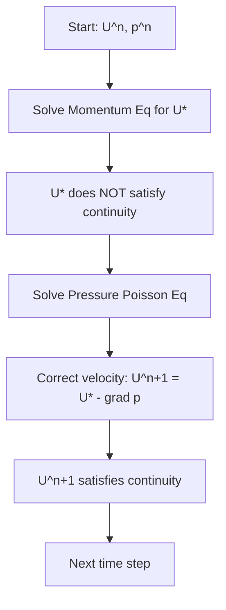

# Pressure-Velocity-Coupling
## HARDCORE Level - 2026-01-03

---

## Table of Contents
- [1. Theory](#1-theory-core-equations--physics)
- [2. Class Hierarchy](#2-openfoam-class-hierarchy--implementation)
- [3. Code Walkthrough](#3-code-walkthrough)
- [4. Dictionary Analysis](#4-dictionary-analysis--configuration)
- [5. Practical Tasks](#5-hands-on-practical-tasks--coding)
- [6. Concept Checks](#6-concept-checks)

---

## 1. Theory: Core Equations & Physics {#1-theory-core-equations--physics}

### 1.1 The Fundamental Challenge

The pressure-velocity coupling problem arises because the **momentum equation** contains pressure gradients, but for incompressible flows, there is **no explicit equation for pressure**. Pressure acts as a Lagrange multiplier that enforces the continuity constraint (mass conservation).

> [!INFO] **Why is this difficult?**
> The pressure field is coupled to velocity through the momentum equation, but velocity must satisfy the continuity equation. This creates a **circular dependency**:
> - Pressure gradient → drives velocity
> - Velocity → must satisfy continuity
> - Continuity → determines pressure

(ปัญหานี้เกิดจากการที่สมการโมเมนตัมมีความดัน แต่สำหรับการไหลแบบอัดตัวไม่ได ไม่มีสมการชัดเจนสำหรับความดัน ความดันทำหน้าที่เป็นตัวคูณ Lagrange ที่บังคับให้เกิดการอนุรักษ์มวล)

---

### 1.2 Governing Equations

#### 1.2.1 Continuity Equation (Mass Conservation)

For incompressible flow ($\rho = \text{constant}$):

$$\nabla \cdot \mathbf{U} = 0$$

Where:
- $\mathbf{U}$ = velocity vector field $[m/s]$
- $\nabla \cdot$ = divergence operator
- This equation states that the **net volume flux** through any control volume is zero

(สมการต่อเนื่อง: อัตราการไหลเข้าและออกต้องสมดุล ไม่มีการสะสมมวล)

#### 1.2.2 Momentum Equation (Navier-Stokes)

$$\frac{\partial \mathbf{U}}{\partial t} + \nabla \cdot (\mathbf{U}\mathbf{U}) = -\frac{1}{\rho}\nabla p + \nu \nabla^2 \mathbf{U} + \mathbf{g}$$

**Term-by-term explanation:**

| Term | Mathematical Form | Physical Meaning |
|------|-------------------|------------------|
| **Unsteady** | $\frac{\partial \mathbf{U}}{\partial t}$ | Local acceleration (rate of change of velocity) |
| **Convection** | $\nabla \cdot (\mathbf{U}\mathbf{U})$ | Nonlinear inertial transport (velocity transporting itself) |
| **Pressure Gradient** | $-\frac{1}{\rho}\nabla p$ | Force driving flow from high to low pressure |
| **Diffusion** | $\nu \nabla^2 \mathbf{U}$ | Viscous forces (momentum diffusion) |
| **Body Force** | $\mathbf{g}$ | Gravitational acceleration |

Where:
- $p$ = pressure $[Pa]$
- $\rho$ = density $[kg/m^3]$
- $\nu$ = kinematic viscosity $[m^2/s]$
- $\mathbf{g}$ = gravitational acceleration $[m/s^2]$

(สมการโมเมนตัม: อธิบายการเปลี่ยนแปลงของโมเมนตัมตามกฎข้อที่สองของนิวตัน)

---

### 1.3 The Pressure-Velocity Coupling Problem

When we discretize the momentum equation to solve for velocity:

$$\mathbf{U}^{n+1} = \mathbf{U}^n + \Delta t \left[ -\nabla \cdot (\mathbf{U}\mathbf{U}) - \frac{1}{\rho}\nabla p + \nu \nabla^2 \mathbf{U} + \mathbf{g} \right]$$

**The critical issue:** The velocity field $\mathbf{U}^{n+1}$ computed from this equation will **NOT** satisfy $\nabla \cdot \mathbf{U}^{n+1} = 0$ unless the pressure field is correct.

> [!WARNING] **The Chicken-and-Egg Problem**
> - To get correct velocity → need correct pressure
> - To get correct pressure → need correct velocity (satisfying continuity)
> - Neither is known initially!

(ปัญหาไก่กับไข่: ต้องการความดันเพื่อหาความเร็ว แต่ต้องการความเร็วที่ต่อเนื่องเพื่อหาความดัน)

---

### 1.4 Solution Approaches

#### 1.4.1 Pressure Poisson Equation

Taking the divergence of the momentum equation and enforcing $\nabla \cdot \mathbf{U} = 0$:

$$\nabla^2 p = \rho \nabla \cdot \left[ -\nabla \cdot (\mathbf{U}\mathbf{U}) + \nu \nabla^2 \mathbf{U} + \mathbf{g} \right] - \frac{\rho}{\Delta t} \nabla \cdot \mathbf{U}^*$$

Where $\mathbf{U}^*$ is the intermediate velocity field.

**Boundary conditions for pressure:**
- Neumann BC: $\frac{\partial p}{\partial n} = 0$ (at walls)
- Dirichlet BC: $p = p_{\text{specified}}$ (at inlets/outlets)

(สมการ Poisson สำหรับความดัน: ได้จากการเอา divergence ของสมการโมเมนตัมและบังคับใช้ continuity)

#### 1.4.2 Operator Splitting Methods

**Projection Method (Chorin's Method):**

**Mathematical formulation:**

1. **Predictor step** (intermediate velocity):
   $$\frac{\mathbf{U}^* - \mathbf{U}^n}{\Delta t} = -\nabla \cdot (\mathbf{U}^n\mathbf{U}^n) + \nu \nabla^2 \mathbf{U}^n + \mathbf{g}$$

2. **Corrector step** (pressure projection):
   $$\mathbf{U}^{n+1} = \mathbf{U}^* - \frac{\Delta t}{\rho} \nabla p^{n+1}$$

3. **Pressure equation** (enforcing continuity):
   $$\nabla^2 p^{n+1} = \frac{\rho}{\Delta t} \nabla \cdot \mathbf{U}^*$$

(วิธี Projection: แบ่งเป็นขั้นตอนการทำนายและการแก้ไข เพื่อให้ความเร็วตอบสนองต่อสมการต่อเนื่อง)

---

### 1.5 Key Numerical Challenges

> [!TIP] **Staggered Grid Approach**
> On a **collocated grid** (all variables at same cell centers), pressure-velocity coupling can lead to **checkerboard oscillations**. The solution:
> - Store pressure at cell centers
> - Store velocity components at cell faces
> - This naturally enforces continuity coupling

(ตาข่าย Staggered: เก็บความดันที่จุดศูนย์กลางเซลล์ และความเร็วที่ผนังเซลล์ เพื่อป้องกันปัญหา checkerboard)

#### 1.5.1 The Rhie-Chow Interpolation

For collocated arrangements, the **Rhie-Chow interpolation** prevents pressure-velocity decoupling:

$$\mathbf{U}_f = \overline{\mathbf{U}}_f - \Delta_f \left( \overline{\frac{\nabla p}{\rho}}_f - \frac{\nabla p_f}{\rho} \right)$$

Where:
- $\mathbf{U}_f$ = face velocity
- $\overline{\mathbf{U}}_f$ = linearly interpolated cell-centered velocity
- $\Delta_f$ = geometric coefficient
- This adds a **pressure difference term** to couple adjacent pressure nodes

(การแทรก Rhie-Chow: เพิ่มเทอมความต่างความดันเพื่อเชื่อมโยงโหนดความดันที่ติดกัน)

#### 1.5.2 Under-Relaxation Factors

For steady-state solutions using iterative methods:

$$\phi^{n+1} = \phi^n + \alpha_\phi (\phi^* - \phi^n)$$

Typical values:
- $\alpha_U = 0.5 - 0.7$ (velocity under-relaxation)
- $\alpha_p = 0.3 - 0.5$ (pressure under-relaxation)

> [!WARNING] **Too high relaxation** → solution divergence
> **Too low relaxation** → very slow convergence

(ปัจจัย under-relaxation: ควบคุมอัตราการเปลี่ยนแปลงของตัวแปรในแต่ละรอบการวนซ้ำ)

---

### 1.6 Summary of Key Equations

| Equation | Form | Purpose |
|----------|------|---------|
| **Continuity** | $\nabla \cdot \mathbf{U} = 0$ | Mass conservation constraint |
| **Momentum** | $\frac{\partial \mathbf{U}}{\partial t} + \nabla \cdot (\mathbf{U}\mathbf{U}) = -\frac{1}{\rho}\nabla p + \nu \nabla^2 \mathbf{U} + \mathbf{g}$ | Newton's 2nd law for fluid |
| **Pressure Poisson** | $\nabla^2 p = \frac{\rho}{\Delta t} \nabla \cdot \mathbf{U}^*$ | Enforces continuity |
| **Velocity Correction** | $\mathbf{U}^{n+1} = \mathbf{U}^* - \frac{\Delta t}{\rho} \nabla p^{n+1}$ | Projects onto divergence-free field |

(สรุปสมการสำคัญ: การอนุรักษ์มวล สมการโมเมนตัม สมการความดัน Poisson และการแก้ไขความเร็ว)

---

## 2. OpenFOAM Class Hierarchy & Implementation {#2-openfoam-class-hierarchy--implementation}

<!-- PLACEHOLDER_CLASS -->

---

## 3. Code Walkthrough {#3-code-walkthrough}

<!-- PLACEHOLDER_CODE -->

---

## 4. Dictionary Analysis & Configuration {#4-dictionary-analysis--configuration}

<!-- PLACEHOLDER_DICT -->

---

## 5. Hands-on: Practical Tasks & Coding {#5-hands-on-practical-tasks--coding}

<!-- PLACEHOLDER_TASKS -->

---

## 6. Concept Checks {#6-concept-checks}

<!-- PLACEHOLDER_CHECKS -->

---

## Recommended Reading

- OpenFOAM User Guide: https://www.openfoam.com/documentation/user-guide
- OpenFOAM Programmer's Guide: https://doc.openfoam.com/
- CFD Online Forum: https://www.cfd-online.com/Forums/openfoam/

