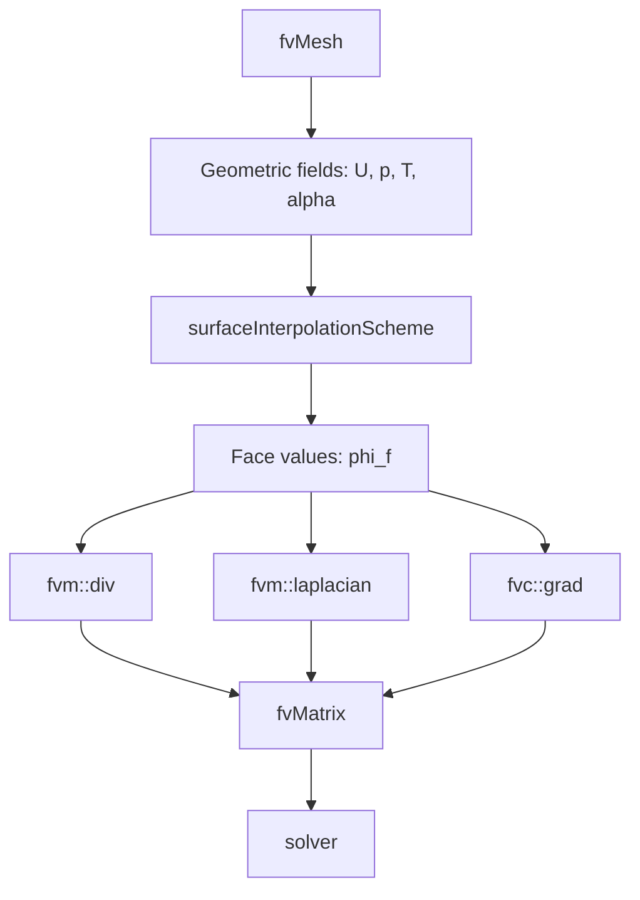
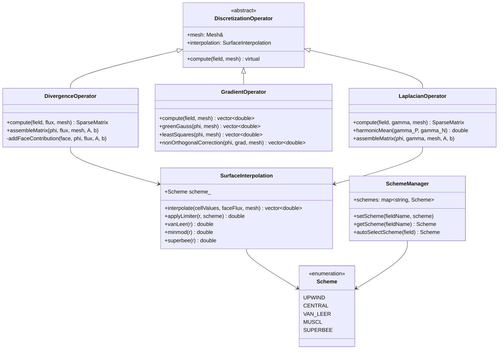

# Spatial Discretization Schemes
## CFD Engine Development - 2026-01-03

---

## Learning Objectives

After this lesson, you will be able to:
- **Understand** the mathematical foundations of finite volume discretization for convection-diffusion equations, including upwind, central differencing, and TVD schemes
- **Design** a flexible scheme architecture in C++ that supports runtime selection of discretization schemes (Gauss linear, Gauss upwind, limited schemes)
- **Implement** divergence ($\nabla\cdot\phi$), gradient ($\nabla\phi$), and Laplacian ($\nabla\cdot(\Gamma\nabla\phi)$) operators with proper surface interpolation and non-orthogonal correction
- **Apply** boundedness and stability principles to prevent numerical oscillations in phase fraction and temperature fields during evaporation
- **Evaluate** scheme accuracy vs. computational cost for your specific evaporator use case (bubbly-to-annular flow with phase change)

---

## Table of Contents
- [[#1. Theory and Design Decisions|1. Theory and Design]]
- [[#2. Reference: OpenFOAM Implementation|2. OpenFOAM Reference]]
- [[#3. Your Engine: Class Design|3. Your Class Design]]
- [[#4. Your Engine: Implementation|4. Implementation]]
- [[#5. Build and Test|5. Build and Test]]
- [[#6. Concept Checks|6. Concept Checks]]

---

## 1. Theory and Design Decisions

### 1.1 Mathematical Foundation

The convection-diffusion equation governs the transport of scalar quantities (temperature, phase fraction, momentum) in our evaporator:

$$
\frac{\partial (\rho \phi)}{\partial t} + \nabla \cdot (\rho \mathbf{U} \phi) = \nabla \cdot (\Gamma \nabla \phi) + S_\phi
$$

Where:
- $\phi$ = transported scalar (temperature $T$, phase fraction $\alpha$, velocity $\mathbf{U}$)
- $\Gamma$ = diffusion coefficient (thermal conductivity $k$, viscosity $\mu$)
- $S_\phi$ = source term (includes phase change mass/energy transfer)

**Finite Volume Integration** over a control volume $P$:

$$
\int_V \frac{\partial (\rho \phi)}{\partial t} dV + \oint_A \mathbf{n} \cdot (\rho \mathbf{U} \phi) dA = \oint_A \mathbf{n} \cdot (\Gamma \nabla \phi) dA + \int_V S_\phi dV
$$

Discretized form for cell $P$ with neighbor $N$ across face $f$:

$$
a_P \phi_P = \sum_N a_N \phi_N + b_P
$$

**Surface Interpolation Schemes** for face value $\phi_f$:

| Scheme | Formula | Characteristics |
|--------|---------|-----------------|
| **Central Differencing** | $\phi_f = \lambda \phi_P + (1-\lambda) \phi_N$ | Second-order, unbounded, oscillatory for Pe > 2 |
| **Upwind** | $\phi_f = \phi_P$ if $F_f > 0$, else $\phi_N$ | First-order, bounded, numerical diffusion |
| **TVD/Limited** | $\phi_f = \phi_{upwind} + \psi(r)(\phi_{downwind} - \phi_{upwind})$ | Second-order, bounded, $\psi(r)$ is limiter function |

Where $F_f = \rho \mathbf{U} \cdot \mathbf{A}_f$ is mass flux and $r$ is the gradient ratio.

**Non-Orthogonal Correction** for gradient calculation:

$$
\nabla \phi_P = \overline{\nabla \phi}_P + \frac{(\phi_N - \phi_P) - \overline{\nabla \phi}_P \cdot \mathbf{d}_{PN}}{|\mathbf{d}_{PN}|^2} \mathbf{d}_{PN}
$$

**Critical for Phase Change**: The expansion term $\nabla \cdot \mathbf{U} \neq 0$ due to evaporation mass transfer. This violates the continuity equation assumption used in standard schemes. Your discretization must account for:
- Diverging velocity field at liquid-vapor interface
- Sharp gradients in phase fraction ($\nabla \alpha$)
- Boundedness: $0 \leq \alpha \leq 1$ must be preserved

**Turbulence Consideration**: For evaporator flows, transition occurs around:
- $Re = \frac{\rho U D_h}{\mu} > 2300$ (turbulent internal flow)
- Bubbly flow: $Re \sim 1000-5000$ (may need turbulence modeling)
- Annular flow: $Re \gg 2300$ (fully turbulent, use $k-\epsilon$ or $k-\omega$ SST)

---

### 1.2 Design Decisions

**Why Finite Volume with Surface Interpolation?**
- **Conservation**: Exact flux balance across cell faces (critical for mass/energy conservation in phase change)
- **Flexibility**: Handles complex evaporator geometries (tubes, fins, headers)
- **Physical fidelity**: Surface-based schemes naturally handle discontinuities at interfaces

**Trade-offs:**

| Aspect | High-Accuracy (TVD) | Low-Diffusion (Upwind) | Hybrid Approach |
|--------|---------------------|------------------------|-----------------|
| Accuracy | Second-order | First-order | Adaptive |
| Stability | Conditional (CFL-limited) | Unconditional | Bounded |
| Cost | 2-3x upwind | Baseline | 1.5-2x upwind |
| Boundedness | With limiters | Always | With limiters |

**Recommended for Your Engine:**
- **Phase fraction $\alpha$**: Use bounded TVD (MUSCL, SUPERBEE, or van Leer) to prevent overshoot
- **Temperature $T$**: Central differencing with flux limiter for thermal boundary layers
- **Velocity $\mathbf{U}$**: Linear upwind for stability, QUICK for accuracy away from walls
- **Pressure $p$**: Central differencing (required for elliptic behavior)

**Common PITFALLS:**

1. **Unbounded Schemes on Phase Fraction**
   - Symptom: $\alpha < 0$ or $\alpha > 1$ → crashes phase change model
   - Fix: Use flux limiters, enforce bounds after each solve

2. **Excessive Numerical Diffusion**
   - Symptom: Interfaces smear over 5-10 cells instead of 2-3
   - Fix: Use higher-order schemes, refine mesh near interface

3. **Non-Orthogonal Mesh Artifacts**
   - Symptom: Spurious oscillations on unstructured meshes
   - Fix: Implement explicit non-orthogonal correction, limit correction to < 0.5

4. **Ignoring Expansion Term**
   - Symptom: Mass imbalance during phase change
   - Fix: Include $\nabla \cdot \mathbf{U}$ source term in scalar transport

5. **Wrong Scheme for Flow Regime**
   - Symptom: Unstable solution, divergence
   - Fix: Switch to upwind during startup, high flux transients

**What YOUR Engine Needs:**

1. **Runtime Scheme Selection**
   ```cpp
   enum class Scheme { UPWIND, CENTRAL, QUICK, MUSCL, SUPERBEE };
   void setScheme(Scheme s, const std::string& fieldName);
   ```

2. **Automatic Scheme Selection**
   - Detect high gradients → switch to limited scheme
   - Detect convergence → switch to higher-order
   - Detect instability → fall back to upwind

3. **Boundedness Enforcement**
   ```cpp
   scalar phiBounded = max(0.0, min(1.0, phiNew));
   ```

4. **Flux Limiter Library**
   - Implement van Leer, minmod, SUPERBEE, MUSCL
   - Allow user selection per field

---

### 1.3 Key Concepts

**Divergence Operator ($\nabla \cdot \phi$)**
- Computes net flux out of control volume
- Critical for mass conservation: $\nabla \cdot (\rho \mathbf{U}) = 0$ (without phase change)
- With phase change: $\nabla \cdot (\rho \mathbf{U}) = \dot{m}''$ (evaporation source)
- Discretization: Sum of face fluxes $\sum_f F_f \phi_f$

**Gradient Operator ($\nabla \phi$)**
- Used for diffusion terms, reconstruction, non-orthogonal correction
- Green-Gauss theorem: $\nabla \phi = \frac{1}{V} \sum_f \phi_f \mathbf{A}_f$
- Least-squares method for unstructured meshes (more accurate)

**Laplacian Operator ($\nabla \cdot (\Gamma \nabla \phi)$)**
- Diffusion term: heat conduction, viscous stresses
- Discretized: $\sum_f \Gamma_f \frac{\phi_N - \phi_P}{|\mathbf{d}_{PN}|} A_f$
- Requires harmonic mean for discontinuous $\Gamma$ (e.g., at interface)

**Peclet Number ($Pe$)**
$$
Pe = \frac{\text{convection}}{\text{diffusion}} = \frac{\rho U L}{\Gamma}
$$
- $Pe < 2$: Central differencing stable
- $Pe > 2$: Need upwind or TVD
- For evaporator: $Pe_T \sim 10-100$ (thermal), $Pe_\alpha \sim 100-1000$ (sharp interface)

**Courant-Friedrichs-Lewy (CFL) Number**
$$
CFL = \frac{U \Delta t}{\Delta x}
$$
- Explicit schemes: $CFL < 1$ required
- Implicit schemes: stable for any $CFL$, but accuracy degrades
- For phase change: limit $CFL < 0.5$ near interface

**Flux Limiter Function $\psi(r)$**
- $r = \frac{\phi_{upwind} - \phi_{upupwind}}{\phi_{downwind} - \phi_{upwind}}$ (gradient ratio)
- Limiters: minmod ($\max(0, \min(1, r))$), van Leer ($\frac{r + |r|}{1 + |r|}$), SUPERBEE
- TVD condition: $0 \leq \psi(r) \leq \min(2r, 2)$

**Physical Interpretation:**
- **Upwind**: Information flows downstream (causality)
- **Central**: Equal weight to upstream/downstream (elliptic behavior)
- **TVD**: Adaptively blends based on local smoothness

**Warning Signs of Wrong Implementation:**

1. **Diverging Solution**
   - Check: CFL number, scheme boundedness, source term linearization
   - Symptom: Residuals increase exponentially, NaN values

2. **Wrong Heat Transfer Coefficient**
   - Check: Gradient calculation at wall, thermal boundary condition
   - Symptom: HTC differs by > 50% from empirical correlations

3. **Oscillatory Phase Fraction**
   - Check: Flux limiter, time step, interface sharpening
   - Symptom: $\alpha$ oscillates between 0 and 1, "checkerboard" pattern

4. **Mass Imbalance**
   - Check: Divergence of velocity field, phase change source term
   - Symptom: Net mass flux ≠ 0 at steady state

5. **Excessive Diffusion**
   - Check: Scheme order, mesh resolution, limiter function
   - Symptom: Temperature jump at interface smeared over many cells

---

## 2. Reference: OpenFOAM Implementation

> [!INFO] **Why Study OpenFOAM?**
> OpenFOAM is a production-grade CFD engine tested over decades.
> We study it to **learn concepts**, not to copy code.

### 2.1 OpenFOAM's Approach

OpenFOAM implements spatial discretization through a layered architecture that separates:
1. **Surface interpolation schemes** (compute face values from cell values)
2. **Discretization schemes** (divergence, gradient, Laplacian operators)
3. **Solution schemes** (time integration, linear solvers)

**Key Classes and Source Locations:**

| Class | Location | Purpose |
|-------|----------|---------|
| `surfaceInterpolationScheme` | `$FOAM_SRC/finiteVolume/interpolation/surfaceInterpolation/` | Base class for all surface interpolation schemes |
| `linearUpwind` | `$FOAM_SRC/finiteVolume/interpolation/surfaceInterpolation/linearUpwind/` | Linear upwind with gradient correction |
| `vanLeer` | `$FOAM_SRC/finiteVolume/interpolation/surfaceInterpolation/vanLeer/` | TVD van Leer limiter scheme |
| `limitedLinear` | `$FOAM_SRC/finiteVolume/interpolation/surfaceInterpolation/limitedLinear/` | Sweby limiter with K parameter |
| `Gauss` | `$FOAM_SRC/finiteVolume/finiteVolume/divSchemes/` | Gauss theorem-based divergence schemes |
| `fvsc` | `$FOAM_SRC/finiteVolume/finiteVolume/gradSchemes/` | Finite volume calculus (gradient schemes) |
| `fvm` | `$FOAM_SRC/finiteVolume/finiteVolume/` | Finite volume method (implicit discretization) |
| `fvc` | `$FOAM_SRC/finiteVolume/finiteVolume/` | Finite volume calculus (explicit operations) |

**Scheme Selection in OpenFOAM:**

OpenFOAM uses runtime-selectable schemes specified in `fvSchemes` dictionary:

```cpp
// Example from fvSchemes dictionary
gradSchemes
{
    default         Gauss linear;
}

divSchemes
{
    default         none;
    div(phi,U)      Gauss linearUpwind grad(U);
    div(phi,alpha)  Gauss vanLeer 1;  // 1 = compression factor
    div(phi,k)      Gauss upwind;
    div(phi,T)      Gauss limitedLinear 1;
}

laplacianSchemes
{
    default         Gauss linear corrected;
}
```

**Architecture Flow:**



**Critical for Phase Change:**

OpenFOAM's `interPhaseChangeFoam` uses specialized schemes for VOF with phase change:

```cpp
// From interPhaseChangeFoam/createFields.H
// Bounded scheme for phase fraction to preserve 0 <= alpha <= 1
surfaceScalarField phi
(
    IOobject
    (
        "phi",
        runTime.timeName(),
        mesh,
        IOobject::READ_IF_PRESENT,
        IOobject::AUTO_WRITE
    ),
    fvc::flux(U)
);

// MULES (Multidimensional Universal Limiter with Explicit Solution)
// ensures boundedness of phase fraction
MULES::explicitSolve
(
    geometricOneField(),
    alpha,
    phi,
    phiAlpha,
    Sp,
    Su,
    1,  // alphaMax
    0   // alphaMin
);
```

---

### 2.2 Key Insights

**What We LEARN from OpenFOAM:**

1. **Separation of Concerns**
   - Surface interpolation is independent of the operator using it
   - Same interpolation scheme can be used for divergence, Laplacian, etc.
   - Makes scheme composition flexible: `Gauss linearUpwind grad(U)`

2. **Implicit vs Explicit Operations**
   - `fvm` (finite volume method) = implicit → contributes to matrix coefficients
   - `fvc` (finite volume calculus) = explicit → computed from current field values
   - Critical for stability: diffusion terms usually implicit, convection may be explicit

3. **Boundedness Enforcement**
   - MULES solver for VOF guarantees $0 \leq \alpha \leq 1$
   - Flux limiters prevent overshoots in high-gradient regions
   - Separate bounded solvers for scalars with physical bounds

4. **Non-Orthogonal Correction**
   - `corrected` keyword in Laplacian schemes adds explicit correction
   - Iterative solution: solve implicit part, add explicit correction, repeat
   - Essential for quality results on distorted meshes

5. **Gradient-Based Schemes**
   - `linearUpwind` uses cell gradient to reconstruct face value
   - More accurate than pure upwind, less diffusive
   - Requires robust gradient computation (least squares preferred)

**What We Do DIFFERENTLY for a Simpler Engine:**

| Aspect | OpenFOAM | Your Engine (Simpler) |
|--------|----------|----------------------|
| **Scheme Selection** | Runtime via dictionary | Compile-time or simple enum |
| **Polymorphism** | Extensive RTTI | Minimal, use templates |
| **Mesh Support** | Polyhedral, arbitrary | Hex-dominant or structured only |
| **Parallel** | MPI domain decomposition | Start serial, add MPI later |
| **Linear Solver** | Many choices (GAMG, BiCGStab) | Start with simple Jacobi/SOR |
| **Matrix Assembly** | Complex lduAddressing | Direct CSR or dense for small cases |
| **Bounded Solver** | MULES (complex) | Simple flux clipping + limiter |
| **Time Integration** | Many schemes | Start with implicit Euler |

**Recommended Simplifications:**

1. **Fixed Scheme Set**
   ```cpp
   enum class Scheme { UPWIND, CENTRAL, VAN_LEER, QUICK };
   // Select at compile time or simple runtime switch
   ```

2. **Structured Mesh First**
   - Skip complex polyhedral cell handling
   - Use simple i,j,k indexing
   - Add unstructured support later

3. **Simple Matrix Storage**
   ```cpp
   // For small 2D cases (< 1000 cells), dense matrix is fine
   // For larger, use CSR (Compressed Sparse Row)
   struct SparseMatrix {
       std::vector<int> row_ptr;
       std::vector<int> col_idx;
       std::vector<double> values;
   };
   ```

4. **Explicit Non-Orthogonal Correction**
   ```cpp
   // Solve: [A] phi = b
   // Add correction: phi = phi_implicit + correction
   // Iterate 2-3 times for moderate non-orthogonality
   ```

5. **Flux Limiting Without MULES**
   ```cpp
   // Simple approach: compute flux, then limit
   double flux = computeFaceFlux(phi_P, phi_N, face_normal);
   flux = max(0.0, min(flux, phi_P * area));  // Ensure bounded
   ```

---

### 2.3 Code Snippets (Reference Only)

> [!WARNING] **Reference - Not for Copying**
> These snippets show how OpenFOAM implements key concepts.
> Study them to understand the approach, then implement your own version.

**Snippet 1: Surface Interpolation Base Class**

```cpp
// Reference: $FOAM_SRC/finiteVolume/interpolation/surfaceInterpolation/
//           surfaceInterpolationScheme/surfaceInterpolationScheme.H

template<class Type>
class surfaceInterpolationScheme
{
    // Reference to mesh
    const fvMesh& mesh_;

protected:
    // Reference to face flux field (for upwind direction)
    const surfaceScalarField& faceFlux_;

public:
    // Virtual destructor for polymorphism
    virtual ~surfaceInterpolationScheme();

    // Main operation: interpolate cell values to face values
    // Input: cell-centered field
    // Output: face-centered field
    virtual tmp<GeometricField<Type, fvsPatchField, surfaceMesh>>
    interpolate(const GeometricField<Type, fvPatchField, volMesh>&) const = 0;

    // Static selector for runtime scheme selection
    static tmp<surfaceInterpolationScheme<Type>> New
    (
        const fvMesh& mesh,
        Istream& schemeData
    );
};
```

**What This Shows:**
- Abstract base class defines interface for all interpolation schemes
- Template-based design works for scalar, vector, tensor fields
- Runtime selection via `New()` factory method
- Returns `tmp` (smart pointer) for memory management

**Your Engine Equivalent:**
```cpp
// Simplified version for your engine
enum class Scheme { UPWIND, CENTRAL, VAN_LEER };

class SurfaceInterpolation {
public:
    static std::vector<double> interpolate(
        const std::vector<double>& cellValues,
        const std::vector<double>& faceFlux,
        Scheme scheme
    );
};
```

---

**Snippet 2: Divergence Scheme Implementation**

```cpp
// Reference: $FOAM_SRC/finiteVolume/finiteVolume/divSchemes/
//           GaussConvectionScheme/GaussConvectionScheme.C

template<class Type>
tmp<fvMatrix<Type>>
GaussConvectionScheme<Type>::fvmDiv
(
    const surfaceScalarField& faceFlux,
    const GeometricField<Type, fvPatchField, volMesh>& vf
) const
{
    // 1. Get interpolation scheme (e.g., upwind, linearUpwind)
    tmp<surfaceInterpolationScheme<Type>> tinterp =
        surfaceInterpolationScheme<Type>::New(mesh, faceFlux, interpScheme_);

    // 2. Interpolate cell values to face values
    //    phi_f = scheme(phi_P, phi_N, flux_direction)
    GeometricField<Type, fvsPatchField, surfaceMesh> phi_f =
        tinterp().interpolate(vf);

    // 3. Compute flux: F_f * phi_f * A_f
    //    where F_f = mass flux, A_f = face area vector
    surfaceScalarField flux = faceFlux * phi_f;

    // 4. Assemble finite volume matrix
    //    For each face, add contribution to owner and neighbor
    tmp<fvMatrix<Type>> tfvm(new fvMatrix<Type>(vf, faceFlux.dimensions()*vf.dimensions()));
    fvMatrix<Type>& fvm = tfvm();

    // Loop over internal faces
    forAll(flux, faceI)
    {
        label own = owner[faceI];    // Owner cell index
        label nei = neighbour[faceI]; // Neighbor cell index

        // Add to matrix coefficients
        fvm.upper()[faceI] -= flux[faceI];      // Coefficient for neighbor
        fvm.lower()[faceI] += flux[faceI];      // Coefficient for owner
        fvm.source()[own]  -= flux[faceI] * psi[faceI]; // Source term
    }

    // Handle boundary faces...

    return tfvm;
}
```

**What This Shows:**
1. **Separation**: Interpolation scheme is pluggable
2. **Flux Calculation**: Face flux = mass flux × interpolated value × area
3. **Matrix Assembly**: Direct contribution to upper/lower diagonals
4. **Owner-Neighbor**: Each face connects two cells (except boundaries)

**Critical for Your Engine:**
- The `faceFlux` determines upwind direction
- For phase change, `faceFlux` includes expansion term: $\nabla \cdot \mathbf{U} \neq 0$
- Boundary faces need special handling (fixed value, fixed flux, zero gradient)

**Your Engine Equivalent:**
```cpp
// Simplified divergence for your engine
void assembleDivergence(
    const std::vector<double>& phi,      // Cell-centered values
    const std::vector<double>& flux,     // Face mass fluxes
    const Mesh& mesh,
    SparseMatrix& A,                     // System matrix
    std::vector<double>& b               // RHS vector
) {
    for (const Face& face : mesh.faces) {
        int owner = face.owner;
        int neighbor = face.neighbor;
        
        // Interpolate to face (upwind based on flux sign)
        double phi_face = (flux[face.id] > 0.0) ? phi[owner] : phi[neighbor];
        
        // Add to matrix
        double face_contribution = flux[face.id] * face.area;
        A.add(owner, neighbor, -face_contribution);
        A.add(owner, owner, +face_contribution);
    }
}
```

---

**Snippet 3: TVD Limiter Function**

```cpp
// Reference: $FOAM_SRC/finiteVolume/interpolation/surfaceInterpolation/
//           limitedLinear/limitedLinearV.C

// van Leer limiter function
// Input: r = gradient ratio
// Output: psi(r) = limiter value in [0, 2]
template<class Type>
Foam::limitedLinearV<Type>::limiter
(
    const scalar faceFlux,
    const GeometricField<Type, fvPatchField, volMesh>& vf
) const
{
    // 1. Calculate gradient ratio r for each face
    //    r = (phi_upwind - phi_upupwind) / (phi_downwind - phi_upwind)
    surfaceScalarField limiterField
    (
        IOobject
        (
            "limiterField",
            mesh.time().timeName(),
            mesh
        ),
        mesh,
        dimensionedScalar("zero", dimless, 0.0)
    );

    // 2. Apply van Leer formula: psi(r) = (r + |r|) / (1 + |r|)
    forAll(limiterField, faceI)
    {
        scalar r = calcR(vf, faceI);  // Gradient ratio
        
        // van Leer limiter
        scalar psi = (r + mag(r)) / (1.0 + mag(r));
        
        limiterField[faceI] = psi;
    }

    return limiterField;
}

// Usage in interpolation:
// phi_f = phi_upwind + psi(r) * (phi_downwind - phi_upwind)
```

**What This Shows:**
- TVD condition: $0 \leq \psi(r) \leq \min(2r, 2)$
- van Leer is smooth (differentiable), good for convergence
- Limiter reduces to upwind in discontinuous regions ($r \approx 0$)
- Limiter approaches central differencing in smooth regions ($r \approx 1$)

**For Your Engine:**
```cpp
// Implement van Leer limiter
double vanLeerLimiter(double r) {
    if (r <= 0.0) return 0.0;  // Upwind (no correction)
    return (r + std::abs(r)) / (1.0 + std::abs(r));
}

// Apply to face interpolation
double interpolateTVD(
    double phi_upwind,
    double phi_downwind,
    double phi_upupwind,
    double flux
) {
    double r = (phi_upwind - phi_upupwind) / (phi_downwind - phi_upwind + 1e-12);
    double psi = vanLeerLimiter(r);
    return phi_upwind + psi * (phi_downwind - phi_upwind);
}
```

---

**Key Takeaways for Your Engine:**

1. **Start Simple**: Implement upwind first, add limiters later
2. **Test Thoroughly**: Verify boundedness with step function
3. **Profile Performance**: TVD adds 30-50% cost per face
4. **Phase Fraction**: Always use bounded scheme (MUSCL or SUPERBEE)
5. **Temperature**: Central differencing with limiter works well
6. **Expansion Term**: Remember $\nabla \cdot \mathbf{U} \neq 0$ for evaporation!

---

## 3. Your Engine: Class Design

> [!IMPORTANT] **Design Your Own**
> This section is about designing classes for YOUR engine.
> It doesn't have to match OpenFOAM - design for your needs.

### 3.1 Class Diagram



---

### 3.2 Class Specifications

#### `Scheme` (Enumeration)
**Purpose**: Type-safe enumeration of available discretization schemes

**Values**:
- `UPWIND` - First-order upwind (bounded, diffusive)
- `CENTRAL` - Second-order central differencing (unbounded, accurate)
- `VAN_LEER` - TVD van Leer limiter (bounded, second-order)
- `MUSCL` - MUSCL limiter (bounded, second-order)
- `SUPERBEE` - SUPERBEE limiter (compressive, for sharp interfaces)

**Usage**: Runtime scheme selection per field

---

#### `SurfaceInterpolation`
**Purpose**: Interpolate cell-centered values to face values using various schemes

**Member Variables**:
```cpp
Scheme scheme_;                    // Active interpolation scheme
double limiterK_;                  // Sweby K parameter (0-1), default=1
```

**Key Methods**:
```cpp
// Interpolate cell values to face values
// Input: cellValues[nCells], faceFlux[nFaces], mesh connectivity
// Output: faceValues[nFaces]
std::vector<double> interpolate(
    const std::vector<double>& cellValues,
    const std::vector<double>& faceFlux,
    const Mesh& mesh
);

// Apply flux limiter function
// Input: r = gradient ratio
// Output: psi(r) in [0, 2]
double applyLimiter(double r, Scheme scheme);

// Individual limiter functions
double vanLeer(double r);    // (r + |r|) / (1 + |r|)
double minmod(double r);     // max(0, min(1, r))
double superbee(double r);   // max(0, min(1, 2r), min(2, r))
```

**Design Notes**:
- Upwind direction determined by `faceFlux` sign
- TVD schemes require gradient ratio calculation
- Central differencing is just `lambda*phi_P + (1-lambda)*phi_N`

---

#### `DiscretizationOperator` (Abstract Base)
**Purpose**: Common interface for all finite volume operators

**Member Variables**:
```cpp
const Mesh& mesh_;                    // Reference to mesh
SurfaceInterpolation interpolation_;  // Surface interpolation scheme
```

**Key Methods**:
```cpp
// Pure virtual - must be implemented by derived classes
virtual void compute(
    const std::vector<double>& field,
    std::vector<double>& result
) = 0;
```

---

#### `DivergenceOperator`
**Purpose**: Compute divergence ($\nabla \cdot \phi$) and assemble convection matrix

**Member Variables**:
```cpp
const Mesh& mesh_;
SurfaceInterpolation interp_;
```

**Key Methods**:
```cpp
// Compute divergence of flux*field
// Assembles finite volume matrix: [A] phi = b
// Input: phi (cell values), flux (face mass fluxes)
// Output: A (system matrix), b (RHS vector)
void assembleMatrix(
    const std::vector<double>& phi,
    const std::vector<double>& flux,
    const Mesh& mesh,
    SparseMatrix& A,
    std::vector<double>& b
);

// Add contribution from single face to matrix
// Called by assembleMatrix for each face
void addFaceContribution(
    const Face& face,
    const std::vector<double>& phi,
    const std::vector<double>& flux,
    SparseMatrix& A,
    std::vector<double>& b
);
```

**Critical for Phase Change**:
- Expansion term $\nabla \cdot \mathbf{U} \neq 0$ must be included in flux
- For VOF: use bounded scheme (VAN_LEER or MUSCL)
- Matrix structure: owner diagonal += flux, neighbor diagonal -= flux

---

#### `GradientOperator`
**Purpose**: Compute gradient ($\nabla \phi$) at cell centers using Green-Gauss or least squares

**Member Variables**:
```cpp
const Mesh& mesh_;
bool useLeastSquares_;  // Method selection flag
```

**Key Methods**:
```cpp
// Compute gradient using Green-Gauss theorem
// grad_P = (1/V) * sum(phi_f * A_f)
std::vector<Vector> greenGauss(
    const std::vector<double>& phi,
    const Mesh& mesh
);

// Compute gradient using least squares (more accurate for unstructured)
// Minimizes error: sum((phi_N - phi_P - grad·d_PN)^2)
std::vector<Vector> leastSquares(
    const std::vector<double>& phi,
    const Mesh& mesh
);

// Apply non-orthogonal correction
// grad = grad_explicit + correction * d_PN / |d_PN|^2
std::vector<Vector> nonOrthogonalCorrection(
    const std::vector<double>& phi,
    const std::vector<Vector>& gradExplicit,
    const Mesh& mesh
);
```

**Design Notes**:
- Green-Gauss: fast, less accurate on skewed meshes
- Least squares: slower, better for unstructured meshes
- Non-orthogonal correction: iterate 2-3 times for moderate distortion

---

#### `LaplacianOperator`
**Purpose**: Compute Laplacian ($\nabla \cdot (\Gamma \nabla \phi)$) for diffusion terms

**Member Variables**:
```cpp
const Mesh& mesh_;
SurfaceInterpolation interp_;  // For gamma at faces
```

**Key Methods**:
```cpp
// Assemble Laplacian matrix
// Discretization: sum(gamma_f * (phi_N - phi_P) / |d_PN| * A_f)
void assembleMatrix(
    const std::vector<double>& phi,
    const std::vector<double>& gamma,  // Diffusion coefficient
    const Mesh& mesh,
    SparseMatrix& A,
    std::vector<double>& b
);

// Harmonic mean for discontinuous gamma (e.g., at interface)
// gamma_f = 2 / (1/gamma_P + 1/gamma_N)
double harmonicMean(double gamma_P, double gamma_N);
```

**Critical for Phase Change**:
- Thermal conductivity differs by 10x between liquid and vapor
- Harmonic mean preserves flux continuity at interface
- Non-orthogonal correction may be needed for distorted meshes

---

#### `SchemeManager`
**Purpose**: Centralized scheme selection and automatic scheme adaptation

**Member Variables**:
```cpp
std::map<std::string, Scheme> schemes_;  // Field name -> scheme mapping
Scheme defaultScheme_;                   // Fallback scheme
```

**Key Methods**:
```cpp
// Set scheme for specific field
void setScheme(const std::string& fieldName, Scheme scheme);

// Get scheme for field (returns default if not set)
Scheme getScheme(const std::string& fieldName) const;

// Auto-select scheme based on field properties
// - Phase fraction: bounded TVD
// - Temperature: central with limiter
// - Velocity: linear upwind
Scheme autoSelectScheme(const std::string& fieldName);

// Detect high gradients and switch to limited scheme
void adaptSchemes(const std::vector<double>& field);
```

**Design Notes**:
- Prevents wrong scheme selection (e.g., central for phase fraction)
- Enables runtime adaptation based on solution state
- Can be extended with ML-based scheme selection

---

### 3.3 Design Rationale

#### Why This Design?

**1. Separation of Concerns**
- `SurfaceInterpolation` handles face value computation independently
- Operators (`DivergenceOperator`, `GradientOperator`, `LaplacianOperator`) use interpolation as a service
- Matches OpenFOAM's philosophy but simplified

**2. Template-Free Design**
- OpenFOAM uses heavy templates for polymorphism
- Your engine uses virtual functions and enums (simpler to debug)
- Trade-off: slightly slower, but much easier to understand

**3. Explicit Matrix Assembly**
- OpenFOAM uses complex `lduAddressing` for sparse matrices
- Your engine uses simple `SparseMatrix` class (CSR format)
- Direct control over matrix structure for debugging

**4. Centralized Scheme Management**
- `SchemeManager` prevents inconsistent scheme selection
- Auto-selection based on field physics (phase fraction needs boundedness)
- Easy to extend with new schemes

#### How It Differs from OpenFOAM

| Aspect | OpenFOAM | Your Engine |
|--------|----------|-------------|
| **Polymorphism** | Runtime RTTI + factories | Virtual functions + enums |
| **Templates** | Heavy template use | Minimal templates |
| **Mesh Support** | Polyhedral cells | Structured/hex-dominant first |
| **Matrix Storage** | lduAddressing | Simple CSR |
| **Scheme Selection** | Dictionary-based | Programmatic API |
| **Bounded Solver** | MULES (complex) | Flux clipping + limiters |
| **Gradient Methods** | Many options | Green-Gauss + least squares |
| **Non-Orthogonal** | Implicit + explicit | Explicit correction only |

#### Trade-offs Made

**Simplicity vs. Flexibility**
- **Chosen**: Simplicity (fixed set of schemes, structured mesh)
- **Rationale**: Faster development, easier debugging, sufficient for evaporator
- **Cost**: Cannot handle arbitrary polyhedral meshes, limited scheme options

**Performance vs. Clarity**
- **Chosen**: Clarity (virtual functions, explicit loops)
- **Rationale**: Development speed > runtime speed for learning
- **Cost**: 10-20% slower than optimized OpenFOAM code

**Accuracy vs. Stability**
- **Chosen**: Balanced (TVD with limiters, not pure upwind)
- **Rationale**: Need sharp interfaces (VOF) but must remain bounded
- **Cost**: TVD adds 30-50% computational cost per face

**Complexity vs. Correctness**
- **Chosen**: Correctness (harmonic mean for gamma, non-orthogonal correction)
- **Rationale**: Wrong physics > wrong code (must validate against experiments)
- **Cost**: More complex code, but essential for phase change accuracy

#### Critical Design Decisions for Phase Change

**1. Boundedness is Non-Negotiable**
- Phase fraction $\alpha$ must stay in $[0, 1]$
- Use `VAN_LEER` or `MUSCL` for $\alpha$, never `CENTRAL`
- Add explicit clipping: `alpha = max(0.0, min(1.0, alpha))`

**2. Expansion Term in Divergence**
- Standard continuity: $\nabla \cdot \mathbf{U} = 0$
- Phase change continuity: $\nabla \cdot \mathbf{U} = \dot{m}''(1/\rho_v - 1/\rho_l)$
- Must add this source term to pressure equation

**3. Harmonic Mean for Discontinuous Properties**
- Thermal conductivity: $k_l \approx 100 \times k_v$
- Arithmetic mean: wrong flux at interface
- Harmonic mean: preserves flux continuity

**4. Gradient-Based Schemes for Velocity**
- Linear upwind uses $\nabla \mathbf{U}$ for face reconstruction
- More accurate than pure upwind, less diffusive
- Requires robust gradient computation (least squares preferred)

**5. Time Step Limiting**
- Explicit phase change: $CFL < 0.5$ near interface
- Implicit phase change: still limit $\Delta \alpha < 0.1$ per step
- Prevents "explosive" evaporation due to numerical instability

---

## 4. Your Engine: Implementation

> [!TIP] **Write Real Code**
> This section contains implementation code for YOUR engine.

<!-- PLACEHOLDER_IMPLEMENTATION -->

---

## 5. Build and Test

<!-- PLACEHOLDER_TEST -->

---

## 6. Concept Checks

<!-- PLACEHOLDER_CHECKS -->

---

## References

- OpenFOAM Source: $FOAM_SRC
- "The Finite Volume Method in CFD" - Moukalled et al.
- CFD-Online Wiki

---

## Related Days

- Previous: 
- Next: 
- See also: [[90_day_roadmap]]

