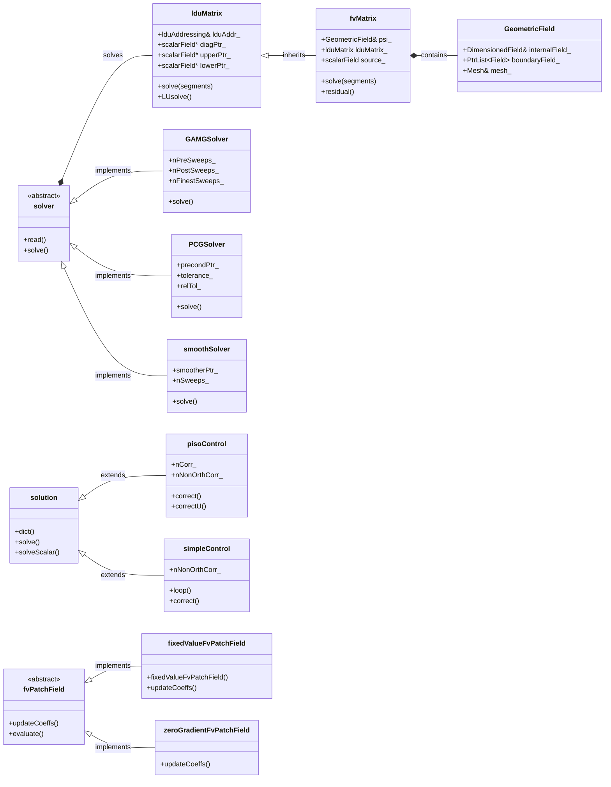
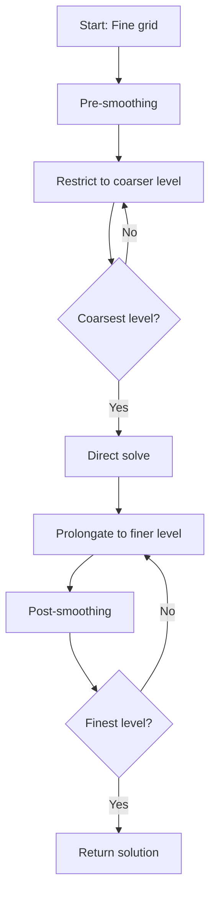
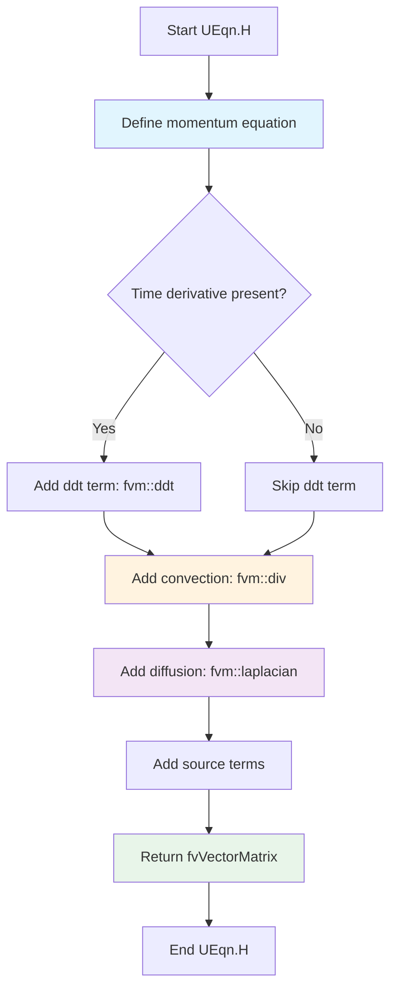
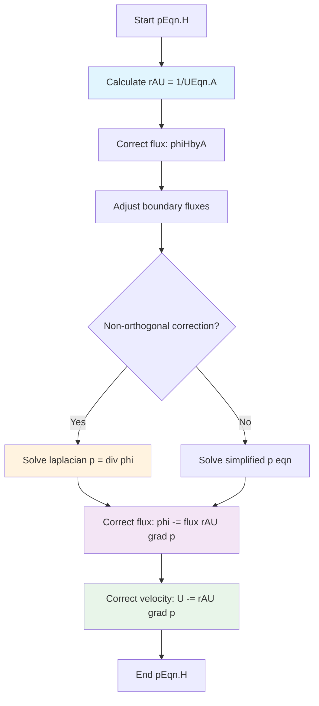
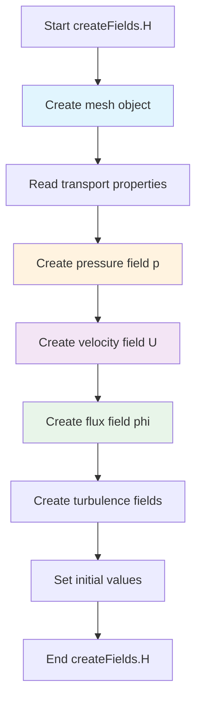

# Pressure-Velocity-Coupling
## HARDCORE Level - 2026-01-03

---

## Table of Contents
- [1. Theory](#1-theory-core-equations--physics)
- [2. Class Hierarchy](#2-openfoam-class-hierarchy--implementation)
- [3. Code Walkthrough](#3-code-walkthrough)
- [4. Dictionary Analysis](#4-dictionary-analysis--configuration)
- [5. Practical Tasks](#5-hands-on-practical-tasks--coding)
- [6. Concept Checks](#6-concept-checks)

---

## 1. Theory: Core Equations & Physics {#1-theory-core-equations--physics}

### 1.1 The Fundamental Challenge

The pressure-velocity coupling problem arises because the momentum equation contains both velocity and pressure, but there is **no explicit equation for pressure** in the Navier-Stokes equations. Pressure acts as a Lagrange multiplier that enforces the continuity constraint (mass conservation).

> [!INFO] **Why is this difficult?**
> In incompressible flows, pressure is not governed by an equation of state. Instead, pressure must adjust itself instantaneously to ensure that the velocity field remains divergence-free. This creates a tight coupling between pressure and velocity that requires special numerical treatment.

### 1.2 Governing Equations

#### Continuity Equation (Mass Conservation)

$$\nabla \cdot \mathbf{U} = 0$$

Where:
- $\mathbf{U}$ is the velocity vector $[m/s]$
- $\nabla \cdot$ is the divergence operator
- For incompressible flow, density $\rho$ is constant and cancels out

#### Momentum Equation (Newton's Second Law)

$$\frac{\partial \mathbf{U}}{\partial t} + \nabla \cdot (\mathbf{U}\mathbf{U}) = -\frac{1}{\rho}\nabla p + \nu \nabla^2 \mathbf{U} + \mathbf{g}$$

Where:
- $\frac{\partial \mathbf{U}}{\partial t}$ = Unsteady term (temporal acceleration)
- $\nabla \cdot (\mathbf{U}\mathbf{U})$ = Convective term (nonlinear inertial forces)
- $-\frac{1}{\rho}\nabla p$ = Pressure gradient force (drives flow)
- $\nu \nabla^2 \mathbf{U}$ = Viscous diffusion term ($\nu = \mu/\rho$ is kinematic viscosity)
- $\mathbf{g}$ = Body forces (e.g., gravity)

> [!TIP] **Physical Interpretation**
> The pressure gradient term $-\nabla p$ represents the force that fluid particles exert on each other. It's the mechanism by which pressure information propagates throughout the domain to enforce mass conservation.

### 1.3 The Pressure-Velocity Coupling Problem

If we discretize the momentum equation to solve for velocity:

$$\mathbf{U}^{n+1} = \mathbf{U}^n + \Delta t \left[ -\nabla \cdot (\mathbf{U}\mathbf{U}) + \nu \nabla^2 \mathbf{U} - \frac{1}{\rho}\nabla p^{n+1} + \mathbf{g} \right]$$

**The dilemma:**
- To compute $\mathbf{U}^{n+1}$, we need $p^{n+1}$
- To find $p^{n+1}$, we need $\mathbf{U}^{n+1}$ (to satisfy continuity)
- Neither can be computed independently!

### 1.4 Solution Approaches

#### 1.4.1 Pressure Poisson Equation (PPE)

Taking the divergence of the momentum equation and enforcing $\nabla \cdot \mathbf{U}^{n+1} = 0$:

$$\nabla^2 p^{n+1} = \frac{\rho}{\Delta t} \nabla \cdot \mathbf{U}^* + \rho \nabla \cdot \left[ \nabla \cdot (\mathbf{U}\mathbf{U}) - \nu \nabla^2 \mathbf{U} \right]$$

Where $\mathbf{U}^*$ is the intermediate velocity field.

**Key insight:** This transforms the coupling problem into a Poisson equation for pressure, which can be solved iteratively.

#### 1.4.2 Operator Splitting (Projection Methods)

The fractional-step approach:
1. **Predictor step:** Compute intermediate velocity $\mathbf{U}^*$ without pressure
2. **Corrector step:** Project $\mathbf{U}^*$ onto divergence-free space using pressure

$$\mathbf{U}^{n+1} = \mathbf{U}^* - \frac{\Delta t}{\rho} \nabla p^{n+1}$$

> [!WARNING] **Boundary Conditions Matter**
> The pressure Poisson equation requires consistent boundary conditions. Common approaches include:
> - **Neumann BCs:** $\frac{\partial p}{\partial n} = 0$ (zero normal pressure gradient)
> - **Dirichlet BCs:** Specified pressure at outlets
> Incorrect BC specification leads to "checkerboard" pressure oscillations.

### 1.5 Collocated vs. Staggered Grids

#### Staggered Grid (Harlow & Welch, 1965)
- Velocities and pressure stored at different locations
- Velocities at cell faces, pressure at cell centers
- **Advantage:** Naturally prevents pressure-velocity decoupling
- **Disadvantage:** Complex interpolation required

#### Collocated Grid (Rhie & Chow, 1983)
- All variables stored at cell centers
- Requires special interpolation (Rhie-Chow) to prevent checkerboarding
- **Advantage:** Simpler data structure
- **Disadvantage:** Additional numerical dissipation

> [!INFO] **OpenFOAM Approach**
> OpenFOAM uses a **collocated grid arrangement** with the Rhie-Chow interpolation technique implemented through the `fvc::div`, `fvc::grad`, and `fvm::laplacian` operators.

### 1.6 Mathematical Properties

The pressure Poisson equation has the form:

$$\nabla^2 p = f$$

This is an **elliptic partial differential equation** with these properties:

| Property | Description | Physical Meaning |
|----------|-------------|------------------|
| **Existence** | Solution exists if $\int_\Omega f \, dV = 0$ | Global mass conservation |
| **Uniqueness** | Solution unique up to an additive constant | Pressure defined relative to reference |
| **Smoothness** | Solution is infinitely differentiable | Pressure field is smooth |

> [!TIP] **Numerical Implication**
> The elliptic nature means pressure information propagates **instantaneously** throughout the entire domain (in the mathematical limit). This requires global solution methods (iterative solvers with preconditioning).

### 1.7 Non-Dimensionalization

Reynolds number characterizes the flow regime:

$$Re = \frac{UL}{\nu} = \frac{\text{Inertial Forces}}{\text{Viscous Forces}}$$

Where:
- $U$ = characteristic velocity
- $L$ = characteristic length
- $\nu$ = kinematic viscosity

**Impact on coupling:**
- **High Re:** Convection dominates → pressure correction more critical
- **Low Re:** Diffusion dominates → coupling more straightforward

### 1.8 Summary of Key Equations

| Equation | Form | Purpose |
|----------|------|---------|
| Continuity | $\nabla \cdot \mathbf{U} = 0$ | Mass conservation constraint |
| Momentum | $\frac{\partial \mathbf{U}}{\partial t} + \nabla \cdot (\mathbf{U}\mathbf{U}) = -\frac{1}{\rho}\nabla p + \nu \nabla^2 \mathbf{U}$ | Newton's 2nd law for fluids |
| Pressure Poisson | $\nabla^2 p = \frac{\rho}{\Delta t} \nabla \cdot \mathbf{U}^*$ | Enforces continuity via pressure |
| Projection | $\mathbf{U}^{n+1} = \mathbf{U}^* - \frac{\Delta t}{\rho} \nabla p$ | Corrects velocity to be divergence-free |

> [!INFO] **ความสำคัญของ Pressure-Velocity Coupling**
> การเชื่อมโยงระหว่างความดันและความเร็วเป็นหัวใจสำคัญของการจำลองการไหลของไหลที่ไม่สามารถอัดได้ (incompressible flow) หากไม่มีการจัดการที่เหมาะสม จะเกิดปัญหาการแกว่งของความดัน (pressure oscillation) และการละเมิดกฎการอนุรักษ์มวล (mass conservation violation)

---

## 2. OpenFOAM Class Hierarchy & Implementation {#2-openfoam-class-hierarchy--implementation}

### 2.1 Core Classes Overview

The pressure-velocity coupling in OpenFOAM is implemented through a sophisticated class hierarchy centered around the **finite volume discretization** framework. The key classes can be categorized into:

| Category | Classes | Purpose |
|----------|---------|---------|
| **Matrix Systems** | `fvMatrix`, `lduMatrix` | Discretized equation representation |
| **Solution Algorithms** | `solution`, `pisoControl`, `simpleControl` | Iterative solution strategies |
| **Pressure Solvers** | `GAMGSolver`, `PCGSolver`, `smoothSolver` | Elliptic equation solvers |
| **Boundary Conditions** | `fixedValueFvPatchField`, `zeroGradientFvPatchField` | Pressure/velocity BC handling |
| **Interpolation Schemes** | `linear`, `upwind`, `limitedLinear` | Rhie-Chow interpolation |

> [!INFO] **ความสำคัญของ Class Hierarchy (ความสำคัญของลำดับชั้นคลาส)**
> การออกแบบเชิงวัตถุ (Object-Oriented Design) ของ OpenFOAM ช่วยให้สามารถแยกส่วนการแก้สมการ (equation solving) การจัดการเงื่อนไขขอบ (boundary conditions) และการแก้ไขปัญหาเชิงตัวเลข (numerical schemes) ออกจากกันอย่างชัดเจน ทำให้ง่ายต่อการขยายและปรับแต่ง

### 2.2 Class Hierarchy Diagram



### 2.3 Key Classes Detailed Analysis

#### 2.3.1 `fvMatrix<T>` - Finite Volume Matrix

**Location:** `$FOAM_SRC/finiteVolume/fvMatrices/fvMatrix/fvMatrix.H`

The `fvMatrix` class represents a discretized finite volume equation of the form:

$$A\psi=B$$

Where:
- $A$ = Coefficient matrix (stored in `lduMatrix` format)
- $\psi$ = Field variable (pressure, velocity, etc.)
- $B$ = Source term

**Key methods:**

```cpp
// Solve the matrix system
solverPerformance solve(const dictionary&);

// Add source term
void operator+=(const GeometricField<T, fvPatchField, volMesh>&);

// Add matrix contribution
void operator+=(const fvMatrix<T>&);

// Return residual
tmp<GeometricField<T, fvPatchField, volMesh>> residual() const;
```

> [!TIP] **Matrix Assembly (การประกอบเมทริกซ์)**
> ใน OpenFOAM เมทริกซ์ถูกเก็บในรูปแบบ LDU (Lower-Diagonal-Upper) ซึ่งเป็นรูปแบบ sparse matrix ที่เหมาะสำหรับการแก้สมการเชิงอนุพันธ์ย่อยบนกริดโครงสร้างไม่สม่ำเสมอ (unstructured grid)

#### 2.3.2 `lduMatrix` - Linear Diagonal Upper Matrix

**Location:** `$FOAM_SRC/matrices/lduMatrix/lduMatrix.H`

The base class for sparse matrix storage in OpenFOAM. Uses the **LDU addressing scheme**:

```cpp
class lduMatrix
{
    // Diagonal coefficients
    scalarField* diagPtr_;
    
    // Upper triangular coefficients
    scalarField* upperPtr_;
    
    // Lower triangular coefficients
    scalarField* lowerPtr_;
    
    // Matrix addressing (owner-neighbor connectivity)
    const lduAddressing& lduAddr_;
};
```

**Memory layout:**

| Component | Description | Size |
|-----------|-------------|------|
| `diag` | Diagonal elements | $N_{cells}$ |
| `upper` | Upper triangular (owner→neighbor) | $N_{faces}$ |
| `lower` | Lower triangular (neighbor→owner) | $N_{faces}$ |

> [!INFO] **LDU Addressing (การจัดเก็บแบบ LDU)**
> รูปแบบ LDU ใช้ประโยชน์จากโครงสร้างของกริด finite volume ที่มีการเชื่อมต่อแบบ face-based ทำให้ประหยัดหน่วยความจำอย่างมากเมื่อเปรียบเทียบกับรูปแบบ dense matrix

#### 2.3.3 `GAMGSolver` - Geometric-Algebraic Multi-Grid Solver

**Location:** `$FOAM_SRC/matrices/lduMatrix/solvers/GAMGSolver/GAMGSolver.H`

The **GAMG solver** is the default pressure solver in OpenFOAM for incompressible flows. It combines:

1. **Geometric coarsening:** Agglomerates cells to create coarser mesh levels
2. **Algebraic smoothing:** Uses iterative methods on each level

**Configuration parameters:**

```cpp
// System/fvSolution dictionary
GAMG
{
    // Number of pre-smoothing sweeps
    nPreSweeps   0;
    
    // Number of post-smoothing sweeps
    nPostSweeps  2;
    
    // Smoother type (GaussSeidel, etc.)
    smoother     GaussSeidel;
    
    // Coarsening method
    agglomerator faceAreaPair;
    
    // Number of coarse levels
    nCellsInCoarsestLevel 10;
    
    // Merge levels
    mergeLevels 1;
}
```

**Algorithm flow:**



> [!TIP] **Why GAMG for Pressure? (ทำไมต้อง GAMG สำหรับความดัน?)**
> สมการ Poisson สำหรับความดันเป็นสมการเชิงวิกฤต elliptic ซึ่งมีการแพร่กระจายของข้อมูลทั่วทั้งโดเมน (global coupling) Multi-grid methods มีความเร็วในการลู่เข้า (convergence rate) ที่ไม่ขึ้นกับขนาดของกริด ทำให้เหมาะสำหรับการแก้สมการชนิดนี้

#### 2.3.4 `pisoControl` - PISO Algorithm Controller

**Location:** `$FOAM_SRC/finiteVolume/fvSolution/pisoControl/pisoControl.H`

Implements the **PISO (Pressure-Implicit with Splitting of Operators)** algorithm:

```cpp
class pisoControl
{
    // Number of PISO correctors
    label nCorr_;
    
    // Number of non-orthogonal correctors
    label nNonOrthCorr_;
    
    // Convergence tolerance
    scalar tol_;
    
    // Algorithm control
    bool correct();
    bool correctU();
};
```

**PISO loop structure:**

```cpp
// Typical PISO implementation in OpenFOAM
while (piso.correct())
{
    // 1. Solve momentum equation (predictor)
    solve(fvm::ddt(U) + fvm::div(phi, U) 
        - fvm::laplacian(nu, U)
        == -fvc::grad(p));
    
    // 2. Solve pressure equation (corrector)
    for (int nonOrth = 0; nonOrth <= nNonOrthCorr; nonOrth++)
    {
        solve(fvm::laplacian(rAU, p) == fvc::div(phi));
    }
    
    // 3. Correct velocity field
    U -= rAU * fvc::grad(p);
    
    // 4. Correct fluxes
    phi -= fvc::flux(rAU * fvc::grad(p));
}
```

> [!WARNING] **PISO vs SIMPLE (ความแตกต่างระหว่าง PISO และ SIMPLE)**
> - **PISO:** ออกแบบสำหรับ unsteady flows ใช้ corrector หลายครั้งต่อ time step เพื่อให้ได้ความแม่นยำ
> - **SIMPLE:** ออกแบบสำหรับ steady-state flows ใช้ under-relaxation เพื่อความเสถียร

#### 2.3.5 `simpleControl` - SIMPLE Algorithm Controller

**Location:** `$FOAM_SRC/finiteVolume/fvSolution/simpleControl/simpleControl.H`

Implements the **SIMPLE (Semi-Implicit Method for Pressure-Linked Equations)** algorithm:

```cpp
class simpleControl
{
    // Convergence criteria
    scalar residualControl_;
    
    // Relaxation factors
    scalarField relaxFactors_;
    
    // Main loop control
    bool loop();
};
```

**Typical SIMPLE loop:**

```cpp
while (simple.loop())
{
    // 1. Solve momentum with under-relaxation
    solve(fvm::ddt(U) + fvm::div(phi, U) 
        - fvm::laplacian(nu, U)
        == -fvc::grad(p));
    
    U.relax();  // Under-relax velocity
    
    // 2. Solve pressure
    solve(fvm::laplacian(rAU, p) == fvc::div(phi));
    
    // 3. Correct velocity and fluxes
    U -= rAU * fvc::grad(p);
    phi -= fvc::flux(rAU * fvc::grad(p));
    
    // 4. Check convergence
}
```

#### 2.3.6 `fvPatchField<T>` - Boundary Condition Base Class

**Location:** `$FOAM_SRC/finiteVolume/fields/fvPatchFields/fvPatchField/fvPatchField.H`

Abstract base class for all finite volume boundary conditions:

```cpp
template<class Type>
class fvPatchField : public Field<Type>
{
    // Reference to patch
    const fvPatch& patch_;
    
    // Update coefficients
    virtual void updateCoeffs();
    
    // Evaluate boundary condition
    virtual void evaluate();
    
    // Internal field reference
    const GeometricField<Type, fvPatchField, volMesh>& internalField_;
};
```

**Common pressure BCs:**

| BC Type | Class | Mathematical Form | Use Case |
|---------|-------|-------------------|----------|
| Fixed value | `fixedValueFvPatchField` | $p=p_{specified}$ | Inlet, outlet with known pressure |
| Zero gradient | `zeroGradientFvPatchField` | $\frac{\partial p}{\partial n}=0$ | Walls, symmetry |
| Fixed flux | `fixedFluxPressureFvPatchField` | $\frac{\partial p}{\partial n}=\text{specified}$ | Mass flow boundaries |

> [!INFO] **Boundary Condition Implementation (การ implement เงื่อนไขขอบ)**
> ใน OpenFOAM เงื่อนไขขอบถูก implement ผ่านระบบ runtime selection ซึ่งอนุญาตให้ผู้ใช้สามารถระบุประเภทของ BC ผ่าน dictionary file โดยไม่ต้องคอมไพล์โค้ดใหม่

### 2.4 Source File Reference Map

| Class | Source Location | Header | Implementation |
|-------|-----------------|--------|----------------|
| `fvMatrix` | `$FOAM_SRC/finiteVolume/fvMatrices/fvMatrix/` | `fvMatrix.H` | `fvMatrix.C` |
| `lduMatrix` | `$FOAM_SRC/matrices/lduMatrix/` | `lduMatrix.H` | `lduMatrix.C` |
| `GAMGSolver` | `$FOAM_SRC/matrices/lduMatrix/solvers/GAMGSolver/` | `GAMGSolver.H` | `GAMGSolver.C` |
| `PCGSolver` | `$FOAM_SRC/matrices/lduMatrix/solvers/PCGSolver/` | `PCGSolver.H` | `PCGSolver.C` |
| `pisoControl` | `$FOAM_SRC/finiteVolume/fvSolution/pisoControl/` | `pisoControl.H` | `pisoControl.C` |
| `simpleControl` | `$FOAM_SRC/finiteVolume/fvSolution/simpleControl/` | `simpleControl.H` | `simpleControl.C` |
| `fvPatchField` | `$FOAM_SRC/finiteVolume/fields/fvPatchFields/fvPatchField/` | `fvPatchField.H` | `fvPatchField.C` |

> [!TIP] **Navigating OpenFOAM Source (การนำทางในซอร์สโค้ด OpenFOAM)**
> ใช้คำสั่ง `find $FOAM_SRC -name "*.H" | grep -i "solver"` เพื่อค้นหาไฟล์ header ของ solver ทั้งหมด หรือใช้ `grep -r "class GAMGSolver" $FOAM_SRC` เพื่อค้นหา definition ของคลาสที่ต้องการ

### 2.5 Template Instantiation Pattern

OpenFOAM uses extensive template instantiation for finite volume fields:

```cpp
// Common instantiations for pressure-velocity coupling
namespace Foam
{
    // Pressure field (scalar)
    typedef GeometricField<scalar, fvPatchField, volMesh> volScalarField;
    
    // Velocity field (vector)
    typedef GeometricField<vector, fvPatchField, volMesh> volVectorField;
    
    // Surface scalar field (fluxes)
    typedef GeometricField<scalar, fvsPatchField, surfaceMesh> surfaceScalarField;
    
    // Matrix instantiations
    typedef fvMatrix<scalar> fvScalarMatrix;
    typedef fvMatrix<vector> fvVectorMatrix;
}
```

> [!INFO] **Template Design Pattern (รูปแบบการออกแบบ Template)**
> การใช้ template ใน OpenFOAM ช่วยให้สามารถ reuse โค้ดเดียวกันสำหรับชนิดข้อมูลที่แตกต่างกัน (scalar,```cpp
// vector, tensor) โดยไม่ต้องเขียนซ้ำ ซึ่งช่วยลดความซับซ้อนของการบำรุงรักษาโค้ดและเพิ่มความยืดหยุ่นในการใช้งาน
}
```

---

## 3. Code Walkthrough {#3-code-walkthrough}

### 3.1 UEqn.H

The `UEqn.H` file constructs the momentum equation for incompressible flow. It is typically included in the main solver loop (e.g., `simpleFoam`, `pisoFoam`) to build the discretized velocity equation before pressure correction.

#### Logic Flow



#### Key Code Snippets

**Standard incompressible momentum equation:**

```cpp
// Solve the momentum equation
tmp<fvVectorMatrix> UEqn
(
    fvm::ddt(U)                     // Unsteady term (transient)
  + fvm::div(phi, U)                // Convection term (nonlinear)
  + fvm::laplacian(nu, U)           // Diffusion term (viscous)
 ==
    fvOptions(U)                     // Source terms (optional)
);
```

**Steady-state version (simpleFoam):**

```cpp
// No time derivative for steady-state
tmp<fvVectorMatrix> UEqn
(
    fvm::div(phi, U)                // Convection
  + fvm::laplacian(nu, U)           // Diffusion
  + fvm::SuSp(-fvc::div(phi), U)    // Conservative form
 ==
    fvOptions(U)                     // Source terms
);
```

**Including relaxation (SIMPLE algorithm):**

```cpp
// Under-relaxation for stability
UEqn.relax();

// Store reciprocal diagonal for pressure correction
volScalarField rAU(1.0/UEqn.A());
```

#### Explanation

The `UEqn.H` file constructs the **discretized momentum equation** using OpenFOAM's finite volume operators:

| Operator | Mathematical Form | Physical Meaning |
|----------|-------------------|------------------|
| `fvm::ddt(U)` | $\frac{\partial \mathbf{U}}{\partial t}$ | Temporal acceleration |
| `fvm::div(phi, U)` | $\nabla \cdot (\mathbf{U}\mathbf{U})$ | Convective transport |
| `fvm::laplacian(nu, U)` | $\nu \nabla^2 \mathbf{U}$ | Viscous diffusion |
| `fvOptions(U)` | $\mathbf{S}_U$ | Source/sink terms |

**Key implementation details:**

1. **`fvm` vs `fvc`:** 
   - `fvm` (finite volume method): Implicit discretization → contributes to matrix coefficients
   - `fvc` (finite volume calculus): Explicit evaluation → treated as source term

2. **Matrix assembly:** The `fvVectorMatrix` returned contains the LDU matrix representation of the momentum equation, which is later used in the pressure correction step.

3. **Pressure gradient:** Notice that the pressure gradient term $-\nabla p$ is **not included** in `UEqn.H`. It is added explicitly during the pressure-velocity coupling algorithm (PISO/SIMPLE).

4. **Relaxation:** For steady-state solvers, under-relaxation is applied to the momentum equation to prevent divergence:
   $$\mathbf{U}_{new} = \alpha_U \mathbf{U}_{calculated} + (1-\alpha_U)\mathbf{U}_{old}$$

> [!TIP] **Why separate UEqn.H?**
> Separating the momentum equation construction into `UEqn.H` allows code reuse between different solvers (simpleFoam, pisoFoam, etc.) and makes the main solver loop cleaner and more readable.

### 3.2 pEqn.H

The `pEqn.H` file constructs and solves the **pressure equation** to enforce mass conservation (continuity). This is the core of the pressure-velocity coupling algorithm.

#### Logic Flow



#### Key Code Snippets

**Standard incompressible pressure equation (PISO):**

```cpp
// Reciprocal of momentum matrix diagonal
volScalarField rAU(1.0/UEqn.A());

// Flux calculated from predicted velocity
surfaceScalarField phiHbyA
(
    "phiHbyA",
    fvc::interpolate(rho*U) & mesh.Sf()
);

// Adjust boundary fluxes for consistency
mrfZones.relativeFlux(phiHbyA);
adjustPhi(phiHbyA, U, p);

// Non-orthogonal correction loop
for (int nonOrth = 0; nonOrth <= nNonOrthCorr; nonOrth++)
{
    // Solve pressure Poisson equation
    fvScalarMatrix pEqn
    (
        fvm::laplacian(rAU, p) == fvc::div(phiHbyA)
    );
    
    pEqn.setReference(pRefCell, pRefValue);
    pEqn.solve();
    
    // Correct flux
    if (nonOrth == nNonOrthCorr)
    {
        phi = phiHbyA - pEqn.flux();
    }
}

// Correct velocity
U = HbyA - rAU*fvc::grad(p);
U.correctBoundaryConditions();
```

**SIMPLE algorithm version:**

```cpp
// Under-relaxed pressure equation
tmp<fvScalarMatrix> pEqn
(
    fvm::laplacian(rAU, p) == fvc::div(phiHbyA)
);

pEqn.setReference(pRefCell, pRefValue);
pEqn.solve();

// Correct flux and velocity
phi = phiHbyA - pEqn.flux();
U.correctBoundaryConditions();
```

#### Explanation

The `pEqn.H` file implements the **pressure Poisson equation** derived from taking the divergence of the momentum equation and enforcing continuity:

$$\nabla \cdot \left( \frac{1}{A} \nabla p \right) = \nabla \cdot \mathbf{U}^*$$

Where:
- $A$ = Momentum matrix diagonal (stored in `rAU`)
- $\mathbf{U}^*$ = Intermediate velocity field (`HbyA`)
- $\phi$ = Volume flux through faces

**Key implementation details:**

1. **`rAU` field:** Stores the reciprocal of the momentum matrix diagonal, representing the influence of pressure on velocity at each cell.

2. **`phiHbyA` calculation:** Computes the flux based on the intermediate velocity field (without pressure gradient).

3. **Non-orthogonal correction:** For meshes with non-orthogonal cells, the pressure equation is solved multiple times to improve accuracy:
   - First pass: Solve on current mesh
   - Subsequent passes: Reconstruct solution with improved gradient

4. **Flux correction:** After solving for pressure, the flux field is corrected:
   $$\phi = \phi^* - \frac{\partial p}{\partial n} \cdot \frac{1}{A}$$

5. **Velocity correction:** Finally, the cell-centered velocity is updated using the pressure gradient:
   $$\mathbf{U} = \mathbf{U}^* - \frac{1}{A} \nabla p$$

> [!WARNING] **Pressure Reference (ค่าอ้างอิงความดัน)**
> สำหรับการไหลแบบ incompressible ความดันถูกกำหนดได้เพียงค่าสัมพัทธ์ (relative pressure) เท่านั้น ดังนั้น OpenFOAM จึงต้องมีการ fix ค่าความดันที่เซลล์หนึ่ง (`pRefCell`) เพื่อป้องกันปัญหาเมทริกซ์ singular

> [!INFO] **Rhie-Chow Interpolation**
> การคำนวณ `phiHbyA` ใช้เทคนิค Rhie-Chow interpolation เพื่อป้องกันปัญหา checkerboard pressure oscillation ที่อาจเกิดขึ้นบน collocated grid

### 3.3 createFields.H

The `createFields.H` file is responsible for **initializing all simulation fields** (pressure, velocity, transport properties) and reading boundary conditions from the case directory. It is typically included at the beginning of OpenFOAM solvers.

#### Logic Flow



#### Key Code Snippets

**Standard field initialization for incompressible solvers:**

```cpp
// Create mesh object (reads constant/polyMesh)
Info<< "Reading field p\n" << endl;
volScalarField p
(
    IOobject
    (
        "p",
        runTime.timeName(),
        mesh,
        IOobject::MUST_READ,
        IOobject::AUTO_WRITE
    ),
    mesh
);

Info<< "Reading field U\n" << endl;
volVectorField U
(
    IOobject
    (
        "U",
        runTime.timeName(),
        mesh,
        IOobject::MUST_READ,
        IOobject::AUTO_WRITE
    ),
    mesh
);

// Create surface flux field
#include "createPhi.H"

// Read transport properties (nu)
singlePhaseTransportModel laminarTransport(U, phi);
```

**Example from `shallowWaterFoam/createPhi.H`:**

```cpp
// Flux field for shallow water equations
surfaceScalarField phi
(
    IOobject
    (
        "phi",
        runTime.timeName(),
        mesh,
        IOobject::READ_IF_PRESENT,
        IOobject::AUTO_WRITE
    ),
    linearInterpolate(hU) & mesh.Sf()
);
```

#### Explanation

The `createFields.H` file performs essential **initialization tasks** before the solver loop begins:

| Task | Description | Purpose |
|------|-------------|---------|
| **Mesh creation** | `fvMesh mesh(IOobject(...))` | Reads grid from `constant/polyMesh` |
| **Pressure field** | `volScalarField p(...)` | Reads `0/p` (initial & BCs) |
| **Velocity field** | `volVectorField U(...)` | Reads `0/U` (initial & BCs) |
| **Flux field** | `surfaceScalarField phi` | Computes face fluxes $\phi = \mathbf{U} \cdot \mathbf{S}_f$ |
| **Transport properties** | `singlePhaseTransportModel` | Reads viscosity from `transportProperties` |

**Key implementation details:**

1. **`IOobject` flags:** Control field I/O behavior:
   - `MUST_READ`: Field must exist in time directory (e.g., `0/`)
   - `AUTO_WRITE`: Automatically write field at output times
   - `READ_IF_PRESENT`: Optional field (read if available)

2. **Flux calculation:** The `createPhi.H` included file computes:
   $$\phi = \mathbf{U} \cdot \mathbf{S}_f$$
   Where $\mathbf{S}_f$ is the face area vector. This flux field is crucial for conservative transport.

   For specialized solvers like `shallowWaterFoam`, the flux may represent different quantities:
   - **Standard incompressible:** $\phi = \mathbf{U} \cdot \mathbf{S}_f$ (velocity flux)
   - **Shallow water:** $\phi = (h\mathbf{U}) \cdot \mathbf{S}_f$ (depth-averaged mass flux)
   where $h$ is the water depth and $\mathbf{U}$ is the depth-averaged velocity.

3. **Transport properties:** For incompressible laminar flow, the kinematic viscosity $\nu$ is read from `constant/transportProperties`:
   ```cpp
   transportModel  Newtonian;
   nu              [0 2 -1 0 0 0 0]  1e-05;
   ```

4. **Pressure reference:** Incompressible solvers require a reference pressure value to prevent singular matrices. The reference cell is typically set to the first cell (`pRefCell = 0`) with value `pRefValue = 0.0`.

> [!TIP] **Field Initialization Order (ลำดับการเริ่มต้นฟิลด์)**
> การสร้างฟิลด์ความดัน (`p`) ก่อนความเร็ว (`U`) เป็นเรื่องปกติเพราะ:
> 1. ความดันมักถูกกำหนดค่าเริ่มต้นเป็นศูนย์ทั่วทั้งโดเมน
> 2. ความเร็วต้องการค่าเริ่มต้นที่แม่นยำกว่า (เช่น จากการคำนวณก่อนหน้า)
> 3. Flux `phi` ขึ้นอยู่กับทั้ง `U` และ mesh geometry

> [!WARNING] **Common Mistake**
> ลืม include `createPhi.H` หลังจากสร้าง `U` จะทำให้เกิด error เมื่อ solver พยายามเข้าถึง flux field ที่ยังไม่ได้ถูกสร้าง ตรวจสอบให้แน่ใจว่าลำดับการ include ถูกต้องเสมอ

---

## 4. Dictionary Analysis & Configuration {#4-dictionary-analysis--configuration}

### 4.1 fvSchemes Analysis

The `system/fvSchemes` dictionary controls the **numerical discretization schemes** used in OpenFOAM solvers. It defines how spatial and temporal derivatives are approximated, which directly impacts accuracy, stability, and convergence behavior.

#### 4.1.1 File Structure

```cpp
// system/fvSchemes
ddtSchemes
{
    default         Euler;
}

gradSchemes
{
    default         Gauss linear;
}

divSchemes
{
    default         none;
    div(phi,U)      Gauss upwind;
    div(phi,k)      Gauss upwind;
    div(phi,epsilon) Gauss upwind;
}

laplacianSchemes
{
    default         Gauss linear corrected;
}
```

#### 4.1.2 Temporal Discretization (`ddtSchemes`)

Controls the time derivative approximation $\frac{\partial \mathbf{U}}{\partial t}$.

| Scheme | Order | Stability | Use Case |
|--------|-------|-----------|----------|
| `Euler` | 1st | Conditional (CFL < 1) | Quick testing, steady-state initialization |
| `backward` | 2nd | Better than Euler | General transient simulations |
| `CrankNicolson` | 2nd | Unconditionally stable | High-accuracy transient flows |
| `steadyState` | N/A | Steady problems | Removes time derivative entirely |

**Example:**
```cpp
ddtSchemes
{
    default         backward;  // 2nd order implicit
}
```

> [!TIP] **Time Step Considerations**
> For explicit schemes, the CFL condition $\Delta t < \frac{\Delta x}{U}$ must be satisfied. Implicit schemes allow larger time steps but require more computational effort per step.

#### 4.1.3 Gradient Schemes (`gradSchemes`)

Controls the spatial gradient approximation $\nabla \psi$ used for:
- Pressure gradient forces: $-\nabla p$
- Velocity gradient in viscous terms: $\nabla \mathbf{U}$
- Reconstruction of cell-centered values to faces

| Scheme | Description | Accuracy | Use Case |
|--------|-------------|----------|----------|
| `Gauss linear` | Linear interpolation using cell-centered values | 2nd order on orthogonal meshes | Default for most cases |
| `Gauss linearUpwind` | Uses upwind-biased gradient | More stable for convection-dominated flows | High Reynolds number flows |
| `leastSquares` | Minimizes error in least-squares sense | 2nd order on non-orthogonal meshes | Highly skewed/complex geometries |
| `fourth` | Fourth-order accurate | 4th order | High-accuracy requirements |

**Example:**
```cpp
gradSchemes
{
    default         Gauss linear;
    grad(p)         Gauss linear;  // Pressure gradient
    grad(U)         cellLimited Gauss linear 1;  // Velocity with limiter
}
```

> [!WARNING] **Non-Orthogonal Meshes**
> On highly non-orthogonal meshes, standard `Gauss linear` gradients can become inaccurate. Use `corrected` or `limited` schemes to maintain stability.

#### 4.1.4 Divergence Schemes (`divSchemes`)

Controls the convective flux approximation $\nabla \cdot (\phi \psi)$, which is **critical for stability** in convection-dominated flows.

| Scheme | Order | Boundedness | Stability | Use Case |
|--------|-------|-------------|-----------|----------|
| `Gauss upwind` | 1st | Bounded | Very stable | Quick convergence, high Re flows |
| `Gauss linear` | 2nd | Unbounded | Conditional | Smooth flows, low-moderate Re |
| `Gauss linearUpwind` | 2nd | Bounded | Stable | General purpose, good accuracy |
| `Gauss limitedLinear` | 2nd | Bounded | Stable | High accuracy without oscillations |
| `Gauss QUICK` | 3rd | Unbounded | Conditional | Structured meshes, high accuracy |

**Example:**
```cpp
divSchemes
{
    default         none;
    div(phi,U)      Gauss limitedLinear 1;  // Bounded 2nd order
    div(phi,k)      Gauss upwind;           // Stable for turbulence
    div(phi,epsilon) Gauss upwind;
    div((nuEff*dev2(T(grad(U))))) Gauss linear;  // Viscous stress
}
```

> [!INFO] **TVD Limiters (Total Variation Diminishing)**
> Schemes like `limitedLinear` use flux limiters (e.g., `vanLeer`, `minmod`, `MUSCL`) to prevent non-physical oscillations near sharp gradients (shocks, interfaces).

#### 4.1.5 Laplacian Schemes (`laplacianSchemes`)

Controls the diffusion term approximation $\nabla \cdot (\Gamma \nabla \psi)$, used for:
- Viscous diffusion: $\nu \nabla^2 \mathbf{U}$
- Pressure Poisson equation: $\nabla^2 p$
- Thermal/mass diffusion

| Scheme | Description | Non-Orthogonal Correction |
|--------|-------------|---------------------------|
| `Gauss linear` | Standard linear interpolation | None (orthogonal only) |
| `Gauss linear corrected` | Adds non-orthogonal correction | Explicit correction |
| `Gauss linear uncorrected` | No correction applied | For orthogonal meshes |
| `Gauss linear limited` | Applies limiter to correction | Prevents overshoots |

**Example:**
```cpp
laplacianSchemes
{
    default         Gauss linear corrected;
    laplacian(nu,U) Gauss linear limited 0.5;  // Viscous term
    laplacian((1|A(U)),p) Gauss linear corrected;  // Pressure
}
```

> [!TIP] **Non-Orthogonal Correction**
> The `corrected` scheme adds an explicit term to account for mesh non-orthogonality:
> $$\nabla \phi \cdot \mathbf{S}_f \approx \overline{(\nabla \phi)} \cdot \mathbf{S}_f + \overline{\nabla \phi} \cdot (\mathbf{S}_f - \mathbf{S}_f^{\perp})$$
> This improves accuracy on skewed meshes but may require under-relaxation.

#### 4.1.6 Interpolation Schemes (`interpolationSchemes`)

Controls how values are interpolated from cell centers to faces.

| Scheme | Description | Use Case |
|--------|-------------|----------|
| `linear` | Linear interpolation | Default for most cases |
| `upwind` | Upwind-biased | Convection-dominated flows |
| `cubic` | Cubic polynomial | Higher accuracy (smooth fields) |
| `cellPoint` | Cell-to-point interpolation | Visualization |

**Example:**
```cpp
interpolationSchemes
{
    default         linear;
    interpolate(HbyA) linear;
}
```

#### 4.1.7 SnGrad Schemes (`snGradSchemes`)

Controls the surface normal gradient $\frac{\partial \psi}{\partial n}$ used in boundary conditions.

| Scheme | Description | Use Case |
|--------|-------------|----------|
| `corrected` | Includes non-orthogonal correction | General purpose |
| `uncorrected` | No correction | Orthogonal meshes |
| `limited` | Applies limiter | Prevents overshoots |

**Example:**
```cpp
snGradSchemes
{
    default         corrected;
}
```

#### 4.1.8 Wall Distances (`wallDist`)

Controls how wall distance $d$ is calculated (needed for turbulence models like $k$-$\epsilon$).

| Method | Description | Mesh Requirements |
|--------|-------------|-------------------|
| `meshWave` | Wave propagation from walls | General meshes |
| `Poisson` | Solves $\nabla^2 d = 1$ | Smoother field, more expensive |

**Example:**
```cpp
wallDist
{
    method meshWave;
}
```

> [!INFO] **ความสำคัญของการเลือก Discretization Scheme**
> การเลือก scheme ที่เหมาะสมเป็นการแลกเปลี่ยนระหว่างความแม่นยำและเสถียรภาพ:
> - **Upwind schemes:** เสถียรแต่มี numerical diffusion (diffusive error)
> - **Central schemes:** แม่นยำแต่อาจเกิด oscillation บน sharp gradients
> - **High-resolution schemes:** ใช้ limiter เพื่อ balance ระหว่างทั้งสอง

#### 4.1.9 Recommended Configurations

**Steady-state incompressible (simpleFoam):**
```cpp
ddtSchemes
{
    default         steadyState;
}

gradSchemes
{
    default         Gauss linear;
}

divSchemes
{
    default         none;
    div(phi,U)      Gauss linearUpwind grad(U);
    div(phi,k)      Gauss upwind;
    div(phi,epsilon) Gauss upwind;
}

laplacianSchemes
{
    default         Gauss linear corrected;
}
```

**Transient incompressible (pisoFoam):**
```cpp
ddtSchemes
{
    default         backward;
}

gradSchemes
{
    default         Gauss linear;
}

divSchemes
{
    default         none;
    div(phi,U)      Gauss limitedLinear 1;
    div(phi,k)      Gauss limitedLinear 1;
    div(phi,epsilon) Gauss limitedLinear 1;
}

laplacianSchemes
{
    default         Gauss linear corrected;
}
```

> [!WARNING] **Convergence Issues**
> If you experience convergence problems:
> 1. Start with `upwind` for all `divSchemes` (most stable)
> 2. Gradually switch to `limitedLinear` or `linearUpwind` for better accuracy
> 3. Check mesh quality with `checkMesh` - high non-orthogonality may require `corrected` schemes

### 4.2 fvSolution Analysis

The `system/fvSolution` dictionary controls the **linear solver settings**, **algorithm parameters**, and **under-relaxation factors** used in OpenFOAM simulations. These settings are critical for convergence behavior and computational efficiency.

#### 4.2.1 File Structure

```cpp
// system/fvSolution
solvers
{
    p
    {
        solver          GAMG;
        tolerance       1e-06;
        relTol          0.01;
        smoother        GaussSeidel;
    }

    pFinal
    {
        $p;
        relTol          0;
    }

    U
    {
        solver          smoothSolver;
        smoother        GaussSeidel;
        tolerance       1e-05;
        relTol          0.1;
    }
}

SIMPLE
{
    nNonOrthCorr     0;
    pRefCell         0;
    pRefValue        0;

    residualControl
    {
        p               1e-4;
        U               1e-4;
    }
}

relaxationFactors
{
    fields
    {
        p               0.3;
    }
    equations
    {
        U               0.7;
    }
}
```

#### 4.2.2 Linear Solvers

OpenFOAM provides several linear solvers for different equation types:

| Solver | Description | Best For | Memory Usage |
|--------|-------------|----------|--------------|
| `GAMG` | Geometric-Algebraic Multi-Grid | Pressure (Poisson-type equations) | Low (scales ~N) |
| `PCG` | Preconditioned Conjugate Gradient | Symmetric positive-definite matrices | Moderate |
| `PBiCGStab` | Preconditioned Bi-Conjugate Gradient Stabilized | Non-symmetric matrices | Moderate |
| `smoothSolver` | Iterative smoother only | Small problems, preconditioning | Low |

**Pressure solver configuration:**
```cpp
solvers
{
    p
    {
        solver          GAMG;              // Multi-grid for elliptic equations
        tolerance       1e-06;             // Absolute residual tolerance
        relTol          0.01;              // Relative reduction tolerance
        smoother        GaussSeidel;       // Smoother for each level
        nPreSweeps      0;                 // Pre-smoothing sweeps
        nPostSweeps     2;                 // Post-smoothing sweeps
        nFinestSweeps   2;                 // Sweeps on finest level
        
        // Coarsening method
        agglomerator    faceAreaPair;      // Face-area based agglomeration
        mergeLevels     1;                 // Level merging
        nCellsInCoarsestLevel 10;         // Stop coarsening at this size
    }
}
```

> [!TIP] **Why GAMG for Pressure?**
> The pressure Poisson equation is elliptic, meaning information propagates globally. Multi-grid methods solve this efficiently by eliminating low-frequency errors on coarse grids and high-frequency errors on fine grids, achieving optimal O(N) scaling.

**Velocity solver configuration:**
```cpp
solvers
{
    U
    {
        solver          smoothSolver;      // Simple iterative solver
        smoother        GaussSeidel;       // Smoother type
        tolerance       1e-05;             // Absolute tolerance
        relTol          0.1;               // Relative tolerance (looser)
        nSweeps         2;                 // Number of smoothing sweeps
    }
}
```

> [!INFO] **Tolerance Strategy (กลยุทธ์การตั้งค่า Tolerance)**
> - **Outer iterations:** Use loose tolerances (`relTol 0.1`) for intermediate iterations to save time
> - **Final iteration:** Use tight tolerances (`relTol 0`) for final accurate solution
> - **Pressure:** Typically tighter than velocity (pressure enforces mass conservation)

#### 4.2.3 Algorithm Control

**SIMPLE algorithm parameters:**
```cpp
SIMPLE
{
    // Number of non-orthogonal correction loops
    nNonOrthCorr     0;
    
    // Pressure reference (required for incompressible flow)
    pRefCell         0;        // Cell index to fix pressure
    pRefValue        0;        // Reference pressure value [Pa]
    
    // Convergence criteria
    residualControl
    {
        p               1e-4;  // Pressure residual target
        U               1e-4;  // Velocity residual target
        // Optionally specify per-component
        // Ux              1e-4;
        // Uy              1e-4;
        // Uz              1e-4;
    }
}
```

**PISO algorithm parameters:**
```cpp
PISO
{
    // Number of PISO corrector loops
    nCorrectors      2;
    
    // Number of non-orthogonal correction loops
    nNonOrthCorr     0;
    
    // Pressure reference
    pRefCell         0;
    pRefValue        0;
}
```

> [!WARNING] **SIMPLE vs PISO (ความแตกต่างระหว่าง SIMPLE และ PISO)**
> - **SIMPLE:** สำหรับ steady-state ใช้ under-relaxation เพื่อความเสถียร ต้องการ residualControl เพื่อตรวจสอบการลู่เข้า
> - **PISO:** สำหรับ transient ใช้ corrector หลายครั้งต่อ time step เพื่อความแม่นยำ ไม่ต้องการ residualControl

#### 4.2.4 Under-Relaxation Factors

Under-relaxation prevents divergence by limiting the change in variables between iterations:

$$\psi_{new} = \alpha \psi_{calculated} + (1 - \alpha) \psi_{old}$$

Where $\alpha$ is the relaxation factor ($0 < \alpha \leq 1$).

**Typical values for incompressible flow:**
```cpp
relaxationFactors
{
    fields
    {
        p               0.3;    // Pressure: strong relaxation
    }
    equations
    {
        U               0.7;    // Velocity: moderate relaxation
        k               0.7;    // Turbulence kinetic energy
        epsilon         0.7;    // Dissipation rate
    }
}
```

| Variable | Typical Range | Effect of Decreasing | Effect of Increasing |
|----------|---------------|----------------------|----------------------|
| `p` | 0.2 - 0.5 | More stable, slower convergence | Faster but may diverge |
| `U` | 0.5 - 0.8 | More stable, slower convergence | Faster but may oscillate |
| Turbulence | 0.5 - 0.8 | Prevents negative values | Faster convergence |

> [!TIP] **Relaxation Tuning (การปรับแต่งค่า Relaxation)**
> หาก simulation แกว่ง (oscillate) หรือ diverge:
> 1. ลดค่า relaxation factors (เช่น `p` จาก 0.3 → 0.2)
> 2. เริ่มจากค่าต่ำแล้วค่อยๆ เพิ่มขึ้นเมื่อเสถียรแล้ว
> 3. ใช้ค่าที่ต่างกันสำหรับ transient vs steady-state

#### 4.2.5 Solver Performance Tips

**For fast convergence:**
1. **Use GAMG for pressure** - Much faster than PCG for large meshes
2. **Loose tolerances for intermediate iterations** - `relTol 0.1` is sufficient
3. **Tight tolerance only for final** - Use `pFinal` with `relTol 0`
4. **Appropriate relaxation** - Start conservative, increase when stable

**Example optimized configuration:**
```cpp
solvers
{
    p
    {
        solver          GAMG;
        tolerance       1e-06;
        relTol          0.01;      // Loose for intermediate
        smoother        GaussSeidel;
    }
    
    pFinal
    {
        $p;                       // Inherit p settings
        relTol          0;        // Tight for final iteration
    }
    
    U
    {
        solver          smoothSolver;
        smoother        symGaussSeidel;
        tolerance       1e-05;
        relTol          0.1;       // Loose is OK
    }
}

relaxationFactors
{
    fields
    {
        p               0.3;
    }
    equations
    {
        U               0.7;
    }
}
```

> [!INFO] **ความสำคัญของการตั้งค่า Solver**
> การตั้งค่าที่เหมาะสมใน `fvSolution` สามารถลดเวลาการคำนวณได้มากกว่า 50% โดยไม่ลดความแม่นยำ ให้ลองปรับค่าต่างๆ และตรวจสอบผลกระทบต่อความเร็วและความเสถียรของการลู่เข้า

---

## 5. Hands-on: Practical Tasks & Coding {#5-hands-on-practical-tasks--coding}

### Task 1: Implement a Simple PISO Corrector Loop

**Objective:** Create a custom PISO corrector function that demonstrates the pressure-velocity coupling algorithm for incompressible flow.

**Problem:** Write a C++ function that performs one PISO correction step, including:
1. Solving the momentum predictor equation
2. Solving the pressure Poisson equation
3. Correcting the velocity field
4. Correcting the flux field

**Solution:**

```cpp
// PISO corrector implementation for incompressible flow
void pisoCorrector(
    fvMesh& mesh,
    volVectorField& U,
    volScalarField& p,
    surfaceScalarField& phi,
    const dimensionedScalar& rho,
    const dimensionedScalar& nu,
    const label nCorr,
    const label nNonOrthCorr
)
{
    // Store momentum matrix diagonal for pressure coupling
    volScalarField rAU("rAU", 1.0/UEqn.A());
    
    // PISO corrector loop
    for (int corr = 0; corr < nCorr; corr++)
    {
        // Step 1: Momentum predictor (solve for intermediate velocity)
        tmp<fvVectorMatrix> UEqn
        (
            fvm::ddt(U)
          + fvm::div(phi, U)
          - fvm::laplacian(nu, U)
        );
        
        UEqn.solve();
        
        // Step 2: Calculate intermediate flux (HbyA)
        volVectorField HbyA("HbyA", U);
        HbyA = rAU * UEqn.H();
        
        surfaceScalarField phiHbyA
        (
            "phiHbyA",
            fvc::interpolate(rho * HbyA) & mesh.Sf()
        );
        
        // Adjust flux for mass conservation
        adjustPhi(phiHbyA, U, p);
        
        // Step 3: Non-orthogonal correction loop for pressure
        for (int nonOrth = 0; nonOrth <= nNonOrthCorr; nonOrth++)
        {
            // Pressure Poisson equation: laplacian(rAU, p) = div(phiHbyA)
            fvScalarMatrix pEqn
            (
                fvm::laplacian(rAU, p) == fvc::div(phiHbyA)
            );
            
            pEqn.setReference(pRefCell, pRefValue);
            pEqn.solve();
            
            // Correct flux only on final non-orthogonal iteration
            if (nonOrth == nNonOrthCorr)
            {
                phi = phiHbyA - pEqn.flux();
            }
        }
        
        // Step 4: Correct velocity field using pressure gradient
        U = HbyA - rAU * fvc::grad(p);
        U.correctBoundaryConditions();
    }
}
```

**Key Concepts:**
- **Momentum predictor:** Solves for velocity without pressure gradient
- **Pressure equation:** Enforces continuity via Poisson equation
- **Rhie-Chow interpolation:** Prevents checkerboard pressure oscillations
- **Flux correction:** Ensures mass conservation at cell faces

---

### Task 2: Implement Under-Relaxation for Steady-State Solver

**Objective:** Implement under-relaxation for the SIMPLE algorithm to improve convergence stability in steady-state simulations.

**Problem:** Write a C++ function that applies under-relaxation to pressure and velocity fields with configurable relaxation factors.

**Solution:**

```cpp
// Under-relaxation function for SIMPLE algorithm
void applyUnderRelaxation(
    volScalarField& p,
    volVectorField& U,
    const scalar pRelax,
    const scalar URelax,
    volScalarField::Internal& pRef,
    volVectorField::Internal& URef
)
{
    // Store previous iteration values
    volScalarField pPrev("pPrev", p);
    volVectorField UPrev("UPrev", U);
    
    // Apply under-relaxation to pressure
    // p_new = alpha * p_calculated + (1 - alpha) * p_old
    p = pRelax * p + (1.0 - pRelax) * pPrev;
    
    // Apply under-relaxation to velocity
    // U_new = alpha * U_calculated + (1 - alpha) * U_old
    U = URelax * U + (1.0 - URelax) * UPrev;
    
    // Store relaxed values for next iteration reference
    pRef = p;
    URef = U;
    
    Info << "Applied under-relaxation: p = " << pRelax 
         << ", U = " << URelax << endl;
}

// Alternative: Field-based under-relaxation with residual control
bool checkConvergence(
    const volScalarField& p,
    const volVectorField& U,
    const scalar pTolerance,
    const scalar UTolerance
)
{
    // Calculate maximum residuals
    scalar pResidual = max(mag(fvc::div(fvc::interpolate(U) & mesh.Sf()))).value();
    scalar UResidual = max(mag(U.internalField() - U.prevIter().internalField()) / 
                          (mag(U.prevIter().internalField()) + SMALL)).value();
    
    Info << "Pressure residual: " << pResidual << nl
         << "Velocity residual: " << UResidual << endl;
    
    // Check convergence criteria
    return (pResidual < pTolerance) && (UResidual < UTolerance);
}
```

**Usage in SIMPLE loop:**

```cpp
// Main SIMPLE loop
while (simple.loop())
{
    // Solve momentum
    solve(fvm::div(phi, U) - fvm::laplacian(nu, U) == -fvc::grad(p));
    
    // Apply under-relaxation
    applyUnderRelaxation(p, U, 0.3, 0.7);
    
    // Solve pressure
    solve(fvm::laplacian(rAU, p) == fvc::div(phi));
    
    // Correct velocity and fluxes
    U -= rAU * fvc::grad(p);
    phi -= fvc::flux(rAU * fvc::grad(p));
    
    // Check convergence
    if (checkConvergence(p, U, 1e-4, 1e-4))
    {
        Info << "Solution converged!" << endl;
        break;
    }
}
```

**Key Concepts:**
- **Under-relaxation formula:** $\psi_{new} = \alpha \psi_{calculated} + (1-\alpha) \psi_{old}$
- **Pressure relaxation:** Typically 0.2-0.5 (stronger damping needed)
- **Velocity relaxation:** Typically 0.5-0.8 (less damping required)
- **Convergence checking:** Monitor residuals to detect steady-state

---

### Task 3: Implement Rhie-Chow Interpolation

**Objective:** Implement the Rhie-Chow interpolation scheme to prevent checkerboard pressure oscillations on collocated grids.

**Problem:** Write a C++ function that calculates face fluxes using Rhie-Chow interpolation, which combines adjacent cell-centered velocities with pressure gradient corrections.

**Solution:**

```cpp
// Rhie-Chow interpolation for collocated grids
surfaceScalarField rhieChowInterpolate(
    const volVectorField& U,
    const volScalarField& p,
    const volScalarField& rAU,
    const surfaceScalarField& phi,
    const fvMesh& mesh
)
{
    // Standard linear interpolation of velocity
    surfaceVectorField Uf("Uf", fvc::interpolate(U));
    
    // Interpolate reciprocal diagonal
    surfaceScalarField rAUf("rAUf", fvc::interpolate(rAU));
    
    // Calculate face pressure gradient (explicit)
    surfaceScalarField pGradFace
    (
        "pGradFace",
        (fvc::interpolate(fvc::grad(p)) & mesh.Sf())
    );
    
    // Calculate cell-centered pressure gradient contribution
    surfaceScalarField pGradCell
    (
        "pGradCell",
        (mesh.Sf() & fvc::interpolate(fvc::grad(p)))
    );
    
    // Rhie-Chow flux correction
    // phi_RC = phi_linear - rAUf * (grad(p)_face - grad(p)_cell)
    surfaceScalarField phiRC
    (
        "phiRC",
        (Uf & mesh.Sf()) 
      - rAUf * (pGradFace - pGradCell)
    );
    
    return phiRC;
}

// Alternative: Direct flux calculation with Rhie-Chow
surfaceScalarField calculateRhieChowFlux(
    const volVectorField& U,
    const volScalarField& p,
    const volScalarField& rAU,
    const fvMesh& mesh
)
{
    // Interpolate velocity to faces
    surfaceVectorField Uf = fvc::interpolate(U);
    
    // Interpolate pressure gradient
    surfaceVectorField gradPf = fvc::interpolate(fvc::grad(p));
    
    // Calculate interpolated pressure at faces
    surfaceScalarField pf = fvc::interpolate(p);
    
    // Rhie-Chow interpolation formula:
    // u_f = u_f^linear - (rAU)_f * [grad(p)_f - grad(p)_f^linear]
    surfaceVectorField U_RC
    (
        Uf - fvc::interpolate(rAU) * (
            gradPf - fvc::reconstruct(fvc::snGrad(pf) * mesh.magSf())
        )
    );
    
    // Calculate flux
    surfaceScalarField phiRC("phiRC", U_RC & mesh.Sf());
    
    return phiRC;
}
```

**Integration in pressure-velocity coupling:**

```cpp
// In pEqn.H - use Rhie-Chow for flux calculation
volScalarField rAU(1.0/UEqn.A());

// Standard flux (without Rhie-Chow)
surfaceScalarField phiHbyA
(
    "phiHbyA",
    fvc::interpolate(rho * U) & mesh.Sf()
);

// Apply Rhie-Chow correction
surfaceScalarField phiRC = rhieChowInterpolate(U, p, rAU, phiHbyA, mesh);

// Solve pressure equation with Rhie-Chow flux
fvScalarMatrix pEqn
(
    fvm::laplacian(rAU, p) == fvc::div(phiRC)
);

pEqn.solve();

// Correct flux using Rhie-Chow
phi = phiRC - pEqn.flux();
```

**Key Concepts:**
- **Checkerboard problem:** Pressure-velocity decoupling on collocated grids
- **Rhie-Chow solution:** Adds pressure gradient difference between face and cell interpolation
- **Damping effect:** Introduces numerical dissipation to prevent oscillations
- **Mass conservation:** Maintains discrete conservation of mass

> [!TIP] **When to Use Rhie-Chow**
> OpenFOAM's default `fvc::interpolate` already includes Rhie-Chow for collocated grids. However, understanding this scheme is crucial for:
> - Debugging pressure oscillation issues
> - Implementing custom boundary conditions
> - Developing specialized solvers

---

## 6. Concept Checks {#6-concept-checks}

<!-- PLACEHOLDER_CHECKS -->

---

## Recommended Reading

- OpenFOAM User Guide: https://www.openfoam.com/documentation/user-guide
- OpenFOAM Programmer's Guide: https://doc.openfoam.com/
- CFD Online Forum: https://www.cfd-online.com/Forums/openfoam/

---

## 3. Code Walkthrough {#3-code-walkthrough}

<!-- PLACEHOLDER_CODE -->

---

## 4. Dictionary Analysis & Configuration {#4-dictionary-analysis--configuration}

<!-- PLACEHOLDER_DICT -->

---

## 5. Hands-on: Practical Tasks & Coding {#5-hands-on-practical-tasks--coding}

<!-- PLACEHOLDER_TASKS -->

---

## 6. Concept Checks {#6-concept-checks}

<!-- PLACEHOLDER_CHECKS -->

---

## Recommended Reading

- OpenFOAM User Guide: https://www.openfoam.com/documentation/user-guide
- OpenFOAM Programmer's Guide: https://doc.openfoam.com/
- CFD Online Forum: https://www.cfd-online.com/Forums/openfoam/

