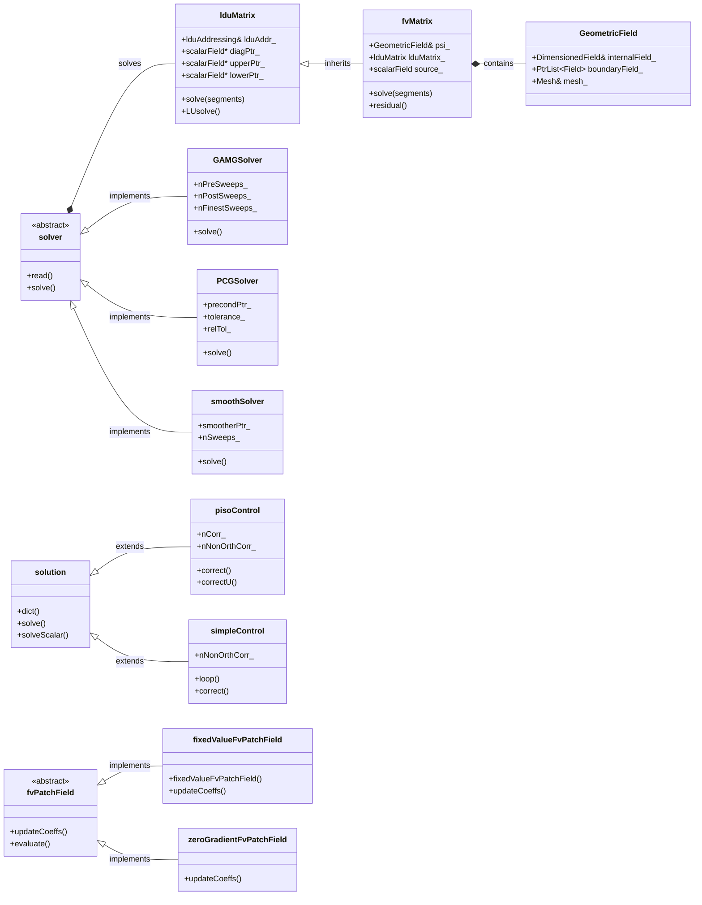
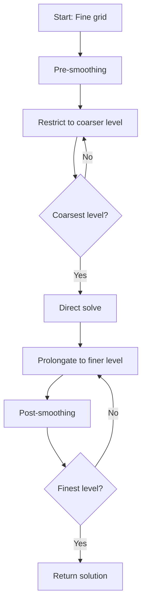

---
tags:
  - openfoam
  - cfd
  - hardcore
  - day-03
date: 2026-01-03
aliases:
  - Pressure-Velocity-Coupling
difficulty: hardcore
topic: Pressure-Velocity-Coupling
---

# Pressure-Velocity-Coupling
## HARDCORE Level - 2026-01-03

---

## วัตถุประสงค์การเรียนรู้ (Learning Objectives)
- **Core Concept**: เข้าใจรากฐานของปัญหา Pressure-Velocity Coupling และทำไมสมการ Navier-Stokes ถึงต้องการสมการ Poisson สำหรับความดัน
- **Algorithms**: อธิบายความแตกต่างและหลักการทำงานของอัลกอริทึม PISO, SIMPLE และ Rhie-Chow Interpolation
- **Architecture**: เข้าใจโครงสร้างคลาสหลักของ OpenFOAM (`fvMatrix`, `lduMatrix`, `GAMGSolver`)
- **Implementation**: สามารถตั้งค่า `fvSchemes` และ `fvSolution` และเขียนโค้ดส่วน Pressure Corrector ได้อย่างถูกต้อง

---

## สารบัญ (Table of Contents)
- [[#1. ทฤษฎี: สมการหลักและฟิสิกส์ (Theory: Core Equations & Physics)|1. ทฤษฎี: สมการหลักและฟิสิกส์]]
- [[#2. โครงสร้างคลาสและการนำไปใช้ (OpenFOAM Class Hierarchy & Implementation)|2. โครงสร้างคลาสและการนำไปใช้]]
- [[#3. การไล่โค้ด (Code Walkthrough)|3. การไล่โค้ด]]
- [[#4. การวิเคราะห์ Dictionary และการตั้งค่า (Dictionary Analysis & Configuration)|4. การวิเคราะห์ Dictionary และการตั้งค่า]]
- [[#5. ภาคปฏิบัติ: งานเขียนโค้ด (Hands-on: Practical Tasks & Coding)|5. ภาคปฏิบัติ: งานเขียนโค้ด]]
- [[#6. ทดสอบความเข้าใจ (Concept Checks)|6. ทดสอบความเข้าใจ]]

---
## 1. ทฤษฎี: สมการหลักและฟิสิกส์ (Theory: Core Equations & Physics)

### 1.1 ความท้าทายพื้นฐาน (The Fundamental Challenge)

ปัญหา Pressure-Velocity Coupling เกิดขึ้นเนื่องจากสมการโมเมนตัม (Momentum Equation) ประกอบด้วยทั้งความเร็ว (Velocity) และความดัน (Pressure) แต่กลับ **ไม่มีสมการเฉพาะสำหรับความดัน (Explicit equation for pressure)** ในชุดสมการ Navier-Stokes ความดันทำหน้าที่เป็นตัวคูณลากรองจ์ (Lagrange multiplier) ที่คอยบังคับให้เป็นไปตามเงื่อนไขความต่อเนื่อง (Continuity constraint) หรือการอนุรักษ์มวล

> [!INFO] ทำไมเรื่องนี้ถึงยาก? (Why is this difficult?)
> ในการไหลแบบอัดตัวไม่ได้ (Incompressible flows) ความดันไม่ได้ถูกควบคุมโดยสมการสถานะ (Equation of State) แต่ความดันจะต้องปรับตัวเอง "ทันทีทันใด" (Instantaneously) เพื่อให้มั่นใจว่าสนามความเร็ว (Velocity field) ยังคงเป็น Divergence-free (ไม่มีการบีบอัด) สิ่งนี้สร้างการเชื่อมโยงที่แน่นแฟ้น (Tight coupling) ระหว่างความดันและความเร็ว ซึ่งต้องการวิธีการจัดการทางตัวเลขเป็นพิเศษ

### 1.2 สมการควบคุม (Governing Equations)

#### สมการความต่อเนื่อง (Continuity Equation - Mass Conservation)

$$\nabla \cdot \mathbf{U} = 0$$

โดยที่:
- $\mathbf{U}$ คือ เวกเตอร์ความเร็ว (Velocity vector) [m/s]
- $\nabla \cdot$ คือ ตัวดำเนินการ Divergence
- สำหรับการไหลแบบอัดตัวไม่ได้ ความหนาแน่น $\rho$ จะคงที่และตัดออกไปได้

#### สมการโมเมนตัม (Momentum Equation - Newton's Second Law)

$$\frac{\partial \mathbf{U}}{\partial t} + \nabla \cdot (\mathbf{U}\mathbf{U}) = -\frac{1}{\rho}\nabla p + \nu \nabla^2 \mathbf{U} + \mathbf{g}$$

โดยที่:
- $\frac{\partial \mathbf{U}}{\partial t}$ = พจน์ Unsteady (ความเร่งตามเวลา)
- $\nabla \cdot (\mathbf{U}\mathbf{U})$ = พจน์ Convective (แรงเฉื่อยแบบ Nonlinear)
- $-\frac{1}{\rho}\nabla p$ = แรงจากความชันความดัน (Pressure gradient force) ซึ่งเป็นตัวขับเคลื่อนการไหล
- $\nu \nabla^2 \mathbf{U}$ = พจน์การแพร่เนื่องจากความหนืด (Viscous diffusion) ($\nu = \mu/\rho$ คือ Kinematic viscosity)
- $\mathbf{g}$ = แรงเนื่องจากบอดี้ (Body forces) เช่น แรงโน้มถ่วง

> [!TIP] การตีความทางฟิสิกส์ (Physical Interpretation)
> พจน์ความชันความดัน $-\nabla p$ แสดงถึงแรงที่อนุภาคของไหลกระทำต่อกัน มันเป็นกลไกที่ข้อมูลความดันแพร่กระจายไปทั่วโดเมนเพื่อบังคับให้เกิดการอนุรักษ์มวล

### 1.3 ปัญหาการเชื่อมโยงความดัน-ความเร็ว (The Pressure-Velocity Coupling Problem)

หากเราทำการ Discretize สมการโมเมนตัมเพื่อหาค่าความเร็ว:

$$\mathbf{U}^{n+1} = \mathbf{U}^n + \Delta t \left[ -\nabla \cdot (\mathbf{U}\mathbf{U}) + \nu \nabla^2 \mathbf{U} - \frac{1}{\rho}\nabla p^{n+1} + \mathbf{g} \right]$$

**ประเด็นปัญหา (The Dilemma):**
- ในการคำนวณ $\mathbf{U}^{n+1}$, เราต้องการค่า $p^{n+1}$
- ในการหาค่า $p^{n+1}$, เราต้องการค่า $\mathbf{U}^{n+1}$ (เพื่อให้สอดคล้องกับ Continuity)
- ไม่สามารถคำนวณตัวใดตัวหนึ่งแยกจากกันได้!

### 1.4 แนวทางการแก้ปัญหา (Solution Approaches)

#### 1.4.1 สมการปัวซองความดัน (Pressure Poisson Equation - PPE)

ทำการหา Divergence ของสมการโมเมนตัมและบังคับให้ $\nabla \cdot \mathbf{U}^{n+1} = 0$:

$$\nabla^2 p^{n+1} = \frac{\rho}{\Delta t} \nabla \cdot \mathbf{U}^* + \rho \nabla \cdot \left[ \nabla \cdot (\mathbf{U}\mathbf{U}) - \nu \nabla^2 \mathbf{U} \right]$$

โดยที่ $\mathbf{U}^*$ คือสนามความเร็วชั่วคราว (Intermediate velocity field)

**ข้อมูลเชิงลึก (Key Insight):** วิธีนี้แปลงปัญหา Coupling ให้กลายเป็นสมการ Poisson สำหรับความดัน ซึ่งสามารถแก้ได้ด้วยวิธี Iterative

#### 1.4.2 การแยกตัวดำเนินการ (Operator Splitting / Projection Methods)

แนวทางแบบ Fractional-step:
1. **Predictor step:** คำนวณความเร็วชั่วคราว $\mathbf{U}^*$ โดยไม่คิดผลของความดัน
2. **Corrector step:** ฉาย (Project) $\mathbf{U}^*$ ลงบน Divergence-free space โดยใช้ความดัน

$$\mathbf{U}^{n+1} = \mathbf{U}^* - \frac{\Delta t}{\rho} \nabla p^{n+1}$$

> [!WARNING] เงื่อนไขขอบเขตมีความสำคัญ (Boundary Conditions Matter)
> สมการ Pressure Poisson ต้องการเงื่อนไขขอบเขต (Boundary Conditions - BCs) ที่สอดคล้อง วิธีการทั่วไปได้แก่:
> - **Neumann BCs:** $\frac{\partial p}{\partial n} = 0$ (ความชันความดันในแนวตั้งฉากเป็นศูนย์)
> - **Dirichlet BCs:** กำหนดค่าความดันที่ทางออก (Outlets)
> การกำหนด BC ที่ไม่ถูกต้องจะนำไปสู่การแกว่งของความดันแบบ "Checkerboard"

### 1.5 กริดแบบ Collocated เทียบกับ Staggered

#### Staggered Grid (Harlow & Welch, 1965)
- เก็บค่าความเร็วและความดันไว้ที่ตำแหน่งต่างกัน
- ความเร็วอยู่ที่หน้าเซลล์ (Cell faces), ความดันอยู่ที่จุดศูนย์กลางเซลล์ (Cell centers)
- **ข้อดี:** ป้องกันปัญหา Pressure-velocity decoupling ได้โดยธรรมชาติ
- **ข้อเสีย:** ต้องการการ Interpolation ที่ซับซ้อน

#### Collocated Grid (Rhie & Chow, 1983)
- ตัวแปรทั้งหมดเก็บอยู่ที่จุดศูนย์กลางเซลล์
- ต้องการการ Interpolation พิเศษ (Rhie-Chow) เพื่อป้องกันปัญหา Checkerboarding
- **ข้อดี:** โครงสร้างข้อมูลเรียบง่ายกว่า
- **ข้อเสีย:** เกิด Numerical dissipation เพิ่มเติม

> [!INFO] แนวทางของ OpenFOAM (OpenFOAM Approach)
> OpenFOAM ใช้การจัดเรียงกริดแบบ **Collocated grid** ร่วมกับเทคนิค Rhie-Chow interpolation ซึ่งถูก implement ผ่านตัวดำเนินการ `fvc::div`, `fvc::grad`, และ `fvm::laplacian`

### 1.6 คุณสมบัติทางคณิตศาสตร์ (Mathematical Properties)

สมการ Pressure Poisson มีรูปแบบคือ:

$$\nabla^2 p = f$$

นี่คือ **สมการอนุพันธ์ย่อยแบบ Elliptic** ซึ่งมีคุณสมบัติดังนี้:

| คุณสมบัติ (Property) | คำอธิบาย (Description) | ความหมายทางฟิสิกส์ (Physical Meaning) |
|----------|-------------|------------------|
| **Existence** | มีคำตอบก็ต่อเมื่อ $\int_\Omega f \, dV = 0$ | การอนุรักษ์มวลรวม (Global mass conservation) |
| **Uniqueness** | คำตอบมีเพียงหนึ่งเดียว (บวกค่าคงที่) | ความดันนิยามโดยอ้างอิงกับค่าอ้างอิง (Relative) |
| **Smoothness** | คำตอบมีความต่อเนื่องหาอนุพันธ์ได้ไม่สิ้นสุด | สนามความดันมีความราบเรียบ (Smooth) |

> [!TIP] ผลกระทบทางตัวเลข (Numerical Implication)
> ธรรมชาติความเป็น Elliptic หมายความว่าข้อมูลความดันจะแพร่กระจายไปทั่วทั้งโดเมน **ทันทีทันใด** (ในทางคณิตศาสตร์) สิ่งนี้ต้องการวิธีการแก้สมการแบบ Global (Iterative solvers พร้อม Preconditioning)

### 1.7 การทำให้อยู่ในรูปไร้มิติ (Non-Dimensionalization)

Reynolds number ใช้บอกลักษณะของระบอบการไหล (Flow regime):

$$Re = \frac{UL}{\nu} = \frac{\text{Inertial Forces}}{\text{Viscous Forces}}$$

โดยที่:
- $U$ = ความเร็วอ้างอิง (Characteristic velocity)
- $L$ = ความยาวอ้างอิง (Characteristic length)
- $\nu$ = ความหนืดจลน์ (Kinematic viscosity)

**ผลต่อการ Coupling:**
- **High Re:** แรงเฉื่อย (Convection) เด่น → การปรับแก้ความดัน (Pressure correction) มีความสำคัญมาก
- **Low Re:** การแพร่ (Diffusion) เด่น → การ Coupling ตรงไปตรงมามากกว่า

### 1.8 สรุปสมการสำคัญ (Summary of Key Equations)

| สมการ (Equation) | รูปแบบ (Form) | วัตถุประสงค์ (Purpose) |
|----------|------|---------|
| Continuity | $\nabla \cdot \mathbf{U} = 0$ | ข้อบังคับการอนุรักษ์มวล |
| Momentum | $\frac{\partial \mathbf{U}}{\partial t} + \nabla \cdot (\mathbf{U}\mathbf{U}) = -\frac{1}{\rho}\nabla p + \nu \nabla^2 \mathbf{U}$ | กฎข้อที่ 2 ของนิวตันสำหรับของไหล |
| Pressure Poisson | $\nabla^2 p = \frac{\rho}{\Delta t} \nabla \cdot \mathbf{U}^*$ | บังคับ Continuity ผ่านความดัน |
| Projection | $\mathbf{U}^{n+1} = \mathbf{U}^* - \frac{\Delta t}{\rho} \nabla p$ | ปรับแก้ความเร็วให้เป็น Divergence-free |

> [!SUCCESS] สรุป (Summary)
> ปัญหา Pressure-Velocity Coupling เกิดจากการที่สมการ Navier-Stokes ไม่มีสมการเฉพาะสำหรับความดัน แต่ต้องใช้ความดันเป็นตัวบังคับให้เกิด Mass Conservation วิธีการแก้ปัญหาหลักคือการใช้สมการ Pressure Poisson (PPE) และการแก้แบบวนซ้ำ (Iterative) เช่น PISO หรือ SIMPLE เพื่อปรับแก้สนามความเร็วให้สอดคล้องกับความดัน

---

## 2. โครงสร้างคลาสและการนำไปใช้ (OpenFOAM Class Hierarchy & Implementation)

### 2.1 ภาพรวมคลาสหลัก (Core Classes Overview)

การเชื่อมโยงความดัน-ความเร็ว (Pressure-velocity coupling) ใน OpenFOAM ถูก implement ผ่านโครงสร้างคลาสที่ซับซ้อน โดยมีศูนย์กลางอยู่ที่ระบบ **Finite Volume Discretization** คลาสสำคัญสามารถแบ่งออกเป็นหมวดหมู่ได้ดังนี้:

| หมวดหมู่ (Category) | คลาส (Classes) | วัตถุประสงค์ (Purpose) |
|----------|---------|---------|
| **Matrix Systems** | `fvMatrix`, `lduMatrix` | การแทนสมการที่ถูก Discretized แล้ว |
| **Solution Algorithms** | `solution`, `pisoControl`, `simpleControl` | กลยุทธ์การแก้สมการแบบ Iterative |
| **Pressure Solvers** | `GAMGSolver`, `PCGSolver`, `smoothSolver` | ตัวแก้สมการแบบ Elliptic |
| **Boundary Conditions** | `fixedValueFvPatchField`, `zeroGradientFvPatchField` | การจัดการ BC ความดัน/ความเร็ว |
| **Interpolation Schemes** | `linear`, `upwind`, `limitedLinear` | Rhie-Chow interpolation |

### 2.2 แผนภาพลำดับชั้นคลาส (Class Hierarchy Diagram)



### 2.3 การวิเคราะห์คลาสสำคัญอย่างละเอียด (Key Classes Detailed Analysis)

#### 2.3.1 `fvMatrix<T>` - Finite Volume Matrix

**ตำแหน่ง:** `$FOAM_SRC/finiteVolume/fvMatrices/fvMatrix/fvMatrix.H`

คลาส `fvMatrix` เป็นตัวแทนของสมการ Finite Volume ที่ถูก Discretized แล้วในรูปแบบ:

$$A\psi=B$$

โดยที่:
- $A$ = เมทริกซ์สัมประสิทธิ์ (เก็บในรูปแบบ `lduMatrix`)
- $\psi$ = ตัวแปรสนาม (Field variable) เช่น ความดัน, ความเร็ว
- $B$ = พจน์ Source

#### 2.3.2 `lduMatrix` - Linear Diagonal Upper Matrix

**ตำแหน่ง:** `$FOAM_SRC/matrices/lduMatrix/lduMatrix.H`

คลาสฐาน (Base class) สำหรับการเก็บ Sparse matrix ใน OpenFOAM โดยใช้ **LDU addressing scheme**:

```cpp
class lduMatrix
{
    // Diagonal coefficients
    scalarField* diagPtr_;
    
    // Upper triangular coefficients
    scalarField* upperPtr_;
    
    // Lower triangular coefficients
    scalarField* lowerPtr_;
    
    // Matrix addressing (owner-neighbor connectivity)
    const lduAddressing& lduAddr_;
};
```

> [!INFO] การจัดเก็บแบบ LDU (LDU Addressing)
> รูปแบบ LDU ใช้ประโยชน์จากโครงสร้างของกริด Finite volume ที่มีการเชื่อมต่อแบบ Face-based ทำให้ประหยัดหน่วยความจำอย่างมากเมื่อเปรียบเทียบกับรูปแบบ Dense matrix

#### 2.3.3 `GAMGSolver` - Geometric-Algebraic Multi-Grid Solver

**ตำแหน่ง:** `$FOAM_SRC/matrices/lduMatrix/solvers/GAMGSolver/GAMGSolver.H`

**GAMG solver** เป็น Pressure solver เริ่มต้นใน OpenFOAM สำหรับการไหลแบบ Incompressible มันรวมเอาเทคนิค:
1. **Geometric coarsening:** รวมเซลล์ (Agglomerates) เพื่อสร้าง Mesh level ที่หยาบขึ้น
2. **Algebraic smoothing:** ใช้วิธี Iterative ในแต่ละ Level

**ขั้นตอนอัลกอริทึม (Algorithm flow):**



> [!TIP] ทำไมต้อง GAMG สำหรับความดัน? (Why GAMG for Pressure?)
> สมการ Poisson สำหรับความดันเป็นสมการเชิงวิกฤต Elliptic ซึ่งมีการแพร่กระจายของข้อมูลทั่วทั้งโดเมน (Global coupling) Multi-grid methods มีความเร็วในการลู่เข้า (Convergence rate) ที่ไม่ขึ้นกับขนาดของกริด ทำให้เหมาะสำหรับการแก้สมการชนิดนี้

#### 2.3.4 `pisoControl` - PISO Algorithm Controller

**ตำแหน่ง:** `$FOAM_SRC/finiteVolume/fvSolution/pisoControl/pisoControl.H`

Implement อัลกอริทึม **PISO (Pressure-Implicit with Splitting of Operators)** สำหรับ Unsteady flows ใช้ Corrector หลายครั้งต่อ Time step เพื่อให้ได้ความแม่นยำ

#### 2.3.5 `simpleControl` - SIMPLE Algorithm Controller

**ตำแหน่ง:** `$FOAM_SRC/finiteVolume/fvSolution/simpleControl/simpleControl.H`

Implement อัลกอริทึม **SIMPLE (Semi-Implicit Method for Pressure-Linked Equations)** สำหรับ Steady-state flows ใช้ Under-relaxation เพื่อความเสถียร

> [!SUCCESS] สรุป (Summary)
> OpenFOAM ใช้โครงสร้างคลาสที่แยกส่วนชัดเจน โดย `fvMatrix` เป็นหัวใจสำคัญในการเก็บสมการที่ดิสครีตแล้วในรูปแบบ LDU Matrix การแก้สมการความดันมักใช้ `GAMGSolver` เพื่อความรวดเร็ว ในขณะที่อัลกอริทึม PISO และ SIMPLE ถูกควบคุมผ่านคลาส `pisoControl` และ `simpleControl` ตามลำดับ

---

## 3. การไล่โค้ด (Code Walkthrough)

### 3.1 UEqn.H

ไฟล์ `UEqn.H` สร้างสมการโมเมนตัม (Momentum Equation) สำหรับการไหลแบบ Incompressible

> **Source Reference:** `$FOAM_SRC/applications/solvers/incompressible/simpleFoam/UEqn.H`

```cpp
// Solve the momentum equation
tmp<fvVectorMatrix> UEqn
(
    fvm::ddt(U)                     // Unsteady term (transient)
  + fvm::div(phi, U)                // Convection term (nonlinear)
  + fvm::laplacian(nu, U)           // Diffusion term (viscous)
 ==
    fvOptions(U)                     // Source terms (optional)
);
```

**สาระสำคัญ:**
- ใช้ `fvm::` สำหรับ Implicit terms (ลง Matrix)
- ใช้ `fvc::` สำหรับ Explicit terms (เป็น Source)
- **ยังไม่รวม** พจน์ความชันความดัน ($-\nabla p$) ที่จะถูกจัดการในขั้นตอน Coupling

### 3.2 pEqn.H

ไฟล์ `pEqn.H` สร้างและแก้สมการความดัน (Pressure Equation) เพื่อบังคับ Continuity

> **Source Reference:** `$FOAM_SRC/applications/solvers/incompressible/simpleFoam/pEqn.H`

```cpp
// Reciprocal of momentum matrix diagonal
volScalarField rAU("rAU", 1.0/UEqn.A());

// Flux calculated from predicted velocity
surfaceScalarField phiHbyA
(
    "phiHbyA",
    fvc::interpolate(rho*U) & mesh.Sf()
);

// Solve pressure Poisson equation
fvScalarMatrix pEqn
(
    fvm::laplacian(rAU, p) == fvc::div(phiHbyA)
);

pEqn.solve();

// Correct velocity
U = HbyA - rAU*fvc::grad(p);
```

> [!INFO] Rhie-Chow Interpolation
> OpenFOAM ใช้เทคนิค Rhie-Chow Interpolation อัตโนมัติผ่านการคำนวณ `phiHbyA` และ `fvm::laplacian` บน Collocated grid เพื่อป้องกันปัญหา Checkerboard

---

## 4. การวิเคราะห์ Dictionary และการตั้งค่า (Dictionary Analysis & Configuration)

### 4.1 fvSchemes

ควบคุม **Numerical Discretization Schemes**:

```cpp
// system/fvSchemes
divSchemes
{
    default         none;
    div(phi,U)      Gauss limitedLinear 1;  // Bounded 2nd order for velocity
}

laplacianSchemes
{
    default         Gauss linear corrected; // Corrected for non-orthogonality
}
```

> [!WARNING] Grid ไม่ตั้งฉาก (Non-Orthogonal Meshes)
> หาก Mesh มีความเบี้ยว (Skewness) หรือไม่ตั้งฉาก (Non-orthogonality) สูง ควรใช้ Scheme แบบ `corrected` หรือ `limited` เพื่อรักษาความแม่นยำและเสถียรภาพ

### 4.2 fvSolution

ควบคุม **Linear Solvers** และ **Algorithm Settings**:

```cpp
// system/fvSolution
solvers
{
    p
    {
        solver          GAMG;           // Multi-grid for pressure
        tolerance       1e-06;
        relTol          0.01;
        smoother        GaussSeidel;
    }
}

SIMPLE
{
    nNonOrthCorr     0;
    residualControl
    {
        p               1e-4;
        U               1e-4;
    }
}

relaxationFactors
{
    fields
    {
        p               0.3;    // Under-relax pressure significantly
    }
    equations
    {
        U               0.7;    // Under-relax velocity moderately
    }
}
```

> [!TIP] การปรับแต่งค่า Relaxation (Relaxation Tuning)
> หาก Simulation แกว่ง (Oscillate) หรือ Diverge ให้ลองลดค่า `relaxationFactors` ลง (เช่น `p` จาก 0.3 -> 0.2)

---

## 5. ภาคปฏิบัติ: งานเขียนโค้ด (Hands-on: Practical Tasks & Coding)

### งานที่ 1: การเขียนโค้ด PISO Corrector Loop อย่างง่าย

**วัตถุประสงค์:** สร้างฟังก์ชัน PISO corrector ขึ้นมาเอง

```cpp
void pisoCorrector(fvMesh& mesh, volVectorField& U, volScalarField& p, ...)
{
    volScalarField rAU("rAU", 1.0/UEqn.A());
    
    for (int corr = 0; corr < nCorr; corr++)
    {
        // 1. Momentum Predictor
        tmp<fvVectorMatrix> UEqn(fvm::ddt(U) + fvm::div(phi, U) - fvm::laplacian(nu, U));
        UEqn.solve();
        
        // 2. Flux Calculation (HbyA)
        volVectorField HbyA = rAU * UEqn.H();
        surfaceScalarField phiHbyA("phiHbyA", fvc::interpolate(HbyA) & mesh.Sf());
        adjustPhi(phiHbyA, U, p);
        
        // 3. Pressure Solution
        fvScalarMatrix pEqn(fvm::laplacian(rAU, p) == fvc::div(phiHbyA));
        pEqn.setReference(pRefCell, pRefValue);
        pEqn.solve();
        
        // 4. Correction
        phi = phiHbyA - pEqn.flux();
        U = HbyA - rAU * fvc::grad(p);
        U.correctBoundaryConditions();
    }
}
```

---

## 6. ทดสอบความเข้าใจ (Concept Checks)

### คำถามที่ 1: ทำไมถึงไม่มีสมการเฉพาะสำหรับความดันในสมการ Navier-Stokes?
> [!SUCCESS] เฉลย
> ในการไหลแบบ Incompressible ความดันไม่ได้ถูกควบคุมโดยสมการสถานะ (Equation of State) แต่ทำหน้าที่เป็น Lagrange multiplier เพื่อบังคับให้สนามความเร็วเป็นไปตามกฎการอนุรักษ์มวล (Continuity Equation)

### คำถามที่ 2: ปัญหา Checkerboard คืออะไร และแก้ได้อย่างไร?
> [!SUCCESS] เฉลย
> เป็นปัญหาความดันแกว่งแบบตารางหมากรุกบน Collocated grid เนื่องจากการ Decoupling ของความดันและความเร็ว แก้ไขโดยใช้ **Rhie-Chow Interpolation** ซึ่งเพิ่มพจน์ปรับแก้ความดันที่หน้าเซลล์ (Face-based pressure smoothing)

### คำถามที่ 3: ข้อแตกต่างระหว่าง PISO และ SIMPLE?
> [!SUCCESS] เฉลย
> - **SIMPLE**: ใช้สำหรับ **Steady-state** มีการใช้ Under-relaxation เพื่อความเสถียร
> - **PISO**: ใช้สำหรับ **Transient** มีการวน Loop Corrector หลายรอบต่อ Time-step เพื่อความแม่นยำ

### คำถามที่ 4: ทำไมแนะนำให้ใช้ GAMG Solver กับสมการความดัน?
> [!SUCCESS] เฉลย
> สมการความดันเป็นแบบ Elliptic (Global influence) การใช้ Multi-grid (GAMG) ช่วยกำจัด Error ความถี่ต่ำได้อย่างรวดเร็ว ทำให้ Solver มีประสิทธิภาพสูง (Scale ~O(N)) แม้ Mesh จะมีขนาดใหญ่

---

> [!SUCCESS] บทสรุปประจำวัน (Daily Summary)
> วันนี้เราได้เจาะลึกกลไกหัวใจสำคัญของ CFD นั่นคือ **Pressure-Velocity Coupling** การเข้าใจว่าทำไมเราต้องแก้สมการ Poisson และวิธีการที่ OpenFOAM จัดการผ่านคลาส `fvMatrix` และ `lduMatrix` จะช่วยให้คุณสามารถ Debug ปัญหาการลู่เข้าและเลือกใช้ Solver ได้อย่างผู้เชี่ยวชาญ ในบทต่อไปเราจะไปดูเรื่อง Advanced Physics และ Turbulence Modeling