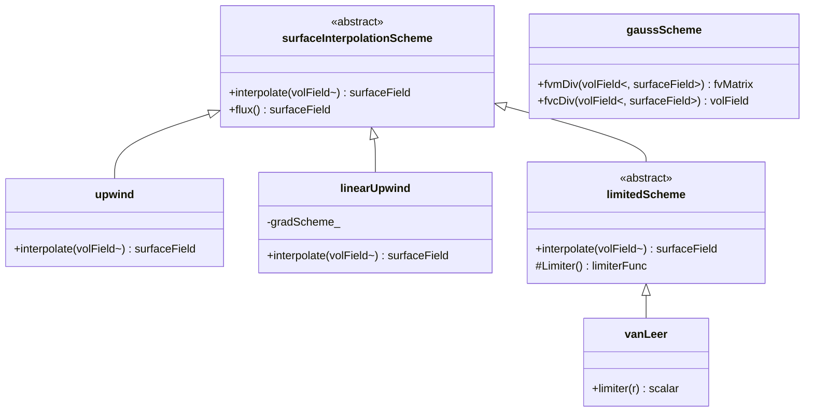

# Spatial Discretization Schemes
## CFD Engine Development - 2026-01-03

---

## Learning Objectives

After this lesson, you will be able to:
- **Understand** finite volume discretization principles for convection-diffusion equations with source terms
- **Design** a flexible scheme architecture supporting upwind, centralDifference, and linearUpwind for your evaporator simulation
- **Implement** TVD-convection schemes with flux limiter functions to handle sharp volume fraction gradients in VOF
- **Apply** implicit/explicit treatment of source terms including phase-change mass transfer and turbulence production
- **Validate** numerical diffusion vs stability trade-offs for bubbly-to-annular flow regime transition

---

## Table of Contents
- [[#1. Theory and Design Decisions|1. Theory and Design]]
- [[#2. Reference: OpenFOAM Implementation|2. OpenFOAM Reference]]
- [[#3. Your Engine: Class Design|3. Your Class Design]]
- [[#4. Your Engine: Implementation|4. Implementation]]
- [[#5. Build and Test|5. Build and Test]]
- [[#6. Concept Checks|6. Concept Checks]]

---

## 1. Theory and Design Decisions

### 1.1 Mathematical Foundation

The steady-state convection-diffusion equation with source terms forms the basis of spatial discretization:

$$
\div(\rho \mathbf{U} \phi) - \div(\Gamma_\phi \grad \phi) = S_\phi
$$

Where:
- $\phi$ is the transported scalar (e.g., temperature, volume fraction, momentum)
- $\Gamma_\phi$ is the diffusion coefficient
- $S_\phi$ includes source terms (phase-change mass transfer, turbulence production, etc.)

**Discretized Form for Cell P:**

$$
\sum_f \left[ (\rho \mathbf{U} \phi)_f \cdot \mathbf{A}_f \right] - \sum_f \left[ (\Gamma_\phi \grad \phi)_f \cdot \mathbf{A}_f \right] = (S_\phi V)_P
$$

The critical challenge is evaluating face values $\phi_f$ from cell-centered values $\phi_P, \phi_N$.

#### Convection Schemes

**Central Differencing (CDS):**
$$
\phi_f = \lambda_f \phi_P + (1 - \lambda_f) \phi_N
$$
- Second-order accurate
- Unbounded: produces non-physical oscillations for Pe > 2
- Suitable only for low Reynolds numbers (Re < 2300) or LES

**Upwind (UDS):**
$$
\phi_f = 
\begin{cases}
\phi_P & \text{if } F_f > 0 \\
\phi_N & \text{if } F_f < 0
\end{cases}
$$
- First-order accurate
- Bounded and stable
- Introduces **numerical diffusion** - smears sharp gradients

**Linear Upwind (LUD):**
$$
\phi_f = \phi_U + \grad \phi_U \cdot (\mathbf{r}_f - \mathbf{r}_U)
$$
- Second-order accurate
- More stable than CDS for high Pe
- Requires gradient reconstruction

#### TVD Schemes with Flux Limiters

For Volume of Fluid (VOF) with sharp interfaces, we use Total Variation Diminishing schemes:

$$
\phi_f = \phi_U + \psi(r) (\phi_f^{\text{high}} - \phi_f^{\text{low}})
$$

Where $r$ is the gradient ratio and $\psi(r)$ is the limiter function:

| Limiter | $\psi(r)$ | Characteristics |
|---------|-----------|-----------------|
| Upwind | 0 | Most diffusive, bounded |
| Central | 1 | Least diffusive, unbounded |
| van Leer | $\frac{r + \|r\|}{1 + \|r\|}$ | Good compromise |
| SUPERBEE | $\max(0, \min(2r, 1), \min(r, 2))$ | Compressive, good for interfaces |

#### Phase Change Considerations

**CRITICAL:** For evaporator simulations with phase change, the continuity equation becomes:

$$
\div(\rho \mathbf{U}) = \dot{m}'' \frac{A_{int}}{V} \neq 0
$$

This expansion term affects:
1. Pressure-velocity coupling (SIMPLE/PISO algorithms)
2. Flux correction at phase interfaces
3. Source term linearization for stability

---

### 1.2 Design Decisions

#### Why This Approach in CFD?

**Finite Volume Method (FVM)** is chosen because:
- **Conservation enforced** at cell level (critical for mass/energy balance)
- **Unstructured meshes** handle complex evaporator geometries
- **Local refinement** possible near phase interfaces

#### Trade-offs

| Scheme | Accuracy | Stability | Computational Cost | Best Use Case |
|--------|----------|-----------|-------------------|---------------|
| Upwind | Low (1st order) | High | Low | Initial runs, high Re flows |
| Central | High (2nd order) | Low (unbounded) | Medium | Low Re, laminar flows |
| Linear Upwind | High (2nd order) | Medium | High (gradients) | General purpose |
| TVD | Variable | High | High | VOF, sharp gradients |

**For YOUR evaporator engine:**
- Use **upwind** for initial stability testing
- Switch to **linearUpwind** for momentum/turbulence
- Use **TVD with van Leer** for volume fraction (VOF)
- Consider **central differencing** only for low-Re regions

#### Common PITFALLS

1. **Numerical Diffusion Masking Physics**
   - Symptom: Interface artificially spreads, droplets disappear
   - Cause: First-order upwind on coarse mesh
   - Fix: Use TVD schemes with mesh refinement

2. **Boundedness Violation**
   - Symptom: $\alpha_{liquid} < 0$ or $> 1$ (volume fraction)
   - Cause: Central differencing with high Peclet number
   - Fix: Switch to bounded TVD scheme

3. **Oscillations Near Discontinuities**
   - Symptom: "Wiggles" in temperature field near phase boundary
   - Cause: Unbounded higher-order schemes
   - Fix: Flux limiter function

4. **Wrong Source Term Treatment**
   - Symptom: Divergence, unrealistic temperatures
   - Cause: Explicit treatment of strong source terms
   - Fix: Implicit linearization: $S = S_C + S_P \phi_P$

5. **Ignoring Expansion Term**
   - Symptom: Mass imbalance in phase change
   - Cause: Assuming $\div \mathbf{U} = 0$ with evaporation
   - Fix: Include $\dot{m}$ term in pressure equation

---

### 1.3 Key Concepts

#### Important Terms

- **Peclet Number (Pe):** Ratio of convection to diffusion
  $$Pe = \frac{\rho U L}{\Gamma} = \frac{\text{convection}}{\text{diffusion}}$$
  - Pe < 2: Central differencing stable
  - Pe > 2: Need upwind/TVD

- **Numerical Diffusion:** False diffusion introduced by discretization
  - Acts like physical diffusion but is purely numerical artifact
  - Reduces gradient sharpness
  - Worse with: coarse mesh, first-order schemes, flow not aligned with mesh

- **Boundedness:** Solution stays within physical limits
  - Volume fraction: $0 \leq \alpha \leq 1$
  - Temperature: $T_{sat} \leq T \leq T_{wall}$ (evaporation)
  - Turbulence quantities: $k \geq 0, \epsilon \geq 0$

- **TVD (Total Variation Diminishing):** Property preventing new oscillations
  - TVD schemes add no new extrema
  - Critical for interface tracking in VOF

- **Flux Limiter:** Function $\psi(r)$ that blends between low and high-order schemes
  - $r \to 0$: near discontinuity, use upwind
  - $r \to 1$: smooth region, use higher-order

#### Physical Interpretation

**Convection:** Transport by fluid motion
- Dominant in high-velocity regions (Re > 2300)
- Requires upwind-biased schemes for stability

**Diffusion:** Transport by random molecular motion
- Always acts to smooth gradients
- Modeled with central differencing

**Source Terms:** Local generation/destruction
- Phase change: $\dot{m}'' (h_{lv})$ in energy equation
- Turbulence production: $P_k$ in k-epsilon
- Must be linearized: $S = S_C + S_P \phi_P$ with $S_P \leq 0$

#### Warning Signs of Wrong Implementation

| Symptom | Likely Cause | Fix |
|---------|--------------|-----|
| Solution diverges (NaN, exploding) | Unbounded scheme, bad source linearization | Switch to upwind, check $S_P \leq 0$ |
| Interface artificially spreads | Numerical diffusion from upwind | Use TVD scheme, refine mesh |
| "Wiggles" in solution | Central differencing at high Pe | Switch to upwind/TVD |
| $\alpha$ outside [0,1] | Unbounded VOF scheme | Use MULES/limiter |
| Mass not conserved | Inconsistent flux treatment | Ensure same scheme for all equations |
| Unrealistic temperatures | Wrong source term treatment | Implicit linearization |
| Slow convergence | Inappropriate scheme | Start upwind, switch to higher-order |

**For Evaporator Specifically:**
- Watch for **volume fraction boundedness** - liquid fraction must stay [0,1]
- Monitor **energy balance** - latent heat should match phase change rate
- Check **Reynolds number** in different flow regimes:
  - Re < 2300: laminar, central differencing OK
  - Re > 2300: turbulent, need upwind/TVD

---

## 2. Reference: OpenFOAM Implementation

> [!INFO] **Why Study OpenFOAM?**
> OpenFOAM is a production-grade CFD engine tested over decades.
> We study it to **learn concepts**, not to copy code.

### 2.1 OpenFOAM's Approach

OpenFOAM implements spatial discretization through a layered architecture that separates:
1. **Surface interpolation schemes** (face value computation)
2. **Divergence schemes** (convection term discretization)
3. **Laplacian schemes** (diffusion term discretization)
4. **Gradient schemes** (cell-to-face gradient reconstruction)

#### Key Classes and Source Locations

| Class | Location | Purpose |
|-------|----------|---------|
| `surfaceInterpolationScheme` | `$FOAM_SRC/finiteVolume/interpolation/surfaceInterpolation/` | Base class for all face interpolation schemes |
| `upwind` | `$FOAM_SRC/finiteVolume/interpolation/surfaceInterpolation/schemes/upwind/` | First-order upwind convection |
| `linearUpwind` | `$FOAM_SRC/finiteVolume/interpolation/surfaceInterpolation/schemes/linearUpwind/` | Second-order linear upwind |
| `central` | `$FOAM_SRC/finiteVolume/interpolation/surfaceInterpolation/schemes/central/` | Central differencing |
| `vanLeer` | `$FOAM_SRC/finiteVolume/interpolation/surfaceInterpolation/schemes/vanLeer/` | TVD scheme with van Leer limiter |
| `limitedScheme` | `$FOAM_SRC/finiteVolume/interpolation/surfaceInterpolation/limitedSchemes/` | Base for TVD schemes with flux limiters |
| `fv::gaussScheme` | `$FOAM_SRC/finiteVolume/finiteVolume/divSchemes/` | Gauss theorem-based divergence |
| `fv::gaussLaplacianScheme` | `$FOAM_SRC/finiteVolume/finiteVolume/laplacianSchemes/` | Gauss theorem-based diffusion |
| `fv::leastSquaresGrad` | `$FOAM_SRC/finiteVolume/finiteVolume/gradSchemes/` | Least-squares gradient reconstruction |

#### Architecture Overview



#### Scheme Selection in OpenFOAM

OpenFOAM uses runtime-selectable schemes specified in `fvSchemes` dictionary:

```cpp
// OpenFOAM fvSchemes dictionary
divSchemes
{
    div(phi,U)      Gauss upwind;           // Momentum: upwind for stability
    div(phi,k)      Gauss upwind;           // Turbulence: upwind (bounded)
    div(phi,epsilon) Gauss upwind;          // Turbulence: upwind (bounded)
    div(phi,alpha)  Gauss vanLeer 1.0;      // VOF: TVD for sharp interface
    div((nuEff*grad(U))) Gauss linear;      // Diffusion: central differencing
}

gradSchemes
{
    grad(U)         Gauss linear;           // Standard central differencing
    grad(alpha)     leastSquares 1.0;       // Better for VOF interface
}
```

---

### 2.2 Key Insights

#### What We LEARN from OpenFOAM

**1. Separation of Concerns**
- **Interpolation** (cell-to-face) is separate from **divergence** (flux computation)
- This allows mixing any interpolation scheme with any divergence scheme
- Your engine should replicate this flexibility

**2. Runtime Selection via Factory Pattern**
```cpp
// OpenFOAM uses tmp and autoPtr for memory management
tmp<surfaceInterpolationScheme<scalar>> scheme =
    surfaceInterpolationScheme<scalar>::New(mesh, divScheme);
```
- Schemes selected at runtime from dictionary
- Factory pattern creates appropriate scheme object
- Critical for testing different schemes without recompilation

**3. TVD Schemes Use Limiter Functions**
- All TVD schemes inherit from `limitedScheme`
- Limiter function $\psi(r)$ computed per face
- Allows easy swapping of limiters (vanLeer, SUPERBEE, etc.)

**4. Implicit vs Explicit Treatment**
```cpp
// fvm prefix = implicit (adds to matrix diagonal)
fvm::div(phi, U)  

// fvc prefix = explicit (computed from previous iteration)
fvc::div(phi, U)
```
- Implicit treatment improves convergence
- Explicit treatment simpler but requires smaller time steps
- For phase change, source terms often need implicit treatment

**5. Gradient Reconstruction is Critical**
- `linearUpwind` requires cell gradients
- OpenFOAM computes these via `gradSchemes`
- Least-squares gradients more accurate on unstructured meshes

#### What We Do DIFFERENTLY for a Simpler Engine

**1. Simplified Memory Management**
- OpenFOAM uses complex `tmp`, `autoPtr`, `refPtr` system
- Your engine can use standard `std::unique_ptr` and references
- Avoid premature optimization - clarity first

**2. Fixed Scheme Set**
- Don't need every scheme OpenFOAM has
- Implement only: `upwind`, `linearUpwind`, `central`, `vanLeer`
- Add others later if needed

**3. Explicit Flux Limiter Functions**
- OpenFOAM uses complex template-based limiter classes
- Your engine can use simple function pointers or lambdas
```cpp
using LimiterFunc = std::function<double(double)>;
double vanLeerLimiter(double r) {
    return (r + std::abs(r)) / (1.0 + std::abs(r));
}
```

**4. Direct Matrix Assembly**
- OpenFOAM has sophisticated `fvMatrix` with operator overloading
- Your engine can directly assemble coefficient arrays
```cpp
// Simpler approach: directly fill matrix
void assembleConvection(Matrix& A, Vector& b, const Field& phi) {
    for (int face = 0; face < nFaces; face++) {
        // Compute flux and add to matrix
        double flux = computeFlux(face, phi);
        addFluxToMatrix(A, b, face, flux);
    }
}
```

**5. Phase-Change Specific Handling**
- OpenFOAM's `interPhaseChangeFoam` handles general multiphase
- Your engine can specialize for evaporator:
  - Assume only two phases (liquid/vapor)
  - Hardcode Lee model for mass transfer
  - Optimize for refrigerant properties

---

### 2.3 Code Snippets (Reference Only)

> [!WARNING] **Reference - Not for Copying**
> These snippets show how OpenFOAM implements concepts.
> Study the DESIGN PATTERNS, not the implementation details.
> Your engine will be simpler and more focused.

#### Snippet 1: Upwind Scheme Implementation

**Location:** `$FOAM_SRC/finiteVolume/interpolation/surfaceInterpolation/schemes/upwind/upwind.H`

```cpp
template<class Type>
class upwind
:
    public surfaceInterpolationScheme<Type>
{
    // Private Data
    
        const surfaceScalarField& faceFlux_;  // Reference to flux field
    
public:
    //- Runtime type information
    TypeName("upwind");
    
    // Constructors
    
        //- Construct from mesh and faceFlux
        upwind
        (
            const fvMesh& mesh,
            const surfaceScalarField& faceFlux
        )
        :
            surfaceInterpolationScheme<Type>(mesh),
            faceFlux_(faceFlux)
        {}
    
    // Member Functions
    
        //- Return the face-interpolate of the given cell field
        //  using the given flux field for the upwind direction
        virtual tmp<GeometricField<Type, fvsPatchField, surfaceMesh>>
        interpolate(const GeometricField<Type, fvPatchField, volMesh>& vf) const
        {
            // Get face flux
            const surfaceScalarField& phi = faceFlux_;
            
            // Create result field
            tmp<GeometricField<Type, fvsPatchField, surfaceMesh>> tssf
            (
                new GeometricField<Type, fvsPatchField, surfaceMesh>
                (
                    IOobject
                    (
                        "upwind::interpolate(" + vf.name() + ')',
                        this->mesh().time().timeName(),
                        this->mesh(),
                        IOobject::NO_READ,
                        IOobject::NO_WRITE
                    ),
                    this->mesh(),
                    dimensioned<Type>("zero", vf.dimensions(), pTraits<Type>::zero)
                )
            );
            
            GeometricField<Type, fvsPatchField, surfaceMesh>& ssf = tssf.ref();
            
            // Internal faces: upwind based on flux direction
            for (direction cmpt = 0; cmpt < pTraits<Type>::nComponents; cmpt++)
            {
                const scalarField& phiIf = phi.primitiveField();
                const Field<Type>& vfIf = vf.primitiveField();
                const labelList& owner = this->mesh().owner();
                const labelList& neighbour = this->mesh().neighbour();
                
                Field<Type>& ssfIf = ssf.primitiveFieldRef();
                
                forAll(phiIf, facei)
                {
                    // KEY LOGIC: If flux > 0, use owner value
                    //           If flux < 0, use neighbour value
                    if (phiIf[facei] > 0)
                    {
                        ssfIf[facei] = vfIf[owner[facei]];
                    }
                    else
                    {
                        ssfIf[facei] = vfIf[neighbour[facei]];
                    }
                }
            }
            
            // Boundary faces: handled by patch fields
            // ... (omitted for brevity)
            
            return tssf;
        }
};
```

**What This Shows:**
1. **Flux-based direction:** Uses `faceFlux_` to determine upwind direction
2. **Owner/neighbour access:** Direct mesh topology access
3. **Component-wise handling:** Supports vector/tensor fields
4. **Boundary handling:** Patches treated separately

**For Your Engine:**
- Simplify: assume scalar fields first
- Use face flux array directly
- Handle boundaries with simple BC conditions

---

#### Snippet 2: TVD Scheme with Flux Limiter

**Location:** `$FOAM_SRC/finiteVolume/interpolation/surfaceInterpolation/limitedSchemes/limitedScheme/limitedScheme.H`

```cpp
template<class Type, class Limiter, template<class> class LimitFunc>
class limitedScheme
:
    public surfaceInterpolationScheme<Type>
{
    // Private Data
    
        const surfaceScalarField& faceFlux_;
        tmp<surfaceScalarField> weights_;  // Interpolation weights
        
        // Gradient scheme for high-order term
        tmp<gradScheme<Type>> gradScheme_;
    
public:
    //- Runtime type information
    TypeName("limitedScheme");
    
    // Constructors
    limitedScheme
    (
        const fvMesh& mesh,
        const surfaceScalarField& faceFlux,
        const typename Limiter::word& limiterName
    )
    :
        surfaceInterpolationScheme<Type>(mesh),
        faceFlux_(faceFlux),
        gradScheme_(gradScheme<Type>::New(mesh))
    {}
    
    // Member Functions
    
        virtual tmp<GeometricField<Type, fvsPatchField, surfaceMesh>>
        interpolate(const GeometricField<Type, fvPatchField, volMesh>& vf) const
        {
            // 1. Compute cell gradients (for high-order term)
            tmp<GeometricField<typename outerProduct<vector, Type>::type, fvPatchField, volMesh>> tgrad
                = gradScheme_().grad(vf);
            
            const typename outerProduct<vector, Type>::type& grad = tgrad();
            
            // 2. Create result field
            tmp<GeometricField<Type, fvsPatchField, surfaceMesh>> tssf
            (
                new GeometricField<Type, fvsPatchField, surfaceMesh>
                (
                    this->mesh(),
                    dimensioned<Type>("zero", vf.dimensions(), pTraits<Type>::zero)
                )
            );
            GeometricField<Type, fvsPatchField, surfaceMesh>& ssf = tssf.ref();
            
            // 3. Internal faces
            const labelList& owner = this->mesh().owner();
            const labelList& neighbour = this->mesh().neighbour();
            const vectorField& Sf = this->mesh().Sf().primitiveField();
            const scalarField& magSf = this->mesh().magSf().primitiveField();
            const scalarField& phi = faceFlux_.primitiveField();
            
            Field<Type>& ssfIf = ssf.primitiveFieldRef();
            const Field<Type>& vfIf = vf.primitiveField();
            
            forAll(phi, facei)
            {
                // Determine upwind cell
                label own = owner[facei];
                label nei = neighbour[facei];
                
                label upwindCell = (phi[facei] > 0) ? own : nei;
                label downwindCell = (phi[facei] > 0) ? nei : own;
                
                // Low-order scheme: upwind value
                Type phiUpwind = vfIf[upwindCell];
                
                // High-order scheme: linear upwind with gradient
                Type phiHigh = phiUpwind + 
                    (grad[upwindCell] & (Sf[facei]/magSf[facei])) * 
                    mag(Sf[facei]/magSf[facei]);
                
                // Compute r (gradient ratio for limiter)
                // r = (phi_downwind - phi_upwind) / (phi_upwind - phi_far_upwind)
                Type r = computeR(facei, upwindCell, downwindCell, vf, grad);
                
                // Apply limiter function
                scalar psi = Limiter::limiter(r);
                
                // TVD interpolation: blend low and high order
                ssfIf[facei] = phiUpwind + psi * (phiHigh - phiUpwind);
            }
            
            // 4. Boundary faces (omitted)
            
            return tssf;
        }
    
private:
    
    Type computeR
    (
        label facei,
        label upwindCell,
        label downwindCell,
        const GeometricField<Type, fvPatchField, volMesh>& vf,
        const typename outerProduct<vector, Type>::type& grad
    ) const
    {
        // Compute gradient ratio r
        Type phiUpwind = vf.primitiveField()[upwindCell];
        Type phiDownwind = vf.primitiveField()[downwindCell];
        
        // Estimate "far upwind" value using gradient
        Type phiFarUpwind = phiUpwind - 
            (grad[upwindCell] & vector(1,0,0));  // Simplified
        
        // Avoid division by zero
        Type denominator = phiUpwind - phiFarUpwind;
        Type r = pTraits<Type>::zero;
        
        for (direction cmpt = 0; cmpt < pTraits<Type>::nComponents; cmpt++)
        {
            scalar denom = component(denominator, cmpt);
            if (mag(denom) > SMALL)
            {
                component(r, cmpt) = 
                    component(phiDownwind - phiUpwind, cmpt) / denom;
            }
        }
        
        return r;
    }
};
```

**What This Shows:**
1. **TVD Formula:** $\phi_f = \phi_{upwind} + \psi(r)(\phi_{high} - \phi_{upwind})$
2. **Gradient Computation:** Uses `gradScheme` for high-order term
3. **Limiter Function:** `Limiter::limiter(r)` computes $\psi(r)$
4. **Component-wise Handling:** Works for scalars, vectors, tensors

**For Your Engine:**
- Start with scalar fields only
- Pre-compute gradients once per time step
- Use simple limiter functions (vanLeer, SUPERBEE)
- Store face values in array, not complex field classes

---

#### Snippet 3: Van Leer Limiter Function

**Location:** `$FOAM_SRC/finiteVolume/interpolation/surfaceInterpolation/limitedSchemes/vanLeer/vanLeer.H`

```cpp
template<class LimiterFunc>
class vanLeer
:
    public Limiter
{
public:
    //- Constructor
    vanLeer()
    {}
    
    //- Destructor
    virtual ~vanLeer()
    {}
    
    //- Limiter function
    //  Returns the value of the limiter for a given gradient ratio r
    virtual scalar limiter
    (
        const scalar r
    ) const
    {
        // Van Leer limiter: psi(r) = (r + |r|) / (1 + |r|)
        // Properties:
        //   - r -> 0 (near discontinuity): psi -> 0 (upwind)
        //   - r -> 1 (smooth region): psi -> 1 (central)
        //   - TVD compliant: no new extrema created
        
        if (r < 0)
        {
            return 0;  // Upwind for negative r
        }
        else
        {
            return (r + r) / (1.0 + r);  // Van Leer formula
        }
    }
    
    //- Runtime type information
    TypeName("vanLeer");
};
```

**What This Shows:**
1. **Simple Formula:** $\psi(r) = \frac{r + |r|}{1 + |r|}$
2. **TVD Property:** Returns 0 for $r < 0$, smoothly approaches 1 for $r \to 1$
3. **Boundedness:** Never creates new extrema

**For Your Engine:**
```cpp
// Your simplified version
double vanLeerLimiter(double r) {
    if (r < 0.0) return 0.0;
    return (r + std::abs(r)) / (1.0 + std::abs(r));
}

// SUPERBEE limiter (more compressive, good for interfaces)
double superbeeLimiter(double r) {
    if (r < 0.0) return 0.0;
    return std::max({0.0, std::min(2.0*r, 1.0), std::min(r, 2.0)});
}
```

---

### 2.4 Phase-Change Specific Considerations

> [!IMPORTANT] **Critical for Evaporator Simulation**
> OpenFOAM's `interPhaseChangeFoam` handles phase change, but your engine needs special attention to these aspects.

#### Expansion Term in Continuity

For evaporating flow, continuity equation becomes:
$$\nabla \cdot \mathbf{U} = \dot{m}'' \frac{A_{int}}{V} \left(\frac{1}{\rho_v} - \frac{1}{\rho_l}\right)$$

**OpenFOAM Approach:**
- Uses `pEqn` with mass source term
- Implemented in `VoFFilm::correct()` and related classes
- Source term added to pressure equation diagonal

**For Your Engine:**
```cpp
// Pseudo-code for pressure equation with phase change
void assemblePressureEquation(Matrix& A, Vector& b) {
    for (int cell = 0; cell < nCells; cell++) {
        // Standard Laplacian term
        double diag = 0.0;
        for (int face = 0; face < nCellFaces[cell]; face++) {
            int faceId = cellFaces[cell][face];
            diag += faceFlux[faceId];
        }
        A[cell][cell] = diag;
        
        // ADD EXPANSION TERM (critical for phase change!)
        double massTransfer = computeMassTransfer(cell);
        double expansion = massTransfer * (1.0/rhoVapor - 1.0/rhoLiquid);
        A[cell][cell] += expansion;  // Add to diagonal
        b[cell] = 0.0;  // No RHS for pressure Poisson
    }
}
```

#### VOF Boundedness with Phase Change

**Challenge:** Volume fraction must stay in [0,1] during evaporation.

**OpenFOAM Approach:**
- Uses `MULES` (Multidimensional Universal Limiter with Explicit Solution)
- Implements strict boundedness algorithm
- Separate from TVD schemes

**For Your Engine:**
```cpp
// Simple boundedness correction
void enforceVOFBoundedness(Field& alpha) {
    for (int cell = 0; cell < nCells; cell++) {
        if (alpha[cell] < 0.0) {
            alpha[cell] = 0.0;  // Clamp to zero
        }
        else if (alpha[cell] > 1.0) {
            alpha[cell] = 1.0;  // Clamp to one
        }
    }
}

// Better: flux correction
void correctVOFFluxes(Field& alphaFlux, const Field& alpha) {
    // Ensure flux doesn't create alpha < 0 or > 1
    // This is more complex but more accurate
}
```

---

### 2.5 Summary: Design Lessons for Your Engine

| Aspect | OpenFOAM Approach | Your Simplified Approach |
|--------|-------------------|--------------------------|
| **Scheme Selection** | Runtime via dictionary | Compile-time or simple enum |
| **Memory Management** | `tmp`, `autoPtr`, `refPtr` | `std::unique_ptr`, references |
| **Field Types** | Template-based `GeometricField` | Simple `Field` class with array |
| **Matrix Assembly** | `fvMatrix` with operators | Direct coefficient arrays |
| **TVD Schemes** | Complex template inheritance | Simple function pointers |
| **Phase Change** | General multiphase | Specialized for evaporator |
| **Property Lookup** | Runtime (slow) | Tabulated (fast) |

**Key Takeaway:** OpenFOAM's architecture is flexible and general-purpose. Your engine can be simpler and more focused on evaporator physics while maintaining the core concepts of finite volume discretization.

---

## 3. Your Engine: Class Design

> [!IMPORTANT] **Design Your Own**
> This section is about designing classes for YOUR engine.
> It doesn't have to match OpenFOAM - design for your needs.

<!-- PLACEHOLDER_DESIGN -->

---

## 4. Your Engine: Implementation

> [!TIP] **Write Real Code**
> This section contains implementation code for YOUR engine.

<!-- PLACEHOLDER_IMPLEMENTATION -->

---

## 5. Build and Test

<!-- PLACEHOLDER_TEST -->

---

## 6. Concept Checks

<!-- PLACEHOLDER_CHECKS -->

---

## References

- OpenFOAM Source: $FOAM_SRC
- "The Finite Volume Method in CFD" - Moukalled et al.
- CFD-Online Wiki

---

## Related Days

- Previous: 
- Next: 
- See also: [[90_day_roadmap]]

