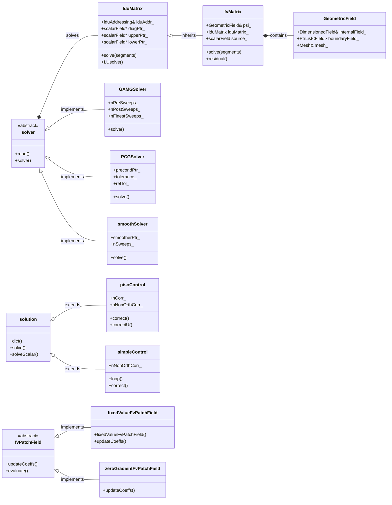
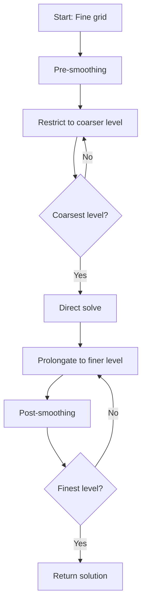
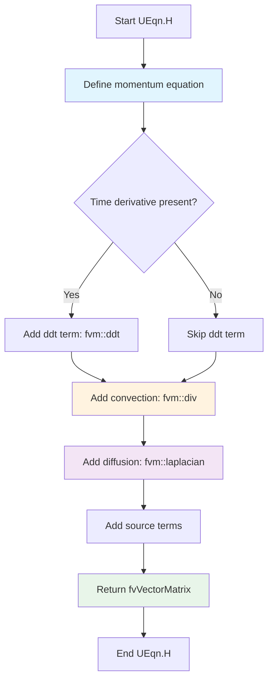
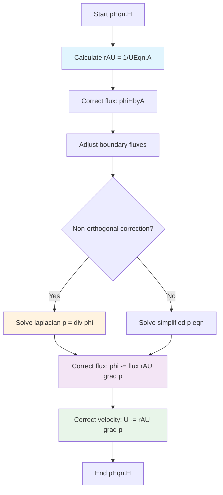
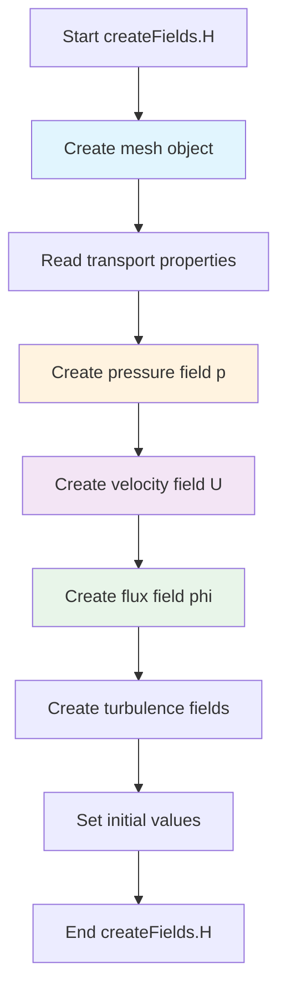

# Pressure-Velocity-Coupling
## HARDCORE Level - 2026-01-03

---

## Table of Contents
- [[#1. ทฤษฎี: สมการหลักและฟิสิกส์ (Theory: Core Equations & Physics)|1. ทฤษฎี: สมการหลักและฟิสิกส์]]
- [[#2. โครงสร้างคลาสและการนำไปใช้ (OpenFOAM Class Hierarchy & Implementation)|2. โครงสร้างคลาสและการนำไปใช้]]
- [[#3. การไล่โค้ด (Code Walkthrough)|3. การไล่โค้ด]]
- [[#4. การวิเคราะห์ Dictionary และการตั้งค่า (Dictionary Analysis & Configuration)|4. การวิเคราะห์ Dictionary และการตั้งค่า]]
- [[#5. ภาคปฏิบัติ: งานเขียนโค้ด (Hands-on: Practical Tasks & Coding)|5. ภาคปฏิบัติ: งานเขียนโค้ด]]
- [[#6. ทดสอบความเข้าใจ (Concept Checks)|6. ทดสอบความเข้าใจ]]

---

## 1. ทฤษฎี: สมการหลักและฟิสิกส์ (Theory: Core Equations & Physics)

### 1.1 ความท้าทายพื้นฐาน (The Fundamental Challenge)

ปัญหา Pressure-Velocity Coupling เกิดขึ้นเนื่องจากสมการ Momentum มีทั้งความเร็วและความดัน แต่ **ไม่มีสมการสำหรับความดันโดยตรง** ในสมการ Navier-Stokes ความดันทำหน้าที่เป็นตัวคูณลากรองจ์ (Lagrange multiplier) ที่บังคับให้เป็นไปตามเงื่อนไข Continuity (การอนุรักษ์มวล)

> [!INFO] **ทำไมเรื่องนี้ถึงยาก? (Why is this difficult?)**
> ในการไหลแบบ Incompressible ความดันไม่ได้ถูกควบคุมด้วย Equation of State แต่ความดันต้องปรับตัว "ทันทีทันใด" เพื่อให้สนามความเร็ว (Velocity Field) ไร้การลู่ออก (Divergence-free) สิ่งนี้สร้างความเชื่อมโยงที่แน่นแฟ้นระหว่างความดันและความเร็ว ซึ่งต้องใช้วิธีการทางตัวเลข (Numerical Treatment) เป็นพิเศษ

### 1.2 สมการควบคุม (Governing Equations)

#### Continuity Equation (การอนุรักษ์มวล)

$$\nabla \cdot \mathbf{U} = 0$$

โดยที่:
- $\mathbf{U}$ คือ เวกเตอร์ความเร็ว (Velocity Vector) $[m/s]$
- $\nabla \cdot$ คือ ตัวดำเนินการ Divergence
- สำหรับ Incompressible flow ความหนาแน่น $\rho$ จะคงที่และตัดออกได้

#### Momentum Equation (กฎข้อที่สองของนิวตัน)

$$\frac{\partial \mathbf{U}}{\partial t} + \nabla \cdot (\mathbf{U}\mathbf{U}) = -\frac{1}{\rho}\nabla p + \nu \nabla^2 \mathbf{U} + \mathbf{g}$$

โดยที่:
- $\frac{\partial \mathbf{U}}{\partial t}$ = เทอม Unsteady (ความเร่งตามเวลา)
- $\nabla \cdot (\mathbf{U}\mathbf{U})$ = เทอม Convection (แรงเฉื่อยแบบ Nonlinear)
- $-\frac{1}{\rho}\nabla p$ = แรงจาก Pressure Gradient (ตัวขับเคลื่อนการไหล)
- $\nu \nabla^2 \mathbf{U}$ = เทอม Viscous Diffusion ($\nu = \mu/\rho$ คือ Kinematic Viscosity)
- $\mathbf{g}$ = แรงกระทำภายนอก (Body Forces เช่น แรงโน้มถ่วง)

> [!TIP] **ความหมายทางกายภาพ (Physical Interpretation)**
> เทอม Pressure Gradient $-\nabla p$ แสดงถึงแรงที่อนุภาคของไหลกระทำต่อกัน มันเป็นกลไกที่ข้อมูลความดันแพร่กระจายไปทั่วโดเมนเพื่อบังคับให้เกิด Mass Conservation

### 1.3 ปัญหา Pressure-Velocity Coupling

หากเราทำการ Discretize สมการ Momentum เพื่อหาความเร็ว:

$$\mathbf{U}^{n+1} = \mathbf{U}^n + \Delta t \left[ -\nabla \cdot (\mathbf{U}\mathbf{U}) + \nu \nabla^2 \mathbf{U} - \frac{1}{\rho}\nabla p^{n+1} + \mathbf{g} \right]$$

**ประเด็นปัญหา (The dilemma):**
- ในการคำนวณ $\mathbf{U}^{n+1}$ เราต้องการ $p^{n+1}$
- ในการหา $p^{n+1}$ เราต้องการ $\mathbf{U}^{n+1}$ (เพื่อให้สอดคล้องกับ Continuity)
- ไม่สามารถคำนวณตัวใดตัวหนึ่งแยกจากกันได้!

### 1.4 แนวทางการแก้ปัญหา (Solution Approaches)

#### 1.4.1 Pressure Poisson Equation (PPE)

ทำการหา Divergence ของสมการ Momentum และบังคับให้ $\nabla \cdot \mathbf{U}^{n+1} = 0$:

$$\nabla^2 p^{n+1} = \frac{\rho}{\Delta t} \nabla \cdot \mathbf{U}^* + \rho \nabla \cdot \left[ \nabla \cdot (\mathbf{U}\mathbf{U}) - \nu \nabla^2 \mathbf{U} \right]$$

โดยที่ $\mathbf{U}^*$ คือสนามความเร็วชั่วคราว (Intermediate Velocity Field)

**แนวคิดหลัก:** วิธีนี้แปลงปัญหา Coupling ให้กลายเป็นสมการ Poisson สำหรับความดัน ซึ่งสามารถแก้ได้ด้วยวิธี Iterative

#### 1.4.2 Operator Splitting (Projection Methods)

วิธี Fractional-step approach:
1. **Predictor step:** คำนวณความเร็วชั่วคราว $\mathbf{U}^*$ โดยไม่คิดผลของความดัน
2. **Corrector step:** ฉาย (Project) ค่า $\mathbf{U}^*$ ลงบน Divergence-free space โดยใช้ความดัน

$$\mathbf{U}^{n+1} = \mathbf{U}^* - \frac{\Delta t}{\rho} \nabla p^{n+1}$$

> [!WARNING] **ความสำคัญของ Boundary Conditions**
> สมการ Pressure Poisson ต้องการ Boundary Conditions ที่สอดคล้องกัน วิธีทั่วไปได้แก่:
> - **Neumann BCs:** $\frac{\partial p}{\partial n} = 0$ (Zero Normal Pressure Gradient)
> - **Dirichlet BCs:** กำหนดค่าความดันที่ทางออก (Outlet)
> การกำหนด BC ที่ไม่ถูกต้องจะนำไปสู่การแกว่งของความดันแบบ "Checkerboard"

### 1.5 Collocated vs. Staggered Grids

#### Staggered Grid (Harlow & Welch, 1965)
- เก็บความเร็วและความดันไว้ที่ตำแหน่งต่างกัน
- ความเร็วอยู่ที่หน้า Cell (Faces), ความดันอยู่ที่จุดศูนย์กลาง Cell (Centers)
- **ข้อดี:** ป้องกันปัญหา Pressure-Velocity Decoupling ได้โดยธรรมชาติ
- **ข้อเสีย:** การ Interpolation ซับซ้อน

#### Collocated Grid (Rhie & Chow, 1983)
- ตัวแปรทั้งหมดเก็บที่จุดศูนย์กลาง Cell
- ต้องใช้การ Interpolation พิเศษ (Rhie-Chow) เพื่อป้องกัน Checkerboarding
- **ข้อดี:** โครงสร้างข้อมูลเรียบง่ายกว่า
- **ข้อเสีย:** เกิด Numerical Dissipation เพิ่มเติม

> [!INFO] **แนวทางของ OpenFOAM**
> OpenFOAM ใช้การจัดวางแบบ **Collocated Grid** ร่วมกับเทคนิค Rhie-Chow interpolation ซึ่งถูก implement ผ่าน operator `fvc::div`, `fvc::grad`, และ `fvm::laplacian`

### 1.6 คุณสมบัติทางคณิตศาสตร์ (Mathematical Properties)

สมการ Pressure Poisson อยู่ในรูป:

$$\nabla^2 p = f$$

นี่คือ **Elliptic Partial Differential Equation** ซึ่งมีคุณสมบัติดังนี้:

| คุณสมบัติ (Property) | คำอธิบาย (Description) | ความหมายทางกายภาพ (Physical Meaning) |
|----------|-------------|------------------|
| **Existence** | คำตอบจะมีอยู่ก็ต่อเมื่อ $\int_\Omega f \, dV = 0$ | Global Mass Conservation |
| **Uniqueness** | คำตอบมีเอกลักษณ์ (ยกเว้นค่าคงที่บวกเพิ่ม) | ความดันนิยามโดยเทียบกับค่าอ้างอิง (Reference) |
| **Smoothness** | คำตอบมีความต่อเนื่องไม่รู้จบ (Infinitely Differentiable) | สนามความดันมีความเรียบ (Smooth) |

> [!TIP] **นัยสำคัญทางตัวเลข (Numerical Implication)**
> ธรรมชาติความเป็น Elliptic หมายความว่าข้อมูลความดันจะแพร่กระจายไปทั่วทั้งโดเมน **ทันทีทันใด** (ในทางคณิตศาสตร์) สิ่งนี้ต้องการวิธีการแก้แบบ Global (Iterative solvers พร้อม Preconditioning)

### 1.7 การไร้มิติ (Non-Dimensionalization)

Reynolds Number ใช้ระบุระบอบการไหล (Flow Regime):

$$Re = \frac{UL}{\nu} = \frac{\text{Inertial Forces}}{\text{Viscous Forces}}$$

โดยที่:
- $U$ = ความเร็วอ้างอิง (Characteristic Velocity)
- $L$ = ความยาวอ้างอิง (Characteristic Length)
- $\nu$ = ความหนืดจลนศาสตร์ (Kinematic Viscosity)

**ผลกระทบต่อ Coupling:**
- **High Re:** Convection เด่น → การแก้ Pressure Correction มีความสำคัญวิกฤต
- **Low Re:** Diffusion เด่น → การ Coupling ทำได้ตรงไปตรงมามากกว่า

### 1.8 สรุปสมการสำคัญ (Summary of Key Equations)

| สมการ | รูปแบบ | วัตถุประสงค์ |
|----------|------|---------|
| Continuity | $\nabla \cdot \mathbf{U} = 0$ | ข้อกำหนด Mass Conservation |
| Momentum | $\frac{\partial \mathbf{U}}{\partial t} + \nabla \cdot (\mathbf{U}\mathbf{U}) = -\frac{1}{\rho}\nabla p + \nu \nabla^2 \mathbf{U}$ | กฎข้อที่ 2 ของนิวตันสำหรับของไหล |
| Pressure Poisson | $\nabla^2 p = \frac{\rho}{\Delta t} \nabla \cdot \mathbf{U}^*$ | บังคับ Continuity ผ่านความดัน |
| Projection | $\mathbf{U}^{n+1} = \mathbf{U}^* - \frac{\Delta t}{\rho} \nabla p$ | ปรับแก้ความเร็วให้เป็น Divergence-free |

> [!INFO] **ความสำคัญของ Pressure-Velocity Coupling**
> การเชื่อมโยงระหว่างความดันและความเร็วเป็นหัวใจสำคัญของการจำลองการไหลของไหลที่ไม่สามารถอัดได้ (Incompressible Flow) หากไม่มีการจัดการที่เหมาะสม จะเกิดปัญหาการแกว่งของความดัน (Pressure Oscillation) และการละเมิดกฎการอนุรักษ์มวล (Mass Conservation Violation)

> **สรุป (Summary):**
> ปัญหา Pressure-Velocity Coupling เกิดจากการที่สมการ Navier-Stokes ไม่มีสมการเฉพาะสำหรับความดัน แต่ต้องใช้ความดันเป็นตัวบังคับให้เกิด Mass Conservation วิธีการแก้ปัญหาหลักคือการใช้สมการ Pressure Poisson (PPE) และการแก้แบบวนซ้ำ (Iterative) เช่น PISO หรือ SIMPLE เพื่อปรับแก้สนามความเร็วให้สอดคล้องกับความดัน

---

## 2. โครงสร้างคลาสและการนำไปใช้ (OpenFOAM Class Hierarchy & Implementation)

### 2.1 ภาพรวมคลาสหลัก (Core Classes Overview)

Pressure-Velocity Coupling ใน OpenFOAM ถูก Implement ผ่าน Class Hierarchy ที่ซับซ้อน โดยมีศูนย์กลางอยู่ที่เฟรมเวิร์ก **Finite Volume Discretization** คลาสสำคัญสามารถแบ่งประเภทได้ดังนี้:

| หมวดหมู่ | คลาส (Classes) | วัตถุประสงค์ |
|----------|---------|---------|
| **Matrix Systems** | `fvMatrix`, `lduMatrix` | ตัวแทนสมการที่ถูก Discretize แล้ว |
| **Solution Algorithms** | `solution`, `pisoControl`, `simpleControl` | กลยุทธ์การแก้สมการแบบ Iterative |
| **Pressure Solvers** | `GAMGSolver`, `PCGSolver`, `smoothSolver` | Solvers สำหรับสมการ Elliptic |
| **Boundary Conditions** | `fixedValueFvPatchField`, `zeroGradientFvPatchField` | การจัดการ BC ของความดัน/ความเร็ว |
| **Interpolation Schemes** | `linear`, `upwind`, `limitedLinear` | Rhie-Chow interpolation |

> [!INFO] **ความสำคัญของ Class Hierarchy**
> การออกแบบเชิงวัตถุ (Object-Oriented Design) ของ OpenFOAM ช่วยให้สามารถแยกส่วนการแก้สมการ (Equation Solving), การจัดการเงื่อนไขขอบ (Boundary Conditions), และรูปแบบเชิงตัวเลข (Numerical Schemes) ออกจากกันอย่างชัดเจน ทำให้ง่ายต่อการขยายและปรับแต่ง

### 2.2 แผนภาพลำดับชั้นคลาส (Class Hierarchy Diagram)



### 2.3 วิเคราะห์เจาะลึกคลาสสำคัญ (Key Classes Detailed Analysis)

#### 2.3.1 `fvMatrix<T>` - Finite Volume Matrix

**Location:** `$FOAM_SRC/finiteVolume/fvMatrices/fvMatrix/fvMatrix.H`

คลาส `fvMatrix` เป็นตัวแทนของสมการ Finite Volume ที่ถูก Discretize แล้ว ในรูปแบบ:

$$A\psi=B$$

โดยที่:
- $A$ = Coefficient matrix (เก็บในรูปแบบ `lduMatrix`)
- $\psi$ = ตัวแปร Field (ความดัน, ความเร็ว, ฯลฯ)
- $B$ = เทอม Source

**Key methods:**

```cpp
// Solve the matrix system
solverPerformance solve(const dictionary&);

// Add source term
void operator+=(const GeometricField<T, fvPatchField, volMesh>&);

// Add matrix contribution
void operator+=(const fvMatrix<T>&);

// Return residual
tmp<GeometricField<T, fvPatchField, volMesh>> residual() const;
```

> [!TIP] **Matrix Assembly (การประกอบเมทริกซ์)**
> ใน OpenFOAM เมทริกซ์ถูกเก็บในรูปแบบ LDU (Lower-Diagonal-Upper) ซึ่งเป็นรูปแบบ Sparse Matrix ที่เหมาะสำหรับการแก้สมการเชิงอนุพันธ์ย่อยบนกริดโครงสร้างไม่สม่ำเสมอ (Unstructured Grid)

#### 2.3.2 `lduMatrix` - Linear Diagonal Upper Matrix

**Location:** `$FOAM_SRC/matrices/lduMatrix/lduMatrix.H`

คลาสพื้นฐานสำหรับการเก็บ Sparse Matrix ใน OpenFOAM โดยใช้ **LDU addressing scheme**:

```cpp
class lduMatrix
{
    // Diagonal coefficients
    scalarField* diagPtr_;
    
    // Upper triangular coefficients
    scalarField* upperPtr_;
    
    // Lower triangular coefficients
    scalarField* lowerPtr_;
    
    // Matrix addressing (owner-neighbor connectivity)
    const lduAddressing& lduAddr_;
};
```

**Memory layout:**

| Component | Description | Size |
|-----------|-------------|------|
| `diag` | Diagonal elements | $N_{cells}$ |
| `upper` | Upper triangular (owner→neighbor) | $N_{faces}$ |
| `lower` | Lower triangular (neighbor→owner) | $N_{faces}$ |

> [!INFO] **LDU Addressing (การจัดเก็บแบบ LDU)**
> รูปแบบ LDU ใช้ประโยชน์จากโครงสร้างของกริด Finite Volume ที่มีการเชื่อมต่อแบบ Face-based ทำให้ประหยัดหน่วยความจำอย่างมากเมื่อเปรียบเทียบกับรูปแบบ Dense Matrix

#### 2.3.3 `GAMGSolver` - Geometric-Algebraic Multi-Grid Solver

**Location:** `$FOAM_SRC/matrices/lduMatrix/solvers/GAMGSolver/GAMGSolver.H`

**GAMG solver** เป็น Pressure Solver เริ่มต้นใน OpenFOAM สำหรับ Incompressible Flows ซึ่งรวมเอา:

1. **Geometric coarsening:** รวม Cells (Agglomerate) เพื่อสร้าง Mesh ระดับหยาบ
2. **Algebraic smoothing:** ใช้วิธี Iterative ในแต่ละระดับ

**Configuration parameters:**

```cpp
// System/fvSolution dictionary
GAMG
{
    // Number of pre-smoothing sweeps
    nPreSweeps   0;
    
    // Number of post-smoothing sweeps
    nPostSweeps  2;
    
    // Smoother type (GaussSeidel, etc.)
    smoother     GaussSeidel;
    
    // Coarsening method
    agglomerator faceAreaPair;
    
    // Number of coarse levels
    nCellsInCoarsestLevel 10;
    
    // Merge levels
    mergeLevels 1;
}
```

**Algorithm flow:**



> [!TIP] **ทำไมต้อง GAMG สำหรับความดัน? (Why GAMG for Pressure?)**
> สมการ Poisson สำหรับความดันเป็นสมการเชิงวิกฤต Elliptic ซึ่งมีการแพร่กระจายของข้อมูลทั่วทั้งโดเมน (Global Coupling) Multi-grid methods มีความเร็วในการลู่เข้า (Convergence Rate) ที่ไม่ขึ้นกับขนาดของกริด ทำให้เหมาะสำหรับการแก้สมการชนิดนี้

#### 2.3.4 `pisoControl` - PISO Algorithm Controller

**Location:** `$FOAM_SRC/finiteVolume/fvSolution/pisoControl/pisoControl.H`

Implement อัลกอริทึม **PISO (Pressure-Implicit with Splitting of Operators)**:

```cpp
class pisoControl
{
    // Number of PISO correctors
    label nCorr_;
    
    // Number of non-orthogonal correctors
    label nNonOrthCorr_;
    
    // Convergence tolerance
    scalar tol_;
    
    // Algorithm control
    bool correct();
    bool correctU();
};
```

**โครงสร้าง PISO Loop:**

```cpp
// Typical PISO implementation in OpenFOAM
while (piso.correct())
{
    // 1. Solve momentum equation (predictor)
    solve(fvm::ddt(U) + fvm::div(phi, U) 
        - fvm::laplacian(nu, U)
        == -fvc::grad(p));
    
    // 2. Solve pressure equation (corrector)
    for (int nonOrth = 0; nonOrth <= nNonOrthCorr; nonOrth++)
    {
        solve(fvm::laplacian(rAU, p) == fvc::div(phi));
    }
    
    // 3. Correct velocity field
    U -= rAU * fvc::grad(p);
    
    // 4. Correct fluxes
    phi -= fvc::flux(rAU * fvc::grad(p));
}
```

> [!WARNING] **PISO vs SIMPLE**
> - **PISO:** ออกแบบสำหรับ Unsteady Flows ใช้ Corrector หลายครั้งต่อ Time Step เพื่อให้ได้ความแม่นยำ
> - **SIMPLE:** ออกแบบสำหรับ Steady-State Flows ใช้ Under-Relaxation เพื่อความเสถียร

#### 2.3.5 `simpleControl` - SIMPLE Algorithm Controller

**Location:** `$FOAM_SRC/finiteVolume/fvSolution/simpleControl/simpleControl.H`

Implement อัลกอริทึม **SIMPLE (Semi-Implicit Method for Pressure-Linked Equations)**:

```cpp
class simpleControl
{
    // Convergence criteria
    scalar residualControl_;
    
    // Relaxation factors
    scalarField relaxFactors_;
    
    // Main loop control
    bool loop();
};
```

**Typical SIMPLE loop:**

```cpp
while (simple.loop())
{
    // 1. Solve momentum with under-relaxation
    solve(fvm::ddt(U) + fvm::div(phi, U) 
        - fvm::laplacian(nu, U)
        == -fvc::grad(p));
    
    U.relax();  // Under-relax velocity
    
    // 2. Solve pressure
    solve(fvm::laplacian(rAU, p) == fvc::div(phi));
    
    // 3. Correct velocity and fluxes
    U -= rAU * fvc::grad(p);
    phi -= fvc::flux(rAU * fvc::grad(p));
    
    // 4. Check convergence
}
```

#### 2.3.6 `fvPatchField<T>` - Boundary Condition Base Class

**Location:** `$FOAM_SRC/finiteVolume/fields/fvPatchFields/fvPatchField/fvPatchField.H`

Abstract base class สำหรับ Finite Volume Boundary Conditions ทั้งหมด:

```cpp
template<class Type>
class fvPatchField : public Field<Type>
{
    // Reference to patch
    const fvPatch& patch_;
    
    // Update coefficients
    virtual void updateCoeffs();
    
    // Evaluate boundary condition
    virtual void evaluate();
    
    // Internal field reference
    const GeometricField<Type, fvPatchField, volMesh>& internalField_;
};
```

**BC ของความดันทั่วไป:**

| BC Type | Class | Mathematical Form | Use Case |
|---------|---------|-------------------|----------|
| Fixed value | `fixedValueFvPatchField` | $p=p_{specified}$ | Inlet, outlet ที่ทราบค่าความดัน |
| Zero gradient | `zeroGradientFvPatchField` | $\frac{\partial p}{\partial n}=0$ | Walls, symmetry |
| Fixed flux | `fixedFluxPressureFvPatchField` | $\frac{\partial p}{\partial n}=\text{specified}$ | Mass flow boundaries |

> [!INFO] **การ Implement Boundary Condition**
> ใน OpenFOAM เงื่อนไขขอบถูก Implement ผ่านระบบ Runtime Selection ซึ่งอนุญาตให้ผู้ใช้ระบุประเภทของ BC ผ่าน Dictionary File โดยไม่ต้องคอมไพล์โค้ดใหม่

### 2.4 แผนที่อ้างอิง Source File (Source File Reference Map)

| คลาส | ตำแหน่ง Source | Header | Implementation |
|-------|-----------------|--------|----------------|
| `fvMatrix` | `$FOAM_SRC/finiteVolume/fvMatrices/fvMatrix/` | `fvMatrix.H` | `fvMatrix.C` |
| `lduMatrix` | `$FOAM_SRC/matrices/lduMatrix/` | `lduMatrix.H` | `lduMatrix.C` |
| `GAMGSolver` | `$FOAM_SRC/matrices/lduMatrix/solvers/GAMGSolver/` | `GAMGSolver.H` | `GAMGSolver.C` |
| `PCGSolver` | `$FOAM_SRC/matrices/lduMatrix/solvers/PCGSolver/` | `PCGSolver.H` | `PCGSolver.C` |
| `pisoControl` | `$FOAM_SRC/finiteVolume/fvSolution/pisoControl/` | `pisoControl.H` | `pisoControl.C` |
| `simpleControl` | `$FOAM_SRC/finiteVolume/fvSolution/simpleControl/` | `simpleControl.H` | `simpleControl.C` |
| `fvPatchField` | `$FOAM_SRC/finiteVolume/fields/fvPatchFields/fvPatchField/` | `fvPatchField.H` | `fvPatchField.C` |

> [!TIP] **การนำทางใน Source Code (Navigating OpenFOAM Source)**
> ใช้คำสั่ง `find $FOAM_SRC -name "*.H" | grep -i "solver"` เพื่อค้นหาไฟล์ Header ของ Solver ทั้งหมด หรือใช้ `grep -r "class GAMGSolver" $FOAM_SRC` เพื่อค้นหา Definition ของคลาสที่ต้องการ

### 2.5 รูปแบบ Template Instantiation (Template Instantiation Pattern)

OpenFOAM ใช้ Template Instantiation อย่างกว้างขวางสำหรับ Finite Volume Fields:

```cpp
// Common instantiations for pressure-velocity coupling
namespace Foam
{
    // Pressure field (scalar)
    typedef GeometricField<scalar, fvPatchField, volMesh> volScalarField;
    
    // Velocity field (vector)
    typedef GeometricField<vector, fvPatchField, volMesh> volVectorField;
    
    // Surface scalar field (fluxes)
    typedef GeometricField<scalar, fvsPatchField, surfaceMesh> surfaceScalarField;
    
    // Matrix instantiations
    typedef fvMatrix<scalar> fvScalarMatrix;
    typedef fvMatrix<vector> fvVectorMatrix;
}
```

> [!INFO] **รูปแบบการออกแบบ Template (Template Design Pattern)**
> การใช้ Template ใน OpenFOAM ช่วยให้สามารถ Reuse โค้ดเดียวกันสำหรับชนิดข้อมูลที่แตกต่างกัน (Scalar, Vector, Tensor) โดยไม่ต้องเขียนซ้ำ ซึ่งช่วยลดความซับซ้อนของการบำรุงรักษาโค้ดและเพิ่มความยืดหยุ่นในการใช้งาน

> **สรุป (Summary):**
> OpenFOAM ใช้โครงสร้างคลาสที่แยกส่วนชัดเจน โดย `fvMatrix` เป็นหัวใจสำคัญในการเก็บสมการที่ดิสครีตแล้วในรูปแบบ LDU Matrix การแก้สมการความดันมักใช้ `GAMGSolver` เพื่อความรวดเร็ว ในขณะที่อัลกอริทึม PISO และ SIMPLE ถูกควบคุมผ่านคลาส `pisoControl` และ `simpleControl` ตามลำดับ

---

## 3. การไล่โค้ด (Code Walkthrough)

### 3.1 UEqn.H

ไฟล์ `UEqn.H` สร้างสมการ Momentum สำหรับการไหลแบบ Incompressible ปกติจะถูก Include ใน Main Solver Loop (เช่น `simpleFoam`, `pisoFoam`) เพื่อสร้างสมการความเร็วที่ดิสครีตแล้ว ก่อนเข้าสู่ขั้นตอน Pressure Correction

> **Source Reference:** `$FOAM_SRC/applications/solvers/incompressible/simpleFoam/UEqn.H`

#### Logic Flow



#### Key Code Snippets

**สมการ Momentum แบบ Incompressible มาตรฐาน:**

```cpp
// Solve the momentum equation
tmp<fvVectorMatrix> UEqn
(
    fvm::ddt(U)                     // Unsteady term (transient)
  + fvm::div(phi, U)                // Convection term (nonlinear)
  + fvm::laplacian(nu, U)           // Diffusion term (viscous)
 ==
    fvOptions(U)                     // Source terms (optional)
);
```

**เวอร์ชัน Steady-state (simpleFoam):**

```cpp
// No time derivative for steady-state
tmp<fvVectorMatrix> UEqn
(
    fvm::div(phi, U)                // Convection
  + fvm::laplacian(nu, U)           // Diffusion
  + fvm::SuSp(-fvc::div(phi), U)    // Conservative form
 ==
    fvOptions(U)                     // Source terms
);
```

**การรวม Relaxation (SIMPLE algorithm):**

```cpp
// Under-relaxation for stability
UEqn.relax();

// Store reciprocal diagonal for pressure correction
volScalarField rAU(1.0/UEqn.A());
```

#### Memory Layout

คลาส `fvMatrix` เก็บสมการที่ดิสครีตแล้วในรูปแบบ Sparse LDU (Lower-Diagonal-Upper) ที่ปรับให้เหมาะสมสำหรับ Finite Volume Meshes นี่คือแผนผังหน่วยความจำ:

```
fvMatrix<T> object
├── GeometricField<T>& psi_          [Pointer to field variable (U, p, etc.)]
│   ├── DimensionedField<T>& internalField_  [Cell-centered values]
│   │   └── scalarField::List<T>     [Array: N_cells elements]
│   └── PtrList<fvPatchField<T>> boundaryField_  [Boundary conditions]
│       └── [Patch0][Patch1]...[PatchN]  [Array of patch objects]
│
├── lduMatrix lduMatrix_             [Sparse coefficient matrix]
│   ├── scalarField* diagPtr_        [Pointer: Diagonal coefficients]
│   │   └── [d0][d1][d2]...[dN]      [Array: N_cells elements]
│   │
│   ├── scalarField* upperPtr_       [Pointer: Upper triangular coeffs]
│   │   └── [u0][u1][u2]...[uM]      [Array: N_internal_faces elements]
│   │
│   ├── scalarField* lowerPtr_       [Pointer: Lower triangular coeffs]
│   │   └── [l0][l1][l2]...[lM]      [Array: N_internal_faces elements]
│   │
│   └── lduAddressing& lduAddr_      [Mesh connectivity]
│       ├── labelList owner_         [Owner cell for each face]
│       ├── labelList neighbour_     [Neighbor cell for each face]
│       └── labelList losortPtr_     [Sorting index for lower triangle]
│
├── scalarField source_              [Source term vector]
│   └── [s0][s1][s2]...[sN]          [Array: N_cells elements]
│
└── DimensionSet dimensions_         [Units of the equation]
```

**คุณลักษณะสำคัญของหน่วยความจำ:**

| Component | Storage Type | Size | Access Pattern |
|-----------|--------------|------|----------------|
| `diag` | Contiguous array | N_cells | Random access (cell index) |
| `upper` | Contiguous array | N_internal_faces | Sequential (face loop) |
| `lower` | Contiguous array | N_internal_faces | Sequential (face loop) |
| `source` | Contiguous array | N_cells | Random access (cell index) |
| `psi` | Reference | External | Field operations |

> [!INFO] **ประสิทธิภาพหน่วยความจำ (Memory Efficiency)**
> รูปแบบ LDU ใช้หน่วยความจำเพียง O(N) แทนที่จะเป็น O(N²) เหมือน Dense Matrix เนื่องจากเมทริกซ์ Finite Volume มีค่าส่วนใหญ่เป็นศูนย์ (Sparse) การเชื่อมต่อระหว่างเซลล์มีเฉพาะที่ Face ที่ติดกันเท่านั้น

#### คำอธิบาย (Explanation)

ไฟล์ `UEqn.H` สร้าง **สมการ Momentum ที่ดิสครีตแล้ว** โดยใช้ Finite Volume Operators ของ OpenFOAM:

| Operator | รูปแบบทางคณิตศาสตร์ | ความหมายทางกายภาพ |
|----------|-------------------|------------------|
| `fvm::ddt(U)` | $\frac{\partial \mathbf{U}}{\partial t}$ | ความเร่งตามเวลา (Temporal Acceleration) |
| `fvm::div(phi, U)` | $\nabla \cdot (\mathbf{U}\mathbf{U})$ | การพา (Convective Transport) |
| `fvm::laplacian(nu, U)` | $\nu \nabla^2 \mathbf{U}$ | การแพร่เนื่องจากความหนืด (Viscous Diffusion) |
| `fvOptions(U)` | $\mathbf{S}_U$ | เทอม Source/Sink |

**รายละเอียดการ Implement ที่สำคัญ:**

1. **`fvm` vs `fvc`:** 
   - `fvm` (Finite Volume Method): Implicit discretization → ลงใน Matrix Coefficients
   - `fvc` (Finite Volume Calculus): Explicit evaluation → ปฏิบัติเหมือน Source Term

2. **Matrix Assembly:** `fvVectorMatrix` ที่ได้จะเก็บ LDU Matrix ของสมการ Momentum ซึ่งจะถูกใช้ต่อในขั้นตอน Pressure Correction

3. **Pressure Gradient:** สังเกตว่าเทอม Pressure Gradient $-\nabla p$ **ยังไม่ถูกรวม** ใน `UEqn.H` มันจะถูกเพิ่มอย่างชัดเจนในขั้นตอน Pressure-Velocity Coupling (PISO/SIMPLE)

4. **Relaxation:** สำหรับ Steady-state Solvers จะมีการใช้ Under-Relaxation กับสมการ Momentum เพื่อป้องกันการลู่ออก:
   $$\mathbf{U}_{new} = \alpha_U \mathbf{U}_{calculated} + (1-\alpha_U)\mathbf{U}_{old}$$

> [!TIP] **ทำไมต้องแยก UEqn.H?**
> การแยกการสร้างสมการ Momentum ออกเป็น `UEqn.H` ช่วยให้สามารถ Reuse โค้ดระหว่าง Solvers ต่างๆ (simpleFoam, pisoFoam, etc.) ได้ และทำให้ Main Solver Loop สะอาดและอ่านง่ายขึ้น

### 3.2 pEqn.H

ไฟล์ `pEqn.H` สร้างและแก้ **สมการความดัน** เพื่อบังคับ Mass Conservation (Continuity) นี่คือหัวใจของอัลกอริทึม Pressure-Velocity Coupling

> **Source Reference:** `$FOAM_SRC/applications/solvers/incompressible/simpleFoam/pEqn.H`

#### Logic Flow



#### Key Code Snippets

**สมการความดันแบบ Incompressible มาตรฐาน (PISO):**

```cpp
// Reciprocal of momentum matrix diagonal
volScalarField rAU(1.0/UEqn.A());

// Flux calculated from predicted velocity
surfaceScalarField phiHbyA
(
    "phiHbyA",
    fvc::interpolate(rho*U) & mesh.Sf()
);

// Adjust boundary fluxes for consistency
mrfZones.relativeFlux(phiHbyA);
adjustPhi(phiHbyA, U, p);

// Non-orthogonal correction loop
for (int nonOrth = 0; nonOrth <= nNonOrthCorr; nonOrth++)
{
    // Solve pressure Poisson equation
    fvScalarMatrix pEqn
    (
        fvm::laplacian(rAU, p) == fvc::div(phiHbyA)
    );
    
    pEqn.setReference(pRefCell, pRefValue);
    pEqn.solve();
    
    // Correct flux
    if (nonOrth == nNonOrthCorr)
    {
        phi = phiHbyA - pEqn.flux();
    }
}

// Correct velocity
U = HbyA - rAU*fvc::grad(p);
U.correctBoundaryConditions();
```

#### คำอธิบาย (Explanation)

ไฟล์ `pEqn.H` Implement **สมการ Pressure Poisson** ที่ได้จากการหา Divergence ของสมการ Momentum และบังคับ Continuity:

$$\nabla \cdot \left( \frac{1}{A} \nabla p \right) = \nabla \cdot \mathbf{U}^*$$

โดยที่:
- $A$ = Momentum Matrix Diagonal (เก็บใน `rAU`)
- $\mathbf{U}^*$ = Intermediate Velocity Field (`HbyA`)
- $\phi$ = Volume Flux ผ่าน Faces

**รายละเอียดการ Implement ที่สำคัญ:**

1. **`rAU` field:** เก็บส่วนกลับของ Momentum Matrix Diagonal แสดงถึงอิทธิพลของความดันต่อความเร็วในแต่ละ Cell

2. **`phiHbyA` calculation:** คำนวณ Flux จาก Intermediate Velocity Field (โดยไม่มี Pressure Gradient)

3. **Non-orthogonal Correction:** สำหรับ Mesh ที่มี Cells ไม่ตั้งฉาก สมการความดันจะถูกแก้หลายรอบเพื่อเพิ่มความแม่นยำ

4. **Flux Correction:** หลังจากแก้หาความดันได้แล้ว Flux Field จะถูกปรับแก้:
   $$\phi = \phi^* - \frac{\partial p}{\partial n} \cdot \frac{1}{A}$$

5. **Velocity Correction:** สุดท้าย ความเร็วที่ Cell-center จะถูกอัปเดตโดยใช้ Pressure Gradient:
   $$\mathbf{U} = \mathbf{U}^* - \frac{1}{A} \nabla p$$

> [!WARNING] **ค่าอ้างอิงความดัน (Pressure Reference)**
> สำหรับการไหลแบบ Incompressible ความดันถูกกำหนดได้เพียงค่าสัมพัทธ์ (Relative Pressure) เท่านั้น ดังนั้น OpenFOAM จึงต้องมีการ Fix ค่าความดันที่ Cell หนึ่ง (`pRefCell`) เพื่อป้องกันปัญหา Matrix Singular

> [!INFO] **Rhie-Chow Interpolation**
> การคำนวณ `phiHbyA` ใช้เทคนิค Rhie-Chow Interpolation เพื่อป้องกันปัญหา Checkerboard Pressure Oscillation ที่อาจเกิดขึ้นบน Collocated Grid

### 3.3 createFields.H

ไฟล์ `createFields.H` รับผิดชอบ **การเริ่มต้น Fields ทั้งหมด** (ความดัน, ความเร็ว, คุณสมบัติการขนส่ง) และอ่าน Boundary Conditions จาก Case Directory

> **Source Reference:** `$FOAM_SRC/applications/solvers/incompressible/simpleFoam/createFields.H`

#### Logic Flow



#### Key Code Snippets

**การเริ่มต้น Field มาตรฐานสำหรับ Incompressible Solvers:**

```cpp
// Create mesh object (reads constant/polyMesh)
Info<< "Reading field p\n" << endl;
volScalarField p
(
    IOobject
    (
        "p",
        runTime.timeName(),
        mesh,
        IOobject::MUST_READ,
        IOobject::AUTO_WRITE
    ),
    mesh
);

Info<< "Reading field U\n" << endl;
volVectorField U
(
    IOobject
    (
        "U",
        runTime.timeName(),
        mesh,
        IOobject::MUST_READ,
        IOobject::AUTO_WRITE
    ),
    mesh
);

// Create surface flux field
#include "createPhi.H"

// Read transport properties (nu)
singlePhaseTransportModel laminarTransport(U, phi);
```

#### คำอธิบาย (Explanation)

ไฟล์ `createFields.H` ทำภารกิจ **Initialization** ที่จำเป็นก่อนเริ่ม Solver Loop:

| งาน (Task) | คำอธิบาย (Description) | วัตถุประสงค์ (Purpose) |
|------|-------------|---------|
| **Mesh creation** | `fvMesh mesh(IOobject(...))` | อ่าน Grid จาก `constant/polyMesh` |
| **Pressure field** | `volScalarField p(...)` | อ่าน `0/p` (Initial & BCs) |
| **Velocity field** | `volVectorField U(...)` | อ่าน `0/U` (Initial & BCs) |
| **Flux field** | `surfaceScalarField phi` | คำนวณ Face Fluxes $\phi = \mathbf{U} \cdot \mathbf{S}_f$ |
| **Transport properties** | `singlePhaseTransportModel` | อ่าน Viscosity จาก `transportProperties` |

**รายละเอียดการ Implement ที่สำคัญ:**

1. **`IOobject` flags:** ควบคุมพฤติกรรม I/O ของ Field:
   - `MUST_READ`: Field ต้องมีอยู่ใน Time Directory (เช่น `0/`)
   - `AUTO_WRITE`: เขียน Field อัตโนมัติเมื่อถึง Output Time
   - `READ_IF_PRESENT`: Field ทางเลือก (อ่านถ้ามี)

2. **Flux calculation:** ไฟล์ `createPhi.H