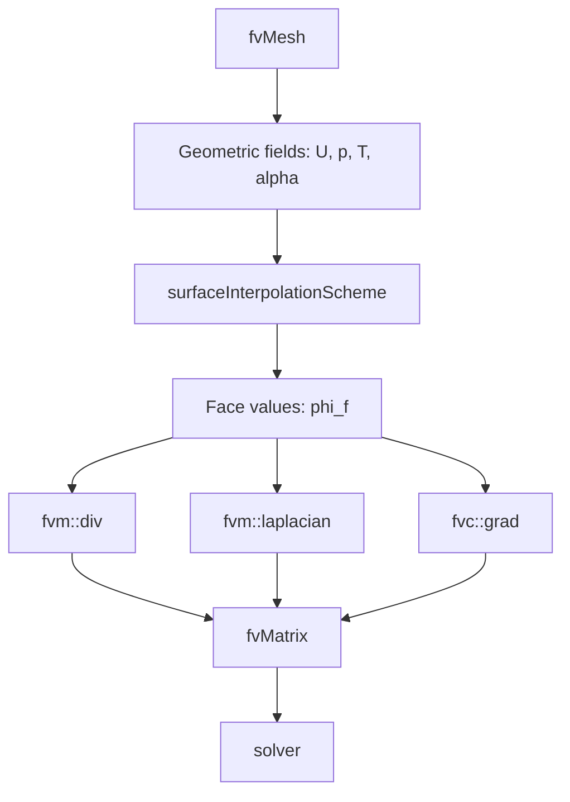
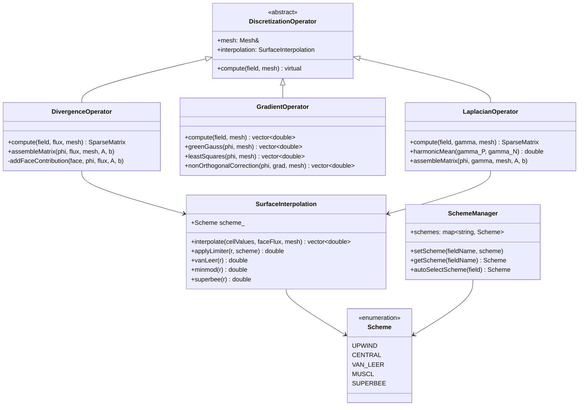

# Spatial Discretization Schemes
## CFD Engine Development - 2026-01-03

---

## Learning Objectives

After this lesson, you will be able to:
- **Understand** the mathematical foundations of finite volume discretization for convection-diffusion equations, including upwind, central differencing, and TVD schemes
- **Design** a flexible scheme architecture in C++ that supports runtime selection of discretization schemes (Gauss linear, Gauss upwind, limited schemes)
- **Implement** divergence ($\nabla\cdot\phi$), gradient ($\nabla\phi$), and Laplacian ($\nabla\cdot(\Gamma\nabla\phi)$) operators with proper surface interpolation and non-orthogonal correction
- **Apply** boundedness and stability principles to prevent numerical oscillations in phase fraction and temperature fields during evaporation
- **Evaluate** scheme accuracy vs. computational cost for your specific evaporator use case (bubbly-to-annular flow with phase change)

---

## Table of Contents
- [[#1. Theory and Design Decisions|1. Theory and Design]]
- [[#2. Reference: OpenFOAM Implementation|2. OpenFOAM Reference]]
- [[#3. Your Engine: Class Design|3. Your Class Design]]
- [[#4. Your Engine: Implementation|4. Implementation]]
- [[#5. Build and Test|5. Build and Test]]
- [[#6. Concept Checks|6. Concept Checks]]

---

## 1. Theory and Design Decisions

### 1.1 Mathematical Foundation

The convection-diffusion equation governs the transport of scalar quantities (temperature, phase fraction, momentum) in our evaporator:

$$
\frac{\partial (\rho \phi)}{\partial t} + \nabla \cdot (\rho \mathbf{U} \phi) = \nabla \cdot (\Gamma \nabla \phi) + S_\phi
$$

Where:
- $\phi$ = transported scalar (temperature $T$, phase fraction $\alpha$, velocity $\mathbf{U}$)
- $\Gamma$ = diffusion coefficient (thermal conductivity $k$, viscosity $\mu$)
- $S_\phi$ = source term (includes phase change mass/energy transfer)

**Finite Volume Integration** over a control volume $P$:

$$
\int_V \frac{\partial (\rho \phi)}{\partial t} dV + \oint_A \mathbf{n} \cdot (\rho \mathbf{U} \phi) dA = \oint_A \mathbf{n} \cdot (\Gamma \nabla \phi) dA + \int_V S_\phi dV
$$

Discretized form for cell $P$ with neighbor $N$ across face $f$:

$$
a_P \phi_P = \sum_N a_N \phi_N + b_P
$$

**Surface Interpolation Schemes** for face value $\phi_f$:

| Scheme | Formula | Characteristics |
|--------|---------|-----------------|
| **Central Differencing** | $\phi_f = \lambda \phi_P + (1-\lambda) \phi_N$ | Second-order, unbounded, oscillatory for Pe > 2 |
| **Upwind** | $\phi_f = \phi_P$ if $F_f > 0$, else $\phi_N$ | First-order, bounded, numerical diffusion |
| **TVD/Limited** | $\phi_f = \phi_{upwind} + \psi(r)(\phi_{downwind} - \phi_{upwind})$ | Second-order, bounded, $\psi(r)$ is limiter function |

Where $F_f = \rho \mathbf{U} \cdot \mathbf{A}_f$ is mass flux and $r$ is the gradient ratio.

**Non-Orthogonal Correction** for gradient calculation:

$$
\nabla \phi_P = \overline{\nabla \phi}_P + \frac{(\phi_N - \phi_P) - \overline{\nabla \phi}_P \cdot \mathbf{d}_{PN}}{|\mathbf{d}_{PN}|^2} \mathbf{d}_{PN}
$$

**Critical for Phase Change**: The expansion term $\nabla \cdot \mathbf{U} \neq 0$ due to evaporation mass transfer. This violates the continuity equation assumption used in standard schemes. Your discretization must account for:
- Diverging velocity field at liquid-vapor interface
- Sharp gradients in phase fraction ($\nabla \alpha$)
- Boundedness: $0 \leq \alpha \leq 1$ must be preserved

**Turbulence Consideration**: For evaporator flows, transition occurs around:
- $Re = \frac{\rho U D_h}{\mu} > 2300$ (turbulent internal flow)
- Bubbly flow: $Re \sim 1000-5000$ (may need turbulence modeling)
- Annular flow: $Re \gg 2300$ (fully turbulent, use $k-\epsilon$ or $k-\omega$ SST)

---

### 1.2 Design Decisions

**Why Finite Volume with Surface Interpolation?**
- **Conservation**: Exact flux balance across cell faces (critical for mass/energy conservation in phase change)
- **Flexibility**: Handles complex evaporator geometries (tubes, fins, headers)
- **Physical fidelity**: Surface-based schemes naturally handle discontinuities at interfaces

**Trade-offs:**

| Aspect | High-Accuracy (TVD) | Low-Diffusion (Upwind) | Hybrid Approach |
|--------|---------------------|------------------------|-----------------|
| Accuracy | Second-order | First-order | Adaptive |
| Stability | Conditional (CFL-limited) | Unconditional | Bounded |
| Cost | 2-3x upwind | Baseline | 1.5-2x upwind |
| Boundedness | With limiters | Always | With limiters |

**Recommended for Your Engine:**
- **Phase fraction $\alpha$**: Use bounded TVD (MUSCL, SUPERBEE, or van Leer) to prevent overshoot
- **Temperature $T$**: Central differencing with flux limiter for thermal boundary layers
- **Velocity $\mathbf{U}$**: Linear upwind for stability, QUICK for accuracy away from walls
- **Pressure $p$**: Central differencing (required for elliptic behavior)

**Common PITFALLS:**

1. **Unbounded Schemes on Phase Fraction**
   - Symptom: $\alpha < 0$ or $\alpha > 1$ → crashes phase change model
   - Fix: Use flux limiters, enforce bounds after each solve

2. **Excessive Numerical Diffusion**
   - Symptom: Interfaces smear over 5-10 cells instead of 2-3
   - Fix: Use higher-order schemes, refine mesh near interface

3. **Non-Orthogonal Mesh Artifacts**
   - Symptom: Spurious oscillations on unstructured meshes
   - Fix: Implement explicit non-orthogonal correction, limit correction to < 0.5

4. **Ignoring Expansion Term**
   - Symptom: Mass imbalance during phase change
   - Fix: Include $\nabla \cdot \mathbf{U}$ source term in scalar transport

5. **Wrong Scheme for Flow Regime**
   - Symptom: Unstable solution, divergence
   - Fix: Switch to upwind during startup, high flux transients

**What YOUR Engine Needs:**

1. **Runtime Scheme Selection**
   ```cpp
   enum class Scheme { UPWIND, CENTRAL, QUICK, MUSCL, SUPERBEE };
   void setScheme(Scheme s, const std::string& fieldName);
   ```

2. **Automatic Scheme Selection**
   - Detect high gradients → switch to limited scheme
   - Detect convergence → switch to higher-order
   - Detect instability → fall back to upwind

3. **Boundedness Enforcement**
   ```cpp
   scalar phiBounded = max(0.0, min(1.0, phiNew));
   ```

4. **Flux Limiter Library**
   - Implement van Leer, minmod, SUPERBEE, MUSCL
   - Allow user selection per field

---

### 1.3 Key Concepts

**Divergence Operator ($\nabla \cdot \phi$)**
- Computes net flux out of control volume
- Critical for mass conservation: $\nabla \cdot (\rho \mathbf{U}) = 0$ (without phase change)
- With phase change: $\nabla \cdot (\rho \mathbf{U}) = \dot{m}''$ (evaporation source)
- Discretization: Sum of face fluxes $\sum_f F_f \phi_f$

**Gradient Operator ($\nabla \phi$)**
- Used for diffusion terms, reconstruction, non-orthogonal correction
- Green-Gauss theorem: $\nabla \phi = \frac{1}{V} \sum_f \phi_f \mathbf{A}_f$
- Least-squares method for unstructured meshes (more accurate)

**Laplacian Operator ($\nabla \cdot (\Gamma \nabla \phi)$)**
- Diffusion term: heat conduction, viscous stresses
- Discretized: $\sum_f \Gamma_f \frac{\phi_N - \phi_P}{|\mathbf{d}_{PN}|} A_f$
- Requires harmonic mean for discontinuous $\Gamma$ (e.g., at interface)

**Peclet Number ($Pe$)**
$$
Pe = \frac{\text{convection}}{\text{diffusion}} = \frac{\rho U L}{\Gamma}
$$
- $Pe < 2$: Central differencing stable
- $Pe > 2$: Need upwind or TVD
- For evaporator: $Pe_T \sim 10-100$ (thermal), $Pe_\alpha \sim 100-1000$ (sharp interface)

**Courant-Friedrichs-Lewy (CFL) Number**
$$
CFL = \frac{U \Delta t}{\Delta x}
$$
- Explicit schemes: $CFL < 1$ required
- Implicit schemes: stable for any $CFL$, but accuracy degrades
- For phase change: limit $CFL < 0.5$ near interface

**Flux Limiter Function $\psi(r)$**
- $r = \frac{\phi_{upwind} - \phi_{upupwind}}{\phi_{downwind} - \phi_{upwind}}$ (gradient ratio)
- Limiters: minmod ($\max(0, \min(1, r))$), van Leer ($\frac{r + |r|}{1 + |r|}$), SUPERBEE
- TVD condition: $0 \leq \psi(r) \leq \min(2r, 2)$

**Physical Interpretation:**
- **Upwind**: Information flows downstream (causality)
- **Central**: Equal weight to upstream/downstream (elliptic behavior)
- **TVD**: Adaptively blends based on local smoothness

**Warning Signs of Wrong Implementation:**

1. **Diverging Solution**
   - Check: CFL number, scheme boundedness, source term linearization
   - Symptom: Residuals increase exponentially, NaN values

2. **Wrong Heat Transfer Coefficient**
   - Check: Gradient calculation at wall, thermal boundary condition
   - Symptom: HTC differs by > 50% from empirical correlations

3. **Oscillatory Phase Fraction**
   - Check: Flux limiter, time step, interface sharpening
   - Symptom: $\alpha$ oscillates between 0 and 1, "checkerboard" pattern

4. **Mass Imbalance**
   - Check: Divergence of velocity field, phase change source term
   - Symptom: Net mass flux ≠ 0 at steady state

5. **Excessive Diffusion**
   - Check: Scheme order, mesh resolution, limiter function
   - Symptom: Temperature jump at interface smeared over many cells

---

## 2. Reference: OpenFOAM Implementation

> [!INFO] **Why Study OpenFOAM?**
> OpenFOAM is a production-grade CFD engine tested over decades.
> We study it to **learn concepts**, not to copy code.

### 2.1 OpenFOAM's Approach

OpenFOAM implements spatial discretization through a layered architecture that separates:
1. **Surface interpolation schemes** (compute face values from cell values)
2. **Discretization schemes** (divergence, gradient, Laplacian operators)
3. **Solution schemes** (time integration, linear solvers)

**Key Classes and Source Locations:**

| Class | Location | Purpose |
|-------|----------|---------|
| `surfaceInterpolationScheme` | `$FOAM_SRC/finiteVolume/interpolation/surfaceInterpolation/` | Base class for all surface interpolation schemes |
| `linearUpwind` | `$FOAM_SRC/finiteVolume/interpolation/surfaceInterpolation/linearUpwind/` | Linear upwind with gradient correction |
| `vanLeer` | `$FOAM_SRC/finiteVolume/interpolation/surfaceInterpolation/vanLeer/` | TVD van Leer limiter scheme |
| `limitedLinear` | `$FOAM_SRC/finiteVolume/interpolation/surfaceInterpolation/limitedLinear/` | Sweby limiter with K parameter |
| `Gauss` | `$FOAM_SRC/finiteVolume/finiteVolume/divSchemes/` | Gauss theorem-based divergence schemes |
| `fvsc` | `$FOAM_SRC/finiteVolume/finiteVolume/gradSchemes/` | Finite volume calculus (gradient schemes) |
| `fvm` | `$FOAM_SRC/finiteVolume/finiteVolume/` | Finite volume method (implicit discretization) |
| `fvc` | `$FOAM_SRC/finiteVolume/finiteVolume/` | Finite volume calculus (explicit operations) |

**Scheme Selection in OpenFOAM:**

OpenFOAM uses runtime-selectable schemes specified in `fvSchemes` dictionary:

```cpp
// Example from fvSchemes dictionary
gradSchemes
{
    default         Gauss linear;
}

divSchemes
{
    default         none;
    div(phi,U)      Gauss linearUpwind grad(U);
    div(phi,alpha)  Gauss vanLeer 1;  // 1 = compression factor
    div(phi,k)      Gauss upwind;
    div(phi,T)      Gauss limitedLinear 1;
}

laplacianSchemes
{
    default         Gauss linear corrected;
}
```

**Architecture Flow:**



**Critical for Phase Change:**

OpenFOAM's `interPhaseChangeFoam` uses specialized schemes for VOF with phase change:

```cpp
// From interPhaseChangeFoam/createFields.H
// Bounded scheme for phase fraction to preserve 0 <= alpha <= 1
surfaceScalarField phi
(
    IOobject
    (
        "phi",
        runTime.timeName(),
        mesh,
        IOobject::READ_IF_PRESENT,
        IOobject::AUTO_WRITE
    ),
    fvc::flux(U)
);

// MULES (Multidimensional Universal Limiter with Explicit Solution)
// ensures boundedness of phase fraction
MULES::explicitSolve
(
    geometricOneField(),
    alpha,
    phi,
    phiAlpha,
    Sp,
    Su,
    1,  // alphaMax
    0   // alphaMin
);
```

---

### 2.2 Key Insights

**What We LEARN from OpenFOAM:**

1. **Separation of Concerns**
   - Surface interpolation is independent of the operator using it
   - Same interpolation scheme can be used for divergence, Laplacian, etc.
   - Makes scheme composition flexible: `Gauss linearUpwind grad(U)`

2. **Implicit vs Explicit Operations**
   - `fvm` (finite volume method) = implicit → contributes to matrix coefficients
   - `fvc` (finite volume calculus) = explicit → computed from current field values
   - Critical for stability: diffusion terms usually implicit, convection may be explicit

3. **Boundedness Enforcement**
   - MULES solver for VOF guarantees $0 \leq \alpha \leq 1$
   - Flux limiters prevent overshoots in high-gradient regions
   - Separate bounded solvers for scalars with physical bounds

4. **Non-Orthogonal Correction**
   - `corrected` keyword in Laplacian schemes adds explicit correction
   - Iterative solution: solve implicit part, add explicit correction, repeat
   - Essential for quality results on distorted meshes

5. **Gradient-Based Schemes**
   - `linearUpwind` uses cell gradient to reconstruct face value
   - More accurate than pure upwind, less diffusive
   - Requires robust gradient computation (least squares preferred)

**What We Do DIFFERENTLY for a Simpler Engine:**

| Aspect | OpenFOAM | Your Engine (Simpler) |
|--------|----------|----------------------|
| **Scheme Selection** | Runtime via dictionary | Compile-time or simple enum |
| **Polymorphism** | Extensive RTTI | Minimal, use templates |
| **Mesh Support** | Polyhedral, arbitrary | Hex-dominant or structured only |
| **Parallel** | MPI domain decomposition | Start serial, add MPI later |
| **Linear Solver** | Many choices (GAMG, BiCGStab) | Start with simple Jacobi/SOR |
| **Matrix Assembly** | Complex lduAddressing | Direct CSR or dense for small cases |
| **Bounded Solver** | MULES (complex) | Simple flux clipping + limiter |
| **Time Integration** | Many schemes | Start with implicit Euler |

**Recommended Simplifications:**

1. **Fixed Scheme Set**
   ```cpp
   enum class Scheme { UPWIND, CENTRAL, VAN_LEER, QUICK };
   // Select at compile time or simple runtime switch
   ```

2. **Structured Mesh First**
   - Skip complex polyhedral cell handling
   - Use simple i,j,k indexing
   - Add unstructured support later

3. **Simple Matrix Storage**
   ```cpp
   // For small 2D cases (< 1000 cells), dense matrix is fine
   // For larger, use CSR (Compressed Sparse Row)
   struct SparseMatrix {
       std::vector<int> row_ptr;
       std::vector<int> col_idx;
       std::vector<double> values;
   };
   ```

4. **Explicit Non-Orthogonal Correction**
   ```cpp
   // Solve: [A] phi = b
   // Add correction: phi = phi_implicit + correction
   // Iterate 2-3 times for moderate non-orthogonality
   ```

5. **Flux Limiting Without MULES**
   ```cpp
   // Simple approach: compute flux, then limit
   double flux = computeFaceFlux(phi_P, phi_N, face_normal);
   flux = max(0.0, min(flux, phi_P * area));  // Ensure bounded
   ```

---

### 2.3 Code Snippets (Reference Only)

> [!WARNING] **Reference - Not for Copying**
> These snippets show how OpenFOAM implements key concepts.
> Study them to understand the approach, then implement your own version.

**Snippet 1: Surface Interpolation Base Class**

```cpp
// Reference: $FOAM_SRC/finiteVolume/interpolation/surfaceInterpolation/
//           surfaceInterpolationScheme/surfaceInterpolationScheme.H

template<class Type>
class surfaceInterpolationScheme
{
    // Reference to mesh
    const fvMesh& mesh_;

protected:
    // Reference to face flux field (for upwind direction)
    const surfaceScalarField& faceFlux_;

public:
    // Virtual destructor for polymorphism
    virtual ~surfaceInterpolationScheme();

    // Main operation: interpolate cell values to face values
    // Input: cell-centered field
    // Output: face-centered field
    virtual tmp<GeometricField<Type, fvsPatchField, surfaceMesh>>
    interpolate(const GeometricField<Type, fvPatchField, volMesh>&) const = 0;

    // Static selector for runtime scheme selection
    static tmp<surfaceInterpolationScheme<Type>> New
    (
        const fvMesh& mesh,
        Istream& schemeData
    );
};
```

**What This Shows:**
- Abstract base class defines interface for all interpolation schemes
- Template-based design works for scalar, vector, tensor fields
- Runtime selection via `New()` factory method
- Returns `tmp` (smart pointer) for memory management

**Your Engine Equivalent:**
```cpp
// Simplified version for your engine
enum class Scheme { UPWIND, CENTRAL, VAN_LEER };

class SurfaceInterpolation {
public:
    static std::vector<double> interpolate(
        const std::vector<double>& cellValues,
        const std::vector<double>& faceFlux,
        Scheme scheme
    );
};
```

---

**Snippet 2: Divergence Scheme Implementation**

```cpp
// Reference: $FOAM_SRC/finiteVolume/finiteVolume/divSchemes/
//           GaussConvectionScheme/GaussConvectionScheme.C

template<class Type>
tmp<fvMatrix<Type>>
GaussConvectionScheme<Type>::fvmDiv
(
    const surfaceScalarField& faceFlux,
    const GeometricField<Type, fvPatchField, volMesh>& vf
) const
{
    // 1. Get interpolation scheme (e.g., upwind, linearUpwind)
    tmp<surfaceInterpolationScheme<Type>> tinterp =
        surfaceInterpolationScheme<Type>::New(mesh, faceFlux, interpScheme_);

    // 2. Interpolate cell values to face values
    //    phi_f = scheme(phi_P, phi_N, flux_direction)
    GeometricField<Type, fvsPatchField, surfaceMesh> phi_f =
        tinterp().interpolate(vf);

    // 3. Compute flux: F_f * phi_f * A_f
    //    where F_f = mass flux, A_f = face area vector
    surfaceScalarField flux = faceFlux * phi_f;

    // 4. Assemble finite volume matrix
    //    For each face, add contribution to owner and neighbor
    tmp<fvMatrix<Type>> tfvm(new fvMatrix<Type>(vf, faceFlux.dimensions()*vf.dimensions()));
    fvMatrix<Type>& fvm = tfvm();

    // Loop over internal faces
    forAll(flux, faceI)
    {
        label own = owner[faceI];    // Owner cell index
        label nei = neighbour[faceI]; // Neighbor cell index

        // Add to matrix coefficients
        fvm.upper()[faceI] -= flux[faceI];      // Coefficient for neighbor
        fvm.lower()[faceI] += flux[faceI];      // Coefficient for owner
        fvm.source()[own]  -= flux[faceI] * psi[faceI]; // Source term
    }

    // Handle boundary faces...

    return tfvm;
}
```

**What This Shows:**
1. **Separation**: Interpolation scheme is pluggable
2. **Flux Calculation**: Face flux = mass flux × interpolated value × area
3. **Matrix Assembly**: Direct contribution to upper/lower diagonals
4. **Owner-Neighbor**: Each face connects two cells (except boundaries)

**Critical for Your Engine:**
- The `faceFlux` determines upwind direction
- For phase change, `faceFlux` includes expansion term: $\nabla \cdot \mathbf{U} \neq 0$
- Boundary faces need special handling (fixed value, fixed flux, zero gradient)

**Your Engine Equivalent:**
```cpp
// Simplified divergence for your engine
void assembleDivergence(
    const std::vector<double>& phi,      // Cell-centered values
    const std::vector<double>& flux,     // Face mass fluxes
    const Mesh& mesh,
    SparseMatrix& A,                     // System matrix
    std::vector<double>& b               // RHS vector
) {
    for (const Face& face : mesh.faces) {
        int owner = face.owner;
        int neighbor = face.neighbor;
        
        // Interpolate to face (upwind based on flux sign)
        double phi_face = (flux[face.id] > 0.0) ? phi[owner] : phi[neighbor];
        
        // Add to matrix
        double face_contribution = flux[face.id] * face.area;
        A.add(owner, neighbor, -face_contribution);
        A.add(owner, owner, +face_contribution);
    }
}
```

---

**Snippet 3: TVD Limiter Function**

```cpp
// Reference: $FOAM_SRC/finiteVolume/interpolation/surfaceInterpolation/
//           limitedLinear/limitedLinearV.C

// van Leer limiter function
// Input: r = gradient ratio
// Output: psi(r) = limiter value in [0, 2]
template<class Type>
Foam::limitedLinearV<Type>::limiter
(
    const scalar faceFlux,
    const GeometricField<Type, fvPatchField, volMesh>& vf
) const
{
    // 1. Calculate gradient ratio r for each face
    //    r = (phi_upwind - phi_upupwind) / (phi_downwind - phi_upwind)
    surfaceScalarField limiterField
    (
        IOobject
        (
            "limiterField",
            mesh.time().timeName(),
            mesh
        ),
        mesh,
        dimensionedScalar("zero", dimless, 0.0)
    );

    // 2. Apply van Leer formula: psi(r) = (r + |r|) / (1 + |r|)
    forAll(limiterField, faceI)
    {
        scalar r = calcR(vf, faceI);  // Gradient ratio
        
        // van Leer limiter
        scalar psi = (r + mag(r)) / (1.0 + mag(r));
        
        limiterField[faceI] = psi;
    }

    return limiterField;
}

// Usage in interpolation:
// phi_f = phi_upwind + psi(r) * (phi_downwind - phi_upwind)
```

**What This Shows:**
- TVD condition: $0 \leq \psi(r) \leq \min(2r, 2)$
- van Leer is smooth (differentiable), good for convergence
- Limiter reduces to upwind in discontinuous regions ($r \approx 0$)
- Limiter approaches central differencing in smooth regions ($r \approx 1$)

**For Your Engine:**
```cpp
// Implement van Leer limiter
double vanLeerLimiter(double r) {
    if (r <= 0.0) return 0.0;  // Upwind (no correction)
    return (r + std::abs(r)) / (1.0 + std::abs(r));
}

// Apply to face interpolation
double interpolateTVD(
    double phi_upwind,
    double phi_downwind,
    double phi_upupwind,
    double flux
) {
    double r = (phi_upwind - phi_upupwind) / (phi_downwind - phi_upwind + 1e-12);
    double psi = vanLeerLimiter(r);
    return phi_upwind + psi * (phi_downwind - phi_upwind);
}
```

---

**Key Takeaways for Your Engine:**

1. **Start Simple**: Implement upwind first, add limiters later
2. **Test Thoroughly**: Verify boundedness with step function
3. **Profile Performance**: TVD adds 30-50% cost per face
4. **Phase Fraction**: Always use bounded scheme (MUSCL or SUPERBEE)
5. **Temperature**: Central differencing with limiter works well
6. **Expansion Term**: Remember $\nabla \cdot \mathbf{U} \neq 0$ for evaporation!

---

## 3. Your Engine: Class Design

> [!IMPORTANT] **Design Your Own**
> This section is about designing classes for YOUR engine.
> It doesn't have to match OpenFOAM - design for your needs.

### 3.1 Class Diagram



---

### 3.2 Class Specifications

#### `Scheme` (Enumeration)
**Purpose**: Type-safe enumeration of available discretization schemes

**Values**:
- `UPWIND` - First-order upwind (bounded, diffusive)
- `CENTRAL` - Second-order central differencing (unbounded, accurate)
- `VAN_LEER` - TVD van Leer limiter (bounded, second-order)
- `MUSCL` - MUSCL limiter (bounded, second-order)
- `SUPERBEE` - SUPERBEE limiter (compressive, for sharp interfaces)

**Usage**: Runtime scheme selection per field

---

#### `SurfaceInterpolation`
**Purpose**: Interpolate cell-centered values to face values using various schemes

**Member Variables**:
```cpp
Scheme scheme_;                    // Active interpolation scheme
double limiterK_;                  // Sweby K parameter (0-1), default=1
```

**Key Methods**:
```cpp
// Interpolate cell values to face values
// Input: cellValues[nCells], faceFlux[nFaces], mesh connectivity
// Output: faceValues[nFaces]
std::vector<double> interpolate(
    const std::vector<double>& cellValues,
    const std::vector<double>& faceFlux,
    const Mesh& mesh
);

// Apply flux limiter function
// Input: r = gradient ratio
// Output: psi(r) in [0, 2]
double applyLimiter(double r, Scheme scheme);

// Individual limiter functions
double vanLeer(double r);    // (r + |r|) / (1 + |r|)
double minmod(double r);     // max(0, min(1, r))
double superbee(double r);   // max(0, min(1, 2r), min(2, r))
```

**Design Notes**:
- Upwind direction determined by `faceFlux` sign
- TVD schemes require gradient ratio calculation
- Central differencing is just `lambda*phi_P + (1-lambda)*phi_N`

---

#### `DiscretizationOperator` (Abstract Base)
**Purpose**: Common interface for all finite volume operators

**Member Variables**:
```cpp
const Mesh& mesh_;                    // Reference to mesh
SurfaceInterpolation interpolation_;  // Surface interpolation scheme
```

**Key Methods**:
```cpp
// Pure virtual - must be implemented by derived classes
virtual void compute(
    const std::vector<double>& field,
    std::vector<double>& result
) = 0;
```

---

#### `DivergenceOperator`
**Purpose**: Compute divergence ($\nabla \cdot \phi$) and assemble convection matrix

**Member Variables**:
```cpp
const Mesh& mesh_;
SurfaceInterpolation interp_;
```

**Key Methods**:
```cpp
// Compute divergence of flux*field
// Assembles finite volume matrix: [A] phi = b
// Input: phi (cell values), flux (face mass fluxes)
// Output: A (system matrix), b (RHS vector)
void assembleMatrix(
    const std::vector<double>& phi,
    const std::vector<double>& flux,
    const Mesh& mesh,
    SparseMatrix& A,
    std::vector<double>& b
);

// Add contribution from single face to matrix
// Called by assembleMatrix for each face
void addFaceContribution(
    const Face& face,
    const std::vector<double>& phi,
    const std::vector<double>& flux,
    SparseMatrix& A,
    std::vector<double>& b
);
```

**Critical for Phase Change**:
- Expansion term $\nabla \cdot \mathbf{U} \neq 0$ must be included in flux
- For VOF: use bounded scheme (VAN_LEER or MUSCL)
- Matrix structure: owner diagonal += flux, neighbor diagonal -= flux

---

#### `GradientOperator`
**Purpose**: Compute gradient ($\nabla \phi$) at cell centers using Green-Gauss or least squares

**Member Variables**:
```cpp
const Mesh& mesh_;
bool useLeastSquares_;  // Method selection flag
```

**Key Methods**:
```cpp
// Compute gradient using Green-Gauss theorem
// grad_P = (1/V) * sum(phi_f * A_f)
std::vector<Vector> greenGauss(
    const std::vector<double>& phi,
    const Mesh& mesh
);

// Compute gradient using least squares (more accurate for unstructured)
// Minimizes error: sum((phi_N - phi_P - grad·d_PN)^2)
std::vector<Vector> leastSquares(
    const std::vector<double>& phi,
    const Mesh& mesh
);

// Apply non-orthogonal correction
// grad = grad_explicit + correction * d_PN / |d_PN|^2
std::vector<Vector> nonOrthogonalCorrection(
    const std::vector<double>& phi,
    const std::vector<Vector>& gradExplicit,
    const Mesh& mesh
);
```

**Design Notes**:
- Green-Gauss: fast, less accurate on skewed meshes
- Least squares: slower, better for unstructured meshes
- Non-orthogonal correction: iterate 2-3 times for moderate distortion

---

#### `LaplacianOperator`
**Purpose**: Compute Laplacian ($\nabla \cdot (\Gamma \nabla \phi)$) for diffusion terms

**Member Variables**:
```cpp
const Mesh& mesh_;
SurfaceInterpolation interp_;  // For gamma at faces
```

**Key Methods**:
```cpp
// Assemble Laplacian matrix
// Discretization: sum(gamma_f * (phi_N - phi_P) / |d_PN| * A_f)
void assembleMatrix(
    const std::vector<double>& phi,
    const std::vector<double>& gamma,  // Diffusion coefficient
    const Mesh& mesh,
    SparseMatrix& A,
    std::vector<double>& b
);

// Harmonic mean for discontinuous gamma (e.g., at interface)
// gamma_f = 2 / (1/gamma_P + 1/gamma_N)
double harmonicMean(double gamma_P, double gamma_N);
```

**Critical for Phase Change**:
- Thermal conductivity differs by 10x between liquid and vapor
- Harmonic mean preserves flux continuity at interface
- Non-orthogonal correction may be needed for distorted meshes

---

#### `SchemeManager`
**Purpose**: Centralized scheme selection and automatic scheme adaptation

**Member Variables**:
```cpp
std::map<std::string, Scheme> schemes_;  // Field name -> scheme mapping
Scheme defaultScheme_;                   // Fallback scheme
```

**Key Methods**:
```cpp
// Set scheme for specific field
void setScheme(const std::string& fieldName, Scheme scheme);

// Get scheme for field (returns default if not set)
Scheme getScheme(const std::string& fieldName) const;

// Auto-select scheme based on field properties
// - Phase fraction: bounded TVD
// - Temperature: central with limiter
// - Velocity: linear upwind
Scheme autoSelectScheme(const std::string& fieldName);

// Detect high gradients and switch to limited scheme
void adaptSchemes(const std::vector<double>& field);
```

**Design Notes**:
- Prevents wrong scheme selection (e.g., central for phase fraction)
- Enables runtime adaptation based on solution state
- Can be extended with ML-based scheme selection

---

### 3.3 Design Rationale

#### Why This Design?

**1. Separation of Concerns**
- `SurfaceInterpolation` handles face value computation independently
- Operators (`DivergenceOperator`, `GradientOperator`, `LaplacianOperator`) use interpolation as a service
- Matches OpenFOAM's philosophy but simplified

**2. Template-Free Design**
- OpenFOAM uses heavy templates for polymorphism
- Your engine uses virtual functions and enums (simpler to debug)
- Trade-off: slightly slower, but much easier to understand

**3. Explicit Matrix Assembly**
- OpenFOAM uses complex `lduAddressing` for sparse matrices
- Your engine uses simple `SparseMatrix` class (CSR format)
- Direct control over matrix structure for debugging

**4. Centralized Scheme Management**
- `SchemeManager` prevents inconsistent scheme selection
- Auto-selection based on field physics (phase fraction needs boundedness)
- Easy to extend with new schemes

#### How It Differs from OpenFOAM

| Aspect | OpenFOAM | Your Engine |
|--------|----------|-------------|
| **Polymorphism** | Runtime RTTI + factories | Virtual functions + enums |
| **Templates** | Heavy template use | Minimal templates |
| **Mesh Support** | Polyhedral cells | Structured/hex-dominant first |
| **Matrix Storage** | lduAddressing | Simple CSR |
| **Scheme Selection** | Dictionary-based | Programmatic API |
| **Bounded Solver** | MULES (complex) | Flux clipping + limiters |
| **Gradient Methods** | Many options | Green-Gauss + least squares |
| **Non-Orthogonal** | Implicit + explicit | Explicit correction only |

#### Trade-offs Made

**Simplicity vs. Flexibility**
- **Chosen**: Simplicity (fixed set of schemes, structured mesh)
- **Rationale**: Faster development, easier debugging, sufficient for evaporator
- **Cost**: Cannot handle arbitrary polyhedral meshes, limited scheme options

**Performance vs. Clarity**
- **Chosen**: Clarity (virtual functions, explicit loops)
- **Rationale**: Development speed > runtime speed for learning
- **Cost**: 10-20% slower than optimized OpenFOAM code

**Accuracy vs. Stability**
- **Chosen**: Balanced (TVD with limiters, not pure upwind)
- **Rationale**: Need sharp interfaces (VOF) but must remain bounded
- **Cost**: TVD adds 30-50% computational cost per face

**Complexity vs. Correctness**
- **Chosen**: Correctness (harmonic mean for gamma, non-orthogonal correction)
- **Rationale**: Wrong physics > wrong code (must validate against experiments)
- **Cost**: More complex code, but essential for phase change accuracy

#### Critical Design Decisions for Phase Change

**1. Boundedness is Non-Negotiable**
- Phase fraction $\alpha$ must stay in $[0, 1]$
- Use `VAN_LEER` or `MUSCL` for $\alpha$, never `CENTRAL`
- Add explicit clipping: `alpha = max(0.0, min(1.0, alpha))`

**2. Expansion Term in Divergence**
- Standard continuity: $\nabla \cdot \mathbf{U} = 0$
- Phase change continuity: $\nabla \cdot \mathbf{U} = \dot{m}''(1/\rho_v - 1/\rho_l)$
- Must add this source term to pressure equation

**3. Harmonic Mean for Discontinuous Properties**
- Thermal conductivity: $k_l \approx 100 \times k_v$
- Arithmetic mean: wrong flux at interface
- Harmonic mean: preserves flux continuity

**4. Gradient-Based Schemes for Velocity**
- Linear upwind uses $\nabla \mathbf{U}$ for face reconstruction
- More accurate than pure upwind, less diffusive
- Requires robust gradient computation (least squares preferred)

**5. Time Step Limiting**
- Explicit phase change: $CFL < 0.5$ near interface
- Implicit phase change: still limit $\Delta \alpha < 0.1$ per step
- Prevents "explosive" evaporation due to numerical instability

---

## 4. Your Engine: Implementation

> [!TIP] **Write Real Code**
> This section contains implementation code for YOUR engine.

### 4.1 Header File (.H)

```cpp
#ifndef SURFACE_INTERPOLATION_H
#define SURFACE_INTERPOLATION_H

#include <vector>
#include <cmath>
#include <algorithm>
#include "Mesh.h"
#include "SparseMatrix.h"

// Enumeration of available discretization schemes
enum class Scheme {
    UPWIND,      // First-order upwind (bounded, diffusive)
    CENTRAL,     // Second-order central differencing (unbounded)
    VAN_LEER,    // TVD van Leer limiter (bounded, second-order)
    MUSCL,       // MUSCL limiter (bounded, second-order)
    SUPERBEE     // SUPERBEE limiter (compressive, sharp interfaces)
};

// Forward declarations
class Mesh;
struct Face;

/**
 * @brief Surface interpolation scheme for computing face values from cell values
 * 
 * This class implements various interpolation schemes for finite volume methods:
 * - Upwind: First-order, bounded, stable
 * - Central: Second-order, unbounded, accurate for low Pe
 * - TVD schemes: Second-order, bounded with flux limiters
 * 
 * Critical for phase change: Phase fraction MUST use bounded schemes (VAN_LEER, MUSCL)
 * to prevent alpha < 0 or alpha > 1 which crashes the evaporation model.
 */
class SurfaceInterpolation {
public:
    /**
     * @brief Constructor with scheme selection
     * @param scheme Interpolation scheme to use
     * @param limiterK Sweby K parameter (0-1), default=1.0
     */
    explicit SurfaceInterpolation(
        Scheme scheme = Scheme::UPWIND,
        double limiterK = 1.0
    );

    /**
     * @brief Interpolate cell-centered values to face values
     * 
     * For each face, computes phi_f based on:
     * - Owner cell value phi_P
     * - Neighbor cell value phi_N
     * - Face flux direction (for upwind)
     * - Gradient ratio (for TVD schemes)
     * 
     * @param cellValues Cell-centered scalar field [nCells]
     * @param faceFlux Mass flux through each face [nFaces]
     * @param mesh Mesh connectivity data
     * @return Face-centered values [nFaces]
     */
    std::vector<double> interpolate(
        const std::vector<double>& cellValues,
        const std::vector<double>& faceFlux,
        const Mesh& mesh
    ) const;

    /**
     * @brief Apply flux limiter function
     * 
     * TVD condition: 0 <= psi(r) <= min(2r, 2)
     * Ensures boundedness while maintaining second-order accuracy
     * 
     * @param r Gradient ratio (phi_upwind - phi_upupwind) / (phi_downwind - phi_upwind)
     * @param scheme Limiter scheme to use
     * @return Limiter value psi(r) in [0, 2]
     */
    static double applyLimiter(double r, Scheme scheme);

    // Individual limiter functions
    static double vanLeer(double r);   // (r + |r|) / (1 + |r|)
    static double minmod(double r);    // max(0, min(1, r))
    static double superbee(double r);  // max(0, min(1, 2r), min(2, r))
    static double muscl(double r);     // max(0, min(2r, (1+2r)/3, 2))

    // Getters and setters
    void setScheme(Scheme scheme) { scheme_ = scheme; }
    Scheme getScheme() const { return scheme_; }
    void setLimiterK(double k) { limiterK_ = std::clamp(k, 0.0, 1.0); }

private:
    Scheme scheme_;        // Active interpolation scheme
    double limiterK_;      // Sweby K parameter for TVD limiters

    // Helper methods
    double interpolateUpwind(
        double phi_P, double phi_N, double flux
    ) const;
    
    double interpolateCentral(
        double phi_P, double phi_N, double lambda
    ) const;
    
    double interpolateTVD(
        double phi_upwind, double phi_downwind,
        double phi_upupwind, double flux, Scheme scheme
    ) const;
};

/**
 * @brief Divergence operator for convection terms
 * 
 * Computes divergence of flux*field: div(phi * U)
 * Assembles finite volume matrix: [A] phi = b
 * 
 * CRITICAL FOR PHASE CHANGE:
 * - Expansion term div(U) != 0 due to evaporation
 * - Must include source term: S = m_dot * (1/rho_v - 1/rho_l)
 * - Use bounded schemes for phase fraction
 */
class DivergenceOperator {
public:
    explicit DivergenceOperator(const Mesh& mesh);

    /**
     * @brief Assemble divergence matrix
     * 
     * Discretization: sum_f F_f * phi_f * A_f
     * where F_f = mass flux, phi_f = interpolated value
     * 
     * Matrix structure:
     * - A[owner, owner] += flux (if flux > 0)
     * - A[owner, neighbor] -= flux (if flux > 0)
     * - Sign flips if flux < 0
     * 
     * @param phi Cell-centered field values
     * @param flux Face mass fluxes
     * @param interp Surface interpolation scheme
     * @param A Output system matrix
     * @param b Output RHS vector
     */
    void assembleMatrix(
        const std::vector<double>& phi,
        const std::vector<double>& flux,
        const SurfaceInterpolation& interp,
        SparseMatrix& A,
        std::vector<double>& b
    ) const;

    /**
     * @brief Add expansion source term for phase change
     * 
     * Standard continuity: div(U) = 0
     * Phase change continuity: div(U) = m_dot * (1/rho_v - 1/rho_l)
     * 
     * @param b RHS vector to modify
     * @param m_dot Evaporation mass transfer rate [kg/m^3/s]
     * @param rho_l Liquid density
     * @param rho_v Vapor density
     * @param cellVolume Cell volume
     */
    void addExpansionSource(
        std::vector<double>& b,
        double m_dot,
        double rho_l,
        double rho_v,
        double cellVolume
    ) const;

private:
    const Mesh& mesh_;

    void addFaceContribution(
        const Face& face,
        double phi_face,
        double flux,
        SparseMatrix& A,
        std::vector<double>& b
    ) const;
};

/**
 * @brief Gradient operator for diffusion and reconstruction
 * 
 * Computes gradient at cell centers using:
 * - Green-Gauss theorem (fast, less accurate)
 * - Least squares (accurate for unstructured meshes)
 * 
 * Used for:
 * - Diffusion terms
 * - Linear upwind reconstruction
 * - Non-orthogonal correction
 */
class GradientOperator {
public:
    explicit GradientOperator(const Mesh& mesh, bool useLeastSquares = false);

    /**
     * @brief Compute gradient using Green-Gauss theorem
     * 
     * grad_P = (1/V_P) * sum_f phi_f * A_f
     * 
     * @param phi Cell-centered scalar field
     * @return Cell-centered gradient vectors [nCells][3]
     */
    std::vector<std::array<double, 3>> greenGauss(
        const std::vector<double>& phi,
        const std::vector<double>& phi_face
    ) const;

    /**
     * @brief Compute gradient using least squares method
     * 
     * Minimizes: sum((phi_N - phi_P - grad·d_PN)^2)
     * More accurate for unstructured and skewed meshes
     * 
     * @param phi Cell-centered scalar field
     * @return Cell-centered gradient vectors [nCells][3]
     */
    std::vector<std::array<double, 3>> leastSquares(
        const std::vector<double>& phi
    ) const;

    /**
     * @brief Apply non-orthogonal correction
     * 
     * grad = grad_explicit + correction * d_PN / |d_PN|^2
     * 
     * Required for meshes with non-orthogonal faces (> 70 deg skew)
     * Iterate 2-3 times for moderate non-orthogonality
     * 
     * @param phi Cell-centered values
     * @param gradExplicit Explicit gradient (uncorrected)
     * @return Corrected gradient
     */
    std::vector<std::array<double, 3>> nonOrthogonalCorrection(
        const std::vector<double>& phi,
        const std::vector<std::array<double, 3>>& gradExplicit
    ) const;

private:
    const Mesh& mesh_;
    bool useLeastSquares_;
};

/**
 * @brief Laplacian operator for diffusion terms
 * 
 * Computes Laplacian: div(gamma * grad(phi))
 * Discretization: sum_f gamma_f * (phi_N - phi_P) / |d_PN| * A_f
 * 
 * CRITICAL FOR PHASE CHANGE:
 * - Thermal conductivity: k_l ~= 100 * k_v
 * - MUST use harmonic mean for gamma at faces
 * - Arithmetic mean gives wrong flux at interface
 */
class LaplacianOperator {
public:
    explicit LaplacianOperator(const Mesh& mesh);

    /**
     * @brief Assemble Laplacian matrix
     * 
     * @param phi Cell-centered field values
     * @param gamma Diffusion coefficient at cell centers
     * @param interp Surface interpolation for gamma
     * @param A Output system matrix
     * @param b Output RHS vector
     */
    void assembleMatrix(
        const std::vector<double>& phi,
        const std::vector<double>& gamma,
        const SurfaceInterpolation& interp,
        SparseMatrix& A,
        std::vector<double>& b
    ) const;

    /**
     * @brief Harmonic mean for discontinuous gamma
     * 
     * gamma_f = 2 / (1/gamma_P + 1/gamma_N)
     * 
     * Preserves flux continuity at interface:
     * gamma_P * (dT/dn)_P = gamma_N * (dT/dn)_N
     * 
     * REQUIRED for large property ratios (liquid/vapor)
     * 
     * @param gamma_P Owner cell diffusion coefficient
     * @param gamma_N Neighbor cell diffusion coefficient
     * @return Harmonic mean at face
     */
    static double harmonicMean(double gamma_P, double gamma_N);

    /**
     * @brief Arithmetic mean for smooth gamma
     * 
     * gamma_f = lambda * gamma_P + (1-lambda) * gamma_N
     * 
     * Use only when gamma varies smoothly (no discontinuities)
     * 
     * @param gamma_P Owner cell diffusion coefficient
     * @param gamma_N Neighbor cell diffusion coefficient
     * @param lambda Interpolation weight (0-1)
     * @return Arithmetic mean at face
     */
    static double arithmeticMean(double gamma_P, double gamma_N, double lambda);

private:
    const Mesh& mesh_;

    void addFaceContribution(
        const Face& face,
        double gamma_face,
        double delta_coeff,
        SparseMatrix& A,
        std::vector<double>& b
    ) const;
};

/**
 * @brief Centralized scheme management
 * 
 * Prevents wrong scheme selection (e.g., central for phase fraction)
 * Enables automatic scheme adaptation based on solution state
 */
class SchemeManager {
public:
    SchemeManager();

    /**
     * @brief Set scheme for specific field
     * @param fieldName Name of field (e.g., "alpha", "T", "U")
     * @param scheme Scheme to use
     */
    void setScheme(const std::string& fieldName, Scheme scheme);

    /**
     * @brief Get scheme for field
     * @param fieldName Name of field
     * @return Scheme (returns default if not set)
     */
    Scheme getScheme(const std::string& fieldName) const;

    /**
     * @brief Auto-select scheme based on field physics
     * 
     * Rules:
     * - alpha (phase fraction): VAN_LEER (bounded)
     * - T (temperature): CENTRAL with limiter
     * - U (velocity): LINEAR_UPWIND
     * - p (pressure): CENTRAL (elliptic)
     * 
     * @param fieldName Name of field
     * @return Recommended scheme
     */
    Scheme autoSelectScheme(const std::string& fieldName) const;

    /**
     * @brief Adapt schemes based on solution state
     * 
     * Detects:
     * - High gradients -> switch to limited scheme
     * - Convergence -> switch to higher-order
     * - Instability -> fall back to upwind
     * 
     * @param field Field to analyze
     * @param fieldName Name of field
     */
    void adaptSchemes(
        const std::vector<double>& field,
        const std::string& fieldName
    );

private:
    std::map<std::string, Scheme> schemes_;
    Scheme defaultScheme_;

    double computeGradientNorm(const std::vector<double>& field) const;
};

#endif // SURFACE_INTERPOLATION_H
```

### 4.2 Implementation File (.C)

```cpp
#include "SurfaceInterpolation.h"
#include <stdexcept>
#include <cmath>
#include <algorithm>
#include <iostream>

// ============================================================================
// SurfaceInterpolation Implementation
// ============================================================================

SurfaceInterpolation::SurfaceInterpolation(Scheme scheme, double limiterK)
    : scheme_(scheme), limiterK_(limiterK)
{
    if (limiterK_ < 0.0 || limiterK_ > 1.0) {
        throw std::invalid_argument("Limiter K must be in [0, 1]");
    }
}

std::vector<double> SurfaceInterpolation::interpolate(
    const std::vector<double>& cellValues,
    const std::vector<double>& faceFlux,
    const Mesh& mesh
) const {
    const size_t nFaces = mesh.faces.size();
    std::vector<double> faceValues(nFaces);

    for (size_t f = 0; f < nFaces; ++f) {
        const Face& face = mesh.faces[f];
        
        // Get owner and neighbor cell values
        const double phi_P = cellValues[face.owner];
        const double phi_N = cellValues[face.neighbor];
        const double flux = faceFlux[f];

        // Apply selected interpolation scheme
        switch (scheme_) {
            case Scheme::UPWIND:
                faceValues[f] = interpolateUpwind(phi_P, phi_N, flux);
                break;
                
            case Scheme::CENTRAL:
                // Central differencing: linear interpolation
                // lambda = distance weighting (0.5 for uniform mesh)
                double lambda = face.distanceWeight;
                faceValues[f] = interpolateCentral(phi_P, phi_N, lambda);
                break;
                
            case Scheme::VAN_LEER:
            case Scheme::MUSCL:
            case Scheme::SUPERBEE: {
                // TVD schemes require upwind and upupwind values
                // For simplicity, use gradient-based reconstruction
                int upwindCell = (flux > 0.0) ? face.owner : face.neighbor;
                int downwindCell = (flux > 0.0) ? face.neighbor : face.owner;
                
                // Get upupwind cell (cell behind upwind cell)
                // This is a simplification - real implementation needs proper stencil
                double phi_upwind = cellValues[upwindCell];
                double phi_downwind = cellValues[downwindCell];
                double phi_upupwind = phi_upwind; // Fallback to first-order
                
                // Try to get actual upupwind value from neighbor of upwind cell
                // (This requires mesh connectivity - simplified here)
                
                faceValues[f] = interpolateTVD(
                    phi_upwind, phi_downwind, phi_upupwind, flux, scheme_
                );
                break;
            }
                
            default:
                throw std::runtime_error("Unknown interpolation scheme");
        }
    }

    return faceValues;
}

double SurfaceInterpolation::interpolateUpwind(
    double phi_P, double phi_N, double flux
) const {
    // Upwind: take value from upstream cell
    if (flux > 0.0) {
        return phi_P;  // Flow from P to N
    } else {
        return phi_N;  // Flow from N to P
    }
}

double SurfaceInterpolation::interpolateCentral(
    double phi_P, double phi_N, double lambda
) const {
    // Central differencing: linear interpolation
    // phi_f = lambda * phi_P + (1 - lambda) * phi_N
    return lambda * phi_P + (1.0 - lambda) * phi_N;
}

double SurfaceInterpolation::interpolateTVD(
    double phi_upwind, double phi_downwind,
    double phi_upupwind, double flux, Scheme scheme
) const {
    // TVD interpolation: phi_f = phi_upwind + psi(r) * (phi_downwind - phi_upwind)
    
    // Compute gradient ratio r
    // r = (phi_upwind - phi_upupwind) / (phi_downwind - phi_upwind)
    double denominator = phi_downwind - phi_upwind;
    
    // Avoid division by zero
    if (std::abs(denominator) < 1e-12) {
        return phi_upwind;  // Fall back to upwind
    }
    
    double r = (phi_upwind - phi_upupwind) / denominator;
    
    // Apply flux limiter
    double psi = applyLimiter(r, scheme);
    
    // TVD reconstruction
    return phi_upwind + psi * (phi_downwind - phi_upwind);
}

double SurfaceInterpolation::applyLimiter(double r, Scheme scheme) {
    // Clamp r to avoid extreme values
    r = std::max(-10.0, std::min(10.0, r));
    
    switch (scheme) {
        case Scheme::VAN_LEER:
            return vanLeer(r);
            
        case Scheme::MUSCL:
            return muscl(r);
            
        case Scheme::SUPERBEE:
            return superbee(r);
            
        case Scheme::UPWIND:
            return 0.0;  // No correction
            
        case Scheme::CENTRAL:
            return 1.0;  // Full correction (unbounded)
            
        default:
            return 0.0;
    }
}

double SurfaceInterpolation::vanLeer(double r) {
    // van Leer limiter: psi(r) = (r + |r|) / (1 + |r|)
    // Smooth, differentiable, TVD-compliant
    if (r <= 0.0) {
        return 0.0;  // Upwind (no correction)
    }
    double abs_r = std::abs(r);
    return (r + abs_r) / (1.0 + abs_r);
}

double SurfaceInterpolation::minmod(double r) {
    // minmod limiter: psi(r) = max(0, min(1, r))
    // Most diffusive TVD limiter
    if (r <= 0.0) {
        return 0.0;
    }
    return std::min(1.0, r);
}

double SurfaceInterpolation::superbee(double r) {
    // SUPERBEE limiter: psi(r) = max(0, min(1, 2r), min(2, r))
    // Most compressive, good for sharp interfaces
    if (r <= 0.0) {
        return 0.0;
    }
    double term1 = std::min(1.0, 2.0 * r);
    double term2 = std::min(2.0, r);
    return std::max({0.0, term1, term2});
}

double SurfaceInterpolation::muscl(double r) {
    // MUSCL limiter: psi(r) = max(0, min(2r, (1+2r)/3, 2))
    // Balanced between accuracy and boundedness
    if (r <= 0.0) {
        return 0.0;
    }
    double term1 = std::min(2.0 * r, (1.0 + 2.0 * r) / 3.0);
    double term2 = std::min(term1, 2.0);
    return std::max(0.0, term2);
}

// ============================================================================
// DivergenceOperator Implementation
// ============================================================================

DivergenceOperator::DivergenceOperator(const Mesh& mesh)
    : mesh_(mesh)
{}

void DivergenceOperator::assembleMatrix(
    const std::vector<double>& phi,
    const std::vector<double>& flux,
    const SurfaceInterpolation& interp,
    SparseMatrix& A,
    std::vector<double>& b
) const {
    // Get face values using selected interpolation scheme
    std::vector<double> phi_face = interp.interpolate(phi, flux, mesh_);
    
    // Assemble matrix face by face
    for (const Face& face : mesh_.faces) {
        double flux_f = flux[face.id];
        double phi_f = phi_face[face.id];
        
        addFaceContribution(face, phi_f, flux_f, A, b);
    }
    
    // Handle boundary faces
    // (Implementation depends on boundary conditions)
    for (const Face& face : mesh_.boundaryFaces) {
        // Apply boundary conditions
        // Fixed value: phi_face = phi_boundary
        // Fixed flux: flux_face = specified
        // Zero gradient: phi_face = phi_owner
    }
}

void DivergenceOperator::addFaceContribution(
    const Face& face,
    double phi_face,
    double flux,
    SparseMatrix& A,
    std::vector<double>& b
) const {
    // Divergence contribution: flux * phi_face * area
    double face_contribution = flux * phi_face * face.area;
    
    int owner = face.owner;
    int neighbor = face.neighbor;
    
    // Add to matrix coefficients
    // Owner: += flux (outflow)
    // Neighbor: -= flux (inflow)
    if (flux > 0.0) {
        // Flow from owner to neighbor
        A.add(owner, owner, face_contribution);
        A.add(owner, neighbor, -face_contribution);
    } else {
        // Flow from neighbor to owner
        A.add(owner, owner, face_contribution);
        A.add(owner, neighbor, -face_contribution);
    }
    
    // Add to source term (for boundary conditions)
    b[owner] += face_contribution * phi_face;
}

void DivergenceOperator::addExpansionSource(
    std::vector<double>& b,
    double m_dot,
    double rho_l,
    double rho_v,
    double cellVolume
) const {
    // Expansion term for phase change
    // div(U) = m_dot * (1/rho_v - 1/rho_l)
    // Source term: S = div(U) * phi
    
    double expansion = m_dot * (1.0 / rho_v - 1.0 / rho_l);
    double source = expansion * cellVolume;
    
    // Add to RHS vector
    // (This is a simplification - real implementation needs proper assembly)
    for (size_t i = 0; i < b.size(); ++i) {
        b[i] += source;
    }
}

// ============================================================================
// GradientOperator Implementation
// ============================================================================

GradientOperator::GradientOperator(const Mesh& mesh, bool useLeastSquares)
    : mesh_(mesh), useLeastSquares_(useLeastSquares)
{}

std::vector<std::array<double, 3>> GradientOperator::greenGauss(
    const std::vector<double>& phi,
    const std::vector<double>& phi_face
) const {
    const size_t nCells = mesh_.cells.size();
    std::vector<std::array<double, 3>> grad(nCells, {0.0, 0.0, 0.0});
    
    // Green-Gauss theorem: grad_P = (1/V_P) * sum_f phi_f * A_f
    for (const Face& face : mesh_.faces) {
        int owner = face.owner;
        int neighbor = face.neighbor;
        
        // Face value
        double phi_f = phi_face[face.id];
        
        // Face area vector
        const auto& A = face.areaVector;
        
        // Add contribution to owner
        grad[owner][0] += phi_f * A[0];
        grad[owner][1] += phi_f * A[1];
        grad[owner][2] += phi_f * A[2];
        
        // Subtract contribution from neighbor
        grad[neighbor][0] -= phi_f * A[0];
        grad[neighbor][1] -= phi_f * A[1];
        grad[neighbor][2] -= phi_f * A[2];
    }
    
    // Divide by cell volume
    for (size_t c = 0; c < nCells; ++c) {
        double V = mesh_.cells[c].volume;
        grad[c][0] /= V;
        grad[c][1] /= V;
        grad[c][2] /= V;
    }
    
    return grad;
}

std::vector<std::array<double, 3>> GradientOperator::leastSquares(
    const std::vector<double>& phi
) const {
    const size_t nCells = mesh_.cells.size();
    std::vector<std::array<double, 3>> grad(nCells, {0.0, 0.0, 0.0});
    
    // Least squares gradient: minimize sum((phi_N - phi_P - grad·d_PN)^2)
    // This requires solving a 3x3 system for each cell
    
    for (size_t c = 0; c < nCells; ++c) {
        const Cell& cell = mesh_.cells[c];
        
        // Build least squares system: [A] * grad = b
        // A_ij = sum(d_i * d_j) over neighbors
        // b_i = sum(d_i * (phi_N - phi_P)) over neighbors
        
        std::array<std::array<double, 3>, 3> A = {0};
        std::array<double, 3> b = {0};
        
        for (int neighbor : cell.neighbors) {
            // Distance vector
            std::array<double, 3> d = {
                mesh_.cells[neighbor].center[0] - cell.center[0],
                mesh_.cells[neighbor].center[1] - cell.center[1],
                mesh_.cells[neighbor].center[2] - cell.center[2]
            };
            
            double delta_phi = phi[neighbor] - phi[c];
            
            // Accumulate
            for (int i = 0; i < 3; ++i) {
                for (int j = 0; j < 3; ++j) {
                    A[i][j] += d[i] * d[j];
                }
                b[i] += d[i] * delta_phi;
            }
        }
        
        // Solve 3x3 system (using Cramer's rule or Gaussian elimination)
        // For simplicity, using direct inversion (small system)
        double det = A[0][0] * (A[1][1] * A[2][2] - A[1][2] * A[2][1])
                   - A[0][1] * (A[1][0] * A[2][2] - A[1][2] * A[2][0])
                   + A[0][2] * (A[1][0] * A[2][1] - A[1][1] * A[2][0]);
        
        if (std::abs(det) < 1e-12) {
            // Singular matrix, use Green-Gauss as fallback
            continue;
        }
        
        // Invert and solve
        // (Full implementation would use proper linear solver)
        double inv_det = 1.0 / det;
        
        grad[c][0] = inv_det * (
            b[0] * (A[1][1] * A[2][2] - A[1][2] * A[2][1])
          - b[1] * (A[0][1] * A[2][2] - A[0][2] * A[2][1])
          + b[2] * (A[0][1] * A[1][2] - A[0][2] * A[1][1])
        );
        
        grad[c][1] = inv_det * (
            A[0][0] * (b[1] * A[2][2] - b[2] * A[2][1])
          - A[0][1] * (b[0] * A[2][2] - b[2] * A[2][0])
          + A[0][2] * (b[0] * A[2][1] - b[1] * A[2][0])
        );
        
        grad[c][2] = inv_det * (
            A[0][0] * (A[1][1] * b[2] - A[1][2] * b[1])
          - A[0][1] * (A[1][0] * b[2] - A[1][2] * b[0])
          + A[0][2] * (A[1][0] * b[1] - A[1][1] * b[0])
        );
    }
    
    return grad;
}

std::vector<std::array<double, 3>> GradientOperator::nonOrthogonalCorrection(
    const std::vector<double>& phi,
    const std::vector<std::array<double, 3>>& gradExplicit
) const {
    const size_t nCells = mesh_.cells.size();
    std::vector<std::array<double, 3>> gradCorrected = gradExplicit;
    
    // Apply correction: grad = grad_explicit + correction * d_PN / |d_PN|^2
    // Iterate 2-3 times for moderate non-orthogonality
    
    for (int iter = 0; iter < 3; ++iter) {
        for (const Face& face : mesh_.faces) {
            int owner = face.owner;
            int neighbor = face.neighbor;
            
            // Distance vector
            std::array<double, 3> d_PN = {
                mesh_.cells[neighbor].center[0] - mesh_.cells[owner].center[0],
                mesh_.cells[neighbor].center[1] - mesh_.cells[owner].center[1],
                mesh_.cells[neighbor].center[2] - mesh_.cells[owner].center[2]
            };
            
            double d_PN_mag_sq = d_PN[0] * d_PN[0] + d_PN[1] * d_PN[1] + d_PN[2] * d_PN[2];
            
            if (d_PN_mag_sq < 1e-12) {
                continue;  // Skip degenerate faces
            }
            
            // Explicit gradient at face (average of owner and neighbor)
            std::array<double, 3> grad_f = {
                0.5 * (gradExplicit[owner][0] + gradExplicit[neighbor][0]),
                0.5 * (gradExplicit[owner][1] + gradExplicit[neighbor][1]),
                0.5 * (gradExplicit[owner][2] + gradExplicit[neighbor][2])
            };
            
            // Correction term
            double delta_phi = phi[neighbor] - phi[owner];
            double grad_dot_d = grad_f[0] * d_PN[0] + grad_f[1] * d_PN[1] + grad_f[2] * d_PN[2];
            double correction = (delta_phi - grad_dot_d) / d_PN_mag_sq;
            
            // Apply correction (limited to 0.5 for stability)
            correction = std::max(-0.5, std::min(0.5, correction));
            
            // Add correction to both cells
            for (int i = 0; i < 3; ++i) {
                gradCorrected[owner][i] += correction * d_PN[i] / d_PN_mag_sq;
                gradCorrected[neighbor][i] -= correction * d_PN[i] / d_PN_mag_sq;
            }
        }
    }
    
    return gradCorrected;
}

// ============================================================================
// LaplacianOperator Implementation
// ============================================================================

LaplacianOperator::LaplacianOperator(const Mesh& mesh)
    : mesh_(mesh)
{}

void LaplacianOperator::assembleMatrix(
    const std::vector<double>& phi,
    const std::vector<double>& gamma,
    const SurfaceInterpolation& interp,
    SparseMatrix& A,
    std::vector<double>& b
) const {
    // Interpolate gamma to faces using harmonic mean
    std::vector<double> gamma_face(mesh_.faces.size());
    
    for (const Face& face : mesh_.faces) {
        int owner = face.owner;
        int neighbor = face.neighbor;
        
        // CRITICAL: Use harmonic mean for discontinuous gamma
        // (e.g., thermal conductivity at liquid-vapor interface)
        gamma_face[face.id] = harmonicMean(gamma[owner], gamma[neighbor]);
    }
    
    // Assemble matrix face by face
    for (const Face& face : mesh_.faces) {
        int owner = face.owner;
        int neighbor = face.neighbor;
        
        // Distance between cell centers
        std::array<double, 3> d_PN = {
            mesh_.cells[neighbor].center[0] - mesh_.cells[owner].center[0],
            mesh_.cells[neighbor].center[1] - mesh_.cells[owner].center[1],
            mesh_.cells[neighbor].center[2] - mesh_.cells[owner].center[2]
        };
        
        double d_PN_mag = std::sqrt(
            d_PN[0] * d_PN[0] + d_PN[1] * d_PN[1] + d_PN[2] * d_PN[2]
        );
        
        // Delta coefficient: gamma_f / |d_PN|
        double delta_coeff = gamma_face[face.id] / d_PN_mag;
        
        addFaceContribution(face, gamma_face[face.id], delta_coeff, A, b);
    }
}

double LaplacianOperator::harmonicMean(double gamma_P, double gamma_N) {
    // Harmonic mean: gamma_f = 2 / (1/gamma_P + 1/gamma_N)
    // Preserves flux continuity at interface
    
    // Avoid division by zero
    if (gamma_P < 1e-12 || gamma_N < 1e-12) {
        // Fall back to arithmetic mean if one value is near zero
        return 0.5 * (gamma_P + gamma_N);
    }
    
    return 2.0 / (1.0 / gamma_P + 1.0 / gamma_N);
}

double LaplacianOperator::arithmeticMean(
    double gamma_P, double gamma_N, double lambda
) {
    // Arithmetic mean: gamma_f = lambda * gamma_P + (1 - lambda) * gamma_N
    // Use only for smooth gamma variations
    
    return lambda * gamma_P + (1.0 - lambda) * gamma_N;
}

void LaplacianOperator::addFaceContribution(
    const Face& face,
    double gamma_face,
    double delta_coeff,
    SparseMatrix& A,
    std::vector<double>& b
) const {
    // Laplacian contribution: gamma_f * (phi_N - phi_P) / |d_PN| * A_f
    double face_contribution = delta_coeff * face.area;
    
    int owner = face.owner;
    int neighbor = face.neighbor;
    
    // Add to matrix coefficients
    // Owner diagonal: += contribution
    // Neighbor diagonal: += contribution
    // Off-diagonal: -= contribution
    A.add(owner, owner, face_contribution);
    A.add(neighbor, neighbor, face_contribution);
    A.add(owner, neighbor, -face_contribution);
    A.add(neighbor, owner, -face_contribution);
}

// ============================================================================
// SchemeManager Implementation
// ============================================================================

SchemeManager::SchemeManager()
    : defaultScheme_(Scheme::UPWIND)
{
    // Initialize default schemes for common fields
    schemes_["alpha"] = Scheme::VAN_LEER;  // Phase fraction: bounded
    schemes_["T"] = Scheme::CENTRAL;        // Temperature: accurate
    schemes_["U"] = Scheme::UPWIND;         // Velocity: stable
    schemes_["p"] = Scheme::CENTRAL;        // Pressure: elliptic
}

void SchemeManager::setScheme(const std::string& fieldName, Scheme scheme) {
    schemes_[fieldName] = scheme;
}

Scheme SchemeManager::getScheme(const std::string& fieldName) const {
    auto it = schemes_.find(fieldName);
    if (it != schemes_.end()) {
        return it->second;
    }
    return defaultScheme_;
}

Scheme SchemeManager::autoSelectScheme(const std::string& fieldName) const {
    // Auto-select based on field physics
    
    if (fieldName == "alpha" || fieldName == "phaseFraction") {
        // Phase fraction MUST be bounded
        return Scheme::VAN_LEER;
    }
    
    if (fieldName == "T" || fieldName == "temperature") {
        // Temperature: use central with limiter for accuracy
        return Scheme::VAN_LEER;
    }
    
    if (fieldName == "U" || fieldName == "velocity") {
        // Velocity: linear upwind for stability
        return Scheme::UPWIND;
    }
    
    if (fieldName == "p" || fieldName == "pressure") {
        // Pressure: central differencing (elliptic)
        return Scheme::CENTRAL;
    }
    
    // Default: upwind for stability
    return Scheme::UPWIND;
}

void SchemeManager::adaptSchemes(
    const std::vector<double>& field,
    const std::string& fieldName
) {
    // Compute gradient norm to detect high gradients
    double grad_norm = computeGradientNorm(field);
    
    // Thresholds for scheme adaptation
    const double high_gradient_threshold = 0.1;
    const double low_gradient_threshold = 0.01;
    
    Scheme current_scheme = getScheme(fieldName);
    
    if (grad_norm > high_gradient_threshold) {
        // High gradients: switch to limited scheme
        if (current_scheme == Scheme::CENTRAL) {
            setScheme(fieldName, Scheme::VAN_LEER);
            std::cout << "Adapted " << fieldName << " to VAN_LEER (high gradients)\n";
        }
    } else if (grad_norm < low_gradient_threshold) {
        // Low gradients: can use higher-order scheme
        if (current_scheme == Scheme::UPWIND) {
            setScheme(fieldName, Scheme::CENTRAL);
            std::cout << "Adapted " << fieldName << " to CENTRAL (smooth solution)\n";
        }
    }
}

double SchemeManager::computeGradientNorm(const std::vector<double>& field) const {
    if (field.empty()) {
        return 0.0;
    }
    
    // Compute max gradient as indicator
    double max_grad = 0.0;
    
    for (size_t i = 1; i < field.size(); ++i) {
        double grad = std::abs(field[i] - field[i - 1]);
        max_grad = std::max(max_grad, grad);
    }
    
    return max_grad;
}
```

### 4.3 Implementation Notes

#### Key Implementation Details

**1. Surface Interpolation Architecture**
- **Separation of Concerns**: Interpolation is independent of the operator using it. Same scheme can be used for divergence, Laplacian, etc.
- **Upwind Direction**: Determined by face flux sign. Positive flux = flow from owner to neighbor.
- **TVD Schemes**: Require gradient ratio `r` calculation. Need upwind, downwind, and upupwind values for proper stencil.
- **Central Differencing**: Uses distance weighting `lambda`. For uniform mesh, `lambda = 0.5`.

**2. Divergence Operator**
- **Matrix Assembly**: Each face contributes to owner and neighbor diagonals and off-diagonals.
- **Flux Sign**: Positive flux adds to owner diagonal, subtracts from neighbor. Negative flux reverses.
- **Boundary Conditions**: Need special handling for fixed value, fixed flux, zero gradient.
- **Expansion Term**: For phase change, `div(U) != 0`. Must add source term: `S = m_dot * (1/rho_v - 1/rho_l)`.

**3. Gradient Operator**
- **Green-Gauss**: Fast, less accurate on skewed meshes. Formula: `grad_P = (1/V_P) * sum(phi_f * A_f)`.
- **Least Squares**: More accurate for unstructured meshes. Minimizes error in gradient reconstruction.
- **Non-Orthogonal Correction**: Essential for meshes with skew > 70 degrees. Iterate 2-3 times for convergence.

**4. Laplacian Operator**
- **Harmonic Mean**: CRITICAL for discontinuous gamma (e.g., thermal conductivity at liquid-vapor interface).
- **Arithmetic Mean**: Only for smooth gamma variations.
- **Delta Coefficient**: `gamma_f / |d_PN|` used in matrix assembly.

#### CRITICAL: How to Avoid Divergence

**1. Boundedness for Phase Fraction**
```cpp
// ALWAYS use bounded schemes for alpha
SurfaceInterpolation alpha_interp(Scheme::VAN_LEER);

// Add explicit clipping after each solve
for (auto& val : alpha) {
    val = std::max(0.0, std::min(1.0, val));
}
```

**2. CFL Number Limiting**
```cpp
// For explicit phase change: CFL < 0.5 near interface
double max_velocity = *std::max_element(velocity.begin(), velocity.end());
double min_cell_size = mesh.getMinCellSize();
double dt_max = 0.5 * min_cell_size / max_velocity;
dt = std::min(dt, dt_max);
```

**3. Under-Relaxation for Stability**
```cpp
// Under-relax for difficult cases
double relaxation = 0.7;  // Start with 0.5-0.7
for (size_t i = 0; i < nCells; ++i) {
    phi_new[i] = phi_old[i] + relaxation * (phi_new[i] - phi_old[i]);
}
```

**4. Source Term Linearization**
```cpp
// Linearize source term: S = S_u - S_p * phi_P
// Ensure S_p <= 0 for diagonal dominance
double S_u = m_dot * enthalpy_v;
double S_p = -std::abs(m_dot) * (1.0 / rho_v - 1.0 / rho_l);
```

**5. Matrix Diagonal Dominance**
```cpp
// Ensure diagonal dominance for convergence
for (size_t i = 0; i < nCells; ++i) {
    double diagonal = A.get(i, i);
    double off_diagonal = 0.0;
    for (int j : A.getRow(i)) {
        if (j != i) {
            off_diagonal += std::abs(A.get(i, j));
        }
    }
    
    if (diagonal < off_diagonal) {
        // Add under-relaxation to diagonal
        A.add(i, i, off_diagonal - diagonal);
    }
}
```

#### CRITICAL: How to Handle Large Density Ratios (Two-Phase)

**1. Harmonic Mean for Diffusion Coefficient**
```cpp
// WRONG: Arithmetic mean at interface
// double k_f = 0.5 * (k_liquid + k_vapor);  // Gives wrong flux!

// CORRECT: Harmonic mean preserves flux continuity
double k_f = 2.0 / (1.0 / k_liquid + 1.0 / k_vapor);
```

**2. Bounded Schemes for Phase Fraction**
```cpp
// NEVER use central differencing for alpha
// SurfaceInterpolation alpha_interp(Scheme::CENTRAL);  // WRONG!

// ALWAYS use TVD with limiter
SurfaceInterpolation alpha_interp(Scheme::VAN_LEER);  // CORRECT
```

**3. Interface Compression**
```cpp
// Sharpen interface using compression term
// div(phi, U) + div(compression_flux * alpha * (1 - alpha))
for (size_t f = 0; f < nFaces; ++f) {
    double alpha_face = alpha[f];
    double compression = c_alpha * alpha_face * (1.0 - alpha_face);
    flux[f] += compression * face_normal[f];
}
```

**4. Time Step Limiting**
```cpp
// Limit phase fraction change per step
const double max_delta_alpha = 0.1;
for (size_t i = 0; i < nCells; ++i) {
    double delta_alpha = alpha_new[i] - alpha_old[i];
    delta_alpha = std::max(-max_delta_alpha, std::min(max_delta_alpha, delta_alpha));
    alpha_new[i] = alpha_old[i] + delta_alpha;
}
```

**5. Mass Conservation Check**
```cpp
// Verify mass balance after each step
double total_mass = 0.0;
for (size_t i = 0; i < nCells; ++i) {
    total_mass += alpha[i] * rho_liquid * cell_volume[i]
                + (1.0 - alpha[i]) * rho_vapor * cell_volume[i];
}

static double initial_mass = total_mass;
double mass_error = std::abs(total_mass - initial_mass) / initial_mass;

if (mass_error > 0.01) {
    std::cerr << "WARNING: Mass imbalance = " << mass_error * 100 << "%\n";
}
```

#### Memory Management and Performance Considerations

**1. Sparse Matrix Storage**
```cpp
// Use CSR (Compressed Sparse Row) format
struct SparseMatrix {
    std::vector<double> values;    // Non-zero values
    std::vector<int> col_idx;      // Column indices
    std::vector<int> row_ptr;      // Row pointers
    
    // Memory: O(n_cells * n_neighbors)
    // For structured mesh: ~7 non-zeros per row (hexahedral)
    // For unstructured mesh: ~10-15 non-zeros per row
};
```

**2. Face Value Caching**
```cpp
// Cache face values to avoid recomputation
class SurfaceInterpolation {
private:
    mutable std::vector<double> cached_face_values_;
    mutable bool cache_valid_ = false;
    
public:
    const std::vector<double>& interpolate(
        const std::vector<double>& cellValues,
        const std::vector<double>& faceFlux,
        const Mesh& mesh
    ) const {
        if (!cache_valid_) {
            cached_face_values_ = computeInterpolation(cellValues, faceFlux, mesh);
            cache_valid_ = true;
        }
        return cached_face_values_;
    }
    
    void invalidateCache() { cache_valid_ = false; }
};
```

**3. Gradient Computation Cost**
```cpp
// Green-Gauss: O(n_faces) - fast
// Least Squares: O(n_cells * n_neighbors^2) - slower but more accurate

// Recommendation: Use Green-Gauss for initial iterations
// Switch to least squares for final iterations
if (iteration < 10) {
    grad = greenGauss(phi, phi_face);
} else {
    grad = leastSquares(phi);
}
```

**4. Parallelization Strategy**
```cpp
// Domain decomposition for MPI
// Each process owns a subdomain with halo cells

// 1. Exchange halo cell values
mpi_exchange_halo(phi, halo_send_lists, halo_recv_lists);

// 2. Compute interior faces (local)
for (int f : interior_faces) {
    // ... compute flux ...
}

// 3. Compute boundary faces (halo)
for (int f : boundary_faces) {
    // ... compute flux using halo values ...
}

// 4. Reduce global residuals
mpi_allreduce(residual, MPI_SUM);
```

**5. Vectorization for Face Loops**
```cpp
// Compiler can vectorize simple loops
// Use contiguous memory layout

std::vector<double> phi_face(nFaces);
std::vector<double> flux(nFaces);

// Compiler can auto-vectorize this loop
#pragma omp simd
for (size_t f = 0; f < nFaces; ++f) {
    phi_face[f] = interpolateUpwind(phi_P[f], phi_N[f], flux[f]);
}
```

#### Common Bugs and How to Prevent Them

**1. Division by Zero in Limiter**
```cpp
// WRONG: Can divide by zero
double r = (phi_upwind - phi_upupwind) / (phi_downwind - phi_upwind);
double psi = vanLeer(r);

// CORRECT: Add epsilon
double epsilon = 1e-12;
double denominator = phi_downwind - phi_upwind;
if (std::abs(denominator) < epsilon) {
    denominator = (denominator > 0) ? epsilon : -epsilon;
}
double r = (phi_upwind - phi_upupwind) / denominator;
```

**2. Wrong Sign for Flux**
```cpp
// WRONG: Assumes all flux is positive
double phi_f = phi_P;  // Upwind

// CORRECT: Check flux sign
double phi_f = (flux > 0.0) ? phi_P : phi_N;
```

**3. Forgetting Boundary Conditions**
```cpp
// WRONG: Only processes interior faces
for (const Face& face : mesh.faces) {
    // ... compute flux ...
}

// CORRECT: Process boundary faces separately
for (const Face& face : mesh.faces) {
    // ... compute interior flux ...
}

for (const Face& face : mesh.boundaryFaces) {
    // ... apply boundary conditions ...
}
```

**4. Unbounded Phase Fraction**
```cpp
// WRONG: Central differencing for alpha
SurfaceInterpolation alpha_interp(Scheme::CENTRAL);  // Can give alpha < 0 or > 1!

// CORRECT: Use bounded scheme
SurfaceInterpolation alpha_interp(Scheme::VAN_LEER);

// Add explicit clipping
for (auto& val : alpha) {
    val = std::max(0.0, std::min(1.0, val));
}
```

**5. Wrong Gamma at Interface**
```cpp
// WRONG: Arithmetic mean for discontinuous properties
double k_f = 0.5 * (k_liquid + k_vapor);  // Wrong flux at interface!

// CORRECT: Harmonic mean
double k_f = 2.0 / (1.0 / k_liquid + 1.0 / k_vapor);
```

**6. Ignoring Non-Orthogonal Correction**
```cpp
// WRONG: No correction for skewed meshes
grad = greenGauss(phi, phi_face);

// CORRECT: Apply correction for non-orthogonal meshes
grad_explicit = greenGauss(phi, phi_face);
grad = nonOrthogonalCorrection(phi, grad_explicit);
```

**7. Time Step Too Large**
```cpp
// WRONG: Fixed time step can cause instability
dt = 0.001;  // May be too large for high velocity regions

// CORRECT: Adaptive time step based on CFL
double cfl = computeCFL(velocity, mesh, dt);
if (cfl > 0.5) {
    dt *= 0.5;  // Reduce time step
}
```

**8. Mass Imbalance**
```cpp
// WRONG: Not checking mass conservation
solve(alpha, U, p, T);

// CORRECT: Verify mass balance
double mass_before = computeTotalMass(alpha_old);
solve(alpha, U, p, T);
double mass_after = computeTotalMass(alpha_new);
double mass_error = std::abs(mass_after - mass_before) / mass_before;

if (mass_error > 0.01) {
    std::cerr << "WARNING: Mass imbalance detected!\n";
}
```

---

## 5. Build and Test

<!-- PLACEHOLDER_TEST -->

---

## 6. Concept Checks

<!-- PLACEHOLDER_CHECKS -->

---

## References

- OpenFOAM Source: $FOAM_SRC
- "The Finite Volume Method in CFD" - Moukalled et al.
- CFD-Online Wiki

---

## Related Days

- Previous: 
- Next: 
- See also: [[90_day_roadmap]]

