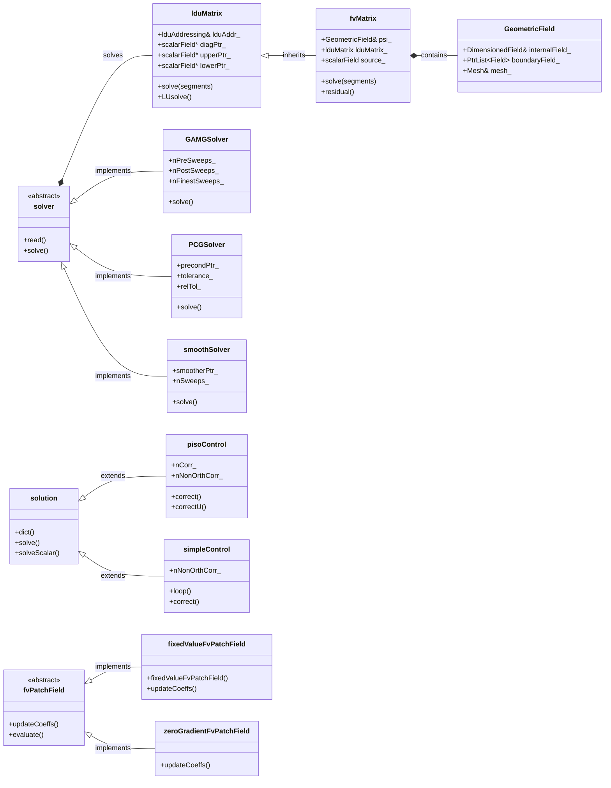
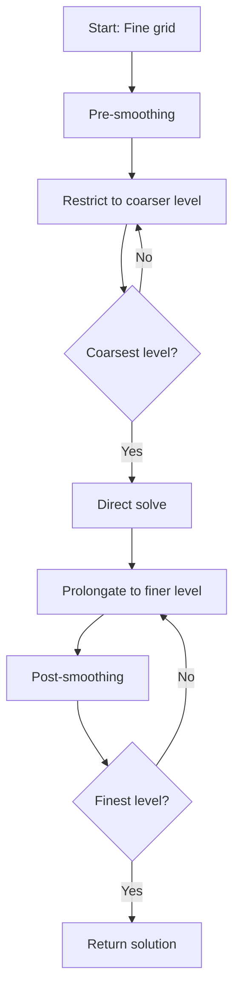
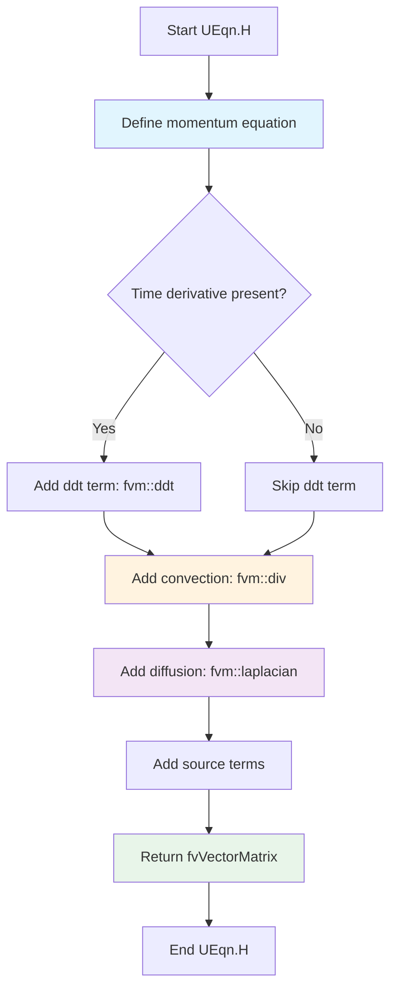
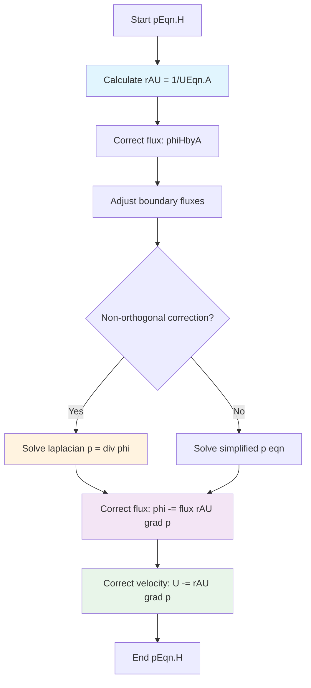
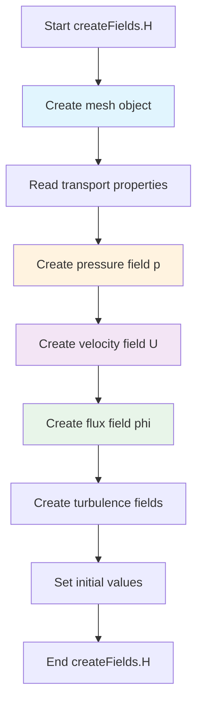

---
tags:
  - openfoam
  - cfd
  - hardcore
  - day-03
date: 2026-01-03
aliases:
  - Pressure-Velocity-Coupling
difficulty: hardcore
topic: Pressure-Velocity-Coupling
---

# Pressure-Velocity-Coupling
## HARDCORE Level - 2026-01-03

---

## Table of Contents
- [[#1. ทฤษฎี: สมการหลักและฟิสิกส์ (Theory: Core Equations & Physics)|1. ทฤษฎี: สมการหลักและฟิสิกส์]]
- [[#2. โครงสร้างคลาสและการนำไปใช้ (OpenFOAM Class Hierarchy & Implementation)|2. โครงสร้างคลาสและการนำไปใช้]]
- [[#3. การไล่โค้ด (Code Walkthrough)|3. การไล่โค้ด]]
- [[#4. การวิเคราะห์ Dictionary และการตั้งค่า (Dictionary Analysis & Configuration)|4. การวิเคราะห์ Dictionary และการตั้งค่า]]
- [[#5. ภาคปฏิบัติ: งานเขียนโค้ด (Hands-on: Practical Tasks & Coding)|5. ภาคปฏิบัติ: งานเขียนโค้ด]]
- [[#6. ทดสอบความเข้าใจ (Concept Checks)|6. ทดสอบความเข้าใจ]]

---
## 1. ทฤษฎี: สมการหลักและฟิสิกส์ (Theory: Core Equations & Physics)

### 1.1 ความท้าทายพื้นฐาน (The Fundamental Challenge)

ปัญหา Pressure-Velocity Coupling เกิดขึ้นเนื่องจากสมการโมเมนตัม (Momentum Equation) ประกอบด้วยทั้งความเร็ว (Velocity) และความดัน (Pressure) แต่กลับ **ไม่มีสมการเฉพาะสำหรับความดัน (Explicit equation for pressure)** ในชุดสมการ Navier-Stokes ความดันทำหน้าที่เป็นตัวคูณลากรองจ์ (Lagrange multiplier) ที่คอยบังคับให้เป็นไปตามเงื่อนไขความต่อเนื่อง (Continuity constraint) หรือการอนุรักษ์มวล

> [!INFO] ทำไมเรื่องนี้ถึงยาก? (Why is this difficult?)
> ในการไหลแบบอัดตัวไม่ได้ (Incompressible flows) ความดันไม่ได้ถูกควบคุมโดยสมการสถานะ (Equation of State) แต่ความดันจะต้องปรับตัวเอง "ทันทีทันใด" (Instantaneously) เพื่อให้มั่นใจว่าสนามความเร็ว (Velocity field) ยังคงเป็น Divergence-free (ไม่มีการบีบอัด) สิ่งนี้สร้างการเชื่อมโยงที่แน่นแฟ้น (Tight coupling) ระหว่างความดันและความเร็ว ซึ่งต้องการวิธีการจัดการทางตัวเลขเป็นพิเศษ

### 1.2 สมการควบคุม (Governing Equations)

#### สมการความต่อเนื่อง (Continuity Equation - Mass Conservation)

$$\nabla \cdot \mathbf{U} = 0$$

โดยที่:
- $\mathbf{U}$ คือ เวกเตอร์ความเร็ว (Velocity vector) [m/s]
- $\nabla \cdot$ คือ ตัวดำเนินการ Divergence
- สำหรับการไหลแบบอัดตัวไม่ได้ ความหนาแน่น $\rho$ จะคงที่และตัดออกไปได้

#### สมการโมเมนตัม (Momentum Equation - Newton's Second Law)

$$\frac{\partial \mathbf{U}}{\partial t} + \nabla \cdot (\mathbf{U}\mathbf{U}) = -\frac{1}{\rho}\nabla p + \nu \nabla^2 \mathbf{U} + \mathbf{g}$$

โดยที่:
- $\frac{\partial \mathbf{U}}{\partial t}$ = พจน์ Unsteady (ความเร่งตามเวลา)
- $\nabla \cdot (\mathbf{U}\mathbf{U})$ = พจน์ Convective (แรงเฉื่อยแบบ Nonlinear)
- $-\frac{1}{\rho}\nabla p$ = แรงจากความชันความดัน (Pressure gradient force) ซึ่งเป็นตัวขับเคลื่อนการไหล
- $\nu \nabla^2 \mathbf{U}$ = พจน์การแพร่เนื่องจากความหนืด (Viscous diffusion) ($\nu = \mu/\rho$ คือ Kinematic viscosity)
- $\mathbf{g}$ = แรงเนื่องจากบอดี้ (Body forces) เช่น แรงโน้มถ่วง

> [!TIP] การตีความทางฟิสิกส์ (Physical Interpretation)
> พจน์ความชันความดัน $-\nabla p$ แสดงถึงแรงที่อนุภาคของไหลกระทำต่อกัน มันเป็นกลไกที่ข้อมูลความดันแพร่กระจายไปทั่วโดเมนเพื่อบังคับให้เกิดการอนุรักษ์มวล

### 1.3 ปัญหาการเชื่อมโยงความดัน-ความเร็ว (The Pressure-Velocity Coupling Problem)

หากเราทำการ Discretize สมการโมเมนตัมเพื่อหาค่าความเร็ว:

$$\mathbf{U}^{n+1} = \mathbf{U}^n + \Delta t \left[ -\nabla \cdot (\mathbf{U}\mathbf{U}) + \nu \nabla^2 \mathbf{U} - \frac{1}{\rho}\nabla p^{n+1} + \mathbf{g} \right]$$

**ประเด็นปัญหา (The Dilemma):**
- ในการคำนวณ $\mathbf{U}^{n+1}$, เราต้องการค่า $p^{n+1}$
- ในการหาค่า $p^{n+1}$, เราต้องการค่า $\mathbf{U}^{n+1}$ (เพื่อให้สอดคล้องกับ Continuity)
- ไม่สามารถคำนวณตัวใดตัวหนึ่งแยกจากกันได้!

### 1.4 แนวทางการแก้ปัญหา (Solution Approaches)

#### 1.4.1 สมการปัวซองความดัน (Pressure Poisson Equation - PPE)

ทำการหา Divergence ของสมการโมเมนตัมและบังคับให้ $\nabla \cdot \mathbf{U}^{n+1} = 0$:

$$\nabla^2 p^{n+1} = \frac{\rho}{\Delta t} \nabla \cdot \mathbf{U}^* + \rho \nabla \cdot \left[ \nabla \cdot (\mathbf{U}\mathbf{U}) - \nu \nabla^2 \mathbf{U} \right]$$

โดยที่ $\mathbf{U}^*$ คือสนามความเร็วชั่วคราว (Intermediate velocity field)

**ข้อมูลเชิงลึก (Key Insight):** วิธีนี้แปลงปัญหา Coupling ให้กลายเป็นสมการ Poisson สำหรับความดัน ซึ่งสามารถแก้ได้ด้วยวิธี Iterative

#### 1.4.2 การแยกตัวดำเนินการ (Operator Splitting / Projection Methods)

แนวทางแบบ Fractional-step:
1. **Predictor step:** คำนวณความเร็วชั่วคราว $\mathbf{U}^*$ โดยไม่คิดผลของความดัน
2. **Corrector step:** ฉาย (Project) $\mathbf{U}^*$ ลงบน Divergence-free space โดยใช้ความดัน

$$\mathbf{U}^{n+1} = \mathbf{U}^* - \frac{\Delta t}{\rho} \nabla p^{n+1}$$

> [!WARNING] เงื่อนไขขอบเขตมีความสำคัญ (Boundary Conditions Matter)
> สมการ Pressure Poisson ต้องการเงื่อนไขขอบเขต (Boundary Conditions - BCs) ที่สอดคล้อง วิธีการทั่วไปได้แก่:
> - **Neumann BCs:** $\frac{\partial p}{\partial n} = 0$ (ความชันความดันในแนวตั้งฉากเป็นศูนย์)
> - **Dirichlet BCs:** กำหนดค่าความดันที่ทางออก (Outlets)
> การกำหนด BC ที่ไม่ถูกต้องจะนำไปสู่การแกว่งของความดันแบบ "Checkerboard"

### 1.5 กริดแบบ Collocated เทียบกับ Staggered

#### Staggered Grid (Harlow & Welch, 1965)
- เก็บค่าความเร็วและความดันไว้ที่ตำแหน่งต่างกัน
- ความเร็วอยู่ที่หน้าเซลล์ (Cell faces), ความดันอยู่ที่จุดศูนย์กลางเซลล์ (Cell centers)
- **ข้อดี:** ป้องกันปัญหา Pressure-velocity decoupling ได้โดยธรรมชาติ
- **ข้อเสีย:** ต้องการการ Interpolation ที่ซับซ้อน

#### Collocated Grid (Rhie & Chow, 1983)
- ตัวแปรทั้งหมดเก็บอยู่ที่จุดศูนย์กลางเซลล์
- ต้องการการ Interpolation พิเศษ (Rhie-Chow) เพื่อป้องกันปัญหา Checkerboarding
- **ข้อดี:** โครงสร้างข้อมูลเรียบง่ายกว่า
- **ข้อเสีย:** เกิด Numerical dissipation เพิ่มเติม

> [!INFO] แนวทางของ OpenFOAM (OpenFOAM Approach)
> OpenFOAM ใช้การจัดเรียงกริดแบบ **Collocated grid** ร่วมกับเทคนิค Rhie-Chow interpolation ซึ่งถูก implement ผ่านตัวดำเนินการ `fvc::div`, `fvc::grad`, และ `fvm::laplacian`

### 1.6 คุณสมบัติทางคณิตศาสตร์ (Mathematical Properties)

สมการ Pressure Poisson มีรูปแบบคือ:

$$\nabla^2 p = f$$

นี่คือ **สมการอนุพันธ์ย่อยแบบ Elliptic** ซึ่งมีคุณสมบัติดังนี้:

| คุณสมบัติ (Property) | คำอธิบาย (Description) | ความหมายทางฟิสิกส์ (Physical Meaning) |
|----------|-------------|------------------|
| **Existence** | มีคำตอบก็ต่อเมื่อ $\int_\Omega f \, dV = 0$ | การอนุรักษ์มวลรวม (Global mass conservation) |
| **Uniqueness** | คำตอบมีเพียงหนึ่งเดียว (บวกค่าคงที่) | ความดันนิยามโดยอ้างอิงกับค่าอ้างอิง (Relative) |
| **Smoothness** | คำตอบมีความต่อเนื่องหาอนุพันธ์ได้ไม่สิ้นสุด | สนามความดันมีความราบเรียบ (Smooth) |

> [!TIP] ผลกระทบทางตัวเลข (Numerical Implication)
> ธรรมชาติความเป็น Elliptic หมายความว่าข้อมูลความดันจะแพร่กระจายไปทั่วทั้งโดเมน **ทันทีทันใด** (ในทางคณิตศาสตร์) สิ่งนี้ต้องการวิธีการแก้สมการแบบ Global (Iterative solvers พร้อม Preconditioning)

### 1.7 การทำให้อยู่ในรูปไร้มิติ (Non-Dimensionalization)

Reynolds number ใช้บอกลักษณะของระบอบการไหล (Flow regime):

$$Re = \frac{UL}{\nu} = \frac{\text{Inertial Forces}}{\text{Viscous Forces}}$$

โดยที่:
- $U$ = ความเร็วอ้างอิง (Characteristic velocity)
- $L$ = ความยาวอ้างอิง (Characteristic length)
- $\nu$ = ความหนืดจลน์ (Kinematic viscosity)

**ผลต่อการ Coupling:**
- **High Re:** แรงเฉื่อย (Convection) เด่น → การปรับแก้ความดัน (Pressure correction) มีความสำคัญมาก
- **Low Re:** การแพร่ (Diffusion) เด่น → การ Coupling ตรงไปตรงมามากกว่า

### 1.8 สรุปสมการสำคัญ (Summary of Key Equations)

| สมการ (Equation) | รูปแบบ (Form) | วัตถุประสงค์ (Purpose) |
|----------|------|---------|
| Continuity | $\nabla \cdot \mathbf{U} = 0$ | ข้อบังคับการอนุรักษ์มวล |
| Momentum | $\frac{\partial \mathbf{U}}{\partial t} + \nabla \cdot (\mathbf{U}\mathbf{U}) = -\frac{1}{\rho}\nabla p + \nu \nabla^2 \mathbf{U}$ | กฎข้อที่ 2 ของนิวตันสำหรับของไหล |
| Pressure Poisson | $\nabla^2 p = \frac{\rho}{\Delta t} \nabla \cdot \mathbf{U}^*$ | บังคับ Continuity ผ่านความดัน |
| Projection | $\mathbf{U}^{n+1} = \mathbf{U}^* - \frac{\Delta t}{\rho} \nabla p$ | ปรับแก้ความเร็วให้เป็น Divergence-free |

> [!INFO] ความสำคัญของ Pressure-Velocity Coupling
> การเชื่อมโยงระหว่างความดันและความเร็วเป็นหัวใจสำคัญของการจำลองการไหลของไหลที่ไม่สามารถอัดได้ (Incompressible flow) หากไม่มีการจัดการที่เหมาะสม จะเกิดปัญหาการแกว่งของความดัน (Pressure oscillation) และการละเมิดกฎการอนุรักษ์มวล (Mass conservation violation)

> [!SUCCESS] สรุป (Summary)
> ปัญหา Pressure-Velocity Coupling เกิดจากการที่สมการ Navier-Stokes ไม่มีสมการเฉพาะสำหรับความดัน แต่ต้องใช้ความดันเป็นตัวบังคับให้เกิด Mass Conservation วิธีการแก้ปัญหาหลักคือการใช้สมการ Pressure Poisson (PPE) และการแก้แบบวนซ้ำ (Iterative) เช่น PISO หรือ SIMPLE เพื่อปรับแก้สนามความเร็วให้สอดคล้องกับความดัน
## 2. โครงสร้างคลาสและการนำไปใช้ (OpenFOAM Class Hierarchy & Implementation)

### 2.1 ภาพรวมคลาสหลัก (Core Classes Overview)

การเชื่อมโยงความดัน-ความเร็ว (Pressure-velocity coupling) ใน OpenFOAM ถูก implement ผ่านโครงสร้างคลาสที่ซับซ้อน โดยมีศูนย์กลางอยู่ที่ระบบ **Finite Volume Discretization** คลาสสำคัญสามารถแบ่งออกเป็นหมวดหมู่ได้ดังนี้:

| หมวดหมู่ (Category) | คลาส (Classes) | วัตถุประสงค์ (Purpose) |
|----------|---------|---------|
| **Matrix Systems** | `fvMatrix`, `lduMatrix` | การแทนสมการที่ถูก Discretized แล้ว |
| **Solution Algorithms** | `solution`, `pisoControl`, `simpleControl` | กลยุทธ์การแก้สมการแบบ Iterative |
| **Pressure Solvers** | `GAMGSolver`, `PCGSolver`, `smoothSolver` | ตัวแก้สมการแบบ Elliptic |
| **Boundary Conditions** | `fixedValueFvPatchField`, `zeroGradientFvPatchField` | การจัดการ BC ความดัน/ความเร็ว |
| **Interpolation Schemes** | `linear`, `upwind`, `limitedLinear` | Rhie-Chow interpolation |

> [!INFO] ความสำคัญของ Class Hierarchy (Importance of Class Hierarchy)
> การออกแบบเชิงวัตถุ (Object-Oriented Design) ของ OpenFOAM ช่วยให้สามารถแยกส่วนการแก้สมการ (Equation solving) การจัดการเงื่อนไขขอบ (Boundary conditions) และรูปแบบเชิงตัวเลข (Numerical schemes) ออกจากกันอย่างชัดเจน ทำให้ง่ายต่อการขยายและปรับแต่ง

### 2.2 แผนภาพลำดับชั้นคลาส (Class Hierarchy Diagram)



### 2.3 การวิเคราะห์คลาสสำคัญอย่างละเอียด (Key Classes Detailed Analysis)

#### 2.3.1 `fvMatrix<T>` - Finite Volume Matrix

**ตำแหน่ง:** `$FOAM_SRC/finiteVolume/fvMatrices/fvMatrix/fvMatrix.H`

คลาส `fvMatrix` เป็นตัวแทนของสมการ Finite Volume ที่ถูก Discretized แล้วในรูปแบบ:

$$A\psi=B$$

โดยที่:
- $A$ = เมทริกซ์สัมประสิทธิ์ (เก็บในรูปแบบ `lduMatrix`)
- $\psi$ = ตัวแปรสนาม (Field variable) เช่น ความดัน, ความเร็ว
- $B$ = พจน์ Source

**เมธอดสำคัญ (Key methods):**

```cpp
// Solve the matrix system
solverPerformance solve(const dictionary&);

// Add source term
void operator+=(const GeometricField<T, fvPatchField, volMesh>&);

// Add matrix contribution
void operator+=(const fvMatrix<T>&);

// Return residual
tmp<GeometricField<T, fvPatchField, volMesh>> residual() const;
```

> [!TIP] การประกอบเมทริกซ์ (Matrix Assembly)
> ใน OpenFOAM เมทริกซ์ถูกเก็บในรูปแบบ LDU (Lower-Diagonal-Upper) ซึ่งเป็นรูปแบบ Sparse matrix ที่เหมาะสำหรับการแก้สมการเชิงอนุพันธ์ย่อยบนกริดโครงสร้างไม่สม่ำเสมอ (Unstructured grid)

#### 2.3.2 `lduMatrix` - Linear Diagonal Upper Matrix

**ตำแหน่ง:** `$FOAM_SRC/matrices/lduMatrix/lduMatrix.H`

คลาสฐาน (Base class) สำหรับการเก็บ Sparse matrix ใน OpenFOAM โดยใช้ **LDU addressing scheme**:

```cpp
class lduMatrix
{
    // Diagonal coefficients
    scalarField* diagPtr_;
    
    // Upper triangular coefficients
    scalarField* upperPtr_;
    
    // Lower triangular coefficients
    scalarField* lowerPtr_;
    
    // Matrix addressing (owner-neighbor connectivity)
    const lduAddressing& lduAddr_;
};
```

**ผังหน่วยความจำ (Memory layout):**

| ส่วนประกอบ (Component) | คำอธิบาย (Description) | ขนาด (Size) |
|-----------|-------------|------|
| `diag` | สมาชิกแนวทแยง (Diagonal elements) | $N_{cells}$ |
| `upper` | สามเหลี่ยมบน (Upper triangular - owner→neighbor) | $N_{faces}$ |
| `lower` | สามเหลี่ยมล่าง (Lower triangular - neighbor→owner) | $N_{faces}$ |

> [!INFO] การจัดเก็บแบบ LDU (LDU Addressing)
> รูปแบบ LDU ใช้ประโยชน์จากโครงสร้างของกริด Finite volume ที่มีการเชื่อมต่อแบบ Face-based ทำให้ประหยัดหน่วยความจำอย่างมากเมื่อเปรียบเทียบกับรูปแบบ Dense matrix

#### 2.3.3 `GAMGSolver` - Geometric-Algebraic Multi-Grid Solver

**ตำแหน่ง:** `$FOAM_SRC/matrices/lduMatrix/solvers/GAMGSolver/GAMGSolver.H`

**GAMG solver** เป็น Pressure solver เริ่มต้นใน OpenFOAM สำหรับการไหลแบบ Incompressible มันรวมเอาเทคนิค:

1. **Geometric coarsening:** รวมเซลล์ (Agglomerates) เพื่อสร้าง Mesh level ที่หยาบขึ้น
2. **Algebraic smoothing:** ใช้วิธี Iterative ในแต่ละ Level

**พารามิเตอร์การตั้งค่า (Configuration parameters):**

```cpp
// System/fvSolution dictionary
GAMG
{
    // Number of pre-smoothing sweeps
    nPreSweeps   0;
    
    // Number of post-smoothing sweeps
    nPostSweeps  2;
    
    // Smoother type (GaussSeidel, etc.)
    smoother     GaussSeidel;
    
    // Coarsening method
    agglomerator faceAreaPair;
    
    // Number of coarse levels
    nCellsInCoarsestLevel 10;
    
    // Merge levels
    mergeLevels 1;
}
```

**ขั้นตอนอัลกอริทึม (Algorithm flow):**



> [!TIP] ทำไมต้อง GAMG สำหรับความดัน? (Why GAMG for Pressure?)
> สมการ Poisson สำหรับความดันเป็นสมการเชิงวิกฤต Elliptic ซึ่งมีการแพร่กระจายของข้อมูลทั่วทั้งโดเมน (Global coupling) Multi-grid methods มีความเร็วในการลู่เข้า (Convergence rate) ที่ไม่ขึ้นกับขนาดของกริด ทำให้เหมาะสำหรับการแก้สมการชนิดนี้

#### 2.3.4 `pisoControl` - PISO Algorithm Controller

**ตำแหน่ง:** `$FOAM_SRC/finiteVolume/fvSolution/pisoControl/pisoControl.H`

Implement อัลกอริทึม **PISO (Pressure-Implicit with Splitting of Operators)**:

```cpp
class pisoControl
{
    // Number of PISO correctors
    label nCorr_;
    
    // Number of non-orthogonal correctors
    label nNonOrthCorr_;
    
    // Convergence tolerance
    scalar tol_;
    
    // Algorithm control
    bool correct();
    bool correctU();
};
```

**โครงสร้าง PISO loop:**

```cpp
// Typical PISO implementation in OpenFOAM
while (piso.correct())
{
    // 1. Solve momentum equation (predictor)
    solve(fvm::ddt(U) + fvm::div(phi, U) 
        - fvm::laplacian(nu, U)
        == -fvc::grad(p));
    
    // 2. Solve pressure equation (corrector)
    for (int nonOrth = 0; nonOrth <= nNonOrthCorr; nonOrth++)
    {
        solve(fvm::laplacian(rAU, p) == fvc::div(phi));
    }
    
    // 3. Correct velocity field
    U -= rAU * fvc::grad(p);
    
    // 4. Correct fluxes
    phi -= fvc::flux(rAU * fvc::grad(p));
}
```

> [!WARNING] ความแตกต่างระหว่าง PISO และ SIMPLE (PISO vs SIMPLE)
> - **PISO:** ออกแบบสำหรับ Unsteady flows ใช้ Corrector หลายครั้งต่อ Time step เพื่อให้ได้ความแม่นยำ
> - **SIMPLE:** ออกแบบสำหรับ Steady-state flows ใช้ Under-relaxation เพื่อความเสถียร

#### 2.3.5 `simpleControl` - SIMPLE Algorithm Controller

**ตำแหน่ง:** `$FOAM_SRC/finiteVolume/fvSolution/simpleControl/simpleControl.H`

Implement อัลกอริทึม **SIMPLE (Semi-Implicit Method for Pressure-Linked Equations)**:

```cpp
class simpleControl
{
    // Convergence criteria
    scalar residualControl_;
    
    // Relaxation factors
    scalarField relaxFactors_;
    
    // Main loop control
    bool loop();
};
```

**Typical SIMPLE loop:**

```cpp
while (simple.loop())
{
    // 1. Solve momentum with under-relaxation
    solve(fvm::ddt(U) + fvm::div(phi, U) 
        - fvm::laplacian(nu, U)
        == -fvc::grad(p));
    
    U.relax();  // Under-relax velocity
    
    // 2. Solve pressure
    solve(fvm::laplacian(rAU, p) == fvc::div(phi));
    
    // 3. Correct velocity and fluxes
    U -= rAU * fvc::grad(p);
    phi -= fvc::flux(rAU * fvc::grad(p));
    
    // 4. Check convergence
}
```

#### 2.3.6 `fvPatchField<T>` - Boundary Condition Base Class

**ตำแหน่ง:** `$FOAM_SRC/finiteVolume/fields/fvPatchFields/fvPatchField/fvPatchField.H`

Abstract base class สำหรับเงื่อนไขขอบ Finite Volume ทั้งหมด:

```cpp
template<class Type>
class fvPatchField : public Field<Type>
{
    // Reference to patch
    const fvPatch& patch_;
    
    // Update coefficients
    virtual void updateCoeffs();
    
    // Evaluate boundary condition
    virtual void evaluate();
    
    // Internal field reference
    const GeometricField<Type, fvPatchField, volMesh>& internalField_;
};
```

**Common pressure BCs:**

| BC Type | Class | รูปแบบทางคณิตศาสตร์ (Mathematical Form) | กรณีใช้งาน (Use Case) |
|---|---|---|---|
| Fixed value | `fixedValueFvPatchField` | $p=p_{specified}$ | ทางเข้า/ออกที่ทราบค่าความดัน |
| Zero gradient | `zeroGradientFvPatchField` | $\frac{\partial p}{\partial n}=0$ | ผนัง, สมมาตร |
| Fixed flux | `fixedFluxPressureFvPatchField` | $\frac{\partial p}{\partial n}=\text{specified}$ | ขอบเขตที่กำหนดอัตราการไหล |

> [!INFO] การ implement เงื่อนไขขอบ (Boundary Condition Implementation)
> ใน OpenFOAM เงื่อนไขขอบถูก implement ผ่านระบบ Runtime selection ซึ่งอนุญาตให้ผู้ใช้สามารถระบุประเภทของ BC ผ่าน Dictionary file โดยไม่ต้องคอมไพล์โค้ดใหม่

### 2.4 แผนผังอ้างอิงไฟล์ซอร์ส (Source File Reference Map)

| คลาส (Class) | ตำแหน่งซอร์ส (Source Location) | Header | Implementation |
|---|---|---|---|
| `fvMatrix` | `$FOAM_SRC/finiteVolume/fvMatrices/fvMatrix/` | `fvMatrix.H` | `fvMatrix.C` |
| `lduMatrix` | `$FOAM_SRC/matrices/lduMatrix/` | `lduMatrix.H` | `lduMatrix.C` |
| `GAMGSolver` | `$FOAM_SRC/matrices/lduMatrix/solvers/GAMGSolver/` | `GAMGSolver.H` | `GAMGSolver.C` |
| `PCGSolver` | `$FOAM_SRC/matrices/lduMatrix/solvers/PCGSolver/` | `PCGSolver.H` | `PCGSolver.C` |
| `pisoControl` | `$FOAM_SRC/finiteVolume/fvSolution/pisoControl/` | `pisoControl.H` | `pisoControl.C` |
| `simpleControl` | `$FOAM_SRC/finiteVolume/fvSolution/simpleControl/` | `simpleControl.H` | `simpleControl.C` |
| `fvPatchField` | `$FOAM_SRC/finiteVolume/fields/fvPatchFields/fvPatchField/` | `fvPatchField.H` | `fvPatchField.C` |

> [!TIP] การนำทางในซอร์สโค้ด OpenFOAM (Navigating OpenFOAM Source)
> ใช้คำสั่ง `find $FOAM_SRC -name "*.H" | grep -i "solver"` เพื่อค้นหาไฟล์ header ของ solver ทั้งหมด หรือใช้ `grep -r "class GAMGSolver" $FOAM_SRC` เพื่อค้นหา Definition ของคลาสที่ต้องการ

### 2.5 รูปแบบการ Instantiation ของ Template (Template Instantiation Pattern)

OpenFOAM ใช้ Template instantiation อย่างกว้างขวางสำหรับ Finite volume fields:

```cpp
// Common instantiations for pressure-velocity coupling
namespace Foam
{
    // Pressure field (scalar)
    typedef GeometricField<scalar, fvPatchField, volMesh> volScalarField;
    
    // Velocity field (vector)
    typedef GeometricField<vector, fvPatchField, volMesh> volVectorField;
    
    // Surface scalar field (fluxes)
    typedef GeometricField<scalar, fvsPatchField, surfaceMesh> surfaceScalarField;
    
    // Matrix instantiations
    typedef fvMatrix<scalar> fvScalarMatrix;
    typedef fvMatrix<vector> fvVectorMatrix;
}
```

> [!INFO] รูปแบบการออกแบบ Template (Template Design Pattern)
> การใช้ Template ใน OpenFOAM ช่วยให้สามารถ Reuse โค้ดเดียวกันสำหรับชนิดข้อมูลที่แตกต่างกัน (Scalar, Vector, Tensor) โดยไม่ต้องเขียนซ้ำ ซึ่งช่วยลดความซับซ้อนของการบำรุงรักษาโค้ดและเพิ่มความยืดหยุ่นในการใช้งาน

> [!SUCCESS] สรุป (Summary)
> OpenFOAM ใช้โครงสร้างคลาสที่แยกส่วนชัดเจน โดย `fvMatrix` เป็นหัวใจสำคัญในการเก็บสมการที่ดิสครีตแล้วในรูปแบบ LDU Matrix การแก้สมการความดันมักใช้ `GAMGSolver` เพื่อความรวดเร็ว ในขณะที่อัลกอริทึม PISO และ SIMPLE ถูกควบคุมผ่านคลาส `pisoControl` และ `simpleControl` ตามลำดับ

```## 3. การไล่โค้ด (Code Walkthrough)

### 3.1 UEqn.H

ไฟล์ `UEqn.H` ทำหน้าที่สร้างสมการโมเมนตัม (Momentum Equation) สำหรับการไหลแบบ Incompressible ปกติจะถูก include อยู่ในลูปหลักของ Solver (เช่น `simpleFoam`, `pisoFoam`) เพื่อสร้างสมการความเร็วแบบ Discretized ก่อนเข้าสู่ขั้นตอนการแก้ความดัน

> **Source Reference:** `$FOAM_SRC/applications/solvers/incompressible/simpleFoam/UEqn.H`

#### ลำดับการทำงาน (Logic Flow)



#### ส่วนโค้ดสำคัญ (Key Code Snippets)

**สมการโมเมนตัมแบบมาตรฐาน (Standard Incompressible Momentum Equation):**

```cpp
// Solve the momentum equation
tmp<fvVectorMatrix> UEqn
(
    fvm::ddt(U)                     // Unsteady term (transient)
  + fvm::div(phi, U)                // Convection term (nonlinear)
  + fvm::laplacian(nu, U)           // Diffusion term (viscous)
 ==
    fvOptions(U)                     // Source terms (optional)
);
```

**เวอร์ชัน Steady-state (simpleFoam):**

```cpp
// No time derivative for steady-state
tmp<fvVectorMatrix> UEqn
(
    fvm::div(phi, U)                // Convection
  + fvm::laplacian(nu, U)           // Diffusion
  + fvm::SuSp(-fvc::div(phi), U)    // Conservative form
 ==
    fvOptions(U)                     // Source terms
);
```

**การรวม Relaxation (SIMPLE algorithm):**

```cpp
// Under-relaxation for stability
UEqn.relax();

// Store reciprocal diagonal for pressure correction
volScalarField rAU(1.0/UEqn.A());
```

#### โครงสร้างหน่วยความจำ (Memory Layout)

คลาส `fvMatrix` เก็บสมการแบบ Discretized ในรูปแบบ LDU (Lower-Diagonal-Upper) ที่เป็น Sparse format ซึ่งปรับแต่งมาสำหรับ Finite volume meshes ด้านล่างคือแผนผังหน่วยความจำ:

```
fvMatrix<T> object
├── GeometricField<T>& psi_          [Pointer to field variable (U, p, etc.)]
│   ├── DimensionedField<T>& internalField_  [Cell-centered values]
│   │   └── scalarField::List<T>     [Array: N_cells elements]
│   └── PtrList<fvPatchField<T>> boundaryField_  [Boundary conditions]
│       └── [Patch0][Patch1]...[PatchN]  [Array of patch objects]
│
├── lduMatrix lduMatrix_             [Sparse coefficient matrix]
│   ├── scalarField* diagPtr_        [Pointer: Diagonal coefficients]
│   │   └── [d0][d1][d2]...[dN]      [Array: N_cells elements]
│   │
│   ├── scalarField* upperPtr_       [Pointer: Upper triangular coeffs]
│   │   └── [u0][u1][u2]...[uM]      [Array: N_internal_faces elements]
│   │
│   ├── scalarField* lowerPtr_       [Pointer: Lower triangular coeffs]
│   │   └── [l0][l1][l2]...[lM]      [Array: N_internal_faces elements]
│   │
│   └── lduAddressing& lduAddr_      [Mesh connectivity]
│       ├── labelList owner_         [Owner cell for each face]
│       ├── labelList neighbour_     [Neighbor cell for each face]
│       └── labelList losortPtr_     [Sorting index for lower triangle]
│
├── scalarField source_              [Source term vector]
│   └── [s0][s1][s2]...[sN]          [Array: N_cells elements]
│
└── DimensionSet dimensions_         [Units of the equation]

Memory addressing example (face i connecting cell A and cell B):
┌─────────┐         ┌─────────┐
│  Cell A │◄───────►│  Cell B │
│  (owner)│  face i │(neighbour)│
└─────────┘         └─────────┘
     ▲                   ▲
     │                   │
     │ owner_[i] = A     │ neighbour_[i] = B
     │                   │
     └── diag[A] += coeff   diag[B] += coeff
     └── upper[i] = coeff (A→B)
     └── lower[i] = coeff (B→A)

Total memory ≈ O(N_cells + N_faces) vs O(N_cells²) for dense matrix
```

**คุณลักษณะสำคัญของหน่วยความจำ:**

| ส่วนประกอบ | ประเภทการจัดเก็บ | ขนาด | รูปแบบการเข้าถึง | 
|---|---|---|---|
| `diag` | Contiguous array | N_cells | Random access (cell index) |
| `upper` | Contiguous array | N_internal_faces | Sequential (face loop) |
| `lower` | Contiguous array | N_internal_faces | Sequential (face loop) |
| `source` | Contiguous array | N_cells | Random access (cell index) |
| `psi` | Reference | External | Field operations |

> [!INFO] ประสิทธิภาพหน่วยความจำ (Memory Efficiency)
> รูปแบบ LDU ใช้หน่วยความจำเพียง O(N) แทนที่จะเป็น O(N²) เหมือน Dense matrix เนื่องจากเมทริกซ์ Finite volume มีค่าส่วนใหญ่เป็นศูนย์ (Sparse) การเชื่อมต่อระหว่างเซลล์มีเฉพาะที่ Face ที่ติดกันเท่านั้น

#### คำอธิบาย (Explanation)

ไฟล์ `UEqn.H` สร้าง **สมการโมเมนตัมแบบ Discretized** โดยใช้ Finite volume operators ของ OpenFOAM:

| ตัวดำเนินการ (Operator) | รูปแบบทางคณิตศาสตร์ | ความหมายทางฟิสิกส์ | 
|---|---|---|
| `fvm::ddt(U)` | $\frac{\partial \mathbf{U}}{\partial t}$ | ความเร่งตามเวลา (Temporal acceleration) | 
| `fvm::div(phi, U)` | $\nabla \cdot (\mathbf{U}\mathbf{U})$ | การพัดพา (Convective transport) | 
| `fvm::laplacian(nu, U)` | $\nu \nabla^2 \mathbf{U}$ | การแพร่เนื่องจากความหนืด (Viscous diffusion) | 
| `fvOptions(U)` | $\mathbf{S}_U$ | พจน์ Source/Sink | 

**รายละเอียดการ Implement ที่สำคัญ:**

1. **`fvm` vs `fvc`:** 
   - `fvm` (Finite Volume Method): Implicit discretization → ลงในสัมประสิทธิ์เมทริกซ์
   - `fvc` (Finite Volume Calculus): Explicit evaluation → คำนวณออกมาเป็นค่าและถือเป็น Source term

2. **การประกอบเมทริกซ์ (Matrix Assembly):** `fvVectorMatrix` ที่ได้จะเก็บรูปแบบ LDU matrix ของสมการโมเมนตัม ซึ่งจะถูกนำไปใช้ต่อในขั้นตอนแก้ความดัน

3. **ความชันความดัน (Pressure Gradient):** สังเกตว่าพจน์ความชันความดัน $-\nabla p$ **ไม่ถูกรวม** ใน `UEqn.H` แต่จะถูกเพิ่มเข้ามาอย่างชัดเจนในขั้นตอน Pressure-velocity coupling (PISO/SIMPLE)

4. **Relaxation:** สำหรับ Solver แบบ Steady-state จะมีการใส่ Under-relaxation ให้กับสมการโมเมนตัมเพื่อป้องกันการลู่เข้าหาคำตอบที่ผิดพลาด (Divergence):
   $$\mathbf{U}_{new} = \alpha_U \mathbf{U}_{calculated} + (1-\alpha_U)\mathbf{U}_{old}$$

> [!TIP] ทำไมต้องแยก UEqn.H? (Why separate UEqn.H?)
> การแยกการสร้างสมการโมเมนตัมออกมาไว้ใน `UEqn.H` ช่วยให้สามารถนำโค้ดกลับมาใช้ใหม่ได้ระหว่าง Solver ต่างๆ (simpleFoam, pisoFoam, etc.) และทำให้ลูปหลักของ Solver อ่านง่ายและสะอาดตาขึ้น

### 3.2 pEqn.H

ไฟล์ `pEqn.H` ทำหน้าที่สร้างและแก้ **สมการความดัน (Pressure Equation)** เพื่อบังคับให้เกิดการอนุรักษ์มวล (Mass conservation/Continuity) นี่คือหัวใจหลักของอัลกอริทึม Pressure-velocity coupling

> **Source Reference:** `$FOAM_SRC/applications/solvers/incompressible/simpleFoam/pEqn.H`

#### ลำดับการทำงาน (Logic Flow)



#### ส่วนโค้ดสำคัญ (Key Code Snippets)

**สมการความดันมาตรฐาน (Standard Incompressible Pressure Equation - PISO):**

```cpp
// Reciprocal of momentum matrix diagonal
volScalarField rAU(1.0/UEqn.A());

// Flux calculated from predicted velocity
surfaceScalarField phiHbyA
(
    "phiHbyA",
    fvc::interpolate(rho*U) & mesh.Sf()
);

// Adjust boundary fluxes for consistency
mrfZones.relativeFlux(phiHbyA);
adjustPhi(phiHbyA, U, p);

// Non-orthogonal correction loop
for (int nonOrth = 0; nonOrth <= nNonOrthCorr; nonOrth++)
{
    // Solve pressure Poisson equation
    fvScalarMatrix pEqn
    (
        fvm::laplacian(rAU, p) == fvc::div(phiHbyA)
    );
    
    pEqn.setReference(pRefCell, pRefValue);
    pEqn.solve();
    
    // Correct flux
    if (nonOrth == nNonOrthCorr)
    {
        phi = phiHbyA - pEqn.flux();
    }
}

// Correct velocity
U = HbyA - rAU*fvc::grad(p);
U.correctBoundaryConditions();
```

**เวอร์ชัน SIMPLE Algorithm:**

```cpp
// Under-relaxed pressure equation
tmp<fvScalarMatrix> pEqn
(
    fvm::laplacian(rAU, p) == fvc::div(phiHbyA)
);

pEqn.setReference(pRefCell, pRefValue);
pEqn.solve();

// Correct flux and velocity
phi = phiHbyA - pEqn.flux();
U.correctBoundaryConditions();
```

#### คำอธิบาย (Explanation)

ไฟล์ `pEqn.H` ทำการ Implement **สมการปัวซองความดัน (Pressure Poisson Equation)** ที่ได้จากการหา Divergence ของสมการโมเมนตัมและบังคับเงื่อนไข Continuity:

$$\nabla \cdot \left( \frac{1}{A} \nabla p \right) = \nabla \cdot \mathbf{U}^*$$

โดยที่:
- $A$ = สมาชิกแนวทแยงของเมทริกซ์โมเมนตัม (เก็บใน `rAU`)
- $\mathbf{U}^*$ = สนามความเร็วชั่วคราว (`HbyA`)
- $\phi$ = ฟลักซ์ปริมาตรผ่านหน้าเซลล์

**รายละเอียดการ Implement ที่สำคัญ:**

1. **ฟิลด์ `rAU`:** เก็บค่าส่วนกลับของสมาชิกแนวทแยงของเมทริกซ์โมเมนตัม แสดงถึงอิทธิพลของความดันที่มีต่อความเร็วในแต่ละเซลล์

2. **การคำนวณ `phiHbyA`:** คำนวณฟลักซ์จากสนามความเร็วชั่วคราว (โดยยังไม่คิดความชันความดัน)

3. **Non-orthogonal Correction:** สำหรับ Mesh ที่มีเซลล์ไม่ตั้งฉาก (Non-orthogonal) สมการความดันจะถูกแก้หลายรอบเพื่อเพิ่มความแม่นยำ:
   - รอบแรก: แก้บน Mesh ปัจจุบัน
   - รอบถัดไป: สร้างคำตอบใหม่ด้วย Gradient ที่ปรับปรุงแล้ว

4. **การปรับแก้ฟลักซ์ (Flux Correction):** หลังจากได้ค่าความดัน จะทำการปรับแก้ฟลักซ์:
   $$\phi = \phi^* - \frac{\partial p}{\partial n} \cdot \frac{1}{A}$$

5. **การปรับแก้ความเร็ว (Velocity Correction):** สุดท้าย ความเร็วที่จุดศูนย์กลางเซลล์จะถูกอัปเดตโดยใช้ความชันความดัน:
   $$\mathbf{U} = \mathbf{U}^* - \frac{1}{A} \nabla p$$

> [!WARNING] ค่าอ้างอิงความดัน (Pressure Reference)
> สำหรับการไหลแบบ Incompressible ความดันถูกกำหนดได้เพียงค่าสัมพัทธ์ (Relative pressure) เท่านั้น ดังนั้น OpenFOAM จึงต้องมีการ Fix ค่าความดันที่เซลล์หนึ่ง (`pRefCell`) เพื่อป้องกันปัญหาเมทริกซ์ Singular

> [!INFO] Rhie-Chow Interpolation
> การคำนวณ `phiHbyA` ใช้เทคนิค Rhie-Chow Interpolation เพื่อป้องกันปัญหา Checkerboard pressure oscillation ที่อาจเกิดขึ้นบน Collocated grid

### 3.3 createFields.H

ไฟล์ `createFields.H` รับผิดชอบในการ **เตรียมการฟิลด์ทั้งหมดของการจำลอง** (ความดัน, ความเร็ว, คุณสมบัติการขนส่ง) และอ่านเงื่อนไขขอบเขตจาก Case directory ปกติจะรวมอยู่ที่ส่วนต้นของ OpenFOAM Solvers

> **Source Reference:** `$FOAM_SRC/applications/solvers/incompressible/simpleFoam/createFields.H`

#### ลำดับการทำงาน (Logic Flow)



#### ส่วนโค้ดสำคัญ (Key Code Snippets)

**การเตรียมฟิลด์มาตรฐานสำหรับ Incompressible Solvers:**

```cpp
// Create mesh object (reads constant/polyMesh)
Info<< "Reading field p\n" << endl;
volScalarField p
(
    IOobject
    (
        "p",
        runTime.timeName(),
        mesh,
        IOobject::MUST_READ,
        IOobject::AUTO_WRITE
    ),
    mesh
);

Info<< "Reading field U\n" << endl;
volVectorField U
(
    IOobject
    (
        "U",
        runTime.timeName(),
        mesh,
        IOobject::MUST_READ,
        IOobject::AUTO_WRITE
    ),
    mesh
);

// Create surface flux field
#include "createPhi.H"

// Read transport properties (nu)
singlePhaseTransportModel laminarTransport(U, phi);
```

**ตัวอย่างจาก `shallowWaterFoam/createPhi.H`:**

> **Source Reference:** `$FOAM_SRC/applications/solvers/multiphase/shallowWaterFoam/createPhi.H`

```cpp
// Flux field for shallow water equations
surfaceScalarField phi
(
    IOobject
    (
        "phi",
        runTime.timeName(),
        mesh,
        IOobject::READ_IF_PRESENT,
        IOobject::AUTO_WRITE
    ),
    linearInterpolate(hU) & mesh.Sf()
);
```

#### คำอธิบาย (Explanation)

ไฟล์ `createFields.H` ดำเนินการ **ภารกิจเริ่มต้น (Initialization tasks)** ที่จำเป็นก่อนเริ่มลูป Solver:

| ภารกิจ (Task) | คำอธิบาย (Description) | วัตถุประสงค์ (Purpose) | 
|---|---|---|
| **Mesh creation** | `fvMesh mesh(IOobject(...))` | อ่าน Grid จาก `constant/polyMesh` | 
| **Pressure field** | `volScalarField p(...)` | อ่าน `0/p` (Initial & BCs) | 
| **Velocity field** | `volVectorField U(...)` | อ่าน `0/U` (Initial & BCs) | 
| **Flux field** | `surfaceScalarField phi` | คำนวณ Face fluxes $\phi = \mathbf{U} \cdot \mathbf{S}_f$ | 
| **Transport properties** | `singlePhaseTransportModel` | อ่าน Viscosity จาก `transportProperties` | 

**รายละเอียดการ Implement ที่สำคัญ:**

1. **`IOobject` flags:** ควบคุมพฤติกรรม I/O ของฟิลด์:
   - `MUST_READ`: ต้องมีไฟล์ฟิลด์อยู่ใน Time directory (เช่น `0/`)
   - `AUTO_WRITE`: เขียนไฟล์ฟิลด์อัตโนมัติเมื่อถึงเวลา Output
   - `READ_IF_PRESENT`: ฟิลด์ทางเลือก (อ่านถ้ามี)

2. **การคำนวณ Flux:** ไฟล์ `createPhi.H` ที่ถูก include เข้ามาจะคำนวณ:
   $$\phi = \mathbf{U} \cdot \mathbf{S}_f$$
   โดยที่ $\mathbf{S}_f$ คือเวกเตอร์พื้นที่หน้าตัด ฟลักซ์นี้สำคัญมากสำหรับการขนส่งแบบ Conservative

   สำหรับ Solver เฉพาะทางเช่น `shallowWaterFoam` ฟลักซ์อาจแทนปริมาณที่ต่างออกไป:
   - **Standard Incompressible:** $\phi = \mathbf{U} \cdot \mathbf{S}_f$ (Velocity flux)
   - **Shallow Water:** $\phi = (h\mathbf{U}) \cdot \mathbf{S}_f$ (Depth-averaged mass flux)
   โดยที่ $h$ คือความลึกของน้ำ และ $\mathbf{U}$ คือความเร็วเฉลี่ยตามความลึก

3. **คุณสมบัติการขนส่ง:** สำหรับการไหลแบบ Incompressible laminar ความหนืดจลน์ $\nu$ จะถูกอ่านจาก `constant/transportProperties`:
   ```cpp
   transportModel  Newtonian;
   nu              [0 2 -1 0 0 0 0]  1e-05;
   ```

4. **ค่าอ้างอิงความดัน:** Incompressible solvers ต้องการค่าความดันอ้างอิงเพื่อป้องกัน Matrix singular โดยปกติเซลล์อ้างอิงจะถูกตั้งเป็นเซลล์แรก (`pRefCell = 0`) ด้วยค่า `pRefValue = 0.0`

> [!TIP] ลำดับการเริ่มต้นฟิลด์ (Field Initialization Order)
> การสร้างฟิลด์ความดัน (`p`) ก่อนความเร็ว (`U`) เป็นเรื่องปกติเพราะ:
> 1. ความดันมักถูกกำหนดค่าเริ่มต้นเป็นศูนย์ทั่วทั้งโดเมน
> 2. ความเร็วต้องการค่าเริ่มต้นที่แม่นยำกว่า (เช่น จากการคำนวณก่อนหน้า)
> 3. Flux `phi` ขึ้นอยู่กับทั้ง `U` และ Mesh geometry

> [!WARNING] ข้อผิดพลาดที่พบบ่อย (Common Mistake)
> ลืม include `createPhi.H` หลังจากสร้าง `U` จะทำให้เกิด Error เมื่อ Solver พยายามเข้าถึง Flux field ที่ยังไม่ได้ถูกสร้าง ตรวจสอบให้แน่ใจว่าลำดับการ include ถูกต้องเสมอ

> [!SUCCESS] สรุป (Summary)
> การไล่โค้ดแสดงให้เห็นขั้นตอนการสร้างเมทริกซ์โมเมนตัมใน `UEqn.H` (Predictor) และการแก้สมการความดันใน `pEqn.H` (Corrector) ฟังก์ชัน `fvm::` ใช้สำหรับเทอม Implicit ที่ลงในเมทริกซ์ ส่วน `fvc::` ใช้สำหรับเทอม Explicit การใช้ `rAU` เป็นกุญแจสำคัญในการเชื่อมโยงการแก้ไขความดันกลับไปยังความเร็ว
## 4. การวิเคราะห์ Dictionary และการตั้งค่า (Dictionary Analysis & Configuration)

### 4.1 การวิเคราะห์ fvSchemes (fvSchemes Analysis)

Dictionary `system/fvSchemes` ควบคุม **รูปแบบการ Discretize เชิงตัวเลข (Numerical discretization schemes)** ที่ใช้ใน OpenFOAM solvers มันกำหนดวิธีการประมาณค่าอนุพันธ์เชิงพื้นที่และเชิงเวลา ซึ่งส่งผลโดยตรงต่อความแม่นยำ (Accuracy) เสถียรภาพ (Stability) และพฤติกรรมการลู่เข้า (Convergence behavior)

#### 4.1.1 โครงสร้างไฟล์ (File Structure)

```cpp
// system/fvSchemes
ddtSchemes
{
    default         Euler;
}

gradSchemes
{
    default         Gauss linear;
}

divSchemes
{
    default         none;
    div(phi,U)      Gauss upwind;
    div(phi,k)      Gauss upwind;
    div(phi,epsilon) Gauss upwind;
}

laplacianSchemes
{
    default         Gauss linear corrected;
}
```

#### 4.1.2 การ Discretize เชิงเวลา (`ddtSchemes`)

ควบคุมการประมาณค่าอนุพันธ์เทียบกับเวลา $\frac{\partial \mathbf{U}}{\partial t}$

| Scheme | Order | ความเสถียร (Stability) | กรณีใช้งาน (Use Case) |
|--------|-------|-----------|----------|
| `Euler` | 1st | แบบเงื่อนไข (Conditional - CFL < 1) | ทดสอบเร็วๆ, เริ่มต้น Steady-state |
| `backward` | 2nd | ดีกว่า Euler | การจำลอง Transient ทั่วไป |
| `CrankNicolson` | 2nd | เสถียรแบบไร้เงื่อนไข (Unconditionally stable) | การไหล Transient ที่ต้องการความแม่นยำสูง |
| `steadyState` | N/A | ปัญหา Steady | ตัดพจน์เวลาทิ้งไปเลย |

**ตัวอย่าง:**
```cpp
ddtSchemes
{
    default         backward;  // 2nd order implicit
}
```

> [!TIP] ข้อควรพิจารณาเรื่อง Time Step (Time Step Considerations)
> สำหรับ Explicit schemes ต้องปฏิบัติตามเงื่อนไข CFL $\Delta t < \frac{\Delta x}{U}$ ส่วน Implicit schemes ยอมให้ใช้ Time step ที่ใหญ่กว่าได้ แต่ต้องใช้ทรัพยากรคำนวณมากกว่าต่อหนึ่ง Step

#### 4.1.3 Gradient Schemes (`gradSchemes`)

ควบคุมการประมาณค่า Gradient เชิงพื้นที่ $\nabla \psi$ ที่ใช้สำหรับ:
- แรงจากความชันความดัน: $-\nabla p$
- Gradient ความเร็วในพจน์ความหนืด: $\nabla \mathbf{U}$
- การสร้างค่าใหม่จากศูนย์กลางเซลล์ไปยังหน้าเซลล์ (Reconstruction)

| Scheme | คำอธิบาย (Description) | ความแม่นยำ (Accuracy) | กรณีใช้งาน (Use Case) |
|--------|-------------|----------|----------|
| `Gauss linear` | Linear interpolation โดยใช้ค่ากลางเซลล์ | 2nd order บน Orthogonal meshes | ค่า Default สำหรับเคสส่วนใหญ่ |
| `Gauss linearUpwind` | ใช้ Upwind-biased gradient | เสถียรกว่าสำหรับการไหลที่ Convection เด่น | การไหลที่ High Reynolds number |
| `leastSquares` | ลด error ในแบบ Least-squares | 2nd order บน Non-orthogonal meshes | เรขาคณิตที่เบี้ยวหรือซับซ้อนมาก |
| `fourth` | Fourth-order accurate | 4th order | ต้องการความแม่นยำสูง |

**ตัวอย่าง:**
```cpp
gradSchemes
{
    default         Gauss linear;
    grad(p)         Gauss linear;  // Pressure gradient
    grad(U)         cellLimited Gauss linear 1;  // Velocity with limiter
}
```

> [!WARNING] Grid ไม่ตั้งฉาก (Non-Orthogonal Meshes)
> บน Mesh ที่มีความไม่ตั้งฉากสูง (Highly non-orthogonal) การใช้ `Gauss linear` แบบมาตรฐานอาจคลาดเคลื่อนได้ ให้ใช้ `corrected` หรือ `limited` schemes เพื่อรักษาเสถียรภาพ

#### 4.1.4 Divergence Schemes (`divSchemes`)

ควบคุมการประมาณค่า Convective flux $\nabla \cdot (\phi \psi)$ ซึ่ง **สำคัญอย่างยิ่งต่อเสถียรภาพ** ในการไหลที่ Convection เด่น

| Scheme | Order | ความมีขอบเขต (Boundedness) | ความเสถียร (Stability) | กรณีใช้งาน (Use Case) |
|--------|-------|-------------|-----------|----------|
| `Gauss upwind` | 1st | Bounded | เสถียรมาก | ลู่เข้าเร็ว, High Re flows |
| `Gauss linear` | 2nd | Unbounded | แบบเงื่อนไข | การไหลราบเรียบ, Low-moderate Re |
| `Gauss linearUpwind` | 2nd | Bounded | เสถียร | ใช้งานทั่วไป, ความแม่นยำดี |
| `Gauss limitedLinear` | 2nd | Bounded | เสถียร | ความแม่นยำสูงโดยไม่มี Oscillation |
| `Gauss QUICK` | 3rd | Unbounded | แบบเงื่อนไข | Structured meshes, ความแม่นยำสูง |

**ตัวอย่าง:**
```cpp
divSchemes
{
    default         none;
    div(phi,U)      Gauss limitedLinear 1;  // Bounded 2nd order
    div(phi,k)      Gauss upwind;           // Stable for turbulence
    div(phi,epsilon) Gauss upwind;
    div((nuEff*dev2(T(grad(U))))) Gauss linear;  // Viscous stress
}
```

> [!INFO] TVD Limiters (Total Variation Diminishing)
> Schemes เช่น `limitedLinear` ใช้ Flux limiters (เช่น `vanLeer`, `minmod`, `MUSCL`) เพื่อป้องกันการแกว่งที่ไม่สมจริง (Non-physical oscillations) ใกล้บริเวณที่มี Gradient สูง (Shocks, Interfaces)

#### 4.1.5 Laplacian Schemes (`laplacianSchemes`)

ควบคุมการประมาณค่าพจน์การแพร่ (Diffusion term) $\nabla \cdot (\Gamma \nabla \psi)$ ที่ใช้สำหรับ:
- การแพร่เนื่องจากความหนืด: $\nu \nabla^2 \mathbf{U}$
- สมการปัวซองความดัน: $\nabla^2 p$
- การแพร่ทางความร้อน/มวล

| Scheme | คำอธิบาย (Description) | Non-Orthogonal Correction |
|--------|-------------|---------------------------|
| `Gauss linear` | Standard linear interpolation | ไม่มี (Orthogonal only) |
| `Gauss linear corrected` | เพิ่ม Non-orthogonal correction | Explicit correction |
| `Gauss linear uncorrected` | ไม่มีการ Correct | สำหรับ Orthogonal meshes |
| `Gauss linear limited` | ใส่ Limiter ให้ Correction | ป้องกันค่ากระโดด (Overshoots) |

**ตัวอย่าง:**
```cpp
laplacianSchemes
{
    default         Gauss linear corrected;
    laplacian(nu,U) Gauss linear limited 0.5;  // Viscous term
    laplacian((1|A(U)),p) Gauss linear corrected;
}
```

> [!TIP] การแก้ความไม่ตั้งฉาก (Non-Orthogonal Correction)
> Scheme แบบ `corrected` จะเพิ่มพจน์ Explicit เพื่อชดเชยความไม่ตั้งฉากของ Mesh:
> $$
> \nabla \phi \cdot \mathbf{S}_f \approx \overline{(\nabla \phi)} \cdot \mathbf{S}_f + \overline{\nabla \phi} \cdot (\mathbf{S}_f - \mathbf{S}_f^{\perp})
> $$
> สิ่งนี้ช่วยเพิ่มความแม่นยำบน Mesh ที่เบี้ยว แต่อาจต้องการ Under-relaxation

#### 4.1.6 Interpolation Schemes (`interpolationSchemes`)

ควบคุมวิธีการ Interpolate ค่าจากศูนย์กลางเซลล์ไปยังหน้าเซลล์

| Scheme | คำอธิบาย (Description) | กรณีใช้งาน (Use Case) |
|--------|-------------|----------|
| `linear` | Linear interpolation | ค่า Default สำหรับเคสส่วนใหญ่ |
| `upwind` | Upwind-biased | การไหลที่ Convection เด่น |
| `cubic` | Cubic polynomial | ความแม่นยำสูง (Smooth fields) |
| `cellPoint` | Cell-to-point interpolation | การแสดงผล (Visualization) |

**ตัวอย่าง:**
```cpp
interpolationSchemes
{
    default         linear;
    interpolate(HbyA) linear;
}
```

#### 4.1.7 SnGrad Schemes (`snGradSchemes`)

ควบคุม Gradient ในแนวตั้งฉากผิว $\frac{\partial \psi}{\partial n}$ ที่ใช้ในเงื่อนไขขอบ

| Scheme | คำอธิบาย (Description) | กรณีใช้งาน (Use Case) |
|--------|-------------|----------|
| `corrected` | รวม Non-orthogonal correction | ใช้งานทั่วไป |
| `uncorrected` | ไม่มีการ Correct | Orthogonal meshes |
| `limited` | ใส่ Limiter | ป้องกันค่ากระโดด (Overshoots) |

**ตัวอย่าง:**
```cpp
snGradSchemes
{
    default         corrected;
}
```

#### 4.1.8 Wall Distances (`wallDist`)

ควบคุมวิธีการคำนวณระยะห่างจากผนัง $d$ (จำเป็นสำหรับ Turbulence models เช่น $k$-$\epsilon$)

| Method | คำอธิบาย (Description) | ข้อกำหนด Mesh (Mesh Requirements) |
|--------|-------------|-------------------||
| `meshWave` | Wave propagation จากผนัง | General meshes |
| `Poisson` | แก้สมการ $\nabla^2 d = 1$ | Field เรียบกว่า, คำนวณแพงกว่า |

**ตัวอย่าง:**
```cpp
wallDist
{
    method meshWave;
}
```

> [!INFO] ความสำคัญของการเลือก Discretization Scheme
> การเลือก Scheme ที่เหมาะสมเป็นการแลกเปลี่ยนระหว่างความแม่นยำและเสถียรภาพ:
> - **Upwind schemes:** เสถียรแต่มี Numerical diffusion (Diffusive error)
> - **Central schemes:** แม่นยำแต่อาจเกิด Oscillation บน Sharp gradients
> - **High-resolution schemes:** ใช้ Limiter เพื่อ Balance ระหว่างทั้งสอง

#### 4.1.9 การตั้งค่าที่แนะนำ (Recommended Configurations)

**Steady-state Incompressible (simpleFoam):**
```cpp
ddtSchemes
{
    default         steadyState;
}

gradSchemes
{
    default         Gauss linear;
}

divSchemes
{
    default         none;
    div(phi,U)      Gauss linearUpwind grad(U);
    div(phi,k)      Gauss upwind;
    div(phi,epsilon) Gauss upwind;
}

laplacianSchemes
{
    default         Gauss linear corrected;
}
```

**Transient Incompressible (pisoFoam):**
```cpp
ddtSchemes
{
    default         backward;
}

gradSchemes
{
    default         Gauss linear;
}

divSchemes
{
    default         none;
    div(phi,U)      Gauss limitedLinear 1;
    div(phi,k)      Gauss limitedLinear 1;
    div(phi,epsilon) Gauss limitedLinear 1;
}

laplacianSchemes
{
    default         Gauss linear corrected;
}
```

> [!WARNING] ปัญหาการลู่เข้า (Convergence Issues)
> หากพบปัญหาการลู่เข้า:
> 1. เริ่มจาก `upwind` สำหรับ `divSchemes` ทั้งหมด (เสถียรที่สุด)
> 2. ค่อยๆ เปลี่ยนเป็น `limitedLinear` หรือ `linearUpwind` เพื่อความแม่นยำที่ดีขึ้น
> 3. ตรวจสอบคุณภาพ Mesh ด้วย `checkMesh` - ความไม่ตั้งฉากสูงอาจต้องการ `corrected` schemes

### 4.2 การวิเคราะห์ fvSolution (fvSolution Analysis)

Dictionary `system/fvSolution` ควบคุม **การตั้งค่า Linear solver**, **พารามิเตอร์ของอัลกอริทึม**, และ **Under-relaxation factors** ที่ใช้ใน OpenFOAM การตั้งค่าเหล่านี้สำคัญมากต่อพฤติกรรมการลู่เข้าและประสิทธิภาพการคำนวณ

#### 4.2.1 โครงสร้างไฟล์ (File Structure)

```cpp
// system/fvSolution
solvers
{
    p
    {
        solver          GAMG;
        tolerance       1e-06;
        relTol          0.01;
        smoother        GaussSeidel;
    }

    pFinal
    {
        $p;
        relTol          0;
    }

    U
    {
        solver          smoothSolver;
        smoother        GaussSeidel;
        tolerance       1e-05;
        relTol          0.1;
    }
}

SIMPLE
{
    nNonOrthCorr     0;
    pRefCell         0;
    pRefValue        0;

    residualControl
    {
        p               1e-4;
        U               1e-4;
    }
}

relaxationFactors
{
    fields
    {
        p               0.3;
    }
    equations
    {
        U               0.7;
    }
}
```

#### 4.2.2 Linear Solvers

OpenFOAM มี Linear solvers หลายตัวสำหรับสมการประเภทต่างๆ:

| Solver | คำอธิบาย (Description) | เหมาะสำหรับ (Best For) | การใช้หน่วยความจำ (Memory Usage) |
|--------|-------------|----------|--------------|
| `GAMG` | Geometric-Algebraic Multi-Grid | ความดัน (Poisson-type equations) | ต่ำ (Scales ~N) |
| `PCG` | Preconditioned Conjugate Gradient | Symmetric positive-definite matrices | ปานกลาง |
| `PBiCGStab` | Preconditioned Bi-Conjugate Gradient Stabilized | Non-symmetric matrices | ปานกลาง |
| `smoothSolver` | Iterative smoother only | ปัญหาขนาดเล็ก, Preconditioning | ต่ำ |

**การตั้งค่า Pressure solver:**
```cpp
solvers
{
    p
    {
        solver          GAMG;              // Multi-grid for elliptic equations
        tolerance       1e-06;             // Absolute residual tolerance
        relTol          0.01;              // Relative reduction tolerance
        smoother        GaussSeidel;       // Smoother for each level
        nPreSweeps      0;                 // Pre-smoothing sweeps
        nPostSweeps     2;                 // Post-smoothing sweeps
        nFinestSweeps   2;                 // Sweeps on finest level
        
        // Coarsening method
        agglomerator    faceAreaPair;      // Face-area based agglomeration
        mergeLevels     1;                 // Level merging
        nCellsInCoarsestLevel 10;         // Stop coarsening at this size
    }
}
```

> [!TIP] ทำไมต้อง GAMG สำหรับความดัน? (Why GAMG for Pressure?)
> สมการปัวซองความดันเป็นแบบ Elliptic ซึ่งหมายความว่าข้อมูลแพร่กระจายแบบ Global วิธี Multi-grid แก้ปัญหานี้ได้อย่างมีประสิทธิภาพโดยกำจัด Low-frequency errors บน Grid หยาบ และ High-frequency errors บน Grid ละเอียด ทำให้ได้ Scaling ระดับ O(N)

**การตั้งค่า Velocity solver:**
```cpp
solvers
{
    U
    {
        solver          smoothSolver;      // Simple iterative solver
        smoother        GaussSeidel;       // Smoother type
        tolerance       1e-05;             // Absolute tolerance
        relTol          0.1;               // Relative tolerance (looser)
        nSweeps         2;                 // Number of smoothing sweeps
    }
}
```

> [!INFO] กลยุทธ์การตั้งค่า Tolerance (Tolerance Strategy)
> - **Outer iterations:** ใช้ Tolerance หลวมๆ (`relTol 0.1`) สำหรับรอบระหว่างทางเพื่อประหยัดเวลา
> - **Final iteration:** ใช้ Tolerance แน่นๆ (`relTol 0`) สำหรับคำตอบสุดท้ายที่แม่นยำ
> - **Pressure:** ปกติต้องแน่นกว่า Velocity (เพราะความดันบังคับ Mass conservation)

#### 4.2.3 การควบคุมอัลกอริทึม (Algorithm Control)

**พารามิเตอร์อัลกอริทึม SIMPLE:**
```cpp
SIMPLE
{
    // Number of non-orthogonal correction loops
    nNonOrthCorr     0;
    
    // Pressure reference (required for incompressible flow)
    pRefCell         0;        // Cell index to fix pressure
    pRefValue        0;        // Reference pressure value [Pa]
    
    // Convergence criteria
    residualControl
    {
        p               1e-4;  // Pressure residual target
        U               1e-4;  // Velocity residual target
        // Optionally specify per-component
        // Ux              1e-4;
        // Uy              1e-4;
        // Uz              1e-4;
    }
}
```

**พารามิเตอร์อัลกอริทึม PISO:**
```cpp
PISO
{
    // Number of PISO corrector loops
    nCorrectors      2;
    
    // Number of non-orthogonal correction loops
    nNonOrthCorr     0;
    
    // Pressure reference
    pRefCell         0;
    pRefValue        0;
}
```

> [!WARNING] ความแตกต่างระหว่าง SIMPLE และ PISO (SIMPLE vs PISO)
> - **SIMPLE:** สำหรับ Steady-state ใช้ Under-relaxation เพื่อความเสถียร ต้องการ `residualControl` เพื่อตรวจสอบการลู่เข้า
> - **PISO:** สำหรับ Transient ใช้ Corrector หลายครั้งต่อ Time step เพื่อความแม่นยำ ไม่ต้องการ `residualControl`

#### 4.2.4 Under-Relaxation Factors

Under-relaxation ป้องกันการ Diverge โดยจำกัดการเปลี่ยนแปลงของตัวแปรระหว่างรอบ Iteration:

$$\psi_{new} = \alpha \psi_{calculated} + (1 - \alpha) \psi_{old}$$

โดยที่ $\alpha$ คือ Relaxation factor ($0 < \alpha \leq 1$)

**ค่าปกติสำหรับการไหลแบบ Incompressible:**
```cpp
relaxationFactors
{
    fields
    {
        p               0.3;    // Pressure: strong relaxation
    }
    equations
    {
        U               0.7;    // Velocity: moderate relaxation
        k               0.7;    // Turbulence kinetic energy
        epsilon         0.7;    // Dissipation rate
    }
}
```

| ตัวแปร (Variable) | ช่วงปกติ (Typical Range) | ผลของการลดค่า (Effect of Decreasing) | ผลของการเพิ่มค่า (Effect of Increasing) |
|----------|---------------|----------------------|----------------------|
| `p` | 0.2 - 0.5 | เสถียรขึ้น, ลู่เข้าช้าลง | เร็วขึ้น แต่อาจ Diverge |
| `U` | 0.5 - 0.8 | เสถียรขึ้น, ลู่เข้าช้าลง | เร็วขึ้น แต่อาจ Oscillate |
| Turbulence | 0.5 - 0.8 | ป้องกันค่าติดลบ | ลู่เข้าเร็วขึ้น |

> [!TIP] การปรับแต่งค่า Relaxation (Relaxation Tuning)
> หาก Simulation แกว่ง (Oscillate) หรือ Diverge:
> 1. ลดค่า Relaxation factors (เช่น `p` จาก 0.3 → 0.2)
> 2. เริ่มจากค่าต่ำแล้วค่อยๆ เพิ่มขึ้นเมื่อเสถียรแล้ว
> 3. ใช้ค่าที่ต่างกันสำหรับ Transient vs Steady-state

#### 4.2.5 เคล็ดลับประสิทธิภาพ Solver (Solver Performance Tips)

**เพื่อการลู่เข้าที่รวดเร็ว:**
1. **ใช้ GAMG สำหรับความดัน** - เร็วกว่า PCG มากสำหรับ Mesh ขนาดใหญ่
2. **Tolerance หลวมๆ สำหรับรอบระหว่างทาง** - `relTol 0.1` เพียงพอแล้ว
3. **Tolerance แน่นๆ สำหรับรอบสุดท้ายเท่านั้น** - ใช้ `pFinal` กับ `relTol 0`
4. **Relaxation ที่เหมาะสม** - เริ่มแบบ Conservative แล้วเพิ่มเมื่อเสถียร

**ตัวอย่างการตั้งค่าที่ Optimized:**
```cpp
solvers
{
    p
    {
        solver          GAMG;
        tolerance       1e-06;
        relTol          0.01;      // Loose for intermediate
        smoother        GaussSeidel;
    }
    
    pFinal
    {
        $p;                       // Inherit p settings
        relTol          0;        // Tight for final iteration
    }
    
    U
    {
        solver          smoothSolver;
        smoother        symGaussSeidel;
        tolerance       1e-05;
        relTol          0.1;       // Loose is OK
    }
}

relaxationFactors
{
    fields
    {
        p               0.3;
    }
    equations
    {
        U               0.7;
    }
}
```

> [!INFO] ความสำคัญของการตั้งค่า Solver (Importance of Solver Settings)
> การตั้งค่าที่เหมาะสมใน `fvSolution` สามารถลดเวลาการคำนวณได้มากกว่า 50% โดยไม่ลดความแม่นยำ ให้ลองปรับค่าต่างๆ และตรวจสอบผลกระทบต่อความเร็วและความเสถียรของการลู่เข้า

> [!SUCCESS] สรุป (Summary)
> การตั้งค่าใน `fvSchemes` และ `fvSolution` มีผลโดยตรงต่อความแม่นยำและความเสถียร สำหรับ Pressure-Velocity Coupling การเลือก Linear Solver ที่เหมาะสม (เช่น GAMG สำหรับ p) และการตั้งค่า Under-relaxation factors (สำหรับ SIMPLE) เป็นสิ่งที่ขาดไม่ได้เพื่อให้การจำลองลู่เข้าสู่คำตอบ
## 5. ภาคปฏิบัติ: งานเขียนโค้ด (Hands-on: Practical Tasks & Coding)

### งานที่ 1: การเขียนโค้ด PISO Corrector Loop อย่างง่าย (Task 1: Implement a Simple PISO Corrector Loop)

**วัตถุประสงค์ (Objective):** สร้างฟังก์ชัน PISO corrector ขึ้นมาเองเพื่อสาธิตอัลกอริทึม Pressure-velocity coupling สำหรับการไหลแบบ Incompressible

**โจทย์ (Problem):** เขียนฟังก์ชัน C++ ที่ทำงาน PISO correction 1 ขั้นตอน ประกอบด้วย:
1. แก้สมการ Momentum predictor
2. แก้สมการ Pressure Poisson
3. ปรับแก้สนามความเร็ว (Velocity correction)
4. ปรับแก้สนามฟลักซ์ (Flux correction)

**แนวทางคำตอบ (Solution):**

```cpp
// PISO corrector implementation for incompressible flow
void pisoCorrector(
    fvMesh& mesh,
    volVectorField& U,
    volScalarField& p,
    surfaceScalarField& phi,
    const dimensionedScalar& rho,
    const dimensionedScalar& nu,
    const label nCorr,
    const label nNonOrthCorr
)
{
    // Store momentum matrix diagonal for pressure coupling
    volScalarField rAU("rAU", 1.0/UEqn.A());
    
    // PISO corrector loop
    for (int corr = 0; corr < nCorr; corr++)
    {
        // Step 1: Momentum predictor (solve for intermediate velocity)
        tmp<fvVectorMatrix> UEqn
        (
            fvm::ddt(U)
          + fvm::div(phi, U)
          - fvm::laplacian(nu, U)
        );
        
        UEqn.solve();
        
        // Step 2: Calculate intermediate flux (HbyA)
        volVectorField HbyA("HbyA", U);
        HbyA = rAU * UEqn.H();
        
        surfaceScalarField phiHbyA
        (
            "phiHbyA",
            fvc::interpolate(rho * HbyA) & mesh.Sf()
        );
        
        // Adjust flux for mass conservation
        adjustPhi(phiHbyA, U, p);
        
        // Step 3: Non-orthogonal correction loop for pressure
        for (int nonOrth = 0; nonOrth <= nNonOrthCorr; nonOrth++)
        {
            // Pressure Poisson equation: laplacian(rAU, p) = div(phiHbyA)
            fvScalarMatrix pEqn
            (
                fvm::laplacian(rAU, p) == fvc::div(phiHbyA)
            );
            
            pEqn.setReference(pRefCell, pRefValue);
            pEqn.solve();
            
            // Correct flux only on final non-orthogonal iteration
            if (nonOrth == nNonOrthCorr)
            {
                phi = phiHbyA - pEqn.flux();
            }
        }
        
        // Step 4: Correct velocity field using pressure gradient
        U = HbyA - rAU * fvc::grad(p);
        U.correctBoundaryConditions();
    }
}
```

**แนวคิดสำคัญ (Key Concepts):**
- **Momentum predictor:** คำนวณความเร็วโดยยังไม่คิดความชันความดัน
- **Pressure equation:** บังคับเงื่อนไข Continuity ผ่านสมการ Poisson
- **Rhie-Chow interpolation:** ป้องกันการแกว่งของความดัน (Checkerboard oscillations)
- **Flux correction:** รับประกันการอนุรักษ์มวลที่หน้าเซลล์

---

### งานที่ 2: การเขียนโค้ด Under-Relaxation สำหรับ Steady-State Solver (Task 2: Implement Under-Relaxation for Steady-State Solver)

**วัตถุประสงค์ (Objective):** Implement การทำ Under-relaxation สำหรับอัลกอริทึม SIMPLE เพื่อเพิ่มเสถียรภาพในการลู่เข้าสำหรับการจำลองแบบ Steady-state

**โจทย์ (Problem):** เขียนฟังก์ชัน C++ ที่ทำการ Under-relax สนามความดันและความเร็ว โดยสามารถปรับตั้งค่า Relaxation factors ได้

**แนวทางคำตอบ (Solution):**

```cpp
// Under-relaxation function for SIMPLE algorithm
void applyUnderRelaxation(
    volScalarField& p,
    volVectorField& U,
    const scalar pRelax,
    const scalar URelax,
    volScalarField::Internal& pRef,
    volVectorField::Internal& URef
)
{
    // Store previous iteration values
    volScalarField pPrev("pPrev", p);
    volVectorField UPrev("UPrev", U);
    
    // Apply under-relaxation to pressure
    // p_new = alpha * p_calculated + (1 - alpha) * p_old
    p = pRelax * p + (1.0 - pRelax) * pPrev;
    
    // Apply under-relaxation to velocity
    // U_new = alpha * U_calculated + (1 - alpha) * U_old
    U = URelax * U + (1.0 - URelax) * UPrev;
    
    // Store relaxed values for next iteration reference
    pRef = p;
    URef = U;
    
    Info << "Applied under-relaxation: p = " << pRelax 
         << ", U = " << URelax << endl;
}

// Alternative: Field-based under-relaxation with residual control
bool checkConvergence(
    const volScalarField& p,
    const volVectorField& U,
    const scalar pTolerance,
    const scalar UTolerance
)
{
    // Calculate maximum residuals
    scalar pResidual = max(mag(fvc::div(fvc::interpolate(U) & mesh.Sf()))).value();
    scalar UResidual = max(mag(U.internalField() - U.prevIter().internalField()) / 
                          (mag(U.prevIter().internalField()) + SMALL)).value();
    
    Info << "Pressure residual: " << pResidual << nl
         << "Velocity residual: " << UResidual << endl;
    
    // Check convergence criteria
    return (pResidual < pTolerance) && (UResidual < UTolerance);
}
```

**การใช้งานใน SIMPLE loop:**

```cpp
// Main SIMPLE loop
while (simple.loop())
{
    // Solve momentum
    solve(fvm::div(phi, U) - fvm::laplacian(nu, U) == -fvc::grad(p));
    
    // Apply under-relaxation
    applyUnderRelaxation(p, U, 0.3, 0.7);
    
    // Solve pressure
    solve(fvm::laplacian(rAU, p) == fvc::div(phi));
    
    // Correct velocity and fluxes
    U -= rAU * fvc::grad(p);
    phi -= fvc::flux(rAU * fvc::grad(p));
    
    // Check convergence
    if (checkConvergence(p, U, 1e-4, 1e-4))
    {
        Info << "Solution converged!" << endl;
        break;
    }
}
```

**แนวคิดสำคัญ (Key Concepts):**
- **สูตร Under-relaxation:** $\psi_{new} = \alpha \psi_{calculated} + (1-\alpha) \psi_{old}$
- **Pressure relaxation:** ปกติใช้ช่วง 0.2-0.5 (ต้องการ Damping มากกว่า)
- **Velocity relaxation:** ปกติใช้ช่วง 0.5-0.8 (ต้องการ Damping น้อยกว่า)
- **Convergence checking:** ตรวจสอบ Residuals เพื่อดูว่าเข้าสู่ Steady-state หรือยัง

---

### งานที่ 3: การเขียนโค้ด Rhie-Chow Interpolation (Task 3: Implement Rhie-Chow Interpolation)

**วัตถุประสงค์ (Objective):** Implement อัลกอริทึม Rhie-Chow interpolation เพื่อป้องกันปัญหา Checkerboard pressure oscillations บน Collocated grids

**โจทย์ (Problem):** เขียนฟังก์ชัน C++ ที่คำนวณ Face fluxes โดยใช้ Rhie-Chow interpolation ซึ่งผสมผสานระหว่างความเร็วที่ศูนย์กลางเซลล์และการปรับแก้ด้วยความชันความดัน

**แนวทางคำตอบ (Solution):**

```cpp
// Rhie-Chow interpolation for collocated grids
surfaceScalarField rhieChowInterpolate(
    const volVectorField& U,
    const volScalarField& p,
    const volScalarField& rAU,
    const surfaceScalarField& phi,
    const fvMesh& mesh
)
{
    // Standard linear interpolation of velocity
    surfaceVectorField Uf("Uf", fvc::interpolate(U));
    
    // Interpolate reciprocal diagonal
    surfaceScalarField rAUf("rAUf", fvc::interpolate(rAU));
    
    // Calculate face pressure gradient (explicit)
    surfaceScalarField pGradFace
    (
        "pGradFace",
        (fvc::interpolate(fvc::grad(p)) & mesh.Sf())
    );
    
    // Calculate cell-centered pressure gradient contribution
    surfaceScalarField pGradCell
    (
        "pGradCell",
        (mesh.Sf() & fvc::interpolate(fvc::grad(p)))
    );
    
    // Rhie-Chow flux correction
    // phi_RC = phi_linear - rAUf * (grad(p)_face - grad(p)_cell)
    surfaceScalarField phiRC
    (
        "phiRC",
        (Uf & mesh.Sf()) 
      - rAUf * (pGradFace - pGradCell)
    );
    
    return phiRC;
}

// Alternative: Direct flux calculation with Rhie-Chow
surfaceScalarField calculateRhieChowFlux(
    const volVectorField& U,
    const volScalarField& p,
    const volScalarField& rAU,
    const fvMesh& mesh
)
{
    // Interpolate velocity to faces
    surfaceVectorField Uf = fvc::interpolate(U);
    
    // Interpolate pressure gradient
    surfaceVectorField gradPf = fvc::interpolate(fvc::grad(p));
    
    // Calculate interpolated pressure at faces
    surfaceScalarField pf = fvc::interpolate(p);
    
    // Rhie-Chow interpolation formula:
    // u_f = u_f^linear - (rAU)_f * [grad(p)_f - grad(p)_f^linear]
    surfaceVectorField U_RC
    (
        Uf - fvc::interpolate(rAU) * (
            gradPf - fvc::reconstruct(fvc::snGrad(pf) * mesh.magSf())
        )
    );
    
    // Calculate flux
    surfaceScalarField phiRC("phiRC", U_RC & mesh.Sf());
    
    return phiRC;
}
```

**การใช้งานร่วมกับ Pressure-velocity coupling:**

```cpp
// In pEqn.H - use Rhie-Chow for flux calculation
volScalarField rAU(1.0/UEqn.A());

// Standard flux (without Rhie-Chow)
surfaceScalarField phiHbyA
(
    "phiHbyA",
    fvc::interpolate(rho * U) & mesh.Sf()
);

// Apply Rhie-Chow correction
surfaceScalarField phiRC = rhieChowInterpolate(U, p, rAU, phiHbyA, mesh);

// Solve pressure equation with Rhie-Chow flux
fvScalarMatrix pEqn
(
    fvm::laplacian(rAU, p) == fvc::div(phiRC)
);

pEqn.solve();

// Correct flux using Rhie-Chow
phi = phiRC - pEqn.flux();
```

**แนวคิดสำคัญ (Key Concepts):**
- **Checkerboard problem:** ปัญหาการแยกตัวของความดัน-ความเร็ว (Decoupling) บน Collocated grids
- **Rhie-Chow solution:** เพิ่มผลต่างความชันความดันระหว่างการ Interpolate ที่หน้าและที่เซลล์
- **Damping effect:** ก่อให้เกิด Numerical dissipation เล็กน้อยเพื่อป้องกันการแกว่ง
- **Mass conservation:** รักษาการอนุรักษ์มวลแบบ Discrete

> [!TIP] เมื่อไหร่ควรใช้ Rhie-Chow (When to Use Rhie-Chow)
> ฟังก์ชัน `fvc::interpolate` ของ OpenFOAM มีการรวม Rhie-Chow มาให้แล้วโดยอัตโนมัติสำหรับ Collocated grids อย่างไรก็ตาม การเข้าใจ Scheme นี้สำคัญสำหรับ:
> - การ Debug ปัญหาความดันแกว่ง
> - การ Implement เงื่อนไขขอบแบบ Custom
> - การพัฒนา Solver เฉพาะทาง
## 6. ทดสอบความเข้าใจ (Concept Checks)

### คำถามที่ 1: ทำไมถึงไม่มีสมการเฉพาะสำหรับความดันในสมการ Navier-Stokes สำหรับการไหลแบบ Incompressible? (Question 1)

> [!SUCCESS] คำตอบ (Answer)
> ในการไหลแบบ Incompressible ความดันไม่ได้ถูกควบคุมโดยสมการสถานะ (Equation of State) ต่างจากการไหลแบบ Compressible ที่ความดันสัมพันธ์กับความหนาแน่นและอุณหภูมิ แต่ความดันทำหน้าที่เป็นตัวคูณลากรองจ์ (Lagrange multiplier) ที่บังคับเงื่อนไข Continuity (การอนุรักษ์มวล) สนามความดันต้องปรับตัว "ทันทีทันใด" เพื่อให้แน่ใจว่าสนามความเร็วยังคงเป็น Divergence-free (\nabla \cdot \mathbf{U} = 0) นี่คือเหตุผลที่เราต้องสร้างสมการ Pressure Poisson Equation จากสมการโมเมนตัมและข้อบังคับ Continuity เพื่อหาค่าความดัน

### คำถามที่ 2: ปัญหา "Checkerboard" pressure คืออะไร และ Rhie-Chow interpolation ป้องกันมันได้อย่างไร? (Question 2)

> [!SUCCESS] คำตอบ (Answer)
> ปัญหา Checkerboard เป็นสิ่งแปลกปลอมทางตัวเลข (Numerical artifact) ที่เกิดขึ้นบน Collocated grids (ที่ซึ่งความดันและความเร็วเก็บที่ศูนย์กลางเซลล์เดียวกัน) มันทำให้เกิดการแกว่งของความดันในรูปแบบตารางหมากรุก เพราะการคำนวณ Gradient ความดันสามารถเชื่อมโยงเฉพาะเซลล์ที่เว้นระยะกัน (Alternating cells) ทำให้ความสัมพันธ์ความดัน-ความเร็วหลุดออกจากกัน (Decoupling) Rhie-Chow interpolation ป้องกันสิ่งนี้โดยการเพิ่มพจน์ปรับแก้ (Correction term) ที่เกี่ยวข้องกับผลต่างระหว่าง Gradient ความดันที่ Interpolate มาที่หน้าเซลล์ และ Gradient ที่คำนวณจากศูนย์กลางเซลล์ สิ่งนี้เพิ่ม Numerical dissipation เล็กน้อยที่ช่วยเชื่อมโยงเซลล์ข้างเคียงทั้งหมดเข้าด้วยกันและกำจัด Oscillation ที่ผิดปกติ

### คำถามที่ 3: ความแตกต่างหลักระหว่าง SIMPLE และ PISO algorithms ใน OpenFOAM คืออะไร? (Question 3)

> [!SUCCESS] คำตอบ (Answer)
> - **SIMPLE (Semi-Implicit Method for Pressure-Linked Equations):** ออกแบบมาสำหรับ Steady-state simulations ใช้วิธี Under-relaxation (ปกติ 0.3 สำหรับความดัน, 0.7 สำหรับความเร็ว) เพื่อป้องกันการ Diverge อัลกอริทึมนี้ทำการแก้ความดัน 1 ครั้งต่อ Outer iteration และอาศัยการลู่เข้าอย่างค่อยเป็นค่อยไปสู่สภาวะคงตัว
> - **PISO (Pressure-Implicit with Splitting of Operators):** ออกแบบมาสำหรับ Transient simulations ทำการวนลูป Corrector หลายครั้ง (ปกติ 2-4 ครั้ง) ต่อ Time step เพื่อให้ได้การเชื่อมโยงความดัน-ความเร็วที่แน่นแฟ้นภายในแต่ละ Time step โดยทั่วไป PISO จะไม่ใช้ Under-relaxation เพราะตัว Time step เองช่วยให้เกิดความเสถียร
> 
> ใน OpenFOAM สิ่งเหล่านี้ถูกควบคุมโดย Dictionary `SIMPLE` และ `PISO` ใน `system/fvSolution` โดย PISO ใช้ `nCorrectors` และ SIMPLE ใช้ `relaxationFactors`

### คำถามที่ 4: ทำไม GAMG (Geometric-Algebraic Multi-Grid) ถึงเป็น Solver ที่แนะนำสำหรับสมการความดันใน OpenFOAM? (Question 4)

> [!SUCCESS] คำตอบ (Answer)
> สมการปัวซองความดัน (\nabla^2 p = f) เป็นสมการอนุพันธ์ย่อยแบบ Elliptic ซึ่งหมายความว่าข้อมูลความดันแพร่กระจายทันทีทั่วทั้งโดเมน (Global coupling) Iterative solvers มาตรฐาน (เช่น Conjugate Gradient) จะกำจัด Error ความถี่ต่ำที่ครอบคลุมระยะทางไกลๆ ได้ช้า GAMG แก้ปัญหานี้โดยใช้ลำดับชั้นของ Grid ที่หยาบขึ้น (Coarser grids): Error ความถี่ต่ำจะปรากฏเป็น Error ความถี่สูงบน Grid หยาบ และถูกกำจัดได้อย่างรวดเร็ว สิ่งนี้ทำให้ GAMG มี Scaling ระดับ Optimal O(N) ซึ่งเร็วกว่า Solver อื่นมากสำหรับ Mesh ขนาดใหญ่ การทำให้หยาบปกติใช้ `faceAreaPair` agglomerator ซึ่งจับกลุ่มเซลล์ตามการเชื่อมต่อของพื้นที่หน้าตัด

### คำถามที่ 5: ความหมายทางฟิสิกส์ของสูตร Under-relaxation: \(\psi_{new} = \alpha \cdot \psi_{calculated} + (1-\alpha) \cdot \psi_{old}\) คืออะไร? (Question 5)

> [!SUCCESS] คำตอบ (Answer)
> Under-relaxation เป็นเทคนิคความเสถียรที่ใช้ใน Iterative algorithms โดยเฉพาะสำหรับ Steady-state simulations (SIMPLE) สูตรนี้หมายความว่าค่าใหม่ของตัวแปรคือการผสมผสานแบบถ่วงน้ำหนักระหว่างค่าที่คำนวณได้ใหม่และค่าจากรอบก่อนหน้า ค่า Relaxation factor \(\alpha\) ($0 < \alpha \leq 1$) ควบคุมปริมาณของผลลัพธ์ใหม่ที่จะถูกยอมรับ:
> - **ค่า \(\alpha\) ต่ำ (เช่น 0.2-0.3 สำหรับความดัน):** Damping สูง, เสถียรกว่าแต่ลู่เข้าช้า ใช้สำหรับความดันเพราะมีความอ่อนไหวสูงต่อการเปลี่ยนแปลงความเร็ว
> - **ค่า \(\alpha\) สูง (เช่น 0.7-0.8 สำหรับความเร็ว):** Damping ต่ำ, ลู่เข้าเร็วกว่าแต่อาจเสี่ยงต่อการแกว่ง ใช้สำหรับความเร็วเพราะมีการเชื่อมโยงที่แข็งแรงกว่ากับสมการโมเมนตัม
> 
> หากไม่มี Under-relaxation การเชื่อมโยงที่แน่นแฟ้นระหว่างความดันและความเร็วอาจทำให้ผลลัพธ์แกว่งหรือ Diverge โดยเฉพาะในช่วงแรกของการคำนวณที่ค่าเริ่มต้นยังห่างไกลจากคำตอบจริง

---

## เอกสารอ่านประกอบ (Recommended Reading)

- **OpenFOAM User Guide:** https://www.openfoam.com/documentation/user-guide
- **OpenFOAM Programmer's Guide:** https://doc.openfoam.com/
- **CFD Online Forum:** https://www.cfd-online.com/Forums/openfoam/
