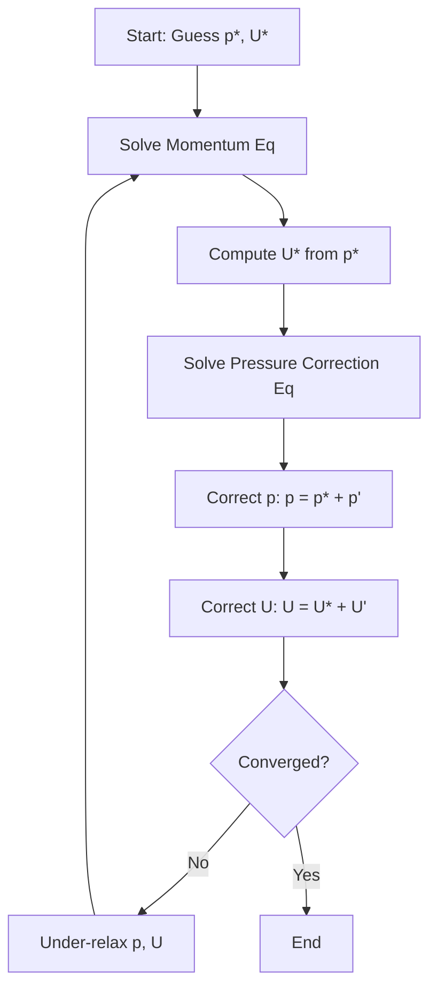

# Pressure-Velocity-Coupling
## HARDCORE Level - 2026-01-03

---

## Table of Contents
- [1. Theory](#1-theory-core-equations--physics)
- [2. Class Hierarchy](#2-openfoam-class-hierarchy--implementation)
- [3. Code Walkthrough](#3-code-walkthrough)
- [4. Dictionary Analysis](#4-dictionary-analysis--configuration)
- [5. Practical Tasks](#5-hands-on-practical-tasks--coding)
- [6. Concept Checks](#6-concept-checks)

---

## 1. Theory: Core Equations & Physics {#1-theory-core-equations--physics}

### 1.1 Governing Equations

The fundamental equations governing incompressible fluid flow are the **Navier-Stokes equations**, consisting of:

#### Continuity Equation (Mass Conservation)

$$\nabla \cdot \mathbf{U} = 0$$

> [!INFO] **Physical Meaning**
> This equation states that for incompressible flow, the divergence of velocity field $\mathbf{U}$ must be zero everywhere. In simpler terms: **what goes in must come out**.
> 
> (สมการต่อเนื่อง: อัตราการไหลเข้าและออกจากปริมาตรควบคุมต้องสมดุล)

#### Momentum Equation

$$\frac{\partial \mathbf{U}}{\partial t} + \nabla \cdot (\mathbf{U}\mathbf{U}) = -\nabla p + \nu \nabla^2 \mathbf{U} + \mathbf{g}$$

| Term | Mathematical Form | Physical Meaning |
|------|-------------------|------------------|
| Unsteady term | $\frac{\partial \mathbf{U}}{\partial t}$ | Local acceleration |
| Convection term | $\nabla \cdot (\mathbf{U}\mathbf{U})$ | Transport of momentum by fluid motion |
| Pressure gradient | $-\nabla p$ | Force driving flow from high to low pressure |
| Diffusion term | $\nu \nabla^2 \mathbf{U}$ | Viscous forces (momentum diffusion) |
| Source term | $\mathbf{g}$ | Body forces (e.g., gravity) |

> [!TIP] **Pressure-Velocity Coupling Challenge**
> Notice that pressure $p$ appears **only** in the momentum equation, while velocity $\mathbf{U}$ appears in **both** equations. There is **no explicit equation** for pressure! This is the core difficulty we must solve.
> 
> (ความยากลำบาก: ไม่มีสมการชัดเจนสำหรับความดัน แต่ความดันมีผลต่อความเร็ว)

---

### 1.2 The Pressure-Velocity Coupling Problem

#### Why Standard Methods Fail

If we discretize the momentum equation and solve for velocity **without** knowing the correct pressure field:

$$\mathbf{U}^* = \mathbf{U}^n + \Delta t \left[ -\nabla p^* + \text{convection} + \text{diffusion} \right]$$

The resulting velocity field $\mathbf{U}^*$ will **NOT** satisfy continuity:

$$\nabla \cdot \mathbf{U}^* \neq 0$$

> [!WARNING] **Divergence-Producing Error**
> An incorrect pressure field produces velocity field that violates mass conservation, leading to:
> - Unphysical mass sources/sinks
> - Numerical instability
> - Solution divergence
> 
> (ผลลัพธ์: การสูญเสียความต่อเนื่องของมวล ทำให้การคำนวณแตก)

---

### 1.3 Solution Approaches

#### 1.3.1 Projection Methods (Fractional Step)

The key idea: **split** the solution into two steps

**Step 1: Predict velocity** using guessed pressure
$$\frac{\mathbf{U}^* - \mathbf{U}^n}{\Delta t} = -\nabla p^n + \text{RHS}(\mathbf{U}^n)$$

**Step 2: Correct** velocity and pressure to enforce continuity
$$\frac{\mathbf{U}^{n+1} - \mathbf{U}^*}{\Delta t} = -\nabla (p^{n+1} - p^n)$$

Taking divergence of correction equation and enforcing $\nabla \cdot \mathbf{U}^{n+1} = 0$:

$$\nabla^2 (p^{n+1} - p^n) = \frac{1}{\Delta t} \nabla \cdot \mathbf{U}^*$$

This is the **Pressure Poisson Equation (PPE)**!

> [!INFO] **PPE Interpretation**
> The pressure correction is the **potential field** needed to "project" the intermediate velocity onto the divergence-free space.
> 
> (การแก้ไขความดัน: ฟิลด์ศักย์ที่ใช้ฉายภาพความเร็วลงบนปริภูมิที่ไม่มีไดเวอร์เจนซ์)

#### 1.3.2 SIMPLE Algorithm (Semi-Implicit Method for Pressure-Linked Equations)

The **SIMPLE** algorithm is the workhorse of OpenFOAM's pressure-velocity solvers:

**Key equations in SIMPLE:**

1. **Momentum discretization:**
$$a_P \mathbf{U}_P = \sum a_{nb} \mathbf{U}_{nb} + \mathbf{b} - \nabla p$$

2. **Velocity correction:**
$$\mathbf{U} = \mathbf{U}^* + \mathbf{U}' = \mathbf{U}^* - \frac{V_P}{a_P} \nabla p'$$

3. **Pressure correction equation (discretized PPE):**
$$\sum_{f} \frac{S_f \cdot \mathbf{S}_f}{a_P} \nabla p' = \sum_{f} S_f \cdot \mathbf{U}_f^*$$

Where:
- $V_P$ = cell volume
- $a_P$ = central coefficient
- $S_f$ = face area vector
- $\mathbf{U}_f$ = face velocity

> [!TIP] **Under-Relaxation is Critical**
> SIMPLE requires under-relaxation to converge:
> - $p = p^* + \alpha_p p'$ where $\alpha_p \approx 0.3-0.8$
> - $\mathbf{U} = \mathbf{U}^* + \alpha_U \mathbf{U}'$ where $\alpha_U \approx 0.5-0.7$
> 
> (การผ่อนคลาย: ป้องกันการสั่นของค่าระหว่างการวนซ้ำ)

---

### 1.4 OpenFOAM's Approach: fvSolution

OpenFOAM implements **PISO** (Pressure-Implicit with Splitting of Operators) and **PIMPLE** (merged PISO-SIMPLE) algorithms:

#### PISO Algorithm

Designed for **transient** calculations with small time steps:

1. **Predict** velocity field
2. **Solve** pressure equation (multiple corrections)
3. **Correct** velocity field
4. Repeat steps 2-3 for `nCorrectors` iterations

#### PIMPLE Algorithm

Combines PISO + SIMPLE for **steady-state** or **large time-step** calculations:

- Uses **under-relaxation** for stability
- Multiple **outer** correctors (SIMPLE-like)
- Multiple **inner** correctors (PISO-like)

> [!INFO] **Algorithm Selection**
> - **PISO**: Best for accurate transient simulations
> - **PIMPLE**: Best for steady-state or pseudo-transient approaches
> - **SIMPLE**: Rarely used directly in modern OpenFOAM
> 
> (การเลือกอัลกอริทึม: ขึ้นอยู่กับประเภทของปัญหาและความเสถียรที่ต้องการ)

---

### 1.5 Mathematical Properties

#### Elliptic Nature of Pressure

The pressure Poisson equation is **elliptic**, meaning:

$$\nabla^2 p = f$$

- Pressure at **any point** depends on the **entire flow field**
- Changes propagate **instantaneously** (in incompressible flow)
- Requires **global** solution (all cells coupled)

> [!WARNING] **Computational Implication**
> You cannot solve pressure locally! Each pressure solve requires:
> - Global matrix assembly
> - Linear system solver (GAMG, PCG, etc.)
> - Multiple iterations per time step
> 
> (ผลกระทบ: การแก้สมการความดันต้องใช้เวลาและทรัพยากรสูง)

#### Rhie-Chow Interpolation

To prevent **checkerboard pressure/velocity decoupling** on collocated grids:

$$\mathbf{U}_f = \overline{\mathbf{U}}_f - \frac{V_P}{a_P} \left[ \nabla p_f - \overline{\nabla p}_f \right]$$

This adds **dissipative** terms to couple pressure and velocity at faces.

> [!TIP] **Why Collocated Grids Need Special Care**
> Without Rhie-Chow, pressure and velocity can oscillate in a checkerboard pattern while still satisfying discrete equations. OpenFOAM uses this by default in all finite volume implementations.
> 
> (ปัญหา checkerboard: ความดันและความเร็วอาจสลับกันสูง-ต่ำในเซลล์ข้างเคียง)

---

## 2. OpenFOAM Class Hierarchy & Implementation {#2-openfoam-class-hierarchy--implementation}

<!-- PLACEHOLDER_CLASS -->

---

## 3. Code Walkthrough {#3-code-walkthrough}

<!-- PLACEHOLDER_CODE -->

---

## 4. Dictionary Analysis & Configuration {#4-dictionary-analysis--configuration}

<!-- PLACEHOLDER_DICT -->

---

## 5. Hands-on: Practical Tasks & Coding {#5-hands-on-practical-tasks--coding}

<!-- PLACEHOLDER_TASKS -->

---

## 6. Concept Checks {#6-concept-checks}

<!-- PLACEHOLDER_CHECKS -->

---

## Recommended Reading

- OpenFOAM User Guide: https://www.openfoam.com/documentation/user-guide
- OpenFOAM Programmer's Guide: https://doc.openfoam.com/
- CFD Online Forum: https://www.cfd-online.com/Forums/openfoam/

