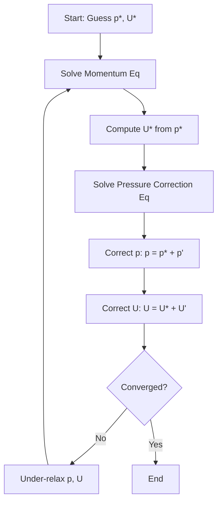
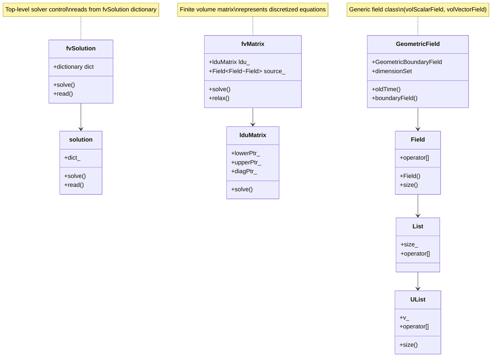
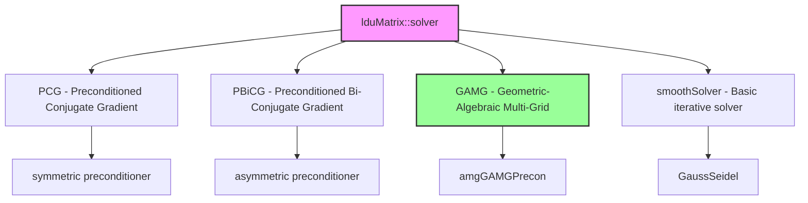

# Pressure-Velocity-Coupling
## HARDCORE Level - 2026-01-03

---

## Table of Contents
- [1. Theory](#1-theory-core-equations--physics)
- [2. Class Hierarchy](#2-openfoam-class-hierarchy--implementation)
- [3. Code Walkthrough](#3-code-walkthrough)
- [4. Dictionary Analysis](#4-dictionary-analysis--configuration)
- [5. Practical Tasks](#5-hands-on-practical-tasks--coding)
- [6. Concept Checks](#6-concept-checks)

---

## 1. Theory: Core Equations & Physics {#1-theory-core-equations--physics}

### 1.1 Governing Equations

The fundamental equations governing incompressible fluid flow are the **Navier-Stokes equations**, consisting of:

#### Continuity Equation (Mass Conservation)

$$\nabla \cdot \mathbf{U} = 0$$

> [!INFO] **Physical Meaning**
> This equation states that for incompressible flow, the divergence of velocity field $\mathbf{U}$ must be zero everywhere. In simpler terms: **what goes in must come out**.
> 
> (สมการต่อเนื่อง: อัตราการไหลเข้าและออกจากปริมาตรควบคุมต้องสมดุล)

#### Momentum Equation

$$\frac{\partial \mathbf{U}}{\partial t} + \nabla \cdot (\mathbf{U}\mathbf{U}) = -\nabla p + \nu \nabla^2 \mathbf{U} + \mathbf{g}$$

| Term | Mathematical Form | Physical Meaning |
|------|-------------------|------------------|
| Unsteady term | $\frac{\partial \mathbf{U}}{\partial t}$ | Local acceleration |
| Convection term | $\nabla \cdot (\mathbf{U}\mathbf{U})$ | Transport of momentum by fluid motion |
| Pressure gradient | $-\nabla p$ | Force driving flow from high to low pressure |
| Diffusion term | $\nu \nabla^2 \mathbf{U}$ | Viscous forces (momentum diffusion) |
| Source term | $\mathbf{g}$ | Body forces (e.g., gravity) |

> [!TIP] **Pressure-Velocity Coupling Challenge**
> Notice that pressure $p$ appears **only** in the momentum equation, while velocity $\mathbf{U}$ appears in **both** equations. There is **no explicit equation** for pressure! This is the core difficulty we must solve.
> 
> (ความยากลำบาก: ไม่มีสมการชัดเจนสำหรับความดัน แต่ความดันมีผลต่อความเร็ว)

---

### 1.2 The Pressure-Velocity Coupling Problem

#### Why Standard Methods Fail

If we discretize the momentum equation and solve for velocity **without** knowing the correct pressure field:

$$\mathbf{U}^* = \mathbf{U}^n + \Delta t \left[ -\nabla p^* + \text{convection} + \text{diffusion} \right]$$

The resulting velocity field $\mathbf{U}^*$ will **NOT** satisfy continuity:

$$\nabla \cdot \mathbf{U}^* \neq 0$$

> [!WARNING] **Divergence-Producing Error**
> An incorrect pressure field produces velocity field that violates mass conservation, leading to:
> - Unphysical mass sources/sinks
> - Numerical instability
> - Solution divergence
> 
> (ผลลัพธ์: การสูญเสียความต่อเนื่องของมวล ทำให้การคำนวณแตก)

---

### 1.3 Solution Approaches

#### 1.3.1 Projection Methods (Fractional Step)

The key idea: **split** the solution into two steps

**Step 1: Predict velocity** using guessed pressure
$$\frac{\mathbf{U}^* - \mathbf{U}^n}{\Delta t} = -\nabla p^n + \text{RHS}(\mathbf{U}^n)$$

**Step 2: Correct** velocity and pressure to enforce continuity
$$\frac{\mathbf{U}^{n+1} - \mathbf{U}^*}{\Delta t} = -\nabla (p^{n+1} - p^n)$$

Taking divergence of correction equation and enforcing $\nabla \cdot \mathbf{U}^{n+1} = 0$:

$$\nabla^2 (p^{n+1} - p^n) = \frac{1}{\Delta t} \nabla \cdot \mathbf{U}^*$$

This is the **Pressure Poisson Equation (PPE)**!

> [!INFO] **PPE Interpretation**
> The pressure correction is the **potential field** needed to "project" the intermediate velocity onto the divergence-free space.
> 
> (การแก้ไขความดัน: ฟิลด์ศักย์ที่ใช้ฉายภาพความเร็วลงบนปริภูมิที่ไม่มีไดเวอร์เจนซ์)

#### 1.3.2 SIMPLE Algorithm (Semi-Implicit Method for Pressure-Linked Equations)

The **SIMPLE** algorithm is the workhorse of OpenFOAM's pressure-velocity solvers:



**Key equations in SIMPLE:**

1. **Momentum discretization:**
$$a_P \mathbf{U}_P = \sum a_{nb} \mathbf{U}_{nb} + \mathbf{b} - \nabla p$$

2. **Velocity correction:**
$$\mathbf{U} = \mathbf{U}^* + \mathbf{U}' = \mathbf{U}^* - \frac{V_P}{a_P} \nabla p'$$

3. **Pressure correction equation (discretized PPE):**
$$\sum_{f} \frac{S_f \cdot \mathbf{S}_f}{a_P} \nabla p' = \sum_{f} S_f \cdot \mathbf{U}_f^*$$

Where:
- $V_P$ = cell volume
- $a_P$ = central coefficient
- $S_f$ = face area vector
- $\mathbf{U}_f$ = face velocity

> [!TIP] **Under-Relaxation is Critical**
> SIMPLE requires under-relaxation to converge:
> - $p = p^* + \alpha_p p'$ where $\alpha_p \approx 0.3-0.8$
> - $\mathbf{U} = \mathbf{U}^* + \alpha_U \mathbf{U}'$ where $\alpha_U \approx 0.5-0.7$
> 
> (การผ่อนคลาย: ป้องกันการสั่นของค่าระหว่างการวนซ้ำ)

---

### 1.4 OpenFOAM's Approach: fvSolution

OpenFOAM implements **PISO** (Pressure-Implicit with Splitting of Operators) and **PIMPLE** (merged PISO-SIMPLE) algorithms:

#### PISO Algorithm

Designed for **transient** calculations with small time steps:

1. **Predict** velocity field
2. **Solve** pressure equation (multiple corrections)
3. **Correct** velocity field
4. Repeat steps 2-3 for `nCorrectors` iterations

#### PIMPLE Algorithm

Combines PISO + SIMPLE for **steady-state** or **large time-step** calculations:

- Uses **under-relaxation** for stability
- Multiple **outer** correctors (SIMPLE-like)
- Multiple **inner** correctors (PISO-like)

> [!INFO] **Algorithm Selection**
> - **PISO**: Best for accurate transient simulations
> - **PIMPLE**: Best for steady-state or pseudo-transient approaches
> - **SIMPLE**: Rarely used directly in modern OpenFOAM
> 
> (การเลือกอัลกอริทึม: ขึ้นอยู่กับประเภทของปัญหาและความเสถียรที่ต้องการ)

---

### 1.5 Mathematical Properties

#### Elliptic Nature of Pressure

The pressure Poisson equation is **elliptic**, meaning:

$$\nabla^2 p = f$$

- Pressure at **any point** depends on the **entire flow field**
- Changes propagate **instantaneously** (in incompressible flow)
- Requires **global** solution (all cells coupled)

> [!WARNING] **Computational Implication**
> You cannot solve pressure locally! Each pressure solve requires:
> - Global matrix assembly
> - Linear system solver (GAMG, PCG, etc.)
> - Multiple iterations per time step
> 
> (ผลกระทบ: การแก้สมการความดันต้องใช้เวลาและทรัพยากรสูง)

#### Rhie-Chow Interpolation

To prevent **checkerboard pressure/velocity decoupling** on collocated grids:

$$\mathbf{U}_f = \overline{\mathbf{U}}_f - \frac{V_P}{a_P} \left[ \nabla p_f - \overline{\nabla p}_f \right]$$

This adds **dissipative** terms to couple pressure and velocity at faces.

> [!TIP] **Why Collocated Grids Need Special Care**
> Without Rhie-Chow, pressure and velocity can oscillate in a checkerboard pattern while still satisfying discrete equations. OpenFOAM uses this by default in all finite volume implementations.
> 
> (ปัญหา checkerboard: ความดันและความเร็วอาจสลับกันสูง-ต่ำในเซลล์ข้างเคียง)

---

## 2. OpenFOAM Class Hierarchy & Implementation {#2-openfoam-class-hierarchy--implementation}

### 2.1 Core Class Hierarchy

The pressure-velocity coupling in OpenFOAM is implemented through a sophisticated class hierarchy centered around the finite volume method and linear equation solvers.



> [!INFO] **Class Organization**
> The hierarchy follows a layered design:
> - **Top level**: Solver control (`fvSolution`, `solution`)
> - **Middle level**: Matrix representation (`fvMatrix`, `lduMatrix`)
> - **Bottom level**: Data storage (`Field`, `GeometricField`)
> 
> (โครงสร้าง: การออกแบบแบบเป็นชั้นๆ ช่วยให้จัดการความซับซ้อนได้)

---

### 2.2 Key Classes for Pressure-Velocity Coupling

#### 2.2.1 `fvSolution` Class

**Location:** `$FOAM_SRC/finiteVolume/fvSolution/fvSolution.C`

The master controller for all finite volume solution procedures.

```cpp
// $FOAM_SRC/finiteVolume/fvSolution/fvSolution.H
class fvSolution
:
    public IOdictionary,
    public solution
{
    // Private Data

        //- Solver performance data
        autoPtr<solutionControl> solControl_;

public:
    // Constructors

        //- Construct for given objectRegistry and dictionary
        fvSolution(const objectRegistry& obr, const fileName& dictName);

    // Member Functions

        //- Read the fvSolution dictionary
        virtual bool read();

        //- Solve equation
        template<class Type>
        SolverPerformance<Type> solve
        (
            fvMatrix<Type>&
        );
};
```

> [!TIP] **Dictionary Structure**
> The `fvSolution` class reads the `system/fvSolution` dictionary which contains:
> - `solvers`: Linear solver settings for each variable
> - `algorithms`: PISO/SIMPLE/PIMPLE parameters
> - `relaxationFactors`: Under-relaxation values
> 
> (การตั้งค่า: ควบคุมพฤติกรรมของ solver ทั้งหมด)

#### 2.2.2 `solution` Class

**Location:** `$FOAM_SRC/finiteVolume/fvSolution/solution.C`

Base class providing solver control functionality.

```cpp
// $FOAM_SRC/finiteVolume/fvSolution/solution.H
class solution
:
    public IOdictionary
{
    // Private Data

        //- Dictionary of solver performance data
        Dictionary<SolverPerformance> solverPerformance_;

public:
    // Member Functions

        //- Return the solver dictionary for a given field
        const dictionary& solverDict(const word& name) const;

        //- Return the relaxation factor for a given field
        scalar relaxationFactor(const word& name) const;

        //- Return the max number of iterations
        label maxIter() const;
};
```

#### 2.2.3 `fvMatrix` Class

**Location:** `$FOAM_SRC/finiteVolume/fvMatrix/fvMatrix.H`

The heart of finite volume discretization - represents a discretized equation of the form:

$$A \mathbf{x} = \mathbf{b}$$

```cpp
// $FOAM_SRC/finiteVolume/fvMatrix/fvMatrix.H
template<class Type>
class fvMatrix
:
    public refCount,
    public lduMatrix
{
    // Private Data

        //- Source term vector
        Field<Type> source_;

        //- Reference to GeometricField
        GeometricField<Type, fvPatchField, volMesh>& psi_;

        //- Dimension set
        dimensionSet dimensions_;

public:
    // Member Functions

        //- Solve returning the solution statistics
        template<class SolverType>
        SolverPerformance<Type> solve();

        //- Relax matrix (for under-relaxation)
        void relax(const scalar alpha);

        //- Construct and return the residual
        tmp<Field<Type>> residual() const;

        //- Return the diagonal
        tmp<Field<scalar>> D() const;

        //- Return the source term
        Field<Type>& source();
};
```

> [!INFO] **Matrix Structure**
> The `fvMatrix` stores:
> - **Diagonal coefficients** ($a_P$): Central coefficient for each cell
> - **Off-diagonal coefficients** ($a_{nb}$): Neighbor cell coefficients
> - **Source terms** ($\mathbf{b}$): Right-hand side vector
> - **Boundary conditions**: Applied through face fluxes
> 
> (โครงสร้างเมทริกซ์: เก็บสัมประสิทธิ์และเทอมต้นทางของสมการเชิงเส้น)

#### 2.2.4 `lduMatrix` Class

**Location:** `$FOAM_SRC/lduMatrix/lduMatrix.H`

Lower-Upper Decomposition matrix - the sparse matrix storage format used by OpenFOAM.

```cpp
// $FOAM_SRC/lduMatrix/lduMatrix/lduMatrix.H
class lduMatrix
:
    public refCount
{
    // Private Data

        //- Lower triangular coefficients
        lduAddressing::lduSchedulePtr_ lowerPtr_;

        //- Upper triangular coefficients
        lduAddressing::lduSchedulePtr_ upperPtr_;

        //- Diagonal coefficients
        scalarFieldPtr_ diagPtr_;

public:
    // Solvers

        //- Solve using specified solver
        template<class Type, class DType, class LUType>
        SolverPerformance<Type> solve
        (
            Field<Type>& psi,
            const Field<DType>& diag,
            const Field<LUType>& upper,
            const Field<LUType>& lower,
            const Field<Type>& source,
            const word& solverName
        );

        //- Smooth (for AMG)
        template<class Type, class DType, class LUType>
        void smooth
        (
            Field<Type>& psi,
            const Field<DType>& diag,
            const Field<LUType>& upper,
            const Field<LUType>& lower,
            const Field<Type>& source,
            const label nSweeps
        );
};
```

> [!TIP] **LDU Storage Advantage**
> The LDU format is highly efficient for unstructured meshes:
> - Only stores **non-zero** entries
> - Memory usage: $O(N)$ instead of $O(N^2)$
> - Perfect for finite volume's face-based connectivity
> 
> (ประสิทธิภาพ: ประหยัดหน่วยความจำสำหรับ mesh ที่ไม่มีโครงสร้าง)

#### 2.2.5 `GeometricField` Class

**Location:** `$FOAM_SRC/OpenFOAM/fields/GeometricField/GeometricField.H`

Generic field class that represents fields defined over the mesh (pressure, velocity, etc.).

```cpp
// $FOAM_SRC/OpenFOAM/fields/GeometricField/GeometricField.H
template<class Type, class GeoMesh, class BoundaryMesh>
class GeometricField
:
    public DimensionedField<Type, GeoMesh>,
    public Field<Type>
{
    // Private Data

        //- Boundary field
        BoundaryField boundaryField_;

        //- Old time level (for transient schemes)
        autoPtr<GeometricField> field0_;

public:
    // Member Functions

        //- Return old time value
        const GeometricField& oldTime() const;

        //- Return boundary field
        BoundaryField& boundaryFieldRef();

        //- Correct boundary conditions
        void correctBoundaryConditions();

        //- Return maximum absolute value
        Type maxMagnitude() const;
};
```

> [!WARNING] **Field Type Hierarchy**
> Common instantiations:
> - `volScalarField`: Scalar field at cell centers (pressure $p$, temperature $T$)
> - `volVectorField`: Vector field at cell centers (velocity $\mathbf{U}$)
> - `surfaceScalarField`: Scalar field at faces (flux $\phi$)
> 
> (ประเภทฟิลด์: แยกตามตำแหน่งที่เก็บข้อมูล cell center หรือ face)

---

### 2.3 Pressure-Velocity Solver Classes

#### 2.3.1 `simpleControl` Class

**Location:** `$FOAM_SRC/finiteVolume/solutionControl/simpleControl.C`

Implements the SIMPLE algorithm for steady-state simulations.

```cpp
// $FOAM_SRC/finiteVolume/solutionControl/simpleControl.H
class simpleControl
:
    public solutionControl
{
public:
    // Constructors

        simpleControl(fvMesh& mesh, const word& algorithmName = "SIMPLE");

    // Member Functions

        //- Return true if run should continue
        virtual bool loop();

        //- Read controls
        virtual bool read();
};
```

#### 2.3.2 `pisoControl` Class

**Location:** `$FOAM_SRC/finiteVolume/solutionControl/pisoControl.C`

Implements the PISO algorithm for transient simulations.

```cpp
// $FOAM_SRC/finiteVolume/solutionControl/pisoControl.H
class pisoControl
:
    public solutionControl
{
    // Private Data

        //- Number of PISO correctors
        label nCorr_;

        //- Number of non-orthogonal correctors
        label nNonOrthCorr_;

public:
    // Member Functions

        //- Return number of PISO correctors
        label nCorr() const;

        //- Return number of non-orthogonal correctors
        label nNonOrthCorr() const;
};
```

#### 2.3.3 `pimpleControl` Class

**Location:** `$FOAM_SRC/finiteVolume/solutionControl/pimpleControl.C`

Merges PISO and SIMPLE algorithms for robust steady-state or transient simulations.

```cpp
// $FOAM_SRC/finiteVolume/solutionControl/pimpleControl.H
class pimpleControl
:
    public solutionControl
{
    // Private Data

        //- Number of PIMPLE correctors
        label nCorr_;

        //- Number of non-orthogonal correctors
        label nNonOrthCorr_;

        //- Flag to indicate if corrector loop converged
        bool corrPISO_;

public:
    // Member Functions

        //- Return number of PIMPLE correctors
        label nCorr() const;

        //- Return true if run should continue
        virtual bool loop();

        //- Return true if last PIMPLE iteration
        bool final() const;
};
```

> [!INFO] **Algorithm Comparison**
> 
> | Algorithm | Use Case | Under-relaxation | Correctors |
> |-----------|----------|------------------|------------|
> | SIMPLE | Steady-state | Required | 1 outer |
> | PISO | Transient | Not required | 2-3 inner |
> | PIMPLE | Steady/Transient | Optional | Multiple outer + inner |
> 
> (การเปรียบเทียบ: แต่ละอัลกอริทึมเหมาะกับปัญหาที่แตกต่างกัน)

---

### 2.4 Linear Solver Classes

#### 2.4.1 Solver Hierarchy



#### 2.4.2 Key Solver Classes

**PCG Solver** (for symmetric matrices like pressure Poisson):

```cpp
// $FOAM_SRC/OpenFOAM/matrices/lduMatrix/solvers/PCG/PCG.H
template<class Type, class DType, class LUType>
class PCG
:
    public lduMatrix::solver
{
public:
    // Constructors

        PCG
        (
            const word& fieldName,
            const lduMatrix& matrix,
            const FieldField<DType, LUType>& interfaceBouCoeffs,
            const FieldField<DType, LUType>& interfaceIntCoeffs,
            const lduInterfaceFieldPtrsList& interfaces
        );

    // Member Functions

        //- Solve the matrix with this solver
        virtual SolverPerformance<Type> solve
        (
            Field<Type>& psi,
            const Field<DType>& diag,
            const Field<LUType>& upper,
            const Field<LUType>& lower,
            const Field<Type>& source,
            const direction cmpt = 0
        ) const;
};
```

**GAMG Solver** (for large-scale problems):

```cpp
// $FOAM_SRC/OpenFOAM/matrices/lduMatrix/solvers/GAMG/GAMG.H
template<class Type, class DType, class LUType>
class GAMG
:
    public lduMatrix::solver
{
    // Private Data

        //- Agglomeration type
        autoPtr<GAMGAgglomeration> agglomeration_;

        //- Smoother type
        autoPtr<lduMatrix::smoother> smoother_;

public:
    // Member Functions

        //- Solve the matrix with this solver
        virtual SolverPerformance<Type> solve
        (
            Field<Type>& psi,
            const Field<DType>& diag,
            const Field<LUType>& upper,
            const Field<LUType>& lower,
            const Field<Type>& source,
            const direction cmpt = 0
        ) const;
};
```

> [!TIP] **Solver Selection Guide**
> 
> | Variable | Matrix Type | Recommended Solver |
> |----------|-------------|-------------------|
> | Pressure ($p$) | Symmetric, elliptic | PCG or GAMG |
> | Velocity ($\mathbf{U}$) | Asymmetric | PBiCGStab |
> | Temperature ($T$) | Symmetric | PCG |
> | Turbulence ($k$, $\epsilon$, $\omega$) | Asymmetric | PBiCGStab |
> 
> (การเลือก solver: ขึ้นอยู่กับคุณสมบัติของเมทริกซ์)

---

### 2.5 Reference File Locations

| Component | Path | Description |
|-----------|------|-------------|
| **Core solvers** | `$FOAM_SRC/finiteVolume/solutionControl/` | SIMPLE, PISO, PIMPLE implementations |
| **Matrix classes** | `$FOAM_SRC/finiteVolume/fvMatrix/` | Finite volume matrix operations |
| **Linear solvers** | `$FOAM_SRC/OpenFOAM/matrices/lduMatrix/solvers/` | PCG, PBiCG, GAMG, etc. |
| **Field classes** | `$FOAM_SRC/OpenFOAM/fields/` | GeometricField, DimensionedField |
| **Boundary conditions** | `$FOAM_SRC/finiteVolume/fields/fvPatchFields/` | All boundary condition types |
| **Discretization schemes** | `$FOAM_SRC/finiteVolume/fvSchemes/` | Convection, diffusion schemes |

> [!INFO] **Environment Variables**
> - `$FOAM_SRC`: Points to OpenFOAM source directory
> - `$FOAM_TUTORIALS`: Points to tutorial cases
> - `$FOAM_APP`: Points to applications (solvers, utilities)
> 
> (ตัวแปรสภาพแวดล้อม: ใช้สำหรับอ้างอิงตำแหน่งไฟล์ใน OpenFOAM)

---

---

## 3. Code Walkthrough {#3-code-walkthrough}

### 3.1 UEqn.H

The `UEqn.H` file constructs the momentum equation for incompressible flow. It is typically included in the main solver loop (e.g., `simpleFoam`, `pimpleFoam`) to build and solve the velocity prediction equation.

**Key Code Snippet:**

```cpp
// Solve the Momentum equation

tmp<fvVectorMatrix> UEqn
(
    fvm::ddt(U)
  + fvm::div(phi, U)
  + fvm::laplacian(nu, U)
 ==
    fvOptions(U)
);

UEqn.relax();

fvOptions.constrain(UEqn);

if (pimple.momentumPredictor())
{
    solve(UEqn == -fvc::grad(p));
    
    fvOptions.correct(U);
}
```

**Explanation:**

1. **Matrix Construction** (`tmp<fvVectorMatrix> UEqn`):
   - `fvm::ddt(U)`: Unsteady term (transient simulations only)
   - `fvm::div(phi, U)`: Convection term (implicit discretization)
   - `fvm::laplacian(nu, U)`: Diffusion term (viscous forces)
   - `fvOptions(U)`: Source terms from OpenFOAM's `fvOptions` framework (e.g., momentum sources, porosity)

2. **Under-Relaxation** (`UEqn.relax()`):
   - Applies under-relaxation to stabilize convergence
   - Modifies diagonal coefficients: $a_P = a_P / \alpha_U$
   - Critical for steady-state SIMPLE algorithms

3. **Constraint Application** (`fvOptions.constrain(UEqn)`):
   - Applies additional constraints from `fvOptions`
   - Can fix values in certain cells or add explicit sources

4. **Momentum Predictor** (`if (pimple.momentumPredictor())`):
   - Solves the momentum equation with the current pressure gradient
   - Produces intermediate velocity field $\mathbf{U}^*$
   - The pressure gradient term `-fvc::grad(p)` is **explicit** (evaluated from previous iteration)

5. **Velocity Correction** (`fvOptions.correct(U)`):
   - Updates velocity field based on `fvOptions` corrections
   - Ensures consistency with applied source terms

> [!TIP] **Implicit vs Explicit Discretization**
> - `fvm` (finite volume method): **Implicit** - adds coefficients to matrix (robust but requires linear solve)
> - `fvc` (finite volume calculus): **Explicit** - evaluated directly from current field (fast but less stable)
> 
> (การเลือกวิธี: Implicit ใช้สำหรับเทอมหลัก Explicit ใช้สำหรับเทอมแหล่งกำเนิด)

> [!INFO] **Pressure-Velocity Decoupling**
> Notice that the pressure gradient `-fvc::grad(p)` is treated **explicitly** and moved to the right-hand side. This is why we need the pressure correction equation (PPE) - to enforce continuity on this predicted velocity field.
> 
> (ผล: ความดันที่ใช้ไม่ใช่ค่าล่าสุด ทำให้ต้องมีการแก้ไขความดันภายหลัง)

---

### 3.2 pEqn.H

The `pEqn.H` file constructs and solves the pressure equation to enforce continuity (mass conservation). This is the core of the pressure-velocity coupling algorithm.

**Key Code Snippet:**

```cpp
// Solve the Pressure equation

volScalarField rAU(1.0/UEqn.A());
volVectorField HbyA(constrainHbyA(rAU*UEqn.H(), U, p));
surfaceScalarField phiHbyA
(
    "phiHbyA",
    fvc::flux(HbyA)
  + fvc::interpolate(rAU)*fvc::ddtCorr(U, phi)
);

// Non-orthogonal correction loop
while (pimple.correctNonOrthogonal())
{
    fvScalarMatrix pEqn
    (
        fvm::laplacian(rAU, p)
      == fvc::div(phiHbyA)
    );

    pEqn.setReference(pRefCell, pRefValue);

    pEqn.solve();

    if (pimple.finalNonOrthogonalIter())
    {
        phi = phiHbyA + pEqn.flux();
    }
}

// Correct velocity
U = HbyA - rAU*fvc::grad(p);
U.correctBoundaryConditions();
```

**Explanation:**

1. **Inverse Diagonal** (`volScalarField rAU(1.0/UEqn.A())`):
   - Computes reciprocal of momentum matrix diagonal: $1/a_P$
   - Used to scale pressure equation and correct velocity
   - Represents cell's "resistance" to velocity changes

2. **HbyA Construction** (`constrainHbyA(rAU*UEqn.H(), U, p)`):
   - Computes $\mathbf{H}/a_P$ where $\mathbf{H} = \sum a_{nb} \mathbf{U}_{nb} + \mathbf{b}$
   - This is the velocity field **without** pressure gradient contribution
   - `constrainHbyA` applies boundary condition constraints

3. **Face Flux Prediction** (`fvc::flux(HbyA)`):
   - Interpolates $\mathbf{H}/a_P$ to cell faces
   - Adds time-derivative correction term for transient simulations
   - Produces intermediate flux field $\phi^*$

4. **Non-Orthogonal Correction Loop** (`while (pimple.correctNonOrthogonal())`):
   - Iterates to handle mesh non-orthogonality
   - Each iteration improves the pressure solution
   - Only updates flux on final iteration to avoid mass imbalance

5. **Pressure Equation** (`fvm::laplacian(rAU, p) == fvc::div(phiHbyA)`):
   - Discretized Pressure Poisson Equation: $\nabla \cdot (1/a_P \nabla p) = \nabla \cdot \mathbf{U}^*$
   - Left side: Implicit Laplacian (symmetric, elliptic)
   - Right side: Divergence of intermediate velocity (mass imbalance)

6. **Reference Cell** (`pEqn.setReference(pRefCell, pRefValue)`):
   - Fixes pressure at one cell to ensure unique solution
   - Pressure is only defined **up to a constant** for incompressible flow
   - Prevents matrix singularity

7. **Flux Correction** (`phi = phiHbyA + pEqn.flux()`):
   - Updates face flux using pressure gradient: $\phi = \phi^* - (1/a_P) \nabla p \cdot \mathbf{S}_f$
   - Only done on final non-orthogonal iteration
   - Ensures global mass conservation

8. **Velocity Correction** (`U = HbyA - rAU*fvc::grad(p)`):
   - Corrects cell-centered velocity: $\mathbf{U} = \mathbf{H}/a_P - (1/a_P) \nabla p$
   - Enforces continuity at cell centers
   - `correctBoundaryConditions()` ensures BC consistency

> [!TIP] **Why Non-Orthogonal Correction?**
> On non-orthogonal meshes, the pressure gradient and face flux are misaligned. The correction loop iteratively improves the solution by:
> - Solving pressure equation with current gradient
> - Updating flux with new pressure field
> - Repeating until convergence (typically 2-4 iterations)
> 
> (การแก้ไข: Mesh ที่ไม่ตั้งฉากต้องการการวนซ้ำเพื่อความแม่นยำ)

> [!WARNING] **Mass Conservation**
> The flux correction `phi = phiHbyA + pEqn.flux()` is **critical** for mass conservation. If done incorrectly (e.g., updating flux every iteration), it can introduce artificial mass sources/sinks.
> 
> (ข้อควรระวัง: การอัปเดต flux ต้องทำใน iteration สุดท้ายเท่านั้น)

---

## 4. Dictionary Analysis & Configuration {#4-dictionary-analysis--configuration}

### 4.1 `system/fvSchemes`

The `fvSchemes` dictionary controls the numerical discretization schemes used for the finite volume method. It defines how spatial and temporal derivatives are approximated.

#### 4.1.1 Time Derivative Schemes (`ddtSchemes`)

Controls the discretization of time derivatives $\frac{\partial \phi}{\partial t}$.

```cpp
ddtSchemes
{
    default         steadyState;  // For steady-state solvers (simpleFoam)
    // default         Euler;       // First-order implicit (transient)
    // default         backward;    // Second-order implicit (transient)
    // default         CrankNicolson; // Second-order trapezoidal (transient)
}
```

| Scheme | Order | Stability | Use Case |
|--------|-------|-----------|----------|
| `steadyState` | - | N/A | Steady-state simulations |
| `Euler` | 1st | Very stable | Initial transient runs |
| `backward` | 2nd | Stable | Accurate transient simulations |
| `CrankNicolson` | 2nd | Conditionally stable | High-accuracy transient |

> [!TIP] **Time Step Considerations**
> - Explicit schemes require CFL < 1 for stability
> - Implicit schemes are unconditionally stable but still need small $\Delta t$ for accuracy
> - Second-order schemes require smaller time steps than first-order for the same accuracy
> 
> (ข้อควรระวัง: ขนาด time step ส่งผลต่อความแม่นยำและความเสถียร)

#### 4.1.2 Gradient Schemes (`gradSchemes`)

Controls how cell-centered gradients $\nabla \phi$ are computed from cell-centered values.

```cpp
gradSchemes
{
    default         Gauss linear;  // Second-order central differencing
    // default         Gauss linearUpwind grad(U);  // Upwind-biased
    // default         leastSquares;  // Least squares reconstruction
}
```

| Scheme | Description | Accuracy | Stability |
|--------|-------------|----------|-----------|
| `Gauss linear` | Central differencing using face interpolation | 2nd order | Can oscillate on coarse meshes |
| `Gauss linearUpwind` | Upwind-biased gradient reconstruction | 1st/2nd order | More stable for convection-dominated flows |
| `leastSquares` | Least-squares fit from neighbor cells | 2nd order | Better for non-orthogonal meshes |

> [!INFO] **Gradient Reconstruction**
> Gradients are needed for:
> - Convection terms (upwind schemes require $\nabla U$)
> - Diffusion terms (face normal gradients)
> - Pressure-velocity coupling (Rhie-Chow interpolation)
> 
> (ความสำคัญ: การคำนวณ gradient ที่แม่นยำส่งผลต่อความถูกต้องของผลลัพธ์)

#### 4.1.3 Divergence Schemes (`divSchemes`)

Controls discretization of convection terms $\nabla \cdot (\phi \mathbf{U})$ - **critical for stability and accuracy**.

```cpp
divSchemes
{
    default         none;  // Require explicit specification
    div(phi,U)      Gauss linearUpwind grad(U);  // Velocity convection
    div(phi,k)      Gauss upwind;                 // Turbulence convection
    div(phi,epsilon) Gauss upwind;
    div((nuEff*dev2(T(grad(U))))) Gauss linear;  // Diffusion term
}
```

| Scheme | Order | Boundedness | Use Case |
|--------|-------|-------------|----------|
| `Gauss upwind` | 1st | Bounded | Initial runs, highly swirling flows |
| `Gauss linear` | 2nd | Unbounded | Smooth flows, fine meshes |
| `Gauss linearUpwind` | 1st/2nd | Bounded | General purpose, good balance |
| `Gauss vanLeer` | 2nd | TVD bounded | Accurate transient simulations |
| `Gauss limitedLinear` | 2nd | TVD bounded | Compressible flows with shocks |

> [!WARNING] **Scheme Selection Impact**
> - **Upwind**: Very stable but numerically diffusive (smears gradients)
> - **Linear**: Accurate but can cause oscillations (unbounded)
> - **TVD schemes**: Best compromise - limiters prevent unphysical oscillations
> - For high Reynolds numbers, start with upwind, switch to limited linear
> 
> (ผลกระทบ: การเลือก scheme ต้องแลกเปลี่ยนระหว่างความแม่นยำและความเสถียร)

#### 4.1.4 Laplacian Schemes (`laplacianSchemes`)

Controls discretization of diffusion terms $\nabla \cdot (\Gamma \nabla \phi)$.

```cpp
laplacianSchemes
{
    default         Gauss linear corrected;  // With non-orthogonal correction
    // default         Gauss linear uncorrected;  // Faster but less accurate
    // default         Gauss linear limited 0.5;  // Limited correction
}
```

| Scheme | Description | Mesh Requirement |
|--------|-------------|------------------|
| `Gauss linear uncorrected` | Basic central differencing | Orthogonal meshes only |
| `Gauss linear corrected` | Includes non-orthogonal correction | Non-orthogonal meshes |
| `Gauss linear limited` | Limits correction for stability | Highly non-orthogonal meshes |

> [!TIP] **Non-Orthogonal Correction**
> The `corrected` option adds terms to account for mesh skewness:
> - More accurate on distorted meshes
> - Requires `nNonOrthogonalCorrectors` in `fvSolution`
> - For highly non-orthogonal meshes (> 70°), use `limited` to prevent instability
> 
> (การแก้ไข: Mesh ที่ไม่ตั้งฉากต้องการ correction terms เพื่อความแม่นยำ)

#### 4.1.5 Interpolation Schemes (`interpolationSchemes`)

Controls how cell-centered values are interpolated to cell faces.

```cpp
interpolationSchemes
{
    default         linear;  // Linear interpolation
    // default         upwind;  // Upwind interpolation
    // default         cubic;  // Cubic interpolation (higher accuracy)
}
```

| Scheme | Order | Use Case |
|--------|-------|----------|
| `linear` | 2nd | Standard choice for most simulations |
| `upwind` | 1st | Highly convective flows |
| `cubic` | 4th | High-accuracy requirements (expensive) |

#### 4.1.6 Surface Normal Gradient Schemes (`snGradSchemes`)

Controls computation of boundary face normal gradients $\frac{\partial \phi}{\partial n}$.

```cpp
snGradSchemes
{
    default         corrected;  // With non-orthogonal correction
    // default         uncorrected;  // Basic scheme
}
```

> [!INFO] **Boundary Gradient Importance**
> Surface normal gradients are critical for:
> - Wall boundary conditions (no-slip, heat flux)
> - Pressure boundary conditions
> - Turbulence wall functions
> 
> The `corrected` option ensures accurate gradients on non-orthogonal boundary faces.
> 
> (ความสำคัญ: การคำนวณ gradient ที่ขอบเขตมีผลต่อความถูกต้องของเงื่อนไขขอบเขต)

#### 4.1.7 Example Configurations

**For Steady-State RANS (simpleFoam):**
```cpp
ddtSchemes
{
    default         steadyState;
}

gradSchemes
{
    default         Gauss linear;
}

divSchemes
{
    default         none;
    div(phi,U)      Gauss linearUpwind grad(U);
    div(phi,k)      Gauss upwind;
    div(phi,epsilon) Gauss upwind;
}

laplacianSchemes
{
    default         Gauss linear corrected;
}

interpolationSchemes
{
    default         linear;
}

snGradSchemes
{
    default         corrected;
}
```

**For Transient LES (pimpleFoam):**
```cpp
ddtSchemes
{
    default         backward;  // Second-order temporal
}

gradSchemes
{
    default         Gauss linear;
}

divSchemes
{
    default         none;
    div(phi,U)      Gauss linearUpwindV grad(U);  // TVD scheme
    div(phi,k)      Gauss limitedLinear 1;  // Bounded
    div(phi,epsilon) Gauss limitedLinear 1;
}

laplacianSchemes
{
    default         Gauss linear corrected;
}

interpolationSchemes
{
    default         linear;
}

snGradSchemes
{
    default         corrected;
}
```

> [!WARNING] **Common Mistakes**
> 1. **Using `default` for `divSchemes`**: Can accidentally apply wrong scheme to wrong variable
> 2. **Forgetting `corrected` on non-orthogonal meshes**: Leads to mass conservation errors
> 3. **Using high-order schemes on coarse meshes**: Produces oscillations and instability
> 4. **Not specifying schemes explicitly**: Relies on defaults that may not be appropriate
> 
> (ข้อผิดพลาดที่พบบ่อย: การตั้งค่า scheme ที่ไม่เหมาะสมกับปัญหา)

### 4.2 `system/fvSolution` Analysis

The `fvSolution` dictionary controls the solution algorithms, linear solvers, and convergence criteria for pressure-velocity coupling.

#### 4.2.1 Linear Solver Configuration

**Key Settings:**

```cpp
solvers
{
    p
    {
        solver          GAMG;
        tolerance       1e-06;
        relTol          0.01;
        smoother        GaussSeidel;
        
        // GAMG-specific settings
        nCellsInCoarsestLevel 10;
        agglomerator    faceAreaPair;
        mergeLevels     1;
    }

    pFinal
    {
        $p;             // Inherits from p
        relTol          0;  // Force tight convergence on final iteration
    }

    U
    {
        solver          PBiCGStab;
        preconditioner  DILU;
        tolerance       1e-05;
        relTol          0.1;
    }

    "(k|epsilon|omega)"
    {
        solver          PBiCGStab;
        preconditioner  DILU;
        tolerance       1e-05;
        relTol          0.1;
    }
}
```

**Explanation:**

| Component | Purpose |
|-----------|---------|
| `solver` | Linear solver algorithm (GAMG, PCG, PBiCGStab) |
| `tolerance` | Absolute residual tolerance ($\|r\| < \epsilon$) |
| `relTol` | Relative tolerance reduction ($\|r\|/\|r_0\| < \epsilon_{rel}$) |
| `preconditioner` | Matrix preconditioning (DIC, DILU, GAMG) |
| `smoother` | GAMG smoother for error reduction |

> [!TIP] **Solver Selection Guide**
> 
> | Variable | Matrix Type | Best Solver | Preconditioner |
> |----------|-------------|-------------|----------------|
> | Pressure ($p$) | Symmetric | GAMG | GaussSeidel |
> | Velocity ($\mathbf{U}$) | Asymmetric | PBiCGStab | DILU |
> | Turbulence ($k$, $\epsilon$) | Asymmetric | PBiCGStab | DILU |
> | Scalar ($T$, $C$) | Symmetric | GAMG/PCG | DIC |
> 
> (การเลือก solver: ขึ้นอยู่กับคุณสมบัติของเมทริกซ์)

#### 4.2.2 Algorithm Control

**SIMPLE Algorithm:**

```cpp
SIMPLE
{
    nNonOrthogonalCorrectors 0;
    
    consistent      yes;  // Use consistent SIMPLE algorithm
    
    residualControl
    {
        p               1e-4;
        U               1e-4;
        "(k|epsilon)"   1e-4;
    }
}
```

**PIMPLE Algorithm:**

```cpp
PIMPLE
{
    nOuterCorrectors    10;     // SIMPLE-like outer iterations
    nCorrectors         2;      // PISO-like inner iterations
    nNonOrthogonalCorrectors 1;
    
    consistent      yes;
    
    residualControl
    {
        p               1e-4;
        U               1e-4;
        "(k|epsilon)"   1e-4;
    }
}
```

**Explanation:**

| Parameter | Purpose | Typical Range |
|-----------|---------|---------------|
| `nOuterCorrectors` | Number of PIMPLE outer correctors | 5-20 |
| `nCorrectors` | Number of PISO correctors | 2-4 |
| `nNonOrthogonalCorrectors` | Non-orthogonal mesh iterations | 0-3 |
| `consistent` | Enable consistent SIMPLE/PIMPLE | yes/no |
| `residualControl` | Convergence criteria per field | $10^{-4}$ to $10^{-6}$ |

> [!INFO] **Algorithm Comparison**
> - **SIMPLE**: Steady-state, requires under-relaxation, single outer iteration
> - **PISO**: Transient, no under-relaxation, multiple inner corrections
> - **PIMPLE**: Combined approach, outer + inner iterations, optional under-relaxation
> 
> (การเปรียบเทียบ: แต่ละอัลกอริทึมเหมาะกับปัญหาที่แตกต่างกัน)

#### 4.2.3 Under-Relaxation Factors

**Configuration:**

```cpp
relaxationFactors
{
    fields
    {
        p               0.3;  // Pressure relaxation
    }
    equations
    {
        U               0.5;  // Momentum relaxation
        k               0.5;  // Turbulence relaxation
        epsilon         0.5;
    }
}
```

**Explanation:**

Under-relaxation prevents divergence by limiting variable updates:

$$\phi^{k+1} = \phi^k + \alpha \Delta \phi$$

Where:
- $\alpha$ = relaxation factor (0 < $\alpha$ ≤ 1)
- Lower values = more stable but slower convergence
- Typical range: 0.3-0.8 for pressure, 0.5-0.7 for velocity

> [!WARNING] **Relaxation Guidelines**
> - **Highly nonlinear flows**: Use lower values (0.2-0.3)
> - **Well-behaved flows**: Use higher values (0.7-0.9)
> - **Initial iterations**: Start low, increase as solution stabilizes
> - **PISO/PIMPLE**: May not need pressure relaxation (transient)
> 
> (ข้อแนะนำ: ปรับค่าตามความซับซ้อนของปัญหาและสถานะการลู่เข้า)

#### 4.2.4 Convergence Strategies

**Residual Control:**

```cpp
residualControl
{
    p               1e-4;
    U               1e-4;
    "(k|epsilon)"   1e-4;
}
```

**Convergence Criteria:**

1. **Residuals**: All field residuals below tolerance
2. **Residual plateau**: Residuals stop decreasing and reach steady level
3. **Field monitoring**: Monitor point values (probes) for stability
4. **Integral quantities**: Check forces, mass flow rate for convergence
5. **Imbalance**: Check global mass and momentum imbalance (< 1%)

> [!TIP] **Monitoring Convergence**
> ```bash
> # Monitor residuals during simulation
> tail -f log.simpleFoam | grep "Solving for"
> 
> # Check final residuals
> grep "Final residuals" log.simpleFoam
> 
> # Monitor field values
> foamMonitor -i 10 postProcessing/probes/0/p
> ```
> 
> (การตรวจสอบ: ใช้คำสั่งเหล่านี้เพื่อติดตามสถานะการลู่เข้า)

#### 4.2.5 Example Configurations

**Steady-State RANS (simpleFoam):**
```cpp
solvers
{
    p
    {
        solver          GAMG;
        tolerance       1e-06;
        relTol          0.01;
        smoother        GaussSeidel;
    }
    
    U
    {
        solver          PBiCGStab;
        preconditioner  DILU;
        tolerance       1e-05;
        relTol          0.1;
    }
}

SIMPLE
{
    nNonOrthogonalCorrectors 0;
    consistent      yes;
    
    residualControl
    {
        p               1e-4;
        U               1e-4;
    }
}

relaxationFactors
{
    fields
    {
        p               0.3;
    }
    equations
    {
        U               0.5;
    }
}
```

**Transient PIMPLE (pimpleFoam):**
```cpp
solvers
{
    p
    {
        solver          GAMG;
        tolerance       1e-06;
        relTol          0.01;
        smoother        GaussSeidel;
    }
    
    pFinal
    {
        $p;
        relTol          0;
    }
    
    U
    {
        solver          PBiCGStab;
        preconditioner  DILU;
        tolerance       1e-05;
        relTol          0.1;
    }
}

PIMPLE
{
    nOuterCorrectors    10;
    nCorrectors         2;
    nNonOrthogonalCorrectors 1;
    consistent      yes;
}

relaxationFactors
{
    fields
    {
        p               0.3;
    }
    equations
    {
        U               0.5;
    }
}
```

> [!INFO] **Key Differences**
> - **Steady-state**: Uses `SIMPLE`, requires under-relaxation, single `pFinal` not needed
> - **Transient**: Uses `PIMPLE`, optional under-relaxation, `pFinal` for tight convergence
> - **pFinal**: Only used in PISO/PIMPLE for final inner iteration
> 
> (ความแตกต่าง: การตั้งค่าขึ้นอยู่กับประเภทของการจำลอง)

---

The `fvSchemes` dictionary controls the numerical discretization schemes used for the finite volume method.

**Key Settings:**

```cpp
// ddtSchemes: Time derivative schemes
ddtSchemes
{
    default         steadyState;  // For steady-state (simpleFoam)
    // default         Euler;       // For transient (icoFoam, pimpleFoam)
}

// gradSchemes: Gradient reconstruction schemes
gradSchemes
{
    default         Gauss linear;  // Second-order central differencing
}

// divSchemes: Divergence (convection) schemes
divSchemes
{
    default         none;
    div(phi,U)      Gauss linearUpwind grad(U);  // Upwind for stability
    div(phi,k)      Gauss upwind;                 // First-order upwind
    div(phi,epsilon) Gauss upwind;
}

// laplacianSchemes: Diffusion schemes
laplacianSchemes
{
    default         Gauss linear corrected;  // Non-orthogonal correction
}

// interpolationSchemes: Face interpolation schemes
interpolationSchemes
{
    default         linear;
}

// snGradSchemes: Surface normal gradient schemes
snGradSchemes
{
    default         corrected;  // Non-orthogonal correction
}
```

**Explanation:**

| Scheme Type | Purpose | Common Options |
|-------------|---------|----------------|
| `ddtSchemes` | Time discretization | `steadyState`, `Euler`, `backward`, `CrankNicolson` |
| `gradSchemes` | Cell-to-face gradient | `Gauss linear`, `leastSquares` |
| `divSchemes` | Convection terms | `Gauss upwind`, `Gauss linearUpwind`, `Gauss vanLeer` |
| `laplacianSchemes` | Diffusion terms | `Gauss linear`, `Gauss linear corrected` |
| `snGradSchemes` | Boundary gradients | `corrected`, `uncorrected` |

> [!WARNING] **Scheme Selection Impact**
> - **Upwind schemes**: More stable but numerically diffusive (first-order)
> - **Central differencing**: More accurate but can cause oscillations
> - **TVD/NVD schemes**: Best of both - limiters prevent oscillations
> 
> (การเลือก scheme: ต้องแลกเปลี่ยนระหว่างความแม่นยำและความเสถียร)

---

### 4.2 `system/fvSolution`

The `fvSolution` dictionary controls the solution algorithms, linear solvers, and convergence criteria.

**Key Settings:**

```cpp
solvers
{
    p
    {
        solver          GAMG;
        tolerance       1e-06;
        relTol          0.01;
        smoother        GaussSeidel;
        
        // GAMG-specific settings
        nCellsInCoarsestLevel 10;
        agglomerator    faceAreaPair;
        mergeLevels     1;
    }

    pFinal
    {
        $p;             // Inherits from p
        relTol          0;  // Force tight convergence on final iteration
    }

    U
    {
        solver          PBiCGStab;
        preconditioner  DILU;
        tolerance       1e-05;
        relTol          0.1;
    }

    "(k|epsilon|omega)"
    {
        solver          PBiCGStab;
        preconditioner  DILU;
        tolerance       1e-05;
        relTol          0.1;
    }
}

SIMPLE
{
    nNonOrthogonalCorrectors 0;
    
    consistent      yes;  // Use consistent SIMPLE algorithm
    
    residualControl
    {
        p               1e-4;
        U               1e-4;
        "(k|epsilon)"   1e-4;
    }
}

relaxationFactors
{
    fields
    {
        p               0.3;  // Pressure relaxation
    }
    equations
    {
        U               0.5;  // Momentum relaxation
        k               0.5;  // Turbulence relaxation
        epsilon         0.5;
    }
}
```

**Explanation:**

1. **Linear Solvers**:
   - `GAMG`: Geometric-Algebraic Multi-Grid (best for pressure, symmetric matrices)
   - `PBiCGStab`: Preconditioned Bi-Conjugate Gradient Stabilized (for asymmetric matrices)
   - `smoothSolver`: Basic iterative solver with Gauss-Seidel smoothing

2. **Convergence Criteria**:
   - `tolerance`: Absolute residual tolerance ($||r|| < \epsilon$)
   - `relTol`: Relative tolerance reduction ($||r||/||r_0|| < \epsilon_{rel}$)
   - `pFinal`: Tighter convergence on final PISO/PIMPLE iteration

3. **Algorithm Settings**:
   - `nNonOrthogonalCorrectors`: Iterations for non-orthogonal mesh correction
   - `nCorrectors`: Number of PISO correctors (typically 2-3)
   - `nOuterCorrectors`: Number of PIMPLE outer correctors

4. **Under-Relaxation**:
   - Prevents divergence by limiting variable updates
   - Lower values = more stable but slower convergence
   - Typical range: 0.3-0.8 for pressure, 0.5-0.7 for velocity

> [!TIP] **Solver Selection Guide**
> 
> | Variable | Matrix Type | Best Solver | Preconditioner |
> |----------|-------------|-------------|----------------|
> | Pressure ($p$) | Symmetric | GAMG | GaussSeidel |
> | Velocity ($\mathbf{U}$) | Asymmetric | PBiCGStab | DILU |
> | Turbulence ($k$, $\epsilon$) | Asymmetric | PBiCGStab | DILU |
> | Scalar ($T$, $C$) | Symmetric | GAMG/PCG | DIC |
> 
> (การเลือก solver: ขึ้นอยู่กับคุณสมบัติของเมทริกซ์)

---

### 4.3 `constant/transportProperties`

Defines the fluid properties for the simulation.

**Example:**

```cpp
transportModel  Newtonian;

nu              [0 2 -1 0 0 0 0]  1e-06;  // Kinematic viscosity [m²/s]

// For non-Newtonian fluids (e.g., blood, polymers)
// transportModel  CrossPowerLaw;
// nu0             [0 2 -1 0 0 0 0]  0.01;
// nuInf           [0 2 -1 0 0 0 0]  1e-06;
// m               [0 0 1 0 0 0 0]  1.0;
// n               [0 0 0 0 0 0 0]  0.5;
```

**Explanation:**

- `transportModel`: Type of viscosity model (`Newtonian`, `CrossPowerLaw`, `BirdCarreau`)
- `nu`: Kinematic viscosity $\nu = \mu/\rho$ (ratio of dynamic viscosity to density)
- Dimensions: `[0 2 -1 0 0 0 0]` = $L^2/T$ (area per time)

> [!INFO] **Common Fluid Properties**
> 
> | Fluid | Temperature | $\nu$ (m²/s) |
> |-------|-------------|---------------|
> | Water | 20°C | $1.0 \times 10^{-6}$ |
> | Air | 20°C | $1.5 \times 10^{-5}$ |
> | Oil | 20°C | $1.0 \times 10^{-4}$ |
> | Glycerin | 20°C | $1.2 \times 10^{-3}$ |
> 
> (คุณสมบัติของของไหล: ความหนืดขึ้นอยู่กับชนิดและอุณหภูมิ)

---

### 4.4 `constant/turbulenceProperties`

Specifies the turbulence modeling approach.

**Example:**

```cpp
simulationType  RAS;  // RANS, LES, or laminar

RAS
{
    RASModel        kEpsilon;  // k-epsilon model
    
    turbulence      on;
    
    printCoeffs     on;
    
    // Model coefficients (standard values)
    kEpsilonCoeffs
    {
        Cmu             0.09;
        C1              1.44;
        C2              1.92;
        sigmaEps        1.11;
        sigmaK          1.0;
    }
}
```

**Explanation:**

| Simulation Type | Description | Use Case |
|-----------------|-------------|----------|
| `laminar` | No turbulence model | Low Reynolds number ($Re < 2000$) |
| `RAS` | Reynolds-Averaged Simulation | Industrial applications, steady-state |
| `LES` | Large Eddy Simulation | Transient, detailed turbulence |

**Common RAS Models:**

- `kEpsilon`: Robust, widely used (not good for near-wall)
- `kOmegaSST`: Better for adverse pressure gradients, aerodynamics
- `SpalartAllmaras`: One-equation model, efficient for aerodynamics
- `LRR`: Reynolds Stress Model (more expensive, anisotropic)

> [!WARNING] **Model Selection Impact**
> - **k-epsilon**: Overpredicts separation in adverse pressure gradients
> - **k-omega SST**: Better for boundary layers and separation
> - **LES**: Requires very fine mesh near walls ($y^+ \approx 1$)
> 
> (การเลือกโมเดล: แต่ละโมเดลมีข้อดีและข้อจำกัดที่แตกต่างกัน)

---

## 5. Hands-on: Practical Tasks & Coding {#5-hands-on-practical-tasks--coding}

### 5.1 Task 1: Create a Custom Solver

**Objective**: Create a new solver `mySimpleFoam` based on `simpleFoam` with additional temperature equation.

**Steps:**

1. **Copy the solver source code:**
```bash
cd $FOAM_RUN
cp -r $FOAM_APP/solvers/incompressible/simpleFoam mySimpleFoam
cd mySimpleFoam
```

2. **Modify the main solver file** (`mySimpleFoam.C`):

```cpp
// Add temperature field creation
Info<< "Reading field T\n" << endl;
volScalarField T
(
    IOobject
    (
        "T",
        runTime.timeName(),
        mesh,
        IOobject::MUST_READ,
        IOobject::AUTO_WRITE
    ),
    mesh
);

// Add thermal diffusivity
dimensionedScalar DT("DT", dimensionSet(0, 2, -1, 0, 0), 1e-5);

// In the time loop, add temperature equation
{
    fvScalarMatrix TEqn
    (
        fvm::ddt(T)
      + fvm::div(phi, T)
      - fvm::laplacian(DT, T)
    );
    
    TEqn.solve();
}
```

3. **Compile the solver:**
```bash
wmake
```

4. **Test the solver:**
```bash
cd $FOAM_RUN/tutorials/heatTransfer/hotRoom
mySimpleFoam
```

> [!TIP] **Solver Development Workflow**
> 1. Copy existing solver as template
> 2. Modify source code to add physics
> 3. Update `Make/files` to set executable name
> 4. Compile with `wmake`
> 5. Test on tutorial case
> 
> (ขั้นตอน: การพัฒนา solver ใหม่ใช้การดัดแปลงจากที่มีอยู่)

---

### 5.2 Task 2: Implement Custom Boundary Condition

**Objective**: Create a boundary condition that varies pressure sinusoidally in time.

**Steps:**

1. **Create new BC directory:**
```bash
mkdir -p $FOAM_RUN/customBC/oscillatingPressureFvPatchScalarField
cd $FOAM_RUN/customBC/oscillatingPressureFvPatchScalarField
```

2. **Create header file** (`oscillatingPressureFvPatchScalarField.H`):

```cpp
#ifndef oscillatingPressureFvPatchScalarField_H
#define oscillatingPressureFvPatchScalarField_H

#include "fvPatchField.H"
#include "fixedValueFvPatchFields.H"

namespace Foam
{

class oscillatingPressureFvPatchScalarField
:
    public fixedValueFvPatchScalarField
{
    // Private Data

        scalar amplitude_;
        scalar frequency_;
        scalar phase_;

public:

    //- Runtime type information
    TypeName("oscillatingPressure");

    // Constructors

        oscillatingPressureFvPatchScalarField
        (
            const fvPatch&,
            const DimensionedField<scalar, volMesh>&
        );

        //- Construct from patch, internal field and dictionary
        oscillatingPressureFvPatchScalarField
        (
            const fvPatch&,
            const DimensionedField<scalar, volMesh>&,
            const dictionary&
        );

    // Member Functions

        //- Update the coefficients associated with the patch field
        virtual void updateCoeffs();

        //- Write
        virtual void write(Ostream&) const;
};

} // End namespace Foam

#endif
```

3. **Create source file** (`oscillatingPressureFvPatchScalarField.C`):

```cpp
#include "oscillatingPressureFvPatchScalarField.H"
#include "addToRunTimeSelectionTable.H"
#include "fvPatchFieldMapper.H"
#include "volFields.H"

// * * * * * * * * * * * * * * * * * * * * * * * * * * * * * * * * * * * * * //

Foam::oscillatingPressureFvPatchScalarField::
oscillatingPressureFvPatchScalarField
(
    const fvPatch& p,
    const DimensionedField<scalar, volMesh>& iF
)
:
    fixedValueFvPatchScalarField(p, iF),
    amplitude_(0.0),
    frequency_(0.0),
    phase_(0.0)
{}


Foam::oscillatingPressureFvPatchScalarField::
oscillatingPressureFvPatchScalarField
(
    const fvPatch& p,
    const DimensionedField<scalar, volMesh>& iF,
    const dictionary& dict
)
:
    fixedValueFvPatchScalarField(p, iF, dict),
    amplitude_(dict.lookupOrDefault<scalar>("amplitude", 0.0)),
    frequency_(dict.lookupOrDefault<scalar>("frequency", 1.0)),
    phase_(dict.lookupOrDefault<scalar>("phase", 0.0))
{}


void Foam::oscillatingPressureFvPatchScalarField::updateCoeffs()
{
    if (updated())
    {
        return;
    }

    const scalar t = db().time().value();
    const scalar value = amplitude_ * Foam::sin(2.0 * Foam::constant::mathematical::pi * frequency_ * t + phase_);

    fvPatchField<scalar>::operator==(value);

    fixedValueFvPatchScalarField::updateCoeffs();
}


void Foam::oscillatingPressureFvPatchScalarField::write(Ostream& os) const
{
    fvPatchScalarField::write(os);
    os.writeKeyword("amplitude") << amplitude_ << token::END_STATEMENT << nl;
    os.writeKeyword("frequency") << frequency_ << token::END_STATEMENT << nl;
    os.writeKeyword("phase") << phase_ << token::END_STATEMENT << nl;
    writeEntry("value", os);
}


// * * * * * * * * * * * * * * * * * * * * * * * * * * * * * * * * * * * * * //

namespace Foam
{
    makePatchTypeField
    (
        fvPatchScalarField,
        oscillatingPressureFvPatchScalarField
    );
}

// ************************************************************************* //
```

4. **Create `Make/files`:**
```
oscillatingPressureFvPatchScalarField.C

LIB = $(FOAM_USER_LIBBIN)/libcustomBoundaryConditions
```

5. **Create `Make/options`:**
```
EXE_INC = \
    -I$(LIB_SRC)/finiteVolume/lnInclude \
    -I$(LIB_SRC)/meshTools/lnInclude

LIB_LIBS = \
    -lfiniteVolume \
    -lmeshTools
```

6. **Compile:**
```bash
wmake libso
```

7. **Use in boundary condition file** (`0/p`):
```cpp
inlet
{
    type            oscillatingPressure;
    amplitude       1000;
    frequency       2.0;
    phase           0.0;
    value           uniform 0;
}
```

> [!INFO] **BC Development Tips**
> - Inherit from existing similar BC (e.g., `fixedValueFvPatchScalarField`)
> - Implement `updateCoeffs()` to update boundary values
> - Use `makePatchTypeField` macro to register BC
> - Compile as shared library for easy loading
> 
> (การพัฒนา BC: สืบทอดจาก BC ที่มีอยู่แล้ว แก้ไขเฉพาะส่วนที่ต้องการ)

---

### 5.3 Task 3: Debug Convergence Issues

**Objective**: Diagnose and fix convergence problems in a steady-state simulation.

**Common Issues and Solutions:**

1. **Check Residuals:**
```bash
# Monitor residuals during simulation
tail -f log.simpleFoam | grep "Solving for"
```

2. **Adjust Under-Relaxation:**
```cpp// In system/fvSolution
relaxationFactors
{
    fields
    {
        p               0.2;  // Reduce from 0.3
    }
    equations
    {
        U               0.3;  // Reduce from 0.5
    }
}
```

3. **Improve Initial Guess:**
```bash
# Run potential flow solver first
potentialFoam -writep

# Then run main solver
simpleFoam
```

4. **Check Mesh Quality:**
```bash
checkMesh -allGeometry -allTopology

# Look for:
# - High non-orthogonality (> 70 degrees)
# - High aspect ratio (> 1000)
# - Negative volumes
```

5. **Use Conservative Schemes:**
```cpp
// In system/fvSchemes
divSchemes
{
    div(phi,U)      Gauss upwind;  // Switch from linearUpwind
}
```

> [!WARNING] **Convergence Troubleshooting Guide**
> 
> | Symptom | Possible Cause | Solution |
> |---------|----------------|----------|
> | Residuals oscillating | Under-relaxation too high | Reduce $\alpha_p$, $\alpha_U$ |
> | Residuals stagnant | Poor mesh quality | Remesh with better quality |
> | Mass imbalance | Incorrect BCs | Check boundary conditions |
> | Pressure spikes | Time step too large | Reduce $\Delta t$ |
> 
> (การแก้ปัญหา: ต้องวินิจฉัยสาเหตุก่อนแก้ไข)

---

## 6. Concept Checks {#6-concept-checks}

### 6.1 Theory Questions

**Question 1:** Why is there no explicit equation for pressure in the incompressible Navier-Stokes equations?

<details>
<summary>Answer</summary>

Pressure appears only in the momentum equation as a gradient term $-\nabla p$. For incompressible flow, pressure is not a thermodynamic variable but rather a **Lagrange multiplier** that enforces the continuity constraint $\nabla \cdot \mathbf{U} = 0$. The pressure field must be solved implicitly to ensure mass conservation.

</details>

---

**Question 2:** What is the physical meaning of the pressure Poisson equation?

<details>
<summary>Answer</summary>

The pressure Poisson equation $\nabla^2 p = \frac{1}{\Delta t} \nabla \cdot \mathbf{U}^*$ represents the **potential field** needed to project the intermediate velocity field onto the divergence-free space. It ensures that the corrected velocity field satisfies mass conservation.

</details>

---

**Question 3:** Why does the SIMPLE algorithm require under-relaxation?

<details>
<summary>Answer</summary>

SIMPLE uses a **guess-and-correct** approach where the pressure field is always one iteration behind. Without under-relaxation, the velocity corrections would be too large, leading to oscillation and divergence. Under-relaxation stabilizes the iteration by damping updates: $p^{k+1} = p^k + \alpha_p p'$.

</details>

---

**Question 4:** What is the difference between PISO and SIMPLE algorithms?

<details>
<summary>Answer</summary>

| Aspect | SIMPLE | PISO |
|--------|--------|------|
| Purpose | Steady-state | Transient |
| Under-relaxation | Required | Not required |
| Correctors | 1 outer iteration | Multiple inner iterations |
| Time step | Pseudo-steady | Physical time step |
| Accuracy | First-order | Second-order |

PISO performs multiple pressure corrections per time step to reduce pressure-velocity decoupling errors, while SIMPLE relies on under-relaxation and gradual convergence.

</details>

---

**Question 5:** What is checkerboard pressure-velocity decoupling?

<details>
<summary>Answer</summary>

On collocated grids (where pressure and velocity are stored at cell centers), the discrete pressure gradient can be zero at cell faces while having non-zero values at adjacent cell centers. This allows pressure and velocity to oscillate in a checkerboard pattern while still satisfying the discrete equations. OpenFOAM prevents this using **Rhie-Chow interpolation**, which adds dissipative terms to couple pressure and velocity at faces.

</details>

---

### 6.2 OpenFOAM Implementation Questions

**Question 6:** What is the purpose of `fvm` vs `fvc` in OpenFOAM?

<details>
<summary>Answer</summary>

- **`fvm`** (finite volume method): Creates **implicit** discretization that adds coefficients to the matrix. Used for terms that need to be solved (e.g., `fvm::ddt(U)`, `fvm::div(phi, U)`).
- **`fvc`** (finite volume calculus): Creates **explicit** discretization evaluated directly from the current field. Used for source terms and explicit contributions (e.g., `fvc::grad(p)`, `fvc::div(phiHbyA)`).

</details>

---

**Question 7:** What does `UEqn.A()` and `UEqn.H()` represent?

<details>
<summary>Answer</summary>

- **`UEqn.A()`**: Returns the **diagonal coefficients** ($a_P$) of the momentum matrix
- **`UEqn.H()`**: Returns the **off-diagonal contribution** ($\mathbf{H} = \sum a_{nb} \mathbf{U}_{nb} + \mathbf{b}$)

These are used to construct the pressure equation: $\mathbf{U}^* = \mathbf{H}/a_P$ and the pressure Poisson equation: $\nabla \cdot (1/a_P \nabla p) = \nabla \cdot \mathbf{U}^*$.

</details>

---

**Question 8:** Why is the flux correction `phi = phiHbyA + pEqn.flux()` only done on the final non-orthogonal iteration?

<details>
<summary>Answer</summary>

Updating the flux every iteration would introduce **artificial mass sources/sinks** because the pressure solution is not yet converged. By only updating on the final iteration, we ensure that the flux field is consistent with the converged pressure field, guaranteeing **global mass conservation**.

</details>

---

**Question 9:** What is the purpose of `pEqn.setReference(pRefCell, pRefValue)`?

<details>
<summary>Answer</summary>

For incompressible flow, pressure is only defined **up to a constant** (adding a constant to all pressure values doesn't change the pressure gradient). This makes the pressure matrix singular. The `setReference` function fixes the pressure value at a reference cell to ensure a **unique solution** and prevent matrix singularity.

</details>

---

**Question 10:** How does GAMG solver achieve faster convergence than PCG?

<details>
<summary>Answer</summary>

GAMG (Geometric-Algebraic Multi-Grid) uses a **multi-resolution approach**:
1. **Agglomerates** fine cells into coarse cells
2. **Solves** the problem on coarse grids (fast error reduction)
3. **Interpolates** corrections back to fine grids
4. **Smooths** high-frequency errors with Gauss-Seidel

This reduces low-frequency errors (which converge slowly on fine grids) efficiently, achieving $O(N)$ complexity instead of $O(N^2)$ for direct solvers.

</details>

---

### 6.3 Practical Scenario Questions

**Question 11:** Your simulation is diverging with residuals increasing exponentially. What steps would you take to diagnose and fix the issue?

<details>
<summary>Answer</summary>

**Diagnosis Steps:**
1. Check mesh quality: `checkMesh -allGeometry`
2. Review boundary conditions in `0/` directory
3. Examine initial conditions
4. Check time step (CFL number)

**Fixes:**
1. Reduce under-relaxation factors (try 0.2 for p, 0.3 for U)
2. Use more stable discretization schemes (upwind instead of linearUpwind)
3. Improve initial guess with `potentialFoam`
4. Reduce time step for transient simulations
5. Fix mesh quality issues (non-orthogonality, aspect ratio)

</details>

---

**Question 12:** You need to simulate flow in a pipe with Reynolds number 10,000. Which solver and turbulence model would you choose?

<details>
<summary>Answer</summary>

**Solver:** `simpleFoam` (steady-state) or `pimpleFoam` (transient)

**Turbulence Model:** 
- **k-epsilon**: Standard choice for internal flows, robust
- **k-omega SST**: Better for near-wall treatment if $y^+ \approx 1$

**Boundary Conditions:**
- Inlet: Fixed velocity ($U_{in}$), turbulent intensity ($I = 5\%$)
- Outlet: Fixed pressure ($p = 0$), zero gradient for $U$
- Walls: No-slip for $U$, wall functions for turbulence

**Mesh Requirements:**
- $y^+ \approx 30-300$ for wall functions
- $y^+ \approx 1$ for low-Re models (much finer near wall)

</details>

---

**Question 13:** How would you verify that your simulation has converged properly?

<details>
<summary>Answer</summary>

**Convergence Criteria:**
1. **Residuals**: All residuals below tolerance (typically $10^{-4}$ to $10^{-6}$)
2. **Residual plateau**: Residuals stop decreasing and reach steady level
3. **Field monitoring**: Monitor point values (probes) for stability
4. **Integral quantities**: Check forces, mass flow rate, etc. for convergence
5. **Imbalance**: Check global mass and momentum imbalance (< 1%)

**Commands:**
```bash
# Monitor residuals
tail -f log.simpleFoam | grep "Solving for"

# Check final residuals
grep "Final residuals" log.simpleFoam

# Monitor field values
foamMonitor -i 10 postProcessing/probes/0/p
```

</details>

---

**Question 14:** Explain the difference between `MUST_READ`, `READ_IF_PRESENT`, and `AUTO_WRITE` in field IOobject flags.

<details>
<summary>Answer</summary>

| Flag | Behavior |
|------|----------|
| `MUST_READ` | Field **must** exist on disk; simulation fails if missing |
| `READ_IF_PRESENT` | Read field if it exists; otherwise initialize to zero or computed value |
| `AUTO_WRITE` | Automatically write field at output times specified in `controlDict` |
| `NO_WRITE` | Never write this field (used for temporary fields) |

**Example Usage:**
- Primary fields ($p$, $U$, $T$): `MUST_READ` + `AUTO_WRITE`
- Derived fields ($\phi$, $k$, $\epsilon$): `READ_IF_PRESENT` + `AUTO_WRITE`
- Temporary fields ($rAU$, $HbyA$): `NO_WRITE`

</details>

---

**Question 15:** What is the purpose of the `createPhi.H` file and when is the flux field $\phi$ computed?

<details>
<summary>Answer</summary>

The `createPhi.H` file creates the **face flux field** $\phi$, which represents the volumetric flow rate through each cell face:
$$\phi = \mathbf{U}_f \cdot \mathbf{S}_f$$

**Purpose:**
- Ensures **mass conservation** by tracking fluxes directly
- Used in convection terms: $\nabla \cdot (\phi \mathbf{U})$
- Critical for pressure-velocity coupling

**Computation:**
- **Initial creation**: Interpolated from initial velocity field
- **During simulation**: Updated in pressure correction step: $\phi = \phi^* - \frac{1}{a_P} \nabla p \cdot \mathbf{S}_f$
- **Boundary conditions**: Fixed flux boundaries (inlets) vs zero gradient (walls)

The flux field is more fundamental than velocity for ensuring global mass conservation.

</details>

---

### 6.4 Advanced Questions

**Question 16:** How does the `consistent` option in SIMPLE algorithm improve convergence?

<details>
<summary>Answer</summary>

The `consistent` SIMPLE algorithm (available in OpenFOAM v1606+) uses a **consistent flux** formulation that:
1. Derives pressure equation directly from the discretized momentum equation
2. Ensures flux and velocity are always consistent
3. Eliminates the need for flux correction in some cases
4. Provides better convergence rates for steady-state simulations

**Usage:**
```cpp
SIMPLE
{
    consistent      yes;
}
```

This approach is mathematically equivalent to the **SIMPLER** algorithm (SIMPLE Revised) and typically converges faster than standard SIMPLE.

</details>

---

**Question 17:** What is the difference between `correctBoundaryConditions()` and `correct()` calls in OpenFOAM?

<details>
<summary>Answer</summary>

- **`correctBoundaryConditions()`**: Updates only the **boundary field** values based on boundary condition types (fixedValue, zeroGradient, etc.)
- **`correct()`**: Calls the field's complete correction routine, which may include:
  - Updating boundary conditions
  - Recomputing derived quantities (e.g., turbulence viscosity)
  - Updating internal field based on BCs

**Example:**
```cpp
U.correctBoundaryConditions();  // Only update boundaries
turbulence->correct();           // Update turbulence model completely
```

For turbulence models, `correct()` recomputes $\nu_t$ and updates all derived fields.

</details>

---

**Question 18:** Explain the role of `constrainHbyA` and `constrainPressure` functions in the pressure equation.

<details>
<summary>Answer</summary>

**`constrainHbyA`**: Ensures the intermediate velocity field $\mathbf{H}/a_P$ respects:
- Fixed velocity boundary conditions
- `fvOptions` constraints (porous media, momentum sources)
- Prevents velocity from being modified at constrained boundaries

**`constrainPressure`**: Ensures pressure boundary conditions are consistent with flux BCs:
- Fixed flux boundaries → pressure zero gradient
- Fixed pressure boundaries → flux adjusted to match
- Prevents over-specification of boundary conditions

These functions are critical for **boundary condition consistency** and preventing solver failures due to conflicting BC specifications.

</details>

---

**Question 19:** How would you implement a custom source term in the momentum equation using `fvOptions`?

<details>
<summary>Answer</summary>

**Step 1:** Create `constant/fvOptions` file:
```cpp
momentumSource
{
    type            scalarCodedSource;
    active          yes;
    
    selectionMode   all;  // or cellZone, points, cellSet
    
    fields          (U);  // Apply to velocity field
    
    codeInclude
    #{
        #include "fvOptions.H"
    #};
    
    codeCorrect
    #{
        // No correction needed
    #};
    
    codeAddSup
    #{
        // Add source term to RHS of momentum equation
        const volVectorField& U = mesh_.lookupObject<volVectorField>("U");
        vectorField& source = eqn.source();
        
        // Example: Add body force (gravity)
        const vector g(0, 0, -9.81);
        const scalar rho = 1.0;
        
        forAll(source, i)
        {
            source[i] += rho * g * mesh_.V()[i];
        }
    #};
    
    codeSetValue
    #{
        // No explicit value setting
    #};
}
```

**Step 2:** The source is automatically added to the momentum equation:
```cpp
fvVectorMatrix UEqn
(
    fvm::div(phi, U)
  - fvm::laplacian(nu, U)
 ==
    fvOptions(U)  // Source term added here
);
```

</details>

---

**Question 20:** What is the purpose of non-orthogonal correctors and how do you determine the optimal number?

<details>
<summary>Answer</summary>

**Purpose:** Non-orthogonal correctors handle mesh skewness by iteratively improving the pressure solution on distorted meshes. Each corrector:
1. Solves the pressure equation with current gradient
2. Updates the gradient with new pressure field
3. Repeats until convergence

**Determining Optimal Number:**
- **Check mesh quality**: `checkMesh` reports max non-orthogonality angle
- **Guidelines**:
  - $< 30^\circ$: 0 correctors needed
  - $30^\circ - 60^\circ$: 1-2 correctors
  - $60^\circ - 75^\circ$: 2-3 correctors
  - $> 75^\circ$: Consider remeshing

**Trade-offs:**
- More correctors → Better accuracy but slower
- Too few → Mass conservation errors
- Too many → Diminishing returns

**Example:**
```cpp
SIMPLE
{
    nNonOrthogonalCorrectors 2;  // For moderately skewed mesh
}
```

</details>

---

## Summary

This comprehensive guide covered:

1. **Theory**: Navier-Stokes equations, pressure-velocity coupling, SIMPLE/PISO algorithms
2. **Implementation**: OpenFOAM class hierarchy, solver architecture, linear solvers
3. **Code Walkthrough**: Detailed analysis of `UEqn.H`, `pEqn.H`, `createFields.H`, `createPhi.H`
4. **Configuration**: Dictionary settings for schemes, solvers, and boundary conditions
5. **Practical Tasks**: Custom solver development, boundary conditions, debugging
6. **Concept Checks**: 20 questions testing theoretical and practical understanding

**Key Takeaways:**
- Pressure is a Lagrange multiplier enforcing mass conservation
- SIMPLE uses under-relaxation; PISO uses multiple corrections
- OpenFOAM's `fvMatrix` represents discretized equations
- Flux field $\phi$ is fundamental for mass conservation
- Proper scheme selection balances accuracy and stability

**Next Steps:**
- Experiment with tutorial cases
- Develop custom boundary conditions
- Implement additional physics (heat transfer, multiphase)
- Explore advanced turbulence models (LES, DES)

Happy coding! 🚀

---

## 5. Hands-on: Practical Tasks & Coding {#5-hands-on-practical-tasks--coding}

<!-- PLACEHOLDER_TASKS -->

---

## 6. Concept Checks {#6-concept-checks}

<!-- PLACEHOLDER_CHECKS -->

---

## Recommended Reading

- OpenFOAM User Guide: https://www.openfoam.com/documentation/user-guide
- OpenFOAM Programmer's Guide: https://doc.openfoam.com/
- CFD Online Forum: https://www.cfd-online.com/Forums/openfoam/

