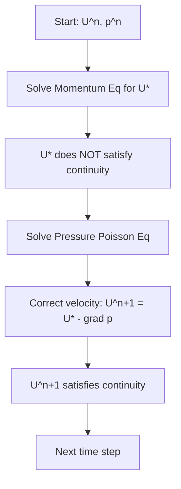
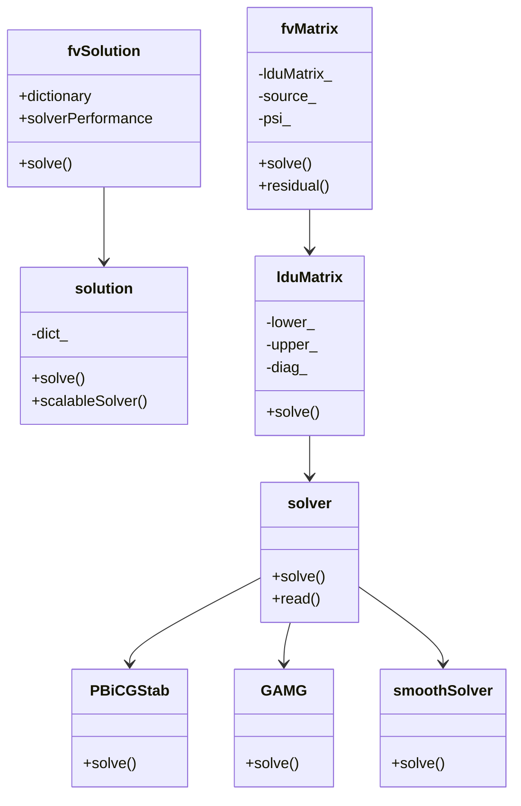
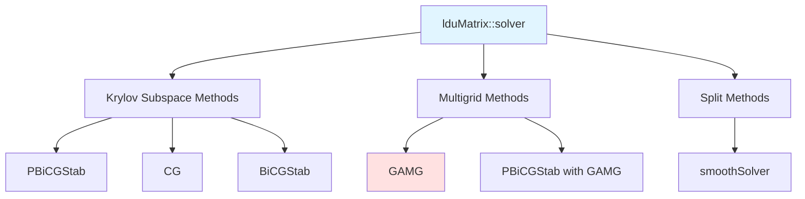

# Pressure-Velocity-Coupling
## HARDCORE Level - 2026-01-03

---

## Table of Contents
- [1. Theory](#1-theory-core-equations--physics)
- [2. Class Hierarchy](#2-openfoam-class-hierarchy--implementation)
- [3. Code Walkthrough](#3-code-walkthrough)
- [4. Dictionary Analysis](#4-dictionary-analysis--configuration)
- [5. Practical Tasks](#5-hands-on-practical-tasks--coding)
- [6. Concept Checks](#6-concept-checks)

---

## 1. Theory: Core Equations & Physics {#1-theory-core-equations--physics}

### 1.1 The Fundamental Challenge

The pressure-velocity coupling problem arises because the **momentum equation** contains pressure gradients, but for incompressible flows, there is **no explicit equation for pressure**. Pressure acts as a Lagrange multiplier that enforces the continuity constraint (mass conservation).

> [!INFO] **Why is this difficult?**
> The pressure field is coupled to velocity through the momentum equation, but velocity must satisfy the continuity equation. This creates a **circular dependency**:
> - Pressure gradient → drives velocity
> - Velocity → must satisfy continuity
> - Continuity → determines pressure

(ปัญหานี้เกิดจากการที่สมการโมเมนตัมมีความดัน แต่สำหรับการไหลแบบอัดตัวไม่ได ไม่มีสมการชัดเจนสำหรับความดัน ความดันทำหน้าที่เป็นตัวคูณ Lagrange ที่บังคับให้เกิดการอนุรักษ์มวล)

---

### 1.2 Governing Equations

#### 1.2.1 Continuity Equation (Mass Conservation)

For incompressible flow ($\rho = \text{constant}$):

$$\nabla \cdot \mathbf{U} = 0$$

Where:
- $\mathbf{U}$ = velocity vector field $[m/s]$
- $\nabla \cdot$ = divergence operator
- This equation states that the **net volume flux** through any control volume is zero

(สมการต่อเนื่อง: อัตราการไหลเข้าและออกต้องสมดุล ไม่มีการสะสมมวล)

#### 1.2.2 Momentum Equation (Navier-Stokes)

$$\frac{\partial \mathbf{U}}{\partial t} + \nabla \cdot (\mathbf{U}\mathbf{U}) = -\frac{1}{\rho}\nabla p + \nu \nabla^2 \mathbf{U} + \mathbf{g}$$

**Term-by-term explanation:**

| Term | Mathematical Form | Physical Meaning |
|------|-------------------|------------------|
| **Unsteady** | $\frac{\partial \mathbf{U}}{\partial t}$ | Local acceleration (rate of change of velocity) |
| **Convection** | $\nabla \cdot (\mathbf{U}\mathbf{U})$ | Nonlinear inertial transport (velocity transporting itself) |
| **Pressure Gradient** | $-\frac{1}{\rho}\nabla p$ | Force driving flow from high to low pressure |
| **Diffusion** | $\nu \nabla^2 \mathbf{U}$ | Viscous forces (momentum diffusion) |
| **Body Force** | $\mathbf{g}$ | Gravitational acceleration |

Where:
- $p$ = pressure $[Pa]$
- $\rho$ = density $[kg/m^3]$
- $\nu$ = kinematic viscosity $[m^2/s]$
- $\mathbf{g}$ = gravitational acceleration $[m/s^2]$

(สมการโมเมนตัม: อธิบายการเปลี่ยนแปลงของโมเมนตัมตามกฎข้อที่สองของนิวตัน)

---

### 1.3 The Pressure-Velocity Coupling Problem

When we discretize the momentum equation to solve for velocity:

$$\mathbf{U}^{n+1} = \mathbf{U}^n + \Delta t \left[ -\nabla \cdot (\mathbf{U}\mathbf{U}) - \frac{1}{\rho}\nabla p + \nu \nabla^2 \mathbf{U} + \mathbf{g} \right]$$

**The critical issue:** The velocity field $\mathbf{U}^{n+1}$ computed from this equation will **NOT** satisfy $\nabla \cdot \mathbf{U}^{n+1} = 0$ unless the pressure field is correct.

> [!WARNING] **The Chicken-and-Egg Problem**
> - To get correct velocity → need correct pressure
> - To get correct pressure → need correct velocity (satisfying continuity)
> - Neither is known initially!

(ปัญหาไก่กับไข่: ต้องการความดันเพื่อหาความเร็ว แต่ต้องการความเร็วที่ต่อเนื่องเพื่อหาความดัน)

---

### 1.4 Solution Approaches

#### 1.4.1 Pressure Poisson Equation

Taking the divergence of the momentum equation and enforcing $\nabla \cdot \mathbf{U} = 0$:

$$\nabla^2 p = \rho \nabla \cdot \left[ -\nabla \cdot (\mathbf{U}\mathbf{U}) + \nu \nabla^2 \mathbf{U} + \mathbf{g} \right] - \frac{\rho}{\Delta t} \nabla \cdot \mathbf{U}^*$$

Where $\mathbf{U}^*$ is the intermediate velocity field.

**Boundary conditions for pressure:**
- Neumann BC: $\frac{\partial p}{\partial n} = 0$ (at walls)
- Dirichlet BC: $p = p_{\text{specified}}$ (at inlets/outlets)

(สมการ Poisson สำหรับความดัน: ได้จากการเอา divergence ของสมการโมเมนตัมและบังคับใช้ continuity)

#### 1.4.2 Operator Splitting Methods

**Projection Method (Chorin's Method):**



**Mathematical formulation:**

1. **Predictor step** (intermediate velocity):
   $$\frac{\mathbf{U}^* - \mathbf{U}^n}{\Delta t} = -\nabla \cdot (\mathbf{U}^n\mathbf{U}^n) + \nu \nabla^2 \mathbf{U}^n + \mathbf{g}$$

2. **Corrector step** (pressure projection):
   $$\mathbf{U}^{n+1} = \mathbf{U}^* - \frac{\Delta t}{\rho} \nabla p^{n+1}$$

3. **Pressure equation** (enforcing continuity):
   $$\nabla^2 p^{n+1} = \frac{\rho}{\Delta t} \nabla \cdot \mathbf{U}^*$$

(วิธี Projection: แบ่งเป็นขั้นตอนการทำนายและการแก้ไข เพื่อให้ความเร็วตอบสนองต่อสมการต่อเนื่อง)

---

### 1.5 Key Numerical Challenges

> [!TIP] **Staggered Grid Approach**
> On a **collocated grid** (all variables at same cell centers), pressure-velocity coupling can lead to **checkerboard oscillations**. The solution:
> - Store pressure at cell centers
> - Store velocity components at cell faces
> - This naturally enforces continuity coupling

(ตาข่าย Staggered: เก็บความดันที่จุดศูนย์กลางเซลล์ และความเร็วที่ผนังเซลล์ เพื่อป้องกันปัญหา checkerboard)

#### 1.5.1 The Rhie-Chow Interpolation

For collocated arrangements, the **Rhie-Chow interpolation** prevents pressure-velocity decoupling:

$$\mathbf{U}_f = \overline{\mathbf{U}}_f - \Delta_f \left( \overline{\frac{\nabla p}{\rho}}_f - \frac{\nabla p_f}{\rho} \right)$$

Where:
- $\mathbf{U}_f$ = face velocity
- $\overline{\mathbf{U}}_f$ = linearly interpolated cell-centered velocity
- $\Delta_f$ = geometric coefficient
- This adds a **pressure difference term** to couple adjacent pressure nodes

(การแทรก Rhie-Chow: เพิ่มเทอมความต่างความดันเพื่อเชื่อมโยงโหนดความดันที่ติดกัน)

#### 1.5.2 Under-Relaxation Factors

For steady-state solutions using iterative methods:

$$\phi^{n+1} = \phi^n + \alpha_\phi (\phi^* - \phi^n)$$

Typical values:
- $\alpha_U = 0.5 - 0.7$ (velocity under-relaxation)
- $\alpha_p = 0.3 - 0.5$ (pressure under-relaxation)

> [!WARNING] **Too high relaxation** → solution divergence
> **Too low relaxation** → very slow convergence

(ปัจจัย under-relaxation: ควบคุมอัตราการเปลี่ยนแปลงของตัวแปรในแต่ละรอบการวนซ้ำ)

---

### 1.6 Summary of Key Equations

| Equation | Form | Purpose |
|----------|------|---------|
| **Continuity** | $\nabla \cdot \mathbf{U} = 0$ | Mass conservation constraint |
| **Momentum** | $\frac{\partial \mathbf{U}}{\partial t} + \nabla \cdot (\mathbf{U}\mathbf{U}) = -\frac{1}{\rho}\nabla p + \nu \nabla^2 \mathbf{U} + \mathbf{g}$ | Newton's 2nd law for fluid |
| **Pressure Poisson** | $\nabla^2 p = \frac{\rho}{\Delta t} \nabla \cdot \mathbf{U}^*$ | Enforces continuity |
| **Velocity Correction** | $\mathbf{U}^{n+1} = \mathbf{U}^* - \frac{\Delta t}{\rho} \nabla p^{n+1}$ | Projects onto divergence-free field |

(สรุปสมการสำคัญ: การอนุรักษ์มวล สมการโมเมนตัม สมการความดัน Poisson และการแก้ไขความเร็ว)

---

## 2. OpenFOAM Class Hierarchy & Implementation {#2-openfoam-class-hierarchy--implementation}

### 2.1 Core Class Hierarchy

OpenFOAM's pressure-velocity coupling implementation centers around the **finite volume discretization** framework and **solution algorithms**. The key classes form a hierarchy that handles:

1. **Linear equation systems** (matrix representation)
2. **Solution algorithms** (iterative solvers)
3. **Pressure-velocity coupling** (PISO, SIMPLE, PIMPLE)
4. **Boundary conditions** (fvPatchFields)



> [!INFO] **Class Organization**
> The `fvSolution` class is the main entry point for solving finite volume equations. It manages solver settings and controls the solution loop for pressure-velocity coupling algorithms.

(โครงสร้างคลาส: `fvSolution` เป็นจุดเริ่มต้นหลักในการแก้สมการ จัดการการตั้งค่า solver และควบคุมวงจรการแก้ปัญหา)

---

### 2.2 Pressure-Velocity Coupling Algorithms

OpenFOAM implements three primary algorithms for handling pressure-velocity coupling:

#### 2.2.1 PISO (Pressure Implicit with Splitting of Operators)

**Location:** `$FOAM_SRC/finiteVolume/fvSolution/fvSolution.C`

```cpp
// PISO algorithm structure (simplified)
while (piso.correct())
{
    // 1. Solve momentum equation
    solve(fvm::ddt(U) + fvm::div(phi, U) - fvm::laplacian(nu, U) == -fvc::grad(p));
    
    // 2. Correct boundary conditions
    U.correctBoundaryConditions();
    
    // 3. Solve pressure equation
    solve(fvm::laplacian(rAU, p) == fvc::div(phi));
    
    // 4. Correct flux
    phi -= fvc::flux(rAU * fvc::grad(p));
    
    // 5. Correct velocity
    U -= rAU * fvc::grad(p);
    U.correctBoundaryConditions();
}
```

**Key Classes:**
- `pisoControl`: `$FOAM_SRC/finiteVolume/fvSolution/pisoControl.H`
- `pisoLoop`: Controls the PISO correction loop

(อัลกอริทึม PISO: แบ่งการดำเนินการเป็นขั้นตอนการทำนายและแก้ไข ใช้สำหรับการไหลแบบไม่สมมาตร)

#### 2.2.2 SIMPLE (Semi-Implicit Method for Pressure-Linked Equations)

**Location:** `$FOAM_SRC/finiteVolume/fvSolution/fvSolution.C`

```cpp
// SIMPLE algorithm structure (simplified)
while (simple.correct())
{
    // 1. Solve momentum equation (under-relaxed)
    solve(fvm::ddt(U) + fvm::div(phi, U) - fvm::laplacian(nu, U) == -fvc::grad(p));
    
    // 2. Under-relax velocity
    U.relax();
    
    // 3. Solve pressure equation
    solve(fvm::laplacian(rAU, p) == fvc::div(phi));
    
    // 4. Under-relax pressure
    p.relax();
    
    // 5. Correct flux
    phi -= fvc::flux(rAU * fvc::grad(p));
    
    // 6. Correct velocity
    U -= rAU * fvc::grad(p);
    U.correctBoundaryConditions();
}
```

**Key Classes:**
- `simpleControl`: `$FOAM_SRC/finiteVolume/fvSolution/simpleControl.H`
- `simpleLoop`: Controls the SIMPLE iteration loop

(อัลกอริทึม SIMPLE: ใช้ under-relaxation เพื่อความเสถียรในการแก้ปัญหาสถานะคงที่)

#### 2.2.3 PIMPLE (PISO + SIMPLE)

**Location:** `$FOAM_SRC/finiteVolume/fvSolution/pimpleControl.H`

```cpp
// PIMPLE combines PISO and SIMPLE
while (pimple.loop())
{
    // Outer time loop
    #include "UEqn.H"
    
    // Pressure-velocity correction
    while (pimple.correct())
    {
        // PISO-like corrections
        // Can also include SIMPLE under-relaxation
    }
}
```

**Key Classes:**
- `pimpleControl`: `$FOAM_SRC/finiteVolume/fvSolution/pimpleControl.H`
- `pimpleNoLoopControl`: For steady-state cases

(อัลกอริทึม PIMPLE: รวม PISO และ SIMPLE เข้าด้วยกัน ยืดหยุ่นสำหรับทั้ง steady และ unsteady)

---

### 2.3 Finite Volume Matrix Classes

#### 2.3.1 fvMatrix Class

**Location:** `$FOAM_SRC/finiteVolume/finiteVolume/fvMatrix/fvMatrix.H`

The `fvMatrix` class represents a discretized equation in the finite volume method:

```cpp
template<class Type>
class fvMatrix
:
    public lduMatrix,
    public refCount
{
    // Private data
    
        //- Field to solve for
        GeometricField<Type, fvPatchField, volMesh>& psi_;
        
        //- Source term
        Field<Type> source_;
        
        //- Reference to mesh
        const fvMesh& mesh_;
        
    
    // Member functions
        
        //- Solve the matrix
        solverPerformance solve
        (
            const dictionary&
        );
        
        //- Return residual
        tmp<Field<Type>> residual() const;
};
```

> [!TIP] **fvMatrix Operations**
> OpenFOAM uses operator overloading for intuitive equation construction:
> - `fvm::ddt(U)` - Time derivative (implicit)
> - `fvm::div(phi, U)` - Convection term (implicit)
> - `fvc::grad(p)` - Pressure gradient (explicit)
> - `fvm::laplacian(nu, U)` - Diffusion term (implicit)

(การดำเนินการ fvMatrix: ใช้ operator overloading เพื่อให้เขียนสมการได้ใกล้เคียงรูปแบบคณิตศาสตร์)

#### 2.3.2 fvm vs fvc

| Aspect | fvm (finite volume method) | fvc (finite volume calculus) |
|--------|---------------------------|------------------------------|
| **Treatment** | Implicit (matrix coefficients) | Explicit (evaluated field) |
| **Usage** | Time derivatives, diffusion, convection | Gradients, divergences, interpolations |
| **Result** | Adds to matrix diagonal/off-diagonal | Creates source term |
| **Example** | `fvm::ddt(U)`, `fvm::laplacian(nu, U)` | `fvc::grad(p)`, `fvc::div(phi)` |

(ความแตกต่าง fvm กับ fvc: fvm สร้างเมทริกซ์ implicit ส่วน fvc คำนวณ explicit)

---

### 2.4 Linear Solver Hierarchy

**Location:** `$FOAM_SRC/OpenFOAM/matrices/lduMatrix/solvers/`

OpenFOAM provides a hierarchy of linear solvers for solving the pressure Poisson equation:



#### 2.4.1 Key Solver Classes

**PBiCGStab (Preconditioned Bi-Conjugate Gradient Stabilized):**
```cpp
// Location: $FOAM_SRC/OpenFOAM/matrices/lduMatrix/solvers/PBiCGStab/PBiCGStab.H
template<class Type, class DType, class LUType>
class PBiCGStab
:
    public LduMatrix<Type, DType, LUType>::solver
{
    // - Stabilized bi-conjugate gradient
    // - Suitable for non-symmetric matrices
    // - Often used for momentum equations
};
```

**GAMG (Geometric-Algebraic Multi-Grid):**
```cpp
// Location: $FOAM_SRC/OpenFOAM/matrices/lduMatrix/solvers/GAMG/GAMG.H
template<class Type, class DType, class LUType>
class GAMG
:
    public LduMatrix<Type, DType, LUType>::solver
{
    // - Multi-grid acceleration
    // - Very fast for Poisson-type equations
    // - Default for pressure equation
};
```

> [!INFO] **Solver Selection**
> - **Pressure equation**: GAMG (fast convergence for elliptic equations)
> - **Momentum equation**: PBiCGStab (handles non-symmetric convection)
> - **Scalar transport**: smoothSolver (simple, robust)

(การเลือก Solver: GAMG สำหรับสมการ Poisson, PBiCGStab สำหรับโมเมนตัม)

---

### 2.5 Boundary Condition Classes

#### 2.5.1 Pressure Boundary Conditions

**Location:** `$FOAM_SRC/finiteVolume/fields/fvPatchFields/`

| Boundary Condition | Class | Description |
|-------------------|-------|-------------|
| **Fixed value** | `fixedValueFvPatchField` | Dirichlet BC: $p = p_{\text{specified}}$ |
| **Zero gradient** | `zeroGradientFvPatchField` | Neumann BC: $\frac{\partial p}{\partial n} = 0$ |
| **Fixed flux** | `fixedFluxPressureFvPatchField` | Adjusts pressure to match specified flux |
| **Total pressure** | `totalPressureFvPatchField` | $p_0 = p + \frac{1}{2}\rho|\mathbf{U}|^2$ |

(เงื่อนไขขอบเขตความดัน: มีหลายประเภทขึ้นกับสภาพการไหล)

#### 2.5.2 Velocity Boundary Conditions

| Boundary Condition | Class | Description |
|-------------------|-------|-------------|
| **No-slip** | `noSlip` | $\mathbf{U} = 0$ at walls |
| **Free stream** | `freestreamFvPatchField` | Fixed value in far-field |
| **Inlet outlet** | `inletOutletFvPatchField` | Switches between inlet/outlet based on flow direction |
| **Wall function** | `wallFunction` | Uses wall functions for near-wall treatment |

(เงื่อนไขขอบเขตความเร็ว: กำหนดพฤติกรรมความเร็วที่ผนังและขอบเขต)

---

### 2.6 Source File Reference Map

```
$FOAM_SRC/
├── finiteVolume/
│   ├── fvSolution/
│   │   ├── fvSolution.H/.C           # Main solution control
│   │   ├── pisoControl.H/.C          # PISO algorithm
│   │   ├── simpleControl.H/.C        # SIMPLE algorithm
│   │   └── pimpleControl.H/.C        # PIMPLE algorithm
│   ├── fvMatrix/
│   │   └── fvMatrix.H/.C             # Finite volume matrix
│   ├── fvm/
│   │   ├── ddt/
│   │   ├── div/
│   │   └── laplacian/                # Implicit operators
│   └── fvc/
│       ├── grad/
│       ├── div/
│       └── snGrad/                   # Explicit operators
├── OpenFOAM/
│   └── matrices/
│       └── lduMatrix/
│           ├── solvers/
│           │   ├── PBiCGStab/
│           │   ├── GAMG/
│           │   └── smoothSolver/
│           └── lduMatrix.H/.C        # Base matrix class
└── db/
    └── runTimeSelection/
        └── runTimeSelectionTables.H  # Runtime selection mechanism
```

> [!TIP] **Runtime Selection**
> OpenFOAM uses a runtime selection mechanism that allows solvers and algorithms to be chosen at runtime through dictionary files (`fvSolution`, `fvSchemes`), without recompilation.

(กลไก Runtime Selection: ให้เลือก solver และอัลกอริทึมได้ขณะรันโดยไม่ต้องคอมไพล์ใหม่)

---

### 2.7 Key Class Relationships Summary

| Class | Responsibility | Source Location |
|-------|----------------|-----------------|
| **fvSolution** | Top-level solution control | `finiteVolume/fvSolution/` |
| **pisoControl** | PISO algorithm management | `finiteVolume/fvSolution/` |
| **simpleControl** | SIMPLE algorithm management | `finiteVolume/fvSolution/` |
| **pimpleControl** | PIMPLE algorithm management | `finiteVolume/fvSolution/` |
| **fvMatrix** | Discretized equation representation | `finiteVolume/fvMatrix/` |
| **lduMatrix** | Linear matrix operations | `OpenFOAM/matrices/lduMatrix/` |
| **solver** | Linear solver base class | `OpenFOAM/matrices/lduMatrix/solvers/` |
| **GAMG** | Multi-grid solver | `OpenFOAM/matrices/lduMatrix/solvers/GAMG/` |
| **PBiCGStab** | Krylov subspace solver | `OpenFOAM/matrices/lduMatrix/solvers/PBiCGStab/` |

(สรุปความสัมพันธ์คลาส: แต่ละคลาสมีหน้าที่เฉพาะในกระบวนการแก้ปัญหา pressure-velocity coupling)

---

## 3. Code Walkthrough {#3-code-walkthrough}

### 3.1 UEqn.H

The `UEqn.H` file constructs the momentum equation for incompressible flow. It is typically included in the main solver loop before the pressure-velocity correction.

**Typical UEqn.H structure:**

```cpp
// Solve the Momentum equation

tmp<fvVectorMatrix> UEqn
(
    fvm::ddt(U)
  + fvm::div(phi, U)
  - fvm::laplacian(nu, U)
 ==
    fvOptions(U)
);

UEqn.relax();

fvOptions.constrain(UEqn);

if (pimple.momentumPredictor())
{
    solve(UEqn == -fvc::grad(p));
}
```

**Explanation:**

1. **Matrix construction** - Creates a temporary `fvVectorMatrix` containing:
   - `fvm::ddt(U)` - Unsteady term (implicit)
   - `fvm::div(phi, U)` - Convection term (implicit)
   - `fvm::laplacian(nu, U)` - Diffusion term (implicit)
   - `fvOptions(U)` - Source terms from fvOptions (e.g., porosity, momentum sources)

2. **Under-relaxation** - `UEqn.relax()` applies under-relaxation to stabilize convergence for steady-state or transient cases

3. **Constrain sources** - `fvOptions.constrain()` applies additional constraints from fvOptions

4. **Momentum predictor** - If enabled, solves the momentum equation with the pressure gradient as an explicit source term (`-fvc::grad(p)`)

> [!TIP] **Implicit vs Explicit**
> - `fvm::` operators add coefficients to the matrix (implicit treatment)
> - `fvc::` operators evaluate the field directly (explicit treatment)
> - Pressure gradient is explicit because pressure is unknown at this stage

(UEqn.H: สร้างสมการโมเมนตัมโดยใช้ fvm สำหรับเทอม implicit และ fvc สำหรับเทอม explicit ความดัน)

---

### 3.2 pEqn.H

The `pEqn.H` file constructs and solves the pressure equation to enforce continuity (mass conservation). This is the core of the pressure-velocity coupling algorithm.

**Typical pEqn.H structure:**

```cpp
// Solve the Pressure equation

volScalarField rAU(1.0/UEqn.A());
volVectorField HbyA(constrainHbyA(rAU*UEqn.H(), U, p));
surfaceScalarField phiHbyA("phiHbyA", fvc::flux(HbyA));

// Adjust flux for non-orthogonal correction
MRF.makeRelative(fvc::flux(HbyA));

// Pressure reference (for incompressible)
if (p.needReference())
{
    p += dimensionedScalar("pRef", p.dimensions(), pRefValue);
    p.correctBoundaryConditions();
}

// PISO loop
while (piso.correct())
{
    // Pressure equation
    fvScalarMatrix pEqn
    (
        fvm::laplacian(rAU, p) == fvc::div(phiHbyA)
    );

    pEqn.setReference(pRefCell, pRefValue);
    pEqn.solve();

    // Correct flux
    phi = phiHbyA - pEqn.flux();

    // Correct velocity
    U = HbyA - rAU*fvc::grad(p);
    U.correctBoundaryConditions();
}
```

**Explanation:**

1. **Matrix coefficients** - `rAU` stores the inverse diagonal coefficients from the momentum equation (`1.0/UEqn.A()`), representing the influence of velocity on pressure

2. **HbyA construction** - Creates the intermediate velocity field `HbyA = H/U`, where `H` contains all explicit terms from the momentum equation except the pressure gradient

3. **Flux calculation** - `phiHbyA` computes the face flux based on the intermediate velocity field

4. **Pressure reference** - For incompressible flows, pressure is relative; a reference cell and value are needed to ensure a unique solution

5. **PISO loop** - Multiple corrections per time step:
   - Solves the pressure Poisson equation: `∇²(p) = ∇·(HbyA)`
   - Corrects the flux: `φ = φ_HbyA - ∇p`
   - Corrects the velocity: `U = HbyA - rAU·∇p`

> [!INFO] **Why Multiple Corrections?**
> The PISO loop performs 2-4 corrections per time step to tighten the pressure-velocity coupling. Each correction improves mass conservation, especially important for:
> - Large time steps
> - High Courant numbers
> - Complex geometries with non-orthogonal meshes

(pEqn.H: แก้สมการความดัน Poisson เพื่อบังคับใช้การอนุรักษ์มวล และแก้ไขความเร็วให้สอดคล้องกับความดันใหม่)

---

### 3.3 createFields.H

The `createFields.H` file is responsible for creating and initializing all the field variables required for the simulation. This file is typically included at the beginning of the solver's `main()` function.

**Typical createFields.H structure:**

```cpp
// Create velocity field
Info<< "Reading field U\n" << endl;
volVectorField U
(
    IOobject
    (
        "U",
        runTime.timeName(),
        mesh,
        IOobject::MUST_READ,
        IOobject::AUTO_WRITE
    ),
    mesh
);

// Create pressure field
Info<< "Reading field p\n" << endl;
volScalarField p
(
    IOobject
    (
        "p",
        runTime.timeName(),
        mesh,
        IOobject::MUST_READ,
        IOobject::AUTO_WRITE
    ),
    mesh
);

// Create transport properties
IOdictionary transportProperties
(
    IOobject
    (
        "transportProperties",
        runTime.constant(),
        mesh,
        IOobject::MUST_READ_IF_MODIFIED,
        IOobject::NO_WRITE
    )
);

dimensionedScalar nu
(
    "nu",
    dimViscosity,
    transportProperties
);

// Create flux field
surfaceScalarField phi
(
    IOobject
    (
        "phi",
        runTime.timeName(),
        mesh,
        IOobject::READ_IF_PRESENT,
        IOobject::AUTO_WRITE
    ),
    fvc::flux(U)
);
```

**Explanation:**

1. **Field creation** - Each field is created using the `IOobject` class that specifies:
   - Field name (e.g., "U", "p")
   - Time directory (from `runTime.timeName()`)
   - Mesh reference
   - Read/write flags (`MUST_READ`, `AUTO_WRITE`)

2. **Velocity field** - `volVectorField U` reads the velocity field from the time directory (e.g., `0/U`)

3. **Pressure field** - `volScalarField p` reads the pressure field from the time directory (e.g., `0/p`)

4. **Transport properties** - `IOdictionary` reads physical properties from `constant/transportProperties`, including kinematic viscosity (`nu`)

5. **Flux field** - `surfaceScalarField phi` represents the volumetric flux ($\phi = \mathbf{U} \cdot \mathbf{S}_f$) at cell faces, computed from the velocity field using `fvc::flux(U)`

> [!TIP] **Field Registration**
> All fields are automatically registered with the mesh database. This allows OpenFOAM to:
> - Manage field I/O operations
> - Track field dependencies
> - Apply boundary conditions consistently
> - Handle field interpolation between cell centers and faces

(createFields.H: สร้างและเริ่มต้นฟิลด์ต่างๆ ที่จำเป็นสำหรับการจำลอง เช่น ความเร็ว ความดัน และคุณสมบัติการขนส่ง)

---

## 4. Dictionary Analysis & Configuration {#4-dictionary-analysis--configuration}

### 4.1 fvSchemes Analysis

The `fvSchemes` dictionary in the `system/` directory specifies the discretization schemes used for the finite volume method. It controls how temporal derivatives, spatial gradients, divergences, and Laplacians are approximated.

#### 4.1.1 ddtSchemes (Time Derivative Schemes)

**Purpose:** Discretization of the unsteady term $\frac{\partial \phi}{\partial t}$

**Common schemes:**
- **Euler** - First-order explicit: $\frac{\phi^{n+1} - \phi^n}{\Delta t}$
- **backward** - Second-order implicit: $\frac{3\phi^{n+1} - 4\phi^n + \phi^{n-1}}{2\Delta t}$
- **CrankNicolson** - Second-order implicit: $\frac{\phi^{n+1} - \phi^n}{\Delta t} = \theta \mathcal{L}(\phi^{n+1}) + (1-\theta)\mathcal{L}(\phi^n)$

**Example configuration:**
```cpp
ddtSchemes
{
    default         backward;
}
```

> [!TIP] **Scheme Selection**
> - **Euler**: Fast but less accurate, suitable for initial testing
> - **backward**: Better accuracy for transient simulations, requires more storage
> - **CrankNicolson**: Most accurate (second-order), but can cause oscillations if $\theta < 1$

(รูปแบบการเปลี่ยนแปลงตามเวลา: Euler ใช้สำหรับการทดสอบ backward ให้ความแม่นยำดีขึ้น CrankNicolson แม่นยำที่สุดแต่อาจเกิดการสั่น)

#### 4.1.2 gradSchemes (Gradient Schemes)

**Purpose:** Discretization of the gradient $\nabla \phi$ at cell centers and faces

**Common schemes:**
- **Gauss linear** - Second-order using Gauss theorem with linear interpolation
- **Gauss upwind** - First-order upwind-biased
- **leastSquares** - Least-squares reconstruction (second-order on arbitrary meshes)
- **fourthOrder** - Fourth-order accurate (requires structured meshes)

**Example configuration:**
```cpp
gradSchemes
{
    default         Gauss linear;
    grad(p)         Gauss linear;
    grad(U)         Gauss linear;
}
```

> [!INFO] **Gauss Theorem Application**
> The Gauss scheme applies the divergence theorem:
> $$\int_V \nabla \phi \, dV = \oint_S \phi \, \mathbf{dS}$$
> The face values $\phi_f$ are obtained by interpolation from cell centers.

(รูปแบบการคำนวณเกรเดียนต์: Gauss linear ใช้ทฤษฎีเรียกว่า Gauss กับการแทรกแบบเส้นตรง)

#### 4.1.3 divSchemes (Divergence Schemes)

**Purpose:** Discretization of the convection term $\nabla \cdot (\mathbf{U} \phi)$

**Common schemes:**
- **Gauss upwind** - First-order, unconditionally stable but diffusive
- **Gauss linear** - Second-order central differencing (unstable for high Re)
- **Gauss linearUpwind** - Second-order upwind (more stable than linear)
- **Gauss vanLeer** - TVD scheme with flux limiter (good compromise)
- **Gauss QUICK** - Quadratic upwind (third-order on uniform grids)

**Example configuration:**
```cpp
divSchemes
{
    default         none;
    div(phi,U)      Gauss linearUpwind grad(U);
    div(phi,k)      Gauss upwind;
    div(phi,epsilon) Gauss upwind;
}
```

> [!WARNING] **Stability vs Accuracy Trade-off**
> - **Upwind**: Very stable but numerically diffusive (smears sharp gradients)
> - **Linear**: Accurate but can cause unphysical oscillations (wiggles)
> - **TVD schemes** (vanLeer, limitedLinear): Best compromise for most flows

(รูปแบบการคำนวณเทอม convection: upwind เสถียรแต่ diffusive linear แม่นยำแต่อาจสั่น TVD คือคอมโพรมีส์ที่ดี)

#### 4.1.4 laplacianSchemes (Laplacian Schemes)

**Purpose:** Discretization of the diffusion term $\nabla \cdot (\Gamma \nabla \phi)$

**Common schemes:**
- **Gauss linear corrected** - Second-order with non-orthogonal correction
- **Gauss linear uncorrected** - Second-order without correction (faster but less accurate)
- **Gauss fourthOrder** - Fourth-order accurate (structured meshes only)

**Example configuration:**
```cpp
laplacianSchemes
{
    default         Gauss linear corrected;
    laplacian(nu,U) Gauss linear corrected;
    laplacian((1|A(U)),p) Gauss linear corrected;
}
```

> [!TIP] **Non-Orthogonal Correction**
> For non-orthogonal meshes, the `corrected` scheme adds an explicit correction term:
> $$\nabla \phi \cdot \mathbf{S}_f = |\mathbf{S}_f| \left( \frac{\phi_P - \phi_N}{d_{PN}} + \text{correction} \right)$$
> This improves accuracy on skewed meshes but may require under-relaxation.

(รูปแบบการคำนวณเทอม diffusion: corrected ใช้สำหรับ mesh ที่ไม่ตั้งฉาก เพิ่มความแม่นยำ)

#### 4.1.5 interpolationSchemes

**Purpose:** Interpolation of cell-centered values to face centers

**Common schemes:**
- **linear** - Linear interpolation (second-order)
- **linearUpwind** - Upwind-biased linear interpolation
- **cubic** - Cubic polynomial interpolation (fourth-order)

**Example configuration:**
```cpp
interpolationSchemes
{
    default         linear;
}
```

#### 4.1.6 snGradSchemes (Surface Normal Gradient Schemes)

**Purpose:** Calculation of the surface-normal gradient $\nabla \phi \cdot \mathbf{n}$ at cell faces

**Common schemes:**
- **corrected** - Includes non-orthogonal correction
- **uncorrected** - Simple orthogonal difference

**Example configuration:**
```cpp
snGradSchemes
{
    default         corrected;
}
```

> [!INFO] **Complete fvSchemes Example**
> ```cpp
> FoamFile
> {
>     version     2.0;
>     format      ascii;
>     class       dictionary;
>     location    "system";
>     object      fvSchemes;
> }
> // * * * * * * * * * * * * * * * * * * * * * * * * * * * * * * * * * * * * * //
> 
> ddtSchemes
> {
>     default         backward;
> }
> 
> gradSchemes
> {
>     default         Gauss linear;
> }
> 
> divSchemes
> {
>     default         none;
>     div(phi,U)      Gauss linearUpwind grad(U);
>     div(phi,k)      Gauss upwind;
>     div(phi,epsilon) Gauss upwind;
> }
> 
> laplacianSchemes
> {
>     default         Gauss linear corrected;
> }
> 
> interpolationSchemes
> {
>     default         linear;
> }
> 
> snGradSchemes
> {
>     default         corrected;
> }
> ```

<!-- PLACEHOLDER_FVSOLUTION -->

---

## 5. Hands-on: Practical Tasks & Coding {#5-hands-on-practical-tasks--coding}

<!-- PLACEHOLDER_TASKS -->

---

## 6. Concept Checks {#6-concept-checks}

<!-- PLACEHOLDER_CHECKS -->

---

## Recommended Reading

- OpenFOAM User Guide: https://www.openfoam.com/documentation/user-guide
- OpenFOAM Programmer's Guide: https://doc.openfoam.com/
- CFD Online Forum: https://www.cfd-online.com/Forums/openfoam/

