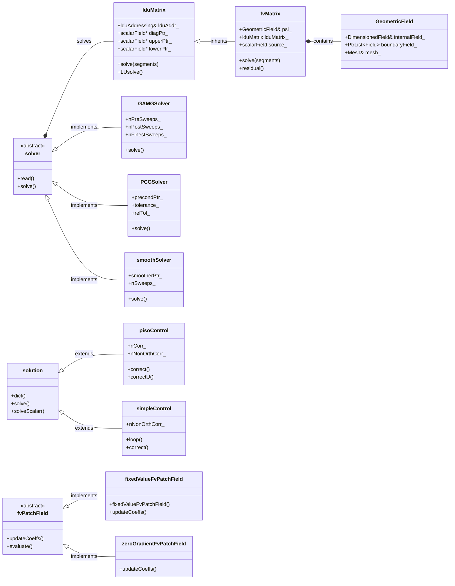
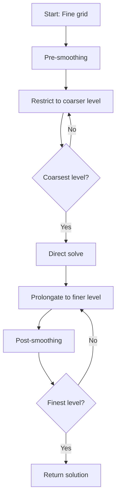
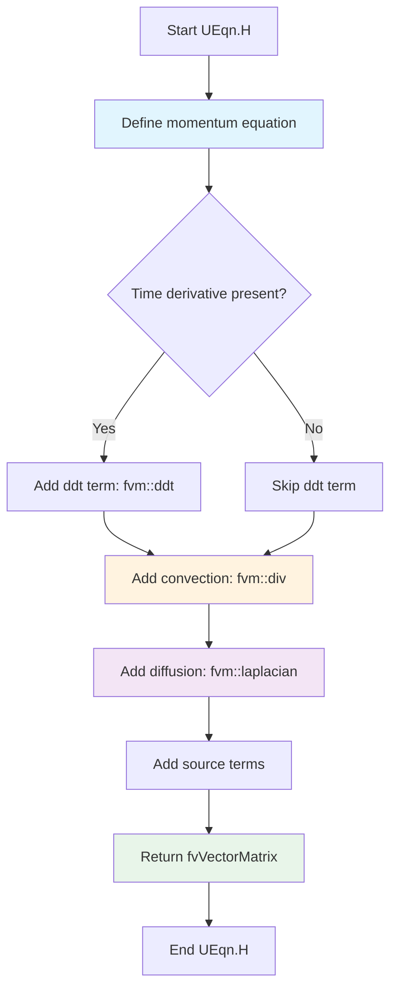
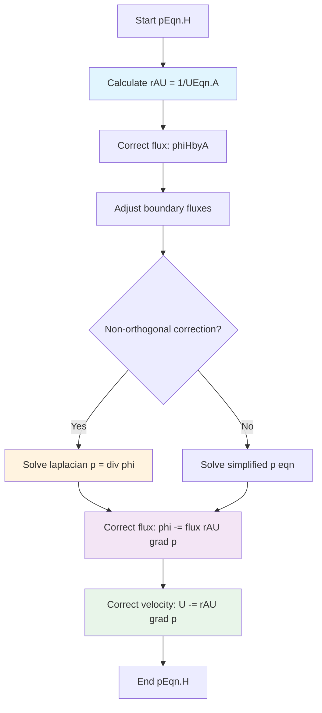

# Pressure-Velocity-Coupling
## HARDCORE Level - 2026-01-03

---

## Table of Contents
- [1. Theory](#1-theory-core-equations--physics)
- [2. Class Hierarchy](#2-openfoam-class-hierarchy--implementation)
- [3. Code Walkthrough](#3-code-walkthrough)
- [4. Dictionary Analysis](#4-dictionary-analysis--configuration)
- [5. Practical Tasks](#5-hands-on-practical-tasks--coding)
- [6. Concept Checks](#6-concept-checks)

---

## 1. Theory: Core Equations & Physics {#1-theory-core-equations--physics}

### 1.1 The Fundamental Challenge

The pressure-velocity coupling problem arises because the momentum equation contains both velocity and pressure, but there is **no explicit equation for pressure** in the Navier-Stokes equations. Pressure acts as a Lagrange multiplier that enforces the continuity constraint (mass conservation).

> [!INFO] **Why is this difficult?**
> In incompressible flows, pressure is not governed by an equation of state. Instead, pressure must adjust itself instantaneously to ensure that the velocity field remains divergence-free. This creates a tight coupling between pressure and velocity that requires special numerical treatment.

### 1.2 Governing Equations

#### Continuity Equation (Mass Conservation)

$$\nabla \cdot \mathbf{U} = 0$$

Where:
- $\mathbf{U}$ is the velocity vector $[m/s]$
- $\nabla \cdot$ is the divergence operator
- For incompressible flow, density $\rho$ is constant and cancels out

#### Momentum Equation (Newton's Second Law)

$$\frac{\partial \mathbf{U}}{\partial t} + \nabla \cdot (\mathbf{U}\mathbf{U}) = -\frac{1}{\rho}\nabla p + \nu \nabla^2 \mathbf{U} + \mathbf{g}$$

Where:
- $\frac{\partial \mathbf{U}}{\partial t}$ = Unsteady term (temporal acceleration)
- $\nabla \cdot (\mathbf{U}\mathbf{U})$ = Convective term (nonlinear inertial forces)
- $-\frac{1}{\rho}\nabla p$ = Pressure gradient force (drives flow)
- $\nu \nabla^2 \mathbf{U}$ = Viscous diffusion term ($\nu = \mu/\rho$ is kinematic viscosity)
- $\mathbf{g}$ = Body forces (e.g., gravity)

> [!TIP] **Physical Interpretation**
> The pressure gradient term $-\nabla p$ represents the force that fluid particles exert on each other. It's the mechanism by which pressure information propagates throughout the domain to enforce mass conservation.

### 1.3 The Pressure-Velocity Coupling Problem

If we discretize the momentum equation to solve for velocity:

$$\mathbf{U}^{n+1} = \mathbf{U}^n + \Delta t \left[ -\nabla \cdot (\mathbf{U}\mathbf{U}) + \nu \nabla^2 \mathbf{U} - \frac{1}{\rho}\nabla p^{n+1} + \mathbf{g} \right]$$

**The dilemma:**
- To compute $\mathbf{U}^{n+1}$, we need $p^{n+1}$
- To find $p^{n+1}$, we need $\mathbf{U}^{n+1}$ (to satisfy continuity)
- Neither can be computed independently!

### 1.4 Solution Approaches

#### 1.4.1 Pressure Poisson Equation (PPE)

Taking the divergence of the momentum equation and enforcing $\nabla \cdot \mathbf{U}^{n+1} = 0$:

$$\nabla^2 p^{n+1} = \frac{\rho}{\Delta t} \nabla \cdot \mathbf{U}^* + \rho \nabla \cdot \left[ \nabla \cdot (\mathbf{U}\mathbf{U}) - \nu \nabla^2 \mathbf{U} \right]$$

Where $\mathbf{U}^*$ is the intermediate velocity field.

**Key insight:** This transforms the coupling problem into a Poisson equation for pressure, which can be solved iteratively.

#### 1.4.2 Operator Splitting (Projection Methods)

The fractional-step approach:
1. **Predictor step:** Compute intermediate velocity $\mathbf{U}^*$ without pressure
2. **Corrector step:** Project $\mathbf{U}^*$ onto divergence-free space using pressure

$$\mathbf{U}^{n+1} = \mathbf{U}^* - \frac{\Delta t}{\rho} \nabla p^{n+1}$$

> [!WARNING] **Boundary Conditions Matter**
> The pressure Poisson equation requires consistent boundary conditions. Common approaches include:
> - **Neumann BCs:** $\frac{\partial p}{\partial n} = 0$ (zero normal pressure gradient)
> - **Dirichlet BCs:** Specified pressure at outlets
> Incorrect BC specification leads to "checkerboard" pressure oscillations.

### 1.5 Collocated vs. Staggered Grids

#### Staggered Grid (Harlow & Welch, 1965)
- Velocities and pressure stored at different locations
- Velocities at cell faces, pressure at cell centers
- **Advantage:** Naturally prevents pressure-velocity decoupling
- **Disadvantage:** Complex interpolation required

#### Collocated Grid (Rhie & Chow, 1983)
- All variables stored at cell centers
- Requires special interpolation (Rhie-Chow) to prevent checkerboarding
- **Advantage:** Simpler data structure
- **Disadvantage:** Additional numerical dissipation

> [!INFO] **OpenFOAM Approach**
> OpenFOAM uses a **collocated grid arrangement** with the Rhie-Chow interpolation technique implemented through the `fvc::div`, `fvc::grad`, and `fvm::laplacian` operators.

### 1.6 Mathematical Properties

The pressure Poisson equation has the form:

$$\nabla^2 p = f$$

This is an **elliptic partial differential equation** with these properties:

| Property | Description | Physical Meaning |
|----------|-------------|------------------|
| **Existence** | Solution exists if $\int_\Omega f \, dV = 0$ | Global mass conservation |
| **Uniqueness** | Solution unique up to an additive constant | Pressure defined relative to reference |
| **Smoothness** | Solution is infinitely differentiable | Pressure field is smooth |

> [!TIP] **Numerical Implication**
> The elliptic nature means pressure information propagates **instantaneously** throughout the entire domain (in the mathematical limit). This requires global solution methods (iterative solvers with preconditioning).

### 1.7 Non-Dimensionalization

Reynolds number characterizes the flow regime:

$$Re = \frac{UL}{\nu} = \frac{\text{Inertial Forces}}{\text{Viscous Forces}}$$

Where:
- $U$ = characteristic velocity
- $L$ = characteristic length
- $\nu$ = kinematic viscosity

**Impact on coupling:**
- **High Re:** Convection dominates → pressure correction more critical
- **Low Re:** Diffusion dominates → coupling more straightforward

### 1.8 Summary of Key Equations

| Equation | Form | Purpose |
|----------|------|---------|
| Continuity | $\nabla \cdot \mathbf{U} = 0$ | Mass conservation constraint |
| Momentum | $\frac{\partial \mathbf{U}}{\partial t} + \nabla \cdot (\mathbf{U}\mathbf{U}) = -\frac{1}{\rho}\nabla p + \nu \nabla^2 \mathbf{U}$ | Newton's 2nd law for fluids |
| Pressure Poisson | $\nabla^2 p = \frac{\rho}{\Delta t} \nabla \cdot \mathbf{U}^*$ | Enforces continuity via pressure |
| Projection | $\mathbf{U}^{n+1} = \mathbf{U}^* - \frac{\Delta t}{\rho} \nabla p$ | Corrects velocity to be divergence-free |

> [!INFO] **ความสำคัญของ Pressure-Velocity Coupling**
> การเชื่อมโยงระหว่างความดันและความเร็วเป็นหัวใจสำคัญของการจำลองการไหลของไหลที่ไม่สามารถอัดได้ (incompressible flow) หากไม่มีการจัดการที่เหมาะสม จะเกิดปัญหาการแกว่งของความดัน (pressure oscillation) และการละเมิดกฎการอนุรักษ์มวล (mass conservation violation)

---

## 2. OpenFOAM Class Hierarchy & Implementation {#2-openfoam-class-hierarchy--implementation}

### 2.1 Core Classes Overview

The pressure-velocity coupling in OpenFOAM is implemented through a sophisticated class hierarchy centered around the **finite volume discretization** framework. The key classes can be categorized into:

| Category | Classes | Purpose |
|----------|---------|---------|
| **Matrix Systems** | `fvMatrix`, `lduMatrix` | Discretized equation representation |
| **Solution Algorithms** | `solution`, `pisoControl`, `simpleControl` | Iterative solution strategies |
| **Pressure Solvers** | `GAMGSolver`, `PCGSolver`, `smoothSolver` | Elliptic equation solvers |
| **Boundary Conditions** | `fixedValueFvPatchField`, `zeroGradientFvPatchField` | Pressure/velocity BC handling |
| **Interpolation Schemes** | `linear`, `upwind`, `limitedLinear` | Rhie-Chow interpolation |

> [!INFO] **ความสำคัญของ Class Hierarchy (ความสำคัญของลำดับชั้นคลาส)**
> การออกแบบเชิงวัตถุ (Object-Oriented Design) ของ OpenFOAM ช่วยให้สามารถแยกส่วนการแก้สมการ (equation solving) การจัดการเงื่อนไขขอบ (boundary conditions) และการแก้ไขปัญหาเชิงตัวเลข (numerical schemes) ออกจากกันอย่างชัดเจน ทำให้ง่ายต่อการขยายและปรับแต่ง

### 2.2 Class Hierarchy Diagram



### 2.3 Key Classes Detailed Analysis

#### 2.3.1 `fvMatrix<T>` - Finite Volume Matrix

**Location:** `$FOAM_SRC/finiteVolume/fvMatrices/fvMatrix/fvMatrix.H`

The `fvMatrix` class represents a discretized finite volume equation of the form:

$$A\psi=B$$

Where:
- $A$ = Coefficient matrix (stored in `lduMatrix` format)
- $\psi$ = Field variable (pressure, velocity, etc.)
- $B$ = Source term

**Key methods:**

```cpp
// Solve the matrix system
solverPerformance solve(const dictionary&);

// Add source term
void operator+=(const GeometricField<T, fvPatchField, volMesh>&);

// Add matrix contribution
void operator+=(const fvMatrix<T>&);

// Return residual
tmp<GeometricField<T, fvPatchField, volMesh>> residual() const;
```

> [!TIP] **Matrix Assembly (การประกอบเมทริกซ์)**
> ใน OpenFOAM เมทริกซ์ถูกเก็บในรูปแบบ LDU (Lower-Diagonal-Upper) ซึ่งเป็นรูปแบบ sparse matrix ที่เหมาะสำหรับการแก้สมการเชิงอนุพันธ์ย่อยบนกริดโครงสร้างไม่สม่ำเสมอ (unstructured grid)

#### 2.3.2 `lduMatrix` - Linear Diagonal Upper Matrix

**Location:** `$FOAM_SRC/matrices/lduMatrix/lduMatrix.H`

The base class for sparse matrix storage in OpenFOAM. Uses the **LDU addressing scheme**:

```cpp
class lduMatrix
{
    // Diagonal coefficients
    scalarField* diagPtr_;
    
    // Upper triangular coefficients
    scalarField* upperPtr_;
    
    // Lower triangular coefficients
    scalarField* lowerPtr_;
    
    // Matrix addressing (owner-neighbor connectivity)
    const lduAddressing& lduAddr_;
};
```

**Memory layout:**

| Component | Description | Size |
|-----------|-------------|------|
| `diag` | Diagonal elements | $N_{cells}$ |
| `upper` | Upper triangular (owner→neighbor) | $N_{faces}$ |
| `lower` | Lower triangular (neighbor→owner) | $N_{faces}$ |

> [!INFO] **LDU Addressing (การจัดเก็บแบบ LDU)**
> รูปแบบ LDU ใช้ประโยชน์จากโครงสร้างของกริด finite volume ที่มีการเชื่อมต่อแบบ face-based ทำให้ประหยัดหน่วยความจำอย่างมากเมื่อเปรียบเทียบกับรูปแบบ dense matrix

#### 2.3.3 `GAMGSolver` - Geometric-Algebraic Multi-Grid Solver

**Location:** `$FOAM_SRC/matrices/lduMatrix/solvers/GAMGSolver/GAMGSolver.H`

The **GAMG solver** is the default pressure solver in OpenFOAM for incompressible flows. It combines:

1. **Geometric coarsening:** Agglomerates cells to create coarser mesh levels
2. **Algebraic smoothing:** Uses iterative methods on each level

**Configuration parameters:**

```cpp
// System/fvSolution dictionary
GAMG
{
    // Number of pre-smoothing sweeps
    nPreSweeps   0;
    
    // Number of post-smoothing sweeps
    nPostSweeps  2;
    
    // Smoother type (GaussSeidel, etc.)
    smoother     GaussSeidel;
    
    // Coarsening method
    agglomerator faceAreaPair;
    
    // Number of coarse levels
    nCellsInCoarsestLevel 10;
    
    // Merge levels
    mergeLevels 1;
}
```

**Algorithm flow:**



> [!TIP] **Why GAMG for Pressure? (ทำไมต้อง GAMG สำหรับความดัน?)**
> สมการ Poisson สำหรับความดันเป็นสมการเชิงวิกฤต elliptic ซึ่งมีการแพร่กระจายของข้อมูลทั่วทั้งโดเมน (global coupling) Multi-grid methods มีความเร็วในการลู่เข้า (convergence rate) ที่ไม่ขึ้นกับขนาดของกริด ทำให้เหมาะสำหรับการแก้สมการชนิดนี้

#### 2.3.4 `pisoControl` - PISO Algorithm Controller

**Location:** `$FOAM_SRC/finiteVolume/fvSolution/pisoControl/pisoControl.H`

Implements the **PISO (Pressure-Implicit with Splitting of Operators)** algorithm:

```cpp
class pisoControl
{
    // Number of PISO correctors
    label nCorr_;
    
    // Number of non-orthogonal correctors
    label nNonOrthCorr_;
    
    // Convergence tolerance
    scalar tol_;
    
    // Algorithm control
    bool correct();
    bool correctU();
};
```

**PISO loop structure:**

```cpp
// Typical PISO implementation in OpenFOAM
while (piso.correct())
{
    // 1. Solve momentum equation (predictor)
    solve(fvm::ddt(U) + fvm::div(phi, U) 
        - fvm::laplacian(nu, U)
        == -fvc::grad(p));
    
    // 2. Solve pressure equation (corrector)
    for (int nonOrth = 0; nonOrth <= nNonOrthCorr; nonOrth++)
    {
        solve(fvm::laplacian(rAU, p) == fvc::div(phi));
    }
    
    // 3. Correct velocity field
    U -= rAU * fvc::grad(p);
    
    // 4. Correct fluxes
    phi -= fvc::flux(rAU * fvc::grad(p));
}
```

> [!WARNING] **PISO vs SIMPLE (ความแตกต่างระหว่าง PISO และ SIMPLE)**
> - **PISO:** ออกแบบสำหรับ unsteady flows ใช้ corrector หลายครั้งต่อ time step เพื่อให้ได้ความแม่นยำ
> - **SIMPLE:** ออกแบบสำหรับ steady-state flows ใช้ under-relaxation เพื่อความเสถียร

#### 2.3.5 `simpleControl` - SIMPLE Algorithm Controller

**Location:** `$FOAM_SRC/finiteVolume/fvSolution/simpleControl/simpleControl.H`

Implements the **SIMPLE (Semi-Implicit Method for Pressure-Linked Equations)** algorithm:

```cpp
class simpleControl
{
    // Convergence criteria
    scalar residualControl_;
    
    // Relaxation factors
    scalarField relaxFactors_;
    
    // Main loop control
    bool loop();
};
```

**Typical SIMPLE loop:**

```cpp
while (simple.loop())
{
    // 1. Solve momentum with under-relaxation
    solve(fvm::ddt(U) + fvm::div(phi, U) 
        - fvm::laplacian(nu, U)
        == -fvc::grad(p));
    
    U.relax();  // Under-relax velocity
    
    // 2. Solve pressure
    solve(fvm::laplacian(rAU, p) == fvc::div(phi));
    
    // 3. Correct velocity and fluxes
    U -= rAU * fvc::grad(p);
    phi -= fvc::flux(rAU * fvc::grad(p));
    
    // 4. Check convergence
}
```

#### 2.3.6 `fvPatchField<T>` - Boundary Condition Base Class

**Location:** `$FOAM_SRC/finiteVolume/fields/fvPatchFields/fvPatchField/fvPatchField.H`

Abstract base class for all finite volume boundary conditions:

```cpp
template<class Type>
class fvPatchField : public Field<Type>
{
    // Reference to patch
    const fvPatch& patch_;
    
    // Update coefficients
    virtual void updateCoeffs();
    
    // Evaluate boundary condition
    virtual void evaluate();
    
    // Internal field reference
    const GeometricField<Type, fvPatchField, volMesh>& internalField_;
};
```

**Common pressure BCs:**

| BC Type | Class | Mathematical Form | Use Case |
|---------|-------|-------------------|----------|
| Fixed value | `fixedValueFvPatchField` | $p=p_{specified}$ | Inlet, outlet with known pressure |
| Zero gradient | `zeroGradientFvPatchField` | $\frac{\partial p}{\partial n}=0$ | Walls, symmetry |
| Fixed flux | `fixedFluxPressureFvPatchField` | $\frac{\partial p}{\partial n}=\text{specified}$ | Mass flow boundaries |

> [!INFO] **Boundary Condition Implementation (การ implement เงื่อนไขขอบ)**
> ใน OpenFOAM เงื่อนไขขอบถูก implement ผ่านระบบ runtime selection ซึ่งอนุญาตให้ผู้ใช้สามารถระบุประเภทของ BC ผ่าน dictionary file โดยไม่ต้องคอมไพล์โค้ดใหม่

### 2.4 Source File Reference Map

| Class | Source Location | Header | Implementation |
|-------|-----------------|--------|----------------|
| `fvMatrix` | `$FOAM_SRC/finiteVolume/fvMatrices/fvMatrix/` | `fvMatrix.H` | `fvMatrix.C` |
| `lduMatrix` | `$FOAM_SRC/matrices/lduMatrix/` | `lduMatrix.H` | `lduMatrix.C` |
| `GAMGSolver` | `$FOAM_SRC/matrices/lduMatrix/solvers/GAMGSolver/` | `GAMGSolver.H` | `GAMGSolver.C` |
| `PCGSolver` | `$FOAM_SRC/matrices/lduMatrix/solvers/PCGSolver/` | `PCGSolver.H` | `PCGSolver.C` |
| `pisoControl` | `$FOAM_SRC/finiteVolume/fvSolution/pisoControl/` | `pisoControl.H` | `pisoControl.C` |
| `simpleControl` | `$FOAM_SRC/finiteVolume/fvSolution/simpleControl/` | `simpleControl.H` | `simpleControl.C` |
| `fvPatchField` | `$FOAM_SRC/finiteVolume/fields/fvPatchFields/fvPatchField/` | `fvPatchField.H` | `fvPatchField.C` |

> [!TIP] **Navigating OpenFOAM Source (การนำทางในซอร์สโค้ด OpenFOAM)**
> ใช้คำสั่ง `find $FOAM_SRC -name "*.H" | grep -i "solver"` เพื่อค้นหาไฟล์ header ของ solver ทั้งหมด หรือใช้ `grep -r "class GAMGSolver" $FOAM_SRC` เพื่อค้นหา definition ของคลาสที่ต้องการ

### 2.5 Template Instantiation Pattern

OpenFOAM uses extensive template instantiation for finite volume fields:

```cpp
// Common instantiations for pressure-velocity coupling
namespace Foam
{
    // Pressure field (scalar)
    typedef GeometricField<scalar, fvPatchField, volMesh> volScalarField;
    
    // Velocity field (vector)
    typedef GeometricField<vector, fvPatchField, volMesh> volVectorField;
    
    // Surface scalar field (fluxes)
    typedef GeometricField<scalar, fvsPatchField, surfaceMesh> surfaceScalarField;
    
    // Matrix instantiations
    typedef fvMatrix<scalar> fvScalarMatrix;
    typedef fvMatrix<vector> fvVectorMatrix;
}
```

> [!INFO] **Template Design Pattern (รูปแบบการออกแบบ Template)**
> การใช้ template ใน OpenFOAM ช่วยให้สามารถ reuse โค้ดเดียวกันสำหรับชนิดข้อมูลที่แตกต่างกัน (scalar,```cpp
// vector, tensor) โดยไม่ต้องเขียนซ้ำ ซึ่งช่วยลดความซับซ้อนของการบำรุงรักษาโค้ดและเพิ่มความยืดหยุ่นในการใช้งาน
}
```

---

## 3. Code Walkthrough {#3-code-walkthrough}

### 3.1 UEqn.H

The `UEqn.H` file constructs the momentum equation for incompressible flow. It is typically included in the main solver loop (e.g., `simpleFoam`, `pisoFoam`) to build the discretized velocity equation before pressure correction.

#### Logic Flow



#### Key Code Snippets

**Standard incompressible momentum equation:**

```cpp
// Solve the momentum equation
tmp<fvVectorMatrix> UEqn
(
    fvm::ddt(U)                     // Unsteady term (transient)
  + fvm::div(phi, U)                // Convection term (nonlinear)
  + fvm::laplacian(nu, U)           // Diffusion term (viscous)
 ==
    fvOptions(U)                     // Source terms (optional)
);
```

**Steady-state version (simpleFoam):**

```cpp
// No time derivative for steady-state
tmp<fvVectorMatrix> UEqn
(
    fvm::div(phi, U)                // Convection
  + fvm::laplacian(nu, U)           // Diffusion
  + fvm::SuSp(-fvc::div(phi), U)    // Conservative form
 ==
    fvOptions(U)                     // Source terms
);
```

**Including relaxation (SIMPLE algorithm):**

```cpp
// Under-relaxation for stability
UEqn.relax();

// Store reciprocal diagonal for pressure correction
volScalarField rAU(1.0/UEqn.A());
```

#### Explanation

The `UEqn.H` file constructs the **discretized momentum equation** using OpenFOAM's finite volume operators:

| Operator | Mathematical Form | Physical Meaning |
|----------|-------------------|------------------|
| `fvm::ddt(U)` | $\frac{\partial \mathbf{U}}{\partial t}$ | Temporal acceleration |
| `fvm::div(phi, U)` | $\nabla \cdot (\mathbf{U}\mathbf{U})$ | Convective transport |
| `fvm::laplacian(nu, U)` | $\nu \nabla^2 \mathbf{U}$ | Viscous diffusion |
| `fvOptions(U)` | $\mathbf{S}_U$ | Source/sink terms |

**Key implementation details:**

1. **`fvm` vs `fvc`:** 
   - `fvm` (finite volume method): Implicit discretization → contributes to matrix coefficients
   - `fvc` (finite volume calculus): Explicit evaluation → treated as source term

2. **Matrix assembly:** The `fvVectorMatrix` returned contains the LDU matrix representation of the momentum equation, which is later used in the pressure correction step.

3. **Pressure gradient:** Notice that the pressure gradient term $-\nabla p$ is **not included** in `UEqn.H`. It is added explicitly during the pressure-velocity coupling algorithm (PISO/SIMPLE).

4. **Relaxation:** For steady-state solvers, under-relaxation is applied to the momentum equation to prevent divergence:
   $$\mathbf{U}_{new} = \alpha_U \mathbf{U}_{calculated} + (1-\alpha_U)\mathbf{U}_{old}$$

> [!TIP] **Why separate UEqn.H?**
> Separating the momentum equation construction into `UEqn.H` allows code reuse between different solvers (simpleFoam, pisoFoam, etc.) and makes the main solver loop cleaner and more readable.

### 3.2 pEqn.H

The `pEqn.H` file constructs and solves the **pressure equation** to enforce mass conservation (continuity). This is the core of the pressure-velocity coupling algorithm.

#### Logic Flow



#### Key Code Snippets

**Standard incompressible pressure equation (PISO):**

```cpp
// Reciprocal of momentum matrix diagonal
volScalarField rAU(1.0/UEqn.A());

// Flux calculated from predicted velocity
surfaceScalarField phiHbyA
(
    "phiHbyA",
    fvc::interpolate(rho*U) & mesh.Sf()
);

// Adjust boundary fluxes for consistency
mrfZones.relativeFlux(phiHbyA);
adjustPhi(phiHbyA, U, p);

// Non-orthogonal correction loop
for (int nonOrth = 0; nonOrth <= nNonOrthCorr; nonOrth++)
{
    // Solve pressure Poisson equation
    fvScalarMatrix pEqn
    (
        fvm::laplacian(rAU, p) == fvc::div(phiHbyA)
    );
    
    pEqn.setReference(pRefCell, pRefValue);
    pEqn.solve();
    
    // Correct flux
    if (nonOrth == nNonOrthCorr)
    {
        phi = phiHbyA - pEqn.flux();
    }
}

// Correct velocity
U = HbyA - rAU*fvc::grad(p);
U.correctBoundaryConditions();
```

**SIMPLE algorithm version:**

```cpp
// Under-relaxed pressure equation
tmp<fvScalarMatrix> pEqn
(
    fvm::laplacian(rAU, p) == fvc::div(phiHbyA)
);

pEqn.setReference(pRefCell, pRefValue);
pEqn.solve();

// Correct flux and velocity
phi = phiHbyA - pEqn.flux();
U.correctBoundaryConditions();
```

#### Explanation

The `pEqn.H` file implements the **pressure Poisson equation** derived from taking the divergence of the momentum equation and enforcing continuity:

$$\nabla \cdot \left( \frac{1}{A} \nabla p \right) = \nabla \cdot \mathbf{U}^*$$

Where:
- $A$ = Momentum matrix diagonal (stored in `rAU`)
- $\mathbf{U}^*$ = Intermediate velocity field (`HbyA`)
- $\phi$ = Volume flux through faces

**Key implementation details:**

1. **`rAU` field:** Stores the reciprocal of the momentum matrix diagonal, representing the influence of pressure on velocity at each cell.

2. **`phiHbyA` calculation:** Computes the flux based on the intermediate velocity field (without pressure gradient).

3. **Non-orthogonal correction:** For meshes with non-orthogonal cells, the pressure equation is solved multiple times to improve accuracy:
   - First pass: Solve on current mesh
   - Subsequent passes: Reconstruct solution with improved gradient

4. **Flux correction:** After solving for pressure, the flux field is corrected:
   $$\phi = \phi^* - \frac{\partial p}{\partial n} \cdot \frac{1}{A}$$

5. **Velocity correction:** Finally, the cell-centered velocity is updated using the pressure gradient:
   $$\mathbf{U} = \mathbf{U}^* - \frac{1}{A} \nabla p$$

> [!WARNING] **Pressure Reference (ค่าอ้างอิงความดัน)**
> สำหรับการไหลแบบ incompressible ความดันถูกกำหนดได้เพียงค่าสัมพัทธ์ (relative pressure) เท่านั้น ดังนั้น OpenFOAM จึงต้องมีการ fix ค่าความดันที่เซลล์หนึ่ง (`pRefCell`) เพื่อป้องกันปัญหาเมทริกซ์ singular

> [!INFO] **Rhie-Chow Interpolation**
> การคำนวณ `phiHbyA` ใช้เทคนิค Rhie-Chow interpolation เพื่อป้องกันปัญหา checkerboard pressure oscillation ที่อาจเกิดขึ้นบน collocated grid

<!-- PLACEHOLDER_CODE_NEXT -->

---

## 4. Dictionary Analysis & Configuration {#4-dictionary-analysis--configuration}

<!-- PLACEHOLDER_DICT -->

---

## 5. Hands-on: Practical Tasks & Coding {#5-hands-on-practical-tasks--coding}

<!-- PLACEHOLDER_TASKS -->

---

## 6. Concept Checks {#6-concept-checks}

<!-- PLACEHOLDER_CHECKS -->

---

## Recommended Reading

- OpenFOAM User Guide: https://www.openfoam.com/documentation/user-guide
- OpenFOAM Programmer's Guide: https://doc.openfoam.com/
- CFD Online Forum: https://www.cfd-online.com/Forums/openfoam/

---

## 3. Code Walkthrough {#3-code-walkthrough}

<!-- PLACEHOLDER_CODE -->

---

## 4. Dictionary Analysis & Configuration {#4-dictionary-analysis--configuration}

<!-- PLACEHOLDER_DICT -->

---

## 5. Hands-on: Practical Tasks & Coding {#5-hands-on-practical-tasks--coding}

<!-- PLACEHOLDER_TASKS -->

---

## 6. Concept Checks {#6-concept-checks}

<!-- PLACEHOLDER_CHECKS -->

---

## Recommended Reading

- OpenFOAM User Guide: https://www.openfoam.com/documentation/user-guide
- OpenFOAM Programmer's Guide: https://doc.openfoam.com/
- CFD Online Forum: https://www.cfd-online.com/Forums/openfoam/

