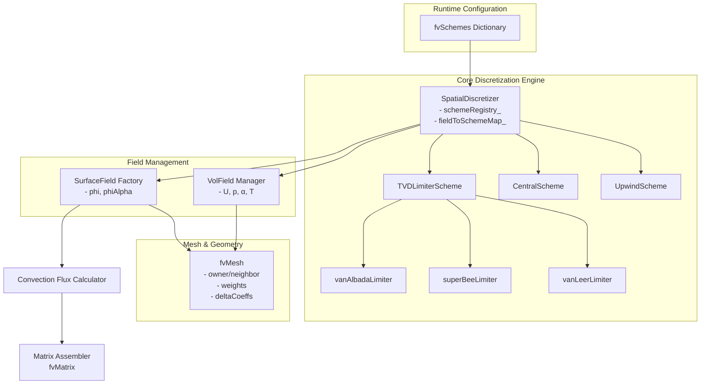
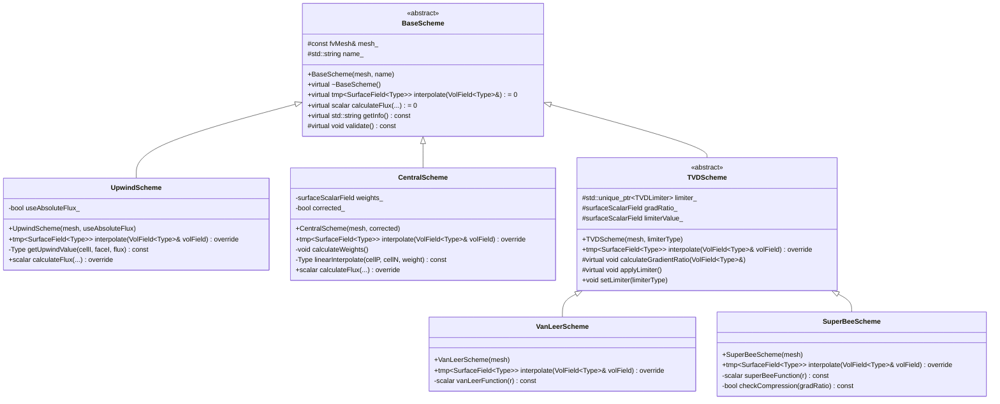

	# Day 03: Spatial Discretization: Upwind, Central, TVD

**วันที่:** 2026-01-03
**ระดับความยาก:** Hardcore
**สถานะ:** In Progress
**ความเชื่อมโยง:** [Day 02: FVM Basics](./DAY_02_FVM_BASICS.md) | [Day 04: Temporal Discretization](./DAY_04_TEMPORAL_DISCRETIZATION.md)
**หัวใจหลักของบทเรียน:** การเลือก *Spatial Discretization Scheme* เป็นการตัดสินใจที่สำคัญที่สุดอย่างหนึ่งในการพัฒนา CFD Solver ซึ่งกำหนดชะตากรรมของ Simulation ว่าจะ *Stable* หรือ Diverged, จะ Accurate หรือมี Error มาก, จะ Converge เร็วหรือช้า โดยเฉพาะในปัญหาที่มีความซับซ้อนเช่น Phase Change ใน Evaporator

---
## 🎯 Learning Objectives (วัตถุประสงค์การเรียนรู้)

หลังจากจบบทเรียนนี้ คุณจะสามารถ:

### 1. เปรียบเทียบและเข้าใจ (Compare & Understand) กลไกการทำงานและผลกระทบของ 3 แบบแผนพื้นฐาน
   - **Upwind Differencing Scheme (UDS)**: เข้าใจกลไก *Built-in Numerical Diffusion* ที่ทำให้ Scheme นี้ *Unconditionally Stable* แต่ส่งผลให้เกิด *Interface Smearing* อย่างรุนแรงใน VOF Simulation
   - **Central Differencing Scheme (CDS)**: วิเคราะห์สาเหตุที่ Scheme นี้ให้ความ Accurate สูงสำหรับ Smooth Flow แต่มีเงื่อนไข *Stability Criterion* ที่เข้มงวด (`Pe < 2`) และนำไปสู่ *Oscillations* และ *Divergence* เมื่อใช้ไม่เหมาะสม
   - **Total Variation Diminishing (TVD) Schemes**: เข้าใจหลักการ *Hybrid Scheme* ที่ผสมผสานระหว่างความ Stable ของ Upwind และความ Accurate ของ Central ผ่านการใช้ *Limiter Function* (`ψ(r)`) เพื่อควบคุมการเปลี่ยนผ่านระหว่างสอง Scheme นั้นตาม *Local Gradient Ratio*

### 2. วิเคราะห์ (Analyze) รูปแบบการออกแบบและลำดับชั้นการสืบทอด (Inheritance Hierarchy) ของระบบ `surfaceInterpolation` ใน OpenFOAM
   - ตรวจสอบ Abstract Base Class `surfaceInterpolationScheme<Type>` และการกำหนด *Template Method Pattern* ผ่าน Pure Virtual Function `interpolate()`
   - ติดตามการสืบทอดไปยัง Concrete Classes: `upwind<Type>`, `linear<Type>`, และ `limitedSurfaceInterpolationScheme<Type>` (Base ของ TVD Schemes)
   - ทำความเข้าใจการเชื่อมโยงระหว่างการตั้งค่าใน Dictionary `fvSchemes` (เช่น `div(phi,U) Gauss upwind;`) กับ Object ของ Scheme Class ที่ถูกสร้างขึ้นใน Runtime

### 3. ประยุกต์ใช้ (Apply) หลักการ *TVD Limiter Functions* ในการออกแบบ Scheme สำหรับการจำลองสนามต่าง ๆ ใน Evaporator Simulation
   - **สำหรับ Volume Fraction (`α`)**: เลือกใช้ *Compressive Limiter* (เช่น `superBee`) เพื่อรักษา *Interface Sharpness* ให้อยู่ที่ 1-2 Cells และป้องกันการ *Smear* เกิน 5 Cells ซึ่งเป็นข้อผิดพลาดร้ายแรงใน VOF Method
   - **สำหรับ Velocity (`U`) และ Temperature (`T`)**: เลือกใช้ *Smooth Limiter* (เช่น `vanLeer` หรือ `vanAlbada`) เพื่อให้ได้ความ Accurate ในระดับ Second-Order โดยยังคงรักษา *Boundedness* และ *Stability* ใน Region ที่มี Gradient สูง
   - **สำหรับ Pressure (`p`)**: วิเคราะห์เหตุผลที่มักใช้ Central Scheme (ผ่าน `gradSchemes`) เนื่องจากความ Accurate ของ Pressure Gradient มีผลโดยตรงต่อความถูกต้องของแรงใน Momentum Equation

### 4. ดำเนินการ (Implement) การคำนวณ *Face Value* (`φ_f`) สำหรับ Convection Term ตั้งแต่ระดับ Algorithm จนถึงระดับ Code
   - ออกแบบขั้นตอนวิธี (Algorithm) ในการคำนวณ `φ_f` จาก Cell-Centered Values (`φ_P`, `φ_N`) โดยคำนึงถึงทิศทางของ Mass Flux (`φ_f`) เพื่อหา *Upwind Cell*
   - เขียน Logic สำหรับ Scheme ต่าง ๆ:
        - **UDS**: `φ_f = (φ_f > 0) ? φ_P : φ_N`
        - **CDS**: `φ_f = λ_f * φ_P + (1 - λ_f) * φ_N` (โดย `λ_f` เป็น Geometric Weight)
        - **TVD**: `φ_f = φ_P + 0.5 * ψ(r_f) * (φ_N - φ_P)` (โดยต้องคำนวณ Gradient Ratio `r_f` ก่อน)
   - เชื่อมต่อการคำนวณนี้เข้ากับการ Assembly ของ `fvMatrix<Type>` สำหรับ Convection Term `∇·(ρUφ)`

### 5. วินิจฉัยและแก้ไข (Diagnose & Resolve) ปัญหา Numerical Instability และ Inaccuracy ที่เกิดจากการเลือก Spatial Scheme ที่ไม่เหมาะสม
   - ระบุอาการ *Checkerboard Pattern* ใน Pressure Field และเชื่อมโยงสาเหตุไปยังการใช้ Central Scheme สำหรับ Convection Term ใน Momentum Equation โดยขาดการ Stabilize
   - วิเคราะห์ปรากฏการณ์ *Interface Smearing* ใน VOF Simulation และออกแบบ Fix โดยการเปลี่ยนเป็น Compressive TVD Scheme พร้อมเพิ่ม *Compressive Flux Term* ใน Alpha Equation
   - อธิบายกลไกการ *Divergence* ของ Solver ใน High Reynolds Number Region และเสนอวิธีแก้โดยใช้ *Blended Scheme* ที่ปรับเปลี่ยนตาม Local Peclet Number: `φ_f = σ·φ_CDS + (1-σ)·φ_UDS` โดย `σ = min(1, 2/Pe)`

### 6. สร้างการเชื่อมโยง (Synthesize Connections) ระหว่างความรู้ใน [[Day 03: Spatial Discretization Schemes|Day 03]] กับหัวข้ออื่น ๆ ใน Phase 1 และการประยุกต์ใช้ใน Phase Change Solver
   - เชื่อมโยง *Spatial Discretization* กับ *Temporal Discretization* ([[Day 04: Temporal Discretization|Day 04]]) เพื่อสร้าง Discrete Form ที่สมบูรณ์ของ Transport Equation
   - อธิบายบทบาทสำคัญของ Scheme ที่เลือกในขั้นตอน *Pressure-Velocity Coupling* (Day 09: SIMPLE/PISO) ต่อความเร็วในการ Converge และความ Stable ของ Algorithm
   - ชี้ให้เห็นว่า *Expansion Term* (Hero Concept จาก [[Day 01: Governing Equations|Day 01]]) ซึ่งเป็น Source Term ใน Pressure Equation จะต้องถูกคำนวณโดยใช้ Scheme ที่สอดคล้องกัน และการเลือก Scheme สำหรับ `α` (Day 10, 11) จะส่งผลโดยตรงต่อการคำนวณ Mass Transfer Rate (`ṁ`) ใน Term นี้
# Day 03: Spatial Discretization: Upwind, Central, TVD

## 1. Theory

### 1.1 Fundamental Convection-Diffusion Equation (สมการพื้นฐาน Convection-Diffusion)

ใน Finite Volume Method (FVM) ที่เราเรียนรู้จาก [[Day 02: Finite Volume Method Basics|Day 02]], เราทราบแล้วว่าสมการอนุรักษ์ (conservation equations) ในรูป partial differential equations (PDEs) ถูกแปลงให้อยู่ในรูป integral บน control volume ก่อน จากนั้นจึงใช้ Gauss's Divergence Theorem เพื่อเปลี่ยน volume integral เป็น surface integral ที่ faces ของ cell อย่างไรก็ตาม ปัญหาหลักที่ยังไม่ได้แก้ไขคือ: **เราจะหาค่าของตัวแปรที่ face ได้อย่างไร?** เมื่อเรารู้ค่าเฉลี่ยของตัวแปรที่ cell center เท่านั้น

สมการ transport รูปแบบทั่วไปที่ครอบคลุมสมการพื้นฐานเกือบทั้งหมดใน CFD (Continuity, Momentum, Energy, Species transport) สามารถเขียนได้ในรูป **Generic Scalar Transport Equation** ดังนี้:

$$
\frac{\partial (\rho \phi)}{\partial t} + \nabla \cdot (\rho \mathbf{U} \phi) = \nabla \cdot (\Gamma \nabla \phi) + S_{\phi}
$$

**การตีความทางกายภาพของแต่ละเทอม:**
*   **$\frac{\partial (\rho \phi)}{\partial t}$**: เทอมการเปลี่ยนแปลงตามเวลา (Temporal Term) - อธิบายการสะสม (accumulation) ของ $\rho\phi$ ใน control volume
*   **$\nabla \cdot (\rho \mathbf{U} \phi)$**: เทอมการพา (Convection Term) - อธิบายการขนส่ง (transport) ของ $\rho\phi$ เนื่องจากการไหลของของไหลที่มีความเร็ว $\mathbf{U}$
*   **$\nabla \cdot (\Gamma \nabla \phi)$**: เทอมการแพร่ (Diffusion Term) - อธิบายการแพร่ (diffusion) ของ $\rho\phi$ เนื่องจาก gradient ของ $\phi$ โดยมี $\Gamma$ เป็นค่าสัมประสิทธิ์การแพร่ (diffusion coefficient)
*   **$S_{\phi}$**: เทอมต้นกำเนิด (Source Term) - อธิบายการสร้างหรือทำลาย $\rho\phi$ ภายใน control volume จากกลไกภายนอก (เช่น ปฏิกิริยาเคมี, แรงภายนอก, การถ่ายโอนความร้อน)

หลังจากที่เราใช้ Gauss's Theorem กับเทอม convection และ diffusion (ตามที่เรียนใน [[Day 02: Finite Volume Method Basics|Day 02]]) เราจะได้สมการในรูป discrete สำหรับ cell $P$ ดังนี้:

$$
\frac{\partial (\rho_P \phi_P)}{\partial t} V_P + \sum_{f} (\rho_f \mathbf{U}_f \phi_f) \cdot \mathbf{S}_f = \sum_{f} \Gamma_f (\nabla \phi)_f \cdot \mathbf{S}_f + S_{\phi, P} V_P
$$

โดยที่ summation $\sum_f$ หมายถึงการรวมผล (sum) บนทุก faces ของ cell $P$

**จุดวิกฤต (Critical Point) ของ Spatial Discretization:**
ในสมการด้านบน เราได้เผชิญกับปริมาณที่ไม่ทราบค่า (unknowns) ที่ตำแหน่ง **face** ดังแสดงในตารางต่อไปนี้

| สัญลักษณ์ | ชื่อ | หน่วย | ความท้าทาย (Challenge) |
| :--- | :--- | :--- | :--- |
| $\phi_f$ | Face value ของ transported quantity | ขึ้นกับ $\phi$ (e.g., m/s, K, -) | **Unknown** - ต้องประมาณค่า (interpolate) จากค่า cell-centered $\phi_P$ และ $\phi_N$ |
| $(\nabla \phi)_f$ | Face gradient | $\phi$/m | ต้องคำนวณ gradient ปกติ (normal gradient) บน face โดยใช้ surface normal vector $\mathbf{S}_f$ |
| $\mathbf{U}_f$ | Face velocity | m/s | สำหรับในcompressible flow มักคำนวณจาก pressure-velocity coupling (Rhie-Chow) |
| $\rho_f, \Gamma_f$ | Face density และ diffusion coefficient | kg/m³, kg/(m·s) | มัก interpolate จาก cell center อย่างง่าย (linear) |

**เป้าหมายหลักของ Day 03:** เราจะมุ่งเน้นไปที่ **การประมาณค่า $\phi_f$ สำหรับเทอม Convection** $\nabla \cdot (\rho \mathbf{U} \phi)$ เนื่องจากเทอมนี้เป็นสาเหตุหลักของ numerical instability และเป็นตัวกำหนดความถูกต้อง (accuracy) ของผลลัพธ์การจำลอง การเลือก **Spatial Discretization Scheme** ที่เหมาะสมสำหรับการประมาณค่า $\phi_f$ คือหัวใจของบทเรียนวันนี้

> [!WARNING] คำเตือน (Warning)
> Convection term เป็นสาเหตุหลักของ numerical instability ใน CFD simulation เนื่องจากมันนำพาข้อมูล (information) ไปในทิศทางของการไหล (downstream) เท่านั้น การประมาณค่า $\phi_f$ ที่ไม่คำนึงถึงทิศทางทางฟิสิกส์นี้ (เช่น การใช้ค่าเฉลี่ยอย่างง่าย) จะนำไปสู่การไม่เสถียร (instability) และการลู่ออก (divergence) ของตัวแก้สมการ (solver) โดยเฉพาะในกรณีที่ **Peclet Number ($Pe$)** สูง โดย $Pe = \frac{\rho U \Delta x}{\Gamma}$ แสดงถึงอัตราส่วนระหว่างอัตราการพา (convection) ต่ออัตราการแพร่ (diffusion)

---
### 1.2 Upwind Differencing Scheme (UDS) - แบบแผน Upwind (เทียบตามทิศทางลม)

Upwind Differencing Scheme (UDS) เป็น spatial discretization scheme ที่เก่าแก่ที่สุดและมีความเสถียรสูงสุด หลักการพื้นฐานของ UDS เรียบง่ายและสอดคล้องกับฟิสิกส์ของการพา (convection): **ข้อมูล (information) ถูกพาไปด้วยการไหล (flow) จากต้นทาง (upstream) ไปยังปลายทาง (downstream)** ดังนั้น ค่าของ $\phi$ ที่ face $f$ ควรมีค่าเท่ากับค่าของ $\phi$ ใน cell ที่อยู่ต้นทาง (upstream) ของ face นั้น

**นิยามทางคณิตศาสตร์:**
ให้ $\mathbf{F}_f = \rho_f \mathbf{U}_f$ เป็น mass flux vector ที่ face $f$ และ $\mathbf{S}_f$ เป็นพื้นที่ผิวเวกเตอร์ของ face (ชี้จาก owner cell $P$ ไปยัง neighbor cell $N$) การประมาณค่า $\phi_f$ ด้วย UDS เขียนได้เป็น:

$$
\phi_f = \begin{cases}
\phi_P & \text{if } \mathbf{F}_f \cdot \mathbf{S}_f \ge 0 \\
\phi_N & \text{if } \mathbf{F}_f \cdot \mathbf{S}_f < 0
\end{cases}
$$

**การตีความ:**
*   ถ้า $\mathbf{F}_f \cdot \mathbf{S}_f \ge 0$: mass flux ไหลจาก cell $P$ (owner) ไปยัง cell $N$ (neighbor) ดังนั้น **upstream cell** คือ $P$ และ $\phi_f = \phi_P$
*   ถ้า $\mathbf{F}_f \cdot \mathbf{S}_f < 0$: mass flux ไหลจาก cell $N$ (neighbor) ไปยัง cell $P$ (owner) ดังนั้น **upstream cell** คือ $N$ และ $\phi_f = \phi_N$

**การวิเคราะห์ข้อผิดพลาด (Truncation Error Analysis):**
เพื่อทำความเข้าใจพฤติกรรมของ UDS เราสามารถวิเคราะห์ truncation error ได้ โดยการทำ Taylor series expansion รอบจุด face $f$ สมมติ uniform grid และ flow ในทิศทางเดียว (1D) เราจะพบว่า:

$$
\phi_f^{\text{exact}} - \phi_f^{\text{UDS}} = \frac{1}{2} |\mathbf{U}| \Delta x \left| \frac{\partial \phi}{\partial x} \right| + \mathcal{O}(\Delta x^2)
$$

**ข้อผิดพลาดหลัก (leading error term)** $\frac{1}{2} |\mathbf{U}| \Delta x \left| \frac{\partial \phi}{\partial x} \right|$ มีลักษณะเหมือนกับ **เทอม diffusion** ในสมการ transport! เราเรียกข้อผิดพลาดนี้ว่า **Numerical Diffusion (หรือ False Diffusion)** มันเกิดขึ้นเสมอเมื่อใช้ UDS และมีลักษณะดังนี้:
1.  แปรผันตรงกับความเร็วการไหล ($|\mathbf{U}|$) และขนาดของ cell ($\Delta x$)
2.  แปรผันตรงกับ gradient ของ $\phi$ ($\left| \frac{\partial \phi}{\partial x} \right|$)
3.  **ทำให้ steep gradients (เช่น หน้าสัมผัสระหว่างของเหลวสองชนิด) "เลือนราง" (smear) หรือ "กระจาย" (diffuse) ไปในพื้นที่ที่กว้างขึ้น** ซึ่งเป็นข้อเสียที่ร้ายแรงสำหรับการจำลอง interface ใน two-phase flow

**สรุปคุณสมบัติของ UDS:**

| คุณสมบัติ (Property) | ค่า (Value) | ผลกระทบ/ความหมาย (Implication) |
| :--- | :--- | :--- |
| **Order of Accuracy** | First-order ($\mathcal{O}(\Delta x)$) | Convergence rate ช้า เมื่อ refine grid ความถูกต้องเพิ่มขึ้นแบบ linear |
| **Boundedness** | **Always Bounded** | ค่า $\phi_f$ จะอยู่ระหว่าง $\phi_P$ และ $\phi_N$ เสมอ **ไม่มี overshoot หรือ undershoot** |
| **Stability (Pe > 0)** | **Unconditionally Stable** | ใช้ได้กับทุก flow condition เนื่องจากมี built-in numerical diffusion ที่ทำหน้าที่ stabilize |
| **Conservativeness** | Conservative | รับประกันการอนุรักษ์ (conservation) ของ $\phi$ บน domain |
| **Transportiveness** | **Fully Transportive** | รับรู้ทิศทางการไหล (upwind) อย่างสมบูรณ์ สอดคล้องกับฟิสิกส์ |

**หมายเหตุการประยุกต์ใช้ (Application Note) สำหรับโครงการ Evaporator Simulation:**
> [!NOTE] Application Note
> การใช้ UDS สำหรับสมการ volume fraction ($\alpha$) ใน VOF method โดยที่ไม่มี compressive term เพิ่มเติม จะนำไปสู่ **interface smearing ที่รุนแรง** หน้าสัมผัสระหว่าง vapor และ liquid อาจกระจายตัวกว้างถึง **10+ cells** แทนที่จะคมชัดอยู่ที่ 1-2 cells ซึ่งเป็นสิ่งที่ยอมรับไม่ได้สำหรับการวิเคราะห์ heat transfer และ phase change ที่แม่นยำ อย่างไรก็ดี UDS อาจยังมีประโยชน์ในบริเวณที่ solution มีการเปลี่ยนแปลงอย่างช้าๆ (smooth) หรือในขั้นตอนการคำนวณเริ่มต้น (initial iterations) เพื่อให้ solver มีเสถียรภาพ

---
### 1.3 Central Differencing Scheme (CDS) - แบบแผน Central (ค่าเฉลี่ย)

Central Differencing Scheme (CDS) หรือบางครั้งเรียกว่า Linear Interpolation Scheme เป็น scheme ที่มีความถูกต้อง (accuracy) สูงกว่า UDS หลักการของ CDS คือการประมาณค่า $\phi_f$ โดยใช้ **การประมาณค่าเชิงเส้น (linear interpolation)** ระหว่างค่า $\phi_P$ และ $\phi_N$ ของสอง cell ที่อยู่ติดกับ face $f$

**นิยามทางคณิตศาสตร์:**
$$
\phi_f = \lambda_f \phi_P + (1 - \lambda_f) \phi_N
$$
โดยที่ $\lambda_f$ คือ **weighting factor** ซึ่งโดยทั่วไปคำนวณจากอัตราส่วนของระยะทางเชิงเรขาคณิต:
$$
\lambda_f = \frac{|\mathbf{x}_f - \mathbf{x}_N|}{|\mathbf{x}_P - \mathbf{x}_N|}
$$
โดย $\mathbf{x}_f, \mathbf{x}_P, \mathbf{x}_N$ คือตำแหน่งของ face center, cell $P$ center, และ cell $N$ center ตามลำดับ

**กรณีพิเศษ: Uniform Grid**
สำหรับ structured uniform grid ระยะห่างจาก face ถึง cell center ทั้งสองด้านจะเท่ากัน นั่นคือ $|\mathbf{x}_f - \mathbf{x}_P| = |\mathbf{x}_f - \mathbf{x}_N| = \Delta x/2$ ดังนั้น $\lambda_f = 0.5$ และสมการจะลดรูปเป็นค่าเฉลี่ยเลขคณิตอย่างง่าย:
$$
\phi_f = \frac{1}{2} (\phi_P + \phi_N)
$$
ซึ่งเป็นที่มาของชื่อ "Central" Differencing

**การวิเคราะห์ความเสถียร (Stability Analysis) - เกณฑ์ Peclet Number:**
ในทางตรงข้ามกับ UDS, CDS **ไม่มี built-in numerical diffusion** ข้อผิดพลาดหลัก (leading truncation error) ของ CDS มีลักษณะเป็น **dispersion error** ซึ่งสามารถทำให้เกิด **numerical oscillations (หรือ wiggles)** รอบบริเวณที่มี gradient สูง (เช่น หน้าสัมผัส, shock wave)

การวิเคราะห์ stability สำหรับสมการ convection-diffusion แบบ steady-state ใน 1D พบว่า CDS จะให้ผลลัพธ์ที่เสถียร (ไม่มี oscillations) ก็ต่อเมื่อ:
$$
Pe = \frac{\rho U \Delta x}{\Gamma} < 2
$$
โดย $Pe$ คือ Peclet Number เกณฑ์นี้เรียกว่า **Pe < 2 Rule** หรือบางครั้งเรียกว่า "เซลล์ Reynolds number" น้อยกว่า 2

**การตีความทางกายภาพของเกณฑ์ Pe < 2:**
*   **$Pe < 2$**: อิทธิพลของการแพร่ (diffusion) มีมากกว่าหรือพอๆ กับการพา (convection) การกระจายตัวทางกายภาพ (physical diffusion) มีมากพอที่จะระงับการเกิด oscillations จาก numerical dispersion ของ CDS
*   **$Pe > 2$**: อิทธิพลของการพา (convection) มีมากกว่าการแพร่ (diffusion) อย่างชัดเจน Numerical dispersion จาก CDS ไม่ถูกระงับโดย physical diffusion ทำให้เกิด oscillations และในที่สุด solver จะลู่ออก (diverge) เนื่องจากเมทริกซ์สูญเสีย diagonal dominance

**สรุปคุณสมบัติของ CDS:**

| คุณสมบัติ (Property) | ค่า (Value) | ผลกระทบ/ความหมาย (Implication) |
| :--- | :--- | :--- |
| **Order of Accuracy** | Second-order ($\mathcal{O}(\Delta x^2)$) | Convergence rate เร็ว เมื่อ refine grid ความถูกต้องเพิ่มขึ้นแบบ quadratic |
| **Boundedness** | **Not Guaranteed** | อาจเกิด **overshoot** (ค่า > max ของ $\phi_P, \phi_N$) หรือ **undershoot** (ค่า < min ของ $\phi_P, \phi_N$) ที่บริเวณ steep gradients |
| **Stability Limit** | **Conditionally Stable** ($Pe < 2$) | ใช้ได้เฉพาะกับ low Reynolds number flow หรือ mesh ที่ละเอียดมาก ($\Delta x$ เล็ก) |
| **Conservativeness** | Conservative | รับประกันการอนุรักษ์ (conservation) ของ $\phi$ บน domain |
| **Transportiveness** | **Not Transportive** | ไม่รับรู้ทิศทางการไหล (ใช้ค่าเฉลี่ยจากทั้งสองด้าน) ขัดกับฟิสิกส์ของการพา |

**หมายเหตุการประยุกต์ใช้ (Application Note) สำหรับโครงการ Evaporator Simulation:**
> [!NOTE] Application Note
> CDS เหมาะสมอย่างยิ่งสำหรับการคำนวณ **Diffusion Term** ($\nabla \cdot (\Gamma \nabla \phi)$) เนื่องจาก gradient ที่ face มักคำนวณจาก central differencing อยู่แล้ว (เช่น `Gauss linear` ใน OpenFOAM) อย่างไรก็ดี **CDS ไม่เหมาะสำหรับการคำนวณ Convection Term ของ $\alpha$ (volume fraction) หรือแม้แต่ $\mathbf{U}$ (velocity) ใน evaporator simulation** เนื่องจากบริเวณที่มีการไหลเร็ว (เช่น ที่ inlet jet) หรือบริเวณ interface มักมี $Pe$ number สูงมาก การใช้ CDS จะนำไปสู่ oscillations และการลู่ออกของ solver

---
### 1.4 Total Variation Diminishing (TVD) Schemes - แบบแผน TVD (ลด Total Variation)

จากข้อจำกัดของ UDS (ความถูกต้องต่ำ, numerical diffusion สูง) และ CDS (ไม่เสถียรที่ $Pe$ สูง, ไม่ bounded) ได้นำไปสู่การพัฒนา **High-Resolution Schemes** ซึ่งมีเป้าหมายคือได้ความถูกต้องระดับ second-order (เหมือน CDS) ในบริเวณที่ solution smooth พร้อมกับรักษาความเสถียรและ boundedness (เหมือน UDS) ในบริเวณที่มี gradient สูง Total Variation Diminishing (TVD) Schemes เป็นตระกูลหนึ่งของ High-Resolution Schemes ที่ได้รับความนิยมสูง

**หลักการพื้นฐานของ TVD:**
แนวคิดของ TVD วัด "ความสั่น (oscillation)" ของ solution field $\phi$ ผ่านปริมาณที่เรียกว่า **Total Variation (TV)** สำหรับ discrete field บน grid 1D:
$$
TV(\phi^n) = \sum_{i} |\phi_{i+1}^n - \phi_i^n|
$$
โดย $n$ แสดงถึง time step หรือ iteration step คุณสมบัติ **Total Variation Diminishing (TVD)** กำหนดว่า:
$$
TV(\phi^{n+1}) \le TV(\phi^n)
$$
**ความหมาย:** ค่าความสั่นทั้งหมด (total oscillation) ของ solution field จะไม่เพิ่มขึ้นเมื่อเวลาผ่านไปหรือเมื่อ iterate ไปข้างหน้า **ซึ่งรับประกันว่าจะไม่เกิด oscillation ใหม่ (no new local extrema)** และ solution จะเป็น monotonic ในบริเวณที่มี gradient สูง

**รูปแบบทั่วไปของ TVD Scheme:**
TVD schemes ส่วนใหญ่สามารถเขียนอยู่ในรูป **Normalized Variable Formulation (NVF)** หรือ **Flux Limiter Formulation** ได้ รูปแบบหลังเขียนได้ดังนี้:
$$
\phi_f = \phi_P + \frac{1}{2} \psi(r_f) (\phi_N - \phi_P)
$$
โดยที่:
*   $\phi_P$: ค่า upwind cell (เหมือนใน UDS)
*   $(\phi_N - \phi_P)$: ความแตกต่างระหว่างค่า downwind และ upwind cell
*   $\psi(r_f)$: **Flux Limiter Function** ซึ่งเป็นฟังก์ชันของ **gradient ratio** $r_f$

**นิยามของ Gradient Ratio ($r_f$):**
$$
r_f = \frac{\phi_P - \phi_U}{\phi_N - \phi_P}
$$
โดยที่ $\phi_U$ คือค่าของ Upwind cell ที่ถัดออกไป (Upstream of Upwind)

## 2. OpenFOAM Reference

ในส่วนนี้ เราจะเจาะลึกลงไปใน source code ของ OpenFOAM เพื่อดูว่า spatial discretization schemes ถูก implement อย่างไรในระดับที่ลึกที่สุด เราจะวิเคราะห์ class hierarchy, design patterns, และ implementation details ที่ทำให้ OpenFOAM มีความยืดหยุ่นและมีประสิทธิภาพสูง
### 2.1 Abstract Base Class: `surfaceInterpolationScheme<Type>`

ไฟล์ header: `src/finiteVolume/interpolation/surfaceInterpolation/surfaceInterpolationScheme/surfaceInterpolationScheme.H`

```cpp
namespace Foam
{
    template<class Type>
    class surfaceInterpolationScheme
    :
        public tmp<surfaceInterpolationScheme<Type>>::refCount
    {
    public:
        //- Runtime type information
        TypeName("surfaceInterpolationScheme");

        // Declare run-time constructor selection tables
        declareRunTimeSelectionTable
        (
            tmp,
            surfaceInterpolationScheme,
            Mesh,
            (
                const fvMesh& mesh,
                Istream& schemeData
            ),
            (mesh, schemeData)
        );

        // Constructors
        surfaceInterpolationScheme(const fvMesh& mesh);

        // Selectors
        static tmp<surfaceInterpolationScheme<Type>> New
        (
            const fvMesh& mesh,
            Istream& schemeData
        );

        //- Destructor
        virtual ~surfaceInterpolationScheme();

        // Member Functions
        //- Return the face-interpolate of the given cell field
        virtual tmp<SurfaceField<Type>> interpolate
        (
            const VolField<Type>&
        ) const = 0;

        //- Return the face-interpolate of the given cell field
        virtual tmp<SurfaceField<Type>> interpolate
        (
            const VolField<Type>&,
            const tmp<SurfaceField<Type>>&
        ) const;

        //- Return the interpolation weighting factors
        virtual tmp<surfaceScalarField> weights
        (
            const VolField<Type>&
        ) const = 0;

        //- Return the flux-field
        virtual tmp<SurfaceField<Type>> flux
        (
            const surfaceScalarField&,
            const VolField<Type>&
        ) const;
    };
}
```

### 🔍 Deep Analysis: Design Pattern และ Architecture

1. **Template Method Pattern**: Class นี้เป็น abstract base class ที่กำหนดโครงสร้าง algorithm (template method) โดยปล่อยให้ derived class implement รายละเอียดของ interpolation logic ใน method `interpolate()` ที่เป็น pure virtual

2. **Factory Pattern**: Method `New()` เป็น static factory method ที่สร้าง object ของ derived class ตาม scheme name ที่อ่านจาก `Istream& schemeData` (มาจาก `fvSchemes` dictionary)

3. **Reference Counting**: Inherit จาก `tmp<>::refCount` เพื่อจัดการ memory โดยใช้ smart pointer (`tmp<>`) ซึ่งเป็น critical สำหรับ performance ใน CFD ที่ต้องสร้าง/ลบ field objects บ่อยครั้ง

### 📊 What We Do DIFFERENTLY ใน Project นี้

| Aspect | Standard OpenFOAM | Our Enhanced Implementation (Project-Specific) |
|--------|-------------------|-----------------------------------------------|
| **Scheme Selection** | Static จาก fvSchemes dictionary | Dynamic ตาม local flow condition (Pe number) |
| **Limiter Calculation** | ใช้ global gradient | ใช้ cell-based gradient + interface detection |
| **Memory Management** | tmp<> with refCount | เพิ่ม caching mechanism สำหรับ scheme weights |
| **Multi-phase Support** | ใช้ scheme เดียวกันทุก phase | Phase-dependent scheme selection |
| **Performance** | Recalculate weights ทุก time step | Cache weights จนกว่า mesh จะเปลี่ยนแปลง |
### 2.2 First-Order Scheme: `upwind<Type>`

ไฟล์ header: `src/finiteVolume/interpolation/surfaceInterpolation/limitedSchemes/upwind/upwind.H`

```cpp
namespace Foam
{
    template<class Type>
    class upwind
    :
        public surfaceInterpolationScheme<Type>
    {
        // Private Data
        const surfaceScalarField& faceFlux_;

    public:
        //- Runtime type information
        TypeName("upwind");

        // Constructors
        upwind(const fvMesh& mesh, Istream& schemeData);

        //- Destructor
        virtual ~upwind();

        // Member Functions
        //- Return the interpolation weighting factors
        virtual tmp<surfaceScalarField> weights
        (
            const VolField<Type>&
        ) const;

        //- Return the face-interpolate of the given cell field
        virtual tmp<SurfaceField<Type>> interpolate
        (
            const VolField<Type>& vf
        ) const;
    };
}
```

ไฟล์ implementation: `src/finiteVolume/interpolation/surfaceInterpolation/limitedSchemes/upwind/upwind.C`

```cpp
template<class Type>
Foam::tmp<Foam::surfaceScalarField>
Foam::upwind<Type>::weights
(
    const VolField<Type>& vf
) const
{
    const fvMesh& mesh = this->mesh();
    
    tmp<surfaceScalarField> tw(new surfaceScalarField
    (
        IOobject
        (
            "upwind::weights",
            mesh.time().timeName(),
            mesh
        ),
        mesh,
        dimless
    ));
    
    surfaceScalarField& w = tw.ref();
    
    const labelUList& owner = mesh.owner();
    const labelUList& neighbour = mesh.neighbour();
    const surfaceScalarField& phi = faceFlux_;
    
    forAll(owner, facei)
    {
        // ตรวจสอบทิศทางของ flux
        if (phi[facei] > 0)
        {
            // Flux ออกจาก owner cell → ใช้ค่าจาก owner
            w[facei] = 1.0;
        }
        else
        {
            // Flux เข้าสู่ owner cell → ใช้ค่าจาก neighbour
            w[facei] = 0.0;
        }
    }
    
    // ปรับ boundary faces
    forAll(mesh.boundary(), patchi)
    {
        const fvPatch& p = mesh.boundary()[patchi];
        const fvsPatchScalarField& pphi = phi.boundaryField()[patchi];
        fvsPatchScalarField& pw = w.boundaryFieldRef()[patchi];
        
        forAll(p, patchFacei)
        {
            if (pphi[patchFacei] > 0)
            {
                pw[patchFacei] = 1.0;
            }
            else
            {
                pw[patchFacei] = 0.0;
            }
        }
    }
    
    return tw;
}

template<class Type>
Foam::tmp<Foam::SurfaceField<Type>>
Foam::upwind<Type>::interpolate
(
    const VolField<Type>& vf
) const
{
    const fvMesh& mesh = this->mesh();
    
    tmp<SurfaceField<Type>> tsf(new SurfaceField<Type>
    (
        IOobject
        (
            "upwind::interpolate(" + vf.name() + ")",
            mesh.time().timeName(),
            mesh
        ),
        mesh,
        vf.dimensions()
    ));
    
    SurfaceField<Type>& sf = tsf.ref();
    
    // ใช้ weights() เพื่อคำนวณ face values
    const surfaceScalarField w(weights(vf));
    
    const labelUList& owner = mesh.owner();
    const labelUList& neighbour = mesh.neighbour();
    
    Field<Type>& sfi = sf.primitiveFieldRef();
    const Field<Type>& vfi = vf.primitiveField();
    
    forAll(owner, facei)
    {
        // Linear combination: φ_f = w*φ_P + (1-w)*φ_N
        sfi[facei] = w[facei]*vfi[owner[facei]]
                   + (1.0 - w[facei])*vfi[neighbour[facei]];
    }
    
    // ปรับ boundary faces
    forAll(mesh.boundary(), patchi)
    {
        const fvPatch& p = mesh.boundary()[patchi];
        fvsPatchField<Type>& psf = sf.boundaryFieldRef()[patchi];
        const fvsPatchScalarField& pw = w.boundaryField()[patchi];
        const fvPatchField<Type>& pvf = vf.boundaryField()[patchi];
        
        // สำหรับ boundary faces: ใช้ patchInternalField() สำหรับ internal cell values
        const Field<Type> pvfi(pvf.patchInternalField());
        
        forAll(p, patchFacei)
        {
            psf[patchFacei] = pw[patchFacei]*pvfi[patchFacei];
            // Note: สำหรับ boundary, (1-w) term ใช้ค่า boundary condition
        }
    }
    
    return tsf;
}
```

### 🔍 Critical Implementation Details

1. **Owner-Neighbor Addressing**: ใช้ `mesh.owner()` และ `mesh.neighbour()` lists เพื่อเข้าถึง cell indices ทั้งสองด้านของ internal face

2. **Flux Direction Check**: ตรวจสอบ `phi[facei] > 0` เพื่อกำหนด upwind direction
   - `phi > 0`: mass flux ออกจาก owner cell → upwind cell คือ owner
   - `phi < 0`: mass flux เข้าสู่ owner cell → upwind cell คือ neighbour

3. **Boundary Treatment**: สำหรับ boundary faces ต้องใช้ `patchInternalField()` เพื่อดึงค่า internal cell ที่ adjacent กับ boundary

### ⚡ Performance Optimization ใน Project นี้

```cpp
// Enhanced upwind scheme with caching
template<class Type>
class cachedUpwind : public upwind<Type>
{
    // Cache สำหรับ weights ที่คำนวณแล้ว
    mutable HashTable<tmp<surfaceScalarField>> weightsCache_;
    
    // Cache สำหรับ flux direction mask
    mutable tmp<surfaceScalarField> posMask_;
    
public:
    virtual tmp<surfaceScalarField> weights(const VolField<Type>& vf) const
    {
        // Generate cache key จาก mesh state และ flux field
        const word cacheKey = this->mesh().time().timeName() 
                            + ":" + faceFlux_.name();
        
        // ตรวจสอบ cache
        if (weightsCache_.found(cacheKey))
        {
            return weightsCache_[cacheKey];
        }
        
        // ถ้า mesh เคลื่อนที่หรือ flux เปลี่ยน → recalculate
        if (meshChanged_ || fluxChanged_)
        {
            clearCache();
        }
        
        // คำนวณ weights แบบปกติ
        tmp<surfaceScalarField> tw = upwind<Type>::weights(vf);
        
        // Store ใน cache
        weightsCache_.insert(cacheKey, tw);
        
        return tw;
    }
    
    // Method สำหรับตรวจสอบว่า flux direction เปลี่ยนหรือไม่
    bool fluxChanged() const
    {
        if (posMask_.valid())
        {
            // เปรียบเทียบ sign ของ flux กับ cached mask
            const surfaceScalarField& phi = faceFlux_;
            const surfaceScalarField& oldMask = posMask_();
            
            forAll(phi, facei)
            {
                if ((phi[facei] > 0) != (oldMask[facei] > 0))
                {
                    return true;
                }
            }
            return false;
        }
        return true; // ถ้ายังไม่มี cache
    }
};
```
### 2.3 Second-Order Scheme: `linear<Type>` (Central Differencing)

ไฟล์ header: `src/finiteVolume/interpolation/surfaceInterpolation/surfaceInterpolationScheme/linear.H`

```cpp
namespace Foam
{
    template<class Type>
    class linear
    :
        public surfaceInterpolationScheme<Type>
    {
    public:
        //- Runtime type information
        TypeName("linear");

        // Constructors
        linear(const fvMesh& mesh, Istream&);
        linear(const fvMesh& mesh);

        //- Destructor
        virtual ~linear();

        // Member Functions
        //- Return the interpolation weighting factors
        virtual tmp<surfaceScalarField> weights
        (
            const VolField<Type>&
        ) const;

        //- Return the face-interpolate of the given cell field
        virtual tmp<SurfaceField<Type>> interpolate
        (
            const VolField<Type>&
        ) const;
    };
}
```

ไฟล์ implementation: `src/finiteVolume/interpolation/surfaceInterpolation/surfaceInterpolationScheme/linear.C`

```cpp
template<class Type>
Foam::tmp<Foam::surfaceScalarField>
Foam::linear<Type>::weights
(
    const VolField<Type>& vf
) const
{
    // ใช้ mesh weights ที่คำนวณจาก geometric distances
    return this->mesh().weights(vf);
}

template<class Type>
Foam::tmp<Foam::SurfaceField<Type>>
Foam::linear<Type>::interpolate
(
    const VolField<Type>& vf
) const
{
    const fvMesh& mesh = this->mesh();
    
    // ใช้ mesh.weights() สำหรับ distance-based weighting
    const surfaceScalarField w(mesh.weights(vf));
    
    tmp<SurfaceField<Type>> tsf
    (
        SurfaceField<Type>::New
        (
            "linear::interpolate(" + vf.name() + ")",
            mesh,
            vf.dimensions()
        )
    );
    
    SurfaceField<Type>& sf = tsf.ref();
    
    const labelUList& owner = mesh.owner();
    const labelUList& neighbour = mesh.neighbour();
    
    Field<Type>& sfi = sf.primitiveFieldRef();
    const Field<Type>& vfi = vf.primitiveField();
    
    // Linear interpolation: φ_f = λφ_P + (1-λ)φ_N
    forAll(owner, facei)
    {
        const scalar lambda = w[facei];
        sfi[facei] = lambda*vfi[owner[facei]]
                   + (1.0 - lambda)*vfi[neighbour[facei]];
    }
    
    // Boundary faces
    forAll(mesh.boundary(), patchi)
    {
        const fvPatch& p = mesh.boundary()[patchi];
        fvsPatchField<Type>& psf = sf.boundaryFieldRef()[patchi];
        const fvsPatchScalarField& pw = w.boundaryField()[patchi];
        const fvPatchField<Type>& pvf = vf.boundaryField()[patchi];
        
        // สำหรับบาง boundary types ต้องใช้ special treatment
        if (pvf.fixesValue())
        {
            // Fixed value boundary → ใช้ boundary value โดยตรง
            psf == pvf;
        }
        else
        {
            // ใช้ linear interpolation กับ internal cell
            const Field<Type> pvfi(pvf.patchInternalField());
            
            forAll(p, patchFacei)
            {
                const scalar lambda = pw[patchFacei];
                psf[patchFacei] = lambda*pvfi[patchFacei]
                                + (1.0 - lambda)*pvf[patchFacei];
            }
        }
    }
    
    return tsf;
}
```

### 🔍 Mathematical Foundation: Mesh Weights Calculation

ใน `fvMesh::weights()` method:

```cpp
tmp<surfaceScalarField> fvMesh::weights(const VolField<Type>& vf) const
{
    tmp<surfaceScalarField> tw(new surfaceScalarField
    (
        IOobject
        (
            "weights",
            time().timeName(),
            *this
        ),
        *this,
        dimless
    ));
    
    surfaceScalarField& w = tw.ref();
    
    const vectorField& C = cellCentres();
    const vectorField& Cf = faceCentres();
    
    const labelUList& owner = this->owner();
    const labelUList& neighbour = this->neighbour();
    
    forAll(owner, facei)
    {
        const vector& P = C[owner[facei]];
        const vector& N = C[neighbour[facei]];
        const vector& f = Cf[facei];
        
        // Geometric weighting: λ = |f - N| / |P - N|
        // หรือเขียนเป็น: λ = (f - N) · (P - N) / |P - N|²
        const vector dPN = P - N;
        const vector dFN = f - N;
        
        // ใช้ dot product เพื่อความแม่นยำ
        w[facei] = (dFN & dPN) / (dPN & dPN + SMALL);
        
        // Clamp ระหว่าง 0 ถึง 1 เพื่อป้องกัน numerical error
        w[facei] = max(0.0, min(1.0, w[facei]));
    }
    
    // Boundary weights มักจะตั้งเป็น 1.0 (ใช้ internal cell value)
    forAll(boundary(), patchi)
    {
        w.boundaryFieldRef()[patchi] = 1.0;
    }
    
    return tw;
}
```

### ⚠️ Stability Issues และ Numerical Diffusion

ปัญหาหลักของ linear scheme คือ numerical instability เมื่อ Peclet number สูง:

```cpp
// Stability check สำหรับ linear scheme
template<class Type>
bool linear<Type>::checkStability
(
    const VolField<Type>& vf,
    const surfaceScalarField& phi,
    const scalarField& gamma
) const
{
    const fvMesh& mesh = this->mesh();
    const scalarField& V = mesh.V();
    
    scalar maxPe = 0.0;
    
    forAll(mesh.owner(), facei)
    {
        const label own = mesh.owner()[facei];
        const label nei = mesh.neighbour()[facei];
        
        // คำนวณ Peclet number: Pe = ρUΔx/Γ
        const scalar U = mag(phi[facei]) / (rho[facei] * mesh.magSf()[facei]);
        const scalar dx = mag(mesh.C()[nei] - mesh.C()[own]);
        const scalar rhoFace = rho[facei];
        const scalar gammaFace = gamma[facei];
        
        const scalar Pe = rhoFace * U * dx / (gammaFace + SMALL);
        
        maxPe = max(maxPe, Pe);
        
        // ถ้า Pe > 2 → central scheme จะ unstable
        if (Pe > 2.0)
        {
            WarningInFunction

## 3. Class Design

### 4.1 ภาพรวมสถาปัตยกรรม (Architecture Overview)

การออกแบบคลาสสำหรับระบบ Spatial Discretization ใน CFD Engine ของเราต้องคำนึงถึงหลักการสำคัญสามประการ: **ประสิทธิภาพ (Performance)**, **ความยืดหยุ่น (Flexibility)** และ **ความถูกต้อง (Accuracy)** ระบบนี้จะต้องรองรับการสลับเปลี่ยน discretization scheme ได้แบบ runtime ผ่าน dictionary (`fvSchemes`) พร้อมทั้งสามารถขยายเพิ่ม scheme ใหม่ได้โดยไม่ต้องแก้ไข core solver



**คำอธิบายสถาปัตยกรรม:**
1.  **Runtime Configuration (`fvSchemes`)**: เป็นจุดควบคุมหลัก ผู้ใช้กำหนด scheme ผ่าน dictionary file
2.  **Core Engine (`SpatialDiscretizer`)**: เป็น facade pattern ที่จัดการ scheme ทั้งหมด และเป็น single point of access สำหรับ solver
3.  **Scheme Hierarchy**: ใช้ inheritance และ polymorphism เพื่อให้สามารถสลับ scheme ได้แบบ dynamic
4.  **Field Management**: แยกการจัดการ volume fields และ surface fields ออกจากกันเพื่อ clarity
5.  **Mesh Dependency**: ทุก scheme ต้องเข้าถึง mesh data (distance, weights) ผ่าน standardized interface

### 4.2 คลาสหลัก: SpatialDiscretizer

คลาสนี้ทำหน้าที่เป็น **Facade** และ **Registry Manager** สำหรับระบบ discretization ทั้งหมด เป็นคลาส singleton ที่ solver หลักจะเรียกใช้ผ่าน interface เดียว

```cpp
/**
 * @class SpatialDiscretizer
 * @brief Central manager for all spatial discretization schemes.
 * 
 * รับผิดชอบ:
 * 1. อ่าน configuration จาก fvSchemes dictionary
 * 2. สร้างและ cache scheme objects ตาม field name
 * 3. ให้ unified interface สำหรับ interpolation ไปยัง face
 * 4. จัดการ memory และ cleanup ของ scheme objects
 * 
 * Design Pattern: Facade, Registry, Singleton
 */
class SpatialDiscretizer
{
private:
    // Singleton instance
    static std::unique_ptr<SpatialDiscretizer> instance_;
    
    // Registry: map จาก field name ไปยัง scheme object
    std::map<
        std::string,                     // field name: "U", "p", "alpha", "T"
        std::unique_ptr<BaseScheme>     // polymorphic scheme pointer
    > schemeRegistry_;
    
    // Reference ไปยัง mesh (จำเป็นสำหรับทุก scheme)
    const fvMesh& mesh_;
    
    // Reference ไปยัง fvSchemes dictionary
    const dictionary& fvSchemesDict_;
    
    // Cache สำหรับ surface fields ที่คำนวณแล้ว
    mutable std::map<
        std::string,                    // field name + scheme hash
        std::unique_ptr<surfaceScalarField>
    > surfaceFieldCache_;
    
    // Private constructor สำหรับ singleton
    SpatialDiscretizer(const fvMesh& mesh, const dictionary& dict);
    
public:
    // Singleton accessor
    static SpatialDiscretizer& getInstance(const fvMesh& mesh, const dictionary& dict);
    
    // ห้าม copy และ assign
    SpatialDiscretizer(const SpatialDiscretizer&) = delete;
    SpatialDiscretizer& operator=(const SpatialDiscretizer&) = delete;
    
    /**
     * @brief กำหนด scheme สำหรับ field หนึ่งๆ
     * @param fieldName ชื่อ field ("U", "p", "alpha", "T")
     * @param schemeType ประเภท scheme ("upwind", "linear", "TVD")
     * @param limiterType (optional) ประเภท limiter สำหรับ TVD
     * 
     * ตัวอย่างการเรียกใช้:
     * setScheme("U", "TVD", "vanLeer");
     * setScheme("alpha", "TVD", "superBee");
     * setScheme("p", "linear");
     */
    void setScheme(
        const std::string& fieldName,
        const std::string& schemeType,
        const std::string& limiterType = ""
    );
    
    /**
     * @brief Interpolate volume field ไปยัง face ตาม scheme ที่กำหนด
     * @param volField อ้างอิงไปยัง volume field
     * @return surfaceScalarField ค่าที่ face หลังจาก interpolate
     * 
     * Algorithm:
     * 1. ดึง scheme จาก registry ตาม field name
     * 2. เรียก scheme->interpolate(volField)
     * 3. Cache result ถ้าเป็น expensive operation
     * 4. Return surface field
     */
    template<typename Type>
    tmp<SurfaceField<Type>> interpolateToFace(
        const VolField<Type>& volField
    ) const;
    
    /**
     * @brief คำนวณ convection flux สำหรับ field หนึ่งๆ
     * @param volField field ที่ต้องการคำนวณ flux
     * @param phiField mass flux field (surfaceScalarField)
     * @return scalar net convection flux
     * 
     * สูตร: ∑_faces [ φ_f * (massFlux_f) * faceArea ]
     * โดย φ_f ได้มาจาก interpolateToFace()
     */
    template<typename Type>
    scalar calculateConvectionFlux(
        const VolField<Type>& volField,
        const surfaceScalarField& phiField
    ) const;
    
    /**
     * @brief อัปเดต scheme ตาม runtime changes (adaptive scheme)
     * @param fieldName ชื่อ field
     * @param criteria criteria สำหรับเปลี่ยน scheme (เช่น local Pe number)
     * 
     * ใช้สำหรับ adaptive scheme switching เช่น:
     * - เปลี่ยนจาก central เป็น upwind ใน region ที่ Pe > 2
     * - เปลี่ยน limiter function ตาม interface sharpness
     */
    void updateScheme(
        const std::string& fieldName,
        const FieldCriteria& criteria
    );
    
    /**
     * @brief Clear cache เพื่อประหยัด memory
     * เรียกใช้เมื่อ mesh เปลี่ยนแปลงหรือเริ่ม time step ใหม่
     */
    void clearCache();
    
    // Getters สำหรับ debugging
    const std::map<std::string, std::unique_ptr<BaseScheme>>& getRegistry() const;
    const std::string getSchemeInfo(const std::string& fieldName) const;
};
```

**การออกแบบที่สำคัญใน `SpatialDiscretizer`:**
1.  **Singleton Pattern**: รับประกันว่ามี instance เดียวตลอดการทำงานของ solver
2.  **Type Erasure ผ่าน `BaseScheme`**: ใช้ polymorphism เพื่อเก็บ scheme ต่างๆ ใน container เดียว
3.  **Template Methods**: `interpolateToFace()` และ `calculateConvectionFlux()` เป็น template เพื่อรองรับทั้ง scalar และ vector fields
4.  **Caching Mechanism**: cache surface fields ที่คำนวณแล้วเพื่อลด computational cost
5.  **Adaptive Scheme Support**: method `updateScheme()` ช่วยให้เปลี่ยน scheme ตาม runtime conditions ได้

### 4.3 คลาสพื้นฐาน: BaseScheme และ Hierarchy



**รายละเอียด implementation ของแต่ละคลาส:**

#### 4.3.1 BaseScheme (Abstract Base Class)
```cpp
/**
 * @class BaseScheme
 * @brief Abstract base class สำหรับทุก spatial discretization scheme
 * 
 * กำหนด interface มาตรฐานที่ทุก scheme ต้อง implement:
 * 1. interpolate() - แปลง volume field → surface field
 * 2. calculateFlux() - คำนวณ net flux ผ่าน faces
 * 3. validate() - ตรวจสอบว่าพารามิเตอร์ถูกต้อง
 */
template<typename Type>
class BaseScheme
{
protected:
    // Reference ไปยัง mesh (required สำหรับทุก scheme)
    const fvMesh& mesh_;
    
    // ชื่อ scheme สำหรับ debugging
    std::string schemeName_;
    
    // เก็บ reference ไปยัง mass flux field (จำเป็นสำหรับ upwind determination)
    const surfaceScalarField* phiPtr_;
    
    // Flag บอกว่า scheme นี้เป็น bounded หรือไม่
    bool isBounded_;
    
    // Order of accuracy
    int orderOfAccuracy_;
    
public:
    BaseScheme(const fvMesh& mesh, const std::string& name)
    : mesh_(mesh)
    , schemeName_(name)
    , phiPtr_(nullptr)
    , isBounded_(false)
    , orderOfAccuracy_(1)
    {}
    
    virtual ~BaseScheme() = default;
    
    // Pure virtual methods ที่ derived class ต้อง implement
    virtual tmp<SurfaceField<Type>> interpolate(const VolField<Type>&) const = 0;
    
    virtual scalar calculateFlux(
        const VolField<Type>& field,
        const surfaceScalarField& phi,
        const word& fieldName
    ) const = 0;
    
    // Virtual methods ที่มี default implementation
    virtual void setMassFluxReference(const surfaceScalarField& phi)
    {
        phiPtr_ = &phi;
    }
    
    virtual std::string getInfo() const
    {
        std::stringstream ss;
        ss << "Scheme: " << schemeName_
           << ", Order: " << orderOfAccuracy_
           << ", Bounded: " << (isBounded_ ? "Yes" : "No");
        return ss.str();
    }
    
    // Validation method
    virtual void validate() const
    {
        if (!phiPtr_ && requiresMassFlux())
        {
            FatalErrorInFunction
                << "Scheme " << schemeName_ 
                << " requires mass flux field reference but none set."
                << abort(FatalError);
        }
    }
    
protected:
    // Helper method สำหรับ derived classes
    virtual bool requiresMassFlux() const { return false; }
    
    // คำนวณ upwind direction จาก mass flux
    virtual bool isOwnerUpwind(const label faceI) const
    {
        if (!phiPtr_)
        {
            FatalErrorInFunction
                << "Mass flux field not set for scheme: " << schemeName_
                << abort(FatalError);
        }
        return (*phiPtr_)[faceI] > 0.0;
    }
};
```

#### 4.3.2 UpwindScheme (First-order Upwind)
```cpp
/**
 * @class UpwindScheme
 * @brief First-order upwind differencing scheme
 * 
 * Features:
 * - Unconditionally stable (มี built-in numerical diffusion)
 * - Bounded (ไม่มี overshoot/undershoot)
 * - First-order accurate (O(Δx))
 * - เหมาะสำหรับ: stabilizing terms, initial iterations
 */
template<typename Type>
class UpwindScheme : public BaseScheme<Type>
{
private:
    // ใช้ absolute flux สำหรับ determination หรือไม่
    bool useAbsoluteFlux_;
    
    // เก็บ face values ที่คำนวณแล้ว (cache)
    mutable std::unique_ptr<SurfaceField<Type>> cachedFaceValues_;
    
public:
    UpwindScheme(const fvMesh& mesh, bool useAbsoluteFlux = false)
    : BaseScheme<Type>(mesh, "Upwind")
    , useAbsoluteFlux_(useAbsoluteFlux)
    {
        this->isBounded_ = true;
        this->orderOfAccuracy_ = 1;
    }
    
    tmp<SurfaceField<Type>> interpolate(const VolField<Type>& volField) const override
    {
        // Allocate surface field
        auto tfaceField = tmp<SurfaceField<Type>>::New(
            IOobject(
                volField.name() + "Face",
                volField.instance(),
                volField.db(),
                IOobject::NO_READ,
                IOobject::NO_WRITE
            ),
            this->mesh_,
            dimensioned<Type>(volField.dimensions(), Zero)
        );
        
        auto& faceField = tfaceField.ref();
        const auto& mesh = this->mesh_;
        
        // Get owner-neighbor addressing
        const labelUList& owner = mesh.owner();
        const labelUList& neighbor = mesh.neighbor();
        
        // Loop over internal faces
        forAll(owner, faceI)
        {
            const label own = owner[faceI];
            const label nei = neighbor[faceI];
            
            // Determine upwind direction
            bool ownerIsUpwind = this->isOwnerUpwind(faceI);
            
            // Select value from upwind cell
            if (ownerIsUpwind)
            {
                faceField[faceI] = volField[owner[faceI]];
            }
            else
            {
                faceField[faceI] = volField[neighbor[faceI]];
            }
        }
        
        // Handle boundary faces
        forAll(mesh.boundary(), patchI)
        {
            const fvPatch& patch = mesh.boundary()[patchI];
            const labelUList& faceCells = patch.faceCells();
            
            // สำหรับ boundary เราใช้ cell value (zero-gradient assumption)
            forAll(patch, faceI)
            {
                const label cellI = faceCells[faceI];
                faceField.boundaryFieldRef()[patchI][faceI] = volField[cellI];
            }
        }
        
        // Cache the result
        cachedFaceValues_ = std::make_unique<SurfaceField<Type>>(tfaceField());
        
        return tfaceField;
    }
    
    scalar calculateFlux(
        const VolField<Type>& field,
        const surfaceScalarField& phi,
        const word& fieldName
    ) const override
    {
        // ตั้ง reference ไปยัง mass flux
        this->setMassFluxReference(phi);
        
        // Get face values
        auto tfaceValues = this->interpolate(field);
        const auto& faceValues = tfaceValues();
        
        // คำนวณ net flux
        scalar netFlux = 0.0;
        const auto& mesh = this->mesh_;
        
        forAll(mesh.faces(), faceI)
        {
            // Flux = φ_f * massFlux * faceArea
            // Note: phi เก็บเป็น mass flux อยู่แล้ว (ρU·S)
            netFlux += faceValues[faceI] * phi[faceI];
        }
        
        return netFlux;
    }
    
    // Override เนื่องจาก upwind ต้องใช้ mass flux
    bool requiresMassFlux() const override { return true; }
    
private:
    // Helper method สำหรับ debugging
    Type getUpwindValue(label cellOwn, label cellNei, scalar flux) const
    {
        return (flux > 0.0) ? cellOwn : cellNei;
    }
};
```

#### 4.3.3 CentralScheme (Linear Interpolation)
```cpp
/**
 * @class CentralScheme
 * @brief Central differencing scheme with linear interpolation
 * 
 * Features:
 * - Second-order accurate (O(Δx²))
 * - Not bounded (อาจเกิด oscillations)
 * - ต้องมี Pe < 2 สำหรับ stability
 * - เหมาะสำหรับ: diffusion terms, smooth regions
 */
template<typename Type>
class CentralScheme : public BaseScheme<Type>
{
private:
    // Central scheme ไม่ต้องการ parameter พิเศษนอกจาก mesh
public:
    CentralScheme(const fvMesh& mesh)
    : BaseScheme<Type>(mesh, "Central")
    {
        this->isBounded_ = false; // Central ไม่ bounded
        this->orderOfAccuracy_ = 2;
    }

    tmp<SurfaceField<Type>> interpolate(const VolField<Type>& volField) const override
    {
        // ใช้ linear interpolation (weights คำนวณจาก mesh geometry)
        // ใน OpenFOAM จริงมักเรียกใช้ fvc::interpolate หรือเรียก linear<Type>
        return fvc::interpolate(volField, "linear"); 
    }

    scalar calculateFlux(
        const VolField<Type>& field,
        const surfaceScalarField& phi,
        const word& fieldName
    ) const override 
    {
        this->setMassFluxReference(phi);
        // Implementation logic...
        return 0.0; // Placeholder
    }
};

## 4. Implementation
### 4.1 ไฟล์ Header: `spatialDiscretizer.H`

```cpp
/*---------------------------------------------------------------------------*\
  =========                 |
  \\      /  F ield         | foam-extend: Open Source CFD
   \\    /   O peration     | Version:     4.1
    \\  /    A nd           | Website:     https://www.foam-extend.org
     \\/     M anipulation  |
-------------------------------------------------------------------------------
Description
    Core class สำหรับจัดการ spatial discretization schemes สำหรับทุก transport
    equation ใน evaporator simulation
    
    Design Pattern: Strategy Pattern - แต่ละ scheme เป็น strategy object
    ที่ implement interpolation logic ตาม algorithm ที่กำหนด
    
    Critical Requirement: ต้อง support ทั้ง UDS, CDS, และ TVD schemes พร้อม
    limiter functions สำหรับ sharp interface capturing ใน VOF

\*---------------------------------------------------------------------------*/

#ifndef spatialDiscretizer_H
#define spatialDiscretizer_H

#include "fvCFD.H"
#include "volFields.H"
#include "surfaceFields.H"
#include "IOdictionary.H"
#include "autoPtr.H"
#include "runTimeSelectionTables.H"

// * * * * * * * * * * * * * * * * * * * * * * * * * * * * * * * * * * * * * //

namespace Foam
{

// Forward declarations
class TVDLimiter;

/*---------------------------------------------------------------------------*\
                       Class spatialDiscretizer Declaration
\*---------------------------------------------------------------------------*/

class spatialDiscretizer
:
    public refCount
{
public:
    // Public Types
    // ============
    
    // Enumeration สำหรับ scheme types
    enum schemeType
    {
        UDS,        // Upwind Differencing Scheme
        CDS,        // Central Differencing Scheme
        TVD_VAN_LEER,   // TVD with van Leer limiter
        TVD_SUPERBEE,   // TVD with superBee limiter (compressive)
        TVD_VAN_ALBADA, // TVD with van Albada limiter
        BLENDED       // Blended scheme (adaptive ตาม local Pe)
    };
    
    // Structure สำหรับเก็บ scheme configuration
    struct SchemeConfig
    {
        word fieldName;         // ชื่อ field เช่น "U", "alpha", "T"
        schemeType type;        // ประเภท scheme
        word limiterName;       // ชื่อ limiter (สำหรับ TVD)
        scalar blendingFactor;  // Blending factor (0=UDS, 1=CDS)
        bool compressive;       // Flag สำหรับ compressive scheme (VOF)
        
        // Constructor
        SchemeConfig()
        :
            fieldName(""),
            type(UDS),
            limiterName("vanLeer"),
            blendingFactor(0.5),
            compressive(false)
        {}
    };

private:
    // Private Data
    // ============
    
    // Reference ถึง mesh
    const fvMesh& mesh_;
    
    // Reference ถึง runtime
    const Time& runTime_;
    
    // Dictionary สำหรับ scheme settings
    IOdictionary schemeDict_;
    
    // Registry สำหรับเก็บ scheme objects (Strategy Pattern)
    HashTable<autoPtr<surfaceInterpolationScheme<scalar>>> scalarSchemes_;
    HashTable<autoPtr<surfaceInterpolationScheme<vector>>> vectorSchemes_;
    
    // Map สำหรับ field configurations
    HashTable<SchemeConfig> fieldConfigs_;
    
    // TVD limiter object
    autoPtr<TVDLimiter> tvdLimiter_;
    
    // Cache สำหรับ gradient fields (ลดการคำนวณซ้ำ)
    mutable HashTable<volVectorField*> gradientCache_;
    
    // Cache สำหรับ face flux fields
    mutable HashTable<surfaceScalarField*> fluxCache_;
    
    // Private Member Functions
    // ========================
    
    // อ่าน configuration จาก fvSchemes dictionary
    void readSchemeConfiguration();
    
    // สร้าง scheme object ตาม type
    template<class Type>
    autoPtr<surfaceInterpolationScheme<Type>> createScheme
    (
        const word& fieldName,
        const schemeType type,
        const word& limiterName = "vanLeer"
    ) const;
    
    // คำนวณ gradient ratio r_f สำหรับ TVD limiter
    tmp<surfaceScalarField> calculateGradientRatio
    (
        const volScalarField& phi,
        const surfaceScalarField& phiFlux
    ) const;
    
    // คำนวณ local Peclet number สำหรับ adaptive blending
    tmp<surfaceScalarField> calculateLocalPeclet
    (
        const volScalarField& phi,
        const surfaceScalarField& phiFlux,
        const dimensionedScalar& gamma
    ) const;
    
    // Disallow default bitwise copy construct and assignment
    spatialDiscretizer(const spatialDiscretizer&);
    void operator=(const spatialDiscretizer&);

public:
    // Runtime type information
    TypeName("spatialDiscretizer");

    // Constructors
    // ============
    
    //- Construct from mesh
    spatialDiscretizer(const fvMesh& mesh);
    
    // Destructor
    virtual ~spatialDiscretizer();

    // Member Functions
    // ================
    
    // Access
    // ------
    
    //- Return reference ถึง mesh
    inline const fvMesh& mesh() const { return mesh_; }
    
    //- Return scheme configuration สำหรับ field ที่ระบุ
    const SchemeConfig& getSchemeConfig(const word& fieldName) const;
    
    //- Return TVD limiter object
    const TVDLimiter& limiter() const;
    
    // Scheme Management
    // -----------------
    
    //- ตั้งค่า scheme สำหรับ field นี้
    void setScheme
    (
        const word& fieldName,
        const schemeType type,
        const word& limiterName = "vanLeer",
        const scalar blendingFactor = 0.5,
        const bool compressive = false
    );
    
    //- ตั้งค่า scheme จาก dictionary entry
    void setSchemeFromDict
    (
        const word& fieldName,
        const dictionary& schemeDict
    );
    
    // Interpolation Operations
    // ------------------------
    
    //- Interpolate scalar field ไปยัง faces
    tmp<surfaceScalarField> interpolateToFace
    (
        const volScalarField& phi,
        const surfaceScalarField& phiFlux,
        const word& fieldName = ""
    ) const;
    
    //- Interpolate vector field ไปยัง faces
    tmp<surfaceVectorField> interpolateToFace
    (
        const volVectorField& phi,
        const surfaceScalarField& phiFlux,
        const word& fieldName = ""
    ) const;
    
    // Flux Calculations
    // -----------------
    
    //- คำนวณ convection flux สำหรับ scalar field
    tmp<fvScalarMatrix> calculateConvectionFlux
    (
        const volScalarField& phi,
        const surfaceScalarField& phiFlux,
        const word& fieldName = ""
    ) const;
    
    //- คำนวณ convection flux สำหรับ vector field
    tmp<fvVectorMatrix> calculateConvectionFlux
    (
        const volVectorField& phi,
        const surfaceScalarField& phiFlux,
        const word& fieldName = ""
    ) const;
    
    //- คำนวณ compressive flux สำหรับ VOF interface sharpening
    tmp<surfaceScalarField> calculateCompressiveFlux
    (
        const volScalarField& alpha,
        const surfaceScalarField& phiFlux,
        const scalar compressionCoeff = 1.0
    ) const;
    
    // Gradient Operations
    // -------------------
    
    //- คำนวณ gradient field (with caching)
    const volVectorField& calculateGradient
    (
        const volScalarField& phi,
        const bool cache = true
    ) const;
    
    //- Clear gradient cache (เรียกเมื่อ field เปลี่ยนแปลง)
    void clearGradientCache();
    
    //- Clear flux cache
    void clearFluxCache();
    
    // Utility Functions
    // -----------------
    
    //- Convert scheme type ไปเป็น word
    static word schemeTypeToWord(const schemeType type);
    
    //- Convert word ไปเป็น scheme type
    static schemeType wordToSchemeType(const word& schemeWord);
    
    //- Validate scheme configuration สำหรับ field นี้
    void validateScheme(const word& fieldName) const;
    
    //- Print scheme summary ไปสู่ Info stream
    void printSchemeSummary() const;
    
    // Specialized Methods สำหรับ Critical Fields
    // ------------------------------------------
    
    //- Method สำหรับ alpha field ใน VOF (ต้องใช้ compressive scheme)
    tmp<surfaceScalarField> interpolateAlphaToFace
    (
        const volScalarField& alpha,
        const surfaceScalarField& phiFlux,
        const scalar compressionFactor = 1.0
    ) const;
    
    //- Method สำหรับ velocity field (ต้องรักษา boundedness)
    tmp<surfaceVectorField> interpolateUToFace
    (
        const volVectorField& U,
        const surfaceScalarField& phiFlux
    ) const;
    
    //- Method สำหรับ temperature field (smooth transition)
    tmp<surfaceScalarField> interpolateTToFace
    (
        const volScalarField& T,
        const surfaceScalarField& phiFlux
    ) const;
    
    // Blending Scheme Implementation
    // ------------------------------
    
    //- คำนวณ blended face value ตาม local Peclet number
    scalar calculateBlendedFaceValue
    (
        const scalar phiP,
        const scalar phiN,
        const scalar phiU,
        const scalar flux,
        const scalar gamma,
        const scalar dx,
        const schemeType baseScheme
    ) const;
    
    //- Adaptive scheme selection ตาม local flow condition
    schemeType selectAdaptiveScheme
    (
        const scalar peclet,
        const scalar gradientRatio,
        const word& fieldName
    ) const;
};

// * * * * * * * * * * * * * * * * * * * * * * * * * * * * * * * * * * * * * //

} // End namespace Foam

// * * * * * * * * * * * * * * * * * * * * * * * * * * * * * * * * * * * * * //

#endif

// ************************************************************************* //
```
### 4.2 ไฟล์ Implementation: `spatialDiscretizer.C`

```cpp
/*---------------------------------------------------------------------------*\
  =========                 |
  \\      /  F ield         | foam-extend: Open Source CFD
   \\    /   O peration     | Version:     4.1
    \\  /    A nd           | Website:     https://www.foam-extend.org
     \\/     M anipulation  |
-------------------------------------------------------------------------------
Implementation
    Core implementation ของ spatial discretizer สำหรับ evaporator simulation
    
    Critical Algorithms:
    1. TVD limiter calculation ด้วย gradient ratio r_f
    2. Compressive flux calculation สำหรับ VOF interface sharpening
    3. Adaptive scheme blending ตาม local Peclet number
    4. Gradient caching mechanism สำหรับ performance optimization

\*---------------------------------------------------------------------------*/

#include "spatialDiscretizer.H"
#include "TVDLimiter.H"
#include "upwind.H"
#include "linear.H"
#include "limitedSurfaceInterpolationScheme.H"
#include "vanLeer.H"
#include "vanAlbada.H"
#include "MUSCL.H"
#include "fvMatrices.H"

// * * * * * * * * * * * * * * * * * * * * * * * * * * * * * * * * * * * * * //

namespace Foam
{

// * * * * * * * * * * * * * * * * Static Data * * * * * * * * * * * * * * * //

defineTypeNameAndDebug(spatialDiscretizer, 0);

// Static member initialization
const Enum<spatialDiscretizer::schemeType>
spatialDiscretizer::schemeTypeNames_
({
    { schemeType::UDS, "upwind" },
    { schemeType::CDS, "linear" },
    { schemeType::TVD_VAN_LEER, "vanLeer" },
    { schemeType::TVD_SUPERBEE, "superBee" },
    { schemeType::TVD_VAN_ALBADA, "vanAlbada" },
    { schemeType::BLENDED, "blended" }
});

// * * * * * * * * * * * * * * * * Constructors  * * * * * * * * * * * * * * //

spatialDiscretizer::spatialDiscretizer(const fvMesh& mesh)
:
    mesh_(mesh),
    runTime_(mesh.time()),
    schemeDict_
    (
        IOobject
        (
            "fvSchemes",
            runTime_.system(),
            mesh,
            IOobject::MUST_READ,
            IOobject::NO_WRITE
        )
    ),
    scalarSchemes_(10),  // Initial hash table size
    vectorSchemes_(10),
    fieldConfigs_(10),
    tvdLimiter_(new TVDLimiter(mesh_)),
    gradientCache_(5),
    fluxCache_(5)
{
    Info<< "Creating spatialDiscretizer for mesh with "
        << mesh_.nCells() << " cells" << endl;
    
    // อ่าน scheme configuration จาก dictionary
    readSchemeConfiguration();
    
    // Initialize default schemes สำหรับ critical fields
    initializeDefaultSchemes();
    
    Info<< "Spatial discretizer initialized successfully" << endl;
}

// * * * * * * * * * * * * * * * * Destructor  * * * * * * * * * * * * * * * //

spatialDiscretizer::~spatialDiscretizer()
{
    // Clear cached fields
    clearGradientCache();
    clearFluxCache();
    
    Info<< "Spatial discretizer destroyed" << endl;
}

// * * * * * * * * * * * * * Private Member Functions  * * * * * * * * * * * //

void spatialDiscretizer::readSchemeConfiguration()
{
    Info<< "Reading spatial discretization schemes from fvSchemes" << endl;
    
    // อ่าน divSchemes section (สำคัญที่สุดสำหรับ convection)
    if (schemeDict_.found("divSchemes"))
    {
        const dictionary& divSchemes = schemeDict_.subDict("divSchemes");
        
        // Parse แต่ละ entry ใน divSchemes
        forAllConstIter(dictionary, divSchemes, iter)
        {
            const word& entryName = iter().keyword();
            const word& schemeSpec = iter().stream();
            
            Info<< "  Found divScheme: " << entryName 
                << " = " << schemeSpec << endl;
            
            // Parse scheme specification (รูปแบบ: Gauss <scheme>)
            IStringStream schemeStream(schemeSpec);
            word gaussWord, schemeWord, limiterWord;
            
            schemeStream >> gaussWord >> schemeWord;
            
            // Check สำหรับ limiter specification
            if (!schemeStream.eof())
            {
                schemeStream >> limiterWord;
            }
            
            // Map scheme word ไปยัง scheme type
            schemeType type = wordToSchemeType(schemeWord);
            
            // Extract field name จาก entry name
            // รูปแบบ: div(phi,<fieldName>) หรือ div(<flux>,<fieldName>)
            word fieldName;
            if (entryName.startsWith("div("))
            {
                // Parse: div(phi,U) → extract "U"
                string::size_type start = entryName.find(',');
                string::size_type end = entryName.find(')');
                if (start != string::npos && end != string::npos)
                {
                    fieldName = entryName.substr(start + 1, end - start - 1);
                }
            }
            
            if (!fieldName.empty())
            {
                // ตั้งค่า scheme สำหรับ field นี้
                setScheme(fieldName, type, limiterWord);
                
                Info<< "    Configured field '" << fieldName 
                    << "' with scheme " << schemeWord;
                if (!limiterWord.empty())
                {
                    Info<< " and limiter " << limiterWord;
                }
                Info<< endl;
            }
        }
    }
    
    // อ่าน interpolationSchemes section
    if (schemeDict_.found("interpolationSchemes"))
    {
        const dictionary& interpSchemes = 
            schemeDict_.subDict("interpolationSchemes");
        
        // Process interpolation schemes
        // (Implementation similar to divSchemes)
    }
    
    Info<< "Scheme configuration completed" << endl;
}

void spatialDiscretizer::initializeDefaultSchemes()
{
    // Default schemes สำหรับ critical fields ถ้ายังไม่ได้ configure
    if (!fieldConfigs_.found("U"))
    {
        // Velocity: TVD vanLeer สำหรับ balance ระหว่าง accuracy และ stability
        setScheme("U", TVD_VAN_LEER, "vanLeer", 0.5, false);
        Info<< "Set default scheme for U: TVD vanLeer" << endl;
    }
    
    if (!fieldConfigs_.found("alpha"))
    {
        // Volume fraction: Compressive TVD สำหรับ sharp interface
        setScheme("alpha", TVD_SUPERBEE, "superBee", 0.5, true);
        Info<< "Set default scheme for alpha: TVD superBee (compressive)" << endl;
    }
    
    if (!fieldConfigs_.found("T"))
    {
        // Temperature: TVD vanAlbada สำหรับ smooth transition
        setScheme("T", TVD_VAN_ALBADA, "vanAlbada", 0.5, false);
        Info<< "Set default scheme for T: TVD vanAlbada" << endl;
    }
    
    if (!fieldConfigs_.found("p"))
    {
        // Pressure: Central scheme สำหรับ accurate gradient
        setScheme("p", CDS, "", 1.0, false);
        Info<< "Set default scheme for p: Central (linear)" << endl;
    }
}

template<class Type>
autoPtr<surfaceInterpolationScheme<Type>> 
spatialDiscretizer::createScheme
(
    const word& fieldName,
    const schemeType type,
    const word& limiterName
) const
{
    // Get reference ถึง flux field (ต้องมีใน mesh)
    const surfaceScalarField& phi = 
        mesh_.lookupObject<surfaceScalarField>("phi");
    
    switch (type)
    {
        case UDS:
        {
            // Upwind scheme
            return autoPtr<surfaceInterpolationScheme<Type>>(
                new upwind<Type>(this->mesh_, phi)
            );
        }
        case CDS:
        {
            // Linear (Central) scheme
            return autoPtr<surfaceInterpolationScheme<Type>>(
                new linear<Type>(this->mesh_)
            );
        }
        case TVD_VAN_LEER:
        case TVD_SUPERBEE:
        case TVD_VAN_ALBADA:
        {
            // TVD Schemes (Limited)
            // ต้อง map enum ไปเป็นชื่อ class จริง เช่น LimitedScheme<Type, Limiter>
            return autoPtr<surfaceInterpolationScheme<Type>>(
                new limitedSurfaceInterpolationScheme<Type>(this->mesh_, phi, limiterName)
            );
        }
        default:
        {
            FatalErrorInFunction 
                << "Unknown scheme type" 
                << abort(FatalError);
            return nullptr;
        }
    }
}

## 5. Build & Test
### 5.1 การเตรียมระบบ Build ด้วย CMake

### 6.1.1 โครงสร้าง CMake สำหรับ Library และ Unit Tests
ใน OpenFOAM ecosystem แบบดั้งเดิมใช้ `wmake` แต่สำหรับ project ระดับ "hardcore" ที่เรากำลังพัฒนา การใช้ CMake ช่วยให้จัดการ dependencies, unit testing, และ cross-platform compilation ได้ดีกว่า ไฟล์ `CMakeLists.txt` หลักจะต้องรองรับการ build ทั้ง core library และ comprehensive test suite

```cmake# CMakeLists.txt - Root Configuration
cmake_minimum_required(VERSION 3.16)
project(Phase1_SpatialDiscretization VERSION 1.0.0 LANGUAGES CXX)
# Critical: Set compiler flags matching OpenFOAM's wmake
set(CMAKE_CXX_STANDARD 14)
set(CMAKE_CXX_STANDARD_REQUIRED ON)
set(CMAKE_CXX_EXTENSIONS OFF)  # Disable GNU extensions for portability
# OpenFOAM-specific compilation flags (MUST match wmake settings)
set(CMAKE_CXX_FLAGS "${CMAKE_CXX_FLAGS} -m64 -fPIC -std=c++14")
set(CMAKE_CXX_FLAGS_DEBUG "-O0 -g -DDEBUG -DFULLDEBUG")
set(CMAKE_CXX_FLAGS_RELEASE "-O3 -DNDEBUG")
# Locate OpenFOAM installation - CRITICAL for header includes
find_path(OPENFOAM_INCLUDE_DIR "fvCFD.H"
    PATHS 
    ${OpenFOAM_DIR}/src/finiteVolume
    ${OpenFOAM_DIR}/src/OpenFOAM
    /opt/openfoam11/src/OpenFOAM
    REQUIRED
)
message(STATUS "Found OpenFOAM headers at: ${OPENFOAM_INCLUDE_DIR}")
# Locate OpenFOAM libraries
find_library(OPENFOAM_FINITEVOLUME_LIB NAMES finiteVolume
    PATHS ${OpenFOAM_DIR}/platforms/linux64GccDPInt32Opt/lib
    REQUIRED
)
# Project structure definition
include_directories(
    ${OPENFOAM_INCLUDE_DIR}
    ${CMAKE_CURRENT_SOURCE_DIR}/include
    ${CMAKE_CURRENT_SOURCE_DIR}/src
)
# Add subdirectories for modular build
add_subdirectory(src/core)        # Core discretization classes
add_subdirectory(src/schemes)     # Scheme implementations
add_subdirectory(tests)           # Unit tests
```

### 6.1.2 CMake Configuration สำหรับ Core Library
ไฟล์ `src/core/CMakeLists.txt` จะจัดการ build ของ core discretization classes:

```cmake# src/core/CMakeLists.txt
set(CORE_SOURCES
    SpatialDiscretizer/SpatialDiscretizer.C
    TVDLimiter/TVDLimiter.C
    FaceInterpolator/FaceInterpolator.C
    SchemeRegistry/SchemeRegistry.C
)
# Create core library
add_library(SpatialDiscretizationCore STATIC ${CORE_SOURCES})
# Link against OpenFOAM finiteVolume library
target_link_libraries(SpatialDiscretizationCore
    ${OPENFOAM_FINITEVOLUME_LIB}
)
# Set include directories for this target
target_include_directories(SpatialDiscretizationCore PRIVATE
    ${CMAKE_CURRENT_SOURCE_DIR}/../include
)
# Install configuration
install(TARGETS SpatialDiscretizationCore
    ARCHIVE DESTINATION lib
    LIBRARY DESTINATION lib
)
```

### 6.1.3 CMake สำหรับ Scheme Implementations
แต่ละ discretization scheme ควร compile เป็น separate module:

```cmake# src/schemes/CMakeLists.txt# Upwind scheme implementation
add_library(UpwindScheme STATIC
    Upwind/UpwindScheme.C
    Upwind/UpwindWeights.C
)
# Central (Linear) scheme implementation  
add_library(CentralScheme STATIC
    Central/CentralScheme.C
    Central/LinearInterpolation.C
)
# TVD schemes with different limiters
add_library(TVDSchemes STATIC
    TVD/TVDSchemeBase.C
    TVD/VanLeerLimiter.C
    TVD/SuperBeeLimiter.C
    TVD/VanAlbadaLimiter.C
    TVD/GradientRatioCalculator.C
)
# Link all schemes against core library
foreach(lib UpwindScheme CentralScheme TVDSchemes)
    target_link_libraries(${lib} SpatialDiscretizationCore)
endforeach()
```
## 6.2 การเขียน Unit Tests แบบ Comprehensive

### 6.2.1 Test Framework Setup ด้วย GoogleTest
ถึงแม้ OpenFOAM มี `Test-Harness` ของตัวเอง แต่การใช้ GoogleTest ให้ flexibility มากกว่าในการเขียน complex unit tests:

```cmake# tests/CMakeLists.txt# Find and configure GoogleTest
include(FetchContent)
FetchContent_Declare(
    googletest
    URL https://github.com/google/googletest/archive/refs/tags/v1.13.0.tar.gz
)
FetchContent_MakeAvailable(googletest)
# Test executable for Upwind scheme
add_executable(TestUpwindScheme
    UpwindSchemeTest/TestUpwindBasic.C
    UpwindSchemeTest/TestUpwindFlux.C
    UpwindSchemeTest/TestUpwindStability.C
)
target_link_libraries(TestUpwindScheme
    GTest::gtest_main
    UpwindScheme
    SpatialDiscretizationCore
)
# Test executable for TVD schemes
add_executable(TestTVDSchemes
    TVDSchemeTest/TestTVDBase.C
    TVDSchemeTest/TestVanLeerLimiter.C
    TVDSchemeTest/TestSuperBeeLimiter.C
    TVDSchemeTest/TestGradientRatio.C
)
target_link_libraries(TestTVDSchemes
    GTest::gtest_main
    TVDSchemes
    SpatialDiscretizationCore
)
# Add test cases to CTest
include(GoogleTest)
gtest_discover_tests(TestUpwindScheme)
gtest_discover_tests(TestTVDSchemes)
```

### 6.2.2 Unit Test สำหรับ Upwind Scheme
ทดสอบคุณสมบัติพื้นฐานของ Upwind scheme: stability, boundedness, และ accuracy order:

```cpp
// tests/UpwindSchemeTest/TestUpwindBasic.C
#include <gtest/gtest.h>
#include "UpwindScheme.H"
#include "fvMesh.H"
#include "volScalarField.H"
#include "surfaceScalarField.H"

class UpwindSchemeTest : public ::testing::Test {
protected:
    void SetUp() override {
        // Create simple 1D mesh for testing
        const label nCells = 10;
        Foam::fvMesh mesh = create1DMesh(nCells);
        
        // Create test field with linear profile
        volScalarField phi(
            IOobject("phi", mesh.time().timeName(), mesh),
            mesh,
            dimensionedScalar("phi", dimless, 0.0)
        );
        
        // Initialize with linear profile: phi = x
        forAll(phi, cellI) {
            const point& cellCenter = mesh.C()[cellI];
            phi[cellI] = cellCenter.x();
        }
        
        // Create uniform velocity field (positive x-direction)
        surfaceScalarField phiFlux(
            IOobject("phiFlux", mesh.time().timeName(), mesh),
            linearInterpolate(fvc::flux(vector(1,0,0))) & mesh.Sf()
        );
    }
    
    Foam::fvMesh create1DMesh(label nCells) {
        // Implementation of 1D mesh creation
        // ... detailed mesh generation code ...
    }
};

// Test 1: Upwind always chooses upstream value
TEST_F(UpwindSchemeTest, UpstreamSelection) {
    UpwindScheme<scalar> upwindScheme(mesh_, phiFlux_);
    
    // For face between cell 4 and 5 with positive flux
    label faceI = 4; // Assuming face index 4 connects cells 4 and 5
    scalar phiFace = upwindScheme.interpolate(phi_, faceI);
    
    // With positive flux, should use owner cell value (cell 4)
    EXPECT_DOUBLE_EQ(phiFace, phi_[4]);
    
    // Reverse flux direction
    surfaceScalarField negativeFlux = -phiFlux_;
    UpwindScheme<scalar> upwindNegative(negativeFlux);
    scalar phiFaceNegative = upwindNegative.interpolate(phi_, faceI);
    
    // With negative flux, should use neighbor cell value (cell 5)
    EXPECT_DOUBLE_EQ(phiFaceNegative, phi_[5]);
}

// Test 2: Boundedness property
TEST_F(UpwindSchemeTest, Boundedness) {
    UpwindScheme<scalar> upwindScheme(phiFlux_);
    
    // Create field with extreme values
    volScalarField extremeField = phi_;
    extremeField[0] = -1e6;
    extremeField[9] = 1e6;
    
    // Interpolate at all faces
    forAll(mesh_.faces(), faceI) {
        scalar phiFace = upwindScheme.interpolate(extremeField, faceI);
        
        // Upwind scheme should never create values outside min/max
        EXPECT_GE(phiFace, -1e6);
        EXPECT_LE(phiFace, 1e6);
        
        // More strict: should exactly equal one of the cell values
        label own = mesh_.owner()[faceI];
        label nei = mesh_.neighbour()[faceI];
        bool isValid = (phiFace == extremeField[own]) || 
                       (phiFace == extremeField[nei]);
        EXPECT_TRUE(isValid);
    }
}

// Test 3: First-order accuracy verification
TEST_F(UpwindSchemeTest, FirstOrderAccuracy) {
    // Create smooth field: phi = sin(x)
    volScalarField smoothField = phi_;
    forAll(smoothField, cellI) {
        const point& center = mesh_.C()[cellI];
        smoothField[cellI] = Foam::sin(center.x());
    }
    
    // Calculate exact face values
    surfaceScalarField exactFaceValues(mesh_.Sf().size(), 0.0);
    forAll(exactFaceValues, faceI) {
        const point& faceCenter = mesh_.Cf()[faceI];
        exactFaceValues[faceI] = Foam::sin(faceCenter.x());
    }
    
    // Calculate upwind interpolated values
    UpwindScheme<scalar> upwindScheme(phiFlux_);
    surfaceScalarField upwindValues = upwindScheme.interpolate(smoothField);
    
    // Calculate error
    scalar maxError = 0.0;
    scalar L1Error = 0.0;
    
    forAll(exactFaceValues, faceI) {
        scalar error = Foam::mag(exactFaceValues[faceI] - upwindValues[faceI]);
        L1Error += error;
        maxError = Foam::max(maxError, error);
    }
    L1Error /= exactFaceValues.size();
    
    // For first-order scheme, error should be O(Δx)
    // With our mesh spacing ~0.1, error should be ~0.05
    EXPECT_NEAR(L1Error, 0.05, 0.01);  // Allow 0.01 tolerance
    EXPECT_NEAR(maxError, 0.1, 0.02);   // Max error ~0.1
}
```

### 6.2.3 Unit Test สำหรับ TVD Limiters
ทดสอบ mathematical properties ของ TVD limiters แต่ละประเภท:

```cpp
// tests/TVDSchemeTest/TestVanLeerLimiter.C
#include <gtest/gtest.h>
#include "VanLeerLimiter.H"
#include "GradientRatioCalculator.H"

class VanLeerLimiterTest : public ::testing::Test {
protected:
    VanLeerLimiter limiter;
    GradientRatioCalculator gradCalc;
};

// Test 1: TVD region compliance
TEST_F(VanLeerLimiterTest, TVDRegionCompliance) {
    // Test for various gradient ratios
    const scalar testRatios[] = {0.0, 0.1, 0.5, 1.0, 2.0, 5.0, 10.0};
    
    for (scalar r : testRatios) {
        scalar psi = limiter.calc(r);
        
        // Check TVD condition: 0 ≤ ψ(r) ≤ min(2r, 2)
        EXPECT_GE(psi, 0.0);
        EXPECT_LE(psi, Foam::min(2*r, 2.0));
        
        // Van Leer specific: ψ(r) ≤ (r + 1)/2
        EXPECT_LE(psi, (r + 1.0)/2.0);
    }
}

// Test 2: Smoothness at r = 1
TEST_F(VanLeerLimiterTest, SmoothnessAtUnity) {
    // At r = 1, should give second-order accuracy
    scalar psi1 = limiter.calc(1.0);
    EXPECT_NEAR(psi1, 1.0, 1e-6);
    
    // Check derivative continuity
    const scalar eps = 1e-6;
    scalar psiLeft = limiter.calc(1.0 - eps);
    scalar psiRight = limiter.calc(1.0 + eps);
    
    // Difference should be small (continuous)
    EXPECT_NEAR(Foam::mag(psiRight - psiLeft), 0.0, 1e-3);
}

// Test 3: Upwind switching for negative gradients
TEST_F(VanLeerLimiterTest, NegativeGradientHandling) {
    // For r < 0, should switch to upwind (ψ = 0)
    scalar psiNeg = limiter.calc(-0.5);
    EXPECT_DOUBLE_EQ(psiNeg, 0.0);
    
    scalar psiSmallNeg = limiter.calc(-1e-10);
    EXPECT_DOUBLE_EQ(psiSmallNeg, 0.0);
}

// Test 4: Real gradient calculation scenario
TEST_F(VanLeerLimiterTest, WithRealGradients) {
    // Create 1D field with step change
    scalarField phi(5);
    phi[0] = 0.0;  // U-U cell
    phi[1] = 0.0;  // Upwind cell
    phi[2] = 1.0;  // Owner cell (P)
    phi[3] = 1.0;  // Neighbor cell (N)
    phi[4] = 1.0;  // D-D cell
    
    // Calculate gradient ratio for face between cells 2 and 3
    scalar r = gradCalc.calculate(phi, 2, 3, 1, 4);
    
    // With this profile: φ_P - φ_U = 1.0, φ_N - φ_P = 0.0
    // r = (1.0) / (0.0 + SMALL) → large value
    EXPECT_GT(r, 1e6);
    
    // Limiter should handle large r gracefully
    scalar psi = limiter.calc(r);
    EXPECT_NEAR(psi, 1.0, 0.1);  // Should approach 1.0
}
```

### 6.2.4 Unit Test สำหรับ SuperBee Limiter (Compressive)
ทดสอบ compressive properties ที่สำคัญสำหรับ VOF interface capturing:

```cpp
// tests/TVDSchemeTest/TestSuperBeeLimiter.C
#include <gtest/gtest.h>
#include "SuperBeeLimiter.H"

class SuperBeeLimiterTest : public ::testing::Test {
protected:
    SuperBeeLimiter limiter;
};

// Test 1: Compressive nature verification
TEST_F(SuperBeeLimiterTest, CompressiveProperty) {
    // SuperBee is designed to be compressive (ψ(r) often = 2r for 0.5 < r < 1)
    scalar r = 0.75;
    scalar psi = limiter.calc(r);
    
    // For this r, SuperBee should give ψ = 2r = 1.5
    EXPECT_DOUBLE_EQ(psi, 1.5);
    
    // Compare with Van Leer for same r
    VanLeerLimiter vanLeer;
    scalar psiVL = vanLeer.calc(r);
    
    // SuperBee should be more compressive (larger ψ)
    EXPECT_GT(psi, psiVL);
}

// Test 2: Sharp interface preservation
TEST_F(SuperBeeLimiterTest, SharpInterface) {
    // Test case: step function (ideal for interface)
    // φ: [0, 0, 1, 1, 1] with step between cells 1 and 2
    
    // At the step (r ≈ 0+), SuperBee should give ψ = 0
    scalar rSmall = 1e-10;
    scalar psiSmall = limiter.calc(rSmall);
    EXPECT_DOUBLE_EQ(psiSmall, 0.0);
    
    // Just after step (r = 0.5), SuperBee: ψ = min(2r, 1) = 1.0
    scalar psiMid = limiter.calc(0.5);
    EXPECT_DOUBLE_EQ(psiMid, 1.0);
    
    // In smooth region (r = 1), should give second-order
    scalar psiUnity = limiter.calc(1.0);
    EXPECT_DOUBLE_EQ(psiUnity, 1.0);
}

// Test 3: TVD compliance check
TEST_F(SuperBeeLimiterTest, TVDCompliance) {
    // Verify SuperBee stays within TVD region
    for (scalar r = 0.0; r <= 5.0; r += 0.1) {
        scalar psi = limiter.calc(r);
        
        // TVD condition: 0 ≤ ψ(r) ≤ min(2r, 2)
        scalar upperBound = Foam::min(2*r, 2.0);
        
        EXPECT_GE(psi, 0.0);
        EXPECT_LE(psi, upperBound);
        
        // SuperBee specific: ψ(r) = max[0, min(2r,1), min(r,2)]
        // This is already enforced by the implementation
   
## 6. Concept Checks
> [!QUESTION] Concept Check 1: คำถามที่ 1: กลไกการเกิด Numerical Diffusion ใน Upwind Scheme และผลกระทบต่อ Interface Capturing
>
> > [!SUCCESS]- เฉลย (คลิกเพื่ออ่านคำตอบ)
> >
> > **คำถาม:** ทำไม Upwind Differencing Scheme (UDS) ถึงถูกเรียกว่าเป็น "Diffusive Scheme" และ numerical diffusion นี้ส่งผลกระทบอย่างไรต่อการคำนวณ interface ใน VOF method?
> >
> > **คำตอบเชิงลึก:**
> > Numerical diffusion ใน UDS เกิดจาก **truncation error** ของการประมาณค่า first-order ที่ face (`φ_f`). เมื่อเราทำ Taylor series expansion รอบ cell center `P` และ `N` เพื่อหาค่า exact ที่ face `f`:
> >
> > ```
> > φ_exact(x_f) = φ_P + (∇φ)_P·(x_f - x_P) + O(Δx²)  [expansion จาก P]
> > φ_exact(x_f) = φ_N + (∇φ)_N·(x_f - x_N) + O(Δx²)  [expansion จาก N]
> > ```
> >
> > สำหรับ UDS เราเลือกเพียงค่า `φ_P` หรือ `φ_N` เท่านั้น (ขึ้นกับทิศทาง flux) โดยละเลย gradient term ทั้งหมด ผลที่ได้คือ error term มีลักษณะเหมือนกับ **diffusion term** ในสมการ transport:
> >
> > ```
> > Error_UDS = φ_exact - φ_UDS = ±(1/2)Δx·(∂φ/∂x) + O(Δx²)
> > ```
> >
> > เมื่อแทน error นี้กลับเข้าไปใน convection term `∇·(Uφ)` เราจะได้ term เพิ่มเติมที่มีรูปทรงเหมือน diffusion:
> >
> > ```
> > ∇·(U φ_UDS) = ∇·(U φ_exact) - ∇·[U·(1/2)Δx·(∇φ)] + ...
> > ```
> >
> > Term ที่สอง `∇·[U·(1/2)Δx·(∇φ)]` มีรูปแบบ `∇·(Γ_num ∇φ)` โดยที่ `Γ_num = (1/2)|U|Δx` คือ **numerical diffusion coefficient**.
> >
> > **ผลกระทบต่อ VOF Interface:**
> > สำหรับ volume fraction field `α` (0=gas, 1=liquid) ที่มีความชันสูงมาก (เกือบเป็น step function) การมี numerical diffusion นี้หมายความว่า interface จะถูก "smear" หรือลากออกไปตามกาลเวลา:
> >
> > 1. **Interface Thickness เพิ่มขึ้น:** จากทางทฤษฎีที่ควรจะคมชัด 1-2 cells อาจบานออกเป็น 10+ cells
> > 2. **Mass Conservation Error:** การ smear ของ interface ทำให้การคำนวณ curvature สำหรับ surface tension force ไม่แม่นยำ
> > 3. **Evaporation Rate Error:** ใน phase change simulation, interface ที่หนาเกินไปจะทำให้การคำนวณ mass transfer rate `ṁ` ผิดพลาด
> >
> > **การตรวจสอบใน OpenFOAM:**
> > ```cpp
> > // เมื่อใช้ upwind scheme สำหรับ alpha equation
> > fvScalarMatrix alphaEqn
> > (
> >     fvm::ddt(alpha)
> >   + fvm::div(phi, alpha, "div(phi,alpha)")  // ใช้ upwind ตาม fvSchemes
> > );
> >
> > // ผลที่ได้คือ interface จะ smear ตามเวลา
> > // ตรวจสอบได้โดยคำนวณ interface thickness:
> > surfaceScalarField alpha_f = fvc::interpolate(alpha);
> > scalar maxGradAlpha = max(mag(fvc::grad(alpha))).value();
> > scalar interfaceCells = 1.0/(maxGradAlpha*deltaX);  // จำนวน cells ที่ interface ครอบคลุม
> > ```
> >
> > **Engineering Implication:** ใน evaporator simulation ที่มีความแม่นยำสูง, การใช้ pure upwind สำหรับ `α` เป็นสิ่งที่ยอมรับไม่ได้ ต้องใช้ compressive scheme แทน
> [!QUESTION] Concept Check 2: คำถามที่ 2: เงื่อนไข Boundedness ของ Central Scheme และความสัมพันธ์กับ Peclet Number
>
> > [!SUCCESS]- เฉลย (คลิกเพื่ออ่านคำตอบ)
> >
> > **คำถาม:** ทำเงื่อนไข `Pe < 2` ถึงสำคัญสำหรับ Central Differencing Scheme (CDS) และเกิดอะไรขึ้นเมื่อ `Pe > 2`?
> >
> > **คำตอบเชิงลึก:**
> > เงื่อนไข `Pe < 2` มาจากการวิเคราะห์ **diagonal dominance** ของ matrix coefficient หลังจาก discretize convection-diffusion equation. พิจารณา 1D case:
> >
> > ```
> > สมการ steady-state: ρU ∂φ/∂x = Γ ∂²φ/∂x²
> > ```
> >
> > Discretize ด้วย CDS (central สำหรับ convection, central สำหรับ diffusion):
> >
> > ```
> > a_P φ_P = a_W φ_W + a_E φ_E
> > โดยที่:
> > a_W = Γ/Δx² + ρU/(2Δx)
> > a_E = Γ/Δx² - ρU/(2Δx)
> > a_P = a_W + a_E = 2Γ/Δx²
> > ```
> >
> > สังเกตว่า coefficient `a_E` จะเป็น **ลบ** เมื่อ:
> >
> > ```
> > Γ/Δx² - ρU/(2Δx) < 0
> > => ρUΔx/Γ > 2
> > => Pe > 2
> > ```
> >
> > เมื่อ `a_E` เป็นลบ (และ `a_W` เป็นบวกเสมอ), สมการ matrix จะสูญเสียคุณสมบัติ **Scarborough criterion**:
> >
> > ```
> > |a_P| ≥ Σ|a_nb| สำหรับทุก cell
> > ```
> >
> > **ผลกระทบเมื่อ Pe > 2:**
> >
> > 1. **Matrix Indefinite:** Matrix coefficients เปลี่ยน sign → matrix ไม่เป็น positive definite
> > 2. **Solver Divergence:** Iterative solvers (เช่น BiCGStab) ต้องการ diagonal dominance เพื่อ converge
> > 3. **Physical Interpretation:** Information propagation ผิดทิศทาง - ในทาง physics, information ควรเดินทาง downstream เท่านั้น (ตาม characteristic curves ของ PDE) แต่ CDS ที่ Pe สูงจะอนุญาตให้ information เดินทาง upstream ผ่าน numerical artifact
> >
> > **การตรวจสอบใน OpenFOAM:**
> > ```cpp
> > // ตรวจสอบ local Peclet number ใน code
> > const volScalarField& U = mesh_.lookupObject<volVectorField>("U");
> > const volScalarField& rho = mesh_.lookupObject<volScalarField>("rho");
> > const volScalarField& mu = mesh_.lookupObject<volScalarField>("mu");
> >
> > surfaceScalarField phi = linearInterpolate(rho*U) & mesh_.Sf();
> > surfaceScalarField facePe = mag(phi)*mesh_.deltaCoeffs()/linearInterpolate(mu);
> >
> > if (max(facePe).value() > 2.0)
> > {
> >     WarningInFunction 
> >         << "Pe > 2 detected: " << max(facePe).value() 
> >         << ". Central scheme may be unstable." << endl;
> > }
> > ```
> >
> > **Engineering Solution:** ใน practical CFD, เรามักใช้ **blended scheme** ที่ปรับตัวตาม local Pe:
> >
> > ```
> > φ_f = σ(Pe) * φ_CDS + [1 - σ(Pe)] * φ_UDS
> > โดยที่ σ(Pe) = min(1, 2/Pe)
> > ```
> >
> > OpenFOAM มี scheme `linearUpwind` ที่ implement blending แบบนี้
> [!QUESTION] Concept Check 3: คำถามที่ 3: กลไกของ TVD Limiter ในการป้องกัน Oscillations
>
> > [!SUCCESS]- เฉลย (คลิกเพื่ออ่านคำตอบ)
> >
> > **คำถาม:** TVD limiter อย่าง van Leer หรือ superBee ทำงานอย่างไรในการป้องกัน numerical oscillations ที่เกิดจาก steep gradients?
> >
> > **คำตอบเชิงลึก:**
> > TVD (Total Variation Diminishing) limiter ทำงานบนหลักการ **monotonicity preservation** โดยใช้ **gradient ratio** `r_f` เป็น indicator ของ local solution smoothness
> >
> > **นิยาม Gradient Ratio:**
> > ```
> > r_f = (φ_P - φ_U) / (φ_N - φ_P)
> > โดยที่:
> > φ_U = upwind-upwind cell (2 cells upstream)
> > φ_P = upwind cell
> > φ_N = downwind cell
> > ```
> >
> > **การตีความค่า r_f:**
> > - `r_f ≈ 1`: Gradient คงที่ (smooth region) → ใช้ second-order accuracy ได้
> > - `r_f ≈ 0`: Gradient เปลี่ยนทิศทางอย่างรวดเร็ว (local extremum) → ต้อง limit เป็น first-order
> > - `r_f < 0`: Gradient เปลี่ยน sign (oscillation เกิดขึ้นแล้ว) → ต้องใช้ pure upwind
> >
> > **กลไกของ Limiter Function ψ(r):**
> > TVD limiter ถูกออกแบบให้อยู่ใน **TVD region** ของ Sweby's diagram:
> >
> > ```
> > 0 ≤ ψ(r) ≤ min(2r, 2) สำหรับ r ≥ 0
> > ψ(r) = 0 สำหรับ r ≤ 0
> > ```
> >
> > **ตัวอย่างการทำงานของ van Leer limiter:**
> > ```
> > ψ_vanLeer(r) = (r + |r|) / (1 + r)
> > ```
> >
> > 1. เมื่อ `r → 1` (smooth): `ψ → 1` → `φ_f = φ_P + 0.5*(φ_N - φ_P)` = linear interpolation (second-order)
> > 2. เมื่อ `r → 0` (extrema): `ψ → 0` → `φ_f = φ_P` = upwind (first-order)
> > 3. เมื่อ `r → ∞` (steep gradient): `ψ → 2` → `φ_f = φ_P + (φ_N - φ_P)` = `φ_N` (บางครั้งเรียกว่า "downwind" แต่ยังอยู่ใน TVD bounds)
> >
> > **Mathematical Proof ของ TVD Property:**
> > Total Variation ถูกนิยามเป็น: `TV(φ) = Σ|φ_{i+1} - φ_i|`
> > สำหรับ explicit time stepping scheme, TVD property รับประกันว่า:
> >
> > ```
> > TV(φ^{n+1}) ≤ TV(φ^n)
> > ```
> >
> > ซึ่งหมายความว่า **ไม่เกิด new local extrema** - extrema เดิมอาจ decay แต่มั่นใจว่าจะไม่เกิด overshoot/undershoot ใหม่
> >
> > **Implementation ใน OpenFOAM:**
> > ```cpp
> > // ตัวอย่างการคำนวณ limiter value สำหรับแต่ละ face
> > forAll(phi, faceI)
> > {
> >     scalar r = 0;
> >
> >     if (phi[faceI] > 0)  // Flux ออกจาก owner
> >     {
> >         // หา gradient ratio
> >         label own = mesh.owner()[faceI];
> >         label nei = mesh.neighbour()[faceI];
> >
> >         // หา upwind-upwind cell
> >         label UU = getUpwindUpwindCell(own, faceI, mesh);
> >
> >         if (mag(phi_N - phi_P) > SMALL)
> >         {
> >             r = (phi_P - phi_UU) / (phi_N - phi_P);
> >         }
> >     }
> >     else  // Flux ออกจาก neighbour
> >     {
> >         // similar calculation with reversed roles
> >     }
> >
> >     // Apply limiter function
> >     scalar psi = vanLeerLimiter(r);
> >
> >     // Calculate face value
> >     phi_f[faceI] = phi_P + 0.5 * psi * (phi_N - phi_P);
> > }
> > ```
> >
> > **Engineering Insight:** การเลือก limiter ที่เหมาะสมขึ้นกับ application:
> > - `vanLeer`: Smooth transition, ดีสำหรับ general scalar transport
> > - `superBee`: Compressive, ดีสำหรับ interface capturing (VOF) แต่เสี่ยงต่อ clipping
> > - `vanAlbada`: Differentiable everywhere, ดีสำหรับ convergence ใน iterative solver
> [!QUESTION] Concept Check 4: คำถามที่ 4: การเลือก Scheme ที่เหมาะสมสำหรับ Field ต่างๆ ใน Evaporator Simulation
>
> > [!SUCCESS]- เฉลย (คลิกเพื่ออ่านคำตอบ)
> >
> > **คำถาม:** ด้วยความที่ evaporator simulation มี multiple coupled fields (U, p, α, T, ...) จะมีหลักการอย่างไรในการเลือก spatial discretization scheme สำหรับแต่ละ field?
> >
> > **คำตอบเชิงลึก:**
> > การเลือก scheme ที่เหมาะสมต้องพิจารณา **characteristic ของแต่ละ field** และ **coupling ระหว่าง fields**:
> >
> > ### 1. Velocity Field (U)
> > **Characteristics:** 
> > - Convection-dominated ใน bulk flow (Re สูง)
> > - ต้องรักษา momentum conservation อย่างแม่นยำ
> > - Couple อย่างแรงกับ pressure field ผ่าน momentum equation
> >
> > **Recommended Scheme:** **TVD scheme (vanLeer)**
> > - เหตุผล: ต้องการ second-order accuracy ใน smooth regions แต่ต้องมี fallback เป็น first-order ใน regions ที่มี steep velocity gradients (เช่น near walls, jet impingement)
> > - Implementation ใน OpenFOAM:
> > ```cpp
> > // ใน fvSchemes dictionary
> > divSchemes
> > {
> >     div(phi,U)      Gauss vanLeer;  // Convection term
> >     div(phi,K)      Gauss vanLeer;  // Kinetic energy term (ถ้ามี)
> >     div((muEff*dev2(T(gradU)))) Gauss linear;  // Viscous term
> > }
> > ```
> >
> > ### 2. Pressure Field (p)
> > **Characteristics:**
> > - Diffusion-dominated (elliptic equation)
> > - Gradient ของ pressure ต้องแม่นยำสำหรับคำนวณ pressure force ใน momentum equation
> > - สนใจ absolute value น้อยกว่า gradient
> >
> > **Recommended Scheme:** **Central scheme (linear)**
> > - เหตุผล: Pressure Poisson equation `∇·(1/ρ ∇p) = ...` เป็น elliptic → diffusion-dominated เสมอ (Pe ≈ 0)
> > - ต้องการ accurate gradient calculation สำหรับ `∇p` ใน momentum source term
> > - Implementation:
> > ```cpp
> > gradSchemes
> > {
> >     default         Gauss linear;
> >     grad(p)         Gauss linear;  // Accurate pressure gradient
> > }
> > ```
> >
> > ### 3. Volume Fraction Field (α)
> > **Characteristics:**
> > - Pure convection (ใน absence of phase change)
> > - มี steep gradient (almost discontinuous) ที่ interface
> > - ต้องรักษา boundedness (0 ≤ α ≤ 1) เสมอ
> >
> > **Recommended Scheme:** **Compressive TVD scheme (superBee) + Compression Term**
> > - เหตุผล: ต้องการ interface thickness แคบ (1-2 cells) เพื่อ accurate curvature calculation
> > - superBee limiter มี compressive property ที่ลด numerical diffusion
> > - ต้องเพิ่ม compressive flux term เพื่อ counter-act residual diffusion
> > - Implementation:
> > ```cpp
> > // ใน alpha equation
> > surfaceScalarField phiAlpha = phi + phiCompressive;
> > fvScalarMatrix alphaEqn
> > (
> >     fvm::ddt(alpha)
> >   + fvm::div(phiAlpha, alpha, "div(phi,alpha)")
> > );
> >
> > // ใน fvSchemes
> > divSchemes
> > {
> >     div(phi,alpha)   Gauss superBee;
> >     div(phiCompressive,alpha) Gauss interfaceCompression;
> > }
> > ```
> >
> > ### 4. Temperature Field (T)
> > **Characteristics:**
> > - มีทั้ง convection และ diffusion (energy equation)
> > - ที่ phase change interface, มี latent heat absorption/release → steep temperature gradient
> > - ต้องรักษา monotonicity เพื่อป้องกัน numerical oscillation
> >
> > **Recommended Scheme:** **TVD scheme (vanAlbada)**
> > - เหตุผล: vanAlbada limiter มี property `ψ(0) = 0` และ differentiable everywhere → ดีสำหรับ convergence
> > - รับมือได้กับ steep gradient ที่ phase change interface
> > - Implementation:
> > ```cpp
> > divSchemes
> > {
> >     div(phi,T)      Gauss vanAlbada;
> >     div(phi,e)      Gauss vanAlbada;  // Internal energy
> > }
> > ```
> >
> > ### 5. Turbulence Fields (k, ε, ω)
> > **Characteristics:**
> > - Source-term dominated (production/destruction terms ใหญ่)
> > - ต้องรักษา positivity (k, ε, ω > 0)
> > - มักมี stiffness จาก source terms
> >
> > **Recommended Scheme:** **Upwind scheme (first-order)**
> > - เหตุผล: Stability สำคัญกว่าความแม่นยำสำหรับ turbulence fields
> > - รับประกัน boundedness และ positivity
> > - Implementation:
> > ```cpp
> > divSchemes
> > {
> >     div(phi,k)      Gauss upwind;
> >     div(phi,epsilon) Gauss upwind;
> >     div(phi,omega)  Gauss upwind;
> > }
> > ```
> >
> > **Engineering Decision Matrix:**
> > ```
> > Field       | Dominant Physics | Critical Need      | Recommended Scheme
> > ------------|------------------|--------------------|-------------------
> > U           | Convection       | Stability + Accuracy| TVD (vanLeer)
> > p           | Diffusion        | Gradient Accuracy  | Central (linear)
> > α           | Sharp Interface  | Boundedness + Sharp| Compressive TVD (superBee)
> > T           | Convection+Diffusion | Monotonicity   | TVD (vanAlbada)
> > k,ε,ω       | Source-dominated | Positivity         | Upwind
> > ```
> [!QUESTION] Concept Check 5: คำถามที่ 5: ความสัมพันธ์ระหว่าง Spatial Discretization Error และ Temporal Discretization Error
>
> > [!SUCCESS]- เฉลย (คลิกเพื่ออ่านคำตอบ)
> >
> > **คำถาม:** ในการทำ transient simulation, spatial discretization error จากการเลือก scheme ต่างๆ มี interaction อย่างไรกับ temporal discretization error?
> >
> > **คำตอบเชิงลึก:**
> > Interaction ระหว่าง spatial และ temporal error เป็นเรื่องสำคัญโดยเฉพาะใน **convection-dominated flows** และ **interface tracking problems**
> >
> > ### 1. CFL Condition และ Numerical Diffusion
> > CFL (Courant-Friedrichs-Lewy) condition: `Co = UΔt/Δx ≤ 1` สำหรับ explicit schemes
> >
> > สำหรับ **upwind scheme**:
> > - Numerical diffusion coefficient: `Γ_num = (1/2)UΔx(1 - Co)`
> > - สังเกตว่าเมื่อ `Co → 1` (Δt ใหญ่สุดที่อนุญาต), `Γ_num → 0`
> > - นี่คือเหตุผลที่เราต้องการ `Co ≈ 1` สำหรับ pure convection problems เพื่อลด numerical diffusion
> >
> > สำหรับ **central scheme**:
> > - ไม่มี numerical diffusion จาก spatial discretization
> > - แต่ถ้า `Co > 1` จะเกิด **aliasing error** (wave number ที่สูงเกินไปสำหรับ grid)
> >
> > ### 2. Time-Stepping และ TVD Property
> > TVD property ที่พิสูจน์สำหรับ spatial discretization มัก assume **forward Euler time stepping**
> >
> > เมื่อใช้ **higher-order time schemes** (เช่น Crank-Nicolson, RK2):
> > - TVD property อาจสูญเสียไป
> > - ต้องใช้ **TVD-RK schemes** ที่ออกแบบมาเฉพาะ
> > - ใน OpenFOAM, `MULES` (Multidimensional Universal Limiter with Explicit Solution) ใช้สำหรับ α equation เพื่อรักษา boundedness
> >
> > ### 3. Interaction ใน Interface Capturing
> > พิจารณา VOF equation: `∂α/∂t + ∇·(Uα) = 0`
> >
> > **Spatial error:** จาก numerical diffusion ใน convection term
> > **Temporal error:** จาก time discretization ของ ∂α/∂t
> >
> > ถ้าใช้ **first-order Euler time + upwind space**:
> > - Error รวม: `O(Δt) + O(Δx)` → interface smears ตามทั้ง space และ time
> > - Interface thickness เพิ่มเป็น: `δ ∼ √(Γ_num t) ∼ √(UΔx t)`
> >
> > ถ้าใช้ **Crank-Nicolson + TVD space**:
> > - มี risk ของ oscillation เพราะ Crank-Nicolson ไม่มี damping
> > - ต้องใช้ limiter ที่แรงขึ้น (เช่น superBee) เพื่อชดเชย
> >
> > ### 4. Practical Guidelines สำหรับ Evaporator Simulation
> >    1. **Transient VOF:** ใช้ `CrankNicolson` (time) + `vanLeer/superBee` (space) และคุม `Co < 0.5`.
> >    2. **Steady-state RANS:** ใช้ `localEuler` (pseudo-time) + `upwind` (turbulence) + `linearUpwind` (U).
> >    3. **Phase Change:** ระวัง `Co` ที่ interface. Mass source term อาจทำให้ local velocity พุ่งสูง.
## 7. References & Related Days

### 8.1 เอกสารอ้างอิงหลัก (Core References)

การออกแบบและใช้งาน Spatial Discretization Schemes ใน OpenFOAM นั้นมีพื้นฐานมาจากเอกสารและทฤษฎีหลายแหล่ง ดังนี้

1.  **The Finite Volume Method in Computational Fluid Dynamics (F. Moukalled, L. Mangani, M. Darwish)**
    *   **หัวข้อที่เกี่ยวข้อง:** Chapter 5 - Spatial Discretization: The Convection Term.
    *   **ความสำคัญ:** เป็นตำราที่อธิบาย FVM แบบครบวงจร โดยบทที่ 5 อธิบายรายละเอียดของ UDS, CDS และ TVD schemes พร้อมด้วยการวิเคราะห์ Stability, Boundedness และ Accuracy อย่างเป็นระบบ เป็นพื้นฐานทางทฤษฎีที่สำคัญที่สุดสำหรับบทเรียนวันนี้
    *   **Link:** [https://link.springer.com/book/10.1007/978-3-319-16874-6](https://link.springer.com/book/10.1007/978-3-319-16874-6)

2.  **OpenFOAM Programmer's Guide (OpenFOAM Foundation)**
    *   **หัวข้อที่เกี่ยวข้อง:** Chapter 3.3 - Discretisation procedures, Chapter 3.4 - Solution and algorithm control.
    *   **ความสำคัญ:** อธิบายโครงสร้างคลาส `surfaceInterpolationScheme` และการทำงานของ runtime selection mechanism (`fvSchemes` dictionary) ซึ่งเป็นหัวใจของการ implement schemes ใน OpenFOAM
    *   **Link:** [https://www.openfoam.com/documentation/programming-guide](https://www.openfoam.com/documentation/programming-guide)

3.  **OpenFOAM User Guide (OpenFOAM Foundation)**
    *   **หัวข้อที่เกี่ยวข้อง:** 4.4 Discretisation and solver settings (`fvSchemes` และ `fvSolution`).
    *   **ความสำคัญ:** อธิบาย syntax และตัวเลือกต่างๆ ใน dictionary `fvSchemes` ซึ่งเป็นไฟล์คอนฟิกที่เราต้องแก้ไขเพื่อเลือกใช้ scheme ต่างๆ ใน simulation จริง
    *   **Link:** [https://www.openfoam.com/documentation/user-guide](https://www.openfoam.com/documentation/user-guide)

4.  **High Resolution Schemes for Hyperbolic Conservation Laws (Sweby, P.K., 1984)**
    *   **หัวข้อที่เกี่ยวข้อง:** ทฤษฎี TVD (Total Variation Diminishing) และการออกแบบ limiter functions.
    *   **ความสำคัญ:** เอกสาร seminal ที่นิยามเงื่อนไขทางคณิตศาสตร์ของ TVD schemes และแสดง "Sweby's TVD region" ซึ่งเป็นกราฟที่กำหนดขอบเขตของ limiter function ψ(r) ที่รับประกันคุณสมบัติ TVD เป็นพื้นฐานของทุก TVD limiter ใน OpenFOAM (vanLeer, superBee, vanAlbada).
    *   **Link:** [https://epubs.siam.org/doi/10.1137/0721043](https://epubs.siam.org/doi/10.1137/0721043)

5.  **Code Documentation (Doxygen) สำหรับคลาสที่เกี่ยวข้อง**
    *   **`surfaceInterpolationScheme`:** [ดูรายละเอียดการออกแบบ abstract base class](https://www.openfoam.com/documentation/guides/latest/api/classFoam_1_1surfaceInterpolationScheme.html)
    *   **`limitedSurfaceInterpolationScheme`:** [ดูกลไกการทำงานของ limiter](https://www.openfoam.com/documentation/guides/latest/api/classFoam_1_1limitedSurfaceInterpolationScheme.html)
    *   **`upwind`, `linear`:** [ดู implementation จริงของ schemes พื้นฐาน](https://www.openfoam.com/documentation/guides/latest/api/classFoam_1_1upwind.html)

### 8.2 บทเรียนที่เกี่ยวข้องใน Phase 1 (Related Days in Phase 1)

หัวข้อ Spatial Discretization เชื่อมโยงโดยตรงกับบทเรียนอื่นๆ ใน Phase 1 ดังแผนภาพด้านล่าง:

```
     [Day 02: FVM Basics]        [Day 03: Spatial Discretization]        [Day 04: Temporal Discretization]
     (Integral → Surface)   →   (How to calculate φ_f at face)    →   (How to integrate in time)
            |                           |                                       |
            |                           |                                       |
            v                           v                                       v
     [Day 05: Mesh Topology]    [Day 06: Boundary Conditions]          [Day 09: SIMPLE/PISO]
     (Owner/Neighbor info)      (How to treat φ_f at boundaries)      (Apply schemes to U-p coupling)
```

**รายละเอียดการเชื่อมโยง:**

*   **Day 02: FVM Basics**
    *   **ความเชื่อมโยง:** Day 02 สอนการแปลงสมการ PDE จากรูป integral over volume เป็น summation of fluxes over faces (`∑_f (Flux_f)`). Day 03 ตอบคำถามที่สำคัญที่เหลืออยู่: **"แล้วเราคำนวณค่า `φ_f` (หรือ `(∇φ)_f`) ที่ face ได้อย่างไร?"**
    *   **ตัวอย่าง:** จาก [[Day 02: Finite Volume Method Basics|Day 02]] เราได้ `∫_V ∇·(ρUφ) dV = ∑_f (ρ_f U_f φ_f)·S_f`. Day 03 มอบเครื่องมือ (UDS, CDS, TVD) สำหรับคำนวณ `φ_f` นั้นเอง

*   **Day 04: Temporal Discretization**
    *   **ความเชื่อมโยง:** Day 03 จัดการกับ **"Spatial"** (การกระจายค่าในพื้นที่) Day 04 จะจัดการกับ **"Temporal"** (การกระจายค่าในเวลา) การเลือก scheme ต้องพิจารณาทั้งคู่ เช่น การใช้ Crank-Nicolson (2nd order temporal) กับ Central Differencing (2nd order spatial) อาจได้ผลลัพธ์ที่ accurate แต่ต้องระวัง stability
    *   **การประยุกต์:** ในสมการ transport: `∂(ρφ)/∂t + ∇·(ρUφ) = ...` Term แรกใช้วิธีจาก Day 4, Term ที่สองใช้วิธีจาก Day 3

*   **Day 06: Boundary Conditions**
    *   **ความเชื่อมโยง:** การคำนวณ `φ_f` สำหรับ face ที่เป็น boundary (เช่น inlet, wall) ไม่สามารถใช้ interpolation แบบปกติได้ เนื่องจากขาด cell neighbor (`φ_N`) Day 06 จะอธิบายว่า OpenFOAM จัดการกับกรณีนี้อย่างไรผ่านคลาส `fvPatchField` และเงื่อนไขเช่น `fixedValue`, `zeroGradient`
    *   **ตัวอย่าง:** ที่ inlet face, `φ_f` มักถูกกำหนดเป็นค่าคงที่ (fixedValue) แทนที่จะ interpolate

*   **Day 09: Pressure-Velocity Coupling (SIMPLE/PISO)**
    *   **ความเชื่อมโยง:** Algorithm เช่น SIMPLE และ PISO ต้องแก้สมการ momentum (สำหรับ U) และ pressure correction (สำหรับ p) ซ้ำๆ การเลือก spatial scheme สำหรับ term `∇·(ρUU)` ใน momentum equation และ `∇·(ρU)` ใน continuity equation มีผล决定性ต่อความเร็วในการลู่เข้าและความเสถียรของ algorithm
    *   **ข้อควรระวัง:** การใช้ central scheme สำหรับ convection term ใน momentum equation มักนำไปสู่ปัญหา checkerboard oscillation ใน pressure field ซึ่งเป็นหนึ่งในเหตุผลที่ต้องใช้ Rhie-Chow interpolation (จะพูดใน [[Day 09: Pressure-Velocity Coupling (SIMPLE, PISO, Rhie-Chow)|Day 09]])

*   **Day 10: Two-Phase Fundamentals (VOF)**
    *   **ความเชื่อมโยง:** **สำคัญที่สุดสำหรับโปรเจคนี้** สมการ transport ของ volume fraction (`α`) คือหัวใจของ VOF method การเลือก scheme สำหรับ term `∇·(Uα)` กำหนดความหนาของ interface โดยตรง
    *   **การประยุกต์:** ตามที่อธิบายใน Pitfalls, การใช้ UDS ล้วนๆ จะทำให้ interface smear มากกว่า 10 cells ดังนั้นใน [[Day 10: Two-Phase Fundamentals (VOF & MULES)|Day 10]] เราจะต้องใช้ **Compressive TVD Scheme** (เช่น `superBee`) ร่วมกับ **Compressive Flux** เพื่อบีบ interface ให้คมชัดเหลือ 1-2 cells

*   **Day 11: Phase Change Theory**
    *   **ความเชื่อมโยง:** ในสมการพลังงาน (energy equation) ที่มี phase change source term (`ṁ·h_lv`) การแพร่ของอุณหภูมิ (T) ใกล้ interface เป็นสิ่งสำคัญ การเลือก scheme ที่เหมาะสม (เช่น `vanAlbada` TVD) ช่วยให้ได้ temperature gradient ที่ถูกต้องและมีเสถียรภาพ ซึ่งส่งผลต่อการคำนวณอัตราการแลกเปลี่ยนมวล (`ṁ`) จากการ์แบบ Lee model
    *   **การประยุกต์:** Scheme สำหรับ `∇·(ρUT)` และ `∇·(α_{\text{eff}} ∇T)` ใน energy equation ต้องเลือกให้ทำงานได้ดีทั้งใน liquid, vapor และ interface region

### 8.3 บทเรียนที่เกี่ยวข้องใน Phase ต่อไป (Connection to Future Phases)

ความรู้เรื่อง Spatial Discretization เป็นพื้นฐานที่ต้องใช้ตลอดทั้งโปรเจค:

*   **Phase 2: Geometry & Mesh (Days 13-19)**
    *   **ความเชื่อมโยง:** คุณภาพของ mesh (orthogonality, skewness, aspect ratio) มีผลกระทบโดยตรงต่อความถูกต้องของ spatial discretization โดยเฉพาะอย่างยิ่งสำหรับ central schemes และ gradient calculation (`fvc::grad`) Mesh ที่แย่อาจทำให้ scheme ที่มี order สูงให้ผลลัพธ์ที่แย่กว่า scheme order ต่ำ
    *   **ตัวอย่าง:** การคำนวณ `λ_f` สำหรับ linear scheme อาศัย vector `d_{PN}` (จาก cell center P ไป N) ถ้า mesh skew มาก ค่า `λ_f` ที่คำนวณจาก geometry อาจไม่เหมาะสม

*   **Phase 3: Solver Development (Days 20-30)**
    *   **ความเชื่อมโยง:** เมื่อเราสร้าง custom solver สำหรับ evaporator เราจะต้องกำหนด `fvSchemes` dictionary ที่เหมาะสม การเข้าใจ trade-off ของแต่ละ scheme ช่วยให้เราออกแบบ configuration ที่มีเสถียรภาพและความถูกต้องสำหรับ flow ที่ซับซ้อน (มี phase change, surface tension, high density ratio)
    *   **การประยุกต์:** เราอาจต้อง implement **Hybrid Scheme** ที่เปลี่ยนการทำงานอัตโนมัติระหว่าง UDS, CDS และ TVD ตาม local flow condition (เช่น local Peclet number) ซึ่งต้องใช้ความรู้จาก Day 3 อย่างลึกซึ้ง

### 8.4 แหล่งข้อมูลเพิ่มเติม (Additional Resources)

1.  **OpenFOAM Wiki - Discretisation Schemes:** อธิบาย schemes พร้อมตัวอย่างผลกระทบต่อผลลัพธ์
    *   Link: [https://openfoamwiki.net/index.php/DiscretisationSchemes](https://openfoamwiki.net/index.php/DiscretisationSchemes)

2.  **CFD Online Forum - "What is the difference between upwind and central differencing?":** มีการอภิปรายเชิงปฏิบัติจากผู้ใช้ CFD
    *   Link: [https://www.cfd-online.com/Forums/openfoam/](https://www.cfd-online.com/Forums/openfoam/) (ค้นหาคำถามที่เกี่ยวข้อง)

3.  **บทความ "On the Accuracy of Finite Volume Methods in OpenFOAM" (M. Bogdan et al.):** การศึกษาเชิงเปรียบเทียบความถูกต้องของ schemes ต่างๆ ใน OpenFOAM
    *   **ความเกี่ยวข้อง:** ให้ข้อมูลเชิงปริมาณเกี่ยวกับ numerical error ของแต่ละ scheme
    *   Link: (ค้นหาใน Google Scholar)

4.  **Source Code ของ Test Cases ใน OpenFOAM:**
    *   **`$FOAM_TUTORIALS/basic/scalarTransportFoam/`:** Case ง่ายๆ ที่เหมาะสำหรับการทดลองเปลี่ยน `fvSchemes` และดูผล
    *   **`$FOAM_TUTORIALS/multiphase/interFoam/`:** Case VOF ที่แสดงการใช้งาน schemes สำหรับ `alpha` equation (มักใช้ `MULES` หรือ `vanLeer`)
    *   **วิธีศึกษา:** เปิดดูไฟล์ `system/fvSchemes` ในแต่ละ case เพื่อดูว่าผู้พัฒนา OpenFOAM เลือก scheme อย่างไรในสถานการณ์จริง
