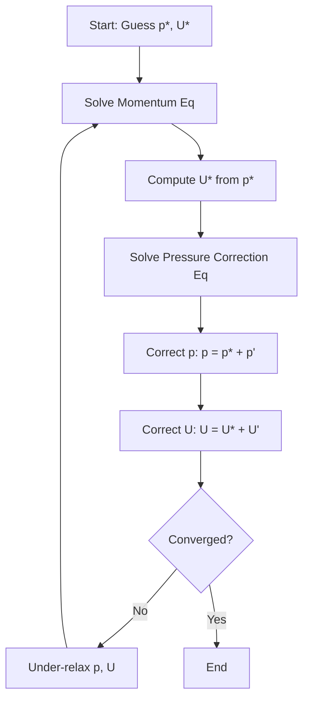
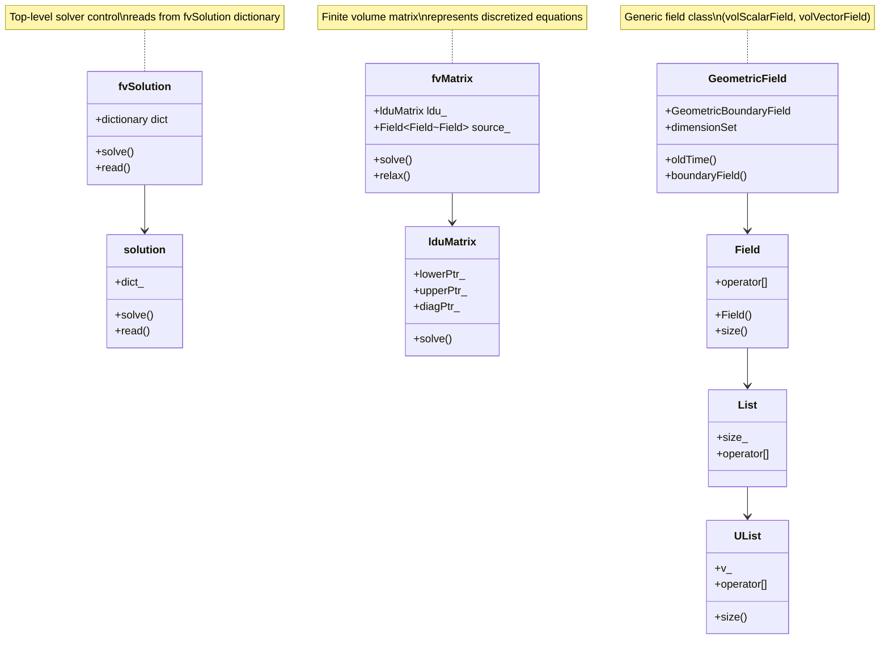
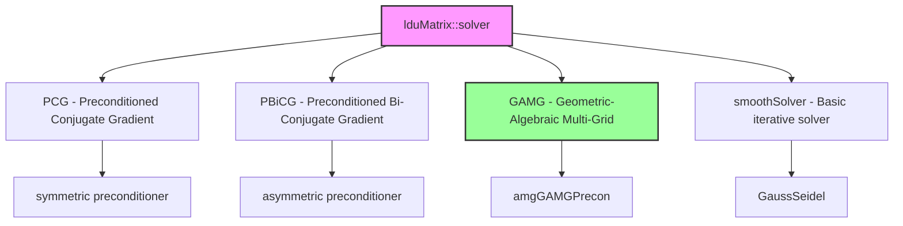

# Pressure-Velocity-Coupling
## HARDCORE Level - 2026-01-03

---

## Table of Contents
- [1. Theory](#1-theory-core-equations--physics)
- [2. Class Hierarchy](#2-openfoam-class-hierarchy--implementation)
- [3. Code Walkthrough](#3-code-walkthrough)
- [4. Dictionary Analysis](#4-dictionary-analysis--configuration)
- [5. Practical Tasks](#5-hands-on-practical-tasks--coding)
- [6. Concept Checks](#6-concept-checks)

---

## 1. Theory: Core Equations & Physics {#1-theory-core-equations--physics}

### 1.1 Governing Equations

The fundamental equations governing incompressible fluid flow are the **Navier-Stokes equations**, consisting of:

#### Continuity Equation (Mass Conservation)

$$\nabla \cdot \mathbf{U} = 0$$

> [!INFO] **Physical Meaning**
> This equation states that for incompressible flow, the divergence of velocity field $\mathbf{U}$ must be zero everywhere. In simpler terms: **what goes in must come out**.
> 
> (สมการต่อเนื่อง: อัตราการไหลเข้าและออกจากปริมาตรควบคุมต้องสมดุล)

#### Momentum Equation

$$\frac{\partial \mathbf{U}}{\partial t} + \nabla \cdot (\mathbf{U}\mathbf{U}) = -\nabla p + \nu \nabla^2 \mathbf{U} + \mathbf{g}$$

| Term | Mathematical Form | Physical Meaning |
|------|-------------------|------------------|
| Unsteady term | $\frac{\partial \mathbf{U}}{\partial t}$ | Local acceleration |
| Convection term | $\nabla \cdot (\mathbf{U}\mathbf{U})$ | Transport of momentum by fluid motion |
| Pressure gradient | $-\nabla p$ | Force driving flow from high to low pressure |
| Diffusion term | $\nu \nabla^2 \mathbf{U}$ | Viscous forces (momentum diffusion) |
| Source term | $\mathbf{g}$ | Body forces (e.g., gravity) |

> [!TIP] **Pressure-Velocity Coupling Challenge**
> Notice that pressure $p$ appears **only** in the momentum equation, while velocity $\mathbf{U}$ appears in **both** equations. There is **no explicit equation** for pressure! This is the core difficulty we must solve.
> 
> (ความยากลำบาก: ไม่มีสมการชัดเจนสำหรับความดัน แต่ความดันมีผลต่อความเร็ว)

---

### 1.2 The Pressure-Velocity Coupling Problem

#### Why Standard Methods Fail

If we discretize the momentum equation and solve for velocity **without** knowing the correct pressure field:

$$\mathbf{U}^* = \mathbf{U}^n + \Delta t \left[ -\nabla p^* + \text{convection} + \text{diffusion} \right]$$

The resulting velocity field $\mathbf{U}^*$ will **NOT** satisfy continuity:

$$\nabla \cdot \mathbf{U}^* \neq 0$$

> [!WARNING] **Divergence-Producing Error**
> An incorrect pressure field produces velocity field that violates mass conservation, leading to:
> - Unphysical mass sources/sinks
> - Numerical instability
> - Solution divergence
> 
> (ผลลัพธ์: การสูญเสียความต่อเนื่องของมวล ทำให้การคำนวณแตก)

---

### 1.3 Solution Approaches

#### 1.3.1 Projection Methods (Fractional Step)

The key idea: **split** the solution into two steps

**Step 1: Predict velocity** using guessed pressure
$$\frac{\mathbf{U}^* - \mathbf{U}^n}{\Delta t} = -\nabla p^n + \text{RHS}(\mathbf{U}^n)$$

**Step 2: Correct** velocity and pressure to enforce continuity
$$\frac{\mathbf{U}^{n+1} - \mathbf{U}^*}{\Delta t} = -\nabla (p^{n+1} - p^n)$$

Taking divergence of correction equation and enforcing $\nabla \cdot \mathbf{U}^{n+1} = 0$:

$$\nabla^2 (p^{n+1} - p^n) = \frac{1}{\Delta t} \nabla \cdot \mathbf{U}^*$$

This is the **Pressure Poisson Equation (PPE)**!

> [!INFO] **PPE Interpretation**
> The pressure correction is the **potential field** needed to "project" the intermediate velocity onto the divergence-free space.
> 
> (การแก้ไขความดัน: ฟิลด์ศักย์ที่ใช้ฉายภาพความเร็วลงบนปริภูมิที่ไม่มีไดเวอร์เจนซ์)

#### 1.3.2 SIMPLE Algorithm (Semi-Implicit Method for Pressure-Linked Equations)

The **SIMPLE** algorithm is the workhorse of OpenFOAM's pressure-velocity solvers:



**Key equations in SIMPLE:**

1. **Momentum discretization:**
$$a_P \mathbf{U}_P = \sum a_{nb} \mathbf{U}_{nb} + \mathbf{b} - \nabla p$$

2. **Velocity correction:**
$$\mathbf{U} = \mathbf{U}^* + \mathbf{U}' = \mathbf{U}^* - \frac{V_P}{a_P} \nabla p'$$

3. **Pressure correction equation (discretized PPE):**
$$\sum_{f} \frac{S_f \cdot \mathbf{S}_f}{a_P} \nabla p' = \sum_{f} S_f \cdot \mathbf{U}_f^*$$

Where:
- $V_P$ = cell volume
- $a_P$ = central coefficient
- $S_f$ = face area vector
- $\mathbf{U}_f$ = face velocity

> [!TIP] **Under-Relaxation is Critical**
> SIMPLE requires under-relaxation to converge:
> - $p = p^* + \alpha_p p'$ where $\alpha_p \approx 0.3-0.8$
> - $\mathbf{U} = \mathbf{U}^* + \alpha_U \mathbf{U}'$ where $\alpha_U \approx 0.5-0.7$
> 
> (การผ่อนคลาย: ป้องกันการสั่นของค่าระหว่างการวนซ้ำ)

---

### 1.4 OpenFOAM's Approach: fvSolution

OpenFOAM implements **PISO** (Pressure-Implicit with Splitting of Operators) and **PIMPLE** (merged PISO-SIMPLE) algorithms:

#### PISO Algorithm

Designed for **transient** calculations with small time steps:

1. **Predict** velocity field
2. **Solve** pressure equation (multiple corrections)
3. **Correct** velocity field
4. Repeat steps 2-3 for `nCorrectors` iterations

#### PIMPLE Algorithm

Combines PISO + SIMPLE for **steady-state** or **large time-step** calculations:

- Uses **under-relaxation** for stability
- Multiple **outer** correctors (SIMPLE-like)
- Multiple **inner** correctors (PISO-like)

> [!INFO] **Algorithm Selection**
> - **PISO**: Best for accurate transient simulations
> - **PIMPLE**: Best for steady-state or pseudo-transient approaches
> - **SIMPLE**: Rarely used directly in modern OpenFOAM
> 
> (การเลือกอัลกอริทึม: ขึ้นอยู่กับประเภทของปัญหาและความเสถียรที่ต้องการ)

---

### 1.5 Mathematical Properties

#### Elliptic Nature of Pressure

The pressure Poisson equation is **elliptic**, meaning:

$$\nabla^2 p = f$$

- Pressure at **any point** depends on the **entire flow field**
- Changes propagate **instantaneously** (in incompressible flow)
- Requires **global** solution (all cells coupled)

> [!WARNING] **Computational Implication**
> You cannot solve pressure locally! Each pressure solve requires:
> - Global matrix assembly
> - Linear system solver (GAMG, PCG, etc.)
> - Multiple iterations per time step
> 
> (ผลกระทบ: การแก้สมการความดันต้องใช้เวลาและทรัพยากรสูง)

#### Rhie-Chow Interpolation

To prevent **checkerboard pressure/velocity decoupling** on collocated grids:

$$\mathbf{U}_f = \overline{\mathbf{U}}_f - \frac{V_P}{a_P} \left[ \nabla p_f - \overline{\nabla p}_f \right]$$

This adds **dissipative** terms to couple pressure and velocity at faces.

> [!TIP] **Why Collocated Grids Need Special Care**
> Without Rhie-Chow, pressure and velocity can oscillate in a checkerboard pattern while still satisfying discrete equations. OpenFOAM uses this by default in all finite volume implementations.
> 
> (ปัญหา checkerboard: ความดันและความเร็วอาจสลับกันสูง-ต่ำในเซลล์ข้างเคียง)

---

## 2. OpenFOAM Class Hierarchy & Implementation {#2-openfoam-class-hierarchy--implementation}

### 2.1 Core Class Hierarchy

The pressure-velocity coupling in OpenFOAM is implemented through a sophisticated class hierarchy centered around the finite volume method and linear equation solvers.



> [!INFO] **Class Organization**
> The hierarchy follows a layered design:
> - **Top level**: Solver control (`fvSolution`, `solution`)
> - **Middle level**: Matrix representation (`fvMatrix`, `lduMatrix`)
> - **Bottom level**: Data storage (`Field`, `GeometricField`)
> 
> (โครงสร้าง: การออกแบบแบบเป็นชั้นๆ ช่วยให้จัดการความซับซ้อนได้)

---

### 2.2 Key Classes for Pressure-Velocity Coupling

#### 2.2.1 `fvSolution` Class

**Location:** `$FOAM_SRC/finiteVolume/fvSolution/fvSolution.C`

The master controller for all finite volume solution procedures.

```cpp
// $FOAM_SRC/finiteVolume/fvSolution/fvSolution.H
class fvSolution
:
    public IOdictionary,
    public solution
{
    // Private Data

        //- Solver performance data
        autoPtr<solutionControl> solControl_;

public:
    // Constructors

        //- Construct for given objectRegistry and dictionary
        fvSolution(const objectRegistry& obr, const fileName& dictName);

    // Member Functions

        //- Read the fvSolution dictionary
        virtual bool read();

        //- Solve equation
        template<class Type>
        SolverPerformance<Type> solve
        (
            fvMatrix<Type>&
        );
};
```

> [!TIP] **Dictionary Structure**
> The `fvSolution` class reads the `system/fvSolution` dictionary which contains:
> - `solvers`: Linear solver settings for each variable
> - `algorithms`: PISO/SIMPLE/PIMPLE parameters
> - `relaxationFactors`: Under-relaxation values
> 
> (การตั้งค่า: ควบคุมพฤติกรรมของ solver ทั้งหมด)

#### 2.2.2 `solution` Class

**Location:** `$FOAM_SRC/finiteVolume/fvSolution/solution.C`

Base class providing solver control functionality.

```cpp
// $FOAM_SRC/finiteVolume/fvSolution/solution.H
class solution
:
    public IOdictionary
{
    // Private Data

        //- Dictionary of solver performance data
        Dictionary<SolverPerformance> solverPerformance_;

public:
    // Member Functions

        //- Return the solver dictionary for a given field
        const dictionary& solverDict(const word& name) const;

        //- Return the relaxation factor for a given field
        scalar relaxationFactor(const word& name) const;

        //- Return the max number of iterations
        label maxIter() const;
};
```

#### 2.2.3 `fvMatrix` Class

**Location:** `$FOAM_SRC/finiteVolume/fvMatrix/fvMatrix.H`

The heart of finite volume discretization - represents a discretized equation of the form:

$$A \mathbf{x} = \mathbf{b}$$

```cpp
// $FOAM_SRC/finiteVolume/fvMatrix/fvMatrix.H
template<class Type>
class fvMatrix
:
    public refCount,
    public lduMatrix
{
    // Private Data

        //- Source term vector
        Field<Type> source_;

        //- Reference to GeometricField
        GeometricField<Type, fvPatchField, volMesh>& psi_;

        //- Dimension set
        dimensionSet dimensions_;

public:
    // Member Functions

        //- Solve returning the solution statistics
        template<class SolverType>
        SolverPerformance<Type> solve();

        //- Relax matrix (for under-relaxation)
        void relax(const scalar alpha);

        //- Construct and return the residual
        tmp<Field<Type>> residual() const;

        //- Return the diagonal
        tmp<Field<scalar>> D() const;

        //- Return the source term
        Field<Type>& source();
};
```

> [!INFO] **Matrix Structure**
> The `fvMatrix` stores:
> - **Diagonal coefficients** ($a_P$): Central coefficient for each cell
> - **Off-diagonal coefficients** ($a_{nb}$): Neighbor cell coefficients
> - **Source terms** ($\mathbf{b}$): Right-hand side vector
> - **Boundary conditions**: Applied through face fluxes
> 
> (โครงสร้างเมทริกซ์: เก็บสัมประสิทธิ์และเทอมต้นทางของสมการเชิงเส้น)

#### 2.2.4 `lduMatrix` Class

**Location:** `$FOAM_SRC/lduMatrix/lduMatrix.H`

Lower-Upper Decomposition matrix - the sparse matrix storage format used by OpenFOAM.

```cpp
// $FOAM_SRC/lduMatrix/lduMatrix/lduMatrix.H
class lduMatrix
:
    public refCount
{
    // Private Data

        //- Lower triangular coefficients
        lduAddressing::lduSchedulePtr_ lowerPtr_;

        //- Upper triangular coefficients
        lduAddressing::lduSchedulePtr_ upperPtr_;

        //- Diagonal coefficients
        scalarFieldPtr_ diagPtr_;

public:
    // Solvers

        //- Solve using specified solver
        template<class Type, class DType, class LUType>
        SolverPerformance<Type> solve
        (
            Field<Type>& psi,
            const Field<DType>& diag,
            const Field<LUType>& upper,
            const Field<LUType>& lower,
            const Field<Type>& source,
            const word& solverName
        );

        //- Smooth (for AMG)
        template<class Type, class DType, class LUType>
        void smooth
        (
            Field<Type>& psi,
            const Field<DType>& diag,
            const Field<LUType>& upper,
            const Field<LUType>& lower,
            const Field<Type>& source,
            const label nSweeps
        );
};
```

> [!TIP] **LDU Storage Advantage**
> The LDU format is highly efficient for unstructured meshes:
> - Only stores **non-zero** entries
> - Memory usage: $O(N)$ instead of $O(N^2)$
> - Perfect for finite volume's face-based connectivity
> 
> (ประสิทธิภาพ: ประหยัดหน่วยความจำสำหรับ mesh ที่ไม่มีโครงสร้าง)

#### 2.2.5 `GeometricField` Class

**Location:** `$FOAM_SRC/OpenFOAM/fields/GeometricField/GeometricField.H`

Generic field class that represents fields defined over the mesh (pressure, velocity, etc.).

```cpp
// $FOAM_SRC/OpenFOAM/fields/GeometricField/GeometricField.H
template<class Type, class GeoMesh, class BoundaryMesh>
class GeometricField
:
    public DimensionedField<Type, GeoMesh>,
    public Field<Type>
{
    // Private Data

        //- Boundary field
        BoundaryField boundaryField_;

        //- Old time level (for transient schemes)
        autoPtr<GeometricField> field0_;

public:
    // Member Functions

        //- Return old time value
        const GeometricField& oldTime() const;

        //- Return boundary field
        BoundaryField& boundaryFieldRef();

        //- Correct boundary conditions
        void correctBoundaryConditions();

        //- Return maximum absolute value
        Type maxMagnitude() const;
};
```

> [!WARNING] **Field Type Hierarchy**
> Common instantiations:
> - `volScalarField`: Scalar field at cell centers (pressure $p$, temperature $T$)
> - `volVectorField`: Vector field at cell centers (velocity $\mathbf{U}$)
> - `surfaceScalarField`: Scalar field at faces (flux $\phi$)
> 
> (ประเภทฟิลด์: แยกตามตำแหน่งที่เก็บข้อมูล cell center หรือ face)

---

### 2.3 Pressure-Velocity Solver Classes

#### 2.3.1 `simpleControl` Class

**Location:** `$FOAM_SRC/finiteVolume/solutionControl/simpleControl.C`

Implements the SIMPLE algorithm for steady-state simulations.

```cpp
// $FOAM_SRC/finiteVolume/solutionControl/simpleControl.H
class simpleControl
:
    public solutionControl
{
public:
    // Constructors

        simpleControl(fvMesh& mesh, const word& algorithmName = "SIMPLE");

    // Member Functions

        //- Return true if run should continue
        virtual bool loop();

        //- Read controls
        virtual bool read();
};
```

#### 2.3.2 `pisoControl` Class

**Location:** `$FOAM_SRC/finiteVolume/solutionControl/pisoControl.C`

Implements the PISO algorithm for transient simulations.

```cpp
// $FOAM_SRC/finiteVolume/solutionControl/pisoControl.H
class pisoControl
:
    public solutionControl
{
    // Private Data

        //- Number of PISO correctors
        label nCorr_;

        //- Number of non-orthogonal correctors
        label nNonOrthCorr_;

public:
    // Member Functions

        //- Return number of PISO correctors
        label nCorr() const;

        //- Return number of non-orthogonal correctors
        label nNonOrthCorr() const;
};
```

#### 2.3.3 `pimpleControl` Class

**Location:** `$FOAM_SRC/finiteVolume/solutionControl/pimpleControl.C`

Merges PISO and SIMPLE algorithms for robust steady-state or transient simulations.

```cpp
// $FOAM_SRC/finiteVolume/solutionControl/pimpleControl.H
class pimpleControl
:
    public solutionControl
{
    // Private Data

        //- Number of PIMPLE correctors
        label nCorr_;

        //- Number of non-orthogonal correctors
        label nNonOrthCorr_;

        //- Flag to indicate if corrector loop converged
        bool corrPISO_;

public:
    // Member Functions

        //- Return number of PIMPLE correctors
        label nCorr() const;

        //- Return true if run should continue
        virtual bool loop();

        //- Return true if last PIMPLE iteration
        bool final() const;
};
```

> [!INFO] **Algorithm Comparison**
> 
> | Algorithm | Use Case | Under-relaxation | Correctors |
> |-----------|----------|------------------|------------|
> | SIMPLE | Steady-state | Required | 1 outer |
> | PISO | Transient | Not required | 2-3 inner |
> | PIMPLE | Steady/Transient | Optional | Multiple outer + inner |
> 
> (การเปรียบเทียบ: แต่ละอัลกอริทึมเหมาะกับปัญหาที่แตกต่างกัน)

---

### 2.4 Linear Solver Classes

#### 2.4.1 Solver Hierarchy



#### 2.4.2 Key Solver Classes

**PCG Solver** (for symmetric matrices like pressure Poisson):

```cpp
// $FOAM_SRC/OpenFOAM/matrices/lduMatrix/solvers/PCG/PCG.H
template<class Type, class DType, class LUType>
class PCG
:
    public lduMatrix::solver
{
public:
    // Constructors

        PCG
        (
            const word& fieldName,
            const lduMatrix& matrix,
            const FieldField<DType, LUType>& interfaceBouCoeffs,
            const FieldField<DType, LUType>& interfaceIntCoeffs,
            const lduInterfaceFieldPtrsList& interfaces
        );

    // Member Functions

        //- Solve the matrix with this solver
        virtual SolverPerformance<Type> solve
        (
            Field<Type>& psi,
            const Field<DType>& diag,
            const Field<LUType>& upper,
            const Field<LUType>& lower,
            const Field<Type>& source,
            const direction cmpt = 0
        ) const;
};
```

**GAMG Solver** (for large-scale problems):

```cpp
// $FOAM_SRC/OpenFOAM/matrices/lduMatrix/solvers/GAMG/GAMG.H
template<class Type, class DType, class LUType>
class GAMG
:
    public lduMatrix::solver
{
    // Private Data

        //- Agglomeration type
        autoPtr<GAMGAgglomeration> agglomeration_;

        //- Smoother type
        autoPtr<lduMatrix::smoother> smoother_;

public:
    // Member Functions

        //- Solve the matrix with this solver
        virtual SolverPerformance<Type> solve
        (
            Field<Type>& psi,
            const Field<DType>& diag,
            const Field<LUType>& upper,
            const Field<LUType>& lower,
            const Field<Type>& source,
            const direction cmpt = 0
        ) const;
};
```

> [!TIP] **Solver Selection Guide**
> 
> | Variable | Matrix Type | Recommended Solver |
> |----------|-------------|-------------------|
> | Pressure ($p$) | Symmetric, elliptic | PCG or GAMG |
> | Velocity ($\mathbf{U}$) | Asymmetric | PBiCGStab |
> | Temperature ($T$) | Symmetric | PCG |
> | Turbulence ($k$, $\epsilon$, $\omega$) | Asymmetric | PBiCGStab |
> 
> (การเลือก solver: ขึ้นอยู่กับคุณสมบัติของเมทริกซ์)

---

### 2.5 Reference File Locations

| Component | Path | Description |
|-----------|------|-------------|
| **Core solvers** | `$FOAM_SRC/finiteVolume/solutionControl/` | SIMPLE, PISO, PIMPLE implementations |
| **Matrix classes** | `$FOAM_SRC/finiteVolume/fvMatrix/` | Finite volume matrix operations |
| **Linear solvers** | `$FOAM_SRC/OpenFOAM/matrices/lduMatrix/solvers/` | PCG, PBiCG, GAMG, etc. |
| **Field classes** | `$FOAM_SRC/OpenFOAM/fields/` | GeometricField, DimensionedField |
| **Boundary conditions** | `$FOAM_SRC/finiteVolume/fields/fvPatchFields/` | All boundary condition types |
| **Discretization schemes** | `$FOAM_SRC/finiteVolume/fvSchemes/` | Convection, diffusion schemes |

> [!INFO] **Environment Variables**
> - `$FOAM_SRC`: Points to OpenFOAM source directory
> - `$FOAM_TUTORIALS`: Points to tutorial cases
> - `$FOAM_APP`: Points to applications (solvers, utilities)
> 
> (ตัวแปรสภาพแวดล้อม: ใช้สำหรับอ้างอิงตำแหน่งไฟล์ใน OpenFOAM)

---

---

## 3. Code Walkthrough {#3-code-walkthrough}

### 3.1 UEqn.H

The `UEqn.H` file constructs the momentum equation for incompressible flow. It is typically included in the main solver loop (e.g., `simpleFoam`, `pimpleFoam`) to build and solve the velocity prediction equation.

**Key Code Snippet:**

```cpp
// Solve the Momentum equation

tmp<fvVectorMatrix> UEqn
(
    fvm::ddt(U)
  + fvm::div(phi, U)
  + fvm::laplacian(nu, U)
 ==
    fvOptions(U)
);

UEqn.relax();

fvOptions.constrain(UEqn);

if (pimple.momentumPredictor())
{
    solve(UEqn == -fvc::grad(p));
    
    fvOptions.correct(U);
}
```

**Explanation:**

1. **Matrix Construction** (`tmp<fvVectorMatrix> UEqn`):
   - `fvm::ddt(U)`: Unsteady term (transient simulations only)
   - `fvm::div(phi, U)`: Convection term (implicit discretization)
   - `fvm::laplacian(nu, U)`: Diffusion term (viscous forces)
   - `fvOptions(U)`: Source terms from OpenFOAM's `fvOptions` framework (e.g., momentum sources, porosity)

2. **Under-Relaxation** (`UEqn.relax()`):
   - Applies under-relaxation to stabilize convergence
   - Modifies diagonal coefficients: $a_P = a_P / \alpha_U$
   - Critical for steady-state SIMPLE algorithms

3. **Constraint Application** (`fvOptions.constrain(UEqn)`):
   - Applies additional constraints from `fvOptions`
   - Can fix values in certain cells or add explicit sources

4. **Momentum Predictor** (`if (pimple.momentumPredictor())`):
   - Solves the momentum equation with the current pressure gradient
   - Produces intermediate velocity field $\mathbf{U}^*$
   - The pressure gradient term `-fvc::grad(p)` is **explicit** (evaluated from previous iteration)

5. **Velocity Correction** (`fvOptions.correct(U)`):
   - Updates velocity field based on `fvOptions` corrections
   - Ensures consistency with applied source terms

> [!TIP] **Implicit vs Explicit Discretization**
> - `fvm` (finite volume method): **Implicit** - adds coefficients to matrix (robust but requires linear solve)
> - `fvc` (finite volume calculus): **Explicit** - evaluated directly from current field (fast but less stable)
> 
> (การเลือกวิธี: Implicit ใช้สำหรับเทอมหลัก Explicit ใช้สำหรับเทอมแหล่งกำเนิด)

> [!INFO] **Pressure-Velocity Decoupling**
> Notice that the pressure gradient `-fvc::grad(p)` is treated **explicitly** and moved to the right-hand side. This is why we need the pressure correction equation (PPE) - to enforce continuity on this predicted velocity field.
> 
> (ผล: ความดันที่ใช้ไม่ใช่ค่าล่าสุด ทำให้ต้องมีการแก้ไขความดันภายหลัง)

<!-- PLACEHOLDER_CODE_NEXT -->

---

## 4. Dictionary Analysis & Configuration {#4-dictionary-analysis--configuration}

<!-- PLACEHOLDER_DICT -->

---

## 5. Hands-on: Practical Tasks & Coding {#5-hands-on-practical-tasks--coding}

<!-- PLACEHOLDER_TASKS -->

---

## 6. Concept Checks {#6-concept-checks}

<!-- PLACEHOLDER_CHECKS -->

---

## Recommended Reading

- OpenFOAM User Guide: https://www.openfoam.com/documentation/user-guide
- OpenFOAM Programmer's Guide: https://doc.openfoam.com/
- CFD Online Forum: https://www.cfd-online.com/Forums/openfoam/

