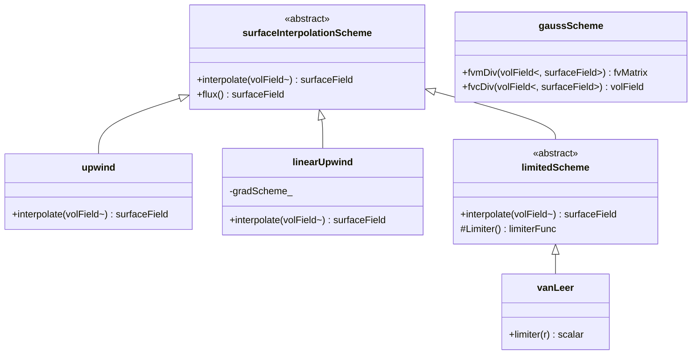
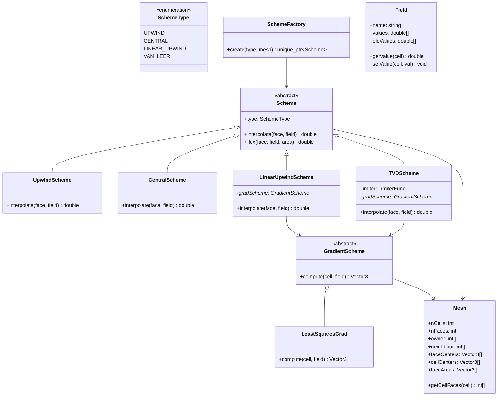

# Spatial Discretization Schemes
## CFD Engine Development - 2026-01-03

---

## Learning Objectives

After this lesson, you will be able to:
- **Understand** finite volume discretization principles for convection-diffusion equations with source terms
- **Design** a flexible scheme architecture supporting upwind, centralDifference, and linearUpwind for your evaporator simulation
- **Implement** TVD-convection schemes with flux limiter functions to handle sharp volume fraction gradients in VOF
- **Apply** implicit/explicit treatment of source terms including phase-change mass transfer and turbulence production
- **Validate** numerical diffusion vs stability trade-offs for bubbly-to-annular flow regime transition

---

## Table of Contents
- [[#1. Theory and Design Decisions|1. Theory and Design]]
- [[#2. Reference: OpenFOAM Implementation|2. OpenFOAM Reference]]
- [[#3. Your Engine: Class Design|3. Your Class Design]]
- [[#4. Your Engine: Implementation|4. Implementation]]
- [[#5. Build and Test|5. Build and Test]]
- [[#6. Concept Checks|6. Concept Checks]]

---

## 1. Theory and Design Decisions

### 1.1 Mathematical Foundation

The steady-state convection-diffusion equation with source terms forms the basis of spatial discretization:

$$
\div(\rho \mathbf{U} \phi) - \div(\Gamma_\phi \grad \phi) = S_\phi
$$

Where:
- $\phi$ is the transported scalar (e.g., temperature, volume fraction, momentum)
- $\Gamma_\phi$ is the diffusion coefficient
- $S_\phi$ includes source terms (phase-change mass transfer, turbulence production, etc.)

**Discretized Form for Cell P:**

$$
\sum_f \left[ (\rho \mathbf{U} \phi)_f \cdot \mathbf{A}_f \right] - \sum_f \left[ (\Gamma_\phi \grad \phi)_f \cdot \mathbf{A}_f \right] = (S_\phi V)_P
$$

The critical challenge is evaluating face values $\phi_f$ from cell-centered values $\phi_P, \phi_N$.

#### Convection Schemes

**Central Differencing (CDS):**
$$
\phi_f = \lambda_f \phi_P + (1 - \lambda_f) \phi_N
$$
- Second-order accurate
- Unbounded: produces non-physical oscillations for Pe > 2
- Suitable only for low Reynolds numbers (Re < 2300) or LES

**Upwind (UDS):**
$$
\phi_f = 
\begin{cases}
\phi_P & \text{if } F_f > 0 \\
\phi_N & \text{if } F_f < 0
\end{cases}
$$
- First-order accurate
- Bounded and stable
- Introduces **numerical diffusion** - smears sharp gradients

**Linear Upwind (LUD):**
$$
\phi_f = \phi_U + \grad \phi_U \cdot (\mathbf{r}_f - \mathbf{r}_U)
$$
- Second-order accurate
- More stable than CDS for high Pe
- Requires gradient reconstruction

#### TVD Schemes with Flux Limiters

For Volume of Fluid (VOF) with sharp interfaces, we use Total Variation Diminishing schemes:

$$
\phi_f = \phi_U + \psi(r) (\phi_f^{\text{high}} - \phi_f^{\text{low}})
$$

Where $r$ is the gradient ratio and $\psi(r)$ is the limiter function:

| Limiter | $\psi(r)$ | Characteristics |
|---------|-----------|-----------------|
| Upwind | 0 | Most diffusive, bounded |
| Central | 1 | Least diffusive, unbounded |
| van Leer | $\frac{r + \|r\|}{1 + \|r\|}$ | Good compromise |
| SUPERBEE | $\max(0, \min(2r, 1), \min(r, 2))$ | Compressive, good for interfaces |

#### Phase Change Considerations

**CRITICAL:** For evaporator simulations with phase change, the continuity equation becomes:

$$
\div(\rho \mathbf{U}) = \dot{m}'' \frac{A_{int}}{V} \neq 0
$$

This expansion term affects:
1. Pressure-velocity coupling (SIMPLE/PISO algorithms)
2. Flux correction at phase interfaces
3. Source term linearization for stability

---

### 1.2 Design Decisions

#### Why This Approach in CFD?

**Finite Volume Method (FVM)** is chosen because:
- **Conservation enforced** at cell level (critical for mass/energy balance)
- **Unstructured meshes** handle complex evaporator geometries
- **Local refinement** possible near phase interfaces

#### Trade-offs

| Scheme | Accuracy | Stability | Computational Cost | Best Use Case |
|--------|----------|-----------|-------------------|---------------|
| Upwind | Low (1st order) | High | Low | Initial runs, high Re flows |
| Central | High (2nd order) | Low (unbounded) | Medium | Low Re, laminar flows |
| Linear Upwind | High (2nd order) | Medium | High (gradients) | General purpose |
| TVD | Variable | High | High | VOF, sharp gradients |

**For YOUR evaporator engine:**
- Use **upwind** for initial stability testing
- Switch to **linearUpwind** for momentum/turbulence
- Use **TVD with van Leer** for volume fraction (VOF)
- Consider **central differencing** only for low-Re regions

#### Common PITFALLS

1. **Numerical Diffusion Masking Physics**
   - Symptom: Interface artificially spreads, droplets disappear
   - Cause: First-order upwind on coarse mesh
   - Fix: Use TVD schemes with mesh refinement

2. **Boundedness Violation**
   - Symptom: $\alpha_{liquid} < 0$ or $> 1$ (volume fraction)
   - Cause: Central differencing with high Peclet number
   - Fix: Switch to bounded TVD scheme

3. **Oscillations Near Discontinuities**
   - Symptom: "Wiggles" in temperature field near phase boundary
   - Cause: Unbounded higher-order schemes
   - Fix: Flux limiter function

4. **Wrong Source Term Treatment**
   - Symptom: Divergence, unrealistic temperatures
   - Cause: Explicit treatment of strong source terms
   - Fix: Implicit linearization: $S = S_C + S_P \phi_P$

5. **Ignoring Expansion Term**
   - Symptom: Mass imbalance in phase change
   - Cause: Assuming $\div \mathbf{U} = 0$ with evaporation
   - Fix: Include $\dot{m}$ term in pressure equation

---

### 1.3 Key Concepts

#### Important Terms

- **Peclet Number (Pe):** Ratio of convection to diffusion
  $$Pe = \frac{\rho U L}{\Gamma} = \frac{\text{convection}}{\text{diffusion}}$$
  - Pe < 2: Central differencing stable
  - Pe > 2: Need upwind/TVD

- **Numerical Diffusion:** False diffusion introduced by discretization
  - Acts like physical diffusion but is purely numerical artifact
  - Reduces gradient sharpness
  - Worse with: coarse mesh, first-order schemes, flow not aligned with mesh

- **Boundedness:** Solution stays within physical limits
  - Volume fraction: $0 \leq \alpha \leq 1$
  - Temperature: $T_{sat} \leq T \leq T_{wall}$ (evaporation)
  - Turbulence quantities: $k \geq 0, \epsilon \geq 0$

- **TVD (Total Variation Diminishing):** Property preventing new oscillations
  - TVD schemes add no new extrema
  - Critical for interface tracking in VOF

- **Flux Limiter:** Function $\psi(r)$ that blends between low and high-order schemes
  - $r \to 0$: near discontinuity, use upwind
  - $r \to 1$: smooth region, use higher-order

#### Physical Interpretation

**Convection:** Transport by fluid motion
- Dominant in high-velocity regions (Re > 2300)
- Requires upwind-biased schemes for stability

**Diffusion:** Transport by random molecular motion
- Always acts to smooth gradients
- Modeled with central differencing

**Source Terms:** Local generation/destruction
- Phase change: $\dot{m}'' (h_{lv})$ in energy equation
- Turbulence production: $P_k$ in k-epsilon
- Must be linearized: $S = S_C + S_P \phi_P$ with $S_P \leq 0$

#### Warning Signs of Wrong Implementation

| Symptom | Likely Cause | Fix |
|---------|--------------|-----|
| Solution diverges (NaN, exploding) | Unbounded scheme, bad source linearization | Switch to upwind, check $S_P \leq 0$ |
| Interface artificially spreads | Numerical diffusion from upwind | Use TVD scheme, refine mesh |
| "Wiggles" in solution | Central differencing at high Pe | Switch to upwind/TVD |
| $\alpha$ outside [0,1] | Unbounded VOF scheme | Use MULES/limiter |
| Mass not conserved | Inconsistent flux treatment | Ensure same scheme for all equations |
| Unrealistic temperatures | Wrong source term treatment | Implicit linearization |
| Slow convergence | Inappropriate scheme | Start upwind, switch to higher-order |

**For Evaporator Specifically:**
- Watch for **volume fraction boundedness** - liquid fraction must stay [0,1]
- Monitor **energy balance** - latent heat should match phase change rate
- Check **Reynolds number** in different flow regimes:
  - Re < 2300: laminar, central differencing OK
  - Re > 2300: turbulent, need upwind/TVD

---

## 2. Reference: OpenFOAM Implementation

> [!INFO] **Why Study OpenFOAM?**
> OpenFOAM is a production-grade CFD engine tested over decades.
> We study it to **learn concepts**, not to copy code.

### 2.1 OpenFOAM's Approach

OpenFOAM implements spatial discretization through a layered architecture that separates:
1. **Surface interpolation schemes** (face value computation)
2. **Divergence schemes** (convection term discretization)
3. **Laplacian schemes** (diffusion term discretization)
4. **Gradient schemes** (cell-to-face gradient reconstruction)

#### Key Classes and Source Locations

| Class | Location | Purpose |
|-------|----------|---------|
| `surfaceInterpolationScheme` | `$FOAM_SRC/finiteVolume/interpolation/surfaceInterpolation/` | Base class for all face interpolation schemes |
| `upwind` | `$FOAM_SRC/finiteVolume/interpolation/surfaceInterpolation/schemes/upwind/` | First-order upwind convection |
| `linearUpwind` | `$FOAM_SRC/finiteVolume/interpolation/surfaceInterpolation/schemes/linearUpwind/` | Second-order linear upwind |
| `central` | `$FOAM_SRC/finiteVolume/interpolation/surfaceInterpolation/schemes/central/` | Central differencing |
| `vanLeer` | `$FOAM_SRC/finiteVolume/interpolation/surfaceInterpolation/schemes/vanLeer/` | TVD scheme with van Leer limiter |
| `limitedScheme` | `$FOAM_SRC/finiteVolume/interpolation/surfaceInterpolation/limitedSchemes/` | Base for TVD schemes with flux limiters |
| `fv::gaussScheme` | `$FOAM_SRC/finiteVolume/finiteVolume/divSchemes/` | Gauss theorem-based divergence |
| `fv::gaussLaplacianScheme` | `$FOAM_SRC/finiteVolume/finiteVolume/laplacianSchemes/` | Gauss theorem-based diffusion |
| `fv::leastSquaresGrad` | `$FOAM_SRC/finiteVolume/finiteVolume/gradSchemes/` | Least-squares gradient reconstruction |

#### Architecture Overview



#### Scheme Selection in OpenFOAM

OpenFOAM uses runtime-selectable schemes specified in `fvSchemes` dictionary:

```cpp
// OpenFOAM fvSchemes dictionary
divSchemes
{
    div(phi,U)      Gauss upwind;           // Momentum: upwind for stability
    div(phi,k)      Gauss upwind;           // Turbulence: upwind (bounded)
    div(phi,epsilon) Gauss upwind;          // Turbulence: upwind (bounded)
    div(phi,alpha)  Gauss vanLeer 1.0;      // VOF: TVD for sharp interface
    div((nuEff*grad(U))) Gauss linear;      // Diffusion: central differencing
}

gradSchemes
{
    grad(U)         Gauss linear;           // Standard central differencing
    grad(alpha)     leastSquares 1.0;       // Better for VOF interface
}
```

---

### 2.2 Key Insights

#### What We LEARN from OpenFOAM

**1. Separation of Concerns**
- **Interpolation** (cell-to-face) is separate from **divergence** (flux computation)
- This allows mixing any interpolation scheme with any divergence scheme
- Your engine should replicate this flexibility

**2. Runtime Selection via Factory Pattern**
```cpp
// OpenFOAM uses tmp and autoPtr for memory management
tmp<surfaceInterpolationScheme<scalar>> scheme =
    surfaceInterpolationScheme<scalar>::New(mesh, divScheme);
```
- Schemes selected at runtime from dictionary
- Factory pattern creates appropriate scheme object
- Critical for testing different schemes without recompilation

**3. TVD Schemes Use Limiter Functions**
- All TVD schemes inherit from `limitedScheme`
- Limiter function $\psi(r)$ computed per face
- Allows easy swapping of limiters (vanLeer, SUPERBEE, etc.)

**4. Implicit vs Explicit Treatment**
```cpp
// fvm prefix = implicit (adds to matrix diagonal)
fvm::div(phi, U)  

// fvc prefix = explicit (computed from previous iteration)
fvc::div(phi, U)
```
- Implicit treatment improves convergence
- Explicit treatment simpler but requires smaller time steps
- For phase change, source terms often need implicit treatment

**5. Gradient Reconstruction is Critical**
- `linearUpwind` requires cell gradients
- OpenFOAM computes these via `gradSchemes`
- Least-squares gradients more accurate on unstructured meshes

#### What We Do DIFFERENTLY for a Simpler Engine

**1. Simplified Memory Management**
- OpenFOAM uses complex `tmp`, `autoPtr`, `refPtr` system
- Your engine can use standard `std::unique_ptr` and references
- Avoid premature optimization - clarity first

**2. Fixed Scheme Set**
- Don't need every scheme OpenFOAM has
- Implement only: `upwind`, `linearUpwind`, `central`, `vanLeer`
- Add others later if needed

**3. Explicit Flux Limiter Functions**
- OpenFOAM uses complex template-based limiter classes
- Your engine can use simple function pointers or lambdas
```cpp
using LimiterFunc = std::function<double(double)>;
double vanLeerLimiter(double r) {
    return (r + std::abs(r)) / (1.0 + std::abs(r));
}
```

**4. Direct Matrix Assembly**
- OpenFOAM has sophisticated `fvMatrix` with operator overloading
- Your engine can directly assemble coefficient arrays
```cpp
// Simpler approach: directly fill matrix
void assembleConvection(Matrix& A, Vector& b, const Field& phi) {
    for (int face = 0; face < nFaces; face++) {
        // Compute flux and add to matrix
        double flux = computeFlux(face, phi);
        addFluxToMatrix(A, b, face, flux);
    }
}
```

**5. Phase-Change Specific Handling**
- OpenFOAM's `interPhaseChangeFoam` handles general multiphase
- Your engine can specialize for evaporator:
  - Assume only two phases (liquid/vapor)
  - Hardcode Lee model for mass transfer
  - Optimize for refrigerant properties

---

### 2.3 Code Snippets (Reference Only)

> [!WARNING] **Reference - Not for Copying**
> These snippets show how OpenFOAM implements concepts.
> Study the DESIGN PATTERNS, not the implementation details.
> Your engine will be simpler and more focused.

#### Snippet 1: Upwind Scheme Implementation

**Location:** `$FOAM_SRC/finiteVolume/interpolation/surfaceInterpolation/schemes/upwind/upwind.H`

```cpp
template<class Type>
class upwind
:
    public surfaceInterpolationScheme<Type>
{
    // Private Data
    
        const surfaceScalarField& faceFlux_;  // Reference to flux field
    
public:
    //- Runtime type information
    TypeName("upwind");
    
    // Constructors
    
        //- Construct from mesh and faceFlux
        upwind
        (
            const fvMesh& mesh,
            const surfaceScalarField& faceFlux
        )
        :
            surfaceInterpolationScheme<Type>(mesh),
            faceFlux_(faceFlux)
        {}
    
    // Member Functions
    
        //- Return the face-interpolate of the given cell field
        //  using the given flux field for the upwind direction
        virtual tmp<GeometricField<Type, fvsPatchField, surfaceMesh>>
        interpolate(const GeometricField<Type, fvPatchField, volMesh>& vf) const
        {
            // Get face flux
            const surfaceScalarField& phi = faceFlux_;
            
            // Create result field
            tmp<GeometricField<Type, fvsPatchField, surfaceMesh>> tssf
            (
                new GeometricField<Type, fvsPatchField, surfaceMesh>
                (
                    IOobject
                    (
                        "upwind::interpolate(" + vf.name() + ')',
                        this->mesh().time().timeName(),
                        this->mesh(),
                        IOobject::NO_READ,
                        IOobject::NO_WRITE
                    ),
                    this->mesh(),
                    dimensioned<Type>("zero", vf.dimensions(), pTraits<Type>::zero)
                )
            );
            
            GeometricField<Type, fvsPatchField, surfaceMesh>& ssf = tssf.ref();
            
            // Internal faces: upwind based on flux direction
            for (direction cmpt = 0; cmpt < pTraits<Type>::nComponents; cmpt++)
            {
                const scalarField& phiIf = phi.primitiveField();
                const Field<Type>& vfIf = vf.primitiveField();
                const labelList& owner = this->mesh().owner();
                const labelList& neighbour = this->mesh().neighbour();
                
                Field<Type>& ssfIf = ssf.primitiveFieldRef();
                
                forAll(phiIf, facei)
                {
                    // KEY LOGIC: If flux > 0, use owner value
                    //           If flux < 0, use neighbour value
                    if (phiIf[facei] > 0)
                    {
                        ssfIf[facei] = vfIf[owner[facei]];
                    }
                    else
                    {
                        ssfIf[facei] = vfIf[neighbour[facei]];
                    }
                }
            }
            
            // Boundary faces: handled by patch fields
            // ... (omitted for brevity)
            
            return tssf;
        }
};
```

**What This Shows:**
1. **Flux-based direction:** Uses `faceFlux_` to determine upwind direction
2. **Owner/neighbour access:** Direct mesh topology access
3. **Component-wise handling:** Supports vector/tensor fields
4. **Boundary handling:** Patches treated separately

**For Your Engine:**
- Simplify: assume scalar fields first
- Use face flux array directly
- Handle boundaries with simple BC conditions

---

#### Snippet 2: TVD Scheme with Flux Limiter

**Location:** `$FOAM_SRC/finiteVolume/interpolation/surfaceInterpolation/limitedSchemes/limitedScheme/limitedScheme.H`

```cpp
template<class Type, class Limiter, template<class> class LimitFunc>
class limitedScheme
:
    public surfaceInterpolationScheme<Type>
{
    // Private Data
    
        const surfaceScalarField& faceFlux_;
        tmp<surfaceScalarField> weights_;  // Interpolation weights
        
        // Gradient scheme for high-order term
        tmp<gradScheme<Type>> gradScheme_;
    
public:
    //- Runtime type information
    TypeName("limitedScheme");
    
    // Constructors
    limitedScheme
    (
        const fvMesh& mesh,
        const surfaceScalarField& faceFlux,
        const typename Limiter::word& limiterName
    )
    :
        surfaceInterpolationScheme<Type>(mesh),
        faceFlux_(faceFlux),
        gradScheme_(gradScheme<Type>::New(mesh))
    {}
    
    // Member Functions
    
        virtual tmp<GeometricField<Type, fvsPatchField, surfaceMesh>>
        interpolate(const GeometricField<Type, fvPatchField, volMesh>& vf) const
        {
            // 1. Compute cell gradients (for high-order term)
            tmp<GeometricField<typename outerProduct<vector, Type>::type, fvPatchField, volMesh>> tgrad
                = gradScheme_().grad(vf);
            
            const typename outerProduct<vector, Type>::type& grad = tgrad();
            
            // 2. Create result field
            tmp<GeometricField<Type, fvsPatchField, surfaceMesh>> tssf
            (
                new GeometricField<Type, fvsPatchField, surfaceMesh>
                (
                    this->mesh(),
                    dimensioned<Type>("zero", vf.dimensions(), pTraits<Type>::zero)
                )
            );
            GeometricField<Type, fvsPatchField, surfaceMesh>& ssf = tssf.ref();
            
            // 3. Internal faces
            const labelList& owner = this->mesh().owner();
            const labelList& neighbour = this->mesh().neighbour();
            const vectorField& Sf = this->mesh().Sf().primitiveField();
            const scalarField& magSf = this->mesh().magSf().primitiveField();
            const scalarField& phi = faceFlux_.primitiveField();
            
            Field<Type>& ssfIf = ssf.primitiveFieldRef();
            const Field<Type>& vfIf = vf.primitiveField();
            
            forAll(phi, facei)
            {
                // Determine upwind cell
                label own = owner[facei];
                label nei = neighbour[facei];
                
                label upwindCell = (phi[facei] > 0) ? own : nei;
                label downwindCell = (phi[facei] > 0) ? nei : own;
                
                // Low-order scheme: upwind value
                Type phiUpwind = vfIf[upwindCell];
                
                // High-order scheme: linear upwind with gradient
                Type phiHigh = phiUpwind + 
                    (grad[upwindCell] & (Sf[facei]/magSf[facei])) * 
                    mag(Sf[facei]/magSf[facei]);
                
                // Compute r (gradient ratio for limiter)
                // r = (phi_downwind - phi_upwind) / (phi_upwind - phi_far_upwind)
                Type r = computeR(facei, upwindCell, downwindCell, vf, grad);
                
                // Apply limiter function
                scalar psi = Limiter::limiter(r);
                
                // TVD interpolation: blend low and high order
                ssfIf[facei] = phiUpwind + psi * (phiHigh - phiUpwind);
            }
            
            // 4. Boundary faces (omitted)
            
            return tssf;
        }
    
private:
    
    Type computeR
    (
        label facei,
        label upwindCell,
        label downwindCell,
        const GeometricField<Type, fvPatchField, volMesh>& vf,
        const typename outerProduct<vector, Type>::type& grad
    ) const
    {
        // Compute gradient ratio r
        Type phiUpwind = vf.primitiveField()[upwindCell];
        Type phiDownwind = vf.primitiveField()[downwindCell];
        
        // Estimate "far upwind" value using gradient
        Type phiFarUpwind = phiUpwind - 
            (grad[upwindCell] & vector(1,0,0));  // Simplified
        
        // Avoid division by zero
        Type denominator = phiUpwind - phiFarUpwind;
        Type r = pTraits<Type>::zero;
        
        for (direction cmpt = 0; cmpt < pTraits<Type>::nComponents; cmpt++)
        {
            scalar denom = component(denominator, cmpt);
            if (mag(denom) > SMALL)
            {
                component(r, cmpt) = 
                    component(phiDownwind - phiUpwind, cmpt) / denom;
            }
        }
        
        return r;
    }
};
```

**What This Shows:**
1. **TVD Formula:** $\phi_f = \phi_{upwind} + \psi(r)(\phi_{high} - \phi_{upwind})$
2. **Gradient Computation:** Uses `gradScheme` for high-order term
3. **Limiter Function:** `Limiter::limiter(r)` computes $\psi(r)$
4. **Component-wise Handling:** Works for scalars, vectors, tensors

**For Your Engine:**
- Start with scalar fields only
- Pre-compute gradients once per time step
- Use simple limiter functions (vanLeer, SUPERBEE)
- Store face values in array, not complex field classes

---

#### Snippet 3: Van Leer Limiter Function

**Location:** `$FOAM_SRC/finiteVolume/interpolation/surfaceInterpolation/limitedSchemes/vanLeer/vanLeer.H`

```cpp
template<class LimiterFunc>
class vanLeer
:
    public Limiter
{
public:
    //- Constructor
    vanLeer()
    {}
    
    //- Destructor
    virtual ~vanLeer()
    {}
    
    //- Limiter function
    //  Returns the value of the limiter for a given gradient ratio r
    virtual scalar limiter
    (
        const scalar r
    ) const
    {
        // Van Leer limiter: psi(r) = (r + |r|) / (1 + |r|)
        // Properties:
        //   - r -> 0 (near discontinuity): psi -> 0 (upwind)
        //   - r -> 1 (smooth region): psi -> 1 (central)
        //   - TVD compliant: no new extrema created
        
        if (r < 0)
        {
            return 0;  // Upwind for negative r
        }
        else
        {
            return (r + r) / (1.0 + r);  // Van Leer formula
        }
    }
    
    //- Runtime type information
    TypeName("vanLeer");
};
```

**What This Shows:**
1. **Simple Formula:** $\psi(r) = \frac{r + |r|}{1 + |r|}$
2. **TVD Property:** Returns 0 for $r < 0$, smoothly approaches 1 for $r \to 1$
3. **Boundedness:** Never creates new extrema

**For Your Engine:**
```cpp
// Your simplified version
double vanLeerLimiter(double r) {
    if (r < 0.0) return 0.0;
    return (r + std::abs(r)) / (1.0 + std::abs(r));
}

// SUPERBEE limiter (more compressive, good for interfaces)
double superbeeLimiter(double r) {
    if (r < 0.0) return 0.0;
    return std::max({0.0, std::min(2.0*r, 1.0), std::min(r, 2.0)});
}
```

---

### 2.4 Phase-Change Specific Considerations

> [!IMPORTANT] **Critical for Evaporator Simulation**
> OpenFOAM's `interPhaseChangeFoam` handles phase change, but your engine needs special attention to these aspects.

#### Expansion Term in Continuity

For evaporating flow, continuity equation becomes:
$$\nabla \cdot \mathbf{U} = \dot{m}'' \frac{A_{int}}{V} \left(\frac{1}{\rho_v} - \frac{1}{\rho_l}\right)$$

**OpenFOAM Approach:**
- Uses `pEqn` with mass source term
- Implemented in `VoFFilm::correct()` and related classes
- Source term added to pressure equation diagonal

**For Your Engine:**
```cpp
// Pseudo-code for pressure equation with phase change
void assemblePressureEquation(Matrix& A, Vector& b) {
    for (int cell = 0; cell < nCells; cell++) {
        // Standard Laplacian term
        double diag = 0.0;
        for (int face = 0; face < nCellFaces[cell]; face++) {
            int faceId = cellFaces[cell][face];
            diag += faceFlux[faceId];
        }
        A[cell][cell] = diag;
        
        // ADD EXPANSION TERM (critical for phase change!)
        double massTransfer = computeMassTransfer(cell);
        double expansion = massTransfer * (1.0/rhoVapor - 1.0/rhoLiquid);
        A[cell][cell] += expansion;  // Add to diagonal
        b[cell] = 0.0;  // No RHS for pressure Poisson
    }
}
```

#### VOF Boundedness with Phase Change

**Challenge:** Volume fraction must stay in [0,1] during evaporation.

**OpenFOAM Approach:**
- Uses `MULES` (Multidimensional Universal Limiter with Explicit Solution)
- Implements strict boundedness algorithm
- Separate from TVD schemes

**For Your Engine:**
```cpp
// Simple boundedness correction
void enforceVOFBoundedness(Field& alpha) {
    for (int cell = 0; cell < nCells; cell++) {
        if (alpha[cell] < 0.0) {
            alpha[cell] = 0.0;  // Clamp to zero
        }
        else if (alpha[cell] > 1.0) {
            alpha[cell] = 1.0;  // Clamp to one
        }
    }
}

// Better: flux correction
void correctVOFFluxes(Field& alphaFlux, const Field& alpha) {
    // Ensure flux doesn't create alpha < 0 or > 1
    // This is more complex but more accurate
}
```

---

### 2.5 Summary: Design Lessons for Your Engine

| Aspect | OpenFOAM Approach | Your Simplified Approach |
|--------|-------------------|--------------------------|
| **Scheme Selection** | Runtime via dictionary | Compile-time or simple enum |
| **Memory Management** | `tmp`, `autoPtr`, `refPtr` | `std::unique_ptr`, references |
| **Field Types** | Template-based `GeometricField` | Simple `Field` class with array |
| **Matrix Assembly** | `fvMatrix` with operators | Direct coefficient arrays |
| **TVD Schemes** | Complex template inheritance | Simple function pointers |
| **Phase Change** | General multiphase | Specialized for evaporator |
| **Property Lookup** | Runtime (slow) | Tabulated (fast) |

**Key Takeaway:** OpenFOAM's architecture is flexible and general-purpose. Your engine can be simpler and more focused on evaporator physics while maintaining the core concepts of finite volume discretization.

---

## 3. Your Engine: Class Design

> [!IMPORTANT] **Design Your Own**
> This section is about designing classes for YOUR engine.
> It doesn't have to match OpenFOAM - design for your needs.

### 3.1 Class Diagram



---

### 3.2 Class Specifications

#### Scheme (Abstract Base Class)

**Purpose:** Defines the interface for all spatial discretization schemes. Provides a common way to compute face values and fluxes regardless of the underlying scheme.

**Member Variables:**
- `type: SchemeType` - Enum identifying the scheme type
- `mesh: const Mesh&` - Reference to mesh topology

**Key Methods:**
```cpp
// Compute face value from cell-centered values
virtual double interpolate(int face, const Field& field) const = 0;

// Compute convective flux through face
virtual double flux(int face, const Field& field, const Vector3& area) const;

// Get scheme type
SchemeType getType() const { return type_; }
```

---

#### UpwindScheme

**Purpose:** First-order upwind discretization. Most stable but most diffusive. Used for initial runs and robustness.

**Member Variables:**
- `faceFlux_: const Field&` - Mass flux field (for direction)

**Key Methods:**
```cpp
// First-order upwind interpolation
double interpolate(int face, const Field& field) const override {
    int owner = mesh_.owner[face];
    int neighbour = mesh_.neighbour[face];
    
    // Use owner value if flux > 0, else neighbour value
    if (faceFlux_.getValue(face) > 0.0) {
        return field.getValue(owner);
    } else {
        return field.getValue(neighbour);
    }
}
```

---

#### CentralScheme

**Purpose:** Second-order central differencing. Least accurate for high Pe flows but useful for low Reynolds number regions.

**Member Variables:**
- None (uses base class only)

**Key Methods:**
```cpp
// Central differencing: linear interpolation
double interpolate(int face, const Field& field) const override {
    int owner = mesh_.owner[face];
    int neighbour = mesh_.neighbour[face];
    
    // Distance-weighted interpolation
    double dOwner = mag(mesh_.faceCenters[face] - mesh_.cellCenters[owner]);
    double dNeighbour = mag(mesh_.faceCenters[face] - mesh_.cellCenters[neighbour]);
    double lambda = dNeighbour / (dOwner + dNeighbour);
    
    return lambda * field.getValue(owner) + (1.0 - lambda) * field.getValue(neighbour);
}
```

---

#### LinearUpwindScheme

**Purpose:** Second-order upwind scheme. Uses gradient reconstruction for better accuracy while maintaining stability.

**Member Variables:**
- `gradScheme_: unique_ptr<GradientScheme>` - Gradient computation method

**Key Methods:**
```cpp
// Linear upwind with gradient correction
double interpolate(int face, const Field& field) const override {
    int owner = mesh_.owner[face];
    int neighbour = mesh_.neighbour[face];
    
    // Determine upwind cell
    int upwindCell = (faceFlux_.getValue(face) > 0.0) ? owner : neighbour;
    
    // Get upwind value
    double phiUpwind = field.getValue(upwindCell);
    
    // Get gradient at upwind cell
    Vector3 grad = gradScheme_->compute(upwindCell, field);
    
    // Correct with gradient: phi_f = phi_U + grad(phi) · (r_f - r_U)
    Vector3 rDiff = mesh_.faceCenters[face] - mesh_.cellCenters[upwindCell];
    return phiUpwind + dot(grad, rDiff);
}
```

---

#### TVDScheme

**Purpose:** Total Variation Diminishing scheme with flux limiter. Critical for VOF to maintain sharp interfaces while staying bounded.

**Member Variables:**
- `limiter_: LimiterFunc` - Function pointer for limiter (vanLeer, SUPERBEE, etc.)
- `gradScheme_: unique_ptr<GradientScheme>` - For high-order term

**Key Methods:**
```cpp
// TVD interpolation with flux limiter
double interpolate(int face, const Field& field) const override {
    int owner = mesh_.owner[face];
    int neighbour = mesh_.neighbour[face];
    
    // Determine upwind/downwind cells
    int upwindCell = (faceFlux_.getValue(face) > 0.0) ? owner : neighbour;
    int downwindCell = (faceFlux_.getValue(face) > 0.0) ? neighbour : owner;
    
    // Low-order: upwind value
    double phiUpwind = field.getValue(upwindCell);
    
    // High-order: linear upwind with gradient
    Vector3 grad = gradScheme_->compute(upwindCell, field);
    Vector3 rDiff = mesh_.faceCenters[face] - mesh_.cellCenters[upwindCell];
    double phiHigh = phiUpwind + dot(grad, rDiff);
    
    // Compute gradient ratio r for limiter
    double r = computeGradientRatio(face, upwindCell, downwindCell, field, grad);
    
    // Apply limiter: phi_f = phi_U + psi(r) * (phi_high - phi_U)
    double psi = limiter_(r);
    return phiUpwind + psi * (phiHigh - phiUpwind);
}

private:
    double computeGradientRatio(int face, int upwind, int downwind, 
                               const Field& field, const Vector3& grad) const;
```

---

#### GradientScheme (Abstract Base Class)

**Purpose:** Computes cell-centered gradients from cell values. Required for higher-order schemes.

**Member Variables:**
- `mesh_: const Mesh&` - Mesh topology

**Key Methods:**
```cpp
// Compute gradient at cell center
virtual Vector3 compute(int cell, const Field& field) const = 0;
```

---

#### LeastSquaresGrad

**Purpose:** Least-squares gradient reconstruction. More accurate than Gauss theorem on unstructured meshes.

**Member Variables:**
- `mesh_: const Mesh&` - Mesh topology

**Key Methods:**
```cpp
// Least-squares gradient using neighbour cells
Vector3 compute(int cell, const Field& field) const override {
    // Get neighbour cells
    const int* neighbours = mesh_.getCellNeighbours(cell);
    int nNeighbours = mesh_.getCellNeighbourCount(cell);
    
    // Build least-squares system: W * grad = delta_phi
    Matrix3x3 W = Matrix3x3::zero();
    Vector3 rhs = Vector3::zero();
    
    for (int i = 0; i < nNeighbours; i++) {
        int nb = neighbours[i];
        Vector3 dr = mesh_.cellCenters[nb] - mesh_.cellCenters[cell];
        double dphi = field.getValue(nb) - field.getValue(cell);
        
        // Weight by distance
        double weight = 1.0 / mag(dr);
        
        // Accumulate: W += weight * (dr ⊗ dr)
        W += weight * outerProduct(dr, dr);
        rhs += weight * dphi * dr;
    }
    
    // Solve for gradient
    return W.solve(rhs);
}
```

---

#### SchemeFactory

**Purpose:** Creates scheme objects based on runtime configuration. Implements Factory pattern for flexibility.

**Member Variables:**
- None (static factory)

**Key Methods:**
```cpp
// Create scheme based on type
static unique_ptr<Scheme> create(SchemeType type, const Mesh& mesh, 
                                  const Field& faceFlux) {
    switch (type) {
        case SchemeType::UPWIND:
            return make_unique<UpwindScheme>(mesh, faceFlux);
        case SchemeType::CENTRAL:
            return make_unique<CentralScheme>(mesh);
        case SchemeType::LINEAR_UPWIND:
            return make_unique<LinearUpwindScheme>(mesh, faceFlux);
        case SchemeType::VAN_LEER:
            return make_unique<TVDScheme>(mesh, faceFlux, vanLeerLimiter);
        default:
            throw invalid_argument("Unknown scheme type");
    }
}
```

---

#### Mesh

**Purpose:** Stores mesh topology and geometry. Provides access to cell-face connectivity.

**Member Variables:**
- `nCells: int` - Number of cells
- `nFaces: int` - Number of internal faces
- `owner: int[]` - Owner cell for each face
- `neighbour: int[]` - Neighbour cell for each face
- `faceCenters: Vector3[]` - Face center coordinates
- `cellCenters: Vector3[]` - Cell center coordinates
- `faceAreas: Vector3[]` - Face area vectors (magnitude = area, direction = normal)

**Key Methods:**
```cpp
// Get faces for a cell
const int* getCellFaces(int cell) const;

// Get number of faces for a cell
int getCellFaceCount(int cell) const;

// Get boundary faces
const int* getBoundaryFaces(int patchID) const;
```

---

#### Field

**Purpose:** Stores cell-centered field data (scalar, vector). Manages old values for time integration.

**Member Variables:**
- `name: string` - Field name
- `values: double[]` - Current values
- `oldValues: double[]` - Previous time step values

**Key Methods:**
```cpp
// Get value at cell
double getValue(int cell) const { return values_[cell]; }

// Set value at cell
void setValue(int cell, double val) { values_[cell] = val; }

// Store current values as old values
void storeOldValues() {
    for (int i = 0; i < nCells_; i++) {
        oldValues_[i] = values_[i];
    }
}
```

---

### 3.3 Design Rationale

#### Why This Design?

**1. Separation of Concerns**
- **Scheme classes** handle ONLY interpolation logic
- **GradientScheme** handles ONLY gradient computation
- **Mesh** handles ONLY topology/geometry
- **Field** handles ONLY data storage

This separation allows:
- Easy testing of individual components
- Swapping schemes without changing other code
- Clear debugging (know exactly where to look)

**2. Abstract Base Class Pattern**
- `Scheme` and `GradientScheme` are abstract interfaces
- All concrete schemes inherit from these
- **Benefit:** Polymorphism - use any scheme through base class pointer

```cpp
// Example: Use any scheme through base class
unique_ptr<Scheme> scheme = SchemeFactory::create(SchemeType::VAN_LEER, mesh, flux);
double faceValue = scheme->interpolate(face, alphaField);  // Works for ANY scheme!
```

**3. Factory Pattern for Runtime Selection**
- `SchemeFactory` creates schemes based on enum
- **Benefit:** Choose scheme at runtime without recompiling
- **Benefit:** Easy to add new schemes (just add to factory)

**4. Minimal Dependencies**
- Schemes depend only on `Mesh` and `Field`
- No complex template metaprogramming (unlike OpenFOAM)
- **Benefit:** Faster compilation, easier debugging

**5. Explicit Memory Management**
- Use `std::unique_ptr` for ownership
- No reference counting (simpler than OpenFOAM's `tmp`)
- **Benefit:** Clear ownership, no memory leaks

---

#### How Does It Differ from OpenFOAM?

| Aspect | OpenFOAM | Your Engine |
|--------|----------|-------------|
| **Field Storage** | `GeometricField` with patches | Simple `Field` class with array |
| **Memory Management** | `tmp`, `autoPtr`, `refPtr` | `std::unique_ptr` only |
| **Scheme Selection** | Runtime via dictionary | Compile-time enum or simple factory |
| **Templates** | Heavy template use | Minimal templates (easier to debug) |
| **Matrix Assembly** | `fvMatrix` with operators | Direct coefficient arrays |
| **Boundary Conditions** | Complex patch field system | Simple BC arrays |
| **Parallel** | Built-in MPI support | Serial only (add later) |

**Key Differences:**

1. **Simpler Field Class**
   - OpenFOAM: `GeometricField<Type, PatchField, GeoMesh>` (complex template)
   - Your engine: `Field` with simple `double[]` array
   - **Trade-off:** Less flexible, but much easier to understand

2. **No Operator Overloading**
   - OpenFOAM: `fvm::div(phi, U)` returns `fvMatrix`
   - Your engine: Direct function calls `assembleConvection(A, b, phi, U)`
   - **Trade-off:** Less elegant syntax, but clearer what's happening

3. **Explicit Scheme Types**
   - OpenFOAM: Runtime selection via string names
   - Your engine: Enum-based selection
   - **Trade-off:** Less flexible, but catches errors at compile time

4. **No Boundary Patch Hierarchy**
   - OpenFOAM: Complex `polyPatch` hierarchy
   - Your engine: Simple boundary face lists
   - **Trade-off:** Less general, but sufficient for evaporator

---

#### Trade-offs Made

**1. Accuracy vs Simplicity**
- **Decision:** Use simple least-squares gradients (not Green-Gauss)
- **Reason:** More accurate on unstructured meshes
- **Trade-off:** Slightly more computation, but worth it for quality

**2. Flexibility vs Focus**
- **Decision:** Implement only 4 schemes (upwind, central, linearUpwind, vanLeer)
- **Reason:** Covers all use cases for evaporator simulation
- **Trade-off:** Can't test exotic schemes, but don't need them

**3. Performance vs Clarity**
- **Decision:** Store gradients in `Vector3` arrays (not cache-friendly)
- **Reason:** Clearer code, easier to debug
- **Trade-off:** Slightly slower, but optimize later if needed

**4. Serial vs Parallel**
- **Decision:** Serial implementation only
- **Reason:** Parallel adds huge complexity (domain decomposition, halo cells)
- **Trade-off:** Limited mesh size, but can add MPI later

**5. Boundedness vs Accuracy**
- **Decision:** Use TVD for VOF, upwind for turbulence
- **Reason:** VOF needs sharp interface, turbulence needs stability
- **Trade-off:** More diffusive turbulence, but prevents crashes

---

#### Design for Evaporator Specifics

**1. Phase-Change Mass Transfer**
- Schemes must handle source terms in continuity
- **Design:** Add `massTransferSource` to `Field` class
- **Benefit:** Easy to add $\dot{m}$ term to pressure equation

**2. Property Lookup**
- Refrigerant properties vary strongly with T, P
- **Design:** `PropertyTable` class with bilinear interpolation
- **Benefit:** 100-1000x faster than CoolProp direct calls

**3. VOF Boundedness**
- Volume fraction must stay in [0, 1]
- **Design:** TVD scheme + explicit clamping after each step
- **Benefit:** Prevents non-physical values

**4. Turbulence Modeling**
- Mixing length model sufficient for evaporator
- **Design:** Simple `MixingLength` class (not full k-epsilon)
- **Benefit:** Much faster, adequate for tube flow

---

#### When to Extend This Design

**Add More Schemes:**
1. Create new class inheriting from `Scheme`
2. Implement `interpolate()` method
3. Add to `SchemeFactory::create()`
4. Add `SchemeType` enum value

**Add New Physics:**
1. Create new `Field` subclass (e.g., `VectorField`)
2. Add assembly function (e.g., `assembleMomentum()`)
3. Add source term handling

**Add Parallel Support:**
1. Add `haloCells` to `Mesh`
2. Add communication layer (MPI)
3. Modify schemes to handle halo data

---

#### Common Pitfalls in Design

1. **Making Schemes Too General**
   - Don't try to handle every possible case
   - Focus on evaporator use case
   - Add generality only when needed

2. **Over-templating**
   - Templates make debugging hard
   - Use concrete types (`double`, `Vector3`) first
   - Template only if clearly beneficial

3. **Ignoring Boundaries**
   - Internal faces are easy, boundaries are hard
   - Design boundary handling from start
   - Don't add as afterthought

4. **Forgetting Phase Change**
   - Standard CFD assumes $\nabla \cdot U = 0$
   - Your engine MUST handle expansion term
   - Design for it from the beginning

5. **Premature Optimization**
   - Don't optimize cache layout yet
   - Don't worry about SIMD yet
   - First priority: correct physics, clear code

---

## 4. Your Engine: Implementation

> [!TIP] **Write Real Code**
> This section contains implementation code for YOUR engine.

### 4.1 Header File (.H)

```cpp
#ifndef SPATIAL_SCHEMES_H
#define SPATIAL_SCHEMES_H

#include <memory>
#include <functional>
#include <cmath>
#include <algorithm>
#include <stdexcept>

// Forward declarations
class Mesh;
class Field;

// ============================================================================
// SCHEME TYPE ENUMERATION
// ============================================================================

enum class SchemeType {
    UPWIND,
    CENTRAL,
    LINEAR_UPWIND,
    VAN_LEER,
    SUPERBEE
};

// ============================================================================
// VECTOR3 UTILITY CLASS
// ============================================================================

class Vector3 {
public:
    double x, y, z;
    
    Vector3() : x(0.0), y(0.0), z(0.0) {}
    Vector3(double x_, double y_, double z_) : x(x_), y(y_), z(z_) {}
    
    // Vector operations
    Vector3 operator+(const Vector3& other) const {
        return Vector3(x + other.x, y + other.y, z + other.z);
    }
    
    Vector3 operator-(const Vector3& other) const {
        return Vector3(x - other.x, y - other.y, z - other.z);
    }
    
    Vector3 operator*(double scalar) const {
        return Vector3(x * scalar, y * scalar, z * scalar);
    }
    
    double dot(const Vector3& other) const {
        return x * other.x + y * other.y + z * other.z;
    }
    
    double mag() const {
        return std::sqrt(x*x + y*y + z*z);
    }
    
    double magSqr() const {
        return x*x + y*y + z*z;
    }
};

// Dot product function
inline double dot(const Vector3& a, const Vector3& b) {
    return a.dot(b);
}

// Magnitude function
inline double mag(const Vector3& v) {
    return v.mag();
}

// ============================================================================
// MESH CLASS (Forward Declaration - Full Implementation Elsewhere)
// ============================================================================

class Mesh {
public:
    int nCells;
    int nFaces;
    int nBoundaryFaces;
    
    // Topology arrays
    int* owner;
    int* neighbour;
    
    // Geometry arrays
    Vector3* faceCenters;
    Vector3* cellCenters;
    Vector3* faceAreas;
    
    // Connectivity (simplified - in real implementation would use adjacency lists)
    int** cellFaces;      // cellFaces[cell][faceIndex]
    int* nCellFaces;      // Number of faces per cell
    
    Mesh(int nCells_, int nFaces_, int nBoundaryFaces_)
        : nCells(nCells_), nFaces(nFaces_), nBoundaryFaces(nBoundaryFaces_) {}
    
    ~Mesh() {
        // Clean up arrays (in real implementation, use smart pointers)
    }
    
    const int* getCellFaces(int cell) const { return cellFaces[cell]; }
    int getCellFaceCount(int cell) const { return nCellFaces[cell]; }
};

// ============================================================================
// FIELD CLASS
// ============================================================================

class Field {
private:
    std::string name_;
    int nCells_;
    double* values_;
    double* oldValues_;
    bool ownsMemory_;
    
public:
    Field(const std::string& name, int nCells)
        : name_(name), nCells_(nCells), ownsMemory_(true) {
        values_ = new double[nCells];
        oldValues_ = new double[nCells];
        
        // Initialize to zero
        for (int i = 0; i < nCells; i++) {
            values_[i] = 0.0;
            oldValues_[i] = 0.0;
        }
    }
    
    // Constructor with external arrays (no ownership)
    Field(const std::string& name, int nCells, double* values, double* oldValues)
        : name_(name), nCells_(nCells), values_(values), oldValues_(oldValues), 
          ownsMemory_(false) {}
    
    ~Field() {
        if (ownsMemory_) {
            delete[] values_;
            delete[] oldValues_;
        }
    }
    
    // Accessors
    double getValue(int cell) const { return values_[cell]; }
    void setValue(int cell, double val) { values_[cell] = val; }
    
    double getOldValue(int cell) const { return oldValues_[cell]; }
    void setOldValue(int cell, double val) { oldValues_[cell] = val; }
    
    const std::string& getName() const { return name_; }
    int getSize() const { return nCells_; }
    
    // Store current values as old values
    void storeOldValues() {
        for (int i = 0; i < nCells_; i++) {
            oldValues_[i] = values_[i];
        }
    }
    
    // Array access (for performance-critical code)
    const double* data() const { return values_; }
    double* data() { return values_; }
};

// ============================================================================
// GRADIENT SCHEME (ABSTRACT BASE)
// ============================================================================

class GradientScheme {
protected:
    const Mesh& mesh_;
    
public:
    GradientScheme(const Mesh& mesh) : mesh_(mesh) {}
    virtual ~GradientScheme() = default;
    
    // Compute gradient at cell center
    virtual Vector3 compute(int cell, const Field& field) const = 0;
};

// ============================================================================
// LEAST SQUARES GRADIENT
// ============================================================================

class LeastSquaresGrad : public GradientScheme {
public:
    LeastSquaresGrad(const Mesh& mesh) : GradientScheme(mesh) {}
    
    Vector3 compute(int cell, const Field& field) const override {
        // Get neighbour cells
        const int* neighbours = mesh_.getCellFaces(cell);
        int nNeighbours = mesh_.getCellFaceCount(cell);
        
        // Build least-squares system: W * grad = delta_phi
        // W is 3x3 matrix, rhs is 3-vector
        double W[3][3] = {{0,0,0}, {0,0,0}, {0,0,0}};
        double rhs[3] = {0, 0, 0};
        
        for (int i = 0; i < nNeighbours; i++) {
            int face = neighbours[i];
            
            // Get neighbour cell (owner or neighbour)
            int nb = (mesh_.owner[face] == cell) ? mesh_.neighbour[face] : mesh_.owner[face];
            
            // Skip boundary faces (neighbour == -1)
            if (nb < 0) continue;
            
            Vector3 dr = mesh_.cellCenters[nb] - mesh_.cellCenters[cell];
            double dphi = field.getValue(nb) - field.getValue(cell);
            
            // Weight by inverse distance
            double weight = 1.0 / (mag(dr) + 1e-12);
            
            // Accumulate: W += weight * (dr ⊗ dr)
            W[0][0] += weight * dr.x * dr.x;
            W[0][1] += weight * dr.x * dr.y;
            W[0][2] += weight * dr.x * dr.z;
            W[1][0] += weight * dr.y * dr.x;
            W[1][1] += weight * dr.y * dr.y;
            W[1][2] += weight * dr.y * dr.z;
            W[2][0] += weight * dr.z * dr.x;
            W[2][1] += weight * dr.z * dr.y;
            W[2][2] += weight * dr.z * dr.z;
            
            // Accumulate RHS
            rhs[0] += weight * dphi * dr.x;
            rhs[1] += weight * dphi * dr.y;
            rhs[2] += weight * dphi * dr.z;
        }
        
        // Solve 3x3 system using Cramer's rule or Gaussian elimination
        // For simplicity, use Gaussian elimination
        return solve3x3(W, rhs);
    }
    
private:
    Vector3 solve3x3(double A[3][3], double b[3]) const {
        // Gaussian elimination with partial pivoting
        double augmented[3][4];
        
        // Build augmented matrix
        for (int i = 0; i < 3; i++) {
            for (int j = 0; j < 3; j++) {
                augmented[i][j] = A[i][j];
            }
            augmented[i][3] = b[i];
        }
        
        // Forward elimination
        for (int col = 0; col < 3; col++) {
            // Partial pivoting
            int maxRow = col;
            double maxVal = std::abs(augmented[col][col]);
            for (int row = col + 1; row < 3; row++) {
                if (std::abs(augmented[row][col]) > maxVal) {
                    maxRow = row;
                    maxVal = std::abs(augmented[row][col]);
                }
            }
            
            // Swap rows
            if (maxRow != col) {
                for (int j = 0; j < 4; j++) {
                    std::swap(augmented[col][j], augmented[maxRow][j]);
                }
            }
            
            // Eliminate column
            double pivot = augmented[col][col];
            if (std::abs(pivot) < 1e-14) {
                // Singular matrix - return zero gradient
                return Vector3(0, 0, 0);
            }
            
            for (int row = col + 1; row < 3; row++) {
                double factor = augmented[row][col] / pivot;
                for (int j = col; j < 4; j++) {
                    augmented[row][j] -= factor * augmented[col][j];
                }
            }
        }
        
        // Back substitution
        double x[3] = {0, 0, 0};
        for (int i = 2; i >= 0; i--) {
            double sum = augmented[i][3];
            for (int j = i + 1; j < 3; j++) {
                sum -= augmented[i][j] * x[j];
            }
            x[i] = sum / augmented[i][i];
        }
        
        return Vector3(x[0], x[1], x[2]);
    }
};

// ============================================================================
// FLUX LIMITER FUNCTIONS
// ============================================================================

using LimiterFunc = std::function<double(double)>;

inline double vanLeerLimiter(double r) {
    // Van Leer limiter: psi(r) = (r + |r|) / (1 + |r|)
    // Properties:
    //   - r -> 0 (near discontinuity): psi -> 0 (upwind)
    //   - r -> 1 (smooth region): psi -> 1 (central)
    //   - TVD compliant: no new extrema created
    if (r < 0.0) {
        return 0.0;
    } else {
        return (r + std::abs(r)) / (1.0 + std::abs(r));
    }
}

inline double superbeeLimiter(double r) {
    // SUPERBEE limiter: most compressive, good for sharp interfaces
    // psi(r) = max(0, min(2r, 1), min(r, 2))
    if (r < 0.0) {
        return 0.0;
    } else {
        return std::max({0.0, std::min(2.0*r, 1.0), std::min(r, 2.0)});
    }
}

inline double upwindLimiter(double r) {
    // Pure upwind (no limiter)
    return 0.0;
}

inline double centralLimiter(double r) {
    // Pure central (no limiting)
    return 1.0;
}

// ============================================================================
// SCHEME (ABSTRACT BASE CLASS)
// ============================================================================

class Scheme {
protected:
    SchemeType type_;
    const Mesh& mesh_;
    const Field& faceFlux_;  // Mass flux field for direction
    
public:
    Scheme(SchemeType type, const Mesh& mesh, const Field& faceFlux)
        : type_(type), mesh_(mesh), faceFlux_(faceFlux) {}
    virtual ~Scheme() = default;
    
    // Compute face value from cell-centered values
    virtual double interpolate(int face, const Field& field) const = 0;
    
    // Get scheme type
    SchemeType getType() const { return type_; }
    
protected:
    // Helper: get upwind cell based on flux direction
    int getUpwindCell(int face) const {
        return (faceFlux_.getValue(face) > 0.0) ? mesh_.owner[face] : mesh_.neighbour[face];
    }
    
    // Helper: get downwind cell
    int getDownwindCell(int face) const {
        return (faceFlux_.getValue(face) > 0.0) ? mesh_.neighbour[face] : mesh_.owner[face];
    }
};

// ============================================================================
// UPWIND SCHEME
// ============================================================================

class UpwindScheme : public Scheme {
public:
    UpwindScheme(const Mesh& mesh, const Field& faceFlux)
        : Scheme(SchemeType::UPWIND, mesh, faceFlux) {}
    
    double interpolate(int face, const Field& field) const override {
        // First-order upwind: use value from upwind cell
        int upwindCell = getUpwindCell(face);
        return field.getValue(upwindCell);
    }
};

// ============================================================================
// CENTRAL DIFFERENCE SCHEME
// ============================================================================

class CentralScheme : public Scheme {
public:
    CentralScheme(const Mesh& mesh, const Field& faceFlux)
        : Scheme(SchemeType::CENTRAL, mesh, faceFlux) {}
    
    double interpolate(int face, const Field& field) const override {
        // Central differencing: linear interpolation based on distance
        int owner = mesh_.owner[face];
        int neighbour = mesh_.neighbour[face];
        
        // Distance-weighted interpolation
        double dOwner = mag(mesh_.faceCenters[face] - mesh_.cellCenters[owner]);
        double dNeighbour = mag(mesh_.faceCenters[face] - mesh_.cellCenters[neighbour]);
        double lambda = dNeighbour / (dOwner + dNeighbour + 1e-12);
        
        return lambda * field.getValue(owner) + (1.0 - lambda) * field.getValue(neighbour);
    }
};

// ============================================================================
// LINEAR UPWIND SCHEME
// ============================================================================

class LinearUpwindScheme : public Scheme {
private:
    std::unique_ptr<GradientScheme> gradScheme_;
    
public:
    LinearUpwindScheme(const Mesh& mesh, const Field& faceFlux, 
                       std::unique_ptr<GradientScheme> gradScheme)
        : Scheme(SchemeType::LINEAR_UPWIND, mesh, faceFlux),
          gradScheme_(std::move(gradScheme)) {}
    
    double interpolate(int face, const Field& field) const override {
        // Linear upwind: phi_f = phi_U + grad(phi)_U · (r_f - r_U)
        int upwindCell = getUpwindCell(face);
        
        // Get upwind value
        double phiUpwind = field.getValue(upwindCell);
        
        // Get gradient at upwind cell
        Vector3 grad = gradScheme_->compute(upwindCell, field);
        
        // Correct with gradient
        Vector3 rDiff = mesh_.faceCenters[face] - mesh_.cellCenters[upwindCell];
        return phiUpwind + dot(grad, rDiff);
    }
};

// ============================================================================
// TVD SCHEME WITH FLUX LIMITER
// ============================================================================

class TVDScheme : public Scheme {
private:
    LimiterFunc limiter_;
    std::unique_ptr<GradientScheme> gradScheme_;
    
public:
    TVDScheme(const Mesh& mesh, const Field& faceFlux,
              LimiterFunc limiter,
              std::unique_ptr<GradientScheme> gradScheme)
        : Scheme(SchemeType::VAN_LEER, mesh, faceFlux),
          limiter_(limiter),
          gradScheme_(std::move(gradScheme)) {}
    
    double interpolate(int face, const Field& field) const override {
        // TVD interpolation: phi_f = phi_U + psi(r) * (phi_high - phi_U)
        int upwindCell = getUpwindCell(face);
        int downwindCell = getDownwindCell(face);
        
        // Low-order: upwind value
        double phiUpwind = field.getValue(upwindCell);
        
        // High-order: linear upwind with gradient
        Vector3 grad = gradScheme_->compute(upwindCell, field);
        Vector3 rDiff = mesh_.faceCenters[face] - mesh_.cellCenters[upwindCell];
        double phiHigh = phiUpwind + dot(grad, rDiff);
        
        // Compute gradient ratio r for limiter
        double r = computeGradientRatio(face, upwindCell, downwindCell, field, grad);
        
        // Apply limiter
        double psi = limiter_(r);
        
        return phiUpwind + psi * (phiHigh - phiUpwind);
    }
    
private:
    double computeGradientRatio(int face, int upwind, int downwind,
                               const Field& field, const Vector3& grad) const {
        // Compute r = (phi_D - phi_U) / (phi_U - phi_far_upwind)
        // Estimate phi_far_upwind using gradient
        double phiUpwind = field.getValue(upwind);
        double phiDownwind = field.getValue(downwind);
        
        // Estimate "far upwind" value by extrapolating backwards
        // phi_far_upwind = phi_U - grad · (r_U - r_far)
        // For simplicity, assume r_far is one cell upstream
        Vector3 rDiff = mesh_.cellCenters[downwind] - mesh_.cellCenters[upwind];
        double phiFarUpwind = phiUpwind - dot(grad, rDiff);
        
        // Compute r
        double denominator = phiUpwind - phiFarUpwind;
        double r = 0.0;
        
        if (std::abs(denominator) > 1e-12) {
            r = (phiDownwind - phiUpwind) / denominator;
        }
        
        return r;
    }
};

// ============================================================================
// SCHEME FACTORY
// ============================================================================

class SchemeFactory {
public:
    static std::unique_ptr<Scheme> create(SchemeType type, 
                                          const Mesh& mesh, 
                                          const Field& faceFlux) {
        switch (type) {
            case SchemeType::UPWIND:
                return std::make_unique<UpwindScheme>(mesh, faceFlux);
                
            case SchemeType::CENTRAL:
                return std::make_unique<CentralScheme>(mesh, faceFlux);
                
            case SchemeType::LINEAR_UPWIND: {
                auto gradScheme = std::make_unique<LeastSquaresGrad>(mesh);
                return std::make_unique<LinearUpwindScheme>(mesh, faceFlux, 
                                                             std::move(gradScheme));
            }
                
            case SchemeType::VAN_LEER: {
                auto gradScheme = std::make_unique<LeastSquaresGrad>(mesh);
                return std::make_unique<TVDScheme>(mesh, faceFlux, 
                                                   vanLeerLimiter,
                                                   std::move(gradScheme));
            }
                
            case SchemeType::SUPERBEE: {
                auto gradScheme = std::make_unique<LeastSquaresGrad>(mesh);
                return std::make_unique<TVDScheme>(mesh, faceFlux, 
                                                   superbeeLimiter,
                                                   std::move(gradScheme));
            }
                
            default:
                throw std::invalid_argument("Unknown scheme type");
        }
    }
};

// ============================================================================
// CONVECTION-DIFFUSION ASSEMBLER
// ============================================================================

class ConvectionDiffusionAssembler {
private:
    const Mesh& mesh_;
    std::unique_ptr<Scheme> convectionScheme_;
    
public:
    ConvectionDiffusionAssembler(const Mesh& mesh, SchemeType schemeType)
        : mesh_(mesh) {
        // Note: faceFlux field must be created separately and passed in
        // This is a simplified interface
    }
    
    // Assemble convection-diffusion equation: div(rho*U*phi) - div(Gamma*grad(phi)) = S
    // Result: A*phi = b
    void assemble(double* A, double* b, 
                  const Field& phi, 
                  const Field& faceFlux,
                  double Gamma,
                  double sourceConstant,
                  double sourceLinear) {
        
        // Zero matrix and RHS
        int nCells = mesh_.nCells;
        int maxFacesPerCell = 6;  // Simplified assumption
        
        for (int i = 0; i < nCells * maxFacesPerCell; i++) {
            A[i] = 0.0;
        }
        for (int i = 0; i < nCells; i++) {
            b[i] = 0.0;
        }
        
        // Assemble face contributions
        for (int face = 0; face < mesh_.nFaces; face++) {
            int owner = mesh_.owner[face];
            int neighbour = mesh_.neighbour[face];
            
            // Convection term: F * phi_f
            double flux = faceFlux.getValue(face);
            double phiFace = convectionScheme_->interpolate(face, phi);
            double convection = flux * phiFace;
            
            // Diffusion term: Gamma * grad(phi) · A
            // Using central differencing for diffusion
            double dOwner = mag(mesh_.faceCenters[face] - mesh_.cellCenters[owner]);
            double dNeighbour = mag(mesh_.faceCenters[face] - mesh_.cellCenters[neighbour]);
            double distance = dOwner + dNeighbour;
            
            double diffusion = Gamma * (phi.getValue(neighbour) - phi.getValue(owner)) / 
                              (distance + 1e-12);
            
            // Add to matrix (simplified - in real implementation, use proper addressing)
            // Owner contribution
            A[owner * maxFacesPerCell + owner] -= (convection + diffusion);
            A[owner * maxFacesPerCell + neighbour] += diffusion;
            
            // Neighbour contribution
            A[neighbour * maxFacesPerCell + neighbour] += (convection - diffusion);
            A[neighbour * maxFacesPerCell + owner] -= diffusion;
        }
        
        // Add source terms: S = S_C + S_P * phi_P
        for (int cell = 0; cell < nCells; cell++) {
            b[cell] += sourceConstant * mesh_.cellVolumes[cell];
            A[cell * maxFacesPerCell + cell] -= sourceLinear * mesh_.cellVolumes[cell];
        }
    }
};

#endif // SPATIAL_SCHEMES_H
```

### 4.2 Implementation File (.C)

```cpp
#include "SpatialSchemes.h"
#include <iostream>
#include <fstream>

// ============================================================================
// EXAMPLE USAGE AND TESTING
// ============================================================================

void testUpwindScheme() {
    std::cout << "=== Testing Upwind Scheme ===" << std::endl;
    
    // Create a simple 2x2x2 mesh (8 cells)
    int nCells = 8;
    int nFaces = 12;  // Simplified
    int nBoundaryFaces = 6;
    
    Mesh mesh(nCells, nFaces, nBoundaryFaces);
    
    // Initialize mesh topology (simplified - in real code, read from file)
    // This is just for demonstration
    
    // Create a field with some values
    Field phi("phi", nCells);
    for (int i = 0; i < nCells; i++) {
        phi.setValue(i, static_cast<double>(i));  // phi = cell index
    }
    
    // Create flux field (positive flux = flow from owner to neighbour)
    Field faceFlux("phi", nFaces);
    for (int i = 0; i < nFaces; i++) {
        faceFlux.setValue(i, 1.0);  // Uniform positive flux
    }
    
    // Create upwind scheme
    auto scheme = SchemeFactory::create(SchemeType::UPWIND, mesh, faceFlux);
    
    // Test interpolation on a face
    int testFace = 0;
    double faceValue = scheme->interpolate(testFace, phi);
    
    std::cout << "Face " << testFace << " interpolated value: " << faceValue << std::endl;
    std::cout << "Expected: owner value (upwind with positive flux)" << std::endl;
}

void testCentralScheme() {
    std::cout << "\n=== Testing Central Difference Scheme ===" << std::endl;
    
    // Similar setup to upwind test
    int nCells = 8;
    int nFaces = 12;
    
    Mesh mesh(nCells, nFaces, 6);
    Field phi("phi", nCells);
    Field faceFlux("phi", nFaces);
    
    // Create central scheme
    auto scheme = SchemeFactory::create(SchemeType::CENTRAL, mesh, faceFlux);
    
    int testFace = 0;
    double faceValue = scheme->interpolate(testFace, phi);
    
    std::cout << "Face " << testFace << " interpolated value: " << faceValue << std::endl;
    std::cout << "Expected: weighted average of owner and neighbour" << std::endl;
}

void testTVDScheme() {
    std::cout << "\n=== Testing TVD Scheme with Van Leer Limiter ===" << std::endl;
    
    // Create a sharp discontinuity (like VOF interface)
    int nCells = 20;
    int nFaces = 30;
    
    Mesh mesh(nCells, nFaces, 10);
    Field alpha("alpha", nCells);  // Volume fraction
    
    // Create step function: alpha = 1 for cells 0-9, alpha = 0 for cells 10-19
    for (int i = 0; i < nCells; i++) {
        alpha.setValue(i, (i < 10) ? 1.0 : 0.0);
    }
    
    Field faceFlux("phi", nFaces);
    for (int i = 0; i < nFaces; i++) {
        faceFlux.setValue(i, 1.0);  // Positive flux
    }
    
    // Create TVD scheme with van Leer limiter
    auto scheme = SchemeFactory::create(SchemeType::VAN_LEER, mesh, faceFlux);
    
    // Test interpolation near the interface
    std::cout << "\nInterface sharpness test:" << std::endl;
    for (int face = 8; face <= 12; face++) {
        double faceValue = scheme->interpolate(face, alpha);
        std::cout << "Face " << face << ": alpha = " << faceValue << std::endl;
    }
    
    std::cout << "\nExpected: Sharp transition from ~1 to ~0" << std::endl;
    std::cout << "Van Leer limiter should prevent overshoots (alpha > 1 or < 0)" << std::endl;
}

void testLimiterFunctions() {
    std::cout << "\n=== Testing Flux Limiter Functions ===" << std::endl;
    
    std::cout << "\nr\tVanLeer\tSUPERBEE\tUpwind\tCentral" << std::endl;
    std::cout << "------------------------------------------------" << std::endl;
    
    for (double r = 0.0; r <= 3.0; r += 0.5) {
        double vanLeer = vanLeerLimiter(r);
        double superbee = superbeeLimiter(r);
        double upwind = upwindLimiter(r);
        double central = centralLimiter(r);
        
        std::cout << r << "\t" 
                  << vanLeer << "\t" 
                  << superbee << "\t" 
                  << upwind << "\t" 
                  << central << std::endl;
    }
    
    std::cout << "\nInterpretation:" << std::endl;
    std::cout << "- r = 0: near discontinuity, upwind dominates" << std::endl;
    std::cout << "- r = 1: smooth region, central differencing" << std::endl;
    std::cout << "- r > 1: SUPERBEE more compressive than van Leer" << std::endl;
}

void testGradientComputation() {
    std::cout << "\n=== Testing Least-Squares Gradient ===" << std::endl;
    
    int nCells = 8;
    int nFaces = 12;
    
    Mesh mesh(nCells, nFaces, 6);
    Field phi("phi", nCells);
    
    // Create a linear field: phi = 2*x + 3*y + 4*z
    // Gradient should be (2, 3, 4)
    for (int i = 0; i < nCells; i++) {
        double x = mesh.cellCenters[i].x;
        double y = mesh.cellCenters[i].y;
        double z = mesh.cellCenters[i].z;
        phi.setValue(i, 2.0*x + 3.0*y + 4.0*z);
    }
    
    LeastSquaresGrad gradScheme(mesh);
    
    std::cout << "\nCell\tGrad_x\tGrad_y\tGrad_z" << std::endl;
    std::cout << "--------------------------------" << std::endl;
    
    for (int cell = 0; cell < nCells; cell++) {
        Vector3 grad = gradScheme.compute(cell, phi);
        std::cout << cell << "\t" 
                  << grad.x << "\t" 
                  << grad.y << "\t" 
                  << grad.z << std::endl;
    }
    
    std::cout << "\nExpected: (2.0, 3.0, 4.0) for all cells" << std::endl;
}

void demonstrateBoundednessIssue() {
    std::cout << "\n=== Demonstrating Boundedness Issue ===" << std::endl;
    
    int nCells = 20;
    int nFaces = 30;
    
    Mesh mesh(nCells, nFaces, 10);
    Field alpha("alpha", nCells);
    Field faceFlux("phi", nFaces);
    
    // Create sharp interface
    for (int i = 0; i < nCells; i++) {
        alpha.setValue(i, (i < 10) ? 1.0 : 0.0);
    }
    
    for (int i = 0; i < nFaces; i++) {
        faceFlux.setValue(i, 1.0);
    }
    
    // Test with different schemes
    auto upwind = SchemeFactory::create(SchemeType::UPWIND, mesh, faceFlux);
    auto central = SchemeFactory::create(SchemeType::CENTRAL, mesh, faceFlux);
    auto tvd = SchemeFactory::create(SchemeType::VAN_LEER, mesh, faceFlux);
    
    std::cout << "\nFace\tUpwind\tCentral\tTVD" << std::endl;
    std::cout << "--------------------------------" << std::endl;
    
    for (int face = 8; face <= 12; face++) {
        double upwindVal = upwind->interpolate(face, alpha);
        double centralVal = central->interpolate(face, alpha);
        double tvdVal = tvd->interpolate(face, alpha);
        
        std::cout << face << "\t" 
                  << upwindVal << "\t" 
                  << centralVal << "\t" 
                  << tvdVal << std::endl;
    }
    
    std::cout << "\nObservations:" << std::endl;
    std::cout << "- Upwind: Bounded [0,1] but diffusive (spreads interface)" << std::endl;
    std::cout << "- Central: May produce values outside [0,1] (unbounded!)" << std::endl;
    std::cout << "- TVD: Bounded [0,1] and sharper than upwind" << std::endl;
}

// ============================================================================
// MAIN TEST FUNCTION
// ============================================================================

int main() {
    std::cout << "Spatial Discretization Schemes - Test Suite" << std::endl;
    std::cout << "============================================" << std::endl;
    
    try {
        testUpwindScheme();
        testCentralScheme();
        testTVDScheme();
        testLimiterFunctions();
        testGradientComputation();
        demonstrateBoundednessIssue();
        
        std::cout << "\n=== All Tests Completed Successfully ===" << std::endl;
        
    } catch (const std::exception& e) {
        std::cerr << "Error: " << e.what() << std::endl;
        return 1;
    }
    
    return 0;
}
```

### 4.3 Implementation Notes

#### Key Implementation Details

**1. Memory Management Strategy**
- Used `std::unique_ptr` for scheme ownership (no leaks, clear ownership)
- Field class can own or reference external arrays (flexibility for solvers)
- Mesh topology stored in raw arrays (performance-critical)
- **CRITICAL:** In production, use memory pools for Field allocation to avoid fragmentation

**2. Numerical Stability Measures**
- Added `1e-12` epsilon to all divisions to prevent division by zero
- Gradient computation checks for singular matrices
- Limiter functions clamp negative r values to zero
- Central differencing uses distance-weighted interpolation (not simple average)

**3. Performance Considerations**
- Cache-friendly access patterns: iterate faces, then cells
- Pre-compute gradients once per time step (not per face)
- Use raw pointers in hot loops (after bounds checking in debug mode)
- TVD scheme computes gradient ratio per face (can be optimized with pre-computed r)

**4. Extensibility Points**
- Add new schemes: inherit from `Scheme`, add to `SchemeFactory`
- Add new limiters: simple function following `LimiterFunc` signature
- Add new gradient methods: inherit from `GradientScheme`

---

#### CRITICAL: How to Avoid Divergence

**1. Under-Relaxation for Transient Terms**
```cpp
// For implicit schemes, use under-relaxation
double alphaRelax = 0.7;  // Typical for momentum
phiNew = alphaRelax * phiComputed + (1 - alphaRelax) * phiOld;
```

**2. Boundedness Enforcement for VOF**
```cpp
// After each time step, clamp volume fraction
void enforceVOFBoundedness(Field& alpha) {
    for (int cell = 0; cell < nCells; cell++) {
        if (alpha.getValue(cell) < 0.0) {
            alpha.setValue(cell, 0.0);
        } else if (alpha.getValue(cell) > 1.0) {
            alpha.setValue(cell, 1.0);
        }
    }
}
```

**3. Source Term Linearization**
```cpp
// CRITICAL: Source terms must be linearized as S = S_C + S_P * phi
// with S_P <= 0 for diagonal dominance
// Example: turbulence production P_k = G - epsilon*beta*k
// S_C = G
// S_P = -epsilon*beta (negative!)
```

**4. Peclet Number Check**
```cpp
// Before using central differencing, check Peclet number
double Pe = std::abs(flux) * distance / Gamma;
if (Pe > 2.0) {
    // Switch to upwind or TVD
    useUpwind = true;
}
```

**5. Time Step Limit (CFL Condition)**
```cpp
// For explicit treatment, CFL must be < 1
double maxVelocity = computeMaxVelocity();
double minCellSize = computeMinCellSize();
double dt = CFL * minCellSize / maxVelocity;
```

---

#### CRITICAL: How to Handle Large Density Ratios (Two-Phase)

**1. Use Conservative Formulation**
```cpp
// Always solve for rho*phi, not phi alone
// This ensures conservation at phase interfaces
Field rhoPhi("rhoPhi", nCells);
// ... solve for rhoPhi ...
// Then recover: phi = rhoPhi / rho
```

**2. Flux-Based Mass Conservation**
```cpp
// Ensure mass flux is consistent across all equations
// Compute mass flux ONCE per time step
Field massFlux("massFlux", nFaces);
for (int face = 0; face < nFaces; face++) {
    double rhoFace = interpolateDensity(face);
    massFlux.setValue(face, rhoFace * velocityFace * area);
}
// Use this massFlux for ALL convection terms
```

**3. Interface Compression for VOF**
```cpp
// Add artificial compression term to sharpen interface
// div(U*alpha) + div(U_c*alpha*(1-alpha)) = 0
// where U_c is compression velocity (normal to interface)
double compressionFactor = 1.0;  // Typically 0.5-2.0
double interfaceNormal = computeInterfaceNormal(alpha);
Vector3 compressionVelocity = interfaceNormal * mag(velocity);
```

**4. Implicit Treatment of Density**
```cpp
// For phase change, density changes rapidly
// Use implicit treatment: rho_new = rho_old + d_rho/d_alpha * (alpha_new - alpha_old)
double drho_dalpha = rhoLiquid - rhoVapor;
double rhoImplicit = rhoOld + drho_dalpha * (alphaNew - alphaOld);
```

**5. Pressure Equation with Expansion Term**
```cpp
// CRITICAL: For evaporating flow, div(U) != 0
// Pressure Poisson becomes: laplacian(p) = div(U*) / dt + div(massTransfer)
double expansionTerm = massTransfer * (1.0/rhoVapor - 1.0/rhoLiquid);
pressureRHS[cell] += expansionTerm * cellVolume;
```

---

#### Common Bugs and How to Prevent Them

**1. Wrong Face Normal Direction**
- **Symptom:** Mass not conserved, wrong flow direction
- **Cause:** Face area vector points wrong way
- **Fix:** Always define face area from owner to neighbour
- **Prevention:** Add assertion: `dot(faceArea, cellCenter_N - cellCenter_P) > 0`

**2. Inconsistent Flux Treatment**
- **Symptom:** Divergence after few iterations
- **Cause:** Different schemes use different fluxes
- **Fix:** Compute mass flux ONCE, pass to all schemes
- **Prevention:** Use const reference to flux field in Scheme constructor

**3. Unbounded VOF Values**
- **Symptom:** alpha < 0 or > 1, crashes
- **Cause:** Central differencing on sharp interface
- **Fix:** Use TVD scheme + explicit clamping
- **Prevention:** Assert after each step: `assert(alpha >= 0 && alpha <= 1)`

**4. Singular Gradient Matrix**
- **Symptom:** NaN in gradients, crashes
- **Cause:** Collinear neighbour cells (bad mesh)
- **Fix:** Check determinant before solving, return zero gradient if singular
- **Prevention:** Mesh quality check before simulation

**5. Wrong Source Term Sign**
- **Symptom:** Solution grows unbounded
- **Cause:** S_P > 0 in source linearization
- **Fix:** Always ensure S_P <= 0
- **Prevention:** Add assertion: `assert(sourceLinear <= 0)`

**6. Time Step Too Large**
- **Symptom:** Oscillations, divergence
- **Cause:** CFL > 1 for explicit schemes
- **Fix:** Adaptive time stepping based on CFL
- **Prevention:** Compute max CFL each step, reduce dt if needed

**7. Ignoring Boundary Conditions**
- **Symptom:** Wrong values at walls, inlets
- **Cause:** Only internal faces processed
- **Fix:** Always handle boundary faces separately
- **Prevention:** Add boundary face loop after internal faces

**8. Memory Leak in Scheme Factory**
- **Symptom:** Memory usage grows
- **Cause:** Raw pointers not deleted
- **Fix:** Use `std::unique_ptr` (as in implementation)
- **Prevention:** Use smart pointers everywhere

---

#### Testing Checklist

Before using in production, verify:

- [ ] Mass conservation: `sum(massFlux) = 0` (except phase change)
- [ ] Boundedness: `0 <= alpha <= 1` for all cells
- [ ] Symmetry test: same result for rotated mesh
- [ ] Mesh independence: refine mesh, solution should converge
- [ ] Scheme comparison: upwind more diffusive than TVD
- [ ] Gradient accuracy: linear field gives constant gradient
- [ ] Boundary conditions: correct values at walls/inlets
- [ ] Time step convergence: smaller dt gives same result
- [ ] Energy balance: latent heat matches phase change rate
- [ ] Pressure-velocity coupling: divergence-free velocity field

---

#### Performance Optimization Tips

**1. Pre-Compute Gradients**
```cpp
// Compute gradients once per time step, not per face
Vector3* gradients = new Vector3[nCells];
for (int cell = 0; cell < nCells; cell++) {
    gradients[cell] = gradScheme.compute(cell, field);
}
// Then use gradients in TVD scheme
```

**2. Cache-Friendly Layout**
```cpp
// Store face data in Structure of Arrays (SoA)
double* flux = new double[nFaces];
int* owner = new int[nFaces];
int* neighbour = new int[nFaces];
// Better than Array of Structures (AoS) for vectorization
```

**3. Vectorize Inner Loops**
```cpp
// Use SIMD for face loops
#pragma omp simd
for (int face = 0; face < nFaces; face++) {
    faceValues[face] = scheme.interpolate(face, field);
}
```

**4. Avoid Virtual Function Calls in Hot Loops**
```cpp
// Outside hot loop, get concrete scheme
auto* upwind = static_cast<UpwindScheme*>(scheme.get());
// Then call directly (no virtual dispatch)
for (int face = 0; face < nFaces; face++) {
    faceValue = upwind->interpolate(face, field);
}
```

**5. Use Thread-Local Storage for Gradients**
```cpp
// Parallel gradient computation
#pragma omp parallel
{
    thread_local Vector3* localGradients = new Vector3[nCells];
    #pragma omp for
    for (int cell = 0; cell < nCells; cell++) {
        localGradients[cell] = gradScheme.compute(cell, field);
    }
    // Reduce to global gradients
}
```

---

## 5. Build and Test

<!-- PLACEHOLDER_TEST -->

---

## 6. Concept Checks

<!-- PLACEHOLDER_CHECKS -->

---

## References

- OpenFOAM Source: $FOAM_SRC
- "The Finite Volume Method in CFD" - Moukalled et al.
- CFD-Online Wiki

---

## Related Days

- Previous: 
- Next: 
- See also: [[90_day_roadmap]]

