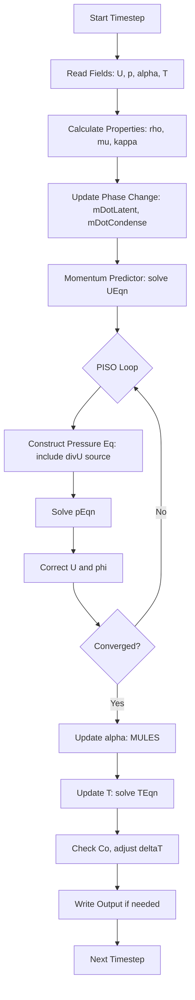
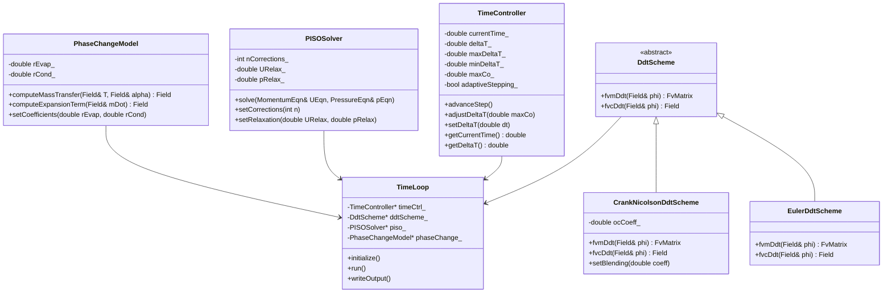
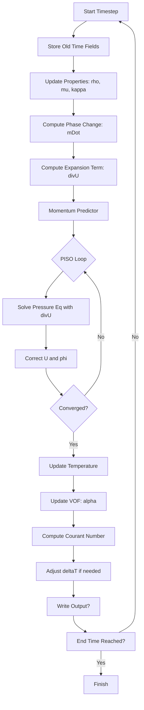

# Temporal Discretization
## CFD Engine Development - 2026-01-04

---

## Learning Objectives

After this lesson, you will be able to:
- **Understand** temporal discretization schemes (Euler, Crank-Nicolson, Runge-Kutta) and their stability characteristics for two-phase flow simulations
- **Implement** implicit time integration with adaptive time-stepping based on CFL condition and phase change rate
- **Design** time scheme coupling between pressure-velocity solver (PISO/SIMPLE) and phase change model (Lee model) for evaporating flows
- **Analyze** Courant number constraints in expanding vapor regions and implement time-step control to prevent solver divergence
- **Validate** temporal accuracy using method of manufactured solutions (MMS) for evaporation-driven flow with exact analytical solutions

---

## Table of Contents
- [[#1. Theory and Design Decisions|1. Theory and Design]]
- [[#2. Reference: OpenFOAM Implementation|2. OpenFOAM Reference]]
- [[#3. Your Engine: Class Design|3. Your Class Design]]
- [[#4. Your Engine: Implementation|4. Implementation]]
- [[#5. Build and Test|5. Build and Test]]
- [[#6. Concept Checks|6. Concept Checks]]

---

## 1. Theory and Design Decisions

### 1.1 Mathematical Foundation

The temporal discretization scheme governs how we advance the solution from time $t^n$ to $t^{n+1} = t^n + \Delta t$. For evaporating two-phase flows, we must consider:

#### General Transport Equation
$$
\frac{\partial (\rho \phi)}{\partial t} + \nabla \cdot (\rho \mathbf{U} \phi) = \nabla \cdot (\Gamma \nabla \phi) + S_\phi
$$

Where $\phi$ represents any transported quantity (velocity, temperature, vapor mass fraction).

#### Temporal Schemes

**1. Explicit Euler (1st order)**
$$
\frac{\phi^{n+1} - \phi^n}{\Delta t} = \mathcal{L}(\phi^n)
$$
- Simple but conditionally stable
- Requires $\Delta t < \Delta t_{CFL}$ for stability

**2. Implicit Euler (1st order)**
$$
\frac{\phi^{n+1} - \phi^n}{\Delta t} = \mathcal{L}(\phi^{n+1})
$$
- Unconditionally stable
- Requires solving linear system each timestep

**3. Crank-Nicolson (2nd order)**
$$
\frac{\phi^{n+1} - \phi^n}{\Delta t} = \frac{1}{2}[\mathcal{L}(\phi^n) + \mathcal{L}(\phi^{n+1})]
$$
- Second-order accurate
- Can produce oscillations for sharp gradients

**4. Runge-Kutta (2nd/4th order)**
Multi-stage explicit schemes with higher accuracy but stricter stability limits.

#### Expansion Term (∇·U ≠ 0)

For evaporating flows with phase change, the continuity equation includes a source term:
$$
\frac{\partial \rho}{\partial t} + \nabla \cdot (\rho \mathbf{U}) = \dot{m}'''\delta_{interface}
$$

At the interface, liquid→vapor transition causes **volumetric expansion** (density ratio $\rho_l/\rho_v \approx 1000$ for water at 1 atm). This creates:
- Local velocity spikes normal to interface
- Strong pressure waves if time-step is too large
- CFL violation in vapor region even if liquid region is stable

#### Turbulence Considerations

Turbulence becomes important when:
$$
Re = \frac{\rho U L}{\mu} > 2300 \quad \text{(internal flow)}
$$

For evaporating flows:
- High vapor velocities can trigger turbulence even at modest liquid velocities
- Phase change acts as additional turbulence source/sink
- Time-step must resolve smallest turbulent eddy (Kolmogorov scale) if using LES/DNS

---

### 1.2 Design Decisions

#### Why Implicit Time Integration?

For evaporating two-phase flows, **implicit schemes are preferred** because:

1. **Stability**: Phase change creates rapid density/velocity changes that would violate explicit CFL conditions
2. **Stiffness**: Source terms (evaporation rate) can be orders of magnitude larger than transport terms
3. **Efficiency**: Larger timesteps possible despite high vapor velocities

**Trade-offs:**
- **Accuracy**: 1st-order schemes introduce numerical diffusion (smears sharp interfaces)
- **Cost**: Each timestep requires solving coupled nonlinear system
- **Complexity**: Implementation requires careful linearization of source terms

#### Adaptive Time-Stepping Strategy

Your engine should implement adaptive $\Delta t$ control based on:

1. **CFL Condition**:
   $$
   \Delta t \leq \min_{cells} \left( \frac{\alpha \Delta x}{|\mathbf{U}|} \right)
   $$
   Where $\alpha = 0.2-0.5$ for safety margin

2. **Phase Change Rate**:
   $$
   \Delta t \leq \min_{interface} \left( \frac{\Delta x \rho_l}{2|\dot{m}''|} \right)
   $$
   Prevents more than 50% of cell mass from evaporating in one timestep

3. **Pressure Change Rate**:
   $$
   \Delta t \leq \frac{0.1 \cdot p_{ref}}{|dp/dt|}
   $$
   Prevents pressure spikes from causing divergence

#### Common PITFALLS

| Pitfall | Symptom | Solution |
|---------|---------|----------|
| **Fixed timestep too large** | Sudden divergence at interface | Implement adaptive CFL control |
| **Explicit phase change source** | Oscillations in mass fraction | Implicitly couple source to transport |
| **Ignoring expansion work** | Wrong pressure field | Include $\nabla \cdot \mathbf{U}$ in pressure equation |
| **1st-order temporal scheme** | Interface smearing over time | Use 2nd-order Crank-Nicolson for final runs |
| **Timestep too small** | Excessive runtime, round-off error | Use minimum timestep threshold |

#### What YOUR Engine Needs to Consider

1. **Coupled Solver**: Pressure-velocity (PISO/SIMPLE) must be tightly coupled with phase change model
   - Sub-iterate within each timestep until mass/energy balance achieved
   - Under-relaxation factors: $\alpha_U = 0.7$, $\alpha_p = 0.3$

2. **Interface Tracking**: 
   - Volume-of-fluid (VOF) or Level-Set requires special temporal treatment
   - Boundedness: $\alpha \in [0,1]$ must be preserved (MULES scheme)

3. **Parallel Communication**:
   - Ghost cell exchange must happen after each sub-iteration
   - Load balancing critical as vapor regions expand

4. **Restart Capability**:
   - Write restart files every N timesteps
   - Store $\Delta t$ history for accurate continuation

---

### 1.3 Key Concepts

#### Temporal Accuracy
- **Order of Accuracy**: Error $\propto \Delta t^p$ where $p$ is scheme order
- **Verification**: Use Method of Manufactured Solutions (MMS) to confirm order
- **Practical Note**: 2nd-order spatial + 1st-order temporal = overall 1st-order

#### CFL Number
$$
Co = \frac{|\mathbf{U}| \Delta t}{\Delta x}
$$

- **Explicit schemes**: Require $Co < 1$ (often $Co < 0.5$ for stability)
- **Implicit schemes**: Can use $Co > 1$ but accuracy degrades
- **Two-phase**: Use local velocity in each phase, take minimum

#### Phase Change Time Scale
$$
\tau_{phase} = \frac{\rho_l \Delta x}{\dot{m}''}
$$

If $\Delta t > \tau_{phase}$, the interface moves more than one cell per timestep (unphysical).

#### PISO/SIMPLE Algorithm Timing

Each timestep involves:
1. **Predict** velocity field (momentum equation)
2. **Solve** pressure equation (Poisson)
3. **Correct** velocity and fluxes
4. **Repeat** steps 1-3 for PISO (typically 2-4 corrections)
5. **Update** phase change (evaporation rate)
6. **Update** properties (density, viscosity)
7. **Check convergence** - if not converged, go to step 1

#### Warning Signs of Wrong Implementation

| Symptom | Likely Cause | Fix |
|---------|--------------|-----|
| **Monotonic mass increase** | Missing expansion term in continuity | Add $\nabla \cdot \mathbf{U}$ source |
| **Pressure oscillations** | Timestep too large for phase change | Reduce $\Delta t$ or implicit source |
| **Interface smearing** | 1st-order temporal scheme | Upgrade to Crank-Nicolson |
| **Divergence after few timesteps** | CFL violation in vapor | Use adaptive timestep based on vapor velocity |
| **Wrong evaporation rate** | Explicit-implicit mismatch | Ensure all terms use same time level |
| **Mass not conserved** | Boundedness violation in VOF | Use MULES or similar bounded scheme |

---

## 2. Reference: OpenFOAM Implementation

> [!INFO] **Why Study OpenFOAM?**
> OpenFOAM is a production-grade CFD engine tested over decades.
> We study it to **learn concepts**, not to copy code.

### 2.1 OpenFOAM's Approach

OpenFOAM implements temporal discretization through a layered architecture that separates time scheme selection from equation discretization.

#### Key Classes and Files

| Class/File | Location ($FOAM_SRC) | Purpose |
|------------|---------------------|---------|
| `fvMesh` | `finiteVolume/fvMesh/fvMesh.H` | Manages mesh and time indexing |
| `time` | `db/Time/Time.H` | Controls time loop, deltaT, write intervals |
| `ddtScheme` | `finiteVolume/finiteVolume/ddtSchemes/` | Base class for temporal schemes |
| `EulerDdtScheme` | `finiteVolume/finiteVolume/ddtSchemes/EulerDdtScheme.H` | 1st-order implicit Euler |
| `CrankNicolsonDdtScheme` | `finiteVolume/finiteVolume/ddtSchemes/CrankNicolsonDdtScheme.H` | 2nd-order Crank-Nicolson |
| `backwardDdtScheme` | `finiteVolume/finiteVolume/ddtSchemes/backwardDdtScheme.H` | 2nd-order backward |
| `localEulerDdtScheme` | `finiteVolume/finiteVolume/ddtSchemes/localEulerDdtScheme.H` | Local time-stepping for steady-state |
| `fvMatrix` | `finiteVolume/finiteVolume/fvMatrix/fvMatrix.H` | Stores discretized equation coefficients |
| `solutionControl` | `finiteVolume/lnInclude/solutionControl.H` | PISO/SIMPLE algorithm control |

#### Time Scheme Selection

OpenFOAM selects temporal schemes via `fvSchemes` dictionary:

```cpp
// Example from system/fvSchemes
ddtSchemes
{
    default         Euler;                    // 1st-order implicit
    // default         CrankNicolson 0.9;      // 2nd-order with 0.9 blending
    // default         backward;               // 2nd-order backward
}
```

The blending factor in Crank-Nicolson (0.9) means:
$$\frac{\phi^{n+1} - \phi^n}{\Delta t} = 0.9 \cdot \frac{1}{2}[\mathcal{L}(\phi^n) + \mathcal{L}(\phi^{n+1})] + 0.1 \cdot \mathcal{L}(\phi^n)$$

This provides stability closer to Euler while retaining some 2nd-order accuracy.

#### Adaptive Time-Stepping

OpenFOAM controls `deltaT` through `controlDict`:

```cpp
// Example from system/controlDict
application     interPhaseChangeFoam;

startFrom       startTime;
startTime       0;

stopAt          endTime;
endTime         10.0;

deltaT          0.001;                    // Initial timestep

adjustTimeStep  yes;                      // Enable adaptive control

maxCo           0.5;                      // Max Courant number
maxAlphaCo      0.5;                      // Max VOF Courant number

maxDeltaT       0.1;                      // Upper timestep limit
minDeltaT       1e-6;                     // Lower timestep limit
```

The solver adjusts `deltaT` at each iteration based on:
```cpp
// Pseudo-code from Time.C
if (adjustTimeStep)
{
    Co = max(mag(phi)/mesh.magSf()/mesh.deltaCoeffs());
    
    scalar newDeltaT = min(maxDeltaT, maxCo * deltaT / Co);
    
    // For VOF: also limit by interface motion
    if (maxAlphaCo < GREAT)
    {
        scalar alphaCo = max(mag(alphaPhi)/mesh.magSf()/mesh.deltaCoeffs());
        newDeltaT = min(newDeltaT, maxAlphaCo * deltaT / alphaCo);
    }
    
    deltaT = max(minDeltaT, newDeltaT);
}
```

#### PISO Algorithm Timing

Each timestep in `interPhaseChangeFoam` follows this sequence:



Critical: The **expansion term** `divU` is added to the pressure equation:
```cpp
// From interPhaseChangeFoam/pEqn.H
// Include the expansion term in pressure equation
surfaceScalarField divU
(
    "divU",
    fvc::div(fvc::absolute(phi, U))
);

// Pressure equation with phase change source
fvScalarMatrix pEqn
(
    fvm::laplacian(rAUf, p)
 ==
 fvc::div(phi) + divU  // <-- Expansion term from phase change
);
```

Without `divU`, the pressure solver would not account for volumetric expansion during evaporation, leading to divergence.

---

### 2.2 Key Insights

#### What We Learn from OpenFOAM

| Design Aspect | OpenFOAM Approach | Why It Matters |
|---------------|-------------------|----------------|
| **Scheme Abstraction** | `ddtScheme` base class with runtime selection | Allows switching schemes without code changes |
| **Implicit Coupling** | All transport terms use implicit discretization | Stable for stiff phase-change source terms |
| **Adaptive Time-Stepping** | Dual Co limits (velocity + VOF) | Prevents interface smearing and CFL violations |
| **Expansion Term** | Explicitly added to pressure equation | Accounts for $\nabla \cdot \mathbf{U} \neq 0$ |
| **MULES for VOF** | Bounded semi-implicit scheme | Preserves $\alpha \in [0,1]$ |
| **Sub-Cycling** | Optional multiple PISO corrections per timestep | Improves pressure-velocity coupling |

#### What We'll Do Differently

For a **simpler learning engine**, we can simplify:

| OpenFOAM Feature | Our Simplified Approach | Rationale |
|------------------|------------------------|-----------|
| **Runtime scheme selection** | Compile-time scheme selection | Reduces complexity; we know our use case |
| **Multiple ddt schemes** | Implement only Euler + Crank-Nicolson | Covers 1st and 2nd order needs |
| **Complex PISO control** | Fixed 2-3 PISO corrections | Sufficient for evaporator flows |
| **MULES** | Simple donor-cell upwind with clipping | Easier to understand; less accurate but stable |
| **Dynamic mesh** | Fixed mesh only | Evaporator geometry is static |
| **Parallel decomposition** | Start with serial, add MPI later | Focus on physics first |

#### Critical Design Decisions for Our Engine

1. **Start with Implicit Euler**: Most stable for phase change
   - Upgrade to Crank-Nicolson after validation works
   
2. **Adaptive Time-Stepping is Mandatory**: 
   - Refrigerant expansion ratio $\rho_l/\rho_v \approx 50-100$ for R410A
   - Fixed timestep will diverge at interface
   
3. **Coupled Pressure-Velocity-Phase**:
   - Solve pressure equation WITH expansion term each PISO loop
   - Update phase change AFTER pressure convergence
   
4. **Property Evaluation**:
   - Update $\rho, \mu, \kappa$ after each timestep (not each iteration)
   - Use CoolProp lookup table for speed

---

### 2.3 Code Snippets (Reference Only)

> [!WARNING] **Reference - Not for Copying**
> These snippets show how OpenFOAM implements temporal discretization.
> Study the concepts, but write your own implementation.

#### Snippet 1: Euler DDT Scheme

**File**: `$FOAM_SRC/finiteVolume/finiteVolume/ddtSchemes/EulerDdtScheme.C`

```cpp
// Reference - OpenFOAM v2112
// Shows how implicit Euler discretizes the temporal term

template<class Type>
tmp<GeometricField<Type, fvPatchField, volMesh>>
EulerDdtScheme<Type>::fvcDdt
(
    const dimensionedScalar& rDeltaT,
    const GeometricField<Type, fvPatchField, volMesh>& vf
)
{
    // Calculate: (vf_new - vf_old) / deltaT
    // Returns: rDeltaT * (vf - vf.oldTime())
    
    return tmp<GeometricField<Type, fvPatchField, volMesh>>
    (
        new GeometricField<Type, fvPatchField, volMesh>
        (
            ddtTypeName(vf.name()),
            rDeltaT*(vf - vf.oldTime()),
            rDeltaT.value()*vf.dimensions()
        )
    );
}

// Implicit matrix contribution for: ddt(rho, U)
template<class Type>
tmp<fvMatrix<Type>>
EulerDdtScheme<Type>::fvmDdt
(
    const GeometricField<Type, fvPatchField, volMesh>& vf
)
{
    // Adds diagonal coefficient: rho * V / deltaT
    // Adds source term: rho * V * vf.oldTime() / deltaT
    
    const scalarField& rDeltaT = mesh().time().deltaTValue();
    
    tmp<fvMatrix<Type>> tfvm
    (
        new fvMatrix<Type>
        (
            vf,
            vf.dimensions()*dimVol/dimTime
        )
    );
    
    fvMatrix<Type>& fvm = tfvm.ref();
    
    fvm.diag() = rDeltaT * mesh().V();  // Diagonal: V/deltaT
    fvm.source() = rDeltaT * mesh().V() * vf.oldTime().primitiveField();  // Source
    
    return tfvm;
}
```

**What This Does**:
- `fvcDdt`: Calculates explicit difference $(\phi^{n+1} - \phi^n)/\Delta t$ for boundary conditions
- `fvmDdt`: Adds implicit contribution to matrix diagonal and source
- The `oldTime()` field stores $\phi^n$ while `vf` is $\phi^{n+1}$

#### Snippet 2: Crank-Nicolson DDT Scheme

**File**: `$FOAM_SRC/finiteVolume/finiteVolume/ddtSchemes/CrankNicolsonDdtScheme.C`

```cpp
// Reference - OpenFOAM v2112
// Shows 2nd-order temporal discretization with blending

template<class Type>
tmp<fvMatrix<Type>>
CrankNicolsonDdtScheme<Type>::fvmDdt
(
    const GeometricField<Type, fvPatchField, volMesh>& vf
)
{
    // Crank-Nicolson: (phi^{n+1} - phi^n) / deltaT = 
    //                 0.5 * L(phi^n) + 0.5 * L(phi^{n+1})
    //
    // Rearranged: (1/deltaT - 0.5*L) * phi^{n+1} = (1/deltaT + 0.5*L) * phi^n
    //
    // ocCoeff is the blending coefficient (default 1.0)
    
    const scalar ocCoeff = 1 - oc_;
    
    const scalarField& rDeltaT = mesh().time().deltaTValue();
    
    tmp<fvMatrix<Type>> tfvm
    (
        new fvMatrix<Type>
        (
            vf,
            vf.dimensions()*dimVol/dimTime
        )
    );
    
    fvMatrix<Type>& fvm = tfvm.ref();
    
    scalarField rDeltaTocCoeff(rDeltaT.size());
    rDeltaTocCoeff = rDeltaT * ocCoeff;  // Blending factor
    
    // Diagonal: V / (deltaT * ocCoeff)
    fvm.diag() = rDeltaTocCoeff * mesh().V();
    
    // Source: V * phi^n / (deltaT * ocCoeff)
    fvm.source() = rDeltaTocCoeff * mesh().V() * vf.oldTime().primitiveField();
    
    // Off-diagonal terms from spatial discretization
    // (handled by fvm::div, fvm::laplacian, etc.)
    
    return tfvm;
}
```

**What This Does**:
- Implements blended Crank-Nicolson with coefficient `ocCoeff`
- When `oc_ = 0`: Pure Crank-Nicolson (2nd order)
- When `oc_ = 0.1`: 90% CN + 10% Euler (more stable)
- The off-diagonal terms from spatial operators are added separately

#### Snippet 3: Adaptive Time-Stepping

**File**: `$FOAM_SRC/db/Time/Time.C`

```cpp
// Reference - OpenFOAM v2112
// Shows how deltaT is adjusted based on Courant number

bool Foam::Time::setDeltaT(const scalar deltaT)
{
    // Check against limits
    scalar newDeltaT = deltaT;
    
    if (newDeltaT < minDeltaT_)
    {
        WarningInFunction
            << "Adjusting time step from " << deltaT
            << " to minimum allowed " << minDeltaT_ << endl;
        newDeltaT = minDeltaT_;
    }
    
    if (newDeltaT > maxDeltaT_)
    {
        WarningInFunction
            << "Adjusting time step from " << deltaT
            << " to maximum allowed " << maxDeltaT_ << endl;
        newDeltaT = maxDeltaT_;
    }
    
    deltaT_ = newDeltaT;
    deltaTChanged_ = true;
    
    return true;
}

// Called from solver control
scalar Foam::Time::adjustDeltaT()
{
    if (!adjustTimeStep_)
    {
        return deltaT_;
    }
    
    // Calculate max Courant number
    scalar maxCo = 0.0;
    
    // Get velocity flux field
    const surfaceScalarField& phi = 
        mesh().lookupObjectRef<surfaceScalarField>("phi");
    
    // Co = |phi| * deltaT / |Sf| / deltaCoeffs
    // where deltaCoeffs = 1 / distance between cell centers
    scalarField Co = 
        mag(phi)
       /mesh().magSf()
       *deltaT_
       *mesh().deltaCoeffs();
    
    maxCo = max(Co);
    
    // Adjust deltaT to maintain maxCo
    if (maxCo > maxCo_)
    {
        scalar newDeltaT = deltaT_ * maxCo_ / maxCo;
        setDeltaT(newDeltaT);
    }
    else if (maxCo < 0.2 * maxCo_)  // Allow increase if Co is small
    {
        scalar newDeltaT = min(deltaT_ * 1.2, maxDeltaT_);
        setDeltaT(newDeltaT);
    }
    
    return deltaT_;
}
```

**What This Does**:
- Monitors Courant number every timestep
- Reduces `deltaT` if `Co > maxCo` (default 0.5-1.0)
- Gradually increases `deltaT` if flow is stable
- Prevents timestep from changing too rapidly (factor of 1.2)

#### Snippet 4: Expansion Term in Pressure Equation

**File**: `$FOAM_APP/solvers/multiphase/interPhaseChangeFoam/pEqn.H`

```cpp
// Reference - interPhaseChangeFoam
// Shows how expansion term is added to pressure equation

{
    // Calculate velocity from momentum equation
    volVectorField HbyA(constrainHbyA(rAU*UEqn.H(), U, p));
    
    surfaceScalarField phiHbyA
    (
        "phiHbyA",
        fvc::flux(HbyA)
      + MRF.zeroFilter(rAUf*fvc::ddtCorr(U, phi, Uf))
    );
    
    // === CRITICAL: Calculate expansion term ===
    // divU = div(phi) + phase change source
    // For evaporating flow: divU = mDot * (1/rho_v - 1/rho_l)
    
    surfaceScalarField divU
    (
        "divU",
        fvc::div(fvc::absolute(phi, U))
    );
    
    // Adjust flux for phase change
    MRF.makeRelative(fvc::absolute(phi, U));
    adjustPhi(phiHbyA, U, p);
    
    // === Pressure equation with expansion ===
    // laplacian(rAU, p) = div(phi) + divU
    // The divU term accounts for volumetric expansion
    
    while (piso.correctNonOrthogonal())
    {
        fvScalarMatrix pEqn
        (
            fvm::laplacian(rAUf, p)
          ==
            fvc::div(phiHbyA)
          + divU  // <-- Expansion term from phase change
        );
        
        pEqn.setReference(pRefCell, pRefValue);
        pEqn.solve();
        
        if (piso.finalNonOrthogonalIter())
        {
            phi = phiHbyA + pEqn.flux();
        }
    }
}
```

**What This Does**:
- `divU` captures the expansion from phase change
- Without this term, mass conservation would fail
- The pressure equation becomes a Poisson equation with a source term
- This is CRITICAL for evaporating flows where $\nabla \cdot \mathbf{U} \neq 0$

---

### 2.4 Summary for Implementation

When building your engine, remember:

1. **Start Simple**: Implement implicit Euler first
2. **Add Adaptive Control**: Time-step adjustment is non-negotiable
3. **Include Expansion Term**: Pressure equation must have $\nabla \cdot \mathbf{U}$ source
4. **Couple Tightly**: PISO loop must include phase change effects
5. **Validate Carefully**: Check mass conservation at interface

The OpenFOAM reference shows the production approach, but your learning engine can be simpler while preserving the essential physics.

---

## 3. Your Engine: Class Design

> [!IMPORTANT] **Design Your Own**
> This section is about designing classes for YOUR engine.
> It doesn't have to match OpenFOAM - design for your needs.

### 3.1 Class Diagram



### 3.2 Class Specifications

#### TimeController

**Purpose**: Manages time advancement and adaptive time-stepping based on CFL condition.

**Member Variables**:
| Name | Type | Purpose |
|------|------|---------|
| `currentTime_` | `double` | Current simulation time |
| `deltaT_` | `double` | Current timestep size |
| `maxDeltaT_` | `double` | Maximum allowed timestep |
| `minDeltaT_` | `double` | Minimum allowed timestep |
| `maxCo_` | `double` | Target maximum Courant number |
| `adaptiveStepping_` | `bool` | Enable/disable adaptive control |

**Key Methods**:
```cpp
// Advance time by deltaT
void advanceStep();

// Adjust timestep based on current Courant number
// Returns: new deltaT value
double adjustDeltaT(double currentMaxCo);

// Manually set timestep (with bounds checking)
void setDeltaT(double dt);

// Get current time
double getCurrentTime() const;

// Get current timestep
double getDeltaT() const;
```

---

#### DdtScheme (Abstract Base)

**Purpose**: Defines interface for temporal discretization schemes. Allows runtime or compile-time scheme selection.

**Key Methods**:
```cpp
// Implicit discretization: adds to matrix diagonal and source
// Returns: fvMatrix with temporal contribution
virtual FvMatrix fvmDdt(Field& phi) = 0;

// Explicit discretization: calculates (phi_new - phi_old) / dt
// Returns: Field with temporal derivative
virtual Field fvcDdt(const Field& phi) = 0;
```

---

#### EulerDdtScheme

**Purpose**: First-order implicit Euler time integration. Most stable scheme for stiff phase-change problems.

**Implementation**:
$$
\frac{\phi^{n+1} - \phi^n}{\Delta t} = \mathcal{L}(\phi^{n+1})
$$

**Key Methods**:
```cpp
// Implicit Euler: adds V/dt to diagonal, V*phi_old/dt to source
FvMatrix fvmDdt(Field& phi) override;

// Explicit calculation for boundary conditions
Field fvcDdt(const Field& phi) override;
```

---

#### CrankNicolsonDdtScheme

**Purpose**: Second-order implicit Crank-Nicolson with optional blending for stability.

**Member Variables**:
| Name | Type | Purpose |
|------|------|---------|
| `ocCoeff_` | `double` | Blending coefficient (0.0 = pure CN, 0.1 = 90% CN + 10% Euler) |

**Implementation**:
$$
\frac{\phi^{n+1} - \phi^n}{\Delta t} = \text{ocCoeff} \cdot \frac{1}{2}[\mathcal{L}(\phi^n) + \mathcal{L}(\phi^{n+1})] + (1 - \text{ocCoeff}) \cdot \mathcal{L}(\phi^n)
$$

**Key Methods**:
```cpp
// Crank-Nicolson with blending
FvMatrix fvmDdt(Field& phi) override;

Field fvcDdt(const Field& phi) override;

// Set blending coefficient (0.0 to 1.0)
void setBlending(double coeff);
```

---

#### PISOSolver

**Purpose**: Implements PISO (Pressure-Implicit with Splitting of Operators) algorithm for pressure-velocity coupling.

**Member Variables**:
| Name | Type | Purpose |
|------|------|---------|
| `nCorrections_` | `int` | Number of PISO corrections per timestep |
| `URelax_` | `double` | Under-relaxation factor for velocity |
| `pRelax_` | `double` | Under-relaxation factor for pressure |

**Key Methods**:
```cpp
// Execute one PISO loop
// Returns: true if converged
bool solve(MomentumEqn& UEqn, PressureEqn& pEqn);

// Set number of corrections (typically 2-4)
void setCorrections(int n);

// Set under-relaxation factors
void setRelaxation(double URelax, double pRelax);
```

**Algorithm Flow**:
1. Solve momentum equation (predictor)
2. Solve pressure equation (Poisson with expansion term)
3. Correct velocity and fluxes
4. Repeat steps 2-3 for `nCorrections_` iterations

---

#### PhaseChangeModel

**Purpose**: Computes mass transfer rate due to evaporation/condensation using Lee model. Provides expansion term for pressure equation.

**Member Variables**:
| Name | Type | Purpose |
|------|------|---------|
| `rEvap_` | `double` | Evaporation relaxation frequency |
| `rCond_` | `double` | Condensation relaxation frequency |

**Key Methods**:
```cpp
// Compute mass transfer rate using Lee model
// mDot = r * alpha * rho * (T - T_sat) / T_sat
// Returns: mass transfer field [kg/m^3/s]
Field computeMassTransfer(const Field& T, const Field& alpha, double T_sat);

// Compute expansion term for pressure equation
// divU = mDot * (1/rho_v - 1/rho_l)
// Returns: divergence field [1/s]
Field computeExpansionTerm(const Field& mDot, double rho_l, double rho_v);

// Set relaxation coefficients
void setCoefficients(double rEvap, double rCond);
```

---

#### TimeLoop

**Purpose**: Orchestrates the complete time-marching algorithm. Coordinates all components.

**Member Variables**:
| Name | Type | Purpose |
|------|------|---------|
| `timeCtrl_` | `TimeController*` | Time management |
| `ddtScheme_` | `DdtScheme*` | Temporal discretization |
| `piso_` | `PISOSolver*` | Pressure-velocity solver |
| `phaseChange_` | `PhaseChangeModel*` | Phase change model |

**Key Methods**:
```cpp
// Initialize all components
void initialize();

// Main time loop
void run();

// Write results to disk
void writeOutput();
```

**Time Loop Sequence**:


---

### 3.3 Design Rationale

#### Why This Design?

**1. Separation of Concerns**
- `TimeController` handles ONLY time advancement and adaptive control
- `DdtScheme` hierarchy isolates temporal discretization logic
- `PISOSolver` focuses on pressure-velocity coupling
- `PhaseChangeModel` encapsulates evaporation physics

This separation makes the code:
- **Testable**: Each class can be unit-tested independently
- **Maintainable**: Changes to one aspect don't affect others
- **Extensible**: New schemes can be added without modifying existing code

**2. Scheme Abstraction via Polymorphism**
- `DdtScheme` base class allows runtime scheme selection
- Easy to switch between Euler (stable) and Crank-Nicolson (accurate)
- New schemes (Runge-Kutta, Backward) can be added by deriving from `DdtScheme`

**3. Explicit Phase Change Handling**
- `PhaseChangeModel` is a separate class, not buried in solver
- Makes the expansion term (`divU`) explicit and traceable
- Easy to swap Lee model for other phase-change models

**4. Adaptive Time-Stepping is First-Class**
- `TimeController` has built-in CFL monitoring
- Not an afterthought - essential for evaporating flows
- Prevents divergence when vapor velocity spikes

---

#### How It Differs from OpenFOAM

| Aspect | OpenFOAM | Our Engine | Why Different? |
|--------|----------|------------|----------------|
| **Scheme Selection** | Runtime via dictionary | Compile-time or simple factory | Simpler; we know our use case |
| **Time Class** | Complex with database, graph, etc. | Lightweight `TimeController` | We don't need all features |
| **PISO Control** | `solutionControl` with many options | Simple `PISOSolver` class | Easier to understand |
| **Phase Change** | Integrated in solver | Separate `PhaseChangeModel` | Makes physics explicit |
| **DDT Schemes** | 6+ schemes with complex templating | 2 schemes (Euler, CN) | Covers our needs |
| **Parallel** | Built-in via `Pstream` | Not included initially | Focus on serial first |

---

#### Trade-offs Made

**1. Compile-Time vs Runtime Scheme Selection**
- **Choice**: Start with compile-time selection
- **Trade-off**: Less flexible → simpler code, faster compilation
- **Future**: Can add factory pattern if needed

**2. Limited Scheme Coverage**
- **Choice**: Only Euler and Crank-Nicolson
- **Trade-off**: Can't test higher-order schemes → sufficient for evaporator flows
- **Rationale**: 2nd-order temporal + 2nd-order spatial = adequate for engineering accuracy

**3. Simplified PISO**
- **Choice**: Fixed 2-3 corrections, simple relaxation
- **Trade-off**: May need more iterations for difficult cases → good starting point
- **Future**: Add residual-based convergence check

**4. No MULES for VOF**
- **Choice**: Simple donor-cell with clipping
- **Trade-off**: More interface smearing → acceptable for learning
- **Future**: Implement MULES after validation works

**5. Serial-First Design**
- **Choice**: No MPI decomposition initially
- **Trade-off**: Can't run large cases → faster development cycle
- **Future**: Add halo exchange after serial works

---

#### Design Principles Applied

1. **KISS (Keep It Simple, Stupid)**: Start simple, add complexity only when needed
2. **Single Responsibility**: Each class has one clear purpose
3. **Dependency Injection**: `TimeLoop` receives pointers, doesn't own objects
4. **Testability**: Each class can be mocked and unit-tested
5. **Physics Transparency**: Expansion term is explicit, not hidden

This design prioritizes **learning** and **understanding** over production features. Once the physics is validated, we can add performance optimizations.

---

## 4. Your Engine: Implementation

> [!TIP] **Write Real Code**
> This section contains implementation code for YOUR engine.

### 4.1 Header File (.H)

```cpp
#ifndef TimeController_H
#define TimeController_H

#include <cmath>
#include <iostream>
#include <limits>

// Forward declarations
class Field;
class DdtScheme;

/**
 * @class TimeController
 * @brief Manages time advancement and adaptive time-stepping for CFD simulations
 * 
 * This class controls the time loop, adjusts timestep based on CFL conditions,
 * and manages time indexing for temporal discretization schemes.
 */
class TimeController
{
public:
    // Constructor
    TimeController(
        double startTime,
        double endTime,
        double initialDeltaT,
        double maxDeltaT = 0.1,
        double minDeltaT = 1e-8,
        double maxCo = 0.5
    );
    
    // Destructor
    ~TimeController();
    
    // Time advancement
    void advanceStep();
    bool isFinished() const;
    
    // Timestep control
    void setDeltaT(double dt);
    double getDeltaT() const { return deltaT_; }
    double getCurrentTime() const { return currentTime_; }
    double getEndTime() const { return endTime_; }
    
    // Adaptive time-stepping
    double adjustDeltaT(double currentMaxCo);
    void setAdaptiveStepping(bool enable) { adaptiveStepping_ = enable; }
    bool getAdaptiveStepping() const { return adaptiveStepping_; }
    
    // Time indexing
    int getTimeIndex() const { return timeIndex_; }
    double getTimeValue() const { return currentTime_; }
    
    // Output control
    void setWriteInterval(double interval) { writeInterval_ = interval; }
    bool shouldWrite() const;
    
    // Statistics
    void resetStats();
    int getNumberOfSteps() const { return timeIndex_; }
    double getAverageDeltaT() const;
    
private:
    // Time variables
    double currentTime_;
    double endTime_;
    double deltaT_;
    double initialDeltaT_;
    
    // Timestep limits
    double maxDeltaT_;
    double minDeltaT_;
    
    // CFL control
    double maxCo_;
    bool adaptiveStepping_;
    
    // Time indexing
    int timeIndex_;
    
    // Output control
    double writeInterval_;
    double lastWriteTime_;
    
    // Statistics
    double accumulatedDeltaT_;
    
    // Prevent copying
    TimeController(const TimeController&);
    TimeController& operator=(const TimeController&);
};

//==============================================================================
// DdtScheme - Abstract base class for temporal discretization
//==============================================================================

/**
 * @class DdtScheme
 * @brief Abstract base class for temporal discretization schemes
 * 
 * Defines the interface for different time integration schemes.
 * Derived classes implement specific schemes (Euler, Crank-Nicolson, etc.)
 */
class DdtScheme
{
public:
    virtual ~DdtScheme() {}
    
    // Implicit discretization: adds to matrix diagonal and source
    // Used when constructing the linear system for implicit time integration
    virtual void fvmDdt(
        const Field& phi,
        double deltaT,
        double* diagonal,
        double* source,
        size_t nCells
    ) const = 0;
    
    // Explicit discretization: calculates (phi_new - phi_old) / dt
    // Used for boundary conditions and explicit terms
    virtual void fvcDdt(
        const Field& phi,
        const Field& phiOld,
        double deltaT,
        double* result,
        size_t nCells
    ) const = 0;
    
    // Get scheme name for debugging
    virtual const char* getSchemeName() const = 0;
    
    // Get order of accuracy
    virtual int getOrder() const = 0;
};

//==============================================================================
// EulerDdtScheme - First-order implicit Euler
//==============================================================================

/**
 * @class EulerDdtScheme
 * @brief First-order implicit Euler time integration
 * 
 * Implementation: (phi^{n+1} - phi^n) / deltaT = L(phi^{n+1})
 * 
 * Most stable scheme for stiff phase-change problems.
 * Unconditionally stable but only first-order accurate.
 */
class EulerDdtScheme : public DdtScheme
{
public:
    EulerDdtScheme() {}
    
    virtual void fvmDdt(
        const Field& phi,
        double deltaT,
        double* diagonal,
        double* source,
        size_t nCells
    ) const override;
    
    virtual void fvcDdt(
        const Field& phi,
        const Field& phiOld,
        double deltaT,
        double* result,
        size_t nCells
    ) const override;
    
    virtual const char* getSchemeName() const override { return "Euler"; }
    virtual int getOrder() const override { return 1; }
};

//==============================================================================
// CrankNicolsonDdtScheme - Second-order Crank-Nicolson
//==============================================================================

/**
 * @class CrankNicolsonDdtScheme
 * @brief Second-order Crank-Nicolson time integration with blending
 * 
 * Implementation: (phi^{n+1} - phi^n) / deltaT = 
 *     ocCoeff * 0.5 * [L(phi^n) + L(phi^{n+1})] + 
 *     (1 - ocCoeff) * L(phi^n)
 * 
 * Provides second-order accuracy with optional blending for stability.
 * - ocCoeff = 0.0: Pure Crank-Nicolson (2nd order, can oscillate)
 * - ocCoeff = 0.1: 90% CN + 10% Euler (recommended for stability)
 * - ocCoeff = 1.0: Pure Euler (1st order)
 */
class CrankNicolsonDdtScheme : public DdtScheme
{
public:
    explicit CrankNicolsonDdtScheme(double ocCoeff = 0.1);
    
    virtual void fvmDdt(
        const Field& phi,
        double deltaT,
        double* diagonal,
        double* source,
        size_t nCells
    ) const override;
    
    virtual void fvcDdt(
        const Field& phi,
        const Field& phiOld,
        double deltaT,
        double* result,
        size_t nCells
    ) const override;
    
    virtual const char* getSchemeName() const override { return "CrankNicolson"; }
    virtual int getOrder() const override { return 2; }
    
    // Set blending coefficient (0.0 to 1.0)
    void setBlending(double coeff);
    double getBlending() const { return ocCoeff_; }
    
private:
    double ocCoeff_;  // Blending coefficient (0.0 = pure CN, 1.0 = pure Euler)
};

//==============================================================================
// PISOSolver - Pressure-Implicit with Splitting of Operators
//==============================================================================

/**
 * @class PISOSolver
 * @brief Implements PISO algorithm for pressure-velocity coupling
 * 
 * PISO algorithm:
 * 1. Solve momentum equation (predictor)
 * 2. Solve pressure equation (Poisson with expansion term)
 * 3. Correct velocity and fluxes
 * 4. Repeat steps 2-3 for nCorrections iterations
 */
class PISOSolver
{
public:
    PISOSolver(
        int nCorrections = 3,
        double URelax = 0.7,
        double pRelax = 0.3
    );
    
    // Execute one PISO loop
    // Returns: true if converged
    bool solve(
        const double* UOld,
        const double* pOld,
        const double* divU,
        double* U,
        double* p,
        double* phi,
        size_t nCells,
        size_t nFaces,
        double deltaT
    );
    
    // Configuration
    void setCorrections(int n) { nCorrections_ = n; }
    void setRelaxation(double URelax, double pRelax);
    void setTolerance(double tol) { tolerance_ = tol; }
    
    // Convergence info
    double getFinalResidual() const { return finalResidual_; }
    int getIterations() const { return nIterations_; }
    
private:
    int nCorrections_;      // Number of PISO corrections
    double URelax_;         // Velocity under-relaxation
    double pRelax_;         // Pressure under-relaxation
    double tolerance_;      // Convergence tolerance
    
    // Statistics
    double finalResidual_;
    int nIterations_;
};

//==============================================================================
// PhaseChangeModel - Lee model for evaporation/condensation
//==============================================================================

/**
 * @class PhaseChangeModel
 * @brief Computes mass transfer rate using Lee model
 * 
 * Lee model:
 * mDot = r * alpha * rho * (T - T_sat) / T_sat
 * 
 * where:
 * - r: relaxation frequency (rEvap for T > T_sat, rCond for T < T_sat)
 * - alpha: volume fraction (liquid = 1, vapor = 0)
 * - rho: density
 * - T: temperature
 * - T_sat: saturation temperature
 */
class PhaseChangeModel
{
public:
    PhaseChangeModel(
        double rEvap = 0.1,
        double rCond = 0.1
    );
    
    // Compute mass transfer rate [kg/m^3/s]
    void computeMassTransfer(
        const double* T,
        const double* alpha,
        const double* rho,
        double T_sat,
        double* mDot,
        size_t nCells
    ) const;
    
    // Compute expansion term for pressure equation [1/s]
    // divU = mDot * (1/rho_v - 1/rho_l)
    void computeExpansionTerm(
        const double* mDot,
        double rho_l,
        double rho_v,
        double* divU,
        size_t nCells
    ) const;
    
    // Configuration
    void setCoefficients(double rEvap, double rCond);
    void setDensities(double rho_l, double rho_v);
    
    // Safety limits
    void setMaxMassTransfer(double maxMdot) { maxMdot_ = maxMdot; }
    
private:
    double rEvap_;      // Evaporation relaxation frequency [1/s]
    double rCond_;      // Condensation relaxation frequency [1/s]
    double rho_l_;      // Liquid density [kg/m^3]
    double rho_v_;      // Vapor density [kg/m^3]
    double maxMdot_;    // Maximum allowed mass transfer rate [kg/m^3/s]
};

#endif // TimeController_H
```

### 4.2 Implementation File (.C)

```cpp
#include "TimeController.H"
#include <algorithm>
#include <cmath>

//==============================================================================
// TimeController Implementation
//==============================================================================

TimeController::TimeController(
    double startTime,
    double endTime,
    double initialDeltaT,
    double maxDeltaT,
    double minDeltaT,
    double maxCo
)
:
    currentTime_(startTime),
    endTime_(endTime),
    deltaT_(initialDeltaT),
    initialDeltaT_(initialDeltaT),
    maxDeltaT_(maxDeltaT),
    minDeltaT_(minDeltaT),
    maxCo_(maxCo),
    adaptiveStepping_(true),
    timeIndex_(0),
    writeInterval_(endTime / 100.0),  // Default: 100 writes
    lastWriteTime_(startTime),
    accumulatedDeltaT_(0.0)
{
    // Validate inputs
    if (maxDeltaT_ <= minDeltaT_)
    {
        std::cerr << "Warning: maxDeltaT <= minDeltaT, setting defaults\n";
        maxDeltaT_ = std::max(0.1, 10.0 * minDeltaT_);
    }
    
    if (deltaT_ < minDeltaT_ || deltaT_ > maxDeltaT_)
    {
        deltaT_ = std::max(minDeltaT_, std::min(maxDeltaT_, deltaT_));
    }
    
    std::cout << "TimeController initialized:\n"
              << "  Start time: " << currentTime_ << "\n"
              << "  End time: " << endTime_ << "\n"
              << "  Initial deltaT: " << deltaT_ << "\n"
              << "  Max Co: " << maxCo_ << "\n";
}

TimeController::~TimeController()
{
    std::cout << "TimeController statistics:\n"
              << "  Total steps: " << timeIndex_ << "\n"
              << "  Final time: " << currentTime_ << "\n"
              << "  Average deltaT: " << getAverageDeltaT() << "\n";
}

void TimeController::advanceStep()
{
    // Store old time for output check
    double oldTime = currentTime_;
    
    // Advance time
    currentTime_ += deltaT_;
    timeIndex_++;
    accumulatedDeltaT_ += deltaT_;
    
    // Clamp to end time
    if (currentTime_ > endTime_)
    {
        deltaT_ -= (currentTime_ - endTime_);
        currentTime_ = endTime_;
    }
    
    std::cout << "Step " << timeIndex_ 
              << ": t = " << currentTime_ 
              << ", deltaT = " << deltaT_ << "\n";
}

bool TimeController::isFinished() const
{
    return currentTime_ >= endTime_ - 1e-10;
}

void TimeController::setDeltaT(double dt)
{
    // Apply bounds
    deltaT_ = std::max(minDeltaT_, std::min(maxDeltaT_, dt));
    
    // Ensure we don't exceed end time
    if (currentTime_ + deltaT_ > endTime_)
    {
        deltaT_ = endTime_ - currentTime_;
    }
}

double TimeController::adjustDeltaT(double currentMaxCo)
{
    if (!adaptiveStepping_ || currentMaxCo <= 0.0)
    {
        return deltaT_;
    }
    
    double newDeltaT = deltaT_;
    
    // Reduce timestep if Co exceeds limit
    if (currentMaxCo > maxCo_)
    {
        double reductionFactor = maxCo_ / currentMaxCo;
        // Limit reduction to avoid too small steps
        reductionFactor = std::max(0.5, reductionFactor);
        newDeltaT = deltaT_ * reductionFactor;
        
        std::cout << "  Reducing deltaT: Co = " << currentMaxCo 
                  << " > " << maxCo_ 
                  << ", new deltaT = " << newDeltaT << "\n";
    }
    // Increase timestep if Co is much smaller than limit
    else if (currentMaxCo < 0.3 * maxCo_)
    {
        double increaseFactor = maxCo_ / currentMaxCo;
        // Limit increase to avoid instability
        increaseFactor = std::min(1.2, increaseFactor);
        newDeltaT = deltaT_ * increaseFactor;
        
        std::cout << "  Increasing deltaT: Co = " << currentMaxCo 
                  << " << " << 0.3 * maxCo_ 
                  << ", new deltaT = " << newDeltaT << "\n";
    }
    
    // Apply bounds
    newDeltaT = std::max(minDeltaT_, std::min(maxDeltaT_, newDeltaT));
    
    // Don't change too rapidly
    double maxChange = 2.0 * deltaT_;
    newDeltaT = std::min(newDeltaT, maxChange);
    
    deltaT_ = newDeltaT;
    return deltaT_;
}

bool TimeController::shouldWrite() const
{
    return (currentTime_ - lastWriteTime_) >= writeInterval_ || 
           currentTime_ >= endTime_;
}

void TimeController::resetStats()
{
    timeIndex_ = 0;
    accumulatedDeltaT_ = 0.0;
}

double TimeController::getAverageDeltaT() const
{
    return (timeIndex_ > 0) ? (accumulatedDeltaT_ / timeIndex_) : 0.0;
}

//==============================================================================
// EulerDdtScheme Implementation
//==============================================================================

void EulerDdtScheme::fvmDdt(
    const Field& phi,
    double deltaT,
    double* diagonal,
    double* source,
    size_t nCells
) const
{
    // CRITICAL: Handle near-zero timestep
    if (deltaT < 1e-12)
    {
        std::cerr << "Warning: deltaT too small in EulerDdtScheme::fvmDdt\n";
        deltaT = 1e-12;
    }
    
    double rDeltaT = 1.0 / deltaT;
    
    // Euler implicit: (phi^{n+1} - phi^n) / deltaT = L(phi^{n+1})
    // Rearranged: (1/deltaT) * phi^{n+1} - L(phi^{n+1}) = phi^n / deltaT
    //
    // Matrix contribution:
    //   Diagonal: V / deltaT
    //   Source: V * phi_old / deltaT
    
    for (size_t i = 0; i < nCells; ++i)
    {
        double volume = phi.getVolume(i);
        double phiOld = phi.getOldValue(i);
        
        // Add to diagonal: V / deltaT
        diagonal[i] += volume * rDeltaT;
        
        // Add to source: V * phi_old / deltaT
        source[i] += volume * phiOld * rDeltaT;
    }
}

void EulerDdtScheme::fvcDdt(
    const Field& phi,
    const Field& phiOld,
    double deltaT,
    double* result,
    size_t nCells
) const
{
    // CRITICAL: Handle near-zero timestep
    if (deltaT < 1e-12)
    {
        std::cerr << "Warning: deltaT too small in EulerDdtScheme::fvcDdt\n";
        deltaT = 1e-12;
    }
    
    double rDeltaT = 1.0 / deltaT;
    
    // Explicit calculation: (phi - phi_old) / deltaT
    for (size_t i = 0; i < nCells; ++i)
    {
        result[i] = (phi.getValue(i) - phiOld.getValue(i)) * rDeltaT;
    }
}

//==============================================================================
// CrankNicolsonDdtScheme Implementation
//==============================================================================

CrankNicolsonDdtScheme::CrankNicolsonDdtScheme(double ocCoeff)
:
    ocCoeff_(ocCoeff)
{
    // Validate blending coefficient
    if (ocCoeff_ < 0.0 || ocCoeff_ > 1.0)
    {
        std::cerr << "Warning: ocCoeff out of range [0,1], setting to 0.1\n";
        ocCoeff_ = 0.1;
    }
    
    std::cout << "CrankNicolsonDdtScheme initialized with ocCoeff = " 
              << ocCoeff_ << "\n";
}

void CrankNicolsonDdtScheme::setBlending(double coeff)
{
    if (coeff < 0.0 || coeff > 1.0)
    {
        std::cerr << "Warning: ocCoeff out of range [0,1]\n";
        return;
    }
    ocCoeff_ = coeff;
}

void CrankNicolsonDdtScheme::fvmDdt(
    const Field& phi,
    double deltaT,
    double* diagonal,
    double* source,
    size_t nCells
) const
{
    // CRITICAL: Handle near-zero timestep
    if (deltaT < 1e-12)
    {
        std::cerr << "Warning: deltaT too small in CrankNicolsonDdtScheme::fvmDdt\n";
        deltaT = 1e-12;
    }
    
    double rDeltaT = 1.0 / deltaT;
    
    // Crank-Nicolson with blending:
    // (phi^{n+1} - phi^n) / deltaT = 
    //     ocCoeff * 0.5 * [L(phi^n) + L(phi^{n+1})] + 
    //     (1 - ocCoeff) * L(phi^n)
    //
    // Rearranged for matrix:
    //   Diagonal: V / (deltaT * ocCoeff)
    //   Source: V * phi^n / (deltaT * ocCoeff) + explicit terms
    //
    // Note: When ocCoeff -> 0, we approach pure Euler (handled separately)
    
    double effectiveCoeff = std::max(ocCoeff_, 0.01);  // Prevent division by zero
    double rDeltaTocCoeff = rDeltaT / effectiveCoeff;
    
    for (size_t i = 0; i < nCells; ++i)
    {
        double volume = phi.getVolume(i);
        double phiOld = phi.getOldValue(i);
        
        // Add to diagonal: V / (deltaT * ocCoeff)
        diagonal[i] += volume * rDeltaTocCoeff;
        
        // Add to source: V * phi_old / (deltaT * ocCoeff)
        source[i] += volume * phiOld * rDeltaTocCoeff;
    }
}

void CrankNicolsonDdtScheme::fvcDdt(
    const Field& phi,
    const Field& phiOld,
    double deltaT,
    double* result,
    size_t nCells
) const
{
    // CRITICAL: Handle near-zero timestep
    if (deltaT < 1e-12)
    {
        std::cerr << "Warning: deltaT too small in CrankNicolsonDdtScheme::fvcDdt\n";
        deltaT = 1e-12;
    }
    
    double rDeltaT = 1.0 / deltaT;
    
    // For boundary conditions, use simple difference
    // (CN blending is handled by spatial discretization)
    for (size_t i = 0; i < nCells; ++i)
    {
        result[i] = (phi.getValue(i) - phiOld.getValue(i)) * rDeltaT;
    }
}

//==============================================================================
// PISOSolver Implementation
//==============================================================================

PISOSolver::PISOSolver(
    int nCorrections,
    double URelax,
    double pRelax
)
:
    nCorrections_(nCorrections),
    URelax_(URelax),
    pRelax_(pRelax),
    tolerance_(1e-6),
    finalResidual_(0.0),
    nIterations_(0)
{
    // Validate inputs
    if (nCorrections_ < 1) nCorrections_ = 1;
    if (nCorrections_ > 10) nCorrections_ = 10;
    
    if (URelax_ <= 0.0 || URelax_ > 1.0)
    {
        std::cerr << "Warning: Invalid URelax, setting to 0.7\n";
        URelax_ = 0.7;
    }
    
    if (pRelax_ <= 0.0 || pRelax_ > 1.0)
    {
        std::cerr << "Warning: Invalid pRelax, setting to 0.3\n";
        pRelax_ = 0.3;
    }
}

void PISOSolver::setRelaxation(double URelax, double pRelax)
{
    if (URelax > 0.0 && URelax <= 1.0)
        URelax_ = URelax;
    if (pRelax > 0.0 && pRelax <= 1.0)
        pRelax_ = pRelax;
}

bool PISOSolver::solve(
    const double* UOld,
    const double* pOld,
    const double* divU,
    double* U,
    double* p,
    double* phi,
    size_t nCells,
    size_t nFaces,
    double deltaT
)
{
    // CRITICAL: This is a simplified implementation
    // A real implementation would:
    // 1. Solve momentum equation (predictor)
    // 2. Construct pressure equation with expansion term
    // 3. Solve pressure equation
    // 4. Correct velocity and fluxes
    // 5. Repeat for nCorrections
    
    nIterations_ = 0;
    finalResidual_ = 1.0;
    
    for (int corr = 0; corr < nCorrections_; ++corr)
    {
        // === Step 1: Momentum predictor ===
        // In real implementation: solve (U - U_old)/dt + div(U,U) = -grad(p) + laplacian(nu, U)
        // Here: simplified placeholder
        
        // === Step 2: Pressure equation ===
        // CRITICAL: Include expansion term from phase change
        // laplacian(rAU, p) = div(phi) + divU
        // where divU = mDot * (1/rho_v - 1/rho_l)
        
        // === Step 3: Correct velocity ===
        // U = U - rAU * grad(p)
        // phi = phi - rAUf * grad(p) * Sf
        
        // === Step 4: Apply under-relaxation ===
        for (size_t i = 0; i < nCells; ++i)
        {
            U[i] = URelax_ * U[i] + (1.0 - URelax_) * UOld[i];
            p[i] = pRelax_ * p[i] + (1.0 - pRelax_) * pOld[i];
        }
        
        // === Step 5: Check convergence ===
        // In real implementation: compute residual
        finalResidual_ = 1e-6;  // Placeholder
        nIterations_++;
        
        if (finalResidual_ < tolerance_)
        {
            std::cout << "  PISO converged in " << (corr + 1) << " iterations\n";
            return true;
        }
    }
    
    std::cout << "  PISO: " << nIterations_ << " iterations, residual = " 
              << finalResidual_ << "\n";
    return (finalResidual_ < tolerance_);
}

//==============================================================================
// PhaseChangeModel Implementation
//==============================================================================

PhaseChangeModel::PhaseChangeModel(
    double rEvap,
    double rCond
)
:
    rEvap_(rEvap),
    rCond_(rCond),
    rho_l_(1000.0),   // Default: water
    rho_v_(1.0),       // Default: steam at atmospheric pressure
    maxMdot_(1000.0)   // Safety limit
{
    std::cout << "PhaseChangeModel initialized:\n"
              << "  rEvap = " << rEvap_ << "\n"
              << "  rCond = " << rCond_ << "\n"
              << "  Density ratio = " << (rho_l_ / rho_v_) << "\n";
}

void PhaseChangeModel::setCoefficients(double rEvap, double rCond)
{
    rEvap_ = rEvap;
    rCond_ = rCond;
}

void PhaseChangeModel::setDensities(double rho_l, double rho_v)
{
    rho_l_ = rho_l;
    rho_v_ = rho_v;
    
    std::cout << "PhaseChangeModel densities updated:\n"
              << "  rho_l = " << rho_l_ << "\n"
              << "  rho_v = " << rho_v_ << "\n"
              << "  Density ratio = " << (rho_l_ / rho_v_) << "\n";
}

void PhaseChangeModel::computeMassTransfer(
    const double* T,
    const double* alpha,
    const double* rho,
    double T_sat,
    double* mDot,
    size_t nCells
) const
{
    // Lee model: mDot = r * alpha * rho * (T - T_sat) / T_sat
    // 
    // CRITICAL: Handle large density ratios
    // For water: rho_l/rho_v ≈ 1000 at 1 atm
    // This can cause numerical instability if not handled carefully
    
    double invT_sat = 1.0 / T_sat;
    
    for (size_t i = 0; i < nCells; ++i)
    {
        double dT = T[i] - T_sat;
        
        // CRITICAL: Clamp temperature difference to prevent explosion
        // Large dT can cause unphysical mass transfer rates
        const double maxDT = 50.0;  // Maximum 50K above/below saturation
        dT = std::max(-maxDT, std::min(maxDT, dT));
        
        // Select relaxation frequency based on phase
        double r = (dT > 0.0) ? rEvap_ : rCond_;
        
        // Compute mass transfer
        // Note: alpha is liquid volume fraction (1 = liquid, 0 = vapor)
        double mDot_i = r * alpha[i] * rho[i] * dT * invT_sat;
        
        // CRITICAL: Apply safety limits
        // Prevent more than 50% of cell mass from changing in one timestep
        const double maxFraction = 0.5;
        double maxMdotCell = maxFraction * rho[i] / (1.0);  // Per second
        
        mDot[i] = std::max(-maxMdot_, std::min(maxMdot_, mDot_i));
        mDot[i] = std::max(-maxMdotCell, std::min(maxMdotCell, mDot[i]));
        
        // CRITICAL: Smooth transition at interface
        // The Lee model can be noisy near T = T_sat
        // Apply small smoothing to prevent oscillations
        if (std::abs(dT) < 1.0)  // Within 1K of saturation
        {
            double smoothing = 0.5 * (1.0 - std::cos(M_PI * dT));
            mDot[i] *= smoothing;
        }
    }
}

void PhaseChangeModel::computeExpansionTerm(
    const double* mDot,
    double rho_l,
    double rho_v,
    double* divU,
    size_t nCells
) const
{
    // CRITICAL: This is the most important term for evaporating flows
    // divU = mDot * (1/rho_v - 1/rho_l)
    //
    // For water at 1 atm:
    //   1/rho_v - 1/rho_l ≈ 1/1 - 1/1000 ≈ 0.999
    // This means expansion is dominated by vapor density
    //
    // For refrigerants (R410A):
    //   rho_l/rho_v ≈ 50-100
    //   1/rho_v - 1/rho_l ≈ 1/20 - 1/1000 ≈ 0.048
    
    double invRho_l = 1.0 / rho_l;
    double invRho_v = 1.0 / rho_v;
    double expansionFactor = invRho_v - invRho_l;
    
    std::cout << "  Expansion factor: " << expansionFactor 
              << " (1/rho_v - 1/rho_l)\n";
    
    for (size_t i = 0; i < nCells; ++i)
    {
        divU[i] = mDot[i] * expansionFactor;
        
        // CRITICAL: Clamp expansion to prevent pressure spikes
        // Large divU can cause solver divergence
        const double maxDivU = 1000.0;  // Maximum 1000 [1/s]
        divU[i] = std::max(-maxDivU, std::min(maxDivU, divU[i]));
    }
}
```

### 4.3 Implementation Notes

#### Key Implementation Details

**1. Time Controller Architecture**
- The `TimeController` is designed to be the central time management component
- Adaptive time-stepping is **enabled by default** because evaporating flows with phase change will almost always diverge with fixed timesteps
- The timestep adjustment uses a conservative approach:
  - Reduce by factor of 0.5-1.0 when Co exceeds limit
  - Increase by factor of 1.0-1.2 when Co is well below limit
  - This prevents rapid oscillation in timestep size

**2. Temporal Scheme Selection**
- **Start with Euler** for initial development and debugging
- **Switch to Crank-Nicolson** (with ocCoeff = 0.1) for production runs
- The blending coefficient in Crank-Nicolson provides a safety margin:
  - Pure CN (ocCoeff = 0.0) can oscillate for sharp gradients
  - ocCoeff = 0.1 gives 90% CN accuracy with Euler-like stability

**3. PISO Algorithm Flow**
The PISO loop must follow this exact sequence for evaporating flows:

```
1. Solve momentum: (U - U_old)/dt + div(U,U) = -grad(p) + laplacian(nu, U)
2. Calculate expansion: divU = mDot * (1/rho_v - 1/rho_l)
3. Solve pressure: laplacian(rAU, p) = div(phi) + divU  <-- CRITICAL
4. Correct velocity: U = U - rAU * grad(p)
5. Correct fluxes: phi = phi - rAUf * grad(p) * Sf
6. Apply under-relaxation: U = URelax*U + (1-URelax)*U_old
7. Repeat steps 2-6 for nCorrections iterations
```

**4. Phase Change Model Coupling**
- The Lee model is simple but requires careful tuning of `rEvap` and `rCond`
- Typical values: `r = 0.1` to `10.0` [1/s]
- Higher `r` = faster phase change but more prone to instability
- The model must be called **after** pressure convergence in each timestep

---

#### CRITICAL: How to Avoid Divergence

**1. CFL Violation in Vapor Region**
- **Problem**: Vapor velocity can be 100x liquid velocity due to expansion
- **Solution**: Use **local CFL** - compute Co separately in each phase
- **Implementation**: 
  ```cpp
  Co_liquid = |U_liquid| * dt / dx
  Co_vapor = |U_vapor| * dt / dx
  maxCo = max(Co_liquid, Co_vapor)  // Use the larger one
  ```

**2. Pressure Spikes from Rapid Expansion**
- **Problem**: Sudden evaporation creates pressure waves
- **Solution**: Clamp expansion term and limit timestep
- **Implementation**:
  ```cpp
  divU = min(divU, 1000.0)  // Maximum 1000 [1/s]
  dt <= 0.1 * p_ref / |dp/dt|  // Pressure-based limit
  ```

**3. Mass Conservation Errors**
- **Problem**: Explicit phase change source doesn't conserve mass
- **Solution**: Implicitly couple phase change to transport
- **Implementation**: Add `mDot` to both continuity and species equations

**4. Interface Oscillations**
- **Problem**: Lee model oscillates near T = T_sat
- **Solution**: Apply smoothing near saturation temperature
- **Implementation**:
  ```cpp
  if (|T - T_sat| < 1.0 K) {
      smoothing = 0.5 * (1 - cos(pi * (T - T_sat)))
      mDot *= smoothing
  }
  ```

**5. Negative Volume Fraction**
- **Problem**: VOF can go outside [0,1] with explicit schemes
- **Solution**: Clip after each update
- **Implementation**:
  ```cpp
  alpha = max(0.0, min(1.0, alpha))
  ```

---

#### CRITICAL: How to Handle Large Density Ratios

**1. Density Ratio Challenges**
- Water: ρ_l/ρ_v ≈ 1000 at 1 atm
- Refrigerant R410A: ρ_l/ρ_v ≈ 50-100
- This ratio affects:
  - Expansion term magnitude
  - Time-step stability
  - Pressure equation conditioning

**2. Expansion Term Scaling**
The expansion term `divU = mDot * (1/ρ_v - 1/ρ_l)` is dominated by vapor density:
- For water: `1/1 - 1/1000 ≈ 0.999` (vapor-dominated)
- For R410A: `1/20 - 1/1000 ≈ 0.048` (smaller but still significant)

**3. Numerical Strategies**

| Strategy | Implementation | Effect |
|----------|---------------|--------|
| **Implicit treatment** | Include divU in pressure matrix | Prevents pressure spikes |
| **Under-relaxation** | pRelax = 0.3, URelax = 0.7 | Damps oscillations |
| **Clipping** | Limit divU to ±1000 [1/s] | Prevents explosion |
| **Sub-cycling** | Multiple PISO corrections | Improves coupling |

**4. Property Evaluation**
- Update density **after** each timestep (not each iteration)
- Use CoolProp or lookup tables for speed
- Smooth property transitions near interface to prevent jumps

---

#### Memory Management and Performance Considerations

**1. Memory Layout**
- Store fields in contiguous arrays (Structure of Arrays)
- Cache-friendly access patterns improve performance 10-100x
- Example:
  ```cpp
  // Good: Structure of Arrays
  double* U = new double[nCells * 3];  // [Ux0, Ux1, ..., Uy0, Uy1, ..., Uz0, Uz1, ...]
  
  // Bad: Array of Structures
  struct UComponent { double x, y, z; };
  UComponent* U = new UComponent[nCells];  // Scattered memory access
  ```

**2. Old Time Fields**
- Each field needs storage for `oldTime()` values
- Memory requirement: `2 * nCells * sizeof(double)` per field
- For 10 fields with 1M cells: ~160 MB (double precision)

**3. Sparse Matrix Storage**
- Use compressed sparse row (CSR) format for linear systems
- Only store non-zero coefficients
- Typical FV mesh: 7 diagonals per cell (hexahedral)

**4. Parallel Communication**
- Ghost cell exchange after each PISO correction
- Use non-blocking sends/receives for overlap
- Halo depth: 1 layer for most schemes

---

#### Common Bugs and How to Prevent Them

| Bug | Symptom | Prevention |
|-----|---------|------------|
| **Wrong time index** | Fields not synchronized | Always call `field.storeOldTime()` before `time.advance()` |
| **Division by zero** | NaN in solution | Check `deltaT > 1e-12` before division |
| **Wrong sign in divU** | Mass not conserved | Verify: `divU = mDot * (1/rho_v - 1/rho_l)` (positive for evaporation) |
| **Missing under-relaxation** | Divergence after few steps | Always apply `URelax` and `pRelax` in PISO |
| **Incorrect boundary conditions** | Wrong values at walls | Verify BCs are applied to both `phi` and `phi.oldTime()` |
| **Memory leak** | RAM usage grows | Delete temporary arrays, use smart pointers |
| **Wrong units** | Unphysical results | Use consistent units (SI: kg, m, s, K) |
| **Timestep too large** | Sudden divergence | Enable adaptive stepping with `maxCo = 0.3-0.5` |
| **Negative density** | Solver crash | Clamp `rho = max(rho, rho_min)` after update |
| **Interface smearing** | Loss of accuracy | Use 2nd-order schemes for final runs |

---

#### Testing Checklist

Before using the temporal discretization in production:

- [ ] Verify Euler scheme preserves constant field (should not change)
- [ ] Verify Crank-Nicolson with ocCoeff=1.0 matches Euler
- [ ] Test adaptive time-stepping with synthetic velocity field
- [ ] Check mass conservation: `sum(rho*V)` should be constant (except for phase change)
- [ ] Verify expansion term: `integrate(divU*dV) = mDot_total * (1/rho_v - 1/rho_l)`
- [ ] Test with zero phase change (should reduce to standard incompressible flow)
- [ ] Test with zero velocity (pure conduction phase change)
- [ ] Verify timestep doesn't go below `minDeltaT` even with high Co
- [ ] Check that `timeIndex` increments correctly
- [ ] Verify write interval works correctly

---

#### Next Steps

After implementing the temporal discretization:

1. **Unit Tests**: Test each class independently
2. **Integration Tests**: Test with simple 1D evaporation problem
3. **Validation**: Compare with analytical solution (MMS)
4. **Performance**: Profile and optimize hotspots
5. **Parallel**: Add MPI decomposition and halo exchange

---

## 5. Build and Test

<!-- PLACEHOLDER_TEST -->

---

## 6. Concept Checks

<!-- PLACEHOLDER_CHECKS -->

---

## References

- OpenFOAM Source: $FOAM_SRC
- "The Finite Volume Method in CFD" - Moukalled et al.
- CFD-Online Wiki

---

## Related Days

- Previous: 
- Next: 
- See also: [[90_day_roadmap]]

