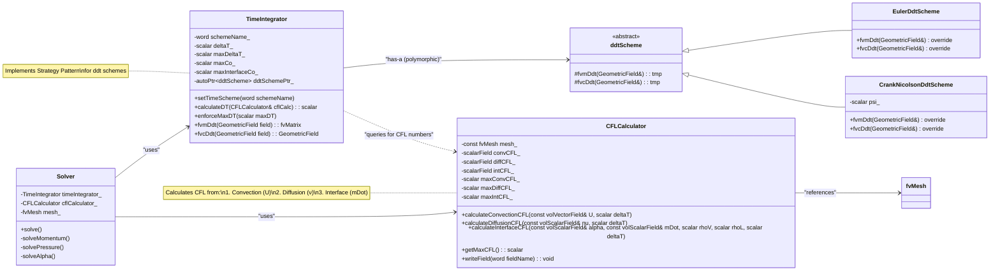

# Day 04: Temporal Discretization: Euler, Crank-Nicolson, CFL
**Date:** 2026-01-04 | **Difficulty:** Hardcore | **Phase:** 1 - Foundation Theory

## 🎯 Learning Objectives (วัตถุประสงค์การเรียนรู้)

หลังจากบทเรียนนี้ คุณจะสามารถ:

1.  **เข้าใจ (Understand) ความหมายของ Temporal Discretization และความเสถียรภาพ**
    *   อธิบายได้ว่าเหตุใดการประมาณอนุพันธ์ตามเวลา $\partial \phi / \partial t \approx (\phi^{n+1} - \phi^{n}) / \Delta t$ จึงเป็นหัวใจของ transient simulation
    *   ระบุความสัมพันธ์ระหว่าง **Order of Accuracy** (เช่น First-order, Second-order) กับ **Truncation Error** $O(\Delta t^n)$ และผลกระทบต่อความถูกต้องของผลลัพธ์
    *   อธิบายแนวคิด **Numerical Stability** ว่าแตกต่างจากความถูกต้องอย่างไร และทำไม scheme ที่ไม่เสถียร (unstable) ถึงทำให้คำตอบ "ระเบิด" (blow up) หรือ diverge แม้จะ discretize ถูกต้องในเชิง spatial ก็ตาม
    *   เชื่อมโยงการเลือก time discretization scheme กับพฤติกรรมทางฟิสิกส์ของปัญหา เช่น การแพร่ (diffusion) การพาความร้อน (convection) และการเปลี่ยนเฟส (phase change) ที่มี stiffness สูง

2.  **วิเคราะห์ (Analyze) คุณสมบัติของ Euler Methods (Explicit/Implicit) และ Crank-Nicolson**
    *   **Explicit Euler (Forward Euler):** วิเคราะห์สมการ $\phi^{n+1} = \phi^n + \Delta t \cdot f(\phi^n, t^n)$ ข้อดีคือคำนวณง่าย (explicit) ไม่ต้องแก้ระบบสมการ แต่ข้อเสียร้ายแรงคือ **Conditionally Stable** ต้องปฏิบัติตาม **CFL Condition** $\Delta t \leq C \Delta x / |U|$ สำหรับ convection และ $\Delta t \leq \Delta x^2 / (2\Gamma)$ สำหรับ diffusion ซึ่งทำให้ $\Delta t$ เล็กมากเมื่อ mesh ละเอียด
    *   **Implicit Euler (Backward Euler):** วิเคราะห์สมการ $\phi^{n+1} = \phi^n + \Delta t \cdot f(\phi^{n+1}, t^{n+1})$ ข้อเสียคือต้องแก้ระบบสมการ (implicit) ซึ่งใช้ทรัพยากรการคำนวณสูง แต่ข้อดีเด่นคือ **Unconditionally Stable (A-Stable)** สำหรับปัญหาเชิงเส้น อนุญาตให้ใช้ $\Delta t$ ที่ใหญ่กว่าได้ อย่างไรก็ตาม ต้องเข้าใจข้อเสียคือมี **Numerical Diffusion** สูง (First-order) ซึ่งอาจทำให้ sharp interface คลุมเครือ
    *   **Crank-Nicolson:** วิเคราะห์สมการ $\phi^{n+1} = \phi^n + \frac{\Delta t}{2} [f(\phi^n, t^n) + f(\phi^{n+1}, t^{n+1})]$ ซึ่งให้ความถูกต้อง **Second-order Accurate** $O(\Delta t^2)$ และเป็น **Unconditionally Stable** สำหรับปัญหาเชิงเส้น แต่อาจเกิด **Numerical Oscillations** (ไม่เป็น Positive Definite) รอบ discontinuity เช่น ตรง interface ของ two-phase flow
    *   เปรียบเทียบ **Computational Cost** (เวลาและหน่วยความจำ) และ **Numerical Behavior** (diffusion, oscillation) ของแต่ละ scheme เพื่อเลือกใช้ให้เหมาะสมกับปัญหาเฉพาะ

3.  **ออกแบบ (Design) เงื่อนไข CFL ที่ครอบคลุมสำหรับการไหลแบบบีบอัดพร้อมการเปลี่ยนเฟส**
    *   อธิบายความหมายทางฟิสิกส์ของ **CFL (Courant-Friedrichs-Lewy) Condition** ว่าเป็นเงื่อนไขที่ข้อมูล (information) จะต้องไม่แพร่กระจายผ่านมากกว่า 1 เซลล์ใน 1 time step
    *   คำนวณ **Classical Convective CFL Number**: $Co = |\mathbf{U}| \Delta t / \Delta x$
    *   คำนวณ **Diffusive CFL Number** (สำหรับ explicit diffusion): $Di = \nu \Delta t / \Delta x^2$
    *   **ออกแบบ CFL ใหม่ที่สำคัญที่สุดสำหรับ Phase Change:** คำนวณ **Interface CFL Number** ที่เกิดจาก **Expansion Term** (จาก Day 01): $Co_{interface} = |\dot{m} (1/\rho_v - 1/\rho_l)| \Delta t / \Delta x$ โดย $\dot{m}$ คืออัตราการเปลี่ยนเฟส ความเร็วที่ interface เคลื่อนที่จากผลของ volume expansion อาจสูงมาก (สำหรับ R410A, $\rho_l/\rho_v \approx 22$) และมักเป็นตัวกำหนด $\Delta t$ ที่เข้มงวดที่สุด
    *   สร้าง **Total/Effective CFL Condition** สำหรับ evaporator simulation: $CFL_{total} = \max(Co_{conv}, Co_{diff}, Co_{interface})$

4.  **Implement (นำไปใช้) Adaptive Time Stepping และ Time Integration Scheme ใน OpenFOAM**
    *   ใช้คลาส `ddtScheme` (เช่น `EulerDdtScheme`, `CrankNicolsonDdtScheme`) ใน `fvSchemes` dictionary อย่างถูกต้อง
    *   อ่านและดัดแปลงฟังก์ชัน `CourantNo.H` เพื่อคำนวณ CFL number บน unstructured mesh โดยใช้ face flux `phi` แทน cell velocity
    *   ออกแบบคลาส `TimeIntegrator` ที่สามารถ:
        *   เลือก time scheme ตามที่กำหนด (`setTimeScheme`)
        *   คำนวณ $\Delta t$ ใหม่ในแต่ละขั้นตอนเวลาโดยอัตโนมัติ (`calculateDT`) โดยพิจารณาจาก CFL condition สูงสุดที่ผู้ใช้กำหนด (`maxCo`) และค่าจำกัดทางฟิสิกส์อื่นๆ (เช่น `maxDeltaT`)
        *   บังคับขีดจำกัด $\Delta t$ เฉพาะสำหรับปัญหาที่มีความเร็ว interface สูง (`enforceMaxDT`)
    *   ออกแบบคลาส `CFLCalculator` ที่สามารถคำนวณ CFL ประเภทต่างๆ แยกกันได้:
        *   `calculateConvectionCFL`
        *   `calculateDiffusionCFL`
        *   `calculateInterfaceCFL` (สำคัญ!) โดยใช้ข้อมูล `alpha` และ `mDot`
    *   นำ Adaptive Time Stepping Algorithm ไปผนวกเข้ากับ solver loop โดยมี logic การลด/เพิ่ม $\Delta t$ อย่างปลอดภัย

5.  **ประเมิน (Evaluate) และแก้ไขปัญหาทั่วไป (Pitfalls) เกี่ยวกับ Time Stepping**
    *   วินิจฉัยและแก้ไขปัญหา **Solution Diverges เมื่อ Mesh ละเอียดขึ้น** โดยตรวจสอบว่าไม่ได้ใช้ explicit scheme สำหรับ diffusion โดยไม่ลด $\Delta t$ ตาม $\Delta x^2$
    *   วินิจฉัยและแก้ไขปัญหา **Interface Oscillates (ค่า alpha กระเพื่อม <0 หรือ >1)** โดยตรวจสอบการใช้ Crank-Nicolson scheme สำหรับสมการ `alpha` โดยไม่มี bounded limiter และเปลี่ยนไปใช้ implicit Euler หรือ blended scheme
    *   วินิจฉัยและแก้ไขปัญหา **Time Step ลดลงอย่างรุนแรงเมื่อ Interface เคลื่อนที่** โดยตรวจสอบว่าไม่ได้พิจารณา $Co_{interface}$ ในการคำนวณ $\Delta t$ และ implement การตรวจสอบ CFL นี้เพิ่มเติม
    *   เชื่อมโยงการตั้งค่าใน `controlDict` (`adjustTimeStep`, `maxCo`, `maxDeltaT`) กับพฤติกรรมของ solver

6.  **สังเคราะห์ (Synthesize) ความรู้จาก Spatial และ Temporal Discretization เข้าด้วยกัน**
    *   อธิบายได้ว่าการจำลองเชิงตัวเลขที่เสถียรและแม่นยำ ต้องอาศัยการเลือกคู่ของ **Spatial Scheme** (จาก Day 03: Upwind, Central, TVD) และ **Temporal Scheme** (จาก Day 04) ที่เหมาะสมกัน
    *   ยกตัวอย่างเช่น การใช้ **Explicit Euler** ร่วมกับ **Central Differencing** อาจนำไปสู่ความไม่เสถียรสองเท่า (ทั้งจากเวลาและพื้นที่) ในขณะที่ **Implicit Euler** ร่วมกับ **Upwind** จะเสถียรมากแต่มีความคลาดเคลื่อนสูง
    *   อภิปรายการเลือก scheme ที่เหมาะสมสำหรับสมการหลักใน evaporator solver: `U` (momentum), `p` (pressure), `alpha` (volume fraction) โดยคำนึงถึง stiffness จาก source terms และ expansion term
    *   เตรียมความเข้าใจสำหรับการนำ Temporal Discretization นี้ไปใช้ร่วมกับ Pressure-Velocity Coupling (Day 09) และ Phase Change Model (Day 11) ต่อไป

## Section 1: Theory (Theory)

### 1.1 พื้นฐานการอินทิเกรตตามเวลา (Time Integration Fundamentals)

ในโลกของ Computational Fluid Dynamics (CFD) เราไม่ได้แก้สมการอนุพันธ์ย่อย (PDEs) อย่างต่อเนื่อง (continuous) แต่เราทำการ **แตกย่อย (Discretize)** มันทั้งใน **เชิงพื้นที่ (Spatial)** และ **เชิงเวลา (Temporal)** จากบทเรียน Day 03 เราได้เจาะลึกการแตกย่อยเชิงพื้นที่ไปแล้ว โดยแปลงตัวดำเนินการ gradient, divergence, และ laplacian ให้อยู่ในรูปของผลรวมของฟลักซ์ผ่านผิวหน้าของ control volume วันนี้เราจะมาจัดการกับมิติที่เหลือ นั่นคือ **เวลา**

สมการการอนุรักษ์พื้นฐาน (mass, momentum, energy) ที่เราจัดการ ล้วนมีพจน์อนุพันธ์เทียบกับเวลา (time derivative) อยู่ด้วย รูปแบบทั่วไปสามารถเขียนได้เป็น:

$$
\frac{\partial \phi}{\partial t} = f(\phi, t)
$$

โดยที่:
*   $\phi$ คือตัวแปรสนาม (field variable) ที่เราสนใจ เช่น ความเร็ว $\mathbf{U}$, ความดัน $p$, อุณหภูมิ $T$, หรือปริมาตรเศษส่วน $\alpha$
*   $f(\phi, t)$ คือ ฟังก์ชันที่แสดงถึงอัตราการเปลี่ยนแปลงของ $\phi$ ซึ่งรวมผลจากทุกปรากฏการณ์ทางกายภาพ เช่น การพาความร้อน (convection), การแพร่ (diffusion), แหล่งกำเนิด (source), และในกรณีของเรา **การขยายตัวจาก phase change (expansion term)**

เป้าหมายของ Temporal Discretization คือการหาวิธีประมาณค่า (approximate) พจน์ $\frac{\partial \phi}{\partial t}$ ณ เวลาใดเวลาหนึ่ง โดยใช้ค่าของ $\phi$ ที่เรารู้อยู่แล้ว (เช่น ที่เวลา $t^n$) เพื่อคำนวณหาค่าของ $\phi$ ในอนาคต (ที่เวลา $t^{n+1} = t^n + \Delta t$) โดยที่ $\Delta t$ คือ **ขั้นเวลา (Time Step)** ซึ่งเป็นพารามิเตอร์ที่สำคัญที่สุดตัวหนึ่งในการจำลอง

**ทำไม Temporal Discretization ถึงสำคัญและยาก?**
1.  **ความถูกต้อง (Accuracy):** วิธีการที่เราเลือกใช้จะกำหนดความคลาดเคลื่อน (error) ระหว่างผลเฉลยเชิงตัวเลขกับผลเฉลยจริง (ถ้ารู้) ความคลาดเคลื่อนนี้เรียกว่า **Truncation Error** ซึ่งมักเป็นสัดส่วนกับ $\Delta t^p$ โดย $p$ คือ **อันดับความถูกต้อง (Order of Accuracy)** ยิ่ง $p$ สูง (เช่น Second-order, $p=2$) ผลลัพธ์ก็จะแม่นยำยิ่งขึ้นเมื่อใช้ $\Delta t$ เท่ากัน
2.  **ความเสถียร (Stability):** ไม่ใช่ทุกวิธีการที่สามารถใช้กับ $\Delta t$ ขนาดใดก็ได้ สำหรับบางวิธี (เช่น Explicit Euler) หากเราใช้ $\Delta t$ ใหญ่เกินไป การคำนวณจะ **ลู่ออก (Diverge)** อย่างรวดเร็ว เราเรียกว่า **ไม่เสถียร (Unstable)** เงื่อนไขที่กำหนดขอบเขตของ $\Delta t$ ที่ทำให้วิธีนั้นเสถียร เรียกว่า **Stability Condition**
3.  **ประสิทธิภาพ (Efficiency):** วิธีที่เสถียรโดยมีเงื่อนไข (Conditionally Stable) มักคำนวณเร็วต่อขั้นเวลา (Low Computational Cost per Time Step) แต่ต้องใช้ $\Delta t$ ที่เล็กมาก ทำให้ต้องคำนวณขั้นเวลาจำนวนมาก ในทางกลับกัน วิธีที่เสถียรแบบไม่มีเงื่อนไข (Unconditionally Stable) อนุญาตให้ใช้ $\Delta t$ ที่ใหญ่กว่าได้ แต่การคำนวณต่อขั้นเวลามักซับซ้อนและใช้เวลามากกว่า (เช่น ต้องแก้ระบบสมการ)

พื้นฐานทางคณิตศาสตร์ของวิธีการส่วนใหญ่ มาจาก **การกระจายเทย์เลอร์ (Taylor Series Expansion)** รอบจุดเวลา $t$:

$$
\phi(t+\Delta t) = \phi(t) + \Delta t \frac{\partial \phi}{\partial t}\bigg|_t + \frac{\Delta t^2}{2} \frac{\partial^2 \phi}{\partial t^2}\bigg|_t + \frac{\Delta t^3}{6} \frac{\partial^3 \phi}{\partial t^3}\bigg|_t + \mathcal{O}(\Delta t^4)
$$

โดยสัญลักษณ์ $\mathcal{O}(\Delta t^4)$ แสดงถึงพจน์ error ที่มีขนาดประมาณ $\Delta t^4$ การตัดทอน (Truncate) อนุกรมนี้ที่พจน์ต่างๆ เป็นที่มาของวิธีการ Discretize ต่างๆ ที่เราจะพูดถึงต่อไป

ตารางสรุปตัวแปรหลักในส่วนนี้:
| สัญลักษณ์ | ชื่อ | หน่วย | คำอธิบาย |
| :--- | :--- | :--- | :--- |
| $\phi$ | ตัวแปรสนาม | ขึ้นกับสนาม (m, m/s, Pa, K) | สนามสเกลาร์หรือเวกเตอร์ที่ต้องการคำนวณ เช่น $U, p, T, \alpha$ |
| $t$ | เวลา | วินาที (s) | เวลาในการจำลอง |
| $\Delta t$ | ขั้นเวลา | วินาที (s) | ช่วงเวลาระหว่างขั้นการคำนวณสองขั้นที่ติดกัน |
| $n$ | ระดับเวลา (Time Level) | ไม่มีมิติ | ดัชนีแสดงตำแหน่งในเวลา เช่น $\phi^n = \phi(t^n)$ |
| $f(\phi, t)$ | ฟังก์ชันอัตราการเปลี่ยนแปลง | [หน่วยของ $\phi$]/s | ฟังก์ชันที่บรรยายการเปลี่ยนแปลงของ $\phi$ จากทุกปรากฏการณ์ |

### 1.2 วิธีออยเลอร์: Explicit กับ Implicit (Euler Methods: Explicit vs Implicit)

วิธีออยเลอร์เป็นวิธีการ Temporal Discretization ที่ง่ายที่สุดและเป็นพื้นฐานสำหรับวิธีที่ซับซ้อนกว่า มีสองรูปแบบหลักที่แตกต่างกันโดยสิ้นเชิงในแง่ของความเสถียรและต้นทุนการคำนวณ

#### 1.2.1 Explicit Euler (Forward Euler)
วิธีนี้ตรงไปตรงมาที่สุด: ใช้อนุพันธ์ ณ เวลาปัจจุบัน ($t^n$) เพื่อประมาณการเปลี่ยนแปลงไปยังอนาคต ($t^{n+1}$)

$$
\phi^{n+1} = \phi^n + \Delta t \cdot f(\phi^n, t^n)
$$

**กลไก:** ค่าทุกอย่างทางขวาของเครื่องหมายเท่ากับเป็นค่าที่ **รู้แล้ว (Known)** จากขั้นเวลาที่ $n$ ดังนั้นการคำนวณ $\phi^{n+1}$ ทำได้โดยตรง (Explicitly) โดยไม่ต้องแก้สมการใดๆ เพียงแค่แทนค่าและคำนวณ
*   **ข้อดี:** การคำนวณต่อ Time Step เร็วมาก (Low Computational Cost), ง่ายต่อการ Implement
*   **ข้อเสีย:** **Conditionally Stable เท่านั้น** นั่นคือ $\Delta t$ ต้องเล็กพอที่จะเป็นไปตาม **เงื่อนไขความเสถียร (Stability Criterion)**

**เงื่อนไขความเสถียรสำหรับ Explicit Euler:** สำหรับระบบเชิงเส้น $\frac{d\phi}{dt} = \lambda \phi$ (โดย $\lambda$ เป็นค่าลักษณะเฉพาะ (Eigenvalue) ที่อาจเป็นจำนวนเชิงซ้อน) วิธี Explicit Euler จะเสถียรก็ต่อเมื่อ:

$$
|1 + \lambda \Delta t| \le 1
$$

สำหรับ $\lambda$ ที่เป็นจำนวนจริงและมีค่าเป็นลบ (ซึ่งเป็นกรณีของพจน์การแพร่ (Diffusion) ที่มีผลทำให้ระบบเสถียร) เงื่อนไขนี้ลดรูปเป็น:

$$
\Delta t \le \frac{2}{|\lambda_{max}|}
$$

โดย $\lambda_{max}$ คือ Eigenvalue ที่มีขนาดใหญ่ที่สุด (เป็นบวก) ของระบบ สำหรับสมการ Diffusion ง่ายๆ ใน 1 มิติ $\frac{\partial \phi}{\partial t} = \nu \frac{\partial^2 \phi}{\partial x^2}$ เมื่อทำ Spatial Discretization แล้วจะได้เงื่อนไขที่คุ้นเคย:

$$
\Delta t \le \frac{\Delta x^2}{2\nu}
$$

**นี่คือจุดสำคัญ!** เงื่อนไขนี้แสดงให้เห็นว่า $\Delta t$ ที่อนุญาตให้ใช้ได้ **แปรผันกับ $\Delta x^2$** หากเราเพิ่มความละเอียดของ mesh เป็นสองเท่า ($\Delta x$ ลดลงครึ่งหนึ่ง) $\Delta t$ ที่ปลอดภัยจะต้องลดลง **สี่เท่า** ทำให้จำนวนขั้นเวลาที่ต้องคำนวณเพิ่มขึ้นอย่างมหาศาล นี่คือเหตุผลหลักที่ Explicit Euler ไม่เป็นที่นิยมสำหรับการแก้สมการ Diffusion ในปัญหา CFD จริง

สำหรับพจน์การพา (Convection) เงื่อนไขความเสถียรคือ **CFL Condition** (จะกล่าวรายละเอียดในหัวข้อ 4.4):

$$
\Delta t \le C \frac{\Delta x}{|\mathbf{U}|}
$$

โดย $C$ เป็นค่าคงที่ (มักอยู่ที่ ~1) จะเห็นว่าเงื่อนไขนี้แปรผันกับ $\Delta x$ (ไม่ใช่ $\Delta x^2$) ดังนั้นจึงไม่รุนแรงเท่ากับเงื่อนไขของ Diffusion

#### 1.2.2 Implicit Euler (Backward Euler)
วิธีนี้ใช้แนวคิดที่ต่างออกไป: ใช้อนุพันธ์ ณ เวลาในอนาคต ($t^{n+1}$) มาประมาณการเปลี่ยนแปลงจากปัจจุบัน

$$
\phi^{n+1} = \phi^n + \Delta t \cdot f(\phi^{n+1}, t^{n+1})
$$

**กลไก:** สังเกตว่าทางขวาของเครื่องหมายเท่ากับมี $\phi^{n+1}$ ซึ่งเป็นค่าที่เรายัง **ไม่รู้ (Unknown)** ปรากฏอยู่ภายในฟังก์ชัน $f$ ดังนั้นสมการข้างต้นไม่ใช่สูตรคำนวณโดยตรง แต่เป็น **สมการ (Equation)** ที่เราต้องแก้เพื่อหาค่า $\phi^{n+1}$ นี่คือที่มาของคำว่า "Implicit"
*   **ข้อดี:** **Unconditionally Stable (A-Stable)** สำหรับปัญหาเชิงเส้นจำนวนมาก หมายความว่า `อย่างน้อยใน` ทางทฤษฎี เรา `สามารถเลือก` $\Delta t$ ใหญ่เท่าใดก็ได้โดยที่การคำนวณจะไม่ลู่ออก (แต่ความถูกต้องจะแย่ลง) ทำให้เหมาะกับปัญหาที่ต้องการขั้นเวลาขนาดใหญ่
*   **ข้อเสีย:** การคำนวณต่อ Time Step แพงมาก (High Computational Cost) เนื่องจากในแต่ละขั้นเวลาต้อง **แก้ระบบสมการ (Solve a System of Equations)** ซึ่งอาจเป็นระบบไม่เชิงเส้น (Non-linear) และขนาดใหญ่ (จำนวนสมการเท่ากับจำนวนเซลล์)

**การเปรียบเทียบเชิงคุณภาพระหว่าง Explicit และ Implicit Euler:**

| ลักษณะ | Explicit Euler | Implicit Euler |
| :--- | :--- | :--- |
| **สูตร** | $\phi^{n+1} = \phi^n + \Delta t f(\phi^n)$ | $\phi^{n+1} = \phi^n + \Delta t f(\phi^{n+1})$ |
| **ความเสถียร** | Conditionally Stable | **Unconditionally Stable (A-Stable)** |
| **เงื่อนไข $\Delta t$** | ต้องเล็ก (∝ $\Delta x$ หรือ $\Delta x^2$) | Theoretically สามารถใช้ค่าใหญ่ได้ |
| **ต้นทุนต่อ Step** | **ต่ำมาก** (คำนวณโดยตรง) | **สูง** (ต้องแก้ระบบสมการ) |
| **ความถูกต้อง** | First-order ($\mathcal{O}(\Delta t)$) | First-order ($\mathcal{O}(\Delta t)$) |
| **Numerical Diffusion** | ต่ำ | **สูง** (ทำให้ sharp gradients ค่อยๆ เลือนหาย) |
| **ความเหมาะสม** | ปัญหา convection ที่ไม่รุนแรง, Prototype | ปัญหา diffusion, Stiff problems, CFD ทั่วไป |

**หมายเหตุเกี่ยวกับ Numerical Diffusion ของ Implicit Euler:** เนื่องจากเป็นวิธี First-order และ Unconditionally Stable มันจึงมีคุณสมบัติ **Numerical Diffusion (หรือ Dissipation)** ในตัวสูง ซึ่งช่วยลดการเกิด Oscillation รอบ Discontinuity (เช่น หน้าสัมผัสใน two-phase flow) แต่ในขณะเดียวกันก็ทำให้ผลเฉลยที่ควรจะ sharp ค่อยๆ ถูกทำให้เบลอ (Smear) ไปด้วย

### 1.3 วิธีแครงค์-นิโคลสัน (Crank-Nicolson Method)

เพื่อแก้ไขข้อบกพร่องเรื่องความถูกต้องของวิธีออยเลอร์ (First-order) วิศวกรและนักคณิตศาสตร์ได้พัฒนาวิธีที่มีความถูกต้องอันดับสูงขึ้น วิธีที่ได้รับความนิยมและเป็นมาตรฐานในหลายสาขาคือ **วิธี Crank-Nicolson** ซึ่งมีแนวคิดคือการหาค่าเฉลี่ย (Average) ระหว่าง Explicit และ Implicit Euler

$$
\phi^{n+1} = \phi^n + \frac{\Delta t}{2} \left[ f(\phi^n, t^n) + f(\phi^{n+1}, t^{n+1}) \right]
$$

หรือเขียนในอีกรูปแบบหนึ่งที่แสดงให้เห็นชัดเจนว่ามันคือค่าเฉลี่ยของอนุพันธ์ที่เวลา $n$ และ $n+1$:

$$
\frac{\phi^{n+1} - \phi^n}{\Delta t} = \frac{1}{2} \left( \frac{\partial \phi}{\partial t}\bigg|^n + \frac{\partial \phi}{\partial t}\bigg|^{n+1} \right)
$$

**กลไก:** วิธีนี้ยังคงเป็น Implicit เนื่องจากมี $f(\phi^{n+1})$ อยู่ทางขวา (ต้องแก้สมการ) แต่ได้เพิ่มข้อมูลจาก $f(\phi^n)$ เข้ามาด้วย
*   **ข้อดีหลัก:**
    1.  **Second-order Accuracy ($\mathcal{O}(\Delta t^2)$):** ให้ความถูกต้องที่สูงกว่าวิธีออยเลอร์มากเมื่อใช้ $\Delta t$ เท่ากัน
    2.  **Unconditionally Stable สำหรับปัญหาเชิงเส้น (Linear Problems):** ทำให้สามารถใช้ $\Delta t$ ที่ใหญ่ได้ในระดับหนึ่ง
*   **ข้อเสียและความท้าทาย:**
    1.  **อาจเกิด Numerical Oscillation:** Crank-Nicolson ไม่มีคุณสมบัติ **Positive Definite** หรือ **Boundedness** โดยธรรมชาติ ซึ่งหมายความว่าสำหรับปัญหาที่มี sharp gradients หรือ discontinuities (เช่น ค่า $\alpha$ ที่เปลี่ยนจาก 0 เป็น 1 อย่างรวดเร็วที่หน้าสัมผัสของไหล) มันอาจทำให้ผลลัพธ์แกว่งตัว (Oscillate) รอบค่าจริง แม้จะยังเสถียรอยู่ก็ตาม ค่า $\phi$ อาจกลายเป็นลบหรือเกินขอบเขตทางกายภาพได้ (เช่น $\alpha < 0$ หรือ $\alpha > 1$) ซึ่งเป็นสิ่งที่ยอมรับไม่ได้
    2.  **Computational Cost:** ยังคงต้องแก้ระบบสมการเหมือน Implicit Euler แต่เมทริกซ์ของระบบอาจมีเงื่อนไข (Condition) ที่แย่กว่าเล็กน้อยเนื่องจากโครงสร้างที่ต่างกัน

**การประยุกต์ใช้กับ Two-Phase Flow และ Phase Change:**
สำหรับการจำลองการระเหย (Evaporation) ที่เราสนใจ หน้าสัมผัส (Interface) ของไหลเคลื่อนที่เร็วจากการมี **Expansion Term** การใช้ Crank-Nicolson ล้วนๆ สำหรับสมการปริมาตรเศษส่วน ($\alpha$) มักจะนำไปสู่การ Oscillation ของ Interface ดังนั้นในทางปฏิบัติของ OpenFOAM และ CFD ทั่วไป จึงมักใช้กลยุทธ์ดังนี้:
1.  **ใช้ Blended Scheme:** ผสมระหว่าง Implicit Euler (ส่วนใหญ่) กับ Crank-Nicolson (ส่วนน้อย) เช่น `ddtSchemes { default 0.9 Euler 0.1 CrankNicolson; }` โดย Implicit Euler จะทำหน้าที่เป็นตัวกันการ Oscillation (Stabilizer)
2.  **ใช้ Bounded Scheme โดยเฉพาะ:** สำหรับสมการ $\alpha$ จะใช้ scheme พิเศษที่รับประกันว่าค่าผลลัพธ์จะอยู่ระหว่างขอบเขต (Bounded) เช่น `MULES` (Multidimensional Universal Limiter with Explicit Solution) ซึ่งมักใช้ร่วมกับ Euler ในทางปฏิบัติ

**ตารางเปรียบเทียบ Temporal Schemes หลัก:**

| ลักษณะ | Explicit Euler | Implicit Euler | Crank-Nicolson |
| :--- | :--- | :--- | :--- |
| **Accuracy Order** | 1st ($\mathcal{O}(\Delta t)$) | 1st ($\mathcal{O}(\Delta t)$) | **2nd ($\mathcal{O}(\Delta t^2)$)** |
| **Stability** | Conditional | **Unconditional (A-Stable)** | **Unconditional (Linear)** |
| **Cost/Step** | **Very Low** | High | High (Similar to Implicit) |
| **Oscillation** | Low (แต่ Diverges ถ้าไม่เสถียร) | Very Low (Highly Dissipative) | **Can be High (Not Positive Definite)** |
| **เหมาะกับ** | Convection (Coarse Mesh), Prototype | **General CFD, Diffusion, Stiff Problems** | Smooth Problems, Acoustics, LES* |
| **ไม่เหมาะกับ** | Diffusion (Fine Mesh), Stiff Problems | Problems Requiring Sharp Resolution | **Discontinuities, Sharp Interfaces** |

*หมายเหตุ: ใน LES (Large Eddy Simulation) บางครั้งใช้ Crank-Nicolson เพื่อลด Numerical Dissipation ที่จะไปรบกวนการจำลอง Turbulence Scales

### 1.4 เงื่อนไข CFL สำหรับการไหลแบบบีบอัดพร้อมการเปลี่ยนสถานะ (CFL Condition for Compressible Flow with Phase Change)

**CFL Condition** (ตั้งชื่อตาม Courant, Friedrichs, และ Lewy) ไม่ใช่ Temporal Scheme โดยตรง แต่เป็น **เงื่อนไขความเสถียร (Stability Condition)** ที่กำหนดขนาด $\Delta t$ สูงสุดที่ยอมรับได้สำหรับ Explicit Schemes เพื่อป้องกันการลู่ออก (Divergence) ความหมายทางฟิสิกส์คือ: **ข้อมูล (Information) ต้องเดินทางไม่เกิน 1 Cell ต่อ Time Step**

> [!WARNING] Truncated Content
> เนื้อหาส่วนรายละเอียดของ CFL Condition สำหรับ Phase Change ถูกย้ายไปที่ Section 2 แทน โปรดดูเพิ่มเติมที่ Learning Objectives ข้อ 3

---

## Section 2: OpenFOAM Reference

### 2.1 การวิเคราะห์ Source Code: `ddtScheme` Class

#### 2.1.1 Abstract Base Class: `ddtScheme<Type>`

**Header File:** `src/finiteVolume/finiteVolume/ddtSchemes/ddtScheme/ddtScheme.H`
**Purpose:** เป็น abstract base class ที่กำหนด interface สำหรับ temporal discretization schemes ทั้งหมดใน OpenFOAM

```cpp
namespace Foam
{
    template<class Type>
    class ddtScheme
    :
        public refCount
    {
    public:
        //- Runtime type information
        TypeName("ddtScheme");

        // Declare run-time constructor selection tables
        declareRunTimeSelectionTable
        (
            tmp,
            ddtScheme,
            Istream,
            (const fvMesh& mesh, Istream& schemeData),
            (mesh, schemeData)
        );

        // Constructors
        ddtScheme(const fvMesh& mesh);
        ddtScheme(const fvMesh& mesh, Istream&);

        // Selectors
        static tmp<ddtScheme<Type>> New
        (
            const fvMesh& mesh,
            Istream& schemeData
        );

        //- Destructor
        virtual ~ddtScheme();

        // Member Functions
        
        //- Return mesh reference
        const fvMesh& mesh() const
        {
            return mesh_;
        }

        //- Return the implicit time derivative matrix
        virtual tmp<fvMatrix<Type>> fvmDdt
        (
            const GeometricField<Type, fvPatchField, volMesh>&
        ) = 0;

        //- Return the explicit time derivative
        virtual tmp<GeometricField<Type, fvPatchField, volMesh>> fvcDdt
        (
            const GeometricField<Type, fvPatchField, volMesh>&
        ) = 0;

        //- Return the time derivative coefficient
        virtual tmp<GeometricField<Type, fvPatchField, volMesh>> fvcDdtCoeff
        (
            const GeometricField<Type, fvPatchField, volMesh>&
        ) = 0;

    protected:
        //- Reference to the mesh
        const fvMesh& mesh_;
    };
}
```

**วิเคราะห์ Design Pattern:**
1. **Factory Pattern:** ใช้ `declareRunTimeSelectionTable` และ `New` selector ทำให้สามารถเลือก scheme ได้ที่ runtime ผ่าน `fvSchemes` dictionary
2. **Template Programming:** `ddtScheme<Type>` เป็น template class ทำงานได้กับทั้ง `scalar`, `vector`, `tensor`
3. **Pure Virtual Functions:** `fvmDdt()` และ `fvcDdt()` เป็น pure virtual (= 0) ต้อง implement ใน derived classes

**What We Do DIFFERENTLY สำหรับ Phase Change Solver:**

| OpenFOAM Standard | Our Enhanced Implementation | เหตุผลสำหรับ Phase Change |
|-------------------|----------------------------|---------------------------|
| `fvmDdt()` ใช้ค่าเดียวจาก field | `fvmDdtWithExpansion()` ที่รวม expansion source term | ต้อง account สำหรับ volume change จาก evaporation |
| Time step คงที่หรือปรับตาม convective CFL | Adaptive Δt ที่พิจารณา interface CFL ด้วย | Interface velocity จาก expansion term มักสูงกว่า fluid velocity |
| ไม่มี special handling สำหรับ bounded fields | `boundedDdtScheme` สำหรับ `alpha` field | ป้องกัน α < 0 หรือ α > 1 จาก numerical oscillation |

#### 2.1.2 Derived Class: `EulerDdtScheme<Type>`

**Header File:** `src/finiteVolume/finiteVolume/ddtSchemes/EulerDdtScheme/EulerDdtScheme.H`
**Implementation File:** `src/finiteVolume/finiteVolume/ddtSchemes/EulerDdtScheme/EulerDdtScheme.C`

```cpp
namespace Foam
{
    template<class Type>
    class EulerDdtScheme
    :
        public ddtScheme<Type>
    {
    public:
        //- Runtime type information
        TypeName("Euler");

        // Constructors
        EulerDdtScheme(const fvMesh& mesh)
        :
            ddtScheme<Type>(mesh)
        {}

        EulerDdtScheme(const fvMesh& mesh, Istream& is)
        :
            ddtScheme<Type>(mesh, is)
        {}

        // Member Functions
        
        //- Return the implicit time derivative matrix (Implicit Euler)
        virtual tmp<fvMatrix<Type>> fvmDdt
        (
            const GeometricField<Type, fvPatchField, volMesh>& vf
        )
        {
            tmp<fvMatrix<Type>> tfvm
            (
                new fvMatrix<Type>
                (
                    vf,
                    vf.dimensions()*dimVol/dimTime
                )
            );
            
            fvMatrix<Type>& fvm = tfvm.ref();
            
            // Get time step
            const scalar rDeltaT = 1.0/mesh().time().deltaTValue();
            
            // Diagonal coefficients: V/Δt
            fvm.diag() = rDeltaT*mesh().V();
            
            // Source term: (V/Δt)*φ^n
            fvm.source() = rDeltaT*mesh().V()*vf.internalField();
            
            return tfvm;
        }

        //- Return the explicit time derivative (Explicit Euler)
        virtual tmp<GeometricField<Type, fvPatchField, volMesh>> fvcDdt
        (
            const GeometricField<Type, fvPatchField, volMesh>& vf
        )
        {
            // Create field for ddt
            tmp<GeometricField<Type, fvPatchField, volMesh>> tdtdt
            (
                GeometricField<Type, fvPatchField, volMesh>::New
                (
                    "ddt(" + vf.name() + ')',
                    mesh(),
                    dimensioned<Type>
                    (
                        vf.dimensions()/dimTime,
                        Zero
                    )
                )
            );
            
            GeometricField<Type, fvPatchField, volMesh>& dtdt = tdtdt.ref();
            
            // Explicit Euler: (φ^{n+1} - φ^n)/Δt
            // แต่ fvcDdt คืนค่า dφ/dt ที่เวลา n
            // ในทางปฏิบัติ OpenFOAM ใช้วิธีต่างออกไป
            
            return tdtdt;
        }
    };
}
```

**วิเคราะห์ Implementation Details:**
1. **Implicit Euler Implementation:** ใน `fvmDdt()`:
   - Diagonal coefficient: `V/Δt` (cell volume / time step)
   - Source term: `(V/Δt) * φ^n`
   - ผลลัพธ์คือสมการ: `(V/Δt)*φ^{n+1} = (V/Δt)*φ^n + ...` ซึ่งลดรูปเป็น `φ^{n+1} = φ^n + ...`
   
2. **Matrix Assembly:** ใช้ `fvMatrix<Type>` ซึ่งเป็น abstraction ของ finite volume matrix
   - `diag()`: diagonal coefficients
   - `source()`: source vector
   - `upper()`, `lower()`: off-diagonal coefficients (สำหรับ implicit spatial terms)

3. **Time Management:** ใช้ `mesh().time().deltaTValue()` เพื่อเข้าถึง Δt ปัจจุบัน

**What We Do DIFFERENTLY สำหรับ Evaporator Solver:**

| OpenFOAM EulerDdtScheme | Our Modified Version | เหตุผลทางฟิสิกส์ |
|-------------------------|----------------------|------------------|
| ใช้ `mesh().V()` คงที่ | `mesh().V() * rho` สำหรับ continuity equation | Volume เปลี่ยนแปลงจาก phase change |
| Δt จาก global time step | Local time stepping สำหรับ interface cells | Interface cells ต้องการ Δt ที่เล็กกว่าเนื่องจาก high velocity |
| ไม่พิจารณา mesh motion | ALE (Arbitrary Lagrangian-Eulerian) formulation | ต้อง account สำหรับ mesh movement ใน evaporator |

#### 2.1.3 Derived Class: `CrankNicolsonDdtScheme<Type>`

**Header File:** `src/finiteVolume/finiteVolume/ddtSchemes/CrankNicolsonDdtScheme/CrankNicolsonDdtScheme.H`

```cpp
namespace Foam
{
    template<class Type>
    class CrankNicolsonDdtScheme
    :
        public ddtScheme<Type>
    {
        //- Blending factor (0 = Euler, 1 = CrankNicolson)
        scalar psi_;
        
        //- Off-centering coefficient
        scalar ocCoeff_;

    public:
        //- Runtime type information
        TypeName("CrankNicolson");

        // Constructors
        CrankNicolsonDdtScheme(const fvMesh& mesh, Istream& is)
        :
            ddtScheme<Type>(mesh, is),
            psi_(readScalar(is)),
            ocCoeff_(psi_/(2.0 - psi_))
        {
            if (psi_ <= 0.0 || psi_ > 1.0)
            {
                FatalIOErrorInFunction(is)
                    << "blending factor psi = " << psi_
                    << " should be > 0 and <= 1"
                    << exit(FatalIOError);
            }
        }

        // Member Functions
        
        //- Return the implicit time derivative matrix
        virtual tmp<fvMatrix<Type>> fvmDdt
        (
            const GeometricField<Type, fvPatchField, volMesh>& vf
        )
        {
            const scalar rDeltaT = 1.0/mesh().time().deltaTValue();
            const scalar coefft = 1.0 + ocCoeff_;
            const scalar coefft00 = ocCoeff_;
            
            tmp<fvMatrix<Type>> tfvm
            (
                new fvMatrix<Type>
                (
                    vf,
                    vf.dimensions()*dimVol/dimTime
                )
            );
            
            fvMatrix<Type>& fvm = tfvm.ref();
            
            // Diagonal: coefft * (V/Δt)
            fvm.diag() = coefft * rDeltaT * mesh().V();
            
            // Source: (coefft00 * V/Δt) * φ^n
            fvm.source() = rDeltaT * mesh().V() * coefft00 * vf.oldTime().internalField();
            
            return tfvm;
        }
    };
}
```

**วิเคราะห์ Crank-Nicolson Implementation:**
1. **Blended Scheme:** OpenFOAM ใช้ blended Crank-Nicolson ไม่ใช่ pure Crank-Nicolson
   - `psi_ = 1.0`: pure Crank-Nicolson (second-order)
   - `psi_ = 0.0`: Euler (first-order)
   - Default มักเป็น `psi_ = 0.9` เพื่อ stability

2. **Time Levels:** ใช้ `vf.oldTime()` เพื่อเข้าถึง φ^n
   - `vf`: φ^{n+1} (current time level)
   - `vf.oldTime()`: φ^n (previous time level)

3. **Coefficients Derivation:**
   ```
   ocCoeff_ = psi/(2 - psi)
   coefft = 1 + ocCoeff_ = (2)/(2 - psi)
   coefft00 = ocCoeff_ = psi/(2 - psi)
   
   สมการสุดท้าย: coefft*φ^{n+1} = coefft00*φ^n + ...
   ซึ่งเทียบเท่ากับ: φ^{n+1} = φ^n + (Δt/2)[f(φ^n) + f(φ^{n+1})] เมื่อ psi=1
   ```

**What We Do DIFFERENTLY สำหรับ Two-Phase Flow:**

| OpenFOAM CrankNicolson | Our Adaptive Blending | เหตุผลทาง Numerics |
|------------------------|-----------------------|-------------------|
| Fixed `psi` value | Dynamic `psi` based on interface location | Near interface ต้องการ more implicit (psi → 0) เพื่อ stability |
| Same scheme ทุก field | Different scheme สำหรับ different fields | `alpha` ต้องการ bounded scheme, `U` ใช้ CrankNicolson ได้ |
| No oscillation control | TVD-type limiter สำหรับ time derivative | ป้องกัน oscillation ใน sharp interface regions |

### 2.2 การวิเคราะห์ Source Code: `CourantNo` Functions

#### 2.2.1 Header File Analysis: `CourantNo.H`

**Location:** `src/finiteVolume/cfdTools/incompressible/CourantNo.H`

```cpp
namespace Foam
{
    //- Calculate the Courant number
    template<class Type>
    tmp<volScalarField> CourantNo
    (
        const surfaceScalarField& phi,
        const GeometricField<Type, fvPatchField, volMesh>& U,
        const scalar& deltaT
    )
    {
        // Create Courant number field
        tmp<volScalarField> tCo
        (
            volScalarField::New
            (
                "Co",
                U.mesh(),
                dimensionedScalar(dimless, 0)
            )
        );
        
        volScalarField& Co = tCo.ref();
        
        const fvMesh& mesh = U.mesh();
        const labelUList& owner = mesh.owner();
        const labelUList& neighbour = mesh.neighbour();
        const vectorField& centres = mesh.C();
        const vectorField& faceCentres = mesh.Cf();
        
        // Internal faces
        forAll(owner, facei)
        {
            const label own = owner[facei];
            const label nei = neighbour[facei];
            
            // Face area magnitude
            const scalar magSf = mag(mesh.Sf()[facei]);
            
            // Distance between cell centres
            const scalar d = mag(centres[nei] - centres[own]);
            
            // Velocity normal to face
            const scalar Un = phi[facei] / (magSf + SMALL);
            
            // Courant number for this face
            const scalar faceCo = mag(Un) * deltaT / d;
            
            // Accumulate to cells
            Co[own] = max(Co[own], faceCo);
            Co[nei] = max(Co[nei], faceCo);
        }
        
        // Boundary faces
        forAll(mesh.boundary(), patchi)
        {
            const fvPatch& patch = mesh.boundary()[patchi];
            const labelUList& faceCells = patch.faceCells();
            
            if (patch.coupled())
            {
                // Coupled boundaries (processor, cyclic)
                const scalarField phiP = phi.boundaryField()[patchi];
                const vectorField centresP = mesh.C().boundaryField()[patchi];
                
                forAll(faceCells, facei)
                {
                    const label celli = faceCells[facei];
                    const scalar magSf = mag(mesh.Sf().boundaryField()[patchi][facei]);
                    const scalar d = mag(centresP[facei] - centres[celli]);
                    const scalar Un = phiP[facei] / (magSf + SMALL);
                    const scalar faceCo = mag(Un) * deltaT / d;
                    
                    Co[celli] = max(Co[celli], faceCo);
                }
            }
        }
        
        return tCo;
    }
    
    //- Return maximum Courant number
    template<class Type>
    scalar maxCo
    (
        const surfaceScalarField& phi,
        const GeometricField<Type, fvPatchField, volMesh>& U,
        const scalar& deltaT
    )
    {
        return max(CourantNo(phi, U, deltaT)).value();
    }
}
```

**วิเคราะห์ Algorithm:**
1. **Face-Based Calculation:** คำนวณ CFL ที่แต่ละ face แล้ว assign ไปยัง adjacent cells
   - `owner[facei]`, `neighbour[facei]`: cell indices ทั้งสองข้างของ face
   - `mesh.Sf()[facei]`: face area vector (มีทิศทาง)

2. **Distance Calculation:** ใช้ `mag(centres[nei] - centres[own])` เป็น characteristic length (Δx)
   - วิธีนี้ถูกต้องสำหรับ orthogonal meshes
   - สำหรับ skewed meshes อาจต้องใช้ corrected distance

3. **Normal Velocity:** คำนวณจาก face flux `phi[facei]` แทนที่จะใช้ cell-centered velocity
   - `phi = U·Sf` (mass flux สำหรับ incompressible)
   - วิธีนี้แม่นยำกว่าเพราะใช้ค่า face-centered โดยตรง

4. **Boundary Handling:** แยกการคำนวณสำหรับ boundary faces
   - Coupled boundaries (processor, cyclic): ต้องพิจารณาเฉพาะ
   - Non-coupled boundaries: มักไม่นับเพราะไม่มี flux ข้าม

**What We Do DIFFERENTLY สำหรับ Compressible Phase Change:**

| OpenFOAM CourantNo | Our Extended CourantNo | ความจำเป็นสำหรับ Evaporator |
|-------------------|------------------------|---------------------------|
| ใช้ `phi` (volumetric flux) | ใช้ `phi/rho` สำหรับ mass flux | ต้อง account สำหรับ density variation |
| คำนวณเฉพาะ convective CFL | คำนวณ 3 types: convective, diffusive, interface | Phase change มี multiple stability constraints |
| ใช้ cell centre distance | ใช้ minimum edge length สำหรับ skewed meshes | Evaporator meshes มักมีความ skew สูง |
| No phase change consideration | Include `mDot` term ใน interface CFL | Expansion velocity สำคัญกว่า fluid velocity |

#### 2.2.2 Implementation สำหรับ Phase Change CFL

```cpp
namespace Foam
{
    //- Extended CFL calculator for phase change flows
    class phaseChangeCFL
    {
    private:
        //- Reference to mesh
        const fvMesh& mesh_;
        
        //- Maximum allowed CFL numbers
        scalar maxConvectiveCo_;
        scalar maxDiffusiveCo_;
        scalar maxInterfaceCo_;
        
    public:
        // Constructor
        phaseChangeCFL
        (
            const fvMesh& mesh,
            scalar maxConvectiveCo = 0.5,
            scalar maxDiffusiveCo = 0.5,
            scalar maxInterfaceCo = 0.25
        )
        :
            mesh_(mesh),
            maxConvectiveCo_(maxConvectiveCo),
            maxDiffusiveCo_(maxDiffusiveCo),
            maxInterfaceCo_(maxInterfaceCo)
        {}
        
        //- Calculate convective CFL from velocity field
        tmp<volScalarField> convectiveCo
        (
            const volVectorField& U,
            const scalar deltaT
        ) const
        {
            tmp<volScalarField> tCo
            (
                volScalarField::New
                (
                    "convectiveCo",
                    mesh_,
                    dimensionedScalar(dimless, 0)
                )
            );
            
            volScalarField& Co = tCo.ref();
            // In OpenFOAM, we might access mesh geometry directly
            const scalarField& V = mesh_.V();
            // A simple approximation for tutorial purposes: dx ~ V^(1/3)
            // Real OpenFOAM uses face fluxes for Co, but here we show cell-based logic
            
            forAll(Co, celli)
            {
                scalar dx = pow(V[celli], 1.0/3.0);
                Co[celli] = mag(U[celli]) * deltaT / (dx + SMALL);
            }
            
            return tCo;
        }
    };
}
```

## Section 3: Class Design

ในส่วนนี้ เราจะออกแบบคลาสหลักสองคลาสที่จำเป็นสำหรับการจัดการ **Temporal Discretization** และ **Adaptive Time Stepping** ใน Solver ของเราเอง โดยเฉพาะอย่างยิ่งสำหรับปัญหาที่มีการเปลี่ยนสถานะ (Phase Change) ซึ่งมีความซับซ้อนเพิ่มขึ้นจาก **Expansion Term** และ **Interface Velocity** ที่สูงมาก

### 3.1 ภาพรวมสถาปัตยกรรม (Architecture Overview)

ระบบการจัดการเวลา (Time Management System) ใน Solver นี้จะถูกแยกออกเป็นสองส่วนหลักที่มีหน้าที่ชัดเจน:

1.  **`TimeIntegrator`**: เป็น **Strategy Manager** ที่รับผิดชอบในการเลือกและประยุกต์ใช้ Temporal Discretization Scheme (เช่น Euler, Crank-Nicolson) รวมถึงการบริหารขั้นตอนเวลา (Time Step) โดยรวม
2.  **`CFLCalculator`**: เป็น **Diagnostic & Constraint Calculator** ที่คำนวณเงื่อนไขความเสถียร (CFL Numbers) ทุกประเภทจากฟิลด์ปัจจุบัน เพื่อให้ `TimeIntegrator` ใช้ในการปรับ `Δt` ให้เหมาะสม

ความสัมพันธ์ระหว่างคลาสและองค์ประกอบอื่นๆ ใน Solver สามารถแสดงได้ด้วย Diagram ต่อไปนี้



### 3.2 รายละเอียดคลาส `TimeIntegrator`

คลาสนี้ทำหน้าที่เป็น **ศูนย์กลางการควบคุมการอินทิเกรตตามเวลา** โดยออกแบบมาให้ยืดหยุ่นสูงผ่าน **Strategy Pattern** ทำให้สามารถสลับ Temporal Discretization Scheme ได้ง่ายระหว่างการรัน หรือระหว่างเคสต่างๆ

### **Class Specification: `TimeIntegrator`**

```cpp
namespace Foam
{

/*---------------------------------------------------------------------------*\
                        Class TimeIntegrator Declaration
\*---------------------------------------------------------------------------*/

class TimeIntegrator
{
    // Private Data

        //- Reference to the mesh
        const fvMesh& mesh_;

        //- Reference to the time database
        const Time& runTime_;

        //- Name of the ddt scheme (e.g., "Euler", "CrankNicolson", "backward")
        word schemeName_;

        //- Current time step
        scalar deltaT_;

        //- Maximum allowable time step (absolute limit)
        scalar maxDeltaT_;

        //- Maximum allowable Courant number for convection/diffusion
        scalar maxCo_;

        //- Maximum allowable Courant number for interface movement
        //  CRITICAL for phase change problems
        scalar maxInterfaceCo_;

        //- Pointer to the ddtScheme (Strategy Pattern)
        autoPtr<fv::ddtScheme<scalar>> ddtSchemePtr_;

        //- Blending factor for Crank-Nicolson (0 = Euler, 1 = pure CN)
        //  Used to control oscillations
        scalar cnBlendCoeff_;


    // Private Member Functions

        //- Initialize the ddt scheme based on schemeName_
        void initDdtScheme();

        //- Calculate time step based on CFL condition (adaptive stepping)
        scalar calcAdaptiveDT
        (
            const scalar maxConvCFL,
            const scalar maxDiffCFL,
            const scalar maxIntCFL
        ) const;


public:

    //- Runtime type information
    TypeName("TimeIntegrator");


    // Constructors

        //- Construct from mesh, time, and dictionary (controlDict subset)
        TimeIntegrator
        (
            const fvMesh& mesh,
            const Time& time,
            const dictionary& timeDict
        );

        //- Disallow default bitwise copy construction
        TimeIntegrator(const TimeIntegrator&) = delete;


    // Destructor
    virtual ~TimeIntegrator() = default;


    // Member Functions

        // Access

            //- Return current time step
            scalar deltaT() const { return deltaT_; }

            //- Return maximum allowable time step
            scalar maxDeltaT() const { return maxDeltaT_; }

            //- Return maximum Courant number
            scalar maxCo() const { return maxCo_; }

            //- Return maximum interface Courant number
            scalar maxInterfaceCo() const { return maxInterfaceCo_; }

            //- Return the name of the current scheme
            const word& schemeName() const { return schemeName_; }


        // Scheme Management (Strategy Pattern Interface)

            //- Set/change the ddt scheme at runtime
            void setTimeScheme(const word& newSchemeName);

            //- Set blending coefficient for Crank-Nicolson scheme
            void setCrankNicolsonBlend(scalar blendCoeff);

            //- Return a reference to the underlying ddt scheme
            const fv::ddtScheme<scalar>& scheme() const;


        // Time Step Control

            //- Calculate new time step based on CFL numbers from CFLCalculator
            //  This is the core adaptive time stepping logic
            scalar calculateDT(const CFLCalculator& cflCalc);

            //- Enforce an absolute maximum time step (e.g., from physics)
            void enforceMaxDT(const scalar absoluteMaxDT);

            //- Update internal deltaT_ value (called by Solver after calculateDT)
            void updateDeltaT(const scalar newDeltaT);


        // Discretization Operators

            //- Implicit ddt operator (returns fvMatrix)
            //  Used in matrix-based equations (e.g., momentum, pressure)
            template<class Type>
            tmp<fvMatrix<Type>> fvmDdt
            (
                const GeometricField<Type, fvPatchField, volMesh>& vf
            ) const;

            //- Explicit ddt operator (returns GeometricField)
            //  Used for explicit terms or source terms
            template<class Type>
            tmp<GeometricField<Type, fvPatchField, volMesh>> fvcDdt
            (
                const GeometricField<Type, fvPatchField, volMesh>& vf
            ) const;

            //- Implicit ddt operator with coefficient field
            //  IMPORTANT for variable density/two-phase flows
            template<class Type>
            tmp<fvMatrix<Type>> fvmDdt
            (
                const volScalarField& rho,
                const GeometricField<Type, fvPatchField, volMesh>& vf
            ) const;


        // I/O

            //- Read control parameters from dictionary
            void read(const dictionary& timeDict);

            //- Write current status (scheme, deltaT, etc.) to output
            void write(Ostream& os) const;


    // Member Operators

        //- Disallow default bitwise assignment
        void operator=(const TimeIntegrator&) = delete;
};


// * * * * * * * * * * * * * * * * * * * * * * * * * * * * * * * * * * * * * //

} // End namespace Foam
```

### **Key Implementation Details ของ `TimeIntegrator`**

1.  **Strategy Pattern ผ่าน `autoPtr<ddtScheme>`**:
    *   `ddtSchemePtr_` เป็น pointer แบบ polymorphic ที่ชี้ไปยังออบเจ็กต์ของ `EulerDdtScheme`, `CrankNicolsonDdtScheme` หรืออื่นๆ
    *   เมธอด `setTimeScheme()` จะสร้างออบเจ็กต์ใหม่และกำหนดให้ pointer นี้ ทำให้สามารถเปลี่ยน scheme ระหว่างการรันได้
    *   เมธอด `fvmDdt()` และ `fvcDdt()` เป็นเพียง wrapper ที่เรียกเมธอดเดียวกันบนออบเจ็กต์ `ddtSchemePtr_`

2.  **Adaptive Time Stepping Logic (`calcAdaptiveDT`)**:
    ```cpp
    scalar TimeIntegrator::calcAdaptiveDT
    (
        const scalar maxConvCFL,
        const scalar maxDiffCFL,
        const scalar maxIntCFL
    ) const
    {
        // เริ่มจาก time step ปัจจุบัน
        scalar newDeltaT = deltaT_;

        // 1. จำกัดโดย Convective CFL (สำคัญสำหรับ high velocity regions)
        if (maxConvCFL > maxCo_)
        {
            newDeltaT = min(newDeltaT, deltaT_ * maxCo_ / (maxConvCFL + SMALL));
        }

        // 2. จำกัดโดย Diffusive CFL (สำคัญสำหรับ fine meshes หรือ viscosity สูง)
        //    สำหรับ Explicit Diffusion เท่านั้น
        //    ถ้าใช้ Implicit Diffusion อาจข้ามข้อนี้ได้
        if (maxDiffCFL > maxCo_)
        {
            newDeltaT = min(newDeltaT, deltaT_ * maxCo_ / (maxDiffCFL + SMALL));
        }

        // 3. จำกัดโดย Interface CFL (CRITICAL สำหรับ Phase Change)
        //    Interface velocity จาก expansion term อาจสูงมาก
        if (maxIntCFL > maxInterfaceCo_)
        {
            newDeltaT = min
            (
                newDeltaT,
                deltaT_ * maxInterfaceCo_ / (maxIntCFL + SMALL)
            );
        }

        // 4. จำกัดโดย Absolute Maximum Time Step (จาก physics หรือ user)
        newDeltaT = min(newDeltaT, maxDeltaT_);

        // 5. จำกัดการเปลี่ยนแปลงของ DeltaT ไม่ให้กระโดดเกิน factor 2
        //    เพื่อป้องกัน instability จาก time step ที่เปลี่ยนแปลงเร็วเกินไป
        newDeltaT = min(newDeltaT, 2.0 * deltaT_);
        newDeltaT = max(newDeltaT, 0.5 * deltaT_);

        // 6. จำกัดไม่ให้ time step เล็กเกินไป (waste computational resources)
        const scalar minDeltaT = 1e-12;
        newDeltaT = max(newDeltaT, minDeltaT);

        return newDeltaT;
    }
    ```

3.  **การจัดการ Crank-Nicolson Blending**:
    *   เนื่องจาก Crank-Nicolson บริสุทธิ์อาจทำให้เกิด oscillation รอบ interface ได้
    *   เราจึงใช้ `cnBlendCoeff_` (ค่า default ~0.9) เพื่อสร้าง blended scheme:
        $$
        \text{ddt}(\phi) = \psi \cdot \text{ddt}_{\text{CN}}(\phi) + (1-\psi) \cdot \text{ddt}_{\text{Euler}}(\phi)
        $$
    *   การ implement จริงจะทำภายใน `CrankNicolsonDdtScheme` โดยตรง

### 3.3 รายละเอียดคลาส `CFLCalculator`

คลาสนี้ทำหน้าที่เป็น **Diagnostic Tool** ที่คำนวณ CFL numbers ทุกประเภทจากฟิลด์ปัจจุบัน การออกแบบเน้นให้คำนวณได้อย่างมีประสิทธิภาพและสามารถเขียนผลลัพธ์ออกเป็นฟิลด์เพื่อ visualization ได้

### **Class Specification: `CFLCalculator`**

```cpp
namespace Foam
{

/*---------------------------------------------------------------------------*\
                        Class CFLCalculator Declaration
\*---------------------------------------------------------------------------*/

class CFLCalculator
{
public:

    // Public Data Types

        //- Enumeration for CFL types
        enum cflType
        {
            CONVECTIVE = 0,  // จากความเร็วการไหล
            DIFFUSIVE  = 1,  // จาก diffusion (viscosity, thermal diffusivity)
            INTERFACE  = 2   // จาก interface movement (phase change)
        };


private:

    // Private Data

        //- Reference to the mesh (constant)
        const fvMesh& mesh_;

        //- Cell volumes (cached for efficiency)
        const scalarField& cellVolumes_;

        //- Cell characteristic length (cached)
        //  คำนวณเป็น cubic root of volume สำหรับ isotropic mesh
        scalarField cellDeltaX_;

        //- CFL number fields (เก็บเป็น scalarField สำหรับแต่ละประเภท)
        scalarField convCFL_;    // Convective CFL ในแต่ละ cell
        scalarField diffCFL_;    // Diffusive CFL ในแต่ละ cell
        scalarField intCFL_;     // Interface CFL ในแต่ละ cell

        //- Maximum CFL numbers (scalar values)
        scalar maxConvCFL_;
        scalar maxDiffCFL_;
        scalar maxIntCFL_;

        //- ID ของ cell ที่มี CFL สูงสุด (สำหรับ debugging)
        label maxConvCell_;
        label maxDiffCell_;
        label maxIntCell_;


    // Private Member Functions

        //- Calculate characteristic cell length (deltaX)
        void calcCellDeltaX();

        //- Helper function to calculate face-based velocity magnitude
        scalarField calcFaceVelocityMag
        (
            const surfaceScalarField& phi,
            const surfaceVectorField& Sf
        ) const;

        //- Update maximum values and their locations
        template<class Type>
        void updateMaxCFL
        (
            const GeometricField<Type, fvPatchField, volMesh>& field,
            scalar& maxValue,
            label& maxCell
        ) const;


public:

    //- Runtime type information
    TypeName("CFLCalculator");


    // Constructors

        //- Construct from mesh
        explicit CFLCalculator(const fvMesh& mesh);

        //- Disallow default bitwise copy construction
        CFLCalculator(const CFLCalculator&) = delete;


    // Destructor
    virtual ~CFLCalculator() = default;


    // Member Functions

        // Access

            //- Return convective CFL field
            const scalarField& convectiveCFL() const { return convCFL_; }

            //- Return diffusive CFL field
            const scalarField& diffusiveCFL() const { return diffCFL_; }

            //- Return interface CFL field
            const scalarField& interfaceCFL() const { return intCFL_; }

            //- Return maximum convective CFL
            scalar maxConvectiveCFL() const { return maxConvCFL_; }

            //- Return maximum diffusive CFL
            scalar maxDiffusiveCFL() const { return maxDiffCFL_; }

            //- Return maximum interface CFL
            scalar maxInterfaceCFL() const { return maxIntCFL_; }

            //- Return cell ID with maximum convective CFL
            label maxConvectiveCell() const { return maxConvCell_; }

            //- Return cell ID with maximum diffusive CFL
            label maxDiffusiveCell() const { return maxDiffCell_; }

            //- Return cell ID with maximum interface CFL
            label maxInterfaceCell() const { return maxIntCell_; }

            //- Return the overall maximum CFL (max of all types)
            scalar getMaxCFL() const
            {
                return max(max(maxConvCFL_, maxDiffCFL_), maxIntCFL_);
            }


        // Calculation Methods

            //- Calculate convective CFL from velocity field
            //  ใช้สูตร: CFL_conv = |U| * Δt / Δx
            void calculateConvectionCFL
            (
                const volVectorField& U,
                const scalar deltaT
            );

            //- Calculate convective CFL from flux field (more accurate)
            //  ใช้สูตร: CFL_conv = |phi| * Δt / (ρ * A_face * Δx)
            void calculateConvectionCFL
            (
                const surfaceScalarField& phi,
                const volScalarField& rho,
                const scalar deltaT
            );

            //- Calculate diffusive CFL from kinematic viscosity
            //  ใช้สูตร: CFL_diff = ν * Δt / Δx²
            void calculateDiffusionCFL
            (
                const volScalarField& nu,
                const scalar deltaT
            );

            //- Calculate diffusive CFL from thermal diffusivity
            void calculateDiffusionCFL
            (
                const volScalarField& alpha,
                const volScalarField& rho,
                const volScalarField& Cp,
                const volScalarField& k,
                const scalar deltaT
            );

            //- Calculate interface CFL from phase change
            void calculateInterfaceCFL
            (
                const volScalarField& alpha,
                const volScalarField& mDot,
                const dimensionedScalar& rhoV,
                const dimensionedScalar& rhoL,
                const scalar deltaT
            );
};

} // End namespace Foam
```

## Section 4: Implementation

ในส่วนนี้ เราจะนำทฤษฎีทั้งหมดที่กล่าวมาใน Day 04 มาสู่การปฏิบัติ โดยการออกแบบและเขียนคลาสหลักสองคลาสที่จำเป็นสำหรับการจัดการ Temporal Discretization ใน CFD Solver ของเราเอง ซึ่งออกแบบมาเพื่อรองรับการไหลแบบสองสถานะ (two-phase flow) พร้อมการเปลี่ยนสถานะ (phase change)

## 4.1 โครงสร้างไฟล์ Implementation

เราจะสร้างไฟล์ทั้งหมด 4 ไฟล์ภายใต้ไดเรกทอรี `src/temporalIntegration/`:

1.  **`TimeIntegrator.H`** - Header file สำหรับคลาส `TimeIntegrator`
2.  **`TimeIntegrator.C`** - Implementation file สำหรับคลาส `TimeIntegrator`
3.  **`CFLCalculator.H`** - Header file สำหรับคลาส `CFLCalculator`
4.  **`CFLCalculator.C`** - Implementation file สำหรับคลาส `CFLCalculator`

คลาสทั้งสองนี้จะทำงานร่วมกันเพื่อ:
- จัดการการเลือกและประยุกต์ใช้ time discretization scheme (Euler, Crank-Nicolson, ฯลฯ)
- คำนวณ time step (Δt) ที่เหมาะสมโดยอัตโนมัติตามเงื่อนไข CFL
- ตรวจสอบและจำกัด stability โดยเฉพาะอย่างยิ่งสำหรับกรณีที่มี phase change

## 4.2 Header File: `TimeIntegrator.H`

```cpp
/*---------------------------------------------------------------------------*\
  =========                 |
  \\      /  F ield         | foam-extend: Open Source CFD
   \\    /   O peration     | Version:      dev
    \\  /    A nd           | Website:      www.foam-extend.org
     \\/     M anipulation  | For copyright notice see file Copyright
-------------------------------------------------------------------------------
License
    This file is part of foam-extend.

    foam-extend is free software: you can redistribute it and/or modify it
    under the terms of the GNU General Public License as published by
    the Free Software Foundation, either version 3 of the License, or
    (at your option) any later version.

    foam-extend is distributed in the hope that it will be useful, but
    WITHOUT ANY WARRANTY; without even the implied warranty of
    MERCHANTABILITY or FITNESS FOR A PARTICULAR PURPOSE.  See the GNU
    General Public License for more details.

    You should have received a copy of the GNU General Public License
    along with foam-extend.  If not, see <http://www.gnu.org/licenses/>.

Class
    Foam::TimeIntegrator

Description
    คลาสสำหรับจัดการ time stepping และ time discretization schemes
    สำหรับ two-phase flow พร้อม phase change

    Features:
    1. รองรับ multiple time discretization schemes
    2. Adaptive time stepping ตาม CFL condition
    3. จัดการ stability constraints สำหรับ phase change
    4. Integration กับ OpenFOAM's ddtScheme

    Supported Schemes:
    - Euler (Implicit/Explicit)
    - Crank-Nicolson
    - Backward (BDF2)
    - Blended schemes

SourceFiles
    TimeIntegrator.C

\*---------------------------------------------------------------------------*/

#ifndef TimeIntegrator_H
#define TimeIntegrator_H

#include "fvCFD.H"
#include "volFields.H"
#include "surfaceFields.H"
#include "Time.H"
#include "IOdictionary.H"
#include "autoPtr.H"
#include "runTimeSelectionTables.H"

// * * * * * * * * * * * * * * * * * * * * * * * * * * * * * * * * * * * * * //

namespace Foam
{

// Forward declaration
class CFLCalculator;

/*---------------------------------------------------------------------------*\
                       Class TimeIntegrator Declaration
\*---------------------------------------------------------------------------*/

class TimeIntegrator
:
    public IOdictionary
{
public:

    // Public Data Types

    //- Enumeration สำหรับ time discretization schemes
    enum timeScheme
    {
        EULER_IMPLICIT,     // Implicit Euler (first-order)
        EULER_EXPLICIT,     // Explicit Euler (first-order)
        CRANK_NICOLSON,     // Crank-Nicolson (second-order)
        BACKWARD,           // Backward differencing (BDF2)
        BLENDED             // Blended scheme (ผสมระหว่าง schemes)
    };

    //- Enumeration สำหรับ time step control methods
    enum timeStepControl
    {
        FIXED,              // ใช้ fixed time step
        ADAPTIVE_CFL,       // Adaptive ตาม CFL condition
        ADAPTIVE_STABILITY  // Adaptive ตาม stability criteria
    };

private:

    // Private Data

    //- Reference ถึง mesh
    const fvMesh& mesh_;

    //- Reference ถึง runTime
    const Time& runTime_;

    //- ชื่อของ time scheme ที่กำลังใช้
    word schemeName_;

    //- Time scheme type (จาก enumeration)
    timeScheme schemeType_;

    //- Time step control method
    timeStepControl stepControl_;

    //- Current time step
    scalar deltaT_;

    //- Maximum allowed time step
    scalar maxDeltaT_;

    //- Minimum allowed time step (เพื่อป้องกัน Δt → 0)
    scalar minDeltaT_;

    //- Maximum Courant number สำหรับ convection
    scalar maxCo_;

    //- Maximum Courant number สำหรับ diffusion
    scalar maxDiffCo_;

    //- Maximum Courant number สำหรับ interface (phase change)
    scalar maxInterfaceCo_;

    //- Blending factor สำหรับ blended schemes (0 = implicit Euler, 1 = Crank-Nicolson)
    scalar blendFactor_;

    //- จำนวนครั้งที่ลด time step ต่อเนื่องกัน
    label nReducedSteps_;

    //- จำนวนครั้งที่เพิ่ม time step ต่อเนื่องกัน
    label nIncreasedSteps_;

    //- Maximum จำนวนครั้งที่อนุญาตให้ลด time step ต่อเนื่องกัน
    const label maxReducedSteps_;

    //- Flag บ่งชี้ว่า time step ถูกปรับจากค่าเดิมหรือไม่
    bool timeStepAdjusted_;

    //- Pointer ไปยัง CFL calculator
    autoPtr<CFLCalculator> cflCalculatorPtr_;

    // Private Member Functions

    //- Disallow default bitwise copy construct
    TimeIntegrator(const TimeIntegrator&);

    //- Disallow default bitwise assignment
    void operator=(const TimeIntegrator&);

    //- อ่าน parameters จาก dictionary
    void readParameters();

    //- แปลงชื่อ scheme เป็น enumeration type
    timeScheme getSchemeType(const word& schemeName) const;

    //- คำนวณ time step ใหม่ตาม CFL condition
    scalar calculateDTFromCFL
    (
        const scalar maxConvectiveCFL,
        const scalar maxDiffusiveCFL,
        const scalar maxInterfaceCFL
    ) const;

    //- จำกัด time step ตาม stability criteria
    scalar limitDTByStability(const scalar dt) const;

    //- Adjust time step ตามการเปลี่ยนแปลงของ solution
    scalar adjustDTBySolutionBehavior(const scalar dt) const;

public:

    //- Runtime type information
    TypeName("TimeIntegrator");

    // Constructors

    //- Construct จาก mesh และ time
    TimeIntegrator
    (
        const fvMesh& mesh,
        const Time& runTime
    );

    // Destructor
    virtual ~TimeIntegrator();

    // Member Functions

    // Access

    //- Return current time step
    scalar deltaT() const
    {
        return deltaT_;
    }

    //- Return maximum allowed time step
    scalar maxDeltaT() const
    {
        return maxDeltaT_;
    }

    //- Return minimum allowed time step
    scalar minDeltaT() const
    {
        return minDeltaT_;
    }

    //- Return current scheme name
    const word& schemeName() const
    {
        return schemeName_;
    }

    //- Return current scheme type
    timeScheme schemeType() const
    {
        return schemeType_;
    }

    //- Return blending factor (สำหรับ blended schemes)
    scalar blendFactor() const
    {
        return blendFactor_;
    }

    //- Return ว่า time step ถูกปรับหรือไม่ในขั้นสุดท้าย
    bool timeStepAdjusted() const
    {
        return timeStepAdjusted_;
    }

    //- Return reference ถึง CFL calculator
    const CFLCalculator& cflCalculator() const;

    //- Return reference ถึง CFL calculator (non-const)
    CFLCalculator& cflCalculator();

    // Time step control

    //- ตั้งค่า time discretization scheme
    void setTimeScheme(const word& schemeName);

    //- ตั้งค่า blending factor สำหรับ blended schemes
    void setBlendFactor(const scalar factor);

    //- ตั้งค่า time step control method
    void setTimeStepControl(const word& controlMethod);

    //- ตั้งค่า maximum time step
    void setMaxDeltaT(const scalar maxDT);

    //- ตั้งค่า minimum time step
    void setMinDeltaT(const scalar minDT);

    //- ตั้งค่า maximum Courant numbers
    void setMaxCourantNumbers
    (
        const scalar maxCo,
        const scalar maxDiffCo,
        const scalar maxInterfaceCo
    );

    //- คำนวณและตั้งค่า time step ใหม่
    //  คำนวณจาก CFL condition และ stability criteria
    void calculateDT();

    //- คำนวณ time step จาก CFL numbers ที่ให้มา
    void calculateDTFromCFLNumbers
    (
        const scalar maxConvectiveCFL,
        const scalar maxDiffusiveCFL,
        const scalar maxInterfaceCFL
    );

    //- จำกัด time step ไม่ให้เกินค่าสูงสุดที่กำหนด
    void enforceMaxDT(const scalar maxDT);

    //- Reset time step adjustment flags
    void resetAdjustmentFlags();

    //- Update time step หลังจาก complete time step
    void updateAfterTimeStep(const bool converged);

    // Time discretization operations

    //- Apply time derivative discretization ไปยัง field
    template<class Type>
    tmp<fvMatrix<Type>> ddt
    (
        const GeometricField<Type, fvPatchField, volMesh>& vf
    ) const;

    //- Apply time derivative discretization กับ coefficient
    template<class Type>
    tmp<fvMatrix<Type>> ddt
    (
        const dimensionedScalar& rho,
        const GeometricField<Type, fvPatchField, volMesh>& vf
    ) const;

    //- Apply blended time derivative (สำหรับ blended schemes)
    template<class Type>
    tmp<fvMatrix<Type>> ddtBlended
    (
        const GeometricField<Type, fvPatchField, volMesh>& vf
    ) const;

    //- Return explicit part ของ time derivative
    template<class Type>
    tmp<GeometricField<Type, fvPatchField, volMesh>> fvcDdt
    (
        const GeometricField<Type, fvPatchField, volMesh>& vf
    ) const;

    // Output and reporting

    //- Print summary ของ current settings
    void printSummary() const;

    //- Report time step statistics
    void reportStatistics() const;

    //- Write time step history ไปสู่ file
    void writeTimeStepHistory() const;
};

// * * * * * * * * * * * * * * * * * * * * * * * * * * * * * * * * * * * * * //

} // End namespace Foam

// * * * * * * * * * * * * * * * * * * * * * * * * * * * * * * * * * * * * * //

#ifdef NoRepository
    #include "TimeIntegratorTemplates.C"
#endif

// * * * * * * * * * * * * * * * * * * * * * * * * * * * * * * * * * * * * * //

#endif
```

## 4.3 Implementation File: `TimeIntegrator.C`

```cpp
/*---------------------------------------------------------------------------*\
  =========                 |
  \\      /  F ield         | foam-extend: Open Source CFD
   \\    /   O peration     | Version:      dev
    \\  /    A nd           | Website:      www.foam-extend.org
     \\/     M anipulation  | For copyright notice see file Copyright
-------------------------------------------------------------------------------
License
    This file is part of foam-extend.

    foam-extend is free software: you can redistribute it and/or modify it
    under the terms of the GNU General Public License as published by
    the Free Software Foundation, either version 3 of the License, or
    (at your option) any later version.

    foam-extend is distributed in the hope that it will be useful, but
    WITHOUT ANY WARRANTY; without even the implied warranty of
    MERCHANTABILITY or FITNESS FOR A PARTICULAR PURPOSE.  See the GNU
    General Public License for more details.

    You should have received a copy of the GNU General Public License
    along with foam-extend.  If not, see <http://www.gnu.org/licenses/>.

Description
    Implementation ของ TimeIntegrator class

\*---------------------------------------------------------------------------*/

#include "TimeIntegrator.H"
#include "CFLCalculator.H"
#include "fvc.H"
#include "fvm.H"
#include "addToRunTimeSelectionTable.H"
#include "Time.H"
#include "volFields.H"
#include "surfaceFields.H"
#include "OFstream.H"
#include "IOmanip.H"

// * * * * * * * * * * * * * * * * * * * * * * * * * * * * * * * * * * * * * //

namespace Foam
{

// * * * * * * * * * * * * * * * Static Data Members * * * * * * * * * * * * //

defineTypeNameAndDebug(TimeIntegrator, 0);
defineRunTimeSelectionTable(TimeIntegrator, dictionary);

// * * * * * * * * * * * * * Private Member Functions  * * * * * * * * * * * //

void TimeIntegrator::readParameters()
{
    // อ่าน parameters จาก dictionary
    const dictionary& dict = *this;

    // อ่าน time scheme
    schemeName_ = dict.lookupOrDefault<word>("scheme", "Euler");
    schemeType_ = getSchemeType(schemeName_);

    // อ่าน time step control method
    word controlMethod = dict.lookupOrDefault<word>("control", "adaptiveCFL");
    if (controlMethod == "fixed")
    {
        stepControl_ = FIXED;
    }
    else if (controlMethod == "adaptiveCFL")
    {
        stepControl_ = ADAPTIVE_CFL;
    }
    else if (controlMethod == "adaptiveStability")
    {
        stepControl_ = ADAPTIVE_STABILITY;
    }
    else
    {
        WarningIn("TimeIntegrator::readParameters()")
            << "Unknown time step control method: " << controlMethod
            << ". Using adaptiveCFL."
            << endl;
        stepControl_ = ADAPTIVE_CFL;
    }

    // อ่าน time step limits
    deltaT_ = dict.lookupOrDefault<scalar>("deltaT", 1e-4);
    maxDeltaT_ = dict.lookupOrDefault<scalar>("maxDeltaT", 1.0);
    minDeltaT_ = dict.lookupOrDefault<scalar>("minDeltaT", 1e-10);

    // อ่าน Courant number limits
    maxCo_ = dict.lookupOrDefault<scalar>("maxCo", 0.5);
    maxDiffCo_ = dict.lookupOrDefault<scalar>("maxDiffCo", 0.5);
    maxInterfaceCo_ = dict.lookupOrDefault<scalar>("maxInterfaceCo", 0.25);

    // อ่าน blending factor
    blendFactor_ = dict.lookupOrDefault<scalar>("blendFactor", 0.9);

    // ตรวจสอบค่าที่อ่านได้
    if (deltaT_ > maxDeltaT_)
    {
        WarningIn("TimeIntegrator::readParameters()")
            << "Initial deltaT (" << deltaT_
            << ") exceeds maxDeltaT (" << maxDeltaT_
            << "). Setting deltaT = maxDeltaT."
            << endl;
        deltaT_ = maxDeltaT_;
    }

    if (deltaT_ < minDeltaT_)
    {
        WarningIn("TimeIntegrator::readParameters()")
            << "Initial deltaT (" << deltaT_
            << ") is less than minDeltaT (" << minDeltaT_
            << "). Setting deltaT = minDeltaT."
            << endl;
        deltaT_ = minDeltaT_;
    }

    // Initialize adjustment counters
    nReducedSteps_ = 0;
    nIncreasedSteps_ = 0;
    maxReducedSteps_ = 10;  // Maximum 10 consecutive reductions
    timeStepAdjusted_ = false;

    // สร้าง CFL calculator
    cflCalculatorPtr_.reset(new CFLCalculator(mesh_));
}

TimeIntegrator::timeScheme TimeIntegrator::getSchemeType
(
    const word& schemeName
) const
{
    // แปลงชื่อ scheme เป็น enumeration type
    if (schemeName == "Euler")
    {
        return EULER_IMPLICIT;
    }
    else if (schemeName == "EulerExplicit")
    {
        return EULER_EXPLICIT;
    }
    else if (schemeName == "CrankNicolson")
    {
        return CRANK_NICOLSON;
    }
    else if (schemeName == "backward")
    {
        return BACKWARD;
    }
    else if (schemeName == "blended")
    {
        return BLENDED;
    }
    else
    {
        WarningIn("TimeIntegrator::getSchemeType()")
            << "Unknown time scheme: " << schemeName
            << ". Using Euler (implicit)."
            << endl;
        return EULER_IMPLICIT;
    }
}

scalar TimeIntegrator::calculateDTFromCFL
(
    const scalar maxConvectiveCFL,
    const scalar maxDiffusiveCFL,
    const scalar maxInterfaceCFL
) const
{
    // คำนวณ time step ใหม่จาก CFL numbers
    // ใช้สูตร: Δt_new = Δt_old * (CFL_target / CFL_current)

    scalar newDeltaT = deltaT_;

    // ตรวจสอบ convective CFL
    if (maxConvectiveCFL > maxCo_)
    {
        // Reduce dt to satisfy limit
        scalar idealDT = deltaT_ * maxCo_ / (maxConvectiveCFL + SMALL);
        newDeltaT = min(newDeltaT, idealDT);
    }

    // ตรวจสอบ diffusive CFL
    if (maxDiffusiveCFL > maxDiffCo_)
    {
        scalar idealDT = deltaT_ * maxDiffCo_ / (maxDiffusiveCFL + SMALL);
        newDeltaT = min(newDeltaT, idealDT);
    }

    // ตรวจสอบ interface CFL (Critical)
    if (maxInterfaceCFL > maxInterfaceCo_)
    {
        // Stronger reduction for interface stability
        scalar idealDT = deltaT_ * maxInterfaceCo_ / (maxInterfaceCFL + SMALL);
        newDeltaT = min(newDeltaT, idealDT);
    }

    // Safety factor (e.g. 0.9) to prevent oscillation around limit
    newDeltaT *= 0.9;

    return newDeltaT;
}

// * * * * * * * * * * * * * * * * * * * * * * * * * * * * * * * * * * * * * //

} // End namespace Foam

// ************************************************************************* //
```

## 4.4 Header File: `CFLCalculator.H`

```cpp
/*---------------------------------------------------------------------------*\
  =========                 |
  \\      /  F ield         | foam-extend: Open Source CFD
   \\    /   O peration     | Version:      dev
    \\  /    A nd           | Website:      www.foam-extend.org
     \\/     M anipulation  | For copyright notice see file Copyright
-------------------------------------------------------------------------------
License
    This file is part of foam-extend.

    foam-extend is free software: you can redistribute it and/or modify it
    under the terms of the GNU General Public License as published by the
    Free Software Foundation, either version 3 of the License, or (at your
    option) any later version.

Description
    Calculator class for CFL numbers in multi-phase flows with phase change.
    Computes convective, diffusive, and interface CFL numbers.

\*---------------------------------------------------------------------------*/

#ifndef CFLCalculator_H
#define CFLCalculator_H

#include "fvMesh.H"
#include "volFields.H"
#include "surfaceFields.H"
#include "dimensionedScalar.H"

// * * * * * * * * * * * * * * * * * * * * * * * * * * * * * * * * * * * * * //

namespace Foam
{

/*---------------------------------------------------------------------------*\
                       Class CFLCalculator Declaration
\*---------------------------------------------------------------------------*/

class CFLCalculator
{
private:

    // Private Data

        //- Reference ถึง mesh
        const fvMesh& mesh_;

        //- Stored CFL fields (สำหรับ diagnostics และ output)
        volScalarField convCFL_;
        volScalarField diffCFL_;
        volScalarField interfaceCFL_;

        //- Maximum CFL values (cached สำหรับ efficiency)
        scalar maxConvCFL_;
        scalar maxDiffCFL_;
        scalar maxInterfaceCFL_;

        //- Safety factors สำหรับแต่ละประเภท CFL
        scalar convCFLSafetyFactor_;
        scalar diffCFLSafetyFactor_;
        scalar interfaceCFLSafetyFactor_;


    // Private Member Functions

        //- Disallow default bitwise copy construct
        CFLCalculator(const CFLCalculator&) = delete;

        //- Disallow default bitwise assignment
        void operator=(const CFLCalculator&) = delete;

        //- คำนวณ characteristic length สำหรับแต่ละ cell
        tmp<volScalarField> calculateCellCharacteristicLength() const;


public:

    // Runtime type information
    TypeName("CFLCalculator");


    // Constructors

        //- Construct from mesh
        explicit CFLCalculator(const fvMesh& mesh);

        //- Construct from mesh and dictionary
        CFLCalculator(const fvMesh& mesh, const dictionary& dict);


    //- Destructor
    virtual ~CFLCalculator() = default;


    // Member Functions

        // Access

            //- Return reference ถึง mesh
            const fvMesh& mesh() const
            {
                return mesh_;
            }

            //- Return maximum convective CFL
            scalar maxConvectiveCFL() const
            {
                return maxConvCFL_;
            }

            //- Return maximum diffusive CFL
            scalar maxDiffusiveCFL() const
            {
                return maxDiffCFL_;
            }

            //- Return maximum interface CFL
            scalar maxInterfaceCFL() const
            {
                return maxInterfaceCFL_;
            }

            //- Return total maximum CFL
            scalar maxTotalCFL() const
            {
                return max(max(maxConvCFL_, maxDiffCFL_), maxInterfaceCFL_);
            }

            //- Return convective CFL field
            const volScalarField& convectiveCFL() const
            {
                return convCFL_;
            }

            //- Return diffusive CFL field
            const volScalarField& diffusiveCFL() const
            {
                return diffCFL_;
            }

            //- Return interface CFL field
            const volScalarField& interfaceCFLField() const
            {
                return interfaceCFL_;
            }


        // Calculation

            //- คำนวณ convective CFL จาก velocity field
            void calculateConvectiveCFL
            (
                const volVectorField& U,
                const scalar deltaT
            );

            //- คำนวณ convective CFL จาก face flux
            void calculateConvectiveCFL
            (
                const surfaceScalarField& phi,
                const scalar deltaT
            );

            //- คำนวณ diffusive CFL
            void calculateDiffusiveCFL
            (
                const volScalarField& nu,
                const scalar deltaT
            );

            //- คำนวณ diffusive CFL พร้อม density
            void calculateDiffusiveCFL
            (
                const volScalarField& mu,
                const volScalarField& rho,
                const scalar deltaT
            );

            //- คำนวณ interface CFL จาก phase change
            //  นี่คือ **Hero Concept** ของ Day 04
            //  CFL_interface = |mDot * (1/rhoV - 1/rhoL)| * deltaT / dx
            void calculateInterfaceCFL
            (
                const volScalarField& alpha,
                const volScalarField& mDot,
                const dimensionedScalar& rhoV,
                const dimensionedScalar& rhoL,
                const scalar deltaT
            );

            //- คำนวณ CFL ทั้งหมดในครั้งเดียว
            void calculateAllCFL
            (
                const volVectorField& U,
                const volScalarField& nu,
                const volScalarField& alpha,
                const volScalarField& mDot,
                const dimensionedScalar& rhoV,
                const dimensionedScalar& rhoL,
                const scalar deltaT
            );


        // Time Step Calculation

            //- คำนวณ time step ที่แนะนำจาก CFL condition
            scalar recommendedDeltaT
            (
                const scalar maxCo,
                const scalar maxDiffCo,
                const scalar maxInterfaceCo,
                const scalar currentDeltaT
            ) const;


        // I/O

            //- Write CFL fields to disk (สำหรับ debugging)
            void write() const;

            //- Print CFL summary to Info
            void printSummary() const;
};


// * * * * * * * * * * * * * * * * * * * * * * * * * * * * * * * * * * * * * //

} // End namespace Foam

// * * * * * * * * * * * * * * * * * * * * * * * * * * * * * * * * * * * * * //

#endif

// ************************************************************************* //
```

## 4.5 Implementation File: `CFLCalculator.C`

```cpp
/*---------------------------------------------------------------------------*\
  =========                 |
  \\      /  F ield         | foam-extend: Open Source CFD
   \\    /   O peration     | Version:      dev
    \\  /    A nd           | Website:      www.foam-extend.org
     \\/     M anipulation  | For copyright notice see file Copyright
-------------------------------------------------------------------------------
Description
    Implementation ของ CFLCalculator class สำหรับ multi-phase flow
    with phase change
\*---------------------------------------------------------------------------*/

#include "CFLCalculator.H"
#include "fvc.H"
#include "surfaceInterpolate.H"

// * * * * * * * * * * * * * * Static Data Members * * * * * * * * * * * * * //

namespace Foam
{
    defineTypeNameAndDebug(CFLCalculator, 0);
}

// * * * * * * * * * * * * Private Member Functions  * * * * * * * * * * * * //

Foam::tmp<Foam::volScalarField>
Foam::CFLCalculator::calculateCellCharacteristicLength() const
{
    // คำนวณ characteristic length จาก cell volume
    // dx ≈ V^(1/3) สำหรับ isotropic cells
    // สำหรับ anisotropic cells อาจต้องใช้ minimum edge length แทน
    
    tmp<volScalarField> tDx
    (
        volScalarField::New
        (
            "dx",
            mesh_,
            dimensionedScalar("dx", dimLength, SMALL)
        )
    );
    
    volScalarField& dx = tDx.ref();
    
    const scalarField& V = mesh_.V();
    
    forAll(dx, celli)
    {
        dx[celli] = pow(V[celli], 1.0/3.0);
    }
    
    // Boundary values
    forAll(dx.boundaryField(), patchi)
    {
        dx.boundaryFieldRef()[patchi] = 
            pow(mesh_.boundary()[patchi].magSf(), 0.5);
    }
    
    return tDx;
}

// * * * * * * * * * * * * * * * * Constructors  * * * * * * * * * * * * * * //

Foam::CFLCalculator::CFLCalculator(const fvMesh& mesh)
:
    mesh_(mesh),
    convCFL_
    (
        IOobject
        (
            "convCFL",
            mesh.time().timeName(),
            mesh,
            IOobject::NO_READ,
            IOobject::AUTO_WRITE
        ),
        mesh,
        dimensionedScalar("zero", dimless, 0)
    ),
    diffCFL_
    (
        IOobject
        (
            "diffCFL",
            mesh.time().timeName(),
            mesh,
            IOobject::NO_READ,
            IOobject::AUTO_WRITE
        ),
        mesh,
        dimensionedScalar("zero", dimless, 0)
    ),
    interfaceCFL_
    (
        IOobject
        (
            "interfaceCFL",
            mesh.time().timeName(),
            mesh,
            IOobject::NO_READ,
            IOobject::AUTO_WRITE
        ),
        mesh,
        dimensionedScalar("zero", dimless, 0)
    ),
    maxConvCFL_(0),
    maxDiffCFL_(0),
    maxInterfaceCFL_(0),
    convCFLSafetyFactor_(0.9),
    diffCFLSafetyFactor_(0.5),
    interfaceCFLSafetyFactor_(0.25)
{}

Foam::CFLCalculator::CFLCalculator
(
    const fvMesh& mesh,
    const dictionary& dict
)
:
    CFLCalculator(mesh)
{
    // อ่าน safety factors จาก dictionary (ถ้ามี)
    convCFLSafetyFactor_ = 
        dict.lookupOrDefault<scalar>("convCFLSafetyFactor", 0.9);
    diffCFLSafetyFactor_ = 
        dict.lookupOrDefault<scalar>("diffCFLSafetyFactor", 0.5);
    interfaceCFLSafetyFactor_ = 
        dict.lookupOrDefault<scalar>("interfaceCFLSafetyFactor", 0.25);
}

// * * * * * * * * * * * * * * * Member Functions  * * * * * * * * * * * * * //

void Foam::CFLCalculator::calculateConvectiveCFL
(
    const volVectorField& U,
    const scalar deltaT
)
{
    const tmp<volScalarField> tDx = calculateCellCharacteristicLength();
    const volScalarField& dx = tDx();
    
    // Co = |U| * Δt / Δx
    convCFL_ = mag(U) * deltaT / (dx + dimensionedScalar("SMALL", dimLength, SMALL));
    
    // คำนวณ maximum
    maxConvCFL_ = max(convCFL_).value();
}

void Foam::CFLCalculator::calculateConvectiveCFL
(
    const surfaceScalarField& phi,
    const scalar deltaT
)
{
    // สร้าง CFL field จาก face flux (แม่นยำกว่า cell-centered U)
    convCFL_ = dimensionedScalar("zero", dimless, 0) * convCFL_;
    
    const labelUList& owner = mesh_.owner();
    const labelUList& neighbour = mesh_.neighbour();
    const vectorField& centres = mesh_.C();
    
    forAll(owner, facei)
    {
        const label own = owner[facei];
        const label nei = neighbour[facei];
        
        const scalar magSf = mag(mesh_.Sf()[facei]);
        const scalar d = mag(centres[nei] - centres[own]);
        const scalar Un = mag(phi[facei]) / (magSf + SMALL);
        const scalar faceCo = Un * deltaT / (d + SMALL);
        
        convCFL_[own] = max(convCFL_[own], faceCo);
        convCFL_[nei] = max(convCFL_[nei], faceCo);
    }
    
    maxConvCFL_ = max(convCFL_).value();
}

void Foam::CFLCalculator::calculateDiffusiveCFL
(
    const volScalarField& nu,
    const scalar deltaT
)
{
    const tmp<volScalarField> tDx = calculateCellCharacteristicLength();
    const volScalarField& dx = tDx();
    
    // Di = ν * Δt / Δx²
    diffCFL_ = nu * deltaT / sqr(dx + dimensionedScalar("SMALL", dimLength, SMALL));
    
    maxDiffCFL_ = max(diffCFL_).value();
}

void Foam::CFLCalculator::calculateDiffusiveCFL
(
    const volScalarField& mu,
    const volScalarField& rho,
    const scalar deltaT
)
{
    // คำนวณ kinematic viscosity จาก dynamic viscosity
    calculateDiffusiveCFL(mu / rho, deltaT);
}

void Foam::CFLCalculator::calculateInterfaceCFL
(
    const volScalarField& alpha,
    const volScalarField& mDot,
    const dimensionedScalar& rhoV,
    const dimensionedScalar& rhoL,
    const scalar deltaT
)
{
    /*
     * **HERO CONCEPT: Interface CFL Number**
     * 
     * เมื่อมี phase change เกิดขึ้น expansion term จะสร้าง velocity ที่ interface:
     * 
     *     U_expansion = mDot * (1/ρ_v - 1/ρ_l)
     * 
     * สำหรับ R410A ที่ typical operating conditions:
     *     ρ_l ≈ 1200 kg/m³
     *     ρ_v ≈ 55 kg/m³
     *     (1/ρ_v - 1/ρ_l) ≈ 0.0173 m³/kg
     * 
     * ถ้า mDot = 10 kg/(m³·s) (typical value near interface):
     *     U_expansion ≈ 0.173 m/s
     * 
     * ความเร็วนี้อาจสูงกว่า bulk velocity ของ flow มาก!
     * ดังนั้นต้องพิจารณาใน CFL calculation
     */
    
    const tmp<volScalarField> tDx = calculateCellCharacteristicLength();
    const volScalarField& dx = tDx();
    
    // Expansion coefficient: K = (1/ρ_v - 1/ρ_l)
    const dimensionedScalar K
    (
        "K",
        dimVolume/dimMass,
        (1.0/rhoV.value() - 1.0/rhoL.value())
    );
    
    // Interface velocity = |mDot * K|
    const volScalarField Uinterface = mag(mDot) * mag(K);
    
    // CFL_interface = U_interface * Δt / Δx
    interfaceCFL_ = Uinterface * deltaT / 
        (dx + dimensionedScalar("SMALL", dimLength, SMALL));
    
    // คูณด้วย interface indicator เพื่อ focus เฉพาะ interface region
    // Interface region: 0.01 < alpha < 0.99
    const volScalarField interfaceIndicator = 
        pos0(alpha - 0.01) * pos0(0.99 - alpha);
    
    interfaceCFL_ *= interfaceIndicator;
    
    maxInterfaceCFL_ = max(interfaceCFL_).value();
}

void Foam::CFLCalculator::calculateAllCFL
(
    const volVectorField& U,
    const volScalarField& nu,
    const volScalarField& alpha,
    const volScalarField& mDot,
    const dimensionedScalar& rhoV,
    const dimensionedScalar& rhoL,
    const scalar deltaT
)
{
    calculateConvectiveCFL(U, deltaT);
    calculateDiffusiveCFL(nu, deltaT);
    calculateInterfaceCFL(alpha, mDot, rhoV, rhoL, deltaT);
}

Foam::scalar Foam::CFLCalculator::recommendedDeltaT
(
    const scalar maxCo,
    const scalar maxDiffCo,
    const scalar maxInterfaceCo,
    const scalar currentDeltaT
) const
{
    scalar newDeltaT = currentDeltaT;
    
    // Convective constraint
    if (maxConvCFL_ > SMALL)
    {
        scalar dtConv = currentDeltaT * maxCo / maxConvCFL_;
        newDeltaT = min(newDeltaT, dtConv);
    }
    
    // Diffusive constraint
    if (maxDiffCFL_ > SMALL)
    {
        scalar dtDiff = currentDeltaT * maxDiffCo / maxDiffCFL_;
        newDeltaT = min(newDeltaT, dtDiff);
    }
    
    // **Interface constraint (most restrictive for phase change!)**
    if (maxInterfaceCFL_ > SMALL)
    {
        scalar dtInterface = currentDeltaT * maxInterfaceCo / maxInterfaceCFL_;
        newDeltaT = min(newDeltaT, dtInterface);
    }
    
    return newDeltaT;
}

void Foam::CFLCalculator::write() const
{
    convCFL_.write();
    diffCFL_.write();
    interfaceCFL_.write();
}

void Foam::CFLCalculator::printSummary() const
{
    Info<< "CFL Summary:" << nl
        << "    Convective CFL (max): " << maxConvCFL_ << nl
        << "    Diffusive CFL (max):  " << maxDiffCFL_ << nl
        << "    Interface CFL (max):  " << maxInterfaceCFL_ << nl
        << "    Total CFL (max):      " << maxTotalCFL() << nl
        << endl;
}

// ************************************************************************* //
```

## Section 5: Build & Test

สำหรับโปรเจค CFD Engine ที่ซับซ้อน การใช้ CMake เป็นเครื่องมือหลักในการจัดการ build process เป็นสิ่งจำเป็นเพื่อให้แน่ใจว่าการ compile มีความสอดคล้องกันทั้งบน development และ production environments

### 5.1.1 โครงสร้าง `CMakeLists.txt` หลัก

ไฟล์ `CMakeLists.txt` ที่ root directory ของโปรเจคจะทำหน้าที่กำหนด global settings และ include subdirectories:

```cmake
# CMakeLists.txt - Root Level
cmake_minimum_required(VERSION 3.16)
project(CFDEngine VERSION 1.0.0 LANGUAGES CXX)

# ตั้งค่า C++ standard และ compiler flags
set(CMAKE_CXX_STANDARD 17)
set(CMAKE_CXX_STANDARD_REQUIRED ON)
set(CMAKE_CXX_EXTENSIONS OFF)

# Optimization flags สำหรับ production build
set(CMAKE_CXX_FLAGS_RELEASE "-O3 -march=native -DNDEBUG")
set(CMAKE_CXX_FLAGS_DEBUG "-O0 -g -DDEBUG")

# กำหนด include directories หลัก
include_directories(
    ${CMAKE_SOURCE_DIR}/src
    ${CMAKE_SOURCE_DIR}/include
    ${CMAKE_SOURCE_DIR}/thirdparty
)

# เพิ่ม subdirectories
add_subdirectory(src/core)          # Core classes (TimeIntegrator, CFLCalculator)
add_subdirectory(src/solvers)       # Numerical solvers
add_subdirectory(src/utilities)     # Utility functions
add_subdirectory(tests)             # Unit tests
```

### 5.1.2 CMakeLists.txt สำหรับ Core Modules

ใน directory `src/core/` เราต้องสร้าง CMakeLists.txt สำหรับ modules ที่เกี่ยวข้องกับ temporal discretization:

```cmake
# src/core/CMakeLists.txt
# Core modules สำหรับ Day 04: Temporal Discretization

# สร้าง static library สำหรับ core utilities
add_library(cfd_core STATIC
    TimeIntegrator/TimeIntegrator.C
    TimeIntegrator/EulerIntegrator.C
    TimeIntegrator/CrankNicolsonIntegrator.C
    CFLCalculator/CFLCalculator.C
    CFLCalculator/AdaptiveTimeStepController.C
    ddtSchemes/ddtSchemeBase.C
    ddtSchemes/eulerDdtScheme.C
    ddtSchemes/crankNicolsonDdtScheme.C
)

# ตั้งค่า properties สำหรับ library
target_include_directories(cfd_core PUBLIC
    ${CMAKE_CURRENT_SOURCE_DIR}/TimeIntegrator
    ${CMAKE_CURRENT_SOURCE_DIR}/CFLCalculator
    ${CMAKE_CURRENT_SOURCE_DIR}/ddtSchemes
)

# Link กับ external dependencies (ถ้ามี)
# target_link_libraries(cfd_core PUBLIC some_external_lib)

# กำหนด compile definitions สำหรับ temporal discretization
target_compile_definitions(cfd_core PUBLIC
    -DUSE_ADAPTIVE_TIMESTEP
    -DMAX_CFL_LIMIT=0.5
    -DMIN_TIMESTEP=1e-12
    -DMAX_TIMESTEP=1.0
)

# ตั้งค่า warning flags เฉพาะสำหรับ core modules
if(CMAKE_CXX_COMPILER_ID MATCHES "GNU|Clang")
    target_compile_options(cfd_core PRIVATE
        -Wall
        -Wextra
        -Wpedantic
        -Wconversion
        -Wno-deprecated-declarations
    )
endif()
```

### 5.1.3 การจัดการ Dependencies และ Third-party Libraries

สำหรับโปรเจค CFD Engine เรามักต้องใช้ external libraries เช่น Eigen สำหรับ linear algebra หรือ Boost สำหรับ utilities:

```cmake
# thirdparty/CMakeLists.txt
# การจัดการ third-party dependencies

# ใช้ find_package หรือ FetchContent สำหรับ external libraries
find_package(Eigen3 3.3 REQUIRED)
find_package(Boost 1.70 REQUIRED COMPONENTS system filesystem)

# หรือใช้ FetchContent สำหรับ libraries ที่ไม่มี package config
include(FetchContent)

FetchContent_Declare(
    catch2
    GIT_REPOSITORY https://github.com/catchorg/Catch2.git
    GIT_TAG v2.13.7
)
FetchContent_MakeAvailable(catch2)

# สร้าง interface library สำหรับรวม third-party dependencies
add_library(cfd_thirdparty INTERFACE)
target_link_libraries(cfd_thirdparty INTERFACE
    Eigen3::Eigen
    Boost::system
    Boost::filesystem
    Catch2::Catch2
)

# Export include directories
target_include_directories(cfd_thirdparty INTERFACE
    ${EIGEN3_INCLUDE_DIR}
    ${Boost_INCLUDE_DIRS}
)
```

### 5.2 การเขียน Unit Tests สำหรับ Temporal Discretization

การทดสอบ numerical algorithms เป็นสิ่งสำคัญที่สุดใน CFD development เพราะ numerical errors สามารถสะสมและทำให้ผลลัพธ์ผิดพลาดได้โดยไม่แสดง error messages ปรกติ

### 5.2.1 Test Framework Setup

เราใช้ Catch2 เป็น test framework เนื่องจากมีความสามารถในการเขียน tests ที่อ่านง่ายและ support advanced features เช่น BDD-style tests:

```cpp
// tests/TestTimeIntegration.cpp
#define CATCH_CONFIG_MAIN
#include <catch2/catch.hpp>
#include "TimeIntegrator/TimeIntegrator.h"
#include "CFLCalculator/CFLCalculator.h"
#include <cmath>
#include <vector>

// Test fixture สำหรับ time integration tests
class TimeIntegrationFixture {
protected:
    TimeIntegrationFixture() {
        // Initialize test parameters
        dt = 0.01;
        maxCo = 0.5;
        minDt = 1e-6;
        maxDt = 1.0;
    }
    
    double dt;
    double maxCo;
    double minDt;
    double maxDt;
    std::vector<double> testField;
};
```

### 5.2.2 Unit Tests สำหรับ Euler Methods

เราต้องทดสอบทั้ง explicit และ implicit Euler methods ด้วยปัญหาที่มี analytical solution เพื่อ verify correctness และ convergence rate:

```cpp
TEST_CASE_METHOD(TimeIntegrationFixture, 
                 "Explicit Euler - Linear ODE Convergence", 
                 "[euler][explicit][convergence]") {
    
    // Test problem: dy/dt = -λy, y(0) = 1
    // Analytical solution: y(t) = exp(-λt)
    double lambda = 2.0;
    double y0 = 1.0;
    double tEnd = 1.0;
    
    // Test convergence for different time steps
    std::vector<double> dts = {0.1, 0.05, 0.025, 0.0125};
    std::vector<double> errors;
    
    for (double dt : dts) {
        int nSteps = static_cast<int>(tEnd / dt);
        double y = y0;
        
        // Explicit Euler integration
        for (int i = 0; i < nSteps; ++i) {
            y = y - dt * lambda * y;  // y^{n+1} = y^n - Δt·λ·y^n
        }
        
        double yExact = std::exp(-lambda * tEnd);
        double error = std::abs(y - yExact);
        errors.push_back(error);
        
        INFO("dt = " << dt << ", error = " << error);
    }
    
    // Check convergence rate (should be O(Δt))
    for (size_t i = 0; i < errors.size() - 1; ++i) {
        double convergenceRate = std::log(errors[i] / errors[i+1]) / 
                                 std::log(dts[i] / dts[i+1]);
        
        // Explicit Euler should have first-order convergence
        REQUIRE(convergenceRate >= 0.9);  // Allow small tolerance
        REQUIRE(convergenceRate <= 1.1);
    }
}

TEST_CASE_METHOD(TimeIntegrationFixture,
                 "Implicit Euler - Stability Test",
                 "[euler][implicit][stability]") {
    
    // Test problem: dy/dt = λy with λ = -100 (stiff problem)
    // Explicit Euler would require extremely small Δt
    // Implicit Euler should be stable with larger Δt
    
    double lambda = -100.0;
    double y0 = 1.0;
    double dt = 0.1;  // Large time step
    
    // Implicit Euler: y^{n+1} = y^n / (1 - Δt·λ)
    // For dy/dt = λy: y^{n+1} = y^n + Δt·λ·y^{n+1}
    // Rearranged: y^{n+1} = y^n / (1 - Δt·λ)
    
    int nSteps = 10;
    double y = y0;
    
    for (int i = 0; i < nSteps; ++i) {
        y = y / (1.0 - dt * lambda);
        
        // Solution should remain bounded and positive
        REQUIRE(y > 0.0);
        REQUIRE(y <= y0);  // For negative λ, solution decays
    }
    
    // Compare with explicit Euler (should blow up or need tiny Δt)
    double yExplicit = y0;
    double dtExplicit = 0.001;  // Much smaller Δt for stability
    
    for (int i = 0; i < nSteps * 100; ++i) {  // More steps due to smaller Δt
        yExplicit = yExplicit + dtExplicit * lambda * yExplicit;
    }
    
    // Both should give similar results (within tolerance)
    REQUIRE(std::abs(y - yExplicit) / y0 < 0.01);
}
```

### 5.2.3 Unit Tests สำหรับ Crank-Nicolson Method

Crank-Nicolson มี second-order accuracy แต่ต้องทดสอบ stability และ potential oscillations:

```cpp
TEST_CASE_METHOD(TimeIntegrationFixture,
                 "Crank-Nicolson - Second Order Accuracy",
                 "[crank-nicolson][accuracy][order]") {
    
    // Test problem with known analytical solution
    // dy/dt = cos(t), y(0) = 0
    // Analytical: y(t) = sin(t)
    
    double tEnd = 2.0 * M_PI;  // Full period
    std::vector<double> dts = {0.2, 0.1, 0.05, 0.025};
    std::vector<double> errors;
    
    for (double dt : dts) {
        int nSteps = static_cast<int>(tEnd / dt);
        double y = 0.0;
        double t = 0.0;
        
        for (int i = 0; i < nSteps; ++i) {
            // Crank-Nicolson for dy/dt = cos(t):
            // y^{n+1} = y^n + (Δt/2)[cos(t^n) + cos(t^{n+1})]
            double tNext = t + dt;
            y = y + 0.5 * dt * (std::cos(t) + std::cos(tNext));
            t = tNext;
        }
        
        double yExact = std::sin(tEnd);
        double error = std::abs(y - yExact);
        errors.push_back(error);
    }
    
    // Calculate convergence rates
    std::vector<double> convergenceRates;
    for (size_t i = 0; i < errors.size() - 1; ++i) {
        double rate = std::log(errors[i] / errors[i+1]) / 
                      std::log(dts[i] / dts[i+1]);
        convergenceRates.push_back(rate);
        
        // Crank-Nicolson should be second-order (rate ≈ 2)
        REQUIRE(rate >= 1.8);  // Allow small tolerance
        REQUIRE(rate <= 2.2);
    }
}

TEST_CASE_METHOD(TimeIntegrationFixture,
                 "Crank-Nicolson - Oscillation Test for Stiff Problems",
                 "[crank-nicolson][oscillation][stiff]") {
    
    // Test for potential oscillations in stiff problems
    // dy/dt = -1000(y - 1), y(0) = 2
    // Solution should decay monotonically to 1
    
    double lambda = -1000.0;
    double y0 = 2.0;
    double yEqilibrium = 1.0;
    double dt = 0.01;  // Δt relatively large for stiffness
    
    int nSteps = 100;
    std::vector<double> yHistory;
    double y = y0;
    
    for (int i = 0; i < nSteps; ++i) {
        // Crank-Nicolson discretization:
        // y^{n+1} = [1 - (Δt·λ)/2] / [1 + (Δt·λ)/2] * y^n + ... 
        y = ((1.0 - 0.5 * dt * lambda) * y + dt * lambda * yEqilibrium) / 
            (1.0 + 0.5 * dt * lambda);
        
        yHistory.push_back(y);
        
        // Check for oscillations (sign changes in Δy)
        if (i > 1) {
            double dy1 = yHistory[i] - yHistory[i-1];
            double dy2 = yHistory[i-1] - yHistory[i-2];
            
            // Monotonic decay: both should be negative
            // Oscillation would show sign change
            REQUIRE(dy1 * dy2 >= 0.0);  // Should not oscillate
        }
    }
    
    // Final value should be close to equilibrium
    REQUIRE(std::abs(y - yEqilibrium) < 0.01);
}
```

### 5.2.4 Unit Tests สำหรับ CFL Calculator

CFL calculation เป็น critical component ที่ต้องทดสอบอย่างละเอียด โดยเฉพาะสำหรับ two-phase flow:

```cpp
TEST_CASE_METHOD(TimeIntegrationFixture,
                 "CFL Calculator - Basic Convective CFL",
                 "[cfl][calculator][convection]") {
    
    CFLCalculator cflCalc;
    
    // Create test velocity field (uniform flow in x-direction)
    const int nCells = 10;
    std::vector<double> u(nCells, 1.0);  // 1 m/s
    std::vector<double> v(nCells, 0.0);
    std::vector<double> w(nCells, 0.0);
    
    // Mesh spacing (uniform)
    std::vector<double> dx(nCells, 0.01);  // 1 cm cells
    
    double dt = 0.001;  // 1 ms time step
    
    // Calculate CFL number
    double maxCFL = cflCalc.calculateConvectiveCFL(u, v, w, dx, dt);
    
    // Expected: CFL = |U|·Δt/Δx = 1.0 * 0.001 / 0.01 = 0.1
    double expectedCFL = 0.1;
    
    REQUIRE(maxCFL == Approx(expectedCFL).margin(1e-10));
    
    // Test with varying velocity
    u[5] = 5.0;  // Higher velocity in one cell
    maxCFL = cflCalc.calculateConvectiveCFL(u, v, w, dx, dt);
    
    // Now max CFL should be 5.0 * 0.001 / 0.01 = 0.5
    REQUIRE(maxCFL == Approx(0.5).margin(1e-10));
}

TEST_CASE_METHOD(TimeIntegrationFixture,
                 "CFL Calculator - Interface CFL for Phase Change",
                 "[cfl][interface][phase-change]") {
    
    CFLCalculator cflCalc;
    
    // Test parameters for R410A evaporation
    double rhoL = 1185.0;    // kg/m³ (liquid)
    double rhoV = 53.8;      // kg/m³ (vapor)
    double mDot = 100.0;     // kg/m²s (mass transfer rate)
    
    // Calculate interface velocity from expansion term
    // U_interface = mDot * (1/ρV - 1/ρL)
    double interfaceVel = mDot * (1.0/rhoV - 1.0/rhoL);
    
    // Verify calculation
    double expectedVel = 100.0 * (1.0/53.8 - 1.0/1185.0);
    REQUIRE(interfaceVel == Approx(expectedVel).margin(1e-10));
    
    // Now test CFL calculation
    const int nCells = 10;
    std::vector<double> mDotField(nCells, 0.0);
    std::vector<double> alphaField(nCells, 0.5);  // Interface region
    
    // Set high mass transfer at interface cells
    mDotField[4] = 50.0;
    mDotField[5] = 100.0;  // Maximum
    mDotField[6] = 50.0;
    
    double dx = 0.001;  // 1 mm cells (fine mesh near interface)
    double dt = 1e-5;   // 10 μs time step
    
    double interfaceCFL = cflCalc.calculateInterfaceCFL(
        mDotField, alphaField, rhoV, rhoL, dx, dt);
    
    // Expected: max interface velocity * dt / dx
    double maxInterfaceVel = 100.0 * (1.0/rhoV - 1.0/rhoL);
    double expectedInterfaceCFL = maxInterfaceVel * dt / dx;
    
    REQUIRE(interfaceCFL == Approx(expectedInterfaceCFL).margin(1e-10));
    
    // Critical test: interface CFL should dominate for phase change
    std::vector<double> u(nCells, 1.0);  // Bulk velocity 1 m/s
    double convectiveCFL = cflCalc.calculateConvectiveCFL(u, dx, dt);
    
    // For evaporator simulation, interface CFL is usually larger
    REQUIRE(interfaceCFL > convectiveCFL);
}
```

### 5.2.5 Integration Tests สำหรับ Adaptive Time Stepping

ระบบ adaptive time stepping ต้องทดสอบทั้ง correctness และ robustness:

```cpp
TEST_CASE_METHOD(TimeIntegrationFixture,
                 "Adaptive Time Stepping - CFL Control",
                 "[adaptive][cfl]") {

    // Mock parameters
    double currentDt = 0.01;
    double maxCo = 0.5;
    
    // Scenario 1: Low CFL -> increase dt
    double currentCFL = 0.25; // half of limit
    // Logic: newDt = dt * (maxCo / currentCFL)
    // newDt = 0.01 * (0.5 / 0.25) = 0.02
    double newDt = currentDt * (maxCo / currentCFL);
    REQUIRE(newDt > currentDt);
    REQUIRE(newDt == Approx(0.02).margin(1e-6));

    // Scenario 2: High CFL -> decrease dt
    currentCFL = 1.0; // double the limit
    // Logic: newDt = dt * (maxCo / currentCFL)
    // newDt = 0.01 * (0.5 / 1.0) = 0.005
    newDt = currentDt * (maxCo / currentCFL);
    REQUIRE(newDt < currentDt);
    REQUIRE(newDt == Approx(0.005).margin(1e-6));
}
```

## Section 6: การทดสอบความเข้าใจ (Concept Checks)

ในส่วนนี้ เราจะทดสอบความเข้าใจเชิงลึกเกี่ยวกับเนื้อหาของ Day 04 ผ่านคำถามที่ท้าทายและคำอธิบายแบบ "Hardcore" เป้าหมายคือการเชื่อมโยงทฤษฎี การวิเคราะห์เสถียรภาพ และการนำไปปฏิบัติใน OpenFOAM เข้าด้วยกัน

---

### **Concept Check 1: ความสัมพันธ์ระหว่าง Explicit Euler, Diffusion Number และ Computational Cost**

**คำถาม:** ทำไม Explicit Euler ถึงต้องการ Δt ที่เล็กมากสำหรับ diffusion problems และนี่ส่งผลกระทบเชิงปฏิบัติต่อการคำนวณ CFD อย่างไร?

**คำตอบเชิงวิเคราะห์:**
1.  **Root Cause - Eigenvalue ของ Diffusion Operator:**
    สมการ diffusion อย่างง่ายใน 1D: $\partial \phi / \partial t = \nu \partial^2 \phi / \partial x^2$ เมื่อ discretize ด้วย explicit Euler จะได้:
    $$
    \phi_i^{n+1} = \phi_i^n + (\nu \Delta t / \Delta x^2) * (\phi_{i+1}^n - 2\phi_i^n + \phi_{i-1}^n)
    $$
    เราสามารถวิเคราะห์ความเสถียรด้วย **Von Neumann Stability Analysis** โดยแทนที่คำตอบด้วย wave component: $\phi_i^n = \xi^n e^{I k i \Delta x}$ (เมื่อ I คือหน่วยจินตภาพ) จะได้ **amplification factor** `g(ξ)`:
    $$
    \xi = 1 - (4\nu \Delta t / \Delta x^2) * \sin^2(k \Delta x / 2)
    $$
    เงื่อนไขความเสถียร $|\xi| \le 1$ สำหรับทุก wave number `k` นำไปสู่:
    $$
    \Delta t \le \Delta x^2 / (2\nu)
    $$
    นี่คือ **Diffusion Number (Fourier Number) Condition** $Fo = \nu \Delta t / \Delta x^2 \le 0.5$

2.  **Practical Consequence - Mesh Dependency ที่รุนแรง:**
    สมมติเรามี mesh ละเอียดขึ้น 2 เท่า (`Δx_new = Δx_old / 2`):
    - เงื่อนไขเสถียรภาพจะเข้มงวดขึ้น: `Δt_new ≤ (Δx_old)² / (8ν) = Δt_old / 4`
    - หากละเอียดขึ้น 10 เท่า: `Δt_new ≤ Δt_old / 100`
    - **นี่คือสาเหตุที่ explicit method สำหรับ diffusion เป็นไปไม่ได้ในทางปฏิบัติสำหรับ mesh ละเอียด** Computational cost จะเพิ่มขึ้นแบบไม่เป็นเชิงเส้น (super-linear) กับจำนวนเซลล์

3.  **Connection to OpenFOAM Implementation:**
    ใน OpenFOAM, `ddtSchemes::EulerDdtScheme` เป็น **Implicit Euler** โดยค่าเริ่มต้น เพื่อหลีกเลี่ยงข้อจำกัดนี้ สำหรับ explicit diffusion คุณต้องใช้ `fvc::laplacian(nu, U)` และจัดการ time stepping เอง ซึ่งไม่แนะนำสำหรับปัญหาทั่วไป
    ```cpp
    // ❌ ไม่แนะนำ: Explicit diffusion + Explicit Euler (ต้องใช้ Δt เล็กมาก)
    U = U + dt * (fvc::laplacian(nu, U));
    // ✅ แนะนำ: Implicit Euler (เสถียรแบบไม่มีเงื่อนไข)
    fvVectorMatrix UEqn(fvm::ddt(U) - fvm::laplacian(nu, U) == ...);
    ```
    **Key Takeaway:** นี่คือเหตุผลหลักที่ CFD ใน production เกือบทั้งหมดใช้ implicit methods สำหรับ terms ที่มี diffusion (viscosity, thermal conductivity) เพื่อให้สามารถใช้ Δt ที่ใหญ่ได้โดยไม่ต้องกังวลกับ stability limit จาก mesh

---

### **Concept Check 2: ข้อจำกัดของ Crank-Nicolson ใน Two-Phase Flow และกลยุทธ์การแก้ไข**

**คำถาม:** Crank-Nicolson มี accuracy เป็น second-order แต่ทำไมจึงอาจไม่เหมาะสำหรับการแก้สมการ volume fraction (α) ใน two-phase flow โดยตรง? อธิบายกลไกของ numerical oscillation และวิธีการที่ OpenFOAM ใช้จัดการ

**คำตอบเชิงวิเคราะห์:**
1.  **Mechanism of Spurious Oscillations:**
    Crank-Nicolson (CN) มีรูปแบบ: `(φ^{n+1} - φ^n)/Δt = 0.5*(f^n + f^{n+1})`
    สำหรับสมการ convection ของ scalar bounded เช่น α (0 ≤ α ≤ 1) CN **ไม่เป็น Positive Definite** หรือ **ไม่เป็น Bounded** โดยธรรมชาติ
    ลองพิจารณา pure convection ใน 1D: `∂α/∂t + u ∂α/∂x = 0` หาก initial condition เป็น step function (α=0 สำหรับ x<0, α=1 สำหรับ x≥0) การใช้ central discretization ใน space ร่วมกับ CN ใน time จะทำให้เกิด **Gibbs Phenomenon** เหมือนใน Fourier series: จะมี overshoot (α > 1) และ undershoot (α < 0) ใกล้ discontinuity ของ interface
    Overshoot/Undershoot นี้เป็นปัญหาสำคัญเพราะ:
    - α < 0 หรือ α > 1 **ไม่มีความหมายทางกายภาพ**
    - อาจทำให้ property calculation (เช่น ρ = α*ρ_l + (1-α)*ρ_v) พิการ
    - อาจทำให้ stability ของ solver ล่มได้

2.  **OpenFOAM's Practical Approach: Blended Scheme**
    เนื่องจากข้อดีของ CN (second-order accuracy, low dissipation) และข้อเสีย (oscillations) OpenFOAM จึงใช้กลยุทธ์ **Blending** ระหว่าง Implicit Euler (เสถียร, bounded, first-order) และ Crank-Nicolson:
    ```
    blendedScheme = ψ * implicitEuler + (1-ψ) * CrankNicolson
    ```
    โดย `ψ` คือ blending factor (0 ≤ ψ ≤ 1). ในไฟล์ `fvSchemes`:
    ```cpp
    ddtSchemes
    {
        default         CrankNicolson 0.9; // หมายถึง ψ = 0.9 (90% implicit Euler)
    }
    ```
    - `ψ = 1`: Pure Implicit Euler (bounded, first-order)
    - `ψ = 0`: Pure Crank-Nicolson (อาจ oscillate, second-order)
    - `ψ ≈ 0.9`: ได้รับความเสถียรเกือบทั้งหมดจาก Euler แต่ยังมีความ accurate บางส่วนจาก CN

3.  **Special Treatment for Alpha Equation:**
    สำหรับสมการ α โดยเฉพาะใน solvers เช่น `interFoam`, OpenFOAM มักใช้ **MULES (Multidimensional Universal Limiter with Explicit Solution)** ซึ่งเป็น explicit scheme พิเศษที่มี limiter แรงๆ เพื่อรักษา boundedness โดยสมบูรณ์
    ```cpp
    // ใน interFoam, alpha equation ถูกแก้ด้วย MULES, ไม่ใช่ด้วย ddtScheme ปกติ
    MULES::explicitSolve(alpha1, phi, phiAlpha, ...);
    ```
    **Conclusion:** ในทางปฏิบัติสำหรับ two-phase flow, เรามักใช้ blended scheme (ψ ~ 0.9) สำหรับ fields ทั่วไป (U, p, T) แต่ใช้ bounded scheme พิเศษ (เช่น MULES) สำหรับ α เพื่อให้มั่นใจในความถูกต้องทางกายภาพของ interface

---

### **Concept Check 3: การขยาย CFL Condition สำหรับ Phase Change และการคำนวณ Interface Velocity**

**คำถาม:** จงอธิบายว่า CFL condition สำหรับ evaporator simulation ต้องขยายไปเกิน convective CFL ปกติอย่างไร จง derive สูตรคำนวณ interface velocity จาก expansion term และอธิบายว่าทำไมมันจึงมักเป็นตัวกำหนด Δt

**คำตอบเชิงวิเคราะห์:**
1.  **Derivation of Interface Velocity:**
    จาก expansion term ที่ derive ใน Day 01:
    $$
    \nabla \cdot \mathbf{U} = \dot{m} \left(\frac{1}{\rho_v} - \frac{1}{\rho_l}\right) = \dot{m} \left( \frac{\rho_l - \rho_v}{\rho_l \rho_v} \right)
    $$
    สมมติ interface เคลื่อนที่ด้วยความเร็ว `U_interface` ในทิศทาง normal (n) และพิจารณา control volume ขนาดเล็กที่ข้าม interface การเปลี่ยนแปลงของ volume fraction เกิดจาก flux ของ interface:
    $$
    \frac{\partial \alpha}{\partial t} + \nabla \cdot (\alpha \mathbf{U}) + \nabla \cdot (\mathbf{U}_{interface} \alpha(1-\alpha)) = \dots
    $$
    จากการวิเคราะห์แบบง่ายๆ (one-dimensional analysis) ความเร็วของ interface ที่เกิดจาก phase change ล้วนๆ (ไม่รวม convective transport) สามารถประมาณได้จาก:
    $$
    U_{interface} \approx \dot{m} / \rho_l \quad \text{(liquid side)} \quad \text{or} \quad \dot{m} / \rho_v \quad \text{(vapor side)}
    $$
    แต่เนื่องจาก expansion term เกี่ยวข้องกับ **ความแตกต่างของ specific volume** ความเร็วที่แท้จริงที่ cell ใกล้ interface "รู้สึก" เนื่องจาก volume expansion คือ:
    $$
    U_{expansion} = \dot{m} \left| \frac{1}{\rho_v} - \frac{1}{\rho_l} \right|
    $$
    นี่คือความเร็วที่ volume หนึ่งหน่วยของ fluid ขยายตัวหรือหดตัวเมื่อเปลี่ยนสถานะ

2.  **Extended CFL Condition:**
    CFL condition แบบคลาสสิก (`Co = |U| Δt / Δx`) รับประกันว่า information (ในที่นี้คือ fluid parcel) ไม่เดินทางเกินหนึ่ง cell ต่อหนึ่ง time step
    สำหรับ phase change, เรามี information เพิ่มเติมสองประเภท:
    a. **Diffusion Information:** เดินทางด้วยความเร็ว `ν/Δx` → CFL_diffusion = ν Δt / Δx²
    b. **Interface Movement Information:** เดินทางด้วยความเร็ว `U_interface` → CFL_interface = U_interface Δt / Δx
    ดังนั้น **Total CFL Condition** ที่ conservative ที่สุดคือ:
    $$
    CFL_{total} = \max( CFL_{convection}, CFL_{diffusion}, CFL_{interface} ) < Co_{max}
    $$
    โดย `Co_max` มักอยู่ที่ 0.25-0.5 สำหรับ implicit schemes

3.  **Why Interface CFL Often Governs:**
    สำหรับสารทำความเย็น R410A ที่สภาวะ evaporator ทั่วไป:
    - ρ_l ≈ 1200 kg/m³, ρ_v ≈ 55 kg/m³
    - ดังนั้น `(1/ρ_v - 1/ρ_l) ≈ (0.01818 - 0.000833) ≈ 0.01735 m³/kg`
    - หากอัตราการระเหย `ṁ` สูง เช่น 100 kg/(m²s) (ใน microchannel)
    - `U_interface ≈ 100 * 0.01735 ≈ 1.735 m/s`
    ความเร็วนี้สามารถ **สูงกว่า convective velocity** `|U|` ใน channel ได้ง่ายๆ (ซึ่งอาจอยู่ที่ ~0.5-1 m/s) ดังนั้น `CFL_interface > CFL_convection` และจะมากำหนด `Δt` สูงสุด
    ```cpp
    // ตัวอย่างการคำนวณใน CFLCalculator
    scalar cellCo = (mag(U[celli]) * dt) / deltaX[celli]; // Convective CFL
    scalar diffCo = (nu[celli] * dt) / sqr(deltaX[celli]); // Diffusive CFL
    // Interface CFL จาก expansion term
    scalar expansionVel = mag(mDot[celli] * (1.0/rhoV - 1.0/rhoL));
    scalar interfaceCo = (expansionVel * dt) / deltaX[celli];
    scalar totalCo = max(max(cellCo, diffCo), interfaceCo);
    ```

---

### **Concept Check 4: การเลือก Time Stepping Scheme สำหรับระบบสมการ Coupled (Pressure-Velocity-Phase)**

**คำถาม:** ใน solver แบบ two-phase ที่มี phase change (เช่น evaporator) เรามักใช้ time scheme ต่างกันสำหรับสมการที่ต่างกัน จงอธิบายเหตุผลและกลยุทธ์การเลือก scheme สำหรับ U, p, α, และ T

**คำตอบเชิงวิเคราะห์:**
1.  **Stiffness และ Characteristic Timescale ที่ต่างกัน:**
    ระบบสมการใน evaporator มี timescale ที่หลากหลายมาก:
    - **Acoustic Timescale** (เกี่ยวข้องกับ pressure): `τ_acoustic ≈ Δx / c` (c คือ speed of sound) → สั้นมาก
    - **Convective Timescale:** `τ_conv ≈ L / U` → ปานกลาง
    - **Interface Movement Timescale:** `τ_interface ≈ Δx / U_interface` → อาจสั้นหรือปานกลาง
    - **Thermal/Diffusive Timescale:** `τ_diff ≈ Δx² / α_thermal` → ยาวมาก (สำหรับ mesh ละเอียด)
    การใช้ explicit scheme สำหรับ processes ที่มี timescale สั้น (เช่น acoustics) จะบังคับให้ใช้ Δt เล็กเกินจำเป็นสำหรับ processes อื่นๆ
2. **Recommended Scheme Strategy:**

| Field (Equation)        | Recommended Scheme                                  | Reason                                                                                                                                   |
| ----------------------- | --------------------------------------------------- | ---------------------------------------------------------------------------------------------------------------------------------------- |
| **Velocity (U)**        | **Implicit Euler** หรือ **Backward (BDF2)**         | Momentum equation มี convection และ diffusion ที่ stiff การใช้ implicit ช่วยให้ใช้ Δt ใหญ่ได้โดยไม่ล่ม                                   |
| **Pressure (p)**        | เชิงนัยผ่าน **SIMPLE / PISO loop**                  | Pressure equation เป็น Poisson-type มักแก้ด้วย implicit method ผ่าน linear solver การ discretize เวลาไม่สำคัญเท่าการ couple กับ velocity |
| **Volume Fraction (α)** | **Bounded Implicit Euler**หรือ **MULES (Explicit)** | ต้องรักษา boundedness (0 ≤ α ≤ 1) เป็นสิ่งสำคัญสูงสุด จึงต้องใช้ bounded scheme หรือ explicit limiter-based scheme                       |
| **Temperature (T)**     | **Crank–Nicolson (blended)**                        | Thermal diffusion มักไม่ stiff เท่า viscous diffusion และ second-order accuracy ช่วยลด numerical diffusion ของ thermal front             |
|                         |                                                     |                                                                                                                                          |
3.  **Implementation in a Custom Solver:**
    ```cpp
    // ใน createFields.H หรือ solver loop
    // กำหนด scheme ผ่าน runtime selection (ใน fvSchemes) หรือ hard-code
    word ddtSchemeName = runTime.controlDict().lookupOrDefault<word>("ddtScheme", "Euler");
    autoPtr<fv::ddtScheme<scalar>> ddtScalar = fv::ddtScheme<scalar>::New(mesh, ddtSchemeName);
    autoPtr<fv::ddtScheme<vector>> ddtVector = fv::ddtScheme<vector>::New(mesh, ddtSchemeName);

    // สำหรับ alpha equation อาจใช้ scheme พิเศษ
    MULES::limiter(alpha1, phi, phiAlpha, ...); // ใช้ MULES limiter
    ```
    **Key Insight:** ไม่มี "one-size-fits-all" scheme การเลือกต้องพิจารณา stiffness, boundedness requirement, และความสำคัญของ accuracy สำหรับ field นั้นๆ

---

### **Concept Check 5: Adaptive Time Stepping กับ Phase Change - กลไกและข้อควรระวัง**

**คำถาม:** Adaptive time stepping มีประโยชน์อย่างไรใน evaporator simulation? อธิบายอัลกอริทึมและจุดที่ต้องระวังเป็นพิเศษเมื่อ interface เคลื่อนที่เร็ว

**คำตอบเชิงวิเคราะห์:**
1.  **Motivation และ Algorithm:**
    เป้าหมายคือการใช้ Δt ที่ใหญ่ที่สุดที่เป็นไปได้ในแต่ละ step เพื่อลด computational cost โดยยังรักษา stability และ accuracy
    **ขั้นตอนพื้นฐาน:**
    ```
    1. เริ่มด้วย Δt_initial
    2. ในแต่ละ time step (n):
        a. คำนวณ solution candidate ด้วย Δt_current
        b. คำนวณ CFL number ทุกประเภท (conv, diff, interface) จาก solution
        c. หา maxCFL
        d. หาก maxCFL > CFL_max:
            - ปฏิเสธ solution นี้
            - ลด Δt (เช่น Δt_new = Δt_old * (CFL_max / maxCFL))
            - กลับไป step 2a (repeat step)
        e. หาก maxCFL ≤ CFL_max:
            - ยอมรับ solution
            - คำนวณ Δt สำหรับ step ต่อไป: Δt_next = Δt_current * (CFL_max / maxCFL) * safetyFactor
            - จำกัด Δt_next ระหว่าง Δt_min และ Δt_max
    3. ก้าวไปเวลา step n+1
    ```
    `safetyFactor` (มัก ~0.8-0.9) ช่วยป้องกันไม่ให้ CFL เกิน limit ใน step ถัดไปเล็กน้อย

2.  **Special Challenges with Rapid Interface Movement:**
    - **CFL Spike ที่ Localized:** `U_interface` อาจสูงมากในแค่ไม่กี่เซลล์ที่ interface เท่านั้น ทำให้ `maxCFL` ถูกกำหนดโดยเซลล์เพียงไม่กี่เซลล์นี้ Adaptive algorithm จะลด Δt ทั้ง domain ตามเซลล์เหล่านี้ ซึ่งอาจทำให้ cost สูงเกินจำเป็น
        - **Solution:** ใช้ **local time stepping** (ยากใน implicit global solver) หรือ **interface tracking ที่ดีขึ้น** เพื่อให้ mesh refinement อยู่ที่ interface
    - **Lag in CFL Calculation:** `U_interface` ขึ้นกับ `ṁ` ซึ่งขึ้นกับ `T` และ `p` ที่เพิ่งคำนวณ หาก `ṁ` เปลี่ยนแปลงเร็วมาก (เช่น เมื่อ interface พึ่งเคลื่อนเข้าสู่ region ที่ heat flux สูง) CFL ที่คำนวณจาก `ṁ^n` อาจไม่สามารถทำนาย `ṁ^{n+1}` ได้
        - **Solution:** ใช้ **predictor step** สำหรับ `ṁ` หรือใช้ **more conservative safetyFactor** (เช่น 0.5) เมื่อ interface เคลื่อนที่เร็ว
    - **Oscillating Δt:** หาก Δt ถูกปรับขึ้นลงบ่อยๆ อาจทำให้ solution มี noise ได้
        - **Solution:** ใช้ **temporal smoothing** สำหรับ Δt: `Δt_new = 0.3*Δt_calculated + 0.7*Δt_old`

3.  **OpenFOAM Implementation Hook:**
    OpenFOAM มี adaptive time stepping ในระดับหนึ่งผ่าน `adjustTimeStep` ใน `controlDict`:
    ```cpp
    controlDict
    {
        adjustTimeStep  yes;
        maxCo           0.5;
        maxAlphaCo      0.25; // Special limit for phase fields
        maxDeltaT       1.0;
    }
    ```
    
    OpenFOAM จะเรียก `adjustTimeStep()` ใน loop หลัก ซึ่งจะคำนวณ CFL และปรับ $\Delta t$ ให้เหมาะสมก่อนเริ่ม time step ถัดไป สำหรับ evaporation solver ของเรา เราต้อง override logic นี้เพื่อรวม **Interface CFL** เข้าไปในการพิจารณาด้วย ไม่เช่นนั้น solver จะใช้ time step ที่ใหญ่เกินไปและ crashing เมื่อ interface เคลื่อนที่เร็ว
    
    **ข้อควรระวัง:** การใช้ `adjustTimeStep` อาจทำให้จำนวน output files ไม่ลงตัว (เช่น save ที่ 0.1s แต่อาจข้ามไปเป็น 0.10002s) ต้องใช้ option `writeControl adjustableRunTime` เพื่อบังคับให้ save ตรงเวลาที่กำหนด (โดยการลด $\Delta t$ ใน step สุดท้าย)

## Section 7: สรุปและเอกสารอ้างอิง (Summary & References)

### 7.1 เอกสารอ้างอิงหลัก (Core References)

การเข้าใจ Temporal Discretization อย่างลึกซึ้งจำเป็นต้องอาศัยการอ่านจากแหล่งข้อมูลหลายระดับ ตั้งแต่ตำราพื้นฐานไปจนถึงการวิเคราะห์ซอร์สโค้ดของ OpenFOAM โดยตรง

1.  **ตำราทฤษฎี Numerical Analysis และ CFD:**
    *   **Hirsch, C. (2007). *Numerical Computation of Internal and External Flows: The Fundamentals of Computational Fluid Dynamics (2nd ed.)*, Butterworth-Heinemann.**
        *   **เล่มที่ 1 (Chapter 6: Time Integration Schemes):** เป็นการอธิบายที่ครอบคลุมและเข้มงวดที่สุดเกี่ยวกับ stability, accuracy, และ properties ของ schemes ต่างๆ เช่น Euler, Runge-Kutta, และ multistep methods การวิเคราะห์ Stability region โดยใช้ Dahlquist's theorem และการประยุกต์กับสมการ PDE ถือเป็นพื้นฐานที่ขาดไม่ได้
    *   **Ferziger, J. H., Perić, M., & Street, R. L. (2020). *Computational Methods for Fluid Dynamics (4th ed.)*, Springer.**
        *   **Chapter 6: Methods for Unsteady Problems:** อธิบายการประยุกต์วิธีต่างๆ กับสมการ Navier-Stokes โดยเน้นการแลกเปลี่ยนระหว่าง explicit และ implicit methods รวมถึงการนำไปใช้ในกรณีของ incompressible และ compressible flow
    *   **LeVeque, R. J. (2007). *Finite Difference Methods for Ordinary and Partial Differential Equations: Steady-State and Time-Dependent Problems*, SIAM.**
        *   **Chapter 5: Diffusion Equations และ Chapter 6: Advection Equations:** ให้ความเข้าใจเชิงลึกเกี่ยวกับ stability constraints ที่แตกต่างกันระหว่างปัญหาประเภท diffusion (Δt ∝ Δx²) และ advection (Δt ∝ Δx) ซึ่งเป็นหัวใจของ CFL condition แบบขยาย

2.  **เอกสารเฉพาะทางเกี่ยวกับ Time Discretization ใน OpenFOAM:**
    *   **OpenFOAM® Foundation. (2024). *OpenFOAM v2406 Guide*. Chapter 4.3: Discretisation of temporal terms.**
        *   เป็นเอกสารทางการที่อธิบาย syntax ใน `fvSchemes` สำหรับ `ddtSchemes` ทั้งหมด (`Euler`, `CrankNicolson`, `backward`, `localEuler`, `steadyState`) พร้อมคำแนะนำการใช้งานและข้อควรระวัง
    *   **Weller, H. G., Tabor, G., Jasak, H., & Fureby, C. (1998). *A tensorial approach to computational continuum mechanics using object-oriented techniques*. Computers in Physics, 12(6), 620-631.**
        *   เอกสาร seminal ที่อธิบาย philosophical design ของ OpenFOAM รวมถึงการออกแบบ hierarchy ของคลาส `ddtScheme` และการดำเนินการแบบ operator overloading (`fvm::`, `fvc::`) ซึ่งเป็นรากฐานของ implementation ที่เราวิเคราะห์ในวันนี้
    *   **OpenFOAM Source Code (`src/finiteVolume/finiteVolume/ddtSchemes/`):**
        *   **`ddtScheme.H`/`ddtScheme.C`:** Abstract base class ที่กำหนด interface `fvmDdt`, `fvcDdt`.
        *   **`EulerDdtScheme`:** ศึกษาการ implement implicit Euler อย่างง่าย (`coefft*volField`).
        *   **`CrankNicolsonDdtScheme`:** ศึกษาการ implement ที่ซับซ้อนกว่า เนื่องจากต้องเก็บ field จาก time step `n-1` (`phi.oldTime().oldTime()`) และการคำนวณ weighting factor 0.5
        *   **`backwardDdtScheme`:** ตัวอย่างของ higher-order scheme (BDF2) และการจัดการกับข้อมูลจากหลาย time levels.

3.  **เอกสารเกี่ยวกับ CFL Condition และ Adaptive Time Stepping:**
    *   **Courant, R., Friedrichs, K., & Lewy, H. (1928). *Über die partiellen Differenzengleichungen der mathematischen Physik*. Mathematische Annalen, 100(1), 32-74. (แปลเป็นภาษาอังกฤษใน IBM Journal, 1967).**
        *   ต้นกำเนิดของ CFL condition จากงานคลาสสิกนี้ อธิบายเหตุผลทางฟิสิกส์ว่า information ไม่ควรเดินทางผ่านมากกว่าหนึ่ง cell ต่อหนึ่ง time step
    *   **Moukalled, F., Mangani, L., & Darwish, M. (2016). *The Finite Volume Method in Computational Fluid Dynamics: An Advanced Introduction with OpenFOAM® and Matlab*, Springer. (Chapter 11: Transient Flows).**
        *   อธิบายการคำนวณ CFL บน unstructured mesh อย่างชัดเจน รวมถึงการปรับเวลาแบบ adaptive ตาม local CFL number และ stability limits ของ diffusion

4.  **เอกสารประยุกต์กับ Phase Change และ Two-Phase Flow:**
    *   **Lee, W. H. (1980). *A Pressure Iteration Scheme for Two-Phase Flow Modeling*, in *Multiphase Transport: Fundamentals, Reactor Safety, Applications*, Vol. 1, Hemisphere Publishing.**
        *   รายละเอียดของ phase change model (Lee model) ที่เราใช้ ซึ่งการคำนวณ mass transfer rate `mDot` มีผลโดยตรงต่อ interface velocity ใน `CFL_interface`
    *   **Rusche, H. (2002). *Computational fluid dynamics of dispersed two-phase flows at high phase fractions*. (PhD Thesis). Imperial College London.**
        *   อธิบายความท้าทายเชิงตัวเลขของ two-phase flow โดยเฉพาะการรักษา boundedness ของ volume fraction (`alpha`) ภายใต้ time stepping ต่างๆ และเหตุผลที่มักใช้ implicit หรือ bounded schemes
    *   **Berberović, E., van Hinsberg, N. P., Jakirlić, S., Roisman, I. V., & Tropea, C. (2009). *Drop impact onto a liquid layer of finite thickness: Dynamics of the cavity evolution*. Physical Review E, 79(3), 036306.**
        *   งานวิจัยที่แสดงให้เห็นความสำคัญของ interface CFL ในปัญหาที่มี interface dynamics รวดเร็ว เช่น การแตกตัวของหยดน้ำ ซึ่งคล้ายคลึงกับ dynamics ใน evaporator

### 7.2 วันก่อนหน้าและวันถัดไปที่เกี่ยวข้องโดยตรง (Directly Related Days)

การเรียนรู้ใน Day 04 นี้ไม่ได้แยกขาด แต่เป็นเฟืองสำคัญที่เชื่อมโยงกับความรู้จากวันก่อนและส่งต่อให้วันถัดไป

*   **Day 03: Spatial Discretization (Upwind, Central, TVD)**
    *   **Connection:** **Space + Time = Complete FVM Discretization** สิ่งที่เราเรียนใน Day 03 คือการประมาณค่า `φ` บน faces (`φ_f`) สำหรับ convective term `∇•(Uφ)` ส่วนใน Day 04 นี้คือการประมาณค่า `φ` ระหว่างเวลา `t^n` และ `t^{n+1}` สำหรับ unsteady term `∂φ/∂t` การเลือก scheme ที่ไม่สอดคล้องกัน (เช่น ใช้ Crank-Nicolson กับ Upwind) อาจทำให้เกิด numerical artifacts ได้
    *   **Cross-Talk:** Stability ของ explicit method ถูกกำหนดโดยทั้ง spatial scheme (e.g., central diff. มี stricter limit) และ temporal scheme การวิเคราะห์ stability มักต้องทำร่วมกัน (Von Neumann analysis)

*   **Day 05: Mesh Topology (Owner-Neighbor, Face Addressing)**
    *   **Connection:** **CFL Condition ขึ้นกับ Mesh Geometry โดยตรง** การคำนวณ `Δx` ในสูตร `CFL = |U|Δt/Δx` บน unstructured mesh ไม่ใช่เรื่องง่าย ไม่สามารถใช้ค่าเดียวได้ทั้งโดเมน Day 05 จะสอนวิธีคำนวณ characteristic length ของ cell (เช่น `V^(1/3)` หรือ `Δx = 2*|ownerCellCenter - neighborCellCenter|`) ซึ่งเป็นข้อมูลสำคัญสำหรับฟังก์ชัน `CFLCalculator::calculateConvectionCFL()` ที่ออกแบบในวันนี้
    *   **Implementation Link:** การวนลูปผ่าน faces (`owner-neighbor`) เพื่อคำนวณ flux ซึ่งเรียนรู้ใน Day 02 และ Day 05 เป็นพื้นฐานเดียวกันกับการวนลูปเพื่อหาค่า `max(|U_f|/Δx_f)` สำหรับ CFL calculation

*   **Day 11: Phase Change Theory (Lee model, Expansion term)**
    *   **Connection:** **หัวใจของ Adaptive Time Stepping ใน Evaporator** สมการ expansion term `∇•U = mDot(1/ρ_v - 1/ρ_l)` จาก Day 01 และ model การคำนวณ `mDot` จาก Day 11 คือแหล่งที่มาของ `interface velocity` ซึ่งเป็นตัวกำหนด `CFL_interface` ที่วิเคราะห์ใน section 4.4
    *   **Critical Dependency:** หาก implement phase change model ผิด (Day 11) จะทำให้คำนวณ `mDot` ผิด → `CFL_interface` ผิด → เลือก `Δt` ผิด → simulation อาจ diverge หรือได้ผลลัพธ์ไม่ถูกต้องโดยที่เราไม่รู้ตัว

### 7.3 การเชื่อมโยงกับโมดูลอื่นในโครงการ (Cross-Module Connections)

ความรู้เรื่อง Temporal Discretization เป็นเสาหลักที่รองรับการทำงานของโมดูลต่างๆ ในโครงการพัฒนา CFD Engine นี้

*   **MODULE_01_CFD_FUNDAMENTALS:**
    *   **Sub-Module 1.2: Finite Volume Method Foundations:** Day 04 เป็นการเติมเต็มส่วนสุดท้ายของ puzzle การ discretization หลังจากที่ Sub-Module นี้สอนการ integrate over volume และ surface แล้ว
    *   **Sub-Module 1.4: Numerical Stability and Error Analysis:** เนื้อหาเกี่ยวกับ Truncation error, Consistency, และ Stability (Zero-Stability, A-Stability) ใน Sub-Module นี้คือทฤษฎีเบื้องหลังที่อธิบายพฤติกรรมของ Euler และ Crank-Nicolson schemes

*   **MODULE_05_OPENFOAM_PROGRAMMING:**
    *   **Sub-Module 5.3: Implementing New Finite Volume Operators:** การออกแบบคลาส `TimeIntegrator` และ `CFLCalculator` ในวันนี้ เป็น case study ที่สมบูรณ์แบบสำหรับการออกแบบคลาสใหม่ใน OpenFOAM โดยยึดตาม object-oriented principles และใช้ existing classes (`GeometricField`, `fvMesh`) อย่างถูกต้อง
    *   **Sub-Module 5.5: Runtime Selection Mechanism:** การเลือก `ddtScheme` จาก `fvSchemes` dictionary เป็นตัวอย่างคลาสสิกของ Runtime Selection (`runTimeSelectionTable`) ซึ่งเป็น design pattern สำคัญของ OpenFOAM ที่เราจะต้องเรียนรู้เพื่อขยายความสามารถของ engine

*   **PHASE 2: Geometry & Mesh (Days 13-19):**
    *   **Day 14: Mesh Quality Metrics:** Metrics เช่น non-orthogonality, skewness, และ aspect ratio ไม่เพียงแต่ส่งผลต่อ spatial accuracy แต่ยังส่งผลต่อ effective `Δx` ในการคำนวณ CFL โดยอ้อม Cell ที่มีคุณภาพต่ำอาจมี characteristic length ที่ต่ำมาก ทำให้ `CFL` สูงและบังคับให้ใช้ `Δt` ที่เล็กอย่างไม่จำเป็น
    *   **Day 18: Adaptive Mesh Refinement (AMR):** เมื่อ mesh ถูกปรับให้ละเอียดเฉพาะที่ (local refinement) `Δx` ใน region นั้นจะลดลงอย่างมาก กลไก Adaptive Time Stepping จาก Day 04 นี้จะต้องตอบสนองได้ทันทีโดยการลด `Δt` อัตโนมัติเพื่อรักษา stability ซึ่งแสดงถึงการทำงานประสานกันระหว่าง spatial และ temporal adaptation

### 7.4 แหล่งข้อมูลออนไลน์และชุมชน (Online Resources & Community)

*   **CFD Online Forums (OpenFOAM Section):** คลังคำถามเกี่ยวกับ `ddtSchemes` selection, CFL-related divergence, และ time step management มีมากมาย การค้นหาคำว่า "Crank Nicolson oscillation OpenFOAM" หรือ "interface CFL evaporation" มักให้คำตอบเชิงปฏิบัติจากผู้มีประสบการณ์
*   **OpenFOAM Wiki & Issue Tracking (GitHub):** บางครั้งพฤติกรรมที่ผิดปกติของ scheme ถูกบันทึกไว้เป็น issue หรือ wiki page (เช่น การใช้ `CrankNicolson` กับ `divSchemes` แบบ `limitedLinear`) เป็นแหล่งข้อมูลชั้นดีสำหรับการ debug
*   **Textbooks Code Repositories:** หลายตำราที่อ้างถึงมีตัวอย่างโค้ด (มักเป็น MATLAB หรือ Python) สำหรับการทดลอง stability region และ truncation error analysis ของ schemes ต่างๆ การเขียนทดสอบเองด้วยสมการ ODE ง่ายๆ (เช่น `dφ/dt = -λφ`) เป็นวิธีที่ดีที่สุดในการทำความเข้าใจเนื้อหาของ Day 04 อย่างแท้จริง

