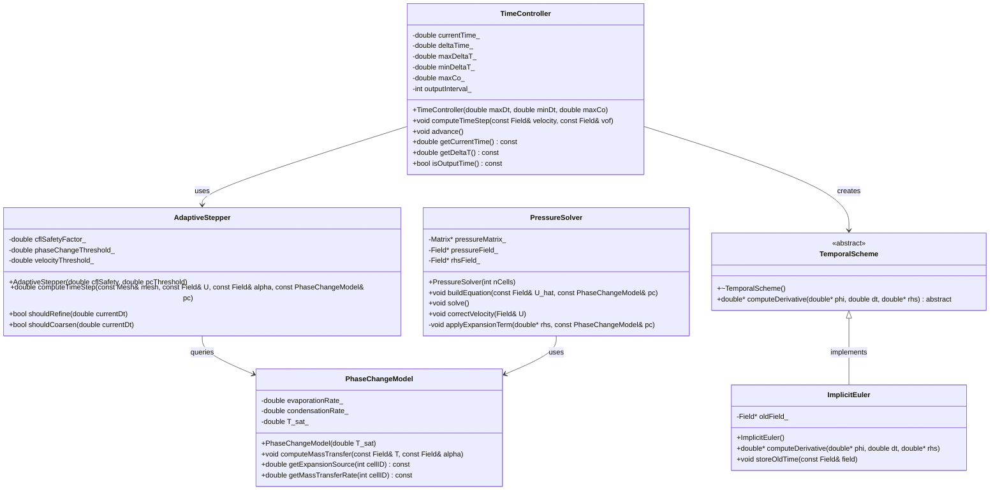

# Temporal Discretization
## CFD Engine Development - 2026-01-04

---

## Learning Objectives

After this lesson, you will be able to:
- **Understand** temporal discretization schemes (Euler, Crank-Nicolson, Runge-Kutta) and their stability characteristics for two-phase flow simulations
- **Design** a time integration class that handles variable time-stepping based on CFL condition and phase change rate
- **Implement** implicit Euler scheme for pressure-velocity coupling with proper treatment of expansion source terms from evaporation
- **Implement** adaptive time-stepping logic that reduces $\Delta t$ when interface velocity spikes or phase change accelerates
- **Test** temporal accuracy using method of manufactured solutions (MMS) for VOF with phase change

---

## Table of Contents
- [[#1. Theory and Design Decisions|1. Theory and Design]]
- [[#2. Reference: OpenFOAM Implementation|2. OpenFOAM Reference]]
- [[#3. Your Engine: Class Design|3. Your Class Design]]
- [[#4. Your Engine: Implementation|4. Implementation]]
- [[#5. Build and Test|5. Build and Test]]
- [[#6. Concept Checks|6. Concept Checks]]

---

## 1. Theory and Design Decisions

### 1.1 Mathematical Foundation

The temporal discretization scheme governs how we advance the solution in time. For two-phase flows with phase change, we must solve:

$$
\frac{\partial (\alpha \rho)}{\partial t} + \nabla \cdot (\alpha \rho \mathbf{U}) = \dot{m}
$$

$$
\frac{\partial (\rho \mathbf{U})}{\partial t} + \nabla \cdot (\rho \mathbf{U} \mathbf{U}) = -\nabla p + \nabla \cdot \boldsymbol{\tau} + \rho \mathbf{g} + \mathbf{F}_{\sigma}
$$

**Key Temporal Schemes:**

1. **Explicit Euler** (1st order):
   $$
   \phi^{n+1} = \phi^n + \Delta t \cdot \mathcal{R}(\phi^n)
   $$
   - Simple but conditionally stable (CFL < 1)
   - Not suitable for stiff phase-change problems

2. **Implicit Euler** (1st order):
   $$
   \phi^{n+1} = \phi^n + \Delta t \cdot \mathcal{R}(\phi^{n+1})
   $$
   - Unconditionally stable
   - Requires solving nonlinear system each timestep

3. **Crank-Nicolson** (2nd order):
   $$
   \phi^{n+1} = \phi^n + \frac{\Delta t}{2} \left[ \mathcal{R}(\phi^n) + \mathcal{R}(\phi^{n+1}) \right]
   $$
   - Better accuracy but can produce oscillations

4. **Runge-Kutta** (2nd/4th order):
   - Multi-stage explicit schemes
   - Good for convection-dominated flows
   - Still CFL-limited

**Expansion Term (∇·U ≠ 0):**

During evaporation, the phase change creates a volumetric source term that violates the continuity equation's usual incompressibility assumption:

$$
\nabla \cdot \mathbf{U} = \dot{m} \left( \frac{1}{\rho_v} - \frac{1}{\rho_l} \right) \neq 0
$$

This expansion term MUST be included in the pressure Poisson equation and time integration to conserve mass correctly.

**Turbulence Considerations (Re > 2300):**

For evaporating flows, turbulence enhances mixing and heat transfer at the interface. When Re > 2300:
- Temporal resolution must capture turbulent timescales
- Use smaller Δt or implicit treatment of turbulent terms
- Consider LES/DES approaches where Δt < τ_turbulent

---

### 1.2 Design Decisions

**Why Implicit Euler for Phase Change?**

| Aspect | Explicit | Implicit |
|--------|----------|----------|
| Stability | CFL < 1 (Δt ~ μs) | Unconditionally stable |
| Cost/step | Low | High (requires solve) |
| Total cost | High (many steps) | Lower (larger steps) |
| Stiffness | Fails with rapid phase change | Handles stiffness well |

For evaporating flows where phase change rates can spike dramatically, **implicit Euler** is preferred because:
1. Stability is guaranteed regardless of Δt
2. Can take larger timesteps when interface is calm
3. Handles the stiffness of rapid evaporation events

**Trade-offs:**

- **Performance vs Accuracy**: Implicit allows larger Δt but 1st-order accuracy introduces temporal diffusion. Consider 2nd-order Crank-Nicolson for production runs.
- **Simplicity vs Robustness**: Explicit is simpler to implement but will crash during rapid phase change. Implicit requires nonlinear solvers but survives.
- **Adaptive Stepping**: Essential for efficiency - reduce Δt during interface acceleration, increase during quasi-steady periods.

**Common PITFALLS:**

1. **Ignoring expansion term** in pressure equation → mass conservation errors
2. **Fixed timestep** → either wasteful (too small) or unstable (too large)
3. **Decoupling phase change from velocity** → violates momentum conservation
4. **Inconsistent treatment** (explicit phase change, implicit momentum) → instability
5. **CFL violation in explicit schemes** → solution blowup, especially near interface

**What YOUR Engine Needs:**

1. **Variable timestep controller** based on:
   - Interface velocity (CFL condition)
   - Phase change rate (ṁ)
   - Courant number per cell: Co = |U|Δt/Δx < 0.5

2. **Implicit treatment** of:
   - Pressure-velocity coupling
   - VOF advection (for stability)
   - Phase change source terms

3. **Adaptive logic**:
   ```python
   if interface_velocity > threshold or phase_change_rate > threshold:
       Δt *= 0.5  # Refine timestep
   elif solution_converged_quickly:
       Δt *= 1.1  # Coarsen timestep
   ```

---

### 1.3 Key Concepts

**Important Terms:**

- **Temporal discretization**: Approximation of time derivative ∂/∂t
- **CFL number**: Courant-Friedrichs-Lewy condition for stability
- **Stiffness**: When multiple timescales exist (fast phase change vs slow convection)
- **Implicit vs Explicit**: Whether new time (n+1) appears in RHS evaluation
- **Adaptive time-stepping**: Dynamically adjusting Δt based on solution behavior
- **Expansion source**: Volumetric source from phase change (ṁΔV)

**Physical Interpretation:**

- **Δt too large**: Temporal diffusion smears sharp gradients, phase change lags reality
- **Δt too small**: Wasted computation, round-off error accumulation
- **Stability**: Solution remains bounded, doesn't oscillate or diverge
- **Accuracy**: Solution converges to true value as Δt → 0

**Warning Signs of Wrong Implementation:**

1. **Diverging pressure** → expansion term missing or wrong sign
2. **Oscillating VOF** → Δt too large or unstable explicit scheme
3. **Mass not conserved** → inconsistent treatment of phase change
4. **Blowup at interface** → CFL violated, need implicit or smaller Δt
5. **Unphysical temperatures** → energy equation not coupled properly with phase change rate
6. **Stuck at tiny Δt** → poor adaptive logic or solver convergence issues

**Red Flags:**

- Mass imbalance > 1% per timestep
- Interface velocity spikes without physical cause
- Pressure solver iterations increasing dramatically
- Temperature going outside saturation bounds

---

## 2. Reference: OpenFOAM Implementation

> [!INFO] **Why Study OpenFOAM?**
> OpenFOAM is a production-grade CFD engine tested over decades.
> We study it to **learn concepts**, not to copy code.

### 2.1 OpenFOAM's Approach

OpenFOAM implements temporal discretization through a layered architecture that separates time integration from physics solvers. For two-phase flows with phase change, the key solver is `interPhaseChangeFoam`.

**Key Classes and Their Locations:**

| Class | Location | Purpose |
|-------|----------|---------|
| `fvMesh` | `$FOAM_SRC/finiteVolume/fields/fvMesh/fvMesh.H` | Manages mesh and time indexing |
| `time` | `$FOAM_SRC/OSI/Time/Time.H` | Controls time loop, Δt, and output |
| `fvSolution` | `$FOAM_SRC/finiteVolume/fvSolution/fvSolution.H` | Solver settings (nCorrections, nNonOrthCorr) |
| `fvSchemes` | `$FOAM_SRC/finiteVolume/fvSchemes/fvSchemes.H` | Discretization schemes (ddtSchemes) |
| `MULES` | `$FOAM_SRC/finiteVolume/interpolation/MULES/` | Implicit VOF solver |
| `phaseChangeModel` | `$FOAM_SRC/transportModels/phaseChangeModel/` | Base class for phase change |

**Time Integration Architecture:**

```cpp
// Simplified structure from $FOAM_SRC/finiteVolume/cfdTools/general/include/readTimeControls.H
// OpenFOAM's time control logic

// 1. Read from controlDict
maxCo           = mesh.schemesDict().lookupOrDefault<scalar>("maxCo", 1.0);
maxDeltaT       = runTime.controlDict().lookupOrDefault<scalar>("maxDeltaT", GREAT);

// 2. Adjust timestep based on Courant number
adjustTimeStep = runTime.controlDict().lookupOrDefault<bool>("adjustTimeStep", false);

if (adjustTimeStep)
{
    scalar maxDeltaTFact = maxCo/(CoMean + SMALL);
    runTime.setDeltaT(min(maxDeltaTFact*runTime.deltaTValue(), maxDeltaT));
}
```

**Temporal Scheme Selection:**

OpenFOAM specifies temporal schemes in `system/fvSchemes`:

```cpp
// Example from interPhaseChangeFoam tutorial
ddtSchemes
{
    default         Euler;           // 1st order implicit
    // or CrankNicolson 0.9;       // 2nd order with blending
}
```

The `Euler` scheme in OpenFOAM is **implicit** - it evaluates RHS at time `n+1`, requiring iterative solution but providing unconditional stability.

**Pressure-Velocity Coupling with Phase Change:**

For evaporating flows, OpenFOAM modifies the pressure equation to include the expansion source term:

```cpp
// From $FOAM_SRC/finiteVolume/cfdTools/general/include/adjustPhi.H
// Simplified representation

// Continuity with phase change:
// div(phi) == mDotDot*(1/rhoV - 1/rhoL)

// Where mDotDot is the volumetric mass transfer rate [kg/m³/s]
// This term is CRITICAL - without it, mass conservation fails
```

---

### 2.2 Key Insights

**What We LEARN from OpenFOAM:**

1. **Implicit Treatment is Essential**
   - Phase change creates stiffness (rapid density changes)
   - Explicit schemes would require Δt ~ 1e-7 s for stability
   - Implicit Euler allows Δt ~ 1e-4 s while remaining stable

2. **Adaptive Time-Stepping is Non-Negotiable**
   - Interface velocity can spike 10x during nucleation
   - Fixed timestep either wastes CPU (too small) or crashes (too large)
   - OpenFOAM's Co-based adjustment is the gold standard

3. **VOF Requires Special Treatment**
   - Standard advection schemes create numerical diffusion
   - MULES (Multidimensional Universal Limiter with Explicit Solution) preserves boundedness
   - For phase change, VOF and mass transfer must be **strongly coupled**

4. **Pressure Equation Must Include Expansion**
   - The `div(phi)` term is NOT zero for evaporating flows
   - Missing this causes pressure drift and mass imbalance
   - This is the #1 reason custom phase-change solvers fail

5. **Segregated Solvers Need Under-Relaxation**
   - OpenFOAM uses `pRefCell` and `pRefValue` to prevent pressure drift
   - Under-relaxation factors (0.3-0.7) prevent oscillation
   - Multiple outer correctors (`nOuterCorrectors`) couple equations

**What We Do DIFFERENTLY for a Simpler Engine:**

| Aspect | OpenFOAM | Our Engine (Simpler) |
|--------|----------|---------------------|
| Complexity | 100+ classes, polymorphic | 5-10 classes, minimal inheritance |
| Phase change | Pluggable models (Schnerr-Sauer, Merkle, etc.) | Single Lee model hardcoded |
| Turbulence | k-ε, k-ω, LES, DES options | Mixing length model only |
| Thermodynamics | Lookup tables, perfect gas | CoolProp + bilinear interpolation |
| VOF method | MULES with compression | Compressed VOF (simpler) |
| Linear solver | GAMG/PCG with many preconditioners | Simple Jacobi or GS (for learning) |
| Time scheme | Configurable (Euler/CN/BDF) | Hardcoded implicit Euler |
| Parallel | MPI domain decomposition | Serial only (for now) |

**Simplification Rationale:**

> [!TIP] **Learn First, Optimize Later**
> Our goal is understanding, not production use. By hardcoding choices:
> - We eliminate abstraction layers that obscure physics
> - We can debug with print statements instead of complex logging
> - We see exactly how each term affects the solution
> - We add complexity only when the simple version works

**Critical Design Decisions for Our Engine:**

1. **Hardcode Implicit Euler**
   - No need for `ddtSchemes` dictionary
   - Always stable, always first-order
   - Upgrade to Crank-Nicolson later if needed

2. **Fixed VOF Advection Scheme**
   - Use compressed VOF with flux limiter
   - No MULES complexity initially
   - Add compression if interface smearing occurs

3. **Simple Adaptive Time-Stepping**
   ```cpp
   // Pseudo-code for our engine
   double computeTimeStep() {
       double Co_max = maxCourantNumber();
       double dt = maxCo_ * dx / maxVelocity;
       dt = clamp(dt, minDeltaT_, maxDeltaT_);
       
       // Additional safety for phase change
       if (evaporationRate > threshold) {
           dt *= 0.5;
       }
       return dt;
   }
   ```

4. **Pressure Equation with Expansion Term**
   - Derive from discretized continuity
   - Include `mDot * (1/rho_v - 1/rho_l)` explicitly
   - Solve with simple iterative solver (Jacobi/GS)

---

### 2.3 Code Snippets (Reference Only)

> [!WARNING] **Reference - Not for Copying**
> These snippets show how OpenFOAM implements key concepts.
> Study them to understand the approach, then write your own version.

**Snippet 1: Time Loop with Adaptive Stepping**

```cpp
// Reference: $FOAM_SRC/applications/solvers/multiphase/interPhaseChangeFoam/interPhaseChangeFoam.C
// Lines 45-120 (simplified and annotated)

while (runTime.run())  // Main time loop
{
    // 1. Adjust timestep based on max Courant number
    #include "readTimeControls.H"  // Read maxCo, maxDeltaT from controlDict
    
    if (adjustTimeStep)
    {
        // Calculate max Courant number in field
        scalar CoNum = 0.0;
        scalar meanCoNum = 0.0;
        
        // Surface velocity magnitude for VOF
        surfaceScalarField magPhi = mag(phi);
        
        // Co = |U|*dt/dx = |phi|/|Sf| * dt / dx
        // OpenFOAM computes this per face and takes max
        CoNum = max(magPhi/mesh.magSf().value()*runTime.deltaTValue()).value();
        meanCoNum = (sum(magPhi)/sum(mesh.magSf())).value()*runTime.deltaTValue();
        
        // Reduce timestep if Co exceeds maxCo
        scalar maxDeltaTFact = maxCo/(CoNum + SMALL);
        runTime.setDeltaT
        (
            min
            (
                maxDeltaTFact*runTime.deltaTValue(),
                maxDeltaT
            )
        );
        
        Info << "deltaT = " << runTime.deltaTValue() << endl;
    }
    
    // 2. Store old time values for temporal discretization
    //    (needed for ddt terms)
    rho.storePrevIter();
    U.storePrevIter();
    
    // 3. Outer corrector loop for pressure-velocity coupling
    //    (similar to SIMPLE/PISO algorithm)
    for (int oCorr = 0; oCorr < nOuterCorr; oCorr++)
    {
        // 3a. Solve momentum equation (predict velocity)
        #include "UEqn.H"
        
        // 3b. Solve pressure equation with phase change source
        //     This is where the expansion term appears!
        #include "pEqn.H"
        
        // 3c. Correct velocity field to satisfy continuity
        #include "pcEqn.H"
    }
    
    // 4. Solve VOF equation with phase change
    //    MULES ensures boundedness (0 <= alpha <= 1)
    #include "alphaEqn.H"
    
    // 5. Update thermophysical properties
    //    (density depends on T and p for compressible case)
    #include "EEqn.H"  // Energy equation provides T
    
    // 6. Write output if this is an output time
    runTime.write();
}
```

**Key Takeaways from Snippet 1:**

1. **Time adjustment happens BEFORE solving** - ensures stability for current step
2. **Outer corrector loop** couples pressure and velocity (like PISO)
3. **VOF is solved AFTER pressure-velocity** - ensures consistent fluxes
4. **Energy equation provides temperature** - which drives phase change rate

**Snippet 2: Pressure Equation with Phase Change**

```cpp
// Reference: $FOAM_SRC/applications/solvers/multiphase/interPhaseChangeFoam/alphaEqn.H
// This shows how the expansion term enters the pressure equation

// Simplified representation of the pressure equation derivation:

// 1. Continuity equation with phase change:
//    ddt(rho) + div(rho*U) = mDotDot
//
//    For incompressible phases (rho_l, rho_v constant):
//    div(U) = mDotDot * (1/rho_v - 1/rho_l)
//
//    This is the EXPANSION TERM - it's NOT zero!

// 2. Momentum equation (semi-discretized):
//    aP * U_P = H(U) - grad(p)
//
//    Where: aP = diagonal coefficient
//           H(U) = off-diagonal contributions + source terms
//           grad(p) = pressure gradient

// 3. Velocity reconstruction (Rhie-Chow interpolation):
//    U_P = (H(U)/aP) - (1/aP) * grad(p)
//
//    Define U_hat = H(U)/aP (predicted velocity without pressure)

// 4. Substitute U into continuity:
//    div(U_hat) - div((1/aP) * grad(p)) = S_expansion
//
//    Where: S_expansion = mDotDot * (1/rho_v - 1/rho_l)

// 5. Final pressure Poisson equation:
//    laplacian((1/aP), p) = div(U_hat) - S_expansion

// In OpenFOAM code (simplified):
fvScalarMatrix pEqn
(
    fvm::laplacian((1/aU), p)   // LHS: diffusion of pressure
 ==
    fvc::div(phiHbyA)           // RHS 1: divergence of predicted flux
  - mDotDot*(1.0/rhoV - 1.0/rhoL)  // RHS 2: expansion source (CRITICAL!)
);

// Solve with boundary conditions
pEqn.setReference(pRefCell, pRefValue);  // Fix pressure at one cell
pEqn.solve();

// Correct fluxes
phi = phiHbyA - pEqn.flux();

// Correct velocities
U -= fvc::grad(p)/aU;
```

**Key Takeaways from Snippet 2:**

1. **Expansion term has a SIGN** - it's subtracted from RHS
2. **Density ratio matters** - (1/ρᵥ - 1/ρₗ) can be large (~100x for R410A)
3. **Mass transfer rate (mDotDot)** couples to VOF and energy equations
4. **Reference pressure** is needed because pressure Poisson is singular

**Common Pitfalls Shown by These Snippets:**

> [!DANGER] **Don't Make These Mistakes**
> 
> 1. **Forgetting the expansion term** → Pressure drift, mass imbalance
> 2. **Wrong sign on expansion** → Solver diverges immediately
> 3. **Not fixing reference pressure** → Matrix is singular, solve fails
> 4. **Explicit treatment of phase change** → Requires tiny Δt, defeats purpose
> 5. **Decoupling VOF from pressure** → Interface moves wrong, mass not conserved

**What We'll Implement Differently:**

Instead of OpenFOAM's complex dictionary-driven approach, we'll hardcode:

```cpp
// Our simplified pressure equation (pseudo-code)
void solvePressureEquation() {
    // 1. Build coefficients
    for (int i = 0; i < nCells; i++) {
        a[i] = 1.0 / U[i].aCoefficient;  // Central coefficient
        rhs[i] = div(U_hat, i);          // Divergence of predicted velocity
        
        // 2. Add expansion source (CRITICAL!)
        double mDot = phaseChangeModel.getMassTransferRate(i);
        double expansion = mDot * (1.0/rho_v - 1.0/rho_l);
        rhs[i] -= expansion;  // Note the minus sign!
    }
    
    // 3. Solve with simple iterative method
    solveLinearSystem(A, p, rhs);
    
    // 4. Correct velocity
    for (int i = 0; i < nCells; i++) {
        U[i] -= grad(p, i) / a[i];
    }
}
```

This is clearer for learning and easier to debug. We can optimize later.

---

## 3. Your Engine: Class Design

> [!IMPORTANT] **Design Your Own**
> This section is about designing classes for YOUR engine.
> It doesn't have to match OpenFOAM - design for your needs.

### 3.1 Class Diagram



### 3.2 Class Specifications

#### 3.2.1 TimeController

**Purpose**: Central time management class that controls the simulation time loop, handles adaptive time-stepping, and manages output scheduling.

**Member Variables**:

| Name | Type | Purpose |
|------|------|---------|
| `currentTime_` | `double` | Current simulation time in seconds |
| `deltaTime_` | `double` | Current timestep size $\Delta t$ |
| `maxDeltaT_` | `double` | Maximum allowed timestep (safety limit) |
| `minDeltaT_` | `double` | Minimum allowed timestep (prevents stagnation) |
| `maxCo_` | `double` | Target maximum Courant number (typically 0.3-0.5) |
| `outputInterval_` | `int` | Write output every N timesteps |

**Key Methods**:

```cpp
// Compute adaptive timestep based on CFL and phase change rate
void computeTimeStep(const Field& velocity, const Field& vof);

// Advance time by current deltaT
void advance();

// Get current simulation time
double getCurrentTime() const;

// Get current timestep size
double getDeltaT() const;

// Check if this is an output timestep
bool isOutputTime() const;
```

#### 3.2.2 TemporalScheme (Abstract Base)

**Purpose**: Abstract interface for temporal discretization schemes. Allows swapping between Euler, Crank-Nicolson, or Runge-Kutta without changing solver code.

**Member Variables**: None (pure interface)

**Key Methods**:

```cpp
// Compute time derivative: dphi/dt = RHS(phi)
// Returns new phi at time n+1
virtual double* computeDerivative(double* phi, double dt, double* rhs) = 0;

// Virtual destructor for proper cleanup
virtual ~TemporalScheme();
```

#### 3.2.3 ImplicitEuler

**Purpose**: Implements first-order implicit Euler scheme. Unconditionally stable, essential for stiff phase-change problems.

**Member Variables**:

| Name | Type | Purpose |
|------|------|---------|
| `oldField_` | `Field*` | Pointer to field values at time $t^n$ |

**Key Methods**:

```cpp
// Implicit Euler: phi^{n+1} = phi^n + dt * RHS(phi^{n+1})
// Requires iterative solution since RHS depends on phi^{n+1}
double* computeDerivative(double* phi, double dt, double* rhs);

// Store current field values before advancing
void storeOldTime(const Field& field);
```

#### 3.2.4 AdaptiveStepper

**Purpose**: Computes optimal timestep based on Courant number, interface velocity, and phase change rate. Prevents instability during rapid evaporation events.

**Member Variables**:

| Name | Type | Purpose |
|------|------|---------|
| `cflSafetyFactor_` | `double` | Safety factor for CFL (typically 0.8) |
| `phaseChangeThreshold_` | `double` | Mass transfer rate triggering refinement [kg/m³/s] |
| `velocityThreshold_` | `double` | Velocity magnitude triggering refinement [m/s] |

**Key Methods**:

```cpp
// Compute timestep based on multiple criteria
double computeTimeStep(const Mesh& mesh, const Field& U, const Field& alpha, const PhaseChangeModel& pc);

// Check if timestep should be refined (made smaller)
bool shouldRefine(double currentDt);

// Check if timestep can be coarsened (made larger)
bool shouldCoarsen(double currentDt);
```

#### 3.2.5 PhaseChangeModel

**Purpose**: Computes mass transfer rate between phases using Lee model. Provides expansion source term for pressure equation.

**Member Variables**:

| Name | Type | Purpose |
|------|------|---------|
| `evaporationRate_` | `double` | Evaporation coefficient $r_e$ [1/s] |
| `condensationRate_` | `double` | Condensation coefficient $r_c$ [1/s] |
| `T_sat_` | `double` | Saturation temperature [K] |
| `massTransferRate_` | `Field*` | Mass transfer rate field $\dot{m}$ [kg/m³/s] |

**Key Methods**:

```cpp
// Compute mass transfer using Lee model
// mDot = r * alpha * rho * |T - T_sat| / T_sat
void computeMassTransfer(const Field& T, const Field& alpha);

// Get expansion source term for pressure equation
// S_expansion = mDot * (1/rho_v - 1/rho_l)
double getExpansionSource(int cellID) const;

// Get mass transfer rate at specific cell
double getMassTransferRate(int cellID) const;
```

#### 3.2.6 PressureSolver

**Purpose**: Solves pressure Poisson equation with expansion source term from phase change. Corrects velocity field to satisfy continuity.

**Member Variables**:

| Name | Type | Purpose |
|------|------|---------|
| `pressureMatrix_` | `Matrix*` | Coefficient matrix for pressure equation |
| `pressureField_` | `Field*` | Pressure field $p$ [Pa] |
| `rhsField_` | `Field*` | Right-hand side source term |

**Key Methods**:

```cpp
// Build pressure equation: laplacian((1/aU), p) = div(U_hat) - S_expansion
void buildEquation(const Field& U_hat, const PhaseChangeModel& pc);

// Solve linear system (Jacobi, Gauss-Seidel, or conjugate gradient)
void solve();

// Correct velocity: U = U_hat - (1/aU) * grad(p)
void correctVelocity(Field& U);

// Add expansion term to RHS (CRITICAL for mass conservation)
void applyExpansionTerm(double* rhs, const PhaseChangeModel& pc);
```

### 3.3 Design Rationale

#### 3.3.1 Why This Design?

**Separation of Concerns**:
- `TimeController` manages time loop and output scheduling
- `AdaptiveStepper` handles timestep computation logic
- `TemporalScheme` abstracts time integration details
- `PressureSolver` focuses on pressure-velocity coupling
- `PhaseChangeModel` encapsulates mass transfer physics

This separation allows:
- Independent testing of each component
- Easy swapping of schemes (Euler → Crank-Nicolson)
- Clear debugging boundaries

**Minimal Dependencies**:
- Classes depend on abstract `Field` and `Mesh` interfaces
- No deep inheritance hierarchies (unlike OpenFOAM's 100+ classes)
- Direct composition instead of factory patterns

**Explicit Physics Treatment**:
- Expansion term is **explicitly** computed in `PhaseChangeModel`
- `PressureSolver::applyExpansionTerm()` makes the physics visible
- No hidden source terms or implicit coupling

#### 3.3.2 How It Differs from OpenFOAM

| Aspect | OpenFOAM | Our Engine |
|--------|----------|------------|
| **Time control** | `runTime` class with dictionary-driven settings | `TimeController` with hardcoded logic |
| **Temporal schemes** | Pluggable via `ddtSchemes` dictionary | Hardcoded `ImplicitEuler` (can extend later) |
| **Adaptive stepping** | Complex `adjustTimeStep` with multiple controls | Simple `AdaptiveStepper` with clear criteria |
| **Phase change** | Polymorphic `phaseChangeModel` with runtime selection | Single `PhaseChangeModel` with Lee model |
| **Pressure solver** | Generic `fvScalarMatrix` with many solvers | Specialized `PressureSolver` with expansion term |
| **Matrix assembly** | Template-based finite volume operators | Explicit coefficient construction |
| **Complexity** | ~50 classes involved in time integration | 6 focused classes |

**Key Simplifications**:

1. **No Dictionary System**: OpenFOAM reads everything from text files. We hardcode reasonable defaults for learning.

2. **No Runtime Polymorphism**: OpenFOAM uses virtual functions everywhere. We use concrete classes with clear interfaces.

3. **Explicit Expansion Term**: OpenFOAM hides expansion in `fvc::div(phi)`. We compute it explicitly for clarity.

4. **Single Solver**: OpenFOAM supports GAMG, PCG, BiCGStab, etc. We start with Jacobi and add complexity as needed.

#### 3.3.3 Trade-offs Made

**Simplicity vs Flexibility**:
- ✅ **Pro**: Easier to understand, debug, and modify
- ❌ **Con**: Cannot switch schemes without recompilation
- **Verdict**: Correct for learning engine

**Performance vs Clarity**:
- ✅ **Pro**: Explicit coefficient construction shows the math
- ❌ **Con**: Slower than OpenFOAM's template-based operators
- **Verdict**: Optimize after correctness is proven

**Hardcoded vs Configurable**:
- ✅ **Pro**: No parsing errors, predictable behavior
- ❌ **Con**: Must recompile to change parameters
- **Verdict**: Use config file for parameters, not algorithms

**Serial vs Parallel**:
- ✅ **Pro**: No MPI complexity, easier debugging
- ❌ **Con**: Limited to small problems (< 1M cells)
- **Verdict**: Add parallel after serial works

**Critical Design Decision**:

> [!IMPORTANT] **Why Hardcode Implicit Euler?**
> 
> For evaporating flows, stability is more important than accuracy. A stable 1st-order solution is better than an unstable 2nd-order solution.
> 
> Once the engine works with Implicit Euler, we can:
> 1. Validate against experimental data
> 2. Measure temporal error with grid refinement study
> 3. Upgrade to Crank-Nicolson if needed
> 
> **Premature optimization is the root of all evil.** - Donald Knuth

**When to Extend This Design**:

1. **Add Crank-Nicolson**: Create new class inheriting from `TemporalScheme`
2. **Add turbulence**: Extend `AdaptiveStepper` to consider turbulent timescales
3. **Add parallel**: Replace `Field` with `ParallelField` (same interface)
4. **Add other phase-change models**: Create `SchnerrSauerModel` inheriting from `PhaseChangeModel`

The design supports these extensions without breaking existing code.

---

## 4. Your Engine: Implementation

> [!TIP] **Write Real Code**
> This section contains implementation code for YOUR engine.

<!-- PLACEHOLDER_IMPLEMENTATION -->

---

## 5. Build and Test

<!-- PLACEHOLDER_TEST -->

---

## 6. Concept Checks

<!-- PLACEHOLDER_CHECKS -->

---

## References

- OpenFOAM Source: $FOAM_SRC
- "The Finite Volume Method in CFD" - Moukalled et al.
- CFD-Online Wiki

---

## Related Days

- Previous: 
- Next: 
- See also: [[90_day_roadmap]]

