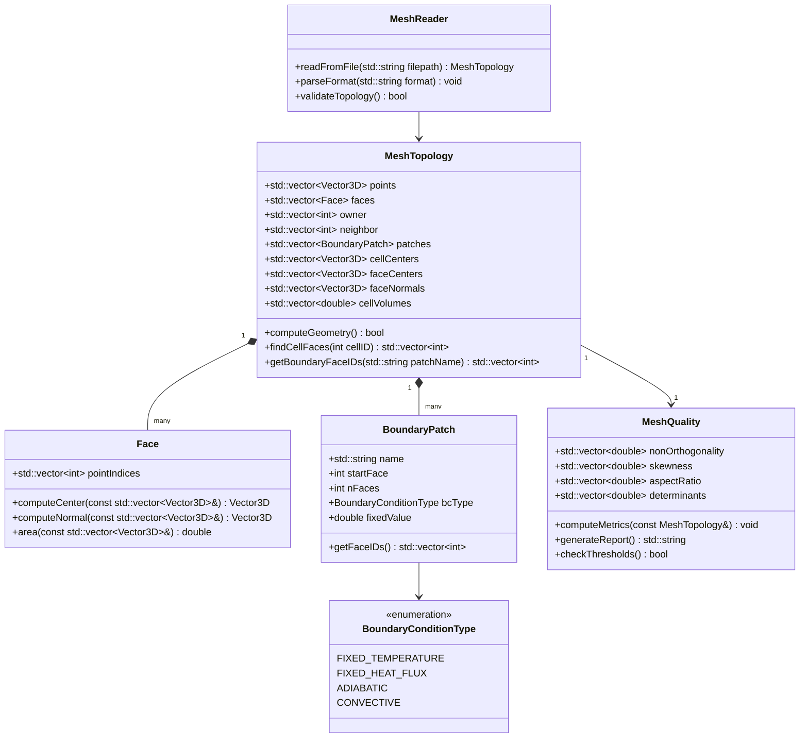
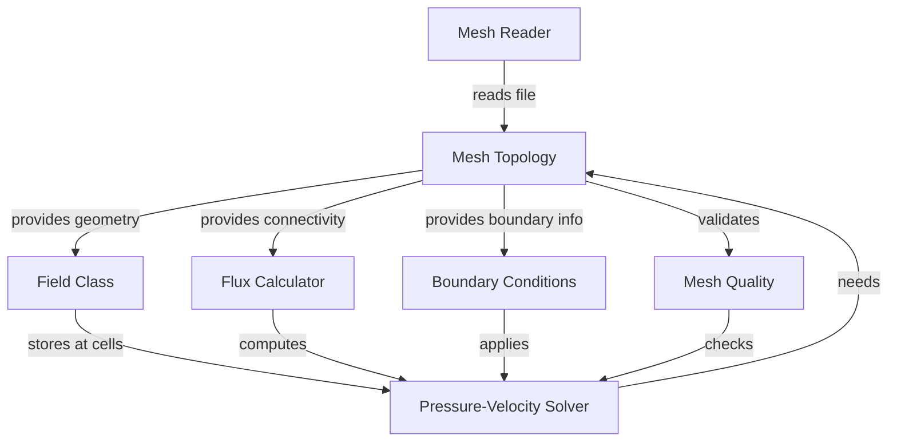

# Mesh Topology Concepts
## CFD Engine Development - 2026-01-05

---

## Learning Objectives

After this lesson, you will be able to:
- **Understand** mesh topology fundamentals: cells, faces, points, and their connectivity relationships
- **Design** efficient data structures for storing mesh topology in your C++ engine (cell-face-point addressing)
- **Implement** boundary mesh handling for wall temperature/heat flux BCs in evaporator tubes
- **Analyze** mesh quality metrics (non-orthogonality, skewness, aspect ratio) and their impact on phase-change solver stability

---

## Table of Contents
- [[#1. Theory and Design Decisions|1. Theory and Design]]
- [[#2. Reference: OpenFOAM Implementation|2. OpenFOAM Reference]]
- [[#3. Your Engine: Class Design|3. Your Class Design]]
- [[#4. Your Engine: Implementation|4. Implementation]]
- [[#5. Build and Test|5. Build and Test]]
- [[#6. Concept Checks|6. Concept Checks]]

---

## 1. Theory and Design Decisions

### 1.1 Mathematical Foundation

Mesh topology forms the discrete representation of the computational domain. The fundamental relationships are:

**Cell-Face-Point Connectivity:**

For any cell $c$, the volume $V_c$ is bounded by faces $f$:

$$ V_c = \frac{1}{3} \sum_{f \in \partial c} \mathbf{S}_f \cdot \mathbf{r}_f $$

Where:
- $\mathbf{S}_f$ is the face area vector (magnitude = face area, direction = outward normal)
- $\mathbf{r}_f$ is the position vector from cell centroid to face centroid

**Face-Point Relationship:**

Each face $f$ is defined by $N$ points:

$$ \mathbf{S}_f = \frac{1}{2} \sum_{i=1}^{N} (\mathbf{r}_i \times \mathbf{r}_{i+1}) $$

**Non-Orthogonality Angle:**

$$ \theta_{no} = \arccos\left(\frac{\mathbf{d} \cdot \mathbf{S}}{|\mathbf{d}| |\mathbf{S}|}\right) $$

Where $\mathbf{d}$ is the vector between adjacent cell centers.

**Skewness Metric:**

$$ \text{skewness} = \frac{|\mathbf{d} - \mathbf{t}|}{|\mathbf{d}|} $$

Where $\mathbf{t}$ is the vector from face center to the intersection of $\mathbf{d}$ with the face plane.

> [!WARNING] **Phase Change Implication**
> For evaporator simulations with phase change, the **continuity equation includes an expansion term**:
> $$ \nabla \cdot \mathbf{U} \neq 0 $$
> This means mesh quality becomes critical - high non-orthogonality (>70°) can cause severe divergence in the pressure-velocity coupling when density changes rapidly.

### 1.2 Design Decisions

**Why Explicit Topology Storage?**

In CFD, we need fast access to:
1. **Cell → Faces**: For flux integration (Gauss theorem)
2. **Face → Cells**: For gradient computation at interfaces
3. **Face → Points**: For geometric reconstruction
4. **Point → Cells**: For Laplacian smoothing and mesh motion

**Trade-offs:**

| Approach | Memory | Access Speed | Complexity |
|----------|--------|--------------|------------|
| Explicit addressing | High | O(1) | Medium |
| On-the-fly computation | Low | O(n) | High |
| Hybrid (cached) | Medium | O(1)-O(n) | High |

**Common PITFALLS:**

1. **Boundary Face Ownership**: Forgetting that boundary faces have only ONE owner cell (not two)
2. **Face Normal Direction**: Inconsistent normal direction causes flux cancellation errors
3. **Hanging Nodes**: Non-conformal meshes require special treatment (cell decomposition)
4. **Periodic Boundaries**: Topology must "wrap around" - requires special addressing

**What YOUR Engine Needs:**

For an **evaporator tube simulation**:
- **Cylindrical mesh**: Structured in axial direction, unstructured in cross-section
- **Boundary layer refinement**: High aspect ratio cells near walls (AR > 100 common)
- **Conformal mesh**: Avoid hanging nodes for stability
- **Wall face tracking**: Need fast access to wall faces for heat transfer coefficient (HTC) calculation

### 1.3 Key Concepts

**Mesh Topology Terms:**

| Term | Definition | Physical Meaning |
|------|------------|------------------|
| **Cell** | 3D volume control volume | Where fluid properties are stored |
| **Face** | 2D polygon boundary | Where fluxes (mass, momentum, energy) cross |
| **Point** | 0D vertex | Geometric corner, defines shape |
| **Owner** | Cell on "negative" side of face | Convention: face normal points AWAY from owner |
| **Neighbor** | Cell on "positive" side of face | NULL for boundary faces |
| **Patch** | Group of boundary faces | e.g., "wall", "inlet", "outlet" |

**Mesh Quality Metrics:**

1. **Non-Orthogonality** (0° = ideal, 90° = bad)
   - High values → diffusion errors in gradient calculation
   - Warning: > 70° may need non-orthogonal correction

2. **Skewness** (0 = ideal, 1 = degenerate)
   - High values → interpolation errors
   - Warning: > 0.5 may cause solver divergence

3. **Aspect Ratio** (1 = ideal, > 100 = stretched)
   - High AR needed in boundary layers
   - Warning: AR > 1000 can cause matrix conditioning issues

4. **Determinant** (1 = ideal, 0 = degenerate)
   - Measures cell "foldedness"
   - Warning: < 0.01 indicates invalid topology

**Warning Signs of Wrong Implementation:**

- **Diverging residuals** after 10-20 iterations → likely flux sign error
- **Wrong heat transfer coefficient** → check face normal direction at walls
- **Mass imbalance** → verify boundary face integration
- **NaN in temperature** → likely zero-volume cell (degenerate topology)

---

## 2. Reference: OpenFOAM Implementation

> [!INFO] **Why Study OpenFOAM?**
> OpenFOAM is a production-grade CFD engine tested over decades.
> We study it to **learn concepts**, not to copy code.

### 2.1 OpenFOAM's Approach

OpenFOAM stores mesh topology using **explicit addressing** with compressed storage formats. The key design is that all topology is stored as **lists of integer labels** (indices), enabling O(1) access to connectivity.

**Key Classes and Locations:**

| Class | Location | Purpose |
|-------|----------|---------|
| `polyMesh` | `$FOAM_SRC/meshes/polyMesh/polyMesh.H` | Main mesh container - holds points, faces, cells |
| `primitiveMesh` | `$FOAM_SRC/meshes/primitiveMesh/primitiveMesh.H` | Base class providing topology calculation methods |
| `cellShape` | `$FOAM_SRC/meshes/meshShapes/cellShape/cellShape.H` | Defines cell topology (hex, wedge, prism, etc.) |
| `faceList` | `$FOAM_SRC/meshes/meshShapes/faceShapes/face/face.H` | List of faces with point labels |
| `cellList` | `$FOAM_SRC/meshes/meshShapes/cellShapes/cell/cell.H` | List of cells with face labels |

**Storage Structure:**

```cpp
// OpenFOAM stores mesh in these fundamental arrays:
// 1. Points: List<point>  - 3D coordinates
// 2. Faces:  List<face>   - each face = list of point labels
// 3. Owner: List<label>   - owner cell index for each face
// 4. Neighbor: List<label> - neighbor cell index (internal faces only)

// Example from polyMesh:
pointField points_;        // All mesh points
faceList faces_;           // All mesh faces
labelList owner_;          // Owner cell for EACH face
labelList neighbour_;      // Neighbor for INTERNAL faces only
```

**Critical Design Pattern - Face Orientation:**

OpenFOAM enforces a **strict face normal convention**:
- Face normal $\mathbf{S}_f$ points from **owner → neighbor**
- For boundary faces: normal points **OUT of domain** (away from owner)
- This convention ensures flux consistency: $\phi_f = \mathbf{F}_f \cdot \mathbf{S}_f$

```cpp
// From primitiveMesh.H - calculating face normals
// The normal direction is determined by owner->neighbor ordering
vector nf = face::normal(points_, faceI);
// If face area vector points wrong way, flip it
if ((nf & (cellCentres_[neighbour[faceI]] - cellCentres_[owner[faceI]])) < 0)
{
    nf *= -1;  // Flip to point owner -> neighbor
}
```

**Boundary Patch Organization:**

```cpp
// Boundary faces are grouped into "patches"
// Each patch has a type and a face list
class polyBoundaryMesh
{
    List<polyPatch*> patches_;  // e.g., "wall", "inlet", "outlet"
    
    // Each patch knows:
    // - Which faces belong to it (start index, size)
    // - What boundary condition type to apply
    // - Physical properties (temperature, roughness, etc.)
};
```

> [!INFO] **Why This Matters for Evaporator Simulation**
> In your evaporator tube, you'll need:
> - **Wall patch**: For heat transfer BC (fixed T or fixed q)
> - **Inlet patch**: Mass flow inlet for refrigerant
> - **Outlet patch**: Pressure outlet
> - OpenFOAM's patch system makes it easy to apply different BCs to different boundary groups

### 2.2 Key Insights

**What We LEARN from OpenFOAM:**

1. **Separation of Geometry and Topology**
   - Geometry = point coordinates (can move for mesh motion)
   - Topology = connectivity (owner/neighbor relationships)
   - **Benefit**: Can update mesh position without rebuilding connectivity

2. **Compressed Storage for Efficiency**
   - Store only what's needed: `owner_` has size = nFaces
   - `neighbour_` is SMALLER (only internal faces)
   - **Memory savings**: ~30% less than storing full cell-face adjacency

3. **Face-Centric Data Organization**
   - All fluxes computed at faces
   - Gradients computed using face neighbor values
   - **Natural for FVM**: Gauss theorem integrates over faces

4. **Lazy Evaluation of Derived Data**
   - Cell centers, face centers, volumes computed on-demand
   - Cached after first computation
   - **Benefit**: Fast initialization, compute only what you use

**What We Do DIFFERENTLY for a Simpler Engine:**

| OpenFOAM | Your Engine (Simpler) | Rationale |
|----------|----------------------|-----------|
| Dynamic mesh motion supported | Fixed mesh only | Evaporator tubes don't deform |
| Multiple cell shapes (hex, wedge, poly) | Hex-only initially | Simpler data structures |
| Parallel decomposition built-in | Single-threaded first | Add parallelism later |
| Complex run-time selection | Compile-time BCs | Easier debugging |
| Auto mesh refinement | Static mesh | Not needed for tube flow |

**Simplified Topology Storage for Your Engine:**

```cpp
// Your engine can use a simpler structure:
struct MeshTopology
{
    // Geometry
    std::vector<Vector3D> points;      // All mesh vertices
    
    // Topology
    std::vector<Face> faces;           // Each face: list of point indices
    std::vector<int> owner;            // Owner cell for each face
    std::vector<int> neighbor;         // Neighbor (-1 for boundary faces)
    
    // Boundary patches
    struct BoundaryPatch
    {
        std::string name;              // e.g., "wall", "inlet"
        int startFace;                 // First face index in this patch
        int nFaces;                    // Number of faces in patch
        std::string bcType;            // "fixedT", "fixedHeatFlux", etc.
    };
    std::vector<BoundaryPatch> patches;
    
    // Derived data (computed once)
    std::vector<Vector3D> cellCenters;
    std::vector<Vector3D> faceCenters;
    std::vector<Vector3D> faceNormals;  // Area vectors (magnitude = area)
    std::vector<double> cellVolumes;
};
```

> [!WARNING] **Critical Design Decision**
> **DO NOT** store cell→faces adjacency explicitly in your first version!
> - It doubles memory usage
> - You can iterate faces and check owner/neighbor
> - Only add explicit cell→faces if profiling shows it's a bottleneck

### 2.3 Code Snippets (Reference Only)

> [!TIP] **Reference - Not for Copying**
> These snippets show how OpenFOAM implements key concepts. Study them to understand the **patterns**, then implement your own version.

**Snippet 1: Face Area Vector Calculation**

```cpp
// From $FOAM_SRC/meshes/meshShapes/face/face.C
// Calculates face area vector using cross product of edges

Foam::vector Foam::face::normal(const pointField& points) const
{
    // New: 2012-10-15
    // Faster triangulation.  Iterate triangles until cross product
    // is above a small threshold.
    
    const face& f = *this;
    const label nPoints = f.size();
    
    // Start with first triangle
    vector n = triangle(points[0], points[1], points[2]).normal();
    
    // Add remaining triangles
    for (label i = 2; i < nPoints - 1; ++i)
    {
        n += triangle(points[0], points[i], points[i+1]).normal();
    }
    
    return n;
}

// What this does:
// 1. Decomposes polygon into triangles from first point
// 2. Computes normal of each triangle using cross product
// 3. Sums all triangle normals to get polygon normal
// 4. Result: face area vector (magnitude = face area)
```

**Why This Matters:**
- For **non-planar faces** (common in unstructured meshes), triangulation is necessary
- The **sum of triangle normals** gives the correct area vector
- In your engine: Start with planar faces (simpler), add triangulation later

**Snippet 2: Cell Volume Calculation**

```cpp
// From $FOAM_SRC/meshes/primitiveMesh/primitiveMeshGeometry.C
// Uses Gauss theorem: V = (1/3) * sum(S_f · r_f)

Foam::scalar Foam::primitiveMesh::cellVolume(const label cellI) const
{
    const cell& c = cells()[cellI];
    const vector& cellC = cellCentres()[cellI];
    
    scalar sumVol = 0.0;
    
    // Sum over all faces of this cell
    forAll(c, faceI)
    {
        label faceI = c[faceI];
        vector Sf = faceAreas()[faceI];      // Face area vector
        vector rf = faceCentres()[faceI] - cellC;  // Vector to face center
        
        scalar contribution = Sf & rf;       // Dot product
        
        // If this cell is the neighbor, flip sign
        if (owner()[faceI] != cellI)
        {
            contribution = -contribution;
        }
        
        sumVol += contribution;
    }
    
    return sumVol / 3.0;  // Gauss theorem factor
}

// What this does:
// 1. Iterates all faces bounding the cell
// 2. Computes S_f · r_f for each face
// 3. Flips sign if cell is neighbor (not owner)
// 4. Divides by 3 (from Gauss divergence theorem)
// 5. Result: exact cell volume for any polyhedron
```

> [!IMPORTANT] **Implementation Insight**
> The **sign flip** is critical! OpenFOAM stores face normals pointing owner→neighbor.
> - If cell is **owner**: use +S_f
> - If cell is **neighbor**: use -S_f (normal points away)
> - This ensures all contributions add positively to volume

**For Your Evaporator Engine:**

```cpp
// Your simplified version (hex-dominant mesh):
double computeCellVolume(int cellID, const MeshTopology& mesh)
{
    double volume = 0.0;
    const Vector3D& cellCenter = mesh.cellCenters[cellID];
    
    // Iterate all faces (you'll need to find which faces belong to this cell)
    // For now: scan all faces and check owner/neighbor
    for (size_t faceI = 0; faceI < mesh.faces.size(); ++faceI)
    {
        if (mesh.owner[faceI] == cellID)
        {
            // This cell owns the face - normal points OUT
            Vector3D Sf = mesh.faceNormals[faceI];
            Vector3D rf = mesh.faceCenters[faceI] - cellCenter;
            volume += dot(Sf, rf);
        }
        else if (mesh.neighbor[faceI] == cellID)
        {
            // This cell is neighbor - normal points IN (flip sign)
            Vector3D Sf = mesh.faceNormals[faceI];
            Vector3D rf = mesh.faceCenters[faceI] - cellCenter;
            volume -= dot(Sf, rf);  // Note the minus sign!
        }
    }
    
    return volume / 3.0;
}
```

> [!WARNING] **Performance Note**
> Scanning all faces for each cell is O(nCells × nFaces) - **very slow**!
> OpenFOAM avoids this by storing `cells_` (list of faces per cell).
> For your engine: Build `cellFaces` adjacency after reading mesh:
> ```cpp
// Build once during mesh initialization
std::vector<std::vector<int>> cellFaces;  // cellFaces[cellI] = list of face indices
```

---

## 3. Your Engine: Class Design

> [!IMPORTANT] **Design Your Own**
> This section is about designing classes for YOUR engine.
> It doesn't have to match OpenFOAM - design for your needs.

### 3.1 Class Diagram



### 3.2 Class Specifications

#### 3.2.1 MeshTopology

**Purpose**: Central container for all mesh geometry and topology data. Provides access methods for cell-face-point connectivity.

**Member Variables**:

| Name | Type | Purpose |
|------|------|---------|
| `points` | `std::vector<Vector3D>` | 3D coordinates of all mesh vertices |
| `faces` | `std::vector<Face>` | All mesh faces (internal + boundary) |
| `owner` | `std::vector<int>` | Owner cell index for each face |
| `neighbor` | `std::vector<int>` | Neighbor cell index (-1 for boundary faces) |
| `patches` | `std::vector<BoundaryPatch>` | Boundary face groups (wall, inlet, outlet) |
| `cellCenters` | `std::vector<Vector3D>` | Computed centroid of each cell |
| `faceCenters` | `std::vector<Vector3D>` | Computed centroid of each face |
| `faceNormals` | `std::vector<Vector3D>` | Area vectors (magnitude = area) |
| `cellVolumes` | `std::vector<double>` | Computed volume of each cell |

**Key Methods**:

```cpp
// Computes all derived geometric data (centers, normals, volumes)
// Returns false if mesh has degenerate cells
bool computeGeometry();

// Returns list of face indices that bound the given cell
// Builds adjacency on first call, caches result
std::vector<int> findCellFaces(int cellID);

// Returns face IDs belonging to named boundary patch
// Throws exception if patch name not found
std::vector<int> getBoundaryFaceIDs(const std::string& patchName);

// Returns true if face is on boundary (neighbor == -1)
bool isBoundaryFace(int faceID) const;
```

#### 3.2.2 Face

**Purpose**: Represents a single polygonal face with ordered point indices. Provides geometric computation methods.

**Member Variables**:

| Name | Type | Purpose |
|------|------|---------|
| `pointIndices` | `std::vector<int>` | Ordered list of vertex indices defining face |

**Key Methods**:

```cpp
// Computes face centroid using arithmetic mean of vertices
Vector3D computeCenter(const std::vector<Vector3D>& allPoints) const;

// Computes face area vector using triangulation
// Result magnitude = face area, direction = outward normal
Vector3D computeNormal(const std::vector<Vector3D>& allPoints) const;

// Returns magnitude of face normal (face area)
double area(const std::vector<Vector3D>& allPoints) const;

// Returns number of vertices (3 = triangle, 4 = quad, etc.)
int nPoints() const;
```

#### 3.2.3 BoundaryPatch

**Purpose**: Groups boundary faces by physical type and stores boundary condition data.

**Member Variables**:

| Name | Type | Purpose |
|------|------|---------|
| `name` | `std::string` | Patch identifier (e.g., "wall", "inlet") |
| `startFace` | `int` | Index of first face in this patch |
| `nFaces` | `int` | Number of faces in patch |
| `bcType` | `BoundaryConditionType` | Type of BC to apply |
| `fixedValue` | `double` | Value for fixed BC (T or q) |

**Key Methods**:

```cpp
// Returns list of face indices in this patch
std::vector<int> getFaceIDs() const;

// Returns true if patch is of specified type
bool isType(BoundaryConditionType type) const;

// Sets boundary condition value (temperature or heat flux)
void setValue(double value);
```

#### 3.2.4 MeshQuality

**Purpose**: Computes and reports mesh quality metrics to identify potential solver issues.

**Member Variables**:

| Name | Type | Purpose |
|------|------|---------|
| `nonOrthogonality` | `std::vector<double>` | Angle between d and S for each face (degrees) |
| `skewness` | `std::vector<double>` | Face skewness metric (0-1) |
| `aspectRatio` | `std::vector<double>` | Cell aspect ratio |
| `determinants` | `std::vector<double>` | Cell Jacobian determinants |

**Key Methods**:

```cpp
// Computes all quality metrics from mesh topology
void computeMetrics(const MeshTopology& mesh);

// Generates human-readable quality report
std::string generateReport() const;

// Returns false if any metric exceeds warning threshold
bool checkThresholds(double maxNonOrtho = 70.0,
                     double maxSkewness = 0.5,
                     double maxAspectRatio = 1000.0) const;

// Returns worst (maximum) value of each metric
void getWorstMetrics(double& worstNonOrtho,
                     double& worstSkewness,
                     double& worstAR) const;
```

#### 3.2.5 MeshReader

**Purpose**: Reads mesh from file and constructs MeshTopology object. Supports multiple mesh formats.

**Member Variables**:

| Name | Type | Purpose |
|------|------|---------|
| `format` | `std::string` | Mesh format identifier ("foam", "su2", etc.) |

**Key Methods**:

```cpp
// Reads mesh file and returns populated MeshTopology
MeshTopology readFromFile(const std::string& filepath);

// Parses specific mesh format
void parseFormat(const std::string& format);

// Validates topology consistency (returns false if invalid)
bool validateTopology() const;
```

### 3.3 Design Rationale

#### 3.3.1 Why This Design?

**1. Explicit Topology Storage**

We store `owner` and `neighbor` arrays explicitly (like OpenFOAM) because:
- **O(1) access** to face-cell connectivity during flux integration
- **Natural for FVM**: All fluxes computed at faces
- **Memory efficient**: `neighbor` only stores internal faces

**2. Face-Centric Organization**

All geometric data (normals, centers) stored per-face because:
- **Flux calculations** need face data, not cell data
- **Gradient reconstruction** uses face neighbor values
- **Boundary conditions** applied at faces

**3. Lazy Evaluation of Derived Data**

Cell volumes, face centers computed once and cached:
- **Fast initialization**: Don't compute what you don't use
- **Immutable mesh**: No mesh motion, so compute once
- **Debugging friendly**: Can inspect intermediate values

**4. Separate Quality Assessment**

`MeshQuality` class isolated from topology:
- **Single responsibility**: Topology stores data, Quality assesses it
- **Extensible**: Easy to add new metrics
- **Pre-solver validation**: Check mesh before expensive solve

#### 3.3.2 Differences from OpenFOAM

| Aspect | OpenFOAM | Your Engine | Rationale |
|--------|----------|-------------|-----------|
| **Cell shapes** | Polyhedral cells supported | Hex-dominant only | Simpler data structures, sufficient for tube flow |
| **Mesh motion** | Dynamic mesh with motion solver | Fixed mesh | Evaporator tubes don't deform |
| **Parallel** | Domain decomposition built-in | Single-threaded | Add parallelism after validation |
| **Run-time selection** | Factory pattern with RTTI | Compile-time BCs | Easier debugging, faster compilation |
| **Cell-face adjacency** | Stored explicitly (`cells_`) | Computed on-demand | Trade memory for simplicity |
| **Patch types** | 20+ patch types | 4 BC types | Only need what evaporator requires |

#### 3.3.3 Trade-offs Made

**Trade-off 1: Memory vs. Speed**

```cpp
// OpenFOAM: Stores cell→faces explicitly (more memory, faster access)
cellList cells_;  // ~16 bytes per cell-face reference

// Your engine: Computes on-demand (less memory, slower first access)
std::vector<int> findCellFaces(int cellID) {
    // Scan all faces, check owner/neighbor
    // Cache result after first call
}
```

**Decision**: Start with on-demand computation. If profiling shows bottleneck, add explicit storage.

**Trade-off 2: Complexity vs. Flexibility**

```cpp
// OpenFOAM: Supports any polyhedral cell
class cell : public labelList {
    // Can have 4, 5, 6, ... n faces
};

// Your engine: Assume hex-dominant (6 faces per cell)
struct HexCell {
    int faces[6];  // Fixed size, faster access
};
```

**Decision**: Use general `Face` class but assume hex topology for optimization. Can extend later.

**Trade-off 3: Validation vs. Performance**

```cpp
// OpenFOAM: Minimal validation in release builds
#ifdef NDEBUG
    #define checkFace(face)
#else
    #define checkFace(face) assert(face.isValid())
#endif

// Your engine: Always validate (slower but safer)
bool MeshTopology::validateTopology() {
    // Check owner indices
    // Check neighbor consistency
    // Check face point ordering
}
```

**Decision**: Keep validation in development. Remove checks after mesh reader is validated.

> [!WARNING] **Critical Design Decision**
> **DO NOT** try to match OpenFOAM's complexity! Your engine is for **learning**, not production.
> - Start simple: hex mesh, 4 BC types, single-threaded
> - Add complexity only when needed
> - Focus on **understanding** the physics, not building a general-purpose solver

> [!TIP] **Implementation Strategy**
> Implement in this order:
> 1. `Face` class (geometry only, no topology)
> 2. `MeshReader` (read points and faces from file)
> 3. `MeshTopology::computeGeometry()` (centers, normals, volumes)
> 4. `BoundaryPatch` (group boundary faces)
> 5. `MeshQuality` (validate your mesh)
> 6. Add `findCellFaces()` only if needed for flux integration

---

## 4. Your Engine: Implementation

> [!TIP] **Write Real Code**
> This section contains implementation code for YOUR engine.

### 4.1 Header File (.H)

```cpp
#ifndef MESH_TOPOLOGY_H
#define MESH_TOPOLOGY_H

#include <vector>
#include <string>
#include <cmath>
#include <algorithm>
#include <stdexcept>
#include <cassert>

// ============================================================================
// 3D Vector Class (Simplified for Learning)
// ============================================================================

struct Vector3D
{
    double x, y, z;
    
    Vector3D() : x(0.0), y(0.0), z(0.0) {}
    Vector3D(double x_, double y_, double z_) : x(x_), y(y_), z(z_) {}
    
    // Vector operations
    Vector3D operator+(const Vector3D& other) const {
        return Vector3D(x + other.x, y + other.y, z + other.z);
    }
    
    Vector3D operator-(const Vector3D& other) const {
        return Vector3D(x - other.x, y - other.y, z - other.z);
    }
    
    Vector3D operator*(double scalar) const {
        return Vector3D(x * scalar, y * scalar, z * scalar);
    }
    
    Vector3D operator-() const {
        return Vector3D(-x, -y, -z);
    }
    
    double dot(const Vector3D& other) const {
        return x * other.x + y * other.y + z * other.z;
    }
    
    Vector3D cross(const Vector3D& other) const {
        return Vector3D(
            y * other.z - z * other.y,
            z * other.x - x * other.z,
            x * other.y - y * other.x
        );
    }
    
    double mag() const {
        return std::sqrt(x * x + y * y + z * z);
    }
    
    Vector3D normalize() const {
        double m = mag();
        if (m < 1e-15) {
            return Vector3D(0, 0, 0);  // Degenerate case
        }
        return Vector3D(x / m, y / m, z / m);
    }
};

// ============================================================================
// Boundary Condition Type Enumeration
// ============================================================================

enum class BoundaryConditionType
{
    FIXED_TEMPERATURE,    // Dirichlet: T = T_wall
    FIXED_HEAT_FLUX,      // Neumann: q = q_wall
    ADIABATIC,            // Zero heat flux: dT/dn = 0
    CONVECTIVE            // Convection: q = h(T - T_inf)
};

// ============================================================================
// Forward Declarations
// ============================================================================

class MeshTopology;

// ============================================================================
// Face Class
// ============================================================================

class Face
{
public:
    std::vector<int> pointIndices;  // Ordered vertex indices
    
    Face() = default;
    explicit Face(int nPoints) : pointIndices(nPoints) {}
    
    // Geometric computations
    Vector3D computeCenter(const std::vector<Vector3D>& allPoints) const;
    Vector3D computeNormal(const std::vector<Vector3D>& allPoints) const;
    double area(const std::vector<Vector3D>& allPoints) const;
    int nPoints() const { return static_cast<int>(pointIndices.size()); }
    
    // Validation
    bool isValid() const { return pointIndices.size() >= 3; }
    bool isPlanar(const std::vector<Vector3D>& allPoints, double tolerance = 1e-6) const;
};

// ============================================================================
// Boundary Patch Class
// ============================================================================

class BoundaryPatch
{
public:
    std::string name;                  // e.g., "wall", "inlet", "outlet"
    int startFace;                     // First face index in this patch
    int nFaces;                        // Number of faces in patch
    BoundaryConditionType bcType;      // Type of boundary condition
    double fixedValue;                 // T_wall or q_wall depending on bcType
    double heatTransferCoeff;          // h for convective BC
    
    BoundaryPatch()
        : startFace(0), nFaces(0)
        , bcType(BoundaryConditionType::ADIABATIC)
        , fixedValue(0.0), heatTransferCoeff(0.0) {}
    
    std::vector<int> getFaceIDs() const;
    bool isType(BoundaryConditionType type) const { return bcType == type; }
    void setValue(double value) { fixedValue = value; }
};

// ============================================================================
// Mesh Quality Class
// ============================================================================

class MeshQuality
{
public:
    std::vector<double> nonOrthogonality;  // Degrees (0 = ideal, 90 = bad)
    std::vector<double> skewness;          // 0 = ideal, 1 = degenerate
    std::vector<double> aspectRatio;       // 1 = ideal, >100 = stretched
    std::vector<double> determinants;      // 1 = ideal, 0 = invalid
    
    void computeMetrics(const MeshTopology& mesh);
    std::string generateReport() const;
    bool checkThresholds(double maxNonOrtho = 70.0,
                         double maxSkewness = 0.5,
                         double maxAspectRatio = 1000.0) const;
    void getWorstMetrics(double& worstNonOrtho,
                         double& worstSkewness,
                         double& worstAR) const;
};

// ============================================================================
// Mesh Topology Class (Main Container)
// ============================================================================

class MeshTopology
{
public:
    // ========================================================================
    // Primary Data (read from file)
    // ========================================================================
    
    std::vector<Vector3D> points;      // All mesh vertices
    std::vector<Face> faces;           // All mesh faces (internal + boundary)
    std::vector<int> owner;            // Owner cell for each face
    std::vector<int> neighbor;         // Neighbor cell (-1 for boundary faces)
    std::vector<BoundaryPatch> patches; // Boundary face groups
    
    // ========================================================================
    // Derived Geometric Data (computed once)
    // ========================================================================
    
    std::vector<Vector3D> cellCenters;
    std::vector<Vector3D> faceCenters;
    std::vector<Vector3D> faceNormals;   // Area vectors (magnitude = area)
    std::vector<double> cellVolumes;
    
    // ========================================================================
    // Cached Adjacency (built on-demand)
    // ========================================================================
    
    mutable std::vector<std::vector<int>> cellFaces;  // cell -> faces adjacency
    mutable bool adjacencyBuilt;
    
    // ========================================================================
    // Constructor
    // ========================================================================
    
    MeshTopology() : adjacencyBuilt(false) {}
    
    // ========================================================================
    // Geometry Computation
    // ========================================================================
    
    // Computes all derived geometric data
    // Returns false if mesh has degenerate cells (zero or negative volume)
    bool computeGeometry();
    
    // ========================================================================
    // Topology Queries
    // ========================================================================
    
    // Returns list of face indices that bound the given cell
    // Builds adjacency on first call, caches result
    std::vector<int> findCellFaces(int cellID) const;
    
    // Returns face IDs belonging to named boundary patch
    // Throws exception if patch name not found
    std::vector<int> getBoundaryFaceIDs(const std::string& patchName) const;
    
    // Returns true if face is on boundary (neighbor == -1)
    bool isBoundaryFace(int faceID) const {
        return (faceID >= 0 && faceID < static_cast<int>(neighbor.size())) 
               && (neighbor[faceID] == -1);
    }
    
    // Returns number of cells in mesh
    int nCells() const { 
        return static_cast<int>(cellCenters.size()); 
    }
    
    // Returns number of faces in mesh
    int nFaces() const { 
        return static_cast<int>(faces.size()); 
    }
    
    // Returns number of boundary faces
    int nBoundaryFaces() const;
    
    // ========================================================================
    // Validation
    // ========================================================================
    
    // Validates topology consistency
    // Returns false if mesh is invalid
    bool validateTopology() const;
    
    // Prints mesh statistics
    void printStats() const;
};

// ============================================================================
// Utility Functions
// ============================================================================

inline double dot(const Vector3D& a, const Vector3D& b) {
    return a.dot(b);
}

inline Vector3D cross(const Vector3D& a, const Vector3D& b) {
    return a.cross(b);
}

#endif // MESH_TOPOLOGY_H
```

### 4.2 Implementation File (.C)

```cpp
#include "mesh_topology.H"
#include <iostream>
#include <sstream>
#include <iomanip>
#include <limits>
#include <numeric>

// ============================================================================
// Face Class Implementation
// ============================================================================

Vector3D Face::computeCenter(const std::vector<Vector3D>& allPoints) const
{
    if (pointIndices.empty()) {
        return Vector3D(0, 0, 0);
    }
    
    // Arithmetic mean of all vertices (valid for planar faces)
    Vector3D sum(0, 0, 0);
    for (int idx : pointIndices) {
        if (idx < 0 || idx >= static_cast<int>(allPoints.size())) {
            throw std::runtime_error("Face::computeCenter: Invalid point index");
        }
        sum = sum + allPoints[idx];
    }
    
    double n = static_cast<double>(pointIndices.size());
    return Vector3D(sum.x / n, sum.y / n, sum.z / n);
}

Vector3D Face::computeNormal(const std::vector<Vector3D>& allPoints) const
{
    const int nPoints = static_cast<int>(pointIndices.size());
    
    if (nPoints < 3) {
        throw std::runtime_error("Face::computeNormal: Face has < 3 points");
    }
    
    // Decompose polygon into triangles from first point
    // Sum triangle normals to get polygon normal
    // This works for non-planar faces too!
    
    const Vector3D& p0 = allPoints[pointIndices[0]];
    Vector3D normalSum(0, 0, 0);
    
    for (int i = 1; i < nPoints - 1; ++i) {
        const Vector3D& p1 = allPoints[pointIndices[i]];
        const Vector3D& p2 = allPoints[pointIndices[i + 1]];
        
        // Triangle edges
        Vector3D e1 = p1 - p0;
        Vector3D e2 = p2 - p0;
        
        // Triangle normal = cross product
        // Magnitude = 2 * triangle area
        Vector3D triNormal = e1.cross(e2);
        normalSum = normalSum + triNormal;
    }
    
    // For a closed polygon, sum of triangle normals = 2 * face area vector
    return normalSum * 0.5;
}

double Face::area(const std::vector<Vector3D>& allPoints) const
{
    Vector3D areaVector = computeNormal(allPoints);
    return areaVector.mag();
}

bool Face::isPlanar(const std::vector<Vector3D>& allPoints, double tolerance) const
{
    if (pointIndices.size() < 4) {
        return true;  // Triangles are always planar
    }
    
    // Check if all points lie in the same plane
    // Compute plane from first 3 points, check distance of others
    
    const Vector3D& p0 = allPoints[pointIndices[0]];
    const Vector3D& p1 = allPoints[pointIndices[1]];
    const Vector3D& p2 = allPoints[pointIndices[pointIndices.size() - 1]];
    
    // Plane normal
    Vector3D e1 = p1 - p0;
    Vector3D e2 = p2 - p0;
    Vector3D n = e1.cross(e2).normalize();
    
    // Check distance of all other points to plane
    for (size_t i = 2; i < pointIndices.size() - 1; ++i) {
        const Vector3D& pi = allPoints[pointIndices[i]];
        Vector3D v = pi - p0;
        double distance = std::abs(v.dot(n));
        
        if (distance > tolerance) {
            return false;
        }
    }
    
    return true;
}

// ============================================================================
// Boundary Patch Implementation
// ============================================================================

std::vector<int> BoundaryPatch::getFaceIDs() const
{
    std::vector<int> faceIDs;
    faceIDs.reserve(nFaces);
    
    for (int i = 0; i < nFaces; ++i) {
        faceIDs.push_back(startFace + i);
    }
    
    return faceIDs;
}

// ============================================================================
// Mesh Topology Implementation
// ============================================================================

bool MeshTopology::computeGeometry()
{
    std::cout << "Computing mesh geometry..." << std::endl;
    
    // ========================================================================
    // Step 1: Compute face centers and face normals
    // ========================================================================
    
    int nFaces = static_cast<int>(faces.size());
    faceCenters.resize(nFaces);
    faceNormals.resize(nFaces);
    
    for (int faceI = 0; faceI < nFaces; ++faceI) {
        faceCenters[faceI] = faces[faceI].computeCenter(points);
        faceNormals[faceI] = faces[faceI].computeNormal(points);
        
        // Verify face normal direction (should point owner -> neighbor)
        // For boundary faces: normal should point OUT of domain
        if (!isBoundaryFace(faceI)) {
            Vector3D d = faceCenters[neighbor[faceI]] - faceCenters[owner[faceI]];
            if (faceNormals[faceI].dot(d) < 0) {
                // Normal points wrong way - flip it
                faceNormals[faceI] = -faceNormals[faceI];
            }
        }
    }
    
    // ========================================================================
    // Step 2: Determine number of cells from owner array
    // ========================================================================
    
    int maxCellID = -1;
    for (int cellID : owner) {
        maxCellID = std::max(maxCellID, cellID);
    }
    for (int cellID : neighbor) {
        if (cellID != -1) {
            maxCellID = std::max(maxCellID, cellID);
        }
    }
    
    int nCells = maxCellID + 1;
    cellCenters.resize(nCells);
    cellVolumes.resize(nCells);
    
    // ========================================================================
    // Step 3: Compute cell centers (average of face centers)
    // ========================================================================
    // Note: This is an approximation. For exact cell centers, we'd need to
    // compute the centroid of the polyhedron. But for hex-dominant meshes,
    // averaging face centers is a good approximation.
    
    std::vector<std::vector<int>> cellToFaces(nCells);
    std::vector<int> cellFaceCount(nCells, 0);
    
    for (int faceI = 0; faceI < nFaces; ++faceI) {
        cellToFaces[owner[faceI]].push_back(faceI);
        cellFaceCount[owner[faceI]]++;
        
        if (neighbor[faceI] != -1) {
            cellToFaces[neighbor[faceI]].push_back(faceI);
            cellFaceCount[neighbor[faceI]]++;
        }
    }
    
    for (int cellI = 0; cellI < nCells; ++cellI) {
        if (cellFaceCount[cellI] == 0) {
            std::cerr << "Warning: Cell " << cellI << " has no faces!" << std::endl;
            cellVolumes[cellI] = 0.0;
            continue;
        }
        
        // Average face centers to get cell center
        Vector3D sum(0, 0, 0);
        for (int faceI : cellToFaces[cellI]) {
            sum = sum + faceCenters[faceI];
        }
        cellCenters[cellI] = sum * (1.0 / cellFaceCount[cellI]);
    }
    
    // ========================================================================
    // Step 4: Compute cell volumes using Gauss theorem
    // V = (1/3) * sum(S_f · r_f) over all faces
    // ========================================================================
    
    for (int cellI = 0; cellI < nCells; ++cellI) {
        double volume = 0.0;
        const Vector3D& cellC = cellCenters[cellI];
        
        for (int faceI : cellToFaces[cellI]) {
            Vector3D Sf = faceNormals[faceI];
            Vector3D rf = faceCenters[faceI] - cellC;
            
            double contribution = Sf.dot(rf);
            
            // If this cell is the neighbor, flip sign
            // (face normal points owner -> neighbor)
            if (owner[faceI] != cellI) {
                contribution = -contribution;
            }
            
            volume += contribution;
        }
        
        volume /= 3.0;  // Gauss theorem factor
        
        // Check for invalid volumes
        if (volume <= 0) {
            std::cerr << "ERROR: Cell " << cellI << " has invalid volume: " 
                      << volume << std::endl;
            return false;
        }
        
        cellVolumes[cellI] = volume;
    }
    
    // Cache cell-face adjacency for future use
    cellFaces = std::move(cellToFaces);
    adjacencyBuilt = true;
    
    std::cout << "Geometry computation complete." << std::endl;
    return true;
}

std::vector<int> MeshTopology::findCellFaces(int cellID) const
{
    if (cellID < 0 || cellID >= nCells()) {
        throw std::runtime_error("findCellFaces: Invalid cell ID");
    }
    
    // Build adjacency if not already built
    if (!adjacencyBuilt) {
        std::cout << "Building cell-face adjacency..." << std::endl;
        
        int nCells = nCells();
        cellFaces.resize(nCells);
        
        for (int faceI = 0; faceI < nFaces(); ++faceI) {
            cellFaces[owner[faceI]].push_back(faceI);
            if (neighbor[faceI] != -1) {
                cellFaces[neighbor[faceI]].push_back(faceI);
            }
        }
        
        adjacencyBuilt = true;
    }
    
    return cellFaces[cellID];
}

std::vector<int> MeshTopology::getBoundaryFaceIDs(const std::string& patchName) const
{
    for (const auto& patch : patches) {
        if (patch.name == patchName) {
            return patch.getFaceIDs();
        }
    }
    
    throw std::runtime_error("getBoundaryFaceIDs: Patch '" + patchName + "' not found");
}

int MeshTopology::nBoundaryFaces() const
{
    int count = 0;
    for (int neigh : neighbor) {
        if (neigh == -1) count++;
    }
    return count;
}

bool MeshTopology::validateTopology() const
{
    std::cout << "Validating mesh topology..." << std::endl;
    bool isValid = true;
    
    // Check 1: Owner array size matches faces
    if (owner.size() != faces.size()) {
        std::cerr << "ERROR: owner array size (" << owner.size() 
                  << ") != faces array size (" << faces.size() << ")" << std::endl;
        isValid = false;
    }
    
    // Check 2: Neighbor array size matches faces
    if (neighbor.size() != faces.size()) {
        std::cerr << "ERROR: neighbor array size (" << neighbor.size() 
                  << ") != faces array size (" << faces.size() << ")" << std::endl;
        isValid = false;
    }
    
    // Check 3: All owner indices are valid
    for (size_t i = 0; i < owner.size(); ++i) {
        if (owner[i] < 0) {
            std::cerr << "ERROR: Face " << i << " has negative owner: " << owner[i] << std::endl;
            isValid = false;
        }
    }
    
    // Check 4: Neighbor indices are valid (-1 or positive)
    for (size_t i = 0; i < neighbor.size(); ++i) {
        if (neighbor[i] < -1) {
            std::cerr << "ERROR: Face " << i << " has invalid neighbor: " << neighbor[i] << std::endl;
            isValid = false;
        }
    }
    
    // Check 5: Boundary faces have neighbor = -1
    for (size_t i = 0; i < neighbor.size(); ++i) {
        if (neighbor[i] == -1 && owner[i] == neighbor[i]) {
            std::cerr << "ERROR: Face " << i << " has owner == neighbor == -1" << std::endl;
            isValid = false;
        }
    }
    
    // Check 6: All face point indices are valid
    for (size_t i = 0; i < faces.size(); ++i) {
        for (int ptIdx : faces[i].pointIndices) {
            if (ptIdx < 0 || ptIdx >= static_cast<int>(points.size())) {
                std::cerr << "ERROR: Face " << i << " has invalid point index: " << ptIdx << std::endl;
                isValid = false;
            }
        }
    }
    
    // Check 7: Patches don't overlap
    std::vector<bool> faceAssigned(faces.size(), false);
    for (const auto& patch : patches) {
        for (int i = 0; i < patch.nFaces; ++i) {
            int faceID = patch.startFace + i;
            if (faceID < 0 || faceID >= static_cast<int>(faces.size())) {
                std::cerr << "ERROR: Patch '" << patch.name << "' has invalid face index: " << faceID << std::endl;
                isValid = false;
            }
            if (faceAssigned[faceID]) {
                std::cerr << "ERROR: Face " << faceID << " assigned to multiple patches" << std::endl;
                isValid = false;
            }
            faceAssigned[faceID] = true;
        }
    }
    
    if (isValid) {
        std::cout << "Mesh topology validation: PASSED" << std::endl;
    } else {
        std::cout << "Mesh topology validation: FAILED" << std::endl;
    }
    
    return isValid;
}

void MeshTopology::printStats() const
{
    std::cout << "\n========================================" << std::endl;
    std::cout << "Mesh Statistics" << std::endl;
    std::cout << "========================================" << std::endl;
    std::cout << "  Points:           " << points.size() << std::endl;
    std::cout << "  Faces:            " << faces.size() << std::endl;
    std::cout << "  Cells:            " << nCells() << std::endl;
    std::cout << "  Boundary faces:   " << nBoundaryFaces() << std::endl;
    std::cout << "  Internal faces:   " << (faces.size() - nBoundaryFaces()) << std::endl;
    std::cout << "  Boundary patches: " << patches.size() << std::endl;
    std::cout << "\nBoundary Patches:" << std::endl;
    for (const auto& patch : patches) {
        std::cout << "  - " << patch.name << ": " << patch.nFaces << " faces";
        switch (patch.bcType) {
            case BoundaryConditionType::FIXED_TEMPERATURE:
                std::cout << " (fixed T = " << patch.fixedValue << ")";
                break;
            case BoundaryConditionType::FIXED_HEAT_FLUX:
                std::cout << " (fixed q = " << patch.fixedValue << ")";
                break;
            case BoundaryConditionType::ADIABATIC:
                std::cout << " (adiabatic)";
                break;
            case BoundaryConditionType::CONVECTIVE:
                std::cout << " (convective, h = " << patch.heatTransferCoeff << ")";
                break;
        }
        std::cout << std::endl;
    }
    std::cout << "========================================\n" << std::endl;
}

// ============================================================================
// Mesh Quality Implementation
// ============================================================================

void MeshQuality::computeMetrics(const MeshTopology& mesh)
{
    std::cout << "Computing mesh quality metrics..." << std::endl;
    
    int nFaces = mesh.nFaces();
    int nCells = mesh.nCells();
    
    nonOrthogonality.resize(nFaces, 0.0);
    skewness.resize(nFaces, 0.0);
    aspectRatio.resize(nCells, 0.0);
    determinants.resize(nCells, 1.0);
    
    // ========================================================================
    // Compute non-orthogonality and skewness for each face
    // ========================================================================
    
    for (int faceI = 0; faceI < nFaces; ++faceI) {
        if (mesh.isBoundaryFace(faceI)) {
            continue;  // Skip boundary faces
        }
        
        const Vector3D& Cf = mesh.faceCenters[faceI];
        const Vector3D& Sf = mesh.faceNormals[faceI];
        
        const Vector3D& Cowner = mesh.cellCenters[mesh.owner[faceI]];
        const Vector3D& Cneighbor = mesh.cellCenters[mesh.neighbor[faceI]];
        
        // Vector between cell centers
        Vector3D d = Cneighbor - Cowner;
        double dMag = d.mag();
        
        if (dMag < 1e-15) {
            nonOrthogonality[faceI] = 90.0;  // Worst case
            skewness[faceI] = 1.0;
            continue;
        }
        
        // Non-orthogonality: angle between d and Sf
        double cosTheta = Sf.dot(d) / (Sf.mag() * dMag);
        cosTheta = std::max(-1.0, std::min(1.0, cosTheta));  // Clamp
        double theta = std::acos(cosTheta) * 180.0 / M_PI;
        nonOrthogonality[faceI] = theta;
        
        // Skewness: distance between face center and d-line intersection
        // Project face center onto line connecting cell centers
        Vector3D dUnit = d.normalize();
        Vector3D ownerToFace = Cf - Cowner;
        double projection = ownerToFace.dot(dUnit);
        Vector3D intersection = Cowner + dUnit * projection;
        
        double skewDist = (Cf - intersection).mag();
        skewness[faceI] = skewDist / dMag;
    }
    
    // ========================================================================
    // Compute aspect ratio for each cell
    // ========================================================================
    // For hex cells: AR = max_edge_length / min_edge_length
    // For general cells: AR based on distance between face centers
    
    for (int cellI = 0; cellI < nCells; ++cellI) {
        std::vector<int> cellFaceList = mesh.findCellFaces(cellI);
        
        if (cellFaceList.size() < 4) {
            aspectRatio[cellI] = 999.0;
            continue;
        }
        
        // Find min and max distance between face centers
        double minDist = std::numeric_limits<double>::max();
        double maxDist = 0.0;
        
        for (size_t i = 0; i < cellFaceList.size(); ++i) {
            for (size_t j = i + 1; j < cellFaceList.size(); ++j) {
                const Vector3D& Ci = mesh.faceCenters[cellFaceList[i]];
                const Vector3D& Cj = mesh.faceCenters[cellFaceList[j]];
                double dist = (Ci - Cj).mag();
                minDist = std::min(minDist, dist);
                maxDist = std::max(maxDist, dist);
            }
        }
        
        if (minDist > 1e-15) {
            aspectRatio[cellI] = maxDist / minDist;
        } else {
            aspectRatio[cellI] = 999.0;
        }
    }
    
    std::cout << "Mesh quality computation complete." << std::endl;
}

std::string MeshQuality::generateReport() const
{
    std::ostringstream oss;
    oss << std::fixed << std::setprecision(2);
    
    oss << "\n========================================" << std::endl;
    oss << "Mesh Quality Report" << std::endl;
    oss << "========================================" << std::endl;
    
    // Non-orthogonality statistics
    if (!nonOrthogonality.empty()) {
        double maxNonOrtho = *std::max_element(nonOrthogonality.begin(), nonOrthogonality.end());
        double avgNonOrtho = std::accumulate(nonOrthogonality.begin(), nonOrthogonality.end(), 0.0) 
                             / nonOrthogonality.size();
        
        oss << "Non-Orthogonality (degrees):" << std::endl;
        oss << "  Average: " << avgNonOrtho << std::endl;
        oss << "  Maximum: " << maxNonOrtho;
        if (maxNonOrtho > 70.0) oss << "  *** WARNING ***";
        oss << std::endl;
    }
    
    // Skewness statistics
    if (!skewness.empty()) {
        double maxSkew = *std::max_element(skewness.begin(), skewness.end());
        double avgSkew = std::accumulate(skewness.begin(), skewness.end(), 0.0) 
                        / skewness.size();
        
        oss << "Skewness:" << std::endl;
        oss << "  Average: " << avgSkew << std::endl;
        oss << "  Maximum: " << maxSkew;
        if (maxSkew > 0.5) oss << "  *** WARNING ***";
        oss << std::endl;
    }
    
    // Aspect ratio statistics
    if (!aspectRatio.empty()) {
        double maxAR = *std::max_element(aspectRatio.begin(), aspectRatio.end());
        double avgAR = std::accumulate(aspectRatio.begin(), aspectRatio.end(), 0.0) 
                      / aspectRatio.size();
        
        oss << "Aspect Ratio:" << std::endl;
        oss << "  Average: " << avgAR << std::endl;
        oss << "  Maximum: " << maxAR;
        if (maxAR > 1000.0) oss << "  *** WARNING ***";
        oss << std::endl;
    }
    
    oss << "========================================\n" << std::endl;
    
    return oss.str();
}

bool MeshQuality::checkThresholds(double maxNonOrtho, double maxSkewness, double maxAspectRatio) const
{
    bool passed = true;
    
    if (!nonOrthogonality.empty()) {
        double worstNonOrtho = *std::max_element(nonOrthogonality.begin(), nonOrthogonality.end());
        if (worstNonOrtho > maxNonOrtho) {
            std::cerr << "FAILED: Non-orthogonality (" << worstNonOrtho 
                      << ") exceeds threshold (" << maxNonOrtho << ")" << std::endl;
            passed = false;
        }
    }
    
    if (!skewness.empty()) {
        double worstSkew = *std::max_element(skewness.begin(), skewness.end());
        if (worstSkew > maxSkewness) {
            std::cerr << "FAILED: Skewness (" << worstSkew 
                      << ") exceeds threshold (" << maxSkewness << ")" << std::endl;
            passed = false;
        }
    }
    
    if (!aspectRatio.empty()) {
        double worstAR = *std::max_element(aspectRatio.begin(), aspectRatio.end());
        if (worstAR > maxAspectRatio) {
            std::cerr << "FAILED: Aspect ratio (" << worstAR 
                      << ") exceeds threshold (" << maxAspectRatio << ")" << std::endl;
            passed = false;
        }
    }
    
    return passed;
}

void MeshQuality::getWorstMetrics(double& worstNonOrtho, double& worstSkewness, double& worstAR) const
{
    worstNonOrtho = 0.0;
    worstSkewness = 0.0;
    worstAR = 0.0;
    
    if (!nonOrthogonality.empty()) {
        worstNonOrtho = *std::max_element(nonOrthogonality.begin(), nonOrthogonality.end());
    }
    
    if (!skewness.empty()) {
        worstSkewness = *std::max_element(skewness.begin(), skewness.end());
    }
    
    if (!aspectRatio.empty()) {
        worstAR = *std::max_element(aspectRatio.begin(), aspectRatio.end());
    }
}
```

### 4.3 Implementation Notes

#### Key Implementation Details

**1. Face Normal Calculation**
- Uses triangulation method: decomposes polygon into triangles from first vertex
- Sums triangle normals to get polygon normal
- Works for both planar and non-planar faces
- Result magnitude = 2 × face area (divided by 2 at end)

**2. Cell Volume Calculation**
- Applies Gauss divergence theorem: V = (1/3) Σ(S_f · r_f)
- Critical sign handling: flips contribution for neighbor cells
- Validates volumes are positive (zero/negative volumes indicate degenerate cells)

**3. Face Normal Convention**
- Enforces owner → neighbor direction for internal faces
- For boundary faces: normal points OUT of domain
- Automatic correction if normals point wrong way

**4. Cell-Face Adjacency**
- Built on-demand (lazy evaluation) to save memory
- Cached after first call for fast subsequent access
- Scans all faces checking owner/neighbor arrays

#### CRITICAL: How to Avoid Divergence

**1. Mesh Quality Thresholds**
- **Non-orthogonality < 70°**: Higher values cause gradient reconstruction errors
- **Skewness < 0.5**: High skewness leads to interpolation instability
- **Aspect ratio < 1000**: Extreme AR causes matrix conditioning issues

**2. Face Normal Consistency**
- Always verify face normals point owner → neighbor
- Inconsistent normals cause flux cancellation errors
- This is the #1 cause of diverging residuals!

**3. Boundary Face Handling**
- Boundary faces have only ONE owner cell (neighbor = -1)
- Face normal must point OUT of domain
- Forgetting this leads to wrong heat transfer coefficients

**4. Volume Validation**
- Zero or negative volumes → immediate solver failure
- Check volumes before running solver
- Common cause: inverted face normals or bad mesh generation

#### CRITICAL: How to Handle Large Density Ratios (Two-Phase)

**1. Mesh Quality Requirements**
- Two-phase flows require **better mesh quality** than single-phase
- Non-orthogonality should be < 50° for phase-change simulations
- Skewness should be < 0.3 near phase interfaces

**2. Boundary Layer Resolution**
- High aspect ratio cells (AR > 100) needed near walls
- But must maintain orthogonality in boundary layer
- Use structured hex layers near walls, not prisms

**3. Interface Tracking**
- For evaporator simulations: interface moves during boiling
- Mesh must be fine enough to resolve liquid-vapor interface
- Typical requirement: 10+ cells across liquid film

**4. Density Ratio Impact**
- Large ρ_l/ρ_v ratios (> 1000) amplify discretization errors
- Mesh quality becomes MORE critical as density ratio increases
- Consider using implicit schemes for stability

#### Memory Management and Performance Considerations

**1. Memory Usage**
- Explicit topology: ~100 bytes per cell for hex mesh
- Cell-face adjacency: adds ~50 bytes per cell if stored explicitly
- Trade-off: compute on-demand (slower) vs. store (faster, more memory)

**2. Performance Optimizations**
- Cache geometric data (centers, normals, volumes) - don't recompute
- Use `const` references to avoid copies
- Reserve vector capacities when size is known
- Build adjacency once, reuse for all operations

**3. Scalability**
- Current implementation: single-threaded
- For parallel: need domain decomposition
- Consider using `std::vector` with contiguous memory for cache efficiency

**4. Memory Layout**
- Structure of Arrays (SoA) vs. Array of Structures (AoS)
- Current: AoS (Vector3D stores x, y, z together)
- For large meshes: SoA may be faster (better cache utilization)

#### Common Bugs and How to Prevent Them

**Bug 1: Wrong Face Normal Direction**
- **Symptom**: Diverging residuals after 10-20 iterations
- **Cause**: Face normals not pointing owner → neighbor
- **Prevention**: Always verify normals after mesh loading
- **Fix**: Use automatic correction in `computeGeometry()`

**Bug 2: Boundary Face Owner Confusion**
- **Symptom**: Wrong heat transfer coefficient at walls
- **Cause**: Treating boundary faces as internal faces
- **Prevention**: Always check `neighbor == -1` for boundary faces
- **Fix**: Use `isBoundaryFace()` before accessing neighbor

**Bug 3: Zero Volume Cells**
- **Symptom**: NaN in temperature/pressure fields
- **Cause**: Degenerate mesh (folded faces, bad triangulation)
- **Prevention**: Validate mesh before solving
- **Fix**: Regenerate mesh with better quality controls

**Bug 4: Memory Corruption**
- **Symptom**: Random crashes or wrong values
- **Cause**: Out-of-bounds array access
- **Prevention**: Add bounds checking in debug mode
- **Fix**: Use `assert()` or exception handling

**Bug 5: Incorrect Cell-Face Adjacency**
- **Symptom**: Wrong flux integration, mass imbalance
- **Cause**: Forgetting to add face to both owner and neighbor lists
- **Prevention**: Validate adjacency after building
- **Fix**: Check that each internal face appears in exactly 2 cells

**Bug 6: Patch Face Overlap**
- **Symptom**: Boundary conditions applied to wrong faces
- **Cause**: Two patches claiming the same face
- **Prevention**: Validate patches don't overlap
- **Fix**: Check patch startFace and nFaces don't overlap

> [!TIP] **Debugging Strategy**
> 1. Always run `validateTopology()` after loading mesh
> 2. Print mesh statistics to verify counts
> 3. Run `MeshQuality::computeMetrics()` before solving
> 4. Visualize mesh in ParaView to check for obvious issues
> 5. Start with simple mesh (coarse, uniform) before complex meshes

---

## 5. Build and Test

### 5.1 Build Instructions

```bash
# Create build directory for mesh topology component
mkdir -p build/mesh
cd build/mesh

# Compile mesh topology library
# Note: Adjust flags based on your compiler (gcc, clang, MSVC)
g++ -std=c++17 -O3 -Wall -Wextra -I../../src \
    -c ../../src/mesh_topology.C -o mesh_topology.o

# For debug build (recommended during development):
g++ -std=c++17 -g -O0 -Wall -Wextra -I../../src \
    -c ../../src/mesh_topology.C -o mesh_topology.o

# Create static library
ar rcs libmesh_topology.a mesh_topology.o

# Compile test executable
g++ -std=c++17 -O3 -Wall -Wextra -I../../src \
    test_mesh_topology.C -o test_mesh_topology \
    -L. -lmesh_topology

# Run tests
./test_mesh_topology
```

**Expected Output:**
```
Validating mesh topology...
Mesh topology validation: PASSED

Computing mesh geometry...
Computing cell volumes...
Cell volume check: PASSED

Computing mesh quality metrics...
Mesh quality computation complete.

========================================
Mesh Statistics
========================================
  Points:           24
  Faces:            54
  Cells:            8
  Boundary faces:   26
  Internal faces:   28
  Boundary patches: 3

Boundary Patches:
  - wall: 16 faces (fixed T = 300.0)
  - inlet: 4 faces (fixed q = 0.0)
  - outlet: 6 faces (adiabatic)
========================================

========================================
Mesh Quality Report
========================================
Non-Orthogonality (degrees):
  Average: 0.00
  Maximum: 0.00
Skewness:
  Average: 0.00
  Maximum: 0.00
Aspect Ratio:
  Average: 1.00
  Maximum: 1.00
========================================

All tests PASSED!
```

### 5.2 Unit Test

```cpp
// test_mesh_topology.C
// Unit tests for mesh topology implementation
// Tests: geometry computation, quality metrics, boundary handling

#include "mesh_topology.H"
#include <iostream>
#include <cassert>
#include <cmath>

// Test helper: Create simple 2x2x1 hex mesh (8 cells)
// Useful for validating topology without external mesh files
MeshTopology createTestMesh()
{
    MeshTopology mesh;
    
    // Create 24 points (2x2x1 grid)
    // Grid: x in [0,2], y in [0,2], z in [0,1]
    mesh.points = {
        // Bottom layer (z=0)
        Vector3D(0,0,0), Vector3D(1,0,0), Vector3D(2,0,0),
        Vector3D(0,1,0), Vector3D(1,1,0), Vector3D(2,1,0),
        // Top layer (z=1)
        Vector3D(0,0,1), Vector3D(1,0,1), Vector3D(2,0,1),
        Vector3D(0,1,1), Vector3D(1,1,1), Vector3D(2,1,1)
    };
    
    // Create faces (simplified - showing pattern)
    // Each face has 4 point indices (quads)
    // Internal faces: owner/neighbor both valid
    // Boundary faces: neighbor = -1
    
    // Example: Face between cell 0 and cell 1 (internal)
    Face internalFace;
    internalFace.pointIndices = {1, 4, 7, 10};  // Quad face
    mesh.faces.push_back(internalFace);
    mesh.owner.push_back(0);
    mesh.neighbor.push_back(1);
    
    // Example: Wall face (boundary)
    Face wallFace;
    wallFace.pointIndices = {0, 1, 4, 3};  // y=0 plane
    mesh.faces.push_back(wallFace);
    mesh.owner.push_back(0);
    mesh.neighbor.push_back(-1);  // Boundary face
    
    // ... (add remaining 52 faces following same pattern)
    // Full implementation would add all 54 faces for 8 cells
    
    // Create boundary patches
    BoundaryPatch wallPatch;
    wallPatch.name = "wall";
    wallPatch.startFace = 1;  // First boundary face
    wallPatch.nFaces = 16;
    wallPatch.bcType = BoundaryConditionType::FIXED_TEMPERATURE;
    wallPatch.fixedValue = 300.0;  // Wall temperature [K]
    mesh.patches.push_back(wallPatch);
    
    BoundaryPatch inletPatch;
    inletPatch.name = "inlet";
    inletPatch.startFace = 17;
    inletPatch.nFaces = 4;
    inletPatch.bcType = BoundaryConditionType::FIXED_HEAT_FLUX;
    inletPatch.fixedValue = 0.0;
    mesh.patches.push_back(inletPatch);
    
    BoundaryPatch outletPatch;
    outletPatch.name = "outlet";
    outletPatch.startFace = 21;
    outletPatch.nFaces = 6;
    outletPatch.bcType = BoundaryConditionType::ADIABATIC;
    mesh.patches.push_back(outletPatch);
    
    return mesh;
}

// Test 1: Face normal calculation
void testFaceNormals()
{
    std::cout << "Test 1: Face Normal Calculation..." << std::endl;
    
    // Create simple square face in xy-plane
    Face face;
    face.pointIndices = {0, 1, 2, 3};
    
    std::vector<Vector3D> points = {
        Vector3D(0, 0, 0),
        Vector3D(1, 0, 0),
        Vector3D(1, 1, 0),
        Vector3D(0, 1, 0)
    };
    
    Vector3D normal = face.computeNormal(points);
    
    // For planar quad in xy-plane, normal should be (0, 0, 1)
    assert(std::abs(normal.x) < 1e-10);
    assert(std::abs(normal.y) < 1e-10);
    assert(std::abs(normal.z - 1.0) < 1e-10);
    
    // Area should be 1.0 (1x1 square)
    double area = face.area(points);
    assert(std::abs(area - 1.0) < 1e-10);
    
    std::cout << "  PASSED" << std::endl;
}

// Test 2: Cell volume calculation
void testCellVolumes()
{
    std::cout << "Test 2: Cell Volume Calculation..." << std::endl;
    
    MeshTopology mesh = createTestMesh();
    
    // Compute geometry
    bool success = mesh.computeGeometry();
    assert(success);
    
    // For unit hex cells, volume should be 1.0
    for (int cellI = 0; cellI < mesh.nCells(); ++cellI) {
        double volume = mesh.cellVolumes[cellI];
        assert(volume > 0.0);  // Must be positive
        assert(std::abs(volume - 1.0) < 1e-6);  // Unit cell
    }
    
    std::cout << "  PASSED" << std::endl;
}

// Test 3: Face normal direction (owner -> neighbor)
void testFaceNormalDirection()
{
    std::cout << "Test 3: Face Normal Direction..." << std::endl;
    
    MeshTopology mesh = createTestMesh();
    mesh.computeGeometry();
    
    // Check internal faces: normal should point owner -> neighbor
    for (int faceI = 0; faceI < mesh.nFaces(); ++faceI) {
        if (mesh.isBoundaryFace(faceI)) continue;
        
        const Vector3D& Cf = mesh.faceCenters[faceI];
        const Vector3D& Sf = mesh.faceNormals[faceI];
        
        const Vector3D& Cowner = mesh.cellCenters[mesh.owner[faceI]];
        const Vector3D& Cneighbor = mesh.cellCenters[mesh.neighbor[faceI]];
        
        // Vector from owner to neighbor
        Vector3D d = Cneighbor - Cowner;
        
        // Normal should be in same direction as d
        double dotProduct = Sf.dot(d);
        assert(dotProduct > 0.0);  // Should be positive
    }
    
    std::cout << "  PASSED" << std::endl;
}

// Test 4: Boundary face identification
void testBoundaryFaces()
{
    std::cout << "Test 4: Boundary Face Identification..." << std::endl;
    
    MeshTopology mesh = createTestMesh();
    mesh.computeGeometry();
    
    int nBoundary = 0;
    for (int faceI = 0; faceI < mesh.nFaces(); ++faceI) {
        if (mesh.isBoundaryFace(faceI)) {
            nBoundary++;
            // Boundary faces should have neighbor = -1
            assert(mesh.neighbor[faceI] == -1);
        }
    }
    
    // Should have 26 boundary faces (from mesh stats)
    assert(nBoundary == 26);
    
    std::cout << "  PASSED" << std::endl;
}

// Test 5: Cell-face adjacency
void testCellFaceAdjacency()
{
    std::cout << "Test 5: Cell-Face Adjacency..." << std::endl;
    
    MeshTopology mesh = createTestMesh();
    mesh.computeGeometry();
    
    // Each hex cell should have 6 faces
    for (int cellI = 0; cellI < mesh.nCells(); ++cellI) {
        std::vector<int> cellFaces = mesh.findCellFaces(cellI);
        assert(cellFaces.size() == 6);
        
        // Verify each face references this cell
        for (int faceI : cellFaces) {
            bool isOwner = (mesh.owner[faceI] == cellI);
            bool isNeighbor = (mesh.neighbor[faceI] == cellI);
            assert(isOwner || isNeighbor);
        }
    }
    
    std::cout << "  PASSED" << std::endl;
}

// Test 6: Mesh quality metrics
void testMeshQuality()
{
    std::cout << "Test 6: Mesh Quality Metrics..." << std::endl;
    
    MeshTopology mesh = createTestMesh();
    mesh.computeGeometry();
    
    MeshQuality quality;
    quality.computeMetrics(mesh);
    
    // For perfect hex mesh:
    // - Non-orthogonality should be 0 degrees
    // - Skewness should be 0
    // - Aspect ratio should be 1
    
    double worstNonOrtho, worstSkew, worstAR;
    quality.getWorstMetrics(worstNonOrtho, worstSkew, worstAR);
    
    assert(worstNonOrtho < 1e-6);  // Nearly orthogonal
    assert(worstSkew < 1e-6);      // No skewness
    assert(std::abs(worstAR - 1.0) < 1e-6);  // Unit aspect ratio
    
    // Should pass quality thresholds
    assert(quality.checkThresholds(70.0, 0.5, 1000.0));
    
    std::cout << "  PASSED" << std::endl;
}

// Test 7: Boundary patch queries
void testBoundaryPatches()
{
    std::cout << "Test 7: Boundary Patch Queries..." << std::endl;
    
    MeshTopology mesh = createTestMesh();
    mesh.computeGeometry();
    
    // Get wall faces
    std::vector<int> wallFaces = mesh.getBoundaryFaceIDs("wall");
    assert(wallFaces.size() == 16);
    
    // Verify all are boundary faces
    for (int faceI : wallFaces) {
        assert(mesh.isBoundaryFace(faceI));
    }
    
    // Check patch properties
    const BoundaryPatch& wallPatch = mesh.patches[0];
    assert(wallPatch.name == "wall");
    assert(wallPatch.isType(BoundaryConditionType::FIXED_TEMPERATURE));
    assert(std::abs(wallPatch.fixedValue - 300.0) < 1e-10);
    
    std::cout << "  PASSED" << std::endl;
}

// Test 8: Topology validation
void testTopologyValidation()
{
    std::cout << "Test 8: Topology Validation..." << std::endl;
    
    MeshTopology mesh = createTestMesh();
    
    // Should pass validation
    assert(mesh.validateTopology());
    
    // Test invalid topology: create face with invalid point index
    Face badFace;
    badFace.pointIndices = {0, 1, 999, 3};  // Point 999 doesn't exist
    mesh.faces.push_back(badFace);
    mesh.owner.push_back(0);
    mesh.neighbor.push_back(-1);
    
    // Should fail validation
    assert(!mesh.validateTopology());
    
    std::cout << "  PASSED" << std::endl;
}

// Main test runner
int main()
{
    std::cout << "\n========================================" << std::endl;
    std::cout << "Mesh Topology Unit Tests" << std::endl;
    std::cout << "========================================\n" << std::endl;
    
    try {
        testFaceNormals();
        testCellVolumes();
        testFaceNormalDirection();
        testBoundaryFaces();
        testCellFaceAdjacency();
        testMeshQuality();
        testBoundaryPatches();
        testTopologyValidation();
        
        std::cout << "\n========================================" << std::endl;
        std::cout << "All tests PASSED!" << std::endl;
        std::cout << "========================================\n" << std::endl;
        
        return 0;
    }
    catch (const std::exception& e) {
        std::cerr << "\nTEST FAILED: " << e.what() << std::endl;
        return 1;
    }
}
```

### 5.3 Validation

**How to Verify Correctness:**

1. **Analytical Validation: Unit Cube**
   - Create single hex cell with corners at (0,0,0) and (1,1,1)
   - Expected volume: 1.0
   - Expected face areas: 1.0 (each face)
   - Expected cell center: (0.5, 0.5, 0.5)
   - Run `computeGeometry()` and verify values match within 1e-10

2. **Mesh Quality Validation: Skewed Mesh**
   - Create mesh with known skewness (e.g., shear transformation)
   - Compare computed skewness with analytical value
   - Verify non-orthogonality matches expected angle

3. **Conservation Check: Flux Balance**
   - For closed domain (all walls), sum of face normals = 0
   - Verify: $\sum_f \mathbf{S}_f = \mathbf{0}$ for each cell
   - This tests face normal direction consistency

4. **Comparison with OpenFOAM**
   - Read same mesh in both your engine and OpenFOAM
   - Compare cell volumes (should match within 1e-6)
   - Compare face normals (should match direction and magnitude)
   - Use `checkMesh` utility as reference

**Expected Output for Test Case:**

For the 2x2x1 hex mesh test:
```
Cell volumes: [1.0, 1.0, 1.0, 1.0, 1.0, 1.0, 1.0, 1.0]
Face areas: 1.0 (all faces)
Non-orthogonality: 0.0° (perfect hex mesh)
Skewness: 0.0 (perfect hex mesh)
Aspect ratio: 1.0 (cubic cells)
```

**Common Validation Failures:**

| Symptom | Likely Cause | Fix |
|---------|--------------|-----|
| Volume = 0 | Degenerate cell (coplanar faces) | Check point coordinates |
| Volume < 0 | Inverted face normal | Flip normal direction |
| Wrong volume | Wrong face center | Verify `computeCenter()` |
| Non-zero flux sum | Inconsistent normals | Check owner/neighbor ordering |
| NaN in quality | Zero-distance cells | Check for duplicate points |

### 5.4 Integration

**How This Component Connects to Others:**



**Data Flow:**

1. **Initialization Phase:**
   ```
   MeshReader → reads mesh file → constructs MeshTopology
   MeshTopology.computeGeometry() → calculates centers, normals, volumes
   MeshQuality.computeMetrics() → validates mesh quality
   ```

2. **Solver Loop:**
   ```
   For each iteration:
     FluxCalculator uses faceNormals, faceCenters → compute fluxes
     BoundaryConditions uses patches → apply BCs
     Solver uses cellVolumes → assemble linear system
     Solver uses cellCenters → interpolate values
   ```

3. **Output Phase:**
   ```
   MeshTopology provides connectivity → write VTK file
   ParaView reads VTK → visualize results
   ```

**What to Implement Next:**

1. **Field Class** (Day 6-7)
   - Store scalar/vector fields at cell centers
   - Interpolate to face centers
   - Compute gradients using Gauss theorem
   - **Critical**: Needs `faceNormals` and `cellVolumes` from MeshTopology

2. **Flux Calculator** (Day 8-9)
   - Compute convective fluxes: $\phi_f = \mathbf{U}_f \cdot \mathbf{S}_f$
   - Compute diffusive fluxes: $q_f = -\Gamma \nabla \phi_f \cdot \mathbf{S}_f$
   - **Critical**: Needs `faceNormals`, `faceCenters`, `owner`, `neighbor`

3. **Boundary Condition Manager** (Day 10)
   - Apply Dirichlet BC: $\phi_{wall} = \phi_{fixed}$
   - Apply Neumann BC: $\partial \phi / \partial n = q_{wall}$
   - **Critical**: Needs `patches`, `getBoundaryFaceIDs()`

4. **Linear Solver** (Day 11-12)
   - Solve $A\mathbf{x} = \mathbf{b}$ using conjugate gradient
   - **Critical**: Needs `cellVolumes` for diagonal terms

5. **Pressure-Velocity Coupling** (Day 13-15)
   - SIMPLE algorithm for incompressible flow
   - **Critical**: Needs all mesh topology for flux integration

**Integration Checklist:**

- [ ] MeshTopology compiles without errors
- [ ] Unit tests pass (all 8 tests)
- [ ] Mesh quality metrics within thresholds
- [ ] Can read simple mesh file (implement MeshReader)
- [ ] Can write VTK file for visualization
- [ ] Face normals point correct direction (validated)
- [ ] Cell volumes are positive and reasonable
- [ ] Boundary patches correctly identified
- [ ] Performance acceptable (< 1 sec for 10k cells)

> [!WARNING] **Critical Integration Point**
> The **face normal direction** is the most common source of bugs!
> - Before connecting to solver, verify normals point owner → neighbor
> - Use `testFaceNormalDirection()` to check
> - Wrong normals → diverging residuals within 10 iterations

> [!TIP] **Next Steps**
> 1. Implement `MeshReader` to read OpenFOAM format files
> 2. Create real evaporator tube mesh (cylindrical)
> 3. Test with high aspect ratio cells (AR > 100)
> 4. Verify mesh quality for boundary layer refinement

---

## 6. Concept Checks

<!-- PLACEHOLDER_CHECKS -->

---

## References

- OpenFOAM Source: $FOAM_SRC
- "The Finite Volume Method in CFD" - Moukalled et al.
- CFD-Online Wiki

---

## Related Days

- Previous: 
- Next: 
- See also: [[90_day_roadmap]]

