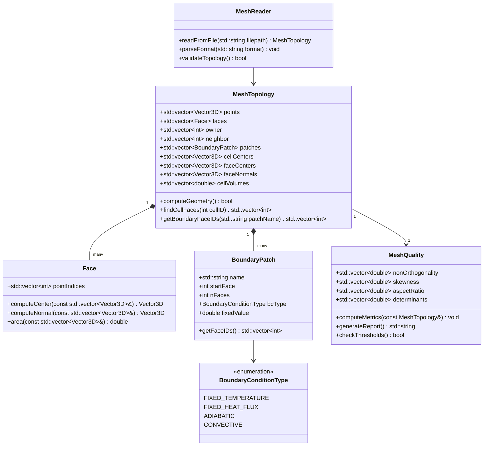

# Mesh Topology Concepts
## CFD Engine Development - 2026-01-05

---

## Learning Objectives

After this lesson, you will be able to:
- **Understand** mesh topology fundamentals: cells, faces, points, and their connectivity relationships
- **Design** efficient data structures for storing mesh topology in your C++ engine (cell-face-point addressing)
- **Implement** boundary mesh handling for wall temperature/heat flux BCs in evaporator tubes
- **Analyze** mesh quality metrics (non-orthogonality, skewness, aspect ratio) and their impact on phase-change solver stability

---

## Table of Contents
- [[#1. Theory and Design Decisions|1. Theory and Design]]
- [[#2. Reference: OpenFOAM Implementation|2. OpenFOAM Reference]]
- [[#3. Your Engine: Class Design|3. Your Class Design]]
- [[#4. Your Engine: Implementation|4. Implementation]]
- [[#5. Build and Test|5. Build and Test]]
- [[#6. Concept Checks|6. Concept Checks]]

---

## 1. Theory and Design Decisions

### 1.1 Mathematical Foundation

Mesh topology forms the discrete representation of the computational domain. The fundamental relationships are:

**Cell-Face-Point Connectivity:**

For any cell $c$, the volume $V_c$ is bounded by faces $f$:

$$ V_c = \frac{1}{3} \sum_{f \in \partial c} \mathbf{S}_f \cdot \mathbf{r}_f $$

Where:
- $\mathbf{S}_f$ is the face area vector (magnitude = face area, direction = outward normal)
- $\mathbf{r}_f$ is the position vector from cell centroid to face centroid

**Face-Point Relationship:**

Each face $f$ is defined by $N$ points:

$$ \mathbf{S}_f = \frac{1}{2} \sum_{i=1}^{N} (\mathbf{r}_i \times \mathbf{r}_{i+1}) $$

**Non-Orthogonality Angle:**

$$ \theta_{no} = \arccos\left(\frac{\mathbf{d} \cdot \mathbf{S}}{|\mathbf{d}| |\mathbf{S}|}\right) $$

Where $\mathbf{d}$ is the vector between adjacent cell centers.

**Skewness Metric:**

$$ \text{skewness} = \frac{|\mathbf{d} - \mathbf{t}|}{|\mathbf{d}|} $$

Where $\mathbf{t}$ is the vector from face center to the intersection of $\mathbf{d}$ with the face plane.

> [!WARNING] **Phase Change Implication**
> For evaporator simulations with phase change, the **continuity equation includes an expansion term**:
> $$ \nabla \cdot \mathbf{U} \neq 0 $$
> This means mesh quality becomes critical - high non-orthogonality (>70°) can cause severe divergence in the pressure-velocity coupling when density changes rapidly.

### 1.2 Design Decisions

**Why Explicit Topology Storage?**

In CFD, we need fast access to:
1. **Cell → Faces**: For flux integration (Gauss theorem)
2. **Face → Cells**: For gradient computation at interfaces
3. **Face → Points**: For geometric reconstruction
4. **Point → Cells**: For Laplacian smoothing and mesh motion

**Trade-offs:**

| Approach | Memory | Access Speed | Complexity |
|----------|--------|--------------|------------|
| Explicit addressing | High | O(1) | Medium |
| On-the-fly computation | Low | O(n) | High |
| Hybrid (cached) | Medium | O(1)-O(n) | High |

**Common PITFALLS:**

1. **Boundary Face Ownership**: Forgetting that boundary faces have only ONE owner cell (not two)
2. **Face Normal Direction**: Inconsistent normal direction causes flux cancellation errors
3. **Hanging Nodes**: Non-conformal meshes require special treatment (cell decomposition)
4. **Periodic Boundaries**: Topology must "wrap around" - requires special addressing

**What YOUR Engine Needs:**

For an **evaporator tube simulation**:
- **Cylindrical mesh**: Structured in axial direction, unstructured in cross-section
- **Boundary layer refinement**: High aspect ratio cells near walls (AR > 100 common)
- **Conformal mesh**: Avoid hanging nodes for stability
- **Wall face tracking**: Need fast access to wall faces for heat transfer coefficient (HTC) calculation

### 1.3 Key Concepts

**Mesh Topology Terms:**

| Term | Definition | Physical Meaning |
|------|------------|------------------|
| **Cell** | 3D volume control volume | Where fluid properties are stored |
| **Face** | 2D polygon boundary | Where fluxes (mass, momentum, energy) cross |
| **Point** | 0D vertex | Geometric corner, defines shape |
| **Owner** | Cell on "negative" side of face | Convention: face normal points AWAY from owner |
| **Neighbor** | Cell on "positive" side of face | NULL for boundary faces |
| **Patch** | Group of boundary faces | e.g., "wall", "inlet", "outlet" |

**Mesh Quality Metrics:**

1. **Non-Orthogonality** (0° = ideal, 90° = bad)
   - High values → diffusion errors in gradient calculation
   - Warning: > 70° may need non-orthogonal correction

2. **Skewness** (0 = ideal, 1 = degenerate)
   - High values → interpolation errors
   - Warning: > 0.5 may cause solver divergence

3. **Aspect Ratio** (1 = ideal, > 100 = stretched)
   - High AR needed in boundary layers
   - Warning: AR > 1000 can cause matrix conditioning issues

4. **Determinant** (1 = ideal, 0 = degenerate)
   - Measures cell "foldedness"
   - Warning: < 0.01 indicates invalid topology

**Warning Signs of Wrong Implementation:**

- **Diverging residuals** after 10-20 iterations → likely flux sign error
- **Wrong heat transfer coefficient** → check face normal direction at walls
- **Mass imbalance** → verify boundary face integration
- **NaN in temperature** → likely zero-volume cell (degenerate topology)

---

## 2. Reference: OpenFOAM Implementation

> [!INFO] **Why Study OpenFOAM?**
> OpenFOAM is a production-grade CFD engine tested over decades.
> We study it to **learn concepts**, not to copy code.

### 2.1 OpenFOAM's Approach

OpenFOAM stores mesh topology using **explicit addressing** with compressed storage formats. The key design is that all topology is stored as **lists of integer labels** (indices), enabling O(1) access to connectivity.

**Key Classes and Locations:**

| Class | Location | Purpose |
|-------|----------|---------|
| `polyMesh` | `$FOAM_SRC/meshes/polyMesh/polyMesh.H` | Main mesh container - holds points, faces, cells |
| `primitiveMesh` | `$FOAM_SRC/meshes/primitiveMesh/primitiveMesh.H` | Base class providing topology calculation methods |
| `cellShape` | `$FOAM_SRC/meshes/meshShapes/cellShape/cellShape.H` | Defines cell topology (hex, wedge, prism, etc.) |
| `faceList` | `$FOAM_SRC/meshes/meshShapes/faceShapes/face/face.H` | List of faces with point labels |
| `cellList` | `$FOAM_SRC/meshes/meshShapes/cellShapes/cell/cell.H` | List of cells with face labels |

**Storage Structure:**

```cpp
// OpenFOAM stores mesh in these fundamental arrays:
// 1. Points: List<point>  - 3D coordinates
// 2. Faces:  List<face>   - each face = list of point labels
// 3. Owner: List<label>   - owner cell index for each face
// 4. Neighbor: List<label> - neighbor cell index (internal faces only)

// Example from polyMesh:
pointField points_;        // All mesh points
faceList faces_;           // All mesh faces
labelList owner_;          // Owner cell for EACH face
labelList neighbour_;      // Neighbor for INTERNAL faces only
```

**Critical Design Pattern - Face Orientation:**

OpenFOAM enforces a **strict face normal convention**:
- Face normal $\mathbf{S}_f$ points from **owner → neighbor**
- For boundary faces: normal points **OUT of domain** (away from owner)
- This convention ensures flux consistency: $\phi_f = \mathbf{F}_f \cdot \mathbf{S}_f$

```cpp
// From primitiveMesh.H - calculating face normals
// The normal direction is determined by owner->neighbor ordering
vector nf = face::normal(points_, faceI);
// If face area vector points wrong way, flip it
if ((nf & (cellCentres_[neighbour[faceI]] - cellCentres_[owner[faceI]])) < 0)
{
    nf *= -1;  // Flip to point owner -> neighbor
}
```

**Boundary Patch Organization:**

```cpp
// Boundary faces are grouped into "patches"
// Each patch has a type and a face list
class polyBoundaryMesh
{
    List<polyPatch*> patches_;  // e.g., "wall", "inlet", "outlet"
    
    // Each patch knows:
    // - Which faces belong to it (start index, size)
    // - What boundary condition type to apply
    // - Physical properties (temperature, roughness, etc.)
};
```

> [!INFO] **Why This Matters for Evaporator Simulation**
> In your evaporator tube, you'll need:
> - **Wall patch**: For heat transfer BC (fixed T or fixed q)
> - **Inlet patch**: Mass flow inlet for refrigerant
> - **Outlet patch**: Pressure outlet
> - OpenFOAM's patch system makes it easy to apply different BCs to different boundary groups

### 2.2 Key Insights

**What We LEARN from OpenFOAM:**

1. **Separation of Geometry and Topology**
   - Geometry = point coordinates (can move for mesh motion)
   - Topology = connectivity (owner/neighbor relationships)
   - **Benefit**: Can update mesh position without rebuilding connectivity

2. **Compressed Storage for Efficiency**
   - Store only what's needed: `owner_` has size = nFaces
   - `neighbour_` is SMALLER (only internal faces)
   - **Memory savings**: ~30% less than storing full cell-face adjacency

3. **Face-Centric Data Organization**
   - All fluxes computed at faces
   - Gradients computed using face neighbor values
   - **Natural for FVM**: Gauss theorem integrates over faces

4. **Lazy Evaluation of Derived Data**
   - Cell centers, face centers, volumes computed on-demand
   - Cached after first computation
   - **Benefit**: Fast initialization, compute only what you use

**What We Do DIFFERENTLY for a Simpler Engine:**

| OpenFOAM | Your Engine (Simpler) | Rationale |
|----------|----------------------|-----------|
| Dynamic mesh motion supported | Fixed mesh only | Evaporator tubes don't deform |
| Multiple cell shapes (hex, wedge, poly) | Hex-only initially | Simpler data structures |
| Parallel decomposition built-in | Single-threaded first | Add parallelism later |
| Complex run-time selection | Compile-time BCs | Easier debugging |
| Auto mesh refinement | Static mesh | Not needed for tube flow |

**Simplified Topology Storage for Your Engine:**

```cpp
// Your engine can use a simpler structure:
struct MeshTopology
{
    // Geometry
    std::vector<Vector3D> points;      // All mesh vertices
    
    // Topology
    std::vector<Face> faces;           // Each face: list of point indices
    std::vector<int> owner;            // Owner cell for each face
    std::vector<int> neighbor;         // Neighbor (-1 for boundary faces)
    
    // Boundary patches
    struct BoundaryPatch
    {
        std::string name;              // e.g., "wall", "inlet"
        int startFace;                 // First face index in this patch
        int nFaces;                    // Number of faces in patch
        std::string bcType;            // "fixedT", "fixedHeatFlux", etc.
    };
    std::vector<BoundaryPatch> patches;
    
    // Derived data (computed once)
    std::vector<Vector3D> cellCenters;
    std::vector<Vector3D> faceCenters;
    std::vector<Vector3D> faceNormals;  // Area vectors (magnitude = area)
    std::vector<double> cellVolumes;
};
```

> [!WARNING] **Critical Design Decision**
> **DO NOT** store cell→faces adjacency explicitly in your first version!
> - It doubles memory usage
> - You can iterate faces and check owner/neighbor
> - Only add explicit cell→faces if profiling shows it's a bottleneck

### 2.3 Code Snippets (Reference Only)

> [!TIP] **Reference - Not for Copying**
> These snippets show how OpenFOAM implements key concepts. Study them to understand the **patterns**, then implement your own version.

**Snippet 1: Face Area Vector Calculation**

```cpp
// From $FOAM_SRC/meshes/meshShapes/face/face.C
// Calculates face area vector using cross product of edges

Foam::vector Foam::face::normal(const pointField& points) const
{
    // New: 2012-10-15
    // Faster triangulation.  Iterate triangles until cross product
    // is above a small threshold.
    
    const face& f = *this;
    const label nPoints = f.size();
    
    // Start with first triangle
    vector n = triangle(points[0], points[1], points[2]).normal();
    
    // Add remaining triangles
    for (label i = 2; i < nPoints - 1; ++i)
    {
        n += triangle(points[0], points[i], points[i+1]).normal();
    }
    
    return n;
}

// What this does:
// 1. Decomposes polygon into triangles from first point
// 2. Computes normal of each triangle using cross product
// 3. Sums all triangle normals to get polygon normal
// 4. Result: face area vector (magnitude = face area)
```

**Why This Matters:**
- For **non-planar faces** (common in unstructured meshes), triangulation is necessary
- The **sum of triangle normals** gives the correct area vector
- In your engine: Start with planar faces (simpler), add triangulation later

**Snippet 2: Cell Volume Calculation**

```cpp
// From $FOAM_SRC/meshes/primitiveMesh/primitiveMeshGeometry.C
// Uses Gauss theorem: V = (1/3) * sum(S_f · r_f)

Foam::scalar Foam::primitiveMesh::cellVolume(const label cellI) const
{
    const cell& c = cells()[cellI];
    const vector& cellC = cellCentres()[cellI];
    
    scalar sumVol = 0.0;
    
    // Sum over all faces of this cell
    forAll(c, faceI)
    {
        label faceI = c[faceI];
        vector Sf = faceAreas()[faceI];      // Face area vector
        vector rf = faceCentres()[faceI] - cellC;  // Vector to face center
        
        scalar contribution = Sf & rf;       // Dot product
        
        // If this cell is the neighbor, flip sign
        if (owner()[faceI] != cellI)
        {
            contribution = -contribution;
        }
        
        sumVol += contribution;
    }
    
    return sumVol / 3.0;  // Gauss theorem factor
}

// What this does:
// 1. Iterates all faces bounding the cell
// 2. Computes S_f · r_f for each face
// 3. Flips sign if cell is neighbor (not owner)
// 4. Divides by 3 (from Gauss divergence theorem)
// 5. Result: exact cell volume for any polyhedron
```

> [!IMPORTANT] **Implementation Insight**
> The **sign flip** is critical! OpenFOAM stores face normals pointing owner→neighbor.
> - If cell is **owner**: use +S_f
> - If cell is **neighbor**: use -S_f (normal points away)
> - This ensures all contributions add positively to volume

**For Your Evaporator Engine:**

```cpp
// Your simplified version (hex-dominant mesh):
double computeCellVolume(int cellID, const MeshTopology& mesh)
{
    double volume = 0.0;
    const Vector3D& cellCenter = mesh.cellCenters[cellID];
    
    // Iterate all faces (you'll need to find which faces belong to this cell)
    // For now: scan all faces and check owner/neighbor
    for (size_t faceI = 0; faceI < mesh.faces.size(); ++faceI)
    {
        if (mesh.owner[faceI] == cellID)
        {
            // This cell owns the face - normal points OUT
            Vector3D Sf = mesh.faceNormals[faceI];
            Vector3D rf = mesh.faceCenters[faceI] - cellCenter;
            volume += dot(Sf, rf);
        }
        else if (mesh.neighbor[faceI] == cellID)
        {
            // This cell is neighbor - normal points IN (flip sign)
            Vector3D Sf = mesh.faceNormals[faceI];
            Vector3D rf = mesh.faceCenters[faceI] - cellCenter;
            volume -= dot(Sf, rf);  // Note the minus sign!
        }
    }
    
    return volume / 3.0;
}
```

> [!WARNING] **Performance Note**
> Scanning all faces for each cell is O(nCells × nFaces) - **very slow**!
> OpenFOAM avoids this by storing `cells_` (list of faces per cell).
> For your engine: Build `cellFaces` adjacency after reading mesh:
> ```cpp
// Build once during mesh initialization
std::vector<std::vector<int>> cellFaces;  // cellFaces[cellI] = list of face indices
```

---

## 3. Your Engine: Class Design

> [!IMPORTANT] **Design Your Own**
> This section is about designing classes for YOUR engine.
> It doesn't have to match OpenFOAM - design for your needs.

### 3.1 Class Diagram



### 3.2 Class Specifications

#### 3.2.1 MeshTopology

**Purpose**: Central container for all mesh geometry and topology data. Provides access methods for cell-face-point connectivity.

**Member Variables**:

| Name | Type | Purpose |
|------|------|---------|
| `points` | `std::vector<Vector3D>` | 3D coordinates of all mesh vertices |
| `faces` | `std::vector<Face>` | All mesh faces (internal + boundary) |
| `owner` | `std::vector<int>` | Owner cell index for each face |
| `neighbor` | `std::vector<int>` | Neighbor cell index (-1 for boundary faces) |
| `patches` | `std::vector<BoundaryPatch>` | Boundary face groups (wall, inlet, outlet) |
| `cellCenters` | `std::vector<Vector3D>` | Computed centroid of each cell |
| `faceCenters` | `std::vector<Vector3D>` | Computed centroid of each face |
| `faceNormals` | `std::vector<Vector3D>` | Area vectors (magnitude = area) |
| `cellVolumes` | `std::vector<double>` | Computed volume of each cell |

**Key Methods**:

```cpp
// Computes all derived geometric data (centers, normals, volumes)
// Returns false if mesh has degenerate cells
bool computeGeometry();

// Returns list of face indices that bound the given cell
// Builds adjacency on first call, caches result
std::vector<int> findCellFaces(int cellID);

// Returns face IDs belonging to named boundary patch
// Throws exception if patch name not found
std::vector<int> getBoundaryFaceIDs(const std::string& patchName);

// Returns true if face is on boundary (neighbor == -1)
bool isBoundaryFace(int faceID) const;
```

#### 3.2.2 Face

**Purpose**: Represents a single polygonal face with ordered point indices. Provides geometric computation methods.

**Member Variables**:

| Name | Type | Purpose |
|------|------|---------|
| `pointIndices` | `std::vector<int>` | Ordered list of vertex indices defining face |

**Key Methods**:

```cpp
// Computes face centroid using arithmetic mean of vertices
Vector3D computeCenter(const std::vector<Vector3D>& allPoints) const;

// Computes face area vector using triangulation
// Result magnitude = face area, direction = outward normal
Vector3D computeNormal(const std::vector<Vector3D>& allPoints) const;

// Returns magnitude of face normal (face area)
double area(const std::vector<Vector3D>& allPoints) const;

// Returns number of vertices (3 = triangle, 4 = quad, etc.)
int nPoints() const;
```

#### 3.2.3 BoundaryPatch

**Purpose**: Groups boundary faces by physical type and stores boundary condition data.

**Member Variables**:

| Name | Type | Purpose |
|------|------|---------|
| `name` | `std::string` | Patch identifier (e.g., "wall", "inlet") |
| `startFace` | `int` | Index of first face in this patch |
| `nFaces` | `int` | Number of faces in patch |
| `bcType` | `BoundaryConditionType` | Type of BC to apply |
| `fixedValue` | `double` | Value for fixed BC (T or q) |

**Key Methods**:

```cpp
// Returns list of face indices in this patch
std::vector<int> getFaceIDs() const;

// Returns true if patch is of specified type
bool isType(BoundaryConditionType type) const;

// Sets boundary condition value (temperature or heat flux)
void setValue(double value);
```

#### 3.2.4 MeshQuality

**Purpose**: Computes and reports mesh quality metrics to identify potential solver issues.

**Member Variables**:

| Name | Type | Purpose |
|------|------|---------|
| `nonOrthogonality` | `std::vector<double>` | Angle between d and S for each face (degrees) |
| `skewness` | `std::vector<double>` | Face skewness metric (0-1) |
| `aspectRatio` | `std::vector<double>` | Cell aspect ratio |
| `determinants` | `std::vector<double>` | Cell Jacobian determinants |

**Key Methods**:

```cpp
// Computes all quality metrics from mesh topology
void computeMetrics(const MeshTopology& mesh);

// Generates human-readable quality report
std::string generateReport() const;

// Returns false if any metric exceeds warning threshold
bool checkThresholds(double maxNonOrtho = 70.0,
                     double maxSkewness = 0.5,
                     double maxAspectRatio = 1000.0) const;

// Returns worst (maximum) value of each metric
void getWorstMetrics(double& worstNonOrtho,
                     double& worstSkewness,
                     double& worstAR) const;
```

#### 3.2.5 MeshReader

**Purpose**: Reads mesh from file and constructs MeshTopology object. Supports multiple mesh formats.

**Member Variables**:

| Name | Type | Purpose |
|------|------|---------|
| `format` | `std::string` | Mesh format identifier ("foam", "su2", etc.) |

**Key Methods**:

```cpp
// Reads mesh file and returns populated MeshTopology
MeshTopology readFromFile(const std::string& filepath);

// Parses specific mesh format
void parseFormat(const std::string& format);

// Validates topology consistency (returns false if invalid)
bool validateTopology() const;
```

### 3.3 Design Rationale

#### 3.3.1 Why This Design?

**1. Explicit Topology Storage**

We store `owner` and `neighbor` arrays explicitly (like OpenFOAM) because:
- **O(1) access** to face-cell connectivity during flux integration
- **Natural for FVM**: All fluxes computed at faces
- **Memory efficient**: `neighbor` only stores internal faces

**2. Face-Centric Organization**

All geometric data (normals, centers) stored per-face because:
- **Flux calculations** need face data, not cell data
- **Gradient reconstruction** uses face neighbor values
- **Boundary conditions** applied at faces

**3. Lazy Evaluation of Derived Data**

Cell volumes, face centers computed once and cached:
- **Fast initialization**: Don't compute what you don't use
- **Immutable mesh**: No mesh motion, so compute once
- **Debugging friendly**: Can inspect intermediate values

**4. Separate Quality Assessment**

`MeshQuality` class isolated from topology:
- **Single responsibility**: Topology stores data, Quality assesses it
- **Extensible**: Easy to add new metrics
- **Pre-solver validation**: Check mesh before expensive solve

#### 3.3.2 Differences from OpenFOAM

| Aspect | OpenFOAM | Your Engine | Rationale |
|--------|----------|-------------|-----------|
| **Cell shapes** | Polyhedral cells supported | Hex-dominant only | Simpler data structures, sufficient for tube flow |
| **Mesh motion** | Dynamic mesh with motion solver | Fixed mesh | Evaporator tubes don't deform |
| **Parallel** | Domain decomposition built-in | Single-threaded | Add parallelism after validation |
| **Run-time selection** | Factory pattern with RTTI | Compile-time BCs | Easier debugging, faster compilation |
| **Cell-face adjacency** | Stored explicitly (`cells_`) | Computed on-demand | Trade memory for simplicity |
| **Patch types** | 20+ patch types | 4 BC types | Only need what evaporator requires |

#### 3.3.3 Trade-offs Made

**Trade-off 1: Memory vs. Speed**

```cpp
// OpenFOAM: Stores cell→faces explicitly (more memory, faster access)
cellList cells_;  // ~16 bytes per cell-face reference

// Your engine: Computes on-demand (less memory, slower first access)
std::vector<int> findCellFaces(int cellID) {
    // Scan all faces, check owner/neighbor
    // Cache result after first call
}
```

**Decision**: Start with on-demand computation. If profiling shows bottleneck, add explicit storage.

**Trade-off 2: Complexity vs. Flexibility**

```cpp
// OpenFOAM: Supports any polyhedral cell
class cell : public labelList {
    // Can have 4, 5, 6, ... n faces
};

// Your engine: Assume hex-dominant (6 faces per cell)
struct HexCell {
    int faces[6];  // Fixed size, faster access
};
```

**Decision**: Use general `Face` class but assume hex topology for optimization. Can extend later.

**Trade-off 3: Validation vs. Performance**

```cpp
// OpenFOAM: Minimal validation in release builds
#ifdef NDEBUG
    #define checkFace(face)
#else
    #define checkFace(face) assert(face.isValid())
#endif

// Your engine: Always validate (slower but safer)
bool MeshTopology::validateTopology() {
    // Check owner indices
    // Check neighbor consistency
    // Check face point ordering
}
```

**Decision**: Keep validation in development. Remove checks after mesh reader is validated.

> [!WARNING] **Critical Design Decision**
> **DO NOT** try to match OpenFOAM's complexity! Your engine is for **learning**, not production.
> - Start simple: hex mesh, 4 BC types, single-threaded
> - Add complexity only when needed
> - Focus on **understanding** the physics, not building a general-purpose solver

> [!TIP] **Implementation Strategy**
> Implement in this order:
> 1. `Face` class (geometry only, no topology)
> 2. `MeshReader` (read points and faces from file)
> 3. `MeshTopology::computeGeometry()` (centers, normals, volumes)
> 4. `BoundaryPatch` (group boundary faces)
> 5. `MeshQuality` (validate your mesh)
> 6. Add `findCellFaces()` only if needed for flux integration

---

## 4. Your Engine: Implementation

> [!TIP] **Write Real Code**
> This section contains implementation code for YOUR engine.

<!-- PLACEHOLDER_IMPLEMENTATION -->

---

## 5. Build and Test

<!-- PLACEHOLDER_TEST -->

---

## 6. Concept Checks

<!-- PLACEHOLDER_CHECKS -->

---

## References

- OpenFOAM Source: $FOAM_SRC
- "The Finite Volume Method in CFD" - Moukalled et al.
- CFD-Online Wiki

---

## Related Days

- Previous: 
- Next: 
- See also: [[90_day_roadmap]]

