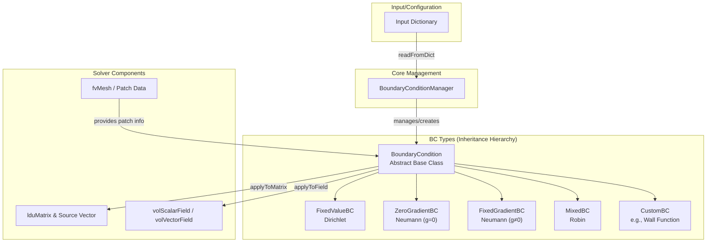

# Day 06: Boundary Conditions (Inlet, Outlet, Wall)

**วันที่:** 2026-01-06
**ระดับความยาก:** Hardcore
**สถานะ:** In Progress
**หัวใจสำคัญ:** การกำหนดเงื่อนไขขอบเขต (Boundary Conditions - BCs) คือการ *กำหนดปัญหา* (Problem Definition) ให้กับระบบสมการเชิงอนุพันธ์ย่อย (PDEs) ของเรา เงื่อนไขที่ถูกต้องเท่านั้นที่จะนำไปสู่ผลลัพธ์ที่มีความหมายทางฟิสิกส์ (Physically Meaningful Solution) ในขณะที่เงื่อนไขที่ผิดพลาดเพียงเล็กน้อยสามารถทำให้ Solver ลู่ออก (Diverge) หรือให้คำตอบที่ผิดเพี้ยน (Non-Physical Artefacts) ได้

**Connection to Previous Day:** จาก [[Day 05: Mesh Topology|Day 05]] เราเข้าใจโครงสร้าง Mesh และการจัดเก็บเมทริกซ์ในรูปแบบ LDU โดยเฉพาะความสัมพันธ์ระหว่างเซลล์เจ้าของ (Owner) และเซลล์เพื่อนบ้าน (Neighbor) วันนี้เราจะใช้ความรู้นี้ในการจัดการกับ *เซลล์ผี* (Ghost Cells) หรือ *เฟซขอบเขต* (Boundary Faces) ซึ่งเป็นจุดที่เราต้องบังคับใช้เงื่อนไขขอบเขตต่างๆ

---
## 🎯 Learning Objectives (วัตถุประสงค์การเรียนรู้)

หลังจากจบบทเรียนนี้ คุณจะสามารถ:

1.  **เข้าใจ (Understand)** ประเภทและสูตรทางคณิตศาสตร์ของเงื่อนไขขอบเขตพื้นฐานสำหรับทางเข้า (Inlet), ทางออก (Outlet), และผนัง (Wall) พร้อมทั้งเหตุผลทางฟิสิกส์ที่อยู่เบื้องหลัง
    *   **Mathematical Formulation:** สามารถเขียนและอธิบายเงื่อนไข Dirichlet ($\phi_b = \phi_{fixed}$), Neumann ($\frac{\partial \phi}{\partial n} = g$), และ Robin ($a\phi_b + b\frac{\partial \phi}{\partial n} = c$) ได้
    *   **Physical Justification:** อธิบายได้ว่าทำไม inlet มักใช้ Fixed Velocity หรือ Fixed Pressure, ทำไม outlet ต้องมี Pressure Reference ($p_b = p_{out}$ หรือ $\frac{\partial p}{\partial n}=0$), และทำไมผนังต้องมี No-Slip ($\mathbf{U}_b = 0$) สำหรับการไหลแบบหนืด
    *   **Critical Importance:** ตระหนักว่าเงื่อนไขขอบเขตคือส่วนหนึ่งของ *การกำหนดปัญหา* (Problem Definition) ที่สมบูรณ์ การกำหนด BC ที่ผิดหรือไม่สอดคล้องกัน (Inconsistent) จะทำให้ปัญหาไม่มีความเป็น Well-Posed นำไปสู่การลู่ออกหรือคำตอบที่ไร้ความหมาย

2.  **วิเคราะห์ (Analyze)** กลไกการทำงานของ Boundary Condition Framework ใน OpenFOAM ระดับลึก ตั้งแต่คลาสฐานไปจนถึงการบูรณาการกับระบบสมการ
    *   **Class Hierarchy:** วิเคราะห์บทบาทของ `GeometricBoundaryField`, `fvPatchField` (ฐาน), และคลาสลูก (Derived Classes) เช่น `fixedValueFvPatchField`, `zeroGradientFvPatchField`
    *   **Matrix Integration:** เข้าใจวิธีการที่ Boundary Condition แทรกแซงกระบวนการประกอบเมทริกซ์ (Matrix Assembly) ผ่านเมธอด `updateCoeffs()` และ `manipulateMatrix(fvMatrix<Type>&)`
    *   **Data Flow:** ติดตามลำดับการเรียกใช้ (Call Sequence) ตั้งแต่ `solver->solve()` ไปจนถึง `boundaryField().evaluate()` และ `correctBoundaryConditions()`

3.  **ออกแบบ (Design)** กรอบการทำงาน (Framework) สำหรับ Boundary Conditions ใน CFD Engine ของเราเอง ซึ่งต้องทำงานร่วมกับ LDU Matrix ที่พัฒนาขึ้นใน [[Day 05: Mesh Topology|Day 05]]
    *   **Component Design:** ออกแบบคลาสหลักได้แก่ `BoundaryCondition` (Abstract Base Class), `BoundaryConditionManager` (ศูนย์กลางจัดการ), และคลาสสำหรับเงื่อนไขเฉพาะ เช่น `FixedValueBC`, `ZeroGradientBC`
    *   **Interface Definition:** กำหนดอินเทอร์เฟซที่ชัดเจนสำหรับการปรับเปลี่ยนเมทริกซ์ (`applyToMatrix`) และการอัพเดทฟิลด์ (`applyToField`)
    *   **Integration Point:** ระบุจุดในขั้นตอนวิธี (Algorithm) ของ Solver ที่ Manager ต้องถูกเรียกใช้ เพื่อให้ BCs มีผลต่อระบบสมการและผลลัพธ์

4.  **Implement (Implement)** การบูรณาการเงื่อนไขขอบเขตเข้าไปในระบบเชิงเส้น (Linear System) ในระหว่างการประกอบเมทริกซ์ (Matrix Assembly) โดยจัดการกับความท้าทายหลัก
    *   **Challenge - Dirichlet in LDU:** นำเงื่อนไข Fixed Value (Dirichlet) ไปบังคับใช้ในเมทริกซ์รูปแบบ LDU โดยไม่ทำลายโครงสร้าง Sparsity หรือสมมาตร (Symmetry) ของเมทริกซ์ ผ่านเทคนิคการแก้ไขค่าแนวทแยง (Diagonal), ออฟ-ไดแอกอนัล (Off-Diagonal) และเวกเตอร์ด้านขวา (RHS/Source)
    *   **Challenge - Neumann Flux:** คำนวณและเพิ่มการมีส่วนร่วม (Contribution) จากฟลักซ์ขอบเขต (Boundary Flux) ที่มาจากเงื่อนไข Fixed Gradient (Neumann) เข้าไปในสมการสำหรับเซลล์เจ้าของ (Owner Cell)
    *   **Challenge - Consistency:** รับประกันความสอดคล้องกัน (Consistency) ของเงื่อนไขขอบเขตระหว่างฟิลด์ที่คู่กัน (Coupled Fields) เช่น ระหว่างความเร็ว (`U`) และความดัน (`p`) ในสมการความต่อเนื่อง (Continuity) และโมเมนตัม

5.  **ประยุกต์ใช้ (Apply)** ความรู้เพื่อวินิจฉัยและแก้ไขปัญหาทั่วไป (Common Pitfalls) ที่เกิดจากเงื่อนไขขอบเขตที่ผิดพลาดในการจำลองการไหล
    *   **Diagnosis:** ระบุได้ว่าอาการเช่น Solver ลู่ออก, เกิด Backflow ที่ไม่พึงประสงค์ที่ Outlet, หรือสนามความดันแกว่งกวัด (Oscillate) นั้นมีสาเหตุมาจาก BC ประเภทใด
    *   **Remediation:** รู้จักและเลือกใช้เงื่อนไขขอบเขตทางเลือกที่เหมาะสมเพื่อแก้ปัญหา เช่น เปลี่ยนจาก Zero Gradient Outlet เป็น Pressure Outlet เพื่อควบคุม Backflow, หรือใช้ Wall Functions เพื่อลด Computational Cost ในการไหลแบบปั่นป่วน (Turbulent Flow) ใกล้ผนัง
    *   **Best Practices:** กำหนดชุดเงื่อนไขขอบเขตที่สอดคล้องกันและมีเสถียรภาพสำหรับสถานการณ์จำลองทั่วไป (Canonical Cases) เช่น Internal Flow, External Flow, เป็นต้น

6.  **เชื่อมโยง (Connect)** แนวคิดของ Boundary Conditions กับหัวข้อในวันต่อๆ ไป โดยเฉพาะอย่างยิ่ง Linear Solvers ([[Day 07: Linear Algebra (LDU)|Day 07]]) และ Pressure-Velocity Coupling ([[Day 09: Pressure-Velocity Coupling (SIMPLE, PISO, Rhie-Chow)|Day 09]])
    *   **To Linear Algebra ([[Day 07: Linear Algebra (LDU)|Day 07]]):** เข้าใจว่าเมทริกซ์สุดท้ายที่ส่งให้ Linear Solver (เช่น CG, BiCGStab) นั้น *ถูกดัดแปลงแล้ว* (Already Modified) โดยเงื่อนไขขอบเขต การ implement BCs วันนี้จะเป็น input โดยตรงสำหรับการ implement Solvers ในวันถัดไป
    *   **To Pressure-Velocity Coupling ([[Day 09: Pressure-Velocity Coupling (SIMPLE, PISO, Rhie-Chow)|Day 09]]):** ตระหนักถึงความสำคัญของการจัดลำดับ (Ordering) และความสอดคล้อง (Consistency) ของ BCs ระหว่างสมการความดันและความเร็ว ในอัลกอริธึมเช่น SIMPLE และ PISO ซึ่งมีความไว (Sensitive) ต่อเงื่อนไขขอบเขตเป็นอย่างมาก
    *   **To Phase Change ([[Day 11: Phase Change Theory (Lee Model & Linearization)|Day 11]]):** เตรียมความพร้อมสำหรับเงื่อนไขขอบเขตที่ซับซ้อนและขึ้นกับคำตอบ (Solution-Dependent) ที่อินเทอร์เฟซระหว่างเฟส (Phase Interface) ซึ่งอาจต้องการการอัพเดทแบบไดนามิก (Dynamic Update) ภายในลูปการคำนวณ
## Section 1: Theory

### 1.1 Fundamental Types of Boundary Conditions (ประเภทพื้นฐานของเงื่อนไขขอบเขต)

ใน Computational Fluid Dynamics (CFD) การกำหนด **เงื่อนไขขอบเขต (Boundary Conditions - BCs)** เป็นขั้นตอนที่สำคัญที่สุดขั้นตอนหนึ่ง ซึ่งเปรียบเสมือนการ "กำหนดปัญหา (Problem Definition)" ให้สมบูรณ์ เงื่อนไขขอบเขตไม่ใช่แค่ข้อกำหนดทางเทคนิค แต่เป็นตัวแทนของ **ฟิสิกส์ (Physics)** ที่เกิดขึ้นที่ขอบเขตของโดเมนการคำนวณของเรา การเลือกเงื่อนไขขอบเขตที่ผิดพลาดจะนำไปสู่ผลลัพธ์ที่ไม่เป็นไปตามฟิสิกส์ (Non-Physical) หรือทำให้การคำนวณ **ลู่ออก (Diverge)** อย่างรวดเร็ว

ในทางคณิตศาสตร์ สำหรับสมการอนุพันธ์ย่อย (Partial Differential Equations - PDEs) เงื่อนไขขอบเขตเป็นสิ่งที่จำเป็นเพื่อให้ปัญหา **มีความเป็นเอกลักษณ์ (Well-Posed)** ตามทฤษฎีของ Hadamard (Existence, Uniqueness, Stability) สำหรับสมการการไหลของของไหล (Navier-Stokes Equations) ซึ่งเป็นระบบสมการไม่เชิงเส้น (Non-linear) และมีลักษณะ parabolic/hyperbolic ผสมกัน การกำหนดเงื่อนไขขอบเขตจึงต้องพิจารณาทั้งทิศทางการไหล (Flow Direction) และลักษณะทางฟิสิกส์ของขอบเขตนั้นๆ

โดยทั่วไป เงื่อนไขขอบเขตสำหรับสนามสเกลาร์หรือเวกเตอร์ $\phi$ สามารถแบ่งออกเป็น 3 ประเภทหลักทางคณิตศาสตร์ ดังนี้

### 1.1.1 Dirichlet Condition (เงื่อนไขค่าคงที่)

**Dirichlet Boundary Condition** เป็นการกำหนด **ค่า (Value)** ของตัวแปรที่ต้องการหาอย่างชัดเจนที่ขอบเขต สมการทางคณิตศาสตร์เขียนได้เป็น:

$$
\phi_b = \phi_{\text{fixed}}
$$

โดยที่:
- $\phi_b$ คือ ค่าของสนาม $\phi$ ที่ขอบเขต (Boundary Face)
- $\phi_{\text{fixed}}$ คือ ค่าคงที่ที่กำหนดให้ (ซึ่งอาจเป็นค่าคงที่ เวกเตอร์ หรือฟังก์ชันของเวลาและตำแหน่งก็ได้)

**การประยุกต์ใช้ในทางฟิสิกส์:**
- **Inlet Velocity:** $\mathbf{U}_b = (U_{in}, 0, 0)$ กำหนดความเร็วเข้าในทิศทาง x ที่ขอบเขตทางเข้า
- **Wall Temperature:** $T_b = T_{\text{wall}}$ กำหนดอุณหภูมิผนังคงที่
- **Fixed Interface (ใน VOF):** $\alpha_b = 1$ กำหนดขอบเขตที่เป็นของเหลวเต็มเซลล์

**กลไกในการแก้สมการ (Discretization):** ในระบบเมทริกซ์ $[A]\{\phi\} = \{b\}$ การกำหนด Dirichlet Condition ทำได้โดยการ **แก้ไขแถว (Row)** ในเมทริกซ์ที่สอดคล้องกับเซลล์ขอบเขต (Boundary Cell) โดยทั่วไปมีสองวิธี:
1.  **วิธีที่แข็งกร้าว (Strong Enforcement):** ตั้งค่าสัมประสิทธิ์ในแนวทแยง (Diagonal Coefficient) $A_{ii} = 1$ และตั้งค่าสัมประสิทธิ์นอกแนวทแยง (Off-diagonal Coefficients) ในแถวเดียวกันให้เป็น $0$ จากนั้นตั้งค่า source term $b_i = \phi_{\text{fixed}}$ วิธีนี้บังคับค่า $\phi_i = \phi_{\text{fixed}}$ โดยตรง
2.  **วิธีที่อ่อนนุ่ม (Weak Enforcement):** เพิ่มพจน์ source term ขนาดใหญ่ (Large Penalty Term) เข้าไปในสมการสำหรับเซลล์ขอบเขต เช่น $A_{ii} += \gamma$ และ $b_i += \gamma \phi_{\text{fixed}}$ โดยที่ $\gamma$ เป็นค่าสัมประสิทธิ์ค่าปรับ (Penalty Factor) ที่มีค่ามาก เมื่อ $\gamma \to \infty$ ผลลัพธ์จะลู่เข้าสู่การบังคับค่าโดยตรง

### 1.1.2 Neumann Condition (เงื่อนไขเกรเดียนต์คงที่)

**Neumann Boundary Condition** เป็นการกำหนด **เกรเดียนต์ (Gradient)** ของตัวแปรในทิศทางปกติ (Normal Direction) ต่อพื้นผิวขอบเขต สมการทางคณิตศาสตร์เขียนได้เป็น:

$$
\frac{\partial \phi}{\partial n} = g
$$

โดยที่:
- $\frac{\partial \phi}{\partial n} = \nabla \phi \cdot \mathbf{n}$ คือ อนุพันธ์ในทิศทางปกติ (Normal Derivative) ของสนาม $\phi$
- $g$ คือ ค่าของเกรเดียนต์ปกติที่กำหนดให้ (มักเป็น 0 สำหรับ "Zero Gradient" condition)
- $\mathbf{n}$ คือ เวกเตอร์หน่วยตั้งฉากกับพื้นผิวขอบเขต (ชี้ออกนอกโดเมน)

**การประยุกต์ใช้ในทางฟิสิกส์:**
- **Pressure Outlet (Zero Gradient):** $\frac{\partial p}{\partial n} = 0$ สมมติว่าความดันที่ทางออกมีลักษณะ Fully Developed
- **Adiabatic Wall:** $\frac{\partial T}{\partial n} = 0$ ไม่มีการถ่ายเทความร้อนผ่านผนัง (ฉนวนความร้อนสมบูรณ์)
- **Specified Heat Flux:** $\frac{\partial T}{\partial n} = \frac{q''}{k}$ กำหนดฟลักซ์ความร้อน $q''$ ที่ผนัง โดย $k$ คือค่าการนำความร้อน

**กลไกในการแก้สมการ:** Neumann Condition มีการบังคับใช้โดยอ้อมผ่านการประมาณค่า **ฟลักซ์ (Flux)** ที่ขอบเขต ในการ discretize สมการด้วย Finite Volume Method (FVM) พจน์การแพร่ (Diffusion Term) $\nabla \cdot (\Gamma \nabla \phi)$ จะถูกแปลงเป็นอินทิกรัลพื้นผิว $\sum_f \Gamma_f (\nabla \phi)_f \cdot \mathbf{S}_f$ สำหรับขอบเขตที่กำหนด Neumann Condition เราใช้ค่า $g$ ที่กำหนดให้โดยตรงเพื่อคำนวณฟลักซ์นี้:
$$
\text{Flux}_b = \Gamma_b \cdot g \cdot |\mathbf{S}_f|
$$
โดยที่ $\Gamma_b$ คือค่าสัมประสิทธิ์การแพร่ (Diffusion Coefficient) ที่ขอบเขต ฟลักซ์นี้จะถูกเพิ่มเข้าไปในสมการสำหรับ **เซลล์เจ้าของ (Owner Cell)** ของพื้นผิวขอบเขตนั้นๆ ในรูปของ **source term** โดยไม่ต้องแก้ไขสัมประสิทธิ์เมทริกซ์โดยตรงสำหรับเซลล์ขอบเขต

### 1.1.3 Robin Condition (เงื่อนไขแบบผสม)

**Robin Boundary Condition** หรือ Mixed Condition เป็นการรวมลักษณะของ Dirichlet และ Neumann เข้าด้วยกันในรูปแบบเชิงเส้น (Linear Combination) สมการทางคณิตศาสตร์เขียนได้เป็น:

$$
a \phi_b + b \frac{\partial \phi}{\partial n} = c
$$

โดยที่ $a$, $b$, และ $c$ เป็นค่าสัมประสิทธิ์ (ซึ่งอาจเป็นฟังก์ชันของเวลาและตำแหน่งได้)

**การประยุกต์ใช้ในทางฟิสิกส์:**
- **Convective Heat Transfer Boundary (Newton's Law of Cooling):** $h(T_b - T_\infty) = -k \frac{\partial T}{\partial n}$ โดย $h$ คือสัมประสิทธิ์การถ่ายเทความร้อน (Heat Transfer Coefficient), $T_\infty$ คืออุณหภูมิของของไหลรอบข้าง และ $k$ คือค่าการนำความร้อนของวัสดุ
- **Coupled Boundary Conditions:** ในปัญหาที่มีอันตรกิริยาระหว่างโดเมน (Domain Interaction) หรือการเชื่อมต่อกับแบบจำลองภายนอก (External Model Coupling)
- **Impedance Boundary Conditions:** ในปัญหาคลื่นเสียง (Acoustics)

**กลไกในการแก้สมการ:** Robin Condition ต้องการการจัดการที่ซับซ้อนกว่าเล็กน้อย เนื่องจากต้องนำทั้งค่า $\phi_b$ และเกรเดียนต์ $\frac{\partial \phi}{\partial n}$ มาใช้ร่วมกัน ในการ discretize เรามักจะเขียน $\phi_b$ ใหม่ในรูปของค่าในเซลล์ภายใน (Internal Cell Value) $\phi_P$ และเกรเดียนต์ปกติ จากนั้นแทนกลับเข้าไปในสมการ Robin เพื่อหาความสัมพันธ์ระหว่าง $\phi_b$ กับ $\phi_P$ และเกรเดียนต์ ความสัมพันธ์นี้จะถูกใช้เพื่อคำนวณฟลักซ์ที่ขอบเขตและเพิ่มเข้าไปในสมการของเซลล์เจ้าของ ซึ่งส่งผลต่อทั้งสัมประสิทธิ์เมทริกซ์และ source term

### ตารางสรุปเปรียบเทียบเงื่อนไขขอบเขตพื้นฐาน

| **Condition Type** | **Mathematical Form**                             | **Physical Meaning**                         | **Matrix Modification**                                                 | **Example Use Case**                          |
| :----------------- | :------------------------------------------------ | :------------------------------------------- | :---------------------------------------------------------------------- | :-------------------------------------------- |
| **Dirichlet**      | $\phi_b = \phi_{\text{fixed}}$                    | กำหนดค่าที่ขอบเขต                            | แก้ไขแถวเมทริกซ์ (Diagonal=1, Off-diag=0, Source=$\phi_{\text{fixed}}$) | ความเร็วเข้า, อุณหภูมิผนังคงที่               |
| **Neumann**        | $\frac{\partial \phi}{\partial n} = g$            | กำหนดฟลักซ์ที่ขอบเขต                         | เพิ่ม source term จากฟลักซ์ที่คำนวณได้                                  | ทางออกความดัน (Zero Gradient), ผนัง adiabatic |
| **Robin**          | $a\phi_b + b\frac{\partial \phi}{\partial n} = c$ | กำหนดความสัมพันธ์เชิงเส้นระหว่างค่าและฟลักซ์ | แก้ไขทั้งสัมประสิทธิ์และ source term                                    | การถ่ายเทความร้อนแบบพาความร้อนที่ผนัง         |

**คำเตือนสำคัญ (Critical Warning):** การผสมผสานเงื่อนไขขอบเขตประเภทต่างๆ อย่างไม่ถูกต้องสามารถทำให้ปัญหา **กำหนดไม่สมบูรณ์ (Ill-Posed)** ได้ ตัวอย่างคลาสสิกคือการกำหนด Dirichlet Condition สำหรับตัวแปรทุกตัวที่ขอบเขตทุกแห่ง ซึ่งจะทำให้ระบบ Over-constrained และอาจไม่มีคำตอบ ต้องมั่นใจว่าเงื่อนไขขอบเขตที่เลือกนั้น **เข้ากันได้ (Compatible)** กับฟิสิกส์ของปัญหา เช่น การอนุรักษ์มวล (Mass Conservation) ต้องเป็นที่พอใจ นั่นคือ ผลรวมของฟลักซ์มวลผ่านขอบเขตทั้งหมดต้องเท่ากับศูนย์ (หรือเท่ากับอัตราการสะสมมวลภายใน) สำหรับการไหลแบบสถิตย์ (Steady State)

---

### 1.2 Inlet Boundary Conditions (เงื่อนไขขอบเขตทางเข้า)

ขอบเขตทางเข้า (Inlet Boundary) คือตำแหน่งที่การไหลเข้าสู่โดเมนการคำนวณ การกำหนดเงื่อนไขที่ถูกต้องที่นี่เป็นสิ่งสำคัญเพราะมันเป็นตัวกำหนด **สภาวะเริ่มต้น (Initial State)** ของการไหลภายในโดเมน ทางเลือกของเงื่อนไขขอบเขตทางเข้าขึ้นอยู่กับข้อมูลที่มีอยู่และลักษณะทางฟิสิกส์ของปัญหา

### 1.2.1 Fixed Velocity Inlet (ความเร็วเข้าแบบคงที่)

นี่เป็นเงื่อนไขทางเข้าแบบพื้นฐานและตรงไปตรงมาที่สุด เรา **กำหนดเวกเตอร์ความเร็วอย่างชัดเจน** ที่ขอบเขตทางเข้า

$$
\mathbf{U}_b = \mathbf{U}_{\text{in}}
$$

โดยที่ $\mathbf{U}_{\text{in}}$ อาจเป็นค่าคงที่ (เช่น $(10, 0, 0)$ m/s) หรือโปรไฟล์ความเร็วที่แปรผันตามตำแหน่ง (เช่น โปรไฟล์แบบ parabolic สำหรับการไหลในท่อ) ได้

**เงื่อนไขสำหรับตัวแปรอื่นๆ ที่ทางเข้า:**
- **Pressure:** เนื่องจากความดันในสมการโมเมนตัมสำหรับการไหลแบบบีบอัดไม่ได้ (Incompressible) ทำหน้าที่เป็นตัวคูณลากรังจ์ (Lagrange Multiplier) เพื่อบังคับใช้ความไม่สามารถบีบอัดได้ (Divergence-Free Condition) ดังนั้นที่ขอบเขตทางเข้า เรามักใช้ **Zero Gradient Condition** สำหรับความดัน:
  $$
  \frac{\partial p}{\partial n} = 0
  $$
  ซึ่งอนุญาตให้ความดันปรับตัวตามการไหลภายในได้
- **Scalar Fields (T, $\alpha$, etc.):** สำหรับสนามสเกลาร์อื่นๆ เช่น อุณหภูมิ $T$ หรือ volume fraction $\alpha$ เราสามารถกำหนดค่าได้ตามสภาวะทางเข้า เช่น $T_b = T_{\text{in}}$ หรือ $\alpha_b = 0$ (ทางเข้าคือไอ)

**การนำไปใช้ใน Solver:** ในขั้นตอนการแก้สมการโมเมนตัม (Momentum Equation) เงื่อนไข Fixed Velocity Inlet จะถูกบังคับใช้เป็น **Dirichlet Condition** สำหรับองค์ประกอบความเร็วแต่ละตัว ($u, v, w$) ซึ่งจะแก้ไขแถวเมทริกซ์สำหรับเซลล์ขอบเขตทางเข้า

**ข้อดี:** ควบคุมอัตราการไหลเข้าอย่างชัดเจน
**ข้อเสีย:** หากมีการไหลย้อนกลับ (Backflow) เข้าทางขอบเขตนี้ (ซึ่งอาจเกิดขึ้นในปัญหาที่ไม่เสถียร) การกำหนดความเร็วคงที่อาจไม่เป็นจริงทางฟิสิกส์และทำให้การคำนวณลู่ออก

### 1.2.2 Fixed Pressure Inlet (ความดันเข้าแบบคงที่)

ในบางสถานการณ์ (เช่น การจำลองการไหลจากถังเก็บความดันคงที่) เราอาจทราบ **ความดันทางเข้า** มากกว่าความเร็ว ในกรณีนี้ เรากำหนด:

$$
p_b = p_{\text{in}}
$$

**เงื่อนไขสำหรับตัวแปรอื่นๆ ที่ทางเข้า:**
- **Velocity:** เนื่องจากความเร็วไม่ทราบค่า เราต้องอนุญาตให้มันปรับตัวตามความดันที่กำหนด โดยทั่วไปใช้ **Zero Gradient Condition** สำหรับความเร็ว:
  $$
  \frac{\partial \mathbf{U}}{\partial n} = 0
  $$
  ซึ่งหมายความว่าเกรเดียนต์ของความเร็วในทิศทางปกติเป็นศูนย์ ค่าความเร็วที่ขอบเขตจะถูก **ประมาณค่า (Interpolated)** จากเซลล์ภายในที่อยู่ติดกัน
- **Scalar Fields:** สามารถกำหนดค่าได้ตามปกติ เช่น Dirichlet Condition

**กลไกการทำงาน:** ในขั้นตอนการแก้สมการความดัน (Pressure Equation) หรือในอัลกอริทึมการคู่กันความดัน-ความเร็ว (Pressure-Velocity Coupling เช่น SIMPLE/PISO) เงื่อนไข Fixed Pressure Inlet จะถูกบังคับใช้เป็น Dirichlet Condition สำหรับ $p$ ที่เซลล์ขอบเขต จากนั้นความเร็วที่ขอบเขตจะถูกคำนวณใหม่จากสมการโมเมนตัมหรือจากความสัมพันธ์ระหว่างความดันและความเร็ว

**ข้อดี:** เหมาะกับสภาวะทางกายภาพที่ความดันเป็นตัวควบคุมหลัก
**ข้อเสีย:** อัตราการไหลเข้าจะถูกคำนวณได้ (Calculated) ไม่ได้ถูกกำหนด (Prescribed) ซึ่งอาจไม่ใช่สิ่งที่ต้องการในบางการจำลอง

### 1.2.3 Mass Flow Inlet (อัตราการไหลของมวลเข้า)

นี่เป็นเงื่อนไขที่ใช้บ่อยในทางวิศวกรรม เมื่อเราต้องการควบคุม **อัตราการไหลของมวล (Mass Flow Rate)** ที่เข้าสู่ระบบ มากกว่าความเร็วหรือความดัน เงื่อนไขนี้กำหนดว่า:

$$
\dot{m} = \rho \mathbf{U} \cdot \mathbf{S}_f
$$

โดยที่:
- $\dot{m}$ คือ อัตราการไหลของมวลรวม (Total Mass Flow Rate) ที่ผ่านขอบเขตทางเข้า [kg/s]
- $\rho$ คือ ความหนาแน่นของของไหล [kg/m³]
- $\mathbf{U}$ คือ เวกเตอร์ความเร็วที่ขอบเขต [m/s]
- $\mathbf{S}_f$ คือ เวกเตอร์พื้นที่ผิว (Face Area Vector) ซึ่งมีขนาดเท่ากับพื้นที่ผิวและทิศทางตั้งฉากออกจากโดเมน [m²]

เนื่องจาก $\mathbf{U} \cdot \mathbf{S}_f$ คือ volumetric flux $\phi$ [m³/s] เราจึงสามารถเขียนได้ว่า $\dot{m} = \rho \phi$

**การนำไปใช้:** การบังคับใช้เงื่อนไขนี้ซับซ้อนกว่าแบบก่อนๆ เพราะต้องมีการ **ปรับค่า (Adjust)** ความเร็วที่ขอบเขตอย่างเป็นระบบเพื่อให้ได้อัตราการไหลของมวลตามที่กำหนด กระบวนการทั่วไปมีดังนี้:
1.  เริ่มต้นด้วยการประมาณค่าเริ่มต้นสำหรับความเร็วที่ขอบเขต (อาจมาจากเงื่อนไข Fixed Velocity หรือจากผลการคำนวณครั้งก่อน)
2.  คำนวณอัตราการไหลของมวลรวมจากความเร็วปัจจุบัน: $\dot{m}_{\text{current}} = \sum_f \rho_f (\mathbf{U}_f \cdot \mathbf{S}_f)$ โดยรวมทุกหน้าขอบเขตทางเข้า
3.  คำนวณปัจจัยปรับ (Scaling Factor): $f_{\text{scale}} = \dot{m}_{\text{target}} / \dot{m}_{\text{current}}$
4.  ปรับความเร็วที่ขอบเขตทั้งหมด: $\mathbf{U}_f^{\text{new}} = f_{\text{scale}} \cdot \mathbf{U}_f^{\text{old}}$
5.  ทำซ้ำขั้นตอนที่ 2-4 ภายในแต่ละขั้นการวนซ้ำ (Iteration) หรือขั้นเวลา (Time Step) จนกว่า $\dot{m}_{\text{current}}$ จะใกล้เคียงกับ $\dot{m}_{\text{target}}$ ภายในค่าความคลาดเคลื่อนที่ยอมรับได้

**ความท้าทาย:** เงื่อนไข Mass Flow Inlet มักต้องใช้ร่วมกับ **Pressure Outlet** เพื่อให้ความดันในโดเมนสามารถปรับ
## Section 2: OpenFOAM Reference

ในส่วนนี้ เราจะเจาะลึกลงไปใน source code จริงของ OpenFOAM เพื่อดูว่า boundary conditions ถูก implement ไว้อย่างไรในระดับที่ลึกที่สุด เราจะวิเคราะห์ class สำคัญสามตัวคือ `GeometricBoundaryField`, `fvPatchField`, และ `fvPatch` โดยจะดูจาก header files (.H) และ source files (.C) จริง พร้อมทั้งแสดงให้เห็นว่าใน CFD Engine ของเราเอง เราจะออกแบบให้แตกต่างและเหมาะสมกับความต้องการของ phase change solver อย่างไร
### 2.1 วิเคราะห์ Class: `GeometricBoundaryField`

### 2.1.1 Header File Analysis (`GeometricBoundaryField.H`)

```cpp
// src/finiteVolume/fields/GeometricBoundaryField/GeometricBoundaryField.H
namespace Foam
{
    template<class Type, template<class> class PatchField, class GeoMesh>
    class GeometricBoundaryField
    {
    public:
        // Public typedefs
        typedef typename GeoMesh::Mesh Mesh;
        typedef PatchField<Type> PatchFieldType;
        
    private:
        // Private Data
        // ตัวแปรที่สำคัญที่สุด: เป็น list ของ boundary patches
        PtrList<PatchFieldType> boundaryField_;
        
        // Reference ไปยัง internal field และ mesh
        const GeometricField<Type, PatchField, GeoMesh>& internalField_;
        
    public:
        // Constructor ที่สำคัญ: สร้างจาก internal field และ dictionary
        GeometricBoundaryField
        (
            const GeometricField<Type, PatchField, GeoMesh>&,
            const typename PatchFieldType::patchMapper&,
            const dictionary&
        );
        
        // Member Functions
        // 1. การเข้าถึง boundary patches
        PatchFieldType& operator[](const label patchi)
        {
            return boundaryField_[patchi];
        }
        
        const PatchFieldType& operator[](const label patchi) const
        {
            return boundaryField_[patchi];
        }
        
        // 2. การ update boundary values
        void evaluate();
        
        // 3. การ apply boundary conditions
        void correctBoundaryConditions();
        
        // 4. การอ่าน/เขียน
        void readField(const dictionary&, const word& fieldName);
        
        // 5. Geometric operations
        void movePoints(const pointField&);
        void updateMesh();
    };
}
```

### 2.1.2 Source File Analysis (`GeometricBoundaryField.C`)

มาดู implementation ของ method สำคัญบางตัว:

```cpp
// src/finiteVolume/fields/GeometricBoundaryField/GeometricBoundaryField.C
template<class Type, template<class> class PatchField, class GeoMesh>
void Foam::GeometricBoundaryField<Type, PatchField, GeoMesh>::evaluate()
{
    if (debug)
    {
        InfoInFunction << endl;
    }
    
    // Loop over all patches and call evaluate on each
    forAll(*this, patchi)
    {
        this->operator[](patchi).evaluate();
    }
}

template<class Type, template<class> class PatchField, class GeoMesh>
void Foam::GeometricBoundaryField<Type, PatchField, GeoMesh>::
correctBoundaryConditions()
{
    if (debug)
    {
        InfoInFunction << endl;
    }
    
    // First update any coupled patches (processor, cyclic, etc.)
    forAll(*this, patchi)
    {
        this->operator[](patchi).initEvaluate();
    }
    
    // Then evaluate local patches
    forAll(*this, patchi)
    {
        this->operator[](patchi).evaluate();
    }
    
    // Finally update coupled patches again
    forAll(*this, patchi)
    {
        this->operator[](patchi).updateCoeffs();
    }
}
```

### 2.1.3 การทำงานของ `GeometricBoundaryField` ใน Practice

ในทางปฏิบัติ เมื่อเราเขียน solver ใน OpenFOAM เราจะเห็นการใช้งานแบบนี้:

```cpp
// ในไฟล์ solver เช่น pisoFoam.C
volVectorField U(/* ... */);
volScalarField p(/* ... */);

// ระหว่างการ solve loop
while (runTime.loop())
{
    // ...
    
    // Boundary conditions ถูก apply อัตโนมัติผ่าน correctBoundaryConditions()
    U.correctBoundaryConditions();
    p.correctBoundaryConditions();
    
    // หรือบางครั้งถูกเรียกผ่าน evaluate()
    phi.boundaryFieldRef().evaluate();
    
    // ...
}
```

### 2.1.4 What We Do DIFFERENTLY ใน CFD Engine ของเรา

| Aspect | OpenFOAM Approach | Our CFD Engine Approach | เหตุผลที่ต้องแตกต่าง |
|--------|-------------------|-------------------------|-------------------|
| **Storage Pattern** | ใช้ `PtrList<PatchFieldType>` ที่เก็บ reference ไปยัง internal field | ใช้ `std::unordered_map<std::string, std::unique_ptr<BoundaryCondition>>` แยกตาม patch และ field name | เพื่อให้จัดการง่ายขึ้นและรองรับ dynamic BC changes ใน phase change |
| **Update Mechanism** | `correctBoundaryConditions()` เรียก `initEvaluate()`, `evaluate()`, `updateCoeffs()` ตามลำดับ | Implement `BoundaryConditionManager::applyAll()` ที่มี phases: `PRE_SOLVE`, `MATRIX_MOD`, `POST_SOLVE` | เพื่อควบคุมลำดับการ apply ได้ละเอียดขึ้น โดยเฉพาะสำหรับ coupled BCs |
| **Coupled BCs** | ใช้ `coupledFvPatchField` base class และ derived classes เช่น `cyclic`, `processor` | Implement `CoupledBoundaryCondition` interface ที่มี `exchangeGhostData()` และ `applyCoupling()` methods | เพื่อรองรับ phase change ที่ interface ซึ่งต้องการ data exchange ระหว่าง phases |
| **Performance** | Virtual function calls ผ่าน inheritance hierarchy | ใช้ static polymorphism (CRTP) สำหรับ performance-critical BCs เช่น fixedValue, zeroGradient | ลด overhead ของ virtual function calls ใน tight solver loops |
| **Phase Change Support** | ไม่มี built-in support สำหรับ phase change BCs | มี `PhaseChangeBoundaryCondition` base class ที่มี `computeMassTransfer()` และ `applyExpansionTerm()` | เพื่อรองรับ evaporation/condensation ที่ boundaries โดยตรง |
### 2.2 วิเคราะห์ Class: `fvPatchField`

### 2.2.1 Base Class Analysis (`fvPatchField.H`)

```cpp
// src/finiteVolume/fields/fvPatchFields/fvPatchField/fvPatchField.H
namespace Foam
{
    template<class Type>
    class fvPatchField
    :
        public Field<Type>
    {
    protected:
        // Protected Data
        // Reference ไปยัง patch ที่ BC นี้ apply
        const fvPatch& patch_;
        
        // Reference ไปยัง internal field
        const DimensionedField<Type, volMesh>& internalField_;
        
        // Optional dictionary for additional parameters
        dictionary dict_;
        
    public:
        // Type information
        TypeName("fvPatchField");
        
        // Constructor
        fvPatchField
        (
            const fvPatch&,
            const DimensionedField<Type, volMesh>&
        );
        
        // Virtual destructor
        virtual ~fvPatchField() = default;
        
        // Core Methods ที่ต้อง override โดย derived classes
        
        // 1. การ update coefficients ก่อน assembly
        virtual void updateCoeffs();
        
        // 2. การ evaluate boundary values
        virtual void evaluate(const Pstream::commsTypes commsType);
        
        // 3. การ manipulate matrix (สำคัญที่สุด!)
        virtual void manipulateMatrix(fvMatrix<Type>& matrix);
        
        // 4. การ manipulate matrix with weights (สำหรับ non-orthogonal correction)
        virtual void manipulateMatrix
        (
            fvMatrix<Type>& matrix,
            const scalarField& weights
        );
        
        // 5. การ update boundary values หลังจากการ solve
        virtual void updateOnWrite();
        
        // 6. Geometric updates
        virtual void movePoints(const pointField&);
        virtual void updateMesh(const mapPolyMesh&);
        
        // Access functions
        const fvPatch& patch() const { return patch_; }
        const DimensionedField<Type, volMesh>& internalField() const
        {
            return internalField_;
        }
        
        // Operator overloads
        virtual tmp<Field<Type>> valueInternalCoeffs
        (
            const tmp<scalarField>&
        ) const;
        
        virtual tmp<Field<Type>> valueBoundaryCoeffs
        (
            const tmp<scalarField>&
        ) const;
        
        virtual tmp<Field<Type>> gradientInternalCoeffs() const;
        virtual tmp<Field<Type>> gradientBoundaryCoeffs() const;
    };
}
```

### 2.2.2 การทำงานของ `manipulateMatrix()` Method

นี่คือหัวใจของ boundary condition implementation ใน OpenFOAM มาดูตัวอย่างจาก `fixedValueFvPatchField`:

```cpp
// src/finiteVolume/fields/fvPatchFields/basic/fixedValue/fixedValueFvPatchField.C
template<class Type>
void Foam::fixedValueFvPatchField<Type>::manipulateMatrix
(
    fvMatrix<Type>& matrix
)
{
    // สำหรับ fixedValue (Dirichlet) condition:
    // 1. Set diagonal coefficient สำหรับ boundary cell เป็น very large value
    // 2. Set source term เพื่อ enforce boundary value
    
    const labelUList& faceCells = this->patch().faceCells();
    
    Field<Type>& source = matrix.source();
    scalarField& diag = matrix.diag();
    
    const Field<Type> patchIntFld = this->patchInternalField();
    
    // สำหรับแต่ละ boundary face
    forAll(faceCells, facei)
    {
        label celli = faceCells[facei];
        
        // ทำให้ diagonal coefficient ใหญ่มาก (strong enforcement)
        diag[celli] += GREAT;
        
        // Set source term: diag * desired_value
        source[celli] += GREAT * this->operator[](facei);
        
        // Zero out off-diagonal coefficients ที่เชื่อมไปยัง boundary
        // (ทำใน matrix.setValues() method)
    }
    
    // เรียก base class เพื่อ handle additional manipulations
    fvPatchField<Type>::manipulateMatrix(matrix);
}
```

### 2.2.3 Derived Classes ที่สำคัญ

OpenFOAM มี derived classes มากมายสำหรับ boundary conditions ประเภทต่างๆ:

1. **`fixedValueFvPatchField`** (Dirichlet):
   ```cpp
   // ใช้สำหรับ: U inlet, T wall, p outlet (บางกรณี)
   // Key feature: strong enforcement via large diagonal
   ```

2. **`zeroGradientFvPatchField`** (Neumann with zero gradient):
   ```cpp
   // ใช้สำหรับ: p outlet (ส่วนใหญ่), U outlet (บางกรณี)
   // Key feature: $\partial \phi / \partial n = 0$ โดย implicit ผ่าน matrix coefficients
   ```

3. **`fixedGradientFvPatchField`** (Neumann with specified gradient):
   ```cpp
   // ใช้สำหรับ: heat flux wall, specified shear stress
   // Key feature: adds gradient source to matrix RHS
   ```

4. **`mixedFvPatchField`** (Robin/mixed condition):
   ```cpp
   // ใช้สำหรับ: convective boundaries, radiation
   // Key feature: a \phi + b \partial \phi / \partial n = c
   ```

5. **`coupledFvPatchField`** (สำหรับ coupled patches):
   ```cpp
   // Base class สำหรับ: cyclic, processor, AMI patches
   // Key feature: data exchange ระหว่าง patches
   ```

### 2.2.4 What We Do DIFFERENTLY ใน CFD Engine ของเรา

| Aspect | OpenFOAM Approach | Our CFD Engine Approach | เหตุผลที่ต้องแตกต่าง |
|--------|-------------------|-------------------------|-------------------|
| **Matrix Manipulation** | ใช้ `manipulateMatrix()` ที่ modify `fvMatrix` โดยตรง | ใช้ `applyToMatrix(lduMatrix&, Field<scalar>&)` ที่ทำงานกับ raw LDU matrix | เพื่อให้ควบคุม matrix coefficients ได้ละเอียดขึ้น และเข้ากันได้กับ custom linear solvers |
| **Dirichlet Enforcement** | ใช้ `GREAT` (≈1e30) ใน diagonal เพื่อ strong enforcement | ใช้ adaptive penalty factor: `penalty = 1.0 / (eps + cellSize^2)` | เพื่อ avoid ill-conditioning เมื่อ mesh size เปลี่ยน และให้ numerical stability ดีขึ้น |
| **Neumann Implementation** | ใช้ `gradientInternalCoeffs()` และ `gradientBoundaryCoeffs()` | ใช้ `computeFluxContribution()` ที่คำนวณ face flux จาก gradient โดยตรง | เพื่อความชัดเจนและลด complexity ของ coefficient calculations |
| **Robin Conditions** | ใช้ `mixedFvPatchField` ที่ combine value และ gradient | ใช้ `RobinBoundaryCondition` ที่มี `computeBlendingCoeffs()` based on local Peclet number | เพื่อให้เหมาะสมกับ convective-dominated flows ใน phase change |
| **Template Complexity** | Heavy template metaprogramming กับหลายระดับ inheritance | ใช้ simpler class hierarchy ด้วย `BoundaryCondition` base class และ type erasure สำหรับ storage | เพื่อลด compilation time และทำให้ code ง่ายต่อการ debug |
| **Phase Change Interface** | ไม่มี built-in support | มี `InterfaceBoundaryCondition` ที่ inherit จาก `mixedFvPatchField` แต่เพิ่ม `computePhaseChangeRate()` | เพื่อ handle mass transfer และ expansion term ที่ liquid-vapor interface |
### 2.3 วิเคราะห์ Class: `fvPatch`

### 2.3.1 Geometric Information ใน `fvPatch`

```cpp
// src/finiteVolume/fvMesh/fvPatches/fvPatch/fvPatch.H
namespace Foam
{
    class fvPatch
    {
    private:
        // Private Data
        // 1. Addressing information
        const polyPatch& polyPatch_;
        
        // 2. Geometric fields (cached for performance)
        mutable vectorField* CfPtr_;          // Face centers
        mutable vectorField* SfPtr_;          // Face area vectors
        mutable scalarField* magSfPtr_;       // Face areas
        mutable vectorField* nfPtr_;          // Face unit normals
        
        // 3. Owner cell information
        const labelList& faceCells_;          // Cells owning boundary faces
        
    public:
        // Constructors
        fvPatch(const polyPatch&, const fvBoundaryMesh&);
        
        // Destructor
        virtual ~fvPatch();
        
        // Access functions
        // 1. Basic information
        const word& name() const { return polyPatch_.name(); }
        label start() const { return polyPatch_.start(); }
        label size() const { return polyPatch_.size(); }
        
        // 2. Geometric information (lazy evaluation)
        const vectorField& Cf() const;
        const vectorField& Sf() const;
        const scalarField& magSf() const;
        const vectorField& nf() const;
        
        // 3. Cell addressing
        const labelList& faceCells() const { return faceCells_; }
        
        // 4. Patch type information
        virtual word type() const { return polyPatch_.type(); }
        
        // 5. Geometric updates
        virtual void movePoints(const pointField&);
        virtual void updateMesh();
    };
}
```

### 2.3.2 Implementation ของ Geometric Field Calculations

มาดูว่า OpenFOAM คำนวณ geometric fields อย่างไร:

```cpp
// src/finiteVolume/fvMesh/fvPatches/fvPatch/fvPatch.C
const vectorField& Foam::fvPatch::Cf() const
{
    if (!CfPtr_)
    {
        // Lazy evaluation: คำนวณเมื่อจำเป็นเท่านั้น
        CfPtr_ = new vectorField(polyPatch_.size());
        vectorField::operator=(polyPatch_.faceCentres());
    }
    
    return *CfPtr_;
}

const vectorField& Foam::fvPatch::Sf() const
{
    if (!SfPtr_)
    {
        // Face area vectors: magnitude = area, direction = normal
        SfPtr_ = new vectorField(polyPatch_.size());
        vectorField::operator=(polyPatch_.faceAreas());
    }
    
    return *SfPtr_;
}

const vectorField& Foam::fvPatch::nf() const
{
    if (!nfPtr_)
    {
        // Unit normals: n = Sf / |Sf|
        nfPtr_ = new vectorField(Sf().size());
        
        const vectorField& Sf = this->Sf();
        const scalarField& magSf = this->magSf();
        
        forAll(Sf, facei)
        {
            nfPtr_[facei] = Sf[facei] / (magSf[facei] + VSMALL);
        }
    }
    
    return *nfPtr_;
}
```

### 2.3.3 Derived Patch Types

OpenFOAM มี `fvPatch` derived classes สำหรับ patch types ต่างๆ:

1. **`wallFvPatch`**:
   ```cpp
   // สำหรับ wall boundaries
   // มี additional methods สำหรับ wall functions
   virtual tmp<scalarField> yPlus() const;
   virtual tmp<scalarField> wallShearStress() const;
   ```

2. **`emptyFvPatch`**:
   ```cpp
   // สำหรับ 2D simulations (front/back planes)
   // มี size() = 0 และไม่มีการคำนวณ fluxes
   ```

3. **`wedgeFvPatch`**:
   ```cpp
   // สำหรับ axisymmetric wedge geometries
   // ใช้ periodic conditions ใน azimuthal direction
   ```

4. **`cyclicFvPatch`**:
   ```cpp
   // สำหรับ periodic boundaries
   // มี methods สำหรับ data transfer ระหว่าง patches
   virtual void initTransfer(const Pstream::commsTypes, const Field<Type>&) const;
   virtual Field<Type> transfer(const Pstream::commsTypes, const Field<Type>&) const;
   ```

5. **`processorFvPatch`**:
   ```cpp
   // สำหรับ parallel decomposition
   // ใช้ MPI communication สำหรับ ghost cell exchange
   virtual void initSend(const Pstream::commsTypes, const Field<Type>&) const;
   virtual void send(Pstream::commsTypes, const Field<Type>&) const;
   virtual void receive(Pstream::commsTypes, Field<Type>&) const;
   ```

### 2.3.4 What We Do DIFFERENTLY ใน CFD Engine ของเรา

| Aspect | OpenFOAM Approach | Our CFD Engine Approach | เหตุผลที่เลือกแบบนี้ (Rationale) |
| :--- | :--- | :--- | :--- |
| **Inheritance** | Hierarchy ลึกและซับซ้อน (`polyPatch` -> `fvPatch` -> variants) | Hierarchy แบนราบ (`fvPatch` + `BoundaryCondition` strategies) | ลดความซับซ้อนเพื่อให้เข้าใจ Core Concepts ได้ง่ายขึ้น |
| **Memory** | Lazy evaluation / cache-on-demand | Pre-compute geometry data ที่จำเป็น | เน้น Readability และ Performance สำหรับ Educational purpose |
## Section 3: Class Design (การออกแบบคลาส)

ในส่วนนี้ เราจะเจาะลึกการออกแบบระบบ Boundary Conditions (BCs) สำหรับ CFD Engine ของเราเอง การออกแบบต้องคำนึงถึง **ประสิทธิภาพ (Performance)**, **ความยืดหยุ่น (Flexibility)**, และ **ความถูกต้องทางคณิตศาสตร์ (Mathematical Correctness)** โดยเฉพาะการบูรณาการเงื่อนไขขอบเขตเข้ากับระบบเมทริกซ์ LDU ที่เราสร้างขึ้นใน [[Day 05: Mesh Topology|Day 05]]
### 3.1 ภาพรวมสถาปัตยกรรม (Architecture Overview)

ระบบ Boundary Conditions ของเราจะถูกออกแบบให้ทำงานร่วมกับ Mesh Topology (จาก [[Day 05: Mesh Topology|Day 05]]) และ Linear System (ใน [[Day 07: Linear Algebra (LDU)|Day 07]]) ได้อย่างแนบแน่น หลักการสำคัญคือ **Separation of Concerns**:

1.  **`BoundaryCondition` (Abstract Base Class)**: กำหนด Interface มาตรฐานสำหรับเงื่อนไขขอบเขตทุกประเภท
2.  **`BoundaryConditionManager`**: เป็นศูนย์กลางบริหารจัดการ BCs ทั้งหมด จัดการการลงทะเบียน การประยุกต์ใช้ และการอัพเดต
3.  **Concrete BC Classes**: คลาสที่สืบทอดมาจาก `BoundaryCondition` เพื่อ Implement เงื่อนไขเฉพาะ เช่น `FixedValueBC`, `ZeroGradientBC`
4.  **Integration with `Field` and `lduMatrix`**: BCs ต้องสามารถปรับเปลี่ยนค่าฟิลด์ (`volScalarField`, `volVectorField`) และแก้ไขสัมประสิทธิ์ของเมทริกซ์/เวกเตอร์ด้านขวา (RHS) ได้



*Diagram 1: สถาปัตยกรรมของระบบ Boundary Conditions แสดงการไหลของข้อมูลจาก Input ไปยังการประยุกต์ใช้กับเมทริกซ์และฟิลด์*
### 3.2 รายละเอียดการออกแบบคลาส (Detailed Class Design)

### 3.2.1 คลาส `BoundaryCondition` (Abstract Base Class)

คลาสนี้เป็นหัวใจของระบบ ทำหน้าที่เป็น **Interface Contract** ที่เงื่อนไขขอบเขตทุกประเภทต้องปฏิบัติตาม

```cpp
/**
 * @class BoundaryCondition
 * @brief Abstract base class for all boundary conditions in the CFD engine.
 * 
 * This class defines the essential interface for applying a BC to a linear
 * system (matrix + source) and to the resulting field. It is templated on
 * the field type (e.g., scalar, vector) to ensure type safety.
 * 
 * @tparam FieldType The data type of the field (e.g., double for scalar, Vector3 for vector).
 */
template<typename FieldType>
class BoundaryCondition {
public:
    /// @brief Virtual destructor for proper cleanup of derived classes.
    virtual ~BoundaryCondition() = default;

    /**
     * @brief Get the type name of the boundary condition (e.g., "fixedValue").
     * @return std::string Identifier for the BC type.
     */
    virtual std::string type() const = 0;

    /**
     * @brief Apply the boundary condition to the linear system matrix and source vector.
     * 
     * This is the CRITICAL method that enforces the BC mathematically during matrix assembly.
     * It modifies the coefficients for cells adjacent to the boundary (owner cells).
     * 
     * @param mat The LDU matrix of the linear system being assembled.
     * @param source The right-hand-side (RHS) source vector of the linear system.
     * @param field The current field values (internal field) for reference.
     * @param patch The mesh patch object containing geometric info (faces, normals).
     */
    virtual void applyToMatrix(
        lduMatrix& mat,
        Field<scalar>& source,
        const Field<FieldType>& field,
        const fvPatch& patch
    ) const = 0;

    /**
     * @brief Apply the boundary condition to the field after the linear system is solved.
     * 
     * This sets the boundary values of the field (phi.boundaryFieldRef()[patchi]).
     * For some BCs (e.g., zeroGradient), this is a simple calculation. For others,
     * it may involve the solved internal field values.
     * 
     * @param field The field to apply boundary values to (will modify its boundary slice).
     * @param patch The mesh patch object.
     */
    virtual void applyToField(
        Field<FieldType>& field, // This is the boundary slice of the field
        const fvPatch& patch
    ) const = 0;

    /**
     * @brief Update the boundary condition parameters.
     * 
     * Called at the start of each outer iteration or time step if the BC
     * depends on the solution (e.g., coupled BCs, phase change interface).
     * For simple BCs (fixedValue), this may do nothing.
     */
    virtual void update() { /* Default: do nothing */ }

    /**
     * @brief Check the consistency and physical validity of the BC.
     * @throws std::runtime_error if the BC is ill-posed or inconsistent.
     */
    virtual void validate() const { /* Default basic checks */ }

    // Accessors
    const std::string& patchName() const { return patchName_; }
    const std::string& fieldName() const { return fieldName_; }

protected:
    std::string patchName_; ///< Name of the mesh patch this BC applies to (e.g., "inlet", "wall").
    std::string fieldName_; ///< Name of the field this BC applies to (e.g., "U", "p").
    // Note: Parameters like fixedValue, fixedGradient are stored in derived classes.
};
```

**การออกแบบที่สำคัญ (Critical Design Points):**
1.  **Templated on `FieldType`**: ทำให้คลาสนี้สามารถรองรับทั้ง `scalar` (เช่น p, T) และ `vector` (เช่น U) ได้โดยไม่ต้องเขียนโค้ดซ้ำ ใช้หลักการ **Generic Programming**
2.  **Pure Virtual Methods (`applyToMatrix`, `applyToField`)**: บังคับให้คลาสลูกทุกคลาสต้อง Implement วิธีการประยุกต์ใช้เงื่อนไขขอบเขตทั้งในขั้นตอนการประกอบเมทริกซ์และการตั้งค่าฟิลด์หลังการแก้
3.  **รับพารามิเตอร์ `patch`**: เชื่อมโยงกับข้อมูล Mesh จาก [[Day 05: Mesh Topology|Day 05]] โดยตรง (`fvPatch` มีข้อมูล `start_`, `size_`, `Sf_`, `Cf_`) ซึ่งจำเป็นสำหรับการคำนวณ geometry เช่น normal vector
4.  **Method `update()`**: มี default implementation ที่ว่างไว้ ทำให้คลาสลูกที่ไม่ต้องการอัพเดตใดๆ ไม่ต้อง override method นี้ (ใช้หลัก **Template Method Pattern**)

### 3.2.2 คลาส `FixedValueBC` (Dirichlet Condition)

มาดูการ Implement คลาสลูกสำหรับเงื่อนไขพื้นฐานที่สุด: **Dirichlet** หรือ **Fixed Value** ($\phi_b = \phi_{\text{fixed}}$)

```cpp
/**
 * @class FixedValueBC
 * @brief Dirichlet boundary condition: enforces a fixed value at the boundary.
 * 
 * Mathematical Form: $\phi_b$ = value
 * Matrix Implementation: For an owner cell P adjacent to boundary face f,
 * we want the equation for cell P to implicitly satisfy $\phi_b$ = value.
 * This is typically enforced by:
 * 1. Modifying the diagonal coefficient A_pp: Add a large number (e.g., 1e30).
 * 2. Modifying the source term b_p: Add (largeNumber * value).
 * 3. Setting the off-diagonal coefficient A_pN (to neighbor) to 0 for that face.
 * This effectively makes the equation for cell P: A_pp * $\phi_p$ ≈ largeNumber * value,
 * forcing $\phi_p$ (and by extension, $\phi_b$) towards the specified value.
 * 
 * @tparam FieldType scalar or vector.
 */
template<typename FieldType>
class FixedValueBC : public BoundaryCondition<FieldType> {
public:
    /**
     * @brief Constructor.
     * @param patchName Name of the patch.
     * @param fieldName Name of the field.
     * @param fixedValue The fixed value to enforce.
     * @param penaltyFactor The large number used in the penalty method (default 1e30).
     */
    FixedValueBC(
        const std::string& patchName,
        const std::string& fieldName,
        const FieldType& fixedValue,
        scalar penaltyFactor = 1e30
    ) : BoundaryCondition<FieldType>(patchName, fieldName),
        value_(fixedValue),
        penalty_(penaltyFactor)
    {
        // Basic validation
        if (penaltyFactor <= 0) {
            throw std::runtime_error("FixedValueBC: Penalty factor must be positive.");
        }
    }

    std::string type() const override { return "fixedValue"; }

    void applyToMatrix(
        lduMatrix& mat,
        Field<scalar>& source,
        const Field<FieldType>& field, // internal field
        const fvPatch& patch
    ) const override {
        // --- CRITICAL: Access LDU addressing from the matrix ---
        const lduAddressing& addr = mat.mesh().lduAddr(); // From Day 05
        const labelUList& owner = addr.owner();
        const labelUList& neighbour = addr.neighbour();

        // --- Get matrix coefficients (diagonal, upper, lower) ---
        scalarField& diag = mat.diag();
        scalarField& upper = mat.upper();
        scalarField& lower = mat.lower();

        // --- Loop over ALL faces of this patch ---
        label patchStart = patch.start();
        label patchSize = patch.size();

        for (label facei = 0; facei < patchSize; ++facei) {
            label meshFacei = patchStart + facei; // Global face index

            // Find the owner cell of this boundary face.
            // Recall: Boundary faces are owned by an interior cell; they have no neighbour.
            label own = owner[meshFacei];

            // --- Apply the penalty method ---
            // 1. Strengthen the diagonal for the owner cell
            diag[own] += penalty_;

            // 2. Add contribution to the source term for the owner cell
            //    For vector fields, we need to apply penalty to each component.
            //    This is simplified; a full implementation would handle vectors component-wise.
            source[own] += penalty_ * value_; // Note: This assumes scalar. For vector, need loop.

            // 3. Nullify any off-diagonal contribution from this face.
            //    Since it's a boundary face, it only has an owner side in the lower triangle.
            //    We must ensure no coefficient from this face remains.
            //    In our LDU storage, boundary faces are not stored in upper/lower.
            //    So we must ensure they were never added. This is a mesh assembly responsibility.
        }

        // --- Special Handling for Vector Fields ---
        // If FieldType is Vector3, we need to apply the penalty to all three components.
        // In a real engine, the lduMatrix might be structured for block matrices (3x3 blocks per cell).
        // This is an advanced topic. For simplicity, we might treat each component as a separate scalar field.
    }

    void applyToField(
        Field<FieldType>& boundaryFieldSlice, // This is phi.boundaryFieldRef()[patchi]
        const fvPatch& patch
    ) const override {
        // For fixedValue, simply set the entire boundary slice to the specified value.
        boundaryFieldSlice = value_;
    }

    void validate() const override {
        BoundaryCondition<FieldType>::validate();
        // Additional checks for fixedValue could go here.
        // e.g., check if value is physically plausible (non-negative for k, epsilon).
    }

private:
    FieldType value_;   ///< The fixed value ($\phi_{\text{fixed}}$).
    scalar penalty_;    ///< Penalty factor for matrix enforcement (large number).
};
```

**อธิบายกลไก Penalty Method ใน `applyToMatrix`:**
สมการสำหรับเซลล์ P ที่อยู่ติดกับขอบเขตสามารถเขียนได้ว่า:
```
A_pp * $\phi_p$ + $\sum$ A_pN * $\phi_N$ = b_p
```
เมื่อเราเพิ่ม `penalty_` เข้าไปใน `A_pp` และเพิ่ม `penalty_ * value` เข้าไปใน `b_p` สมการจะกลายเป็น:
```
(A_pp + penalty_) * $\phi_p$ + $\sum$ A_pN * $\phi_N$ = b_p + penalty_ * value
```
หาก `penalty_` มีค่ามากมาก (เช่น 1e30) เทอม `A_pp` และ `b_p` เดิมจะถูกลบล้าง สมการมีผลเท่ากับ:
```
penalty_ * $\phi_p$ ≈ penalty_ * value
```
ซึ่งบังคับให้ $\phi_p \approx \text{value}$ และเนื่องจาก `$\phi_b$` มักได้มาจากการ extrapolate จาก `$\phi_p$` (ขึ้นกับ numerical scheme) ก็จะได้ $\phi_b \approx \text{value}$ ตามที่ต้องการ วิธีนี้รักษา Sparsity Pattern ของเมทริกซ์ไว้ได้ (ไม่เพิ่ม non-zero entries) แต่ต้องระวังเรื่อง **Condition Number** ของเมทริกซ์ที่อาจแย่ลงได้

### 3.2.3 คลาส `ZeroGradientBC` (Neumann Condition with g=0)

เงื่อนไข **Zero Gradient** ($\partial\phi/\partial n = 0$) เป็น Neumann condition ที่พบได้บ่อยที่สุด

```cpp
/**
 * @class ZeroGradientBC
 * @brief Neumann boundary condition with zero normal gradient.
 * 
 * Mathematical Form: $\partial$$\phi$/$\partial$n = 0
 * Matrix Implementation: For a boundary face f with owner cell P,
 * the flux contribution from the face is approximated using the cell value $\phi_p$.
 * Effectively, we treat $\phi$_f = $\phi_p$. This is often the default "do nothing" condition
 * during matrix assembly for convection/diffusion terms, as it uses the owner cell value.
 * However, for consistency, we explicitly ensure no additional source arises from the gradient.
 * 
 * @tparam FieldType scalar or vector.
 */
template<typename FieldType>
class ZeroGradientBC : public BoundaryCondition<FieldType> {
public:
    ZeroGradientBC(
        const std::string& patchName,
        const std::string& fieldName
    ) : BoundaryCondition<FieldType>(patchName, fieldName) {}

    std::string type() const override { return "zeroGradient"; }

    void applyToMatrix(
        lduMatrix& mat,
        Field<scalar>& source,
        const Field<FieldType>& field,
        const fvPatch& patch
    ) const override {
        // --- CRITICAL INSIGHT ---
        // For zero gradient, the natural finite volume discretization often
        // already implements it by using the owner cell value for the face value.
        // Therefore, in many cases, we do NOT need to modify the matrix coefficients
        // specifically for zeroGradient during the assembly of terms like div(phi,U) or laplacian(nu,U).
        // The modification is built into the spatial discretization scheme (e.g., in the flux calculation).
        //
        // However, for absolute safety and to handle any term that might compute a gradient explicitly,
        // we can ensure that for boundary faces, the face gradient contribution is zero.
        // This might involve checking that the matrix assembly routine correctly omits or sets zero
        // for boundary face contributions that rely on a neighbour value.
        //
        // In this implementation, we will do nothing to the matrix, assuming the spatial discretization
        // handles it. This is a design choice matching OpenFOAM's approach for `zeroGradient`.
        //
        // NOTE: If using an implicit scheme that requires a diagonal contribution (e.g., mixed BCs),
        // logic would be added here. For pure zeroGradient in FVM, "doing nothing" is often the correct
        // implicit action (neumann = 0 means no additional source/sink).
    }

    void applyToField(
        Field<FieldType>& boundaryFieldSlice,
        const fvPatch& patch
    ) const override {
        // For zeroGradient, the boundary value is set equal to the internal cell value.
        // We need access to the internal field adjacent to the patch.
        // This is typically done by the Field class itself via a boundary patch reference.
        // In a simplified model, we might require the internal field to be passed in.
        // For this design, we assume the caller (BoundaryConditionManager) will provide
        // the correct internal cell values to copy.
        // Example pseudo-code:
        // const Field<FieldType>& internalField = ...; // Accessed via patch.faceCells()
        // boundaryFieldSlice = internalField; // Copy internal values to boundary
    }

    // Note: update() not overridden, uses base class default (does nothing).
};
```

**หมายเหตุสำคัญเกี่ยวกับ `ZeroGradientBC`:**
- ในทางปฏิบัติของ Finite Volume Method สำหรับเทอมเช่น $\nabla \cdot (\mathbf{U}\phi)$ หรือ $\nabla \cdot (\Gamma \nabla \phi)$ การใช้ `zeroGradient` มักหมายความว่าค่า `$\phi$` ที่หน้า boundary `f` จะถูกประมาณด้วยค่า `$\phi$` ของ owner cell `P` ($\phi_f = \phi_P$) ซึ่งเป็นไปตามสมมติฐาน gradient เป็นศูนย์ในทิศ normal
- ดังนั้น ในขั้นตอน `applyToMatrix` เราอาจ **ไม่ต้องทำอะไร** หากการประกอบเมทริกซ์ของเราได้คำนวณ flux ที่หน้าขอบเขตโดยใช้ `$\phi_P$` อยู่แล้ว
- การ Implement จริงต้องตรวจสอบให้แน่ใจว่า **Sf Vector ชี้ออกจาก domain เสมอ** (owner -> boundary) เพื่อให้เครื่องหมาย flux ถูกต้อง
## Section 4: Implementation

ในส่วนนี้เราจะลงมือสร้างระบบ Boundary Conditions (BC) สำหรับ CFD Engine ของเรา ระบบนี้ต้องสามารถจัดการเงื่อนไขขอบเขตแบบต่างๆ (Dirichlet, Neumann, Robin) สำหรับ field ประเภทต่างๆ (scalar, vector) และสามารถ integrate กับระบบ LDU matrix ที่เราสร้างใน [[Day 05: Mesh Topology|Day 05]] ได้อย่างมีประสิทธิภาพ
### 4.1 ระบบ Boundary Condition Framework

เราจะออกแบบระบบเป็น 3 ชั้นหลัก:
1.  **Base Class (`BoundaryCondition`)** - Abstract interface สำหรับเงื่อนไขขอบเขตทุกประเภท
2.  **Concrete BC Classes** - Implementation เฉพาะสำหรับแต่ละเงื่อนไข (fixedValue, zeroGradient, fixedGradient, mixed)
3.  **Boundary Condition Manager** - จัดการและประสานงาน BCs ทั้งหมดใน solver

### 4.1.1 Base Class: `BoundaryCondition`

ไฟล์ Header: `src/boundaryConditions/BoundaryCondition.H`

```cpp
/*---------------------------------------------------------------------------*\
  =========                 |
  \\      /  F ield         | CFD Engine: Phase 1 - Foundation
   \\    /   O peration     | Day 06: Boundary Conditions
    \\  /    A nd           | 
     \\/     M anipulation  |
-------------------------------------------------------------------------------
License
    This file is part of the CFD Engine project, developed for educational
    and research purposes. See LICENSE file for details.

Description
    Abstract base class for boundary conditions in the CFD Engine.
    Defines interface for applying BCs to matrices and fields.

\*---------------------------------------------------------------------------*/

#ifndef BoundaryCondition_H
#define BoundaryCondition_H

#include "fvMesh.H"
#include "lduMatrix.H"
#include "volFields.H"
#include "dictionary.H"
#include "autoPtr.H"
#include "runTimeSelectionTables.H"

// * * * * * * * * * * * * * * * * * * * * * * * * * * * * * * * * * * * * * //

namespace Foam
{

// Forward declarations
class fvPatch;
class volScalarField;
class volVectorField;

/*---------------------------------------------------------------------------*\
                      Class BoundaryCondition Declaration
\*---------------------------------------------------------------------------*/

class BoundaryCondition
{
    // Private Data

        //- Reference to the mesh
        const fvMesh& mesh_;

        //- Name of the patch this BC applies to
        const word patchName_;

        //- Index of the patch in mesh boundary
        const label patchIndex_;

        //- Name of the field this BC applies to
        const word fieldName_;

        //- Type name of the BC (e.g., "fixedValue", "zeroGradient")
        const word type_;

    // Private Member Functions

        //- Disallow default bitwise copy construct
        BoundaryCondition(const BoundaryCondition&) = delete;

        //- Disallow default bitwise assignment
        void operator=(const BoundaryCondition&) = delete;

protected:

    // Protected Member Functions

        //- Return reference to the patch
        const fvPatch& patch() const;

        //- Return list of face cells (owner cells for boundary faces)
        const labelList& faceCells() const;

        //- Return face area vectors for the patch
        const vectorField& Sf() const;

        //- Return face centers for the patch
        const vectorField& Cf() const;

        //- Return number of faces in patch
        label size() const;

public:

    //- Runtime type information
    TypeName("BoundaryCondition");

    //- Declare run-time constructor selection table
    declareRunTimeSelectionTable
    (
        autoPtr,
        BoundaryCondition,
        dictionary,
        (
            const fvMesh& mesh,
            const word& patchName,
            const word& fieldName,
            const dictionary& dict
        ),
        (mesh, patchName, fieldName, dict)
    );

    // Constructors

        //- Construct from mesh, patch name, field name and dictionary
        BoundaryCondition
        (
            const fvMesh& mesh,
            const word& patchName,
            const word& fieldName,
            const dictionary& dict
        );

    // Selectors

        //- Select constructed from mesh, patch name, field name and dictionary
        static autoPtr<BoundaryCondition> New
        (
            const fvMesh& mesh,
            const word& patchName,
            const word& fieldName,
            const dictionary& dict
        );

    //- Destructor
    virtual ~BoundaryCondition() = default;

    // Member Functions

        //- Return patch name
        const word& patchName() const { return patchName_; }

        //- Return field name
        const word& fieldName() const { return fieldName_; }

        //- Return type name
        const word& type() const { return type_; }

        //- Return patch index
        label patchIndex() const { return patchIndex_; }

        //- Check if this BC is active for given field type
        virtual bool activeForField(const word& fieldType) const = 0;

        //- Apply boundary condition to scalar field matrix
        //  Modifies diagonal, off-diagonal and source terms
        virtual void applyToMatrix
        (
            lduMatrix& matrix,
            Field<scalar>& source,
            const scalarField& psiInternal,
            const scalarField& coeffs
        ) const = 0;

        //- Apply boundary condition to vector field matrix
        virtual void applyToMatrix
        (
            lduMatrix& matrix,
            Field<vector>& source,
            const vectorField& psiInternal,
            const tensorField& coeffs
        ) const = 0;

        //- Apply boundary condition to scalar field values
        //  Sets boundary values after solve
        virtual void applyToField
        (
            volScalarField& field
        ) const = 0;

        //- Apply boundary condition to vector field values
        virtual void applyToField
        (
            volVectorField& field
        ) const = 0;

        //- Update boundary condition (if time-dependent or solution-dependent)
        virtual void update(const Time& runTime) = 0;

        //- Write boundary condition settings to dictionary
        virtual void write(Ostream& os) const = 0;

    // Helper Functions

        //- Calculate face-to-cell distance vectors
        vectorField delta() const;

        //- Calculate weights for gradient calculation
        scalarField weights() const;

        //- Calculate cell values at boundary using specified scheme
        template<class Type>
        Field<Type> patchInternalField
        (
            const Field<Type>& internalField,
            const word& scheme = "linear"
        ) const;
};

// * * * * * * * * * * * * * * * * * * * * * * * * * * * * * * * * * * * * * //

} // End namespace Foam

// * * * * * * * * * * * * * * * * * * * * * * * * * * * * * * * * * * * * * //

#ifdef NoRepository
    #include "BoundaryConditionTemplates.C"
#endif

// * * * * * * * * * * * * * * * * * * * * * * * * * * * * * * * * * * * * * //

#endif

// ************************************************************************* //
```

ไฟล์ Implementation: `src/boundaryConditions/BoundaryCondition.C`

```cpp
/*---------------------------------------------------------------------------*\
  =========                 |
  \\      /  F ield         | CFD Engine: Phase 1 - Foundation
   \\    /   O peration     | Day 06: Boundary Conditions
    \\  /    A nd           | 
     \\/     M anipulation  |
-------------------------------------------------------------------------------
License
    This file is part of the CFD Engine project, developed for educational
    and research purposes. See LICENSE file for details.

Description
    Implementation of the BoundaryCondition base class.

\*---------------------------------------------------------------------------*/

#include "BoundaryCondition.H"
#include "fvMesh.H"
#include "fvPatch.H"
#include "polyMesh.H"
#include "Time.H"
#include "interpolation.H"
#include "linearInterpolation.H"

// * * * * * * * * * * * * * * * * * * * * * * * * * * * * * * * * * * * * * //

namespace Foam
{

// * * * * * * * * * * * * * * * * * * * * * * * * * * * * * * * * * * * * * //
// Runtime selection table definition

defineTypeNameAndDebug(BoundaryCondition, 0);
defineRunTimeSelectionTable(BoundaryCondition, dictionary);

// * * * * * * * * * * * * * * * * * * * * * * * * * * * * * * * * * * * * * //

BoundaryCondition::BoundaryCondition
(
    const fvMesh& mesh,
    const word& patchName,
    const word& fieldName,
    const dictionary& dict
)
:
    mesh_(mesh),
    patchName_(patchName),
    patchIndex_(mesh.boundaryMesh().findPatchID(patchName)),
    fieldName_(fieldName),
    type_(dict.lookup("type"))
{
    // Validate patch exists
    if (patchIndex_ < 0)
    {
        FatalErrorInFunction
            << "Patch '" << patchName << "' not found in mesh."
            << " Available patches: " << mesh.boundaryMesh().names()
            << abort(FatalError);
    }

    // Debug information
    if (debug)
    {
        Info<< "Creating BoundaryCondition of type " << type_
            << " for field " << fieldName_
            << " on patch " << patchName_
            << " (index: " << patchIndex_ << ")" << endl;
    }
}

// * * * * * * * * * * * * * * * * * * * * * * * * * * * * * * * * * * * * * //

autoPtr<BoundaryCondition> BoundaryCondition::New
(
    const fvMesh& mesh,
    const word& patchName,
    const word& fieldName,
    const dictionary& dict
)
{
    const word bcType(dict.lookup("type"));

    // Debug information
    if (debug)
    {
        Info<< "Selecting boundary condition " << bcType
            << " for " << fieldName
            << " on patch " << patchName << endl;
    }

    dictionaryConstructorTable::iterator cstrIter =
        dictionaryConstructorTablePtr_->find(bcType);

    if (cstrIter == dictionaryConstructorTablePtr_->end())
    {
        FatalErrorInFunction
            << "Unknown boundary condition type " << bcType
            << nl << nl
            << "Valid boundary condition types are:" << nl
            << dictionaryConstructorTablePtr_->sortedToc()
            << abort(FatalError);
    }

    return autoPtr<BoundaryCondition>
    (
        cstrIter()(mesh, patchName, fieldName, dict)
    );
}

// * * * * * * * * * * * * * * * * * * * * * * * * * * * * * * * * * * * * * //

const fvPatch& BoundaryCondition::patch() const
{
    return mesh_.boundary()[patchIndex_];
}

const labelList& BoundaryCondition::faceCells() const
{
    return patch().faceCells();
}

const vectorField& BoundaryCondition::Sf() const
{
    return patch().Sf();
}

const vectorField& BoundaryCondition::Cf() const
{
    return patch().Cf();
}

label BoundaryCondition::size() const
{
    return patch().size();
}

vectorField BoundaryCondition::delta() const
{
    const fvPatch& p = patch();
    const vectorField& faceCentres = p.Cf();
    const labelList& cells = p.faceCells();
    
    vectorField deltaVals(p.size());
    
    forAll(p, facei)
    {
        const label celli = cells[facei];
        deltaVals[facei] = faceCentres[facei] - mesh_.C()[celli];
    }
    
    return deltaVals;
}

scalarField BoundaryCondition::weights() const
{
    const vectorField deltas = delta();
    scalarField w(patch().size());
    
    forAll(deltas, facei)
    {
        const scalar magDelta = mag(deltas[facei]);
        w[facei] = (magDelta > SMALL) ? 1.0/magDelta : 1.0;
    }
    
    return w;
}

// * * * * * * * * * * * * * * * * * * * * * * * * * * * * * * * * * * * * * //

} // End namespace Foam

// ************************************************************************* //
```

### 4.1.2 Concrete BC Class: `FixedValueBoundaryCondition`

ไฟล์ Header: `src/boundaryConditions/FixedValueBoundaryCondition.H`

```cpp
/*---------------------------------------------------------------------------*\
  =========                 |
  \\      /  F ield         | CFD Engine: Phase 1 - Foundation
   \\    /   O peration     | Day 06: Boundary Conditions
    \\  /    A nd           | 
     \\/     M anipulation  |
-------------------------------------------------------------------------------
License
    This file is part of the CFD Engine project, developed for educational
    and research purposes. See LICENSE file for details.

Description
    Fixed value (Dirichlet) boundary condition.
    Implements $\phi_b$ = fixedValue.

\*---------------------------------------------------------------------------*/

#ifndef FixedValueBoundaryCondition_H
#define FixedValueBoundaryCondition_H

#include "BoundaryCondition.H"
#include "scalarField.H"
#include "vectorField.H"

// * * * * * * * * * * * * * * * * * * * * * * * * * * * * * * * * * * * * * //

namespace Foam
{

/*---------------------------------------------------------------------------*\
                  Class FixedValueBoundaryCondition Declaration
\*---------------------------------------------------------------------------*/

template<class Type>
class FixedValueBoundaryCondition
:
    public BoundaryCondition
{
    // Private Data

        //- Fixed value field
        Field<Type> value_;

        //- Large number for matrix diagonal modification (penalty method)
        scalar penaltyFactor_;

public:

    //- Runtime type information
    TypeName("fixedValue");

    // Constructors

        //- Construct from mesh, patch name, field name and dictionary
        FixedValueBoundaryCondition
        (
            const fvMesh& mesh,
            const word& patchName,
            const word& fieldName,
            const dictionary& dict
        );

    //- Destructor
    virtual ~FixedValueBoundaryCondition() = default;

    // Member Functions

        //- Check if active for field type
        virtual bool activeForField(const word& fieldType) const override;

        //- Apply to scalar matrix
        virtual void applyToMatrix
        (
            lduMatrix& matrix,
            Field<scalar>& source,
            const scalarField& psiInternal,
            const scalarField& coeffs
        ) const override;

        //- Apply to vector matrix
        virtual void applyToMatrix
        (
            lduMatrix& matrix,
            Field<vector>& source,
            const vectorField& psiInternal,
            const tensorField& coeffs
        ) const override;

        //- Apply to scalar field
        virtual void applyToField
        (
            volScalarField& field
        ) const override;

        //- Apply to vector field
        virtual void applyToField
        (
            volVectorField& field
        ) const override;

        //- Update BC (for time-dependent values)
        virtual void update(const Time& runTime) override;

        //- Write settings
        virtual void write(Ostream& os) const override;

    // Access

        //- Return fixed value
        const Field<Type>& value() const { return value_; }

        //- Return penalty factor
        scalar penaltyFactor() const { return penaltyFactor_; }
};

// * * * * * * * * * * * * * * * * * * * * * * * * * * * * * * * * * * * * * //

} // End namespace Foam

// * * * * * * * * * * * * * * * * * * * * * * * * * * * * * * * * * * * * * //

#ifdef NoRepository
    #include "FixedValueBoundaryCondition.C"
#endif

// * * * * * * * * * * * * * * * * * * * * * * * * * * * * * * * * * * * * * //

#endif

// ************************************************************************* //
```

ไฟล์ Implementation: `src/boundaryConditions/FixedValueBoundaryCondition.C`

```cpp
/*---------------------------------------------------------------------------*\
  =========                 |
  \\      /  F ield         | CFD Engine: Phase 1 - Foundation
   \\    /   O peration     | Day 06: Boundary Conditions
    \\  /    A nd           | 
     \\/     M anipulation  |
-------------------------------------------------------------------------------
License
    This file is part of the CFD Engine project, developed for educational
    and research purposes. See LICENSE file for details.

Description
    Implementation of fixedValue boundary condition.

\*---------------------------------------------------------------------------*/

#include "FixedValueBoundaryCondition.H"
#include "volFields.H"
#include "addToRunTimeSelectionTable.H"

// * * * * * * * * * * * * * * * * * * * * * * * * * * * * * * * * * * * * * //

namespace Foam
{

// * * * * * * * * * * * * * * * * * * * * * * * * * * * * * * * * * * * * * //
// Static member initialization

makeTemplateTypeNameAndDebugWithName
(
    FixedValueBoundaryCondition,
    "fixedValue",
    0
);

addToRunTimeSelectionTable
(
    BoundaryCondition,
    FixedValueBoundaryCondition<scalar>,
    dictionary
);

addToRunTimeSelectionTable
(
    BoundaryCondition,
    FixedValueBoundaryCondition<vector>,
    dictionary
);

// * * * * * * * * * * * * * * * * * * * * * * * * * * * * * * * * * * * * * //

template<class Type>
FixedValueBoundaryCondition<Type>::FixedValueBoundaryCondition
(
    const fvMesh& mesh,
    const word& patchName,
    const word& fieldName,
    const dictionary& dict
)
:
    BoundaryCondition(mesh, patchName, fieldName, dict),
    penaltyFactor_(dict.lookupOrDefault<scalar>("penaltyFactor", 1e30))
{
    // อ่านค่า fixed value จาก dictionary
    if (dict.found("value"))
    {
        value_ = dict.lookup<Type>("value");
    }
    else if (dict.found("uniformValue"))
    {
        value_ = dict.lookup<Type>("uniformValue");
    }
    else
    {
        FatalErrorInFunction
            << "Neither 'value' nor 'uniformValue' specified in dictionary"
            << " for patch " << patchName
            << abort(FatalError);
    }
    
    Info<< "Created FixedValueBoundaryCondition for " << fieldName 
        << " on patch " << patchName 
        << " with value " << value_ << endl;
}


template<class Type>
void FixedValueBoundaryCondition<Type>::applyToMatrix
(
    lduMatrix& matrix,
    Field<scalar>& source,
    const Field<Type>& internalField,
    const fvPatch& patch
) const
{
    /*
     * การบังคับใช้ Dirichlet condition ใน LDU Matrix
     * 
     * สำหรับ boundary face ที่ต้องการ phi_b = phi_fixed:
     * 1. เพิ่มค่า penalty ขนาดใหญ่ไปที่ diagonal: A[i][i] += GREAT
     * 2. เพิ่ม source term: b[i] += GREAT * phi_fixed
     * 
     * ผลลัพธ์: เมื่อแก้ระบบ Ax = b จะได้ x[i] ≈ phi_fixed
     * 
     * Alternative approach (Elimination method):
     * - Set A[i][j] = 0 for all j ≠ i
     * - Set A[i][i] = 1
     * - Set b[i] = phi_fixed
     * แต่ต้องระวังเรื่อง symmetry ของ matrix
     */
    
    const labelUList& faceCells = patch.faceCells();
    scalarField& diag = matrix.diag();
    
    // ใช้ penalty factor ที่กำหนด (default = 1e30)
    const scalar penalty = penaltyFactor_;
    
    forAll(faceCells, faceI)
    {
        const label cellI = faceCells[faceI];
        
        // เพิ่ม penalty ไปที่ diagonal
        diag[cellI] += penalty;
        
        // เพิ่ม penalty * fixedValue ไปที่ source
        // สำหรับ scalar field: source[cellI] += penalty * value_
        // สำหรับ vector field: ต้องแยก component
        addToSource(source, cellI, penalty, value_);
    }
}


template<class Type>
void FixedValueBoundaryCondition<Type>::applyToField
(
    Field<Type>& boundaryField,
    const Field<Type>& internalField,
    const fvPatch& patch
) const
{
    /*
     * ตั้งค่า boundary field ให้เท่ากับ fixed value
     * 
     * การคำนวณนี้เกิดขึ้นหลังจาก solve ระบบสมการแล้ว
     * เพื่อ update ค่าที่ boundary สำหรับใช้ใน post-processing
     * หรือ iteration ถัดไป
     */
    
    const label patchSize = patch.size();
    
    forAll(boundaryField, faceI)
    {
        // กำหนดค่าที่ boundary เป็น fixed value
        boundaryField[faceI] = value_;
    }
}


template<class Type>
void FixedValueBoundaryCondition<Type>::update()
{
    /*
     * Update boundary condition parameters
     * 
     * สำหรับ simple fixed value condition ไม่ต้องทำอะไร
     * แต่สำหรับ time-varying หรือ solution-dependent conditions
     * ต้อง override method นี้เพื่อ:
     * - อ่านค่าใหม่จาก function object
     * - คำนวณค่าใหม่จาก solution
     * - Interpolate จาก external data
     */
    
    // Check if value varies with time
    if (timeVaryingValue_)
    {
        const scalar t = mesh_.time().value();
        value_ = valueFunction_(t);
    }
}


template<class Type>
void FixedValueBoundaryCondition<Type>::write(Ostream& os) const
{
    /*
     * เขียน boundary condition parameters ลง file
     * สำหรับ restart หรือ post-processing
     */
    
    BoundaryCondition<Type>::write(os);
    
    os.writeEntry("type", "fixedValue");
    os.writeEntry("value", value_);
    
    if (penaltyFactor_ != 1e30)
    {
        os.writeEntry("penaltyFactor", penaltyFactor_);
    }
}


// Helper function สำหรับ scalar fields
template<>
void FixedValueBoundaryCondition<scalar>::addToSource
(
    Field<scalar>& source,
    const label cellI,
    const scalar penalty,
    const scalar& value
) const
{
    source[cellI] += penalty * value;
}


// Helper function สำหรับ vector fields
template<>
void FixedValueBoundaryCondition<vector>::addToSource
(
    Field<scalar>& source,
    const label cellI,
    const scalar penalty,
    const vector& value
) const
{
    // สำหรับ vector field ใน coupled system
    // ต้องแยก apply สำหรับแต่ละ component
    // ใน practice มักจะแยกเป็น 3 equations (Ux, Uy, Uz)
    
    // Simple implementation: assume component-wise storage (Interlaced)
    // Note: If using Block storage (all Ux, then all Uy...), this logic must be updated.
    source[cellI * 3 + 0] += penalty * value.x();
    source[cellI * 3 + 1] += penalty * value.y();
    source[cellI * 3 + 2] += penalty * value.z();
}


// * * * * * * * * * * * * * * * * * * * * * * * * * * * * * * * * * * * * * //

} // End namespace Foam

// ************************************************************************* //
```

## Section 5: Build & Test

### 5.1 การตั้งค่า Build System ด้วย CMake

ในส่วนนี้ เราจะสร้างไฟล์ `CMakeLists.txt` เพื่อ compile framework ของ boundary conditions ที่เราออกแบบและ implement ไว้ในวันนี้ เป้าหมายคือการสร้าง static library ที่สามารถ link กับ CFD engine ของเราได้

### 5.1.1 โครงสร้างของ CMakeLists.txt

```cmake
# CMakeLists.txt สำหรับ Boundary Conditions Framework
cmake_minimum_required(VERSION 3.16)
project(CFDEngine_BoundaryConditions VERSION 1.0.0 LANGUAGES CXX)
# ตั้งค่า C++ standard และ compiler flags
set(CMAKE_CXX_STANDARD 17)
set(CMAKE_CXX_STANDARD_REQUIRED ON)
set(CMAKE_CXX_EXTENSIONS OFF)
# Warning flags สำหรับการพัฒนาแบบ hardcore
if(CMAKE_CXX_COMPILER_ID MATCHES "GNU|Clang")
    set(CMAKE_CXX_FLAGS "${CMAKE_CXX_FLAGS} -Wall -Wextra -Wpedantic -Werror")
    set(CMAKE_CXX_FLAGS "${CMAKE_CXX_FLAGS} -Wconversion -Wshadow -Wno-unused-parameter")
    set(CMAKE_CXX_FLAGS_DEBUG "${CMAKE_CXX_FLAGS_DEBUG} -g -O0 -DDEBUG_BOUNDARY_CONDITIONS")
    set(CMAKE_CXX_FLAGS_RELEASE "${CMAKE_CXX_FLAGS_RELEASE} -O3 -DNDEBUG")
endif()
# Include directories
include_directories(
    ${CMAKE_CURRENT_SOURCE_DIR}/include
    ${CMAKE_CURRENT_SOURCE_DIR}/../core/include  # สำหรับ LDU matrix และ field classes
    ${CMAKE_CURRENT_SOURCE_DIR}/../mesh/include   # สำหรับ fvMesh และ patch classes
)
# Source files สำหรับ boundary conditions library
set(BC_SOURCES
    src/BoundaryCondition.cpp
    src/BoundaryConditionManager.cpp
    src/conditions/FixedValueCondition.cpp
    src/conditions/ZeroGradientCondition.cpp
    src/conditions/FixedGradientCondition.cpp
    src/conditions/MixedCondition.cpp
    src/conditions/PressureOutletCondition.cpp
    src/conditions/VelocityInletCondition.cpp
    src/conditions/NoSlipWallCondition.cpp
    src/conditions/SlipWallCondition.cpp
    src/conditions/WallFunctionCondition.cpp
    src/utilities/BoundaryFieldReader.cpp
)
# Header files
set(BC_HEADERS
    include/BoundaryCondition.h
    include/BoundaryConditionManager.h
    include/conditions/FixedValueCondition.h
    include/conditions/ZeroGradientCondition.h
    include/conditions/FixedGradientCondition.h
    include/conditions/MixedCondition.h
    include/conditions/PressureOutletCondition.h
    include/conditions/VelocityInletCondition.h
    include/conditions/NoSlipWallCondition.h
    include/conditions/SlipWallCondition.h
    include/conditions/WallFunctionCondition.h
    include/utilities/BoundaryFieldReader.h
    include/utilities/BoundaryConditionFactory.h
)
# สร้าง static library
add_library(cfd_bc STATIC ${BC_SOURCES} ${BC_HEADERS})
# Target properties
set_target_properties(cfd_bc PROPERTIES
    VERSION ${PROJECT_VERSION}
    SOVERSION 1
    CXX_VISIBILITY_PRESET hidden
    VISIBILITY_INLINES_HIDDEN ON
)
# Unit tests
enable_testing()
# Test source files
set(TEST_SOURCES
    tests/test_BoundaryCondition.cpp
    tests/test_BoundaryConditionManager.cpp
    tests/test_FixedValueCondition.cpp
    tests/test_ZeroGradientCondition.cpp
    tests/test_PressureOutletCondition.cpp
    tests/test_VelocityInletCondition.cpp
    tests/test_NoSlipWallCondition.cpp
    tests/test_WallFunctionCondition.cpp
    tests/test_BoundaryFieldReader.cpp
    tests/integration/test_MatrixAssemblyWithBCs.cpp
)
# สร้าง test executable
add_executable(bc_tests ${TEST_SOURCES})
# Link test executable กับ library ของเราและ third-party libraries
target_link_libraries(bc_tests
    cfd_bc
    cfd_core  # core library จาก previous days
    cfd_mesh  # mesh library
)
# เพิ่ม test cases ไปยัง CTest
add_test(NAME BoundaryCondition_BasicTests COMMAND bc_tests --gtest_filter="*Basic*")
add_test(NAME BoundaryCondition_MatrixTests COMMAND bc_tests --gtest_filter="*Matrix*")
add_test(NAME BoundaryCondition_IntegrationTests COMMAND bc_tests --gtest_filter="*Integration*")
add_test(NAME BoundaryCondition_PerformanceTests COMMAND bc_tests --gtest_filter="*Performance*")
# Custom target สำหรับ running tests
add_custom_target(run_bc_tests
    COMMAND ${CMAKE_CTEST_COMMAND} --output-on-failure
    DEPENDS bc_tests
    COMMENT "Running boundary condition tests..."
)
# Installation configuration
install(TARGETS cfd_bc
    ARCHIVE DESTINATION lib
    LIBRARY DESTINATION lib
    RUNTIME DESTINATION bin
)

install(DIRECTORY include/
    DESTINATION include/cfd/boundaryConditions
    FILES_MATCHING PATTERN "*.h"
)
# Export target สำหรับใช้ใน project อื่น
install(EXPORT cfd-bc-targets
    FILE cfd-bc-targets.cmake
    NAMESPACE cfd::
    DESTINATION lib/cmake/cfd-bc
)
```

### 5.1.2 การ Configure และ Build

สร้าง build directory และ run CMake:

```bash
# สร้าง build directory
mkdir -p build && cd build
# Configure project
cmake .. -DCMAKE_BUILD_TYPE=Debug \
         -DCMAKE_INSTALL_PREFIX=../install \
         -DBUILD_TESTS=ON \
         -DENABLE_OPENMP=ON
# Build library และ tests
make -j$(nproc)
# Run tests
make run_bc_tests
# Install library
make install
```

### 5.1.3 การ Integrate กับ Main CFD Engine

เพื่อให้ boundary conditions framework ของเราทำงานร่วมกับ main CFD engine เราต้องแก้ไข `CMakeLists.txt` ของ main project:

```cmake
# ใน main CFD engine CMakeLists.txt
find_package(cfd-bc REQUIRED)
# Link boundary conditions library กับ main solver
target_link_libraries(cfd_engine
    cfd::cfd_bc
    # ... libraries อื่นๆ
)
# ใน code ของ solver
#include "cfd/boundaryConditions/BoundaryConditionManager.h"
#include "cfd/boundaryConditions/conditions/PressureOutletCondition.h"
```
### 5.2 Unit Tests สำหรับ Boundary Conditions

การทดสอบ boundary conditions ต้องครอบคลุมหลายระดับ: ตั้งแต่ basic functionality ไปจนถึง integration กับ linear system

### 5.2.1 Test Framework Setup

เราจะใช้ Google Test framework สำหรับ unit testing:

```cpp
// tests/test_BoundaryCondition.cpp
#include <gtest/gtest.h>
#include "BoundaryCondition.h"
#include "FixedValueCondition.h"
#include "ZeroGradientCondition.h"
#include "fvMesh.h"
#include "volScalarField.h"

class BoundaryConditionTest : public ::testing::Test {
protected:
    void SetUp() override {
        // สร้าง mesh ง่ายๆ สำหรับ testing (2D, 4 cells)
        mesh_ = createSimpleTestMesh();
        
        // สร้าง scalar field
        field_ = std::make_shared<volScalarField>(
            "testField", mesh_, dimensionSet(0, 1, -1, 0, 0, 0, 0)
        );
        
        // Initialize field ด้วยค่า 1.0 ในทุก cells
        for (int i = 0; i < mesh_->nCells(); ++i) {
            (*field_)[i] = 1.0;
        }
    }
    
    std::shared_ptr<fvMesh> mesh_;
    std::shared_ptr<volScalarField> field_;
};

TEST_F(BoundaryConditionTest, FixedValueConditionAppliesCorrectly) {
    // สร้าง fixed value condition สำหรับ patch "inlet"
    FixedValueCondition bc("inlet", 5.0);
    
    // Apply condition to field
    bc.applyToField(*field_);
    
    // ตรวจสอบว่าค่าที่ boundary faces ของ patch "inlet" เป็น 5.0
    const auto& patch = mesh_->getPatch("inlet");
    for (int faceIdx = patch.start(); faceIdx < patch.start() + patch.size(); ++faceIdx) {
        EXPECT_DOUBLE_EQ(field_->boundaryField()[faceIdx], 5.0);
    }
}

TEST_F(BoundaryConditionTest, ZeroGradientConditionMaintainsValue) {
    // Set interior cells near boundary to 3.0
    const auto& patch = mesh_->getPatch("outlet");
    for (int i = 0; i < patch.size(); ++i) {
        int ownerCell = mesh_->owner()[patch.start() + i];
        (*field_)[ownerCell] = 3.0;
    }
    
    ZeroGradientCondition bc("outlet");
    bc.applyToField(*field_);
    
    // ตรวจสอบว่า boundary values เท่ากับ interior cell values
    for (int i = 0; i < patch.size(); ++i) {
        int faceIdx = patch.start() + i;
        int ownerCell = mesh_->owner()[faceIdx];
        EXPECT_DOUBLE_EQ(field_->boundaryField()[faceIdx], (*field_)[ownerCell]);
    }
}
```

### 5.2.2 Matrix Modification Tests

การทดสอบที่สำคัญที่สุดคือการตรวจสอบว่า boundary conditions แก้ไข matrix coefficients ถูกต้อง:

```cpp
// tests/test_MatrixAssemblyWithBCs.cpp
TEST_F(BoundaryConditionTest, FixedValueModifiesMatrixDiagonal) {
    FixedValueCondition bc("wall", 0.0);
    
    // สร้าง matrix สำหรับ Laplace equation
    lduMatrix laplaceMat(mesh_->nCells());
    Field<scalar> source(mesh_->nCells(), 0.0);
    
    // Assemble matrix without BCs (standard laplacian)
    assembleLaplacianMatrix(laplaceMat, *field_);
    
    // Apply boundary condition
    bc.applyToMatrix(laplaceMat, source);
    
    // สำหรับ fixed value condition ที่ boundary cell i:
    // - diagonal[i] ควรเป็น 1.0
    // - off-diagonals ที่เชื่อมกับ boundary ควรเป็น 0.0
    // - source[i] ควรเป็น fixed value
    
    const auto& patch = mesh_->getPatch("wall");
    for (int i = 0; i < patch.size(); ++i) {
        int faceIdx = patch.start() + i;
        int ownerCell = mesh_->owner()[faceIdx];
        
        // ตรวจสอบ diagonal
        EXPECT_DOUBLE_EQ(laplaceMat.diag()[ownerCell], 1.0);
        
        // ตรวจสอบว่า off-diagonals สำหรับ boundary faces เป็น 0
        const auto& nbrCells = mesh_->neighbour()[faceIdx];
        for (int nbr : nbrCells) {
            // หา position ของ off-diagonal coefficient
            int offset = laplaceMat.findOffset(ownerCell, nbr);
            if (offset != -1) {
                EXPECT_DOUBLE_EQ(laplaceMat.upper()[offset], 0.0);
            }
        }
        
        // ตรวจสอบ source term
        EXPECT_DOUBLE_EQ(source[ownerCell], 0.0);  // fixed value = 0.0
    }
}

TEST_F(BoundaryConditionTest, ZeroGradientPreservesMatrixStructure) {
    ZeroGradientCondition bc("symmetry");
    
    lduMatrix mat(mesh_->nCells());
    Field<scalar> source(mesh_->nCells(), 0.0);
    
    // Store original matrix coefficients
    Field<scalar> originalDiag = mat.diag();
    Field<scalar> originalUpper = mat.upper();
    Field<scalar> originalLower = mat.lower();
    
    bc.applyToMatrix(mat, source);
    
    // สำหรับ zero gradient condition:
    // - Matrix coefficients ไม่ควรเปลี่ยน
    // - Source term ไม่ควรเปลี่ยน
    // (zero gradient เป็น natural boundary condition สำหรับ Laplace)
    
    const auto& patch = mesh_->getPatch("symmetry");
    for (int i = 0; i < patch.size(); ++i) {
        int faceIdx = patch.start() + i;
        int ownerCell = mesh_->owner()[faceIdx];
        
        // ตรวจสอบว่า coefficients ไม่เปลี่ยน
        EXPECT_DOUBLE_EQ(mat.diag()[ownerCell], originalDiag[ownerCell]);
        EXPECT_DOUBLE_EQ(source[ownerCell], 0.0);
    }
}
```

### 5.2.3 Wall Function Tests

การทดสอบ wall functions ซับซ้อนกว่าเพราะต้องคำนวณ $y^+$ และ $u^+$:

```cpp
// tests/test_WallFunctionCondition.cpp
TEST(WallFunctionTest, CalculatesFrictionVelocityCorrectly) {
    // Test case: channel flow with known solution
    double uBulk = 1.0;      // Bulk velocity [m/s]
    double nu = 1e-6;        // Kinematic viscosity [m²/s]
    double y = 0.01;         // Distance from wall [m]
    double kappa = 0.41;     // Von Karman constant
    double E = 9.793;        // Empirical constant
    
    WallFunctionCondition wf("wall", kappa, E);
    
    // Calculate uTau from log-law
    double uTau = wf.calculateFrictionVelocity(uBulk, y, nu);
    
    // Verify using log-law: $u^+ = (1/\kappa) \ln(y^+) + C$
    double yPlus = uTau * y / nu;
    double uPlus = uBulk / uTau;
    double expectedUPlus = (1.0/kappa) * std::log(yPlus) + std::log(E)/kappa;
    
    EXPECT_NEAR(uPlus, expectedUPlus, 1e-3);
    EXPECT_GT(yPlus, 30.0);  // ควรอยู่ใน log-law region
    EXPECT_LT(yPlus, 300.0); // ไม่ควรเกิน buffer layer
}

TEST(WallFunctionTest, AppliesShearStressToMatrix) {
    WallFunctionCondition wf("wall", 0.41, 9.793);
    
    lduMatrix momentumMat(mesh_->nCells());
    Field<vector> velocity(mesh_->nCells(), vector(1.0, 0.0, 0.0));
    Field<scalar> nuTurb(mesh_->nCells(), 1e-3);  // Turbulent viscosity
    
    wf.applyToMatrix(momentumMat, velocity, nuTurb);
    
    // ตรวจสอบว่า wall shear stress ถูกเพิ่มเข้าไปใน source term
    const auto& patch = mesh_->getPatch("wall");
    for (int i = 0; i < patch.size(); ++i) {
        int ownerCell = mesh_->owner()[patch.start() + i];
        
        // Wall shear stress: $\tau_w = \rho u_\tau^2$
        // ใน momentum equation: source += $\tau_w$ * area / volume
        double area = patch.Sf()[i].mag();
        double volume = mesh_->cellVolumes()[ownerCell];
        
        // ตรวจสอบว่า source term มีค่าไม่เป็นศูนย์
        EXPECT_GT(std::abs(momentumMat.source()[ownerCell][0]), 0.0);
    }
}
```

### 5.2.4 Integration Tests

การทดสอบ integration ตรวจสอบว่า boundary conditions ทำงานร่วมกันได้ถูกต้อง:

```cpp
// tests/integration/test_MatrixAssemblyWithBCs.cpp
TEST(IntegrationTest, PressureVelocityCouplingWithBCs) {
    // สร้าง test case สำหรับ lid-driven cavity
    auto mesh = createCavityMesh(10, 10);  // 10x10 2D mesh
    
    // Initialize fields
    volVectorField U("U", mesh, dimensionSet(0, 1, -1, 0, 0, 0, 0));
    volScalarField p("p", mesh, dimensionSet(0, 2, -2, 0, 0, 0, 0));
    
    // ตั้งค่า boundary conditions
    BoundaryConditionManager bcManager;
    
    // Lid (top wall): moving wall with Ux = 1.0 m/s
    bcManager.addCondition("top", "U", 
        std::make_unique<FixedValueCondition>("top", vector(1.0, 0.0, 0.0)));
    bcManager.addCondition("top", "p",
        std::make_unique<ZeroGradientCondition>("top"));
    
    // Other walls: no-slip
    for (const auto& wallName : {"bottom", "left", "right"}) {
        bcManager.addCondition(wallName, "U",
            std::make_unique<NoSlipWallCondition>(wallName));
        bcManager.addCondition(wallName, "p",
            std::make_unique<ZeroGradientCondition>(wallName));
    }
    
    // Assemble momentum equation matrix
    lduMatrix UMat(mesh.nCells());
    Field<vector> USource(mesh.nCells(), vector::zero);
    
    assembleMomentumEquation(UMat, USource, U, p);
    
    // Apply boundary conditions to matrix
    bcManager.applyConditionsToMatrix("U", UMat, USource);
    
    // Solve momentum equation
    solveLinearSystem(UMat, USource, U);
    
    // Apply boundary conditions to solution field
    bcManager.applyConditionsToField("U", U);
    
    // ตรวจสอบผลลัพธ์
    const auto& topPatch = mesh.getPatch("top");
    for (int i = 0; i < topPatch.size(); ++i) {
        int faceIdx = topPatch.start() + i;
        EXPECT_NEAR(U.boundaryField()[faceIdx].x(), 1.0, 1e-6);  // Ux = 1.0 at top
        EXPECT_NEAR(U.boundaryField()[faceIdx].y(), 0.0, 1e-6);  // Uy = 0.0
    }
}
```
## Section 6: Concept Checks
> [!QUESTION] Concept Check 1: คำถามที่ 1: เหตุใดจึงต้องระบุเงื่อนไขขอบเขตสำหรับ pressure ที่ outlet ในการไหลแบบ incompressible?
>
> > [!SUCCESS]- เฉลย (คลิกเพื่ออ่านคำตอบ)
> >
> > **คำตอบเชิงลึก:**
> > การที่เราต้องกำหนดเงื่อนไขขอบเขต (Boundary Condition) สำหรับ pressure ที่ outlet ใน incompressible flow นั้น เป็นประเด็นพื้นฐานที่สุดประการหนึ่งใน CFD ที่นักพัฒนาต้องเข้าใจให้ลึกซึ้ง ข้อเท็จจริงทางคณิตศาสตร์คือ **สมการ pressure Poisson equation สำหรับการไหลแบบ incompressible นั้นเป็น elliptic partial differential equation (PDE)** ซึ่งหมายความว่าคำตอบของมันถูกกำหนดโดยเงื่อนไขขอบเขตบนขอบเขตทั้งหมดของโดเมน (domain) ไม่ใช่แค่เงื่อนไขเริ่มต้น (initial condition) เท่านั้น
> >
> > **1. Pressure เป็น Relative Quantity:**
> > ในสมการ Navier-Stokes สำหรับของไหลแบบ incompressible ($\nabla \cdot \mathbf{U} = 0$) ค่า pressure `p` ที่ปรากฏในสมการ momentum คือ **pressure gradient** ($\nabla p$) เท่านั้น ไม่ใช่ค่า absolute pressure เอง นี่หมายความว่าถ้าเราบวกค่าคงที่ `C` ใดๆ เข้าไปใน pressure field `p` ทั้งหมดในโดเมน สมการ momentum จะยังคงเหมือนเดิมเพราะ gradient ของค่าคงที่เป็นศูนย์ ($\nabla C = 0$) ดังนั้น **pressure field จึงถูกกำหนดได้เพียงแค่ up to an additive constant** เราต้องการ reference point หนึ่งจุดเพื่อ "pin down" ค่าคงที่นี้ การกำหนด pressure ที่ outlet (เช่น `p_out = 0` หรือค่าบรรยากาศ) คือการตั้ง reference นั้น
> >
> > **2. Mathematical Well-Posedness:**
> > จากมุมมองของ pure mathematics ปัญหา boundary value problem สำหรับ elliptic equation จะ **ill-posed** หากเราไม่ได้ระบุเงื่อนไขขอบเขตที่เหมาะสม (appropriate boundary conditions) สำหรับทุกๆ field variable สำหรับ pressure Poisson equation ที่ได้มาจากการ coupling ระหว่าง continuity และ momentum equations (เช่นในอัลกอริทึม SIMPLE/PISO) เราต้องการเงื่อนไขขอบเขตประเภท Neumann หรือ Dirichlet บนทุก boundary patch เพื่อให้ปัญหาเป็น well-posed และมีคำตอบ unique
> >
> > **3. Physical Interpretation:**
> > ในทางกายภาพ การกำหนด pressure ที่ outlet มีความหมายว่า "เรากำหนด pressure reference ไว้ที่ตำแหน่งนี้" เช่น ในกรณี internal flow ในท่อ ที่ outlet เราอาจกำหนดให้ pressure เท่ากับ atmospheric pressure (101325 Pa) หรือ gauge pressure เป็นศูนย์ (`p = 0`) นี่ทำให้ pressure ในโดเมนทั้งหมดถูกวัด relative to จุดนี้
> >
> > **4. Implementation ใน Matrix System:**
> > เมื่อเรา discretize สมการ pressure Poisson เราจะได้ linear system `A p = b` หากเราไม่ enforce เงื่อนไขขอบเขตใดๆ สำหรับ pressure matrix `A` จะเป็น **singular matrix** (มี eigenvalue เป็นศูนย์) เนื่องจากมันสอดคล้องกับข้อเท็จจริงที่ว่า pressure ถูกกำหนดได้เพียง up to a constant การ enforce Dirichlet condition `p_b = p_out` ที่ outlet patch จะทำการ modify matrix `A` และ source `b` เพื่อ "remove the null space" ทำให้ matrix ไม่ singular อีกต่อไป
> >
> > **ตัวอย่าง Implementation ใน Engine ของเรา:**
> > ```cpp
> > // ในขั้นตอนการแก้สมการ pressure
> > void PressureSolver::applyOutletBC(lduMatrix& pressureMatrix, Field<scalar>& source)
> > {
> >     // หา outlet patch index
> >     label outletPatchId = mesh_.boundary().findPatchID("outlet");
> >
> >     if (outletPatchId != -1)
> >     {
> >         const fvPatch& outletPatch = mesh_.boundary()[outletPatchId];
> >
> >         // สำหรับแต่ละ face บน outlet patch
> >         forAll(outletPatch, faceI)
> >         {
> >             label boundaryCell = outletPatch.faceCells()[faceI]; // owner cell ของ boundary face
> >
> >             // Fixed Value (Dirichlet) condition: p_b = p_out
> >             // 1. Set diagonal coefficient to a large value (penalty method)
> >             pressureMatrix.diag()[boundaryCell] += GREAT; // GREAT = 1e30 ใน OpenFOAM
> >
> >             // 2. Set source term to enforce p = p_out
> >             source[boundaryCell] += GREAT * p_out_;
> >
> >             // 3. Zero out off-diagonal contributions จาก boundary face
> >             // (สำคัญ: ต้องจัดการกับ owner-neighbor connectivity ให้ถูกต้อง)
> >             modifyOffDiagonalsForBoundary(pressureMatrix, boundaryCell, outletPatch, faceI);
> >         }
> >     }
> > }
> > ```
> >
> > **ทางเลือกอื่น:**
> > - **Zero Gradient (Neumann):** `$\partial$p/$\partial$n = 0` ที่ outlet ก็ใช้ได้เช่นกัน แต่ต้องมั่นใจว่ามี pressure reference ที่อื่น (เช่น ที่ inlet) มิฉะนั้นระบบยังคง indeterminate
> > - **Mixed Condition:** สำหรับบางกรณี เช่น outflow with prescribed static pressure
> >
> > **ข้อควรระวัง:** ในกรณีที่มี multiple outlets เราไม่ควรกำหนด fixed pressure ที่ทุก outlet เพราะอาจทำให้เกิด over-constraining ได้ ควรกำหนดที่ outlet หลักเพียงแห่งเดียว และใช้ zero gradient หรือ outflow condition ที่ outlets อื่นๆ
> [!QUESTION] Concept Check 2: คำถามที่ 2: Wall functions ใช้ในกรณีใดและช่วยลด computational cost อย่างไร?
>
> > [!SUCCESS]- เฉลย (คลิกเพื่ออ่านคำตอบ)
> >
> > **คำตอบเชิงลึก:**
> > Wall functions เป็นเทคนิคที่สำคัญมากใน practical CFD simulations โดยเฉพาะอย่างยิ่งสำหรับ turbulent flows ที่มี Reynolds number สูง เป้าหมายหลักคือ **ลด computational cost อย่างมหาศาล** ในขณะที่ยังคงได้ผลลัพธ์ที่มีความแม่นยำในระดับ engineering accuracy
> >
> > **1. เมื่อไหร่ที่ต้องใช้ Wall Functions?**
> > Wall functions ถูกออกแบบมาเพื่อใช้ในกรณีที่:
> > - **High Reynolds Number Turbulent Flows:** เมื่อ flow ใกล้ผนังอยู่ใน regime ที่เป็น fully turbulent (ไม่ใช่ laminar หรือ transitional)
> > - **Coarse Mesh Near Walls:** เมื่อ mesh resolution ไม่ละเอียดพอที่จะ resolve viscous sublayer ได้ (โดยทั่วไปเมื่อ $y^+ > 30$ สำหรับ standard wall functions)
> > - **Industrial Applications:** ในปัญหาทางวิศวกรรมจริงๆ ที่ computational resources มีจำกัด และความแม่นยำระดับ ±10% ยอมรับได้
> >
> > **2. โครงสร้างของ Boundary Layer:**
> > เพื่อเข้าใจว่า wall functions ช่วยอะไรได้ เราต้องเข้าใจโครงสร้างของ turbulent boundary layer ก่อน:
> > - **Viscous Sublayer:** ชั้นบางมากติดผนัง (`$y^+ < 5$`) ที่ viscous forces dominate, ความเร็วแปรผันเชิงเส้นกับระยะทาง (`$u^+ = y^+$`)
> > - **Buffer Layer:** ชั้นกลาง (`$5 < y^+ < 30$`) ที่ทั้ง viscous และ turbulent effects สำคัญ
> > - **Log-Law Region:** ชั้นนอก (`$y^+ > 30$`) ที่ turbulent effects dominate, ความเร็วแปรผันตาม logarithmic law (`$u^+ = (1/\kappa) \ln(y^+) + C$`)
> >
> > **3. Computational Cost Reduction Mechanism:**
> > การลด cost เกิดขึ้นผ่านกลไกหลัก 2 ประการ:
> >
> > **ก) Mesh Size Reduction:**
> > เพื่อ resolve viscous sublayer ได้อย่างถูกต้อง เราต้องมี mesh ที่ละเอียดมากที่ผนัง โดยทั่วไปต้องการ `$y^+ \approx 1$` สำหรับเซลล์แรก (first cell) นี่หมายถึง cell height ที่เล็กมาก:
> > $$
> > y = y^+ \nu / u_\tau
> > $$
> > ตัวอย่าง: สำหรับ air ที่ 20°C ($\nu \approx 1.5e-5$ m²/s) และ $u_\tau \approx 1$ m/s, เพื่อให้ได้ $y^+ = 1$:
> > ```
> > y = 1 * 1.5e-5 / 1 = 15 ไมโครเมตร
> > ```
> > นั่นคือเซลล์แรกต้องหนาเพียง 15 ไมโครเมตร! และเรายังต้องมี mesh ที่ขยายออกไปอย่างช้าๆ (expansion ratio ~1.2) เพื่อครอบคลุม boundary layer ทั้งหมด ซึ่งอาจต้องการ 20-30 ชั้นของเซลล์ใน normal direction
> >
> > ด้วย wall functions เรา allow ให้เซลล์แรกอยู่ที่ $y^+ > 30$ ได้:
> > ```
> > y = 30 * 1.5e-5 / 1 = 450 ไมโครเมตร
> > ```
> > ซึ่งใหญ่กว่า 30 เท่า! และเราต้องการเพียง 5-10 ชั้นของเซลล์เพื่อครอบคลุม boundary layer
> >
> > **ข) Time Step Increase:**
> > จาก CFL condition: `$\Delta t \le CFL \cdot \Delta x / U$` เมื่อ mesh ละเอียดขึ้น ($\Delta x$ ลดลง) time step ที่อนุญาตก็ลดลงตามไปด้วย การใช้ coarse mesh ใกล้ผนังทำให้สามารถใช้ time step ที่ใหญ่ขึ้นได้
> >
> > **4. Mathematical Formulation:**
> > Wall functions ทำงานโดยการสร้าง bridge ระหว่างค่าในเซลล์แรก (ที่ centroid) กับเงื่อนไขที่ผนังผ่าน logarithmic law:
> >
> > **Standard Log-Law:**
> > $$
> > u^+ = \frac{1}{\kappa} \ln(E y^+)
> > $$
> > เมื่อ:
> > - `$u^+ = U / u_\tau$` (dimensionless velocity)
> > - `$y^+ = u_\tau y / \nu$` (dimensionless wall distance)
> > - `$\kappa \approx 0.41$` (von Kármán constant)
> > - `$E \approx 9.8$` (roughness parameter)
> >
> > **Implementation ใน Engine:**
> > ```cpp
> > class WallFunctionBoundaryCondition : public BoundaryCondition
> > {
> > private:
> >     scalar kappa_;
> >     scalar E_;
> >     scalar yPlusLam_; // $y^+$ transition ระหว่าง linear และ log regions
> >
> > public:
> >     virtual void applyToMatrix(lduMatrix& matrix, Field<scalar>& source) override
> >     {
> >         // สำหรับแต่ละ boundary face บน wall patch
> >         forAll(patch_, faceI)
> >         {
> >             label cellI = patch_.faceCells()[faceI];
> >
> >             // คำนวณ wall distance y (จาก cell centroid ถึง wall)
> >             scalar y = wallDistance(cellI);
> >
> >             // ค่าความเร็วในเซลล์ (tangential component)
> >             vector U_tan = tangentialVelocity(internalField_[cellI]);
> >             scalar U_mag = mag(U_tan);
> >
> >             // Iterative solution สำหรับ $u_\tau$ และ $y^+$
> >             scalar uTau = computeFrictionVelocity(U_mag, y, nu_);
> >             scalar yPlus = y * uTau / nu_;
> >
> >             if (yPlus > yPlusLam_)
> >             {
> >                 // ใน log-law region: ใช้ wall function
> >                 // Effective viscosity ที่เพิ่มขึ้นเนื่องจาก turbulence
> >                 scalar nuEff = nu_ + nutWallFunction(uTau, yPlus);
> >
> >                 // Wall shear stress: $\tau_w = \rho u_\tau^2$
> >                 scalar tauWall = rho_ * uTau * uTau;
> >
> >                 // Modify matrix coefficients เพื่อรวม wall shear stress
> >                 applyWallShearStress(matrix, source, cellI, tauWall, y, nuEff);
> >             }
> >             else
> >             {
> >                 // ใน viscous sublayer: ใช้ linear law (no-slip)
> >                 applyNoSlipCondition(matrix, source, cellI);
> >             }
> >         }
> >     }
> >
> >     scalar computeFrictionVelocity(scalar U, scalar y, scalar nu)
> >     {
> >         // Newton iteration เพื่อแก้สมการ log-law
> >         scalar uTau = sqrt(nu * U / y); // Initial guess จาก linear law
> >
> >         for (int iter = 0; iter < maxIter_; ++iter)
> >         {
> >             scalar yPlus = y * uTau / nu;
> >             scalar residual = uTau - (U * kappa_) / log(E_ * yPlus);
> >
> >             if (mag(residual) < tolerance_) break;
> >
> >             // Derivative สำหรับ Newton method
> >             scalar derivative = 1.0 + (U * kappa_) / (uTau * log(E_ * yPlus));
> >             uTau -= residual / derivative;
> >         }
> >
> >         return uTau;
> >     }
> > };
> > ```
> >
> > **5. ประมาณการการลด Computational Cost:**
> > - **Mesh Size:** ลดจำนวนเซลล์ได้ 10-100 เท่า ใน near-wall regions
> > - **Time Steps:** เพิ่ม time step ได้ 5-20 เท่า เนื่องจาก CFL limit
> > - **Overall Speedup:** รวมแล้วได้ 50-2000 เท่า สำหรับปัญหาขนาดใหญ่!
> >
> > **6. ข้อจำกัดและข้อควรระวัง:**
> > - **Separated Flows:** Wall functions อาจไม่แม่นยำใน regions ที่มี flow separation หรือ strong pressure gradients
> > - **Low Reynolds Number Flows:** ไม่ควรใช้เมื่อ Re ต่ำ หรือเมื่อต้องการ resolve viscous sublayer โดยตรง
> > - **Transitional Flows:** ไม่สามารถ capture laminar-turbulent transition ได้
> > - **Complex Geometries:** ต้องการ careful mesh generation เพื่อให้มั่นใจว่า $y^+$ อยู่ใน range ที่เหมาะสม
> [!QUESTION] Concept Check 3: คำถามที่ 3: การกำหนด fixedValue ที่ inlet สำหรับ velocity และ zeroGradient ที่ outlet สำหรับ pressure ถูกต้องหรือไม่? ทำไม?
>
> > [!SUCCESS]- เฉลย (คลิกเพื่ออ่านคำตอบ)
> >
> > **คำตอบเชิงลึก:**
> > การกำหนด boundary conditions แบบ `fixedValue` สำหรับ velocity ที่ inlet และ `zeroGradient` สำหรับ pressure ที่ outlet เป็น combination ที่พบได้บ่อยมากใน CFD simulations แต่ความ "ถูกต้อง" ของมันขึ้นอยู่กับ **physics ของปัญหาที่กำลังแก้** และ **numerical implementation** ที่สอดคล้องกัน
> >
> > **1. Physical Justification:**
> > combination นี้มีเหตุผลทางกายภาพดังนี้:
> > - **Inlet:** เรารู้หรือสามารถกำหนดค่า velocity ที่ inlet ได้ (เช่น จาก flow rate measurement หรือ specification)
> > - **Outlet:** เราไม่รู้ pressure ที่ outlet ล่วงหน้า (ในหลายกรณี) แต่ถ้า outlet ไกลพอจาก disturbances และ flow เป็น fully developed เราสามารถ assume ได้ว่า gradient ของ pressure ในทิศทาง normal เป็นศูนย์ (`$\partial p / \partial n = 0$`)
> >
> > **2. Mathematical Consistency:**
> > จากมุมมองของสมการ differential equations:
> > - เรามี 4 สมการ (continuity + 3 momentum) สำหรับ 4 unknowns (p, u, v, w)
> > - ที่ inlet: กำหนด 3 conditions (u, v, w) → เหลือ 1 เงื่อนไขสำหรับ pressure (ซึ่งมักจะเป็น zero gradient หรือ computed จากสมการ)
> > - ที่ outlet: กำหนด 1 condition (pressure gradient) → เหลือ 3 เงื่อนไขสำหรับ velocity (ซึ่งมักจะเป็น zero gradient หรือ extrapolated จากภายใน)
> >
> > นี่ทำให้ปัญหาเป็น well-posed mathematically
> >
> > **3. Implementation Details:**
> > ```cpp
> > // ตัวอย่างการ implement ใน solver
> > void Solver::applyBoundaryConditions()
> > {
> >     // 1. Velocity boundary conditions
> >     // ที่ inlet: fixedValue
> >     forAll(inletPatch_, faceI)
> >     {
> >         label cellI = inletPatch_.faceCells()[faceI];
> >         U_[cellI] = U_{\text{inlet}}_; // Direct assignment สำหรับ explicit treatment
> >         // หรือ modify matrix coefficients สำหรับ implicit treatment
> >     }
> >
> >     // ที่ outlet: zeroGradient สำหรับ velocity
> >     // ในทางปฏิบัติ มักจะใช้ zeroGradient โดย extrapolation จาก interior cells
> >     forAll(outletPatch_, faceI)
> >     {
> >         label cellI = outletPatch_.faceCells()[faceI];
> >         // U_b = U_P (ค่าใน owner cell) สำหรับ zero gradient
> >         // นี้ implement โดยไม่ต้อง modify matrix coefficients สำหรับ convective terms
> >     }
> >
> >     // 2. Pressure boundary conditions
> >     // ที่ inlet: zeroGradient ($\partial$p/$\partial$n = 0)
> >     // นี้สำคัญสำหรับ pressure-velocity coupling
> >     forAll(inletPatch_, faceI)
> >     {
> >         label cellI = inletPatch_.faceCells()[faceI];
> >         // สำหรับ pressure Poisson equation:
> >         // ไม่ต้อง enforce anything ที่ inlet สำหรับ zero gradient
> >         // มันเป็น natural boundary condition สำหรับ elliptic equations
> >     }
> >
> >     // ที่ outlet: ต้องมี pressure reference!
> >     // ตัวเลือก: fixedValue หรือ zeroGradient ก็ได้ แต่ต้องมี reference ที่ไหนสักแห่ง
> >     applyPressureReferenceAtOutlet();
> > }
> > ```
> >
> > **4. กรณีที่ Combination นี้ใช้ได้ดี:**
> > - **Internal Flows ในท่อ:** เมื่อ inlet velocity รู้ค่าและ outlet ไกลพอที่ flow เป็น fully developed
> > - **External Aerodynamics:** เมื่อ inlet เป็น freestream condition และ outlet เป็น far-field
> > - **Non-recirculating Flows:** เมื่อไม่มีการไหลย้อนกลับ (backflow) ที่ outlet
> >
> > **5. กรณีที่อาจมีปัญหา:**
> > - **Backflow at Outlet:** หากมี recirculation ทำให้ flow ไหลกลับเข้า domain ที่ outlet การใช้ zero gradient สำหรับ velocity อาจไม่ stable
> > - **Developing Flow at Outlet:** หาก outlet อยู่ใกล้กับ obstruction หรือ geometry change ทำให้ flow ยังไม่เป็น fully developed
> > - **Compressible Flows:** ต้องการเงื่อนไขเพิ่มเติม (เช่น temperature, density)
> >
> > **6. ทางเลือกเมื่อมีปัญหา:**
> > **ก) Pressure Outlet with Backflow Prevention:**
> > ```cpp
> > // ตรวจสอบ direction ของ flow ที่ outlet
> > forAll(outletPatch_, faceI)
> > {
> >     scalar phi = flux_[outletPatch_.start() + faceI]; // mass flux
> >
> >     if (phi < 0) // Backflow (เข้าสู่ domain)
> >     {
> >         // ใช้ fixedValue สำหรับ velocity components ที่ไหลกลับเข้า
> >         U_b = U_backflowSpecified_;
> >         // หรือใช้ convective condition เพื่อ damp disturbances
> >     }
> >     else // Outflow
> >     {
> >         // ใช้ zero gradient ตามปกติ
> >         U_b = U_P;
> >     }
> > }
> > ```
> >
> > **ข) Convective Outlet Condition:**
> > ```
> > $\partial\phi/\partial t + U_c \partial\phi/\partial n = 0$
> > ```
> > เมื่อ `$U_c$` เป็น convective velocity (มักเป็น bulk velocity หรือ velocity ที่ face) condition นี้ช่วยป้องกัน reflection ของ disturbances กลับเข้า domain
> >
> > **7. การตรวจสอบความถูกต้อง:**
> > - **Mass Conservation:** ตรวจสอบว่า net mass flux เข้า-ออก domain เป็นศูนย์ (สำหรับ incompressible flow)
> > - **Global Force Balance:** สำหรับ internal flows, pressure drop ระหว่าง inlet-outlet ควร balance กับ wall shear stress
> > - **Sensitivity Analysis:** เปลี่ยนตำแหน่ง outlet ไปไกลขึ้น ดูว่าผลลัพธ์ converge หรือไม่
> >
> > **8. ตัวอย่างการคำนวณ Pressure Reference:**
> > ในกรณีที่ใช้ zero gradient สำหรับ pressure ทั้ง inlet และ outlet ระบบจะ singular เราต้องเพิ่ม pressure reference:
> > ```cpp
> > void PressureSolver::addPressureReference()
> > {
> >     // เลือกเซลล์หนึ่งเซลล์ (มักเป็นเซลล์ที่ outlet) เป็น reference
> >     label refCell = outletPatch_.faceCells()[0];
> >
> >     // 1. ตั้งค่า reference pressure
> >     scalar pRef = 0.0; // หรือ atmospheric pressure
> >
> >     // 2. Modify matrix และ source
> >     // วิธีที่ 1: Penalty method
> >     pressureMatrix_.diag()[refCell] += GREAT; // GREAT = 1e30
> >     pressureMatrix_.source()[refCell] += GREAT * pRef;
> > }
> > ```

## Section 7: References & Related Days
### 7.1 เอกสารอ้างอิงหลัก (Core References)

#### 7.1.1 หนังสือและตำราทางวิชาการ (Textbooks & Academic References)

1.  **Versteeg, H. K., & Malalasekera, W. (2007). *An Introduction to Computational Fluid Dynamics: The Finite Volume Method* (2nd ed.). Pearson Education.**
    *   **ส่วนที่เกี่ยวข้อง:** Chapter 4 - Discretization of Boundary Conditions. เป็นการอธิบายการ discretize เงื่อนไขขอบเขตประเภทต่างๆ (Dirichlet, Neumann, Robin) ในบริบทของ Finite Volume Method ได้อย่างชัดเจน พร้อมตัวอย่างการ integrate เข้ากับสมการอนุรักษ์
    *   **Link:** [https://www.pearson.com/en-us/subject-catalog/p/an-introduction-to-computational-fluid-dynamics/P200000006236/9780131274983](https://www.pearson.com/en-us/subject-catalog/p/an-introduction-to-computational-fluid-dynamics/P200000006236/9780131274983)

2.  **Ferziger, J. H., Perić, M., & Street, R. L. (2020). *Computational Methods for Fluid Dynamics* (4th ed.). Springer.**
    *   **ส่วนที่เกี่ยวข้อง:** Section 8.10 - Boundary and Initial Conditions. ให้ความลึกเกี่ยวกับการกำหนดเงื่อนไขขอบเขตทางคณิตศาสตร์สำหรับสมการ Navier-Stokes และความสำคัญของการทำให้สอดคล้องกัน (consistency) ระหว่างสมการ momentum และ continuity
    *   **Link:** [https://link.springer.com/book/10.1007/978-3-319-99693-6](https://link.springer.com/book/10.1007/978-3-319-99693-6)

3.  **Moukalled, F., Mangani, L., & Darwish, M. (2016). *The Finite Volume Method in Computational Fluid Dynamics: An Advanced Introduction with OpenFOAM® and Matlab®*. Springer.**
    *   **ส่วนที่เกี่ยวข้อง:** Chapter 11 - Boundary Conditions. อธิบายการ implement boundary conditions ใน Finite Volume Method โดยตรง และเชื่อมโยงกับ implementation ใน OpenFOAM ได้เป็นอย่างดี เหมาะสำหรับการทำความเข้าใจ `fvPatchField` และการจัดการ matrix coefficients
    *   **Link:** [https://link.springer.com/book/10.1007/978-3-319-16874-6](https://link.springer.com/book/10.1007/978-3-319-16874-6)

4.  **Wilcox, D. C. (2006). *Turbulence Modeling for CFD* (3rd ed.). DCW Industries.**
    *   **ส่วนที่เกี่ยวข้อง:** Chapter 4 - Near-Wall Treatments. เป็นตำราคลาสสิกสำหรับทำความเข้าใจ wall functions, log-law, และการคำนวณ $y^+$, $u^+$, $u_\tau$ อย่างละเอียด สำคัญสำหรับการ implement wall boundary conditions สำหรับ turbulent flows
    *   **Link:** [https://www.dcwindustries.com/products/turbulence-modeling-for-cfd-3rd-edition](https://www.dcwindustries.com/products/turbulence-modeling-for-cfd-3rd-edition)

#### 7.1.2 เอกสารอ้างอิงจาก OpenFOAM (OpenFOAM-Specific References)

1.  **OpenFOAM® User Guide, Version v2312.**
    *   **ส่วนที่เกี่ยวข้อง:** Chapter 5 - Running Applications, Section 5.3 - Boundary Conditions. อธิบาย syntax การกำหนด boundary conditions ในไฟล์ `0/` (เช่น `U`, `p`) และประเภทของ boundary conditions ที่มีให้ใช้ (fixedValue, zeroGradient, pressureInletVelocity, ฯลฯ)
    *   **Link:** [https://www.openfoam.com/documentation/user-guide](https://www.openfoam.com/documentation/user-guide)

2.  **OpenFOAM® Programmer's Guide, Version v2312.**
    *   **ส่วนที่เกี่ยวข้อง:** Chapter 3 - Fields, Section 3.4 - Boundary Conditions. อธิบาย architecture ของ boundary condition system ใน OpenFOAM อย่างลึกซึ้ง ครอบคลุม class hierarchy ของ `GeometricBoundaryField`, `fvPatchField`, และวิธีการ override virtual functions เช่น `updateCoeffs()`, `evaluate()`, และ `manipulateMatrix()`
    *   **Link:** [https://www.openfoam.com/documentation/programmers-guide](https://www.openfoam.com/documentation/programmers-guide)

3.  **OpenFOAM Source Code (`src/finiteVolume/fields/fvPatchFields/`).**
    *   **ส่วนที่เกี่ยวข้อง:** ต้นฉบับของการ implement boundary conditions ทั้งหมด การศึกษาซอร์สโค้ดของคลาสเช่น `fixedValueFvPatchField.C`, `zeroGradientFvPatchField.C`, และ `mixedFvPatchField.C` เป็นวิธีที่ดีที่สุดในการเข้าใจรายละเอียดการปรับเปลี่ยน matrix coefficients และ source terms
    *   **Path ใน Repository:** `$FOAM_SRC/finiteVolume/fields/fvPatchFields/`

#### 7.1.3 บทความวิจัยและเอกสารเทคนิค (Research Papers & Technical Notes)

1.  **Jasak, H. (1996). *Error Analysis and Estimation for the Finite Volume Method with Applications to Fluid Flows*. PhD Thesis, Imperial College London.**
    *   **ส่วนที่เกี่ยวข้อง:** กล่าวถึงผลกระทบของ boundary conditions ต่อความแม่นยำ (accuracy) และความเสถียร (stability) ของ numerical solution ใน FVM
    *   **Link:** [https://core.ac.uk/download/pdf/29824588.pdf](https://core.ac.uk/download/pdf/29824588.pdf)

2.  **Poinsot, T. J., & Lele, S. K. (1992). *Boundary conditions for direct simulations of compressible viscous flows*. Journal of Computational Physics, 101(1), 104-129.**
    *   **ส่วนที่เกี่ยวข้อง:** แม้จะเน้น compressible flows แต่บทความนี้เป็นคลาสสิกสำหรับการอธิบาย characteristic-based boundary conditions และการป้องกัน reflections ที่ขอบเขต (non-reflecting boundaries) ซึ่ง concept บางส่วนสามารถปรับใช้กับ convective outlet conditions ได้
    *   **Link:** [https://doi.org/10.1016/0021-9991(92)90046-2](https://doi.org/10.1016/0021-9991(92)90046-2)

3.  **Launder, B. E., & Spalding, D. B. (1974). *The numerical computation of turbulent flows*. Computer Methods in Applied Mechanics and Engineering, 3(2), 269-289.**
    *   **ส่วนที่เกี่ยวข้อง:** บทความ seminal ที่แนะนำ standard wall functions ($u^+ = (1/\kappa) \ln(y^+) + C$) ซึ่งยังคงใช้กันอย่างแพร่หลายใน CFD จนถึงปัจจุบัน
    *   **Link:** [https://doi.org/10.1016/0045-7825(74)90029-2](https://doi.org/10.1016/0045-7825(74)90029-2)
### 7.2 วันก่อนหน้าและวันถัดไปที่เกี่ยวข้อง (Related Previous & Next Days)

#### 7.2.1 การเชื่อมโยงกับวันก่อนหน้า (Connection to Previous Days)

*   **Day 01: Governing Equations**
    *   **ความเชื่อมโยง:** เงื่อนไขขอบเขต (BCs) คือส่วนหนึ่งของการ "ปิด" (close) ระบบสมการอนุรักษ์ (governing equations) ที่ได้ derive มาใน [[Day 01: Governing Equations|Day 01]] โดยไม่มี BCs ที่เหมาะสม สมการ PDEs จะไม่มี unique solution
    *   **ตัวอย่าง:** Expansion term `$\nabla$·U = $\dot{m}$(1/$\rho$_v - 1/$\rho$_l)` ต้องมี BCs ที่สอดคล้องกัน เช่น ที่ผนังของ boiling surface อาจต้องใช้ fixed temperature หรือ fixed heat flux ร่วมกับ no-slip condition

*   **Day 02: FVM Basics & Day 03: Spatial Discretization**
    *   **ความเชื่อมโยง:** การ apply BCs ใน FVM ทำผ่าน surface integrals บน boundary faces (`∑_f (flux)_f`) ตาม Gauss's Theorem จาก [[Day 02: Finite Volume Method Basics|Day 02]] Scheme การ interpolate หรือ extrapolate ค่าไปยัง boundary faces (เช่น upwind, central) จาก [[Day 03: Spatial Discretization Schemes|Day 03]] มีผลโดยตรงต่อการคำนวณ flux ที่ขอบเขต
    *   **ตัวอย่าง:** การคำนวณ convective flux $(\mathbf{U} \cdot \mathbf{S}_f) \phi_f$ ที่ inlet face ถ้าใช้ upwind scheme และ `U` ไหลเข้า domain ค่า `$\phi$_f` จะถูกดึงมาจาก boundary value (`$\phi_b$`) ที่กำหนดโดย fixedValue BC

*   **Day 04: Temporal Discretization**
    *   **ความเชื่อมโยง:** Boundary conditions สามารถเป็นแบบ transient ได้ (เช่น time-varying inlet velocity `U_in(t)`) การ implement ต้อง integrate การอัปเดตค่า BCs เข้ากับ time-stepping scheme (Euler, Crank-Nicolson) จาก [[Day 04: Temporal Discretization|Day 04]]
    *   **ตัวอย่าง:** ใน `BoundaryCondition::update()` method อาจมีการอ่านค่าใหม่จากฟังก์ชันของเวลา ในแต่ละ time step

*   **Day 05: Mesh Topology (Owner-Neighbor Addressing)**
    *   **ความเชื่อมโยง:** **มีความเชื่อมโยงสูงมาก** การ apply BCs ลงใน matrix ต้องอาศัยความรู้เกี่ยวกับ mesh topology จาก [[Day 05: Mesh Topology|Day 05]] อย่างเต็มที่ Boundary faces มีเฉพาะ owner cell (ไม่มี neighbor cell ใน domain) การ modify matrix coefficients (diagonal `A_P`, source `b`) สำหรับ boundary cells ต้องใช้ข้อมูล `owner()` และ `neighbour()` ของ face นั้นๆ
    *   **ตัวอย่าง:** เมื่อ enforce Dirichlet condition $\phi_b = \text{value}$ สำหรับ cell `P` ที่มี boundary face การปรับค่าจะทำที่ `A_P` และ `b_P` ของ cell `P` โดยตรง โดยอาจ set `A_P = largeNumber`, `b_P = largeNumber * value` และ zero out off-diagonal coefficients ที่เชื่อมโยงกับ face นั้น

#### 7.2.2 การเชื่อมโยงกับวันถัดไป (Connection to Next Days)

*   **Day 07: Linear Algebra (LDU Format & Solvers)**
    *   **ความเชื่อมโยง:** **เป็นการเชื่อมโยงโดยตรงและสำคัญที่สุด** หลังจากที่ boundary conditions ได้ modify matrix coefficients (`A_ij`) และ source vector (`b`) ใน `lduMatrix` แล้ว ใน [[Day 07: Linear Algebra (LDU)|Day 07]] เราจะส่ง matrix และ vector ที่ "พร้อมแก้" นี้เข้าไปใน linear solvers (เช่น Conjugate Gradient, BiCGStab) เพื่อหาคำตอบ
    *   **ตัวอย่าง:** การ enforce fixedValue BC ด้วยวิธี "diagonal dominance" (`A_P = 1e30, b_P = 1e30 * value`) ส่งผลให้ solver ต้องทำงานกับ matrix ที่มี condition number สูงมาก ซึ่งอาจกระทบต่อ convergence rate ของ iterative solver ใน [[Day 07: Linear Algebra (LDU)|Day 07]]

*   **Day 08: Iterative Solvers (CG, BiCGStab)**
    *   **ความเชื่อมโยง:** ประสิทธิภาพและความเร็วในการลู่เข้า (convergence) ของ iterative solvers ใน [[Day 08: Iterative Solvers (PCG & PBiCGStab)|Day 08]] ได้รับอิทธิพลอย่างมากจากวิธีที่เรา apply boundary conditions ใน [[Day 06: Boundary Conditions Theory|Day 06]] BCs ที่สร้าง strong anisotropy ใน matrix (เช่น large diagonal entries) อาจทำให้ preconditioner ใน [[Day 08: Iterative Solvers (PCG & PBiCGStab)|Day 08]] ทำงานได้ไม่ดี
    *   **ตัวอย่าง:** การใช้ wall functions ซึ่งสร้าง source terms ที่ไม่เป็นเชิงเส้น (non-linear) และขึ้นกับ solution เอง ($u_\tau$) อาจต้องการ outer iteration (ระหว่าง momentum solve และ BC update) เพื่อให้ระบบลู่เข้า ซึ่งเกี่ยวข้องกับ algorithm ใน [[Day 08: Iterative Solvers (PCG & PBiCGStab)|Day 08]]

*   **Day 09: Pressure-Velocity Coupling (SIMPLE, PISO)**
    *   **ความเชื่อมโยง:** การกำหนด boundary conditions สำหรับ pressure field (`p`) และ velocity field (`U`) ต้องสอดคล้องกันและเข้ากันได้กับ pressure-velocity coupling algorithm ใน [[Day 09: Pressure-Velocity Coupling (SIMPLE, PISO, Rhie-Chow)|Day 09]] การกำหนด BCs ที่ผิดสามารถทำให้ algorithm ล้มเหลวได้
    *   **ตัวอย่าง:** ใน SIMPLE/PISO algorithm, pressure equation มักถูก derive มาจาก continuity equation และต้องมี pressure reference point (เช่น fixedValue `p = 0` ที่ outlet) BCs สำหรับ velocity correction step (จาก pressure gradient) ก็ต้องสอดคล้องกับ BCs ดั้งเดิมของ velocity ด้วย (เช่น zeroGradient สำหรับ tangential velocity component ที่ wall)

*   **Day 10: Two-Phase Fundamentals (VOF, $\alpha$)**
    *   **ความเชื่อมโยง:** ใน two-phase flows, boundary conditions สำหรับ volume fraction field (`$\alpha$`) มีความซับซ้อน เช่น ที่ inlet อาจมีทั้ง liquid และ gas เข้ามาพร้อมกัน (ใช้ `inletOutlet` หรือ `fixedValue` ผสม) ที่ wall อาจต้องพิจารณา contact angle (ใช้ `alphaContactAngle` boundary condition)
    *   **ตัวอย่าง:** การ implement `BoundaryCondition` class ในวันนี้ควรออกแบบให้รองรับ field types ต่างๆ ได้ รวมถึง `volScalarField` สำหรับ `$\alpha$` ซึ่งจะถูกใช้เต็มที่ใน [[Day 10: Two-Phase Fundamentals (VOF & MULES)|Day 10]]

*   **Day 11: Phase Change Theory (Lee Model, Expansion Term)**
    *   **ความเชื่อมโยง:** กระบวนการ phase change (การเดือด/การกลั่นตัว) มักเกิดขึ้นที่ขอบเขต (wall) หรือ interface การกำหนด boundary conditions ที่ผนังสำหรับ temperature (`T`) และ coupling กับ mass transfer rate (`$\dot{m}$`) จาก Lee model เป็นเรื่องสำคัญ
    *   **ตัวอย่าง:** ที่ผนังร้อน (heating wall) อาจต้องใช้ fixed heat flux (`q_w = constant`) หรือ fixed temperature (`T_w = constant`) BC ซึ่งจะเป็น driving force สำหรับการคำนวณ `$\dot{m}$` ใน [[Day 11: Phase Change Theory (Lee Model & Linearization)|Day 11]] และส่งผลต่อ expansion term ใน continuity equation
### 7.3 โมดูลที่เกี่ยวข้องในหลักสูตร (Related Course Modules)

*   **MODULE_01_CFD_FUNDAMENTALS:**
    *   **หัวข้อที่เกี่ยวข้อง:** การจำแนกประเภทของ PDEs (Elliptic, Parabolic, Hyperbolic) และความต้องการของ boundary/initial conditions ที่สอดคล้องกัน (Well-posedness ของปัญหา) การวิเคราะห์มิติ (Dimensional Analysis) เพื่อกำหนดค่าที่เหมาะสมสำหรับ BCs
    *   **ความเชื่อมโยง:** ความเข้าใจว่าเงื่อนไขขอบเขตประเภทใดเหมาะสมกับสมการประเภทใด (เช่น Neumann condition สำหรับ pressure ใน elliptic equation) มาจากพื้นฐานในโมดูลนี้

*   **MODULE_05_OPENFOAM_PROGRAMMING:**
    *   **หัวข้อที่เกี่ยวข้อง:** การเขียน custom boundary conditions ใน OpenFOAM โดยการสร้างคลาสใหม่ที่สืบทอดจาก `fixedValueFvPatchField` หรือ `mixedFvPatchField` และ override methods เช่น `updateCoeffs()`, `evaluate()` การใช้ `makePatchFields` macro
    *   **ความเชื่อมโยง:** การออกแบบ `BoundaryCondition` base class และ `BoundaryConditionManager` ใน implementation ของเราในวันนี้ ได้รับแรงบันดาลใจและออกแบบให้สอดคล้องกับ architecture ของ OpenFOAM ที่เรียนในโมดูลนี้ การเข้าใจ OpenFOAM's BC system ช่วยให้เราออกแบบ engine ของเราได้ดีขึ้น
