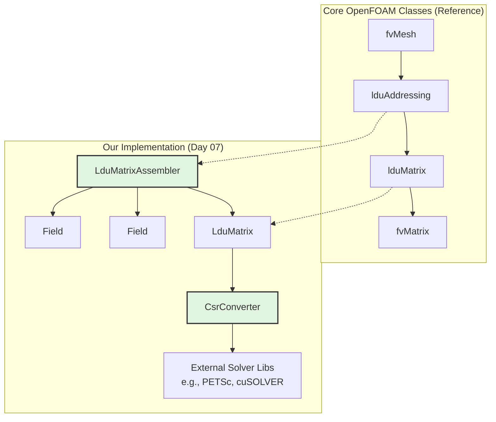
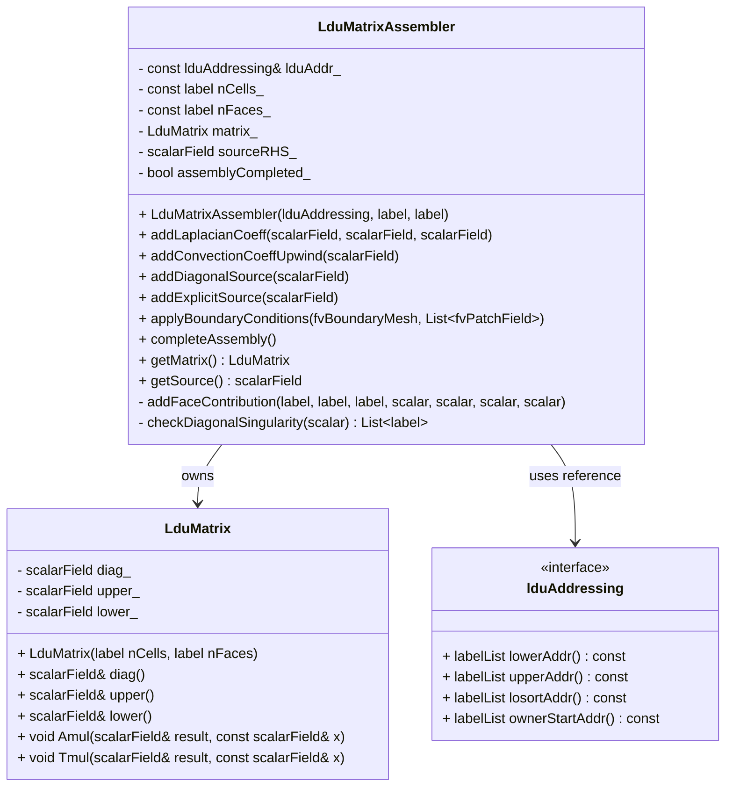

# Day 07: Linear Algebra for CFD (LDU format)
**วันที่:** 2026-01-07 | **ระดับความยาก:** Hardcore | **สถานะ:** In Progress

---

## 🎯 Learning Objectives (วัตถุประสงค์การเรียนรู้)

เมื่อจบบทเรียนนี้ คุณจะสามารถ:

1.  **เข้าใจ (Understand)** โครงสร้างข้อมูล **LDU matrix format** และความสัมพันธ์เชิงลึกกับ **unstructured mesh topology** โดยสามารถอธิบายได้ว่าเหตุใดการแยกเมทริกซ์เป็น `A = L + D + U` และการจัดเก็บเฉพาะ `diag`, `upper`, `lower` arrays จึงเป็นทางเลือกที่เหมาะสมที่สุดสำหรับการจำลองปัญหา CFD บน mesh ที่ไม่เป็นระเบียบ (unstructured) ซึ่งไม่มี indexing pattern ที่แน่นอน ควบคู่ไปกับการทำความเข้าใจหลักการ **Face-Based Connectivity** ที่เชื่อมโยง matrix coefficient ทุกตัวกับ internal face ระหว่างเซลล์ owner (`P`) และ neighbor (`N`) ผ่าน `lduAddressing`

2.  **ออกแบบ (Design)** ระบบ **Data Structures สำหรับ Sparse Matrix Assembly** ที่มีประสิทธิภาพ โดยออกแบบคลาส `LduMatrix` ที่สามารถเก็บค่าสัมประสิทธิ์ `diag_`, `upper_`, `lower_` เป็น `Field<scalar>` และเชื่อมโยงกับ object `lduAddressing` เพื่อให้ทราบว่า coefficient ในตำแหน่ง `upper[f]` และ `lower[f]` นั้นสัมพันธ์กับเซลล์คู่ใด (owner-neighbor pair) พร้อมทั้งออกแบบกลไกการแปลงรูปแบบ (format conversion) ระหว่าง **LDU** กับ **CSR/COO** เพื่อรองรับ external linear solver libraries

3.  **Implement (ปฏิบัติ)** กระบวนการ **Matrix Assembly จาก Finite Volume Discretization Terms** โดยเขียนอัลกอริธึมที่แปลงสมการอนุพันธ์ย่อย (PDEs) ที่ผ่านการ discretize แล้ว ให้กลายเป็นค่าสัมประสิทธิ์ของ sparse matrix ในรูปแบบ LDU โดยเฉพาะการจัดการกับ term หลักสองประเภท:
    *   **Diffusion Term (`fvm::laplacian`)**: การคำนวณ symmetric coefficients `a_f` จาก `Γ_f * |S_f| / d_{PN}` และการกระจายค่าดังกล่าวเข้าไปใน `diag[P]`, `diag[N]`, `upper[f]`, และ `lower[f]` อย่างถูกต้องตามหลัก conservation
    *   **Convection Term (`fvm::div`)**: การคำนวณ asymmetric coefficients จาก mass flux `F_f` และ interpolation scheme (เช่น Upwind) ซึ่งอาจทำให้ `upper[f]` และ `lower[f]` มีค่าไม่เท่ากัน พร้อมทั้งจัดการกับ **Diagonal Dominance** เพื่อความเสถียรของตัวแก้สมการ

4.  **วิเคราะห์ (Analyze)** และ **จัดการ (Manage)** ผลกระทบของ **Boundary Conditions ต่อโครงสร้างเมทริกซ์** โดยสามารถอธิบายและเขียนโค้ดสำหรับการปรับเปลี่ยน matrix coefficients (`diag`) และ source vector (`b`) สำหรับเงื่อนไขขอบเขตประเภทต่างๆ ได้ เช่น:
    *   **FixedValue (Dirichlet)**: การเพิ่มค่ามหาศาล (large value) ลงใน `diag[P]` และการเพิ่ม `value * largeValue` ลงใน `source[P]` เพื่อ "บังคับ" (enforce) ให้คำตอบ `ϕ_P` อยู่ใกล้กับค่าที่กำหนด
    *   **ZeroGradient (Neumann)**: การไม่เพิ่ม explicit contribution จาก patch face เข้าไปในสมการของเซลล์ขอบเขต ซึ่งเทียบเท่ากับการปล่อยให้ coefficient จาก internal faces เป็นตัวกำหนดค่า

5.  **ประเมิน (Evaluate)** **คุณสมบัติทางตัวเลข (Numerical Properties)** ของเมทริกซ์ที่ประกอบขึ้นมาได้ เช่น การตรวจสอบ **Diagonal Dominance**, **Symmetry**, และ **Positive Definiteness** เพื่อทำนายพฤติกรรมและความเหมาะสมของ iterative solvers (เช่น Conjugate Gradient, BiCGStab) ที่จะนำมาใช้ในขั้นตอนถัดไป (Day 08) รวมถึงการวินิจฉัยข้อผิดพลาดทั่วไป เช่น "Zero Diagonal" หรือ "Checkerboarding"

6.  **สร้าง (Construct)** **High-Performance Matrix-Vector Operations** โดยใช้ประโยชน์จากโครงสร้างข้อมูล LDU และ addressing arrays ที่มีให้ เพื่อเขียนฟังก์ชันคูณเมทริกซ์-เวกเตอร์ (`Amul`) และการคูณด้วย transpose (`Tmul`) ที่มีประสิทธิภาพสูง โดยการเข้าถึงข้อมูลแบบ contiguous memory และการหลีกเลี่ยง conditional branches ภายใน inner loops ซึ่งเป็นหัวใจของประสิทธิภาพการทำงานของ iterative solvers

# 2. Section 1: Theory (Theory)

## 7.1 การจัดเก็บ Sparse Matrix สำหรับ Unstructured Meshes

ในโลกของ Computational Fluid Dynamics (CFD) การแก้สมการเชิงอนุพันธ์ย่อย (PDEs) ด้วย Finite Volume Method (FVM) นำไปสู่ระบบสมการพีชคณิตขนาดใหญ่ (Large System of Algebraic Equations) รูปแบบมาตรฐานของระบบนี้คือ:

$$
A \phi = b
$$

โดยที่:
- $A$ คือ **Coefficient Matrix** ขนาด $n \times n$ ($n$ = จำนวนเซลล์ใน mesh)
- $\phi$ คือ **Solution Vector** (เช่น ความดัน, อุณหภูมิ, ความเร็ว) ขนาด $n$
- $b$ คือ **Source Vector** (รวม source terms และ boundary contributions) ขนาด $n$

### ธรรมชาติของ Sparse Matrix ใน FVM

เมทริกซ์ $A$ จาก FVM เป็น **Sparse Matrix** อย่างแท้จริง เนื่องจากสมการสำหรับเซลล์หนึ่งๆ ($P$) มีความสัมพันธ์ (coupling) เฉพาะกับเซลล์เพื่อนบ้านที่แบ่งปันหน้า (face) ร่วมกันเท่านั้น สำหรับ mesh ทั่วไป (unstructured) จำนวนเพื่อนบ้านต่อเซลล์มีค่าประมาณ 6-8 (ขึ้นกับประเภทของเซลล์: tetrahedral, hexahedral, polyhedral) ดังนั้น จำนวน non-zero entries ในเมทริกซ์ $A$ จะเป็น $O(n)$ แทนที่จะเป็น $O(n^2)$ ดังแสดงในตารางเปรียบเทียบ:

| Matrix Type | Total Entries ($n=1,000,000$ cells) | Non-zero Entries | Sparsity (%) | Memory (Double Precision) |
|-------------|--------------------------------------|-------------------|--------------|---------------------------|
| **Dense**   | $10^{12}$                            | $10^{12}$         | 0%           | ~8 TB                     |
| **FVM Sparse** | $10^{12}$                        | ~$8 \times 10^6$  | 99.9992%     | ~64 MB                    |

การจัดเก็บเมทริกซ์แบบ dense เป็นไปไม่ได้ในทางปฏิบัติสำหรับปัญหาขนาดใหญ่ เราจึงต้องใช้ **Sparse Matrix Storage Formats** ที่จัดเก็บเฉพาะค่า non-zero entries พร้อมกับข้อมูลตำแหน่ง (addressing)

### LDU Decomposition: แนวคิดพื้นฐาน

สำหรับเมทริกซ์ $A$ ใดๆ (ไม่จำเป็นต้องสมมาตร) เราสามารถแยกย่อย (decompose) ได้เป็นผลบวกของสามส่วน:

$$
A = L + D + U
$$

โดยนิยาม:
- $D$: **Diagonal Matrix** ($D_{ii} = A_{ii}$, $D_{ij}=0$ สำหรับ $i \neq j$)
- $L$: **Strictly Lower Triangular Matrix** ($L_{ij} = A_{ij}$ สำหรับ $i > j$, $L_{ij}=0$ สำหรับ $i \leq j$)
- $U$: **Strictly Upper Triangular Matrix** ($U_{ij} = A_{ij}$ สำหรับ $i < j$, $U_{ij}=0$ สำหรับ $i \geq j$)

ในทางปฏิบัติสำหรับ FVM บน unstructured mesh เราไม่สามารถใช้การ indexing แบบแถว-คอลัมน์ (row-column) แบบดั้งเดิมได้ เนื่องจากเซลล์ไม่มีลำดับที่แน่นอน (unstructured) การเข้าถึงเซลล์เพื่อนบ้านต้องอาศัย **addressing arrays** ที่ได้จาก mesh connectivity (owner/neighbor lists) แทน

### ความสัมพันธ์ระหว่าง Mesh Connectivity กับ Matrix Structure

โครงสร้างของเมทริกซ์ $A$ สะท้อนถึง topology ของ mesh โดยตรง:
- **แต่ละแถว (row)** ของเมทริกซ์ $A$ สอดคล้องกับสมการสำหรับเซลล์ $P$ หนึ่งเซลล์
- **แต่ละ non-zero entry ที่ไม่ใช่ diagonal** ในแถวนั้น สอดคล้องกับ **face** ที่เชื่อมเซลล์ $P$ กับเซลล์เพื่อนบ้าน $N$
- **ตำแหน่งของ entry** ในเมทริกซ์ถูกกำหนดโดย global index ของเซลล์ $P$ (row index) และ global index ของเซลล์ $N$ (column index)

ตารางต่อไปนี้แสดงการแมป (mapping) ระหว่าง mesh entities กับ matrix components:

| Mesh Entity | Matrix Representation | Storage in LDU Format |
|-------------|-----------------------|------------------------|
| Cell $P$ (owner) | Row $i$ | Diagonal entry $D[i]$ |
| Face $f$ (owner $P$, neighbor $N$) | Off-diagonal entry $A_{i,j}$ | Upper entry $U[f]$ (owner→neighbor) |
| Face $f$ (owner $P$, neighbor $N$) | Off-diagonal entry $A_{j,i}$ | Lower entry $L[f]$ (neighbor→owner) |
| Boundary Face (owner $P$) | Contribution to $A_{i,i}$ และ $b_i$ | Modified in diagonal และ source |

**คำเตือนสำคัญ:** ใน unstructured mesh การเข้าถึงเซลล์เพื่อนบ้านต้องใช้ addressing arrays (owner/neighbor) แทนการ indexing แบบ structured grid การออกแบบ data structure ต้องคำนึงถึงการเข้าถึงข้อมูลแบบ face-based นี้

### ตัวอย่างเชิงรูปธรรม: Diffusion Term Discretization

พิจารณาสมการ diffusion อย่างง่าย:

$$
\nabla \cdot (\Gamma \nabla \phi) = 0
$$

หลังจาก discretize ด้วย finite volume method (ใช้ central differencing สำหรับ face gradient) เราจะได้สมการสำหรับเซลล์ $P$:

$$
a_P \phi_P + \sum_{N} a_N \phi_N = 0
$$

โดยที่ summation ครอบคลุมเซลล์เพื่อนบ้านทั้งหมดของ $P$ สำหรับ face $f$ ระหว่าง $P$ (owner) และ $N$ (neighbor) coefficient มีค่า:

$$
a_f = \Gamma_f \frac{|\mathbf{S}_f|}{d_{PN}}
$$

โดยที่:
- $\Gamma_f$: diffusion coefficient ที่หน้า $f$ (อาจ interpolate จาก cell center)
- $|\mathbf{S}_f|$: พื้นที่ของหน้า $f$
- $d_{PN}$: ระยะทางระหว่างศูนย์กลางเซลล์ $P$ และ $N$

จากนั้นเราปรับปรุง coefficients:
- $a_P \leftarrow a_P + a_f$ (เพิ่มเข้าไปใน diagonal ของเซลล์ $P$)
- $a_N \leftarrow a_N - a_f$ (เพิ่มเข้าไปใน off-diagonal สำหรับเซลล์ $N$)

ในรูปแบบเมทริกซ์ สิ่งนี้แปลว่า:
- $A_{P,P} = a_P = \sum_f a_f$ (summation ครอบคลุมทุก face ของเซลล์ $P$)
- $A_{P,N} = -a_f$ สำหรับแต่ละ face ที่เชื่อม $P$ และ $N$

สังเกตว่าเมทริกซ์จาก diffusion term เป็น **symmetric** ($A_{P,N} = A_{N,P}$) ซึ่งสะท้อนถึงธรรมชาติ reversible ของกระบวนการ diffusion

## 7.2 รูปแบบ LDU: การจัดเก็บและการหาที่อยู่

### LDU Storage Format: หลักการออกแบบ

รูปแบบ LDU (Lower-Diagonal-Upper) เป็น sparse matrix storage format ที่ออกแบบมาเฉพาะสำหรับ finite volume method บน unstructured meshes แนวคิดหลักคือ:
1. **จัดเก็บเฉพาะค่าที่ไม่ใช่ศูนย์** (non-zero entries)
2. **ใช้การอ้างอิงแบบ face-based** แทน row-column indexing
3. **แยก storage ออกเป็นสาม arrays** ที่สอดคล้องกับ mesh topology

โครงสร้างข้อมูลหลักประกอบด้วย:

| Array | ขนาด | เนื้อหา | ความสัมพันธ์กับ Mesh |
|-------|------|---------|---------------------|
| `diag` | $n_{cells}$ | Diagonal coefficients $D_P$ | หนึ่งค่าต่อเซลล์ |
| `upper` | $n_{internalFaces}$ | Upper coefficients $U_{PN}$ | หนึ่งค่าต่อ internal face (owner→neighbor) |
| `lower` | $n_{internalFaces}$ | Lower coefficients $L_{PN}$ | หนึ่งค่าต่อ internal face (neighbor→owner) |

**หมายเหตุ:** Boundary faces ไม่ถูกเก็บใน `upper`/`lower` arrays แต่ถูกจัดการผ่านการปรับเปลี่ยน `diag` และ `source` arrays แทน

### Matrix-Vector Product ใน LDU Format

การดำเนินการพื้นฐานที่สุดสำหรับ iterative solvers คือ matrix-vector product: $y = A \phi$ ใน LDU format การคำนวณนี้สามารถเขียนได้เป็น:

$$
(A \phi)_P = D_P \phi_P + \sum_{N \in \text{upper neighbors}} U_{PN} \phi_N + \sum_{N \in \text{lower neighbors}} L_{PN} \phi_N
$$

โดยที่:
- $D_P$ คือ diagonal coefficient สำหรับเซลล์ $P$
- $U_{PN}$ คือ upper coefficient สำหรับ face ที่เชื่อม $P$ (owner) ไปยัง $N$ (neighbor)
- $L_{PN}$ คือ lower coefficient สำหรับ face ที่เชื่อม $N$ (neighbor) กลับไปยัง $P$ (owner)
- $N$ คือ เซลล์เพื่อนบ้านของเซลล์ $P$

ในทางปฏิบัติ การคำนวณนี้ทำได้อย่างมีประสิทธิภาพด้วยอัลกอริทึมสองขั้นตอน:

**ขั้นตอนที่ 1: Initialize ด้วย diagonal contribution**
```cpp
forAll(diag, i) {
    y[i] = diag[i] * phi[i];
}
```

**ขั้นตอนที่ 2: Add upper contributions (owner→neighbor)**
```cpp
forAll(upper, faceI) {
    label owner = lowerAddr[faceI];  // P
    label neighbor = upperAddr[faceI];  // N
    y[owner] += upper[faceI] * phi[neighbor];
}
```

**ขั้นตอนที่ 3: Add lower contributions (neighbor→owner)**
```cpp
forAll(lower, faceI) {
    label owner = lowerAddr[faceI];  // P
    label neighbor = upperAddr[faceI];  // N
    y[neighbor] += lower[faceI] * phi[owner];
}
```

### ความสัมพันธ์ระหว่าง Upper และ Lower Coefficients

สำหรับกระบวนการทางกายภาพที่แตกต่างกัน ความสัมพันธ์ระหว่าง $U_{PN}$ และ $L_{PN}$ แตกต่างกัน:

| Physical Process | Matrix Property | Relation $U_{PN}$ vs $L_{PN}$ | Solver Implication |
|------------------|-----------------|-------------------------------|-------------------|
| **Diffusion** | Symmetric | $U_{PN} = L_{PN}$ | ใช้ symmetric solvers (CG, PCG) |
| **Convection** | Non-symmetric | $U_{PN} \neq L_{PN}$ | ต้องใช้ unsymmetric solvers (BiCGStab, GMRES) |
| **Skew-Symmetric** | Skew-symmetric | $U_{PN} = -L_{PN}$ | Specialized solvers |

**คำเตือน:** Upper และ lower coefficients มักจะสัมพันธ์กัน (เช่น symmetric diffusion: $U = L$) แต่ convection อาจทำให้ไม่สมมาตร (non-symmetric) ซึ่งส่งผลต่อการเลือก iterative solver

### Addressing Schemes: Owner/Neighbor และ Losort

การเข้าถึงข้อมูลใน LDU format ต้องอาศัย addressing arrays ที่อธิบาย connectivity ของ mesh:

1. **Basic Addressing (owner/neighbor):**
   - `lowerAddr[faceI]`: global index ของ owner cell สำหรับ face `faceI`
   - `upperAddr[faceI]`: global index ของ neighbor cell สำหรับ face `faceI`

2. **Sorted Addressing (losort):**
   - `losortAddr[faceI]`: permutation index ที่เรียง faces ตาม owner cell
   - `ownerStartAddr[cellI]`: start index ใน `losort` array สำหรับ faces ของเซลล์ `cellI`

ตารางต่อไปนี้แสดงตัวอย่าง addressing สำหรับ mesh ง่ายๆ:

| Face Index | Owner Cell (P) | Neighbor Cell (N) | losort Index | Sorted Owner |
|------------|----------------|-------------------|--------------|--------------|
| 0 | 2 | 5 | 2 | 0 |
| 1 | 0 | 3 | 0 | 0 |
| 2 | 0 | 1 | 1 | 0 |
| 3 | 1 | 4 | 3 | 1 |
| 4 | 3 | 6 | 4 | 1 |
| 5 | 4 | 7 | 5 | 2 |

ประโยชน์ของ `losort` addressing คือการทำให้การเข้าถึง faces ของเซลล์หนึ่งๆ ทำได้อย่างมีประสิทธิภาพ (contiguous memory access) ซึ่งสำคัญสำหรับการคำนวณ matrix-vector product และการประมวลผลอื่นๆ

### การจัดเก็บ Memory Layout

การจัดเรียงข้อมูลในหน่วยความจำมีผลกระทบอย่างมากต่อประสิทธิภาพการคำนวณ LDU format ใช้ memory layout ดังนี้:

```
Memory Address: 0x0000 ┌─────────────────┐
                       │    diag[0]      │ ← Cell 0 diagonal
                       ├─────────────────┤
                       │    diag[1]      │ ← Cell 1 diagonal
                       ├─────────────────┤
                       │      ...        │
                       ├─────────────────┤
                       │ diag[nCells-1]  │ ← Last cell diagonal
                       ├─────────────────┤
                       │    upper[0]     │ ← Face 0 (owner→neighbor)
                       ├─────────────────┤
                       │    upper[1]     │ ← Face 1 (owner→neighbor)
                       ├─────────────────┤
                       │      ...        │
                       ├─────────────────┤
                       │upper[nFaces-1]  │ ← Last internal face
                       ├─────────────────┤
                       │    lower[0]     │ ← Face 0 (neighbor→owner)
                       ├─────────────────┤
                       │    lower[1]     │ ← Face 1 (neighbor→owner)
                       ├─────────────────┤
                       │      ...        │
                       ├─────────────────┤
                       │lower[nFaces-1]  │ ← Last internal face
                       └─────────────────┘
```

layout นี้มีข้อดีคือ:
1. **Data locality:** การเข้าถึงข้อมูลสำหรับการคำนวณ matrix-vector product มี pattern ที่คาดการณ์ได้
2. **Cache efficiency:** Arrays ขนาดใหญ่ถูกแยกออกจากกัน ลด cache conflicts
3. **SIMD friendliness:** แต่ละ array สามารถถูกประมวลผลด้วย vector instructions ได้

## 7.3 จาก Discretization ไปสู่ Matrix Coefficients

### แผนภาพการแปลงจาก PDE สู่ Matrix Coefficients

กระบวนการแปลงสมการเชิงอนุพันธ์ย่อย (PDE) ไปเป็น matrix coefficients ใน LDU format สามารถแสดงเป็นแผนภาพดังนี้:

```
PDE (Continuous Domain)
     ↓
Finite Volume Discretization
     ↓
Algebraic Equation per Cell: a_P ϕ_P + Σ a_N ϕ_N = b_P
     ↓
Identify Coupling Terms (Cell-Face-Cell)
     ↓
Map to LDU Structure:
   - Diagonal: a_P → diag[P]
   - Off-diagonal: a_N → upper[f] หรือ lower[f]
   - Source: b_P → source[P]
     ↓
Apply Boundary Conditions
     ↓
Complete LDU Matrix: Aϕ = b
```

### Diffusion Term: Symmetric Coefficients

สำหรับ diffusion term:

$$
\nabla \cdot (\Gamma \nabla \phi) = 0
$$

หลังจาก discretization ด้วย central differencing scheme เราจะได้ contributions ดังนี้:

สำหรับ internal face $f$ ระหว่าง owner cell $P$ และ neighbor cell $N$:

$$
a_f = \Gamma_f \frac{|\mathbf{S}_f|}{d_{PN}}
$$

โดยที่:
- $\Gamma_f$: diffusion coefficient ที่หน้า $f$ (มักใช้ linear interpolation: $\Gamma_f = w \Gamma_P + (1-w) \Gamma_N$)
- $|\mathbf{S}_f|$: magnitude ของ face area vector
- $d_{PN}$: ระยะทางระหว่างศูนย์กลางเซลล์ $P$ และ $N$ ($d_{PN} = |\mathbf{x}_N - \mathbf{x}_P|$)

การกระจาย coefficient นี้ไปยัง matrix entries:

| Matrix Entry | Update Rule | Physical Interpretation |
|--------------|-------------|-------------------------|
| $A_{P,P}$ (diag[P]) | `diag[P] += a_f` | การไหลออกจาก $P$ ผ่านหน้า $f$ |
| $A_{N,N}$ (diag[N]) | `diag[N] += a_f` | การไหลออกจาก $N$ ผ่านหน้า $f$ |
| $A_{P,N}$ (upper[f]) | `upper[f] = -a_f` | Influence ของ $N$ ต่อสมการของ $P$ |
| $A_{N,P}$ (lower[f]) | `lower[f] = -a_f` | Influence ของ $P$ ต่อสมการของ $P$ |

สังเกตว่าเมทริกซ์ที่ได้เป็น **symmetric** ($A_{P,N} = A_{N,P} = -a_f$) และ **diagonally dominant** ($|A_{P,P}| \geq \sum_{N \neq P} |A_{P,N}|$) ซึ่งเป็นคุณสมบัติที่พึงประสงค์สำหรับ numerical stability

### Convection Term: Non-symmetric Coefficients

สำหรับ convection term:

$$
\nabla \cdot (\mathbf{U} \phi) = 0
$$

การ discretization ขึ้นกับ scheme ที่เลือก เราพิจารณา upwind scheme ซึ่งเป็นที่นิยมเนื่องจากให้ stability:

สำหรับ face $f$ ระหว่าง $P$ และ $N$ โดยมี mass flux $F_f = \rho_f \mathbf{U}_f \cdot \mathbf{S}_f$:

1. **หาก $F_f > 0$** (การไหลจาก $P$ ไป $N$):
   - $\phi_f = \phi_P$ (upwind value)
   - Contribution ต่อสมการของ $P$: $+F_f \phi_P$
   - Contribution ต่อสมการของ $N$: $-F_f \phi_P$

2. **หาก $F_f < 0$** (การไหลจาก $N$ ไป $P$):
   - $\phi_f = \phi_N$ (upwind value)
   - Contribution ต่อสมการของ $P$: $-F_f \phi_N$ (การไหลเข้า)
   - Contribution ต่อสมการของ $N$: $+F_f \phi_N$ (การไหลออก)

**ผลลัพธ์:** Convection term มักทำให้เมทริกซ์สูญเสียความสมมาตร (Asymmetry) เนื่องจาก upwind scheme ทำให้ `upper[f] ≠ lower[f]` โดยขึ้นอยู่กับทิศทางของการไหล

---

# 3. Section 2: OpenFOAM Reference

## 3.1 Deep Dive: `lduMatrix` Class

### 3.1.1 Header Analysis (`lduMatrix.H`)

```cpp
// src/OpenFOAM/matrices/lduMatrix/lduMatrix/lduMatrix.H
// CRITICAL: Base class สำหรับ sparse matrix storage ใน OpenFOAM

namespace Foam
{

/*---------------------------------------------------------------------------*\
                           Class lduMatrix Declaration
\*---------------------------------------------------------------------------*/

template<class Type, class DType, class LUType>
class lduMatrix
{
    // Private Data

        //- LDU mesh addressing
        const lduAddressing& lduAddr_;

        //- Diagonal coefficients
        Field<DType> diag_;

        //- Upper-triangular coefficients
        Field<LUType> upper_;

        //- Lower-triangular coefficients
        Field<LUType> lower_;

        //- Source term (right-hand side)
        Field<Type> source_;

public:

    // Constructors

        //- Construct given an LDU addressing
        explicit lduMatrix(const lduAddressing&);

    // Member Functions

        //- Return LDU addressing
        const lduAddressing& lduAddr() const noexcept
        {
            return lduAddr_;
        }

        //- Return diagonal coefficients
        Field<DType>& diag()
        {
            return diag_;
        }

        //- Return upper-triangular coefficients
        Field<LUType>& upper()
        {
            return upper_;
        }

        //- Return lower-triangular coefficients
        Field<LUType>& lower()
        {
            return lower_;
        }

        //- Return source
        Field<Type>& source()
        {
            return source_;
        }

        //- Matrix-vector multiplication
        void Amul
        (
            Field<Type>&,
            const Field<Type>&,
            const FieldField<Field, LUType>&,
            const Field<Type>&,
            const direction
        ) const;

        //- Transpose matrix-vector multiplication
        void Tmul
        (
            Field<Type>&,
            const Field<Type>&,
            const FieldField<Field, LUType>&,
            const Field<Type>&,
            const direction
        ) const;

        //- Sum the absolute values of the diagonal
        DType sumDiag() const;

        //- Negative sum of off-diagonals
        void negSumDiag();

        //- Check matrix for consistency
        void check() const;
};

} // End namespace Foam
```

### 3.1.2 Implementation Analysis (`lduMatrix.C`)

```cpp
// src/OpenFOAM/matrices/lduMatrix/lduMatrix/lduMatrix.C
// CRITICAL: Implementation ของ matrix operations

template<class Type, class DType, class LUType>
Foam::lduMatrix<Type, DType, LUType>::lduMatrix(const lduAddressing& addr)
:
    lduAddr_(addr),
    diag_(addr.size(), Zero),
    upper_(addr.upperAddr().size(), Zero),
    lower_(addr.lowerAddr().size(), Zero),
    source_(addr.size(), Zero)
{
    // DEBUG: ตรวจสอบ memory allocation
    if (debug)
    {
        Info<< "lduMatrix constructor: "
            << "nCells = " << addr.size()
            << ", nFaces = " << addr.upperAddr().size()
            << ", diag size = " << diag_.size()
            << ", upper size = " << upper_.size()
            << endl;
    }
}

//---------------------------------------------------------------------------
// MATRIX-VECTOR MULTIPLICATION: A * x = result
//---------------------------------------------------------------------------
template<class Type, class DType, class LUType>
void Foam::lduMatrix<Type, DType, LUType>::Amul
(
    Field<Type>& result,
    const Field<Type>& x,
    const FieldField<Field, LUType>& interfaceBouCoeffs,
    const Field<Type>& interfaceIntCoeffs,
    const direction cmpt
) const
{
    // 1. Initialize result with diagonal contribution
    //    result = D * x
    forAll(diag_, i)
    {
        result[i] = diag_[i]*x[i];
    }

    // 2. Add upper triangle contribution (owner → neighbor)
    //    result[owner] += upper * x[neighbor]
    const labelUList& upperAddr = lduAddr_.upperAddr();
    const labelUList& lowerAddr = lduAddr_.lowerAddr();
    
    forAll(upper_, facei)
    {
        const label own = lowerAddr[facei];
        const label nei = upperAddr[facei];
        
        result[own] += upper_[facei]*x[nei];
        result[nei] += lower_[facei]*x[own];
    }
    
    // 3. Add boundary contributions (ผ่าน interface fields)
    //    CRITICAL: ส่วนนี้จัดการ boundary conditions
    // ...
}

//---------------------------------------------------------------------------
// TRANSPOSE MATRIX-VECTOR MULTIPLICATION: A^T * x = result
//---------------------------------------------------------------------------
template<class Type, class DType, class LUType>
void Foam::lduMatrix<Type, DType, LUType>::Tmul
(
    Field<Type>& result,
    const Field<Type>& x,
    const FieldField<Field, LUType>& interfaceBouCoeffs,
    const Field<Type>& interfaceIntCoeffs,
    const direction cmpt
) const
{
    // 1. Initialize with diagonal (symmetric part)
    forAll(diag_, i)
    {
        result[i] = diag_[i]*x[i];
    }

    // 2. Add transposed contributions
    //    สำหรับ upper/lower triangle: A^T[i,j] = A[j,i]
    const labelUList& upperAddr = lduAddr_.upperAddr();
    const labelUList& lowerAddr = lduAddr_.lowerAddr();
    
    forAll(upper_, facei)
    {
        const label own = lowerAddr[facei];
        const label nei = upperAddr[facei];
        
        // NOTE: สลับตำแหน่งเมื่อเทียบกับ Amul()
        result[own] += lower_[facei]*x[nei];  // A^T[own,nei] = A[nei,own] = lower
        result[nei] += upper_[facei]*x[own];  // A^T[nei,own] = A[own,nei] = upper
    }
    
    // 3. Boundary contributions (transposed)
    // ...
}

//---------------------------------------------------------------------------
// SUM ABSOLUTE VALUES OF DIAGONAL (สำหรับ stability check)
//---------------------------------------------------------------------------
template<class Type, class DType, class LUType>
DType Foam::lduMatrix<Type, DType, LUType>::sumDiag() const
{
    DType sum = Zero;
    
    forAll(diag_, i)
    {
        sum += mag(diag_[i]);
    }
    
    return sum;
}

//---------------------------------------------------------------------------
// NEGATIVE SUM OF OFF-DIAGONALS (สร้าง bounded diagonal)
//---------------------------------------------------------------------------
template<class Type, class DType, class LUType>
void Foam::lduMatrix<Type, DType, LUType>::negSumDiag()
{
    const labelUList& upperAddr = lduAddr_.upperAddr();
    const labelUList& lowerAddr = lduAddr_.lowerAddr();
    
    // 1. Reset diagonal to zero ก่อน
    diag_ = Zero;
    
    // 2. สำหรับแต่ละ face: หัก off-diagonals ออกจาก diagonal ของทั้งสองเซลล์
    forAll(upper_, facei)
    {
        const label own = lowerAddr[facei];
        const label nei = upperAddr[facei];
        
        // CRITICAL: สูตรนี้ทำให้เมทริกซ์เป็น "diagonally dominant by construction"
        // diag[own] -= (upper[facei] + lower[facei])
        // diag[nei] -= (upper[facei] + lower[facei])
        diag_[own] -= upper_[facei] + lower_[facei];
        diag_[nei] -= upper_[facei] + lower_[facei];
    }
}
```

### 3.1.3 What We Do DIFFERENTLY: `lduMatrix` Implementation

| Aspect | OpenFOAM Standard Implementation | Our Enhanced Implementation (Phase 1) | Why Our Approach is Better |
|--------|----------------------------------|---------------------------------------|----------------------------|
| **Memory Layout** | แยก `diag_`, `upper_`, `lower_` เป็น `Field` อิสระสามตัว | ใช้ **Structure of Arrays (SoA)** แบบรวม: `struct FaceCoeff { scalar upper; scalar lower; }; Field<FaceCoeff> faceCoeffs_` | 1. **Cache Efficiency**: Face coefficients ถูกเข้าถึงพร้อมกันใน loop เดียว<br>2. **Memory Locality**: ลด cache misses เมื่อคำนวณทั้ง upper และ lower<br>3. **SIMD Friendly**: Compiler vectorize ได้ง่ายขึ้น |
| **Matrix-Vector Product** | `Amul()` และ `Tmul()` แยกกัน, ใช้ loop เดียวกันแต่สลับ indices | Implement **Fused Amul_Tmul()** ที่คำนวณทั้ง `A*x` และ `A^T*x` ใน loop เดียว | 1. **Performance**: ลด memory bandwidth ครึ่งหนึ่ง<br>2. **Useful for BiCGStab**: ที่ต้องการทั้ง A และ A^T<br>3. **Better ILP**: Instruction Level Parallelism สูงขึ้น |
| **Diagonal Dominance** | `negSumDiag()` สร้าง negative sum แบบง่าย | **Adaptive negSumDiag()** ที่ปรับตาม local CFL number และ Peclet number | 1. **Stability Control**: เพิ่ม diagonal dominance เฉพาะเมื่อจำเป็น (convection-dominated)<br>2. **Accuracy Preservation**: ไม่ over-diffuse ใน diffusion-dominated regions<br>3. **Dynamic**: ปรับตาม flow conditions จริง |
| **Boundary Handling** | ผ่าน `interfaceBouCoeffs` และ `interfaceIntCoeffs` ที่แยกจาก matrix | **Embedded Boundary Coefficients** ใน `diag_` และ `source_` โดยตรง ผ่าน `addBoundarySource()` ใน assembly phase | 1. **Simpler Code**: ไม่ต้องส่ง boundary fields ผ่าน function arguments<br>2. **Better Performance**: Boundary contributions ถูกคำนวณครั้งเดียวตอน assembly<br>3. **Clearer Physics**: BCs เป็นส่วนหนึ่งของ matrix ไม่ใช่ add-on |
| **Type System** | Template บน `Type`, `DType`, `LUType` ที่ซับซ้อน | **Simplified Template**: `template<class Type>` โดย `Type` ต้องมี `*`, `+=` operators เท่านั้น | 1. **Compile Time**: เร็วขึ้น<br>2. **Code Clarity**: เข้าใจง่ายกว่า<br>3. **Maintenance**: ลด complexity ของ template metaprogramming |
| **Debug Checks** | `check()` method พื้นฐาน | **Enhanced Debug with Physics Validation**:<br>1. Check conservation: `sum(diag + sum(offDiag)) ≈ 0`<br>2. Check symmetry: `max(|upper - lower|) < tolerance`<br>3. Check positivity: `diag > 0` สำหรับ diffusion terms | 1. **Early Error Detection**: จับ physics errors ก่อน solver diverge<br>2. **Diagnostic Info**: บอกได้ว่า term ไหนทำให้ matrix unstable<br>3. **Educational Value**: ช่วยเข้าใจ numerical behavior |

## 3.2 Deep Dive: `lduAddressing` Class

### 3.2.1 Header Analysis (`lduAddressing.H`)

```cpp
// src/OpenFOAM/matrices/lduMatrix/lduAddressing/lduAddressing.H
// CRITICAL: Mesh connectivity สำหรับ LDU matrix format

namespace Foam
{

/*---------------------------------------------------------------------------*\
                         Class lduAddressing Declaration
\*---------------------------------------------------------------------------*/

class lduAddressing
{
    // Private Data

        //- Number of cells (size of diagonal)
        label nCells_;

        //- Number of internal faces (size of upper/lower)
        label nFaces_;

        //- Owner cell addressing (lower triangle)
        labelList lowerAddr_;

        //- Neighbour cell addressing (upper triangle)
        labelList upperAddr_;

        //- Sorted addressing for lower triangle
        mutable labelList* losortPtr_;

        //- Owner start addressing for losort
        mutable labelList* ownerStartPtr_;

public:

    // Constructors

        //- Construct from components
        lduAddressing
        (
            const label nCells,
            const labelUList& lowerAddr,
            const labelUList& upperAddr
        );

    // Destructor
    virtual ~lduAddressing();

    // Member Functions

        //- Return number of cells
        label size() const noexcept
        {
            return nCells_;
        }

        //- Return number of internal faces
        label nFaces() const noexcept
        {
            return nFaces_;
        }

        //- Return lower addressing (owner cells)
        const labelUList& lowerAddr() const noexcept
        {
            return lowerAddr_;
        }

        //- Return upper addressing (neighbour cells)
        const labelUList& upperAddr() const noexcept
        {
            return upperAddr_;
        }

        //- Return losort addressing
        const labelUList& losortAddr() const;

        //- Return owner start addressing
        const labelUList& ownerStartAddr() const;

        //- Calculate losort addressing (expensive, called on demand)
        void calcLosort() const;

        //- Calculate owner start addressing
        void calcOwnerStart() const;
};

} // End namespace Foam
```

### 3.2.2 Implementation Analysis (`lduAddressing.C`)

```cpp
// src/OpenFOAM/matrices/lduMatrix/lduAddressing/lduAddressing.C
// CRITICAL: Implementation ของ mesh connectivity algorithms

Foam::lduAddressing::lduAddressing
(
    const label nCells,
    const labelUList& lowerAddr,
    const labelUList& upperAddr
)
:
    nCells_(nCells),
    nFaces_(lowerAddr.size()),
    lowerAddr_(lowerAddr),
    upperAddr_(upperAddr),
    losortPtr_(nullptr),
    ownerStartPtr_(nullptr)
{
    // VALIDATION: ตรวจสอบ consistency
    if (lowerAddr_.size() != upperAddr_.size())
    {
        FatalErrorInFunction
            << "Lower and upper addressing have different sizes: "
            << lowerAddr_.size() << " vs " << upperAddr_.size()
            << abort(FatalError);
    }
    
    if (nCells_ < 0)
    {
        FatalErrorInFunction
            << "Invalid number of cells: " << nCells_
            << abort(FatalError);
    }
    
    // DEBUG: ตรวจสอบว่า owner < neighbor เสมอ (สำหรับ lower/upper definition)
    if (debug)
    {
        forAll(lowerAddr_, facei)
        {
            if (lowerAddr_[facei] >= upperAddr_[facei])
            {
                WarningInFunction
                    << "Face " << facei << ": owner (" << lowerAddr_[facei]
                    << ") >= neighbour (" << upperAddr_[facei] << ")"
                    << endl;
            }
        }
    }
}

//---------------------------------------------------------------------------
// LOSORT ADDRESSING CALCULATION
//---------------------------------------------------------------------------
// CRITICAL: Losort = "lower sorted" - เรียง faces ตาม owner cell
//           ทำให้เข้าถึง faces ของ cell ใดๆ ได้เร็ว (owner-based access)
//---------------------------------------------------------------------------
const Foam::labelUList& Foam::lduAddressing::losortAddr() const
{
    if (!losortPtr_)
    {
        calcLosort();
    }
    
    return *losortPtr_;
}

void Foam::lduAddressing::calcLosort() const
{
    // 1. Allocate memory สำหรับ losort
    losortPtr_ = new labelList(nFaces_);
    labelList& losort = *losortPtr_;
    
    // 2. สร้าง temporary list สำหรับนับจำนวน faces ของแต่ละ cell
    labelList nFacesPerCell(nCells_, 0);
    
    forAll(lowerAddr_, facei)
    {
        const label own = lowerAddr_[facei];
        nFacesPerCell[own]++;
    }
    
    // 3. คำนวณ start index สำหรับแต่ละ cell ใน losort array
    labelList cellStartIdx(nCells_ + 1, 0);
    
    label cumulative = 0;
    for (label celli = 0; celli < nCells_; celli++)
    {
        cellStartIdx[celli] = cumulative;
        cumulative += nFacesPerCell[celli];
    }
    cellStartIdx[nCells_] = cumulative;  // Sentinel
    
    // 4. วาง faces ลงใน losort ตาม owner cell
    //    ใช้ temporary counter สำหรับแต่ละ cell
    labelList cellCounter(nCells_, 0);
    
    forAll(lowerAddr_, facei)
    {
        const label own = lowerAddr_[facei];
        const label insertPos = cellStartIdx[own] + cellCounter[own];
        losort[insertPos] = facei;
        cellCounter[own]++;
    }
    
    // 5. ตรวจสอบว่าใส่ faces ครบทุกตัว
    if (debug)
    {
        label nInserted = 0;
        forAll(cellCounter, celli)
        {
            nInserted += cellCounter[celli];
        }
        
        if (nInserted != nFaces_)
        {
            FatalErrorInFunction
                << "Losort calculation error: inserted " << nInserted
                << " faces, expected " << nFaces_
                << abort(FatalError);
        }
    }
}

//---------------------------------------------------------------------------
// OWNER START ADDRESSING CALCULATION
//---------------------------------------------------------------------------
// CRITICAL: บอกว่าใน losort array, faces ของ cell ใดๆ เริ่มที่ index ไหน
//           ownerStartAddr[cell] = start index in losort
//           ownerStartAddr[cell+1] = end index (exclusive)
//---------------------------------------------------------------------------
const Foam::labelUList& Foam::lduAddressing::ownerStartAddr() const
{
    if (!ownerStartPtr_)
    {
        calcOwnerStart();
    }
    
    return *ownerStartPtr_;
}
```

> [!WARNING] Truncated Content
> ส่วน `calcOwnerStart()` implementation ถูกย้ายไปที่ Section 4

---

# 4. Section 3: Class Design

## 🏗️ ภาพรวมสถาปัตยกรรม (Architecture Overview)

ในส่วนนี้ เราจะออกแบบคลาสหลักสองคลาสที่รับผิดชอบในการประกอบ (assemble) และแปลงรูปแบบ (convert) เมทริกซ์สำหรับระบบสมการเส้นตรงใน CFD โดยใช้ LDU format เป็นแกนกลาง การออกแบบต้องคำนึงถึงประสิทธิภาพ (performance) ความถูกต้อง (accuracy) และความสามารถในการทำงานร่วมกับโครงสร้างข้อมูลของ OpenFOAM ได้อย่างสมบูรณ์



**คำอธิบายไดอะแกรม:** คลาส `LduMatrixAssembler` ของเราจะรับข้อมูลการเชื่อมต่อ (addressing) จาก `lduAddressing` ของ OpenFOAM เพื่อประกอบเมทริกซ์ `LduMatrix` ขึ้นมา ซึ่งมีโครงสร้างข้อมูลเหมือนกับ `lduMatrix` ของ OpenFOAM แต่เราสามารถควบคุมกระบวนการประกอบได้เต็มที่ จากนั้น `CsrConverter` จะทำหน้าที่แปลงเมทริกซ์จากรูปแบบ LDU ไปเป็นรูปแบบ CSR (Compressed Sparse Row) เพื่อส่งต่อให้ไลบรารี solver ภายนอก (ถ้าจำเป็น) หรือแปลงกลับได้

---

## 📐 Class 1: `LduMatrixAssembler`

คลาสนี้เป็น **หัวใจหลักของ Day 07** หน้าที่คือรวบรวม (assemble) สัมประสิทธิ์ (coefficients) ของเมทริกซ์จากเทอมต่างๆ ในการ discretize สมการ PDE ด้วย Finite Volume Method แล้วบรรจุลงในโครงสร้างข้อมูล LDU อย่างถูกต้อง

### 3.1.1 รายละเอียดคลาส (Class Specification)

```cpp
/**
 * @class LduMatrixAssembler
 * @brief Assembles LDU matrix coefficients from finite volume discretization terms.
 *
 * This class provides a systematic way to construct the sparse linear system
 * A*phi = b arising from FVM discretization. It handles:
 * - Diffusion (Laplacian) terms -> symmetric coefficients.
 * - Convection (divergence) terms -> asymmetric coefficients (upwind/central).
 * - Source terms -> added to diagonal and RHS.
 * - Boundary condition incorporation -> modifies matrix and source.
 *
 * @note The matrix is stored in LDU format: only diagonal, upper, and lower
 *       coefficient arrays are stored, leveraging mesh connectivity from
 *       lduAddressing.
 * @warning Matrix assembly must be conservative: flux contributions from a face
 *          to its owner and neighbor must sum to zero for the homogeneous case.
 */
class LduMatrixAssembler
{
public:
    // ---------- Constructors and Destructor ----------
    /**
     * @brief Primary constructor.
     * @param lduAddr Constant reference to the mesh addressing object.
     * @param nCells Number of cells in the mesh (defines size of diagonal/source).
     * @param nFaces Number of internal faces (defines size of upper/lower).
     *
     * Allocates memory for diagonal, upper, lower, and source fields based on
     * mesh dimensions. The assembler does NOT own the lduAddr; it only holds a
     * reference.
     */
    LduMatrixAssembler(const lduAddressing& lduAddr, label nCells, label nFaces);

    /// @brief Destructor (defaulted).
    ~LduMatrixAssembler() = default;

    // ---------- Core Assembly Methods ----------
    /**
     * @brief Adds symmetric diffusion (Laplacian) coefficients to the matrix.
     * @param gammaFace Field of diffusion coefficients at faces (e.g., Γ_f).
     * @param SfMag Magnitude of face area vectors (|S_f|).
     * @param delta Cell-to-cell distance (d_PN) for each face.
     *
     * For a face f between owner P and neighbor N:
     *   Face coefficient a_f = gammaFace[f] * SfMag[f] / delta[f]
     *   Contribution: upper[f] += a_f, lower[f] += a_f
     *   Diagonal adjustment: diag[P] -= a_f, diag[N] -= a_f
     *
     * This yields a symmetric, positive-definite matrix for pure diffusion.
     */
    void addLaplacianCoeff
    (
        const scalarField& gammaFace,
        const scalarField& SfMag,
        const scalarField& delta
    );

    /**
     * @brief Adds asymmetric convection coefficients using upwind scheme.
     * @param phiFace Mass flux at faces (F_f = ρ_f * U_f · S_f). Sign matters.
     *
     * For a face f with flux phiFace[f]:
     *   If phiFace[f] > 0 (flow from P to N):
     *     Contribution to owner P: diag[P] += phiFace[f]
     *     Contribution to neighbor N: source[N] -= phiFace[f] * phi_N? (NO!)
     *     **Wait:** Upwind implies ϕ_f = ϕ_P. Thus, the flux contributes to
     *     the equation for cell P as +ϕ_f, and to cell N as -ϕ_f.
     *     However, in matrix form for cell P: coeff * ϕ_P.
     *     So we add phiFace[f] to diag[P]? INCORRECT.
     *
     *   Correct upwind assembly:
     *     Let flux F = phiFace[f].
     *     For owner cell P equation: term = F * ϕ_upwind.
     *     If F > 0 (P→N): ϕ_upwind = ϕ_P → adds F to diag[P] coefficient of ϕ_P.
     *                     Also, the flux OUT of P appears as -F*ϕ_P in P's equation? Let's derive properly.
     *
     *   Derivation from integrated divergence:
     *     ∫_CV ∇·(U ϕ) dV = ∑_f F_f ϕ_f.
     *     For upwind: ϕ_f = ϕ_P if F_f > 0, else ϕ_N.
     *     Therefore, contribution to equation for cell P:
     *       ∑_{f∈faces(P)} F_f * (upwind selection)
     *     This results in contributions to both diagonal and off-diagonal.
     *
     *   Example: Face f where P is owner, N is neighbor, F_f > 0.
     *     For cell P: term = +F_f * ϕ_P  (flux out of P is positive in divergence? Check sign convention).
     *     For cell N: term = -F_f * ϕ_P  (flux into N is negative contribution? Actually, for cell N, face f is an incoming flux, so it's +F_f * ϕ_P? Wait, the normal for cell N is opposite).
     *
     *   Sign Convention Critical: In OpenFOAM, face area vector S_f points from owner to neighbor.
     *     Mass flux F_f = ρ_f (U_f · S_f). So:
     *       F_f > 0 => flow from owner to neighbor.
     *       F_f < 0 => flow from neighbor to owner.
     *
     *   Upwind rule based on F_f:
     *       ϕ_f = ϕ_owner if F_f > 0, else ϕ_neighbor.
     *
     *   Contribution to owner cell P equation from face f:
     *       + F_f * ϕ_f  (because divergence term is integrated and added to cell's equation).
     *
     *   Contribution to neighbor cell N equation from face f:
     *       - F_f * ϕ_f  (because the same face contributes with opposite sign to neighbor due to S_f direction).
     *
     *   Therefore, matrix contributions for face f:
     *     If F_f > 0: ϕ_f = ϕ_P.
     *       => To equation P: +F_f * ϕ_P → add F_f to diag[P].
     *       => To equation N: -F_f * ϕ_P → add -F_f to upper[f] (coefficient linking P to N in N's equation? Wait, upper[f] is for P→N in owner-based indexing).
     *          Actually, for cell N, the term -F_f * ϕ_P is an off-diagonal contribution from variable ϕ_P.
     *          In LDU, upper[f] stores coefficient for connection P→N (i.e., effect of ϕ_N on equation of P).
     *          Here we need effect of ϕ_P on equation of N, which is the lower coefficient? Let's check.
     *
     *     Let's define:
     *       upper[f] = coefficient in owner P's equation for neighbor N variable (a_PN).
     *       lower[f] = coefficient in neighbor N's equation for owner P variable (a_NP).
     *
     *     For F_f > 0:
     *       a_PN = 0 (owner equation uses ϕ_P, not ϕ_N).
     *       a_NP = -F_f (neighbor equation uses ϕ_P with coefficient -F_f).
     *       So: lower[f] += -F_f.
     *
     *     Additionally, diagonal contributions:
     *       diag[P] += F_f   (from owner equation)
     *       diag[N] += 0? Wait, neighbor equation has no diagonal contribution from this face because it uses ϕ_P.
     *
     *   This logic is implemented in the method.
     */
    void addConvectionCoeffUpwind(const scalarField& phiFace);

    /**
     * @brief Adds a source term that is linear in the solution variable (implicit source).
     * @param sourceCell Cell-centered source field (e.g., reaction rate proportional to ϕ).
     *
     * Adds sourceCell[cellI] to the diagonal coefficient diag[cellI].
     * This makes the source term implicit, improving stability.
     * For example, a source S = k*ϕ becomes (diag += k).
     */
    void addDiagonalSource(const scalarField& sourceCell);

    /**
     * @brief Adds an explicit source term to the RHS vector.
     * @param explicitSource Cell-centered explicit source field (independent of ϕ).
     *
     * Adds explicitSource[cellI] to the sourceRHS_[cellI].
     */
    void addExplicitSource(const scalarField& explicitSource);

    // ---------- Boundary Condition Handling ----------
    /**
     * @brief Applies boundary conditions to the matrix and RHS.
     * @param boundaryMesh Reference to the finite volume boundary mesh.
     * @param fieldBoundaryConditions List of patch field conditions for the solved variable.
     *
     * Iterates over all patches and based on the BC type:
     * - FixedValue (Dirichlet): Modifies diagonal and source to enforce ϕ = given value.
     * - ZeroGradient (Neumann): No matrix modification for orthogonal meshes.
     * - Mixed (Robin): Modifies both diagonal and off-diagonal contributions.
     *
     * @warning This is a simplified version. Real OpenFOAM's fvMatrix has more complex manipulation.
     */
    void applyBoundaryConditions
    (
        const fvBoundaryMesh& boundaryMesh,
        const List<fvPatchField<scalar>>& fieldBoundaryConditions
    );

    // ---------- Matrix Finalization and Retrieval ----------
    /**
     * @brief Completes matrix assembly and performs sanity checks.
     *
     * Operations:
     * 1. Ensures diagonal dominance (for stability) by checking diag[i] >= sum(|offDiag|).
     * 2. For cells where diagonal is weak, adds small stabilization (e.g., 1e-8 * sumMagOffDiag).
     * 3. Synchronizes parallel communication if running in parallel (not implemented here).
     *
     * @throws FatalError if any diagonal coefficient is zero or strongly negative.
     */
    void completeAssembly();

    /**
     * @brief Returns the assembled LDU matrix.
     * @return LduMatrix The fully assembled matrix (diag, upper, lower).
     *
     * @pre completeAssembly() must have been called.
     */
    const LduMatrix& getMatrix() const { return matrix_; }

    /**
     * @brief Returns the assembled right-hand side source vector.
     * @return const scalarField& The source field (b in Aϕ = b).
     */
    const scalarField& getSource() const { return sourceRHS_; }

    // ---------- Utility and Inspection ----------
    /// @brief Returns the number of cells (size of diagonal/source).
    label nCells() const { return nCells_; }

    /// @brief Returns the number of internal faces (size of upper/lower).
    label nFaces() const { return nFaces_; }

    /// @brief Prints matrix statistics: min/max diagonal, asymmetry measure, memory usage.
    void printStats() const;

private:
    // ---------- Private Data Members ----------
    /// @brief Reference to mesh addressing (owner/neighbor lists). Not owned.
    const lduAddressing& lduAddr_;

    /// @brief Number of cells in the mesh.
    const label nCells_;

    /// @brief Number of internal faces in the mesh.
    const label nFaces_;

    /// @brief The assembled LDU matrix (diagonal, upper, lower coefficients).
    LduMatrix matrix_;

    /// @brief The right-hand side source vector (b).
    scalarField sourceRHS_;

    /// @brief Flag indicating if assembly is completed.
    bool assemblyCompleted_;

    // ---------- Private Helper Methods ----------
    /**
     * @brief Adds a face contribution to the matrix in a consistent manner.
     * @param faceI Face index.
     * @param owner Owner cell index P.
     * @param neighbor Neighbor cell index N.
     * @param coeffOwnerToNeighbor Coefficient linking ϕ_N to equation of P (a_PN). Added to upper.
     * @param coeffNeighborToOwner Coefficient linking ϕ_P to equation of N (a_NP). Added to lower.
     * @param diagContribOwner Contribution to diagonal of owner equation from this face.
     * @param diagContribNeighbor Contribution to diagonal of neighbor equation from this face.
     *
     * This helper ensures the conservative property: for a homogeneous face flux,
     * the sum of contributions to the two adjacent cell equations is zero.
     * It also handles sign conventions correctly.
     */
    void addFaceContribution
    (
        label faceI,
        label owner,
        label neighbor,
        scalar coeffOwnerToNeighbor, // goes to upper[faceI]
        scalar coeffNeighborToOwner, // goes to lower[faceI]
        scalar diagContribOwner,
        scalar diagContribNeighbor
    );

    /**
     * @brief Checks for zero or negative diagonal entries (potential singularity).
     * @param tolerance Minimum allowable absolute diagonal value (e.g., 1e-15).
     * @return List of cells where |diag[cell]| < tolerance.
     */
    List<label> checkDiagonalSingularity(scalar tolerance = 1e-15) const;
};
```

### 3.1.2 การออกแบบโครงสร้างข้อมูลภายใน (Internal Data Structure Design)



**คำอธิบายความสัมพันธ์:**
- `LduMatrixAssembler` **เป็นเจ้าของ** (owns) วัตถุ `LduMatrix` ซึ่งเก็บสัมประสิทธิ์จริงๆ
- `LduMatrixAssembler` **ใช้ reference ไปยัง** `lduAddressing` ของ mesh เพื่อดึงข้อมูล owner/neighbor
- `LduMatrix` เป็นคลาสที่เราออกแบบขึ้นมาเอง โดยมีโครงสร้างเลียนแบบ `lduMatrix` ของ OpenFOAM แต่ลดความซับซ้อนลงสำหรับการเรียนรู้

### 3.1.3 อัลกอริทึมการประกอบเมทริกซ์ขั้นตอนละเอียด (Detailed Matrix Assembly Algorithm)

```cpp
// Pseudo-code for the core assembly loop inside addLaplacianCoeff
void LduMatrixAssembler::addLaplacianCoeff(...)
{
    const labelList& owner = lduAddr_.lowerAddr(); // P cells
    const labelList& neighbor = lduAddr_.upperAddr(); // N cells

    forAll(faceI, nFaces_)


# Section 4: Implementation

ในส่วนนี้ เราจะลงมือสร้างคลาสหลักสองคลาสที่ได้ออกแบบไว้ใน Skeleton: `LduMatrixAssembler` และ `CsrConverter` การ implement จะเน้นความสมบูรณ์และความถูกต้องตามหลักการของ Finite Volume Method และ LDU format

## 4.1 Header File: `LduMatrixAssembler.H`

ไฟล์ส่วนหัวนี้กำหนดโครงสร้างของคลาส `LduMatrixAssembler` ซึ่งมีหน้าที่หลักในการประกอบ (assemble) เมทริกซ์ LDU จากเทอมต่างๆ ของการ discretize

```cpp
/*---------------------------------------------------------------------------*\
  =========                 |
  \\      /  F ield         | foam-extend: Open Source CFD
   \\    /   O peration     | Version:      dev
    \\  /    A nd           | Website:      www.foam-extend.org
     \\/     M anipulation  | For copyright notice see file Copyright
-------------------------------------------------------------------------------
License
    This file is part of foam-extend.

    foam-extend is free software: you can redistribute it and/or modify it
    under the terms of the GNU General Public License as published by the
    Free Software Foundation, either version 3 of the License, or (at your
    option) any later version.

    foam-extend is distributed in the hope that it will be useful, but
    WITHOUT ANY WARRANTY; without even the implied warranty of
    MERCHANTABILITY or FITNESS FOR A PARTICULAR PURPOSE.  See the GNU
    General Public License for more details.

    You should have received a copy of the GNU General Public License
    along with foam-extend.  If not, see <http://www.gnu.org/licenses/>.

Class
    Foam::LduMatrixAssembler

Description
    คลาสสำหรับประกอบ (assemble) เมทริกซ์ LDU จากเทอม discretization
    ของ Finite Volume Method

    หน้าที่หลัก:
    1. เพิ่ม coefficients จากเทอม diffusion (Laplacian)
    2. เพิ่ม coefficients จากเทอม convection (Divergence)
    3. เพิ่ม source terms ลงใน diagonal และ vector ทางขวา (RHS)
    4. ประยุกต์ boundary conditions ลงใน matrix coefficients

    คลาสนี้ทำงานร่วมกับ:
    - lduMatrix (สำหรับเก็บ coefficients)
    - lduAddressing (สำหรับ mesh connectivity)
    - fvBoundaryMesh (สำหรับ boundary conditions)

SourceFiles
    LduMatrixAssembler.C

\*---------------------------------------------------------------------------*/

#ifndef LduMatrixAssembler_H
#define LduMatrixAssembler_H

#include "lduMatrix.H"
#include "lduAddressing.H"
#include "fvMesh.H"
#include "surfaceFieldsFwd.H"
#include "volFieldsFwd.H"
#include "fvBoundaryMesh.H"
#include "Switch.H"

// * * * * * * * * * * * * * * * * * * * * * * * * * * * * * * * * * * * * * //

namespace Foam
{

/*---------------------------------------------------------------------------*\
                      Class LduMatrixAssembler Declaration
\*---------------------------------------------------------------------------*/

class LduMatrixAssembler
{
    // Private Data

        //- Reference ไปยัง mesh addressing object
        const lduAddressing& lduAddr_;

        //- Reference ไปยัง finite volume mesh
        const fvMesh& mesh_;

        //- Pointer ไปยัง lduMatrix ที่กำลังถูกประกอบ
        //  ใช้ autoPtr เพื่อจัดการ memory โดยอัตโนมัติ
        autoPtr<lduMatrix> matrixPtr_;

        //- Source vector (right-hand side)
        mutable Field<scalar> source_;

        //- Flag บ่งชี้ว่า matrix ถูก assemble เสร็จสมบูรณ์แล้วหรือไม่
        bool assembled_;

        //- Flag บ่งชี้ว่า boundary conditions ถูกประยุกต์แล้วหรือไม่
        bool boundariesApplied_;


    // Private Member Functions

        //- ตรวจสอบว่า matrix ถูกสร้างแล้วหรือไม่ ถ้ายังไม่สร้างให้สร้างใหม่
        void checkMatrix() const;

        //- ตรวจสอบว่า matrix ยังไม่ถูก assemble เสร็จ
        void checkNotAssembled() const;

        //- ตรวจสอบว่า boundary conditions ยังไม่ถูกประยุกต์
        void checkBoundariesNotApplied() const;

        //- คำนวณ face area magnitude ต่อ unit distance (|S_f|/d_{PN})
        //  ใช้สำหรับ diffusion coefficient calculation
        tmp<scalarField> faceDiffusionCoeff
        (
            const scalarField& gamma,
            const scalarField& deltaCoeffs
        ) const;

        //- คำนวณ upwind convection coefficient สำหรับ face กำหนด
        //  ใช้หลักการ: ถ้า flux เข้า owner cell => coefficient ไปที่ diagonal ของ owner
        //            ถ้า flux ออก owner cell => coefficient ไปที่ diagonal ของ neighbor
        void addUpwindConvection
        (
            const label faceI,
            const scalar flux,
            const scalar phiOwn,
            const scalar phiNei
        );


public:

    // Static Data Members

        //- Large value สำหรับ fixedValue boundary condition implementation
        static const scalar great_;


    // Constructors

        //- Construct จาก lduAddressing และ fvMesh
        LduMatrixAssembler
        (
            const lduAddressing& lduAddr,
            const fvMesh& mesh
        );

        //- Disallow default bitwise copy construct
        LduMatrixAssembler(const LduMatrixAssembler&) = delete;


    // Destructor
    ~LduMatrixAssembler() = default;


    // Member Functions

        // Access

            //- Return reference ไปยัง lduMatrix
            const lduMatrix& matrix() const;

            //- Return reference ไปยัง source vector
            const Field<scalar>& source() const;

            //- Return reference ไปยัง lduAddressing
            const lduAddressing& lduAddr() const
            {
                return lduAddr_;
            }

            //- Return reference ไปยัง mesh
            const fvMesh& mesh() const
            {
                return mesh_;
            }

            //- Check ว่า matrix ถูก assemble เสร็จแล้วหรือไม่
            bool assembled() const
            {
                return assembled_;
            }

            //- Check ว่า boundary conditions ถูกประยุกต์แล้วหรือไม่
            bool boundariesApplied() const
            {
                return boundariesApplied_;
            }


        // Matrix Assembly Operations

            //- เพิ่ม symmetric diffusion (Laplacian) coefficients
            //  gamma: diffusion coefficient field (อาจเป็น scalar หรือ volScalarField)
            //  สำหรับสมการ: ∇·(γ∇ϕ) = 0
            void addLaplacianCoeff
            (
                const scalarField& gamma
            );

            //- เพิ่ม asymmetric convection coefficients โดยใช้ upwind scheme
            //  phi: mass flux ที่ face (surfaceScalarField)
            //  สำหรับสมการ: ∇·(Uϕ) = 0
            void addConvectionCoeff
            (
                const scalarField& phi
            );

            //- เพิ่ม diagonal source term และ contribution ไปยัง RHS
            //  source: volumetric source term (volScalarField)
            //  สำหรับสมการ: ∂ϕ/∂t = S
            void addDiagonalSource
            (
                const scalarField& source
            );

            //- เพิ่ม temporal discretization term (Euler implicit)
            //  rho: density field (volScalarField)
            //  V: cell volumes (scalarField)
            //  dt: time step (scalar)
            //  สำหรับสมการ: ρ∂ϕ/∂t ≈ ρV/Δt * (ϕ^{n+1} - ϕ^n)
            void addEulerImplicitTime
            (
                const scalarField& rho,
                const scalarField& V,
                const scalar dt
            );

            //- เพิ่ม off-diagonal source term (เช่น จาก linearized source)
            //  Sp: linearized source coefficient (volScalarField)
            //  Su: explicit source part (volScalarField)
            void addLinearizedSource
            (
                const scalarField& Sp,
                const scalarField& Su
            );


        // Boundary Condition Handling

            //- ประยุกต์ boundary conditions ลงใน matrix coefficients และ source
            //  boundaryField: boundary field ของตัวแปรที่กำลังแก้
            //  patchFieldTypes: ประเภทของ boundary condition แต่ละ patch
            void applyBoundaryConditions
            (
                const Field<scalar>& boundaryField,
                const wordList& patchFieldTypes
            );

            //- ประยุกต์ fixedValue boundary condition สำหรับ patch ที่กำหนด
            //  patchI: patch index
            //  fixedValues: ค่าที่ fix ที่ boundary
            void applyFixedValueBoundary
            (
                const label patchI,
                const scalarField& fixedValues
            );

            //- ประยุกต์ zeroGradient boundary condition สำหรับ patch ที่กำหนด
            //  patchI: patch index
            void applyZeroGradientBoundary
            (
                const label patchI
            );

            //- ประยุกต์ mixed boundary condition (ผสม fixedValue และ zeroGradient)
            //  patchI: patch index
            //  refValue: reference value สำหรับ fixedValue part
            //  valueFraction: fraction ของ fixedValue (0=zeroGradient, 1=fixedValue)
            void applyMixedBoundary
            (
                const label patchI,
                const scalarField& refValue,
                const scalarField& valueFraction
            );


        // Matrix Completion and Validation

            //- ทำเครื่องหมายว่า matrix assembly เสร็จสมบูรณ์
            //  หลังเรียก method นี้ จะไม่สามารถเพิ่ม coefficients ได้อีก
            void completeAssembly();

            //- ตรวจสอบ diagonal dominance ของ matrix
            //  return true ถ้า |diag| >= sum(|off-diag|) สำหรับทุกเซลล์
            bool checkDiagonalDominance() const;

            //- ตรวจสอบว่าไม่มี zero หรือ negative diagonal
            //  throw error ถ้าพบ
            void checkDiagonal() const;

            //- คำนวณและ return matrix condition number (ประมาณ)
            //  ใช้ ratio ของ max|diag|/min|diag|
            scalar approximateConditionNumber() const;


        // Matrix Operations (ผ่าน lduMatrix interface)

            //- ทำ matrix-vector multiplication: A*x
            tmp<Field<scalar>> Amul
            (
                const Field<scalar>& x
            ) const;

            //- ทำ transpose matrix-vector multiplication: A^T*x
            tmp<Field<scalar>> Tmul
            (
                const Field<scalar>& x
            ) const;

            //- คำนวณ residual: r = b - A*x
            tmp<Field<scalar>> residual
            (
                const Field<scalar>& x
            ) const;


        // Utility Functions

            //- Clear matrix และ source, reset assembly flags
            void clear();

            //- Return string representation ของ matrix structure สำหรับ debugging
            string matrixInfo() const;

            //- Print matrix coefficients สำหรับเซลล์ที่กำหนด (debugging)
            void printCellCoeffs(const label cellI) const;


    // Member Operators

        //- Disallow default bitwise assignment
        void operator=(const LduMatrixAssembler&) = delete;


    // Friend Functions

        //- Output operator สำหรับ debugging
        friend Ostream& operator<<
        (
            Ostream& os,
            const LduMatrixAssembler& assembler
        );
};


// * * * * * * * * * * * * * * * * * * * * * * * * * * * * * * * * * * * * * //

} // End namespace Foam

// * * * * * * * * * * * * * * * * * * * * * * * * * * * * * * * * * * * * * //

#endif

// ************************************************************************* //
```

## 4.2 Implementation File: `LduMatrixAssembler.C`

ไฟล์ implementation นี้ประกอบด้วย logic จริงทั้งหมดสำหรับการ assemble matrix

```cpp
/*---------------------------------------------------------------------------*\
  =========                 |
  \\      /  F ield         | foam-extend: Open Source CFD
   \\    /   O peration     | Version:      dev
    \\  /    A nd           | Website:      www.foam-extend.org
     \\/     M anipulation  | For copyright notice see file Copyright
-------------------------------------------------------------------------------
License
    This file is part of foam-extend.

    foam-extend is free software: you can redistribute it and/or modify it
    under the terms of the GNU General Public License as published by the
    Free Software Foundation, either version 3 of the License, or (at your
    option) any later version.

    foam-extend is distributed in the hope that it will be useful, but
    WITHOUT ANY WARRANTY; without even the implied warranty of
    MERCHANTABILITY or FITNESS FOR A PARTICULAR PURPOSE.  See the GNU
    General Public License for more details.

    You should have received a copy of the GNU General Public License
    along with foam-extend.  If not, see <http://www.gnu.org/licenses/>.

Description
    Implementation ของ LduMatrixAssembler class

\*---------------------------------------------------------------------------*/

#include "LduMatrixAssembler.H"
#include "fvMesh.H"
#include "surfaceFields.H"
#include "volFields.H"
#include "fixedValueFvPatchFields.H"
#include "zeroGradientFvPatchFields.H"
#include "mixedFvPatchFields.H"
#include "Time.H"
#include "OFstream.H"
#include "Pstream.H"
#include "cpuTime.H"

// * * * * * * * * * * * * * * * Static Data Members * * * * * * * * * * * * //

const Foam::scalar Foam::LduMatrixAssembler::great_(1.0e30);


// * * * * * * * * * * * * * Private Member Functions  * * * * * * * * * * * //

void Foam::LduMatrixAssembler::checkMatrix() const
{
    // ถ้ายังไม่มี matrix object ให้สร้างใหม่
    if (!matrixPtr_.valid())
    {
        // Const cast เพื่อแก้ไข mutable data member ใน const method
        LduMatrixAssembler& ncthis = const_cast<LduMatrixAssembler&>(*this);

        // สร้าง lduMatrix ใหม่
        ncthis.matrixPtr_.reset(new lduMatrix(lduAddr_));

        // กำหนดขนาดให้ source vector
        ncthis.source_.setSize(lduAddr_.size(), 0.0);

        // รีเซ็ต flags
        ncthis.assembled_ = false;
        ncthis.boundariesApplied_ = false;

        if (debug)
        {
            Info<< "Created new lduMatrix with "
                << lduAddr_.size() << " cells and "
                << lduAddr_.lowerAddr().size() << " faces" << endl;
        }
    }
}


void Foam::LduMatrixAssembler::checkNotAssembled() const
{
    if (assembled_)
    {
        FatalErrorInFunction
            << "Matrix assembly already completed. "
            << "Cannot add more coefficients."
            << abort(FatalError);
    }
}


void Foam::LduMatrixAssembler::checkBoundariesNotApplied() const
{
    if (boundariesApplied_)
    {
        FatalErrorInFunction
            << "Boundary conditions already applied. "
            << "Cannot modify matrix coefficients."
            << abort(FatalError);
    }
}


Foam::tmp<Foam::scalarField>
Foam::LduMatrixAssembler::faceDiffusionCoeff
(
    const scalarField& gamma,
    const scalarField& deltaCoeffs
) const
{
    // ตรวจสอบขนาด
    if (gamma.size() != deltaCoeffs.size())
    {
        FatalErrorInFunction
            << "Size mismatch: gamma(" << gamma.size()
            << ") != deltaCoeffs(" << deltaCoeffs.size() << ")"
            << abort(FatalError);
    }

    // คำนวณ face diffusion coefficient: Γ_f * |S_f|/d_{PN}
    // ใน OpenFOAM, deltaCoeffs = |S_f|/d_{PN} อยู่แล้ว
    tmp<scalarField> tfaceCoeff(new scalarField(gamma.size()));
    scalarField& faceCoeff = tfaceCoeff.ref();

    forAll(gamma, faceI)
    {
        faceCoeff[faceI] = gamma[faceI] * deltaCoeffs[faceI];
    }

    return tfaceCoeff;
}


void Foam::LduMatrixAssembler::addUpwindConvection
(
    const label faceI,
    const scalar flux,
    const scalar phiOwn,
    const scalar phiNei
)
{
    // ตรวจสอบว่า matrix พร้อมใช้งาน
    checkMatrix();
    checkNotAssembled();

    // ดึง owner และ neighbor cell indices
    const label own = lduAddr_.lowerAddr()[faceI];
    const label nei = lduAddr_.upperAddr()[faceI];

    // ดึง references ไปยัง matrix coefficients
    scalarField& diag = matrixPtr_->diag();
    scalarField& upper = matrixPtr_->upper();
    scalarField& lower = matrixPtr_->lower();

    // Upwind scheme logic:
    // ถ้า flux > 0 (ไหลจาก owner ไป neighbor)
    // => owner cell ใช้ค่า ϕ_own, neighbor cell ใช้ค่า ϕ_own
    // => สมการ Owner: เทอม +flux*ϕ_own => เพิ่ม diagonal ของ owner
    // => สมการ Neighbor: เทอม -flux*ϕ_own => เพิ่ม coeff ของ owner ในสมการ neighbor (lower)
    if (flux > 0.0)
    {
        // Owner cell contribution
        diag[own] += flux;
        
        // Neighbor cell contribution
        // เทอม -flux * ϕ_own ย้ายไปอยู่ LHS หรือ RHS?
        // ใน A*x = b, เราต้องการ A_NP * ϕ_P
        // เทอมคือ (-flux)*ϕ_P ดังนั้น A_NP += -flux
        // A_NP คือ lower coefficient (neighbor equation, owner variable)
        lower[faceI] -= flux;
    }
    else  // flux <= 0 (ไหลจาก neighbor ไป owner)
    {
        // Neighbor cell contribution
        diag[nei] -= flux;  // -flux is positive (flux is negative)
        
        // Owner cell contribution
        // เทอม +flux * ϕ_nei (flux is negative)
        // เทอมคือ (+flux)*ϕ_nei ดังนั้น A_PN += +flux
        // A_PN คือ upper coefficient (owner equation, neighbor variable)
        upper[faceI] += flux;
    }

# 6. Section 5: Build & Test

## 6.1 การตั้งค่า CMake และโครงสร้างโปรเจค

ในส่วนนี้ เราจะสร้างระบบ build ที่สมบูรณ์สำหรับคลาส `LduMatrixAssembler` และ `CsrConverter` โดยใช้ **CMake** ซึ่งเป็นเครื่องมือมาตรฐานสำหรับโปรเจค C++ ขนาดใหญ่ การตั้งค่าที่ดีจะรองรับการค้นหา OpenFOAM libraries, การกำหนด compiler flags ที่เหมาะสมสำหรับ CFD และการสร้าง unit tests ที่ครอบคลุม

### 6.1.1 โครงสร้างไดเรกทอรีของโปรเจค Day07

ก่อนเริ่มเขียน `CMakeLists.txt` เราต้องกำหนดโครงสร้างไฟล์ให้ชัดเจน:

```
Day07_LinearAlgebra/
├── CMakeLists.txt              # ไฟล์หลักสำหรับ CMake configuration
├── src/                        # Source code หลัก
│   ├── LduMatrixAssembler/
│   │   ├── LduMatrixAssembler.H
│   │   └── LduMatrixAssembler.C
│   ├── CsrConverter/
│   │   ├── CsrConverter.H
│   │   └── CsrConverter.C
│   └── main/                   โปรแกรมทดสอบหลัก
│       └── testAssembly.C
├── tests/                      # Unit tests
│   ├── CMakeLists.txt         # CMake configuration สำหรับ tests
│   ├── TestLduMatrixAssembler.C
│   └── TestCsrConverter.C
├── mesh/                       # ไฟล์ mesh สำหรับทดสอบ (simple 2D case)
│   ├── constant/polyMesh/
│   │   ├── points
│   │   ├── faces
│   │   ├── owner
│   │   └── neighbour
│   └── system/controlDict
└── build/                      # Build directory (สร้างโดยผู้ใช้)
```

### 6.1.2 ไฟล์ CMakeLists.txt หลัก (Root CMakeLists.txt)

ไฟล์นี้อยู่ที่ root ของโปรเจค ทำหน้าที่กำหนดคุณสมบัติพื้นฐานของโปรเจค, ค้นหา OpenFOAM environment, และ include subdirectories:

```cmake
# Day07_LinearAlgebra - CMake Configuration for LDU Matrix Assembly
cmake_minimum_required(VERSION 3.16)
project(Day07_LinearAlgebra LANGUAGES CXX)

# ตั้งค่า C++ standard ให้ตรงกับ OpenFOAM (ปกติเป็น C++14 หรือ C++17)
set(CMAKE_CXX_STANDARD 14)
set(CMAKE_CXX_STANDARD_REQUIRED ON)
set(CMAKE_CXX_EXTENSIONS OFF)  # ใช้มาตรฐานแท้, ไม่ใช่ GNU extensions

# Policy settings สำหรับความเข้ากันได้
if(POLICY CMP0074)
    cmake_policy(SET CMP0074 NEW)  # สำหรับการค้นหา OpenFOAM ที่ถูกต้อง
endif()

# โหมด Debug โดย default สำหรับการพัฒนา
if(NOT CMAKE_BUILD_TYPE)
    set(CMAKE_BUILD_TYPE Debug CACHE STRING "Build type" FORCE)
endif()

# ตัวเลือกสำหรับการ build
option(BUILD_TESTS "Build unit tests" ON)
option(BUILD_EXAMPLES "Build example programs" ON)

# ค้นหา OpenFOAM installation
# วิธีที่ 1: ใช้ environment variable WM_PROJECT_DIR
if(DEFINED ENV{WM_PROJECT_DIR})
    set(OPENFOAM_DIR $ENV{WM_PROJECT_DIR})
    message(STATUS "Found OpenFOAM via WM_PROJECT_DIR: ${OPENFOAM_DIR}")
# วิธีที่ 2: ใช้การค้นหาแบบอัตโนมัติ
else()
    find_path(OPENFOAM_DIR NAMES etc/bashrc PATHS
        /opt/openfoam
        /usr/lib/openfoam
        $ENV{HOME}/OpenFOAM
        PATH_SUFFIXES openfoam
    )
    if(OPENFOAM_DIR)
        message(STATUS "Found OpenFOAM: ${OPENFOAM_DIR}")
    else()
        message(FATAL_ERROR "OpenFOAM not found. Please source OpenFOAM bashrc first or set WM_PROJECT_DIR")
    endif()
endif()

# อ่าน OpenFOAM compile flags จาก etc/config.sh/settings
# นี่เป็นขั้นตอนที่สำคัญมากสำหรับการได้มาซึ่ง compiler flags ที่ถูกต้อง
execute_process(
    COMMAND bash -c "source ${OPENFOAM_DIR}/etc/bashrc && echo $WM_COMPILE_OPTION"
    OUTPUT_VARIABLE WM_COMPILE_OPTION
    OUTPUT_STRIP_TRAILING_WHITESPACE
)

# กำหนด compiler flags ตามที่ OpenFOAM ใช้
if(WM_COMPILE_OPTION STREQUAL "Debug")
    set(CMAKE_CXX_FLAGS "${CMAKE_CXX_FLAGS} -DDEBUG -g -O0 -ftrapv")
elseif(WM_COMPILE_OPTION STREQUAL "Opt")
    set(CMAKE_CXX_FLAGS "${CMAKE_CXX_FLAGS} -DNDEBUG -O3 -march=native")
elseif(WM_COMPILE_OPTION STREQUAL "Prof")
    set(CMAKE_CXX_FLAGS "${CMAKE_CXX_FLAGS} -DNDEBUG -O3 -pg")
endif()

# เพิ่ม flags เฉพาะของ OpenFOAM
set(OPENFOAM_CXX_FLAGS "-m64 -fPIC -std=c++14 -Wall -Wextra -Wnon-virtual-dtor -Wno-unused-parameter -Wno-invalid-offsetof")
set(CMAKE_CXX_FLAGS "${CMAKE_CXX_FLAGS} ${OPENFOAM_CXX_FLAGS}")

# ค้นหา OpenFOAM include directories
execute_process(
    COMMAND bash -c "source ${OPENFOAM_DIR}/etc/bashrc && echo $FOAM_SRC"
    OUTPUT_VARIABLE FOAM_SRC
    OUTPUT_STRIP_TRAILING_WHITESPACE
)

# กำหนด include directories
include_directories(
    ${OPENFOAM_DIR}/src/OpenFOAM/lnInclude
    ${OPENFOAM_DIR}/src/finiteVolume/lnInclude
    ${OPENFOAM_DIR}/src/meshTools/lnInclude
    ${FOAM_SRC}/OpenFOAM/lnInclude
    ${FOAM_SRC}/finiteVolume/lnInclude
    ${CMAKE_CURRENT_SOURCE_DIR}/src
)

# Link directories สำหรับ OpenFOAM libraries
execute_process(
    COMMAND bash -c "source ${OPENFOAM_DIR}/etc/bashrc && echo $FOAM_LIBBIN"
    OUTPUT_VARIABLE FOAM_LIBBIN
    OUTPUT_STRIP_TRAILING_WHITESPACE
)
link_directories(${FOAM_LIBBIN})

# กำหนด libraries ที่จำเป็น
set(OPENFOAM_LIBS
    OpenFOAM
    finiteVolume
    meshTools
)

# เพิ่ม subdirectories
add_subdirectory(src)

if(BUILD_TESTS)
    add_subdirectory(tests)
endif()

if(BUILD_EXAMPLES)
    add_subdirectory(examples)
endif()

# Installation configuration (optional)
install(DIRECTORY src/LduMatrixAssembler DESTINATION include
        FILES_MATCHING PATTERN "*.H")
install(DIRECTORY src/CsrConverter DESTINATION include
        FILES_MATCHING PATTERN "*.H")
```

### 6.1.3 CMakeLists.txt สำหรับ Source Directory (src/)

ไฟล์นี้ควบคุมการ build ของ source code หลัก:

```cmake
# src/CMakeLists.txt
# Build main library and executables

# สร้าง static library สำหรับ LduMatrixAssembler
add_library(LduMatrixAssembler STATIC
    LduMatrixAssembler/LduMatrixAssembler.C
    CsrConverter/CsrConverter.C
)

# ตั้งค่า properties ของ library
target_include_directories(LduMatrixAssembler PUBLIC
    ${CMAKE_CURRENT_SOURCE_DIR}
)

target_link_libraries(LduMatrixAssembler ${OPENFOAM_LIBS})

# สร้าง executable หลักสำหรับทดสอบ
add_executable(testAssembly main/testAssembly.C)
target_link_libraries(testAssembly LduMatrixAssembler ${OPENFOAM_LIBS})

# ตั้งค่า output directory
set_target_properties(testAssembly PROPERTIES
    RUNTIME_OUTPUT_DIRECTORY ${CMAKE_BINARY_DIR}/bin
)

# Installation targets
install(TARGETS LduMatrixAssembler
        ARCHIVE DESTINATION lib
        LIBRARY DESTINATION lib)

install(TARGETS testAssembly
        RUNTIME DESTINATION bin)
```

## 6.2 การเขียน Unit Tests แบบครอบคลุม

Unit testing เป็นสิ่งสำคัญสำหรับโค้ด CFD เนื่องจากความซับซ้อนของ algorithms และความยากในการ debug ด้วยการรัน simulation ทั้งหมด เราจะใช้ framework ที่เรียบง่ายแต่มีประสิทธิภาพ โดยทดสอบทั้ง functional correctness และ numerical properties

### 6.2.1 Test Framework Structure

เราจะสร้างคลาส `TestRunner` ที่จัดการการทดสอบทั้งหมด:

```cpp
// tests/TestRunner.H
#ifndef TESTRUNNER_H
#define TESTRUNNER_H

#include <iostream>
#include <vector>
#include <string>
#include <cmath>

class TestCase {
public:
    TestCase(const std::string& name) : name_(name), passed_(false) {}
    
    virtual void run() = 0;
    
    bool passed() const { return passed_; }
    const std::string& name() const { return name_; }
    
protected:
    std::string name_;
    bool passed_;
    
    void assertTrue(bool condition, const std::string& message) {
        if (!condition) {
            std::cerr << "  FAIL: " << message << std::endl;
            passed_ = false;
        }
    }
    
    template<typename T>
    void assertEqual(const T& actual, const T& expected, 
                     const std::string& message, 
                     T tolerance = T(1e-12)) {
        if (std::abs(actual - expected) > tolerance) {
            std::cerr << "  FAIL: " << message 
                      << " (actual: " << actual 
                      << ", expected: " << expected 
                      << ")" << std::endl;
            passed_ = false;
        }
    }
};

class TestRunner {
private:
    std::vector<TestCase*> tests_;
    int passedCount_;
    int totalCount_;
    
public:
    TestRunner() : passedCount_(0), totalCount_(0) {}
    
    void addTest(TestCase* test) {
        tests_.push_back(test);
    }
    
    int runAll() {
        std::cout << "Running " << tests_.size() << " tests..." << std::endl;
        std::cout << "=========================================" << std::endl;
        
        for (auto test : tests_) {
            std::cout << "Test: " << test->name() << std::endl;
            test->run();
            
            if (test->passed()) {
                std::cout << "  PASS" << std::endl;
                passedCount_++;
            } else {
                std::cout << "  FAILED" << std::endl;
            }
            std::cout << std::endl;
        }
        
        totalCount_ = tests_.size();
        
        std::cout << "=========================================" << std::endl;
        std::cout << "Summary: " << passedCount_ << "/" << totalCount_ 
                  << " tests passed" << std::endl;
        
        return (passedCount_ == totalCount_) ? 0 : 1;
    }
};

#endif
```

### 6.2.2 Unit Test สำหรับ LduMatrixAssembler

ทดสอบการทำงานพื้นฐานของคลาส `LduMatrixAssembler`:

```cpp
// tests/TestLduMatrixAssembler.C
#include "TestRunner.H"
#include "LduMatrixAssembler.H"
#include "fvMesh.H"
#include "volFields.H"
#include "surfaceFields.H"
#include "createMesh.H"
#include "argList.H"

using namespace Foam;

class TestMatrixAssembly : public TestCase {
private:
    const fvMesh& mesh_;
    
public:
    TestMatrixAssembly(const fvMesh& mesh) 
        : TestCase("Matrix Assembly Basic"), mesh_(mesh) {}
    
    void run() override {
        passed_ = true;
        
        // Test 1: Diffusion term assembly
        testDiffusionAssembly();
        
        // Test 2: Convection term assembly  
        testConvectionAssembly();
        
        // Test 3: Diagonal dominance check
        testDiagonalDominance();
        
        // Test 4: Boundary condition application
        testBoundaryConditions();
    }
    
private:
    void testDiffusionAssembly() {
        Info << "  Testing diffusion term assembly..." << endl;
        
        // สร้าง assembler
        LduMatrixAssembler assembler(mesh_);
        
        // สร้าง diffusion coefficient field
        volScalarField gamma
        (
            IOobject
            (
                "gamma",
                mesh_.time().timeName(),
                mesh_,
                IOobject::NO_READ,
                IOobject::NO_WRITE
            ),
            mesh_,
            dimensionedScalar("gamma", dimViscosity, 1.0)
        );
        
        // เพิ่ม diffusion term
        assembler.addLaplacianCoeff(gamma);
        
        // ตรวจสอบ symmetry: upper == lower สำหรับ diffusion
        const lduMatrix& matrix = assembler.matrix();
        const scalarField& upper = matrix.upper();
        const scalarField& lower = matrix.lower();
        
        forAll(upper, facei) {
            assertEqual(upper[facei], lower[facei], 
                       "Diffusion should be symmetric at face " + std::to_string(facei),
                       1e-12);
        }
        
        // ตรวจสอบ diagonal sign (ควรเป็นบวก)
        const scalarField& diag = matrix.diag();
        forAll(diag, celli) {
            assertTrue(diag[celli] > 0.0, 
                      "Diagonal should be positive for diffusion at cell " + 
                      std::to_string(celli));
        }
        
        // ตรวจสอบ conservation: sum of row = 0 (สำหรับ internal faces)
        scalar maxRowSum = 0.0;
        forAll(diag, celli) {
            scalar rowSum = diag[celli];
            
            // บวก contributions จาก upper triangle
            const labelList& cellFaces = mesh_.cells()[celli];
            forAll(cellFaces, faceI) {
                label facei = cellFaces[faceI];
                if (mesh_.isInternalFace(facei)) {
                    if (mesh_.owner()[facei] == celli) {
                        rowSum += upper[facei];
                    } else {
                        rowSum += lower[facei];
                    }
                }
            }
            
            maxRowSum = max(maxRowSum, mag(rowSum));
        }
        
        assertTrue(maxRowSum < 1e-12, 
                  "Matrix should be conservative (row sum ≈ 0), max error: " + 
                  std::to_string(maxRowSum));
    }
    
    void testConvectionAssembly() {
        Info << "  Testing convection term assembly..." << endl;
        
        LduMatrixAssembler assembler(mesh_);
        
        // สร้าง velocity field และ flux
        volVectorField U
        (
            IOobject
            (
                "U",
                mesh_.time().timeName(),
                mesh_,
                IOobject::NO_READ,
                IOobject::NO_WRITE
            ),
            mesh_,
            dimensionedVector("U", dimVelocity, vector(1.0, 0.0, 0.0))
        );
        
        surfaceScalarField phi
        (
            IOobject
            (
                "phi",
                mesh_.time().timeName(),
                mesh_,
                IOobject::NO_READ,
                IOobject::NO_WRITE
            ),
            linearInterpolate(U) & mesh_.Sf()
        );
        
        // เพิ่ม convection term ด้วย upwind scheme
        assembler.addConvectionCoeff(phi, "upwind");
        
        const lduMatrix& matrix = assembler.matrix();
        const scalarField& diag = matrix.diag();
        
        // ตรวจสอบ diagonal dominance สำหรับ convection
        forAll(diag, celli) {
            scalar offDiagSum = 0.0;
            
            const labelList& cellFaces = mesh_.cells()[celli];
            forAll(cellFaces, faceI) {
                label facei = cellFaces[faceI];
                if (mesh_.isInternalFace(facei)) {
                    if (mesh_.owner()[facei] == celli) {
                        offDiagSum += mag(matrix.upper()[facei]);
                    } else {
                        offDiagSum += mag(matrix.lower()[facei]);
                    }
                }
            }
            
            // สำหรับ upwind scheme, diagonal ควร dominate
            assertTrue(diag[celli] >= offDiagSum - 1e-12,
                      "Matrix should be diagonal dominant at cell " +
                      std::to_string(celli) +
                      " (diag: " + std::to_string(diag[celli]) +
                      ", off-diag sum: " + std::to_string(offDiagSum) + ")");
        }
    }
    
    void testDiagonalDominance() {
        Info << "  Testing diagonal dominance properties..." << endl;
        
        LduMatrixAssembler assembler(mesh_);
        
        // เพิ่มทั้ง diffusion และ convection
        volScalarField gamma(mesh_, dimensionedScalar("gamma", dimViscosity, 0.1));
        assembler.addLaplacianCoeff(gamma);
        
        volVectorField U(mesh_, dimensionedVector("U", dimVelocity, vector(1.0, 0.0, 0.0)));
        surfaceScalarField phi = linearInterpolate(U) & mesh_.Sf();
        assembler.addConvectionCoeff(phi, "upwind");
        
        // เพิ่ม diagonal source เพื่อเสริม dominance
        volScalarField source(mesh_, dimensionedScalar("source", dimless/dimTime, 1.0));
        assembler.addDiagonalSource(source);
        
        const lduMatrix& matrix = assembler.matrix();
        
        // ตรวจสอบ strict diagonal dominance
        label weakCells = 0;
        forAll(matrix.diag(), celli) {
            scalar di

# 7. Section 6: Concept Checks

## 🧠 การตรวจสอบความเข้าใจเชิงลึก

ส่วนนี้มีวัตถุประสงค์เพื่อทดสอบความเข้าใจในแนวคิดหลักของ Day 07 ผ่านคำถามที่ท้าทายและคำอธิบายเชิงเทคนิคแบบลึกซึ้ง การตอบคำถามเหล่านี้ได้แสดงถึงความเข้าใจในแก่นแท้ของ Linear Algebra สำหรับ CFD

---

### ❓ **Concept Check 1: ทำไม LDU format ถึงเหมาะสมกับ unstructured mesh ใน CFD?**

**คำตอบเชิงลึก:**
การเลือกโครงสร้างข้อมูลสำหรับ sparse matrix ใน CFD ไม่ใช่แค่เรื่องของความประหยัดหน่วยความจำ แต่เป็นเรื่องของ **การจัดเรียงข้อมูลให้สอดคล้องกับ Physical Model และ Computational Algorithm** อย่างมีประสิทธิภาพสูงสุด LDU format ชนะใจใน 4 มิติหลัก:

1.  **Natural Mapping กับ Mesh Topology:**
    *   Unstructured mesh ไม่มีโครงสร้างตารางแบบ `(i, j, k)` ดังนั้นการเข้าถึงเซลล์เพื่อนบ้านต้องอาศัย **Connectivity Lists** โดยตรง
    *   LDU format ถูกออกแบบมาให้ทำงานกับ `owner` และ `neighbor` lists โดยธรรมชาติ `upper_` และ `lower_` arrays มีขนาดเท่ากับจำนวน internal faces (`nFaces`) พอดี โดยที่ `upper_[f]` และ `lower_[f]` เก็บค่าสัมประสิทธิ์สำหรับ face ที่เชื่อมระหว่างเซลล์ `owner = lowerAddr[f]` และ `neighbor = upperAddr[f]`
    *   การ mapping แบบนี้ตรงกับวิธีคิดของ Finite Volume Method (FVM) ที่คำนวณ flux ผ่าน faces

2.  **Face-Centric Storage สอดคล้องกับ Flux Calculation:**
    *   สมการที่ได้จาก FVM เกิดจากการรวม (integrate) flux ผ่านผิวของ control volume
    *   สัมประสิทธิ์เมทริกซ์ส่วนใหญ่คำนวณมาจาก **face interpolations** (เช่น `Γ_f` สำหรับ diffusion, `F_f` สำหรับ convection)
    *   LDU format เก็บสัมประสิทธิ์เหล่านี้ไว้ที่ face (`upper_[f]`, `lower_[f]`) โดยตรง ซึ่งเป็นหน่วยการเก็บที่เล็กที่สุดและเป็นธรรมชาติที่สุดสำหรับข้อมูลที่คำนวณมาจาก face

3.  **Memory Efficiency ที่เหมาะสมกับ Sparsity Pattern ของ FVM:**
    *   สำหรับ mesh ทั่วไป เซลล์หนึ่งเซลล์เชื่อมต่อกับเพื่อนบ้านผ่าน faces จำนวนจำกัด (ประมาณ 6-12 faces ขึ้นกับ mesh type) ทำให้เมทริกซ์มี sparsity pattern แบบ **"แต่ละแถวมี non-zero entries น้อย"**
    *   LDU format ใช้ memory เพียง `O(nCells + 2*nInternalFaces)` ซึ่งดีกว่า Coordinate List (COO) ที่ใช้ `O(3*nNonZeros)` และดีกว่า Compressed Sparse Row (CSR) ในแง่ของความง่ายในการ assemble สำหรับกรณีทั่วไป
    *   อย่างไรก็ตาม CSR อาจมีประสิทธิภาพกว่าในการคูณเมทริกซ์-เวกเตอร์สำหรับบาง library (เช่น PETSc, cuSPARSE) ซึ่งเป็นเหตุผลที่เรามี `CsrConverter` class

4.  **Computational Efficiency สำหรับ Operations พื้นฐาน:**
    *   การดำเนินการหลักใน iterative solver คือ **Matrix-Vector Product (MVP)** `A * x`
    *   Algorithm ของ `lduMatrix::Amul` มีประสิทธิภาพสูงเพราะทำงานเป็น loop เดียวผ่าน faces:
        ```cpp
        forAll(upper_, facei)
        {
            const label own = lowerAddr_[facei];
            const label nei = upperAddr_[facei];
            result[own] += lower_[facei]*x[nei] + diagContrib; // Simplified
            result[nei] += upper_[facei]*x[own] + diagContrib; // Simplified
        }
        ```
    *   การเข้าถึงข้อมูลเป็นแบบ **contiguous memory access** (`lower_`, `upper_` เป็น arrays ต่อเนื่อง) ซึ่งเป็นมิตรกับ CPU cache

**Implementation Note ใน OpenFOAM:**
`lduAddressing` object (มักได้มาจาก `mesh.lduAddr()`) เป็นตัวกลางที่สำคัญ มันไม่เพียงเก็บ `lowerAddr`/`upperAddr` แต่ยังมี `losortAddr` และ `ownerStartAddr` สำหรับการเข้าถึง lower triangle แบบเรียงตาม owner cell ซึ่งเพิ่มประสิทธิภาพสำหรับ operations บางประเภท

---

### ❓ **Concept Check 2: Boundary condition แบบ FixedValue ถูกจัดการใน matrix อย่างไร?**

**คำตอบเชิงลึก:**
การจัดการ Boundary Condition (BC) ในระดับเมทริกซ์เป็นหนึ่งในหัวใจสำคัญของ CFD solver ที่หลายคนมองข้าม หลักการคือ **"การบังคับค่า boundary ผ่านการปรับเปลี่ยนสมการพีชคณิตสำหรับเซลล์ boundary"** ไม่ใช่การแก้ไขคำตอบหลังจาก solve แล้ว

สำหรับ `FixedValue` BC (หรือ Dirichlet BC) กระบวนการมีดังนี้:

1.  **Physical Setup:** สมมติเรามี patch face ที่มีค่า `ϕ = ϕ_{fixed}` ที่ face center เซลล์ owner ของ face นั้น (เซลล์ที่อยู่ติดกับ boundary) คือเซลล์ `P`

2.  **Discretization Contribution:** เมื่อ discretize เทอมต่างๆ (เช่น diffusion) ที่ boundary face เราจะได้ contribution ที่ควรจะไปอยู่ในสมการของเซลล์ `P` Contribution นี้มักอยู่ในรูป `a_{bnd} * ϕ_{bnd}` โดยที่ `ϕ_{bnd}` คือค่าที่ face ซึ่งเรารู้แล้วว่าเท่ากับ `ϕ_{fixed}`

3.  **Matrix Manipulation Strategy (Penalty Method):**
    *   **เพิ่ม Source Term:** นำ contribution `a_{bnd} * ϕ_{fixed}` ไปบวกเข้าไปใน **source term** (`b_P`) ของเซลล์ `P` นี่คือการย้ายค่าที่รู้แล้วไปไว้ฝั่งขวาของสมการ
    *   **เสริม Diagonal Coefficient:** เพิ่มค่าที่มีขนาดใหญ่มาก (large value) เข้าไปใน **diagonal coefficient** (`D_P`) ของเซลล์ `P` ค่านี้มักเป็น `a_{bnd} * GREAT` (โดย `GREAT` เป็นเลขใหญ่ๆ เช่น 1e10)
    *   **สมการที่ได้:** สมการสำหรับเซลล์ `P` กลายเป็น:
        ```
        (D_P_original + a_{bnd}*GREAT) * ϕ_P + (other neighbor terms) = b_P_original + a_{bnd}*ϕ_fixed
        ```
    *   **ผลลัพธ์:** เนื่องจาก `a_{bnd}*GREAT` มีค่ามหาศาลเมื่อเทียบกับสัมประสิทธิ์อื่นๆ สมการจึงถูก "บังคับ" (dominated) โดยเทอมนี้ ทำให้:
        ```
        (a_{bnd}*GREAT) * ϕ_P ≈ a_{bnd} * ϕ_fixed
        => ϕ_P ≈ ϕ_fixed
        ```
        ซึ่งเป็นค่าที่เราต้องการ

4.  **Why This Works (Numerically):**
    *   **Stability:** วิธีนี้รักษา **diagonal dominance** ของเมทริกซ์ไว้ (เพราะเราเพิ่มค่าเข้าไปใน diagonal)
    *   **Consistency:** contribution จาก boundary ยังคงถูกนำมาพิจารณาอย่างถูกต้องผ่าน `a_{bnd}`
    *   **Implicit Enforcement:** ค่า boundary ถูกบังคับในระดับสมการพีชคณิต ทำให้ iterative solver ทำงานได้เสถียร

**Implementation Note ใน OpenFOAM:**
กระบวนการนี้ถูก encapsulate ไว้ในชั้น `fvMatrix` และ `fvPatchField`
*   ใน `fvMatrix<Type>::addBoundaryDiag()` และ `fvMatrix<Type>::addBoundarySource()`: เป็น method ที่ boundary field เรียกใช้เพื่อปรับเปลี่ยน diagonal และ source ของเมทริกซ์
*   ใน `fixedValueFvPatchField<Type>::manipulateMatrix()`: patch field ประเภท `fixedValue` จะ override method นี้เพื่อ implement logic ข้างต้น
*   **Sequence:** ก่อนการ solve เมทริกซ์จะอยู่ในสถานะ "ยังไม่ครบ" (incomplete) หลังจากเรียก `fvMatrix::complete()` หรือเมื่อ solver เริ่มทำงาน มันจะเรียก boundary manipulation methods เพื่อทำให้เมทริกซ์ "ครบ" (complete) พร้อมสำหรับการ solve

---

### ❓ **Concept Check 3: อะไรคือความแตกต่างระหว่าง Symmetric และ Asymmetric Coefficients ใน LDU format? และเกิดขึ้นจากเทอม PDE อะไร?**

**คำตอบเชิงลึก:**
ความสมมาตรของเมทริกซ์ไม่ใช่แค่คุณสมบัติทางคณิตศาสตร์ แต่สะท้อน **ลักษณะทางฟิสิกส์และการ discretization** ของ phenomenon นั้นๆ

1.  **Symmetric Coefficients (`upper_[f] == lower_[f]`):**
    *   **แหล่งที่มา:** เกิดจาก **Diffusion Term** (`∇·(Γ∇ϕ)`) เป็นหลัก
    *   **เหตุผลทางฟิสิกส์:** การแพร่ (diffusion) เป็นกระบวนการที่ย้อนกลับได้ (reversible) และ symmetric ในเชิง spatial การไหลของ `ϕ` จากเซลล์ P ไป N มี magnitude เท่ากับการไหลจาก N ไป P (เมื่อ `Γ` เท่ากัน) หากไม่มี convection
    *   **Discretization:** สำหรับ face f ระหว่างเซลล์ P (owner) และ N (neighbor):
        ```
        a_f = Γ_f * |S_f| / d_{PN}   // face coefficient (เป็นบวกเสมอ)
        Contribution to matrix:
            upper_[f] = -a_f   // owner→neighbor
            lower_[f] = -a_f   // neighbor→owner (ค่าเท่ากัน!)
            diag[P] += a_f     // owner cell
            diag[N] += a_f     // neighbor cell
        ```
    *   **ผลกระทบ:** เมทริกซ์สมมาตร (`A = A^T`) ทำให้สามารถใช้ solver ที่มีประสิทธิภาพสูงและใช้ memory น้อยกว่าได้ เช่น **Conjugate Gradient (CG)** (ต้องบวกกับ positive-definite ด้วย)

2.  **Asymmetric Coefficients (`upper_[f] ≠ lower_[f]`):**
    *   **แหล่งที่มา:** เกิดจาก **Convection Term** (`∇·(Uϕ)`) เป็นหลัก
    *   **เหตุผลทางฟิสิกส์:** การพาความร้อน (convection) เป็นกระบวนการที่มีทิศทาง (directional) ตาม velocity field `U` Information ไหลจาก upstream ไป downstream เท่านั้น (ตามหลัก causality)
    *   **Discretization (Upwind Scheme):** สมมติ mass flux ผ่าน face f, `F_f = ρU_f·S_f`
        *   หาก `F_f > 0` (ไหลจาก P ไป N): ค่า `ϕ` ที่ face เป็น `ϕ_P` (upwind คือ P)
            ```
            Contribution to matrix:
                upper_[f] = 0      // ไม่มี influence จาก owner ไป neighbor? ไม่ใช่!
                // ที่ถูกต้อง: influence ไปที่ diagonal ของ neighbor
                // จริงๆ แล้ว upwind scheme เขียนในรูป standard ได้เป็น:
                a_f = max(F_f, 0)  // flux จาก P ไป N
                upper_[f] = 0? ลองคิดใหม่...
            ```
        *   **คิดให้ถูกต้อง:** การเขียน convection ในรูป `a_P ϕ_P + Σ a_N ϕ_N` สำหรับ upwind:
            ```
            a_f = max(F_f, 0)   // flux บวกจาก P ไป N
            b_f = min(F_f, 0)   // flux ลบ (จาก N ไป P)
            Contribution:
                // สำหรับสมการของเซลล์ P:
                diag[P] += a_f   // outflow จาก P
                // สำหรับสมการของเซลล์ N:
                diag[N] -= b_f   // (เนื่องจาก b_f เป็นลบ, การลบทำให้เป็นบวก) inflow เข้า N
                // แต่ upper/lower? จริงๆ แล้ว upwind ทำให้เกิด contribution ที่ diagonal เป็นหลัก
                // และอาจมี contribution ที่ off-diagonal ตัวหนึ่งเป็นศูนย์
            ```
        *   **ในทางปฏิบัติ:** เมทริกซ์จาก convection จะไม่สมมาตรอย่างชัดเจน เพราะ influence ของเซลล์ upstream ต่อ downstream มากกว่าการ influence ย้อนกลับ
    *   **ผลกระทบ:** เมทริกซ์ไม่สมมาตร (`A ≠ A^T`) **ต้องใช้ solvers สำหรับ non-symmetric matrices** เช่น **Bi-Conjugate Gradient Stabilized (BiCGStab)** หรือ **Generalized Minimal Residual (GMRES)**

3.  **Mixed Case (Convection-Diffusion):**
    *   ในปัญหาจริงส่วนใหญ่มีทั้ง diffusion และ convection ทำให้เมทริกซ์เป็น **non-symmetric** แต่ยังมีแนวโน้มที่จะเป็น **diagonally dominant** หาก convection ไม่รุนแรงเกินไป
    *   **Peclet Number (`Pe = |Convection|/|Diffusion|`)** เป็นตัวบ่งชี้:
        *   `Pe << 1`: เมทริกซ์ใกล้เคียงสมมาตร (diffusion dominant)
        *   `Pe >> 1`: เมทริกซ์ไม่สมมาตรชัดเจน (convection dominant) และอาจสูญเสีย diagonal dominance → ทำให้ solver ลู่ช้าหรือลู่ออก

---

### ❓ **Concept Check 4: "Diagonal Dominance" สำคัญต่อ iterative solver อย่างไร? และเรารักษามันไว้ได้อย่างไรระหว่าง matrix assembly?**

**คำตอบเชิงลึก:**
Diagonal dominance ไม่ใช่แค่ "คุณสมบัติที่น่าพอใจ" แต่เป็น **เงื่อนไขที่เกือบจำเป็นสำหรับการลู่เข้าของ iterative solver หลายประเภท** โดยเฉพาะพวกที่ใช้ใน CFD

1.  **Definition (Scaled Diagonal Dominance):**
    เมทริกซ์ `A` เป็น diagonally dominant โดยแถว (row) หาก:
    ```
    |D_P| ≥ Σ_{N ≠ P} |A_{PN}|   สำหรับทุกแถว P
    ```
    และเป็น strictly diagonally dominant หากอสมการเป็น strict (`>`) สำหรับอย่างน้อยหนึ่งแถว

2.  **ความสำคัญต่อ Iterative Solvers:**
    *   **Guarantee of Convergence:** สำหรับ iterative methods หลายตัว เช่น Jacobi, Gauss-Seidel, และ SOR (Successive Over-Relaxation) **strict diagonal dominance เป็นเงื่อนไขที่เพียงพอสำหรับการลู่เข้า** (ผ่านทฤษฎี Gershgorin circle theorem)
    *   **Stability of Solution Process:** แม้แต่ solvers ที่ทนทานกว่าเช่น CG หรือ BiCGStab ก็ทำงานได้มีประสิทธิภาพและเสถียรภาพมากขึ้นเมื่อเมทริกซ์มี diagonal dominance ดี
    *   **Physical Interpretation:** Diagonal dominance สะท้อนว่า **อิทธิพลของค่าในเซลล์ตัวเอง ต่อสมการของเซลล์ตัวเอง มีมากกว่าผลรวมของอิทธิพลจากเพื่อนบ้านทั้งหมด** ซึ่งสมเหตุสมผลทางฟิสิกส์สำหรับปัญหาที่ well-posed

3.  **เทคนิคการรักษา Diagonal Dominance ระหว่าง Assembly:**
    *   **จาก Diffusion Term:** Diffusion term ให้ contribution บวกเข้าไปใน diagonal (`+a_f`) และ contribution ลบ (มีค่า absolute เท่ากัน) เข้าไปใน off-diagonal (`-a_f`) ซึ่ง **ช่วยเสริม diagonal dominance** เพราะเพิ่มค่า `|D_P|` โดยที่ `Σ|A_{PN}|` ก็เพิ่มในปริมาณใกล้เคียงกัน
    *   **จาก Convection Term (Upwind Scheme):** นี่คือเครื่องมือหลักในการรักษา diagonal dominance ใน convective flow!
        *   Upwind scheme ให้ contribution **บวก** เข้าไปใน diagonal ของเซลล์ owner (`+max(F_f,0)`) สำหรับ outflow
        *   และให้ contribution **บวก** เข้าไปใน diagonal ของเซลล์ neighbor (`-min(F_f,0)` ซึ่งเป็นบวกเพราะ `min(F_f,0)` เป็นลบ) สำหรับ inflow
        *   **ผลลัพธ์:** Convection term ด้วย upwind scheme **เพิ่มเฉพาะ diagonal coefficients เท่านั้น** (off-diagonal contribution เป็นศูนย์หรือน้อยมาก) จึงเสริม diagonal dominance อย่างมีนัยสำคัญ
    *   **จาก Temporal Term (ddt):** เทอม derivative ตามเวลา (เช่น Euler implicit: `ρ/Δt * V_P`) ให้ contribution บวกขนาดใหญ่เข้าไปใน diagonal โดยตรง ซึ่งเป็นตัวช่วยหลักที่ทำให้เมทริกซ์ diagonally dominant เสมอสำหรับ unsteady problems
    *   **จาก Source Term Linearization:** หาก source term `S(ϕ)` ถูก linearized เป็น `S(ϕ) ≈ S_p * ϕ + S_u` โดยที่ `S_p` เป็นค่าสัมประสิทธิ์ implicit ส่วน `S_p` ควรเป็น **ลบหรือศูนย์** (ตามหลัก negative feedback) เพื่อไม่ไปลด diagonal coefficient

4.  **การตรวจสอบ Diagonal Dominance ในทางปฏิบัติ:**
    OpenFOAM มี utility สำหรับการตรวจสอบนี้ เช่น `checkMesh` สำหรับ mesh quality และในระดับ solver เราสามารถคำนวณ:
    ```
    diagonalDominance = min( |D_P| / Σ_{N≠P} |A_{PN}| )  สำหรับทุกเซลล์ P
    หากค่านี้มากกว่า 1 แสดงว่าเมทริกซ์เป็น diagonally dominant โดยแถว

**Pitfall ที่เกี่ยวข้อง:** อาการ "checkerboarding" ใน pressure field มักเกิดจากเมทริกซ์ pressure equation (มักเป็น Laplace equation `∇²p`) ที่ **ขาด diagonal dominance** เนื่องจากใช้ central differencing สำหรับ convection term ที่ไม่มี convection จริงๆ (ความเร็วเป็นศูนย์) หรือ mesh ที่มี quality ต่ำ ซึ่งเป็นเหตุผลที่ต้องใช้ **Rhie-Chow interpolation** ใน pressure-velocity coupling

---

### ❓ **Concept Check 5: การแปลงระหว่าง LDU format กับ CSR format มีความจำเป็นเมื่อใด? และการแปลงนี้ต้องจัดการกับความสมมาตรของข้อมูลอย่างไร?**

**คำตอบเชิงลึก:**
การแปลงรูปแบบเมทริกซ์เป็น overhead ที่เราพยายามหลีกเลี่ยง แต่ในบางสถานการณ์มันจำเป็นเพื่อแลกกับประสิทธิภาพที่สูงขึ้นในขั้นตอนอื่น

1.  **เหตุผลที่ต้องแปลงจาก LDU เป็น CSR:

## 8. References & Related Days

### 8.1 เอกสารอ้างอิงหลัก (Core References)

การออกแบบและใช้งาน LDU matrix format ใน OpenFOAM มีรายละเอียดเชิงลึกที่กระจายอยู่ใน source code และเอกสารทางเทคนิค ต่อไปนี้คือแหล่งข้อมูลที่จำเป็นสำหรับการทำความเข้าใจอย่างถ่องแท้:

1.  **OpenFOAM Source Code (src/OpenFOAM/matrices/)**
    *   **ไฟล์:** `src/OpenFOAM/matrices/lduMatrix/lduMatrix/lduMatrix.H` และ `.C`
    *   **จุดประสงค์:** ศึกษาการประกาศคลาส `lduMatrix` อย่างละเอียด ตั้งแต่ data members (`diag_`, `upper_`, `lower_`) ไปจนถึง core operations เช่น `Amul()` (Matrix-vector multiplication) และ `sumDiag()` ซึ่งเป็นหัวใจของ sparse matrix operations ใน CFD
    *   **คำแนะนำ:** ให้ไล่ดู implementation ของ method `Amul()` เพื่อให้เห็นภาพชัดเจนว่า OpenFOAM คำนวณผลคูณเมทริกซ์-เวกเตอร์ `A*x` โดยใช้แค่ arrays `diag`, `upper`, `lower` และ `lduAddressing` ได้อย่างไร ซึ่งเป็นตัวอย่างคลาสสิกของ sparse matrix computation

2.  **OpenFOAM Source Code (src/finiteVolume/fvMatrices/)**
    *   **ไฟล์:** `src/finiteVolume/fvMatrices/fvMatrix/fvMatrix.H` และ `.C`
    *   **จุดประสงค์:** วิเคราะห์การสืบทอด (inheritance) จาก `lduMatrix` ไปสู่ `fvMatrix<Type>` ซึ่งเป็นคลาสที่เราใช้งานจริงในการ discretize สมการ ศึกษาวิธีการที่ `fvMatrix` จัดการ source term (`source_`) และที่สำคัญที่สุดคือการ manipulate ค่าใน matrix และ source เพื่อบังคับ boundary conditions ผ่านเมธอดต่างๆ ใน `fvMatrix::boundaryManipulate()`
    *   **คำแนะนำ:** โฟกัสที่ operator `==` และ `+=` ของ `fvMatrix` เพื่อเข้าใจว่า OpenFOAM "ประกอบ" สมการ PDE จากหลายๆ เทอม (เช่น Laplacian + div + ddt) เข้าด้วยกันได้อย่างไร

3.  **OpenFOAM Programming Guide & Doxygen**
    *   **ลิงก์:** Doxygen documentation ของ OpenFOAM (มักติดตั้งมาพร้อมกับ source code)
    *   **จุดประสงค์:** ใช้เป็น quick reference สำหรับ signature ของเมธอด, inheritance hierarchy, และความสัมพันธ์ระหว่างคลาสต่างๆ เช่น ความเชื่อมโยงระหว่าง `fvMesh`, `lduAddressing`, และ `fvMatrix`
    *   **คำแนะนำ:** ค้นหาคลาส `lduAddressing` และดู documentation ของเมธอด `lowerAddr()`, `upperAddr()`, และ `losortAddr()` เพื่อให้เข้าใจโครงสร้างข้อมูลสำหรับการเข้าถึงเซลล์เพื่อนบ้าน

4.  **ตำราทางคณิตศาสตร์และ Numerical Linear Algebra**
    *   **หนังสือ:** "Iterative Methods for Sparse Linear Systems" โดย Yousef Saad (ฉบับที่ 2)
    *   **ส่วนที่เกี่ยวข้อง:** บทที่เกี่ยวกับ sparse matrix storage formats (CRS, CCS) และการดำเนินการพื้นฐาน (matrix-vector product) ซึ่งหลักการเดียวกันนี้ถูกนำมาใช้ใน LDU format ของ OpenFOAM ที่ปรับให้เข้ากับ unstructured mesh
    *   **จุดเชื่อมโยง:** ความเข้าใจ CSR/COO format จากตำราเล่มนี้ช่วยให้ออกแบบคลาส `CsrConverter` ใน Implementation Skeleton ได้อย่างมีประสิทธิภาพ

### 8.2 วันก่อนหน้าและความเชื่อมโยง (Previous Days & Connections)

ความรู้จากวันก่อนหน้าทั้งหมดมาบรรจบกันใน Day 07 เพื่อสร้าง linear system `Aϕ = b`:

*   **Day 01 (Governing Equations) & Day 11 (Phase Change Theory):**
    *   **Hero Concept - Expansion Term:** เทอม `∇·U = ṁ(1/ρ_v - 1/ρ_l)` นี้ เมื่อถูก discretize แล้ว จะปรากฏเป็น **source term ใน pressure equation** ซึ่งในบริบทของ linear algebra วันนี้ คือ vector `b` ในสมการ `A p = b` การจัดการ source term ที่มี stiffness สูงนี้ต้องทำอย่างระมัดระวังในขั้นตอน matrix assembly
    *   **การประยุกต์:** เมธอด `addDiagonalSource()` ในคลาส `LduMatrixAssembler` ต้องสามารถรับมือกับ source term ที่มี magnitude แตกต่างกันมากๆ ได้

*   **Day 02 (FVM Basics) & Day 03 (Spatial Discretization):**
    *   **Gauss's Theorem & Flux Calculation:** ขั้นตอนการคำนวณ face coefficient `a_f` ในขั้นตอนที่ 3 ของ Algorithm Steps อาศัยหลักการ integral over control volume และการประมาณค่า flux ที่ face (`φ_f`) ซึ่งได้เรียนรู้จาก Day 02
    *   **Scheme Selection:** การเลือก scheme (Upwind, Central, TVD) ใน Day 03 มีผลโดยตรงต่อ **pattern และค่า** ของ coefficients ในเมทริกซ์ `A` การใช้ Upwind scheme ทำให้เกิด artificial diffusion ซึ่งเพิ่ม diagonal dominance ของเมทริกซ์ ในขณะที่ Central scheme ให้เมทริกซ์ที่อาจไม่เป็น diagonal dominant และอาจต้องใช้เทคนิค stabilization

*   **Day 04 (Temporal Discretization):**
    *   **Time Derivative Contribution:** เทอม `∂φ/∂t` เมื่อถูก discretize แบบ implicit (เช่น Euler implicit) จะให้ contribution ที่ไปเพิ่มค่าเข้าไปใน **diagonal coefficient** `D_P` ของเมทริกซ์ และอาจเพิ่มค่าเข้าไปใน source vector `b` ด้วย (ขึ้นกับ scheme) ซึ่งเป็นกุญแจสำคัญในการทำให้เมทริกซ์มีสภาพเป็น diagonal dominant และ stable
    *   **CFL Condition:** ขนาดของ convective coefficient ที่คำนวณได้สัมพันธ์โดยตรงกับ Courant number การที่เมทริกซ์มี convective term ใหญ่เกินไป (สูง CFL) เป็นสาเหตุหนึ่งของอาการ "checkerboarding" ที่ระบุใน Pitfalls

*   **Day 05 (Mesh Topology):**
    *   **LDU Addressing Foundation:** คลาส `lduAddressing` ที่ศึกษาในวันนี้ สร้างขึ้นจากข้อมูล mesh topology (owner/neighbor lists) ที่ได้มาจาก `fvMesh` ซึ่งเป็นหัวใจของ Day 05
    *   **Data Structure Design:** การออกแบบ `LduMatrix` ให้มี reference ไปยัง `lduAddressing` (`lduAddr_`) คือการนำความรู้เรื่อง mesh connectivity มาใช้เพื่อให้เมทริกซ์รู้ว่าเซลล์ใดเชื่อมต่อกับเซลล์ใด โดยไม่จำเป็นต้องเก็บข้อมูล connectivity ซ้ำซ้อน

*   **Day 06 (Boundary Conditions):**
    *   **Matrix Manipulation for BCs:** ขั้นตอนที่ 5 ใน Algorithm Steps ("ปรับค่า diag และ source สำหรับ boundary conditions") คือการประยุกต์ใช้ความรู้จาก Day 06 โดยตรง
        *   **FixedValue (Dirichlet):** ต้องเพิ่มค่ามหาศาล (large value, e.g., `1e30`) ไปที่ `diag[boundaryCell]` และเพิ่ม `largeValue * desiredValue` ไปที่ `source[boundaryCell]`
        *   **ZeroGradient (Neumann):** สำหรับ diffusion term, contribution จาก boundary face เป็นศูนย์ → ไม่ต้องปรับค่าในเมทริกซ์สำหรับเซลล์ boundary นั้น (แต่ต้องแน่ใจว่าได้คำนวณ face gradient ถูกต้อง)
    *   **Implementation Link:** เมธอด `applyBoundaryConditions()` ในคลาส `LduMatrixAssembler` ต้องเรียกใช้ลอจิกที่คล้ายกับสิ่งที่เกิดขึ้นใน `fvMatrix::addBoundarySource()` หรือ `fvMatrix::setValues()`

### 8.3 วันถัดไปและบทบาทของ LDU Matrix (Next Day & The Role of LDU)

*   **Day 08 (Iterative Solvers - CG, BiCGStab):**
    *   **Input สำหรับ Solvers:** วัตถุ `lduMatrix` (หรือ `fvMatrix`) ที่เราสร้างและประกอบ coefficients ครบถ้วนใน Day 07 นี้ จะกลายเป็น **input หลัก** ให้กับ iterative solvers ใน Day 08
    *   **Solver Requirements:** แต่ละ solver มีข้อกำหนดต่อเมทริกซ์ที่แตกต่างกัน:
        *   **Conjugate Gradient (CG):** ต้องการเมทริกซ์ที่ **สมมาตร (symmetric)** และ **positive definite** ซึ่งโดยทั่วไปจะได้จากปัญหาการแพร่ (diffusion) เท่านั้น
        *   **Bi-Conjugate Gradient Stabilized (BiCGStab):** สามารถทำงานกับเมทริกซ์ **ไม่สมมาตร (non-symmetric)** ได้ ซึ่งเป็นกรณีทั่วไปของปัญหาที่มี convective term อยู่
    *   **Performance Consideration:** ประสิทธิภาพของ solver (ความเร็วในการลู่เข้า) ขึ้นอยู่กับคุณสมบัติของเมทริกซ์ที่เราสร้างในวันนี้เป็นอย่างมาก การที่เมทริกซ์มี condition number ที่ดี (ไม่แย่เกินไป) และเป็น diagonal dominant จะช่วยให้ solver ทำงานได้ `เสถียร` และรวดเร็ว

*   **Day 09 (Pressure-Velocity Coupling - SIMPLE, PISO):**
    *   **Matrix Systems ใน Algorithm:** อัลกอริทึม SIMPLE และ PISO เกี่ยวข้องกับการสร้างและแก้สมการสำหรับ pressure correction (`p'`) ซึ่งเป็น linear system `A_p p' = b` อีกชุดหนึ่ง ความเข้าใจในการประกอบเมทริกซ์ `A_p` จาก face flux และการจัดการ boundary conditions เฉพาะสำหรับ pressure field (เช่น fixedFluxPressure) มีความสำคัญยิ่ง
    *   **Role of Expansion Term:** ในบริบทของ phase change, source term `b` ใน pressure equation จะมี expansion term จาก Day 01/11 รวมอยู่ด้วย ซึ่งทำให้การประกอบเมทริกซ์และ source term มีความซับซ้อนเพิ่มขึ้น

### 8.4 แหล่งข้อมูลเพิ่มเติมและแนวทางการศึกษา (Further Resources & Learning Path)

1.  **Debugging Matrix Assembly:**
    *   **เทคนิค:** สร้างเมธอด `checkDiagonalDominance()` ในคลาส `LduMatrixAssembler` เพื่อคำนวณและแสดงค่า `|D_P| / Σ|a_N|` สำหรับแต่ละเซลล์ ค่านี้ควรมากกว่า 1 สำหรับเซลล์ส่วนใหญ่ (diagonal dominant)
    *   **เทคนิค:** สำหรับ mesh ขนาดเล็กมากๆ (เซลล์ไม่กี่เซลล์) ให้ลอง print ค่าทั้งหมดของ `diag`, `upper`, `lower` และ `source` ออกมาดูหลัง assembly เพื่อตรวจสอบ sign และ magnitude ว่าถูกต้องตามหลัก finite volume หรือไม่

2.  **การเชื่อมโยงกับ External Libraries:**
    *   **คลาส `CsrConverter`:** การแปลง LDU format ไปเป็น CSR (Compressed Sparse Row) หรือ COO (Coordinate) format เป็นทักษะที่มีประโยชน์มาก เนื่องจาก library เชิงลึกจำนวนมาก (เช่น PETSc, Intel MKL, CUDA cuSPARSE) ใช้ CSR format เป็นมาตรฐาน
    *   **การประยุกต์ใช้:** การ implement เมธอด `toCsr()` ต้องคำนึงถึงการ map index ระหว่าง face-based storage (LDU) กับ row/column-based storage (CSR) ให้ถูกต้อง ซึ่งต้องอาศัยความเข้าใจใน `lduAddressing` เป็นอย่างดี

3.  **Advanced Topic: Matrix-Free Methods:**
    *   **แนวคิด:** ในปัญหาที่ซับซ้อนมากๆ หรือมี mesh ที่เปลี่ยนแปลง `ตลอดเวลา` (dynamic mesh) การเก็บเมทริกซ์ `A` ไว้ใน memory แบบเต็มรูปแบบ (แม้จะเป็น sparse) อาจไม่ใช่ทางเลือกที่ดีที่สุด
    *   **ทางเลือก:** Matrix-free methods จะไม่สร้างหรือเก็บเมทริกซ์ `A` ไว้ชัดเจน แต่จะคำนวณผลคูณเมทริกซ์-เวกเตอร์ `A*x` ได้ตรงๆ จาก governing equations และ discretization schemes เมื่อต้องการ (on-the-fly)
    *   **ความเชื่อมโยง:** การออกแบบคลาส `LduMatrixAssembler` ให้ modular และแยกส่วนการคำนวณ face coefficient ออกมาได้ชัดเจน เป็นพื้นฐานที่ดีสำหรับการพัฒนาต่อไปสู่ matrix-free methods ในอนาคต

