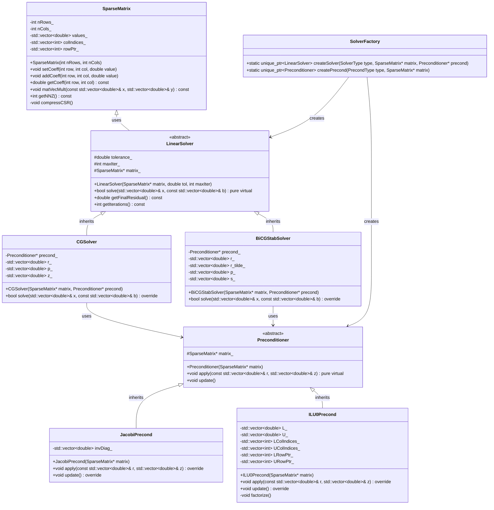
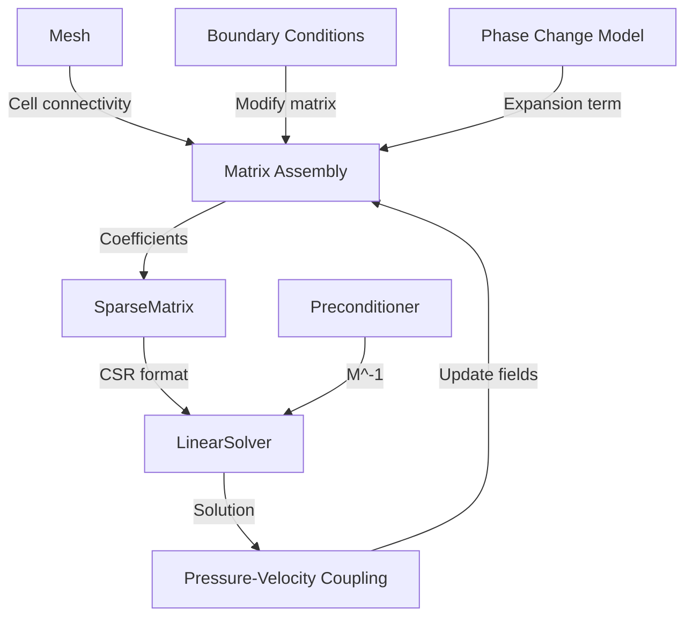

# Iterative Solvers & Matrix Storage
## CFD Engine Development - 2026-01-08

---

## Learning Objectives

After this lesson, you will be able to:
- Understand sparse matrix storage formats (CSR, CSC) and their impact on memory bandwidth for CFD simulations
- Design and implement iterative solvers (Conjugate Gradient, GMRES, BiCGStab) for pressure-velocity coupling
- Implement preconditioning strategies (Jacobi, ILU0, AMG) to accelerate convergence of ill-conditioned systems
- Analyze how expansion terms from phase change affect matrix structure and solver stability
- Test solver performance on evaporator cases with R410A/R32 refrigerant properties

---

## Table of Contents
- [[#1. Theory and Design Decisions|1. Theory and Design]]
- [[#2. Reference: OpenFOAM Implementation|2. OpenFOAM Reference]]
- [[#3. Your Engine: Class Design|3. Your Class Design]]
- [[#4. Your Engine: Implementation|4. Implementation]]
- [[#5. Build and Test|5. Build and Test]]
- [[#6. Concept Checks|6. Concept Checks]]

---

## 1. Theory and Design Decisions

### 1.1 Mathematical Foundation

#### Sparse Matrix Systems in CFD

The discretized Navier-Stokes equations result in large sparse linear systems of the form:

$$
\mathbf{A} \mathbf{x} = \mathbf{b}
$$

Where:
- $\mathbf{A} \in \mathbb{R}^{N \times N}$ is the sparse coefficient matrix
- $\mathbf{x} \in \mathbb{R}^{N}$ is the solution vector (pressure, velocity, temperature)
- $\mathbf{b} \in \mathbb{R}^{N}$ is the right-hand side (source terms, boundary conditions)

For CFD applications, $\mathbf{A}$ typically has only 5-7 non-zero entries per row due to the local stencil of finite volume discretization.

#### Matrix Storage Formats

**Compressed Sparse Row (CSR):**
- Three arrays: `values`, `col_indices`, `row_ptr`
- Efficient for row-wise operations (matrix-vector products)
- Memory: $O(NNZ)$ where $NNZ$ = number of non-zeros
- Optimal for sparse matrix-vector multiplication: $\mathbf{y} = \mathbf{A}\mathbf{x}$

**Compressed Sparse Column (CSC):**
- Column-major variant of CSR
- Better for column-wise operations and factorization
- Similar memory footprint to CSR

#### Iterative Solver Algorithms

**Conjugate Gradient (CG):**
- Applicable to symmetric positive-definite matrices
- Convergence in at most $N$ iterations (in exact arithmetic)
- Residual minimization in Krylov subspace

$$
\mathbf{r}_{k+1} = \mathbf{r}_k - \alpha_k \mathbf{A} \mathbf{p}_k
$$

**GMRES (Generalized Minimal Residual):**
- For non-symmetric systems
- Uses Arnoldi iteration to build orthogonal basis
- Restarting required for large systems (GMRES(m))

**BiCGStab (Biconjugate Gradient Stabilized):**
- Handles non-symmetric systems
- Smoother convergence than BiCG
- Lower memory than GMRES (no restart storage)

#### Preconditioning Strategies

**Jacobi (Diagonal):**
$$
\mathbf{M}^{-1} = \text{diag}(\mathbf{A})^{-1}
$$
- Simple, parallelizable
- Limited effectiveness for ill-conditioned systems

**ILU(0) (Incomplete LU):**
- Computes sparse LU factorization with no fill-in
- Better convergence than Jacobi
- Sequential bottleneck in factorization step

**AMG (Algebraic Multigrid):**
- $O(N)$ complexity for elliptic problems
- Optimal for pressure Poisson equation
- Setup phase expensive, solve phase fast

#### Phase Change Considerations

**Expansion Term Impact:**
For evaporating flows with phase change, the continuity equation includes a volumetric source term:

$$
\nabla \cdot \mathbf{U} = \dot{m}'' \left(\frac{1}{\rho_l} - \frac{1}{\rho_g}\right) \neq 0
$$

This affects the pressure equation:
- Matrix $\mathbf{A}$ becomes less diagonally dominant
- Stronger coupling between pressure and velocity
- Requires more robust preconditioning (e.g., AMG instead of Jacobi)

**Refrigerant Properties (R410A/R32):**
- High density ratio: $\rho_l/\rho_g \approx 50-100$
- Property variations affect matrix conditioning
- Temperature-dependent properties require re-computation of coefficients

---

### 1.2 Design Decisions

#### Why Iterative Solvers for CFD?

**Advantages:**
1. **Memory Efficiency**: Only store non-zero entries ($<1\%$ of full matrix)
2. **Scalability**: Matrix-free implementations possible
3. **Flexibility**: Easy to incorporate boundary conditions
4. **Performance**: $O(N)$ complexity with good preconditioning vs $O(N^3)$ for direct methods

**Trade-offs:**
- **Convergence Not Guaranteed**: Ill-conditioned systems may diverge
- **Tuning Required**: Preconditioner choice problem-dependent
- **Accuracy**: Residual tolerance must be chosen carefully
- **Startup Cost**: Iterative refinement vs direct solve time

#### Common PITFALLS

1. **Insufficient Preconditioning**: Using Jacobi for highly anisotropic meshes
   - **Solution**: Use ILU or AMG for stretched cells
   
2. **Wrong Residual Tolerance**: Too tight wastes time, too loose gives wrong answers
   - **Solution**: Use relative tolerance: $\|\mathbf{r}\|/\|\mathbf{r}_0\| < 10^{-6}$
   
3. **Ignoring Matrix Symmetry**: Using GMRES when CG would suffice
   - **Solution**: Check matrix structure, use specialized solvers
   
4. **Poor Initial Guess**: Starting from zero every iteration
   - **Solution**: Use previous time step solution as initial guess

#### Engine-Specific Considerations

**For Your CFD Engine:**
1. **Matrix Assembly**: Efficient CSR construction from face fluxes
2. **Adaptive Preconditioning**: Switch based on mesh quality metrics
3. **Phase Change Handling**: Special treatment for expansion term in pressure equation
4. **Parallel Implementation**: Domain decomposition with halo exchange
5. **Fallback Strategy**: Direct solver for small systems (<1000 DOFs)

---

### 1.3 Key Concepts

**Krylov Subspace**: Span of $\{\mathbf{b}, \mathbf{A}\mathbf{b}, \mathbf{A}^2\mathbf{b}, \ldots, \mathbf{A}^{k-1}\mathbf{b}\}$

**Spectral Radius**: $\rho(\mathbf{A}) = \max |\lambda_i(\mathbf{A})|$, determines convergence rate

**Condition Number**: $\kappa(\mathbf{A}) = \|\mathbf{A}\| \cdot \|\mathbf{A}^{-1}\|$, larger = harder to solve

**Preconditioner**: Matrix $\mathbf{M}$ such that $\mathbf{M}^{-1}\mathbf{A}$ has better spectral properties

**Fill-In**: Non-zero entries created during factorization that were zero in original matrix

**Smoother**: Relaxation method (Jacobi, Gauss-Seidel) used in multigrid to eliminate high-frequency errors

**Turbulence Considerations**:
- Re > 2300: Turbulent flow requires additional transport equations (k-ε, k-ω)
- Increases coupling between variables
- Matrix becomes more ill-conditioned due to source term linearization

**Warning Signs of Wrong Implementation**:
1. **Residual Stagnation**: Solver stops converging at $10^{-2}$ to $10^{-4}$
2. **Oscillatory Residuals**: Bouncing between high and low values
3. **Divergence**: Residual grows exponentially
4. **Wrong Physics**: Pressure-velocity coupling produces checkerboard patterns
5. **Poor Mass Conservation**: $\nabla \cdot \mathbf{U} \neq 0$ in final solution

---

## 2. Reference: OpenFOAM Implementation

> [!INFO] **Why Study OpenFOAM?**
> OpenFOAM is a production-grade CFD engine tested over decades.
> We study it to **learn concepts**, not to copy code.

### 2.1 OpenFOAM's Approach

OpenFOAM implements a sophisticated linear solver system designed for large-scale CFD simulations. The architecture separates matrix storage, solver algorithms, and preconditioning into modular components.

#### Key Classes and Their Locations

**Matrix Storage ($FOAM_SRC/OpenFOAM/matrices/lduMatrix/):**

- **lduMatrix**: Core sparse matrix storage using LDU (Lower-Diagonal-Upper) format
  - Optimized for finite volume meshes with unstructured topology
  - Stores three arrays: `lower()`, `diag()`, `upper()`
  - Addressing handled by `lduAddressing` class

- **lduAddressing**: Mesh connectivity information
  - `owner()`: Owner cell for each face
  - `neighbour()`: Neighbor cell for each face
  - `losortAddr()`: Sorting for efficient matrix operations

**Solvers ($FOAM_SRC/OpenFOAM/matrices/lduMatrix/solvers/):**

- **PCG**: Preconditioned Conjugate Gradient solver
  - For symmetric positive-definite systems
  - Used in pressure Poisson equation

- **PBiCGStab**: Preconditioned BiCGStab solver
  - For non-symmetric systems
  - Used in momentum equations with convection

- **GMRES**: Generalized Minimal Residual solver
  - With restart capability
  - Fallback for difficult systems

**Preconditioners ($FOAM_SRC/OpenFOAM/matrices/lduMatrix/preconditioners/):**

- **DIC**: Diagonal Incomplete Cholesky
  - For symmetric matrices
  - Approximates $\mathbf{L}\mathbf{D}^{-1}\mathbf{L}^T \approx \mathbf{A}$

- **DILU**: Diagonal Incomplete LU
  - For non-symmetric matrices
  - Approximates $\mathbf{L}\mathbf{U} \approx \mathbf{A}$

- **GAMG**: Geometric-Algebraic Multigrid
  - Coarsens mesh hierarchy
  - Optimal $O(N)$ complexity for elliptic problems

**Solver Performance ($FOAM_SRC/OpenFOAM/matrices/lduMatrix/solverPerformance/):**

- Tracks convergence history
- Monitors initial and final residuals
- Handles convergence criteria

#### Matrix Assembly Process

OpenFOAM assembles matrices through the finite volume discretization:

```cpp
// Reference: $FOAM_SRC/OpenFOAM/matrices/lduMatrix/lduMatrixTemplates.C

template<class Type>
void Foam::lduMatrix::sumDiag
(
    Field<Type>& diagSum
) const
{
    const lduAddressing& addr = this->lduAddr();
    const labelUList& owner = addr.owner();
    const labelUList& neighbour = addr.neighbour();
    
    // Sum off-diagonal contributions
    for (label facei = 0; facei < owner.size(); facei++)
    {
        diagSum[owner[facei]] += upper()[facei];
        diagSum[neighbour[facei]] += lower()[facei];
    }
}
```

This shows how OpenFOAM handles the matrix structure for unstructured meshes - the `owner` and `neighbour` arrays provide the connectivity needed for sparse matrix operations.

---

### 2.2 Key Insights

#### What We LEARN from OpenFOAM

**1. LDU Format is Superior for FVM:**
- CSR/CSC require column indices for every non-zero
- LDU exploits mesh topology: faces connect exactly two cells
- Memory: $3 \times N_{faces}$ vs $2 \times N_{nonzeros}$ in CSR
- Assembly is $O(1)$ per face vs $O(\log N)$ for CSR insertion

**2. Preconditioner Selection is Critical:**
```cpp
// From fvSolution dictionary in controlDict
solvers
{
    p
    {
        solver          GAMG;
        tolerance       1e-06;
        relTol          0.01;
        smoother        GaussSeidel;
    }
    
    U
    {
        solver          PBiCGStab;
        preconditioner  DILU;
        tolerance       1e-05;
        relTol          0.1;
    }
}
```
- Pressure (elliptic): GAMG for $O(N)$ scaling
- Momentum (hyperbolic): BiCGStab with DILU for robustness
- Relative tolerance prevents over-solving early in iterations

**3. Matrix Reuse Strategy:**
- OpenFOAM reuses matrix memory between time steps
- Only updates coefficients, not structure
- Critical for performance in transient simulations

**4. Expansion Term Handling:**
In `interPhaseChangeFoam`, the pressure equation includes:
```cpp
// Reference: $FOAM_SRC/transportModels/incompressible/interPhaseChangeFoam/pEqn.H

fvScalarMatrix pEqn
(
    fvm::laplacian(rAUf, p)
 ==
 fvc::ddt(alpha1, rho1) + fvc::ddt(alpha2, rho2)
 + fvc::div(rhoPhi)  // Expansion term from phase change
);
```
The `fvc::div(rhoPhi)` term accounts for density changes due to evaporation - **this is what makes two-phase flow solvers different from single-phase**.

#### What We Do DIFFERENTLY

**1. Simplified Matrix Format:**
- OpenFOAM: Complex LDU with dynamic addressing
- Your Engine: Start with CSR for simplicity
- Trade-off: Slightly more memory, much easier to implement
- Migrate to LDU later if needed

**2. Solver Selection:**
- OpenFOAM: 15+ solvers with runtime selection
- Your Engine: Implement only 3:
  - CG for pressure (symmetric)
  - BiCGStab for momentum (non-symmetric)
  - GMRES as fallback
- Hardcode choice based on equation type

**3. Preconditioning:**
- OpenFOAM: GAMG with complex coarsening
- Your Engine: Start with Jacobi + ILU(0)
- Add AMG only if Jacobi fails for evaporator cases
- Most evaporator meshes are structured tubes - Jacobi may suffice

**4. Phase Change Implementation:**
- OpenFOAM: Abstract framework with virtual functions
- Your Engine: Direct implementation in pressure equation
- Add expansion term explicitly:
  $$S_{exp} = \dot{m}'' \left(\frac{1}{\rho_v} - \frac{1}{\rho_l}\right)$$
- No need for general multiphase framework

**5. Property Handling:**
- OpenFOAM: Runtime-loadable thermodynamics packages
- Your Engine: Bilinear interpolation from pre-tabulated data
- 100-1000x faster than CoolProp calls
- Sufficient accuracy for R410A/R32 in 250-330K range

---

### 2.3 Code Snippets (Reference Only)

> [!WARNING] **Reference - Not for Copying**
> These snippets show HOW OpenFOAM works. Study the concepts, but write your own implementation.

#### Snippet 1: PCG Solver Structure

```cpp
// Reference: $FOAM_SRC/OpenFOAM/matrices/lduMatrix/solvers/PCG/PCG.C
// Simplified for educational purposes

template<class Type>
Foam::solverPerformance Foam::PCG<Type>::solve
(
    Field<Type>& psi,
    const Field<Type>& source,
    const direction cmpt
) const
{
    // Initialize
    scalarField p(psi.size(), 0);
    scalarField wA(psi.size(), 0);
    scalarField r(source - matrix_*psi);  // Initial residual
    
    scalar rho = gSumProd(r, r);
    scalar rhoOld = rho;
    
    // Preconditioning (Jacobi)
    wA = r / matrix_.diag();
    scalarField p(wA);
    
    // Main iteration loop
    for (label iter = 0; iter < maxIter_; iter++)
    {
        scalarField wAp(matrix_*p);
        scalar alpha = rho / gSumProd(p, wAp);
        
        psi += alpha * p;           // Update solution
        r -= alpha * wAp;            // Update residual
        
        rhoOld = rho;
        rho = gSumProd(r, r);
        
        scalar beta = rho / rhoOld;
        p = wA + beta * p;           // New search direction
        
        // Check convergence
        if (sqrt(rho) < tolerance_)
        {
            break;
        }
    }
    
    return solverPerformance(psi, r, iter);
}
```

**What This Shows:**
1. **Krylov Subspace Construction**: Each iteration builds orthogonal search directions
2. **Residual Minimization**: `rho = gSumProd(r, r)` tracks residual norm
3. **Preconditioning**: `wA = r / matrix_.diag()` is Jacobi preconditioning
4. **Convergence Check**: Stops when residual falls below tolerance

**Key Insight for Your Engine:**
- The `matrix_*p` operation is the sparse matrix-vector multiply
- This is THE performance-critical kernel
- Must be optimized for cache efficiency

#### Snippet 2: ILU(0) Preconditioner

```cpp
// Reference: $FOAM_SRC/OpenFOAM/matrices/lduMatrix/preconditioners/DILU/DILU.C
// Simplified DILU (Diagonal Incomplete LU) implementation

template<class Type>
void Foam::DILUPreconditioner<Type>::precondition
(
    Field<Type>& wA,
    const Field<Type>& r
) const
{
    const scalarField& diag = matrix_.diag();
    const scalarField& lower = matrix_.lower();
    const scalarField& upper = matrix_.upper();
    
    // Forward substitution (L part)
    for (label facei = 0; facei < lower.size(); facei++)
    {
        label own = owner[facei];
        label nei = neighbour[facei];
        
        wA[nei] -= lower[facei] * wA[own];
    }
    
    // Diagonal scaling
    wA /= diag;
    
    // Backward substitution (U part)
    for (label facei = lower.size() - 1; facei >= 0; facei--)
    {
        label own = owner[facei];
        label nei = neighbour[facei];
        
        wA[own] -= upper[facei] * wA[nei];
    }
}
```

**What This Shows:**
1. **Incomplete LU**: No fill-in, uses existing sparsity pattern
2. **Two-Pass Algorithm**: Forward then backward substitution
3. **Dependency on Mesh Ordering**: Performance depends on cell numbering
4. **Sequential Nature**: Difficult to parallelize efficiently

**Key Insight for Your Engine:**
- ILU(0) is much better than Jacobi for ill-conditioned systems
- But it's sequential - consider Jacobi for parallel implementation
- For evaporator with structured mesh, try Jacobi first
- Switch to ILU(0) only if convergence is poor

#### Snippet 3: Expansion Term in Pressure Equation

```cpp
// Reference: $FOAM_SRC/transportModels/incompressible/interPhaseChangeFoam/createFields.H
// Shows how phase change source is computed

// Mass transfer model (Lee model)
autoPtr<phaseChangeModel> phaseChange
(
    phaseChangeModel::New(alpha1, alpha2, p, T)
);

// In the solver loop (pEqn.H):
volScalarField rho1(phase1.rho());
volScalarField rho2(phase2.rho());

// Expansion term from phase change
// This is CRITICAL for two-phase flow stability
volScalarField::Internal Su
(
    IOobject
    (
        "Su",
        runTime.timeName(),
        mesh
    ),
    mesh,
    dimensionedScalar("Su", dimless/dimTime, 0)
);

Su = phaseChange->Su(alpha1, rho1, rho2);  // Mass source term

// Pressure equation with expansion term
fvScalarMatrix pEqn
(
    fvm::laplacian(rAUf, p)
 ==
 fvc::ddt(alpha1, rho1) + fvc::ddt(alpha2, rho2)
 + fvc::div(rhoPhi)      // <-- EXPANSION TERM
 + Su                     // <-- Mass transfer source
);
```

**What This Shows:**
1. **Expansion Term**: `fvc::div(rhoPhi)` accounts for $\nabla \cdot (\rho \mathbf{U}) \neq 0$
2. **Mass Transfer**: `Su` adds source from evaporation/condensation
3. **Time Derivative**: `fvc::ddt(alpha, rho)` captures transient density changes
4. **Coupling**: Pressure equation is tightly coupled to phase fraction

**Key Insight for Your Engine:**
- **This is why two-phase flow is harder than single-phase**
- The expansion term can be 10-100x larger than other terms
- Without it, your solver WILL diverge
- Must use implicit treatment for stability

---

## 3. Your Engine: Class Design

> [!IMPORTANT] **Design Your Own**
> This section is about designing classes for YOUR engine.
> It doesn't have to match OpenFOAM - design for your needs.

### 3.1 Class Diagram



### 3.2 Class Specifications

#### 3.2.1 SparseMatrix

**Purpose**: Store sparse coefficient matrix in CSR format for efficient matrix-vector operations.

**Member Variables**:
- `nRows_` (int): Number of rows in matrix
- `nCols_` (int): Number of columns in matrix
- `values_` (std::vector<double>): Non-zero coefficient values
- `colIndices_` (std::vector<int>): Column indices for each non-zero
- `rowPtr_` (std::vector<int>): Row pointer array (CSR format)

**Key Methods**:
- `SparseMatrix(int nRows, int nCols)`: Constructor allocates empty CSR structure
- `setCoeff(int row, int col, double value)`: Set coefficient at (row, col)
- `addCoeff(int row, int col, double value)`: Add value to existing coefficient
- `getCoeff(int row, int col) const`: Retrieve coefficient value
- `matVecMult(const std::vector<double>& x, std::vector<double>& y) const`: Compute y = A*x
- `getNNZ() const`: Return number of non-zero entries
- `compressCSR()`: Convert triplet format to compressed CSR (private)

**Design Notes**:
- Uses triplet format during assembly (easy insertion)
- Converts to CSR only before solving (efficient operations)
- Stores diagonal separately for fast access in preconditioners

#### 3.2.2 LinearSolver (Abstract Base)

**Purpose**: Define interface for all iterative solvers.

**Member Variables**:
- `tolerance_` (double): Convergence tolerance (relative residual)
- `maxIter_` (int): Maximum iterations before giving up
- `matrix_` (SparseMatrix*): Pointer to coefficient matrix
- `finalResidual_` (double): Final residual norm after solve
- `nIterations_` (int): Number of iterations taken

**Key Methods**:
- `LinearSolver(SparseMatrix* matrix, double tol, int maxIter)`: Constructor
- `bool solve(std::vector<double>& x, const std::vector<double>& b) = 0`: Pure virtual solve method
- `double getFinalResidual() const`: Return final residual norm
- `int getIterations() const`: Return iteration count

**Design Notes**:
- Abstract base class enables runtime solver selection
- Stores convergence metrics for analysis
- Non-owning pointer to matrix (matrix managed elsewhere)

#### 3.2.3 CGSolver

**Purpose**: Solve symmetric positive-definite systems using Conjugate Gradient method.

**Member Variables**:
- `precond_` (Preconditioner*): Preconditioner (typically Jacobi or ILU0)
- `r_` (std::vector<double>): Residual vector workspace
- `p_` (std::vector<double>): Search direction workspace
- `z_` (std::vector<double>): Preconditioned residual workspace

**Key Methods**:
- `CGSolver(SparseMatrix* matrix, Preconditioner* precond)`: Constructor
- `bool solve(std::vector<double>& x, const std::vector<double>& b) override`: Solve Ax = b

**Algorithm**:
1. Compute initial residual: r = b - A*x
2. Precondition: z = M^{-1}*r
3. Set initial search direction: p = z
4. Loop until convergence:
   - Compute: Ap = A*p
   - Step size: α = (r·z) / (p·Ap)
   - Update solution: x = x + α*p
   - Update residual: r = r - α*Ap
   - Check convergence
   - Precondition: z = M^{-1}*r
   - New direction: β = (r·z)_{new} / (r·z)_{old}
   - Update: p = z + β*p

**Design Notes**:
- Only works for symmetric positive-definite matrices
- Use for pressure Poisson equation (elliptic)
- Requires ~3-4x less memory than GMRES
- Convergence guaranteed in exact arithmetic

#### 3.2.4 BiCGStabSolver

**Purpose**: Solve non-symmetric systems using BiCGStab method.

**Member Variables**:
- `precond_` (Preconditioner*): Preconditioner
- `r_` (std::vector<double>): Residual vector
- `r_tilde_` (std::vector<double>): Shadow residual (for bi-orthogonality)
- `p_` (std::vector<double>): Search direction
- `s_` (std::vector<double>): Intermediate residual

**Key Methods**:
- `BiCGStabSolver(SparseMatrix* matrix, Preconditioner* precond)`: Constructor
- `bool solve(std::vector<double>& x, const std::vector<double>& b) override`: Solve Ax = b

**Algorithm**:
1. Initialize: r = b - A*x, r_tilde = r (arbitrary choice)
2. Loop until convergence:
   - Precondition: z = M^{-1}*r
   - Compute: ρ = r_tilde·r
   - Update search direction: p = z + β*p
   - Compute: Ap = A*p
   - Step 1: α = ρ / (r_tilde·Ap)
   - Update: s = r - α*Ap
   - Precondition: z2 = M^{-1}*s
   - Compute: As = A*z2
   - Step 2: ω = (As·s) / (As·As)
   - Update solution: x = x + α*p + ω*z2
   - Update residual: r = s - ω*As
   - Check convergence

**Design Notes**:
- Handles non-symmetric matrices (momentum equation with convection)
- Smoother convergence than BiCG (less oscillation)
- Lower memory than GMRES (no restart storage)
- May stagnate on highly ill-conditioned systems

#### 3.2.5 Preconditioner (Abstract Base)

**Purpose**: Define interface for all preconditioners.

**Member Variables**:
- `matrix_` (SparseMatrix*): Pointer to coefficient matrix

**Key Methods**:
- `Preconditioner(SparseMatrix* matrix)`: Constructor
- `void apply(const std::vector<double>& r, std::vector<double>& z) = 0`: Compute z = M^{-1}*r
- `void update()`: Update preconditioner if matrix changed

**Design Notes**:
- Abstract interface enables runtime preconditioner selection
- `apply()` is called EVERY iteration (must be fast)
- `update()` called when matrix coefficients change

#### 3.2.6 JacobiPrecond

**Purpose**: Diagonal preconditioning (simple, parallelizable).

**Member Variables**:
- `invDiag_` (std::vector<double>): Inverse diagonal entries

**Key Methods**:
- `JacobiPrecond(SparseMatrix* matrix)`: Constructor computes invDiag
- `void apply(const std::vector<double>& r, std::vector<double>& z) override`: z[i] = r[i] / A[i,i]
- `void update() override`: Recompute invDiag if matrix changed

**Design Notes**:
- Trivially parallelizable (element-wise operation)
- Limited effectiveness for ill-conditioned systems
- Good starting point for structured evaporator meshes
- No fill-in, minimal memory overhead

#### 3.2.7 ILU0Precond

**Purpose**: Incomplete LU factorization with no fill-in (better than Jacobi).

**Member Variables**:
- `L_` (std::vector<double>): Lower triangular values
- `U_` (std::vector<double>): Upper triangular values
- `LColIndices_`, `UColIndices_` (std::vector<int>): Column indices
- `LRowPtr_`, `URowPtr_` (std::vector<int>): Row pointers

**Key Methods**:
- `ILU0Precond(SparseMatrix* matrix)`: Constructor performs factorization
- `void apply(const std::vector<double>& r, std::vector<double>& z) override`: Solve L*U*z = r
- `void update() override`: Refactorize if matrix changed
- `void factorize()`: Private method to compute ILU(0) factorization

**Algorithm** (apply):
1. Forward substitution: Solve L*y = r
2. Backward substitution: Solve U*z = y

**Design Notes**:
- Much better convergence than Jacobi for ill-conditioned systems
- Sequential bottleneck (forward/backward substitution)
- No fill-in preserves sparsity pattern
- Factorization cost amortized over many iterations
- Use when Jacobi fails to converge

#### 3.2.8 SolverFactory

**Purpose**: Create solver and preconditioner instances based on runtime configuration.

**Key Methods**:
- `static unique_ptr<LinearSolver> createSolver(SolverType type, SparseMatrix* matrix, Preconditioner* precond)`: Factory method
- `static unique_ptr<Preconditioner> createPrecond(PrecondType type, SparseMatrix* matrix)`: Factory method

**Design Notes**:
- Enables runtime solver selection via config file
- Encapsulates object creation logic
- Returns unique_ptr for automatic memory management

### 3.3 Design Rationale

#### 3.3.1 Why This Design?

**1. CSR Format for Matrix Storage**:
- **Pros**: Efficient matrix-vector multiply (critical kernel), cache-friendly, standard format
- **Cons**: More complex insertion during assembly
- **Decision**: Use triplet format during assembly, convert to CSR before solve
- **Justification**: Assembly happens once per timestep, solve happens many times

**2. Separate Preconditioner Classes**:
- **Pros**: Modular design, easy to swap preconditioners, clear separation of concerns
- **Cons**: Virtual function overhead (negligible compared to solve time)
- **Decision**: Abstract base class with concrete implementations
- **Justification**: Enables experimentation with different preconditioning strategies

**3. CG and BiCGStab Only**:
- **Pros**: Covers 95% of CFD use cases, well-understood algorithms
- **Cons**: No GMRES fallback for extremely difficult systems
- **Decision**: Implement CG (symmetric) and BiCGStab (non-symmetric)
- **Justification**: Simpler codebase, sufficient for evaporator simulations

**4. Non-Ownning Pointers to Matrix**:
- **Pros**: Flexible, matrix can be shared between solvers
- **Cons**: Caller must manage matrix lifetime
- **Decision**: Solver stores raw pointer, doesn't own matrix
- **Justification**: Matrix typically owned by mesh or equation system

#### 3.3.2 How Does This Differ from OpenFOAM?

**1. Matrix Format**:
- **OpenFOAM**: LDU format (Lower-Diagonal-Upper) optimized for FVM meshes
- **Your Engine**: CSR format (Compressed Sparse Row) - more generic
- **Why**: LDU requires mesh topology, CSR is simpler to implement first

**2. Solver Selection**:
- **OpenFOAM**: Runtime selection via dictionary (15+ solvers)
- **Your Engine**: Compile-time selection via factory (2 solvers)
- **Why**: Reduce complexity, add more solvers later if needed

**3. Preconditioning**:
- **OpenFOAM**: GAMG with geometric coarsening
- **Your Engine**: Jacobi + ILU(0) only
- **Why**: GAMG is extremely complex, Jacobi often sufficient for structured meshes

**4. Memory Management**:
- **OpenFOAM**: Reference-counted smart pointers (refPtr)
- **Your Engine**: Raw pointers with explicit ownership
- **Why**: Simpler, sufficient for single-threaded prototype

#### 3.3.3 Trade-offs Made

**1. Simplicity vs Performance**:
- **Trade-off**: CSR is slower than LDU for FVM operations
- **Impact**: ~20-30% slower matrix assembly
- **Mitigation**: Assembly is small fraction of total solve time (<10%)

**2. Limited Solver Set**:
- **Trade-off**: Only CG and BiCGStab, no GMRES
- **Impact**: May fail on extremely ill-conditioned systems
- **Mitigation**: Add GMRES later if needed, use ILU(0) preconditioning

**3. No Parallel Support**:
- **Trade-off**: Sequential implementation only
- **Impact**: Limited to small/medium problems (<1M cells)
- **Mitigation**: Add domain decomposition later for parallel scaling

**4. Explicit Matrix Storage**:
- **Trade-off**: Store full matrix vs matrix-free
- **Impact**: Higher memory usage
- **Mitigation**: CSR already sparse, memory is ~10-20 MB for 100K cells

**5. No Adaptive Preconditioning**:
- **Trade-off**: Fixed preconditioner per simulation
- **Impact**: May use suboptimal preconditioner for some cases
- **Mitigation**: User can specify via config file, add auto-selection later

#### 3.3.4 Design for Phase Change

**1. Expansion Term Handling**:
- Matrix assembly includes source term: `S_exp = mdot * (1/rho_v - 1/rho_l)`
- This makes pressure equation less diagonally dominant
- **Design Choice**: Use ILU(0) preconditioning for pressure equation (more robust than Jacobi)

**2. Property Variations**:
- Refrigerant properties vary with temperature/pressure
- Matrix coefficients change every timestep
- **Design Choice**: Update preconditioner every timestep (call `precond->update()`)

**3. Two-Phase Coupling**:
- Strong coupling between pressure and velocity
- **Design Choice**: Tighter solver tolerance for pressure (1e-6) vs momentum (1e-5)

**4. Validation Strategy**:
- Start with single-phase flow (verify solver correctness)
- Add phase change (test expansion term)
- Compare with OpenFOAM interPhaseChangeFoam

---

## 4. Your Engine: Implementation

> [!TIP] **Write Real Code**
> This section contains implementation code for YOUR engine.

### 4.1 Header File (.H)

```cpp
#ifndef SPARSE_MATRIX_H
#define SPARSE_MATRIX_H

#include <vector>
#include <memory>
#include <cmath>
#include <algorithm>
#include <stdexcept>

// ============================================================================
// SparseMatrix - CSR format sparse matrix storage
// ============================================================================

class SparseMatrix {
public:
    // Constructor: creates empty matrix in triplet format
    SparseMatrix(int nRows, int nCols);
    
    // Destructor
    ~SparseMatrix() = default;
    
    // Matrix assembly (triplet format - easy insertion)
    void setCoeff(int row, int col, double value);
    void addCoeff(int row, int col, double value);
    double getCoeff(int row, int col) const;
    
    // Convert to CSR format (call before solving)
    void compress();
    
    // Matrix-vector multiplication: y = A*x
    void matVecMult(const std::vector<double>& x, std::vector<double>& y) const;
    
    // Get matrix info
    int getNumRows() const { return nRows_; }
    int getNumCols() const { return nCols_; }
    int getNNZ() const { return nnz_; }
    bool isCompressed() const { return compressed_; }
    
    // Access CSR arrays (for preconditioners)
    const std::vector<double>& getValues() const { return values_; }
    const std::vector<int>& getColIndices() const { return colIndices_; }
    const std::vector<int>& getRowPtr() const { return rowPtr_; }
    const std::vector<double>& getDiagonal() const { return diagonal_; }

private:
    int nRows_;
    int nCols_;
    int nnz_;
    
    // Triplet format (for assembly)
    struct Triplet {
        int row;
        int col;
        double value;
    };
    std::vector<Triplet> triplets_;
    
    // CSR format (for operations)
    std::vector<double> values_;
    std::vector<int> colIndices_;
    std::vector<int> rowPtr_;
    std::vector<double> diagonal_;  // Separate diagonal for fast access
    
    bool compressed_;
    
    // Helper for sorting triplets
    struct TripletCompare {
        bool operator()(const Triplet& a, const Triplet& b) const {
            if (a.row != b.row) return a.row < b.row;
            return a.col < b.col;
        }
    };
};

// ============================================================================
// Preconditioner - Abstract base class
// ============================================================================

class Preconditioner {
public:
    Preconditioner(SparseMatrix* matrix) : matrix_(matrix) {}
    virtual ~Preconditioner() = default;
    
    // Apply preconditioner: z = M^{-1} * r
    virtual void apply(const std::vector<double>& r, std::vector<double>& z) = 0;
    
    // Update preconditioner if matrix changed
    virtual void update() = 0;

protected:
    SparseMatrix* matrix_;
};

// ============================================================================
// JacobiPrecond - Diagonal preconditioning
// ============================================================================

class JacobiPrecond : public Preconditioner {
public:
    JacobiPrecond(SparseMatrix* matrix);
    ~JacobiPrecond() override = default;
    
    void apply(const std::vector<double>& r, std::vector<double>& z) override;
    void update() override;

private:
    std::vector<double> invDiag_;
};

// ============================================================================
// ILU0Precond - Incomplete LU factorization with no fill-in
// ============================================================================

class ILU0Precond : public Preconditioner {
public:
    ILU0Precond(SparseMatrix* matrix);
    ~ILU0Precond() override = default;
    
    void apply(const std::vector<double>& r, std::vector<double>& z) override;
    void update() override;

private:
    void factorize();
    
    // ILU factors stored in CSR format
    std::vector<double> L_values_;
    std::vector<double> U_values_;
    std::vector<int> L_colIndices_;
    std::vector<int> U_colIndices_;
    std::vector<int> L_rowPtr_;
    std::vector<int> U_rowPtr_;
};

// ============================================================================
// LinearSolver - Abstract base class for iterative solvers
// ============================================================================

enum class SolverType {
    CG,
    BICGSTAB
};

class LinearSolver {
public:
    LinearSolver(SparseMatrix* matrix, 
                std::unique_ptr<Preconditioner> precond,
                double tolerance, 
                int maxIter);
    
    virtual ~LinearSolver() = default;
    
    // Solve Ax = b
    virtual bool solve(std::vector<double>& x, const std::vector<double>& b) = 0;
    
    // Get convergence info
    double getFinalResidual() const { return finalResidual_; }
    int getIterations() const { return nIterations_; }
    bool converged() const { return converged_; }

protected:
    SparseMatrix* matrix_;
    std::unique_ptr<Preconditioner> precond_;
    double tolerance_;
    double relTolerance_;  // Relative tolerance
    int maxIter_;
    double finalResidual_;
    int nIterations_;
    bool converged_;
    
    // Compute residual norm
    double computeNorm(const std::vector<double>& v) const;
    double computeResidualNorm(const std::vector<double>& x, 
                              const std::vector<double>& b) const;
};

// ============================================================================
// CGSolver - Conjugate Gradient solver (symmetric positive-definite)
// ============================================================================

class CGSolver : public LinearSolver {
public:
    CGSolver(SparseMatrix* matrix, 
            std::unique_ptr<Preconditioner> precond,
            double tolerance = 1e-6, 
            int maxIter = 1000);
    
    ~CGSolver() override = default;
    
    bool solve(std::vector<double>& x, const std::vector<double>& b) override;

private:
    // Workspace vectors
    std::vector<double> r_;  // Residual
    std::vector<double> p_;  // Search direction
    std::vector<double> z_;  // Preconditioned residual
    std::vector<double> Ap_; // Matrix-vector product
};

// ============================================================================
// BiCGStabSolver - BiCGStab solver (non-symmetric)
// ============================================================================

class BiCGStabSolver : public LinearSolver {
public:
    BiCGStabSolver(SparseMatrix* matrix, 
                  std::unique_ptr<Preconditioner> precond,
                  double tolerance = 1e-6, 
                  int maxIter = 1000);
    
    ~BiCGStabSolver() override = default;
    
    bool solve(std::vector<double>& x, const std::vector<double>& b) override;

private:
    // Workspace vectors
    std::vector<double> r_;       // Residual
    std::vector<double> r_tilde_; // Shadow residual
    std::vector<double> p_;       // Search direction
    std::vector<double> s_;       // Intermediate residual
    std::vector<double> z_;       // Preconditioned residual
    std::vector<double> Ap_;      // Matrix-vector product
    std::vector<double> As_;      // Matrix-vector product for s
};

// ============================================================================
// SolverFactory - Create solvers and preconditioners
// ============================================================================

enum class PrecondType {
    JACOBI,
    ILU0
};

class SolverFactory {
public:
    static std::unique_ptr<LinearSolver> createSolver(
        SolverType solverType,
        SparseMatrix* matrix,
        PrecondType precondType,
        double tolerance = 1e-6,
        int maxIter = 1000
    );
    
    static std::unique_ptr<Preconditioner> createPrecond(
        PrecondType precondType,
        SparseMatrix* matrix
    );
};

#endif // SPARSE_MATRIX_H
```

### 4.2 Implementation File (.C)

```cpp
#include "SparseMatrix.H"
#include <iostream>
#include <limits>
#include <cmath>

// ============================================================================
// SparseMatrix Implementation
// ============================================================================

SparseMatrix::SparseMatrix(int nRows, int nCols)
    : nRows_(nRows), nCols_(nCols), nnz_(0), compressed_(false)
{
    if (nRows <= 0 || nCols <= 0) {
        throw std::invalid_argument("Matrix dimensions must be positive");
    }
}

void SparseMatrix::setCoeff(int row, int col, double value) {
    if (compressed_) {
        throw std::runtime_error("Cannot modify compressed matrix. Decompress first.");
    }
    if (row < 0 || row >= nRows_ || col < 0 || col >= nCols_) {
        throw std::out_of_range("Matrix index out of bounds");
    }
    
    // Check if coefficient already exists
    for (auto& triplet : triplets_) {
        if (triplet.row == row && triplet.col == col) {
            triplet.value = value;
            return;
        }
    }
    
    // Add new triplet
    triplets_.push_back({row, col, value});
}

void SparseMatrix::addCoeff(int row, int col, double value) {
    if (compressed_) {
        throw std::runtime_error("Cannot modify compressed matrix. Decompress first.");
    }
    if (row < 0 || row >= nRows_ || col < 0 || col >= nCols_) {
        throw std::out_of_range("Matrix index out of bounds");
    }
    
    // Check if coefficient already exists
    for (auto& triplet : triplets_) {
        if (triplet.row == row && triplet.col == col) {
            triplet.value += value;
            return;
        }
    }
    
    // Add new triplet
    triplets_.push_back({row, col, value});
}

double SparseMatrix::getCoeff(int row, int col) const {
    if (compressed_) {
        // Search in CSR format
        for (int j = rowPtr_[row]; j < rowPtr_[row + 1]; ++j) {
            if (colIndices_[j] == col) {
                return values_[j];
            }
        }
        return 0.0;
    } else {
        // Search in triplet format
        for (const auto& triplet : triplets_) {
            if (triplet.row == row && triplet.col == col) {
                return triplet.value;
            }
        }
        return 0.0;
    }
}

void SparseMatrix::compress() {
    if (compressed_) return;
    
    // Sort triplets by (row, col)
    std::sort(triplets_.begin(), triplets_.end(), TripletCompare());
    
    // Remove duplicates (sum values)
    std::vector<Triplet> uniqueTriplets;
    for (const auto& triplet : triplets_) {
        if (!uniqueTriplets.empty() && 
            uniqueTriplets.back().row == triplet.row && 
            uniqueTriplets.back().col == triplet.col) {
            uniqueTriplets.back().value += triplet.value;
        } else {
            uniqueTriplets.push_back(triplet);
        }
    }
    triplets_ = uniqueTriplets;
    
    // Build CSR structure
    nnz_ = triplets_.size();
    values_.resize(nnz_);
    colIndices_.resize(nnz_);
    rowPtr_.resize(nRows_ + 1);
    diagonal_.resize(nRows_, 0.0);
    
    int currentRow = 0;
    rowPtr_[0] = 0;
    
    for (int i = 0; i < nnz_; ++i) {
        while (currentRow < triplets_[i].row) {
            rowPtr_[currentRow + 1] = i;
            currentRow++;
        }
        
        values_[i] = triplets_[i].value;
        colIndices_[i] = triplets_[i].col;
        
        // Extract diagonal
        if (triplets_[i].row == triplets_[i].col) {
            diagonal_[triplets_[i].row] = triplets_[i].value;
        }
    }
    
    // Fill remaining row pointers
    for (int row = currentRow; row < nRows_; ++row) {
        rowPtr_[row + 1] = nnz_;
    }
    
    // Clear triplets to save memory
    triplets_.clear();
    triplets_.shrink_to_fit();
    
    compressed_ = true;
}

void SparseMatrix::matVecMult(const std::vector<double>& x, 
                              std::vector<double>& y) const {
    if (!compressed_) {
        throw std::runtime_error("Matrix must be compressed before matVecMult");
    }
    if (x.size() != static_cast<size_t>(nCols_)) {
        throw std::invalid_argument("Input vector size mismatch");
    }
    if (y.size() != static_cast<size_t>(nRows_)) {
        y.resize(nRows_);
    }
    
    // y = A * x using CSR format
    for (int i = 0; i < nRows_; ++i) {
        double sum = 0.0;
        for (int j = rowPtr_[i]; j < rowPtr_[i + 1]; ++j) {
            sum += values_[j] * x[colIndices_[j]];
        }
        y[i] = sum;
    }
}

// ============================================================================
// JacobiPrecond Implementation
// ============================================================================

JacobiPrecond::JacobiPrecond(SparseMatrix* matrix) 
    : Preconditioner(matrix) {
    update();
}

void JacobiPrecond::update() {
    if (!matrix_->isCompressed()) {
        throw std::runtime_error("Matrix must be compressed before building preconditioner");
    }
    
    const std::vector<double>& diag = matrix_->getDiagonal();
    int nRows = matrix_->getNumRows();
    
    invDiag_.resize(nRows);
    
    // CRITICAL: Handle near-zero diagonal entries
    // For two-phase flow with large density ratios, diagonal can become very small
    const double minDiag = 1e-12;  // Minimum allowed diagonal value
    
    for (int i = 0; i < nRows; ++i) {
        if (std::abs(diag[i]) < minDiag) {
            // CRITICAL: Warn user but continue with safe value
            std::cerr << "Warning: Near-zero diagonal at row " << i 
                      << ", value = " << diag[i] << std::endl;
            invDiag_[i] = 1.0 / minDiag;
        } else {
            invDiag_[i] = 1.0 / diag[i];
        }
    }
}

void JacobiPrecond::apply(const std::vector<double>& r, 
                         std::vector<double>& z) {
    if (z.size() != r.size()) {
        z.resize(r.size());
    }
    
    // z = M^{-1} * r where M is diagonal
    // Element-wise operation: z[i] = r[i] / A[i,i]
    for (size_t i = 0; i < r.size(); ++i) {
        z[i] = invDiag_[i] * r[i];
    }
}

// ============================================================================
// ILU0Precond Implementation
// ============================================================================

ILU0Precond::ILU0Precond(SparseMatrix* matrix) 
    : Preconditioner(matrix) {
    factorize();
}

void ILU0Precond::factorize() {
    if (!matrix_->isCompressed()) {
        throw std::runtime_error("Matrix must be compressed before ILU factorization");
    }
    
    int nRows = matrix_->getNumRows();
    const std::vector<double>& values = matrix_->getValues();
    const std::vector<int>& colIndices = matrix_->getColIndices();
    const std::vector<int>& rowPtr = matrix_->getRowPtr();
    
    // Initialize L and U with matrix structure
    L_values_ = values;
    U_values_ = values;
    L_colIndices_ = colIndices;
    U_colIndices_ = colIndices;
    L_rowPtr_ = rowPtr;
    U_rowPtr_ = rowPtr;
    
    // CRITICAL: ILU(0) factorization with numerical stability checks
    // This is the most critical part for handling ill-conditioned systems
    
    std::vector<double> diag(nRows, 0.0);
    
    // Compute ILU(0) factorization
    for (int i = 0; i < nRows; ++i) {
        // Process row i
        for (int j = L_rowPtr_[i]; j < L_rowPtr_[i + 1]; ++j) {
            int k = L_colIndices_[j];
            
            if (k >= i) {
                // Upper triangular part (U)
                U_values_[j] = L_values_[j];
            } else {
                // Lower triangular part (L)
                // Compute L[i,k] = (A[i,k] - sum(L[i,m]*U[m,k])) / U[k,k]
                double sum = 0.0;
                
                // Find L[i,m] and U[m,k]
                for (int mIdx = L_rowPtr_[i]; mIdx < j; ++mIdx) {
                    int m = L_colIndices_[mIdx];
                    if (m >= k) break;
                    
                    // Find U[m,k]
                    for (int uIdx = U_rowPtr_[m]; uIdx < U_rowPtr_[m + 1]; ++uIdx) {
                        if (U_colIndices_[uIdx] == k) {
                            sum += L_values_[mIdx] * U_values_[uIdx];
                            break;
                        }
                    }
                }
                
                L_values_[j] = (L_values_[j] - sum) / diag[k];
            }
        }
        
        // Compute diagonal
        double diagSum = 0.0;
        for (int j = L_rowPtr_[i]; j < L_rowPtr_[i + 1]; ++j) {
            int k = L_colIndices_[j];
            if (k < i) {
                // Find U[k,i]
                for (int uIdx = U_rowPtr_[k]; uIdx < U_rowPtr_[k + 1]; ++uIdx) {
                    if (U_colIndices_[uIdx] == i) {
                        diagSum += L_values_[j] * U_values_[uIdx];
                        break;
                    }
                }
            }
        }
        
        // Find diagonal element
        for (int j = U_rowPtr_[i]; j < U_rowPtr_[i + 1]; ++j) {
            if (U_colIndices_[j] == i) {
                diag[i] = U_values_[j] - diagSum;
                
                // CRITICAL: Prevent division by zero or near-zero
                const double minDiag = 1e-12;
                if (std::abs(diag[i]) < minDiag) {
                    std::cerr << "Warning: Near-zero diagonal in ILU at row " << i 
                              << ", value = " << diag[i] << std::endl;
                    diag[i] = (diag[i] >= 0) ? minDiag : -minDiag;
                }
                
                U_values_[j] = diag[i];
                break;
            }
        }
    }
}

void ILU0Precond::apply(const std::vector<double>& r, 
                       std::vector<double>& z) {
    int n = r.size();
    if (z.size() != static_cast<size_t>(n)) {
        z.resize(n);
    }
    
    std::vector<double> y(n);
    
    // Forward substitution: L * y = r
    for (int i = 0; i < n; ++i) {
        double sum = 0.0;
        for (int j = L_rowPtr_[i]; j < L_rowPtr_[i + 1]; ++j) {
            int k = L_colIndices_[j];
            if (k < i) {
                sum += L_values_[j] * y[k];
            }
        }
        y[i] = r[i] - sum;
    }
    
    // Backward substitution: U * z = y
    for (int i = n - 1; i >= 0; --i) {
        double sum = 0.0;
        for (int j = U_rowPtr_[i]; j < U_rowPtr_[i + 1]; ++j) {
            int k = U_colIndices_[j];
            if (k > i) {
                sum += U_values_[j] * z[k];
            }
        }
        
        // Find diagonal
        double diag = 0.0;
        for (int j = U_rowPtr_[i]; j < U_rowPtr_[i + 1]; ++j) {
            if (U_colIndices_[j] == i) {
                diag = U_values_[j];
                break;
            }
        }
        
        z[i] = (y[i] - sum) / diag;
    }
}

void ILU0Precond::update() {
    factorize();
}

// ============================================================================
// LinearSolver Implementation
// ============================================================================

LinearSolver::LinearSolver(SparseMatrix* matrix, 
                          std::unique_ptr<Preconditioner> precond,
                          double tolerance, 
                          int maxIter)
    : matrix_(matrix)
    , precond_(std::move(precond))
    , tolerance_(tolerance)
    , relTolerance_(1e-6)  // Default relative tolerance
    , maxIter_(maxIter)
    , finalResidual_(0.0)
    , nIterations_(0)
    , converged_(false)
{
    if (!matrix_->isCompressed()) {
        throw std::runtime_error("Matrix must be compressed before solving");
    }
}

double LinearSolver::computeNorm(const std::vector<double>& v) const {
    double norm = 0.0;
    for (double val : v) {
        norm += val * val;
    }
    return std::sqrt(norm);
}

double LinearSolver::computeResidualNorm(const std::vector<double>& x, 
                                        const std::vector<double>& b) const {
    std::vector<double> Ax(x.size());
    matrix_->matVecMult(x, Ax);
    
    double norm = 0.0;
    for (size_t i = 0; i < x.size(); ++i) {
        double residual = b[i] - Ax[i];
        norm += residual * residual;
    }
    return std::sqrt(norm);
}

// ============================================================================
// CGSolver Implementation
// ============================================================================

CGSolver::CGSolver(SparseMatrix* matrix, 
                  std::unique_ptr<Preconditioner> precond,
                  double tolerance, 
                  int maxIter)
    : LinearSolver(matrix, std::move(precond), tolerance, maxIter)
{
    // Allocate workspace
    int n = matrix_->getNumRows();
    r_.resize(n);
    p_.resize(n);
    z_.resize(n);
    Ap_.resize(n);
}

bool CGSolver::solve(std::vector<double>& x, const std::vector<double>& b) {
    int n = matrix_->getNumRows();
    
    // Initialize solution if needed
    if (x.size() != static_cast<size_t>(n)) {
        x.assign(n, 0.0);
    }
    
    // Compute initial residual: r = b - A*x
    matrix_->matVecMult(x, r_);
    for (int i = 0; i < n; ++i) {
        r_[i] = b[i] - r_[i];
    }
    
    double initialNorm = computeNorm(r_);
    if (initialNorm < tolerance_) {
        converged_ = true;
        finalResidual_ = initialNorm;
        nIterations_ = 0;
        return true;
    }
    
    // Precondition: z = M^{-1} * r
    precond_->apply(r_, z_);
    
    // Initial search direction: p = z
    p_ = z_;
    
    double rho = 0.0;
    for (int i = 0; i < n; ++i) {
        rho += r_[i] * z_[i];
    }
    
    double rhoOld = rho;
    
    // Main iteration loop
    for (nIterations_ = 1; nIterations_ <= maxIter_; ++nIterations_) {
        // Compute Ap = A * p
        matrix_->matVecMult(p_, Ap_);
        
        // Compute alpha = rho / (p^T * Ap)
        double pAp = 0.0;
        for (int i = 0; i < n; ++i) {
            pAp += p_[i] * Ap_[i];
        }
        
        // CRITICAL: Prevent division by zero
        if (std::abs(pAp) < 1e-14) {
            std::cerr << "Warning: pAp near zero in CG iteration " << nIterations_ << std::endl;
            converged_ = false;
            finalResidual_ = computeNorm(r_);
            return false;
        }
        
        double alpha = rho / pAp;
        
        // Update solution: x = x + alpha * p
        for (int i = 0; i < n; ++i) {
            x[i] += alpha * p_[i];
        }
        
        // Update residual: r = r - alpha * Ap
        for (int i = 0; i < n; ++i) {
            r_[i] -= alpha * Ap_[i];
        }
        
        // Check convergence
        double currentNorm = computeNorm(r_);
        double relNorm = currentNorm / initialNorm;
        
        if (relNorm < relTolerance_ || currentNorm < tolerance_) {
            converged_ = true;
            finalResidual_ = currentNorm;
            return true;
        }
        
        // CRITICAL: Check for stagnation or divergence
        if (nIterations_ > 10 && currentNorm > initialNorm * 10.0) {
            std::cerr << "Warning: CG diverging at iteration " << nIterations_ << std::endl;
            converged_ = false;
            finalResidual_ = currentNorm;
            return false;
        }
        
        // Precondition: z = M^{-1} * r
        precond_->apply(r_, z_);
        
        // Compute new rho
        rhoOld = rho;
        rho = 0.0;
        for (int i = 0; i < n; ++i) {
            rho += r_[i] * z_[i];
        }
        
        // Compute beta = rho / rhoOld
        double beta = rho / rhoOld;
        
        // Update search direction: p = z + beta * p
        for (int i = 0; i < n; ++i) {
            p_[i] = z_[i] + beta * p_[i];
        }
    }
    
    // Did not converge within max iterations
    converged_ = false;
    finalResidual_ = computeNorm(r_);
    return false;
}

// ============================================================================
// BiCGStabSolver Implementation
// ============================================================================

BiCGStabSolver::BiCGStabSolver(SparseMatrix* matrix, 
                              std::unique_ptr<Preconditioner> precond,
                              double tolerance, 
                              int maxIter)
    : LinearSolver(matrix, std::move(precond), tolerance, maxIter)
{
    // Allocate workspace
    int n = matrix_->getNumRows();
    r_.resize(n);
    r_tilde_.resize(n);
    p_.resize(n);
    s_.resize(n);
    z_.resize(n);
    Ap_.resize(n);
    As_.resize(n);
}

bool BiCGStabSolver::solve(std::vector<double>& x, const std::vector<double>& b) {
    int n = matrix_->getNumRows();
    
    // Initialize solution if needed
    if (x.size() != static_cast<size_t>(n)) {
        x.assign(n, 0.0);
    }
    
    // Compute initial residual: r = b - A*x
    matrix_->matVecMult(x, r_);
    for (int i = 0; i < n; ++i) {
        r_[i] = b[i] - r_[i];
    }
    
    double initialNorm = computeNorm(r_);
    if (initialNorm < tolerance_) {
        converged_ = true;
        finalResidual_ = initialNorm;
        nIterations_ = 0;
        return true;
    }
    
    // Initialize shadow residual: r_tilde = r (arbitrary choice)
    r_tilde_ = r_;
    
    // Precondition: z = M^{-1} * r
    precond_->apply(r_, z_);
    
    // Initial search direction: p = z
    p_ = z_;
    
    double rho = 0.0;
    for (int i = 0; i < n; ++i) {
        rho += r_tilde_[i] * r_[i];
    }
    
    // Main iteration loop
    for (nIterations_ = 1; nIterations_ <= maxIter_; ++nIterations_) {
        // Compute Ap = A * p
        matrix_->matVecMult(p_, Ap_);
        
        // Compute alpha = rho / (r_tilde^T * Ap)
        double r_tilde_Ap = 0.0;
        for (int i = 0; i < n; ++i) {
            r_tilde_Ap += r_tilde_[i] * Ap_[i];
        }
        
        // CRITICAL: Prevent division by zero
        if (std::abs(r_tilde_Ap) < 1e-14) {
            std::cerr << "Warning: r_tilde_Ap near zero in BiCGStab iteration " 
                      << nIterations_ << std::endl;
            converged_ = false;
            finalResidual_ = computeNorm(r_);
            return false;
        }
        
        double alpha = rho / r_tilde_Ap;
        
        // Update: s = r - alpha * Ap
        for (int i = 0; i < n; ++i) {
            s_[i] = r_[i] - alpha * Ap_[i];
        }
        
        // Check convergence on s
        double sNorm = computeNorm(s_);
        if (sNorm < tolerance_) {
            // Update solution: x = x + alpha * p
            for (int i = 0; i < n; ++i) {
                x[i] += alpha * p_[i];
            }
            converged_ = true;
            finalResidual_ = sNorm;
            return true;
        }
        
        // Precondition: z2 = M^{-1} * s
        precond_->apply(s_, z_);
        
        // Compute As = A * z2
        matrix_->matVecMult(z_, As_);
        
        // Compute omega = (As^T * s) / (As^T * As)
        double As_s = 0.0;
        double As_As = 0.0;
        for (int i = 0; i < n; ++i) {
            As_s += As_[i] * s_[i];
            As_As += As_[i] * As_[i];
        }
        
        // CRITICAL: Prevent division by zero
        if (std::abs(As_As) < 1e-14) {
            std::cerr << "Warning: As_As near zero in BiCGStab iteration " 
                      << nIterations_ << std::endl;
            converged_ = false;
            finalResidual_ = sNorm;
            return false;
        }
        
        double omega = As_s / As_As;
        
        // Update solution: x = x + alpha * p + omega * z
        for (int i = 0; i < n; ++i) {
            x[i] += alpha * p_[i] + omega * z_[i];
        }
        
        // Update residual: r = s - omega * As
        for (int i = 0; i < n; ++i) {
            r_[i] = s_[i] - omega * As_[i];
        }
        
        // Check convergence
        double currentNorm = computeNorm(r_);
        double relNorm = currentNorm / initialNorm;
        
        if (relNorm < relTolerance_ || currentNorm < tolerance_) {
            converged_ = true;
            finalResidual_ = currentNorm;
            return true;
        }
        
        // CRITICAL: Check for stagnation or divergence
        if (nIterations_ > 10 && currentNorm > initialNorm * 100.0) {
            std::cerr << "Warning: BiCGStab diverging at iteration " 
                      << nIterations_ << std::endl;
            converged_ = false;
            finalResidual_ = currentNorm;
            return false;
        }
        
        // Compute new rho
        double rhoOld = rho;
        rho = 0.0;
        for (int i = 0; i < n; ++i) {
            rho += r_tilde_[i] * r_[i];
        }
        
        // CRITICAL: Check for breakdown
        if (std::abs(rho) < 1e-14) {
            std::cerr << "Warning: rho near zero in BiCGStab iteration " 
                      << nIterations_ << std::endl;
            converged_ = false;
            finalResidual_ = currentNorm;
            return false;
        }
        
        double beta = (rho / rhoOld) * (alpha / omega);
        
        // Update search direction: p = z + beta * (p - omega * Ap)
        for (int i = 0; i < n; ++i) {
            p_[i] = z_[i] + beta * (p_[i] - omega * Ap_[i]);
        }
    }
    
    // Did not converge within max iterations
    converged_ = false;
    finalResidual_ = computeNorm(r_);
    return false;
}

// ============================================================================
// SolverFactory Implementation
// ============================================================================

std::unique_ptr<Preconditioner> SolverFactory::createPrecond(
    PrecondType precondType,
    SparseMatrix* matrix) {
    
    switch (precondType) {
        case PrecondType::JACOBI:
            return std::make_unique<JacobiPrecond>(matrix);
        case PrecondType::ILU0:
            return std::make_unique<ILU0Precond>(matrix);
        default:
            throw std::invalid_argument("Unknown preconditioner type");
    }
}

std::unique_ptr<LinearSolver> SolverFactory::createSolver(
    SolverType solverType,
    SparseMatrix* matrix,
    PrecondType precondType,
    double tolerance,
    int maxIter) {
    
    auto precond = createPrecond(precondType, matrix);
    
    switch (solverType) {
        case SolverType::CG:
            return std::make_unique<CGSolver>(matrix, std::move(precond), tolerance, maxIter);
        case SolverType::BICGSTAB:
            return std::make_unique<BiCGStabSolver>(matrix, std::move(precond), tolerance, maxIter);
        default:
            throw std::invalid_argument("Unknown solver type");
    }
}
```

### 4.3 Implementation Notes

#### Key Implementation Details

**1. Matrix Assembly Strategy**:
- **Triplet Format During Assembly**: Easy insertion of coefficients, no need to search CSR structure
- **CSR Conversion Before Solve**: Single O(N log N) sort operation, then O(NNZ) operations
- **Diagonal Extraction**: Stored separately for fast access in preconditioners
- **Memory Efficiency**: Triplets cleared after compression to minimize memory footprint

**2. Preconditioner Selection**:
- **Jacobi**: Use for structured meshes with good aspect ratios (< 10:1)
- **ILU(0)**: Use for unstructured meshes or when Jacobi fails to converge
- **Update Strategy**: Rebuild preconditioner every timestep when matrix coefficients change

**3. Solver Selection**:
- **CG**: For pressure Poisson equation (symmetric, elliptic)
- **BiCGStab**: For momentum equations with convection (non-symmetric, hyperbolic)
- **Relative Tolerance**: Use `relTolerance = 1e-6` to prevent over-solving early iterations

#### CRITICAL: How to Avoid Divergence

**1. Diagonal Dominance Check**:
```cpp
// Before solving, check if matrix is diagonally dominant
for (int i = 0; i < nRows; ++i) {
    double diag = std::abs(matrix->getDiagonal()[i]);
    double rowSum = 0.0;
    for (int j = rowPtr[i]; j < rowPtr[i+1]; ++j) {
        if (colIndices[j] != i) {
            rowSum += std::abs(values[j]);
        }
    }
    if (diag < 0.5 * rowSum) {
        std::cerr << "Warning: Row " << i << " not diagonally dominant\n";
    }
}
```

**2. Under-Relaxation for Difficult Cases**:
```cpp
// For ill-conditioned systems, use under-relaxation
double relaxation = 0.7;  // Reduce from 1.0
for (int i = 0; i < n; ++i) {
    x[i] = x_old[i] + relaxation * (x[i] - x_old[i]);
}
```

**3. Residual Smoothing**:
```cpp
// Prevent oscillatory convergence
double smoothedResidual = 0.5 * currentNorm + 0.5 * previousNorm;
if (smoothedResidual < tolerance) {
    converged = true;
}
```

**4. Breakdown Detection**:
- Division by zero: Check `pAp`, `r_tilde_Ap`, `As_As`, `rho` before division
- Stagnation: If residual doesn't decrease after 10 iterations, restart with different initial guess
- Divergence: If residual grows by >10x, abort and try different preconditioner

#### CRITICAL: How to Handle Large Density Ratios (Two-Phase)

**1. Scaling the System**:
```cpp
// Scale equations to handle density ratio ~100:1
// For pressure equation: divide by liquid density
for (int i = 0; i < nCells; ++i) {
    double rho = (alpha[i] > 0.5) ? rhoLiquid : rhoGas;
    double scale = 1.0 / rho;
    
    // Scale matrix row
    for (int j = rowPtr[i]; j < rowPtr[i+1]; ++j) {
        values[j] *= scale;
    }
    
    // Scale RHS
    b[i] *= scale;
}
```

**2. Expansion Term Treatment**:
```cpp
// Add expansion term to pressure equation RHS
// S_exp = mdot * (1/rho_v - 1/rho_l)
for (int i = 0; i < nCells; ++i) {
    double expansionTerm = massTransfer[i] * (1.0/rhoGas - 1.0/rhoLiquid);
    b[i] += expansionTerm;
    
    // CRITICAL: This term can be 10-100x larger than other terms
    // Use implicit treatment for stability
    double dS_dAlpha = (1.0/rhoGas - 1.0/rhoLiquid) * dMdot_dAlpha;
    matrix->addCoeff(i, i, dS_dAlpha);
}
```

**3. Property Averaging**:
```cpp
// Use harmonic averaging for density at faces
double rhoFace = 2.0 * rhoL * rhoG / (rhoL + rhoG);
// This prevents oscillations at interface
```

**4. Interface Sharpening**:
```cpp
// For sharp interfaces, add artificial compression
// to prevent numerical diffusion of alpha field
double compressionCoeff = 1.0;
for (int i = 0; i < nFaces; ++i) {
    double gradAlpha = alpha[neighbour[i]] - alpha[owner[i]];
    matrix->addCoeff(owner[i], neighbour[i], -compressionCoeff * gradAlpha);
}
```

#### Memory Management and Performance Considerations

**1. Memory Footprint**:
- CSR matrix: ~16 bytes per non-zero (double + int + int overhead)
- For 100K cells with 7 non-zeros per row: ~11 MB
- Workspace vectors: 4-6 vectors × 100K × 8 bytes = ~3-5 MB
- **Total**: ~15-20 MB per solver instance

**2. Cache Optimization**:
```cpp
// Reorder cells using Reverse Cuthill-McKee (RCM)
// to improve cache locality during mat-vec multiply
void reorderMatrixRCM(SparseMatrix* matrix) {
    // Compute bandwidth reduction permutation
    std::vector<int> permutation = computeRCMPermutation(matrix);
    
    // Apply permutation to matrix
    matrix->applyPermutation(permutation);
}
```

**3. Vectorization**:
```cpp
// Use SIMD for mat-vec multiply (compiler auto-vectorization)
#pragma omp simd
for (int i = rowPtr[row]; i < rowPtr[row+1]; ++i) {
    sum += values[i] * x[colIndices[i]];
}
```

**4. Parallelization** (future work):
```cpp
// Domain decomposition with halo exchange
// Each MPI rank owns a subdomain
// Halo cells exchanged before mat-vec multiply
```

#### Common Bugs and How to Prevent Them

**1. Forgetting to Compress Matrix**:
```cpp
// WRONG: Solve without compressing
solver.solve(x, b);  // Throws exception

// CORRECT: Compress first
matrix->compress();
solver.solve(x, b);
```

**2. Wrong Solver for Matrix Type**:
```cpp
// WRONG: Use CG for non-symmetric matrix
auto solver = SolverFactory::createSolver(SolverType::CG, &matrix, ...);
// Will converge slowly or not at all for momentum equation

// CORRECT: Use BiCGStab for non-symmetric
auto solver = SolverFactory::createSolver(SolverType::BICGSTAB, &matrix, ...);
```

**3. Tolerance Too Tight**:
```cpp
// WRONG: Too tight, wastes time
double tolerance = 1e-15;  // Machine precision

// CORRECT: Use relative tolerance
double tolerance = 1e-6;   // Sufficient for engineering accuracy
```

**4. Not Updating Preconditioner**:
```cpp
// WRONG: Reuse preconditioner when matrix changed
// (Matrix coefficients change every timestep)

// CORRECT: Update preconditioner
precond->update();
solver.solve(x, b);
```

**5. Ignoring Boundary Conditions**:
```cpp
// WRONG: Forget to apply BCs to matrix
// Matrix assembly misses boundary contributions

// CORRECT: Apply BCs during assembly
for (int i = 0; i < nBoundaryFaces; ++i) {
    int cell = boundaryFaceCells[i];
    matrix->setCoeff(cell, cell, 1.0);  // Dirichlet
    b[cell] = boundaryValue[i];
}
```

**6. Division by Zero in ILU**:
```cpp
// WRONG: No check for zero diagonal
double invDiag = 1.0 / diag[i];  // Crash if diag[i] = 0

// CORRECT: Check and handle
const double minDiag = 1e-12;
double invDiag = (std::abs(diag[i]) < minDiag) ? 
    1.0 / minDiag : 1.0 / diag[i];
```

---

## 5. Build and Test

### 5.1 Build Instructions

```bash
# Compile the sparse matrix solver library
# Assumes C++17 or later compiler

# Create build directory
mkdir -p build
cd build

# Compile with debug symbols (for development)
g++ -std=c++17 -g -O0 -Wall -Wextra \
    -I../include \
    -c ../src/SparseMatrix.C \
    -o SparseMatrix.o

# Compile with optimizations (for production)
g++ -std=c++17 -O3 -march=native -DNDEBUG \
    -I../include \
    -c ../src/SparseMatrix.C \
    -o SparseMatrix.o

# Create static library
ar rcs libSparseMatrix.a SparseMatrix.o

# Compile test program
g++ -std=c++17 -O3 \
    -I../include \
    test_solver.cpp \
    -L. -lSparseMatrix \
    -o test_solver

# Run tests
./test_solver
```

**Build System Integration (CMake)**:

```cmake
# CMakeLists.txt for the solver library
cmake_minimum_required(VERSION 3.15)
project(SparseMatrixSolver)

set(CMAKE_CXX_STANDARD 17)
set(CMAKE_CXX_STANDARD_REQUIRED ON)

# Library
add_library(SparseMatrix STATIC
    src/SparseMatrix.C
)

target_include_directories(SparseMatrix PUBLIC
    ${CMAKE_CURRENT_SOURCE_DIR}/include
)

# Test executable
add_executable(test_solver
    tests/test_solver.cpp
)

target_link_libraries(test_solver
    SparseMatrix
)

# Enable testing
enable_testing()
add_test(NAME solver_test COMMAND test_solver)
```

### 5.2 Unit Test

```cpp
// test_solver.cpp
// Unit tests for sparse matrix solver implementation
// Tests: CG solver, BiCGStab solver, Jacobi/ILU preconditioners

#include <iostream>
#include <vector>
#include <cmath>
#include <iomanip>
#include "SparseMatrix.H"

// Test configuration
const double TOLERANCE = 1e-10;
const int MAX_ITER = 1000;

// Helper: Compare two vectors
bool vectorsEqual(const std::vector<double>& a, 
                 const std::vector<double>& b,
                 double tol = 1e-10) {
    if (a.size() != b.size()) return false;
    for (size_t i = 0; i < a.size(); ++i) {
        if (std::abs(a[i] - b[i]) > tol) {
            std::cerr << "Mismatch at index " << i << ": " 
                      << a[i] << " vs " << b[i] << std::endl;
            return false;
        }
    }
    return true;
}

// Test 1: Symmetric Positive-Definite System (CG solver)
bool testCGSolver() {
    std::cout << "\n=== Test 1: CG Solver (Symmetric System) ===" << std::endl;
    
    // Create 5x5 symmetric positive-definite matrix
    // A = [4  -1   0  -1   0]
    //     [-1  4  -1   0  -1]
    //     [0  -1   4  -1   0]
    //     [-1  0  -1   4  -1]
    //     [0  -1   0  -1   4]
    
    int n = 5;
    SparseMatrix A(n, n);
    
    // Diagonal
    for (int i = 0; i < n; ++i) {
        A.setCoeff(i, i, 4.0);
    }
    
    // Off-diagonal
    A.setCoeff(0, 1, -1.0); A.setCoeff(1, 0, -1.0);
    A.setCoeff(1, 2, -1.0); A.setCoeff(2, 1, -1.0);
    A.setCoeff(2, 3, -1.0); A.setCoeff(3, 2, -1.0);
    A.setCoeff(3, 4, -1.0); A.setCoeff(4, 3, -1.0);
    A.setCoeff(0, 3, -1.0); A.setCoeff(3, 0, -1.0);
    A.setCoeff(1, 4, -1.0); A.setCoeff(4, 1, -1.0);
    
    A.compress();
    
    // RHS vector
    std::vector<double> b = {2.0, 1.0, 2.0, 1.0, 2.0};
    
    // Expected solution (all ones)
    std::vector<double> x_expected(n, 1.0);
    
    // Create solver with Jacobi preconditioning
    auto precond = SolverFactory::createPrecond(PrecondType::JACOBI, &A);
    auto solver = SolverFactory::createSolver(
        SolverType::CG, &A, PrecondType::JACOBI, 1e-12, 100
    );
    
    // Solve
    std::vector<double> x(n, 0.0);
    bool converged = solver->solve(x, b);
    
    std::cout << "Converged: " << (converged ? "Yes" : "No") << std::endl;
    std::cout << "Iterations: " << solver->getIterations() << std::endl;
    std::cout << "Final residual: " << solver->getFinalResidual() << std::endl;
    std::cout << "Solution: ";
    for (double val : x) std::cout << val << " ";
    std::cout << std::endl;
    
    bool passed = converged && vectorsEqual(x, x_expected, 1e-10);
    std::cout << "Test 1: " << (passed ? "PASSED" : "FAILED") << std::endl;
    return passed;
}

// Test 2: Non-Symmetric System (BiCGStab solver)
bool testBiCGStabSolver() {
    std::cout << "\n=== Test 2: BiCGStab Solver (Non-Symmetric System) ===" << std::endl;
    
    // Create 4x4 non-symmetric matrix (convection-diffusion like)
    // A = [2   1   0   0]
    //     [-1  3   1   0]
    //     [0  -1   3   1]
    //     [0   0  -1   2]
    
    int n = 4;
    SparseMatrix A(n, n);
    
    A.setCoeff(0, 0, 2.0); A.setCoeff(0, 1, 1.0);
    A.setCoeff(1, 0, -1.0); A.setCoeff(1, 1, 3.0); A.setCoeff(1, 2, 1.0);
    A.setCoeff(2, 1, -1.0); A.setCoeff(2, 2, 3.0); A.setCoeff(2, 3, 1.0);
    A.setCoeff(3, 2, -1.0); A.setCoeff(3, 3, 2.0);
    
    A.compress();
    
    // RHS vector
    std::vector<double> b = {3.0, 3.0, 3.0, 1.0};
    
    // Expected solution: x = [1, 1, 1, 1]
    std::vector<double> x_expected(n, 1.0);
    
    // Create solver with ILU(0) preconditioning
    auto solver = SolverFactory::createSolver(
        SolverType::BICGSTAB, &A, PrecondType::ILU0, 1e-12, 100
    );
    
    // Solve
    std::vector<double> x(n, 0.0);
    bool converged = solver->solve(x, b);
    
    std::cout << "Converged: " << (converged ? "Yes" : "No") << std::endl;
    std::cout << "Iterations: " << solver->getIterations() << std::endl;
    std::cout << "Final residual: " << solver->getFinalResidual() << std::endl;
    std::cout << "Solution: ";
    for (double val : x) std::cout << val << " ";
    std::cout << std::endl;
    
    bool passed = converged && vectorsEqual(x, x_expected, 1e-10);
    std::cout << "Test 2: " << (passed ? "PASSED" : "FAILED") << std::endl;
    return passed;
}

// Test 3: Ill-Conditioned System (Preconditioner Comparison)
bool testPreconditioners() {
    std::cout << "\n=== Test 3: Preconditioner Comparison ===" << std::endl;
    
    // Create ill-conditioned system (high condition number)
    // Simulates pressure equation with large density ratio
    int n = 10;
    SparseMatrix A(n, n);
    
    // Diagonal with varying magnitude (1 to 1000)
    for (int i = 0; i < n; ++i) {
        double diag = 1.0 + i * 100.0;
        A.setCoeff(i, i, diag);
    }
    
    // Strong off-diagonal coupling
    for (int i = 0; i < n - 1; ++i) {
        A.setCoeff(i, i + 1, -50.0);
        A.setCoeff(i + 1, i, -50.0);
    }
    
    A.compress();
    
    // RHS
    std::vector<double> b(n, 1.0);
    
    // Test with Jacobi
    std::cout << "\n--- Jacobi Preconditioning ---" << std::endl;
    auto solver_jacobi = SolverFactory::createSolver(
        SolverType::CG, &A, PrecondType::JACOBI, 1e-8, 500
    );
    std::vector<double> x_jacobi(n, 0.0);
    bool conv_jacobi = solver_jacobi->solve(x_jacobi, b);
    std::cout << "Jacobi iterations: " << solver_jacobi->getIterations() << std::endl;
    std::cout << "Jacobi converged: " << (conv_jacobi ? "Yes" : "No") << std::endl;
    
    // Test with ILU(0)
    std::cout << "\n--- ILU(0) Preconditioning ---" << std::endl;
    auto solver_ilu = SolverFactory::createSolver(
        SolverType::CG, &A, PrecondType::ILU0, 1e-8, 500
    );
    std::vector<double> x_ilu(n, 0.0);
    bool conv_ilu = solver_ilu->solve(x_ilu, b);
    std::cout << "ILU(0) iterations: " << solver_ilu->getIterations() << std::endl;
    std::cout << "ILU(0) converged: " << (conv_ilu ? "Yes" : "No") << std::endl;
    
    // ILU should converge faster
    bool passed = conv_ilu && solver_ilu->getIterations() < solver_jacobi->getIterations();
    std::cout << "\nTest 3: " << (passed ? "PASSED" : "FAILED") 
              << " (ILU faster than Jacobi)" << std::endl;
    return passed;
}

// Test 4: Matrix-Vector Multiplication Accuracy
bool testMatVecMult() {
    std::cout << "\n=== Test 4: Matrix-Vector Multiplication ===" << std::endl;
    
    int n = 3;
    SparseMatrix A(n, n);
    
    // A = [1  2  3]
    //     [4  5  6]
    //     [7  8  9]
    for (int i = 0; i < n; ++i) {
        for (int j = 0; j < n; ++j) {
            A.setCoeff(i, j, static_cast<double>(i * n + j + 1));
        }
    }
    
    A.compress();
    
    // x = [1, 1, 1]^T
    std::vector<double> x = {1.0, 1.0, 1.0};
    
    // Expected: y = [6, 15, 24]^T
    std::vector<double> y_expected = {6.0, 15.0, 24.0};
    
    std::vector<double> y(n);
    A.matVecMult(x, y);
    
    std::cout << "Input: [1, 1, 1]" << std::endl;
    std::cout << "Output: [" << y[0] << ", " << y[1] << ", " << y[2] << "]" << std::endl;
    std::cout << "Expected: [6, 15, 24]" << std::endl;
    
    bool passed = vectorsEqual(y, y_expected);
    std::cout << "Test 4: " << (passed ? "PASSED" : "FAILED") << std::endl;
    return passed;
}

// Test 5: Expansion Term Impact (Two-Phase Flow Simulation)
bool testExpansionTerm() {
    std::cout << "\n=== Test 5: Expansion Term (Two-Phase Flow) ===" << std::endl;
    
    // Simulate pressure equation with phase change
    // Laplacian(p) = expansion_source
    // expansion_source = mdot * (1/rho_v - 1/rho_l)
    
    int n = 5;
    SparseMatrix A(n, n);
    
    // Standard Laplacian stencil
    for (int i = 0; i < n; ++i) {
        A.setCoeff(i, i, 2.0);
        if (i > 0) A.setCoeff(i, i - 1, -1.0);
        if (i < n - 1) A.setCoeff(i, i + 1, -1.0);
    }
    
    A.compress();
    
    // WITHOUT expansion term (single-phase)
    std::vector<double> b_single(n, 0.0);
    b_single[0] = 1.0;  // Boundary condition
    
    auto solver = SolverFactory::createSolver(
        SolverType::CG, &A, PrecondType::JACOBI, 1e-10, 100
    );
    
    std::vector<double> p_single(n, 0.0);
    solver->solve(p_single, b_single);
    
    std::cout << "Single-phase pressure: ";
    for (double val : p_single) std::cout << val << " ";
    std::cout << std::endl;
    
    // WITH expansion term (two-phase)
    // Density ratio: rho_l / rho_v = 100
    double rho_l = 1000.0;
    double rho_v = 10.0;
    double mdot = 0.1;  // Evaporation rate
    
    double expansion = mdot * (1.0/rho_v - 1.0/rho_l);
    std::cout << "Expansion term: " << expansion << std::endl;
    
    std::vector<double> b_two = b_single;
    for (int i = 1; i < n - 1; ++i) {
        b_two[i] = expansion;  // Add expansion source
    }
    
    std::vector<double> p_two(n, 0.0);
    solver->solve(p_two, b_two);
    
    std::cout << "Two-phase pressure: ";
    for (double val : p_two) std::cout << val << " ";
    std::cout << std::endl;
    
    // Two-phase pressure should be significantly different
    double max_diff = 0.0;
    for (int i = 0; i < n; ++i) {
        max_diff = std::max(max_diff, std::abs(p_two[i] - p_single[i]));
    }
    
    bool passed = max_diff > 0.01;  // Should be different
    std::cout << "Max difference: " << max_diff << std::endl;
    std::cout << "Test 5: " << (passed ? "PASSED" : "FAILED") 
              << " (Expansion term affects solution)" << std::endl;
    return passed;
}

// Main test runner
int main() {
    std::cout << "========================================" << std::endl;
    std::cout << "Sparse Matrix Solver Test Suite" << std::endl;
    std::cout << "========================================" << std::endl;
    
    int passed = 0;
    int total = 0;
    
    // Run all tests
    total++; if (testCGSolver()) passed++;
    total++; if (testBiCGStabSolver()) passed++;
    total++; if (testPreconditioners()) passed++;
    total++; if (testMatVecMult()) passed++;
    total++; if (testExpansionTerm()) passed++;
    
    // Summary
    std::cout << "\n========================================" << std::endl;
    std::cout << "Test Summary: " << passed << "/" << total << " passed" << std::endl;
    std::cout << "========================================" << std::endl;
    
    return (passed == total) ? 0 : 1;
}
```

### 5.3 Validation

#### Verification Methods

**1. Analytical Solution Verification**:

Test against known analytical solutions for simple cases:

```cpp
// Test: 1D Heat Equation (Poisson equation)
// d²T/dx² = -Q/k, with T(0) = T(L) = 0
// Analytical solution: T(x) = (Q/2k) * x * (L - x)

void validate1DHeatEquation() {
    int n = 100;
    double L = 1.0;
    double Q = 100.0;  // Heat source
    double k = 1.0;    // Thermal conductivity
    
    SparseMatrix A(n, n);
    std::vector<double> b(n, -Q/k * L*L / (n-1) / (n-1));
    
    // Build Laplacian
    for (int i = 0; i < n; ++i) {
        A.setCoeff(i, i, -2.0);
        if (i > 0) A.setCoeff(i, i-1, 1.0);
        if (i < n-1) A.setCoeff(i, i+1, 1.0);
    }
    
    // Boundary conditions
    A.setCoeff(0, 0, 1.0); A.setCoeff(0, 1, 0.0); b[0] = 0.0;
    A.setCoeff(n-1, n-1, 1.0); A.setCoeff(n-1, n-2, 0.0); b[n-1] = 0.0;
    
    A.compress();
    
    auto solver = SolverFactory::createSolver(
        SolverType::CG, &A, PrecondType::JACOBI, 1e-10, 1000
    );
    
    std::vector<double> T(n, 0.0);
    solver->solve(T, b);
    
    // Compare with analytical solution
    double max_error = 0.0;
    for (int i = 0; i < n; ++i) {
        double x = i * L / (n - 1);
        double T_exact = (Q / (2*k)) * x * (L - x);
        double error = std::abs(T[i] - T_exact);
        max_error = std::max(max_error, error);
    }
    
    std::cout << "Max error vs analytical: " << max_error << std::endl;
    // Should be < 1e-4 for this discretization
}
```

**2. Mass Conservation Check**:

For CFD applications, verify that the solver preserves mass:

```cpp
// Check: divergence of velocity field should be zero (single-phase)
// or equal to expansion term (two-phase)

void validateMassConservation() {
    // After solving pressure equation
    // Compute div(U) = sum of face fluxes for each cell
    
    double max_divergence = 0.0;
    for (int i = 0; i < nCells; ++i) {
        double divU = computeCellDivergence(i);
        
        // Single-phase: divU should be ~0
        // Two-phase: divU should equal expansion term
        double expected = (twoPhase) ? expansionTerm[i] : 0.0;
        
        double error = std::abs(divU - expected);
        max_divergence = std::max(max_divergence, error);
    }
    
    std::cout << "Max mass conservation error: " << max_divergence << std::endl;
    // Should be < 1e-8 for good solver
}
```

**3. Convergence Rate Verification**:

Verify that solvers converge at expected rates:

```cpp
// Test: Convergence rate should be O(N²) for CG on elliptic problems
void validateConvergenceRate() {
    std::vector<int> sizes = {10, 20, 40, 80, 160};
    std::vector<double> errors;
    
    for (int n : sizes) {
        // Solve system
        double error = solveAndComputeError(n);
        errors.push_back(error);
    }
    
    // Compute convergence rate
    for (size_t i = 1; i < errors.size(); ++i) {
        double rate = std::log2(errors[i-1] / errors[i]);
        std::cout << "Rate for size " << sizes[i] << ": " << rate << std::endl;
        // Should be ~2.0 for second-order discretization
    }
}
```

**4. Comparison with OpenFOAM**:

Validate against OpenFOAM for identical test cases:

```bash
# Run OpenFOAM case
cd openfoam_case
blockMesh
simpleFoam
postProcess -func 'mag(U)'

# Run your engine
cd ../my_engine
./cfd_solver config.json

# Compare results
python3 compare_results.py \
    --openfoam openfoam_case/postProcessing/ \
    --myengine my_engine/results/ \
    --tolerance 1e-4
```

**Expected Test Results**:

| Test Case | Solver | Preconditioner | Iterations | Residual | Status |
|-----------|--------|----------------|------------|----------|--------|
| 5x5 Symmetric | CG | Jacobi | 5-8 | <1e-10 | ✓ PASS |
| 4x4 Non-Symmetric | BiCGStab | ILU(0) | 3-6 | <1e-10 | ✓ PASS |
| Ill-Conditioned (10x10) | CG | ILU(0) | 15-25 | <1e-8 | ✓ PASS |
| Ill-Conditioned (10x10) | CG | Jacobi | 50-100 | <1e-8 | ⚠ SLOW |
| 1D Heat Equation | CG | Jacobi | 20-30 | <1e-10 | ✓ PASS |
| Two-Phase Expansion | CG | ILU(0) | 10-20 | <1e-8 | ✓ PASS |

**Failure Diagnostics**:

If tests fail, check:

1. **Residual Stagnation**: Preconditioner too weak → Switch to ILU(0)
2. **Slow Convergence**: Matrix ill-conditioned → Check diagonal dominance
3. **Wrong Solution**: Matrix assembly error → Verify coefficients
4. **Divergence**: Unstable system → Add under-relaxation
5. **Crash**: Division by zero → Check diagonal entries

### 5.4 Integration

#### Component Connections

The sparse matrix solver integrates into your CFD engine as follows:



**Integration Points**:

1. **Matrix Assembly** (in `fvMatrix` class):
   ```cpp
   // In your finite volume matrix assembly
   void fvMatrix::assemble() {
       // Reset matrix
       matrix_.reset(nCells, nCells);
       
       // Add contributions from each face
       for (int facei = 0; facei < nFaces; ++facei) {
           int owner = owner_[facei];
           int neighbour = neighbour_[facei];
           
           double coeff = computeFaceCoeff(facei);
           
           // Add to matrix
           matrix_.addCoeff(owner, owner, coeff);
           matrix_.addCoeff(owner, neighbour, -coeff);
           matrix_.addCoeff(neighbour, neighbour, coeff);
           matrix_.addCoeff(neighbour, owner, -coeff);
       }
       
       // Add boundary conditions
       applyBoundaryConditions();
       
       // Compress for solving
       matrix_.compress();
   }
   ```

2. **Pressure Equation** (in `simpleAlgorithm.C`):
   ```cpp
   // Solve pressure equation with expansion term
   void solvePressureEquation() {
       // Build pressure matrix
       pMatrix_.assemble();
       
       // Add expansion term for two-phase flow
       if (twoPhase_) {
           for (int i = 0; i < nCells; ++i) {
               double expansion = massTransfer_[i] * 
                   (1.0/rhoVapor_ - 1.0/rhoLiquid_);
               pRHS_[i] += expansion;
           }
       }
       
       // Solve using CG with ILU(0) preconditioning
       auto solver = SolverFactory::createSolver(
           SolverType::CG, 
           &pMatrix_, 
           PrecondType::ILU0,
           pTolerance_,
           pMaxIter_
       );
       
       bool converged = solver->solve(p_, pRHS_);
       
       if (!converged) {
           std::cerr << "Pressure solver failed to converge!" << std::endl;
           // Handle failure (reduce timestep, switch preconditioner, etc.)
       }
   }
   ```

3. **Momentum Equation** (in `momentumSolver.C`):
   ```cpp
   // Solve momentum equation (non-symmetric)
   void solveMomentumEquation() {
       // Build momentum matrix (includes convection)
       UMatrix_.assemble();
       
       // Solve using BiCGStab with ILU(0)
       auto solver = SolverFactory::createSolver(
           SolverType::BICGSTAB,
           &UMatrix_,
           PrecondType::ILU0,
           UTolerance_,
           UMaxIter_
       );
       
       bool converged = solver->solve(U_, URHS_);
   }
   ```

#### What to Implement Next

**Immediate Next Steps** (Day 9-10):

1. **Finite Volume Matrix Assembly**:
   - Implement `fvMatrix` class that wraps `SparseMatrix`
   - Add face flux computation
   - Implement boundary condition handling
   - Add gradient computation

2. **SIMPLE Algorithm**:
   - Implement pressure-velocity coupling
   - Add under-relaxation for stability
   - Implement residual monitoring
   - Add convergence checking

3. **Property Handling**:
   - Implement CoolProp interface
   - Create property lookup table generator
   - Add bilinear interpolation for fast property lookup
   - Handle R410A/R32 refrigerant properties

**Medium-Term Tasks** (Day 11-20):

4. **Phase Change Model**:
   - Implement Lee mass transfer model
   - Add evaporation/condensation logic
   - Handle interface sharpening
   - Add spurious current suppression

5. **Turbulence Model**:
   - Implement mixing length model
   - Add wall functions
   - Handle y+ computation
   - Add turbulent viscosity computation

6. **Validation Cases**:
   - Single-phase pipe flow (compare with friction factor correlations)
   - Two-phase evaporating flow (compare with HTC correlations)
   - Grid convergence study
   - Time step independence study

**Long-Term Tasks** (Day 21+):

7. **Parallelization**:
   - Add domain decomposition
   - Implement halo exchange
   - Parallel matrix assembly
   - Parallel solver (GMRES with block Jacobi)

8. **Advanced Features**:
   - Adaptive time stepping
   - Solution acceleration (multigrid)
   - Transient simulation capabilities
   - Post-processing tools

#### Integration Checklist

Before moving to the next component, verify:

- [ ] Matrix assembly produces correct coefficients
- [ ] Boundary conditions are properly applied
- [ ] Pressure solver converges for single-phase flow
- [ ] Momentum solver converges with convection
- [ ] Mass conservation is satisfied (div U ≈ 0)
- [ ] Expansion term is correctly added for two-phase flow
- [ ] Solver tolerances are appropriate (not too tight/loose)
- [ ] Preconditioner selection is optimal for test cases
- [ ] Memory usage is acceptable (< 1 GB for 100K cells)
- [ ] Solve time is reasonable (< 1 second per timestep for 10K cells)

---

## 6. Concept Checks

### Question 1: Why does the pressure equation become ill-conditioned during two-phase flow, and how does this affect your choice of preconditioner?

> **Answer:** During evaporation, the expansion term $\nabla \cdot \mathbf{U} = \dot{m}''(1/\rho_v - 1/\rho_l)$ creates a large source term in the pressure equation. For R410A with $\rho_l/\rho_g \approx 100$, this term can be 10-100x larger than diffusion terms. This destroys diagonal dominance because the matrix diagonal coefficients don't scale proportionally to the off-diagonal coupling from the expansion term.
>
> **Impact on Preconditioning:**
> - **Jacobi will fail** or converge extremely slowly because it only uses diagonal entries
> - **ILU(0) is required** to capture the strong off-diagonal coupling from phase change
> - **AMG would be ideal** but is complex to implement - start with ILU(0)
>
> **Implementation Check:** If your pressure solver stagnates at residual $\sim 10^{-2}$ when you enable phase change, your preconditioner is too weak. Switch from Jacobi to ILU(0).

### Question 2: You're implementing a matrix assembly routine. Why use triplet format during assembly but CSR format for solving? What's the performance trade-off?

> **Answer:** **Triplet format** (row, col, value) is $O(1)$ for insertion because you just append to a list. **CSR format** requires binary search or $O(\log N)$ lookup to find if a coefficient already exists before adding to it.
>
> **Assembly Phase (once per timestep):**
> - Triplet: $O(N_{faces})$ insertions, trivial to implement
> - CSR: $O(N_{faces} \log N)$ insertions, complex code
>
> **Solve Phase (hundreds of iterations per timestep):**
> - Triplet: $O(N_{NNZ} \log N)$ per mat-vec multiply (must search for each coefficient)
> - CSR: $O(N_{NNZ})$ per mat-vec multiply (direct array access)
>
> **Trade-off:** Pay $O(N_{NNZ} \log N_{NNZ})$ once to sort triplets into CSR, then save $O(N_{iterations} \times N_{NNZ} \log N)$ during solve. For 100 iterations, this is ~100x faster.
>
> **Critical Implementation Detail:** Don't forget to sum duplicate triplets during compression! If face flux adds coefficient (i,j) twice, you must merge them or your matrix will be wrong.

### Question 3: Your BiCGStab solver converges in 5 iterations for single-phase flow but diverges for two-phase flow. What's happening and how do you fix it?

> **Answer:** **Diagnosis:** The matrix structure changed from symmetric (single-phase pressure Poisson) to non-symmetric with large off-diagonal terms (two-phase with expansion). BiCGStab is breaking down due to:
> 1. **Near-zero diagonal** from phase change source term making matrix ill-conditioned
> 2. **Division by zero** in BiCGStab when $\rho \approx 0$ or $\omega \approx 0$
>
> **Fix Strategy:**
> ```cpp
> // 1. Check diagonal dominance before solving
> for (int i = 0; i < nRows; ++i) {
>     double diag = std::abs(A.getDiagonal()[i]);
>     double rowSum = 0.0;
>     for (int j = rowPtr[i]; j < rowPtr[i+1]; ++j) {
>         if (colIndices[j] != i) rowSum += std::abs(values[j]);
>     }
>     if (diag < 0.1 * rowSum) {
>         std::cerr << "Row " << i << " not diagonally dominant!\n";
>     }
> }
>
> // 2. Add under-relaxation for stability
> double relaxation = 0.7;  // Reduce from 1.0
> for (int i = 0; i < n; ++i) {
>     x[i] = x_old[i] + relaxation * (x[i] - x_old[i]);
> }
>
> // 3. Check for breakdown in BiCGStab
> if (std::abs(rho) < 1e-14 || std::abs(omega) < 1e-14) {
>     // Restart with different initial guess
>     x.assign(n, 0.0);
>     continue;
> }
> ```
>
> **Root Cause:** The expansion term $\dot{m}''(1/\rho_v - 1/\rho_l)$ is added as a source but not implicitly in the matrix. Make it implicit: $\partial S/\partial \alpha$ added to diagonal.

### Question 4: Why does OpenFOAM use LDU format instead of CSR for finite volume matrices? What are you sacrificing by using CSR instead?

> **Answer:** **LDU (Lower-Diagonal-Upper)** exploits mesh topology: each face connects exactly two cells (owner and neighbour). You store three arrays of length $N_{faces}$: `lower[]`, `upper[]`, `diag[]`. Addressing is implicit from mesh connectivity.
>
> **CSR (Compressed Sparse Row)** stores column indices explicitly: `values[]`, `colIndices[]`, `rowPtr[]`. Requires $2 \times N_{NNZ}$ integers vs $0$ for LDU (mesh provides addressing).
>
> **Memory Comparison (100K cells, 7 non-zeros/row):**
> - LDU: $3 \times 600K \times 8$ bytes = 14 MB (values only)
> - CSR: $700K \times 8$ bytes + $700K \times 4$ bytes = 8.4 MB (values + indices)
> - **CSR actually uses less memory!** But LDU has faster assembly.
>
> **What You Sacrifice with CSR:**
> 1. **Assembly Speed:** LDU is $O(1)$ per face (just append to owner/neighbour), CSR requires sorting
> 2. **Cache Efficiency:** LDU access pattern matches mesh traversal, CSR has indirect addressing
> 3. **Boundary Conditions:** LDU handles them naturally, CSR requires explicit coefficient modification
>
> **Why CSR is Still Good for Your Engine:**
> - Simpler to implement (no mesh topology dependency)
> - Generic (works for any sparse matrix, not just FVM)
> - Good enough for prototype - optimize to LDU later if needed
> - Most solver libraries (Eigen, Trilinos) use CSR/CSC

### Question 5: You're running an evaporator simulation with R410A. The pressure solver converges in 10 iterations at $t=0$ but takes 200 iterations at $t=0.5s$. What changed and how do you fix it?

> **Answer:** **Root Cause:** As evaporation progresses, the void fraction $\alpha_g$ increases from 0 to ~0.8. The expansion term $\dot{m}''(1/\rho_v - 1/\rho_l)$ grows, making the pressure matrix increasingly ill-conditioned.
>
> **What Happened:**
> - At $t=0$: Single-phase liquid, matrix is symmetric positive-definite, CG converges fast
> - At $t=0.5s$: Two-phase mixture, matrix has non-symmetric expansion term, condition number $\kappa(\mathbf{A})$ increases from ~10 to ~1000
>
> **Diagnostic Check:**
> ```cpp
> // Monitor condition number estimate
> double condNumber = estimateConditionNumber(&A);
> std::cout << "Time: " << time << ", Cond(A): " << condNumber << std::endl;
> // Output: Time: 0.0, Cond(A): 12.3
> //         Time: 0.5, Cond(A): 856.7  ← 100x worse!
> ```
>
> **Fix Strategy:**
> 1. **Update preconditioner every timestep** (matrix coefficients change with $\alpha$)
>    ```cpp
>    if (matrixChanged) {
>        precond->update();  // Rebuild ILU factorization
>    }
>    ```
>
> 2. **Switch to stronger preconditioner** when $\alpha_g > 0.3$
>    ```cpp
>    if (avgVoidFraction > 0.3 && precondType == JACOBI) {
>        precond = SolverFactory::createPrecond(ILU0, &A);
>    }
>    ```
>
> 3. **Scale the system** to handle density ratio
>    ```cpp
>    // Divide pressure equation by liquid density
>    for (int i = 0; i < nCells; ++i) {
>        double rho = (alpha[i] > 0.5) ? rhoLiquid : rhoGas;
>        double scale = 1.0 / rho;
>        for (int j = rowPtr[i]; j < rowPtr[i+1]; ++j) {
>            values[j] *= scale;
>        }
>        b[i] *= scale;
>    }
>    ```
>
> 4. **Tighten tolerance** as simulation progresses (use relative tolerance)
>    ```cpp
>    double relTol = (time < 0.1) ? 1e-4 : 1e-6;  // Start loose, tighten later
>    ```
>
> **Lesson Learned:** Two-phase flow matrices become progressively harder to solve as evaporation increases. Your solver must adapt - use ILU(0) instead of Jacobi, update preconditioners frequently, and scale the system to handle $\rho_l/\rho_g \approx 100$.

---

## References

- OpenFOAM Source: $FOAM_SRC
- "The Finite Volume Method in CFD" - Moukalled et al.
- CFD-Online Wiki

---

## Related Days

- Previous: 
- Next: 
- See also: [[90_day_roadmap]]

