# Day 08: Iterative Solvers (Conjugate Gradient, Bi-Conjugate Gradient Stabilized)
## 1. 🎯 Learning Objectives (วัตถุประสงค์การเรียนรู้)

เมื่อจบบทเรียนนี้ คุณจะสามารถ:

1.  **เข้าใจ (Understand) หลักการทำงานเชิงลึกของ Conjugate Gradient (CG) และ Bi-Conjugate Gradient Stabilized (BiCGStab) Solvers**
    *   อธิบายได้ว่าเหตุใดการแก้ระบบ $A x = b$ สำหรับ large sparse matrices ใน CFD จึงต้องพึ่งพา iterative methods แทนที่ direct methods
    *   วิเคราะห์เงื่อนไขการประยุกต์ใช้: **CG** ใช้ได้เฉพาะกับ **Symmetric Positive Definite (SPD)** matrices เท่านั้น ในขณะที่ **BiCGStab** ออกแบบมาเพื่อจัดการกับ **asymmetric matrices** ที่พบใน convection-diffusion problems
    *   ตีความความหมายทางเรขาคณิตของ conjugate directions ใน CG และแนวคิดของ shadow residual (หรือ dual space) ใน BiCG ที่ช่วยให้จัดการกับ non-symmetric systems ได้
    *   อธิบายกลไก "stabilization" ใน BiCGStab ที่เข้ามาแก้ไขปัญหาการล่มสลาย (breakdown) และการลู่เข้าที่ไม่สม่ำเสมอ (irregular convergence) ของอัลกอริทึม BiCG แบบดั้งเดิม

2.  **วิเคราะห์ (Analyze) การออกแบบ Class Hierarchy ของ Iterative Solvers ใน OpenFOAM และกลไกการเลือก Solver อัตโนมัติ**
    *   จำแนกหน้าที่ของ base class `lduMatrix::solver` ในการจัดการ control parameters (tolerance, maxIter, relTol) และการตรวจสอบการบรรจบกัน (convergence checking)
    *   ติดตามการไหลของข้อมูล ตั้งแต่การอ่าน settings จาก `fvSolution` dictionary, การ instantiate `PCG` หรือ `PBiCGStab` object, ไปจนถึงการเรียก `solve()` method
    *   วิเคราะห์การตรวจสอบ symmetry ของ matrix โดยอัตโนมัติภายใน OpenFOAM runtime เพื่อตัดสินใจเลือก solver ที่เหมาะสม (แม้ว่าผู้ใช้จะเป็นผู้กำหนดใน dictionary ก็ตาม)
    *   อธิบายโครงสร้างของ `solverPerformance` ที่ใช้บันทึกและรายงานประวัติการลู่เข้า (residual history, iteration count)

3.  **ออกแบบ (Design) และ Implement กลไก Matrix-Vector Operations และ Convergence Monitoring ภายใน Iterative Solver Loop**
    *   ออกแบบการคำนวณ residual vector $r = b - A x$ โดยใช้ `lduMatrix::Amul()` สำหรับการคูณ matrix-vector ที่ optimize สำหรับ LDU storage format
    *   Implement inner product calculations (เช่น $r^T r$, $p^T A p$) ที่ต้องคำนึงถึง parallel communication ในกรณีที่ mesh ถูกแบ่ง partition
    *   ออกแบบ convergence criteria ที่ครอบคลุม: **absolute tolerance** ($||r|| < \text{tol}$), **relative tolerance** ($||r|| / ||r_0|| < \text{relTol}$), และการตรวจจับการหยุดนิ่ง (stagnation) ของ residual
    *   Implement restart mechanism สำหรับ BiCGStab ในกรณีที่ residual หยุดลดลงหรือเกิด numerical instability

4.  **ประยุกต์ใช้ (Apply) Preconditioners ชนิดต่างๆ เพื่อเร่งการลู่เข้า และเข้าใจ Trade-off ระหว่าง Cost กับประสิทธิภาพ**
    *   อธิบายหลักการทางคณิตศาสตร์ของ preconditioning: การแปลงระบบเดิม $A x = b$ ให้เป็น $M^{-1} A x = M^{-1} b$ โดยที่ $M \approx A$ และการหาอินเวอร์สของ $M$ ทำได้ง่าย
    *   วิเคราะห์คุณลักษณะและการเลือกใช้ของ preconditioners ระดับพื้นฐาน:
        *   **Diagonal (Jacobi)**: $M = \text{diag}(A)$ ใช้ง่าย ค่าใช้จ่ายต่ำ แต่ประสิทธิภาพจำกัด
        *   **DIC (Diagonal-based Incomplete Cholesky)**: สำหรับ symmetric matrices, เป็นการประมาณ incomplete factorization
        *   **DILU (Diagonal-based Incomplete LU)**: สำหรับ asymmetric matrices, เก็บโครงสร้างของ $L$ และ $U$ ไว้บางส่วน
    *   ประเมิน trade-off ระหว่าง computational cost ในการคำนวณและ apply preconditioner กับจำนวน iteration ที่ลดลง
    *   อธิบายการ integrate preconditioner เข้ากับอัลกอริทึม PCG และ PBiCGStab ผ่าน method `precondition()`

5.  **แก้ไขปัญหา (Troubleshoot) สถานการณ์ทั่วไปที่เกิดกับ Iterative Solvers ใน CFD Simulation**
    *   วินิจฉัยสาเหตุที่ solver "diverges" (residual เพิ่มขึ้น) ซึ่งอาจเกิดจาก matrix ไม่เป็น positive definite, preconditioner ไม่เหมาะสม, หรือ relaxation factor สูงเกินไป
    *   ระบุสาเหตุที่การลู่เข้า "stalls" (residual ค้างไม่ลดลง) ซึ่งมักเกี่ยวข้องกับ ineffective preconditioner, tolerance ที่ตั้งต่ำเกินไป, หรือความไม่สอดคล้องระหว่าง source term กับ boundary conditions
    *   แก้ไขปัญหาประสิทธิภาพเมื่อ solver ใช้เวลานานเกินไป จากการวิเคราะห์ bottleneck ระหว่าง matrix-vector product cost, preconditioner cost, และจำนวน iteration
    *   ตัดสินใจเลือกเปลี่ยน solver หรือปรับ parameters ใน `fvSolution` dictionary ตามลักษณะของปัญหาทางฟิสิกส์ (เช่น diffusion-dominated vs. convection-dominated)

6.  **สร้างความเชื่อมโยง (Synthesize) ระหว่างทฤษฎี Iterative Solvers กับขั้นตอนการทำงานของ CFD Engine ที่พัฒนาขึ้น**
    *   เชื่อมโยง LDU matrix ที่ถูก assemble จาก spatial และ temporal discretization (Days 03-07) เข้ากับ input ของ iterative solvers ในวันนี้
    *   อธิบายบทบาทของ iterative solvers ภายใน pressure-velocity coupling algorithms เช่น SIMPLE และ PISO ([[Day 09: Pressure-Velocity Coupling (SIMPLE, PISO, Rhie-Chow)|Day 09]]) ซึ่งต้องแก้สมการ pressure correction ซ้ำๆ
    *   เตรียมพื้นฐานสำหรับการเรียนเรื่อง Advanced Preconditioners เช่น Algebraic Multigrid (AMG) ใน [[Day 09: Pressure-Velocity Coupling (SIMPLE, PISO, Rhie-Chow)|Day 09]] ซึ่งเป็นขั้นตอนต่อไปในการ optimize solver performance สำหรับปัญหาขนาดใหญ่และ stiff มาก
    *   อธิบายความสำคัญของการ monitor และควบคุม residual convergence ต่อความเสถียรและความแม่นยำโดยรวมของ CFD simulation ทั้งหมด
## 2. Section 1: Theory (Theory)

### 2.1 ภูมิทัศน์ของ Linear Solvers ใน CFD และความจำเป็นของ Iterative Methods

ในการจำลองปรากฏการณ์ทางฟิสิกส์ด้วยวิธีไฟไนต์วอลุม (Finite Volume Method - FVM) ตามที่ได้ศึกษามาใน Days ก่อนหน้า สุดท้ายแล้วเราจะได้ระบบสมการเชิงเส้นขนาดใหญ่ในรูป:

$$
A \mathbf{x} = \mathbf{b}
$$

โดยที่:
- $A$ คือ **Coefficient Matrix** ที่มีขนาด $N \times N$ เมื่อ $N$ คือจำนวนเซลล์ใน mesh (อาจมากถึงหลายล้านเซลล์)
- $\mathbf{x}$ คือ **Solution Vector** ที่เราต้องการหา (เช่น ความดัน, อุณหภูมิ, ความเร็ว)
- $\mathbf{b}$ คือ **Source Vector** ที่รวมเทอม source และ boundary conditions

**ปัญหาหลักของ Direct Solvers (เช่น Gaussian Elimination, LU Decomposition):**
1.  **Memory Consumption สูงมาก:** สำหรับ sparse matrix ขนาด $N$ direct solvers ต้องการพื้นที่เก็บข้อมูลประมาณ $O(N^2)$ ซึ่งเป็นไปไม่ได้สำหรับปัญหาขนาดใหญ่ (ตัวอย่าง: mesh 1 ล้านเซลล์ → matrix เก็บ 1 ล้านล้าน entries)
2.  **Computational Cost สูง:** การดำเนินการมี complexity $O(N^3)$ ทำให้ใช้เวลาคำนวณนานเกินไป
3.  **ไม่เหมาะกับ Sparse Structure:** Direct solvers สร้าง fill-in (ทำให้ matrix หนาแน่นขึ้น) ในระหว่างกระบวนการ elimination

**ทางออก: Iterative Solvers**
Iterative solvers ทำงานโดยการเริ่มจาก initial guess $\mathbf{x}^{(0)}$ และปรับปรุง solution ไปเรื่อยๆ จนกว่า residual $\mathbf{r}^{(k)} = \mathbf{b} - A\mathbf{x}^{(k)}$ จะมีค่าน้อยกว่าค่าที่กำหนด (tolerance) ข้อดีหลัก:
- **Memory Efficient:** เก็บเฉพาะ non-zero entries ของ sparse matrix → $O(N)$ storage
- **Computationally Feasible:** แต่ละ iteration ใช้เฉพาะ matrix-vector operations → $O(N)$ operations ต่อ iteration
- **สามารถหยุดก่อนได้:** สามารถหยุดเมื่อถึง tolerance ที่กำหนด แม้ยังไม่ได้ exact solution (ซึ่งใน CFD มักไม่จำเป็นต้องได้ exact solution)

**การจำแนกประเภทของ Iterative Solvers ใน CFD:**

| Solver Type | Matrix Property | ตัวอย่างใน OpenFOAM | การใช้งานทั่วไปใน CFD |
|-------------|-----------------|---------------------|----------------------|
| **Conjugate Gradient (CG)** | Symmetric Positive Definite (SPD) | `PCG` | สมการ diffusion (Laplacian), Pressure Poisson Equation (PPE) ในบางกรณี |
| **Bi-Conjugate Gradient Stabilized (BiCGStab)** | Asymmetric (General) | `PBiCGStab` | สมการ momentum (convection + diffusion), สมการพลังงาน |
| **Generalized Minimal Residual (GMRES)** | Asymmetric (General) | `GAMG` (เป็น preconditioner) | Complex asymmetric systems, แต่ใช้ memory สูงเนื่องจากต้องเก็บ Krylov subspace |
| **Smooth Solver (Gauss-Seidel, SOR)** | Diagonal Dominant | `smoothSolver` | Pre-smoothing ใน multigrid methods, problems ที่ไม่ stiff มาก |

ในวันนี้เราจะเจาะลึกสองตัวแรกซึ่งเป็นหัวใจของ OpenFOAM: **CG** สำหรับ symmetric systems และ **BiCGStab** สำหรับ asymmetric systems

### 2.2 วิธี Conjugate Gradient (CG) สำหรับ Symmetric Positive Definite Matrices

#### 2.2.1 พื้นฐานทางคณิตศาสตร์และแนวคิดทางเรขาคณิต

สมมติว่าเราต้องการแก้ระบบ $A\mathbf{x} = \mathbf{b}$ โดยที่ $A$ เป็น **Symmetric Positive Definite (SPD)** matrix ซึ่งหมายถึง:
1.  **Symmetric:** $A = A^T$ (transpose เท่ากับตัวเดิม)
2.  **Positive Definite:** $\mathbf{x}^T A \mathbf{x} > 0$ สำหรับทุก non-zero vector $\mathbf{x}$

ในทางเรขาคณิต การแก้ระบบสมการนี้เทียบเท่ากับการหาจุดต่ำสุด (minimum) ของ quadratic form:

$$
f(\mathbf{x}) = \frac{1}{2} \mathbf{x}^T A \mathbf{x} - \mathbf{b}^T \mathbf{x}
$$

เนื่องจาก gradient ของ $f$ คือ $\nabla f(\mathbf{x}) = A\mathbf{x} - \mathbf{b}$ ซึ่งก็คือ residual นั่นเอง การหา $\mathbf{x}$ ที่ทำให้ $\nabla f(\mathbf{x}) = 0$ ก็คือการแก้ $A\mathbf{x} = \mathbf{b}$

**แนวคิดของ Conjugate Directions:**
แทนที่จะใช้ steepest descent direction (ซึ่งคือ residual $-\mathbf{r}$) ที่อาจทำให้เกิด "zig-zag" pattern ในพื้นที่ที่มี condition number สูง CG ใช้ **conjugate directions** $\{\mathbf{p}_0, \mathbf{p}_1, ..., \mathbf{p}_{n-1}\}$ ที่มีคุณสมบัติ:

$$
\mathbf{p}_i^T A \mathbf{p}_j = 0 \quad \text{สำหรับ } i \neq j
$$

การ orthogonal ภายใต้ inner product ที่กำหนดโดย $A$ นี้ทำให้ CG สามารถ converge ไปยัง exact solution ได้ใน **มากที่สุด $n$ steps** (โดยทฤษฎี) สำหรับ matrix ขนาด $n \times n$ ในทางปฏิบัติ เนื่องจาก rounding errors และการที่เราต้องการแค่ approximate solution เราจึงหยุดก่อน

#### 2.2.2 อัลกอริทึม Conjugate Gradient แบบคลาสสิก

**Algorithm 8.1: Conjugate Gradient (CG) Method**

---
**Input:** $A$ (SPD matrix), $\mathbf{b}$ (source vector), $\mathbf{x}_0$ (initial guess), $\epsilon$ (tolerance), $k_{\max}$ (maximum iterations)  
**Output:** $\mathbf{x}_k$ (approximate solution)

1.  **Initialize:**
    $$
    \begin{aligned}
    \mathbf{r}_0 &= \mathbf{b} - A \mathbf{x}_0 \quad &\text{(initial residual)} \\
    \mathbf{p}_0 &= \mathbf{r}_0 \quad &\text{(initial search direction)} \\
    k &= 0
    \end{aligned}
    $$

2.  **While** $||\mathbf{r}_k|| > \epsilon$ **and** $k < k_{\max}$ **do:**

    a. **Compute step length $\alpha_k$:**
    $$
    \alpha_k = \frac{\mathbf{r}_k^T \mathbf{r}_k}{\mathbf{p}_k^T A \mathbf{p}_k}
    $$
    ตัวส่วน $\mathbf{p}_k^T A \mathbf{p}_k$ คือ curvature ของ quadratic form ในทิศทาง $\mathbf{p}_k$

    b. **Update solution:**
    $$
    \mathbf{x}_{k+1} = \mathbf{x}_k + \alpha_k \mathbf{p}_k
    $$

    c. **Update residual:**
    $$
    \mathbf{r}_{k+1} = \mathbf{r}_k - \alpha_k A \mathbf{p}_k
    $$
    สังเกตว่า residual ใหม่ orthogonal กับ residual เก่า: $\mathbf{r}_{k+1} \perp \mathbf{r}_k$

    d. **Compute direction update coefficient $\beta_k$:**
    $$
    \beta_k = \frac{\mathbf{r}_{k+1}^T \mathbf{r}_{k+1}}{\mathbf{r}_k^T \mathbf{r}_k}
    $$
    ค่านี้วัด "improvement" ของ residual

    e. **Update search direction:**
    $$
    \mathbf{p}_{k+1} = \mathbf{r}_{k+1} + \beta_k \mathbf{p}_k
    $$
    ทิศทางใหม่เป็น combination ของ residual ใหม่ (steepest descent) และทิศทางเก่า

    f. **Increment:** $k = k + 1$

3.  **Return** $\mathbf{x}_k$

---

**การวิเคราะห์คุณสมบัติของ CG:**

1.  **Orthogonality of Residuals:** Residual vectors $\{\mathbf{r}_0, \mathbf{r}_1, ...\}$ เป็น orthogonal กันภายใต้ Euclidean inner product:
    $$
    \mathbf{r}_i^T \mathbf{r}_j = 0 \quad \text{สำหรับ } i \neq j
    $$
    คุณสมบัตินี้ทำให้ residual ลดลงแบบ monotonic

2.  **A-Conjugacy of Search Directions:** Search directions $\{\mathbf{p}_0, \mathbf{p}_1, ...\}$ เป็น conjugate กันภายใต้ A-inner product:
    $$
    \mathbf{p}_i^T A \mathbf{p}_j = 0 \quad \text{สำหรับ } i \neq j
    $$

3.  **Optimality Property:** ในแต่ละ iteration $\mathbf{x}_k$ จะลดค่า $f(\mathbf{x}) = \frac{1}{2}\mathbf{x}^T A\mathbf{x} - \mathbf{b}^T\mathbf{x}$ ให้ต่ำที่สุดบน subspace ที่ spanned โดย $\{\mathbf{p}_0, ..., \mathbf{p}_{k-1}\}$

4.  **Convergence Rate:** CG converge ด้วยอัตรา:
    $$
    ||\mathbf{x} - \mathbf{x}_k||_A \leq 2 \left( \frac{\sqrt{\kappa} - 1}{\sqrt{\kappa} + 1} \right)^k ||\mathbf{x} - \mathbf{x}_0||_A
    $$
    โดยที่ $\kappa = \frac{\lambda_{\max}}{\lambda_{\min}}$ คือ **condition number** ของ $A$ และ $||\mathbf{v}||_A = \sqrt{\mathbf{v}^T A \mathbf{v}}$ คือ energy norm

**ตาราง 8.1: ความสัมพันธ์ระหว่าง Condition Number และ Convergence Rate ของ CG**

| Condition Number (κ) | อัตราการลู่เข้า (Approximate) | จำนวน Iterations เพื่อลด error 10⁻⁶ |
|----------------------|-------------------------------|-------------------------------------|
| 1 (Identity Matrix)  | 0 iteration (exact)           | 0                                   |
| 10                   | ~0.52^k                       | ~25                                 |
| 100                  | ~0.82^k                       | ~75                                 |
| 1000                 | ~0.94^k                       | ~300                                |
| 10⁶                  | ~0.998^k                      | ~13,800                             |

จากตารางจะเห็นว่า **condition number ส่งผลกระทบอย่างมากต่อ performance ของ CG** ซึ่งนำเราไปสู่หัวข้อสำคัญ: **Preconditioning**

#### 2.2.3 Preconditioned Conjugate Gradient (PCG)

เพื่อเร่งการลู่เข้า เราต้องลด condition number ของระบบ โดยการแปลงระบบเดิม:

$$
A\mathbf{x} = \mathbf{b}
$$

ให้เป็นระบบที่เทียบเท่าแต่มี condition number ต่ำกว่า ผ่าน **preconditioner matrix** $M$ ที่มีคุณสมบัติ:
1.  $M$ ใกล้เคียงกับ $A$ ($M \approx A$)
2.  $M$ หา inverse ได้ง่าย ( computationally cheap)

**รูปแบบของ Preconditioning:**

1.  **Left Preconditioning:**
    $$
    M^{-1} A \mathbf{x} = M^{-1} \mathbf{b}
    $$
    ระบบใหม่คือ $\tilde{A}\mathbf{x} = \tilde{\mathbf{b}}$ โดย $\tilde{A} = M^{-1}A$

2.  **Right Preconditioning:**
    $$
    A M^{-1} \mathbf{y} = \mathbf{b}, \quad \mathbf{x} = M^{-1}\mathbf{y}
    $$
    แก้หา $\mathbf{y}$ ก่อน แล้วค่อยหา $\mathbf{x}$

3.  **Split Preconditioning (Symmetric):**
    $$
    M^{-1/2} A M^{-1/2} \mathbf{z} = M^{-1/2} \mathbf{b}, \quad \mathbf{x} = M^{-1/2}\mathbf{z}
    $$
    ใช้เมื่อ $M$ symmetric positive definite

**Algorithm 8.2: Preconditioned Conjugate Gradient (PCG)**

---
**Input:** $A$, $\mathbf{b}$, $\mathbf{x}_0$, $\epsilon$, $k_{\max}$, $M$ (preconditioner)  
**Output:** $\mathbf{x}_k$

1.  **Initialize:**
    $$
    \begin{aligned}
    \mathbf{r}_0 &= \mathbf{b} - A \mathbf{x}_0 \\
    \mathbf{z}_0 &= M^{-1} \mathbf{r}_0 \quad &\text{(preconditioned residual)} \\
    \mathbf{p}_0 &= \mathbf{z}_0 \\
    k &= 0
    \end{aligned}
    $$

2.  **While** $||\mathbf{r}_k|| > \epsilon$ **and** $k < k_{\max}$ **do:**

    a. **Compute step length:**
    $$
    \alpha_k = \frac{\mathbf{r}_k^T \mathbf{z}_k}{\mathbf{p}_k^T A \mathbf{p}_k}
    $$

    b. **Update solution and residual:**
    $$
    \begin{aligned}
    \mathbf{x}_{k+1} &= \mathbf{x}_k + \alpha_k \mathbf{p}_k \\
    \mathbf{r}_{k+1} &= \mathbf{r}_k - \alpha_k A \mathbf{p}_k
    \end{aligned}
    $$

    c. **Apply preconditioner:**
    $$
    \mathbf{z}_{k+1} = M^{-1} \mathbf{r}_{k+1}
    $$

    d. **Compute direction update:**
    $$
    \beta_k = \frac{\mathbf{r}_{k+1}^T \mathbf{z}_{k+1}}{\mathbf{r}_k^T \mathbf{z}_k}
    $$

    e. **Update search direction:**
    $$
    \mathbf{p}_{k+1} = \mathbf{z}_{k+1} + \beta_k \mathbf{p}_k
    $$

    f. **Increment:** $k = k + 1$

3.  **Return** $\mathbf{x}_k$

---

**ข้อควรระวังสำหรับ CG/PCG ใน CFD:**
- **ต้องตรวจสอบว่า matrix เป็น SPD จริงหรือไม่:** ใน CFD, diffusion matrix มักจะเป็น SPD แต่ถ้ามี source terms หรือ boundary conditions บางแบบ อาจทำให้ matrix ไม่เป็น positive definite
- **Round-off Error Accumulation:** หลังจากหลายๆ iteration คุณสมบัติ orthogonality ของ residuals อาจเสียไปเนื่องจาก round-off errors ทำให้ต้อง restart algorithm บางครั้ง
- **ไม่เหมาะกับ Indefinite Systems:** หาก matrix มีทั้ง positive และ negative eigenvalues (indefinite) CG อาจ diverge

### 2.3 วิธี Bi-Conjugate Gradient Stabilized (BiCGStab) สำหรับ Asymmetric Matrices

#### 2.3.1 ข้อจำกัดของ CG และกำเนิดของ BiCG Family

ในปัญหาจริงของ CFD โดยเฉพาะสมการ momentum ที่มี convective terms:

$$
\frac{\partial (\rho \mathbf{U})}{\partial t} + \nabla \cdot (\rho \mathbf{U} \otimes \mathbf{U}) = -\nabla p + \nabla \cdot (\mu \nabla \mathbf{U}) + \mathbf{f}
$$

เมื่อ discretize แล้ว convective term $\nabla \cdot (\rho \mathbf{U} \otimes \mathbf{U})$ จะให้ asymmetric matrix entries (ขึ้นกับทิศทางการไหล) ดังนั้น $A \neq A^T$ → **CG ใช้ไม่ได้**

**ตระกูล BiCG (Bi-Conjugate Gradient):**
เพื่อแก้ปัญหานี้ ได้มีการพัฒนาตระกูล BiCG ซึ่งใช้แนวคิดของ **two orthogonal sequences**:
1.  **Primary sequence:** $\{\mathbf{r}_k\}$ สำหรับระบบ $A\mathbf{x} = \mathbf{b}$
2.  **Shadow sequence:** $\{\tilde{\mathbf{r}}_k\}$ สำหรับระบบ $A^T \tilde{\mathbf{x}} = \tilde{\mathbf{b}}$

โดยที่ $\mathbf{r}_k \perp \mathcal{K}_k(A^T, \tilde{\mathbf{r}}_0)$ และ $\tilde{\mathbf{r}}_k \perp \mathcal{K}_k(A, \mathbf{r}_0)$ โดย $\mathcal{K}_k$ คือ Krylov subspace

**ปัญหาของ BiCG ดั้งเดิม:**
1.  **Breakdown:** อาจเกิดเมื่อ $\mathbf{r}_k^T \tilde{\mathbf{r}}_k = 0$ (serious breakdown) หรือ $\mathbf{p}_k^T A \mathbf{p}_k = 0$ (local breakdown)
2.  **Irregular Convergence:** Residual อาจ oscillate อย่างรุนแรง
3.  **ต้องคำนวณกับ $A^T$:** ซึ่งอาจไม่สะดวกในบาง implementation

#### 2.3.2 BiCGStab: Stabilized Version with Smooth Convergence

BiCGStab (Bi-Conjugate Gradient Stabilized) พัฒนาโดย H.A. van der Vorst ในปี 1992 โดยเพิ่ม **stabilization step** (หรือ minimal residual step) เพื่อให้ convergence smoother และลดโอกาสเกิด breakdown

**Algorithm 8.3: Bi-Conjugate Gradient Stabilized (BiCGStab)**

---
**Input:** $A$, $\mathbf{b}$, $\mathbf{x}_0$, $\epsilon$, $k_{\max}$  
**Output:** $\mathbf{x}_k$

1.  **Initialize:**
    $$
    \begin{aligned}
    \mathbf{r}_0 &= \mathbf{b} - A \mathbf{x}_0 \\
    \tilde{\mathbf{r}}_0 &= \mathbf{r}_0 \quad &\text{(เลือก shadow residual เริ่มต้น)} \\
    \mathbf{p}_0 &= \mathbf{r}_0 \\
    \rho_0 &= \alpha_0 = \omega_0 = 1 \\
    \mathbf{v}_0 &= \mathbf{0} \\
    k &= 0
    \end{aligned}
    $$

2.  **While** $||\mathbf{r}_k|| > \epsilon$ **and** $k < k_{\max}$ **do:**

    a. **Compute $\rho_k$:**
    $$
    \rho_k = \tilde{\mathbf{r}}_0^T \mathbf{r}_k
    $$
    หาก $\rho_k = 0$ → algorithm breakdown

    b. **Compute $\beta_k$:**
    $$
    \beta_k = \left( \frac{\rho_k}{\rho_{k-1}} \right) \left( \frac{\alpha_{k-1}}{\omega_{k-1}} \right)
    $$

    c. **Update search direction:**
    $$
    \mathbf{p}_k = \mathbf{r}_k + \beta_k (\mathbf{p}_{k-1} - \omega_{k-1} \mathbf{v}_{k-1})
    $$

    d. **Compute matrix-vector product:**
    $$
    \mathbf{v}_k = A \mathbf{p}_k
    $$

    e. **Compute step length $\alpha_k$:**
    $$
    \alpha_k = \frac{\rho_k}{\tilde{\mathbf{r}}_0^T \mathbf{v}_k}
    $$

    f. **Compute residual prediction $\mathbf{s}_k$:**
    $$
    \mathbf{s}_k = \mathbf{r}_k - \alpha_k \mathbf{v}_k
    $$
    Check convergence of $\mathbf{s}_k$. If small enough, set $\mathbf{x}_{k+1} = \mathbf{x}_k + \alpha_k \mathbf{p}_k$ and stop.

    g. **Compute stabilization term:**
    $$
    \mathbf{t}_k = A \mathbf{s}_k
    $$

    h. **Compute stabilization parameter $\omega_k$:**
    $$
    \omega_k = \frac{\mathbf{t}_k^T \mathbf{s}_k}{\mathbf{t}_k^T \mathbf{t}_k}
    $$

    i. **Update solution and residual:**
    $$
    \begin{aligned}
    \mathbf{x}_{k+1} &= \mathbf{x}_k + \alpha_k \mathbf{p}_k + \omega_k \mathbf{s}_k \\
    \mathbf{r}_{k+1} &= \mathbf{s}_k - \omega_k \mathbf{t}_k
    \end{aligned}
    $$

    j. **Increment:** $k = k + 1$

3.  **Return** $\mathbf{x}_k$

---

## 3. Section 2: OpenFOAM Reference
### 3.1 วิเคราะห์ Base Class: `lduMatrix::solver` (The Solver Abstraction)

### 3.1.1 หน้าที่และความสำคัญใน OpenFOAM Ecosystem

Class `lduMatrix::solver` ทำหน้าที่เป็น **abstract base class** สำหรับ iterative solvers ทั้งหมดใน OpenFOAM มันกำหนด **interface** และ **control logic** ร่วมที่ทุก solver ต้องปฏิบัติตาม เช่น การตรวจสอบ convergence, การจัดการ tolerance, และการรายงานผล performance

**Key Insight:** การออกแบบแบบนี้ทำให้ OpenFOAM สามารถ **switch solver ได้แบบ runtime** ผ่าน dictionary `fvSolution` โดยไม่ต้อง recompile code ผู้ใช้แค่เปลี่ยนจาก `solver PCG;` เป็น `solver PBiCGStab;` และระบบจะสร้าง object ของ class ที่เหมาะสมผ่าน **virtual constructor** pattern (ใช้ `autoPtr` และ `New` method)

### 3.1.2 Header File Analysis: `lduMatrixSolver.H`

```cpp
// src/OpenFOAM/matrices/lduMatrix/solvers/lduMatrix/lduMatrixSolver.H
namespace Foam
{
    class lduMatrix::solver
    {
    protected:
        // Protected Data
        word fieldName_;          // ชื่อ field ที่กำลัง solve (เช่น "p", "U")
        const lduMatrix& matrix_; // Reference ไปยัง matrix A (เก็บเป็น const ref)
        const FieldField<Field, scalar>& interfaceBouCoeffs_;
        const FieldField<Field, scalar>& interfaceIntCoeffs_;
        lduInterfaceFieldPtrsList interfaces_; // สำหรับ parallel communication
        
        // Solver control parameters (อ่านจาก dictionary)
        dictionary dict_;
        scalar tolerance_;        // Absolute tolerance
        scalar relTol_;           // Relative tolerance
        label maxIter_;           // Maximum iterations
        
        // Protected Member Functions
        // ตรวจสอบว่า convergence criteria เป็นที่พอใจแล้วหรือยัง
        virtual bool stop(lduMatrix::solverPerformance& perf) const;
        
        // คำนวณ initial residual norm (ใช้ใน convergence check)
        virtual scalar normFactor
        (
            const Field<scalar>& psi,
            const Field<scalar>& source,
            const Field<scalar>& Apsi,
            Field<scalar>& tmpField
        ) const;

    public:
        // Type information (สำหรับ RTTI)
        TypeName("lduMatrix::solver");
        
        // Declare runtime constructor selection table
        declareRunTimeSelectionTable
        (
            autoPtr,
            solver,
            symMatrix,
            (
                const word& fieldName,
                const lduMatrix& matrix,
                const FieldField<Field, scalar>& interfaceBouCoeffs,
                const FieldField<Field, scalar>& interfaceIntCoeffs,
                const lduInterfaceFieldPtrsList& interfaces,
                const dictionary& solverControls
            ),
            // ... constructor arguments
        );
        
        // Constructor
        solver
        (
            const word& fieldName,
            const lduMatrix& matrix,
            // ... other arguments
        );
        
        // Destructor (virtual)
        virtual ~solver() = default;
        
        // Main solve method (PURE VIRTUAL - ต้อง implement ใน derived class)
        virtual solverPerformance solve
        (
            scalarField& psi,
            const scalarField& source,
            const direction cmpt = 0
        ) const = 0;
        
        // Helper function สำหรับคำนวณ norm ของผลคูณ scalar
        static scalar scalarNormProduct
        (
            const scalarField& A,
            const scalarField& B
        );
    };
}
```

**สิ่งที่ต้องสังเกตใน Design:**
1.  **Matrix Storage:** เก็บเป็น `const lduMatrix&` (reference) ไม่ใช่ copy → ประหยัด memory และรับประกันว่าไม่แก้ไข matrix เดิม
2.  **Interface Handling:** มี `interfaces_` สำหรับจัดการ **processor boundaries** ใน parallel runs
3.  **Runtime Selection:** ใช้ macro `declareRunTimeSelectionTable` ทำให้สามารถสร้าง solver object จากชื่อ string (อ่านจาก dictionary)
4.  **Pure Virtual Method:** `solve()` เป็น pure virtual (`= 0`) → ทุก derived class ต้อง implement algorithm ของตัวเอง

### 3.1.3 Implementation Details: Convergence Checking Logic

การตรวจสอบว่า solver ควรหยุดหรือไม่ (converged) อยู่ใน method `stop()` ซึ่งพิจารณา 3 criteria:

```cpp
// Simplified logic จาก src/OpenFOAM/matrices/lduMatrix/solvers/lduMatrix/lduMatrixSolver.C
bool Foam::lduMatrix::solver::stop
(
    lduMatrix::solverPerformance& solverPerf
) const
{
    // อ่าน residual ปัจจุบันจาก performance object
    const scalar residual = solverPerf.initialResidual();
    
    // Criteria 1: Absolute tolerance
    // หยุดถ้า residual น้อยกว่า tolerance_ (เช่น 1e-6)
    if (residual < tolerance_)
    {
        solverPerf.finalResidual() = residual;
        return true;
    }
    
    // Criteria 2: Relative tolerance (early exit)
    // หยุดถ้า residual ลดลงมา relTol_ เท่าเมื่อเทียบกับ initial
    const scalar reduction = residual / solverPerf.initialResidual();
    if (reduction < relTol_)
    {
        solverPerf.finalResidual() = residual;
        return true;
    }
    
    // Criteria 3: Maximum iterations
    if (solverPerf.nIterations() >= maxIter_)
    {
        // ถึง maxIter แต่ยังไม่ converge → อาจ throw warning
        solverPerf.finalResidual() = residual;
        return true; // หยุดแต่แจ้งว่าไม่ converge สมบูรณ์
    }
    
    // ยังไม่ครบ criteria → ต้อง iterate ต่อไป
    return false;
}
```

**Engineering Decision:** OpenFOAM ใช้ **ทั้ง absolute และ relative tolerance** เพื่อความยืดหยุ่น:
- **Absolute tolerance (`tolerance_`):** ใช้เมื่อต้องการความแม่นยำสัมบูรณ์ (เช่น pressure correction ใน SIMPLE)
- **Relative tolerance (`relTol_`):** ใช้เพื่อ early exit เมื่อ residual ลดลงแล้วแต่ยังไม่ถึง absolute tolerance (ประหยัด computation time)

### 3.1.4 What We Do DIFFERENTLY: Enhanced Solver Base Class

| Aspect | Standard OpenFOAM `lduMatrix::solver` | **OUR Enhanced Implementation** | Rationale |
|--------|----------------------------------------|----------------------------------|-----------|
| **Convergence Criteria** | ใช้เฉพาะ absolute/relative tolerance และ max iterations | เพิ่ม **stagnation detection**: ติดตาม residual history และ restart solver หากไม่ลดลงหลาย iteration | ป้องกัน infinite loop ใน pathological cases (เช่น ill-conditioned matrices) |
| **Performance Logging** | บันทึกแค่ initial/final residual และ iteration count | บันทึก **full residual history** (ทุก iteration) ลงไฟล์สำหรับ post-processing และ convergence analysis | ช่วย debug convergence issues และ optimize solver parameters |
| **Matrix Symmetry Check** | ไม่ตรวจสอบอัตโนมัติ ต้องเลือก solver เองใน fvSolution | เพิ่ม method `checkSymmetry()` ที่คำนวณ asymmetry metric และแนะนำ solver ที่เหมาะสม | ลด human error จากการเลือก solver ผิด type |
| **Adaptive Tolerance** | Tolerance คงที่ตลอดการ solve | Implement **adaptive tolerance** ที่ลดลงตาม iteration (เริ่มจาก loose, ค่อยๆ tighten) | เร่ง convergence ใน early iterations, ประหยัด computation time |
| **Preconditioner Interface** | ต้องส่ง preconditioner ผ่าน constructor argument | ใช้ **strategy pattern**: preconditioner เป็น plug-in component ที่เปลี่ยนได้แบบ runtime | ยืดหยุ่นมากขึ้น, รองรับ user-defined preconditioners |

**Code Snippet: Enhanced Stagnation Detection**
```cpp
// ใน derived solver class ของเรา
bool EnhancedSolver::detectStagnation
(
    const scalarField& residualsHistory
) const
{
    const label historySize = residualsHistory.size();
    if (historySize < minHistoryForStagnation_)
    {
        return false; // ยังมีข้อมูลไม่พอ
    }
    
    // ตรวจสอบว่า residual ลดลงน้อยกว่า stagnationThreshold_ ในหลาย iteration
    scalar maxResidual = GREAT;
    scalar minResidual = GREAT;
    
    for (label i = historySize - stagnationWindow_; i < historySize; ++i)
    {
        maxResidual = max(maxResidual, residualsHistory[i]);
        minResidual = min(minResidual, residualsHistory[i]);
    }
    
    // ถ้า residual แปรผันน้อยกว่า threshold → ถือว่า stagnate
    scalar variation = (maxResidual - minResidual) / maxResidual;
    return variation < stagnationThreshold_;
}
```
### 3.2 วิเคราะห์ Symmetric Solver: `PCG` Class

### 3.2.1 Algorithm Implementation ใน OpenFOAM

Class `PCG` (Preconditioned Conjugate Gradient) implement algorithm สำหรับ **symmetric positive definite (SPD)** matrices ซึ่งมักมาจาก diffusion terms หรือ pressure Poisson equation

**Header Structure:**
```cpp
// src/OpenFOAM/matrices/lduMatrix/solvers/PCG/PCG.H
namespace Foam
{
    class PCG : public lduMatrix::solver
    {
    public:
        // Runtime type information
        TypeName("PCG");
        
        // Constructors
        PCG
        (
            const word& fieldName,
            const lduMatrix& matrix,
            const FieldField<Field, scalar>& interfaceBouCoeffs,
            const FieldField<Field, scalar>& interfaceIntCoeffs,
            const lduInterfaceFieldPtrsList& interfaces,
            const dictionary& solverControls
        );
        
        // Main solve method
        virtual solverPerformance solve
        (
            scalarField& psi,         // Solution vector (initial guess → final solution)
            const scalarField& source, // Right-hand side (b)
            const direction cmpt = 0   // Component (สำหรับ vector fields)
        ) const;
    };
}
```

### 3.2.2 Core Algorithm ใน Method `solve()`

```cpp
// Simplified จาก src/OpenFOAM/matrices/lduMatrix/solvers/PCG/PCGC.C
Foam::solverPerformance Foam::PCG::solve
(
    scalarField& psi,
    const scalarField& source,
    const direction cmpt
) const
{
    // 1. Initialize solver performance tracking
    solverPerformance solverPerf(typeName, fieldName_);
    
    // 2. Calculate initial residual: r = b - A*x
    scalarField r(source.size());
    matrix_.Amul(r, psi, interfaceBouCoeffs_, interfaces_, cmpt);
    r = source - r;  // r = b - A*x
    
    // 3. Apply preconditioner: z = M⁻¹ * r
    scalarField z(r.size());
    preconPtr_->precondition(z, r, cmpt);  // preconPtr_ มาจาก base class
    
    // 4. Initialize search direction: p = z
    scalarField p(z);
    
    // 5. Compute initial norms สำหรับ convergence check
    scalar normFactor = this->normFactor(psi, source, r, r);
    scalar residual = gSumMag(r) / normFactor;
    
    solverPerf.initialResidual() = residual;
    
    // 6. Main CG iteration loop
    for (label iter = 0; iter < maxIter_; iter++)
    {
        // 6.1 Compute matrix-vector product: w = A * p
        scalarField w(p.size());
        matrix_.Amul(w, p, interfaceBouCoeffs_, interfaces_, cmpt);
        
        // 6.2 Compute step length: α = (r·z) / (p·w)
        scalar rDotZ = gSumProd(r, z);  // Global sum ใน parallel
        scalar pDotW = gSumProd(p, w);
        scalar alpha = rDotZ / (pDotW + SMALL);  // +SMALL ป้องกัน division by zero
        
        // 6.3 Update solution: x = x + α*p
        psi += alpha * p;
        
        // 6.4 Update residual: r = r - α*w
        r -= alpha * w;
        
        // 6.5 Check convergence
        residual = gSumMag(r) / normFactor;
        solverPerf.finalResidual() = residual;
        solverPerf.nIterations() = iter + 1;
        
        if (stop(solverPerf))
        {
            break;  // Converged หรือถึง maxIter
        }
        
        // 6.6 Apply preconditioner ใหม่: z_new = M⁻¹ * r
        scalarField zNew(r.size());
        preconPtr_->precondition(zNew, r, cmpt);
        
        // 6.7 Compute direction update: β = (r·z_new) / (r_old·z_old)
        scalar rDotZNew = gSumProd(r, zNew);
        scalar beta = rDotZNew / (rDotZ + SMALL);
        
        // 6.8 Update search direction: p = z_new + β*p
        p = zNew + beta * p;
        
        // 6.9 Update z สำหรับ iteration ต่อไป
        z = zNew;
        rDotZ = rDotZNew;
    }
    
    return solverPerf;
}
```

**Critical Implementation Details:**

1.  **Global Sum Operations (`gSumProd`, `gSumMag`):** ใน parallel execution, แต่ละ processor คำนวณ local sum แล้วใช้ **MPI_Allreduce** เพื่อรวมผลจากทุก processors → ได้ค่า global sum ที่ถูกต้อง
2.  **SMALL Constant:** ใช้ `+ SMALL` (≈ 1e-15) เพื่อป้องกัน division by zero ในกรณีที่ `pDotW` หรือ `rDotZ` เป็นศูนย์ (numerical round-off)
3.  **Preconditioner Integration:** `preconPtr_->precondition()` เป็น virtual call ไปยัง preconditioner object (เช่น diagonal, DIC) ทำให้ algorithm เดียวกันใช้กับ preconditioner ต่างชนิดได้

### 3.2.3 Mathematical Foundation ของ CG Algorithm

**ทำไม CG ถึงมีประสิทธิภาพสำหรับ SPD matrices?**

1.  **Krylov Subspace Method:** CG หา solution ใน subspace:
    $$
    \mathcal{K}_k(A, r_0) = \text{span}\{r_0, A r_0, A^2 r_0, \dots, A^{k-1} r_0\}
    $$
    โดยที่ $r_0 = b - A x_0$ คือ initial residual

2.  **Optimality Property:** ในแต่ละ iteration $k$, CG หา solution $x_k$ ที่ minimize error ใน **A-norm**:
    $$
    \|x_k - x^*\|_A = \min_{y \in \mathcal{K}_k} \|y - x^*\|_A
    $$
    โดยที่ $\|e\|_A = \sqrt{e^T A e}$ คือ energy norm

3.  **Conjugate Directions:** Search directions $p_k$ เป็น **A-conjugate**:
    $$
    p_i^T A p_j = 0 \quad \text{for } i \neq j
    $$
    คุณสมบัตินี้รับประกันว่าแต่ละ direction ไม่ "แย่งงาน" กัน → converge ในจำนวน iteration น้อยที่สุด (ไม่เกิน $n$ iterations สำหรับ matrix ขนาด $n \times n$)

**Preconditioned CG (PCG):**
เมื่อใช้ preconditioner $M$, PCG แก้ระบบที่ equivalent:
$$
M^{-1} A x = M^{-1} b
$$
แต่ทำใน transformed space ที่มี inner product ใหม่:
$$
\langle u, v \rangle_M = u^T M v
$$
Preconditioner ที่ดีควรทำให้ $M^{-1} A$ มี condition number ใกล้ 1 → convergence เร็วขึ้น

### 3.2.4 What We Do DIFFERENTLY: Enhanced PCG Implementation

| Aspect | Standard OpenFOAM `PCG` | **OUR Enhanced PCG** | Rationale |
|--------|--------------------------|------------------------|-----------|
| **Matrix Symmetry Validation** | ไมตรวจสอบ ต้องมั่นใจเองว่า matrix เป็น SPD | เพิ่ม **runtime symmetry check** ใน constructor: คำนวณ asymmetry metric $\|L - U\| / \|A\|$ และ warning หากไม่สมมาตร | ป้องกันการใช้ PCG กับ asymmetric matrices โดยไม่ได้ตั้งใจ |
| **Adaptive Restart** | ไม่มี restart mechanism | Implement **adaptive restart**: restart CG เมื่อ residual reduction rate ต่ำกว่า threshold | ป้องกัน loss of conjugacy จาก numerical errors ใน ill-conditioned problems |
| **Line Search Enhancement** | ใช้ exact line search (α จาก formula) | เพิ่ม **backtracking line search** หาก α ทำให้ residual เพิ่มขึ้น | Robust มากขึ้นสำหรับ matrices ที่ไม่ใช่ SPD แบบสมบูรณ์ |
| **Parallel Communication Optimization** | ใช้ `gSumProd` ทุก iteration | Cache inner products และใช้ **non-blocking MPI** สำหรับ communication overlap | ลด latency ใน large-scale parallel runs |
| **Eigenvalue Estimation** | ไม่ estimate eigenvalues | คำนวณ approximate condition number จาก Lanczos process เพื่อแนะนำ preconditioner | ช่วย users เลือก preconditioner ที่เหมาะสม |

**Code Snippet: Enhanced Symmetry Check**
```cpp
// ใน constructor ของ EnhancedPCG
EnhancedPCG::EnhancedPCG(...) : PCG(...)
{
    // ตรวจสอบ symmetry ของ matrix
    const scalarField& lower = matrix_.lower();
    const scalarField& upper = matrix_.upper();
    
    if (!lower.empty() && !upper.empty())
    {
        scalar asymmetryNorm = 0.0;
        scalar matrixNorm = 0.0;
        
        forAll(lower, facei)
        {
            scalar diff = mag(lower[facei] - upper[facei]);
            asymmetryNorm += diff * diff;
            matrixNorm += mag(lower[facei]) * mag(lower[facei]);
            matrixNorm += mag(upper[facei]) * mag(upper[facei]);
        }
        
        asymmetryNorm = sqrt(asymmetryNorm);
        matrixNorm = sqrt(matrixNorm);
        
        scalar asymmetryMetric = asymmetryNorm / (matrixNorm + SMALL);
        
        if (asymmetryMetric > symmetryTolerance_)
        {
            WarningInFunction
                << "Matrix asymmetry metric = " << asymmetryMetric
                << " exceeds tolerance " << symmetryTolerance_
                << ". Consider using BiCGStab instead of PCG." << endl;
        }
    }
}
```

---

## 4. Section 3: Class Design

ในส่วนนี้ เราจะออกแบบและลงรายละเอียดคลาสหลักที่จำเป็นสำหรับการสร้าง Iterative Solver Framework ที่สมบูรณ์ ระบบนี้ต้องรองรับทั้งเมทริกซ์สมมาตร (Symmetric) และไม่สมมาตร (Asymmetric) พร้อมกับระบบ Preconditioner ที่สามารถสลับเปลี่ยนได้แบบพลวัต (Dynamic Polymorphism) การออกแบบจะยึดตามหลักการของ OpenFOAM แต่จะแยกส่วนและอธิบายให้เห็นกลไกการทำงานภายในอย่างชัดเจน

### 4.1 ภาพรวมสถาปัตยกรรม (Architecture Overview)

ระบบแก้สมการเชิงเส้นใน OpenFOAM ถูกออกแบบให้ทำงานร่วมกับเมทริกซ์ในรูปแบบ LDU (Lower-Diagonal-Upper) ที่สร้างขึ้นจาก [[Day 07: Linear Algebra (LDU)|Day 07]] ระบบหลักประกอบด้วยสามส่วนที่ทำงานประสานกัน:

1.  **Solver Base Class (`lduMatrix::solver`)**: คลาสฐานที่กำหนดอินเทอร์เฟซและควบคุมพารามิเตอร์พื้นฐาน (tolerance, maxIter) สำหรับการทำงานของ solver ทุกประเภท
2.  **Concrete Solver Classes (`PCG`, `PBiCGStab`)**: คลาสที่สืบทอดมาจากคลาสฐานและมีอัลกอริทึมการคำนวณเฉพาะสำหรับแก้สมการ `A x = b`
3.  **Preconditioner Classes (`lduMatrix::preconditioner`)**: ระบบแยกที่รับผิดชอบในการปรับสภาพ (condition) เมทริกซ์ `A` เพื่อให้ solver ทำงานได้มีประสิทธิภาพมากขึ้น

ความสัมพันธ์ระหว่างคลาสเหล่านี้สามารถแสดงได้ด้วย Diagram ต่อไปนี้:

```mermaid
classDiagram
    direction LR

    note for lduMatrix "เก็บค่าสัมประสิทธิ์ในรูปแบบ LDU\n(lower, diag, upper)\nมี method Amul() สำหรับคูณเมทริกซ์-เวกเตอร์"
    class lduMatrix {
        -scalarField lower_
        -scalarField diag_
        -scalarField upper_
        +Amul(Field~Type~&, const Field~Type~&) const : void
        +Tmul(Field~Type~&, const Field~Type~&) const : void
    }

    note for lduMatrixSolver "Base class สำหรับทุก iterative solver\nจัดการ tolerance, maxIter, convergence checking"
    class lduMatrixSolver {
        #word fieldName_
        #const lduMatrix& matrix_
        #const dictionary& dict_
        #scalar tolerance_
        #scalar relTol_
        #label maxIter_
        +solve(Field~Type~& psi, const Field~Type~& source) virtual : solverPerformance
        #scalarNormProduct(const Field~Type~&, const Field~Type~&) const : scalar
        #stop(solverPerformance&) const : bool
    }

    lduMatrixSolver <|-- PCG
    lduMatrixSolver <|-- PBiCGStab

    note for PCG "สำหรับ Symmetric Positive Definite Matrices\nใช้ได้กับ Diffusion-term เท่านั้น"
    class PCG {
        -autoPtr~preconditioner~ preconPtr_
        -Field~Type~ wA_
        -Field~Type~ wM_
        +solve(Field~Type~& psi, const Field~Type~& source) override : solverPerformance
        -precondition(Field~Type~&, const Field~Type~&) const : void
    }

    note for PBiCGStab "สำหรับ General Asymmetric Matrices\nใช้ได้กับ Convection-Diffusion problems"
    class PBiCGStab {
        -autoPtr~preconditioner~ preconPtr_
        -Field~Type~ rTilda_
        -Field~Type~ p_
        -Field~Type~ v_
        +solve(Field~Type~& psi, const Field~Type~& source) override : solverPerformance
        -restart() : bool
    }

    note for lduMatrixPreconditioner "Base class สำหรับ preconditioners\nมี method เดียวคือ precondition()"
    class lduMatrixPreconditioner {
        +precondition(Field~Type~& w, const Field~Type~& r) const =0 : void
        +preconditionT(Field~Type~& w, const Field~Type~& r) const : void
    }

    lduMatrixPreconditioner <|-- diagonalPreconditioner
    lduMatrixPreconditioner <|-- DICPreconditioner
    lduMatrixPreconditioner <|-- DILUPreconditioner

    note for diagonalPreconditioner "M = diag(A)\nw_i = r_i / D_i"
    class diagonalPreconditioner {
        -const scalarField& rD_
        +precondition(Field~Type~& w, const Field~Type~& r) const override : void
    }

    note for DICPreconditioner "Incomplete Cholesky สำหรับเมทริกซ์สมมาตร\nM = (D+L) D⁻¹ (D+L)ᵀ"
    class DICPreconditioner {
        -scalarField rD_
        -scalarField rDuUpper_
        +calcReciprocalD(scalarField& rD) : void
        +precondition(Field~Type~& w, const Field~Type~& r) const override : void
    }

    note for DILUPreconditioner "Incomplete LU สำหรับเมทริกซ์ไม่สมมาตร\nM = (D+L) D⁻¹ (D+U)"
    class DILUPreconditioner {
        -scalarField rD_
        +calcReciprocalD(scalarField& rD) : void
        +precondition(Field~Type~& w, const Field~Type~& r) const override : void
    }

    PCG --> lduMatrixPreconditioner : uses
    PBiCGStab --> lduMatrixPreconditioner : uses
    lduMatrixSolver --> lduMatrix : operates on
```



### 4.2 รายละเอียดคลาสหลัก (Core Class Specifications)

#### 4.2.1 คลาส `IterativeSolverDriver`

คลาสนี้ทำหน้าที่เป็น **Controller** หรือ **Orchestrator** ของระบบแก้สมการทั้งหมด รับผิดชอบในการเลือกประเภท solver ที่เหมาะสมตามคุณสมบัติของเมทริกซ์ จัดการตั้งค่า preconditioner และติดตามการลู่เข้า (convergence monitoring) การออกแบบคลาสนี้แยกจาก solver จริงเพื่อเพิ่มความยืดหยุ่นและทำให้การทดสอบ (unit testing) ทำได้ง่ายขึ้น

```cpp
/*---------------------------------------------------------------------------*\
| =========                 |                                                 |
| \\      /  F ield         | foam-extend: Open Source CFD                    |
|  \\    /   O peration     | Version:     4.1                                |
|   \\  /    A nd           | Web:         http://www.foam-extend.org         |
|    \\/     M anipulation  |                                                 |
\*---------------------------------------------------------------------------*/
/**
 * @file   IterativeSolverDriver.H
 * @brief  Driver class for selecting and executing iterative linear solvers.
 *         Analyzes matrix properties and configures optimal solver/preconditioner.
 */
class IterativeSolverDriver
{
public:
    //- Runtime type information
    TypeName("IterativeSolverDriver");

    //- Constructor from mesh, field name, and control dictionary
    IterativeSolverDriver
    (
        const fvMesh& mesh,
        const word& fieldName,
        const dictionary& solverControls
    );

    //- Destructor
    virtual ~IterativeSolverDriver() = default;

    //- Main solve method: orchestrates the entire solution process
    solverPerformance solve
    (
        volScalarField& psi,        // Field to solve for (e.g., pressure)
        const volScalarField& source // Source term (e.g., div(U))
    ) const;

    //- Analyze matrix symmetry and recommend solver type
    word recommendSolverType(const lduMatrix& A) const;

    //- Factory method to create a preconditioner based on settings
    autoPtr<lduMatrix::preconditioner>
    createPreconditioner
    (
        const lduMatrix& A,
        const dictionary& preconditionerDict
    ) const;

private:
    //- Reference to the finite volume mesh
    const fvMesh& mesh_;

    //- Name of the field being solved (for error messages)
    const word fieldName_;

    //- Solver control dictionary (from fvSolution)
    const dictionary& solverControls_;

    //- Tolerance for symmetry check (floating-point comparison)
    const scalar symmetryTolerance_;

    //- Check if matrix is symmetric within tolerance
    bool isSymmetric(const lduMatrix& A) const;

    //- Check if matrix is diagonally dominant (helps solver stability)
    bool isDiagonallyDominant(const lduMatrix& A) const;

    //- Monitor convergence history and detect stagnation
    void monitorConvergence
    (
        const DynamicList<scalar>& residualHistory,
        label& stagnationCounter
    ) const;

    //- Log solver performance statistics
    void logPerformance(const solverPerformance& perf) const;
};
```

**รายละเอียดการทำงานของเมธอดสำคัญ:**

1.  **`recommendSolverType(const lduMatrix& A)`**:
    เมธอดนี้เป็นหัวใจของการเลือก solver ที่เหมาะสม โดยจะตรวจสอบคุณสมบัติของเมทริกซ์ `A` ที่ได้รับมาจากการ discretize สมการ PDE
    *   **ขั้นตอนที่ 1: ตรวจสอบ Symmetry**
        ```cpp
        bool symmetric = true;
        const scalarField& lower = A.lower();
        const scalarField& upper = A.upper();
        forAll(lower, facei)
        {
            if (mag(lower[facei] - upper[facei]) > symmetryTolerance_)
            {
                symmetric = false;
                break;
            }
        }
        ```
        หาก `lower[facei] ≈ upper[facei]` ทุกหน้าเซลล์ แสดงว่าเมทริกซ์สมมาตร (มักมาจากเทอม diffusion เท่านั้น)
    *   **ขั้นตอนที่ 2: ตรวจสอบ Diagonal Dominance**
        ```cpp
        bool diagDominant = true;
        const scalarField& diag = A.diag();
        // คำนวณ sum of off-diagonal magnitudes สำหรับแต่ละเซลล์
        // หาก |diag[i]| >= sum(|off_diag|) สำหรับทุก i ถือว่า diagonally dominant
        ```
        เมทริกซ์ที่ diagonally dominant มักจะแก้ได้ง่ายและ stable มากกว่า
    *   **ขั้นตอนที่ 3: ตัดสินใจเลือก Solver**
        *   หาก `symmetric == true` และ `diagDominant == true` → แนะนำ **"PCG"** (เร็วและมีประสิทธิภาพสูงสุด)
        *   หาก `symmetric == false` → แนะนำ **"PBiCGStab"** (รองรับเมทริกซ์ไม่สมมาตรจากเทอม convection)
        *   หาก `diagDominant == false` → อาจต้องใช้ preconditioner ที่แรงขึ้น (เช่น DILU) หรือปรับ relaxation

2.  **`createPreconditioner(...)`**:
    เมธอดนี้เป็น **Factory Method** ที่อ่านค่าจาก dictionary `preconditionerDict` (มักมาจาก `fvSolution`) และสร้าง instance ของ preconditioner ที่ต้องการ
    ```cpp
    autoPtr<lduMatrix::preconditioner>
    IterativeSolverDriver::createPreconditioner(...) const
    {
        const word precType = preconditionerDict.lookup("preconditioner");
        if (precType == "diagonal")
        {
            return autoPtr<lduMatrix::preconditioner>
            (
                new diagonalPreconditioner(A, preconditionerDict)
            );
        }
        else if (precType == "DIC")
        {
            // ใช้ได้เฉพาะกับเมทริกซ์สมมาตร
            if (!isSymmetric(A)) { /* throw warning */ }
            return autoPtr<lduMatrix::preconditioner>
            (
                new DICPreconditioner(A, preconditionerDict)
            );
        }
        else if (precType == "DILU")
        {
            return autoPtr<lduMatrix::preconditioner>
            (
                new DILUPreconditioner(A, preconditionerDict)
            );
        }
        else
        {
            FatalErrorInFunction
                << "Unknown preconditioner type: " << precType
                << abort(FatalError);
        }
    }
    ```

3.  **`monitorConvergence(...)`**:
    ติดตามประวัติ residual (`residualHistory`) เพื่อตรวจจับสถานการณ์ที่ solver "ติดขัด" (stagnation) ซึ่งเกิดขึ้นเมื่อ residual ไม่ลดลงหลาย iteration ติดต่อกัน
    ```cpp
    void IterativeSolverDriver::monitorConvergence(...) const
    {
        if (residualHistory.size() < 5) return; // ยังไม่พอประเมิน

        scalar recentReduction = 0.0;
        label n = residualHistory.size();
        // คำนวณอัตราการลดของ residual ล่าสุด (เฉลี่ย 5 iteration)
        for (int i = 1; i <= 5; ++i)
        {
            recentReduction += residualHistory[n-i] / residualHistory[n-i-1];
        }
        recentReduction /= 5.0;

        // หาก residual ลดลงน้อยกว่า 1% ติดต่อกัน 5 ครั้ง ถือว่า stagnation
        if (recentReduction > 0.99)
        {
            stagnationCounter++;
            if (stagnationCounter > 5)
            {
                WarningInFunction
                    << "Solver stagnation detected for field " << fieldName_
                    << ". Consider changing preconditioner or relaxation.";
            }
        }
        else
        {
            stagnationCounter = 0; // รีเซ็ต counter หาก residual ลดลง
        }
    }
    ```

#### 4.2.2 คลาส `PreconditionerFactory`

ใน OpenFOAM จริง ๆ แล้ว การสร้าง preconditioner ถูกจัดการผ่าน **Runtime Selection Mechanism** (ใช้ macro `addToRunTimeSelectionTable`) แต่เพื่อให้เข้าใจกลไกการทำงานระดับลึก เราจะออกแบบคลาส `PreconditionerFactory` ที่แสดงให้เห็นหลักการ **Dependency Injection** ซึ่งทำให้ระบบทดสอบได้ง่ายและยืดหยุ่น

```cpp
/*---------------------------------------------------------------------------*\
| =========                 |                                                 |
| \\      /  F ield         | foam-extend: Open Source CFD                    |
|  \\    /   O peration     | Version:     4.1                                |
|   \\  /    A nd           | Web:         http://www.foam-extend.org         |
|    \\/     M anipulation  |                                                 |
\*---------------------------------------------------------------------------*/
/**
 * @file   PreconditionerFactory.H
 * @brief  Static factory class for creating preconditioner instances.
 *         Decouples preconditioner creation from solver logic.
 */
#ifndef PreconditionerFactory_H
#define PreconditionerFactory_H

class PreconditionerFactory
{
public:
    //- Prevent instantiation (static class only)
    PreconditionerFactory() = delete;

    //- Create a preconditioner based on type name and matrix
    static autoPtr<lduMatrix::preconditioner> create
    (
        const word& preconditionerType,
        const lduMatrix& matrix,
        const dictionary& preconditionerDict
    );

    //- Get a list of all available preconditioner types
    static wordList availableTypes();

    //- Check if a preconditioner type is compatible with a matrix
    static bool isCompatible
    (
        const word& preconditionerType,
        const lduMatrix& matrix
    );

private:
    //- Registry of creator functions (simplified version of OpenFOAM's runtime selection)
    typedef HashTable<autoPtr<lduMatrix::preconditioner> (*)(const lduMatrix&, const dictionary&)> CreatorTable;
    static CreatorTable& creatorTable();
};

#endif
```

**กลไกการลงทะเบียน Creator Function:**
ใน OpenFOAM จริง จะใช้ Macro อย่าง `addToRunTimeSelectionTable` แต่ในที่นี้เราสามารถจำลองการทำงานได้ดังนี้:

```cpp
// ในไฟล์ .C ของแต่ละ preconditioner (เช่น diagonalPreconditioner.C)
namespace
{
    // ฟังก์ชันที่สร้าง diagonalPreconditioner
    autoPtr<lduMatrix::preconditioner> createDiagonal
    (
        const lduMatrix& matrix,
        const dictionary& dict
    )
    {
        return autoPtr<lduMatrix::preconditioner>
        (
            new diagonalPreconditioner(matrix, dict)
        );
    }

    // ลงทะเบียน creator function กับ factory
    // เรียกในช่วงเริ่มต้นโปรแกรม (ก่อน main())
    bool registerDiagonalPreconditioner =
        PreconditionerFactory::registerCreator
        (
            "diagonal",
            createDiagonal
        );
}
```

**การทำงานของเมธอด `create`:**

```cpp
autoPtr<lduMatrix::preconditioner>
PreconditionerFactory::create
(
    const word& preconditionerType,
    const lduMatrix& matrix,
    const dictionary& preconditionerDict
)
{
    CreatorTable& table = creatorTable();

    auto iter = table.find(preconditionerType);
    if (iter == table.end())
    {
        FatalErrorInFunction
            << "Unknown preconditioner type '" << preconditionerType
            << "'\n\nAvailable preconditioners: "
            << availableTypes()
            << abort(FatalError);
    }

    // เรียก creator function ที่ลงทะเบียนไว้
    return (iter()) (matrix, preconditionerDict);
}
```

### 4.3 การออกแบบเมทริกซ์และเวกเตอร์สำหรับการคำนวณประสิทธิภาพสูง (High-Performance Matrix/Vector Design)

ภายในลูปของ iterative solver (ทั้ง PCG และ BiCGStab) การดำเนินการที่เกิดขึ้นบ่อยที่สุดและใช้เวลาคำนวณมากที่สุดคือ **Matrix-Vector Multiplication** (`A * p`) และ **Preconditioning Operation** (`M⁻¹ * r`) การออกแบบโครงสร้างข้อมูลสำหรับการดำเนินการเหล่านี้จึงสำคัญมาก

#### 4.3.1 การจัดเก็บข้อมูลแบบ Contiguous Memory

OpenFOAM ใช้ `Field<Type>` (ซึ่งสืบทอดมาจาก `List<Type>`) เพื่อเก็บข้อมูลเวกเตอร์และค่าสัมประสิทธิ์เมทริกซ์ ข้อดีคือข้อมูลถูกจัดเก็บในหน่วยความจำแบบต่อเนื่อง (contiguous memory) ซึ่งเหมาะสำหรับการเข้าถึง
## 5. Section 4: Implementation

ในส่วนนี้ เราจะลงมือสร้างระบบ Iterative Solver ที่ใช้งานได้จริง ประกอบด้วยคลาสหลักสองคลาส: `IterativeSolverDriver` สำหรับจัดการการเลือกและเรียกใช้งาน Solver และ `PreconditionerFactory` สำหรับสร้าง Preconditioner ตามการตั้งค่า
### 5.1 ไฟล์ Header: `IterativeSolverDriver.H`

```cpp
/*---------------------------------------------------------------------------*\
  =========                 |
  \\      /  F ield         | foam-extend: Open Source CFD
   \\    /   O peration     |
    \\  /    A nd           | For copyright notice see file Copyright
     \\/     M anipulation  |
-------------------------------------------------------------------------------
Description
    IterativeSolverDriver: คลาสหลักสำหรับจัดการการเลือก Solver (PCG/PBiCGStab)
    และการตั้งค่า Preconditioner โดยอัตโนมัติ ตรวจสอบสมมาตรของเมทริกซ์และ
    จัดการการตรวจสอบการลู่เข้า

    หลักการทำงาน:
    1. อ่านการตั้งค่าจาก dictionary (fvSolution)
    2. ตรวจสอบสมมาตรของเมทริกซ์ LDU
    3. สร้าง Solver และ Preconditioner ที่เหมาะสม
    4. เรียกใช้งาน Solver และตรวจสอบผลลัพธ์

\*---------------------------------------------------------------------------*/

#ifndef IterativeSolverDriver_H
#define IterativeSolverDriver_H

#include "lduMatrix.H"
#include "diagonalPreconditioner.H"
#include "DICPreconditioner.H"
#include "DILUPreconditioner.H"
#include "PCG.H"
#include "PBiCGStab.H"
#include "solverPerformance.H"
#include "IOdictionary.H"
#include "Switch.H"
#include "OFstream.H"
#include "clockTime.H"

// * * * * * * * * * * * * * * * * * * * * * * * * * * * * * * * * * * * * * //

namespace Foam
{

/*---------------------------------------------------------------------------*\
                      Class IterativeSolverDriver Declaration
\*---------------------------------------------------------------------------*/

class IterativeSolverDriver
{
    // Private Data

        //- อ้างอิงถึงเมทริกซ์ LDU ที่ต้องการแก้
        const lduMatrix& matrix_;

        //- อ้างอิงถึงฟิลด์ต้นทาง (source field)
        const scalarField& source_;

        //- การตั้งค่า Solver จาก dictionary
        const dictionary& solverDict_;

        //- การตั้งค่า Preconditioner จาก dictionary
        const dictionary& preconditionerDict_;

        //- ความทนทาน (tolerance) สำหรับการลู่เข้า
        const scalar tolerance_;

        //- ความทนทานสัมพัทธ์ (relative tolerance)
        const scalar relTol_;

        //- จำนวน iteration สูงสุด
        const label maxIter_;

        //- ตัวแปรสำหรับบันทึกประวัติ residual
        mutable DynamicList<scalar> residualHistory_;

        //- ไฟล์สำหรับเขียน residual history
        mutable autoPtr<OFstream> residualFilePtr_;

        //- เวลาที่ใช้ในการคำนวณ
        mutable scalar solveTime_;

        //- ตัวแปรตรวจสอบว่ามีการบันทึก residual history หรือไม่
        const bool writeResiduals_;

    // Private Member Functions

        //- ตรวจสอบว่าสามารถใช้ PCG ได้หรือไม่ (เมทริกซ์สมมาตร)
        bool canUsePCG(const lduMatrix& A) const;

        //- สร้าง Preconditioner ตามประเภทที่ระบุ
        autoPtr<lduMatrix::preconditioner> createPreconditioner
        (
            const word& precType,
            const lduMatrix& A
        ) const;

        //- ตรวจสอบการลู่เข้าและบันทึก residual history
        void monitorConvergence
        (
            const scalar initialResidual,
            const scalar finalResidual,
            const label nIterations
        ) const;

        //- เขียน residual history ไปยังไฟล์
        void writeResidualHistory() const;

        //- Disallow default bitwise copy construct
        IterativeSolverDriver(const IterativeSolverDriver&) = delete;

        //- Disallow default bitwise assignment
        void operator=(const IterativeSolverDriver&) = delete;

public:

    //- Runtime type information
    TypeName("IterativeSolverDriver");

    // Constructors

        //- Construct from components
        IterativeSolverDriver
        (
            const lduMatrix& matrix,
            const scalarField& source,
            const dictionary& solverDict,
            const dictionary& preconditionerDict,
            const bool writeResiduals = false
        );

    // Destructor
    virtual ~IterativeSolverDriver() = default;

    // Member Functions

        //- เลือก Solver ที่เหมาะสมตามสมมาตรของเมทริกซ์
        //  คืนค่าเป็น autoPtr ของ base solver class
        autoPtr<lduMatrix::solver> selectSolver() const;

        //- ตั้งค่า Preconditioner สำหรับ Solver ที่เลือก
        void setupPreconditioner
        (
            lduMatrix::solver& solver
        ) const;

        //- เรียกใช้งาน Solver และคืนค่าผลลัพธ์
        //  พร้อมทั้งบันทึก performance
        solverPerformance solve
        (
            scalarField& psi
        ) const;

        //- รายงานผลการคำนวณ (เวลา, จำนวน iteration, residual)
        void reportPerformance() const;

        //- คืนค่า residual history
        const DynamicList<scalar>& residualHistory() const
        {
            return residualHistory_;
        }

        //- คืนค่าเวลาที่ใช้ในการแก้
        scalar solveTime() const
        {
            return solveTime_;
        }
};

// * * * * * * * * * * * * * * * * * * * * * * * * * * * * * * * * * * * * * //

} // End namespace Foam

// * * * * * * * * * * * * * * * * * * * * * * * * * * * * * * * * * * * * * //

#endif

// ************************************************************************* //
```
### 5.2 ไฟล์ Implementation: `IterativeSolverDriver.C`

```cpp
/*---------------------------------------------------------------------------*\
  =========                 |
  \\      /  F ield         | foam-extend: Open Source CFD
   \\    /   O peration     |
    \\  /    A nd           | For copyright notice see file Copyright
     \\/     M anipulation  |
-------------------------------------------------------------------------------
Description
    Implementation ของ IterativeSolverDriver

\*---------------------------------------------------------------------------*/

#include "IterativeSolverDriver.H"
#include "addToRunTimeSelectionTable.H"
#include "symmetryChecker.H"
#include "vectorTools.H"

// * * * * * * * * * * * * * * * * * * * * * * * * * * * * * * * * * * * * * //

namespace Foam
{

// * * * * * * * * * * * * * * * * Static Data * * * * * * * * * * * * * * * //

defineTypeNameAndDebug(IterativeSolverDriver, 0);
addToRunTimeSelectionTable
(
    lduMatrix::solver,
    IterativeSolverDriver,
    dictionary
);

// * * * * * * * * * * * * * * * Local Functions * * * * * * * * * * * * * * //

// ฟังก์ชันช่วยสำหรับคำนวณ norm ของฟิลด์
scalar calculateNorm(const scalarField& field)
{
    // ใช้ L2 norm (Euclidean norm)
    return ::sqrt(gSum(field * field));
}

// ฟังก์ชันตรวจสอบ diagonal dominance
bool checkDiagonalDominance(const lduMatrix& A)
{
    const scalarField& diag = A.diag();
    const scalarField& lower = A.lower();
    const scalarField& upper = A.upper();
    const labelUList& l = A.lduAddr().lowerAddr();
    const labelUList& u = A.lduAddr().upperAddr();

    scalar minDiagonalDominance = GREAT;
    scalar maxOffDiagonalRatio = 0.0;

    // สร้างฟิลด์สำหรับเก็บผลรวมของ off-diagonal terms
    scalarField offDiagSum(diag.size(), 0.0);

    // รวมค่าจาก lower triangle
    forAll(l, facei)
    {
        offDiagSum[l[facei]] += mag(lower[facei]);
        offDiagSum[u[facei]] += mag(upper[facei]);
    }

    // ตรวจสอบ diagonal dominance สำหรับแต่ละเซลล์
    forAll(diag, celli)
    {
        if (mag(diag[celli]) < SMALL)
        {
            WarningInFunction
                << "Zero or near-zero diagonal at cell " << celli
                << ", value = " << diag[celli] << endl;
            return false;
        }

        scalar dominanceRatio = mag(diag[celli]) / (offDiagSum[celli] + SMALL);
        minDiagonalDominance = min(minDiagonalDominance, dominanceRatio);

        if (dominanceRatio < 1.0)
        {
            WarningInFunction
                << "Cell " << celli << " is not diagonally dominant: "
                << "|diag| = " << mag(diag[celli])
                << ", sum|off-diag| = " << offDiagSum[celli]
                << ", ratio = " << dominanceRatio << endl;
        }
    }

    Info<< "Diagonal dominance check:" << endl;
    Info<< "    Minimum diagonal dominance ratio: " << minDiagonalDominance << endl;
    Info<< "    (Values > 1.0 indicate diagonal dominance)" << endl;

    return minDiagonalDominance > 0.5;  // ใช้ threshold ที่ผ่อนปรน
}

// * * * * * * * * * * * * * * * * Constructors  * * * * * * * * * * * * * * //

IterativeSolverDriver::IterativeSolverDriver
(
    const lduMatrix& matrix,
    const scalarField& source,
    const dictionary& solverDict,
    const dictionary& preconditionerDict,
    const bool writeResiduals
)
:
    matrix_(matrix),
    source_(source),
    solverDict_(solverDict),
    preconditionerDict_(preconditionerDict),
    tolerance_(solverDict.lookupOrDefault<scalar>("tolerance", 1e-6)),
    relTol_(solverDict.lookupOrDefault<scalar>("relTol", 0.0)),
    maxIter_(solverDict.lookupOrDefault<label>("maxIter", 1000)),
    residualHistory_(),
    residualFilePtr_(nullptr),
    solveTime_(0.0),
    writeResiduals_(writeResiduals)
{
    // ตรวจสอบพารามิเตอร์ที่สำคัญ
    if (tolerance_ < SMALL)
    {
        FatalErrorInFunction
            << "Tolerance must be positive. Current value: " << tolerance_
            << abort(FatalError);
    }

    if (maxIter_ <= 0)
    {
        FatalErrorInFunction
            << "maxIter must be positive. Current value: " << maxIter_
            << abort(FatalError);
    }

    // เตรียมไฟล์สำหรับบันทึก residual history ถ้าต้องการ
    if (writeResiduals_)
    {
        residualFilePtr_.reset
        (
            new OFstream("residualHistory.dat")
        );

        // เขียน header ของไฟล์
        if (residualFilePtr_.valid())
        {
            residualFilePtr_() << "# Iteration\tResidual" << endl;
        }
    }

    Info<< "IterativeSolverDriver constructed with:" << endl;
    Info<< "    Tolerance: " << tolerance_ << endl;
    Info<< "    Relative tolerance: " << relTol_ << endl;
    Info<< "    Max iterations: " << maxIter_ << endl;
    Info<< "    Write residuals: " << writeResiduals_ << endl;
}

// * * * * * * * * * * * * * * * Member Functions  * * * * * * * * * * * * * //

bool IterativeSolverDriver::canUsePCG(const lduMatrix& A) const
{
    // ตรวจสอบว่าเมทริกซ์สมมาตรหรือไม่โดยเปรียบเทียบ lower และ upper coefficients
    const scalarField& lower = A.lower();
    const scalarField& upper = A.upper();

    if (lower.size() != upper.size())
    {
        return false;
    }

    // ใช้ tolerance สำหรับการเปรียบเทียบ floating point
    const scalar symmetryTolerance = 1e-12;
    scalar maxSymmetryError = 0.0;
    label nAsymmetricFaces = 0;

    forAll(lower, facei)
    {
        scalar diff = mag(lower[facei] - upper[facei]);
        if (diff > symmetryTolerance)
        {
            maxSymmetryError = max(maxSymmetryError, diff);
            nAsymmetricFaces++;
        }
    }

    if (nAsymmetricFaces > 0)
    {
        Info<< "Matrix symmetry check:" << endl;
        Info<< "    Number of asymmetric faces: " << nAsymmetricFaces
            << " out of " << lower.size() << endl;
        Info<< "    Maximum asymmetry error: " << maxSymmetryError << endl;
        return false;
    }

    // ตรวจสอบเพิ่มเติมว่าเมทริกซ์เป็น positive definite
    // โดยตรวจสอบ diagonal dominance และค่าบนแนวทแยง
    const scalarField& diag = A.diag();
    bool hasNegativeDiag = false;

    forAll(diag, celli)
    {
        if (diag[celli] <= 0.0)
        {
            hasNegativeDiag = true;
            WarningInFunction
                << "Negative or zero diagonal at cell " << celli
                << ", value = " << diag[celli] << endl;
            break;
        }
    }

    if (hasNegativeDiag)
    {
        Info<< "Matrix has negative diagonal entries - not positive definite"
            << endl;
        return false;
    }

    Info<< "Matrix is symmetric and appears positive definite - PCG applicable"
        << endl;
    return true;
}

autoPtr<lduMatrix::preconditioner>
IterativeSolverDriver::createPreconditioner
(
    const word& precType,
    const lduMatrix& A
) const
{
    Info<< "Creating preconditioner: " << precType << endl;

    if (precType == "diagonal")
    {
        return autoPtr<lduMatrix::preconditioner>
        (
            new diagonalPreconditioner(A)
        );
    }
    else if (precType == "DIC")
    {
        // ตรวจสอบว่าเมทริกซ์สมมาตรก่อนใช้ DIC
        if (!canUsePCG(A))
        {
            WarningInFunction
                << "DIC preconditioner requires symmetric matrix. "
                << "Switching to DILU." << endl;
            return autoPtr<lduMatrix::preconditioner>
            (
                new DILUPreconditioner(A)
            );
        }
        return autoPtr<lduMatrix::preconditioner>
        (
            new DICPreconditioner(A)
        );
    }
    else if (precType == "DILU")
    {
        return autoPtr<lduMatrix::preconditioner>
        (
            new DILUPreconditioner(A)
        );
    }
    else
    {
        FatalErrorInFunction
            << "Unknown preconditioner type: " << precType
            << "\nSupported types: diagonal, DIC, DILU"
            << abort(FatalError);
    }

    return autoPtr<lduMatrix::preconditioner>(nullptr);
}

autoPtr<lduMatrix::solver> IterativeSolverDriver::selectSolver() const
{
    // ตรวจสอบสมมาตรของเมทริกซ์เพื่อเลือก Solver ที่เหมาะสม
    bool usePCG = canUsePCG(matrix_);

    // ตรวจสอบ diagonal dominance เป็นการเพิ่มเติม
    bool isDiagDominant = checkDiagonalDominance(matrix_);

    if (!isDiagDominant)
    {
        WarningInFunction
            << "Matrix is not strongly diagonally dominant. "
            << "Convergence may be slow or unstable." << endl;
    }

    // อ่านประเภท Solver จาก dictionary (ถ้ามี)
    word solverType = solverDict_.lookupOrDefault<word>("solver", word::null);

    // ถ้าไม่ระบุประเภท Solver ให้เลือกอัตโนมัติ
    if (solverType == word::null)
    {
        if (usePCG)
        {
            solverType = "PCG";
            Info<< "Auto-selecting PCG solver for symmetric matrix" << endl;
        }
        else
        {
            solverType = "PBiCGStab";
            Info<< "Auto-selecting PBiCGStab solver for asymmetric matrix"
                << endl;
        }
    }
    else
    {
        // ตรวจสอบความเข้ากันได้ของ Solver ที่ผู้ใช้เลือก
        if (solverType == "PCG" && !usePCG)
        {
            WarningInFunction
                << "PCG selected but matrix is not symmetric positive definite. "
                << "Switching to PBiCGStab." << endl;
            solverType = "PBiCGStab";
        }
    }

    // สร้าง Solver object
    if (solverType == "PCG")
    {
        return autoPtr<lduMatrix::solver>
        (
            new PCG
            (
                "PCG",
                matrix_,
                solverDict_
            )
        );
    }
    else if (solverType == "PBiCGStab")
    {
        return autoPtr<lduMatrix::solver>
        (
            new PBiCGStab
            (
                "PBiCGStab",
                matrix_,
                solverDict_
            )
        );
    }
    else
    {
        FatalErrorInFunction
            << "Unsupported solver type: " << solverType
            << "\nSupported types: PCG, PBiCGStab";
    }
}
```

## 6. Section 5: Build & Test
### 6.1 การออกแบบระบบ Build ด้วย CMake

การสร้างระบบ build ที่แข็งแกร่งสำหรับ iterative solvers เป็นสิ่งสำคัญ เพราะโค้ดของเรามี dependencies หลายชั้น (LDU matrix, preconditioners, linear algebra) และต้องทดสอบได้ง่าย

#### 6.1.1 โครงสร้าง CMakeLists.txt หลัก

```cmake
# File: CMakeLists.txt
cmake_minimum_required(VERSION 3.16)
project(Phase1_IterativeSolvers VERSION 1.0.0 LANGUAGES CXX)
# ตั้งค่า C++ standard และ compiler flags
set(CMAKE_CXX_STANDARD 17)
set(CMAKE_CXX_STANDARD_REQUIRED ON)
set(CMAKE_CXX_EXTENSIONS OFF)
# Warning flags สำหรับการพัฒนาแบบเข้มงวด
if(CMAKE_CXX_COMPILER_ID MATCHES "GNU|Clang")
    add_compile_options(-Wall -Wextra -Wpedantic -Werror -Wno-unused-parameter)
    add_compile_options(-O2 -g)  # Optimization + debug symbols
endif()
# Include directories
include_directories(
    ${CMAKE_SOURCE_DIR}/include
    ${CMAKE_SOURCE_DIR}/src
)
# กำหนด library targets
add_subdirectory(src)
# กำหนด executable targets
add_subdirectory(apps)
# กำหนด unit tests
add_subdirectory(tests)
# Installation configuration
install(DIRECTORY include/ DESTINATION include)
install(TARGETS IterativeSolvers DESTINATION lib)
```

### 6.1.2 CMakeLists.txt สำหรับ Source Library

```cmake

# File: src/CMakeLists.txt
# สร้าง static library สำหรับ iterative solvers
add_library(IterativeSolvers STATIC
    solvers/IterativeSolverDriver.cpp
    solvers/PCGSolver.cpp
    solvers/PBiCGStabSolver.cpp
    preconditioners/DiagonalPreconditioner.cpp
    preconditioners/DILUPreconditioner.cpp
    preconditioners/DICPreconditioner.cpp
    linear_algebra/LduMatrixOperations.cpp
    utilities/SolverPerformance.cpp
)
# Link กับ dependencies (สมมติว่ามี LDU library จาก [[Day 07: Linear Algebra (LDU)|Day 07]])
target_link_libraries(IterativeSolvers PUBLIC LduMatrixCore)
# ตั้งค่า include directories เฉพาะสำหรับ library นี้
target_include_directories(IterativeSolvers PUBLIC
    $<BUILD_INTERFACE:${CMAKE_SOURCE_DIR}/include>
    $<INSTALL_INTERFACE:include>
)
# กำหนด compile definitions สำหรับ configuration
target_compile_definitions(IterativeSolvers PRIVATE
    ITERATIVE_SOLVERS_VERSION="${PROJECT_VERSION}"
)
# Export สำหรับใช้ใน projects อื่น
install(TARGETS IterativeSolvers
    EXPORT IterativeSolversTargets
    ARCHIVE DESTINATION lib
    LIBRARY DESTINATION lib
    RUNTIME DESTINATION bin
)

install(EXPORT IterativeSolversTargets
    FILE IterativeSolversConfig.cmake
    NAMESPACE IterativeSolvers::
    DESTINATION lib/cmake/IterativeSolvers
)
```

### 6.1.3 CMakeLists.txt สำหรับ Applications

```cmake

# File: apps/CMakeLists.txt
# Test driver สำหรับทดสอบ solvers กับเมทริกซ์ตัวอย่าง
add_executable(testSolverDriver
    testSolverDriver.cpp
    matrixGenerators/TestMatrixGenerator.cpp
)

target_link_libraries(testSolverDriver PRIVATE IterativeSolvers)
# Performance benchmark application
add_executable(solverBenchmark
    benchmark/SolverBenchmark.cpp
    benchmark/MatrixFactory.cpp
)

target_link_libraries(solverBenchmark PRIVATE IterativeSolvers)
# Installation
install(TARGETS testSolverDriver solverBenchmark
    DESTINATION bin
)
```
### 6.2 การออกแบบ Unit Tests ที่ครอบคลุม

Unit tests สำหรับ iterative solvers ต้องครอบคลุมหลายสถานการณ์: symmetric/asymmetric matrices, ต่าง preconditioners, และ edge cases

### 6.2.1 Test Framework Setup

```cmake

# File: tests/CMakeLists.txt
# ใช้ Google Test framework
include(FetchContent)
FetchContent_Declare(
    googletest
    GIT_REPOSITORY https://github.com/google/googletest.git
    GIT_TAG release-1.12.1
)
FetchContent_MakeAvailable(googletest)
# Test executable หลัก
add_executable(IterativeSolversTests
    test_main.cpp
    test_pcg_solver.cpp
    test_pbicgstab_solver.cpp
    test_preconditioners.cpp
    test_solver_driver.cpp
    test_matrix_operations.cpp
    test_convergence_criteria.cpp
)

target_link_libraries(IterativeSolversTests PRIVATE
    IterativeSolvers
    gtest_main
)
# Enable testing
enable_testing()
add_test(NAME IterativeSolversTests COMMAND IterativeSolversTests)
# Add test with labels for organization
set_tests_properties(IterativeSolversTests PROPERTIES
    LABELS "iterative_solvers;unit_tests"
    TIMEOUT 30
)
```

### 6.2.2 Test Utilities และ Helpers

```cpp
// File: tests/test_utilities.hpp
#pragma once
#include <gtest/gtest.h>
#include "lduMatrix.H"
#include "Field.H"

namespace TestUtilities {

// สร้างเมทริกซ์ symmetric positive definite สำหรับทดสอบ PCG
Foam::lduMatrix createSPDMatrix(int n, double diagVal = 4.0, 
                                 double offDiagVal = -1.0);

// สร้างเมทริกซ์ asymmetric สำหรับทดสอบ BiCGStab
Foam::lduMatrix createAsymmetricMatrix(int n, double asymmetryFactor = 0.5);

// สร้าง random vector
Foam::scalarField createRandomVector(int n, double min = 0.0, double max = 1.0);

// สร้าง exact solution และคำนวณ corresponding source
std::pair<Foam::scalarField, Foam::scalarField> 
createLinearSystem(const Foam::lduMatrix& A, int n);

// ตรวจสอบความถูกต้องของผลลัพธ์
bool checkSolution(const Foam::scalarField& x, 
                   const Foam::scalarField& x_exact, 
                   double tolerance = 1e-6);

// Convergence monitor สำหรับบันทึก residual history
class ConvergenceMonitor {
public:
    void record(int iteration, double residual);
    const std::vector<double>& getResidualHistory() const;
    bool isMonotonicallyDecreasing() const;
    bool hasConverged(double tolerance, int minIterations = 0) const;
    
private:
    std::vector<double> residuals_;
};

} // namespace TestUtilities
```

### 6.2.3 Unit Tests สำหรับ PCG Solver

```cpp
// File: tests/test_pcg_solver.cpp
#include <gtest/gtest.h>
#include "PCGSolver.H"
#include "DiagonalPreconditioner.H"
#include "test_utilities.hpp"

TEST(PCGSolverTest, SolvesSPDSystem) {
    const int n = 100;
    auto A = TestUtilities::createSPDMatrix(n);
    auto [x_exact, b] = TestUtilities::createLinearSystem(A, n);
    
    // Initial guess (zero vector)
    Foam::scalarField x(n, 0.0);
    
    // สร้าง solver
    PCGSolver solver("testField", A);
    solver.setTolerance(1e-8);
    solver.setMaxIterations(1000);
    
    // Attach diagonal preconditioner
    auto preconditioner = std::make_shared<DiagonalPreconditioner>(A);
    solver.setPreconditioner(preconditioner);
    
    // Solve
    auto performance = solver.solve(x, b);
    
    // ตรวจสอบผลลัพธ์
    EXPECT_TRUE(performance.converged());
    EXPECT_LT(performance.finalResidual(), 1e-8);
    EXPECT_TRUE(TestUtilities::checkSolution(x, x_exact, 1e-6));
    EXPECT_GT(performance.nIterations(), 0);
    EXPECT_LT(performance.nIterations(), 1000);
}

TEST(PCGSolverTest, HandlesIllConditionedSystem) {
    const int n = 50;
    
    // สร้างเมทริกซ์ที่มี condition number สูง
    Foam::lduMatrix A(n);
    for (int i = 0; i < n; ++i) {
        A.diag()[i] = (i + 1) * 1.0;  // Diagonal ต่างกันมาก
        if (i > 0) A.lower()[i] = -0.1;
        if (i < n-1) A.upper()[i] = -0.1;
    }
    
    auto [x_exact, b] = TestUtilities::createLinearSystem(A, n);
    Foam::scalarField x(n, 0.0);
    
    PCGSolver solver("testField", A);
    solver.setTolerance(1e-10);
    solver.setMaxIterations(5000);
    
    auto performance = solver.solve(x, b);
    
    // ควร converge แต่ใช้ iteration มาก
    EXPECT_TRUE(performance.converged());
    EXPECT_GT(performance.nIterations(), 100);
}

TEST(PCGSolverTest, FailsOnAsymmetricMatrix) {
    const int n = 20;
    
    // สร้างเมทริกซ์ไม่สมมาตร
    auto A = TestUtilities::createAsymmetricMatrix(n, 0.8);
    auto [x_exact, b] = TestUtilities::createLinearSystem(A, n);
    Foam::scalarField x(n, 0.0);
    
    PCGSolver solver("testField", A);
    solver.setMaxIterations(100);
    
    // PCG ควรล้มเหลวหรือ converge ช้ามากกับ asymmetric matrix
    auto performance = solver.solve(x, b);
    
    // อาจไม่ converge หรือ residual สูง
    EXPECT_FALSE(performance.converged() || 
                 performance.finalResidual() > 0.1);
}

TEST(PCGSolverTest, PreconditionerImprovesConvergence) {
    const int n = 200;
    auto A = TestUtilities::createSPDMatrix(n);
    auto [x_exact, b] = TestUtilities::createLinearSystem(A, n);
    
    // ทดสอบ without preconditioner
    {
        Foam::scalarField x(n, 0.0);
        PCGSolver solver("testField", A);
        solver.setTolerance(1e-6);
        auto perf_no_prec = solver.solve(x, b);
        
        // ทดสอบ with diagonal preconditioner
        Foam::scalarField x_prec(n, 0.0);
        PCGSolver solver_prec("testField", A);
        solver_prec.setTolerance(1e-6);
        auto preconditioner = std::make_shared<DiagonalPreconditioner>(A);
        solver_prec.setPreconditioner(preconditioner);
        auto perf_with_prec = solver_prec.solve(x_prec, b);
        
        // Preconditioner ควรลดจำนวน iteration
        EXPECT_LT(perf_with_prec.nIterations(), 
                  perf_no_prec.nIterations());
        
        // ผลลัพธ์ควรใกล้เคียงกัน
        EXPECT_TRUE(TestUtilities::checkSolution(x, x_prec, 1e-6));
    }
}
```

### 6.2.4 Unit Tests สำหรับ BiCGStab Solver

```cpp
// File: tests/test_pbicgstab_solver.cpp
#include <gtest/gtest.h>
#include "PBiCGStabSolver.H"
#include "DILUPreconditioner.H"
#include "test_utilities.hpp"

TEST(PBiCGStabSolverTest, SolvesAsymmetricSystem) {
    const int n = 100;
    auto A = TestUtilities::createAsymmetricMatrix(n);
    auto [x_exact, b] = TestUtilities::createLinearSystem(A, n);
    
    Foam::scalarField x(n, 0.0);
    
    PBiCGStabSolver solver("testField", A);
    solver.setTolerance(1e-8);
    solver.setMaxIterations(1000);
    
    // ใช้ DILU preconditioner สำหรับ asymmetric matrix
    auto preconditioner = std::make_shared<DILUPreconditioner>(A);
    solver.setPreconditioner(preconditioner);
    
    auto performance = solver.solve(x, b);
    
    EXPECT_TRUE(performance.converged());
    EXPECT_LT(performance.finalResidual(), 1e-8);
    EXPECT_TRUE(TestUtilities::checkSolution(x, x_exact, 1e-6));
}

TEST(PBiCGStabSolverTest, HandlesConvectionDominantMatrix) {
    const int n = 80;
    
    // สร้างเมทริกซ์ที่มี strong asymmetry (เหมือน convection term)
    Foam::lduMatrix A(n);
    for (int i = 0; i < n; ++i) {
        A.diag()[i] = 1.0;
        if (i > 0) {
            A.lower()[i] = -0.9;  // Strong lower diagonal
            A.upper()[i-1] = -0.1; // Weak upper diagonal
        }
    }
    
    auto [x_exact, b] = TestUtilities::createLinearSystem(A, n);
    Foam::scalarField x(n, 0.0);
    
    PBiCGStabSolver solver("testField", A);
    solver.setTolerance(1e-6);
    
    auto performance = solver.solve(x, b);
    
    EXPECT_TRUE(performance.converged());
    EXPECT_TRUE(TestUtilities::checkSolution(x, x_exact, 1e-4));
}

TEST(PBiCGStabSolverTest, RestartMechanismWorks) {
    const int n = 60;
    auto A = TestUtilities::createAsymmetricMatrix(n, 0.9);
    auto [x_exact, b] = TestUtilities::createLinearSystem(A, n);
    
    Foam::scalarField x(n, 0.0);
    
    PBiCGStabSolver solver("testField", A);
    solver.setTolerance(1e-10);
    solver.setMaxIterations(500);
    solver.setRestartInterval(50);  // Restart ทุก 50 iterations
    
    TestUtilities::ConvergenceMonitor monitor;
    
    // Custom solve ที่บันทึก residual history
    auto performance = solver.solveWithMonitoring(x, b, monitor);
    
    // ตรวจสอบว่า residual ลดลงอย่าง monotonic (หรือเกือบ monotonic)
    EXPECT_TRUE(monitor.isMonotonicallyDecreasing() || 
                monitor.hasConverged(1e-10));
}

TEST(PBiCGStabSolverTest, ComparisonWithPCGForSymmetricCase) {
    const int n = 150;
    
    // สร้างเมทริกซ์สมมาตร
    auto A = TestUtilities::createSPDMatrix(n);
    auto [x_exact, b] = TestUtilities::createLinearSystem(A, n);
    
    // ทดสอบด้วย PCG
    {
        Foam::scalarField x_pcg(n, 0.0);
        PCGSolver pcg_solver("testField", A);
        pcg_solver.setTolerance(1e-8);
        auto perf_pcg = pcg_solver.solve(x_pcg, b);
        
        // ทดสอบด้วย BiCGStab
        Foam::scalarField x_bicg(n, 0.0);
        PBiCGStabSolver bicg_solver("testField", A);
        bicg_solver.setTolerance(1e-8);
        auto perf_bicg = bicg_solver.solve(x_bicg, b);
        
        // PCG ควรเร็วกว่าสำหรับ symmetric matrix
        EXPECT_LE(perf_pcg.nIterations(), perf_bicg.nIterations());
        
        // ผลลัพธ์ควรใกล้เคียงกัน
        EXPECT_TRUE(TestUtilities::checkSolution(x_pcg, x_bicg, 1e-6));
    }
}
```

### 6.2.5 Unit Tests สำหรับ Preconditioners

```cpp
// File: tests/test_preconditioners.cpp
#include <gtest/gtest.h>
#include "DiagonalPreconditioner.H"
#include "DICPreconditioner.H"
#include "DILUPreconditioner.H"
#include "test_utilities.hpp"

TEST(PreconditionerTest, DiagonalPreconditionerScaling) {
    const int n = 50;
    auto A = TestUtilities::createSPDMatrix(n);
    
    DiagonalPreconditioner precond(A);
    
    // สร้าง random vector
    auto r = TestUtilities::createRandomVector(n);
    Foam::scalarField w(n, 0.0);
    
    // Apply preconditioner: w = D⁻¹ * r
    precond.precondition(w, r);
    
    // ตรวจสอบว่าแต่ละ component ถูก scale ด้วย inverse diagonal
    for (int i = 0; i < n; ++i) {
        EXPECT_NEAR(w[i], r[i] / A.diag()[i], 1e-12);
    }
}

TEST(PreconditionerTest, DICForSymmetricMatrix) {
    const int n = 100;
    auto A = TestUtilities::createSPDMatrix(n);
    
    DICPreconditioner dic(A);
    
    // Test vector
    auto b = TestUtilities::createRandomVector(n);
    Foam::scalarField x(n, 0.0);
    
    // Apply preconditioner
    dic.precondition(x, b);
    
    // ตรวจสอบว่า Mx ≈ b (โดยที่ M คือ DIC approximation ของ A)
    Foam::scalarField Mx(n, 0.0);
    A.Amul(Mx, x);  // คำนวณ A*x จริง
    
    // residual ของ preconditioned system
    Foam::scalarField residual = b - Mx;
    double residualNorm = Foam::gSumMag(residual) / (Foam::gSumMag(b) + SMALL);
    
    // ตรวจสอบว่า residual ลดลงอย่างมีนัยสำคัญ
    EXPECT_LT(residualNorm, 0.5) << "DIC preconditioner should significantly reduce residual";
    
    Info << "    DIC Preconditioner residual reduction test: PASSED" << endl;
    Info << "    Relative residual norm after precondition: " << residualNorm << endl;
}
```

## 7. Section 6: Concept Checks

> [!QUESTION] 7.1 คำถามที่ 1: ทำไม Conjugate Gradient (CG) ถึงใช้ไม่ได้กับ Convection-Dominated Problems?
>
> > [!SUCCESS]- เฉลย (คลิกเพื่ออ่านคำตอบ)
> >
> > **คำตอบเชิงลึก:**
> > ปัญหานี้อยู่ที่ **สมบัติทางคณิตศาสตร์ของเมทริกซ์** ที่ CG ต้องการ วิธี CG ถูกพิสูจน์ทางคณิตศาสตร์แล้วว่า converge ภายในจำนวน iteration ที่แน่นอน (ไม่เกิน n iteration สำหรับเมทริกซ์ขนาด n×n) **เฉพาะเมื่อเมทริกซ์ A เป็น Symmetric Positive Definite (SPD)** เท่านั้น
> >
> > ในสมการโมเมนตัมของ CFD:
> > - **Diffusion Term** (`∇·(ν∇U)`) เมื่อถูก discretize ด้วย central scheme จะให้ **symmetric contribution** เข้าไปในเมทริกซ์สัมประสิทธิ์ เนื่องจากอิทธิพลของ cell `P` ต่อ cell `N` เท่ากับอิทธิพลของ cell `N` ต่อ cell `P` (ตามกฎการอนุรักษ์พลังงาน)
> > - **Convection Term** (`∇·(UU)`) เมื่อถูก discretize ด้วย upwind scheme จะให้ **asymmetric contribution** เข้าไปในเมทริกซ์ เพราะอิทธิพลของ upstream cell ต่อ downstream cell มีมากกว่าในทางกลับกัน (information travels with flow direction) ทำให้ `A[i][j] ≠ A[j][i]`
> >
> > **ผลกระทบในทางปฏิบัติ:**
> >     1.  **Algorithmic Breakdown**: สูตรการคำนวณ $\beta_k = (r_{k+1}^T r_{k+1}) / (r_k^T r_k)$ ใน CG อาศัยสมบัติ $A^T = A$ เพื่อให้ $p_k$ และ $p_{k+1}$ เป็น A-orthogonal (conjugate) หาก A ไม่สมมาตร การค้นหา direction จะ fail และ algorithm อาจ diverge
> > 2.  **Loss of Optimality**: CG ถูกออกแบบให้หา solution ใน subspace $\mathcal{K}_k = \text{span}\{r_0, A r_0, ..., A^{k-1} r_0\}$ โดยที่ error norm $||e||_A = e^T A e$ ลดลงเร็วที่สุด หาก A ไม่ใช่ SPD, norm นี้ไม่มีความหมายทางกายภาพ และ convergence จะช้าลงมากหรือไม่เกิดขึ้นเลย
> > 3.  **Numerical Instability**: สำหรับเมทริกซ์ asymmetric ที่มี complex eigenvalues, CG iteration อาจเกิด numerical oscillation รุนแรง
> >
> > **Implementation Note ใน OpenFOAM:**
> > ในไฟล์ `fvSolution` เราต้องเลือก solver ให้ตรงกับ physics:
> > ```cpp
> > // สำหรับสมการ pressure (elliptic, symmetric) มักใช้ PCG
> > p
> > {
> >     solver          PCG;
> >     preconditioner  DIC;
> >     tolerance       1e-6;
> >     relTol          0.1;
> > }
> >
> > // สำหรับสมการ velocity (มี convection, asymmetric) ต้องใช้ PBiCGStab
> > U
> > {
> >     solver          PBiCGStab;
> >     preconditioner  DILU;
> >     tolerance       1e-5;
> >     relTol          0.1;
> > }
> > ```
> > **ข้อสังเกตเพิ่มเติม**: แม้แต่ในสมการ diffusion บางกรณี (เช่น anisotropic diffusion หรือ non-orthogonal mesh correction) ก็อาจทำให้เมทริกซ์ไม่สมมาตรได้เล็กน้อย แต่โดยทั่วไปยังถือว่า symmetric อยู่และใช้ PCG ได้
> >
> > ---
> >
> [!QUESTION] 7.2 คำถามที่ 2: Preconditioner ช่วยเพิ่ม Solver Performance อย่างไร? จงอธิบาย Mechanism พร้อม Trade-offs
>
> > [!SUCCESS]- เฉลย (คลิกเพื่ออ่านคำตอบ)
> >
> > **คำตอบเชิงลึก:**
> > Preconditioner `M` คือการแปลงระบบ `A x = b` ให้เป็นระบบใหม่ `M^{-1} A x = M^{-1} b` (left preconditioning) โดยมีเป้าหมายหลักคือ **ลด Condition Number `κ(A)`** ของเมทริกซ์
> >
> > **Mechanism หลัก:**
> > 1.  **Eigenvalue Clustering**: เมทริกซ์ `A` จาก discretization มักมี eigenvalues กระจายตัวกว้าง (บางค่าใกล้ศูนย์ บางค่ามาก) ทำให้ iterative solver converge ช้า Preconditioner ที่ดีจะทำให้ eigenvalues ของ `M^{-1}A` กระจุกตัวใกล้ 1
> > 2.  **Improving Diagonal Dominance**: สำหรับเมทริกซ์ที่เกือบจะ singular (diagonal ใกล้ศูนย์) การคูณด้วย `M^{-1}` ที่มี `diag(M) ≈ diag(A)` ช่วยเพิ่ม stability
> > 3.  **Approximating Inverse**: `M` ควรประมาณ `A` ได้ดี แต่การหา `M^{-1}` ต้องมี computational cost ต่ำ
> >
> > **ประเภทของ Preconditioner และ Trade-offs:**
> >
> > | Preconditioner | Mechanism | Cost | Storage | Best For |
> > |----------------|-----------|------|---------|----------|
> > | **Diagonal (Jacobi)** | `M = diag(A)`, `M^{-1}v = v/diag(A)` | ต่ำมาก | O(n) | Diagonal dominant matrices, เป็น default ที่ปลอดภัย |
> > | **DIC (Diagonal Incomplete Cholesky)** | `M = (D+L)D^{-1}(D+L)^T` สำหรับ symmetric A | ปานกลาง | O(nnz) | Symmetric positive definite (pressure eq.) |
> > | **DILU (Diagonal Incomplete LU)** | `M = (D+L)D^{-1}(D+U)` สำหรับ general A | สูง | O(nnz) | Asymmetric matrices (momentum eq.) |
> > | **GAMG (Geometric Agglomeration)** | สร้าง hierarchy ของ coarse grids | สูงมาก | O(nnz) | Large problems, elliptic equations |
> >
> > **Trade-off หลัก:**
> > $$
> > \text{Total Time} = (\text{Iteration Count}) \times (\text{Time per Iteration})
> > $$
> > - **Diagonal**: Time per Iteration ต่ำมาก แต่ Iteration Count สูง → ดีสำหรับปัญหาง่าย
> > - **DILU**: Time per Iteration สูงขึ้น (ต้องทำ forward/backward substitution) แต่ Iteration Count ลดลงมาก → ดีสำหรับปัญหายาก (stiff system)
> > - **GAMG**: Time per Iteration สูงมาก (ต้อง manage multiple levels) แต่ Iteration Count ลดลงเหลือน้อยมาก → ดีสำหรับ mesh ขนาดใหญ่ (>1M cells)
> >
> > **Implementation Insight**: ใน OpenFOAM, การเลือก preconditioner ต้องพิจารณาจาก symmetry ของเมทริกซ์ด้วย:
> > - **DIC** ใช้ได้เฉพาะกับ symmetric matrices (`A.lower() == A.upper()`)
> > - **DILU** ใช้ได้กับทั้ง symmetric และ asymmetric แต่ต้องคำนวณ reciprocal diagonal `rD` ไว้ล่วงหน้าใน method `calcReciprocalD()`
> >
> > ---
> >
> [!QUESTION] 7.3 คำถามที่ 3: BiCGStab ต้องการ "Shadow Residual" $\tilde{r}_0$ เพื่ออะไร? เกิดอะไรขึ้นถ้าเราเลือก $\tilde{r}_0$ ผิด?
>
> > [!SUCCESS]- เฉลย (คลิกเพื่ออ่านคำตอบ)
> >
> > **คำตอบเชิงลึก:**
> > $\tilde{r}_0$ (shadow residual หรือ dual residual) เป็น **key differentiator** ของ BiCG family (BiCG, BiCGStab, QMR) จาก CG family
> >
> > **หน้าที่ของ $\tilde{r}_0$:**
> > 1.  **สร้าง Biorthogonal Basis**: BiCGStab สร้างสอง sequence ของ vectors:
> >     - **Primary sequence**: $r_k$ (residual), $p_k$ (search direction)
> >     - **Dual sequence**: $\tilde{r}_k$, $\tilde{p}_k$ ที่สร้างจาก $\tilde{r}_0$
> >     โดยที่ $r_i^T \tilde{r}_j = 0$ สำหรับ $i \neq j$ (biorthogonality)
> > 2.  **รับมือกับ Asymmetry**: สำหรับเมทริกซ์ asymmetric $A$, เราต้องการ operator อื่นมาช่วยสร้าง orthogonal basis $\tilde{r}_0$ ทำหน้าที่เป็น initial vector สำหรับลำดับ dual ซึ่งมักเลือกเป็น $\tilde{r}_0 = r_0$
> > 3.  **คำนวณ Inner Product**: ใน algorithm จะเห็น $\rho_k = \tilde{r}_0^T r_k$ ซึ่งใช้ตรวจสอบ "projection" ของ residual ปัจจุบัน onto shadow space
> >
> > **Standard Practice ใน OpenFOAM:**
> > ใน class `PBiCGStab` จะเห็น initialization เป็น:
> > ```cpp
> > // ใน method solve(...):
> > Type rho = cmptProduct(r0, r0); // r̃_0 = r_0 ณ จุดเริ่มต้น
> > Type rhoOld = rho;
> > ```
> > **Restart Mechanism**: หากตรวจพบว่า $|\rho_k|$ ต่ำมาก (ใกล้ศูนย์) หรือ residual ไม่ลดลงหลาย iteration บาง implementation จะทำ "restart" โดยตั้ง $\tilde{r}_0 = r_k$ (ปัจจุบัน) ใหม่ เพื่อหลีกเลี่ยง breakdown ซึ่ง OpenFOAM ทำโดยอัตโนมัติผ่าน convergence monitoring
> >
> > **คำแนะนำ**: สำหรับปัญหาทั่วไป การตั้ง $\tilde{r}_0 = r_0$ ทำงานได้ดี การต้องปรับเปลี่ยน $\tilde{r}_0$ มักเกิดในปัญหาพิเศษเท่านั้น (เช่น มี symmetry บางรูปแบบที่ทำให้ $\tilde{r}_0^T A r_0 = 0$)
> >
> > ---
> >
> [!QUESTION] 7.4 คำถามที่ 4: จงอธิบายความแตกต่างระหว่าง "Relative Tolerance" และ "Absolute Tolerance" และเหตุใดเราต้องใช้ทั้งคู่
>
> > [!SUCCESS]- เฉลย (คลิกเพื่ออ่านคำตอบ)
> >
> > **คำตอบเชิงลึก:**
> > การตรวจสอบ convergence ของ iterative solver ต้องพิจารณา **สองมิติของ error**:
> >
> > **Absolute Tolerance (`tolerance`)**:
> > $$
> > ||r_k|| < \epsilon_{abs}
> > $$
> > คือเกณฑ์หยุดแบบ absolute ใช้เมื่อเราต้องการให้ residual ต่ำกว่าค่าที่กำหนดแน่นอน เหมาะสำหรับ:
> > - ปัญหาที่ scale ของ solution ไม่สำคัญ
> > - การ compare ระหว่าง runs ที่มี source term magnitude คล้ายกัน
> > - ระบบที่มี normalized equations
> >
> > **Relative Tolerance (`relTol`)**:
> > $$
> > \frac{||r_k||}{||r_0||} < \epsilon_{rel}
> > $$
> > คือเกณฑ์หยุดแบบ relative วัดการลดลงของ residual เทียบกับ initial residual เหมาะสำหรับ:
> > - ปัญหาที่มี source term ขนาดต่างกันมากระหว่าง cases
> > - การทำงานกับ variables ที่มี physical scale ต่างกัน (เช่น pressure ~1e5 Pa, velocity ~1 m/s)
> > - Early exit เมื่อ residual ลดลงได้ดีแล้วแต่ยังไม่ถึง absolute tolerance
> >
> > **Combined Criterion ใน OpenFOAM:**
> > OpenFOAM ใช้ **composite criterion** ใน method `stop(...)` ของ base class `lduMatrix::solver`:
> > ```cpp
> > bool stop(solverPerformance& perf) const
> > {
> >     // หยุดเมื่อบรรลุ absolute tolerance
> >     if (perf.finalResidual() < tolerance_)
> >         return true;
> >
> >     // หรือหยุดเมื่อบรรลุ relative tolerance (early exit)
> >     if (perf.finalResidual() < relTol_ * perf.initialResidual())
> >         return true;
> >
> >     return false;
> > }
> > ```
> >
> > **เหตุผลที่ต้องใช้ทั้งคู่:**
> > 1.  **ป้องกันการทำงานเกินจำเป็น**: หาก initial residual `||r_0||` มีค่าน้อยมากตั้งแต่แรก (เช่น 1e-10) การใช้เฉพาะ relative tolerance `relTol=0.1` จะหยุดที่ `||r_k||<1e-11` ซึ่งอาจไม่จำเป็นและใช้เวลาคำนวณนาน
> > 2.  **รับประกัน minimum accuracy**: หาก initial residual ใหญ่ (เช่น 1e3) และใช้ `relTol=0.1` จะหยุดที่ `||r_k||<1e2` ซึ่งอาจยังไม่ accurate พอ absolute tolerance บังคับให้ residual ลดลงถึงระดับที่ยอมรับได้ (เช่น 1e-6)
> > 3.  **Robustness ต่อ Zero Source**: ในกรณีที่ `b=0` (homogeneous system) ทำให้ `||r_0||=0` และ relative tolerance หาค่าไม่ได้ (division by zero) absolute tolerance ยังทำงานได้
> >
> > **Practical Settings ใน `fvSolution`:**
> > ```cpp
> > solver          PCG;
> > preconditioner  DIC;
> > tolerance       1e-6;    // Absolute tolerance: บังคับให้แม่นยำ
> > relTol          0.1;     // Relative tolerance: หยุดเร็วถ้าลดลงดีแล้ว
> > maxIter         1000;    // ป้องกัน infinite loop
> > ```
> > **คำแนะนำ**: สำหรับ pressure equation ใน two-phase flow with phase change ที่มี expansion term แข็ง (stiff) ควรตั้ง `tolerance` ให้แน่น (1e-8) เพราะความแม่นยำของ pressure ส่งผลต่อ velocity field มาก
> >
> > ---
> >
> [!QUESTION] 7.5 คำถามที่ 5: Matrix-Vector Product $A \cdot p$ ใน Iterative Solver ถูกคำนวณอย่างไรสำหรับ LDU Format? จงอธิบาย Algorithm
>
> > [!SUCCESS]- เฉลย (คลิกเพื่ออ่านคำตอบ)
> >
> > **คำตอบเชิงลึก:**
> > การคำนวณ $w = A \cdot p$ สำหรับ sparse matrix ใน LDU format มีประสิทธิภาพสูงเพราะใช้เฉพาะ non-zero entries โดย OpenFOAM ใช้ function template `lduMatrix::Amul` ซึ่ง implement face-based operation
> >
> > **Algorithm `Amul` สำหรับ LDU Matrix:**
> > ```text
> > Input: 
> >   - diag: array of diagonal coefficients (size nCells)
> >   - lower, upper: arrays of off-diagonal coefficients (size nInternalFaces)
> >   - owner, neighbour: addressing arrays
> >   - psi: input vector (Field<Type>)
> > Output:
> >   - Apsi: result vector (Field<Type>)
> >
> > Procedure:
> > 1. Initialize Apsi = diag * psi  (diagonal contribution)
> > 2. For each internal face f:
> >    - owner = owner[f], neigh = neighbour[f]
> >    - Apsi[owner] += upper[f] * psi[neigh]  // contribution from neighbor to owner
> >    - Apsi[neigh] += lower[f] * psi[own]  // contribution from owner to neighbor
> > 3. Add boundary contributions (จาก boundary condition)
> > ```
> >
> > **Mathematical Representation:**
> > สำหรับ cell `P`:
> > $$
> > (A \cdot \psi)_P = \text{diag}_P \cdot \psi_P + \sum_{f \in \text{faces}(P)} \text{coeff}_{f,P \rightarrow N} \cdot \psi_N
> > $$
> > โดยที่ $\text{coeff}_{f,P \rightarrow N}$ คือ:
> > - `upper[f]` ถ้า `P` เป็น owner ของ face `f` และ `N` เป็น neighbour
> > - `lower[f]` ถ้า `P` เป็น neighbour ของ face `f` และ `N` เป็น owner
> >
> > **Optimization Features:**
> > 1.  **Memory Access Pattern**: ข้อมูล `lower`, `upper`, `owner`, `neighbour` ถูกจัดเรียงให้เหมาะสำหรับ vectorization และ cache efficiency
> > 2.  **Boundary Conditions**: การคำนวณ boundary contribution ใช้ virtual method `addBoundaryDiag` และ `addBoundarySource` ของ `fvMatrix` เพื่อรวม flux จาก boundary faces
> > 3.  **Type Templating**: `Amul` ถูกเขียนเป็น template function ทำงานได้กับทั้ง `scalar`, `vector`, `tensor` fields
> >
> > **Implementation ใน PCG/BiCGStab:**
> > ในแต่ละ iteration ของ solver จะเรียก `Amul` อย่างน้อย 1-2 ครั้ง:
> > - **PCG**: เรียก 1 ครั้งต่อ iteration (สำหรับ $A \cdot p_k$)
> > - **BiCGStab**: เรียก 2 ครั้งต่อ iteration (สำหรับ $A \cdot p_k$ และ $A \cdot s$)
> >
> > **Performance Consideration:**
> > - **Flop Count**: ~2 * nInternalFaces + nCells operations ต่อการเรียก `Amul`
> > - **Memory Bandwidth**: เป็น memory-bound operation เพราะต้องอ่าน `lower`, `upper`, `psi` และเขียน `Apsi`
> > - **Parallelization**: ใน parallel run, `Amul` ต้องจัดการ processor boundary ผ่าน `lduInterfaceField`
> >
> > **Code Snippet จำลอง:**
> > ```cpp
> > template<class Type>
> > void Amul
> > (
> >     Field<Type>& Apsi,
> >     const scalarField& diag,
> >     const scalarField& lower,
> >     const scalarField& upper,
> >     const labelList& owner,
> >     const labelList& neighbour,
> >     const Field<Type>& psi
> > )
> > {
> >     // 1. Diagonal contribution
> >     Apsi = diag * psi;
> >
> >     // 2. Off-diagonal contributions
> >     forAll(owner, facei)
> >     {
> >         label own = owner[facei];
> >         label nei = neighbour[facei];
> >
> >         Apsi[own] += upper[facei] * psi[nei];
> >         Apsi[nei] += lower[facei] * psi[own];
> >     }
> >
> >     // 3. Boundary conditions (simplified)
> >     // ... เรียก boundaryField().addBoundarySource(Apsi) ...
> > }
> > ```
> >
> > ---
> >
> [!QUESTION] 7.6 คำถามที่ 6: จงอธิบายสถานการณ์ที่ควร "Restart" Iterative Solver และ Mechanism การทำ Restart ใน OpenFOAM
>
> > [!SUCCESS]- เฉลย (คลิกเพื่ออ่านคำตอบ)
> >
> > **คำตอบเชิงลึก:**
> > Restart หมายถึงการ reset algorithm state ของ iterative solver (เช่น residual vectors, search directions) และเริ่มต้นใหม่จาก current solution estimate
> >
> > **สถานการณ์ที่ควร Restart:**
> > 1.  **Stagnation**: Residual ไม่ลดลงหลาย iteration (ติด plateau) แสดงว่า current Krylov subspace `K_k` ไม่มี direction ที่ดีพอ
> > 2.  **Numerical Breakdown**: เกิด division by zero (เช่น `ρ_k ≈ 0` ใน BiCGStab) หรือ loss of orthogonality เนื่องจาก rounding error สะสม
> > 3.  **Memory Limitation**: สำหรับ GMRES ที่เก็บ basis vectors จำนวนมาก อาจต้อง restart เพื่อควบคุม memory usage
> > 4.  **Change in Matrix Properties**: ใน nonlinear problems ที่ matrix properties เปลี่ยนระหว่าง iterations (แต่ใน linear solver ใช้กับ fixed matrix ในแต่ละ time step, ปัญหานี้จึงพบน้อยกว่า แต่ยังต้องระวังในกรณี coupling ที่ซับซ้อน)


## 8. References & Related Days
### 8.1 เอกสารอ้างอิงหลัก (Core References)

### 8.1.1 หนังสือและตำราทางคณิตศาสตร์ (Textbooks & Mathematical References)
1.  **Saad, Y. (2003). *Iterative Methods for Sparse Linear Systems* (2nd ed.). Society for Industrial and Applied Mathematics.**
    *   **ความเกี่ยวข้อง:** เป็นตำราคลาสสิกและครอบคลุมที่สุดสำหรับการทำความเข้าใจ iterative solvers ทั้งในทางทฤษฎีและการนำไปปฏิบัติ ครอบคลุมทั้ง CG, BiCG, BiCGStab, GMRES และ preconditioning ต่างๆ
    *   **ส่วนที่ควรอ่าน:** บทที่ 6 (Krylov Subspace Methods) และ บทที่ 10 (Preconditioning Techniques) ให้ความเข้าใจเชิงลึกเกี่ยวกับการได้มาซึ่งอัลกอริทึมและคุณสมบัติการลู่เข้า
    *   **ลิงก์:** มักหาได้ในรูปแบบ PDF จากแหล่งวิชาการทั่วไป

2.  **Barrett, R., Berry, M., Chan, T. F., Demmel, J., Donato, J., Dongarra, J., ... & Van der Vorst, H. (1994). *Templates for the Solution of Linear Systems: Building Blocks for Iterative Methods*. SIAM.**
    *   **ความเกี่ยวข้อง:** หนังสือ "Template" เล่มนี้ให้ pseudo-code และคำอธิบายที่ชัดเจนสำหรับอัลกอริทึมเชิงตัวเลขมากมาย รวมถึง CG และ BiCGStab เหมาะสำหรับการนำไป implement โดยตรง
    *   **ส่วนที่ควรอ่าน:** Template สำหรับ Conjugate Gradient (CG) และ Bi-Conjugate Gradient Stabilized (BiCGSTAB)
    *   **ลิงก์:** https://www.netlib.org/templates/templates.pdf

3.  **Golub, G. H., & Van Loan, C. F. (2013). *Matrix Computations* (4th ed.). Johns Hopkins University Press.**
    *   **ความเกี่ยวข้อง:** ให้พื้นฐานทางทฤษฎีเมทริกซ์ที่แข็งแกร่ง รวมถึงการวิเคราะห์คุณสมบัติของเมทริกซ์ (เช่น Positive Definiteness, Condition Number) ซึ่งเป็นหัวใจสำคัญในการเลือกและเข้าใจพฤติกรรมของ iterative solver
    *   **ส่วนที่ควรอ่าน:** บทที่ 10 (Iterative Methods for Linear Systems) และ บทที่ 11 (Functions of Matrices) สำหรับการวิเคราะห์การลู่เข้า

4.  **van der Vorst, H. A. (2003). *Iterative Krylov Methods for Large Linear Systems*. Cambridge University Press.**
    *   **ความเกี่ยวข้อง:** เขียนโดยผู้คิดค้นอัลกอริทึม BiCGStab (Henk van der Vorst) หนังสือเล่มนี้ให้มุมมองเชิงลึกเกี่ยวกับ Krylov subspace methods โดยเฉพาะ ครอบคลุมทั้งทฤษฎีและการประยุกต์ใช้
    *   **ส่วนที่ควรอ่าน:** บทที่ 2 (Mathematical Background) และ บทที่ 7 (Bi-Conjugate Gradients) ซึ่งอธิบายที่มาและแรงจูงใจเบื้องหลัง BiCGStab

### 8.1.2 เอกสาร OpenFOAM โดยตรง (OpenFOAM-Specific Documentation)
1.  **OpenFOAM Source Code (`src/OpenFOAM/matrices/lduMatrix/`)**
    *   **ความเกี่ยวข้อง:** เป็นเอกสารอ้างอิงชั้นหนึ่ง (Primary Source) ที่ไม่สามารถแทนที่ได้ การอ่านโค้ดจริงของคลาส `PCG`, `PBiCGStab`, `lduMatrix::solver` และ preconditioners ต่างๆ (`diagonalPreconditioner`, `DICPreconditioner`, `DILUPreconditioner`) ให้ความเข้าใจที่แม่นยำที่สุดเกี่ยวกับการ implement จริงใน OpenFOAM
    *   **ไฟล์สำคัญ:**
        *   `solvers/PCG/PCG.C` – การ implement PCG
        *   `solvers/PBiCGStab/PBiCGStab.C` – การ implement BiCGStab
        *   `preconditioners/diagonalPreconditioner/diagonalPreconditioner.C`
        *   `preconditioners/DILUPreconditioner/DILUPreconditioner.C`
        *   `lduMatrix/lduMatrix.H` – นิยามโครงสร้างข้อมูลเมทริกซ์และ operation พื้นฐาน (`Amul`, `Tmul`, `sumDiag`, `negSumDiag`)
    *   **วิธีการศึกษา:** ใช้ Debugger (เช่น gdb) หรือใส่คำสั่ง `Info` เพื่อ trace การไหลของข้อมูล (flow of data) และค่าตัวแปรภายในระหว่างการทำงานของ solver

2.  **OpenFOAM User Guide: Chapter 3.6 (Solution & Algorithm Control)**
    *   **ความเกี่ยวข้อง:** อธิบาย syntax และพารามิเตอร์ใน dictionary `fvSolution` ซึ่งเป็นส่วนติดต่อผู้ใช้ (user interface) หลักสำหรับควบคุม iterative solvers และ preconditioners
    *   **หัวข้อสำคัญ:** การตั้งค่า `solver`, `preconditioner`, `tolerance`, `relTol`, `maxIter` สำหรับสมการ pressure, velocity, และอื่นๆ
    *   **ลิงก์:** มีอยู่ในชุดติดตั้ง OpenFOAM หรือออนไลน์ที่เว็บไซต์ OpenFOAM Foundation/OpenFOAM.com

3.  **OpenFOAM Programming Guide (หากมี) และ Doxygen Documentation**
    *   **ความเกี่ยวข้อง:** ให้ภาพรวมของ class hierarchy และความสัมพันธ์ระหว่างคลาสต่างๆ ในระบบ linear algebra ของ OpenFOAM
    *   **ลิงก์:** Doxygen มักสร้างได้จาก source code หรือมีให้บริการบนเว็บไซต์ชุมชน

### 8.1.3 บทความวิจัยและแหล่งข้อมูลออนไลน์ (Research Papers & Online Resources)
1.  **van der Vorst, H. A. (1992). Bi-CGSTAB: A Fast and Smoothly Converging Variant of Bi-CG for the Solution of Nonsymmetric Linear Systems. *SIAM Journal on Scientific and Statistical Computing*, 13(2), 631-644.**
    *   **ความเกี่ยวข้อง:** บทความต้นฉบับที่แนะนำอัลกอริทึม BiCGStab อธิบายปัญหาของ BiCG (เช่น breakdown) และวิธีการ stabilize ที่นำเสนอ
    *   **ลิงก์:** หาได้จากฐานข้อมูลวิชาการเช่น SIAM, JSTOR, หรือ Google Scholar

2.  **Shewchuk, J. R. (1994). An Introduction to the Conjugate Gradient Method Without the Agonizing Pain.**
    *   **ความเกี่ยวข้อง:** เป็นเอกสารแนะนำ (tutorial) ที่มีชื่อเสียงมาก อธิบายวิธี Conjugate Gradient ในเชิงเรขาคณิตและสัญชาตญาณ ทำให้เข้าใจได้ง่ายและลึกซึ้ง เหมาะสำหรับผู้เริ่มศึกษา
    *   **ลิงก์:** https://www.cs.cmu.edu/~quake-papers/painless-conjugate-gradient.pdf

3.  **Wikipedia: Conjugate Gradient Method, BiCGStab, Preconditioner**
    *   **ความเกี่ยวข้อง:** ให้ภาพรวมและสรุปประเด็นสำคัญได้ดีในเบื้องต้น รวมถึง pseudocode และการอ้างอิงเพิ่มเติม
    *   **หมายเหตุ:** ควรใช้เป็นจุดเริ่มต้นและตรวจสอบความถูกต้องกับแหล่งข้อมูลปฐมภูมิ (primary sources) เสมอ

4.  **CFD Online Forum และ OpenFOAM Discourse**
    *   **ความเกี่ยวข้อง:** เป็นแหล่งข้อมูลเชิงปฏิบัติจากชุมชนผู้ใช้ ปัญหาเช่น "solver diverges" หรือ "convergence stalls" มักถูกถามและตอบไว้แล้ว การค้นหา (search) ประสบการณ์ของผู้ใช้คนอื่นๆ ช่วยในการ debug และปรับปรุงการตั้งค่าได้
    *   **คำค้นหาที่แนะนำ:** "PCG vs PBiCGStab", "DILU preconditioner not working", "residual oscillates BiCGStab", "how to monitor solver convergence"
### 8.2 ความเชื่อมโยงกับวันอื่นๆ ใน Phase 1 (Connections to Other Days in Phase 1)

### 8.2.1 การพึ่งพาจากวันก่อนหน้า (Dependencies from Previous Days)
*   **Day 07: Linear Algebra (LDU)**
    *   **ความเชื่อมโยงโดยตรงที่สุด:** Day 08 ใช้โครงสร้างข้อมูล `lduMatrix` และ operation พื้นฐาน (`Amul`, `Tmul`, `sumDiag`) ที่ถูก implement และวิเคราะห์อย่างละเอียดใน [[Day 07: Linear Algebra (LDU)|Day 07]] โดยสมบูรณ์ Iterative solvers ใน [[Day 08: Iterative Solvers (PCG & PBiCGStab)|Day 08]] ทำงานบนเมทริกซ์ในรูปแบบ LDU โดยตรง
    *   **การประยุกต์ใช้:** ความเข้าใจเกี่ยวกับการจัดเก็บ `lower()`, `diag()`, `upper()` และการแมป face-to-cell ผ่าน `lduAddressing` จาก [[Day 07: Linear Algebra (LDU)|Day 07]] เป็นสิ่งจำเป็นสำหรับการเขียนโค้ด matrix-vector product และ preconditioner ใน [[Day 08: Iterative Solvers (PCG & PBiCGStab)|Day 08]]
    *   **Concept Link:** การที่เมทริกซ์จาก spatial discretization ([[Day 03: Spatial Discretization Schemes|Day 03]]) ถูกจัดเก็บในรูปแบบ sparse LDU ([[Day 07: Linear Algebra (LDU)|Day 07]]) ทำให้การแก้ระบบเชิงเส้นขนาดใหญ่ด้วย iterative methods ([[Day 08: Iterative Solvers (PCG & PBiCGStab)|Day 08]]) เป็นไปได้ในทางปฏิบัติ

*   **Day 03: Spatial Discretization และ Day 04: Temporal Discretization**
    *   **ความเชื่อมโยง:** อัลกอริทึม discretization จาก [[Day 03: Spatial Discretization Schemes|Day 03]] และ Day 4 เป็นตัวกำหนดคุณสมบัติของเมทริกซ์ `A` ในระบบ `A x = b` ที่ต้องแก้ใน [[Day 08: Iterative Solvers (PCG & PBiCGStab)|Day 08]]
        *   **Diffusion Term (Laplacian):** ให้เมทริกซ์ย่อยที่เป็น **สมมาตรและ positive definite** (หาก boundary condition ถูกต้อง) → **เหมาะกับ PCG**
        *   **Convection Term (Divergence):** ให้เมทริกซ์ย่อยที่ **ไม่สมมาตร (asymmetric)** → **จำเป็นต้องใช้ PBiCGStab** หรือ solvers สำหรับ asymmetric systems อื่นๆ
        *   **Transient Term (ddt):** มีส่วนช่วยในการเพิ่มค่า diagonal dominance ของเมทริกซ์ ซึ่งช่วยให้ iterative solver ลู่เข้าได้ดีขึ้น
    *   **การประยุกต์ใช้:** การเลือก iterative solver ที่เหมาะสมใน [[Day 08: Iterative Solvers (PCG & PBiCGStab)|Day 08]] ต้องพิจารณาจากสมการที่กำลังแก้ ซึ่งประกอบด้วยเทอมต่างๆ ที่ถูก discretize ไว้ในวันก่อนหน้า

*   **Day 06: Boundary Conditions (BCs)**
    *   **ความเชื่อมโยง:** Boundary conditions มีอิทธิพลอย่างมากต่อเมทริกซ์ `A` และเวกเตอร์ `b`
        *   **Fixed Value (Dirichlet):** จะถูกนำไปรวมใน `b` (เป็น source term) และปรับค่า diagonal ของเซลล์ขอบเขตใน `A` เพื่อรักษา diagonal dominance
        *   **Zero Gradient (Neumann):** มีผลต่อค่าสัมประสิทธิ์ในเมทริกซ์ `A` ผ่านทาง face flux
    *   **การประยุกต์ใช้:** หาก implement BC ผิดพลาดใน [[Day 06: Boundary Conditions Theory|Day 06]] (เช่น ทำให้เมทริกซ์ไม่ใช่ positive definite หรือ diagonal dominance หายไป) จะส่งผลให้ iterative solver ใน [[Day 08: Iterative Solvers (PCG & PBiCGStab)|Day 08]] ลู่ออก (diverge) หรือลู่เข้าช้าอย่างเห็นได้ชัด การ debug solver failure มักต้องย้อนกลับไปตรวจสอบการ impose BCs

*   **Day 01: Governing Equations และ Day 11: Phase Change Theory**
    *   **ความเชื่อมโยง:** สมการความดัน (Pressure Equation) ที่ได้จากขั้นตอน Pressure-Velocity Coupling ([[Day 09: Pressure-Velocity Coupling (SIMPLE, PISO, Rhie-Chow)|Day 09]]) มักมี source term ที่มีความแข็งสูง (stiff) โดยเฉพาะจาก **Expansion Term** (`∇·U = ṁ(1/ρ_v - 1/ρ_l)`) ซึ่งวิเคราะห์ใน [[Day 01: Governing Equations|Day 01]] และจะ implement ใน [[Day 11: Phase Change Theory (Lee Model & Linearization)|Day 11]]
    *   **การประยุกต์ใช้:** Source term ที่แข็งสูงนี้ทำให้เมทริกซ์มี condition number ที่แย่ลง (ill-conditioned) ซึ่งเป็นความท้าทายสำหรับ iterative solvers ใน [[Day 08: Iterative Solvers (PCG & PBiCGStab)|Day 08]] การใช้ preconditioner ที่มีประสิทธิภาพ (เช่น DIC/DILU จาก [[Day 08: Iterative Solvers (PCG & PBiCGStab)|Day 08]] หรือ AMG จาก [[Day 09: Pressure-Velocity Coupling (SIMPLE, PISO, Rhie-Chow)|Day 09]]) เป็นสิ่งจำเป็นเพื่อให้ solver ลู่เข้าได้

### 8.2.2 การเตรียมความพร้อมสำหรับวันต่อไป (Preparation for Upcoming Days)
*   **Day 09: Pressure-Velocity Coupling (SIMPLE, PISO)**
    *   **ความเชื่อมโยง:** Day 08 เป็น **เครื่องมือหลัก (core engine)** สำหรับ Day 09 อัลกอริทึม SIMPLE และ PISO ใน [[Day 09: Pressure-Velocity Coupling (SIMPLE, PISO, Rhie-Chow)|Day 09]] ทำงานโดยการแก้ระบบสมการย่อยสำหรับความดันและความเร็วในแต่ละขั้นตอน (inner iteration) การแก้สมการย่อยเหล่านี้ **ต้องอาศัย iterative solvers (PCG/PBiCGStab) จาก [[Day 08: Iterative Solvers (PCG & PBiCGStab)|Day 08]]**
    *   **การประยุกต์ใช้:** ประสิทธิภาพและความแม่นยำของ SIMPLE/PISO ทั้งหมดขึ้นอยู่กับความสามารถของ iterative solsers ในการแก้สมการ pressure Poisson และ momentum predictor ให้ลู่เข้าอย่างรวดเร็วและมั่นคง
    *   **Concept Link:** Day 09 จะสอนวิธีประกอบ discrete operators (จาก [[Day 03: Spatial Discretization Schemes|Day 03]], 04) เข้าด้วยกันเป็นระบบสมการ และใช้ iterative solvers (จาก [[Day 08: Iterative Solvers (PCG & PBiCGStab)|Day 08]]) เป็นกลไกในการหาคำตอบ

*   **Day 10: Two-Phase Fundamentals (VOF) และ Day 11: Phase Change Theory**
    *   **ความเชื่อมโยง:** สมการการพาความร้อน (energy equation) และสมการการขนส่งของ volume fraction (`α`) มักต้องแก้ด้วย iterative solvers
    *   **การประยุกต์ใช้:** การตั้งค่า `fvSolution` สำหรับสมการ `T` (อุณหภูมิ) และ `alpha.water` (volume fraction) ในปัญหาสองเฟสและเปลี่ยนเฟส จะต้องเลือก iterative solver และ preconditioner ที่เหมาะสม ซึ่งความรู้จาก [[Day 08: Iterative Solvers (PCG & PBiCGStab)|Day 08]] เป็นพื้นฐานที่จำเป็น
    *   **ความท้าทาย:** สมการสำหรับ `α` ที่ใช้ compressive scheme (เช่นจาก [[Day 03: Spatial Discretization Schemes|Day 03]]) อาจทำให้เมทริกซ์มีลักษณะเฉพาะ (เช่น highly nonlinear) ที่ท้าทายต่อ iterative solvers ปกติ

*   **Day 12: Phase 1 Review**
    *   **ความเชื่อมโยง:** Day 08 เป็นหนึ่งในเสาหลัก (pillar) ของ Phase 1 ร่วมกับ Discretization (Day 03-04) และ Linear Algebra ([[Day 07: Linear Algebra (LDU)|Day 07]]) การทบทวนใน [[Day 12: Phase 1 Review & Integration|Day 12]] จะรวมประเด็นสำคัญจาก [[Day 08: Iterative Solvers (PCG & PBiCGStab)|Day 08]] เช่น การเลือก solver/preconditioner ที่เหมาะสมกับประเภทของสมการ และการวิเคราะห์การลู่เข้าของ simulation

### 8.2.3 การเชื่อมโยงกับ Phase 2 และอื่นๆ (Connections to Phase 2 and Beyond)
*   **Phase 2: Geometry & Mesh**
    *   **ความเชื่อมโยง:** คุณภาพของ mesh (aspect ratio, skewness, non-orthogonality) ที่สร้างใน Phase 2 มีผลกระทบโดยตรงต่อประสิทธิภาพของ iterative solvers ใน [[Day 08: Iterative Solvers (PCG & PBiCGStab)|Day 08]]
        *   **Mesh ที่คุณภาพต่ำ** จะทำให้เมทริกซ์มี condition number แย่ลง → iterative solver ใช้จำนวน iteration มากขึ้นหรืออาจลู่ออก
        *   **Preconditioner ขั้นสูง (เช่น AMG, GAMG)** ที่จะเรียนใน [[Day 09: Pressure-Velocity Coupling (SIMPLE, PISO, Rhie-Chow)|Day 09]] อาจอ่อนไหวต่อ mesh ที่มีคุณภาพไม่ดีเป็นพิเศษ
    *   **บทเรียน:** การสร้าง mesh ที่ดีใน Phase 2 ไม่เพียงแต่เพื่อความถูกต้องของผลลัพธ์ (accuracy) แต่ยังเพื่อประสิทธิภาพในการคำนวณ (performance) ผ่านการทำงานของ linear solver อีกด้วย

*   **Phase 3 และ Phase 4: Advanced Solvers และ High-Performance Computing (HPC)**
    *   **ความเชื่อมโยง:** ความเข้าใจพื้นฐานของ CG และ BiCGStab ใน [[Day 08: Iterative Solvers (PCG & PBiCGStab)|Day 08]] เป็นพื้นฐานที่จำเป็นสำหรับการเรียนรู้อัลกอริทึมขั้นสูงใน Phase ต่อไป
        *   **Algebraic Multigrid (AMG/GAMG):** เป็น preconditioner ที่มีประสิทธิภาพสูงมาก ซึ่งทำงานร่วมกับ iterative solvers (เช่น PCG) เป็น "smoother"
        *   **Parallel Computing:** การออกแบบ iterative solvers และ preconditioners สำหรับระบบแบบขนาน (distributed memory) ต้องคำนึงถึงการสื่อสารระหว่างกระบวนการ (inter-process communication) ซึ่งเป็น overhead หลัก
    *   **การประยุกต์ใช้:** การโปรไฟล์ (profiling) การทำงานของ CFD solver มักพบว่าเวลาส่วนใหญ่ (>80%) ถูกใช้ในส่วนของ linear solver ([[Day 08: Iterative Solvers (PCG & PBiCGStab)|Day 08]]) และ preconditioner ([[Day 09: Pressure-Velocity Coupling (SIMPLE, PISO, Rhie-Chow)|Day 09]]) ดังนั้นการปรับปรุงส่วนนี้จึงให้ผลตอบแทนด้าน performance สูงที่สุด
### 8.3 แบบฝึกหัดและโครงการแนะนำ (Suggested Exercises & Projects)

1.  **Benchmark Solver Performance:**
    *   **วัตถุประสงค์:** เปรียบเทียบการทำงานของ PCG และ PBiCGStab กับ preconditioner ต่างๆ (Diagonal, DIC, DILU) บนปัญหาที่แตกต่างกัน
    *   **วิธีการ:**
        *   สร้าง test case ง่ายๆ เช่น 1D/2D Diffusion (สร้างเมทริกซ์สมมาตร)
        *   สร้าง test case 1D/2D Convection-Diffusion (สร้างเมทริกซ์ไม่สมมาตร)
        *   วัดจำนวน iteration และเวลาการคำนวณที่ใช้เพื่อให้ได้ residual ถึงระดับหนึ่ง
        *   เปลี่ยนค่า coefficients (เช่น เพิ่ม ratio ของ convection-to-diffusion) และสังเกตผลต่อการลู่เข้า
    *   **สิ่งที่ควรเรียนรู้:** ความสัมพันธ์ระหว่างประเภทของเมทริกซ์, การเลือก solver, ประสิทธิภาพของ preconditioner, และการลู่เข้า

2.  **Implement Simple CG/BiCGStab Solver:**
    *   **วัตถุประสงค์:** เขียน iterative solver ของตัวเองในระดับที่ง่าย (อาจใช้ dense matrix ก่อน) เพื่อให้เข้าใจการไหลของอัลกอริทึมอย่างแท้จริง
    *   **วิธีการ:**
        *   ตั้งค่า 5×5 หรือ 10×10 SPD matrix แบบง่ายๆ (เช่น tridiagonal matrix จาก 1D diffusion)
        *   Implement CG algorithm ตาม Algorithm 8.1 ทีละขั้นตอน
        *   ตรวจสอบคุณสมบัติ orthogonality ของ residuals: $r_i^T r_j \approx 0$ สำหรับ $i \neq j$
        *   เปรียบเทียบกับ Steepest Descent โดยการเปลี่ยนสูตรคำนวณ $\beta_k$ เป็น 0 (explicit comparison)
    *   **สิ่งที่ควรเรียนรู้:** ความเข้าใจเชิงลึกว่า conjugate directions ช่วยให้ CG ลู่เข้าเร็วกว่า steepest descent, และเข้าใจความสำคัญของ inner products ในการคำนวณ

3.  **Analyze Convergence Behavior:**
    *   **วัตถุประสงค์:** ศึกษาผลกระทบของ condition number ต่อความเร็วในการลู่เข้า
    *   **วิธีการ:**
        *   สร้างเมทริกซ์ที่มี condition number ต่างๆ กัน (เช่น $\kappa = 10, 100, 1000$)
        *   Run CG/PCG และ plot residual history (log scale)
        *   เปรียบเทียบกับทฤษฎี: convergence rate $\approx (\sqrt{\kappa}-1)/(\sqrt{\kappa}+1)$
    *   **สิ่งที่ควรเรียนรู้:** เข้าใจว่าทำไม preconditioner จึงสำคัญ - เพราะลด effective condition number ของเมทริกซ์
