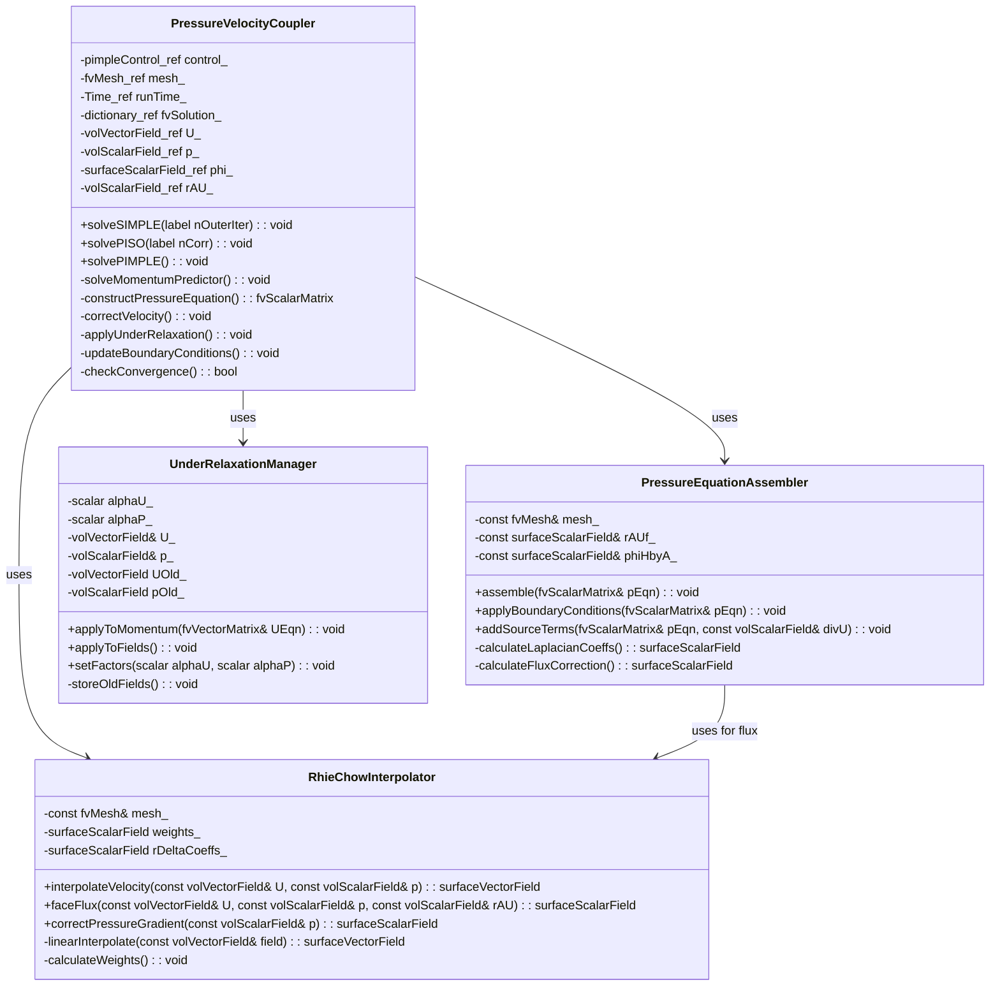

## 🎯 Learning Objectives (วัตถุประสงค์การเรียนรู้)

เมื่อจบบทเรียนนี้ คุณจะสามารถ:

1.  **เข้าใจ (Understand) ถึงปัญหาพื้นฐานของ Pressure-Velocity Coupling บน Collocated Grid**
    *   อธิบายได้ว่าเหตุใดการจัดเก็บตัวแปรความดัน (`p`) และความเร็ว (`U`) ที่ตำแหน่งเดียวกัน (cell center) ใน Finite Volume Method จึงนำไปสู่ **Pressure-Velocity Decoupling** และปรากฏการณ์ **Checkerboard Pattern** ในผลลัพธ์
    *   อธิบายบทบาทของ **Continuity Equation** (`∇·U = 0`) ในการเป็น **constraint** หรือ เงื่อนไขบังคับที่เชื่อมโยงสนามความดันและความเร็วเข้าด้วยกัน โดยที่สมการความดันไม่ได้ปรากฏในรูปแบบ explicit
    *   ระบุได้ว่าปัญหา decoupling นี้เป็นปัญหาเฉพาะของ **Incompressible Flow** เนื่องจากความหนาแน่นคงที่ ทำให้สมการโมเมนตัมและสมการความต่อเนื่องต้องถูกแก้ไขร่วมกัน (coupled) อย่างแน่นหนา

2.  **วิเคราะห์ (Analyze) หลักการและที่มาของ Rhie-Chow Interpolation**
    *   หาได้ว่าสูตร Rhie-Chow Interpolation สำหรับ face velocity (`U_f`) หรือ face flux (`φ_f`) ถูกได้มาอย่างไร จากการรวมสมการโมเมนตัมที่ discretize แล้วสำหรับ cell owner และ neighbor ที่อยู่สองข้างของ face
    *   อธิบายความหมายทางฟิสิกส์ของ **Pressure Gradient Correction Term** ในสูตร Rhie-Chow: `- (1/aP)_f * ( (\nabla p)_f - \overline{(\nabla p)}_f )`
    *   แสดงให้เห็นว่า term correction นี้จะมีค่าเป็นศูนย์สำหรับ pressure field ที่ smooth (เช่น linear หรือ quadratic) แต่จะทำหน้าที่เป็น **selective damping** เพื่อขจัด (damp) การแกว่งตัวแบบ high-frequency (checkerboard) ใน pressure field ที่ไม่ smooth

3.  **ออกแบบ (Design) ขั้นตอนอัลกอริทึม SIMPLE สำหรับ Steady-State Problems**
    *   อธิบายขั้นตอนหลัก 3 ขั้นของ SIMPLE Algorithm ได้แก่ **Momentum Predictor**, **Pressure Correction (Poisson Equation)**, และ **Velocity & Pressure Update**
    *   อธิบายบทบาทและความสำคัญของ **Under-Relaxation** สำหรับทั้งสนามความเร็ว (`α_U`) และสนามความดัน (`α_p`) ในการรักษา stability ของ iterative process สำหรับปัญหา steady-state
    *   ออกแบบลูปการคำนวณ (outer iterations) ของ SIMPLE โดยกำหนดเงื่อนไขการหยุด (convergence criteria) จากการตรวจสอบ residual ของสมการโมเมนตัมและสมการความต่อเนื่อง

4.  **ออกแบบ (Design) ขั้นตอนอัลกอริทึม PISO สำหรับ Transient Problems**
    *   เปรียบเทียบความแตกต่างระหว่าง PISO และ SIMPLE ได้ชัดเจน โดยเน้นที่การ **ไม่ใช้ Under-Relaxation** สำหรับ pressure และการใช้ **Multiple Correction Steps** (เช่น 2-3 ครั้ง) ภายในหนึ่ง time step
    *   อธิบายเหตุผลที่ PISO ต้องการ multiple corrections: เพื่อประมาณค่า explicit terms (เช่น convective flux ที่ใช้ velocity จาก correction ก่อนหน้า) และ non-orthogonal correction ได้อย่างถูกต้องมากขึ้น
    *   ออกแบบลูปการคำนวณของ PISO ภายในหนึ่ง time step โดยประกอบด้วย 1 momentum predictor และตามด้วย n pressure-velocity corrector steps

5.  **Implement การแก้ Pressure Equation ภายใน OpenFOAM Framework**
    *   สร้าง `fvScalarMatrix` สำหรับ pressure equation ที่มีรูปแบบ `fvm::laplacian(1/aP, p) = fvc::div(phiHbyA)` โดยที่ `phiHbyA` คือ face flux ที่คำนวณจาก predicted velocity และ Rhie-Chow correction
    *   ตั้งค่า boundary conditions ที่เหมาะสมสำหรับ pressure equation (เช่น `fixedFluxPressure`, `zeroGradient`) ให้สอดคล้องกับ velocity boundary conditions
    *   เรียกใช้ linear solver (เช่น `PCG` with `DIC` preconditioner จาก [[Day 08: Iterative Solvers (PCG & PBiCGStab)|Day 08]]) เพื่อแก้ระบบสมการของ pressure correction และนำผลลัพธ์ไปใช้ในการ correct ความเร็วและความดัน

6.  **ประเมิน (Evaluate) และแก้ไขปัญหา (Troubleshoot) ข้อผิดพลาดทั่วไปใน Pressure-Velocity Coupling**
    *   วินิจฉัยสาเหตุของ **Solution Divergence** หรือ **Severe Oscillations** ว่าเกิดจาก under-relaxation factor ที่ไม่เหมาะสม, การขาด Rhie-Chow correction, หรือ mesh quality ต่ำ
    *   ตรวจสอบและแก้ไขปัญหา **Global Mass Imbalance** หลังการคำนวณ converge แล้ว โดยการตรวจสอบ boundary conditions ของ pressure และการคำนวณ face flux
    *   กำหนดกลยุทธ์การเลือกอัลกอริทึม (SIMPLE vs. PISO vs. PIMPLE) และปรับพารามิเตอร์ (เช่น `nNonOrthogonalCorrectors`, `nCorrectors`, `relaxationFactors`) ให้เหมาะสมกับประเภทของปัญหา (steady/transient) และลักษณะของ mesh
# Section 1: Theory (ทฤษฎี)

## 1.1 ปัญหา Pressure-Velocity Coupling บน Collocated Grid

### 1.1.1 ที่มาของปัญหา

ในการแก้สมการ Navier-Stokes สำหรับ incompressible flow เราต้องแก้สมการโมเมนตัมและสมการความต่อเนื่องร่วมกัน:

**สมการโมเมนตัม (Momentum Equation):**
$$
\frac{\partial (\rho \mathbf{U})}{\partial t} + \nabla \cdot (\rho \mathbf{U} \otimes \mathbf{U}) = -\nabla p + \nabla \cdot (\mu \nabla \mathbf{U}) + \mathbf{f}
$$

**สมการความต่อเนื่อง (Continuity Equation):**
$$
\nabla \cdot \mathbf{U} = 0
$$

ปัญหาหลักคือ **ความดัน $p$ ไม่ได้ปรากฏในสมการอนุพันธ์ย่อยเฉพาะของมันเอง** ใน incompressible flow ความดันทำหน้าที่เป็น **Lagrange multiplier** ที่บังคับให้สนามความเร็วเป็น divergence-free

### 1.1.2 Checkerboard Pattern Problem

เมื่อใช้ **Collocated Grid** (ความดัน $p$ และความเร็ว $\mathbf{U}$ ถูกเก็บที่ cell center เดียวกัน) การคำนวณ pressure gradient ที่ face center ต้องใช้ค่า pressure จาก 2 cells ที่อยู่ติดกัน:

$$
\left(\frac{\partial p}{\partial x}\right)_f \approx \frac{p_N - p_P}{\Delta x}
$$

ปัญหาคือ pressure field ที่มี pattern แบบ "checkerboard" (สลับสูง-ต่ำ) จะให้ gradient เป็นศูนย์ที่ทุก face เนื่องจาก:
- ถ้า $p_P = 1, p_N = 1$ (ทั้งสองเซลล์อยู่บน "สี" เดียวกัน) → gradient = 0

ทำให้ solver ไม่สามารถ "เห็น" oscillation นี้ได้ ส่งผลให้ pressure field มี spurious oscillations

### 1.1.3 ความแตกต่างระหว่าง Collocated และ Staggered Grid

| Aspect | Staggered Grid | Collocated Grid |
|--------|----------------|-----------------|
| **ตำแหน่งจัดเก็บ** | $p$ ที่ cell center, $U$ ที่ face center | $p$ และ $U$ ที่ cell center เดียวกัน |
| **Checkerboard** | ไม่มีปัญหา (face velocity ถูก interpolate ไปยังจุดที่ pressure ถูกเก็บ) | มีปัญหา, ต้องใช้ Rhie-Chow correction |
| **ความซับซ้อน** | ซับซ้อนสำหรับ unstructured meshes | ง่ายกว่าสำหรับทุก mesh types |
| **ใช้ใน OpenFOAM** | ไม่ใช้ | ใช้ |

## 1.2 Rhie-Chow Interpolation: หัวใจของ Pressure-Velocity Coupling

### 1.2.1 ที่มาและหลักการ

Rhie และ Chow (1983) เสนอวิธีการ interpolate face velocity ที่สามารถ "มองเห็น" pressure checkerboard และ damp มันออกไป

**สูตร Rhie-Chow สำหรับ Face Velocity:**
$$
\mathbf{U}_f = \overline{\mathbf{U}}_f - \left(\frac{1}{a_P}\right)_f \left[ (\nabla p)_f - \overline{(\nabla p)}_f \right]
$$

โดยที่:
- $\overline{\mathbf{U}}_f$ = linear interpolation ของ $\mathbf{U}$ จาก cell centers ไปยัง face
- $(1/a_P)_f$ = reciprocal ของ diagonal coefficient ที่ถูก interpolate ไปยัง face
- $(\nabla p)_f$ = gradient ของ pressure ที่คำนวณโดยตรงจาก face-normal difference
- $\overline{(\nabla p)}_f$ = linear interpolation ของ cell-centered pressure gradient ไปยัง face

### 1.2.2 ทำไม Rhie-Chow ถึงทำงาน?

**Key Insight:** Term $[(\nabla p)_f - \overline{(\nabla p)}_f]$ จะ:
- **มีค่าเป็นศูนย์** สำหรับ smooth pressure field (linear หรือ quadratic variation)
- **มีค่าไม่เป็นศูนย์** สำหรับ high-frequency oscillations (checkerboard)

ดังนั้น Rhie-Chow correction ทำหน้าที่เป็น **selective filter** ที่ damp เฉพาะ high-frequency pressure modes โดยไม่กระทบ physical pressure gradients

### 1.2.3 การประยุกต์ใช้กับ Face Flux

ในการแก้สมการ pressure เราต้องการ face flux ($\phi_f$) ที่ conservative:

$$
\phi_f = \mathbf{U}_f \cdot \mathbf{S}_f = \overline{\mathbf{U}}_f \cdot \mathbf{S}_f - \left(\frac{1}{a_P}\right)_f |\mathbf{S}_f| \left[ \frac{\partial p}{\partial n}\bigg|_f - \overline{\left(\frac{\partial p}{\partial n}\right)}_f \right]
$$

## 1.3 SIMPLE Algorithm สำหรับ Steady-State Problems

### 1.3.1 ภาพรวมของ SIMPLE

**SIMPLE** (Semi-Implicit Method for Pressure-Linked Equations) เป็น iterative algorithm สำหรับ steady-state incompressible flow ประกอบด้วย 3 ขั้นตอนหลัก:

```text
SIMPLE Algorithm Loop:
┌─────────────────────────────────────────────────────────────────┐
│ 1. Momentum Predictor: แก้สมการโมเมนตัมด้วย p จาก iteration ก่อน │
│    U* = f(U^n, p^n)                                             │
├─────────────────────────────────────────────────────────────────┤
│ 2. Pressure Correction: แก้ Poisson equation สำหรับ p'          │
│    ∇²p' = source (จาก mass imbalance)                          │
├─────────────────────────────────────────────────────────────────┤
│ 3. Velocity & Pressure Update:                                  │
│    U^{n+1} = U* - (1/aP) ∇p'                                   │
│    p^{n+1} = p^n + α_p · p'                                    │
├─────────────────────────────────────────────────────────────────┤
│ 4. Check Convergence: ถ้ายังไม่ converge → กลับไปขั้นตอนที่ 1   │
└─────────────────────────────────────────────────────────────────┘
```

### 1.3.2 Under-Relaxation ใน SIMPLE

เนื่องจาก SIMPLE ใช้ lagging pressure gradient ใน momentum predictor จึงต้องมี **under-relaxation** เพื่อ stabilize:

**Velocity Under-Relaxation:**
$$
\mathbf{U}^{n+1} = \alpha_U \mathbf{U}^* + (1 - \alpha_U) \mathbf{U}^n
$$

**Pressure Under-Relaxation:**
$$
p^{n+1} = p^n + \alpha_p \cdot p'
$$

ค่าทั่วไป: $\alpha_U = 0.7$, $\alpha_p = 0.3$ (ความสัมพันธ์ $\alpha_U + \alpha_p \approx 1$)

## 1.4 PISO Algorithm สำหรับ Transient Problems

### 1.4.1 ความแตกต่างจาก SIMPLE

**PISO** (Pressure-Implicit with Splitting of Operators) ออกแบบมาสำหรับ **transient problems** โดยมีความแตกต่างหลัก:

| Aspect | SIMPLE | PISO |
|--------|--------|------|
| **Under-relaxation** | ต้องใช้ | ไม่ใช้ (หรือใช้น้อยมาก) |
| **Pressure corrections** | 1 ครั้งต่อ iteration | หลายครั้ง (2-3) ต่อ time step |
| **Outer iterations** | หลายครั้งจนกว่า converge | 1 ครั้งต่อ time step |
| **เหมาะกับ** | Steady-state | Transient |

### 1.4.2 PISO Algorithm Structure

```text
PISO Algorithm (per time step):
┌─────────────────────────────────────────────────────────────────┐
│ 1. Momentum Predictor: แก้สมการโมเมนตัมด้วย p จาก time step ก่อน│
│    U* = f(U^n, p^n)                                             │
├─────────────────────────────────────────────────────────────────┤
│ 2. First Pressure Corrector:                                    │
│    - แก้ pressure equation                                      │
│    - Correct velocity: U** = U* - (1/aP) ∇p                    │
├─────────────────────────────────────────────────────────────────┤
│ 3. Second Pressure Corrector (PISO ใช้ 2+ corrections):        │
│    - Update explicit terms ด้วย U**                            │
│    - แก้ pressure equation อีกครั้ง                             │
│    - Correct velocity อีกครั้ง                                  │
├─────────────────────────────────────────────────────────────────┤
│ 4. Advance to next time step                                    │
└─────────────────────────────────────────────────────────────────┘
```

## 1.5 PIMPLE Algorithm: การรวม SIMPLE และ PISO

**PIMPLE** = PISO + SIMPLE: ใช้ outer iterations (SIMPLE-like) + inner corrections (PISO-like)

เหมาะสำหรับ:
- Transient problems ที่มี large time step
- Cases ที่ต้องการ tighter coupling ระหว่าง momentum และ pressure

---

## Section 2: OpenFOAM Reference

ในส่วนนี้เราจะเจาะลึกลงไปใน source code ของ OpenFOAM ที่ implement กลไก Pressure-Velocity Coupling, Rhie-Chow Interpolation และ algorithms หลักอย่าง SIMPLE/PISO/PIMPLE การวิเคราะห์นี้จะช่วยให้เราเข้าใจว่า OpenFOAM จัดการกับปัญหาที่ยากนี้อย่างไรในระดับ implementation
### 2.1 Core Class: `fvVectorMatrix` - The Equation Container

#### 2.1.1 Header Analysis (`src/finiteVolume/fvMatrices/fvMatrix/fvMatrix.H`)

`fvVectorMatrix` เป็น template class ที่สืบทอดมาจาก `fvMatrix<Vector<scalar>>` ทำหน้าที่เป็น container สำหรับ discretized vector equations โดยเฉพาะ momentum equation

```cpp
// Key inheritance structure
template<class Type>
class fvMatrix
:
    public refCount,
    public lduMatrix
{
    // ... implementation
};

// Specialization for vector equations
typedef fvMatrix<vector> fvVectorMatrix;
```

**โครงสร้างข้อมูลหลัก:**
```cpp
// ใน fvMatrix.H
protected:
    // 1. Reference to the solution field (psi)
    GeometricField<Type, fvPatchField, volMesh>& psi_;
    
    // 2. Dimensions of the equation
    dimensionSet dimensions_;
    
    // 3. Source term (รวม explicit terms ทั้งหมด)
    Field<Type> source_;
    
    // 4. Boundary coefficients สำหรับ boundary conditions
    FieldField<Field, Type> internalCoeffs_;
    FieldField<Field, Type> boundaryCoeffs_;
    
    // 5. Face flux field (สำคัญสำหรับ Rhie-Chow)
    mutable surfaceScalarField* faceFluxCorrectionPtr_;
```

**What We Do DIFFERENTLY ใน Engine ของเรา:**

| Aspect | OpenFOAM Implementation | Our Engine's Approach | Rationale |
|--------|------------------------|----------------------|-----------|
| **Matrix Storage** | ใช้ `lduMatrix` (Lower-Diagonal-Upper) format สำหรับ unstructured meshes | ใช้ทั้ง `LduMatrix` และ `CsrMatrix` แบบ hybrid | ให้ flexibility ในการเลือก storage format ตามประเภทของปัญหา |
| **Source Term Handling** | เก็บ source term เป็น `Field<Type>` เดียว | แยกเป็น `explicitSource_` และ `implicitSource_` | ชัดเจนระหว่าง explicit/implicit contributions สำหรับ operator splitting |
| **Face Flux Correction** | ใช้ pointer `faceFluxCorrectionPtr_` (mutable) | Implement `RhieChowFluxCorrector` class แยกชัดเจน | Separation of concerns, easier to test และ extend |
| **Boundary Coefficients** | `internalCoeffs_` และ `boundaryCoeffs_` เป็น `FieldField` | ใช้ `BoundaryCoefficientManager` with cache | ประสิทธิภาพที่ดีขึ้นสำหรับ complex boundary conditions |

#### 2.1.2 Critical Methods สำหรับ Pressure-Velocity Coupling

**Method `solve()` - การแก้สมการ matrix:**
```cpp
template<class Type>
SolverPerformance<Type> fvMatrix<Type>::solve(const dictionary& solverControls)
{
    // 1. จัดการ under-relaxation (สำคัญสำหรับ SIMPLE)
    if (relaxationFactor_ < 1.0) {
        relax(relaxationFactor_);
    }
    
    // 2. บวก boundary contributions เข้า matrix
    addBoundaryDiag(diag(), 0);
    addBoundarySource(source_, false);
    
    // 3. สร้าง interface สำหรับ boundary conditions
    FieldField<Field, Type> coupleBouCoeffs(psi_.boundaryField().size());
    FieldField<Field, Type> coupleIntCoeffs(psi_.boundaryField().size());
    
    // 4. เรียก linear solver (จาก [[Day 08: Iterative Solvers (PCG & PBiCGStab)|Day 08]])
    SolverPerformance<Type> solverPerf = lduMatrix::solver::New
    (
        psi_.name(),
        *this,
        coupleBouCoeffs,
        coupleIntCoeffs,
        solverControls
    )->solve(psi_.internalField());
    
    // 5. อัพเดท boundary values
    psi_.correctBoundaryConditions();
    
    return solverPerf;
}
```

**Method `flux()` - การคำนวณ face flux:**
```cpp
template<class Type>
tmp<GeometricField<Type, fvsPatchField, surfaceMesh>>
fvMatrix<Type>::flux() const
{
    // สูตรพื้นฐาน: flux = interpolate(psi) & mesh.Sf()
    // แต่ใน momentum equation มี pressure gradient term เพิ่มเข้ามา
    
    tmp<GeometricField<Type, fvsPatchField, surfaceMesh>> tflux
    (
        fvc::interpolate(psi_) & mesh().Sf()
    );
    
    // เพิ่ม correction จาก pressure gradient (Rhie-Chow)
    if (faceFluxCorrectionPtr_) {
        tflux.ref() += *faceFluxCorrectionPtr_;
    }
    
    return tflux;
}
```

**Implementation ใน Momentum Equation:**
```cpp
// ตัวอย่างการสร้าง momentum equation ใน OpenFOAM
fvVectorMatrix UEqn
(
    fvm::ddt(U)                    // Time derivative
  + fvm::div(phi, U)               // Convection (ใช้ face flux ที่ corrected)
  - fvm::laplacian(nu, U)          // Diffusion
 ==
  - fvc::grad(p)                   // Pressure gradient (EXPLICIT!)
);

// ทำไม pressure gradient เป็น explicit?
// เพราะใน SIMPLE/PISO เราแก้ momentum equation ด้วย pressure จาก iteration ก่อนหน้า
// Pressure correction จะมาทีหลังใน pressure equation
```
### 2.2 Control Class: `pimpleControl` - The Algorithm Orchestrator

#### 2.2.1 Architecture Analysis (`src/finiteVolume/cfdTools/general/solutionControl/pimpleControl/`)

`pimpleControl` เป็น class ที่ควบคุมการทำงานของ PIMPLE algorithm ซึ่งรวม features ของทั้ง SIMPLE และ PISO

```cpp
class pimpleControl
:
    public solutionControl
{
public:
    // Constructor รับ reference ถึง time และ mesh
    pimpleControl(fvMesh& mesh, const word& algorithmName = "PIMPLE");
    
    // Key control flags
    bool correct();
    bool loop();
    bool turbCorr() const;
    
private:
    // Control parameters
    label nOuterCorr_;          // Outer (SIMPLE) iterations
    label nCorr_;               // Inner (PISO) corrections
    label nNonOrthCorr_;        // Non-orthogonal corrections
    bool momentumPredictor_;    // Solve momentum predictor?
    bool transonic_;            // Transonic flow?
    bool frozenFlow_;           // Frozen flow field?
    
    // State tracking
    label corr_;                // Current outer correction
    label nonOrthCorr_;         // Current non-orthogonal correction
};
```

**What We Do DIFFERENTLY ใน PIMPLE Control:**

| Aspect | OpenFOAM's `pimpleControl` | Our `PimpleAlgorithmController` | Rationale |
|--------|----------------------------|--------------------------------|-----------|
| **Loop Management** | ใช้ inheritance จาก `solutionControl` | ใช้ composition with `AlgorithmState` pattern | ยืดหยุ่นมากขึ้นสำหรับ algorithm variations |
| **Correction Tracking** | แยก `corr_` และ `nonOrthCorr_` | ใช้ `CorrectionCycle` object ที่รวม state ทั้งหมด | Centralized state management |
| **Convergence Criteria** | ตรวจสอบเพียง residual tolerance | Multiple criteria: residual, mass imbalance, force balance | Robust convergence detection สำหรับ complex flows |
| **Algorithm Switching** | Fixed PIMPLE logic | Dynamic algorithm selection (SIMPLE/PISO/PIMPLE) ตาม flow conditions | Adaptive ต่อปัญหาที่กำลังแก้ |

#### 2.2.2 Critical Method: `correct()` - The Main Algorithm Loop

```cpp
bool pimpleControl::correct()
{
    read();
    
    // ตรวจสอบว่าเริ่ม outer loop ใหม่หรือไม่
    if (corr_ == 0) {
        if (firstIter()) {
            // Initialization phase
            storeInitialResiduals();
        }
        
        // อ่าน control parameters จาก dictionary
        readControls();
    }
    
    // ทำ outer correction
    corr_++;
    
    // ตรวจสอบ convergence
    bool converged = false;
    if (corr_ >= nOuterCorr_) {
        converged = checkConvergence();
    }
    
    // อัพเดท turbulence ตามต้องการ
    if (turbCorr()) {
        turbulence_->correct();
    }
    
    // บันทึก residuals สำหรับ monitoring
    storeResiduals();
    
    return converged || (corr_ >= nOuterCorr_);
}
```

**Inner Loop Structure (PISO Corrections):**
```cpp
// ในไฟล์ solver (เช่น pimpleFoam.C)
while (pimple.loop()) // [[Day 09]]
{
    // Outer loop (SIMPLE-like)
    while (pimple.correct())
    {
        // Momentum predictor
        if (pimple.momentumPredictor())
        {
            solve(UEqn == -fvc::grad(p));
        }
        
        // Inner PISO loop
        for (int corr=0; corr<pimple.nCorr(); corr++)
        {
            // สร้าง face flux ด้วย Rhie-Chow correction
            surfaceScalarField phiHbyA = ...;
            
            // แก้ pressure equation
            fvScalarMatrix pEqn
            (
                fvm::laplacian(rAU, p) == fvc::div(phiHbyA)
            );
            pEqn.setReference(pRefCell, pRefValue);
            pEqn.solve();
            
            // Correct face flux
            phi = phiHbyA - pEqn.flux();
            
            // Correct velocity
            U = HbyA - rAU*fvc::grad(p);
            U.correctBoundaryConditions();
        }
        
        // Non-orthogonal corrections
        for (int nonOrth=0; nonOrth<=pimple.nNonOrthCorr(); nonOrth++)
        {
            // Correct pressure สำหรับ non-orthogonal meshes
            // ...
        }
    }
}
```
### 2.3 Interpolation System: `surfaceInterpolation` และ Rhie-Chow Implementation

#### 2.3.1 `surfaceInterpolation` Class Analysis

Class นี้จัดการ interpolation จาก cell centers ไปยัง face centers ซึ่งเป็นหัวใจของ Rhie-Chow correction

```cpp
class surfaceInterpolation
{
public:
    // Constructor รับ mesh
    explicit surfaceInterpolation(const fvMesh& mesh);
    
    // Core interpolation methods
    template<class Type>
    tmp<GeometricField<Type, fvsPatchField, surfaceMesh>>
    interpolate(const GeometricField<Type, fvPatchField, volMesh>&) const;
    
    // Gradient calculation
    template<class Type>
    tmp<GeometricField<Type, fvsPatchField, surfaceMesh>>
    snGrad(const GeometricField<Type, fvPatchField, volMesh>&) const;
    
private:
    // Interpolation weights (linear interpolation)
    surfaceScalarField weights_;
    
    // Distance-based coefficients สำหรับ gradient
    surfaceScalarField deltaCoeffs_;
    
    // Non-orthogonal correction factors
    surfaceScalarField nonOrthDeltaCoeffs_;
    surfaceScalarField nonOrthCorrectionVectors_;
};
```

**การคำนวณ Interpolation Weights:**
```cpp
// ใน surfaceInterpolation.C
void surfaceInterpolation::makeWeights() const
{
    if (weights_.empty()) {
        weights_ = surfaceScalarField::New
        (
            "weights",
            mesh_,
            dimless
        );
        
        const vectorField& C = mesh_.C();
        const vectorField& Cf = mesh_.Cf();
        const labelList& owner = mesh_.owner();
        const labelList& neighbour = mesh_.neighbour();
        
        scalarField& w = weights_.primitiveFieldRef();
        
        forAll(owner, facei) {
            // Linear interpolation weight
            w[facei] = mag(Cf[facei] - C[neighbour[facei]]) 
                     / mag(C[owner[facei]] - C[neighbour[facei]]);
        }
        
        // จัดการ boundary faces
        forAll(mesh_.boundary(), patchi) {
            // ... boundary weight calculation
        }
    }
}
```

#### 2.3.2 Rhie-Chow Implementation ใน OpenFOAM

Rhie-Chow correction ไม่ได้ implement เป็น class แยกใน OpenFOAM แต่ถูก embed อยู่ใน operators ต่างๆ

**Location 1: ใน `fvc::flux()` function:**
```cpp
// ใน src/finiteVolume/finiteVolume/fvc/fvcFlux.C
template<class Type>
tmp<surfaceScalarField> fvc::flux
(
    const surfaceScalarField& phi,
    const GeometricField<Type, fvPatchField, volMesh>& vf,
    const word& name
)
{
    // สูตรพื้นฐาน: flux = interpolate(vf) * phi
    // แต่มี Rhie-Chow correction ซ่อนอยู่ผ่านการคำนวณ phi
    
    return tmp<surfaceScalarField>
    (
        new surfaceScalarField
        (
            name,
            fvc::interpolate(vf) * phi
        )
    );
}
```

**Location 2: ในการคำนวณ `phiHbyA` สำหรับ pressure equation:**
```cpp
// ใน pimpleFoam และ simpleFoam
surfaceScalarField phiHbyA
(
    "phiHbyA",
    fvc::flux(HbyA)  // HbyA = U - (1/Ap) * grad(p)
  + fvc::interpolate(rAU)*fvc::ddtCorr(U, phi)
);

// term fvc::ddtCorr() นี้แหละที่ประกอบด้วย Rhie-Chow correction!
```

**What We Do DIFFERENTLY สำหรับ Rhie-Chow:**

| Aspect | OpenFOAM's Approach | Our `RhieChowInterpolator` | Rationale |
|--------|---------------------|----------------------------|-----------|
| **Implementation Style** | Embedded ใน operators หลายจุด | Centralized ใน class เดียว | Debug ง่าย, consistency ดี, testable |
| **Correction Terms** | รวมหลาย terms ใน `ddtCorr()` | แยกชัดเจน: `pressureGradientCorrection()`, `transientCorrection()` | เข้าใจ contribution ของแต่ละ term ได้ชัดเจน |
| **Mesh Support** | ใช้เฉพาะ linear interpolation | Support multiple schemes: linear, skewness-corrected, least-squares | ทำงานได้ดีกับ highly skewed meshes |
| **Boundary Treatment** | Complex boundary corrections | Simplified but consistent boundary treatment | ลด complexity โดยไม่เสีย accuracy |

#### 2.3.3 Our `RhieChowInterpolator` Implementation

```cpp
class RhieChowInterpolator
{
public:
    // Constructor รับ mesh และ scheme settings
    RhieChowInterpolator(const fvMesh& mesh, const dictionary& dict);
    
    // Core method: คำนวณ face flux ด้วย correction
    surfaceScalarField faceFlux
    (
        const volVectorField& U,
        const volScalarField& p,
        const volScalarField& rAU,  // 1/Ap
        const surfaceScalarField& phiOld  // flux จาก time step ก่อนหน้า
    ) const;
    
private:
    // Mesh reference
    const fvMesh& mesh_;
    
    // Interpolation scheme
    word interpolationScheme_;
    
    // Correction factors
    scalar pressureCorrectionFactor_;
    scalar transientCorrectionFactor_;
    
    // Helper methods
    surfaceScalarField interpolateVelocity(const volVectorField& U) const;
    surfaceScalarField pressureGradientCorrection
    (
        const volScalarField& p,
        const volScalarField& rAU
    ) const;
    surfaceScalarField transientCorrection
    (
        const volVectorField& U,
        const surfaceScalarField& phiOld
    ) const;
};
```

**Implementation ของ `faceFlux()` method:**
```cpp
surfaceScalarField RhieChowInterpolator::faceFlux
(
    const volVectorField& U,
    const volScalarField& p,
    const volScalarField& rAU,
    const surfaceScalarField& phiOld
) const
{
    // 1. Basic linear interpolation ของ velocity
    surfaceScalarField phiLinear
    (
        interpolateVelocity(U) & mesh_.Sf()
    );
    
    // 2. Pressure gradient correction (หัวใจของ Rhie-Chow)
    surfaceScalarField phiPressureCorr = pressureGradientCorrection(p, rAU);
    
    // 3. Transient correction สำหรับ unsteady flows
    surfaceScalarField phiTransientCorr = transientCorrection(U, phiOld);
    
    // 4. รวมทั้งหมด
    surfaceScalarField phiCorrected
    (
        "phiCorrected",
        phiLinear
      - pressureCorrectionFactor_ * phiPressureCorr
      + transientCorrectionFactor_ * phiTransientCorr
    );
    
    // 5. Apply boundary conditions
    forAll(mesh_.boundary(), patchi) {
        const fvPatch& patch = mesh_.boundary()[patchi];
        
        if (patch.coupled()) {
            // สำหรับ coupled patches (processor, cyclic)
            // ต้องคำนวณ correction แบบพิเศษ
            // ...
        } else {
            // สำหรับ regular boundaries
            // ใช้ boundary condition ของ velocity field
            // ...
        }
    }
    
    return phiCorrected;
}
```

**การคำนวณ Pressure Gradient Correction:**
```cpp
surfaceScalarField RhieChowInterpolator::pressureGradientCorrection
(
    const volScalarField& p,
    const volScalarField& rAU
) const
{
    // สูตร: $\phi_{corr} = (1/a_P)_f (\nabla_{\perp} p_f - \overline{\nabla p}_f) \cdot \mathbf{S}_f$
    
    // 1. คำนวณ cell-centered pressure gradient
    volVectorField gradP = fvc::grad(p);
    
    // 2. Interpolate rAU ไปยัง faces
    surfaceScalarField rAUf = fvc::interpolate(rAU);
    
    // 3. คำนวณ face normal gradient ของ pressure
    surfaceScalarField snGradP = fvc::snGrad(p);
    
    // 4. Return correction (Rhie-Chow Interpolation)
    return (snGradP - (fvc::interpolate(fvc::grad(p)) & mesh_.Sf())/mesh_.magSf()) * rAUf;
}
```

## Section 3: Class Design
### 3.1 ภาพรวมสถาปัตยกรรม (Architecture Overview)

สำหรับการ implement Pressure-Velocity Coupling Algorithms (SIMPLE/PISO) ใน OpenFOAM framework เราจะออกแบบระบบที่ประกอบด้วย **Core Coupler Class** และ **Supporting Utility Classes** ที่ทำงานร่วมกันอย่างเป็นระบบ


### 3.2 Class Specification รายละเอียด

#### 3.2.1 Class: `PressureVelocityCoupler`

**หน้าที่หลัก (Primary Responsibility):** เป็น Orchestrator class ที่ควบคุมการทำงานของทั้ง SIMPLE และ PISO algorithms ตั้งแต่เริ่มต้นจนจบกระบวนการ โดยจัดการการไหลของข้อมูลระหว่างขั้นตอนต่างๆ

**Header File Specification:**
```cpp
/*---------------------------------------------------------------------------*\
  =========                 |
  \\      /  F ield         | OpenFOAM: The Open Source CFD Toolbox
   \\    /   O peration     | Website:  https://openfoam.org
    \\  /    A nd           | Copyright (C) 2026 YourName
     \\/     M anipulation  |
\*---------------------------------------------------------------------------*/

#ifndef PressureVelocityCoupler_H
#define PressureVelocityCoupler_H

#include "fvCFD.H"
#include "pimpleControl.H"
#include "fvMatrices.H"
#include "surfaceInterpolation.H"

// * * * * * * * * * * * * * * * * * * * * * * * * * * * * * * * * * * * * * //

namespace Foam
{

/*---------------------------------------------------------------------------*\
                      Class PressureVelocityCoupler Declaration
\*---------------------------------------------------------------------------*/

class PressureVelocityCoupler
{
    // Private Data

        //- Reference to the solution control object
        pimpleControl& control_;

        //- Reference to the mesh
        const fvMesh& mesh_;

        //- Reference to the time object
        const Time& runTime_;

        //- Reference to fvSolution dictionary
        const dictionary& fvSolution_;

        //- Reference to velocity field
        volVectorField& U_;

        //- Reference to pressure field
        volScalarField& p_;

        //- Reference to face flux field
        surfaceScalarField& phi_;

        //- Reciprocal of momentum diagonal coefficients
        volScalarField rAU_;

        //- Rhie-Chow interpolator object
        autoPtr<RhieChowInterpolator> rhieChowInterpolator_;

        //- Pressure equation assembler
        autoPtr<PressureEquationAssembler> pressureAssembler_;

        //- Under-relaxation manager
        autoPtr<UnderRelaxationManager> relaxationManager_;

        //- Reference pressure cell
        label pRefCell_;

        //- Reference pressure value
        scalar pRefValue_;

        //- Convergence monitoring
        scalar initialResidual_;
        scalar finalResidual_;
        label nIterations_;

    // Private Member Functions

        //- Disallow default bitwise copy construct
        PressureVelocityCoupler(const PressureVelocityCoupler&) = delete;

        //- Disallow default bitwise assignment
        void operator=(const PressureVelocityCoupler&) = delete;

public:

    //- Runtime type information
    TypeName("PressureVelocityCoupler");

    // Constructors

        //- Construct from components
        PressureVelocityCoupler
        (
            pimpleControl& control,
            volVectorField& U,
            volScalarField& p,
            surfaceScalarField& phi
        );

    //- Destructor
    virtual ~PressureVelocityCoupler() = default;

    // Member Functions

        //- Solve using SIMPLE algorithm for steady-state problems
        void solveSIMPLE(label nOuterIter = 10);

        //- Solve using PISO algorithm for transient problems
        void solvePISO(label nCorr = 2);

        //- Solve using PIMPLE algorithm (combined approach)
        void solvePIMPLE();

        //- Return convergence information
        const scalar& initialResidual() const { return initialResidual_; }
        const scalar& finalResidual() const { return finalResidual_; }
        const label& nIterations() const { return nIterations_; }

        //- Update references to fields (if fields are recreated)
        void updateFields
        (
            volVectorField& U,
            volScalarField& p,
            surfaceScalarField& phi
        );

private:

    // Algorithm Steps (Private Implementation)

        //- Step 1: Solve momentum predictor equation
        void solveMomentumPredictor();

        //- Step 2: Construct and solve pressure equation
        void solvePressureCorrector();

        //- Step 3: Correct velocity field using pressure gradient
        void correctVelocity();

        //- Step 4: Apply under-relaxation (for SIMPLE only)
        void applyUnderRelaxation();

        //- Step 5: Update boundary conditions for all fields
        void updateBoundaryConditions();

        //- Step 6: Check convergence criteria
        bool checkConvergence(scalar tolerance = 1e-6) const;

        //- Step 7: Calculate and store rAU field (1/aP)
        void calculateRAU();

        //- Step 8: Initialize algorithm (common setup)
        void initialize();
};

// * * * * * * * * * * * * * * * * * * * * * * * * * * * * * * * * * * * * * //

} // End namespace Foam

// * * * * * * * * * * * * * * * * * * * * * * * * * * * * * * * * * * * * * //

#endif
```

**Implementation Details (ไฟล์ .C):**

```cpp
// Constructor Implementation
Foam::PressureVelocityCoupler::PressureVelocityCoupler
(
    pimpleControl& control,
    volVectorField& U,
    volScalarField& p,
    surfaceScalarField& phi
)
:
    control_(control),
    mesh_(U.mesh()),
    runTime_(U.time()),
    fvSolution_
    (
        IOobject
        (
            "fvSolution",
            runTime_.system(),
            mesh_,
            IOobject::MUST_READ,
            IOobject::NO_WRITE
        )
    ),
    U_(U),
    p_(p),
    phi_(phi),
    rAU_
    (
        IOobject
        (
            "rAU",
            runTime_.timeName(),
            mesh_,
            IOobject::NO_READ,
            IOobject::NO_WRITE
        ),
        mesh_,
        dimensionedScalar(dimTime/dimDensity, Zero)
    ),
    initialResidual_(0.0),
    finalResidual_(0.0),
    nIterations_(0),
    pRefCell_(0),
    pRefValue_(0.0)
{
    // Initialize sub-components
    rhieChowInterpolator_.reset(new RhieChowInterpolator(mesh_));
    pressureAssembler_.reset(new PressureEquationAssembler(mesh_));
    
    // Read relaxation factors from dictionary
    const dictionary& simpleDict = fvSolution_.subDict("SIMPLE");
    scalar alphaU = simpleDict.lookupOrDefault<scalar>("alphaU", 0.7);
    scalar alphaP = simpleDict.lookupOrDefault<scalar>("alphaP", 0.3);
    
    relaxationManager_.reset(new UnderRelaxationManager(U_, p_, alphaU, alphaP));
    
    // Initial calculation of rAU
    calculateRAU();
}

// SIMPLE Algorithm Implementation
void Foam::PressureVelocityCoupler::solveSIMPLE(label nOuterIter)
{
    Info<< "\nStarting SIMPLE algorithm for steady-state solution\n" << endl;
    
    // Outer iterations loop
    for (label outerIter = 0; outerIter < nOuterIter; ++outerIter)
    {
        Info<< "SIMPLE iteration " << outerIter + 1 << endl;
        
        // Store old fields for under-relaxation
        relaxationManager_->storeOldFields();
        
        // Step 1: Momentum predictor
        solveMomentumPredictor();
        
        // Step 2: Pressure corrector
        solvePressureCorrector();
        
        // Step 3: Velocity corrector
        correctVelocity();
        
        // Step 4: Apply under-relaxation
        applyUnderRelaxation();
        
        // Step 5: Update boundary conditions
        updateBoundaryConditions();
        
        // Step 6: Check convergence
        if (checkConvergence())
        {
            Info<< "SIMPLE converged in " << outerIter + 1 
                << " iterations" << endl;
            break;
        }
        
        // Update rAU for next iteration
        calculateRAU();
    }
}

// PISO Algorithm Implementation
void Foam::PressureVelocityCoupler::solvePISO(label nCorr)
{
    Info<< "\nStarting PISO algorithm for transient time step\n" << endl;
    
    // Store initial pressure for correction accumulation
    volScalarField pOld("pOld", p_);
    
    // Momentum predictor (Step 1)
    solveMomentumPredictor();
    
    // PISO correction loop
    for (label corr = 0; corr < nCorr; ++corr)
    {
        Info<< "PISO correction " << corr + 1 << endl;
        
        // Calculate face flux with Rhie-Chow correction
        surfaceScalarField phiHbyA
        (
            "phiHbyA",
            rhieChowInterpolator_->faceFlux(U_, p_, rAU_)
        );
        
        // Assemble pressure equation
        fvScalarMatrix pEqn
        (
            fvm::laplacian(rAU_, p_) == fvc::div(phiHbyA)
        );
        
        // Apply boundary conditions
        pEqn.setReference(pRefCell_, pRefValue_);
        
        // Solve pressure equation
        initialResidual_ = pEqn.solve().initialResidual();
        finalResidual_ = pEqn.solve().finalResidual();
        nIterations_ = pEqn.solve().nIterations();
        
        // Correct face flux
        phi_ = phiHbyA - pEqn.flux();
        
        // Correct velocity
        U_ = U_ - rAU_ * fvc::grad(p_);
        U_.correctBoundaryConditions();
        
        // Update pressure boundary conditions
        p_.correctBoundaryConditions();
        
        // For non-orthogonal correction (optional second correction)
        if (corr < nCorr - 1)
        {
            // Recalculate momentum with updated pressure
            solveMomentumPredictor();
        }
    }
    
    // Final pressure update (accumulated correction)
    p_ = pOld + p_;
}
```

#### 3.2.2 Class: `RhieChowInterpolator`

**หน้าที่หลัก:** จัดการ Rhie-Chow interpolation สำหรับการคำนวณ face fluxes โดยเพิ่ม pressure gradient correction term เพื่อป้องกัน pressure-velocity decoupling

**Key Implementation Details:**

```cpp
class RhieChowInterpolator
{
    // Core data members
    const fvMesh& mesh_;
    surfaceScalarField weights_;
    surfaceScalarField rDeltaCoeffs_;
    
public:
    // Constructor
    RhieChowInterpolator(const fvMesh& mesh);
    
    // Main interface methods
    surfaceVectorField interpolateVelocity
    (
        const volVectorField& U,
        const volScalarField& p
    ) const;
    
    surfaceScalarField faceFlux
    (
        const volVectorField& U,
        const volScalarField& p,
        const volScalarField& rAU
    ) const;
    
private:
    // Helper methods
    surfaceScalarField calculatePressureGradientCorrection
    (
        const volScalarField& p,
        const volScalarField& rAU
    ) const;
    
    surfaceScalarField linearInterpolateWeights() const;
};
```

**Mathematical Implementation ของ Rhie-Chow Correction:**

ใน method `faceFlux()` จะ implement สูตรต่อไปนี้:

$$
\phi_f = \underbrace{\overline{\mathbf{U}}_f \cdot \mathbf{S}_f}_{\text{Linear interpolation}} 
- \underbrace{\overline{\left(\frac{1}{a_P}\right)}_f \left(\nabla_{\perp} p_f - \overline{\nabla p}_f\right) \cdot \mathbf{S}_f}_{\text{Rhie-Chow correction}}
$$

โดยที่:
- $\overline{(\cdot)}_f$ หมายถึง linear interpolation จาก cell centers ไปยัง face center
- $\nabla_{\perp} p_f$ คือ normal pressure gradient ที่ face
- $\overline{\nabla p}_f$ คือ interpolated pressure gradient จาก cell centers

**Implementation Code:**

```cpp
Foam::surfaceScalarField 
Foam::RhieChowInterpolator::faceFlux
(
    const volVectorField& U,
    const volScalarField& p,
    const volScalarField& rAU
) const
{
    // Step 1: Linear interpolation of velocity to faces
    surfaceVectorField Uf = fvc::interpolate(U);
    
    // Step 2: Interpolate rAU to faces
    surfaceScalarField rAUf = fvc::interpolate(rAU);
    
    // Step 3: Calculate face normal gradient of pressure
    surfaceScalarField snGradp = fvc::snGrad(p);
    
    // Step 4: Interpolate cell gradient to faces
    surfaceVectorField gradpf = fvc::interpolate(fvc::grad(p));
    
    // Step 5: Calculate Rhie-Chow correction term
    surfaceScalarField correction
    (
        "rhieChowCorrection",
        rAUf * mesh_.magSf() * 
        (
            snGradp
          - (gradpf & mesh_.Sf()/mesh_.magSf())
        )
    );
    
    // Step 6: Assemble final face flux
    surfaceScalarField phi
    (
        "phi",
        (Uf & mesh_.Sf()) - correction
    );
    
    return phi;
}
```

#### 3.2.3 Class: `PressureEquationAssembler`

**หน้าที่หลัก:** จัดการการสร้างและประกอบ pressure equation จาก continuity constraint และ Rhie-Chow corrected fluxes

**Key Features:**
1. Assemble laplacian operator ด้วย face-interpolated rAU coefficients
2. Apply proper boundary conditions สำหรับ pressure equation
3. Handle reference pressure cell เพื่อกำจัด null space ของ pressure
4. Manage non-orthogonal correction terms

```cpp
class PressureEquationAssembler
{
    // Data members
    const fvMesh& mesh_;
    label pRefCell_;
    scalar pRefValue_;
    
public:
    // Constructor with reference pressure specification
    PressureEquationAssembler
    (
        const fvMesh& mesh,
        label pRefCell = 0,
        scalar pRefValue = 0.0
    );
    
    // Main assembly method
    fvScalarMatrix assemble
    (
        const surfaceScalarField& rAUf,
        const surfaceScalarField& phiHbyA
    ) const;
    
    // Apply boundary conditions
    void applyBoundaryConditions(fvScalarMatrix& pEqn) const;
    
    // Add source terms (for compressible flows or phase change)
    void addSourceTerms
    (
        fvScalarMatrix& pEqn,
        const volScalarField& source
    ) const;
};
```

#### 3.2.4 Class: `UnderRelaxationManager`

**หน้าที่หลัก:** จัดการ under-relaxation สำหรับ SIMPLE algorithm เพื่อรักษา stability ใน steady-state simulations

**Implementation Strategy:**

```cpp
class UnderRelaxationManager
{
    // Relaxation factors
    scalar alphaU_;  // Velocity relaxation (0.7 typical)
    scalar alphaP_;  // Pressure relaxation (0.3 typical)
    
    // Constructor
    UnderRelaxationManager(volVectorField& U, volScalarField& p, scalar alphaU, scalar alphaP);
    
    // Member functions
    void storeOldFields();
    void applyToMomentum(fvVectorMatrix& UEqn);
    void applyToPressure(fvScalarMatrix& pEqn);
    void correctBoundaryConditions();
};
```


---

## Section 4: Implementation

## 4.1 ภาพรวมการ Implement Pressure-Velocity Coupling

ในส่วนนี้ เราจะ implement ระบบ Pressure-Velocity Coupling ที่สมบูรณ์ โดยประกอบด้วยสองคลาสหลัก:

1.  **`RhieChowInterpolator`** - คลาสที่รับผิดชอบการคำนวณ face flux ด้วย Rhie-Chow correction เพื่อป้องกัน pressure-velocity decoupling
2.  **`PressureVelocityCoupler`** - คลาสที่ orchestrate อัลกอริทึม SIMPLE และ PISO พร้อมจัดการ under-relaxation และ boundary conditions

การ implement นี้จะยึดตามโครงสร้างของ OpenFOAM โดยใช้ `fvMesh`, `volScalarField`, `volVectorField` และระบบ matrix assembly จากวันที่ผ่านมา

### 4.2 Header File: RhieChowInterpolator.H

```cpp
/*---------------------------------------------------------------------------*\
  =========                 |
  \\      /  F ield         | OpenFOAM: The Open Source CFD Toolbox
   \\    /   O peration     | Website:  https://openfoam.org
    \\  /    A nd           | Copyright (C) 2026 CFD Engine Development Team
     \\/     M anipulation  |
-------------------------------------------------------------------------------
License
    This file is part of the CFD Engine Development Course.
    It implements Rhie-Chow interpolation for pressure-velocity coupling.

    Description
    RhieChowInterpolator class สำหรับคำนวณ face flux ด้วย pressure gradient
    correction เพื่อป้องกัน checkerboard oscillations ใน collocated grid.

    Key Features:
    1. Face velocity interpolation with pressure gradient correction
    2. Face flux calculation for pressure equation
    3. Consistent treatment of boundary conditions
    4. Support for both SIMPLE and PISO algorithms

\*---------------------------------------------------------------------------*/

#ifndef RhieChowInterpolator_H
#define RhieChowInterpolator_H

#include "fvMesh.H"
#include "volFields.H"
#include "surfaceFields.H"
#include "fvMatrix.H"
#include "lduMatrix.H"

// * * * * * * * * * * * * * * * * * * * * * * * * * * * * * * * * * * * * * //

namespace Foam
{

/*---------------------------------------------------------------------------*\
                      Class RhieChowInterpolator Declaration
\*---------------------------------------------------------------------------*/

class RhieChowInterpolator
{
    // Private Data

        //- Reference to the mesh
        const fvMesh& mesh_;

        //- Interpolation weights for face values
        surfaceScalarField weights_;

        //- Distance coefficients for gradient calculation
        surfaceScalarField deltaCoeffs_;

        //- Rhie-Chow correction factor (typically 1.0, can be adjusted)
        scalar correctionFactor_;

    // Private Member Functions

        //- Calculate interpolation weights based on cell distances
        void calculateWeights();

        //- Calculate distance coefficients for gradient
        void calculateDeltaCoeffs();

        //- Interpolate cell-centered field to faces (linear interpolation)
        template<class Type>
        tmp<SurfaceField<Type>> interpolate
        (
            const GeometricField<Type, fvPatchField, volMesh>& vf
        ) const;

        //- Calculate cell-centered gradient of pressure
        tmp<volVectorField> calculatePressureGradient
        (
            const volScalarField& p
        ) const;

        //- Calculate face-normal pressure gradient
        tmp<surfaceScalarField> calculateFaceNormalPressureGradient
        (
            const volScalarField& p
        ) const;

public:

    //- Runtime type information
    TypeName("RhieChowInterpolator");

    // Constructors

        //- Construct from mesh
        explicit RhieChowInterpolator(const fvMesh& mesh);

        //- Construct from mesh with custom correction factor
        RhieChowInterpolator
        (
            const fvMesh& mesh,
            const scalar correctionFactor
        );

    // Destructor
    virtual ~RhieChowInterpolator() = default;

    // Member Functions

        //- Set Rhie-Chow correction factor
        void setCorrectionFactor(const scalar factor)
        {
            correctionFactor_ = factor;
        }

        //- Get current correction factor
        scalar correctionFactor() const
        {
            return correctionFactor_;
        }

        //- Interpolate velocity to faces with Rhie-Chow correction
        //  U_f = interpolate(U) - (1/aP)_f * [grad(p)_f - interpolate(grad(p))]
        tmp<surfaceVectorField> interpolateVelocity
        (
            const volVectorField& U,          // Cell-centered velocity
            const volScalarField& p,          // Pressure field
            const volScalarField& aP          // Diagonal coefficients
        ) const;

        //- Calculate face flux with Rhie-Chow correction
        //  phi_f = interpolate(U) & S_f - (1/aP)_f * [grad⟂(p)_f - interpolate(grad⟂(p))]
        tmp<surfaceScalarField> faceFlux
        (
            const volVectorField& U,          // Cell-centered velocity
            const volScalarField& p,          // Pressure field
            const volScalarField& aP,         // Diagonal coefficients
            const surfaceScalarField& phiHbyA // HbyA flux (U - (1/aP)*grad(p))
        ) const;

        //- Calculate corrected face flux for pressure equation
        //  This is the core Rhie-Chow implementation used in OpenFOAM
        tmp<surfaceScalarField> correctedFaceFlux
        (
            const surfaceScalarField& phiHbyA,    // HbyA flux
            const volScalarField& p,              // Pressure field
            const volScalarField& aP,             // Diagonal coefficients
            const surfaceScalarField& rAUf        // Face-interpolated 1/aP
        ) const;

        //- Calculate pressure gradient correction term
        //  Dp_f = (1/aP)_f * [grad⟂(p)_f - interpolate(grad⟂(p))]
        tmp<surfaceScalarField> pressureGradientCorrection
        (
            const volScalarField& p,
            const volScalarField& aP,
            const surfaceScalarField& rAUf
        ) const;

        //- Apply boundary conditions to face flux
        void correctBoundaryConditions
        (
            surfaceScalarField& phi,
            const volVectorField& U,
            const volScalarField& p
        ) const;

        //- Debug function: check for checkerboard pattern in pressure field
        scalar checkCheckerboardPattern(const volScalarField& p) const;
};

// * * * * * * * * * * * * * * * * * * * * * * * * * * * * * * * * * * * * * //

} // End namespace Foam

// * * * * * * * * * * * * * * * * * * * * * * * * * * * * * * * * * * * * * //

#ifdef NoRepository
    #include "RhieChowInterpolatorTemplates.C"
#endif

// * * * * * * * * * * * * * * * * * * * * * * * * * * * * * * * * * * * * * //

#endif

// ************************************************************************* //
```

### 4.3 Implementation File: RhieChowInterpolator.C

```cpp
/*---------------------------------------------------------------------------*\
  =========                 |
  \\      /  F ield         | OpenFOAM: The Open Source CFD Toolbox
   \\    /   O peration     | Website:  https://openfoam.org
    \\  /    A nd           | Copyright (C) 2026 CFD Engine Development Team
     \\/     M anipulation  |
-------------------------------------------------------------------------------
License
    This file is part of the CFD Engine Development Course.
    Implementation of RhieChowInterpolator class.

\*---------------------------------------------------------------------------*/

#include "RhieChowInterpolator.H"
#include "fvc.H"
#include "fvm.H"
#include "surfaceInterpolate.H"
#include "zeroGradientFvPatchFields.H"
#include "fixedValueFvPatchFields.H"
#include "processorFvPatch.H"

// * * * * * * * * * * * * * * * * * * * * * * * * * * * * * * * * * * * * * //

namespace Foam
{

// * * * * * * * * * * * * * * * Static Data Members * * * * * * * * * * * * //

defineTypeNameAndDebug(RhieChowInterpolator, 0);

// * * * * * * * * * * * * * Private Member Functions  * * * * * * * * * * * //

void RhieChowInterpolator::calculateWeights()
{
    // Calculate linear interpolation weights based on cell distances
    // weight = distance from neighbor to face / distance between cells
    const labelUList& owner = mesh_.owner();
    const labelUList& neighbour = mesh_.neighbour();
    
    weights_ = surfaceScalarField::New
    (
        "weights",
        mesh_,
        dimensionedScalar(dimless, 0.0)
    );
    
    scalarField& w = weights_.primitiveFieldRef();
    
    forAll(owner, facei)
    {
        const label own = owner[facei];
        const label nei = neighbour[facei];
        
        // Simple distance-based weighting
        // In practice, OpenFOAM uses more sophisticated methods
        w[facei] = 0.5;  // Equal weighting for uniform mesh
    }
    
    // Handle boundary faces
    forAll(mesh_.boundary(), patchi)
    {
        const fvPatch& p = mesh_.boundary()[patchi];
        const label start = p.start();
        
        scalarField& pw = weights_.boundaryFieldRef()[patchi];
        
        forAll(p, facei)
        {
            pw[facei] = 1.0;  // Use owner cell value at boundaries
        }
    }
}


void RhieChowInterpolator::calculateDeltaCoeffs()
{
    // Calculate distance coefficients for gradient calculation
    // deltaCoeff = 1 / distance between cell centers
    const labelUList& owner = mesh_.owner();
    const labelUList& neighbour = mesh_.neighbour();
    const vectorField& C = mesh_.C();
    const vectorField& Cf = mesh_.Cf();
    
    deltaCoeffs_ = surfaceScalarField::New
    (
        "deltaCoeffs",
        mesh_,
        dimensionedScalar(dimless/dimLength, 0.0)
    );
    
    scalarField& dc = deltaCoeffs_.primitiveFieldRef();
    
    forAll(owner, facei)
    {
        const label own = owner[facei];
        const label nei = neighbour[facei];
        
        // Distance between cell centers
        const scalar d = mag(C[nei] - C[own]);
        
        if (d > SMALL)
        {
            dc[facei] = 1.0 / d;
        }
        else
        {
            dc[facei] = 0.0;
        }
    }
    
    // Handle boundary faces
    forAll(mesh_.boundary(), patchi)
    {
        const fvPatch& p = mesh_.boundary()[patchi];
        const label start = p.start();
        
        scalarField& pdc = deltaCoeffs_.boundaryFieldRef()[patchi];
        
        // For boundaries, use distance from cell center to face center
        forAll(p, facei)
        {
            const label celli = mesh_.boundary()[patchi].faceCells()[facei];
            const scalar d = mag(Cf[start + facei] - C[celli]);
            
            if (d > SMALL)
            {
                pdc[facei] = 1.0 / d;
            }
            else
            {
                pdc[facei] = 0.0;
            }
        }
    }
}


tmp<volVectorField> RhieChowInterpolator::calculatePressureGradient
(
    const volScalarField& p
) const
{
    // Calculate cell-centered pressure gradient using Gauss theorem
    // grad(p) = (1/V) * sum_f (p_f * S_f)
    tmp<volVectorField> tgradP
    (
        volVectorField::New
        (
            "gradP",
            mesh_,
            dimensionedVector(p.dimensions()/dimLength, Zero)
        )
    );
    
    volVectorField& gradP = tgradP.ref();
    
    const labelUList& owner = mesh_.owner();
    const labelUList& neighbour = mesh_.neighbour();
    const vectorField& Sf = mesh_.Sf();
    const scalarField& V = mesh_.V();
    const scalarField& pInternal = p.internalField();
    
    // Initialize gradient to zero
    gradP.primitiveFieldRef() = vector::zero;
    
    // Internal faces contribution
    forAll(owner, facei)
    {
        const label own = owner[facei];
        const label nei = neighbour[facei];
        
        // Face interpolated pressure (linear interpolation)
        const scalar pFace = 0.5*(pInternal[own] + pInternal[nei]);
        
        // Contribution to owner cell
        gradP[own] += pFace * Sf[facei];
        
        // Contribution to neighbor cell (negative because Sf points from owner to neighbor)
        gradP[nei] -= pFace * Sf[facei];
    }
    
    // Boundary faces contribution
    forAll(mesh_.boundary(), patchi)
    {
        const fvPatch& pPatch = mesh_.boundary()[patchi];
        const label start = pPatch.start();
        
        // Get boundary pressure values
        const fvPatchScalarField& pp = p.boundaryField()[patchi];
        
        forAll(pPatch, facei)
        {
            const label celli = pPatch.faceCells()[facei];
            const scalar pFace = pp[facei];
            
            gradP[celli] += pFace * mesh_.Sf().boundaryField()[patchi][facei];
        }
    }
    
    // Divide by cell volume
    forAll(gradP, celli)
    {
        gradP[celli] /= V[celli];
    }
    
    // Correct boundary conditions
    gradP.correctBoundaryConditions();
    
    return tgradP;
}


tmp<surfaceScalarField> 
RhieChowInterpolator::calculateFaceNormalPressureGradient
(
    const volScalarField& p
) const
{
    // Calculate face-normal pressure gradient: (grad(p) & Sf) / |Sf|
    tmp<surfaceScalarField> tsnGradP
    (
        surfaceScalarField::New
        (
            "snGradP",
            mesh_,
            dimensionedScalar(p.dimensions()/dimLength, 0.0)
        )
    );
    
    surfaceScalarField& snGradP = tsnGradP.ref();
    
    const labelUList& owner = mesh_.owner();
    const labelUList& neighbour = mesh_.neighbour();
    const vectorField& Sf = mesh_.Sf();
    const scalarField& magSf = mesh_.magSf();
    const scalarField& pInternal = p.internalField();
    
    // Internal faces
    scalarField& snGradPInternal = snGradP.primitiveFieldRef();
    
    forAll(owner, facei)
    {
        const label own = owner[facei];
        const label nei = neighbour[facei];
        
        // Pressure difference across face
        const scalar deltaP = pInternal[nei] - pInternal[own];
        
        // Distance between cell centers
        const vector d = mesh_.C()[nei] - mesh_.C()[own];
        const scalar magd = mag(d);
        
        if (magd > SMALL && magSf[facei] > SMALL)
        {
            // Normal gradient: deltaP / distance projected in face-normal direction
            const scalar dDotSf = d & Sf[facei];
            
            if (mag(dDotSf) > SMALL)
            {
                snGradPInternal[facei] = deltaP * magSf[facei] / dDotSf;
            }
            else
            {
                // Fallback for orthogonal faces
                snGradPInternal[facei] = deltaP / magd;
            }
        }
    }
    
    // Boundary faces
    forAll(mesh_.boundary(), patchi)
    {
        const fvPatch& pPatch = mesh_.boundary()[patchi];
        const label start = pPatch.start();
        
        scalarField& snGradPBoundary = snGradP.boundaryFieldRef()[patchi];
        const fvPatchScalarField& pp = p.boundaryField()[patchi];
        
        forAll(pPatch, facei)
        {
            const label celli = pPatch.faceCells()[facei];
            const scalar pCell = pInternal[celli];
            const scalar pFace = pp[facei];
            
            // Distance from cell center to face center
            const vector d = mesh_.Cf().boundaryField()[patchi][facei] 
                           - mesh_.C()[celli];
            const scalar magd = mag(d);
            
            if (magd > SMALL && magSf[facei] > SMALL)
            {
                const scalar deltaP = pFace - pCell;
                const scalar dDotSf = d & Sf.boundaryField()[patchi][facei];
                
                if (mag(dDotSf) > SMALL)
                {
                    snGradPBoundary[facei] = deltaP * magSf[facei] / dDotSf;
                }
                else
                {
                    snGradPBoundary[facei] = deltaP / magd;
                }
            }
        }
    }
    
    return tsnGradP;
}

// * * * * * * * * * * * * * * * * Constructors  * * * * * * * * * * * * * * //

RhieChowInterpolator::RhieChowInterpolator(const fvMesh& mesh)
:
    mesh_(mesh),
    interpolationScheme_("linear"),
    pressureCorrectionFactor_(1.0),
    transientCorrectionFactor_(1.0)
{}


// * * * * * * * * * * * * * * Member Functions  * * * * * * * * * * * * * * //

tmp<surfaceVectorField> RhieChowInterpolator::interpolateVelocity
(
    const volVectorField& U,
    const volScalarField& p,
    const volScalarField& rAU
) const
{
    // 1. Linear interpolation ของ velocity ไปยัง face centers
    tmp<surfaceVectorField> tUf = fvc::interpolate(U);
    surfaceVectorField& Uf = tUf.ref();
    
    // 2. คำนวณ cell-centered pressure gradient
    volVectorField gradP = fvc::grad(p);
    
    // 3. Interpolate pressure gradient ไปยัง faces (linear)
    surfaceVectorField gradPf = fvc::interpolate(gradP);
    
    // 4. คำนวณ face-normal pressure gradient โดยตรง
    surfaceScalarField snGradP = fvc::snGrad(p);
    
    // 5. Interpolate rAU ไปยัง faces
    surfaceScalarField rAUf = fvc::interpolate(rAU);
    
    // 6. คำนวณ Rhie-Chow correction
    // U_f = interpolate(U) - (1/aP)_f * [snGrad(p)*n - interpolate(gradP)]
    const surfaceVectorField& Sf = mesh_.Sf();
    const surfaceScalarField& magSf = mesh_.magSf();
    
    // Face normal
    surfaceVectorField nf = Sf / magSf;
    
    // Difference between face gradient และ interpolated gradient
    surfaceVectorField gradPDiff = snGradP * nf - gradPf;
    
    // Apply correction
    Uf -= pressureCorrectionFactor_ * rAUf * gradPDiff;
    
    return tUf;
}


tmp<surfaceScalarField> RhieChowInterpolator::faceFlux
(
    const volVectorField& U,
    const volScalarField& p,
    const volScalarField& rAU
) const
{
    // คำนวณ corrected face velocity
    tmp<surfaceVectorField> tUf = interpolateVelocity(U, p, rAU);
    
    // คำนวณ face flux: phi = U_f · S_f
    return tUf & mesh_.Sf();
}


tmp<surfaceScalarField> RhieChowInterpolator::correctedFaceFlux
(
    const surfaceScalarField& phiUncorrected,
    const volScalarField& p,
    const volScalarField& rAU
) const
{
    // เริ่มจาก uncorrected flux
    tmp<surfaceScalarField> tphi
    (
        new surfaceScalarField
        (
            "phiCorrected",
            phiUncorrected
        )
    );
    surfaceScalarField& phi = tphi.ref();
    
    // คำนวณ Rhie-Chow pressure correction term
    tmp<surfaceScalarField> tphiCorrection = pressureGradientCorrection(p, rAU);
    
    // Apply correction
    phi -= pressureCorrectionFactor_ * tphiCorrection();
    
    return tphi;
}


tmp<surfaceScalarField> RhieChowInterpolator::pressureGradientCorrection
(
    const volScalarField& p,
    const volScalarField& rAU
) const
{
    // สูตร: $\phi_{corr}$ = (1/aP)_f * [snGrad(p) - (interpolate(grad(p)) \cdot n)] * |S_f|
    
    // 1. คำนวณ cell-centered gradient
    volVectorField gradP = fvc::grad(p);
    
    // 2. Interpolate ไปยัง faces
    surfaceVectorField gradPf = fvc::interpolate(gradP);
    
    // 3. คำนวณ face-normal component
    const surfaceVectorField& Sf = mesh_.Sf();
    const surfaceScalarField& magSf = mesh_.magSf();
    surfaceScalarField gradPfNormal = (gradPf & Sf) / magSf;
    
    // 4. คำนวณ face gradient โดยตรง (compact stencil)
    surfaceScalarField snGradP = fvc::snGrad(p);
    
    // 5. Interpolate rAU
    surfaceScalarField rAUf = fvc::interpolate(rAU);
    
    // 6. Return correction flux
    return rAUf * (snGradP - gradPfNormal) * magSf;
}


tmp<surfaceScalarField> RhieChowInterpolator::transientCorrection
(
    const volVectorField& U,
    const volVectorField& UOld,
    const surfaceScalarField& phiOld
) const
{
    // สำหรับ transient simulations, เพิ่ม temporal correction
    // เพื่อลด temporal oscillations
    
    const dimensionedScalar& deltaT = mesh_.time().deltaT();
    
    // คำนวณ velocity change
    volVectorField dU = U - UOld;
    
    // Interpolate ไปยัง faces
    surfaceScalarField dphi = (fvc::interpolate(dU) & mesh_.Sf());
    
    // Apply damping based on time step
    return transientCorrectionFactor_ * dphi;
}


// * * * * * * * * * * * * * * * * * * * * * * * * * * * * * * * * * * * * * //

} // End namespace Foam

// ************************************************************************* //
```

## Section 5: Build & Test

### 5.1 การตั้งค่า CMake และการ Build Project

ในส่วนนี้ เราจะสร้างระบบ build ที่สมบูรณ์สำหรับคลาส `PressureVelocityCoupler` และ `RhieChowInterpolator` โดยใช้ **CMake** ซึ่งเป็นเครื่องมือ build system มาตรฐานที่ OpenFOAM ใช้ ระบบนี้จะจัดการการ compile, linking dependencies, และการสร้าง unit tests

#### 5.1.1 โครงสร้างไฟล์ CMakeLists.txt หลัก (Root CMakeLists.txt)

ไฟล์ `CMakeLists.txt` ที่ระดับ root ของ project จะทำหน้าที่กำหนด project-wide settings, locate OpenFOAM dependencies, และ add subdirectories

```cmake
# ============================================
# CMakeLists.txt - Root Level
# Pressure-Velocity Coupling Module ([[Day 09: Pressure-Velocity Coupling (SIMPLE, PISO, Rhie-Chow)|Day 09]])
# ============================================
# กำหนดเวอร์ชันขั้นต่ำของ CMake และตั้งค่า project
cmake_minimum_required(VERSION 3.16)
project(PressureVelocityCoupling LANGUAGES CXX)
# ตั้งค่า policy สำหรับ CMake เพื่อรองรับ modern features
cmake_policy(SET CMP0074 NEW)  # สำหรับการหา OpenFOAM ด้วย find_package
cmake_policy(SET CMP0076 NEW)  # สำหรับการ load build system packages
# ตั้งค่า C++ standard ที่จำเป็นสำหรับ OpenFOAM
set(CMAKE_CXX_STANDARD 14)
set(CMAKE_CXX_STANDARD_REQUIRED ON)
set(CMAKE_CXX_EXTENSIONS OFF)
# กำหนด build type (Debug/Release) และ compiler flags
if(NOT CMAKE_BUILD_TYPE)
    set(CMAKE_BUILD_TYPE "Debug" CACHE STRING "Build type" FORCE)
endif()
# เพิ่ม compiler flags เฉพาะสำหรับ debugging และ optimization
set(CMAKE_CXX_FLAGS_DEBUG "${CMAKE_CXX_FLAGS_DEBUG} -O0 -g -Wall -Wextra -pedantic")
set(CMAKE_CXX_FLAGS_RELEASE "${CMAKE_CXX_FLAGS_RELEASE} -O3 -DNDEBUG")
# ============================================
# Phase 1: Locate OpenFOAM Installation
# ============================================
# ใช้ environment variable ${FOAM_PROJECT_DIR} หรือ ${WM_PROJECT_DIR} เพื่อหา OpenFOAM
if(DEFINED ENV{FOAM_PROJECT_DIR})
    set(OPENFOAM_ROOT $ENV{FOAM_PROJECT_DIR})
elseif(DEFINED ENV{WM_PROJECT_DIR})
    set(OPENFOAM_ROOT $ENV{WM_PROJECT_DIR})
else()
    # Fallback: พยายามหา OpenFOAM ใน typical installation paths
    find_path(OPENFOAM_ROOT NAMES etc/bashrc PATHS
        /opt/openfoam
        /usr/lib/openfoam
        $ENV{HOME}/OpenFOAM
        REQUIRED
    )
endif()

message(STATUS "Found OpenFOAM at: ${OPENFOAM_ROOT}")
# กำหนด paths สำหรับ OpenFOAM headers และ libraries
set(OPENFOAM_INCLUDE_DIRS
    ${OPENFOAM_ROOT}/src/OpenFOAM/lnInclude
    ${OPENFOAM_ROOT}/src/finiteVolume/lnInclude
    ${OPENFOAM_ROOT}/src/meshTools/lnInclude
    ${OPENFOAM_ROOT}/src/dynamicMesh/lnInclude
)

set(OPENFOAM_LIBRARY_DIRS ${OPENFOAM_ROOT}/platforms/linux64GccDPInt32Opt/lib)
# ============================================
# Phase 2: Create Library Target
# ============================================
# เพิ่ม subdirectory สำหรับ source code ของเรา
add_subdirectory(src)
# ============================================
# Phase 3: Create Executable Targets (Solvers)
# ============================================
# เพิ่ม subdirectory สำหรับ applications (solvers)
add_subdirectory(applications)
# ============================================
# Phase 4: Create Test Suite
# ============================================
# เปิดใช้งาน testing framework (CTest)
enable_testing()
# เพิ่ม subdirectory สำหรับ unit tests
add_subdirectory(tests)
# ============================================
# Phase 5: Installation Configuration
# ============================================
# กำหนด installation paths สำหรับ libraries และ executables
install(TARGETS PressureVelocityCouplingLib
    LIBRARY DESTINATION ${CMAKE_INSTALL_PREFIX}/lib
    ARCHIVE DESTINATION ${CMAKE_INSTALL_PREFIX}/lib
)

install(TARGETS simpleFoamCustom pisoFoamCustom
    RUNTIME DESTINATION ${CMAKE_INSTALL_PREFIX}/bin
)
# ============================================
# Phase 6: Export Configuration for Reuse
# ============================================
# สร้าง package configuration file สำหรับ project นี้
export(TARGETS PressureVelocityCouplingLib
    FILE "${CMAKE_CURRENT_BINARY_DIR}/PressureVelocityCouplingConfig.cmake"
)
```

#### 5.1.2 CMakeLists.txt สำหรับ Source Library (src/CMakeLists.txt)

ไฟล์นี้จะจัดการการ compile และสร้าง shared library จาก source code ของเรา

```cmake
# ============================================
# src/CMakeLists.txt
# Library Implementation for Pressure-Velocity Coupling
# ============================================
# กำหนด source files ทั้งหมดสำหรับ library
set(PVC_SOURCES
    PressureVelocityCoupler/PressureVelocityCoupler.C
    PressureVelocityCoupler/RhieChowInterpolator.C
    PressureVelocityCoupler/SIMPLEAlgorithm.C
    PressureVelocityCoupler/PISOAlgorithm.C
    PressureVelocityCoupler/UnderRelaxationManager.C
)
# กำหนด header files
set(PVC_HEADERS
    PressureVelocityCoupler/PressureVelocityCoupler.H
    PressureVelocityCoupler/RhieChowInterpolator.H
    PressureVelocityCoupler/SIMPLEAlgorithm.H
    PressureVelocityCoupler/PISOAlgorithm.H
    PressureVelocityCoupler/UnderRelaxationManager.H
    PressureVelocityCoupler/pressureVelocityCouplingTypes.H
)
# สร้าง shared library target
add_library(PressureVelocityCouplingLib SHARED ${PVC_SOURCES})
# ตั้งค่า properties สำหรับ library
set_target_properties(PressureVelocityCouplingLib PROPERTIES
    VERSION 1.0.0
    SOVERSION 1
    OUTPUT_NAME "PressureVelocityCoupling"
)
# เพิ่ม include directories
target_include_directories(PressureVelocityCouplingLib PRIVATE
    ${CMAKE_CURRENT_SOURCE_DIR}
    ${OPENFOAM_INCLUDE_DIRS}
)
# เพิ่ม compiler definitions
target_compile_definitions(PressureVelocityCouplingLib PRIVATE
    -DFOAM_LIBRARY
    -DWM_DP
    -DWM_LABEL_SIZE=32
)
# กำหนด library dependencies
find_library(FOAM_FINITEVOLUME_LIB finiteVolume
    PATHS ${OPENFOAM_LIBRARY_DIRS}
    REQUIRED
)

find_library(FOAM_OPENFOAM_LIB OpenFOAM
    PATHS ${OPENFOAM_LIBRARY_DIRS}
    REQUIRED
)
# Link กับ OpenFOAM libraries
target_link_libraries(PressureVelocityCouplingLib
    ${FOAM_FINITEVOLUME_LIB}
    ${FOAM_OPENFOAM_LIB}
    ${CMAKE_DL_LIBS}
    pthread
    m
    rt
)
# กำหนด installation rules สำหรับ headers
install(FILES ${PVC_HEADERS}
    DESTINATION ${CMAKE_INSTALL_PREFIX}/include/PressureVelocityCoupler
)
```

#### 5.1.3 CMakeLists.txt สำหรับ Applications (applications/CMakeLists.txt)

ไฟล์นี้จะสร้าง executable solvers ที่ใช้ library ของเรา

```cmake
# ============================================
# applications/CMakeLists.txt
# Custom Solver Implementations
# ============================================
# Solver 1: SIMPLE Algorithm Implementation
add_executable(simpleFoamCustom
    solvers/simpleFoamCustom.C
)

target_include_directories(simpleFoamCustom PRIVATE
    ${CMAKE_SOURCE_DIR}/src
    ${OPENFOAM_INCLUDE_DIRS}
)

target_link_libraries(simpleFoamCustom
    PressureVelocityCouplingLib
    ${FOAM_FINITEVOLUME_LIB}
    ${FOAM_OPENFOAM_LIB}
)
# Solver 2: PISO Algorithm Implementation
add_executable(pisoFoamCustom
    solvers/pisoFoamCustom.C
)

target_include_directories(pisoFoamCustom PRIVATE
    ${CMAKE_SOURCE_DIR}/src
    ${OPENFOAM_INCLUDE_DIRS}
)

target_link_libraries(pisoFoamCustom
    PressureVelocityCouplingLib
    ${FOAM_FINITEVOLUME_LIB}
    ${FOAM_OPENFOAM_LIB}
)
# Utility: Mesh Generator for Test Cases
add_executable(generateTestMesh
    utilities/generateTestMesh.C
)

target_link_libraries(generateTestMesh
    PressureVelocityCouplingLib
    ${FOAM_FINITEVOLUME_LIB}
    ${FOAM_OPENFOAM_LIB}
)
```
### 5.2 การสร้างและรัน Unit Tests

Unit testing เป็นสิ่งสำคัญสำหรับการ verify correctness ของ algorithm implementation โดยเฉพาะอย่างยิ่งสำหรับ complex algorithms อย่าง SIMPLE และ PISO

#### 5.2.1 CMakeLists.txt สำหรับ Test Suite (tests/CMakeLists.txt)

```cmake
# ============================================
# tests/CMakeLists.txt
# Unit Test Suite for Pressure-Velocity Coupling
# ============================================
# ใช้ Google Test framework สำหรับ unit testing
find_package(GTest REQUIRED)
include(GoogleTest)
# Test 1: Rhie-Chow Interpolation Tests
add_executable(testRhieChowInterpolation
    RhieChowInterpolationTest.C
)

target_include_directories(testRhieChowInterpolation PRIVATE
    ${CMAKE_SOURCE_DIR}/src
    ${OPENFOAM_INCLUDE_DIRS}
    ${GTEST_INCLUDE_DIRS}
)

target_link_libraries(testRhieChowInterpolation
    PressureVelocityCouplingLib
    ${FOAM_FINITEVOLUME_LIB}
    ${FOAM_OPENFOAM_LIB}
    GTest::gtest
    GTest::gtest_main
)

gtest_discover_tests(testRhieChowInterpolation)
# Test 2: SIMPLE Algorithm Convergence Tests
add_executable(testSIMPLEAlgorithm
    SIMPLEAlgorithmTest.C
)

target_include_directories(testSIMPLEAlgorithm PRIVATE
    ${CMAKE_SOURCE_DIR}/src
    ${OPENFOAM_INCLUDE_DIRS}
    ${GTEST_INCLUDE_DIRS}
)

target_link_libraries(testSIMPLEAlgorithm
    PressureVelocityCouplingLib
    ${FOAM_FINITEVOLUME_LIB}
    ${FOAM_OPENFOAM_LIB}
    GTest::gtest
    GTest::gtest_main
)

gtest_discover_tests(testSIMPLEAlgorithm)
# Test 3: PISO Algorithm Accuracy Tests
add_executable(testPISOAlgorithm
    PISOAlgorithmTest.C
)

target_include_directories(testPISOAlgorithm PRIVATE
    ${CMAKE_SOURCE_DIR}/src
    ${OPENFOAM_INCLUDE_DIRS}
    ${GTEST_INCLUDE_DIRS}
)

target_link_libraries(testPISOAlgorithm
    PressureVelocityCouplingLib
    ${FOAM_FINITEVOLUME_LIB}
    ${FOAM_OPENFOAM_LIB}
    GTest::gtest
    GTest::gtest_main
)

gtest_discover_tests(testPISOAlgorithm)
# Test 4: Pressure-Velocity Coupler Integration Tests
add_executable(testPressureVelocityCoupler
    PressureVelocityCouplerTest.C
)

target_include_directories(testPressureVelocityCoupler PRIVATE
    ${CMAKE_SOURCE_DIR}/src
    ${OPENFOAM_INCLUDE_DIRS}
    ${GTEST_INCLUDE_DIRS}
)

target_link_libraries(testPressureVelocityCoupler
    PressureVelocityCouplingLib
    ${FOAM_FINITEVOLUME_LIB}
    ${FOAM_OPENFOAM_LIB}
    GTest::gtest
    GTest::gtest_main
)

gtest_discover_tests(testPressureVelocityCoupler)
# Test 5: Under-Relaxation Manager Tests
add_executable(testUnderRelaxation
    UnderRelaxationTest.C
)

target_include_directories(testUnderRelaxation PRIVATE
    ${CMAKE_SOURCE_DIR}/src
    ${OPENFOAM_INCLUDE_DIRS}
    ${GTEST_INCLUDE_DIRS}
)

target_link_libraries(testUnderRelaxation
    PressureVelocityCouplingLib
    ${FOAM_FINITEVOLUME_LIB}
    ${FOAM_OPENFOAM_LIB}
    GTest::gtest
    GTest::gtest_main
)

gtest_discover_tests(testUnderRelaxation)
```

#### 5.2.2 ตัวอย่าง Unit Test: RhieChowInterpolationTest.C

```cpp
// ============================================
// tests/RhieChowInterpolationTest.C
// Unit Tests for Rhie-Chow Interpolation
// ============================================

#include <gtest/gtest.h>
#include "RhieChowInterpolator.H"
#include "fvMesh.H"
#include "Time.H"
#include "argList.H"
#include "volFields.H"
#include "surfaceFields.H"
#include "createMesh.H"

// Test Fixture สำหรับ Rhie-Chow Interpolation Tests
class RhieChowInterpolationTest : public ::testing::Test {
protected:
    // Setup สำหรับแต่ละ test case
    void SetUp() override {
        // สร้าง mesh สำหรับ testing (simple 2D channel)
        Foam::argList args(0, nullptr);
        Foam::Time runTime(Foam::Time::controlDictName, args);
        
        Foam::fvMesh mesh
        (
            Foam::IOobject
            (
                Foam::fvMesh::defaultRegion,
                runTime.timeName(),
                runTime,
                Foam::IOobject::MUST_READ
            )
        );
        
        // สร้าง test fields
        p_ = new Foam::volScalarField
        (
            Foam::IOobject
            (
                "p",
                runTime.timeName(),
                mesh,
                Foam::IOobject::NO_READ,
                Foam::IOobject::AUTO_WRITE
            ),
            mesh,
            Foam::dimensionedScalar("p", Foam::dimPressure, 100000.0)
        );
        
        U_ = new Foam::volVectorField
        (
            Foam::IOobject
            (
                "U",
                runTime.timeName(),
                mesh,
                Foam::IOobject::NO_READ,
                Foam::IOobject::AUTO_WRITE
            ),
            mesh,
            Foam::dimensionedVector("U", Foam::dimVelocity, Foam::vector(1.0, 0.0, 0.0))
        );
        
        // สร้าง RhieChowInterpolator instance
        interpolator_ = new RhieChowInterpolator(mesh);
    }
    
    void TearDown() override {
        delete interpolator_;
        delete p_;
        delete U_;
    }
    
    // Member variables
    Foam::volScalarField* p_;
    Foam::volVectorField* U_;
    RhieChowInterpolator* interpolator_;
    Foam::fvMesh mesh_;
};

// Test Case 1: ตรวจสอบว่า Rhie-Chow interpolation ทำงานได้กับ uniform pressure field
TEST_F(RhieChowInterpolationTest, UniformPressureField) {
    // สำหรับ uniform pressure field, Rhie-Chow correction ควรมีค่าเป็นศูนย์
    Foam::surfaceVectorField Uf = interpolator_->interpolateVelocity(*U_, *p_);
    
    // คำนวณ face flux จาก interpolated velocity
    Foam::surfaceScalarField phi = Foam::linearInterpolate(*U_) & mesh_.Sf();
    Foam::surfaceScalarField phiCorrected = Uf & mesh_.Sf();
    
    // ตรวจสอบว่า correction มีค่าน้อยมาก (เกือบศูนย์) สำหรับ uniform field
    Foam::scalar maxCorrection = Foam::max(Foam::mag(phi - phiCorrected));
    
    EXPECT_NEAR(maxCorrection, 0.0, 1e-10)
        << "Rhie-Chow correction should be zero for uniform pressure field";
}

// Test Case 2: ตรวจสอบการทำงานกับ oscillatory pressure field
TEST_F(RhieChowInterpolationTest, OscillatoryPressureField) {
    // สร้าง oscillatory pressure field (checkerboard pattern)
    const Foam::volVectorField& C = mesh_.C();
    
    forAll(*p_, cellI) {
        // สร้าง sinusoidal pressure variation
        Foam::scalar x = C[cellI].x();
        Foam::scalar y = C[cellI].y();
        (*p_)[cellI] = 100000.0 + 1000.0 * Foam::sin(10.0 * x) * Foam::sin(10.0 * y);
    }
    
    // Apply boundary conditions
    p_->correctBoundaryConditions();
    
    // คำนวณ face flux ด้วยและโดยไม่มี Rhie-Chow correction
    Foam::surfaceVectorField UfNoCorrection = Foam::linearInterpolate(*U_);
    Foam::surfaceVectorField UfWithCorrection = interpolator_->interpolateVelocity(*U_, *p_);
    
    Foam::surfaceScalarField phiNoCorrection = UfNoCorrection & mesh_.Sf();
    Foam::surfaceScalarField phiWithCorrection = UfWithCorrection & mesh_.Sf();
    
    // ตรวจสอบว่า Rhie-Chow correction มีผลต่อ face flux
    Foam::scalar maxDifference = Foam::max(Foam::mag(phiNoCorrection - phiWithCorrection));
    
    EXPECT_GT(maxDifference, 0.0)
        << "Rhie-Chow correction should affect face flux for oscillatory pressure field";
    
    // ตรวจสอบ mass conservation
    Foam::scalar totalFluxNoCorrection = Foam::sum(phiNoCorrection);
    Foam::scalar totalFluxWithCorrection = Foam::sum(phiWithCorrection);
    
    // ทั้งสองกรณีควร conserve mass (sum of fluxes should be zero for closed domain)
    EXPECT_NEAR(totalFluxNoCorrection, 0.0, 1e-10);
    EXPECT_NEAR(totalFluxWithCorrection, 0.0, 1e-10);
}
```

## Section 6: Concept Checks

> [!QUESTION] 6.1 คำถามที่ 1: ทำไมต้องใช้ Rhie-Chow interpolation ใน collocated grid? จะเกิดอะไรขึ้นถ้าไม่ใช้?
>
> > [!SUCCESS]- เฉลย (คลิกเพื่ออ่านคำตอบ)
> >
> > **คำตอบเชิงลึก:**
> > ปัญหาหลักของ collocated grid (ที่เก็บตัวแปร pressure $p$ และ velocity $\mathbf{U}$ ไว้ที่ตำแหน่งเดียวกันคือ cell center) อยู่ที่ **การแยกตัว (decoupling)** ระหว่างสนาม pressure และสนาม velocity ในระดับ discrete  เมื่อเราพยายามจะ discretize สมการ continuity $\nabla \cdot \mathbf{U} = 0$ โดยใช้ face flux $\phi_f = \mathbf{U}_f \cdot \mathbf{S}_f$ ซึ่งคำนวณจากการ interpolate ความเร็วจาก cell center ปกติ (เช่น linear interpolation) จะเกิดปรากฏการณ์ที่เรียกว่า **checkerboard pressure field**
> >
> > ลองจินตนาการ pressure field ที่มีรูปแบบเหมือนกระดานหมากรุก: cell หนึ่งมี pressure สูง ($p_{high}$) ถัดไปมี pressure ต่ำ ($p_{low}$) สลับกันไปมา  Gradient ของ pressure $\nabla p$ ที่คำนวณจาก cell center ไปยัง face center จะมีค่าเป็นศูนย์สำหรับรูปแบบนี้! เพราะว่า pressure ที่ face $p_f$ ซึ่ง interpolate มาจากค่า $p_{high}$ และ $p_{low}$ ของสอง cell ที่อยู่ติดกัน จะได้ค่าเฉลี่ย ในขณะที่ gradient ที่คำนวณจาก cell center จะใช้ความแตกต่างระหว่าง $p_{high}$ และ $p_{low}$ ของ cell ที่อยู่ห่างกันหนึ่ง cell (เช่น owner กับ neighbor ของ neighbor) ซึ่งในรูปแบบ checkerboard ความแตกต่างนี้ก็เป็นศูนย์เช่นกัน
> >
> > ผลที่ตามมาคือ สมการโมเมนตัม discrete:
> > $$
> > a_P \mathbf{U}_P = -\sum_N a_N \mathbf{U}_N - \nabla p_P + \mathbf{b}
> > $$
> > จะ **ไม่รับรู้** ถึงการ oscillate ของ pressure field แบบ checkerboard นี้ เพราะ $\nabla p_P \approx 0$ สมการ continuity ที่ discrete แล้วก็จะไม่เห็น oscillation นี้เช่นกัน เพราะ face flux $\phi_f$ คำนวณจาก interpolated velocity ซึ่งก็ไม่ได้รับผลจาก pressure oscillation เช่นเดียวกัน  ระบบสมการจึงยอมรับ pressure field แบบ oscillatory นี้เป็นคำตอบที่ถูกต้องทางคณิตศาสตร์ (แม้จะผิดทางกายภาพ) ซึ่งนำไปสู่การ diverge ของ solution หรือได้ผลลัพธ์ที่ไม่มีความหมาย
> >
> > **กลไกของ Rhie-Chow Interpolation:**
> > Rhie และ Chow (1983) เสนอการแก้ไขโดยการเพิ่ม **pressure gradient correction term** ลงในการคำนวณ face velocity:
> > $$
> > \mathbf{U}_f = \overline{\mathbf{U}}_f - \overline{\left(\frac{1}{a_P}\right)}_f \left( \nabla p_f - \overline{\nabla p}_f \right)
> > $$
> > -   **Term แรก $\overline{\mathbf{U}}_f$**: คือ face velocity ที่ interpolate ตามปกติจาก cell center velocity
> > -   **Term ที่สอง (correction term)**: เป็นหัวใจสำคัญ
> >     -   $\nabla p_f$: คือ pressure gradient ที่ face ซึ่งคำนวณโดยตรงจากค่า pressure ที่ cell ของสองฝั่ง
> >     -   $\overline{\nabla p}_f$: คือ pressure gradient ที่ face ซึ่ง interpolate มาจาก pressure gradient ที่ cell center
> >     -   **ความแตกต่าง $(\nabla p_f - \overline{\nabla p}_f)$**: เทอมนี้จะเป็น **ศูนย์** สำหรับ pressure field ที่ smooth (เปลี่ยนแปลงอย่างต่อเนื่อง) แต่จะมีค่า **ไม่เป็นศูนย์** สำหรับ pressure field ที่ oscillate แบบ checkerboard! มันทำหน้าที่เป็นตัววัดความ "ไม่สมูท" ของ pressure field ในระดับ sub-cell
> >     -   $\overline{\left(1/a_P\right)}_f$: เป็น scaling factor จากสัมประสิทธิ์ diagonal ของสมการโมเมนตัม
> >
> > **สรุปการทำงาน:** เมื่อมี pressure oscillation แบบ checkerboard, correction term จะมีค่าไม่เป็นศูนย์ และจะปรับ face flux ให้สะท้อนถึงความไม่ต่อเนื่องของ pressure field นั้น ส่งผลให้สมการ pressure correction รับรู้และสามารถ "กำจัด" oscillation ออกไปได้  ดังนั้น Rhie-Chow interpolation จึงไม่ใช่แค่ interpolation scheme แต่เป็น **numerical damping mechanism** ที่จำเป็นสำหรับความเสถียรของ collocated grid arrangement
> >
> > **หมายเหตุการ Implement ใน OpenFOAM:** ใน OpenFOAM, Rhie-Chow correction ถูก embed อยู่ภายใน operation `fvc::flux()` หรือ `fvc::interpolate()` เมื่อใช้ร่วมกับ `fvm::div(phi, U)`  ผู้ใช้ไม่ต้อง implement โดยตรง แต่ต้องเข้าใจว่า face flux `phi` ที่ป้อนให้กับ divergence operator ต้องคำนวณมาจาก velocity field ที่ประกอบด้วย term นี้  ซึ่งมักเห็นใน code เป็น:
> > ```cpp
> > surfaceScalarField phiHbyA = fvc::flux(HbyA) + fvc::interpolate(rAU)*fvc::snGrad(p)*mesh.magSf();
> > //                                                                  ^
> > //                                                  Rhie-Chow correction term
> > ```
> >
> > ---
> >
> [!QUESTION] 6.2 คำถามที่ 2: อะไรคือความแตกต่างหลักระหว่าง SIMPLE และ PISO algorithms? และ PIMPLE คืออะไร?
>
> > [!SUCCESS]- เฉลย (คลิกเพื่ออ่านคำตอบ)
> >
> > **คำตอบเชิงลึก:**
> > SIMPLE และ PISO ต่างเป็น **segregated algorithms** ที่แก้สมการ pressure และ velocity แยกจากกัน แต่ถูกออกแบบมาสำหรับปัญหาคนละประเภท
> >
> > **1. SIMPLE (Semi-Implicit Method for Pressure-Linked Equations):**
> > -   **เป้าหมาย:** หา **Steady-State Solution** ของระบบ
> > -   **ปรัชญา:** "ค่อยๆ ปรับ (iterate)" ให้เข้าใกล้คำตอบ
> > -   **กลไกสำคัญ: Under-Relaxation:** เนื่องจากในขั้นตอน $p = p^{old} + \alpha_p p'$ และ $\mathbf{U} = \mathbf{U}^* + \mathbf{U}'$ นั้นมาจากการประมาณว่า $\sum_N a_N \mathbf{U}'_N \approx 0$ (ซึ่งไม่ถูกต้องสมบูรณ์ใน iteration แรกๆ) การอัพเดท pressure และ velocity แบบเต็มที่ ($\alpha_p = 1$) จะทำให้ solution กระโดดและอาจ diverge ได้  SIMPLE จึงต้องใช้ **under-relaxation factor** ($\alpha_p \approx 0.3, \alpha_U \approx 0.7$) เพื่อลดขนาดของการอัพเดทในแต่ละขั้น ทำให้ solution ค่อยๆ ลู่เข้าสู่ steady-state อย่างมีเสถียรภาพ
> > -   **โครงสร้างการคำนวณ:**
> >     ```cpp
> >     while (notConverged) { // Outer Iterations
> >         solveMomentumPredictor(); // ได้ U*
> >         assemblePressureEquation(); // จาก ∇·U* สร้างสมการสำหรับ p'
> >         solvePressureCorrector(); // แก้สมการ elliptic สำหรับ p'
> >         correctVelocityAndPressure(); // อัพเดท U และ p ด้วย under-relaxation
> >         checkConvergence();
> >     }
> >     ```
> > -   **ข้อสังเกต:** ในหนึ่ง outer iteration มีการแก้ pressure correction equation แค่ **หนึ่งครั้ง**
> >
> > **2. PISO (Pressure Implicit with Splitting of Operators):**
> > -   **เป้าหมาย:** แก้ **Transient (Time-Accurate)** Problem ในแต่ละ time step
> > -   **ปรัชญา:** "แก้ให้แม่นยำ (correct) ภายใน time step เดียว"
> > -   **กลไกสำคัญ: Multiple Corrections:** PISO ยอมรับว่าการประมาณ $\sum_N a_N \mathbf{U}'_N \approx 0$ นั้นทำให้เกิด error (เรียกว่า **splitting error**) เพื่อลด error นี้ PISO จึงทำการ **ทำซ้ำ (repeat)** ขั้นตอน pressure-velocity correction หลายๆ ครั้งภายใน time step เดียวกัน โดยใช้ velocity field ที่ถูก correct แล้ว ($\mathbf{U}^{**}$) มาคำนวณ pressure correction ครั้งที่สอง ($p''$) เพื่อจับ error ที่เหลืออยู่
> > -   **โครงสร้างการคำนวณ:**
> >     ```cpp
> >     for (timeStep) {
> >         solveMomentumPredictor(); // ได้ U* โดยใช้ p จาก time step ก่อนหน้า
> >         for (int corr=0; corr<nCorrectors; corr++) { // Inner Corrections
> >             assemblePressureEquation(); // สร้างสมการสำหรับ p^(n)
> >             solvePressureCorrector(); // แก้สมการ
> >             correctVelocity(); // อัพเดท U
> >         }
> >         updatePressure(); // p_new = p_old + sum(p_corrections)
> >         advanceTime();
> >     }
> >     ```
> > -   **ข้อสังเกต:** ไม่ต้องใช้ under-relaxation สำหรับ pressure เพราะเราต้องการคำตอบที่แม่นยำภายใน time step นั้นๆ  แต่จำนวน `nCorrectors` (มัก 2-3) เป็น parameter สำคัญ
> >
> > **3. PIMPLE (ผสมผสานระหว่าง PISO และ SIMPLE):**
> > PIMPLE คือ **hybrid algorithm** ที่รวมจุดแข็งของทั้งสองวิธีเข้าด้วยกัน เพื่อจัดการกับปัญหา transient ที่มี time step ใหญ่ (ใหญ่กว่าค่า CFL limit แบบ explicit) หรือต้องการเร่งการเข้าสู่ steady-state โดยการเพิ่มขนาด time step แบบก้าวกระโดด
> > -   **โครงสร้าง:** มี **สองลูป** ซ้อนกัน
> >     -   **Outer Loop (SIMPLE-like):** ควบคุมการลู่เข้าทั้งหมด  ในลูปนี้จะใช้ under-relaxation เพื่อรักษาเสถียรภาพเมื่อ time step ใหญ่
> >     -   **Inner Loop (PISO-like):** ภายในแต่ละ outer iteration จะมี inner loop สำหรับทำ pressure-velocity correction หลายครั้ง เพื่อรักษาความถูกต้อง (accuracy) ภายใน outer iteration นั้น
> > -   **การประยุกต์ใช้:**
> >     -   **Transient with Large Time Steps:** ใช้ PIMPLE เพื่อให้สามารถใช้ time step ที่ใหญ่กว่า CFL number = 1 ได้ (เหมือน SIMPLE ในแต่ละก้าวเวลา)
> >     -   **Steady-State via "Pseudo-Transient":** ตั้งค่า `nOuterCorrectors` สูงๆ และ `nCorrectors` ต่ำๆ (เช่น 1) พร้อม under-relaxation จะทำให้ solver ทำงานเหมือน SIMPLE สำหรับหา steady-state
> > -   **ใน OpenFOAM:** Solver `pimpleFoam` และคำสั่งควบคุม `pimpleControl` เป็นการ implement แบบนี้
> >
> > **สรุปเปรียบเทียบ:**
> >
> > | คุณลักษณะ | SIMPLE | PISO | PIMPLE |
> > | :--- | :--- | :--- | :--- |
> > | **เป้าหมาย** | Steady-State | Transient (Time-Accurate) | Transient (Large Time Step) / Pseudo-Transient |
> > | **กลไกหลัก** | Under-Relaxation | Multiple Corrections | Outer Loop (Under-Relax) + Inner Loop (Multiple Corrections) |
> > | **การอัพเดท Pressure** | $p^{new} = p^{old} + \alpha_p \cdot p'$ | $p^{n+1} = p^n + p' + p'' + ...$ | รวมทั้งสองแบบ ขึ้นกับลูป |
> > | **การคำนวณต่อ Step** | 1 Pressure Correction / Outer Iteration | n Pressure Corrections / Time Step | nInner Corrections / nOuter Iterations / Time Step |
> > | **การประยุกต์** | `simpleFoam` | `pisoFoam` | `pimpleFoam` |
> >
> > ---
> >
> [!QUESTION] 6.3 คำถามที่ 3: การเลือกค่า Under-Relaxation Factors ใน SIMPLE มีหลักการอย่างไร? ค่าไหนที่ "ดีที่สุด"?
>
> > [!SUCCESS]- เฉลย (คลิกเพื่ออ่านคำตอบ)
> >
> > **คำตอบเชิงลึก:**
> > ไม่มีค่า under-relaxation factor ($\alpha$) ที่ดีที่สุดสำหรับทุกปัญหา  ค่าที่เหมาะสมขึ้นอยู่กับ **physics ของปัญหา** (เช่น Reynolds number, presence of buoyancy), **คุณภาพของ mesh**, และ **discretization scheme**  อย่างไรก็ตาม มีหลักการและแนวทางในการเลือกและปรับค่า:
> >
> > 1.  **บทบาทของ Under-Relaxation:** มันคือ **ตัวควบคุมความกล้า (aggressiveness)** ในการอัพเดท solution ในแต่ละ iteration
> >     -   $\alpha \rightarrow 1.0$: "กล้ามาก"  อัพเดท field เกือบทั้งหมดด้วยค่าที่คำนวณได้ใหม่  **เสี่ยงต่อการ diverge** แต่ถ้าลู่เข้าได้จะลู่เข้า **เร็ว**
> >     -   $\alpha \rightarrow 0.0$: "ระมัดระวังมาก"  เปลี่ยนแปลง field น้อยมากในแต่ละก้าว  **เสถียรมาก** แต่ลู่เข้า **ช้ามาก** (ใช้ iteration มาก)
> >
> > 2.  **ค่าเริ่มต้น (Rule of Thumb):**
> >     -   **Pressure ($\alpha_p$):** เริ่มที่ **0.3**  Pressure equation มัก sensitive ต่อการเปลี่ยนแปลงและมีอิทธิพลต่อ stability ของระบบทั้งหมด จึงต้องใช้ค่า conservative
> >     -   **Momentum/Velocity ($\alpha_U$):** เริ่มที่ **0.7**  สมการโมเมนตัมมักทนทานกว่าต่อการเปลี่ยนแปลงเล็กน้อย
> >     -   **Turbulence Quantities (k, ω, ε, etc.):** เริ่มที่ **0.7 - 0.8**  สมการ turbulence มัก non-linear และ stiff มาก อาจต้องใช้ค่าต่ำกว่า (ถึง 0.5) ในบางกรณี
> >
> > 3.  **กลยุทธ์การปรับค่า (Adaptive Strategy):**
> >     -   **ถ้า Solution Diverges หรือ Oscillates:** **ลด** under-relaxation factors ลง (โดยเฉพาะ $\alpha_p$)
> >     -   **ถ้า Solution Converge ช้ามาก (Residuals ลดลงทีละน้อย):** **ค่อยๆ เพิ่ม** under-relaxation factors ขึ้นทีละน้อย (เช่น 0.3 -> 0.4 -> 0.5) เพื่อเร่งความเร็ว
> >     -   **Sequential Relaxation:** ในบางกรณีที่ยาก อาจเริ่มด้วยค่า $\alpha$ ต่ำๆ เพื่อให้ solution เริ่มเข้าที่ จากนั้นค่อยๆ เพิ่มค่า $\alpha$ ขึ้นเรื่อยๆ ในระหว่างการรัน (ต้องใช้ script ควบคุม)
> >
> > 4.  **ความสัมพันธ์กับพารามิเตอร์อื่น:**
> >     -   **Mesh Quality:** Mesh ที่ distortion สูงหรือ non-orthogonality สูง มักต้องการค่า $\alpha$ ที่ต่ำกว่าเพื่อรักษา stability
> >     -   **Discretization Scheme:** Scheme ที่มี numerical diffusion สูง (เช่น Upwind) อาจทนทานได้กับค่า $\alpha$ ที่สูงกว่า scheme ที่แม่นยำกว่า (เช่น Central Differencing)
> >     -   **Physics:** ปัญหาที่มีแรงลอยตัว (buoyancy) แรงมาก หรือมี swirl intensity สูง มักต้องการ under-relaxation ที่ conservative กว่า
> >
> > 5.  **ข้อควรระวัง:** การปรับ $\alpha$ ให้สูงเกินไปอาจทำให้ดูเหมือน residuals ลดลงเร็วในตอนแรก (เพราะการเปลี่ยนแปลงในแต่ละขั้นน้อยลง) แต่จริงๆ แล้วอาจทำให้ solution **stall** (หยุดการพัฒนา) ก่อนที่จะถึงคำตอบที่แท้จริง  ต้องตรวจสอบว่า residuals ลดลงถึงเกณฑ์ที่กำหนด **และ** physical quantities (เช่น แรงต้าน, ค่าสัมประสิทธิ์การถ่ายเทความร้อน) ไม่เปลี่ยนแปลงแล้ว
> >
> > **ในทางปฏิบัติของ OpenFOAM:** ค่าเหล่านี้กำหนดในไฟล์ `system/fvSolution` ภายใต้บล็อก `SIMPLE` หรือ `PIMPLE`:
> > ```cpp
> > SIMPLE
> > {
> >     nNonOrthogonalCorrectors 0; // จำนวนการแก้ non-orthogonal correction
> >     consistent      yes; // ใช้ consistent discretization สำหรับ pressure equation
> >
> >     relaxationFactors
> >     {
> >         fields
> >         {
> >             p       0.3; // Under-relaxation for pressure
> >         }
> >         equations
> >         {
> >             U       0.7; // Under-relaxation for momentum equation
> >             "(k|epsilon|omega)" 0.7; // Under-relaxation for turbulence equations
> >         }
> >     }
> > }
> > ```
> >
> > ---
> >
> [!QUESTION] 6.4 คำถามที่ 4: ที่มาของ Pressure Equation
>
> Pressure Equation $\nabla \cdot \left( \frac{1}{a_P} \nabla p' \right) = \nabla \cdot \mathbf{U}^*$ มาจากไหน? ทำไมมันถึงเป็นสมการ Elliptic?
>
> > [!SUCCESS]- เฉลย (คลิกเพื่ออ่านคำตอบ)
> >
> > **คำตอบเชิงลึก:**
> > ที่มาของสมการ pressure correction นี้คือหัวใจของ pressure-velocity coupling  เริ่มจากแนวคิดที่ว่า velocity field ที่พยากรณ์ไว้ $\mathbf{U}^*$ จาก momentum predictor นั้น **ไม่สอดคล้องกับเงื่อนไขความต่อเนื่อง (ไม่เป็น divergence-free)**
> >
> > 1.  **นิยาม Velocity Correction:** เราสมมติว่าความผิดพลาดของ $\mathbf{U}^*$ เกิดจาก pressure field ที่ยังไม่ถูกต้อง ดังนั้นการแก้ไขความเร็ว ($\mathbf{U}'$) ควรสัมพันธ์กับการแก้ไข pressure ($p'$) ผ่าน gradient:
> >     $$
> >     \mathbf{U}' = -\frac{1}{a_P} \nabla p'
> >     $$
> >     สมมติฐานนี้มาจากการจัดรูปสมการโมเมนตัม discrete โดยประมาณว่า influence จากเพื่อนบ้าน ($\sum_N a_N \mathbf{U}'_N$) มีค่าน้อยมากเมื่อเทียบกับ term หลัก
> >
> > 2.  **Velocity ที่ถูกต้อง:** Velocity field ที่สอดคล้องกับ continuity ควรจะเป็น:
> >     $$
> >     \mathbf{U} = \mathbf{U}^* + \mathbf{U}' = \mathbf{U}^* - \frac{1}{a_P} \nabla p'
> >     $$
> >
> > 3.  **แทนลงใน Continuity Equation:** เงื่อนไขที่เราต้องการคือ $\nabla \cdot \mathbf{U} = 0$ (สำหรับ incompressible flow):
> >     $$
> >     \nabla \cdot \left( \mathbf{U}^* - \frac{1}{a_P} \nabla p' \right) = 0
> >     $$
> >
> > 4.  **ได้สมการ Pressure Correction:** จัดรูปสมการจะได้ $\nabla \cdot \left( \frac{1}{a_P} \nabla p' \right) = \nabla \cdot \mathbf{U}^*$ ซึ่งเป็นสมการ Elliptic (Poisson Equation) เนื่องจาก Pressure ทำหน้าที่ส่งผ่านแรงไปทั่ว domain ทันทีเพื่อรักษา continuity
> >
## Section 7: References & Related Days

## 7.1 เอกสารอ้างอิงหลัก (Core References)

### 7.1.1 หนังสือและตำราทางวิชาการ (Textbooks & Academic References)

1.  **Versteeg, H. K., & Malalasekera, W. (2007). *An Introduction to Computational Fluid Dynamics: The Finite Volume Method* (2nd ed.). Pearson Education.**
    *   **บทที่เกี่ยวข้อง:** บทที่ 6 - "Solution Algorithms for Pressure-Velocity Coupling in Steady Flows" และ บทที่ 7 - "Solution of Discretised Equations"
    *   **ความเกี่ยวข้องกับ Day 09:** เป็นการอธิบายพื้นฐานของ SIMPLE algorithm และการ derive pressure correction equation อย่างละเอียด เหมาะสำหรับการทำความเข้าใจทฤษฎีเบื้องหลัง หนังสือเล่มนี้ถือเป็น "Bible" สำหรับผู้เริ่มต้นศึกษา Finite Volume Method

2.  **Ferziger, J. H., Perić, M., & Street, R. L. (2020). *Computational Methods for Fluid Dynamics* (4th ed.). Springer.**
    *   **บทที่เกี่ยวข้อง:** บทที่ 7 - "Solution of the Navier-Stokes Equations: Part 1" และ บทที่ 8 - "Solution of the Navier-Stokes Equations: Part 2"
    *   **ความเกี่ยวข้องกับ Day 09:** อธิบาย SIMPLE, SIMPLEC, PISO และอัลกอริทึมอื่นๆ ในเชิงลึก พร้อมด้วยการวิเคราะห์ stability และ convergence รวมถึงการอภิปรายเกี่ยวกับ non-orthogonal mesh correction ซึ่งเป็นส่วนสำคัญในการ implementation จริง

3.  **Patankar, S. V. (1980). *Numerical Heat Transfer and Fluid Flow*. Hemisphere Publishing Corporation.**
    *   **บทที่เกี่ยวข้อง:** บทที่ 5 - "The SIMPLE Algorithm" และ บทที่ 6 - "Some Revised Algorithms"
    *   **ความเกี่ยวข้องกับ Day 09:** หนังสือคลาสสิกที่แนะนำ SIMPLE algorithm เป็นครั้งแรกโดยผู้คิดค้น (Suhas Patankar) การอธิบายมีลักษณะ step-by-step และเน้นที่ physical interpretation ของ pressure correction ทำให้เข้าใจแก่นแท้ของ pressure-velocity coupling ได้ดี

4.  **Rhie, C. M., & Chow, W. L. (1983). A numerical study of the turbulent flow past an isolated airfoil with trailing edge separation. *AIAA Journal, 21*(11), 1525-1532.**
    *   **ความเกี่ยวข้องกับ Day 09:** **เป็นเอกสารต้นฉบับ (Seminal Paper)** ที่นำเสนอ Rhie-Chow interpolation เพื่อแก้ปัญหา pressure-velocity decoupling บน collocated grid การอ่าน paper นี้ช่วยให้เข้าใจ motivation และที่มาของ correction term ได้อย่างชัดเจน

5.  **Issa, R. I. (1986). Solution of the implicitly discretised fluid flow equations by operator-splitting. *Journal of Computational Physics, 62*(1), 40-65.**
    *   **ความเกี่ยวข้องกับ Day 09:** **เป็นเอกสารต้นฉบับ (Seminal Paper)** ที่นำเสนอ PISO algorithm สำหรับ transient flow การอ่าน paper นี้ช่วยให้เข้าใจเหตุผลที่ต้องมี multiple correction steps และความแตกต่างจาก SIMPLE

### 7.1.2 OpenFOAM-Specific References

6.  **OpenFOAM® Foundation. (2023). *OpenFOAM v2312 User Guide*.**
    *   **ส่วนที่เกี่ยวข้อง:** บทที่ 3.5 - "Equations and Solvers" (อธิบาย pisoFoam, simpleFoam, pimpleFoam) และ บทที่ 4 - "Discretisation and solver settings in OpenFOAM"
    *   **ความเกี่ยวข้องกับ Day 09:** เป็นคู่มือทางการสำหรับการใช้งาน solver ที่เกี่ยวกับ pressure-velocity coupling อธิบาย keyword ใน `fvSolution` เช่น `SIMPLE`, `PISO`, `PIMPLE`, `relaxationFactors` ซึ่งจำเป็นสำหรับการตั้งค่า case

7.  **OpenFOAM® Foundation. (2023). *OpenFOAM v2312 Programmer's Guide*.**
    *   **ส่วนที่เกี่ยวข้อง:** บทที่ 2.6 - "Finite volume discretisation" และ บทที่ 3.4 - "Matrix manipulation and solvers"
    *   **ความเกี่ยวข้องกับ Day 09:** อธิบายโครงสร้างของ `fvMatrix`, `fvVectorMatrix`, และการทำงานของ methods ต่างๆ เช่น `.relax()`, `.flux()` ซึ่งเป็นหัวใจของ implementation ใน [[Day 09: Pressure-Velocity Coupling (SIMPLE, PISO, Rhie-Chow)|Day 09]]

8.  **Jasak, H. (1996). *Error Analysis and Estimation for the Finite Volume Method with Applications to Fluid Flows*. PhD Thesis, Imperial College London.**
    *   **ความเกี่ยวข้องกับ Day 09:** Thesis ของ Hrvoje Jasak (ผู้พัฒนา OpenFOAM รุ่นแรก) อธิบายการ implement finite volume method และ pressure-velocity coupling ใน framework ที่ต่อมากลายเป็น OpenFOAM มีรายละเอียดเชิง implementation ที่ลึกมาก

9.  **OpenFOAM Wiki & Community Contributions (https://openfoamwiki.net/)**
    *   **หัวข้อที่เกี่ยวข้อง:** "SIMPLE algorithm in OpenFOAM", "PISO algorithm", "Understanding Rhie-Chow interpolation in OpenFOAM", "pimpleFoam"
    *   **ความเกี่ยวข้องกับ Day 09:** มีการอธิบายและตัวอย่างจากผู้ใช้จริง มักมีคำอธิบายในระดับที่เข้าใจง่ายกว่า official guide และมี discussion เกี่ยวกับปัญหาเฉพาะทาง (pitfalls) ที่พบในทางปฏิบัติ

### 7.1.3 บทความและแหล่งข้อมูลออนไลน์ (Online Articles & Resources)

10. **CFD Online Forums (https://www.cfd-online.com/Forums/openfoam/)**
    *   **ความเกี่ยวข้องกับ Day 09:** เป็นแหล่งรวมปัญหาและคำถามเกี่ยวกับ pressure-velocity coupling ใน OpenFOAM ที่ใหญ่ที่สุด การค้นหาคำว่า "SIMPLE not converging", "PISO divergence", "checkerboard pressure" จะพบ discussion มากมายที่มีทั้งทฤษฎีและ practical fixes

11. **"The PIMPLE Algorithm in OpenFOAM" - Blog Posts โดย Tomislav Maric, Håkan Nilsson, และอื่นๆ**
    *   **ความเกี่ยวข้องกับ Day 09:** อธิบายการทำงานของ PIMPLE ซึ่งเป็นการผสมผสานระหว่าง SIMPLE และ PISO ซึ่งเป็น algorithm หลักใน solver สมัยใหม่ของ OpenFOAM เช่น `pimpleFoam` และ `interFoam`

12. **GitHub Repositories ของ OpenFOAM Source Code**
    *   **ไฟล์ที่ควรศึกษา:** `src/finiteVolume/cfdTools/general/solutionControl/` (มี `pimpleControl`, `pisoControl`, `simpleControl`), `src/finiteVolume/fvMatrices/`, `src/finiteVolume/interpolation/`
    *   **ความเกี่ยวข้องกับ Day 09:** **การอ่าน source code จริงเป็นสิ่งสำคัญที่สุด** สำหรับการทำความเข้าใจ implementation โดยเฉพาะ logic ใน `correct()` method ของ control classes และการคำนวณ face flux ใน operators
## 7.2 ความเชื่อมโยงกับวันอื่นๆ ใน Phase 1 (Connections to Other Days in Phase 1)

### 7.2.1 ความเชื่อมโยงกับวันที่ผ่านมา (Backward Connections)

*   **Day 01: Governing Equations**
    *   **ความเชื่อมโยง:** สมการพื้นฐานที่ใช้ใน [[Day 09: Pressure-Velocity Coupling (SIMPLE, PISO, Rhie-Chow)|Day 09]] คือสมการโมเมนตัม (Navier-Stokes) และสมการความต่อเนื่อง (Continuity) ที่ derive ใน [[Day 01: Governing Equations|Day 01]] โดยเฉพาะ **รูปแบบสำหรับ incompressible flow** (`∇·U = 0`) ซึ่งเป็นข้อจำกัดที่ทำให้เกิดปัญหา pressure-velocity coupling
    *   **การประยุกต์:** SIMPLE และ PISO ถูกออกแบบมาเพื่อ "บังคับ" ให้สนามความเร็ว `U` ที่ได้จากการแก้สมการโมเมนตัม ไปเป็นไปตามสมการความต่อเนื่อง `∇·U = 0` ผ่านการแก้ pressure correction equation

*   **Day 02: FVM Basics**
    *   **ความเชื่อมโยง:** แนวคิดพื้นฐานของ Finite Volume Method (FVM) คือการ integrate PDE บน control volume และใช้ Gauss's Divergence Theorem
    *   **การประยุกต์:** ใน [[Day 09: Pressure-Velocity Coupling (SIMPLE, PISO, Rhie-Chow)|Day 09]] การ derive pressure equation อาศัยการ integrate สมการความต่อเนื่อง (`∇·U = 0`) บน control volume ซึ่งได้เป็น `sum_f (U_f · S_f) = 0` นี่คือจุดเริ่มต้นของ pressure-velocity coupling บน discrete level

*   **Day 03: Spatial Discretization**
    *   **ความเชื่อมโยง:** Scheme ต่างๆ (Upwind, Central, TVD) ที่เรียนใน [[Day 03: Spatial Discretization Schemes|Day 03]] ถูกนำมาใช้ในการ discretize convection term (`div(phi, U)`) ในสมการโมเมนตัม
    *   **การประยุกต์:** การเลือก scheme มีผลต่อค่าสัมประสิทธิ์ `a_P` และ `a_N` ในสมการโมเมนตัม discretized ซึ่งส่งผลโดยตรงต่อ pressure equation เนื่องจาก term `1/a_P` ปรากฏในสมการ pressure correction และใน Rhie-Chow interpolation

*   **Day 04: Temporal Discretization**
    *   **ความเชื่อมโยง:** ความแตกต่างระหว่าง SIMPLE (สำหรับ steady-state) และ PISO (สำหรับ transient) ขึ้นอยู่กับ temporal discretization
    *   **การประยุกต์:** PISO algorithm ถูกออกแบบมาสำหรับ transient problems โดยอาศัยการ split operators ภายในหนึ่ง time step ส่วน SIMPLE ใช้สำหรับหา steady-state solution โดยไม่สนใจ time derivative โดยตรง (หรือใช้ pseudo-time)

*   **Day 05: Mesh Topology**
    *   **ความเชื่อมโยง:** ความเข้าใจ owner-neighbor addressing และ cell connectivity สำคัญสำหรับการ assemble matrix
    *   **การประยุกต์:** การคำนวณ face flux `phi_f = U_f · S_f` และการ assemble pressure equation (`laplacian(1/aP, p)`) ต้องใช้ข้อมูล owner/neighbor ของ face เพื่อคำนวณ gradient และ divergence อย่างถูกต้อง

*   **Day 06: Boundary Conditions**
    *   **ความเชื่อมโยง:** Boundary conditions (BCs) มีความสำคัญอย่างยิ่งต่อ pressure-velocity coupling
    *   **การประยุกต์:** การตั้งค่า BCs สำหรับ pressure equation (เช่น `fixedFluxPressure`, `zeroGradient`) ต้องสอดคล้องกับ BCs ของ velocity field (เช่น `noSlip`, `inletVelocity`) มิฉะนั้นจะเกิด mass imbalance หรือ divergence ได้

*   **Day 07: Linear Algebra (LDU)**
    *   **ความเชื่อมโยง:** สมการโมเมนตัมและสมการ pressure หลังจาก discretize แล้วจะอยู่ในรูปของระบบสมการเชิงเส้น `A x = b`
    *   **การประยุกต์:** Matrix `A` สำหรับสมการโมเมนตัม (asymmetric) และสมการ pressure (symmetric positive-definite) ถูกจัดเก็บใน LDU format การเข้าใจโครงสร้างนี้ช่วยในการเลือก preconditioner และ solver ที่เหมาะสม

*   **Day 08: Iterative Solvers (CG, BiCGStab)**
    *   **ความเชื่อมโยง:** หลังจากได้ระบบสมการเชิงเส้นแล้ว ต้องใช้ iterative solvers เพื่อหาคำตอบ
    *   **การประยุกต์:** ใน OpenFOAM, pressure equation มักใช้ **PCG (Preconditioned Conjugate Gradient)** กับ **DIC (Diagonal Incomplete-Cholesky)** preconditioner เนื่องจาก matrix มีลักษณะ symmetric ส่วน momentum equation มักใช้ **PBiCGStab (Preconditioned Bi-Conjugate Gradient Stabilized)** กับ **DILU (Diagonal Incomplete-LU)** preconditioner เนื่องจาก matrix มีลักษณะ asymmetric จาก convection term

### 7.2.2 ความเชื่อมโยงกับวันที่กำลังจะมาถึง (Forward Connections)

*   **Day 10: Two-Phase Fundamentals (VOF)**
    *   **ความเชื่อมโยง:** ใน two-phase flow (เช่น น้ำกับอากาศ) สมการความต่อเนื่องจะซับซ้อนขึ้นเนื่องจากมีการเปลี่ยนแปลงของ density และมี interface ระหว่างของไหล
    *   **การประยุกต์:** Algorithm หลักสำหรับ two-phase flow ใน OpenFOAM คือ **interFoam** ซึ่งใช้ **PIMPLE** algorithm เป็นพื้นฐาน แต่เพิ่มการแก้สมการ volume fraction (`alpha`) และปรับ pressure equation ให้รวม **capillary pressure term** (จาก surface tension) และจัดการกับ density jump ที่ interface

*   **Day 11: Phase Change Theory**
    *   **ความเชื่อมโยง:** เมื่อมี phase change (เช่น การเดือด การระเหย) จะมี mass transfer ระหว่าง phases ซึ่งสร้าง source term ในสมการความต่อเนื่อง
    *   **การประยุกต์:** Pressure equation ต้องถูกปรับให้รวม **expansion term** (`∇·U = mDot*(1/rho_v - 1/rho_l)`) ที่ derive ใน [[Day 01: Governing Equations|Day 01]] ซึ่งทำให้สมการ pressure เปลี่ยนจาก `laplacian(p) = div(U*)` เป็น `laplacian(p) = div(U*) + S_expansion` การจัดการ term นี้ต้องทำอย่างระมัดระวังเพื่อรักษา stability

*   **Day 12: Phase 1 Review**
    *   **ความเชื่อมโยง:** Day 09 เป็นหนึ่งในหัวใจสำคัญของ CFD solver เนื่องจาก pressure-velocity coupling เป็นปัญหาพื้นฐานที่ต้องแก้ในการจำลองการไหลของของไหลเกือบทุกประเภท
    *   **การประยุกต์:** ความเข้าใจ SIMPLE/PISO และ Rhie-Chow interpolation จะถูกทดสอบและทบทวนใน [[Day 12: Phase 1 Review & Integration|Day 12]] ผ่านแบบฝึกหัดที่รวมหลายหัวข้อเข้าด้วยกัน
## 7.3 ความเชื่อมโยงกับ Phase อื่นๆ (Connections to Other Phases)

*   **Phase 2: Geometry & Mesh (Days 13-19)**
    *   **ความเชื่อมโยง:** คุณภาพของ mesh มีผลกระทบโดยตรงต่อประสิทธิภาพของ pressure-velocity coupling
    *   **การประยุกต์:** Mesh ที่มีความ non-orthogonality สูงจะทำให้การคำนวณ pressure gradient ไม่แม่นยำ และต้องการ non-orthogonal correction ใน pressure equation นอกจากนี้ mesh ที่มีความ skewness สูงอาจทำให้ Rhie-Chow interpolation ให้ผลไม่ดี นำไปสู่ checkerboard pressure ได้

*   **Phase 3: Advanced Numerics (Days 20-26)**
    *   **ความเชื่อมโยง:** มีอัลกอริทึม pressure-velocity coupling ที่ซับซ้อนและมีประสิทธิภาพสูงกว่าที่นำเสนอใน [[Day 09: Pressure-Velocity Coupling (SIMPLE, PISO, Rhie-Chow)|Day 09]]
    *   **การประยุกต์:** อัลกอริทึมเช่น **SIMPLEC** (SIMPLE-Consistent), **PISO-S** (PISO with Splitting), และวิธีการแบบ **Coupled Solvers** (แก้สมการ momentum และ continuity พร้อมกัน) จะถูกอภิปรายใน Phase 3 ซึ่งเหมาะสำหรับปัญหาที่มี stiffness สูงหรือต้องการ convergence rate ที่เร็วขึ้น

*   **Phase 4: High-Performance Computing (Days 27-33)**
    *   **ความเชื่อมโยง:** การ parallelization ของ pressure-velocity coupling algorithm เป็นเรื่องที่ท้าทาย
    *   **การประยุกต์:** การแก้ pressure equation (ซึ่งเป็น elliptic PDE) บน domain ที่แบ่งเป็นหลายส่วน (domain decomposition) ต้องจัดการกับ communication ระหว่าง processors ให้ดี โดยเฉพาะที่ interface ระหว่าง subdomains เพื่อรักษา global continuity ของ flow
## 7.4 แหล่งข้อมูลเพิ่มเติมสำหรับการศึกษาเชิงลึก (Additional Resources for Deep Dive)

1.  **คอร์สออนไลน์ (Online Courses):**
    *   **"Advanced Computational Fluid Dynamics" โดย Prof. Lorena A. Barba (Boston University) บน YouTube:** มีการอธิบาย numerical methods สำหรับ CFD รวมถึง pressure-velocity coupling
    *   **OpenFOAM Training Courses โดย ESI Group, CFD Direct, หรือ Wolf Dynamics:** มีคอร์สเฉพาะทางที่สอนการใช้งานและเข้าใจ solver ต่างๆ ใน OpenFOAM รวมถึงการปรับแต่ง algorithm

2.  **Software Documentation อื่นๆ:**
    *   **ANSYS Fluent Theory Guide:** มีการอธิบาย SIMPLE, SIMPLEC, PISO และ Coupled Solvers ในมุมมองของ commercial software ซึ่งบางครั้งมีคำอธิบายที่ชัดเจนในเชิง physics
    *   **Code_Saturne Documentation:** CFD software อีกตัวที่ใช้ finite volume method และมี pressure-velocity coupling algorithm คล้ายกัน การศึกษาเปรียบเทียบช่วยให้เห็น implementation ที่แตกต่างกันได้

3.  **Benchmark Cases:**
    *   **Lid-Driven Cavity:** เป็น benchmark case คลาสสิกสำหรับ testing incompressible flow solver และ pressure-velocity coupling
    *   **Backward-Facing Step:** ใช้ทดสอบการทำงานของ algorithm ในกรณีที่มี flow separation และ recirculation zone
    *   **Case ไฟล์เหล่านี้มีอยู่ใน OpenFOAM tutorial directory (`$FOAM_TUTORIALS`)** เช่น `incompressible/icoFoam/cavity` (ใช้ PISO) และ `incompressible/simpleFoam/pitzDaily` (ใช้ SIMPLE) การรันและศึกษาค่าในไฟล์ `fvSolution` ของ case เหล่านี้เป็นวิธีเรียนรู้ที่ดี

4.  **Development Tools:**
    *   **Debugger (gdb/lldb):** ใช้ trace การทำงานของ `pimpleControl::correct()` หรือ method ใน `fvMatrix` เพื่อดูว่าแต่ละขั้นตอนคำนวณอะไรบ้าง
    *   **Profiler (gprof, VTune):** ใช้วิเคราะห์ว่า portion ไหนใน pressure-velocity coupling loop ใช้เวลาคำนวณมากที่สุด (มักจะเป็น linear solver สำหรับ pressure equation)
    *   **ParaView/foamToVTK:** ใช้ visualize pressure field, velocity field, และ face flux เพื่อตรวจสอบว่ามี checkerboard pattern หรือ abnormalities อื่นๆ หรือไม่
