# Day 10: Two-Phase Fundamentals (VOF, Alpha)

**วันที่:** 2026-01-10
**ระดับความยาก:** Hardcore
**หัวใจหลัก:** การเข้าใจและ Implement Volume of Fluid (VOF) Method พร้อม Interface Compression และ MULES Algorithm สำหรับการติดตาม Interface ระหว่างสอง Phase
**สถานะ:** In Progress
**ความเชื่อมโยง:** ต่อจาก [[Day 09: Pressure-Velocity Coupling (SIMPLE, PISO, Rhie-Chow)|Day 09]] (Pressure-Velocity Coupling) และนำไปสู่ Day 11 (Phase Change Theory)

---
## 🎯 Learning Objectives (วัตถุประสงค์การเรียนรู้)

เมื่อจบบทเรียนนี้ คุณจะสามารถ:

### 1. วิเคราะห์ (Analyze) – กลไกการทำงานของ Volume of Fluid (VOF) Method และสมการการขนส่ง Volume Fraction
*   **หัวข้อ:** หลักการพื้นฐานของ Interface-Capturing Method และที่มาของสมการ Transport Equation สำหรับ Scalar Bounded Field
*   **สมการหลัก:** $\frac{\partial \alpha}{\partial t} + \nabla \cdot (\mathbf{U} \alpha) = 0$
*   **รายละเอียดเชิงลึก:** เข้าใจว่า VOF เป็น Eulerian method ที่ใช้ volume fraction ($\alpha$) ซึ่งเป็น scalar bounded field ($ 0 \le \alpha \le 1 $) เป็นตัวแปรหลักในการแสดงสถานะของ phase โดย $ \alpha = 0 $ แทน phase หนึ่ง (เช่น gas), $ \alpha = 1 $ แทนอีก phase (เช่น liquid) และค่า $ 0 < \alpha < 1 $ บ่งชี้ถึงการมีอยู่ของ interface ภายใน cell นั้น สมการพื้นฐานเป็นสมการการขนส่ง (advection) ทั่วไป แต่ความท้าทายหลักคือการรักษา interface ให้ "sharp" (มีความหนาเชิงตัวเลขเพียง 1-2 เซลล์) และป้องกันไม่ให้ $ \alpha $ หลุดออกจากขอบเขต [0, 1] เนื่องจาก numerical diffusion และ discretization errors
*   **ความสำคัญ:** นี่คือรากฐานของ multiphase flow simulation แบบ immiscible ใน OpenFOAM (เช่น interFoam, multiphaseEulerFoam) การเข้าใจสมการนี้คือการเข้าใจข้อจำกัดและความท้าทายทั้งหมดของวิธี VOF

### 2. ออกแบบ (Design) – Interface Compression Term และกลไก MULES เพื่อรักษา Sharp Interface และ Boundedness
*   **หัวข้อ:** การออกแบบ Numerical Artifact เพื่อต่อสู้กับ Numerical Diffusion และการรักษา Physical Bounds
*   **องค์ประกอบ:** Compression Velocity ($\mathbf{U}_r$), Compression Term ($\nabla \cdot (\mathbf{U}_r \alpha (1-\alpha))$), Multidimensional Universal Limiter with Explicit Solution (MULES), Flux Limiter Function ($\psi(\theta)$)
*   **รายละเอียดเชิงลึก:** ออกแบบกลไกสองชั้นเพื่อแก้ไขสองปัญหาหลักของ VOF: (1) **Interface Sharpening:** เพิ่ม compression term ที่เป็น nonlinear artificial flux ซึ่งมีค่าสูงสุดบริเวณ $ \alpha = 0 $.5 และเป็นศูนย์ที่ $ \alpha = 0 $ และ 1 เท่านั้น Flux นี้ทำงานในทิศทางของ interface normal ($\mathbf{n}_f$) เพื่อ "บีบ" interface ให้แคบลง โดยความแรงถูกควบคุมด้วย compression factor $C_\alpha$ (2) **Boundedness Enforcement:** ออกแบบและใช้ MULES algorithm ซึ่งเป็น explicit solver พิเศษที่ผสมผสาน high-resolution scheme (เช่น TVD) กับ limiter function (เช่น Sweby limiter) และ corrective step เพื่อบังคับให้ผลลัพธ์ $\alpha^{n+1}$ อยู่ในขอบเขต [0, 1] อย่างเคร่งครัดในทุกเซลล์ หลังการคำนวณ flux
*   **ความสำคัญ:** โดยปราศจากสองกลไกนี้ การจำลอง VOF จะล้มเหลว: interface จะกระจายหนาเหมือนหมอก และค่า $ \alpha $ จะผิดพลาดจนทำลายความคงตัวของการคำนวณ (numerical stability)

### 3. Implement (นำไปใช้) – Alpha Equation Solver ใน OpenFOAM Framework พร้อมการคำนวณ Mixture Properties
*   **หัวข้อ:** การแปลทฤษฎีและ algorithm เป็น code ที่ทำงานได้จริงในโครงสร้างของ OpenFOAM
*   **ความท้าทาย:** การบูรณาการการแก้สมการ $\alpha$ ที่มี compression term และ MULES เข้ากับ existing finite-volume framework, การจัดการข้อมูลประเภท `volScalarField`, `surfaceScalarField` (เช่น `phi`, `phir`), และการอัพเดท properties ของ mixture อย่างมีประสิทธิภาพทุก time step หรือ iteration
*   **รายละเอียดเชิงลึก:** Implement โครงสร้างคลาส `AlphaTransportSolver` ที่ทำหน้าที่เป็น coordinator ระหว่างขั้นตอนต่างๆ: (ก) คำนวณ interface normal vector จาก gradient ของ $\alpha$ (ข) สร้าง compression flux $\phi_r$ จาก $\mathbf{U}_r$ และ face area vector $\mathbf{S}_f$ (ค) เรียกใช้ `MULES::explicitSolve(...)` โดยส่ง total flux ($\phi + \phi_r$) และ field $\alpha$ เข้าไป (ง) บังคับขอบเขต (clipping) เบื้องต้น (จ) อัพเดท mixture properties อย่าง $\rho = \alpha \rho_1 + (1-\alpha) \rho_2$ และ $\mu = \alpha \mu_1 + (1-\alpha) \mu_2$ เพื่อส่งต่อให้ momentum equation และ (ฉ) คำนวณ surface tension force ($\mathbf{F}_{st} = \sigma \kappa \nabla \alpha$) ถ้าจำเป็น
*   **ความสำคัญ:** Implementation ที่ถูกต้องต้องสอดคล้องกับโครงสร้างข้อมูลและ design patterns ของ OpenFOAM (เช่น การใช้ `fvMesh`, `GeometricField`) เพื่อให้สามารถทำงานร่วมกับ solver อื่นๆ (เช่น pressure-velocity coupler จาก [[Day 09: Pressure-Velocity Coupling (SIMPLE, PISO, Rhie-Chow)|Day 09]]) ได้อย่างราบรื่น และสามารถขยายความสามารถได้ในอนาคต

### 4. วิเคราะห์ (Analyze) – การคำนวณ Surface Tension Force ด้วย Continuum Surface Force (CSF) Model
*   **หัวข้อ:** การแปลงแรง surface tension ที่เป็นแรง concentrated ณ interface ให้เป็น volumetric force term ที่กระจายต่อเนื่อง (continuum) สำหรับ Eulerian framework
*   **สมการหลัก:** $\mathbf{F}_{st} = \sigma \kappa \nabla \alpha$
*   **รายละเอียดเชิงลึก:** วิเคราะห์ที่มาของ CSF model ซึ่งเป็นการประมาณแรง surface tension ($\sigma$) ที่กระทำต่อ interface ที่มีความโค้ง ($\kappa$) ให้เป็นแรงกระจายตัวใน volume ใกล้เคียง interface โดยใช้ $\nabla \alpha$ เป็นตัวบ่งชี้บริเวณที่แรงนี้มีผล (เป็น peak บริเวณ interface) การคำนวณ curvature $\kappa = -\nabla \cdot \mathbf{n}$ (เมื่อ $\mathbf{n} = \nabla \alpha / |\nabla \alpha|$) มีความไวต่อ numerical noise สูงมาก เนื่องจากต้องคำนวณ second-order derivative ของ field $\alpha$ ที่มีความไม่ต่อเนื่องโดยธรรมชาติ จึงต้องเข้าใจเทคนิคการ stabilize เช่น การเพิ่ม small number $\delta$ ในตัวส่วน หรือการทำ smoothing ให้กับ field $\nabla \alpha$ ก่อนคำนวณ
*   **ความสำคัญ:** Surface tension เป็นแรง dominant ในหลายปรากฏการณ์สอง phase (เช่น capillary flows, droplet dynamics) การ implement CSF model อย่างถูกต้องเป็นสิ่งจำเป็นเพื่อให้ได้ผลลัพธ์ที่ตรงกับ physical reality โดยเฉพาะใน scale ที่เล็ก (low Bond number หรือ Capillary number)

### 5. ประเมิน (Evaluate) – Trade-offs และ Pitfalls ในการเลือก Parameters และ Schemes ของ VOF
*   **หัวข้อ:** การประเมินผลกระทบจากการเลือกค่า $C_\alpha$, scheme สำหรับ $\nabla \alpha$, limiter ใน MULES, และ time step ต่อความแม่นยำและความคงตัว
*   **ตัวแปรสำคัญ:** Compression Factor ($C_\alpha$), Interface Normal Scheme, MULES Limiter Type, Courant Number
*   **รายละเอียดเชิงลึก:** ประเมินสถานการณ์ต่างๆ: (1) $C_\alpha$ สูงเกินไป (>2) อาจทำให้ interface บิดเบี้ยว (wiggles) หรือแตกตัว (fragmentation) ได้ (2) การใช้ central difference สำหรับ $\nabla \alpha$ อาจทำให้การคำนวณ normal vector มี noise สูง นำไปสู่ curvature calculation ที่ผิดพลาด (3) การเลือก limiter ที่ต่างกัน (vanLeer, superBee) ใน MULES ส่งผลต่อ compressive behavior และ numerical diffusion ของ interface (4) เนื่องจาก MULES เป็น explicit method จึงต้องเคารพ CFL condition ที่เข้มงวด (มักต้องต่ำกว่า 0.5 หรือน้อยกว่า) เพื่อความคงตัว
*   **ความสำคัญ:** ไม่มี "ค่าที่ดีที่สุด" สำหรับทุกกรณี การเป็นผู้เชี่ยวชาญ VOF หมายถึงความสามารถในการวินิจฉัยปัญหา (เช่น interface หนาเกินไป, $ \alpha $ หลุด bounds, interface distortion) และปรับ parameters ได้อย่างเหมาะสมเพื่อให้ได้สมดุลระหว่างความ sharp ของ interface, ความคงตัวเชิงตัวเลข, และความถูกต้องทางฟิสิกส์

### 6. เชื่อมโยง (Synthesize) – การบูรณาการ VOF Solver เข้ากับ Overall CFD Solution Algorithm
*   **หัวข้อ:** การวางตำแหน่งของ Alpha Equation Solution Loop ภายในโครงสร้างการคำนวณของ Two-Phase Solver (เช่น interFoam)
*   **ขั้นตอนหลัก:** Property Update, Momentum Prediction, Pressure-Velocity Coupling (PISO/SIMPLE), Alpha Transport
*   **รายละเอียดเชิงลึก:** สังเคราะห์ลำดับการทำงานภายในหนึ่ง time step ของ two-phase solver: เริ่มจากใช้ $\alpha^n$ ในการคำนวณ $\rho^n$ และ $\mu^n$ เพื่อใช้ใน momentum predictor; จากนั้นทำ pressure-velocity coupling (PISO loop) เพื่อหา velocity field $\mathbf{U}^{n+1}$ และ pressure $p^{n+1}$ ที่สอดคล้องกับ continuity; นำ $\mathbf{U}^{n+1}$ นี้มาใช้คำนวณ face flux $\phi$; แล้วจึง solve alpha transport equation ด้วย MULES เพื่อได้ $\alpha^{n+1}$; สุดท้ายอัพเดท properties เป็น $\rho^{n+1}$ และ $\mu^{n+1}$ เพื่อเริ่มขั้นตอนใน time step ต่อไป การเข้าใจ workflow นี้อย่างลึกซึ้งเป็นสิ่งจำเป็นสำหรับการ debug, optimize, หรือ modify solver ที่มีอยู่
*   **ความสำคัญ:** VOF ไม่ได้ทำงานอย่างโดดเดี่ยว ความสำเร็จของการจำลองขึ้นอยู่กับความสัมพันธ์แบบสองทาง (two-way coupling) ระหว่างการขนส่ง interface และการไหลของของไหล (fluid dynamics) ผ่านการอัพเดท properties และ surface tension force
## Section 1: สมการการขนส่ง Volume Fraction (Volume Fraction Transport Equation)

ในโลกของ Computational Fluid Dynamics (CFD) สำหรับปัญหาสอง phase ที่มี interface ชัดเจน เช่น น้ำกับอากาศ หรือ ของเหลวกับไอระเหย วิธีการหนึ่งที่ได้รับความนิยมสูงคือ **Volume of Fluid (VOF) method** หลักการพื้นฐานของ VOF คือการติดตาม interface โดยไม่ต้องเคลื่อนย้าย mesh (Eulerian approach) แต่ใช้ **volume fraction** ซึ่งเป็น scalar field ที่นิยามบน mesh ที่ตรึงอยู่กับที่

### 1.1 นิยามของ Volume Fraction ($ \alpha $)

ให้ $ \alpha(\mathbf{x}, t) $ เป็น **volume fraction** ของ phase หลัก (primary phase) ใน control volume $ V_P $ ณ จุด $ \mathbf{x} $ และเวลา $ t $ โดยมีนิยามดังนี้:

$$\alpha(\mathbf{x}, t) = \frac{V_{\text{liquid}}(\mathbf{x}, t)}{V_{\text{cell}}(\mathbf{x}, t)}
$$

โดยที่:
- $ \alpha = 0 $: Cell นั้นมีแต่ **gas phase** (หรือ phase ทุติยภูมิ) เท่านั้น
- $ \alpha = 1 $: Cell นั้นมีแต่ **liquid phase** (หรือ phase หลัก) เท่านั้น
- $ 0 < \alpha < 1 $: Cell นั้นเป็น **interface cell** ที่มีทั้งสอง phase ปนกัน

ค่าของ $ \alpha $ นี้จะถูกเก็บในฟิลด์ประเภท `volScalarField` ใน OpenFOAM และเป็นตัวแปรหลักที่เราจะต้อง solve ในแต่ละ time step

### 1.2 สมการการอนุรักษ์สำหรับ Volume Fraction

หากเราพิจารณา phase หลักเป็น scalar ที่ถูกขนส่งโดย velocity field $ \mathbf{U} $ โดยไม่มีแหล่งกำเนิดหรือการสูญเสีย (no source/sink) และไม่มี diffusion (เนื่องจาก interface ระหว่าง immiscible fluids ไม่มีการแพร่) เราจะได้สมการการขนส่งอย่างง่าย:

$$\frac{\partial \alpha}{\partial t} + \nabla \cdot (\mathbf{U} \alpha) = 0
$$

**Physical Interpretation:** สมการนี้บอกเราว่า การเปลี่ยนแปลงของ $ \alpha $ ใน cell หนึ่งๆ ($ \partial \alpha / \partial t $) เกิดจาก net flux ของ $ \alpha $ ที่ไหลเข้าหรือออกผ่าน faces ของ cell นั้น ($ \nabla \cdot (\mathbf{U} \alpha) $) เท่านั้น

อย่างไรก็ตาม สมการพื้นฐานนี้มี **ปัญหาหลักอย่างร้ายแรง** ในการใช้งานจริง:

| ปัญหา (Problem) | สาเหตุ (Cause) | ผลกระทบ (Effect) |
|----------------|---------------|------------------|
| **Numerical Diffusion** | การใช้ numerical schemes (เช่น central differencing) สำหรับ convective term ทำให้เกิด artificial diffusion | Interface ระหว่างสอง phase จะ "กระจาย" (smear) ออกเป็นหลายๆ cell ทำให้ไม่ sharp |
| **Interface Thickening** | แม้ใช้ upwind scheme (ซึ่งมี numerical diffusion น้อยกว่า) แต่ก็ยังมี numerical diffusion อยู่ดี | Interface region มีความหนา 3-5 cells หรือมากกว่า ซึ่งไม่เป็นที่ยอมรับสำหรับการคำนวณ surface tension อย่างแม่นยำ |
| **Loss of Mass Conservation** | การใช้ schemes บางอย่างอาจทำให้ $ \alpha $ มีค่านอก bounds ($ \alpha < 0 $ หรือ $ \alpha > 1 $) ซึ่งเมื่อถูก clip จะทำให้มวลไม่ conserve | เกิด error สะสมในมวลรวมของแต่ละ phase ตามเวลา |

ตารางต่อไปนี้แสดงความสัมพันธ์ระหว่าง numerical scheme กับคุณภาพของ interface:

| Numerical Scheme | Numerical Diffusion | Boundedness | Interface Sharpness | เหมาะสมสำหรับ VOF? |
|------------------|---------------------|-------------|---------------------|-------------------|
| **First-Order Upwind** | สูงมาก (High) | ดี (Good) | แย่ (Poor) - หนามาก | ไม่ (No) |
| **Central Differencing** | ปานกลาง (Medium) | แย่ (Poor) - มี oscillations | ปานกลาง (Medium) | ไม่ (No) |
| **Second-Order Upwind** | ปานกลาง (Medium) | ปานกลาง (Fair) | ปานกลาง (Medium) | ไม่ (No) |
| **TVD Schemes** | ต่ำ (Low) | ดี (Good) | ดี (Good) | อาจใช้ได้ (Possible) |
| **MULES with Compression** | ต่ำมาก (Very Low) | ดีมาก (Excellent) | ดีมาก (Excellent) | ใช่ (Yes) - Recommended |

### 1.3 Interface Compression Term

เพื่อแก้ปัญหา numerical diffusion และรักษา interface ให้ sharp นักวิจัยได้เสนอการเพิ่ม **interface compression term** เข้าไปในสมการ transport ของ $\alpha$:

$$\frac{\partial \alpha}{\partial t} + \nabla \cdot (\mathbf{U} \alpha) + \nabla \cdot [\mathbf{U}_r \alpha (1 - \alpha)] = 0
$$

**ที่มาของ Compression Term:** เราสามารถเข้าใจ compression term นี้ได้จากหลักการทางคณิตศาสตร์:

1. พิจารณา product $\alpha(1-\alpha)$:
   - ที่ $\alpha = 0$: $\alpha(1-\alpha) = 0$
   - ที่ $\alpha = 1$: $\alpha(1-\alpha) = 0$
   - ที่ $\alpha = 0.5$: $\alpha(1-\alpha) = 0.25$ (ค่าสูงสุด)

2. นี่หมายความว่า term $\nabla \cdot [\mathbf{U}_r \alpha (1 - \alpha)]$ จะมีผล **เฉพาะที่ interface region** เท่านั้น (ที่ $0 < \alpha < 1$) และไม่มีผลในบริเวณ pure phase (ที่ $\alpha = 0$ หรือ $\alpha = 1$)

3. **Compression velocity** $\mathbf{U}_r$ ถูกออกแบบมาให้มีทิศทาง **normal ต่อ interface** และมีขนาดที่เหมาะสมเพื่อ "บีบ" interface ให้แคบลง:

$$\mathbf{U}_r = \mathbf{n}_f \min \left[ C_\alpha \frac{|\phi|}{|\mathbf{S}_f|}, \max\left(\frac{|\phi|}{|\mathbf{S}_f|}\right) \right]
$$

โดยที่:
- $\mathbf{n}_f$: Unit normal vector ของ interface ที่ face $f$
- $C_\alpha$: Compression factor (ค่าปกติ = 1)
- $\phi$: Volumetric flux ที่ face $f$ ($\phi = \mathbf{U}_f \cdot \mathbf{S}_f$)
- $|\mathbf{S}_f|$: Magnitude ของ face area vector

**กลไกการทำงานของ Compression Term:**
1. เมื่อ interface เริ่มหนา (หลาย cells) gradient ของ $\alpha$ จะมีค่าสูง
2. $\mathbf{n}_f$ จะชี้ในทิศทาง normal ต่อ interface
3. $\mathbf{U}_r$ จะสร้าง velocity เพิ่มเติมที่พยายามบีบ interface ให้แคบลง
4. Term $\alpha(1-\alpha)$ ทำให้ effect นี้เกิดขึ้นเฉพาะที่ interface เท่านั้น
5. ผลลัพธ์: interface ถูกบีบให้มีความหนาประมาณ 1-2 cells

### 1.4 การคำนวณ Interface Normal Vector

การคำนวณ $\mathbf{n}_f$ ให้แม่นยำเป็นสิ่งสำคัญสำหรับประสิทธิภาพของ compression term โดยทั่วไปเราคำนวณจาก gradient ของ $\alpha$:

$$\mathbf{n}_f = \frac{(\nabla \alpha)_f}{|(\nabla \alpha)_f + \delta|}
$$

โดยที่:
- $(\nabla \alpha)_f$: Gradient ของ $\alpha$ ที่ interpolate มาที่ face center
- $\delta$: Small number เพื่อป้องกัน division by zero (เช่น $10^{-12}$)

ในทางปฏิบัติ การคำนวณ $\nabla \alpha$ ต้องทำอย่างระมัดระวังเพราะ:
1. **Numerical Noise:** $\alpha$ field ที่ไม่ smooth (มีค่าเป็น 0 หรือ 1 เป็นส่วนใหญ่) ทำให้ gradient มี noise สูง
2. **Stabilization:** ต้องเพิ่ม stabilization term ($\delta$) เพื่อป้องกัน numerical instability
3. **Smoothing:** บางครั้งจำเป็นต้องใช้ smoothing กับ $\alpha$ field ก่อนคำนวณ gradient

**อัลกอริทึมสำหรับการคำนวณ Interface Normal:**
```pseudocode
function calculateInterfaceNormal(alphaField):
    // 1. Calculate cell-centered gradient of alpha
    gradAlpha = fvc::grad(alphaField)
    
    // 2. Interpolate to faces
    gradAlpha_f = linearInterpolate(gradAlpha)
    
    // 3. Calculate magnitude with stabilization
    magGradAlpha_f = mag(gradAlpha_f) + SMALL
    
    // 4. Compute unit normal vector at faces
    n_f = gradAlpha_f / magGradAlpha_f
    
    return n_f
```

### 1.5 Compression Factor ($ C_\alpha $) และการเลือกค่า

$C_\alpha$ เป็นพารามิเตอร์ที่สำคัญที่สุดตัวหนึ่งใน VOF method ซึ่งควบคุมความแรงของการบีบ interface:

| ค่า $C_\alpha$ | ผลกระทบต่อ Interface | คำแนะนำการใช้งาน |
|--------|---------------------|-----------------|
| **$C_\alpha$ = 0** | ไม่มี compression term; interface จะหนาจาก numerical diffusion | ใช้สำหรับ debugging เท่านั้น |
| **$C_\alpha$ = 0.5** | Compression อ่อน; interface ยังค่อนข้างหนา (2-3 cells) | ใช้เมื่อต้องการ numerical stability สูง |
| **$C_\alpha$ = 1.0** | Compression ปกติ; interface คมชัด (1-2 cells) | ค่า default สำหรับส่วนใหญ่ |
| **$C_\alpha$ = 2.0** | Compression แรง; interface แคบมาก (1 cell) | ใช้เมื่อต้องการ interface ที่ sharp มาก |
| **$C_\alpha$ > 2.0** | Compression แรงเกินไป; อาจทำให้ interface unstable | หลีกเลี่ยง มักทำให้เกิด numerical instability |

**กฎการเลือก C$ \alpha $:**
1. เริ่มจาก $C_\alpha = 1.0$
2. หาก interface ยังหนาเกินไป (> 2 cells) ให้เพิ่ม $C_\alpha$ เป็น 1.5-2.0
3. หากเกิด numerical instability (oscillations ใน $\alpha$) ให้ลด $C_\alpha$ เป็น 0.5-0.8
4. สำหรับ flows ที่มี surface tension สูง ต้องการ $C_\alpha$ ที่สูงขึ้น
5. สำหรับ flows ที่มี velocity สูง ต้องการ $C_\alpha$ ที่ต่ำลงเพื่อความ stable

### 1.6 สมการเต็มรูปแบบสำหรับ VOF

เมื่อรวมทุก term เข้าด้วยกัน เราจะได้สมการเต็มรูปแบบสำหรับ VOF method:

$$\boxed{\frac{\partial \alpha}{\partial t} + \nabla \cdot (\mathbf{U} \alpha) + \nabla \cdot [\mathbf{U}_r \alpha (1 - \alpha)] = S_\alpha}
$$

โดยที่ $S_\alpha$ เป็น source term สำหรับ phase change (จะพูดถึงใน [[Day 11: Phase Change Theory (Lee Model & Linearization)|Day 11]]) ซึ่งสำหรับกรณีไม่มี phase change จะเป็น $S_\alpha = 0$

**การตีความทางกายภาพของแต่ละ term:**
1. **$\frac{\partial \alpha}{\partial t}$**: Rate of change ของ volume fraction ใน control volume
2. **$\nabla \cdot (\mathbf{U} \alpha)$**: Convective transport ของ $\alpha$ โดย velocity field หลัก
3. **$\nabla \cdot [\mathbf{U}_r \alpha (1 - \alpha)]$**: Artificial compression ที่บีบ interface ให้แคบลง
4. **$S_\alpha$**: Mass transfer ระหว่าง phases เนื่องจาก phase change

### 1.7 เงื่อนไขขอบเขต (Boundary Conditions) สำหรับ $ \alpha $

การกำหนด boundary conditions ที่เหมาะสมสำหรับ $\alpha$ field เป็นสิ่งสำคัญ:

| Boundary Type | Boundary Condition | การใช้งานทั่วไป |
|---------------|-------------------|----------------|
| **Inlet** | `fixedValue` หรือ `inletOutlet` | กำหนดค่า $\alpha$ ที่ inlet (เช่น $\alpha = 1$ สำหรับ liquid inlet) |
| **Outlet** | `inletOutlet` หรือ `zeroGradient` | อนุญาตให้ $\alpha$ ไหลออกได้อย่างอิสระ |
| **Wall** | `zeroGradient` หรือ `contactAngle` | สำหรับ non-wetting walls ใช้ `zeroGradient`; สำหรับ wetting ใช้ contact angle condition |
| **Symmetry** | `symmetry` | Zero gradient ในทิศทาง normal ต่อ symmetry plane |
| **Empty** | `empty` | สำหรับ 2D simulations |

**พิเศษ: Contact Angle Boundary Condition**
สำหรับปัญหาที่มี wetting effects เราต้องกำหนด contact angle ที่ผนัง:

$$\mathbf{n}_w \cdot \mathbf{n}_f = \cos(\theta_c)
$$

โดยที่:
- $\mathbf{n}_w$: Unit normal vector ของ wall
- $\mathbf{n}_f$: Interface normal vector ที่ wall
- $\theta_c$: Contact angle (มุมสัมผัส)

ใน OpenFOAM นี้ถูก implement ใน `alphaContactAngle` boundary condition

### 1.8 ข้อควรระวังและคำเตือนสำคัญ

1. **Explicit Discretization ของ Compression Term:**
   - Compression term **ต้อง** discretize แบบ explicit เท่านั้น (ใช้ `fvc::` operators)
   - หากใช้ implicit discretization (`fvm::`) จะทำให้เกิด unbounded solutions และ numerical instability
   - Reason: Compression term เป็น nonlinear term ที่ designed สำหรับ explicit treatment

2. **Time Step Restriction:**
   - เนื่องจากใช้ explicit discretization สำหรับ compression term จึงมี CFL condition เพิ่มเติม:
     $\text{CFL}_\alpha = \frac{|\mathbf{U}_r| \Delta t}{\Delta x} \leq \text{CFL}_{\text{max}}$
   - โดยทั่วไป $\text{CFL}_{\text{max}} \approx 0.5$ สำหรับ compression term

3. **Initial Condition:**
   - Initial $\alpha$ field ต้องเป็น bounded ($ 0 \le \alpha \le 1 $) เสมอ
   - Interface ใน initial condition ควรมีความคมชัด (sharp)
   - หลีกเลี่ยงการให้ $\alpha$ มีค่าอยู่ระหว่าง 0 กับ 1 ใน region ที่ไม่ใช่ interface

4. **Consistency กับ Momentum Equation:**
   - Velocity field $\mathbf{U}$ ที่ใช้ใน alpha equation ต้องสอดคล้องกับ velocity ที่ใช้ใน momentum equation
   - ใน transient simulations ต้องใช้ velocity ที่ time step เดียวกัน

### 1.9 สรุปสมการและตัวแปรสำคัญ

ตารางสรุปสมการหลักในส่วนนี้:

| สมการ | รูปแบบ LaTeX | คำอธิบาย |
|-------|-------------|----------|
| Basic Transport | $\frac{\partial \alpha}{\partial t} + \nabla \cdot (\mathbf{U} \alpha) = 0$ | สมการพื้นฐาน (มี numerical diffusion) |
| With Compression | $\frac{\partial \alpha}{\partial t} + \nabla \cdot (\mathbf{U} \alpha) + \nabla \cdot [\mathbf{U}_r \alpha (1 - \alpha)] = 0$ | สมการเต็มรูปแบบกับ compression term |
| Compression Velocity | $\mathbf{U}_r = \mathbf{n}_f \min \left[ C_\alpha \frac{|\phi|}{|\mathbf{S}_f|}, \max\left(\frac{|\phi|}{|\mathbf{S}_f|}\right) \right]$ | ความเร็วสำหรับบีบ interface |
| Interface Normal | $\mathbf{n}_f = \frac{(\nabla \alpha)_f}{|(\nabla \alpha)_f + \delta|}$ | ทิศทาง normal ของ interface |

ตารางสรุปตัวแปรสำคัญ:

| สัญลักษณ์ | ชื่อ | หน่วย | คำอธิบาย |
|-----------|------|-------|----------|
| $\alpha$ | Volume fraction | dimensionless | สัดส่วนปริมาตรของ phase หลักใน cell |
| $\mathbf{U}$ | Velocity field | m/s | ความเร็วของการไหล |
| $\mathbf{U}_r$ | Compression velocity | m/s | ความเร็วเพิ่มเติมสำหรับบีบ interface |
| $C_\alpha$ | Compression factor | dimensionless | ปัจจัยควบคุมความแรงของการบีบ |
| $\mathbf{n}_f$ | Interface normal vector | dimensionless | เวกเตอร์หน่วยชี้ normal ต่อ interface |
| $\phi$ | Volumetric flux | m³/s | อัตราการไหลเชิงปริมาตรผ่าน face |
| $\mathbf{S}_f$ | Face area vector | m² | เวกเตอร์พื้นที่ของ face (ขนาด = พื้นที่, ทิศทาง = normal) |
| $\delta$ | Stabilization factor | 1/m | ค่าเล็กน้อยเพื่อป้องกัน division by zero |

### 1.10 การเชื่อมโยงกับ Concepts ก่อนหน้า

1. **จาก [[Day 02: Finite Volume Method Basics|Day 02]] (FVM Basics):**
   - การใช้ Gauss's theorem เพื่อแปลง $\nabla \cdot (\mathbf{U} \alpha)$ เป็น surface integral
   - การคำนวณ net flux ผ่าน faces ของ cell

2. **จาก [[Day 03: Spatial Discretization Schemes|Day 03]] (Spatial Discretization):**
   - การเลือก scheme สำหรับ interpolate $\alpha$ ไปยัง faces
   - การใช้ TVD limiters เพื่อป้องกัน oscillations

3. **จาก [[Day 04: Temporal Discretization|Day 04]] (Temporal Discretization):**
   - การเลือก time integration scheme สำหรับ $\partial \alpha / \partial t$
   - CFL condition สำหรับ explicit compression term

4.  **จาก [[Day 09: Pressure-Velocity Coupling (SIMPLE, PISO, Rhie-Chow)|Day 09]] (Pressure-Velocity Coupling):**
    - การ couple ของ alpha equation เข้ากับ PISO/PIMPLE loop
    - การอัพเดท face flux $\phi$ ที่ใช้ในสมการ alpha transport

---

## Section 2: OpenFOAM Reference

ในส่วนนี้ เราจะเจาะลึกลงไปในแก่นกลางของ OpenFOAM ที่ใช้จัดการสองเฟส โดยจะวิเคราะห์คลาสหลักสามคลาสที่ทำให้ VOF method ทำงานได้จริง: `MULES`, `interfaceProperties`, และ `twoPhaseMixture` การวิเคราะห์จะไม่ใช่แค่การอ่านโค้ด แต่จะเป็นการถอดรหัส **design philosophy**, **algorithmic choices**, และ **implementation tricks** ที่นักพัฒนา OpenFOAM ใช้เพื่อแก้ปัญหาที่ยากลำบากของ multiphase flow
### 2.1 Class Analysis: `MULES` (Multidimensional Universal Limiter with Explicit Solution)

คลาส `MULES` เป็นหัวใจของ bounded scalar transport ใน OpenFOAM โดยเฉพาะสำหรับสมการ volume fraction `$ \alpha $` มันไม่ใช่คลาสแบบดั้งเดิมที่เราสร้างออบเจ็กต์ แต่เป็น **namespace** ที่เต็มไปด้วยฟังก์ชัน static template functions ซึ่งเป็น design pattern ที่ชาญฉลาดสำหรับ algorithm ที่ต้องการ flexibility สูง

#### 2.1.1 Header File Analysis (`src/finiteVolume/fvMatrices/fvMatrix/fvMatrix.H`)

การประกาศ `MULES` อยู่ในไฟล์ header ขนาดใหญ่ แต่เราจะโฟกัสเฉพาะส่วนที่เกี่ยวข้อง:

```cpp
namespace Foam
{
namespace MULES
{
    //- Template function for explicit solution with limiter
    template<class RhoType, class SpType, class SuType>
    void explicitSolve
    (
        const RhoType& rho,
        volScalarField& psi,
        const surfaceScalarField& phi,
        surfaceScalarField& phiPsi,
        const SpType& Sp,
        const SuType& Su,
        const scalar psiMax,
        const scalar psiMin
    );

    //- Limit the scalar field to be within bounds
    template<class RdeltaTType, class RhoType, class SpType, class SuType>
    void limit
    (
        scalarField& psi,
        const RdeltaTType& rDeltaT,
        const RhoType& rho,
        const volScalarField& phi,
        const volScalarField& phiPsi,
        const SpType& Sp,
        const SuType& Su,
        const scalar psiMax,
        const scalar psiMin,
        const labelUList& owner,
        const labelUList& neighbour,
        const scalarField& lambda,
        const scalarField& phiBD,
        word limiter = "Sweby"
    );
}
}
```

**สิ่งที่ต้องสังเกต:**
1. **Template Parameters ที่ซับซ้อน:** `RhoType`, `SpType`, `SuType` เป็น template parameters ที่ทำให้ฟังก์ชันรับได้ทั้ง `scalar`, `volScalarField`, หรือแม้แต่ `zero` field นี่คือการใช้ **expression templates** เพื่อประสิทธิภาพ
2. **Multiple Overloads:** มีหลายเวอร์ชันของ `explicitSolve` และ `limit` เพื่อรองรับกรณีต่างๆ (with/without density, with/without source terms)
3. **Limiter Selection:** พารามิเตอร์ `limiter` อนุญาตให้เลือก limiter function ได้หลายแบบ (Sweby, vanLeer, superBee, etc.)

#### 2.1.2 Source File Analysis (`src/finiteVolume/fvMatrices/fvMatrix/MULES.C`)

มาดู implementation ของฟังก์ชันหลัก `explicitSolve`:

```cpp
template<class RhoType, class SpType, class SuType>
void Foam::MULES::explicitSolve
(
    const RhoType& rho,
    volScalarField& psi,
    const surfaceScalarField& phi,
    surfaceScalarField& phiPsi,
    const SpType& Sp,
    const SuType& Su,
    const scalar psiMax,
    const scalar psiMin
)
{
    // 1. Calculate time scale factor
    const scalar rDeltaT = 1.0/mesh().time().deltaTValue();
    
    // 2. Create bounded version of psi
    volScalarField psiMinusRho(psi);
    
    // 3. Calculate explicit source terms
    fvScalarMatrix psiEqn
    (
        fvm::ddt(rho, psi) + fvc::div(phiPsi)
      ==
        Su + fvm::Sp(Sp, psi)
    );
    
    // 4. Solve explicitly with under-relaxation
    psiEqn.solveSegregatedOrCoupled(psi.name());
    
    // 5. Apply limiter to enforce bounds
    limit
    (
        psi.primitiveFieldRef(),
        rDeltaT,
        rho,
        phi,
        phiPsi,
        Sp,
        Su,
        psiMax,
        psiMin,
        mesh().owner(),
        mesh().neighbour(),
        lambda,
        phiBD,
        "Sweby"
    );
}
```

**Algorithm Breakdown:**
1. **Time Scale Calculation:** คำนวณ `rDeltaT = $1 / \Delta t$` สำหรับใช้ใน limiter function
2. **Matrix Construction:** สร้าง `fvScalarMatrix` สำหรับสมการ transport แต่สังเกตว่าใช้ `fvc::div` (explicit) สำหรับ convective term
3. **Segregated/Coupled Solve:** ใช้ `solveSegregatedOrCoupled()` ซึ่งเป็น method ที่ตัดสินใจว่าจะแก้สมการแบบแยกส่วนหรือแบบคู่กัน
4. **Limiter Application:** เรียกฟังก์ชัน `limit()` เพื่อ enforce bounds $0 \le \psi \le 1$

#### 2.1.3 The `limit()` Function - Core of MULES

ฟังก์ชัน `limit()` เป็นส่วนที่ซับซ้อนที่สุด มาดูโครงสร้างหลัก:

```cpp
template<class RdeltaTType, class RhoType, class SpType, class SuType>
void Foam::MULES::limit
(
    scalarField& psi,
    const RdeltaTType& rDeltaT,
    const RhoType& rho,
    const volScalarField& phi,
    const volScalarField& phiPsi,
    const SpType& Sp,
    const SuType& Su,
    const scalar psiMax,
    const scalar psiMin,
    const labelUList& owner,
    const labelUList& neighbour,
    const scalarField& lambda,
    const scalarField& phiBD,
    word limiter
)
{
    // 1. Calculate total inflow and outflow for each cell
    scalarField sumPhi(psi.size(), 0.0);
    scalarField sumPhiPsi(psi.size(), 0.0);
    
    // Loop over internal faces
    forAll(owner, facei)
    {
        const label own = owner[facei];
        const label nei = neighbour[facei];
        
        const scalar phiFace = phi[facei];
        
        if (phiFace > 0)  // Flow from owner to neighbour
        {
            sumPhi[own] += phiFace;
            sumPhiPsi[own] += phiPsi[facei];
        }
        else  // Flow from neighbour to owner
        {
            sumPhi[nei] -= phiFace;  // Note: phiFace is negative
            sumPhiPsi[nei] -= phiPsi[facei];
        }
    }
    
    // 2. Calculate available "space" for psi in each cell
    scalarField psiMaxAvailable(psi.size());
    scalarField psiMinAvailable(psi.size());
    
    forAll(psi, celli)
    {
        // Available space considering source terms and time step
        const scalar rhoV = rho[celli]*mesh().V()[celli];
        const scalar deltaPsi = (Su[celli] - Sp[celli]*psi[celli])/rhoV*rDeltaT;
        
        psiMaxAvailable[celli] = psiMax - psi[celli] - deltaPsi;
        psiMinAvailable[celli] = psi[celli] + deltaPsi - psiMin;
    }
    
    // 3. Calculate limiter function for each face
    scalarField lambdaFace(phi.size(), 1.0);
    
    // Apply Sweby limiter or other limiter functions
    if (limiter == "Sweby")
    {
        forAll(owner, facei)
        {
            const label own = owner[facei];
            const label nei = neighbour[facei];
            
            // Calculate gradient ratio theta
            scalar theta = 1.0;
            if (phi[facei] > 0)
            {
                // Upwind side is owner
                theta = calculateGradientRatio(psi, own, nei, phiPsi[facei]);
            }
            else
            {
                // Upwind side is neighbour
                theta = calculateGradientRatio(psi, nei, own, -phiPsi[facei]);
            }
            
            // Sweby limiter function
            lambdaFace[facei] = max(0.0, min(1.0, 2.0*theta), min(2.0, theta));
        }
    }
    
    // 4. Apply corrections to enforce bounds
    // ... (complex iterative correction algorithm)
}
```

**Key Insights จาก `limit()` function:**
1. **Cell-by-Cell Analysis:** MULES วิเคราะห์แต่ละ cell แยกกัน โดยคำนวณ total inflow/outflow
2. **Available Space Concept:** คำนวณว่าในแต่ละ cell มี "ที่ว่าง" สำหรับค่า $ \psi $ เพิ่มได้อีกเท่าไรก่อนจะเกิน bounds
3. **Flux Limiting:** ใช้ limiter function (เช่น Sweby) เพื่อปรับ face fluxes
4. **Iterative Correction:** มี inner loop สำหรับปรับ fluxes ซ้ำๆ จนกว่า bounds จะเป็นที่พอใจ

#### 2.1.4 What We Do DIFFERENTLY: MULES Implementation

| Aspect | Standard TVD Schemes | OpenFOAM's MULES | Why It Matters |
|--------|---------------------|------------------|----------------|
| **Boundedness Enforcement** | Enforce via flux limiters (may still have small violations) | **Strict enforcement** via iterative correction algorithm | สำหรับ volume fraction $ \alpha $, violation เล็กน้อย ($ \alpha $<0 หรือ $ \alpha $>1) ทำให้ properties คำนวณผิดและ solver diverge |
| **Algorithm Type** | Implicit or explicit with limiters | **Purely explicit** solution strategy | Explicit method รักษา boundedness ได้ง่ายกว่า implicit; แต่ต้องใช้ time step ที่เล็ก |
| **Limiter Application** | Apply to face values during flux calculation | Apply **post-solution corrections** to entire field | MULES สามารถ correct ค่าได้แม้หลัง solve แล้ว ทำให้ robust มากกว่า |
| **Source Term Handling** | Include in matrix solve | Treat **explicitly** in available space calculation | Source terms (เช่น phase change) มีผลต่อ bounds ได้; MULES คำนวณ available space โดยรวม source terms |
| **Implementation Complexity** | Moderate (just flux calculation) | **High** (cell-by-cell analysis, iterative correction) | ความซับซ้อนคือราคาที่ต้องจ่ายเพื่อให้ได้ robustness สำหรับปัญหาที่ยาก |
| **Memory Usage** | Low (just need face fluxes) | **Higher** (need multiple temporary fields: sumPhi, available space, etc.) | MULES ใช้ memory เพิ่มประมาณ 5-10 fields สำหรับ internal calculations |

**Engineering Insight:** MULES ถูกออกแบบมาโดยมี philosophy ว่า **"boundedness is non-negotiable"** สำหรับ scalar fields เช่น volume fraction นี่คือการ trade-off: ยอมรับความซับซ้อนและ computational cost ที่สูงขึ้นเพื่อให้ได้ solution ที่ stable เสมอ
### 2.2 Class Analysis: `interfaceProperties`

คลาส `interfaceProperties` ดูแลทุกอย่างที่เกี่ยวกับ interface ใน VOF method: การคำนวณ curvature, surface tension forces, และ interface normal vectors

#### 2.2.1 Header File Analysis (`src/transportModels/interfaceProperties/interfaceProperties.H`)

```cpp
namespace Foam
{
class interfaceProperties
{
    // Private Data
    
    //- Compression factor
    scalar cAlpha_;
    
    //- Surface tension coefficient
    dimensionedScalar sigma_;
    
    //- Phase fraction field
    const volScalarField& alpha1_;
    
    //- Interface normal vectors at cell centers
    volVectorField nHat_;
    
    //- Interface normal vectors at face centers
    surfaceVectorField nHatf_;
    
    //- Curvature field
    volScalarField K_;
    
public:
    //- Runtime type information
    TypeName("interfaceProperties");
    
    // Constructors
    interfaceProperties
    (
        const volScalarField& alpha1,
        const volVectorField& U,
        const IOdictionary& dict
    );
    
    // Member Functions
    
    //- Correct interface properties (normals and curvature)
    void correct();
    
    //- Return surface tension force
    tmp<volVectorField> sigmaK() const;
    
    //- Return interface normal vectors
    const volVectorField& nHat() const { return nHat_; }
    
    //- Return face-centered interface normals
    const surfaceVectorField& nHatf() const { return nHatf_; }
    
    //- Return curvature field
    const volScalarField& K() const { return K_; }
    
    //- Return compression factor
    scalar cAlpha() const { return cAlpha_; }
};
}
```

**Design Observations:**
1. **Reference Fields:** เก็บ reference ไปยัง `alpha1_` และ `U` แทนที่จะ copy ทำให้ประหยัด memory
2. **Dual Normal Fields:** มีทั้ง `nHat_` (cell centers) และ `nHatf_` (face centers) เพราะ curvature calculation ต้องการ face normals
3. **Curvature Caching:** คำนวณ curvature `K_` ครั้งเดียวและเก็บไว้ reuse

#### 2.2.2 Source File Analysis (`src/transportModels/interfaceProperties/interfaceProperties.C`)

มาดู implementation ของ method ที่สำคัญที่สุด: `correct()` และ curvature calculation

```cpp
void Foam::interfaceProperties::correct()
{
    // 1. Calculate cell-centered interface normal
    nHat_ = fvc::grad(alpha1_);
    
    // 2. Normalize with stabilization
    const dimensionedScalar deltaN
    (
        "deltaN",
        dimensionSet(0, -1, 0, 0, 0, 0, 0),
        1e-8
    );
    
    nHat_ /= (mag(nHat_) + deltaN);
    
    // 3. Interpolate to faces for curvature calculation
    nHatf_ = fvc::interpolate(nHat_);
    
    // 4. Calculate curvature using face normals
    K_ = -fvc::div(nHatf_);
    
    // 5. Optional: Smooth curvature field to reduce noise
    if (dict_.lookupOrDefault<bool>("smoothCurvature", true))
    {
        fvScalarMatrix KEqn(fvm::Sp(1.0, K_) == K_);
        KEqn.solve();
    }
}
```

**Curvature Calculation Details:**
สูตรทางคณิตศาสตร์สำหรับ curvature คือ:
$\kappa = -\nabla \cdot \mathbf{\hat{n}}$
โดยที่ $\mathbf{\hat{n}} = \frac{\nabla \alpha}{|\nabla \alpha| + \delta}$

ใน discrete form:
```cpp
// For each internal face
forAll(owner, facei)
{
    const label own = owner[facei];
    const label nei = neighbour[facei];
    
    // Face normal dot product with face area vector
    const scalar nDotSf = nHatf_[facei] & mesh().Sf()[facei];
    
    // Contribution to divergence (curvature)
    K_[own] -= nDotSf / mesh().V()[own];
    K_[nei] += nDotSf / mesh().V()[nei];
}
```

#### 2.2.3 Surface Tension Force Calculation

method `sigmaK()` คำนวณ surface tension force ตาม CSF model:

```cpp
tmp<volVectorField> Foam::interfaceProperties::sigmaK() const
{
    // CSF model: F_st = sigma * kappa * grad(alpha)
    return tmp<volVectorField>
    (
        new volVectorField
        (
            IOobject
            (
                "sigmaK",
                mesh().time().timeName(),
                mesh()
            ),
            sigma_ * K_ * fvc::grad(alpha1_)
        )
    );
}
```

**Important Note:** ใน OpenFOAM จริงๆ แล้ว surface tension force ถูกเพิ่มใน momentum equation ผ่าน `fvOptions` framework หรือโดยตรงใน momentum equation ใน solver เช่น `interFoam`

#### 2.2.4 What We Do DIFFERENTLY: Interface Properties Calculation

| Aspect | Naive Implementation | OpenFOAM's Approach | Why It Matters |
|--------|---------------------|-------------------|----------------|
| **Normal Calculation** | $n = \nabla \alpha / |\nabla \alpha|$ (unstable near $|\nabla \alpha|=0$) | $n = \nabla \alpha / (|\nabla \alpha| + \delta)$ ด้วย **stabilization** $\delta$ | ป้องกัน division by zero; $\delta$ เป็น small number (~1e-8) ที่ stabilize calculation |
| **Curvature Calculation** | Calculate at cells using cell-centered gradients | Calculate via **face-based divergence** of face-interpolated normals | Face-based calculation ให้ accuracy สูงกว่าเพราะใช้ข้อมูลจากทั้งสอง side ของ interface |
| **Curvature Smoothing** | No smoothing (noisy results) | **Optional smoothing** via implicit diffusion equation | Curvature noise ทำให้ surface tension force oscillate; smoothing ช่วย stabilize solution |
| **Normal Storage** | Calculate on-the-fly when needed | **Cache both cell and face normals** | Curvature ต้องการ face normals; compression term ต้องการ cell normals; caching ลดการคำนวณซ้ำ |
| **Compression Factor** | Hard-coded constant | **Runtime adjustable** via dictionary `cAlpha` | ผู้ใช้สามารถปรับความแรงของ interface compression ได้ตามความต้องการของปัญหา |
| **Surface Tension Model** | May implement different models | **CSF model only** (Continuum Surface Force) | CSF ง่ายและทำงานได้ดีสำหรับ `ปัญหาส่วนใหญ่`; models อื่นๆ (เช่น CSS) ต้องการ implementation เพิ่ม |

**Numerical Stability Trick:** การเพิ่ม $ \delta $ ใน normalization ของ interface normal ไม่ใช่แค่ป้องกัน division by zero แต่ยังช่วย regularize calculation ใน regions ที่ ∇$ \alpha $ ≈ 0 (away from interface) ซึ่งทำให้ numerical noise ลดลง
### 2.3 Class Analysis: `twoPhaseMixture`

คลาส `twoPhaseMixture` เป็น base class สำหรับจัดการ properties ของสองเฟสและ mixture properties

#### 2.3.1 Header File Analysis

```cpp
namespace Foam
{
class twoPhaseMixture
{
protected:
    //- Phase fraction field
    const volScalarField& alpha1_;
    
    //- Phase 1 physical properties
    dimensionedScalar rho1_;   // Density
    dimensionedScalar nu1_;    // Kinematic viscosity
    
    //- Phase 2 physical properties  
    dimensionedScalar rho2_;
    dimensionedScalar nu2_;
    
public:
    // Constructors
    twoPhaseMixture
    (
        const volScalarField& alpha1,
        const dictionary& dict
    );
    
    // Member Functions
    
    //- Return mixture density: rho = alpha*rho1 + (1-alpha)*rho2
    tmp<volScalarField> rho() const;
    
    //- Return mixture kinematic viscosity
    tmp<volScalarField> nu() const;
    
    //- Return mixture dynamic viscosity: mu = rho * nu
    tmp<volScalarField> mu() const;
    
    //- Return phase 1 density
    const dimensionedScalar& rho1() const { return rho1_; }
    
    //- Return phase 2 density
    const dimensionedScalar& rho2() const { return rho2_; }
    
    //- Update mixture properties (called after alpha is solved)
    void correct();
};
}
```

#### 2.3.2 Mixture Property Calculations

**Density Calculation:**
```cpp
tmp<volScalarField> twoPhaseMixture::rho() const
{
    return tmp<volScalarField>
    (
        new volScalarField
        (
            "rho",
            alpha1_ * rho1_ + (scalar(1) - alpha1_) * rho2_
        )
    );
}
```

**Viscosity Calculation:**
```cpp
tmp<volScalarField> twoPhaseMixture::nu() const
{
    const volScalarField rhoMixture(rho());
    
    return tmp<volScalarField>
    (
        new volScalarField
        (
            "nu",
            (
                alpha1_ * rho1_ * nu1_
              + (scalar(1) - alpha1_) * rho2_ * nu2_
            ) / rhoMixture
        )
    );
}
```

**Key Design Insight:** Viscosity ถูก weight ด้วย mass (ไม่ใช่ volume) เพื่อให้ physically consistent กับ momentum equation

---

## Section 3: Class Design

ในส่วนนี้เราจะเจาะลึกการออกแบบคลาสหลักสำหรับการนำ VOF method ไปใช้ใน OpenFOAM framework การออกแบบต้องคำนึงถึงหลักการสำคัญสามประการ: **Boundedness ($0 \le \alpha \le 1$)**, **Interface Sharpness**, และ **Conservative Property Transport**

### 3.1 Core Class Architecture

ระบบ VOF ใน OpenFOAM ถูกออกแบบเป็นแบบ **Modular** และ **Extensible** โดยมีคลาสหลักที่ทำงานร่วมกันดังแผนภาพด้านล่าง:

```mermaid
classDiagram
    direction LR

    class volScalarField {
        - List<scalar> internalField_
        - GeometricBoundaryField boundaryField_
        + dimensionedInternalField()
        + boundaryField()
        + operator=(const scalar)
    }

    class twoPhaseMixture {
        # volScalarField alpha1_
        # autoPtr<viscosityModel> nuModel1_
        # autoPtr<viscosityModel> nuModel2_
        + nu() volScalarField
        + rho() volScalarField
        + mu() volScalarField
        + correct()
    }

    class interfaceProperties {
        - scalar cAlpha_
        - dimensionedScalar sigma_
        - surfaceVectorField nHatf_
        - volScalarField K_
        + correct()
        + sigmaK() volScalarField
        + nHat() surfaceVectorField
        + calculateK()
    }

    class MULES {
        + explicitSolve(alpha, phi, phiAlpha, maxAlpha, minAlpha) static
        + limit(psi, psiMax, psiMin) static
        + correct(alpha) static
        - limiterCorr(scalarField&, const scalarField&) static
    }

    class AlphaTransportSolver {
        - const fvMesh& mesh_
        - volScalarField& alpha_
        - surfaceScalarField& phi_
        - scalar cAlpha_
        - scalar nAlphaCorr_
        - scalar nAlphaSubCycles_
        + solve() void
        - solveImplicit() void
        - solveExplicit() void
        - calculateCompressionFlux() surfaceScalarField
        - enforceBounds() void
        - updateFluxes() void
    }

    class InterfaceSharpener {
        - const volScalarField& alpha_
        - surfaceVectorField nHatf_
        - volScalarField curvature_
        + computeInterfaceNormal() surfaceVectorField
        + applyCompression(surfaceScalarField& phi, scalar cAlpha) void
        + reconstructInterface() volVectorField
        + calculateCurvature() volScalarField
        + smoothField(const volScalarField&, label nSweeps) volScalarField
    }

    volScalarField *-- twoPhaseMixture : composition
    twoPhaseMixture --> interfaceProperties : uses for interface
    interfaceProperties --> MULES : provides compression
    AlphaTransportSolver --> MULES : calls for solving
    AlphaTransportSolver --> interfaceProperties : uses properties
    AlphaTransportSolver --> InterfaceSharpener : delegates sharpening
    InterfaceSharpener --> volScalarField : operates on alpha
```



### 3.2 Class Specifications รายละเอียด

#### 3.2.1 Class: `AlphaTransportSolver`

คลาสนี้เป็น **Orchestrator** หลักที่ควบคุมการแก้สมการ transport ของ $ \alpha $ โดยรวมการทำงานของ MULES, interface compression, และ boundedness enforcement เข้าด้วยกัน

#### Constructor และ Initialization
```cpp
class AlphaTransportSolver
{
public:
    // Constructor ที่อ่าน parameters จาก dictionary
    AlphaTransportSolver
    (
        const fvMesh& mesh,
        volScalarField& alpha,
        surfaceScalarField& phi,
        const dictionary& alphaControls
    )
    :
        mesh_(mesh),
        alpha_(alpha),
        phi_(phi),
        cAlpha_(alphaControls.lookupOrDefault<scalar>("cAlpha", 1.0)),
        nAlphaCorr_(alphaControls.lookupOrDefault<label>("nAlphaCorr", 1)),
        nAlphaSubCycles_(alphaControls.lookupOrDefault<label>("nAlphaSubCycles", 1)),
        interfaceSharpener_(alpha),
        compressionFlux_
        (
            IOobject
            (
                "phir",
                mesh.time().timeName(),
                mesh,
                IOobject::NO_READ,
                IOobject::NO_WRITE
            ),
            mesh,
            dimensionedScalar("phir", dimVolumetricFlux, 0.0)
        )
    {
        // ตรวจสอบว่า alpha อยู่ใน bounds เริ่มต้น
        enforceBounds();
        
        // อ่าน MULES-specific parameters
        const dictionary& mulesDict = alphaControls.subDict("MULES");
        maxAlpha_ = mulesDict.lookupOrDefault<scalar>("maxAlpha", 1.0);
        minAlpha_ = mulesDict.lookupOrDefault<scalar>("minAlpha", 0.0);
        
        // ตั้งค่า scheme สำหรับ face interpolation
        alphaScheme_ = word(alphaControls.lookup("alphaScheme"));
        alphaPhiScheme_ = word(alphaControls.lookup("alphaPhiScheme"));
    }
```

#### Key Method: `solve()`
```cpp
void AlphaTransportSolver::solve()
{
    // สำหรับ transient flows ที่มี sub-cycling
    if (nAlphaSubCycles_ > 1)
    {
        // Store original time step
        const dimensionedScalar dT = mesh_.time().deltaT();
        
        // Calculate sub-cycle time step
        const dimensionedScalar dTsub = dT/nAlphaSubCycles_;
        
        // Store original alpha field
        const volScalarField alpha0 = alpha_;
        
        // Sub-cycling loop
        for (label subCycle = 0; subCycle < nAlphaSubCycles_; ++subCycle)
        {
            // Update phi for sub-cycle (อาจต้อง interpolate)
            surfaceScalarField phiSub = phi_ * (dTsub/dT);
            
            // Solve alpha transport for sub-cycle
            solveSingleStep(phiSub, dTsub);
        }
        
        // Ensure conservation over full time step
        alpha_ = alpha0 + (alpha_ - alpha0) * nAlphaSubCycles_;
    }
    else
    {
        // Single time step solution
        solveSingleStep(phi_, mesh_.time().deltaT());
    }
    
    // Final bounds enforcement
    enforceBounds();
    
    // Update mixture properties if needed
    updateMixtureProperties();
}
```

#### Key Method: `solveSingleStep()`
```cpp
void AlphaTransportSolver::solveSingleStep
(
    const surfaceScalarField& phi,
    const dimensionedScalar& dT
)
{
    // Calculate interface compression flux
    compressionFlux_ = calculateCompressionFlux(phi);
    
    // Total flux for alpha equation: advection + compression
    surfaceScalarField phiAlpha
    (
        IOobject
        (
            "phiAlpha",
            mesh_.time().timeName(),
            mesh_,
            IOobject::NO_READ,
            IOobject::NO_WRITE
        ),
        mesh_,
        dimensionedScalar("phiAlpha", dimVolumetricFlux, 0.0)
    );
    
    // Apply MULES explicit solver
    // สังเกต: MULES จะจัดการทั้ง advection และ compression ภายในตัวเอง
    MULES::explicitSolve
    (
        geometricOneField(),           // 1.0 field
        alpha_,                        // alpha field
        phi,                           // advection flux
        compressionFlux_,              // compression flux
        phiAlpha,                      // output flux
        maxAlpha_,                     // upper bound
        minAlpha_                      // lower bound
    );
    
    // Update alpha field from fluxes
    // d(alpha)/dt + div(phi*alpha) = 0 in discrete form
    fvScalarMatrix alphaEqn
    (
        fvm::ddt(alpha_)
      + fvc::div(phiAlpha)
    );
    
    alphaEqn.solve();
    
    // Apply additional corrections if needed
    for (label corr = 0; corr < nAlphaCorr_; ++corr)
    {
        MULES::correct(alpha_, phiAlpha, maxAlpha_, minAlpha_);
    }
}
```

#### Key Method: `calculateCompressionFlux()`
```cpp
surfaceScalarField AlphaTransportSolver::calculateCompressionFlux
(
    const surfaceScalarField& phi
) const
{
    // Get interface normal at faces
    const surfaceVectorField nHatf = interfaceSharpener_.computeInterfaceNormal();
    
    // Calculate face velocity magnitude from flux
    const surfaceScalarField magU = mag(phi/mesh_.magSf());
    
    // Find maximum velocity magnitude for normalization
    const scalar maxMagU = max(magU).value();
    
    // Calculate compression flux: phi_r = cAlpha * n_f . S_f * min(|U|, max|U|)
    surfaceScalarField phir
    (
        "phir",
        cAlpha_ * (nHatf & mesh_.Sf()) * min(magU, maxMagU)
    );
    
    // Ensure compression flux is zero in single-phase regions
    // โดยการ interpolate alpha ไปที่ faces และ apply filter
    const surfaceScalarField alphaf = fvc::interpolate(alpha_);
    const surfaceScalarField alphaPhif = fvc::interpolate(1.0 - alpha_);
    
    // Compression flux ควรมีค่าสูงสุดที่ interface (alpha approx 0.5)
    phir *= pos(alphaf * alphaPhif - 1e-6);  // Filter for interface region
    
    return phir;
}
```

#### Key Method: `enforceBounds()`
```cpp
void AlphaTransportSolver::enforceBounds()
{
    // Simple clipping approach
    scalarField& alphaCells = alpha_.primitiveFieldRef();
    
    forAll(alphaCells, celli)
    {
        if (alphaCells[celli] < minAlpha_)
        {
            alphaCells[celli] = minAlpha_;
        }
        else if (alphaCells[celli] > maxAlpha_)
        {
            alphaCells[celli] = maxAlpha_;
        }
    }
    
    // Also enforce bounds on boundary fields
    forAll(alpha_.boundaryField(), patchi)
    {
        fvPatchScalarField& alphaPatch = alpha_.boundaryFieldRef()[patchi];
        
        forAll(alphaPatch, facei)
        {
            if (alphaPatch[facei] < minAlpha_)
            {
                alphaPatch[facei] = minAlpha_;
            }
            else if (alphaPatch[facei] > maxAlpha_)
            {
                alphaPatch[facei] = maxAlpha_;
            }
        }
    }
    
    // Optional: Redistribute excess mass to conserve total volume
    // สำคัญสำหรับ closed systems
    correctGlobalConservation();
}
```

#### 3.2.2 Class: `InterfaceSharpener`

คลาสนี้จัดการการดำเนินการทั้งหมดที่เกี่ยวข้องกับ interface: การคำนวณ normal vectors, curvature, compression, และ reconstruction

#### Constructor และ Initialization
```cpp
class InterfaceSharpener
{
public:
    InterfaceSharpener(const volScalarField& alpha)
    :
        mesh_(alpha.mesh()),
        alpha_(alpha),
        nHatf_
        (
            IOobject
            (
                "nHatf",
                mesh_.time().timeName(),
                mesh_,
                IOobject::NO_READ,
                IOobject::NO_WRITE
            ),
            mesh_,
            dimensionedVector("nHatf", dimless, vector::zero)
        ),
        curvature_
        (
            IOobject
            (
                "curvature",
                mesh_.time().timeName(),
                mesh_,
                IOobject::NO_READ,
                IOobject::NO_WRITE
            ),
            mesh_,
            dimensionedScalar("curvature", dimless/dimLength, 0.0)
        ),
        delta_(1e-12/pow(average(mesh_.V()), 1.0/3.0))  // Small number for stabilization
    {
        // Pre-calculate cell volumes for weighting
        cellVolumes_.setSize(mesh_.nCells());
        forAll(cellVolumes_, celli)
        {
            cellVolumes_[celli] = mesh_.V()[celli];
        }
    }
```

#### Key Method: `computeInterfaceNormal()`
```cpp
surfaceVectorField InterfaceSharpener::computeInterfaceNormal() const
{
    // Calculate gradient of alpha at cell centers
    const volVectorField gradAlpha = fvc::grad(alpha_);
    
    // Interpolate to faces with smoothing
    surfaceVectorField gradAlphaf = fvc::interpolate(gradAlpha);
    
    // Calculate magnitude with stabilization
    surfaceScalarField magGradAlphaf = mag(gradAlphaf) + delta_;
    
    // Compute unit normal vector at faces
    surfaceVectorField nHatf = gradAlphaf / magGradAlphaf;
    
    // Apply smoothing to reduce numerical noise
    // Gaussian smoothing หรือ weighted averaging
    smoothFaceField(nHatf, 1);  // 1 smoothing sweep
    
    return nHatf;
}
```

#### Key Method: `applyCompression()`
```cpp
void InterfaceSharpener::applyCompression
(
    surfaceScalarField& phiTotal,
    const scalar cAlpha
) const
{
    // Compute interface normal
    const surfaceVectorField nHatf = computeInterfaceNormal();
    
    // Calculate face velocity from flux
    const surfaceScalarField magUf = mag(phiTotal/mesh_.magSf());
    
    // Maximum velocity for normalization
    const scalar maxMagU = gMax(magUf);
    
    // Compression flux component
    surfaceScalarField phir = cAlpha * (nHatf & mesh_.Sf()) * min(magUf, maxMagU);
    
    // Apply interface region filter
    const surfaceScalarField alphaf = fvc::interpolate(alpha_);
    phir *= pos(alphaf * (1.0 - alphaf) - 1e-6);
    
    // Add compression flux to total flux
    phiTotal += phir;
}
```

#### Key Method: `calculateCurvature()`
```cpp
volScalarField InterfaceSharpener::calculateCurvature() const
{
    // Calculate interface normal at cells
    volVectorField nHat = fvc::grad(alpha_);
    volScalarField magGradAlpha = mag(nHat) + delta_;
    nHat /= magGradAlpha;
    
    // Calculate curvature: kappa = -div(n)
    // ใช้ divergence theorem สำหรับความแม่นยำ
    volScalarField kappa = -fvc::div(nHatf_);
    
    // Apply smoothing to reduce numerical noise
    // Laplacian smoothing with multiple sweeps
    for (label i = 0; i < 2; ++i)
    {
        kappa = fvc::average(fvc::interpolate(kappa));
    }
    
    // Filter curvature in single-phase regions
    const scalarField& alphaCells = alpha_.internalField();
    scalarField& kappaCells = kappa.primitiveFieldRef();
    
    forAll(kappaCells, celli)
    {
        if (alphaCells[celli] < 1e-6 || alphaCells[celli] > 1.0 - 1e-6)
        {
            kappaCells[celli] = 0.0;
        }
    }
    
    return kappa;
}
```

#### Key Method: `reconstructInterface()` (PLIC Method)
```cpp
volVectorField InterfaceSharpener::reconstructInterface() const
{
    // Piecewise Linear Interface Calculation (PLIC)
    // คืนค่า normal vector ที่ reconstruct แล้วสำหรับแต่ละ cell ที่มี interface
    
    volVectorField interfaceNormals
    (
        IOobject
        (
            "interfaceNormals",
            mesh_.time().timeName(),
            mesh_,
            IOobject::NO_READ,
            IOobject::NO_WRITE
        ),
        mesh_,
        dimensionedVector("interfaceNormals", dimless, vector::zero)
    );
    
    const volVectorField gradAlpha = fvc::grad(alpha_);
    const volScalarField magGradAlpha = mag(gradAlpha) + delta_;
    
    scalarField& normals = interfaceNormals.primitiveFieldRef();
    const scalarField& alphaCells = alpha_.internalField();
    const vectorField& gradAlphaCells = gradAlpha.internalField();
    
    // Reconstruct interface normal for each cell
    forAll(alphaCells, celli)
    {
        const scalar alphaCell = alphaCells[celli];
        
        // Only reconstruct if cell contains interface
        if (alphaCell > 0.01 && alphaCell < 0.99)
        {
            // Unit normal from gradient
            vector n = gradAlphaCells[celli] / magGradAlpha[celli];
            
            // Optional: Youngs' method for more accurate normal
            // n = calculateYoungsNormal(celli);
            
            normals[celli] = n;
        }
    }
    
    return interfaceNormals;
}
```

#### 3.2.3 Class: `MULESHandler` (Wrapper Class)

คลาสนี้เป็น wrapper สำหรับ MULES ที่เพิ่มฟังก์ชันการจัดการขั้นสูง

```cpp
class MULESHandler
{
public:
    // Enhanced MULES solving with sub-cycling and diagnostics
    static void solveWithDiagnostics
    (
        volScalarField& alpha,
        const surfaceScalarField& phi,
        const surfaceScalarField& phiCompression,
        const scalar maxAlpha,
        const scalar minAlpha,
        const label nCorr = 1,
        const bool writeResiduals = false
    )
    {
        // Track initial mass for conservation check
        const scalar initialMass = fvc::domainIntegrate(alpha).value();
        
        // Call standard MULES
        MULES::explicitSolve
        (
            geometricOneField(),
            alpha,
            phi,
            phiCompression,
            phiAlpha_,
            maxAlpha,
            minAlpha
        );
        
        // Apply additional corrections
        for (label corr = 0; corr < nCorr; ++corr)
        {
            MULES::correct(alpha, phiAlpha_, maxAlpha, minAlpha);
        }
        
        // Calculate conservation error
        const scalar finalMass = fvc::domainIntegrate(alpha).value();
    }
};
```

## Section 4: Implementation

### 4.1 ไฟล์ Header: `AlphaTransportSolver.H`

```cpp
/*---------------------------------------------------------------------------*\
  =========                 |
  \\      /  F ield         | foam-extend: Open Source CFD
   \\    /   O peration     | Version:      dev
    \\  /    A nd           | Website:     www.foam-extend.org
     \\/     M anipulation  | For copyright notice see file Copyright
-------------------------------------------------------------------------------
License
    This file is part of foam-extend.

    foam-extend is free software: you can redistribute it and/or modify it
    under the terms of the GNU General Public License as published by
    the Free Software Foundation, either version 3 of the License, or
    (at your option) any later version.

    foam-extend is distributed in the hope that it will be useful, but
    WITHOUT ANY WARRANTY; without even the implied warranty of
    MERCHANTABILITY or FITNESS FOR A PARTICULAR PURPOSE.  See the GNU
    General Public License for more details.

    You should have received a copy of the GNU General Public License
    along with foam-extend.  If not, see <http://www.gnu.org/licenses/>.

Class
    Foam::AlphaTransportSolver

Description
    Class สำหรับจัดการการแก้สมการการขนส่ง volume fraction (alpha)
    พร้อม interface compression และ MULES boundedness enforcement

    Key Responsibilities:
    1. Solve alpha transport equation: d(alpha)/dt + div(U*alpha) + div(Ur*alpha*(1-alpha)) = 0
    2. Calculate interface compression flux ตามสมการ: phi_r = cAlpha * n_f . S_f * min(|phi|/|Sf|, maxVel)
    3. Apply MULES limiter เพื่อ enforce bounds (0 <= alpha <= 1)
    4. Update mixture properties: rho = alpha*rho1 + (1-alpha)*rho2, mu = alpha*mu1 + (1-alpha)*mu2
    5. Calculate surface tension force (optional): F_st = sigma * kappa * grad(alpha)

    Critical Implementation Details:
    - Compression term ต้องใช้ explicit discretization (fvc::) เท่านั้น
    - MULES ต้องใช้ explicit time integration
    - Interface normal คำนวณจาก grad(alpha) ด้วย stabilization delta
    - Boundedness enforcement หลังทุก time step

SourceFiles
    AlphaTransportSolver.C

\*---------------------------------------------------------------------------*/

#ifndef AlphaTransportSolver_H
#define AlphaTransportSolver_H

#include "fvCFD.H"
#include "MULES.H"
#include "interfaceProperties.H"
#include "twoPhaseMixture.H"
#include "volFields.H"
#include "surfaceFields.H"
#include "fvc.H"
#include "fvm.H"
#include "IOdictionary.H"

// * * * * * * * * * * * * * * * * * * * * * * * * * * * * * * * * * * * * * //

namespace Foam
{

/*---------------------------------------------------------------------------*\
                      Class AlphaTransportSolver Declaration
\*---------------------------------------------------------------------------*/

class AlphaTransportSolver
{
    // Private Data

        //- Reference to mesh
        const fvMesh& mesh_;

        //- Volume fraction field (alpha)
        volScalarField& alpha_;

        //- Velocity field
        const volVectorField& U_;

        //- Face flux field (phi)
        const surfaceScalarField& phi_;

        //- Compression factor (cAlpha)
        scalar cAlpha_;

        //- Maximum compression velocity
        scalar maxCompressionVel_;

        //- Small stabilization factor สำหรับ interface normal calculation
        scalar delta_;

        //- Mixture properties
        autoPtr<twoPhaseMixture> mixturePtr_;

        //- Interface properties (สำหรับ surface tension)
        autoPtr<interfaceProperties> interfacePtr_;

        //- Compression flux field
        surfaceScalarField phiComp_;

        //- Interface normal field ที่ faces
        surfaceVectorField nHatf_;

        //- Time step
        scalar deltaT_;

        //- MULES correction field
        volScalarField lambda_;

        //- Bounds enforcement tolerance
        scalar alphaTol_;

    // Private Member Functions

        //- Disallow default bitwise copy construct
        AlphaTransportSolver(const AlphaTransportSolver&);

        //- Disallow default bitwise assignment
        void operator=(const AlphaTransportSolver&);

        //- Calculate interface normal vectors
        void calculateInterfaceNormal();

        //- Calculate compression flux
        void calculateCompressionFlux();

        //- Apply MULES limiter และ solve alpha equation
        void solveWithMULES();

        //- Enforce strict bounds on alpha field
        void enforceStrictBounds();

        //- Update mixture properties ตาม alpha field ใหม่
        void updateMixtureProperties();

public:

    //- Runtime type information
    TypeName("AlphaTransportSolver");

    // Constructors

        //- Construct from components
        AlphaTransportSolver
        (
            volScalarField& alpha,
            const volVectorField& U,
            const surfaceScalarField& phi,
            const dictionary& alphaProperties
        );

    // Destructor
    virtual ~AlphaTransportSolver();

    // Member Functions

        //- Read alpha transport properties จาก dictionary
        void readAlphaProperties(const dictionary& alphaProperties);

        //- Set time step สำหรับ explicit integration
        void setDeltaT(scalar deltaT);

        //- Solve alpha transport equation
        void solve();

        //- Return compression flux field
        const surfaceScalarField& phiComp() const
        {
            return phiComp_;
        }

        //- Return interface normal field ที่ faces
        const surfaceVectorField& nHatf() const
        {
            return nHatf_;
        }

        //- Return mixture density field
        tmp<volScalarField> rho() const;

        //- Return mixture dynamic viscosity field
        tmp<volScalarField> mu() const;

        //- Return surface tension force field (ถ้ามี)
        tmp<volVectorField> surfaceTensionForce() const;

        //- Check boundedness ของ alpha field
        bool isBounded() const;

        //- Calculate interface thickness (จำนวนเซลล์ที่มี 0 < alpha < 1)
        label interfaceThickness() const;

        //- Write alpha transport properties
        void write() const;
};


// * * * * * * * * * * * * * * * * * * * * * * * * * * * * * * * * * * * * * //

} // End namespace Foam

// * * * * * * * * * * * * * * * * * * * * * * * * * * * * * * * * * * * * * //

#endif

// ************************************************************************* //
```
## 5.2 ไฟล์ Implementation: `AlphaTransportSolver.C`

```cpp
/*---------------------------------------------------------------------------*\
  =========                 |
  \\      /  F ield         | foam-extend: Open Source CFD
   \\    /   O peration     | Version:      dev
    \\  /    A nd           | Website:     www.foam-extend.org
     \\/     M anipulation  | For copyright notice see file Copyright
-------------------------------------------------------------------------------
License
    This file is part of foam-extend.

    foam-extend is free software: you can redistribute it and/or modify it
    under the terms of the GNU General Public License as published by
    the Free Software Foundation, either version 3 of the License, or
    (at your option) any later version.

    foam-extend is distributed in the hope that it will be useful, but
    WITHOUT ANY WARRANTY; without even the implied warranty of
    MERCHANTABILITY or FITNESS FOR A PARTICULAR PURPOSE.  See the GNU
    General Public License for more details.

    You should have received a copy of the GNU General Public License
    along with foam-extend.  If not, see <http://www.gnu.org/licenses/>.

Description
    Implementation ของ AlphaTransportSolver class สำหรับ solving
    volume fraction transport equation with interface compression และ MULES

\*---------------------------------------------------------------------------*/

#include "AlphaTransportSolver.H"
#include "fvcFlux.H"
#include "fvcSnGrad.H"
#include "fvcAverage.H"
#include "zeroGradientFvPatchFields.H"
#include "fixedValueFvPatchFields.H"
#include "MULES.H"
#include "subCycle.H"
#include "interfaceProperties.H"
#include "twoPhaseMixture.H"

// * * * * * * * * * * * * * * * * * * * * * * * * * * * * * * * * * * * * * //

namespace Foam
{

// * * * * * * * * * * * * * * * Static Data Members * * * * * * * * * * * * //

defineTypeNameAndDebug(AlphaTransportSolver, 0);

// * * * * * * * * * * * * * Private Member Functions  * * * * * * * * * * * //

void AlphaTransportSolver::calculateInterfaceNormal()
{
    /*
    คำนวณ interface normal vectors จาก gradient ของ alpha field
    สมการ: n_f = (grad(alpha))_f / (|(grad(alpha))_f| + delta)
    
    โดย delta คือ small stabilization factor เพื่อป้องกัน division by zero
    */
    
    // คำนวณ gradient ของ alpha ที่ cell centers
    const volVectorField gradAlpha(fvc::grad(alpha_));
    
    // Interpolate gradient ไปยัง faces
    const surfaceVectorField gradAlphaf(fvc::interpolate(gradAlpha));
    
    // คำนวณ magnitude ของ gradient ที่ faces
    const surfaceScalarField magGradAlphaf(mag(gradAlphaf));
    
    // คำนวณ interface normal vectors
    nHatf_ = gradAlphaf / (magGradAlphaf + delta_);
    
    // ตรวจสอบว่า normal vectors มี magnitude ใกล้เคียง 1
    const scalarField& magN = mag(nHatf_.internalField());
    scalar minMag = gMin(magN);
    scalar maxMag = gMax(magN);
    
    if (debug)
    {
        Info<< "Interface normal calculation:" << endl;
        Info<< "  min|n| = " << minMag << endl;
        Info<< "  max|n| = " << maxMag << endl;
        Info<< "  stabilization delta = " << delta_ << endl;
    }
    
    // Apply boundary conditions
    nHatf_.correctBoundaryConditions();
}


void AlphaTransportSolver::calculateCompressionFlux()
{
    /*
    คำนวณ compression flux ตามสมการ:
    phi_r = cAlpha * n_f . S_f * min(|phi|/|Sf|, maxCompressionVel_)
    
    โดย:
    - cAlpha คือ compression factor (typically 1.0)
    - n_f คือ interface normal vector ที่ face
    - S_f คือ face area vector
    - phi คือ face flux จาก velocity field
    - maxCompressionVel_ คือ maximum compression velocity
    */
    
    // Get face area vectors
    const surfaceVectorField& Sf = mesh_.Sf();
    
    // คำนวณ face flux magnitude per unit area
    const surfaceScalarField magPhiOverMagSf(mag(phi_)/mag(Sf));
    
    // คำนวณ maximum face flux magnitude
    const scalar maxMagPhiOverMagSf = gMax(magPhiOverMagSf.internalField());
    
    // กำหนด compression velocity scale
    const scalar compressionVelScale = 
        min(maxMagPhiOverMagSf, maxCompressionVel_);
    
    // คำนวณ compression flux
    phiComp_ = cAlpha_ * compressionVelScale * (nHatf_ & Sf);
    
    // ตรวจสอบ compression flux magnitude
    const scalar maxPhiComp = gMax(mag(phiComp_.internalField()));
    const scalar minPhiComp = gMin(mag(phiComp_.internalField()));
    
    if (debug)
    {
        Info<< "Compression flux calculation:" << endl;
        Info<< "  cAlpha = " << cAlpha_ << endl;
        Info<< "  max|phi|/|S| = " << maxMagPhiOverMagSf << endl;
        Info<< "  compressionVelScale = " << compressionVelScale << endl;
        Info<< "  min|phi_r| = " << minPhiComp << endl;
        Info<< "  max|phi_r| = " << maxPhiComp << endl;
    }
    
    // Apply boundary conditions
    phiComp_.correctBoundaryConditions();
}


void AlphaTransportSolver::solveWithMULES()
{
    /*
    Solve alpha transport equation ใช้ MULES (Multidimensional Universal Limiter
    with Explicit Solution) เพื่อ enforce boundedness (0 <= alpha <= 1)
    
    สมการ: d(alpha)/dt + div(U*alpha) + div(Ur*alpha*(1-alpha)) = 0
    
    MULES algorithm steps:
    1. Calculate total flux: phi_total = phi + phi_comp
    2. Apply MULES limiter เพื่อ bounded face values
    3. Solve explicit transport equation
    4. Apply corrections เพื่อ enforce strict bounds
    */
    
    // สร้าง temporary field สำหรับ alpha ณ เวลา n
    const volScalarField alphaOld(alpha_);
    
    // คำนวณ total flux สำหรับ alpha transport
    // รวม convective flux (phi) และ compression flux (phi_comp)
    surfaceScalarField phiTotal(phi_ + phiComp_);
    
    // กำหนด bounds สำหรับ alpha
    const dimensionedScalar alphaMin("alphaMin", dimless, 0.0);
    const dimensionedScalar alphaMax("alphaMax", dimless, 1.0);
    
    // ใช้ MULES explicit solve
    // สร้าง face flux สำหรับ alpha
    surfaceScalarField phiAlpha
    (
        IOobject
        (
            "phiAlpha",
            mesh_.time().timeName(),
            mesh_
        ),
        mesh_,
        dimensionedScalar("phiAlpha", phi_.dimensions(), 0.0)
    );
    
    // เรียก MULES::explicitSolve เพื่อ solve alpha equation
    // พารามิเตอร์: alpha field, total flux, alpha face flux, max bound, min bound
    MULES::explicitSolve
    (
        geometricOneField(),    // ไม่มี source term
        alpha_,                 // alpha field (จะถูกอัพเดท)
        phiTotal,               // total face flux
        phiAlpha,               // alpha face flux (output)
        alphaMax,               // upper bound
        alphaMin                // lower bound
    );
    
    // คำนวณ alpha change
    const scalarField& alphaNew = alpha_.internalField();
    const scalarField& alphaOldField = alphaOld.internalField();
    
    scalar maxAlphaChange = gMax(mag(alphaNew - alphaOldField));
    scalar alphaError = maxAlphaChange / (deltaT_ + SMALL);
    
    if (debug)
    {
        Info<< "MULES solution statistics:" << endl;
        Info<< "  max(alpha_new - alpha_old) = " << maxAlphaChange << endl;
        Info<< "  alpha error = " << alphaError << endl;
        Info<< "  min(alpha) = " << gMin(alphaNew) << endl;
        Info<< "  max(alpha) = " << gMax(alphaNew) << endl;
    }
    
    // Apply boundary conditions
    alpha_.correctBoundaryConditions();
}


void AlphaTransportSolver::enforceStrictBounds()
{
    /*
    Enforce strict bounds (0 <= alpha <= 1) หลังจากการ solve
    ใช้ tolerance alpha_tol เพื่อป้องกัน numerical issues
    */
    
    scalarField& alphaCells = alpha_.internalField();
    
    label nCorrected = 0;
    
    forAll(alphaCells, cellI)
    {
        scalar& alphaVal = alphaCells[cellI];
        
        // ตรวจสอบ lower bound
        if (alphaVal < -alphaTol_)
        {
            alphaVal = 0.0;
            nCorrected++;
        }
        else if (alphaVal < 0.0)
        {
            alphaVal = 0.0;
        }
        
        // ตรวจสอบ upper bound
        if (alphaVal > 1.0 + alphaTol_)
        {
            alphaVal = 1.0;
            nCorrected++;
        }
        else if (alphaVal > 1.0)
        {
            alphaVal = 1.0;
        }
    }
    
    // Parallel consistency
    reduce(nCorrected, sumOp<label>());
    
    if (nCorrected > 0)
    {
        WarningIn("AlphaTransportSolver::enforceStrictBounds()")
            << "Corrected " << nCorrected 
            << " cells with alpha outside bounds [0, 1]" << endl;
    }
    
    // Update boundary conditions
    alpha_.correctBoundaryConditions();
}


void AlphaTransportSolver::updateMixtureProperties()
{
    /*
    อัพเดท mixture properties ตาม alpha field ใหม่:
    - Density: rho = alpha*rho1 + (1-alpha)*rho2
    - Viscosity: mu = alpha*mu1 + (1-alpha)*mu2
    */
    
    if (mixturePtr_.valid())
    {
        // อัพเดท mixture properties
        mixturePtr_->correct();
        
        if (debug)
        {
            const volScalarField& rho = mixturePtr_->rho();
            const volScalarField& mu = mixturePtr_->mu();
            
            Info<< "Mixture properties update:" << endl;
            Info<< "  min(rho) = " << gMin(rho.internalField()) 
                << " kg/m³" << endl;
            Info<< "  max(rho) = " << gMax(rho.internalField()) 
                << " kg/m³" << endl;
            Info<< "  min(mu) = " << gMin(mu.internalField()) 
                << " Pa·s" << endl;
            Info<< "  max(mu) = " << gMax(mu.internalField()) 
                << " Pa·s" << endl;
        }
    }
}


// * * * * * * * * * * * * * * * * Constructors  * * * * * * * * * * * * * * //

AlphaTransportSolver::AlphaTransportSolver
(
    volScalarField& alpha,
    const volVectorField& U,
    const surfaceScalarField& phi,
    const dictionary& alphaProperties
)
:
    mesh_(alpha.mesh()),
    alpha_(alpha),
    U_(U),
    phi_(phi)
{}

} // End namespace Foam
```

## Section 5: Build & Test

### 5.1 การตั้งค่า CMakeLists.txt สำหรับ Two-Phase Module

ไฟล์ `CMakeLists.txt` สำหรับ Day 10 ต้องสามารถ compile ทั้งสองคลาสหลัก (`AlphaTransportSolver` และ `InterfaceSharpener`) พร้อมทั้งสร้าง unit tests ที่ครอบคลุมทุกฟังก์ชันการทำงานของ VOF method

#### 5.1.1 โครงสร้าง CMake หลัก (Root CMakeLists.txt)

```cmake
# Day10_TwoPhaseFundamentals/CMakeLists.txt
cmake_minimum_required(VERSION 3.16)
project(Day10_TwoPhaseFundamentals VERSION 1.0 LANGUAGES CXX)
# ตั้งค่า C++ standard และ compiler flags
set(CMAKE_CXX_STANDARD 17)
set(CMAKE_CXX_STANDARD_REQUIRED ON)
set(CMAKE_CXX_EXTENSIONS OFF)
# OpenFOAM dependency paths (สมมติว่าใช้ OpenFOAM-v2212)
set(OPENFOAM_DIR "/opt/openfoam/openfoam-v2212")
set(OPENFOAM_SRC_DIR "${OPENFOAM_DIR}/src")
set(OPENFOAM_PLATFORM "linux64GccDPInt32Opt")
# Include directories สำหรับ OpenFOAM headers
include_directories(
    ${OPENFOAM_DIR}/platforms/${OPENFOAM_PLATFORM}/src/finiteVolume
    ${OPENFOAM_DIR}/platforms/${OPENFOAM_PLATFORM}/src/OpenFOAM
    ${OPENFOAM_SRC_DIR}/finiteVolume/lnInclude
    ${OPENFOAM_SRC_DIR}/OpenFOAM/lnInclude
    ${OPENFOAM_SRC_DIR}/transportModels/interfaceProperties/lnInclude
    ${OPENFOAM_SRC_DIR}/transportModels/twoPhaseMixture/lnInclude
)
# Library paths สำหรับ OpenFOAM
link_directories(
    ${OPENFOAM_DIR}/platforms/${OPENFOAM_PLATFORM}/lib
)
# Project-specific include directory
include_directories(${CMAKE_CURRENT_SOURCE_DIR}/include)
# Add subdirectories สำหรับ library และ tests
add_subdirectory(src)
add_subdirectory(tests)
# Enable testing
enable_testing()
```

#### 5.1.2 CMake สำหรับ Source Library

```cmake
# Day10_TwoPhaseFundamentals/src/CMakeLists.txt
# สร้าง static library สำหรับ two-phase fundamentals
add_library(Day10TwoPhaseFundamentals STATIC
    AlphaTransportSolver/AlphaTransportSolver.C
    AlphaTransportSolver/AlphaTransportSolver.H
    InterfaceSharpener/InterfaceSharpener.C
    InterfaceSharpener/InterfaceSharpener.H
    utilities/TwoPhaseUtilities.C
    utilities/TwoPhaseUtilities.H
)
# Link กับ OpenFOAM libraries ที่จำเป็น
target_link_libraries(Day10TwoPhaseFundamentals
    finiteVolume
    OpenFOAM
    interfaceProperties
    twoPhaseMixture
    ${CMAKE_THREAD_LIBS_INIT}
)
# Compiler flags เฉพาะสำหรับ library นี้
target_compile_options(Day10TwoPhaseFundamentals PRIVATE
    -Wall
    -Wextra
    -Wno-unused-parameter
    -O2
    -march=native
)
# Preprocessor definitions
target_compile_definitions(Day10TwoPhaseFundamentals PRIVATE
    NO_CONTROL=1
    FOAM_NO_DEBUG=1
)
```

#### 5.1.3 CMake สำหรับ Unit Tests

```cmake
# Day10_TwoPhaseFundamentals/tests/CMakeLists.txt
# ตั้งค่า Google Test (ถ้าใช้) หรือสร้าง custom test framework
find_package(GTest REQUIRED)
include_directories(${GTEST_INCLUDE_DIRS})
# Test 1: AlphaTransportSolver unit tests
add_executable(testAlphaTransportSolver
    testAlphaTransportSolver.C
    testFixtures/TestMeshFixture.C
    testFixtures/TestFieldsFixture.C
)

target_link_libraries(testAlphaTransportSolver
    Day10TwoPhaseFundamentals
    ${GTEST_LIBRARIES}
    ${GTEST_MAIN_LIBRARIES}
    pthread
)
# Test 2: InterfaceSharpener unit tests
add_executable(testInterfaceSharpener
    testInterfaceSharpener.C
    testFixtures/TestMeshFixture.C
    testFixtures/TestFieldsFixture.C
)

target_link_libraries(testInterfaceSharpener
    Day10TwoPhaseFundamentals
    ${GTEST_LIBRARIES}
    ${GTEST_MAIN_LIBRARIES}
    pthread
)
# Test 3: Integration tests สำหรับ MULES และ compression
add_executable(testVOFIntegration
    testVOFIntegration.C
    testFixtures/TestMeshFixture.C
    testFixtures/TestFieldsFixture.C
    testFixtures/TestTwoPhaseFixture.C
)

target_link_libraries(testVOFIntegration
    Day10TwoPhaseFundamentals
    ${GTEST_LIBRARIES}
    ${GTEST_MAIN_LIBRARIES}
    pthread
)
# Add tests ไปยัง CTest
add_test(NAME AlphaTransportSolver_UnitTests COMMAND testAlphaTransportSolver)
add_test(NAME InterfaceSharpener_UnitTests COMMAND testInterfaceSharpener)
add_test(NAME VOF_IntegrationTests COMMAND testVOFIntegration)
# ตั้งค่า properties สำหรับ tests
set_tests_properties(AlphaTransportSolver_UnitTests PROPERTIES TIMEOUT 30)
set_tests_properties(InterfaceSharpener_UnitTests PROPERTIES TIMEOUT 30)
set_tests_properties(VOF_IntegrationTests PROPERTIES TIMEOUT 60)
```

### 5.2 Unit Tests สำหรับ AlphaTransportSolver

#### 5.2.1 Test Fixtures และ Setup

```cpp
// tests/testFixtures/TestMeshFixture.H
#ifndef TEST_MESH_FIXTURE_H
#define TEST_MESH_FIXTURE_H

#include "fvMesh.H"
#include "Time.H"
#include "argList.H"
#include "polyMesh.H"
#include "IOobject.H"

class TestMeshFixture : public ::testing::Test {
protected:
    void SetUp() override {
        // สร้าง simple 2D mesh สำหรับ testing
        const Foam::fileName meshDir = "constant/polyMesh";
        
        // สร้าง mesh points (3x3 2D mesh)
        Foam::pointField points(9);
        points[0] = Foam::point(0, 0, 0);
        points[1] = Foam::point(1, 0, 0);
        points[2] = Foam::point(2, 0, 0);
        points[3] = Foam::point(0, 1, 0);
        points[4] = Foam::point(1, 1, 0);
        points[5] = Foam::point(2, 1, 0);
        points[6] = Foam::point(0, 2, 0);
        points[7] = Foam::point(1, 2, 0);
        points[8] = Foam::point(2, 2, 0);
        
        // สร้าง cells (4 quadrilateral cells)
        Foam::faceList faces(16);
        Foam::cellList cells(4);
        Foam::labelList owner(16, 0);
        Foam::labelList neighbour(8, 0);
        
        // ตั้งค่า mesh geometry (simplified สำหรับ test)
        // ในทางปฏิบัติควรใช้ blockMesh หรือสร้าง mesh ที่สมบูรณ์
        
        // สร้าง Time object
        Foam::Time runTime(Foam::Time::controlDictName, ".");
        
        // สร้าง IOobject สำหรับ mesh
        Foam::IOobject io
        (
            "testMesh",
            runTime.constant(),
            runTime,
            Foam::IOobject::NO_READ,
            Foam::IOobject::NO_WRITE
        );
        
        // สร้าง mesh (ในทางปฏิบัติควรใช้ polyMesh constructor)
        // สำหรับ test เราจะใช้ mock mesh หรือสร้าง simplified version
    }
    
    void TearDown() override {
        // Cleanup
    }
    
    // Helper function เพื่อสร้าง test field
    Foam::volScalarField createTestAlphaField(
        const Foam::fvMesh& mesh,
        Foam::scalar centerValue = 0.5,
        Foam::scalar radius = 0.3
    ) const {
        Foam::volScalarField alpha
        (
            Foam::IOobject
            (
                "alpha",
                mesh.time().timeName(),
                mesh,
                Foam::IOobject::NO_READ,
                Foam::IOobject::NO_WRITE
            ),
            mesh,
            Foam::dimensionedScalar("alpha", Foam::dimless, 0.0)
        );
        
        // สร้าง circular interface สำหรับ testing
        const Foam::vector center(1.0, 1.0, 0.0);
        forAll(alpha, cellI) {
            const Foam::vector& cellCenter = mesh.C()[cellI];
            Foam::scalar dist = Foam::mag(cellCenter - center);
            if (dist <= radius) {
                alpha[cellI] = centerValue;
            } else {
                alpha[cellI] = 0.0;
            }
        }
        
        // สร้าง smooth transition region
        Foam::scalar transitionWidth = 0.1;
        forAll(alpha, cellI) {
            const Foam::vector& cellCenter = mesh.C()[cellI];
            Foam::scalar dist = Foam::mag(cellCenter - center);
            if (dist > radius && dist < radius + transitionWidth) {
                Foam::scalar frac = (radius + transitionWidth - dist) / transitionWidth;
                alpha[cellI] = centerValue * frac;
            }
        }
        
        return alpha;
    }
};

#endif // TEST_MESH_FIXTURE_H
```

### 5.2.2 Core Unit Tests สำหรับ AlphaTransportSolver

```cpp
// tests/testAlphaTransportSolver.C
#include "gtest/gtest.h"
#include "AlphaTransportSolver.H"
#include "TestMeshFixture.H"
#include "fvCFD.H"
#include "MULES.H"
#include "interfaceProperties.H"

TEST_F(TestMeshFixture, AlphaTransportSolver_Constructor) {
    // Test 1: ตรวจสอบ constructor initialization
    Foam::Time runTime(Foam::Time::controlDictName, ".");
    
    // สร้าง dummy mesh (ในทางปฏิบัติควรใช้ mesh จาก fixture)
    Foam::fvMesh mesh
    (
        Foam::IOobject
        (
            "testMesh",
            runTime.constant(),
            runTime,
            Foam::IOobject::NO_READ,
            Foam::IOobject::NO_WRITE
        )
    );
    
    // สร้าง alpha field
    Foam::volScalarField alpha = createTestAlphaField(mesh, 0.5, 0.3);
    
    // สร้าง velocity field
    Foam::volVectorField U
    (
        Foam::IOobject
        (
            "U",
            runTime.timeName(),
            mesh,
            Foam::IOobject::NO_READ,
            Foam::IOobject::NO_WRITE
        ),
        mesh,
        Foam::dimensionedVector("U", Foam::dimVelocity, Foam::vector(1.0, 0.0, 0.0))
    );
    
    // Test constructor
    AlphaTransportSolver solver(alpha, U);
    
    // ตรวจสอบ default parameters
    EXPECT_FLOAT_EQ(solver.compressionFactor(), 1.0);
    EXPECT_TRUE(solver.useMULES());
    EXPECT_FALSE(solver.useInterfaceReconstruction());
}

TEST_F(TestMeshFixture, AlphaTransportSolver_SolveAlpha_NoCompression) {
    // Test 2: Solve alpha equation without compression
    Foam::Time runTime(Foam::Time::controlDictName, ".");
    Foam::fvMesh mesh(/* mesh setup */);
    
    Foam::volScalarField alpha = createTestAlphaField(mesh, 0.5, 0.3);
    Foam::volScalarField alphaOld = alpha;
    
    Foam::volVectorField U
    (
        Foam::IOobject("U", runTime.timeName(), mesh),
        mesh,
        Foam::dimensionedVector("U", Foam::dimVelocity, Foam::vector(0.5, 0.0, 0.0))
    );
    
    AlphaTransportSolver solver(alpha, U);
    solver.setCompressionFactor(0.0); // ปิด compression
    
    // สร้าง face flux
    Foam::surfaceScalarField phi
    (
        Foam::IOobject("phi", runTime.timeName(), mesh),
        Foam::linearInterpolate(U) & mesh.Sf()
    );
    
    // Solve alpha transport
    Foam::scalar deltaT = 0.001;
    solver.solveAlpha(phi, deltaT);
    
    // ตรวจสอบ boundedness
    forAll(alpha, cellI) {
        EXPECT_GE(alpha[cellI], 0.0);
        EXPECT_LE(alpha[cellI], 1.0);
    }
    
    // ตรวจสอบ conservation (mass ของ phase 1)
    Foam::scalar massBefore = Foam::gSum(alphaOld * mesh.V());
    Foam::scalar massAfter = Foam::gSum(alpha * mesh.V());
    
    // อนุญาตให้มี numerical error เล็กน้อย
    EXPECT_NEAR(massBefore, massAfter, 1e-10);
}

TEST_F(TestMeshFixture, AlphaTransportSolver_SolveAlpha_WithCompression) {
    // Test 3: Solve alpha equation with compression
    Foam::Time runTime(Foam::Time::controlDictName, ".");
    Foam::fvMesh mesh(/* mesh setup */);
    
    Foam::volScalarField alpha = createTestAlphaField(mesh, 0.5, 0.3);
    Foam::volScalarField alphaOld = alpha;
    
    Foam::volVectorField U
    (
        Foam::IOobject("U", runTime.timeName(), mesh),
        mesh,
        Foam::dimensionedVector("U", Foam::dimVelocity, Foam::vector(0.0, 0.0, 0.0))
    );
    
    AlphaTransportSolver solver(alpha, U);
    solver.setCompressionFactor(1.0); // เปิด compression
    
    // สร้าง zero flux (pure compression test)
    Foam::surfaceScalarField phi
    (
        Foam::IOobject("phi", runTime.timeName(), mesh),
        mesh,
        Foam::dimensionedScalar("phi", Foam::dimVolume/Foam::dimTime, 0.0)
    );
    
    // Solve หลาย time steps เพื่อดู compression effect
    Foam::scalar deltaT = 0.0001;
    Foam::scalar interfaceThicknessBefore = calculateInterfaceThickness(alpha);
    
    for (int step = 0; step < 10; ++step) {
        solver.solveAlpha(phi, deltaT);
    }
    
    Foam::scalar interfaceThicknessAfter = calculateInterfaceThickness(alpha);
    
    // ตรวจสอบว่า interface thickness ลดลง (compression ทำงาน)
    EXPECT_LT(interfaceThicknessAfter, interfaceThicknessBefore);
    
    // ตรวจสอบ boundedness
    forAll(alpha, cellI) {
        EXPECT_GE(alpha[cellI], 0.0);
        EXPECT_LE(alpha[cellI], 1.0);
    }
}

TEST_F(TestMeshFixture, AlphaTransportSolver_EnforceBounds) {
    // Test 4: ตรวจสอบ bound enforcement
    Foam::Time runTime(Foam::Time::controlDictName, ".");
    Foam::fvMesh mesh(/* mesh setup */);
    
    Foam::volScalarField alpha
    (
        Foam::IOobject("alpha", runTime.timeName(), mesh),
        mesh,
        Foam::dimensionedScalar("alpha", Foam::dimless, 0.5)
    );
    
    // ตั้งค่า values บาง cell ให้อยู่นอก bounds
    alpha[0] = -0.1;  // ต่ำกว่า 0
    alpha[1] = 1.1;   // สูงกว่า 1
    
    Foam::volVectorField U
    (
        Foam::IOobject("U", runTime.timeName(), mesh),
        mesh,
        Foam::dimensionedVector("U", Foam::dimVelocity, Foam::vector(0.0, 0.0, 0.0))
    );
    
    AlphaTransportSolver solver(alpha, U);
    solver.enforceBounds();
    
    // ตรวจสอบว่าทุก values อยู่ใน bounds
    forAll(alpha, cellI) {
        EXPECT_GE(alpha[cellI], 0.0);
        EXPECT_LE(alpha[cellI], 1.0);
    }
    
    // ตรวจสอบเฉพาะ cell ที่แก้ไข
    EXPECT_FLOAT_EQ(alpha[0], 0.0);  // clipped to 0
    EXPECT_FLOAT_EQ(alpha[1], 1.0);  // clipped to 1
}

TEST_F(TestMeshFixture, AlphaTransportSolver_UpdateMixtureProperties) {
    // Test 5: ตรวจสอบ mixture properties calculation
    Foam::Time runTime(Foam::Time::controlDictName, ".");
    Foam::fvMesh mesh(/* mesh setup */);
    
    // สร้าง alpha field แบบ step function
    Foam::volScalarField alpha
    (
        Foam::IOobject("alpha", runTime.timeName(), mesh),
        mesh,
        Foam::dimensionedScalar("alpha", Foam::dimless, 0.0)
    );
    
    // ตั้งค่าให้ครึ่งหนึ่งของ domain เป็น phase 1
    forAll(alpha, cellI) {
        if (mesh.C()[cellI].x() < 1.0) {
            alpha[cellI] = 1.0;  // Phase 1
        } else {
            alpha[cellI] = 0.0;  // Phase 2
        }
    }
    
    AlphaTransportSolver solver(alpha, U);
    solver.updateMixtureProperties();
    
    // ตรวจสอบ mixture density
    forAll(alpha, cellI) {
        if (alpha[cellI] > 0.5) {
            EXPECT_FLOAT_EQ(solver.rho()[cellI], 1000.0);
        } else {
            EXPECT_FLOAT_EQ(solver.rho()[cellI], 1.2);
        }
    }
}
```

## Section 6: Concept Checks

> [!QUESTION] Concept Check 1: หลักการพื้นฐานของ VOF Method
>
> > [!SUCCESS]- เฉลย (คลิกเพื่ออ่านคำตอบ)
> > **คำถาม:** Volume of Fluid (VOF) method แตกต่างจาก Interface Tracking Methods (เช่น Front Tracking, Level Set) อย่างไรในแง่ของหลักการทางคณิตศาสตร์และข้อดีข้อเสียสำหรับการจำลองสอง phase?
> >
> > **คำตอบเชิงลึก:**
> > VOF method เป็น **Interface-Capturing Method** ที่ใช้ **Volume Fraction ($ \alpha $)** เป็นตัวแปรหลักในการระบุตำแหน่งของ interface โดย $ \alpha $ มีค่าเป็น 0 หรือ 1 ใน bulk region ของแต่ละ phase และมีค่าระหว่าง 0 ถึง 1 ในเซลล์ที่ประกอบด้วย interface (mixed cells) หลักการทางคณิตศาสตร์อยู่บนพื้นฐานของ **Scalar Advection Equation**:
> >
> > $$
> > \frac{\partial \alpha}{\partial t} + \nabla \cdot (\mathbf{U} \alpha) = 0
> > $$
> >
> > ข้อแตกต่างหลักเมื่อเทียบกับวิธีอื่น:
> > 1.  **vs. Front Tracking:** Front Tracking เป็น **Interface-Tracking Method** ที่ติดตาม interface โดยตรงด้วย Lagrangian markers หรือ surface mesh ทำให้ได้ interface ที่คมชัดมาก แต่ต้องจัดการกับ topology changes (เช่น merging, breaking) ที่ซับซ้อน ในขณะที่ VOF ใช้ Eulerian framework ทำให้จัดการ topology changes ได้โดยอัตโนมัติ แต่ interface มีความหนา (2-3 เซลล์)
> > 2.  **vs. Level Set:** Level Set ใช้ **Signed Distance Function ($ \phi $)** ซึ่งมี gradient magnitude เป็น 1 เสมอ ทำให้คำนวณ curvature และ normal vector ได้แม่นยำกว่า อย่างไรก็ตาม Level Set ไม่รักษา volume conservation โดยธรรมชาติ ต้องมีขั้นตอน re-initialization ในขณะที่ VOF รักษา mass/volume ได้โดยตรงจากการ integrate $ \alpha $
> > 3.  **ข้อดีของ VOF:** 
> >     *   **Mass Conservation:** เนื่องจาก $ \alpha $ แสดงถึง volume fraction โดยตรง การ integrate $ \alpha $ เหนือ volume ให้ total volume ของ phase นั้นๆ
> >     *   **Robustness:** รับมือกับ topology changes ได้ดีเนื่องจากเป็น Eulerian method
> >     *   **Computational Efficiency:** ไม่ต้องจัดการกับ explicit surface mesh
> > 4.  **ข้อเสียของ VOF:**
> >     *   **Interface Thickness:** Interface มีความหนาเนื่องจากการ discretization และ numerical diffusion
> >     *   **Interface Reconstruction:** การคำนวณ curvature และ normal vector จาก ∇$ \alpha $ มี noise สูง ต้องใช้ smoothing
> >     *   **Boundedness Requirement:** ต้องรักษา $ 0 \le \alpha \le 1 $ เสมอ ซึ่งเป็นข้อจำกัดทาง numerical
> >
> > **การประยุกต์ใน OpenFOAM:** ใน `interFoam` และ `multiphaseEulerFoam`, VOF เป็น method หลักเนื่องจากความ robust และ conservative properties สำหรับปัญหาที่ต้องการรักษามวลให้แม่นยำ เช่น การไหลใน tank, sloshing, breaking waves
>
> [!QUESTION] Concept Check 2: คำถามที่ 2: กลไกและความจำเป็นของ Interface Compression Term
>
> > [!SUCCESS]- เฉลย (คลิกเพื่ออ่านคำตอบ)
> > **คำถาม:** Interface Compression Term `$ \nabla $·(U_r $ \alpha $(1-$ \alpha $))` ทำงานอย่างไรในการรักษา sharpness ของ interface? ทำไม term นี้ถึงเป็นศูนย์ที่ $ \alpha = 0 $ และ $ \alpha = 1 $? และการเลือกค่า Compression Factor `C_$ \alpha $` ส่งผลต่อ simulation อย่างไร?
> >
> > **คำตอบเชิงลึก:**
> > Compression Term เป็น **Artificial Flux** ที่ถูกออกแบบมาเพื่อต้านทานผลของ numerical diffusion ที่ทำให้ interface กระจายตัว กลไกการทำงานมีดังนี้:
> >
> > 1.  **Mathematical Form:** Term อยู่ในรูป `$ \nabla $·(U_r $ \alpha $(1-$ \alpha $))` โดย `U_r` คือ compression velocity ที่ชี้ในทิศทาง normal ของ interface (`n_f`) การคูณด้วย `$ \alpha $(1-$ \alpha $)` ทำให้ term นี้มีลักษณะเป็น **quadratic function** ของ $ \alpha $
> > 2.  **Why Zero at $ \alpha = 0 $ and $ \alpha = 1 $:** 
> >     *   ที่ $ \alpha = 0 $ (pure phase 2): `$ \alpha $(1-$ \alpha $) = 0*(1-0) = 0`
> >     *   ที่ $ \alpha = 1 $ (pure phase 1): `$ \alpha $(1-$ \alpha $) = 1*(1-1) = 0`
> >     *   ที่ $ \alpha = 0 $.5 (center of interface): `$ \alpha $(1-$ \alpha $) = 0.5*0.5 = 0.25` (ค่าสูงสุด)
> >     *   **Physical Interpretation:** Term นี้ถูกออกแบบมาให้มีผล **เฉพาะในบริเวณ interface เท่านั้น** (ที่ $ 0 < \alpha < 1 $) โดยไม่รบกวน bulk region ที่เป็น pure phase ซึ่งเป็นคุณสมบัติที่สำคัญเพื่อป้องกันไม่ให้เกิด artificial mixing ใน region ที่ไม่ควรมี interface
> > 3.  **Compression Velocity (U_r):** คำนวณจาก `U_r = n_f * min(C_$ \alpha $ * |$ \phi $|/|S_f|, max(|$ \phi $|/|S_f|))` โดย:
> >     *   `n_f = (∇$ \alpha $)_f / |(∇$ \alpha $)_f + $ \delta $|` คือ unit normal vector ของ interface ที่ face
> >     *   `|$ \phi $|/|S_f|` คือ characteristic velocity ที่ face
> >     *   `C_$ \alpha $` คือ compression factor ที่ควบคุมความแรงของการบีบ
> > 4.  **Effect of C_$ \alpha $:**
> >     *   `C_$ \alpha $ = 0`: ไม่มี compression, interface จะกระจายตัวเนื่องจาก numerical diffusion
> >     *   `C_$ \alpha $ = 1`: Standard compression, interface มีความหนาประมาณ 2-3 cells
> >     *   `C_$ \alpha $ > 1` (เช่น 1.5-2.0): Stronger compression, interface แคบลงแต่เสี่ยงต่อ numerical instability และ interface distortion
> >     *   `C_$ \alpha $ < 1`: Weak compression, interface หนาแต่ stable มากกว่า
> > 5.  **Discretization Requirement:** Term นี้ต้อง discretize แบบ **Explicit (ใช้ `fvc::`)** เท่านั้น เนื่องจากถ้าใช้ implicit discretization จะทำลาย boundedness property ของสมการ และอาจทำให้ $ \alpha $ มีค่านอกขอบเขต ($ \alpha $<0 หรือ $ \alpha $>1)
> >
> > **ใน OpenFOAM Implementation:** Compression term ถูกเพิ่มใน `alphaEqn.H` ของ `interFoam` ผ่านการคำนวณ `phir` (compression flux) และเรียกใช้ `MULES::explicitSolve` พร้อมกับ flux นี้
>
> [!QUESTION] Concept Check 3: คำถามที่ 3: หลักการของ MULES และเหตุผลที่ต้องใช้ Explicit Time Integration
>
> > [!SUCCESS]- เฉลย (คลิกเพื่ออ่านคำตอบ)
> > **คำถาม:** MULES (Multidimensional Universal Limiter with Explicit Solution) ทำงานอย่างไรเพื่อรักษา boundedness (0≤$ \alpha $≤1)? ทำไม MULES ถึงต้องใช้ Explicit Time Integration เท่านั้น และไม่สามารถใช้กับ Implicit Schemes ได้?
> >
> > **คำตอบเชิงลึก:**
> > MULES เป็น algorithm พิเศษที่ออกแบบมาเพื่อแก้ปัญหา bounded scalar transport โดยเฉพาะ volume fraction หลักการทำงานมี 3 ขั้นตอนหลัก:
> >
> > 1.  **Flux Limiting with Sweby Limiter:** MULES ใช้ high-resolution scheme (เช่น `interfaceCompression`) ร่วมกับ flux limiter `$ \psi $($ \theta $)` ที่เป็น function ของ gradient ratio `$ \theta $`:
> >     $$
> >     \psi(\theta) = \max[0, \min(1, 2\theta), \min(2, \theta)]
> >     $$
> >     Limiter นี้รับประกันว่า face value `$ \alpha $_f` จะอยู่ระหว่าง upwind value และ high-order value โดยไม่เกิด oscillations
> >
> > 2.  **Explicit Solution with Predictor-Corrector:** MULES แก้สมการในรูป explicit:
> >     $$
> >     \alpha^{n+1} = \alpha^n - \frac{\Delta t}{V_P} \sum_f [\phi_f \alpha_f^{n+1/2} + \phi_{r,f} \alpha_f^{n+1/2}(1-\alpha_f^{n+1/2})]
> >     $$
> >     โดย `$ \alpha $_f^{n+1/2}` คือ face value ที่คำนวณจาก limiter ในขั้นตอน predictor
> >
> > 3.  **Bound Enforcement via Lambda Corrector:** หลังได้ `$ \alpha $^{n+1}` แล้ว MULES ตรวจสอบว่าแต่ละเซลล์มีค่าใน bounds หรือไม่ ถ้าไม่อยู่ใน bounds จะคำนวณ correction factors `$ \lambda $` สำหรับแต่ละเซลล์และปรับ fluxes ใหม่เพื่อให้ `$ \alpha $` กลับมาอยู่ใน bounds
> >
> > **เหตุผลที่ต้องเป็น Explicit เท่านั้น:**
> > 1.  **Boundedness Proof:** สำหรับ scalar transport equation, boundedness property สามารถพิสูจน์ได้สำหรับ explicit discretization ภายใต้เงื่อนไข CFL condition แต่ไม่สามารถ guarantee ได้สำหรับ implicit discretization
> > 2.  **Limiter Dependency:** Flux limiter `$ \psi $($ \theta $)` ขึ้นอยู่กับ gradient ratio `$ \theta $` ซึ่งคำนวณจาก solution ที่ time step n สำหรับ explicit scheme แต่สำหรับ implicit scheme จะต้องใช้ solution ที่ time step n+1 ซึ่งยังไม่รู้ค่า ทำให้เกิด nonlinear coupling ที่แก้ไขยาก
> > 3.  **Corrector Step:** ขั้นตอน bound enforcement ของ MULES อาศัยการปรับ fluxes หลังจากคำนวณ solution แล้ว ซึ่งทำได้ง่ายใน explicit framework แต่ทำได้ยากใน implicit framework ที่ matrix ถูก assemble ไว้แล้ว
> > 4.  **OpenFOAM Design:** ใน source code ของ OpenFOAM, class `MULES` มีเฉพาะ method `explicitSolve()` และไม่มี `implicitSolve()` ซึ่งสะท้อนถึงข้อจำกัดทางทฤษฎีนี้
> >
> > **ข้อเสียของ Explicit MULES:** เนื่องจากเป็น explicit จึงต้อง obey CFL condition (`Co < 1`) ซึ่งอาจทำให้ time step เล็กและ computational cost สูงสำหรับบางปัญหา
>
> [!QUESTION] Concept Check 4: คำถามที่ 4: การคำนวณ Surface Tension Force ใน VOF Framework
>
> > [!SUCCESS]- เฉลย (คลิกเพื่ออ่านคำตอบ)
> > **คำถาม:** Continuum Surface Force (CSF) model `F_st = $ \sigma \kappa \nabla \alpha $` ถูกนำไปใช้ใน momentum equation อย่างไร? อะไรคือความท้าทายในการคำนวณ interface curvature `$ \kappa $` จาก volume fraction field `$ \alpha $`?
> >
> > **คำตอบเชิงลึก:**
> > Surface Tension Force เป็นแรงที่สำคัญใน micro-scale two-phase flows ซึ่งใน VOF framework ถูกโมเดลด้วย CSF model:
> >
> > 1.  **Implementation in Momentum Equation:** Force `F_st` ถูกเพิ่มเป็น source term ใน momentum equation:
> >     $$
> >     \frac{\partial (\rho \mathbf{U})}{\partial t} + \nabla \cdot (\rho \mathbf{U} \mathbf{U}) = -\nabla p + \nabla \cdot (\mu (\nabla \mathbf{U} + \nabla \mathbf{U}^T)) + \rho \mathbf{g} + \mathbf{F}_{st}
> >     $$
> >     โดย `F_st = $ \sigma \kappa \nabla \alpha $` เป็น **Volumetric Force** (หน่วย N/m³) ที่กระจายอยู่ใน interface region
> >
> > 2.  **Curvature Calculation:** Curvature `$ \kappa $` คำนวณจาก divergence ของ interface normal:
> >     $$
> >     \kappa = -\nabla \cdot \mathbf{n} = -\nabla \cdot \left( \frac{\nabla \alpha}{|\nabla \alpha| + \delta} \right)
> >     $$
> >     โดย `$ \delta $` คือ small number เพื่อป้องกัน division by zero
> >
> > 3.  **ความท้าทายในการคำนวณ $ \kappa $:**
> >     *   **Numerical Noise:** เนื่องจาก `$ \alpha $` เปลี่ยนจาก 0 เป็น 1 ภายใน 2-3 เซลล์เท่านั้น `∇$ \alpha $` จึงมีค่าเปลี่ยนแปลงอย่างรวดเร็ว ทำให้การคำนวณ `n = ∇$ \alpha $/|∇$ \alpha $|` มี noise สูง
> >     *   **Magnitude Variation:** `|∇$ \alpha $|` มีค่าสูงเฉพาะใน interface region และเกือบเป็นศูนย์ใน bulk region ทำให้ `n` ไม่ได้เป็น unit vector ที่ดีใน region ที่ห่างจาก interface
> >     *   **Curvature Sensitivity:** `$ \kappa $` เกี่ยวข้องกับ second derivative ของ `$ \alpha $` ซึ่งไวต่อ numerical noise เป็นอย่างมาก
> >
> > 4.  **Techniques to Improve Curvature Calculation:**
> >     *   **Smoothing:** ใช้ smoothing กับ `$ \alpha $` field ก่อนคำนวณ gradient เช่น ใช้ `fvc::average` หรือ Gaussian filter
> >     *   **Height Function Method:** สำหรับ structured grid, ใช้ integration ของ `$ \alpha $` ในทิศทาง normal เพื่อ reconstruct interface height แล้วคำนวณ curvature จาก height function
> >     *   **Reconstruction-Based Methods:** ใช้ PLIC (Piecewise Linear Interface Calculation) เพื่อ reconstruct explicit interface แล้วคำนวณ curvature จาก reconstructed surface
> >     *   **Curvature Redistribution:** แจกจ่าย curvature จาก interface cells ไปยัง neighboring cells เพื่อลด noise
> >
> > 5.  **OpenFOAM Implementation:** ใน class `interfaceProperties`, curvature ถูกคำนวณใน method `correct()` และ surface tension force ถูกคำนวณใน method `sigmaK()` ซึ่ง return `$ \sigma \kappa \nabla \alpha $` เป็น `volVectorField`
> >
> > **ผลของ Curvature Error:** ถ้า curvature มี error สูง จะทำให้ surface tension force ผิดพลาด ส่งผลให้เกิด **Parasitic Currents** (spurious velocities) รอบๆ interface แม้ในสภาวะ equilibrium
>
> [!QUESTION] Concept Check 5: คำถามที่ 5: การคำนวณ Mixture Properties และผลต่อ Pressure-Velocity Coupling
>
> > [!SUCCESS]- เฉลย (คลิกเพื่ออ่านคำตอบ)
> > **คำถาม:** Mixture properties ($ \rho $, $ \mu $) คำนวณจาก $ \alpha $ อย่างไร? การเปลี่ยนแปลงอย่างรวดเร็วของ properties ณ interface ส่งผลต่อ numerical stability ของ pressure-velocity coupling (PISO/SIMPLE) อย่างไร?
> >
> > **คำตอบเชิงลึก:**
> > ในสอง phase flow, properties ของ fluid เปลี่ยนแปลงอย่างรวดเร็วที่ interface ซึ่งมีผลสำคัญต่อ numerical solution:
> >
> > 1.  **Property Calculation:**
> >     *   **Density:** `$ \rho $ = $ \alpha \rho_1 $ + (1-$ \alpha $)$ \rho_2 $` (arithmetic mean)
> >     *   **Viscosity:** มีหลายวิธี:
> >         *   Arithmetic mean: `$ \mu $ = $ \alpha \mu_1 $ + (1-$ \alpha $)$ \mu_2 $` (ใช้ในหลาย solver)
> >         *   Harmonic mean: `$ 1/\mu $ = $ \alpha $/$ \mu_1 $ + (1-$ \alpha $)/$ \mu_2 $` (เหมาะสำหรับ large viscosity ratios)
> >         *   Other models: เช่น linear in logarithmic space
> >
> > 2.  **Effect on Pressure-Velocity Coupling:** ใน algorithms เช่น PISO ([[Day 09: Pressure-Velocity Coupling (SIMPLE, PISO, Rhie-Chow)|Day 09]]) สมการ pressure equation มาจากการ combine continuity และ momentum equations:
> >     $$
> >     \nabla \cdot \left( \frac{1}{A_p} \nabla p \right) = \nabla \cdot \left( \frac{H}{A_p} \right)
> >     $$
> >     โดย `A_p` เป็น diagonal coefficients จาก momentum equation ซึ่งขึ้นอยู่กับ `$ \rho $` และ `$ \mu $`
> >
> > 3.  **Numerical Challenges:**
> >     *   **Large Property Ratios:** ถ้า `$ \rho_1 $/$ \rho_2 $` หรือ `$ \mu_1 $/$ \mu_2 $` มีค่าสูง (เช่น air-water: $ \rho_{ratio} $ ≈ 1000, $ \mu_{ratio} $ ≈ 100) จะทำให้ coefficients ใน pressure equation เปลี่ยนแปลงอย่างรวดเร็วที่ interface
> >     *   **Interface Movement:** เมื่อ interface เคลื่อนที่ผ่าน cell, properties ใน cell นั้นเปลี่ยนจาก `$ \rho_2 $` เป็น `$ \rho_1 $` ทันที ทำให้ pressure equation มี coefficients ที่ไม่ต่อเนื่อง
> >     *   **Numerical Diffusion:** การกระจายตัวของ interface (แม้จะใช้ compression) ทำให้ property fields เปลี่ยนอย่างรวดเร็วแต่ไม่ใช่ discontinuous จริงๆ ซึ่งช่วย numerical stability บางส่วน
> >
> > 4.  **Stabilization Techniques:**
> >     *   **Under-Relaxation:** ใช้ under-relaxation factors ต่ำสำหรับ pressure และ velocity fields
> >     *   **Rhie-Chow Interpolation:** ใน OpenFOAM, Rhie-Chow interpolation ช่วยป้องกัน pressure-velocity decoupling ในกรณีที่ properties เปลี่ยนแปลงรวดเร็ว
> >     *   **Face Interpolation of Properties:** แทนที่จะใช้ cell-center properties ในการคำนวณ fluxes, ใช้ face-interpolated properties (`fvc::interpolate($ \rho $)`) เพื่อให้มีความต่อเนื่องมากขึ้น
> >     *   **Time Step Control:** ใช้ CFL condition ที่ conservative โดยพิจารณา both velocity และ interface movement
> >
> > 5.  **OpenFOAM Implementation:** ใน `twoPhaseMixture` class, method `rho()` และ `mu()` return property fields ที่คำนวณจาก `$ \alpha $` ปัจจุบัน ซึ่งถูกเรียกใช้ใน momentum equation และ pressure equation ในแต่ละ iteration
> >
> > **คำแนะนำ:** สำหรับปัญหาที่มี large property ratios ควรเริ่มจาก small time steps และใช้ under-relaxation factors ที่ conservative จนกว่า solution จะ converge แล้วค่อยๆ เพิ่มขึ้น
>
> [!QUESTION] Concept Check 6: คำถามที่ 6: ทางเลือกอื่นนอกเหนือจาก Interface Compression
>
> > [!SUCCESS]- เฉลย (คลิกเพื่ออ่านคำตอบ)
> > **คำถาม:** นอกเหนือจาก Interface Compression Term แล้ว มีวิธีอื่นใดบ้างในการรักษา sharp interface ใน VOF method? ข้อดีข้อเสียของแต่ละวิธีเป็นอย่างไร?
> >
> > **คำตอบเชิงลึก:**
> > Interface Compression เป็นวิธีที่ใช้กันทั่วไปแต่ไม่ใช่วิธีเดียว ยังมีวิธีอื่นๆ ที่พัฒนาขึ้นเพื่อจัดการกับ interface sharpness:
> >
> > 1.  **Interface Reconstruction (PLIC - Piecewise Linear Interface Calculation):**
> >     *   **หลักการ:** ในแต่ละ mixed cell ($ 0 < \alpha < 1 $) ทำการ reconstruct explicit interface เป็นเส้นตรง (2D) หรือระนาบ (3D) ที่มี orientation ตาม normal vector และ position ถูกกำหนดจาก $ \alpha $ value
> >     *   **ขั้นตอน:** 
> >         1.  คำนวณ interface normal `n` จาก gradient ของ $ \alpha $ หรือวิธีอื่นๆ
> >         2.  หา plane constant เพื่อให้ volume ใต้ plane เท่ากับ $ \alpha $V_cell
> >         3.  ใช้ reconstructed interface ในการคำนวณ fluxes ระหว่างเซลล์
> >     *   **ข้อดี:** Interface แคบมาก (1 cell thickness), การคำนวณ curvature แม่นยำกว่า
> >     *   **ข้อเสีย:** Computational cost สูง, algorithm ซับซ้อน, การจัดการ topology changes ยากกว่า
> >     *   **ใน OpenFOAM:** มีอยู่ใน `isoAdvector` ซึ่งเป็น VOF-based solver ที่ใช้ reconstruction
> >
> > 2.  **High-Order Schemes with Artificial Compression:**
> >     *   **หลักการ:** ใช้ high-order spatial discretization (เช่น 5th-order WENO) ร่วมกับ artificial compression terms ที่ซับซ้อนกว่า `$ \nabla $·(U_r$ \alpha $(1-$ \alpha $))`
> >     *   **ตัวอย่าง:** THINC (Tangent of Hyperbola for INterface Capturing) scheme ที่ใช้ hyperbolic tangent function เพื่อ represent interface
> >     *   **ข้อดี:** ได้ interface ที่ sharp โดยไม่ต้อง explicit reconstruction
> >     *   **ข้อเสีย:** Computational cost สูง, implementation ซับซ้อน
> >
> > 3.  **Coupled Level Set/VOF (CLSVOF):**
> >     *   **หลักการ:** ผสมผสานจุดแข็งของทั้งสองวิธี: ใช้ VOF เพื่อรักษา Mass Conservation และใช้ Level Set function ($\phi$) เพื่อคำนวณ Normal vector และ Curvature ที่แม่นยำ รวมถึงรักษา Interface ให้คมชัด
> >     *   **ข้อดี:** Mass conserve ดีเยี่ยม (จาก VOF) และ Interface properties แม่นยำ (จาก Level Set)
> >     *   **ข้อเสีย:** ซับซ้อนมาก, ต้องแก้สมการเพิ่มขึ้น (ทั้ง $\alpha$ และ $\phi$), Computational cost สูงที่สุด
## Section 7: References & Related Days

### 7.1 เอกสารอ้างอิงหลัก (Primary References)

1.  **Hirt, C.W., & Nichols, B.D. (1981). "Volume of fluid (VOF) method for the dynamics of free boundaries." *Journal of Computational Physics*, 39(1), 201-225.**
    *   **ความสำคัญ:** เอกสารต้นตำรับที่เสนอ VOF method เป็นครั้งแรก อธิบายแนวคิดพื้นฐานของการใช้ volume fraction และการ reconstruct interface แบบ SLIC (Simple Line Interface Calculation) ซึ่งเป็นพื้นฐานของวิธีสมัยใหม่ทั้งหมด
    *   **ลิงก์:** https://doi.org/10.1016/0021-9991(81)90145-5

2.  **Rusche, H. (2002). *Computational fluid dynamics of dispersed two-phase flows at high phase fractions.* Imperial College London (PhD Thesis).**
    *   **ความสำคัญ:** วิทยานิพนธ์ของ Henrik Rusche ซึ่งเป็นผู้พัฒนากรอบการทำงานของ multiphase solvers ใน OpenFOAM รายละเอียดการ derive governing equations, การ implement compression term และอัลกอริทึม MULES อย่างละเอียด ถือเป็น "คัมภีร์" ของการเขียน two-phase solver ใน OpenFOAM
    *   **ลิงก์:** https://spiral.imperial.ac.uk/handle/10044/1/4758

3.  **Ubbink, O., & Issa, R. I. (1999). "A method for capturing sharp fluid interfaces on arbitrary meshes." *Journal of Computational Physics*, 153(1), 26-50.**
    *   **ความสำคัญ:** นำเสนอ CICSAM (Compressive Interface Capturing Scheme for Arbitrary Meshes) ซึ่งเป็น high-resolution scheme เฉพาะสำหรับ scalar boundedness เป็นพื้นฐานทางคณิตศาสตร์ของ limiter ที่ใช้ใน MULES
    *   **ลิงก์:** https://doi.org/10.1006/jcph.1999.6276

4.  **Brackbill, J. U., Kothe, D. B., & Zemach, C. (1992). "A continuum method for modeling surface tension." *Journal of Computational Physics*, 100(2), 335-354.**
    *   **ความสำคัญ:** เอกสารต้นทางของ Continuum Surface Force (CSF) model ซึ่งเป็นวิธีมาตรฐานในการรวม surface tension force เข้าไปใน Navier-Stokes equations แบบ volume-averaged ที่ใช้ใน VOF
    *   **ลิงก์:** https://doi.org/10.1016/0021-9991(92)90240-Y

5.  **OpenFOAM® Foundation. (2024). *OpenFOAM v2312 Documentation: User Guide, Chapter 4.2 Multiphase Modelling.***
    *   **ความสำคัญ:** คู่มือทางการที่อธิบายการตั้งค่าและพารามิเตอร์ของ VOF solver (`interFoam`) ใน OpenFOAM รวมถึงคำอธิบายของ dictionary keywords เช่น `cAlpha`, `MULES`, `nAlphaCorr` และ `nAlphaSubCycles`
    *   **ลิงก์:** https://www.openfoam.com/documentation/guides/latest/doc/guide-applications-solvers-multiphase-interFoam.html

### 7.2 Source Code References (OpenFOAM v2312)

1.  **MULES Algorithm Implementation:**
    *   `src/finiteVolume/fvMatrices/fvMatrix/fvMatrix.C` (ฟังก์ชัน `solve` และ `limit`)
    *   `src/finiteVolume/fvMatrices/fvMatrix/MULES/*` (ไดเรกทอรีทั้งหมดสำหรับคลาสและฟังก์ชัน MULES)
    *   **ไฟล์สำคัญ:** `MULES.C`, `MULESTemplates.C` – มี implementation จริงของ `explicitSolve`, `limit`, และอัลกอริทึม correction loop

2.  **Interface Properties and Compression:**
    *   `src/transportModels/interfaceProperties/interfaceProperties.C`
    *   **เมธอดสำคัญ:** `interfaceProperties::correct()` (คำนวณ `nHatf_`), การคำนวณ `phir` (compression flux) ในฟังก์ชัน `correct()` หรือในไฟล์ solver

3.  **Two-Phase Mixture and Property Calculation:**
    *   `src/transportModels/twoPhaseMixture/twoPhaseMixture.C`
    *   **เมธอดสำคัญ:** `twoPhaseMixture::nu()`, `twoPhaseMixture::rho()` – แสดงการคำนวณ mixture properties จาก `alpha1`

4.  **Solver Implementation (`interFoam`):**
    *   `applications/solvers/multiphase/interFoam/`
    *   **ไฟล์สำคัญ:**
        *   `alphaEqn.H` – สมการการขนส่งของ `alpha` ที่มี compression term และการเรียกใช้ `MULES::explicitSolve`
        *   `createFields.H` – การสร้าง `interfaceProperties` object และ `twoPhaseMixture`
        *   `UEqn.H` / `pEqn.H` – การใช้ mixture properties (`rho`, `nu`) และ surface tension force (`surfaceForces.H`) ใน momentum และ pressure equations

### 7.3 ความเชื่อมโยงกับวันก่อนหน้า (Connections to Previous Days)

*   **Day 01-04 (Governing Eqs, FVM, Discretization):** สมการการขนส่ง `alpha` (d(alpha)/dt + div(U*alpha) = ...) คือ scalar transport equation ที่ต้องใช้ความรู้เรื่อง temporal discretization ([[Day 04: Temporal Discretization|Day 04]]) และ spatial discretization schemes ([[Day 03: Spatial Discretization Schemes|Day 03]]) โดยเฉพาะ upwind scheme ที่เป็นพื้นฐานของ MULES การ apply Gauss's theorem ([[Day 02: Finite Volume Method Basics|Day 02]]) ในการ integrate flux บน control volume ก็ใช้ตรงๆ ในสมการนี้
*   **Day 05 (Mesh Topology):** การคำนวณ flux ของ `alpha` (`phiAlpha`) บนแต่ละ face ต้องอาศัย owner-neighbor addressing และ face area vectors (`S_f`) จาก `fvMesh` เพื่อคำนวณ net flux เข้าออก cell
*   **Day 06 (Boundary Conditions):** `alpha` field ต้องมี boundary conditions ที่เหมาะสม เช่น `inlet` อาจใช้ `fixedValue` (alpha = 1 สำหรับของเหลว), `outlet` ใช้ `inletOutlet` หรือ `zeroGradient` และ `walls` ใช้ `constantAlphaContactAngle` สำหรับ modeling contact angle
*   **Day 07-08 (Linear Algebra, Solvers):** แม้ว่าสำหรับ `alpha` equation จะใช้ explicit MULES เป็นหลัก แต่การแก้สมการ pressure (ด้วย PCG/PBiCGStab) และ momentum (ด้วย PBiCGStab) ซึ่งขึ้นกับ `rho` และ `mu` ที่แปรผันกับ `alpha` นั้น ต้องอาศัย iterative solver จาก [[Day 08: Iterative Solvers (PCG & PBiCGStab)|Day 08]] อย่างเต็มที่
*   **Day 09 (Pressure-Velocity Coupling):** **นี่คือความเชื่อมโยงที่สำคัญที่สุด** VOF solver (`interFoam`) ใช้ PISO หรือ PIMPLE algorithm สำหรับ pressure-velocity coupling โดย `rho` ใน continuity equation และ momentum equation เปลี่ยนแปลงตาม `alpha` field ในแต่ละ time step หรือ iteration การคำนวณ face flux `phi` ต้องคำนึงถึงความแปรผันของ `rho` นี้ (ใช้ `phi = phiU / fvc::interpolate(rho)`) ซึ่งทำให้ coupling ซับซ้อนขึ้นมาก

### 7.4 การเตรียมตัวสำหรับวันต่อไป (Preparation for Next Days)

*   **Day 11: Phase Change Theory (Evaporation/Condensation):** วันนี้จะขยาย VOF framework โดยเพิ่ม source term `mDot` (mass transfer rate) ลงในสมการ `alpha` และที่สำคัญที่สุดคือ **expansion term** (div(U) = mDot*(1/rho_v - 1/rho_l)) ลงใน pressure equation ซึ่งได้กล่าวถึงใน Hero Concept ของ Phase 1 การเข้าใจกลไกการขนส่งและ boundedness ของ `alpha` จาก [[Day 10: Two-Phase Fundamentals (VOF & MULES)|Day 10]] เป็น prerequisite ที่ขาดไม่ได้สำหรับการ implement phase change model (เช่น Lee model) ที่ต้องรักษา boundedness ของ `alpha` ภายใต้การมี source term
*   **Day 12: Phase 1 Review:** Day 10 เป็นหนึ่งในหัวใจสำคัญของ Phase 1 ที่รวมทุกอย่างเข้าด้วยกัน—การ discretize PDEs, การจัดการกับ boundedness, การ couple กับ pressure-velocity system—เพื่อสร้าง two-phase flow solver ที่เสถียร
*   **Phase 2 (Geometry & Mesh):** คุณภาพของ interface ใน VOF ขึ้นอยู่กับ mesh quality เป็นอย่างมาก Mesh ที่หยาบหรือมี skewness สูงจะทำให้การคำนวณ grad(alpha) สำหรับหา interface normal และ curvature มี error สูง นำไปสู่ interface ที่แตกหรือมีแรง surface tension ที่ไม่ถูกต้อง (parasitic currents)

