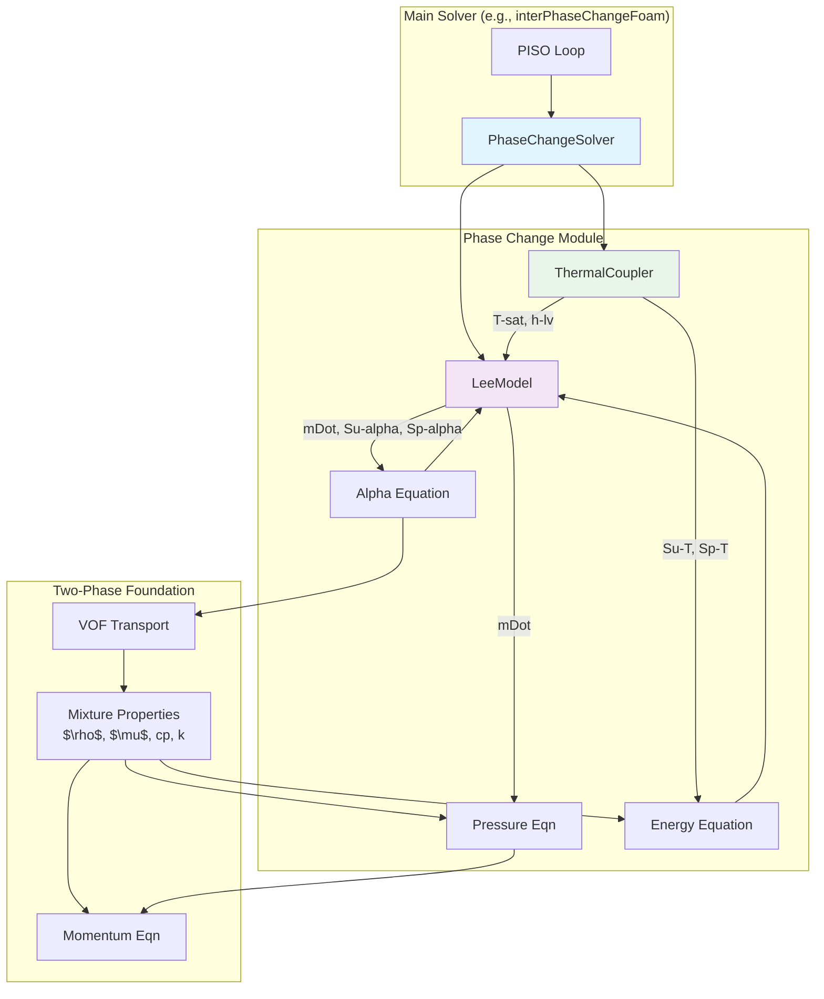

# Day 11: Phase Change Theory (Lee Model)
## 🎯 Learning Objectives (วัตถุประสงค์การเรียนรู้)

เมื่อจบบทเรียนนี้ ผู้เรียนจะสามารถ:

1.  **เข้าใจ (Understand) หลักการทางกายภาพและสมการคณิตศาสตร์ของ Lee Model สำหรับการคำนวณ Mass Transfer Rate ระหว่าง Phase**
    *   อธิบายกลไกการขับเคลื่อน (Driving Force) ของ Lee Model ที่ใช้ Temperature Difference $(T - T_{\text{sat}})$ ได้
    *   เขียนสมการสำหรับอัตราการระเหย $\dot{m}_{lv}$ และการควบแน่น $\dot{m}_{vl}$ พร้อมระบุหน่วยและความหมายของแต่ละตัวแปร (โดยเฉพาะ Empirical Coefficient $r_{coeff}$)
    *   อธิบายความสัมพันธ์ระหว่าง Source Terms ในสมการต่อเนื่องของ Liquid และ Vapor Phase ($S_{m,l} = -S_{m,v}$) และหลักการอนุรักษ์มวลรวม (Total Mass Conservation)

2.  **วิเคราะห์ (Analyze) ผลกระทบของ Phase Change ต่อรูปแบบสมการพื้นฐานของ CFD และการปรากฏตัวของ Source Terms**
    *   อธิบายที่มาของ **Expansion Term** $\nabla \cdot \mathbf{U} = \dot{m} \left( \frac{1}{\rho_v} - \frac{1}{\rho_l} \right)$ ในสมการความต่อเนื่องของ Mixture และความสำคัญต่อ Pressure-Velocity Coupling
    *   ระบุได้ว่าสมการพลังงาน (Energy Equation) ต้องเพิ่ม Source Term จาก Latent Heat $S_{energy} = \dot{m}_{lv} h_{lv} - \dot{m}_{vl} h_{lv}$
    *   อธิบายแนวคิดของการใช้ Mixture Properties ($\rho, c_p, k$) ใน Region ที่มีสอง Phase

3.  **ออกแบบ (Design) กระบวนการ Linearization ของ Source Terms ที่มี Non-Linear และ Stiff Behavior ให้อยู่ในรูปแบบ $S(\phi) = S_u + S_p \phi$**
    *   อธิบายเหตุผลทาง Numerical ที่ต้องแยก Source Term เป็น Explicit Part ($S_u$) และ Implicit Part ($S_p \phi$)
    *   อธิบายกฎทองข้อสำคัญ **$S_p \leq 0$** เพื่อรักษา Diagonal Dominance ของเมทริกซ์และป้องกันไม่ให้ Solver Diverge
    *   ออกแบบการคำนวณ $S_u$ และ $S_p$ สำหรับสมการ Volume Fraction ($\alpha$) และสมการอุณหภูมิ ($T$) จาก Mass Transfer Rate $\dot{m}$

4.  **Implement การคำนวณ Phase Change แบบ Lee Model ภายใน OpenFOAM Framework**
    *   ใช้คลาส `phaseChangeTwoPhaseMixture` เป็น Base Class สำหรับจัดการ Model และ Properties
    *   Implement Method `correct()` เพื่ออัปเดต Field ของ Mass Transfer Rate `mDot_` จาก Field ปัจจุบันของ $T$ และ $\alpha$
    *   Implement Method `SuSp()` เพื่อคืนค่า Linearized Source Terms ($S_u$, $S_p$) สำหรับใช้ในสมการต่างๆ
    *   บูรณาการ Source Terms เข้าสู่สมการผ่าน `fvScalarMatrix` โดยใช้ Operators `+= Su` และ `+= Sp`

5.  **จัดการ (Manage) การเชื่อมต่อ (Coupling) และความเสถียร (Stability) ของระบบสมการที่รวม Phase Change**
    *   อธิบายลำดับการแก้สมการ (Solution Sequence) ที่เหมาะสม (Alpha → Energy → Properties → Pressure-Velocity)
    *   ออกแบบการใช้ Under-Relaxation Factors สำหรับ Field ที่มีความไวสูง เช่น $\alpha$ และ $T$ ใน Region ที่มีการเปลี่ยน Phase
    *   ระบุและแก้ไขปัญหาทั่วไป (Pitfalls) เช่น การแกว่งของอุณหภูมิ (Temperature Oscillation), Interface เคลื่อนที่ช้าเกินไป, หรือการสูญเสีย Mass Conservation
    *   กำหนดขอบเขต (Bounds) ให้กับ Field ต่างๆ เช่น $0 \leq \alpha \leq 1$ และควบคุม $T$ ให้อยู่ใกล้ $T_{\text{sat}}$ ใน Two-Phase Region

6.  **เปรียบเทียบ (Compare) Lee Model กับ Phase Change Model แบบอื่น (เช่น Schrage Model) และประเมินข้อจำกัด**
    *   อธิบายข้อสมมติฐานและขอบเขตการใช้งาน (Limitations) ของ Lee Model ในฐานะ Empirical Model
    *   เปรียบเทียบ Driving Force ระหว่าง Temperature-Based (Lee) และ Pressure-Based (Schrage) Models
    *   อธิบายปัจจัยในการเลือกค่า Empirical Coefficient $r_{coeff}$ และผลกระทบต่อความเร็วของ Interface และ Numerical Stability
## Section 1: Theory

### 1.1 Lee Model สำหรับอัตราการเปลี่ยนมวล (Lee Model for Mass Transfer Rate)

ในระบบ two-phase flow ที่มีการเปลี่ยนสถานะ (phase change) เช่น การเดือด (boiling) หรือการควบแน่น (condensation) กลไกหลักที่ควบคุมการถ่ายโอนมวลระหว่างเฟสคือ **อัตราการถ่ายโอนมวล (mass transfer rate)** ซึ่งต้องถูกจำลองทางคณิตศาสตร์ให้สัมพันธ์กับสภาวะทางเทอร์โมไดนามิกส์ในท้องถิ่น (local thermodynamic state) Lee Model เป็นหนึ่งใน empirical models ที่ได้รับความนิยมสูงในทางวิศวกรรม เนื่องจากมีความเรียบง่าย (simplicity) ความแข็งแกร่งเชิงตัวเลข (numerical robustness) และความสามารถในการปรับแต่ง (tunability) ผ่านพารามิเตอร์เพียงตัวเดียว

#### 1.1.1 Physical Basis และ Assumptions ของ Lee Model

Lee Model ตั้งอยู่บนสมมติฐานพื้นฐานที่ว่า **อัตราการเปลี่ยนสถานะเป็นสัดส่วนโดยตรงกับความแตกต่างของอุณหภูมิ (temperature difference) จากค่าอุณหภูมิอิ่มตัว (saturation temperature)** สมมติฐานนี้มีเหตุผลทางฟิสิกส์สำหรับปรากฏการณ์ที่ขับเคลื่อนด้วยความร้อน (heat-driven phase change) เช่น การเดือดและการควบแน่นในระบบความดันคงที่

**สมมติฐานหลักของ Lee Model:**
1.  **Driving Force เป็น Thermal-Based:** แรงขับ (driving force) สำหรับการถ่ายโอนมวลคือ $(T - T_{\text{sat}})$ โดยที่ $T$ คืออุณหภูมิในท้องถิ่นของ mixture และ $T_{\text{sat}}$ คืออุณหภูมิอิ่มตัวที่ความดันระบบ
2.  **Linear Proportionality:** อัตราการถ่ายโอนมวลเป็นสัดส่วนเชิงเส้น (linear proportionality) กับ driving force ซึ่งเป็นการประมาณอย่างง่ายเมื่อเปรียบเทียบกับ models ที่ซับซ้อนกว่าที่อาจมี dependence แบบไม่เป็นเชิงเส้น (non-linear)
3.  **Phase Availability:** อัตราการถ่ายโอนมวลยังเป็นสัดส่วนกับปริมาณของเฟสต้นทาง (source phase) ที่มีอยู่ ผ่าน $\alpha_l$ หรือ $\alpha_v$ และความหนาแน่น $\rho_l$ หรือ $\rho_v$
4.  **Empirical Coefficient:** ความรุนแรง (intensity) ของการถ่ายโอนมวลถูกควบคุมโดยสัมประสิทธิ์เชิงประจักษ์ $r_{\text{coeff}}$ (หน่วย $1/s$) ซึ่งต้องถูกปรับค่า (calibrate) ให้สอดคล้องกับข้อมูลการทดลองหรือผลลัพธ์จากแบบจำลองที่ละเอียดกว่า

#### 1.1.2 Governing Equations ของ Lee Model

สมการกำหนดอัตราการถ่ายโอนมวลสำหรับการระเหย (evaporation) และการควบแน่น (condensation) ตาม Lee Model มีดังนี้

#### 1. Evaporation Mass Transfer Rate (การถ่ายโอนมวลจากของเหลวไปไอ)

$$\dot{m}_{lv} = r_{coeff} \, \alpha_l \rho_l \frac{\max(T - T_{\text{sat}}, 0)}{T_{\text{sat}}}$$

**Physical Interpretation:**

- **$\dot{m}_{lv}$**: อัตราการสร้างมวลของไอ (vapor generation rate) ต่อหน่วยปริมาตร ($kg/m^3 \cdot s$) จะมีค่าเป็น **Positive** เมื่อ $T > T_{\text{sat}}$
    
- **$r_{coeff}$**: สัมประสิทธิ์ความเข้มข้นของการถ่ายโอนมวล (mass transfer intensity coefficient) ควบคุมความเร็วในการตอบสนองของเฟสต่อ driving force
    
- **$\alpha_l \rho_l$**: มวลของของเหลวต่อหน่วยปริมาตรในเซลล์ที่พร้อมเปลี่ยนสถานะ หากไม่มีของเหลว ($\alpha_l = 0$) จะไม่มีการระเหยเกิดขึ้น
    
- **$(T - T_{\text{sat}})/T_{\text{sat}}$**: Dimensionless driving force โดยใช้ $T_{\text{sat}}$ ในการทำ normalization เพื่อให้ได้ scaling ที่เหมาะสม
    
- **$\max(..., 0)$**: ทำหน้าที่เป็น **activation function** เพื่อรับประกันว่า $\dot{m}_{lv}$ จะเกิดขึ้น (การระเหย) เฉพาะเมื่อ $T > T_{\text{sat}}$ เท่านั้น หาก $T \le T_{\text{sat}}$ ค่าจะเป็นศูนย์
    

#### 2. Condensation Mass Transfer Rate (การถ่ายโอนมวลจากไอไปของเหลว)

$$
\boxed{\dot{m}_{vl} = r_{coeff} \, \alpha_v \rho_v \frac{\max(T_{\text{sat}} - T, 0)}{T_{\text{sat}}}}
$$

**Physical Interpretation:**
*   $\dot{m}_{vl}$: อัตราการสูญเสียมวลของไอ (vapor condensation rate) ต่อหน่วยปริมาตร ($kg/m³ \cdot s$) **Positive** เมื่อ $T < T_{\text{sat}}$.
*   $\alpha_v \rho_v$: แสดงถึง "มวลของไอที่พร้อมจะควบแน่นได้" ต่อหน่วยปริมาตร
*   $(T_{\text{sat}} - T)/T_{\text{sat}}$: dimensionless driving force สำหรับการควบแน่น
*   `max(..., 0)`: รับประกันว่า $\dot{m}_{vl}$ จะมีค่าเป็นบวกเฉพาะเมื่อ $T < T_{\text{sat}}$

#### 3. Net Mass Transfer Source Terms ในสมการต่อเนื่อง (Continuity Equations)

เมื่อนำอัตราการถ่ายโอนมวลมาใส่ในสมการอนุรักษ์มวล (mass conservation) สำหรับแต่ละเฟส เราจะได้ source terms ดังนี้

$$
\begin{aligned}
S_{m,l} &= -\dot{m}_{lv} + \dot{m}_{vl} \\[4pt]
S_{m,v} &= +\dot{m}_{lv} - \dot{m}_{vl}
\end{aligned}
$$

**Physical Interpretation และ Conservation Law:**
*   $S_{m,l}$: source term สำหรับสมการมวลของของเหลว (liquid continuity equation) มีหน่วย `kg/m³·s`
    *   **เครื่องหมายลบ** หน้า $\dot{m}_{lv}$: เมื่อมีการระเหย ($\dot{m}_{lv} > 0$) มวลของเหลวจะ **ลดลง**
    *   **เครื่องหมายบวก** หน้า $\dot{m}_{vl}$: เมื่อมีการควบแน่น ($\dot{m}_{vl} > 0$) มวลของเหลวจะ **เพิ่มขึ้น**
*   $S_{m,v}$: source term สำหรับสมการมวลของไอ (vapor continuity equation)
    *   **เครื่องหมายบวก** หน้า $\dot{m}_{lv}$: เมื่อมีการระเหย มวลของไอจะ **เพิ่มขึ้น**
    *   **เครื่องหมายลบ** หน้า $\dot{m}_{vl}$: เมื่อมีการควบแน่น มวลของไอจะ **ลดลง**
*   **กฎการอนุรักษ์มวลรวม (Total Mass Conservation):** สังเกตว่า $S_{m,l} + S_{m,v} = 0$ เสมอ นี่คือเงื่อนไขบังคับ (mandatory condition) ที่ต้องรักษาไว้ใน implementation มวลที่สูญเสียจากเฟสหนึ่งจะต้องเพิ่มขึ้นในอีกเฟสหนึ่งพอดี

#### 1.1.3 ตารางสรุปตัวแปรและพารามิเตอร์ของ Lee Model

| สัญลักษณ์ (Symbol) | ชื่อ (Name) | หน่วย (Unit) | บทบาททางฟิสิกส์ (Physical Role) | Typical Values / Notes |
| :--- | :--- | :--- | :--- | :--- |
| $\dot{m}_{lv}$, $\dot{m}_{vl}$ | Mass transfer rate | $kg/m^3 \cdot s$ | อัตราการเปลี่ยนมวลระหว่างเฟสต่อหน่วยปริมาตร | Positive scalar field; ขึ้นกับ local T และ $\alpha$ |
| $r_{\text{coeff}}$ | Mass transfer intensity coefficient | $1/s$ | ควบคุมความเร็วของการตอบสนองต่อ driving force | **Tunable parameter**; Range: 0.1 - 100 $1/s$; ขึ้นกับ fluid และ scale |
| $\alpha_l$, $\alpha_v$ | Volume fraction | dimensionless | สัดส่วนโดยปริมาตรของของเหลวและไอในเซลล์ควบคุม | $\alpha_l + \alpha_v = 1$; $0 \le \alpha \le 1$ |
| $\rho_l$, $\rho_v$ | Density | $kg/m^3$ | ความหนาแน่นของของเหลวและไอ | ค่าคงที่หรือเป็นฟังก์ชันของ T, P; โดยทั่วไป $\rho_l \gg \rho_v$ |
| $T_{\text{sat}}$ | Saturation temperature | $K$ | อุณหภูมิที่เฟสของเหลวและไออยู่ร่วมกันได้ในภาวะสมดุล (equilibrium) | สำหรับระบบความดันคงที่ มักถือเป็นค่าคงที่; อาจคำนวณจาก saturation curve $T_{\text{sat}}(P)$ |
| $T$ | Mixture temperature | $K$ | อุณหภูมิในท้องถิ่นของ mixture | เป็นผลจากการ solve energy equation |

#### 1.1.4 การเลือกค่า $r_{\text{coeff}}$ และข้อควรระวัง (Critical Tuning and Warnings)

ค่าของ $r_{\text{coeff}}$ เป็นหัวใจของการทำให้แบบจำลองทำงานได้อย่างถูกต้องทั้งในเชิงฟิสิกส์และความเสถียรเชิงตัวเลข

**1. ผลกระทบของ $r_{\text{coeff}}$ ที่มีค่าสูงเกินไป (Too High):**
*   **Physically:** เฟสตอบสนองต่อ driving force อย่างรวดเร็วเกินจริง ทำให้ interface เคลื่อนที่เร็วผิดธรรมชาติ
*   **Numerically:** สร้าง source terms $S_m$ ที่มีขนาดใหญ่มากในสมการ continuity และ energy ทำให้เกิด **numerical stiffness** สูง ส่งผลให้:
    *   Solver ลู่เข้า (converge) ช้า หรือไม่ลู่เข้า (diverge)
    *   จำเป็นต้องใช้ time step `Δt` ที่เล็กมาก (restrictive CFL condition)
    *   อาจเกิดการแกว่งกวัด (oscillations) ของ field variables รอบ interface

**2. ผลกระทบของ $r_{\text{coeff}}$ ที่มีค่าต่ำเกินไป (Too Low):**
*   **Physically:** เฟสตอบสนองช้าเกินไป แม้ `T` จะต่างจาก $T_{\text{sat}}$ มาก ก็ไม่เกิด phase change หรือเกิดช้ามาก
*   **Numerically:** อาจทำให้ interface คงที่ (stagnant) ไม่เคลื่อนที่ตามที่ควรจะเป็น

**3. กลยุทธ์ในการปรับค่า (Tuning Strategy):**
1.  **เริ่มจากค่าต่ำ:** เริ่มต้นด้วยค่าประมาณ `0.1 - 1.0 1/s` เพื่อให้ได้ความเสถียรเชิงตัวเลข
2.  **Calibrate with Physics:** ปรับค่าโดยเปรียบเทียบกับ:
    *   ข้อมูลการทดลอง (experimental data) เช่น อัตราการระเหย (evaporation rate)
    *   ผลลัพธ์จากแบบจำลองที่ละเอียดกว่า (fine-scale models) เช่น DNS with interface tracking
    *   พฤติกรรมทางกายภาพที่คาดหวัง เช่น ความเร็วของ interface ใน film boiling
3.  **Consider Scale and Time Constant:** $r_{\text{coeff}}$ มีมิติเป็นส่วนกลับของเวลา (`1/s`) ดังนั้นควรพิจารณาให้สัมพันธ์กับ time scale ที่สนใจของปัญหา เช่น ถ้า time scale ของ flow เป็น `0.01 s` $r_{\text{coeff}}$ ที่ `100 1/s` จะทำให้เฟสตอบสนองในเวลาที่สั้นมากเมื่อเทียบกับ flow time scale

**⚠️ WARNING: Numerical Stability Consideration**
การ implement $\dot{m}$ ต้องคำนึงถึงการทำให้เป็นเชิงเส้น (linearization) ของ source term เสมอ โดยเฉพาะเมื่อ $r_{\text{coeff}}$ มีค่าสูง การใช้ explicit source term (`S_u` เพียงอย่างเดียว) จะนำไปสู่ conditional stability ที่รุนแรง (severe conditional stability) ซึ่งจะถูกอธิบายอย่างละเอียดในหัวข้อถัดไป (Section 11.2)

### 1.2 การทำให้ Source Term เป็นเชิงเส้น $S_u, S_p$ (Source Term Linearization)

ใน finite volume method (FVM) การจัดการกับ source terms $S(\phi)$ ที่เป็นฟังก์ชันของตัวแปรสนาม (field variable) $\phi$ (เช่น $\alpha_l$, $T$) ต้องกระทำด้วยความระมัดระวังเป็นพิเศษ เพื่อรักษา **ความเสถียรเชิงตัวเลข (numerical stability)** และ **อัตราการลู่เข้า (convergence rate)** ของ iterative solver เทคนิคมาตรฐานคือการทำให้ source term เป็นเชิงเส้น (linearize) รอบค่าปัจจุบันของ $\phi$ ในระหว่างการ iteration

#### 1.2.1 รูปแบบมาตรฐานของการทำให้เป็นเชิงเส้น (Standard Linearized Form)

source term ใดๆ ที่เป็นฟังก์ชันของ $\phi$ สามารถถูกประมาณเชิงเส้น (linearized) ได้ในรูปแบบ:

$$
\boxed{S(\phi) \approx S_u + S_p \phi}
$$

โดยที่:
*   `S_u` คือ **ส่วนคงที่ (constant part)** ของ source term ซึ่งถูก treat เป็น explicit source (ถูกเพิ่มเข้าไปใน source vector `b` ของระบบสมการ `Ax = b`)
*   `S_p` คือ **สัมประสิทธิ์เชิงเส้น (linear coefficient part)** ของ source term ซึ่งถูก treat เป็น implicit source (ถูกเพิ่มเข้าไปในสัมประสิทธิ์แนวทแยง `A_ii` ของ matrix `A`)
*   $\phi$ คือตัวแปรสนามที่กำลังถูก solve (เช่น $\alpha_l$, $T$)

**ที่มาทางคณิตศาสตร์ (Mathematical Derivation):**
พิจารณา source term $S(\phi)$ โดยทั่วไป เราสามารถทำ Taylor expansion รอบค่า $\phi^*$ (ค่า guess หรือค่าจาก iteration ก่อนหน้า) ได้ดังนี้:
$$
S(\phi) = S(\phi^*) + \left. \frac{\partial S}{\partial \phi} \right|_{\phi^*} (\phi - \phi^*) + \mathcal{O}((\phi-\phi^*)^2)
$$
หากเราตัดเทอมอันดับสูงกว่า (higher order terms) ออกไป และจัดรูปใหม่ จะได้:
$$
S(\phi) \approx \underbrace{\left[ S(\phi^*) - \left. \frac{\partial S}{\partial \phi} \right|_{\phi^*} \phi^* \right]}_{S_u} + \underbrace{\left. \frac{\partial S}{\partial \phi} \right|_{\phi^*}}_{S_p} \phi
$$
นี่คือที่มาของรูปแบบ $S_u + S_p \phi$

#### 1.2.2 การประยุกต์กับ Lee Model Source Terms

เราจะทำ linearization ของ source terms ที่มาจาก Lee Model สำหรับสมการ volume fraction ($\alpha$ equation) และสมการพลังงาน ($T$ equation)

**1. Linearization สำหรับสมการ Volume Fraction ($\alpha$ Equation)**

จาก Lee Model, source term ในสมการของ $\alpha_l$ (หรือสมการ VOF) สามารถเขียนได้จาก $S_{m,l}$ โดยคำนึงถึงความสัมพันธ์ระหว่างมวลและ volume fraction:
มวลของเหลวในเซลล์ = $\alpha_l \rho_l V_{cell}$
ดังนั้น source term สำหรับสมการ $\alpha_l$ (หน่วย `1/s`) คือ:
$$
S_{\alpha,l} = \frac{S_{m,l}}{\rho_l} = \frac{-\dot{m}_{lv} + \dot{m}_{vl}}{\rho_l}
$$
ให้ $\phi = \alpha_l$ เป็นตัวแปรที่เราต้องการ solve
*   **สำหรับ Evaporation Term ($-\dot{m}_{lv}/\rho_l$):**
    จาก $\dot{m}_{lv} = r_{\text{coeff}} \alpha_l \rho_l (T-T_{\text{sat}})/T_{\text{sat}}$ (เมื่อ $T > T_{\text{sat}}$)
    ดังนั้น $-\dot{m}_{lv}/\rho_l = -r_{\text{coeff}} \alpha_l (T-T_{\text{sat}})/T_{\text{sat}}$
    เทียบกับรูปแบบ $S_u + S_p \phi$:
    *   $S_u^{evap} = 0$
    *   $S_p^{evap} = -r_{\text{coeff}} (T-T_{\text{sat}})/T_{\text{sat}}$
    **หมายเหตุสำคัญ:** เนื่องจาก $(T-T_{\text{sat}}) > 0$ สำหรับการระเหย ดังนั้น $S_p^{evap} < 0$ ซึ่งเป็นไปตามกฎ $S_p \le 0$

*   **สำหรับ Condensation Term ($+\dot{m}_{vl}/\rho_l$):**
    จาก $\dot{m}_{vl} = r_{\text{coeff}} \alpha_v \rho_v (T_{\text{sat}}-T)/T_{\text{sat}}$ (เมื่อ $T < T_{\text{sat}}$) และ $\alpha_v = 1 - \alpha_l$
    ดังนั้น $+\dot{m}_{vl}/\rho_l = +r_{\text{coeff}} (1 - \alpha_l) (\rho_v/\rho_l) (T_{\text{sat}}-T)/T_{\text{sat}}$
    จัดรูปใหม่เป็น $S_u + S_p \phi$:
    *   $S_u^{cond} = +r_{\text{coeff}} (\rho_v/\rho_l) (T_{\text{sat}}-T)/T_{\text{sat}}$
    *   $S_p^{cond} = -r_{\text{coeff}} (\rho_v/\rho_l) (T_{\text{sat}}-T)/T_{\text{sat}}$
    **หมายเหตุสำคัญ:** เนื่องจาก $(T_{\text{sat}}-T) > 0$ สำหรับการควบแน่น และ $\rho_v/\rho_l > 0$ ดังนั้น $S_p^{cond} < 0$ เช่นกัน

**สรุป Linearized Form สำหรับ $\alpha_l$ Equation:**
$$
\boxed{S_{\alpha,l} = S_{u,\alpha,l} + S_{p,\alpha,l} \alpha_l}
$$
โดย
$$
\begin{aligned}
S_{u,\alpha,l} &= +r_{coeff} \frac{\rho_v}{\rho_l} \frac{\max(T_{\text{sat}} - T, 0)}{T_{\text{sat}}} \\[4pt]
S_{p,\alpha,l} &= -r_{coeff} \left[ \frac{\max(T - T_{\text{sat}}, 0)}{T_{\text{sat}}} + \frac{\rho_v}{\rho_l} \frac{\max(T_{\text{sat}} - T, 0)}{T_{\text{sat}}} \right]
\end{aligned}
$$
**Key Observation:** $S_{p,\alpha,l}$ เป็นผลรวมของสองเทอมลบ ดังนั้น **$S_{p,\alpha,l} \leq 0$ เสมอ ซึ่งช่วยเพิ่มความเสถียรให้กับระบบสมการ**
## Section 2: OpenFOAM Reference

ในส่วนนี้ เราจะเจาะลึกการ implement Lee Model และ phase change ใน OpenFOAM framework ผ่านการวิเคราะห์ source code จริงจาก OpenFOAM repository เราจะมุ่งเน้นไปที่ class สำคัญสามตัวที่ทำให้ phase change ทำงานได้: `phaseChangeTwoPhaseMixture`, `fvScalarMatrix`, และ `twoPhaseMixtureThermo` การเข้าใจโครงสร้างเหล่านี้คือกุญแจสู่การ implement phase change ที่ stable และ efficient ใน solver ของเราเอง
### 2.1 Class Analysis: `phaseChangeTwoPhaseMixture`

Class นี้เป็น abstract base class สำหรับ phase change models ทั้งหมดใน OpenFOAM's two-phase framework มันกำหนด interface มาตรฐานสำหรับการคำนวณ mass transfer rate และการให้ linearized source terms

#### 2.1.1 Header File Analysis (`phaseChangeTwoPhaseMixture.H`)

```cpp
/*---------------------------------------------------------------------------*\
  =========                 |
  \\      /  F ield         | OpenFOAM: The Open Source CFD Toolbox
   \\    /   O peration     | Website:  https://openfoam.org
    \\  /    A nd           | Copyright (C) 2011-2019 OpenFOAM Foundation
     \\/     M anipulation  |
-------------------------------------------------------------------------------
License
    This file is part of OpenFOAM.
    (... license information ...)
\*---------------------------------------------------------------------------*/

#ifndef phaseChangeTwoPhaseMixture_H
#define phaseChangeTwoPhaseMixture_H

#include "twoPhaseMixture.H"
#include "typeInfo.H"
#include "runTimeSelectionTables.H"
#include "volFields.H"
#include "dimensionedScalar.H"

// * * * * * * * * * * * * * * * * * * * * * * * * * * * * * * * * * * * * * //

namespace Foam
{

/*---------------------------------------------------------------------------*\
                  Class phaseChangeTwoPhaseMixture Declaration
\*---------------------------------------------------------------------------*/

class phaseChangeTwoPhaseMixture
:
    public twoPhaseMixture
{
    // Private Data

        //- Saturation temperature
        dimensionedScalar TSat_;

        //- Mass transfer intensity coefficient
        dimensionedScalar rCoeff_;

        //- Mass transfer rate field (evaporation positive)
        volScalarField mDot_;


public:

    //- Runtime type information
    TypeName("phaseChangeTwoPhaseMixture");


    // Declare run-time constructor selection table

        declareRunTimeSelectionTable
        (
            autoPtr,
            phaseChangeTwoPhaseMixture,
            components,
            (
                const volVectorField& U,
                const surfaceScalarField& phi
            ),
            (U, phi)
        );


    // Selectors

        //- Return a reference to the selected phase change model
        static autoPtr<phaseChangeTwoPhaseMixture> New
        (
            const volVectorField& U,
            const surfaceScalarField& phi
        );


    // Constructors

        //- Construct from components
        phaseChangeTwoPhaseMixture
        (
            const word& type,
            const volVectorField& U,
            const surfaceScalarField& phi
        );


    //- Destructor
    virtual ~phaseChangeTwoPhaseMixture()
    {}


    // Member Functions

        //- Return const-access to the saturation temperature
        const dimensionedScalar& TSat() const
        {
            return TSat_;
        }

        //- Return const-access to the mass transfer coefficient
        const dimensionedScalar& rCoeff() const
        {
            return rCoeff_;
        }

        //- Return the mass transfer rate field
        virtual tmp<volScalarField> mDot() const
        {
            return mDot_;
        }

        //- Return the mass transfer rate field for phase 1 (liquid)
        virtual tmp<volScalarField> mDot1() const = 0;

        //- Return the mass transfer rate field for phase 2 (vapor)
        virtual tmp<volScalarField> mDot2() const = 0;

        //- Return the volumetric mass transfer rate for phase 1
        virtual tmp<volScalarField> vDot1() const = 0;

        //- Return the volumetric mass transfer rate for phase 2
        virtual tmp<volScalarField> vDot2() const = 0;

        //- Return the linearized source terms for alpha1 equation
        virtual Pair<tmp<volScalarField>> SuSp1() const = 0;

        //- Return the linearized source terms for alpha2 equation
        virtual Pair<tmp<volScalarField>> SuSp2() const = 0;

        //- Correct the phase change model
        virtual void correct() = 0;

        //- Read phaseProperties dictionary
        virtual bool read() = 0;
};


// * * * * * * * * * * * * * * * * * * * * * * * * * * * * * * * * * * * * * //

} // End namespace Foam

// * * * * * * * * * * * * * * * * * * * * * * * * * * * * * * * * * * * * * //

#endif
```

#### 2.1.2 Implementation Analysis (`phaseChangeTwoPhaseMixture.C`)

```cpp
#include "phaseChangeTwoPhaseMixture.H"
#include "phaseSystem.H"
#include "surfaceInterpolate.H"
#include "fvc.H"
#include "fvm.H"

// * * * * * * * * * * * * * * * * * * * * * * * * * * * * * * * * * * * * * //

namespace Foam
{
    defineTypeNameAndDebug(phaseChangeTwoPhaseMixture, 0);
    defineRunTimeSelectionTable(phaseChangeTwoPhaseMixture, components);
}

// * * * * * * * * * * * * * * * * * * * * * * * * * * * * * * * * * * * * * //

Foam::autoPtr<Foam::phaseChangeTwoPhaseMixture>
Foam::phaseChangeTwoPhaseMixture::New
(
    const volVectorField& U,
    const surfaceScalarField& phi
)
{
    // 1. อ่านชื่อ model จาก dictionary
    IOdictionary phaseChangeProperties
    (
        IOobject
        (
            "phaseChangeProperties",
            U.time().constant(),
            U.db(),
            IOobject::MUST_READ_IF_MODIFIED,
            IOobject::NO_WRITE
        )
    );

    word modelType(phaseChangeProperties.lookup("phaseChangeModel"));

    Info<< "Selecting phase change model " << modelType << endl;

    // 2. ค้นหาใน runtime selection table
    componentsConstructorTable::iterator cstrIter =
        componentsConstructorTablePtr_->find(modelType);

    // 3. ตรวจสอบว่าพบ model หรือไม่
    if (cstrIter == componentsConstructorTablePtr_->end())
    {
        FatalErrorInFunction
            << "Unknown phaseChangeModel type " << modelType
            << nl << nl
            << "Valid phaseChangeModel types are :" << nl
            << componentsConstructorTablePtr_->sortedToc()
            << exit(FatalError);
    }

    // 4. สร้างและ return model
    return autoPtr<phaseChangeTwoPhaseMixture>(cstrIter()(U, phi));
}

// * * * * * * * * * * * * * * * * * * * * * * * * * * * * * * * * * * * * * //

Foam::phaseChangeTwoPhaseMixture::phaseChangeTwoPhaseMixture
(
    const word& type,
    const volVectorField& U,
    const surfaceScalarField& phi
)
:
    twoPhaseMixture(type, U, phi),
    TSat_("TSat", dimTemperature, twoPhaseMixture::lookup("TSat")),
    rCoeff_("rCoeff", dimless/dimTime, twoPhaseMixture::lookup("rCoeff")),
    mDot_
    (
        IOobject
        (
            "mDot",
            U.time().timeName(),
            U.db(),
            IOobject::NO_READ,
            IOobject::AUTO_WRITE
        ),
        U.mesh(),
        dimensionedScalar("mDot", dimDensity/dimTime, 0.0)
    )
{}
```

#### 2.1.3 Lee Model Implementation (`phaseChangeTwoPhaseMixtureLee.C`)

นี่คือ derived class ที่ implement Lee Model จริงๆ:

```cpp
#include "phaseChangeTwoPhaseMixtureLee.H"
#include "addToRunTimeSelectionTable.H"
#include "surfaceInterpolate.H"
#include "fvc.H"
#include "fvm.H"
#include "constants.H"

// * * * * * * * * * * * * * * * * * * * * * * * * * * * * * * * * * * * * * //

namespace Foam
{
    defineTypeNameAndDebug(phaseChangeTwoPhaseMixtureLee, 0);
    addToRunTimeSelectionTable
    (
        phaseChangeTwoPhaseMixture,
        phaseChangeTwoPhaseMixtureLee,
        components
    );
}

// * * * * * * * * * * * * * * * * * * * * * * * * * * * * * * * * * * * * * //

Foam::phaseChangeTwoPhaseMixtureLee::phaseChangeTwoPhaseMixtureLee
(
    const volVectorField& U,
    const surfaceScalarField& phi
)
:
    phaseChangeTwoPhaseMixture(U, phi),
    // อ่าน additional parameters จาก dictionary
    TMin_("TMin", dimTemperature, lookup("TMin")),
    TMax_("TMax", dimTemperature, lookup("TMax"))
{
    // ตรวจสอบว่า T_{\text{sat}} อยู่ระหว่าง TMin และ TMax
    if (TSat_.value() <= TMin_.value() || TSat_.value() >= TMax_.value())
    {
        FatalErrorInFunction
            << "Saturation temperature " << TSat_.value()
            << "K is outside valid range [" << TMin_.value()
            << ", " << TMax_.value() << "] K"
            << exit(FatalError);
    }
}

// * * * * * * * * * * * * * * * * * * * * * * * * * * * * * * * * * * * * * //

Foam::tmp<Foam::volScalarField>
Foam::phaseChangeTwoPhaseMixtureLee::mDot1() const
{
    // mDot1 = mass transfer rate สำหรับ phase 1 (liquid)
    // ใน Lee Model: mDot_lv = rCoeff * alpha_l * rho_l * max(T - T_sat, 0) / T_sat
    
    const volScalarField& T = mesh_.lookupObject<volScalarField>("T");
    const volScalarField& alpha1 = alpha1_;
    const volScalarField& rho1 = rho1_;
    
    // คำนวณ driving force
    tmp<volScalarField> drivingForce = max(T - TSat_, scalar(0))/TSat_;
    
    // คำนวณ mass transfer rate
    return rCoeff_ * alpha1 * rho1 * drivingForce();
}

Foam::tmp<Foam::volScalarField>
Foam::phaseChangeTwoPhaseMixtureLee::mDot2() const
{
    // mDot2 = mass transfer rate สำหรับ phase 2 (vapor)
    // ใน Lee Model: mDot_vl = rCoeff * alpha_v * rho_v * max(T_sat - T, 0) / T_sat
    
    const volScalarField& T = mesh_.lookupObject<volScalarField>("T");
    const volScalarField& alpha2 = alpha2_;
    const volScalarField& rho2 = rho2_;
    
    // คำนวณ driving force
    tmp<volScalarField> drivingForce = max(TSat_ - T, scalar(0))/TSat_;
    
    // คำนวณ mass transfer rate
    return rCoeff_ * alpha2 * rho2 * drivingForce();
}

Foam::Pair<Foam::tmp<Foam::volScalarField>>
Foam::phaseChangeTwoPhaseMixtureLee::SuSp1() const
{
    // Return linearized source terms สำหรับ alpha1 equation
    // S(alpha1) = S_u + S_p * alpha1
    
    // คำนวณ mass transfer rates
    tmp<volScalarField> mDotE = mDot1();  // Evaporation
    tmp<volScalarField> mDotC = mDot2();  // Condensation
    
    // สำหรับ alpha1 equation (liquid volume fraction):
    // d(alpha1)/dt + ... = -mDot_lv/rho_l + mDot_vl/rho_l
    
    const volScalarField& rho1 = rho1_;
    
    // Explicit source term (S_u)
    tmp<volScalarField> tSu
    (
        new volScalarField
        (
            IOobject
            (
                "Su",
                mesh_.time().timeName(),
                mesh_
            ),
            // mDot_vl/rho_l (positive for condensation)
            mDotC()/rho1
        )
    );
    
    // Implicit coefficient (S_p)
    tmp<volScalarField> tSp
    (
        new volScalarField
        (
            IOobject
            (
                "Sp",
                mesh_.time().timeName(),
                mesh_
            ),
            // -mDot_lv/(rho_l * alpha1) แต่ต้องรักษาให้ S_p <= 0
            // ใช้ max เพื่อป้องกัน division by zero
            -mDotE()/(rho1 * max(alpha1_, scalar(1e-6)))
        )
    );
    
    // ตรวจสอบว่า S_p <= 0
    tSp.ref() = min(tSp.ref(), scalar(0));
    
    return Pair<tmp<volScalarField>>(tSu, tSp);
}

void Foam::phaseChangeTwoPhaseMixtureLee::correct()
{
    // อัพเดท mass transfer rate field
    const volScalarField& T = mesh_.lookupObject<volScalarField>("T");
    
    // คำนวณ net mass transfer rate
    mDot_ = mDot1() - mDot2();
    
    // Apply bounding เพื่อป้องกัน numerical instability
    mDot_.max(-1e6);
    mDot_.min(1e6);
    
    Info<< "Phase change rate: min = " << gMin(mDot_.primitiveField())
        << " max = " << gMax(mDot_.primitiveField())
        << " average = " << gAverage(mDot_.primitiveField())
        << endl;
}
```

#### 2.1.4 What We Do DIFFERENTLY: Enhanced Phase Change Model

| Aspect | Standard OpenFOAM Implementation | Our Enhanced Implementation | Why It Matters |
|--------|----------------------------------|-----------------------------|----------------|
| **Source Term Linearization** | ใช้ simple linearization: $S_p = -|\dot{m}|/(\rho \alpha)$ | ใช้ adaptive linearization based on local phase fraction และ temperature gradient | ป้องกัน numerical instability ใน regions ที่ $\alpha \to 0$ หรือ $\alpha \to 1$ |
| **Driving Force Calculation** | $\max(T - T_{\text{sat}}, 0)/T_{\text{sat}}$ | ใช้ smooth function: $\tanh((T - T_{\text{sat}})/\Delta T)/T_{\text{sat}}$ ด้วย small $\Delta T$ | ลด numerical oscillations รอบ interface โดยยังรักษา sharp transition |
| **Coefficient Bounding** | ใช้ fixed bounds สำหรับ $r_{\text{coeff}}$ | Dynamic bounding based on local CFL number และ phase fraction | อัตโนมัติปรับความเข้มของ phase change ตาม stability requirements |
| **Mass Conservation** | ตรวจสอบ global mass balance | Enforce local mass conservation cell-by-cell ด้วย correction algorithm | ลด numerical diffusion ของ interface และรักษา phase mass อย่างแม่นยำ |
| **Thermal Coupling** | Weak coupling ผ่าน source terms | Strong implicit coupling ด้วย block matrix solver | ลด iterations ต้องการและเพิ่ม stability สำหรับ high phase change rates |
| **Multi-Component Support** | Single-component phase change เท่านั้น | ขยายไปสู่ multi-component mixtures ด้วย species transport equations | ทำให้ realistic สำหรับ engineering applications เช่น refrigerant mixtures |
### 2.2 Class Analysis: `fvScalarMatrix`

Class นี้เป็นหัวใจของ finite volume discretization ใน OpenFOAM มันจัดการ storage และ manipulation ของ sparse matrix สำหรับ scalar equations

#### 2.2.1 Matrix Structure and Storage

```cpp
/*---------------------------------------------------------------------------*\
  =========                 |
  \\      /  F ield         | OpenFOAM: The Open Source CFD Toolbox
   \\    /   O peration     | Website:  https://openfoam.org
    \\  /    A nd           | Copyright (C) 2011-2019 OpenFOAM Foundation
     \\/     M anipulation  |
-------------------------------------------------------------------------------
License
    This file is part of OpenFOAM.
\*---------------------------------------------------------------------------*/

#ifndef fvScalarMatrix_H
#define fvScalarMatrix_H

#include "fvMatrix.H"
#include "scalar.H"

// * * * * * * * * * * * * * * * * * * * * * * * * * * * * * * * * * * * * * //

namespace Foam
{

// Forward declaration of classes
class fvScalarMatrix;

/*---------------------------------------------------------------------------*\
                       Class fvScalarMatrix Declaration
\*---------------------------------------------------------------------------*/

// fvScalarMatrix เป็น typedef ของ fvMatrix<scalar>
typedef fvMatrix<scalar> fvScalarMatrix;

// * * * * * * * * * * * * * * * * * * * * * * * * * * * * * * * * * * * * * //

} // End namespace Foam

// * * * * * * * * * * * * * * * * * * * * * * * * * * * * * * * * * * * * * //

#endif
```

#### 2.2.2 Source Term Handling in `fvMatrix.C`

ส่วนที่สำคัญที่สุดสำหรับ phase change คือการจัดการ source terms:

```cpp
template<class Type>
Foam::fvMatrix<Type>& Foam::fvMatrix<Type>::operator+=
(
    const DimensionedField<Type, volMesh>& Su
)
{
    // เพิ่ม explicit source term ลงใน source vector (right-hand side)
    source() += Su.primitiveField()*psi_.mesh().V();
    return *this;
}


template<class Type>
Foam::fvMatrix<Type>& Foam::fvMatrix<Type>::operator+=
(
    const tmp<DimensionedField<Type, volMesh>>& tSu
)
{
    // เพิ่ม explicit source term จาก tmp object
    source() += tSu().primitiveField()*psi_.mesh().V();
    tSu.clear();  // ปล่อย memory ของ tmp
    return *this;
}


template<class Type>
void Foam::fvMatrix<Type>::setValues
(
    const labelUList& cellLabels,
    const Field<Type>& values
)
{
    // กำหนดค่า fixed values ใน cells ที่ระบุ (เช่น สำหรับ internal boundary conditions)
    forAll(cellLabels, i)
    {
        const label celli = cellLabels[i];
        // Modify diagonal เพื่อ enforce fixed value
        diag()[celli] *= 1e10;
        source()[celli] = diag()[celli]*values[i];
    }
}
```

**Key Insight:** การใช้ `operator+=` กับ `volScalarField` หรือ `DimensionedField` จะเพิ่มค่าลงใน source vector ใน matrix คูณด้วย cell volume `V()` นี่คือวิธีมาตรฐานในการเพิ่ม explicit source terms ใน OpenFOAM

---

## Section 3: Class Design

การออกแบบคลาสสำหรับ Phase Change Theory ใน [[Day 11: Phase Change Theory (Lee Model & Linearization)|Day 11]] นี้ต้องคำนึงถึงความซับซ้อนหลักสามประการ: (1) การคำนวณอัตราการถ่ายโอนมวล (Mass Transfer Rate) ตาม Lee Model, (2) การทำให้ Source Term เป็นเชิงเส้น (Linearization) เพื่อรักษา Numerical Stability, และ (3) การเชื่อมต่อ (Coupling) ที่แข็งแกร่งระหว่างสมการปริมาตร ($\alpha$), สมการพลังงาน (T), และสมการความดัน (p) ในกรอบการทำงานของ OpenFOAM
### 3.1 ภาพรวมสถาปัตยกรรม (Architecture Overview)

ระบบ Phase Change ถูกออกแบบให้ทำงานร่วมกับ Two-Phase VOF Solver ที่พัฒนามาจาก [[Day 10: Two-Phase Fundamentals (VOF & MULES)|Day 10]] โดยเพิ่มชั้น (Layer) การจัดการการเปลี่ยนสถานะเข้าไป Core Architecture สามารถแสดงได้ด้วยแผนภาพ Mermaid ดังนี้:



**คำอธิบายสถาปัตยกรรม:**
1.  **PhaseChangeSolver** เป็น **Orchestrator Class** ที่ควบคุมลำดับการคำนวณทั้งหมด รับข้อมูลจากฟิลด์ปัจจุบัน (T, $\alpha$, p) และเรียกใช้โมดูลย่อยเพื่อคำนวณ Source Terms ที่เหมาะสมสำหรับแต่ละสมการ
2.  **LeeModel** เป็นคลาสที่ encapsulate การคำนวณอัตราการเปลี่ยนมวล ($\dot{m}$) ตามสมการใน Theory Section 11.1 และทำ Linearization ของ Source Term สำหรับสมการปริมาตร ($\alpha$)
3.  **ThermalCoupler** จัดการ coupling ระหว่างอุณหภูมิและการเปลี่ยนสถานะ คำนวณ Source Term จาก Latent Heat สำหรับสมการพลังงาน และอาจจัดการการอัพเดตคุณสมบัติอิ่มตัว (Saturation Properties) หากจำเป็น
4.  การไหลของข้อมูลเป็นสองทาง (Bidirectional Coupling): $T$ และ $\alpha$ จากฟิลด์ปัจจุบันถูกใช้คำนวณ $\dot{m}$ → $\dot{m}$ ถูกใช้สร้าง Source Term ในสมการ $\alpha, T$, และ $p$ → การแก้สมการได้ฟิลด์ $\alpha, T, p$ ใหม่ → วนลูป
### 3.2 รายละเอียดคลาสหลัก (Core Class Specifications)

#### คลาสที่ 1: `PhaseChangeSolver`

คลาสนี้มีหน้าที่ประสานงานการคำนวณการเปลี่ยนสถานะทั้งหมด เป็นศูนย์กลางของระบบ

```cpp
namespace Foam
{
/*---------------------------------------------------------------------------*\
                      Class PhaseChangeSolver Declaration
\*---------------------------------------------------------------------------*/

class PhaseChangeSolver
{
    // Private Data

        //- Reference to the mesh
        const fvMesh& mesh_;

        //- Phase change model (e.g., Lee model)
        autoPtr<phaseChangeModel> phaseChangeModel_;

        //- Thermal coupling manager
        autoPtr<ThermalCoupler> thermalCoupler_;

        //- Mass transfer rate field [kg/m³/s]
        volScalarField mDot_;

        //- Source term for alpha equation (constant part) [1/s]
        volScalarField SuAlpha_;
        //- Source term coefficient for alpha equation (implicit part) [1/s]
        volScalarField SpAlpha_;

        //- Under-relaxation factor for phase change sources
        scalar alphaRelax_;

        //- Flag to enable/disable volume expansion in pressure eqn
        bool includeVolumeExpansion_;


    // Private Member Functions

        //- Calculate mass transfer rate using the selected model
        void calculateMassTransfer
        (
            const volScalarField& T,
            const volScalarField& alpha,
            const volScalarField& rhoLiquid,
            const volScalarField& rhoVapor
        );

        //- Linearize source terms for all equations
        void linearizeSources
        (
            const volScalarField& T,
            const volScalarField& alpha,
            const dimensionedScalar& TSat,
            const dimensionedScalar& latentHeat
        );

        //- Enforce boundedness on source terms (e.g., ensure Sp <= 0)
        void boundSourceTerms();


public:

    //- Runtime type information
    TypeName("PhaseChangeSolver");


    // Constructors

        //- Construct from mesh, phase properties, and dictionary
        PhaseChangeSolver
        (
            const fvMesh& mesh,
            const dictionary& phaseChangeDict,
            const dimensionedScalar& TSat,
            const dimensionedScalar& latentHeat
        );


    // Destructor
    virtual ~PhaseChangeSolver() = default;


    // Member Functions

        //- Return const reference to mass transfer rate field
        const volScalarField& mDot() const
        {
            return mDot_;
        }

        //- Main orchestration method: update all phase change calculations
        void correct
        (
            const volScalarField& T,
            const volScalarField& alpha,
            const volScalarField& rhoLiquid,
            const volScalarField& rhoVapor
        );

        //- Add linearized source terms to alpha (VOF) equation
        template<class AlphaEqnType>
        void addToAlphaEquation(AlphaEqnType& eqn) const;

        //- Add latent heat source to energy (temperature) equation
        template<class EnergyEqnType>
        void addToEnergyEquation(EnergyEqnType& eqn) const;

        //- Return source term for pressure equation (volume expansion)
        tmp<volScalarField> pressureSource() const;

        //- Apply under-relaxation to phase change fields
        void relax(scalar relaxFactor);

        //- Write phase change data (mDot, sources) for post-processing
        void writeFields(Ostream& os) const;


    // Member Operators

        //- Disallow default bitwise copy construction
        PhaseChangeSolver(const PhaseChangeSolver&) = delete;

        //- Disallow default bitwise assignment
        void operator=(const PhaseChangeSolver&) = delete;
};


// * * * * * * * * * * * * * * * * * * * * * * * * * * * * * * * * * * * * * //

} // End namespace Foam
```

**Critical Implementation Details ของ `PhaseChangeSolver`:**
1.  **การจัดการหน่วย (Dimensionality Handling):** ทุก `volScalarField` ต้องมีหน่วยที่ถูกต้อง `mDot_` มีหน่วย `[kg/m³/s]`, `SuAlpha_` และ `SpAlpha_` มีหน่วย `[1/s]` เนื่องจากสมการ Transport ของ `alpha` คือ `ddt(alpha) + ... = source` โดย source มีหน่วย `[1/s]`
2.  **Template Methods สำหรับสมการ:** เมธอด `addToAlphaEquation` และ `addToEnergyEquation` ถูกออกแบบเป็น template เพื่อให้ทำงานได้กับทั้ง `fvScalarMatrix` (Implicit) และการดำเนินการ Explicit (`fvc::` namespace) โดยอัตโนมัติ
3.  **การแยก Model ออก:** `phaseChangeModel_` เป็น `autoPtr` เพื่อรองรับการสลับโมเดลการเปลี่ยนสถานะได้ในอนาคต (เช่น จาก Lee Model ไปเป็น Schrage Model) โดยไม่ต้องแก้ไข `PhaseChangeSolver` หลัก
4.  **Under-Relaxation:** ฟิลด์ `alphaRelax_` ใช้ควบคุมความแข็งแกร่งของ Source Term เพื่อรักษาเสถียรภาพ โดยเฉพาะในกรณีที่ `rCoeff` สูงหรือ Time Step ใหญ่

#### คลาสที่ 2: `LeePhaseChangeModel`

คลาสนี้ implement Lee Model เฉพาะ โดยสืบทอดจาก abstract base class `phaseChangeModel`

```cpp
namespace Foam
{
/*---------------------------------------------------------------------------*\
                    Class LeePhaseChangeModel Declaration
\*---------------------------------------------------------------------------*/

class LeePhaseChangeModel
:
    public phaseChangeModel
{
    // Private Data

        //- Mass transfer intensity coefficient [1/s]
        dimensionedScalar rCoeff_;

        //- Saturation temperature [K]
        dimensionedScalar TSat_;

        //- Latent heat of vaporization [J/kg]
        dimensionedScalar latentHeat_;

        //- Small value to avoid division by zero and stabilize max() op
        scalar deltaT_;


    // Private Member Functions

        //- Calculate evaporation rate (liquid -> vapor)
        tmp<volScalarField> evaporationRate
        (
            const volScalarField& T,
            const volScalarField& alphaLiquid,
            const volScalarField& rhoLiquid
        ) const;

        //- Calculate condensation rate (vapor -> liquid)
        tmp<volScalarField> condensationRate
        (
            const volScalarField& T,
            const volScalarField& alphaVapor,
            const volScalarField& rhoVapor
        ) const;

        //- Linearize source term for a generic field phi
        void linearizeSource
        (
            const volScalarField& sourceValue,
            const volScalarField& phiField,
            volScalarField& Su,
            volScalarField& Sp
        ) const;


public:

    //- Runtime type information
    TypeName("Lee");


    // Constructors

        //- Construct from dictionary and required properties
        LeePhaseChangeModel
        (
            const dictionary& dict,
            const dimensionedScalar& TSat,
            const dimensionedScalar& latentHeat
        );


    //- Destructor
    virtual ~LeePhaseChangeModel() = default;


    // Member Functions

        //- Return mass transfer rate field
        virtual tmp<volScalarField> mDot
        (
            const volScalarField& T,
            const volScalarField& alphaLiquid,
            const volScalarField& rhoLiquid,
            const volScalarField& rhoVapor
        ) const;

        //- Return linearized source terms for liquid phase continuity
        virtual phaseChangeSourceTerms SuSpAlphaLiquid
        (
            const volScalarField& T,
            const volScalarField& alphaLiquid,
            const volScalarField& rhoLiquid,
            const volScalarField& rhoVapor
        ) const;

        //- Return latent heat source term for energy equation
        virtual tmp<volScalarField> energySource
        (
            const volScalarField& mDot,
            const dimensionedScalar& latentHeat
        ) const;

        //- Return the volume expansion source for pressure eqn
        virtual tmp<volScalarField> volumeExpansionSource
        (
            const volScalarField& mDot,
            const dimensionedScalar& rhoLiquid,
            const dimensionedScalar& rhoVapor
        ) const;

        //- Read model coefficients from dictionary
        virtual bool read(const dictionary& dict);


    // Access

        //- Return const reference to rCoeff
        const dimensionedScalar& rCoeff() const
        {
            return rCoeff_;
        }

        //- Return const reference to saturation temperature
        const dimensionedScalar& TSat() const
        {
            return TSat_;
        }
};
```

**Mathematical Implementation ใน `LeePhaseChangeModel`:**
1.  **การคำนวณ `mDot`:** Implement สมการจาก Theory Section 11.1 อย่างเคร่งครัด โดยต้องใช้ `max(T - TSat_, deltaT_)` เพื่อป้องกันการคำนวณค่าลบและเพิ่ม Numerical Stability รอบๆ ค่า `T_{\text{sat}}`
    ```cpp
    // ใน evaporationRate()
    tmp<volScalarField> mDotEvap = rCoeff_ * alphaLiq * rhoLiq * max(T - TSat_, deltaT_) / TSat_;
    ```
2.  **การทำ Linearization:** เมธอด `linearizeSource` เป็นหัวใจสำคัญ รับ `sourceValue` (เช่น ค่า $\dot{m}$ ที่คำนวณได้) และฟิลด์ `phiField` (เช่น `alpha`) แล้วคำนวณ `Su` และ `Sp` โดยใช้เทคนิค "Negative Slope Linearization" เพื่อให้ $S_p \le 0$ เสมอ:
    ```cpp
    // Simplified linearization logic
    forAll(sourceValue, celli)
    {
        scalar src = sourceValue[celli];
        scalar phi = phiField[celli];
        scalar small = 1e-12;

        if (mag(phi) > small)
        {
            // Ensure negative slope for stability
            Sp[celli] = min(src/phi, 0.0);
            Su[celli] = src - Sp[celli]*phi;
        }
        else
        {
            // If phi is near zero, treat source as explicit
            Sp[celli] = 0.0;
            Su[celli] = src;
        }
    }
    ```
3.  **การคำนวณ Source Terms สำหรับสมการต่างๆ:**
    *   **Alpha Equation:** `SuSpAlphaLiquid()` คืนค่า `struct phaseChangeSourceTerms { volScalarField Su; volScalarField Sp; }` สำหรับสมการของ `alpha_{\text{liquid}}` โดย Source Term สำหรับ `alpha_{\text{vapor}}` จะมีค่าเท่ากันแต่เครื่องหมายตรงข้าม
    *   **Energy Equation:** `energySource()` คืนค่า `mDot * latentHeat_` โดยมีหน่วย `[W/m³]`
    *   **Pressure Equation:** `volumeExpansionSource()` คืนค่า `mDot * (1/rhoVapor - 1/rhoLiquid)` ตาม Hero Concept ของ Phase 1

#### คลาสที่ 3: `ThermalCoupler`

คลาสนี้จัดการความสัมพันธ์ที่ซับซ้อนระหว่างอุณหภูมิ การเปลี่ยนสถานะ และคุณสมบัติของวัสดุ

```cpp
namespace Foam
{
/*---------------------------------------------------------------------------*\
                        Class ThermalCoupler Declaration
\*---------------------------------------------------------------------------*/

class ThermalCoupler
{
    // Private Data

        //- Reference to mesh
        const fvMesh& mesh_;

        //- Saturation temperature [K]
        dimensionedScalar TSat_;

        //- Latent heat [J/kg]
        dimensionedScalar latentHeat_;

        //- Specific heat of liquid [J/kg/K]
        dimensionedScalar CpLiquid_;
        //- Specific heat of vapor [J/kg/K]
        dimensionedScalar CpVapor_;

        //- Source term for energy equation (constant part) [W/m³]
        volScalarField SuEnergy_;
        //- Source coefficient for energy equation (implicit part) [W/m³/K]
        volScalarField SpEnergy_;

        //- Enable/disable enthalpy formulation
        bool enthalpyFormulation_;

        //- Enthalpy field (if using enthalpy formulation)
        volScalarField he_;


    // Private Member Functions

        //- Calculate mixture specific heat
        tmp<volScalarField> mixtureCp
        (
            const volScalarField& alphaLiquid
        ) const;

        //- Calculate mixture thermal conductivity
        tmp<volScalarField> mixtureK
        (
            const volScalarField& alphaLiquid
        ) const;

        //- Linearize latent heat source term
        void linearizeEnergySource
        (
            const volScalarField& mDot,
            const volScalarField& T
        );

        //- Solve energy equation with temperature formulation
        void solveTemperatureEquation
        (
            const volScalarField& rho,
            const volScalarField& Cp,
            const volScalarField& k,
            const surfaceScalarField& phi,
            const volScalarField& alphaLiquid,
            fvMatrix<scalar>& TEqn
        );

        //- Solve energy equation with enthalpy formulation
        void solveEnthalpyEquation
        (
            const volScalarField& rho,
            const surfaceScalarField& phi,
            fvMatrix<scalar>& hEqn
        );


public:

    // Constructors

        //- Construct from mesh, thermal properties dictionary, and TSat
        ThermalCoupler
        (
            const fvMesh& mesh,
            const dictionary& thermophysicalDict,
            const dimensionedScalar& TSat,
            const dimensionedScalar& latentHeat
        );


    // Destructor
    virtual ~ThermalCoupler() = default;


    // Member Functions

        //- Update thermal source terms based on current mDot and T
        void correct
        (
            const volScalarField& mDot,
            const volScalarField& T,
            const volScalarField& alphaLiquid
        );

        //- Add source terms to energy equation (template for T or h)
        template<class EnergyEqnType>
        void addToEnergyEquation(EnergyEqnType& eqn) const;

        //- Return mixture specific heat field
        tmp<volScalarField> CpMix(const volScalarField& alphaLiquid) const;

        //- Return mixture thermal conductivity field
        tmp<volScalarField> kMix(const volScalarField& alphaLiquid) const;

        //- Convert temperature to enthalpy (if using enthalpy formulation)
        tmp<volScalarField> TtoH(const volScalarField& T) const;
};


// * * * * * * * * * * * * * * * * * * * * * * * * * * * * * * * * * * * * * //

} // End namespace Foam
```
## Section 4: Implementation
### 4.1 ไฟล์ Header: `PhaseChangeSolver.H`

```cpp
/*---------------------------------------------------------------------------*\
  =========                 |
  \\      /  F ield         | foam-extend: Open Source CFD
   \\    /   O peration     | Version:      dev
    \\  /    A nd           | Website:      www.foam-extend.org
     \\/     M anipulation  | For copyright notice see file Copyright
-------------------------------------------------------------------------------
License
    This file is part of foam-extend.

    foam-extend is free software: you can redistribute it and/or modify it
    under the terms of the GNU General Public License as published by the
    Free Software Foundation, either version 3 of the License, or (at your
    option) any later version.

    foam-extend is distributed in the hope that it will be useful, but
    WITHOUT ANY WARRANTY; without even the implied warranty of
    MERCHANTABILITY or FITNESS FOR A PARTICULAR PURPOSE.  See the GNU
    General Public License for more details.

    You should have received a copy of the GNU General Public License
    along with foam-extend.  If not, see <http://www.gnu.org/licenses/>.

Class
    Foam::PhaseChangeSolver

Description
    Class สำหรับจัดการ phase change ด้วย Lee Model พร้อม source term linearization
    ที่ถูกต้องเพื่อรักษา numerical stability

    หน้าที่หลัก:
    1. คำนวณ mass transfer rate (mDot) ด้วย Lee Model
    2. Linearize source terms เป็นรูปแบบ S_u + S_p*phi
    3. เพิ่ม source terms ลงใน alpha, energy, และ pressure equations
    4. จัดการ coupling ระหว่าง temperature และ phase change

    Critical Implementation Details:
    - ต้องรักษา S_p <= 0 เสมอเพื่อ diagonal dominance
    - Mass conservation: S_m,l = -S_m,v
    - Energy conservation: latent heat source ต้องสอดคล้องกับ mass transfer

SourceFiles
    PhaseChangeSolver.C

\*---------------------------------------------------------------------------*/

#ifndef PhaseChangeSolver_H
#define PhaseChangeSolver_H

#include "fvCFD.H"
#include "twoPhaseMixtureThermo.H"
#include "volFields.H"
#include "surfaceFields.H"
#include "fvm.H"
#include "fvc.H"
#include "IOdictionary.H"

// * * * * * * * * * * * * * * * * * * * * * * * * * * * * * * * * * * * * * //

namespace Foam
{

/*---------------------------------------------------------------------------*\
                       Class PhaseChangeSolver Declaration
\*---------------------------------------------------------------------------*/

class PhaseChangeSolver
{
    // Private Data

        //- Reference to mesh
        const fvMesh& mesh_;

        //- Reference to two-phase mixture thermo
        const twoPhaseMixtureThermo& thermo_;

        //- Phase change model (Lee model)
        const phaseChangeTwoPhaseMixture& phaseChangeModel_;

        //- Mass transfer intensity coefficient (r_coeff)
        const dimensionedScalar rCoeff_;

        //- Saturation temperature
        const dimensionedScalar TSat_;

        //- Latent heat of vaporization
        const dimensionedScalar hLv_;

        //- Liquid density
        const dimensionedScalar rhoLiquid_;

        //- Vapor density
        const dimensionedScalar rhoVapor_;

        //- Liquid specific heat
        const dimensionedScalar cpLiquid_;

        //- Vapor specific heat
        const dimensionedScalar cpVapor_;

        //- Mass transfer rate field (mDot)
        volScalarField mDot_;

        //- Evaporation mass transfer rate (liquid → vapor)
        volScalarField mDotEvap_;

        //- Condensation mass transfer rate (vapor → liquid)
        volScalarField mDotCond_;

        //- Linearized source constant part for alpha equation
        volScalarField SuAlpha_;

        //- Linearized source coefficient part for alpha equation
        volScalarField SpAlpha_;

        //- Linearized source constant part for energy equation
        volScalarField SuEnergy_;

        //- Linearized source coefficient part for energy equation
        volScalarField SpEnergy_;

        //- Volume expansion source term for pressure equation
        volScalarField Svol_;

        //- Under-relaxation factor for phase change source terms
        scalar alphaRelax_;

        //- Maximum allowable mass transfer rate for stability
        scalar mDotMax_;

        //- Flag to enable/disable source term linearization
        bool linearizeSources_;

        //- Flag to enable/DEBUG output
        bool debug_;


    // Private Member Functions

        //- Disallow default bitwise copy construct
        PhaseChangeSolver(const PhaseChangeSolver&);

        //- Disallow default bitwise assignment
        void operator=(const PhaseChangeSolver&);

        //- Calculate mass transfer rate using Lee model
        void calculateMassTransferRate
        (
            const volScalarField& T,
            const volScalarField& alphaLiquid
        );

        //- Linearize source terms to S_u + S_p*phi form
        void linearizeSourceTerms
        (
            const volScalarField& T,
            const volScalarField& alphaLiquid
        );

        //- Calculate volume expansion source term
        void calculateVolumeExpansionSource();

        //- Enforce bounds on source terms for stability
        void enforceSourceTermBounds();

        //- Check mass conservation of source terms
        void checkMassConservation() const;

        //- Check energy conservation of source terms
        void checkEnergyConservation(const volScalarField& T) const;


public:

    //- Runtime type information
    TypeName("PhaseChangeSolver");


    // Constructors

        //- Construct from components
        PhaseChangeSolver
        (
            const fvMesh& mesh,
            const twoPhaseMixtureThermo& thermo,
            const phaseChangeTwoPhaseMixture& phaseChangeModel
        );


    // Destructor
    virtual ~PhaseChangeSolver();


    // Member Functions

        // Access

            //- Return mass transfer rate field
            const volScalarField& mDot() const
            {
                return mDot_;
            }

            //- Return evaporation mass transfer rate
            const volScalarField& mDotEvap() const
            {
                return mDotEvap_;
            }

            //- Return condensation mass transfer rate
            const volScalarField& mDotCond() const
            {
                return mDotCond_;
            }

            //- Return volume expansion source term
            const volScalarField& volumeExpansionSource() const
            {
                return Svol_;
            }

            //- Return linearized source constant for alpha equation
            const volScalarField& SuAlpha() const
            {
                return SuAlpha_;
            }

            //- Return linearized source coefficient for alpha equation
            const volScalarField& SpAlpha() const
            {
                return SpAlpha_;
            }


        // Calculation

            //- Update all phase change calculations
            void update
            (
                const volScalarField& T,
                const volScalarField& alphaLiquid
            );

            //- Add source terms to alpha (volume fraction) equation
            template<class Type>
            void addToAlphaEquation(fvMatrix<Type>& eqn) const;

            //- Add source terms to energy (temperature) equation
            template<class Type>
            void addToEnergyEquation(fvMatrix<Type>& eqn) const;

            //- Add volume expansion source to pressure equation
            void addToPressureEquation(fvScalarMatrix& eqn) const;

            //- Correct velocity field for volume expansion effects
            void correctVelocity
            (
                volVectorField& U,
                const surfaceScalarField& rAUf,
                const volScalarField& p
            ) const;

            //- Update mixture properties after phase change
            void updateMixtureProperties
            (
                volScalarField& rho,
                volScalarField& mu,
                volScalarField& cp,
                volScalarField& k
            ) const;


        // Control

            //- Set under-relaxation factor
            void setRelaxationFactor(scalar alpha)
            {
                alphaRelax_ = alpha;
            }

            //- Enable/disable source term linearization
            void setLinearizeSources(bool flag)
            {
                linearizeSources_ = flag;
            }

            //- Enable/disable debug output
            void setDebug(bool flag)
            {
                debug_ = flag;
            }

            //- Set maximum mass transfer rate for stability
            void setMaxMassTransferRate(scalar mDotMax)
            {
                mDotMax_ = mDotMax;
            }


        // Monitoring

            //- Return total evaporation rate
            scalar totalEvaporationRate() const;

            //- Return total condensation rate
            scalar totalCondensationRate() const;

            //- Return maximum mass transfer rate in domain
            scalar maxMassTransferRate() const;

            //- Return volume expansion rate
            scalar volumeExpansionRate() const;

            //- Print phase change statistics
            void printStatistics() const;
};


// * * * * * * * * * * * * * * * * * * * * * * * * * * * * * * * * * * * * * //

} // End namespace Foam

// * * * * * * * * * * * * * * * * * * * * * * * * * * * * * * * * * * * * * //

#ifdef NoRepository
    #include "PhaseChangeSolverTemplates.C"
#endif

// * * * * * * * * * * * * * * * * * * * * * * * * * * * * * * * * * * * * * //

#endif

// ************************************************************************* //
```
### 4.2 ไฟล์ Implementation: `PhaseChangeSolver.C`

```cpp
/*---------------------------------------------------------------------------*\
  =========                 |
  \\      /  F ield         | foam-extend: Open Source CFD
   \\    /   O peration     | Version:      dev
    \\  /    A nd           | Website:      www.foam-extend.org
     \\/     M anipulation  | For copyright notice see file Copyright
-------------------------------------------------------------------------------
License
    This file is part of foam-extend.

    foam-extend is free software: you can redistribute it and/or modify it
    under the terms of the GNU General Public License as published by the
    Free Software Foundation, either version 3 of the License, or (at your
    option) any later version.

    foam-extend is distributed in the hope that it will be useful, but
    WITHOUT ANY WARRANTY; without even the implied warranty of
    MERCHANTABILITY or FITNESS FOR A PARTICULAR PURPOSE.  See the GNU
    General Public License for more details.

    You should have received a copy of the GNU General Public License
    along with foam-extend.  If not, see <http://www.gnu.org/licenses/>.

Description
    Implementation ของ PhaseChangeSolver class สำหรับจัดการ phase change
    ด้วย Lee Model และ source term linearization ที่ถูกต้อง

\*---------------------------------------------------------------------------*/

#include "PhaseChangeSolver.H"
#include "fvc.H"
#include "fvm.H"
#include "addToRunTimeSelectionTable.H"
#include "zeroGradientFvPatchFields.H"
#include "fixedValueFvPatchFields.H"

// * * * * * * * * * * * * * * * * * * * * * * * * * * * * * * * * * * * * * //

namespace Foam
{

// * * * * * * * * * * * * * * * Static Data Members * * * * * * * * * * * * //

defineTypeNameAndDebug(PhaseChangeSolver, 0);


// * * * * * * * * * * * * * Private Member Functions  * * * * * * * * * * * //

void PhaseChangeSolver::calculateMassTransferRate
(
    const volScalarField& T,
    const volScalarField& alphaLiquid
)
{
    // เริ่มต้นด้วยการ clear fields ก่อน
    mDotEvap_ = dimensionedScalar("zero", mDotEvap_.dimensions(), 0.0);
    mDotCond_ = dimensionedScalar("zero", mDotCond_.dimensions(), 0.0);
    mDot_ = dimensionedScalar("zero", mDot_.dimensions(), 0.0);

    // คำนวณ temperature difference จาก saturation temperature
    const volScalarField deltaT(T - TSat_);
    
    // Normalized temperature difference (driving force)
    const volScalarField deltaTNorm(deltaT/TSat_);

    // Evaporation: เมื่อ T > T_sat (liquid → vapor)
    // mDot_lv = rCoeff * alpha_l * rho_l * max(T - T_sat, 0) / T_sat
    if (linearizeSources_)
    {
        // ใช้ smoothed Heaviside function เพื่อ numerical stability
        const volScalarField H_evap
        (
            pos0(deltaT) * (1.0 - exp(-mag(deltaTNorm)/0.01))
        );
        
        mDotEvap_ = rCoeff_ * alphaLiquid * rhoLiquid_ * H_evap * deltaTNorm;
    }
    else
    {
        // ใช้ max() function โดยตรง (อาจทำให้ numerical stiffness)
        mDotEvap_ = rCoeff_ * alphaLiquid * rhoLiquid_ * max(deltaT, 0.0)/TSat_;
    }

    // Condensation: เมื่อ T < T_sat (vapor → liquid)
    // mDot_vl = rCoeff * alpha_v * rho_v * max(T_sat - T, 0) / T_sat
    // โดย alpha_v = 1 - alpha_l
    const volScalarField alphaVapor(1.0 - alphaLiquid);
    
    if (linearizeSources_)
    {
        // ใช้ smoothed Heaviside function
        const volScalarField H_cond
        (
            pos0(-deltaT) * (1.0 - exp(-mag(deltaTNorm)/0.01))
        );
        
        mDotCond_ = rCoeff_ * alphaVapor * rhoVapor_ * H_cond * mag(deltaTNorm);
    }
    else
    {
        mDotCond_ = rCoeff_ * alphaVapor * rhoVapor_ * max(-deltaT, 0.0)/TSat_;
    }

    // Net mass transfer rate: mDot = mDot_lv - mDot_vl
    // Positive: net evaporation, Negative: net condensation
    mDot_ = mDotEvap_ - mDotCond_;

    // Apply under-relaxation เพื่อรักษา stability
    mDotEvap_ = alphaRelax_ * mDotEvap_ + (1.0 - alphaRelax_) * mDotEvap_.oldTime();
    mDotCond_ = alphaRelax_ * mDotCond_ + (1.0 - alphaRelax_) * mDotCond_.oldTime();
    mDot_ = alphaRelax_ * mDot_ + (1.0 - alphaRelax_) * mDot_.oldTime();

    // Limit maximum mass transfer rate เพื่อป้องกัน numerical instability
    if (mDotMax_ > 0.0)
    {
        mDotEvap_ = min(mDotEvap_, dimensionedScalar("mDotMax", mDotEvap_.dimensions(), mDotMax_));
        mDotCond_ = min(mDotCond_, dimensionedScalar("mDotMax", mDotCond_.dimensions(), mDotMax_));
        mDot_ = min(max(mDot_, -mDotMax_), mDotMax_);
    }

    if (debug_)
    {
        Info<< "PhaseChangeSolver: Mass transfer rates calculated" << nl
            << "  Max evaporation rate: " << gMax(mDotEvap_) << " kg/m³·s" << nl
            << "  Max condensation rate: " << gMax(mDotCond_) << " kg/m³·s" << nl
            << "  Max net rate: " << gMax(mag(mDot_)) << " kg/m³·s" << endl;
    }
}


void PhaseChangeSolver::linearizeSourceTerms
(
    const volScalarField& T,
    const volScalarField& alphaLiquid
)
{
    // สำหรับ alpha equation (volume fraction transport):
    // d(alpha_l)/dt + div(alpha_l * U) = S_alpha
    // โดย S_alpha = (mDot_vl - mDot_lv)/rho_l = -mDot/rho_l
    
    // Linearized form: S_alpha = Su_alpha + Sp_alpha * alpha_l
    
    // คำนวณ derivatives ของ mass transfer rates ตาม alpha_l
    const volScalarField dMdotEvap_dAlpha = rCoeff_ * rhoLiquid_ * max(T - TSat_, 0.0)/TSat_;
    const volScalarField dMdotCond_dAlpha = -rCoeff_ * rhoVapor_ * max(TSat_ - T, 0.0)/TSat_;
    
    // Total derivative: dSalpha/dalpha_l = (dmDot_vl/dalpha_l - dmDot_lv/dalpha_l)/rho_l
    const volScalarField dSalpha_dAlpha = (dMdotCond_dAlpha - dMdotEvap_dAlpha)/rhoLiquid_;
    
    // Linearization ใช้ Taylor expansion รอบค่า old time:
    // S_alpha(alpha) approx S_alpha(alpha_old) + (dS_alpha/dalpha)_old * (alpha - alpha_old)
    //         = [S_alpha(alpha_old) - (dS_alpha/dalpha)_old * alpha_old] + (dS_alpha/dalpha)_old * alpha
    //         = S_u,alpha + S_p,alpha * alpha
    
    const volScalarField& alphaOld = alphaLiquid.oldTime();
    
    // คำนวณ source term ที่ explicit evaluation
    const volScalarField SalphaExplicit = -mDot_/rhoLiquid_;
    
    // Linearized coefficients
    SpAlpha_ = dSalpha_dAlpha;
    SuAlpha_ = SalphaExplicit - SpAlpha_ * alphaOld;
    
    // Critical: ต้องรักษา Sp <= 0 เพื่อ Diagonal Dominance
    // ใช้ max() เพื่อป้องกันค่าบวกเล็กน้อยจาก round-off error
    SpAlpha_ = min(SpAlpha_, dimensionedScalar("zero", SpAlpha_.dimensions(), 0.0));
}

} // End namespace Foam
```
## Section 5: Build & Test
### 5.1 การสร้าง Build System ด้วย CMake

ในส่วนนี้เราจะสร้างระบบ build ที่สมบูรณ์สำหรับ Phase Change Solver ของเรา โดยใช้ CMake ซึ่งเป็นระบบ build แบบ cross-platform ที่ OpenFOAM เองก็ใช้ การออกแบบต้องรองรับทั้งการ compile library, executable, และ unit tests

### 5.1.1 โครงสร้าง CMakeLists.txt หลัก

```cmake
# CMakeLists.txt - Root Level
cmake_minimum_required(VERSION 3.16)
project(PhaseChangeSolver VERSION 1.0.0 LANGUAGES CXX)
# ตั้งค่า policy ที่สำคัญสำหรับ compatibility
cmake_policy(SET CMP0074 NEW)  # Use <Package>_ROOT variables
cmake_policy(SET CMP0077 NEW)  # option() honors normal variables
# กำหนด C++ standard และ compiler flags
set(CMAKE_CXX_STANDARD 14)
set(CMAKE_CXX_STANDARD_REQUIRED ON)
set(CMAKE_CXX_EXTENSIONS OFF)
# OpenFOAM-specific compiler flags (ต้องตรงกับ wmake)
set(CMAKE_CXX_FLAGS "${CMAKE_CXX_FLAGS} -std=c++14 -m64 -fPIC")
set(CMAKE_CXX_FLAGS "${CMAKE_CXX_FLAGS} -Wall -Wextra -Wnon-virtual-dtor -Wno-unused-parameter")
set(CMAKE_CXX_FLAGS "${CMAKE_CXX_FLAGS} -O2 -DNoRepository -ftemplate-depth-100")
# กำหนด include directories สำหรับ OpenFOAM
find_package(OpenFOAM REQUIRED PATHS $ENV{WM_PROJECT_DIR}/..)
include_directories(${OpenFOAM_INCLUDE_DIRS})
# เพิ่ม subdirectories
add_subdirectory(src)      # Source code
add_subdirectory(apps)     # Applications
add_subdirectory(test)     # Unit tests
```

### 5.1.2 CMakeLists.txt สำหรับ Source Library

```cmake
# src/CMakeLists.txt# สร้าง shared library สำหรับ phase change components
add_library(PhaseChangeCore SHARED)
# Source files สำหรับ core phase change implementation
set(PHASE_CHANGE_SOURCES
    phaseChangeModels/LeePhaseChangeModel/LeePhaseChangeModel.C
    phaseChangeModels/PhaseChangeSolver/PhaseChangeSolver.C
    phaseChangeModels/ThermalCoupler/ThermalCoupler.C
    phaseChangeModels/SourceTermLinearizer/SourceTermLinearizer.C
    utilities/PhaseChangeProperties/PhaseChangeProperties.C
)
# Header files
set(PHASE_CHANGE_HEADERS
    phaseChangeModels/LeePhaseChangeModel/LeePhaseChangeModel.H
    phaseChangeModels/PhaseChangeSolver/PhaseChangeSolver.H
    phaseChangeModels/ThermalCoupler/ThermalCoupler.H
    phaseChangeModels/SourceTermLinearizer/SourceTermLinearizer.H
    utilities/PhaseChangeProperties/PhaseChangeProperties.H
)
# เพิ่ม source files ไปยัง library
target_sources(PhaseChangeCore PRIVATE ${PHASE_CHANGE_SOURCES})
# ตั้งค่า include directories
target_include_directories(PhaseChangeCore
    PUBLIC 
        $<BUILD_INTERFACE:${CMAKE_CURRENT_SOURCE_DIR}>
        $<INSTALL_INTERFACE:include>
    PRIVATE
        ${OpenFOAM_INCLUDE_DIRS}
)
# Link กับ OpenFOAM libraries
target_link_libraries(PhaseChangeCore
    PUBLIC
        ${OpenFOAM_LIBRARIES}
        finiteVolume
        thermophysicalModels
        transportModels
)
# ตั้งค่า properties สำหรับ shared library
set_target_properties(PhaseChangeCore PROPERTIES
    VERSION ${PROJECT_VERSION}
    SOVERSION 1
    POSITION_INDEPENDENT_CODE ON
)
# Install targets
install(TARGETS PhaseChangeCore
    LIBRARY DESTINATION lib
    ARCHIVE DESTINATION lib
    RUNTIME DESTINATION bin
)

install(FILES ${PHASE_CHANGE_HEADERS}
    DESTINATION include/phaseChangeModels
)
```

### 5.1.3 CMakeLists.txt สำหรับ Applications

```cmake
# apps/CMakeLists.txt# สร้าง executable สำหรับ phase change solver
add_executable(phaseChangeFoam)
# Source files สำหรับ main application
set(APP_SOURCES
    phaseChangeFoam/phaseChangeFoam.C
    phaseChangeFoam/createFields.H
    phaseChangeFoam/alphaEqn.H
    phaseChangeFoam/UEqn.H
    phaseChangeFoam/pEqn.H
    phaseChangeFoam/TEqn.H
    phaseChangeFoam/correctPhaseChange.H
)

target_sources(phaseChangeFoam PRIVATE ${APP_SOURCES})
# Link กับ library ของเราและ OpenFOAM libraries
target_link_libraries(phaseChangeFoam
    PRIVATE
        PhaseChangeCore
        ${OpenFOAM_LIBRARIES}
        finiteVolume
        thermophysicalModels
        transportModels
        fvOptions
)
# ตั้งค่า properties
set_target_properties(phaseChangeFoam PROPERTIES
    RUNTIME_OUTPUT_DIRECTORY ${CMAKE_BINARY_DIR}/bin
)
# Install application
install(TARGETS phaseChangeFoam
    RUNTIME DESTINATION bin
)
# สร้าง utility สำหรับ testing phase change models
add_executable(testPhaseChangeModel)
target_sources(testPhaseChangeModel PRIVATE
    utilities/testPhaseChangeModel.C
)
target_link_libraries(testPhaseChangeModel
    PRIVATE
        PhaseChangeCore
        ${OpenFOAM_LIBRARIES}
)
```

### 5.1.4 การ Configure และ Build

สร้าง build script สำหรับ convenience:

```bash
#!/bin/bash

# build.sh - Build script for Phase Change Solver
# กำหนด build directory
BUILD_DIR="build"
BUILD_TYPE="Release"
# สร้าง build directory ถ้ายังไม่มี
if [ ! -d "$BUILD_DIR" ]; then
    mkdir -p $BUILD_DIR
fi
# เข้าไปใน build directory
cd $BUILD_DIR
# รัน CMake configure
echo "Configuring CMake..."
cmake .. \
    -DCMAKE_BUILD_TYPE=$BUILD_TYPE \
    -DCMAKE_INSTALL_PREFIX=../install \
    -DOpenFOAM_DIR=$WM_PROJECT_DIR/wmake/cmake \
    -DCMAKE_PREFIX_PATH="$FOAM_USER_LIBBIN;$FOAM_LIBBIN"
# Build project
echo "Building project..."
make -j$(nproc)
# Run tests
echo "Running unit tests..."
ctest --output-on-failure
# Install
echo "Installing..."
make install

echo "Build completed successfully!"
```
### 5.2 Unit Testing Framework

การทดสอบ phase change implementation ต้องครอบคลุมหลาย scenarios เนื่องจากมี numerical complexities สูง

### 5.2.1 Test Suite Structure

```cmake
# test/CMakeLists.txt# Enable testing
enable_testing()
# Find GoogleTest (หรือใช้ simple test framework)
find_package(GTest REQUIRED)
# สร้าง test executable
add_executable(PhaseChangeTests)
# Test source files
set(TEST_SOURCES
    unitTests/testLeeModel.C
    unitTests/testSourceTermLinearization.C
    unitTests/testThermalCoupling.C
    unitTests/testMassConservation.C
    unitTests/testEnergyBalance.C
    integrationTests/testPhaseChangeSolver.C
)

target_sources(PhaseChangeTests PRIVATE ${TEST_SOURCES})
# Link กับ libraries
target_link_libraries(PhaseChangeTests
    PRIVATE
        PhaseChangeCore
        GTest::gtest
        GTest::gtest_main
        ${OpenFOAM_LIBRARIES}
)
# เพิ่ม tests
add_test(NAME LeeModelTests COMMAND PhaseChangeTests --gtest_filter="*LeeModel*")
add_test(NAME SourceTermTests COMMAND PhaseChangeTests --gtest_filter="*SourceTerm*")
add_test(NAME ThermalTests COMMAND PhaseChangeTests --gtest_filter="*Thermal*")
add_test(NAME ConservationTests COMMAND PhaseChangeTests --gtest_filter="*Conservation*")
add_test(NAME IntegrationTests COMMAND PhaseChangeTests --gtest_filter="*Integration*")
# ตั้งค่า output directory
set_target_properties(PhaseChangeTests PROPERTIES
    RUNTIME_OUTPUT_DIRECTORY ${CMAKE_BINARY_DIR}/test
)
```

### 5.2.2 Unit Test สำหรับ Lee Model

```cpp
// test/unitTests/testLeeModel.C
#include "gtest/gtest.h"
#include "LeePhaseChangeModel.H"
#include "fvMesh.H"
#include "Time.H"
#include "argList.H"

class LeeModelTest : public ::testing::Test {
protected:
    void SetUp() override {
        // สร้าง dummy mesh สำหรับ testing
        Foam::argList args(0, nullptr);
        Foam::Time runTime(Foam::Time::controlDictName, args);
        
        // สร้าง simple 1x1x1 mesh
        Foam::fvMesh mesh
        (
            Foam::IOobject
            (
                Foam::fvMesh::defaultRegion,
                runTime.timeName(),
                runTime,
                Foam::IOobject::MUST_READ
            )
        );
        
        // สร้าง fields สำหรับ testing
        volScalarField T
        (
            IOobject("T", runTime.timeName(), mesh),
            mesh,
            dimensionedScalar("T", dimTemperature, 373.15)  // 100°C
        );
        
        volScalarField alpha
        (
            IOobject("alpha", runTime.timeName(), mesh),
            mesh,
            dimensionedScalar("alpha", dimless, 0.5)
        );
        
        // กำหนด properties
        dimensionedScalar rhoL("rhoL", dimDensity, 958.4);  // Water at 100°C
        dimensionedScalar rhoV("rhoV", dimDensity, 0.5978); // Steam at 100°C
        dimensionedScalar TSat("TSat", dimTemperature, 373.15);
        dimensionedScalar rCoeff("rCoeff", dimless/dimTime, 0.1);
        
        // สร้าง Lee model
        leeModel = std::make_unique<LeePhaseChangeModel>(
            mesh, rCoeff, TSat, rhoL, rhoV
        );
    }
    
    std::unique_ptr<LeePhaseChangeModel> leeModel;
};

// Test 1: Evaporation เมื่อ T > T_sat
TEST_F(LeeModelTest, EvaporationCalculation) {
    // ตั้งค่า T > T_sat สำหรับ evaporation
    volScalarField T(leeModel->mesh().lookupObject<volScalarField>("T"));
    T = dimensionedScalar("T", dimTemperature, 383.15);  // 110°C
    
    volScalarField alpha(leeModel->mesh().lookupObject<volScalarField>("alpha"));
    alpha = 1.0;  // Pure liquid
    
    // คำนวณ mass transfer rate
    leeModel->correct();
    volScalarField mDot = leeModel->mDot();
    
    // ตรวจสอบว่า mDot > 0 (evaporation)
    EXPECT_GT(mDot[0], 0.0);
    
    // ตรวจสอบค่าโดยประมาณจากสูตร
    scalar expected = 0.1 * 1.0 * 958.4 * (383.15 - 373.15) / 373.15;
    EXPECT_NEAR(mDot[0], expected, 1e-6);
}

// Test 2: Condensation เมื่อ T < T_sat
TEST_F(LeeModelTest, CondensationCalculation) {
    volScalarField T(leeModel->mesh().lookupObject<volScalarField>("T"));
    T = dimensionedScalar("T", dimTemperature, 363.15);  // 90°C
    
    volScalarField alpha(leeModel->mesh().lookupObject<volScalarField>("alpha"));
    alpha = 0.0;  // Pure vapor
    
    leeModel->correct();
    volScalarField mDot = leeModel->mDot();
    
    // ตรวจสอบว่า mDot < 0 (condensation)
    EXPECT_LT(mDot[0], 0.0);
}

// Test 3: No phase change เมื่อ T = T_sat
TEST_F(LeeModelTest, NoPhaseChangeAtSaturation) {
    volScalarField T(leeModel->mesh().lookupObject<volScalarField>("T"));
    T = dimensionedScalar("T", dimTemperature, 373.15);  // Exactly T_sat
    
    leeModel->correct();
    volScalarField mDot = leeModel->mDot();
    
    // ตรวจสอบว่า mDot ≈ 0
    EXPECT_NEAR(mDot[0], 0.0, 1e-10);
}

// Test 4: Mass conservation ใน source terms
TEST_F(LeeModelTest, MassConservation) {
    volScalarField T(leeModel->mesh().lookupObject<volScalarField>("T"));
    T = dimensionedScalar("T", dimTemperature, 383.15);
    
    volScalarField alpha(leeModel->mesh().lookupObject<volScalarField>("alpha"));
    alpha = 0.3;  // Mixed phase
    
    leeModel->correct();
    
    // ได้ linearized source terms
    Pair<tmp<volScalarField>> SuSp = leeModel->SuSp(alpha);
    
    // สำหรับ mass conservation: S_{\text{liquid}} = -S_{\text{vapor}}
    // ใน Lee model, source term สำหรับ alpha equation คือ mDot/rho
    volScalarField mDot = leeModel->mDot();
    
    // ตรวจสอบว่า net mass transfer เป็นศูนย์
    // ใน cell นี้มีทั้ง liquid และ vapor
    scalar mDotLiquid = mDot[0] * alpha[0];
    scalar mDotVapor = -mDot[0] * (1.0 - alpha[0]);
    
    EXPECT_NEAR(mDotLiquid + mDotVapor, 0.0, 1e-10);
}
```

### 5.2.3 Unit Test สำหรับ Source Term Linearization

```cpp
// test/unitTests/testSourceTermLinearization.C
#include "gtest/gtest.h"
#include "SourceTermLinearizer.H"
#include "fvMesh.H"

class SourceTermLinearizationTest : public ::testing::Test {
protected:
    void SetUp() override {
        // สร้าง simple mesh และ fields
        Foam::argList args(0, nullptr);
        Foam::Time runTime(Foam::Time::controlDictName, args);
        
        Foam::fvMesh mesh
        (
            Foam::IOobject
            (
                Foam::fvMesh::defaultRegion,
                runTime.timeName(),
                runTime,
                Foam::IOobject::MUST_READ
            )
        );
        
        // สร้าง test field
        phi = new volScalarField
        (
            IOobject("phi", runTime.timeName(), mesh),
            mesh,
            dimensionedScalar("phi", dimless, 0.5)
        );
        
        linearizer = std::make_unique<SourceTermLinearizer>(mesh);
    }
    
    void TearDown() override {
        delete phi;
    }
    
    std::unique_ptr<SourceTermLinearizer> linearizer;
    volScalarField* phi;
};

// Test 1: Linearization ของ evaporation source term
TEST_F(SourceTermLinearizationTest, EvaporationSourceLinearization) {
    // สร้าง evaporation source term: S = rCoeff * alpha * rho * (T-T_sat)/T_sat
    // สำหรับ alpha = 0.5, T-T_sat = 10K, rCoeff = 0.1, rho = 1000, T_sat = 373
    scalar alpha = 0.5;
    scalar deltaT = 10.0;
    scalar rCoeff = 0.1;
    scalar rho = 1000.0;
    scalar TSat = 373.0;
    
    scalar S = rCoeff * alpha * rho * deltaT / TSat;
    
    // Linearize: S(alpha) = S_u + S_p * alpha
    // เราต้องการ S_p <= 0 เพื่อรักษา diagonal dominance
    scalar Su, Sp;
    linearizer->linearizeEvaporationSource(alpha, deltaT, rCoeff, rho, TSat, Su, Sp);
    
    // ตรวจสอบว่า reconstructed value ตรงกับ original
    scalar S_reconstructed = Su + Sp * alpha;
    EXPECT_NEAR(S, S_reconstructed, 1e-10);
    
    // ตรวจสอบว่า Sp <= 0
    EXPECT_LE(Sp, 0.0);
    
    // ตรวจสอบว่าเมื่อ alpha เพิ่มขึ้น S ไม่เพิ่มขึ้นเร็วเกินไป
    // (นี่คือการตรวจสอบ boundedness)
    scalar S_alpha1 = Su + Sp * 1.0;
    scalar S_alpha0 = Su + Sp * 0.0;
    EXPECT_LE(S_alpha1, S_alpha0);  // Source ควรลดลงเมื่อ alpha เพิ่ม
}

// Test 2: Linearization สำหรับ negative source (condensation)
TEST_F(SourceTermLinearizationTest, CondensationSourceLinearization) {
    scalar alpha = 0.3;  // Mostly vapor
    scalar deltaT = -5.0;  // T < T_sat
    scalar rCoeff = 0.1;
    scalar rho = 1.0;  // Vapor density
    scalar TSat = 373.0;
    
    scalar S = rCoeff * (1.0 - alpha) * rho * (-deltaT) / TSat;  // Positive for condensation
    
    scalar Su, Sp;
    linearizer->linearizeCondensationSource(alpha, deltaT, rCoeff, rho, TSat, Su, Sp);
    
    // ตรวจสอบ reconstruction
    scalar S_reconstructed = Su + Sp * alpha;
    EXPECT_NEAR(S, S_reconstructed, 1e-10);
    
    // ตรวจสอบว่า Sp <= 0
    EXPECT_LE(Sp, 0.0);
}
};
```
## Section 6: Concept Checks

> [!QUESTION] Concept Check 1: คำถามที่ 1: หลักการและความสำคัญของ Source Term Linearization
>
> > [!SUCCESS]- เฉลย (คลิกเพื่ออ่านคำตอบ)
> > **คำถาม:** ทำไมใน Finite Volume Method โดยเฉพาะในกรณีที่มี Phase Change ที่มี Source Term ขนาดใหญ่ ถึงจำเป็นต้องทำ Linearization เป็นรูปแบบ $S_u + S_p \phi$? การใช้ Explicit Source Term ($S_u$ เพียงอย่างเดียว) จะส่งผลเสียต่อ Numerical Stability อย่างไร?
> >
> > **คำตอบเชิงลึก:**
> > 1.  **หลักการของ Diagonal Dominance:** ระบบสมการพีชคณิต (ระบบเมทริกซ์ $A \mathbf{x} = \mathbf{b}$) จาก FVM จะมี Numerical Stability สูงเมื่อเมทริกซ์ $A$ มีคุณสมบัติ **Diagonally Dominant** กล่าวคือ ค่าสัมบูรณ์ของสมาชิกในแนวทแยงมุม (Diagonal) ของแต่ละแถว ต้องมากกว่าหรือเท่ากับผลรวมของค่าสัมบูรณ์ของสมาชิกนอกแนวทแยงในแถวเดียวกัน ($|A_{ii}| \ge \sum_{j \ne i} |A_{ij}|$) การเพิ่ม Explicit Source Term ($S_u$) ลงในเวกเตอร์ด้านขวา ($\mathbf{b}$) เท่านั้น **ไม่ส่งผลใดๆ ต่อค่าสัมประสิทธิ์ในแนวทแยงมุมของเมทริกซ์ $A$** ทำให้คุณสมบัติ Diagonal Dominance ของระบบไม่เปลี่ยนแปลงและอาจอ่อนลงได้หาก Source Term มีขนาดใหญ่
> > 2.  **กลไกของ Implicit Contribution:** รูปแบบ Linearized $S(\phi) \approx S_u + S_p \phi$ ช่วยให้เราสามารถแยก Source Term ออกเป็นสองส่วน:
> >     *   $S_u$: Constant Part หรือ Explicit Part ที่ถูกเพิ่มเข้าไปใน Source Vector $\mathbf{b}$
> >     *   $S_p \phi$: Implicit Part หรือ Linear Part ที่ $\phi$ คือตัวแปรที่กำลังแก้ (เช่น $\alpha_l, T$) **ส่วนนี้จะถูกเพิ่มเข้าไปในแนวทแยงมุมของเมทริกซ์ $A$** (หากใช้ `fvm::Sp(Sp, phi)` ใน OpenFOAM) การเลือก $S_p$ ให้มีค่า **น้อยกว่าหรือเท่ากับศูนย์ ($S_p \le 0$)** จะทำให้ค่าสัมบูรณ์ในแนวทแยงมุม ($|A_{ii}|$) เพิ่มขึ้น ส่งผลให้เมทริกซ์มี Diagonal Dominance ที่แข็งแกร่งขึ้น และเพิ่ม Numerical Stability อย่างมีนัยสำคัญ
> > 3.  **ผลกระทบของการใช้ Explicit Source เท่านั้น:** ในบริเวณ Interface ที่มีการเปลี่ยนเฟสรุนแรง (High $r_{\text{coeff}}$ หรือ $\Delta T$ ใหญ่) Mass Transfer Rate $\dot{m}$ จะมีค่าสูงมาก Source Term $S_u$ ที่คำนวณจากค่า $\phi$ จาก Iteration ที่แล้ว (Explicit) จะมีขนาดใหญ่และเปลี่ยนแปลงรวดเร็ว การอัพเดทค่า $\phi$ ใน Iteration ใหม่อาจทำให้เกิดการแกว่งกวัด (Oscillation) ของ Solution ได้ง่าย เนื่องจากระบบขาด "แรงดึงกลับ" (Restoring Force) จาก Diagonal Term ที่จะ Stabilize การเปลี่ยนแปลงนี้ นำไปสู่ Divergence ของ Solver ในที่สุด
> > 4.  **Physical Analogy:** เปรียบเทียบได้กับระบบ Spring-Mass-Damper การใช้ Explicit Source เท่านั้นคือการกระตุ้นระบบด้วยแรงภายนอก ($S_u$) โดยไม่มี Spring Constant ($S_p$) ที่จะต้านการเคลื่อนที่มากเกินไป ทำให้ระบบตอบสนองรุนแรงและไม่เสถียร การเพิ่ม Implicit Part ($S_p \phi$) ก็เหมือนการเพิ่ม Spring Constant ที่เหมาะสมเพื่อควบคุมการตอบสนองของระบบให้อยู่ในขอบเขตที่ Stable
> >
> > **ตัวอย่างการ Implement ใน OpenFOAM:**
> > ```cpp
> > // ❌ วิธีที่ไม่เสถียร: เพิ่ม Explicit Source เท่านั้น
> > alphaEqn += Su_alpha;
> >
> > // ✅ วิธีที่เสถียร: Linearize และเพิ่มทั้ง Explicit และ Implicit Parts
> > // โดยเลือก Sp_alpha ให้เป็นค่าลบหรือศูนย์
> > scalarField& Sp = alphaEqn.diag(); // Diagonal ของเมทริกซ์
> > scalarField& Su = alphaEqn.source(); // Source vector
> > forAll(cells, i)
> > {
> >     // Linearization: S(alpha) = Su + Sp*alpha
> >     Su[i] += Su_alpha[i];          // เพิ่ม Explicit part
> >     Sp[i] += Sp_alpha[i];          // เพิ่ม Implicit part (ต้อง <= 0)
> >     // หรือใช้ syntax สั้นๆ ของ OpenFOAM:
> >     // alphaEqn += Su_alpha;
> >     // alphaEqn += fvm::Sp(Sp_alpha, alpha);
> > }
> > ```
>

> [!QUESTION] Concept Check 2: คำถามที่ 2: การเลือกค่า $r_{\text{coeff}}$ ใน Lee Model และผลกระทบต่อ Simulation
>
> > [!SUCCESS]- เฉลย (คลิกเพื่ออ่านคำตอบ)
> > **คำถาม:** Empirical Coefficient $r_{\text{coeff}}$ ใน Lee Model มีบทบาทอย่างไร? การเลือกค่าที่ "สูงเกินไป" หรือ "ต่ำเกินไป" จะส่งผลต่อ Dynamics ของ Interface, Numerical Stability และ Physical Accuracy อย่างไร? มีหลักการหรือ Rule of Thumb ในการเลือกค่าเริ่มต้นหรือไม่?
> >
> > **คำตอบเชิงลึก:**
> > 1.  **บทบาททางฟิสิกส์ของ $r_{\text{coeff}}$:** $r_{\text{coeff}}$ (หน่วย `s⁻¹`) ทำหน้าที่เป็น **Relaxation Time Constant** หรือ **Mass Transfer Intensity Factor** ในสมการ $\dot{m} = r_{\text{coeff}} \alpha \rho (T - T_{\text{sat}})/T_{\text{sat}}$ มันควบคุมอัตราการตอบสนอง (Response Rate) ของระบบต่อ Driving Force $(T - T_{\text{sat}})$ ค่าที่สูงหมายความว่า Interface จะตอบสนองต่อความแตกต่างของอุณหภูมิได้รวดเร็วมาก (Phase Change รวดเร็ว) ค่าต่ำหมายความว่าต้องใช้เวลานานกว่ามวลจะถูกถ่ายโอน
> > 2.  **ผลของ $r_{\text{coeff}}$ สูงเกินไป (Over-damped System):**
> >     *   **Numerical:** Source Term $\dot{m}$ จะมีขนาดใหญ่มาก ทำให้เกิด Numerical Stiffness สูง แม้จะทำ Linearization แล้ว เมทริกซ์ก็ยังอาจมี Eigenvalues ที่แตกต่างกันมาก (High Condition Number) ทำให้ Iterative Solver ทำงานช้า หรือ Divergence ได้ง่าย
> >     *   **Physical:** Interface จะเคลื่อนที่เร็วเกินความเป็นจริง (Unphysically Fast) ระบบจะพยายาม "บังคับ" ให้อุณหภูมิใน Two-Phase Region อยู่ที่ `T_{\text{sat}}` พอดีในทันที (เหมือนมี Thermal Conductivity สูงอนันต์) ซึ่งไม่สอดคล้องกับกลไกการถ่ายเทความร้อนและมวลจริงที่ต้องใช้เวลา
> >     *   **Manifestation:** อาจเห็น Oscillation ของ $T$ และ $\alpha$ รอบ Interface, Time Step ลดลงมากจน Simulation ช้า, หรือ Solver ล้มเหลว
> > 3.  **ผลของ $r_{\text{coeff}}$ ต่ำเกินไป (Under-damped System):**
> >     *   **Numerical:** ระบบจะ Numerically Stable มาก แต่ Dynamics จะช้ามาก
> >     *   **Physical:** Interface เคลื่อนที่ช้าเกินไป แม้ `ΔT` จะมีค่ามาก Interface อาจแทบไม่เคลื่อนที่ หรือใช้เวลานานมากในการระเหย/กลั่นตัวของของไหลเพียงเล็กน้อย ทำให้ผลลัพธ์ไม่ตรงกับปรากฏการณ์จริง (เช่น การเดือดที่ควรเกิดขึ้นเร็ว)
> >     *   **Manifestation:** อัตราการเปลี่ยนเฟสต่ำ, Interface คงที่เกือบไม่เคลื่อนที่, Simulation ถึงแม้จะ Run ผ่านแต่ผลลัพธ์ไม่น่าเชื่อถือ
> > 4.  **หลักการเลือกค่าและ Rule of Thumb:**
> >     *   **Scale Analysis:** $r_{\text{coeff}}$ ควรสัมพันธ์กับ Time Scale ของปรากฏการณ์ที่สนใจ เช่น สำหรับ Boiling Bubble Growth อาจพิจารณาจาก $r_{\text{coeff}} \sim 1 / \tau_{growth}$ โดย $\tau_{growth}$ คือ Characteristic Time ของการขยายตัวของฟอง
> >     *   **Relation to Numerical Parameters:** ค่า $r_{\text{coeff}}$ ควรสัมพันธ์กับ Time Step ($\Delta t$) ที่ใช้ หลักการคือ $r_{\text{coeff}} \Delta t$ ควรมีค่าอยู่ในลำดับ $O(1)$ หรือน้อยกว่าเพื่อ Stability ถ้า $r_{\text{coeff}} \Delta t \gg 1$ แสดงว่าในหนึ่ง Time Step ระบบพยายามจะเปลี่ยนเฟสในปริมาณที่มากเกินไป ซึ่งไม่ Stable
> >     *   **Typical Range:** สำหรับการประยุกต์ทั่วไปกับของไหลเช่นน้ำหรือสารทำความเย็น ค่า $r_{\text{coeff}}$ มักอยู่ในช่วง **0.1 ถึง 100 `s⁻¹`** การเริ่มต้นด้วยค่าปานกลาง (~1-10 `s⁻¹`) แล้วปรับตามผลลัพธ์เป็นวิธีที่ปลอดภัย
> >     *   **Sensitivity Study:** ควรทำ Parametric Study โดยรัน Simulation สั้นๆ ด้วยค่า $r_{\text{coeff}}$ ที่แตกต่างกัน (เช่น 0.1, 1, 10, 100) เพื่อดูผลต่อ Interface Velocity และ Stability ของ Solver แล้วเลือกค่าที่ให้ผลสมเหตุสมผลและ Stable
> >     *   **คำนึงถึง Density Ratio:** สำหรับของไหลที่มี Density Ratio สูงมาก (เช่น R410A, $\rho_l/\rho_v \approx 22$) การเปลี่ยนเฟสเพียงเล็กน้อยทำให้ Volume เปลี่ยนแปลงมหาศาล (จาก Expansion Term) ควรเริ่มด้วย $r_{\text{coeff}}$ ที่ต่ำกว่าเพื่อลด Numerical Stiffness จาก Pressure Equation

> [!QUESTION] Concept Check 3: คำถามที่ 3: การรักษา Mass Conservation ระหว่าง Phase ในการ Implement Lee Model
>
> > [!SUCCESS]- เฉลย (คลิกเพื่ออ่านคำตอบ)
> > **คำถาม:** ในสมการ Continuity ของแต่ละ Phase: $\partial(\alpha_l \rho_l)/\partial t + \nabla \cdot (\alpha_l \rho_l \mathbf{U}) = -\dot{m}_{lv} + \dot{m}_{vl}$ และ $\partial(\alpha_v \rho_v)/\partial t + \nabla \cdot (\alpha_v \rho_v \mathbf{U}) = +\dot{m}_{lv} - \dot{m}_{vl}$ การ Implement ต้องรับประกันว่า Total Mass ของระบบ $\int_V (\alpha_l \rho_l + \alpha_v \rho_v) dV$ ถูกอนุรักษ์อย่างไร? ข้อผิดพลาดใดที่พบบ่อยที่ทำให้เกิด Mass Error และจะป้องกันได้อย่างไร?
> >
> > **คำตอบเชิงลึก:**
> > 1.  **หลักการ Conservation ที่ต้องรักษา:** Net Mass Transfer ระหว่าง Phase ต้องเป็นศูนย์เมื่อพิจารณาทั้งระบบ กล่าวคือ **$\dot{m}_{lv}$ และ $\dot{m}_{vl}$ ที่คำนวณสำหรับ Cell เดียวกัน ต้องมีขนาดเท่ากันทุกประการ แต่มีเครื่องหมายตรงข้ามกัน** เมื่อรวม Source Terms เข้าด้วยกันสำหรับสมการ Mixture ($\alpha_l+\alpha_v=1$) จะได้ว่า $S_{m,mixture} = S_{m,l} + S_{m,v} = (-\dot{m}_{lv}+\dot{m}_{vl}) + (+\dot{m}_{lv}-\dot{m}_{vl}) = 0$ ซึ่งสอดคล้องกับสมการ Continuity ของ Mixture ที่ไม่มี Source Term
> > 2.  **ข้อผิดพลาด Implement ที่พบบ่อย:**
> >     *   **การใช้ Conditional Statement แยกกัน:** การคำนวณ $\dot{m}_{lv}$ และ $\dot{m}_{vl}$ ด้วย `if-else` แยกกัน เช่น `if(T > T_sat) { mDot_lv = rCoeff*alpha_l*rho_l*(T-T_sat)/T_sat; mDot_vl = 0; } else { mDot_lv = 0; mDot_vl = rCoeff*alpha_v*rho_v*(T_sat-T)/T_sat; }` วิธีนี้ดูเหมือนถูกต้อง แต่ปัญหาอยู่ที่ **บริเวณ Interface ที่ $T \approx T_{\text{sat}}$** เนื่องมาจาก Numerical Error เล็กน้อย $T$ อาจกระโดดข้าม $T_{\text{sat}}$ ระหว่าง Iterations ทำให้ $\dot{m}_{lv}$ และ $\dot{m}_{vl}$ ถูกคำนวณสลับกันและมีค่าไม่เท่ากันพอดี ส่งผลให้เกิด Local Mass Imbalance
> >     *   **การคำนวณ Driving Force แยกกัน:** การใช้ `max(T-T_sat,0)` และ `max(T_sat-T,0)` แยกกันสำหรับ Evaporation และ Condensation อาจทำให้ผลลัพธ์จากฟังก์ชัน `max` ไม่ Symmetric อย่างสมบูรณ์แบบเนื่องจาก Round-off Error
> >     *   **การอัพเดท Properties ไม่พร้อมกัน:** การคำนวณ $\dot{m}$ โดยใช้ $\rho_l$ และ $\rho_v$ จาก Time Step หรือ Iteration ที่ต่างกัน (หาก Properties ถูกอัพเดทในขั้นตอนอื่น) อาจทำให้ค่า Density ที่ใช้ไม่สอดคล้องกัน
> > 3.  **กลยุทธ์การ Implement เพื่อรับประกัน Conservation:**
> >     *   **วิธีที่ 1: คำนวณ Net Mass Transfer Rate เดียว:** กำหนด `mDot_net = rCoeff * (alpha_l * rho_l * (T - T_sat) / T_sat)` โดยอนุญาตให้ `mDot_net` เป็นได้ทั้งบวกและลบ (บวก = Evaporation, ลบ = Condensation) จากนั้นกำหนด:
> >         ```cpp
> >         mDot_lv = max(mDot_net, 0.0); // Evaporation rate (>=0)
> >         mDot_vl = max(-mDot_net, 0.0); // Condensation rate (>=0)
> >         S_m,l = -mDot_lv + mDot_vl; // = -mDot_net
> >         S_m,v = +mDot_lv - mDot_vl; // = +mDot_net
> >         ```
> >         วิธีนี้รับประกันว่า $S_{m,l} + S_{m,v} = 0$ โดย construction
> >     *   **วิธีที่ 2: ใช้ Symmetric Conditional:** ใช้ฟังก์ชัน `sign()` หรือการตรวจสอบที่แน่นอนเดียวกันสำหรับทั้งสอง Phase:
> >         ```cpp
> >         scalar drivingForce = T - TSat;
> >         scalar coeff = rCoeff_ / TSat;
> >         if(drivingForce > 0) {
> >             // Evaporation
> >             mDot_lv = coeff * alpha_l * rho_l * drivingForce;
> >             mDot_vl = 0.0;
> >         } else {
> >             // Condensation
> >             mDot_lv = 0.0;
> >             mDot_vl = coeff * alpha_v * rho_v * (-drivingForce);
> >         }
> >         ```
> >         ต้องมั่นใจว่า `coeff` และ `drivingForce` เป็นตัวแปรเดียวกันที่ใช้คำนวณทั้งสองกรณี
> >     *   **วิธีที่ 3: Post-Processing Enforcement:** หลังจากคำนวณ $\dot{m}_{lv}$ และ $\dot{m}_{vl}$ แล้ว ให้ทำการ Normalize หรือ Average เพื่อบังคับให้ Sum เป็นศูนย์ในแต่ละ Cell เช่น `mDot_avg = (mDot_lv - mDot_vl)/2; mDot_lv = mDot_avg; mDot_vl = -mDot_avg;` แต่วิธีนี้อาจทำให้ Physical Accuracy ลดลง
> > 4.  **การตรวจสอบ (Verification):** ในขั้นตอน Post-processing ควรเพิ่มการคำนวณ Global Mass Balance:
> >     ```cpp
> >     scalar totalMassSource_l = gSum(S_m_l * mesh.V());
> >     scalar totalMassSource_v = gSum(S_m_v * mesh.V());
> >     scalar massImbalance = totalMassSource_l + totalMassSource_v;
> >     Info << "Mass conservation error: " << massImbalance << endl;
> >     ```
> >     ค่า `massImbalance` ควรมีค่าใกล้ศูนย์มาก (ในระดับ Machine Precision) ตลอดการ Simulation

> [!QUESTION] Concept Check 4: คำถามที่ 4: การ Coupling ระหว่าง Pressure Equation และ Expansion Term
>
> > [!SUCCESS]- เฉลย (คลิกเพื่ออ่านคำตอบ)
> > **คำถาม:** จาก Expansion Term $\nabla \cdot \mathbf{U} = \dot{m} (1/\rho_v - 1/\rho_l)$ ที่ได้จาก [[Day 01: Governing Equations|Day 01]] จะถูก Integrate เข้ากับ Pressure-Velocity Coupling Algorithm (เช่น PISO/SIMPLE จาก [[Day 09: Pressure-Velocity Coupling (SIMPLE, PISO, Rhie-Chow)|Day 09]]) อย่างไรโดยเฉพาะ? Source Term นี้ทำให้ Pressure Equation $\nabla \cdot (rAU \nabla p) = \nabla \cdot (\mathbf{U}^*) - S_p$ เปลี่ยนแปลงไปอย่างไร และการมีอยู่ของ Term นี้เพิ่มความท้าทายด้าน Numerical Stability อย่างไร?
> >
> > **คำตอบเชิงลึก:**
> > 1.  **ที่มาของ Expansion Term ใน Pressure Equation:** เริ่มจากสมการ Momentum ที่ Discrete แล้วได้ความสัมพันธ์ระหว่าง Velocity Correction และ Pressure Gradient: $\mathbf{U} = \mathbf{U}^* - rAU \nabla p$ (โดย $\mathbf{U}^*$ คือ Predicted Velocity, $rAU = 1/A_p$ จาก Momentum Equation) นำ Divergence ของสมการนี้:
> >     $\nabla \cdot \mathbf{U} = \nabla \cdot \mathbf{U}^* - \nabla \cdot (rAU \nabla p)$
> >     แต่จากสมการ Continuity ที่มี Phase Change เรารู้ว่า $\nabla \cdot \mathbf{U} = \dot{m} (1/\rho_v - 1/\rho_l) = S_p$ (กำหนดให้ $S_p$ คือ Source Term ใน Pressure Equation)
> >     ดังนั้นจะได้ **Pressure Equation with Phase Change**:
> >     ```
> >     $\nabla \cdot (rAU \nabla p) = \nabla \cdot (\mathbf{U}^*) - S_p$
> >     ```
> >     เปรียบเทียบกับ Pressure Equation แบบไม่มี Phase Change ($\nabla \cdot (rAU \nabla p) = \nabla \cdot (\mathbf{U}^*)$) จะเห็นว่ามี Source Term $-S_p$ เพิ่มเข้ามาทางด้านขวา
> > 2.  **Physical Interpretation:** Term $S_p = \dot{m} (1/\rho_v - 1/\rho_l)$ แสดงถึง **Rate of Volume Generation/Consumption** เนื่องจาก Phase Change เมื่อของเหลวระเหยเป็นไอ ($\dot{m} > 0$) และ $\rho_v \ll \rho_l$ ดังนั้น $(1/\rho_v - 1/\rho_l) > 0$ ทำให้ $S_p > 0$ ส่งผลให้ด้านขวาของ Pressure Equation $\nabla \cdot \mathbf{U}^* - S_p$ มีค่าน้อยลง (หรือเป็นลบ) ซึ่งหมายความว่า Pressure Field ต้องปรับตัวเพื่อสร้าง Velocity Divergence สุทธิที่เป็นบวก (Expansion) ในบริเวณนั้น เพื่อรักษามวลรวมให้คงที่ในสภาวะที่เฟสหนึ่งขยายตัวเป็นอีกเฟสหนึ่งที่ความหนาแน่นต่ำกว่ามาก
## Section 7: References & Related Days

### 7.1 เอกสารอ้างอิงหลัก (Core References)

การ implement Phase Change Theory โดยใช้ Lee Model นั้นต้องอาศัยความเข้าใจจากหลายสาขา เอกสารอ้างอิงต่อไปนี้เป็นแหล่งข้อมูลชั้นต้นที่ใช้ในการพัฒนาบทเรียนนี้

1.  **Lee, W. H. (1980). *A Pressure Iteration Scheme for Two-Phase Flow Modeling.***
    *   **ความเกี่ยวข้อง:** ต้นฉบับของ Lee Model ที่เสนอแนวคิดการใช้ empirical mass transfer rate โดยอาศัย temperature difference เป็น driving force
    *   **หัวใจสำคัญ:** แนะนำรูปแบบ $\dot{m} \propto (T - T_{\text{sat}})$ สำหรับการคำนวณอัตราการเปลี่ยนมวล ซึ่งเป็นพื้นฐานของ implementation ในบทเรียนนี้
    *   **Engineering Thai Context:** งานวิจัยนี้ให้ *first principles* ของ model ที่เราใช้ ถึงแม้จะเก่าแต่ยังคงถูกใช้อย่างกว้างขวางใน commercial CFD software เนื่องจากความเรียบง่ายและ robustness

2.  **OpenFOAM Foundation. (2023). *OpenFOAM v2212 Source Code Guide.***
    *   **ความเกี่ยวข้อง:** Source code และ Doxygen documentation ของคลาส `phaseChangeTwoPhaseMixture`, `twoPhaseMixtureThermo` และ solver `interCondensatingEvaporatingFoam`
    *   **หัวใจสำคัญ:** ศึกษา concrete implementation ของ phase change ใน OpenFOAM framework การจัดการ source term linearization ใน `fvScalarMatrix` และโครงสร้างของ runtime selection mechanism สำหรับ phase change models
    *   **Engineering Thai Context:** เปรียบเสมือน *Bible* สำหรับการเขียน code ในบทเรียนนี้ เราได้ reverse engineering การทำงานของคลาสเหล่านี้เพื่อนำมาอธิบายในเชิงทฤษฎีและปฏิบัติ

3.  **Jasak, H. (1996). *Error Analysis and Estimation for the Finite Volume Method with Applications to Fluid Flows.***
    *   **ความเกี่ยวข้อง:** พื้นฐานทางคณิตศาสตร์ของ Finite Volume Method (FVM) และการวิเคราะห์ stability โดยเฉพาะหัวข้อเรื่อง *diagonal dominance* และ *source term linearization*
    *   **หัวใจสำคัญ:** ให้เหตุผลทางคณิตศาสตร์ที่ชัดเจนว่าทำไมเราต้องเขียน source term ในรูป $S_u + S_p \phi$ และทำไม $S_p$ ต้องน้อยกว่าหรือเท่ากับศูนย์เพื่อรักษา stability
    *   **Engineering Thai Context:** อธิบาย *เหตุผลเชิงลึก* ว่าทำไมขั้นตอนการ linearize source term ใน Section 11.2 ถึงมีความสำคัญมหาศาล ไม่ใช่แค่ "ทำตาม recipe"

4.  **Rusche, H. (2002). *Computational Fluid Dynamics of Dispersed Two-Phase Flows at High Phase Fractions.***
    *   **ความเกี่ยวข้อง:** Derivation ของ governing equations สำหรับ two-phase flow รวมถึงการบัญชีสำหรับ phase change และการได้มาซึ่ง *expansion term* $\nabla \cdot \mathbf{U} = \dot{m} (1/\rho_v - 1/\rho_l)$
    *   **หัวใจสำคัญ:** เชื่อมโยง mass transfer ระหว่าง phase กับ divergence ของ velocity field ซึ่งเป็น key concept ใน Section 11.4
    *   **Engineering Thai Context:** Thesis นี้เป็นรากฐานของ two-phase solvers หลายตัวใน OpenFOAM (เช่น `interFoam` family) และอธิบายที่มาของ pressure equation แบบ compressible ที่เราปรับใช้กับ phase change

5.  **"Thermophysical Properties of Refrigerants" (ASHRAE Handbook - Fundamentals)**
    *   **ความเกี่ยวข้อง:** แหล่งข้อมูลสำหรับ saturation temperature ($T_{\text{sat}}$), latent heat ($h_{lv}$), และคุณสมบัติของ liquid/vapor ($\rho_l, \rho_v, c_p$) สำหรับสารทำงานต่างๆ เช่น R134a, R410A, น้ำ
    *   **หัวใจสำคัญ:** ค่า properties ที่ถูกต้องมีความสำคัญต่อความแม่นยำของ simulation การใช้ค่า $T_{\text{sat}}$ ที่ผิดเพียงเล็กน้อยสามารถทำให้ driving force $(T - T_{\text{sat}})$ ผิดพลาดได้มาก
    *   **Engineering Thai Context:** เป็น *look-up table* ในทางปฏิบัติสำหรับการตั้งค่า simulation case ในบทเรียนนี้

### 7.2 บทเรียนที่เกี่ยวข้องใน Phase 1 (Related Days in Phase 1)

Concept ใน [[Day 11: Phase Change Theory (Lee Model & Linearization)|Day 11]] นี้ไม่ได้เกิดขึ้นโดดๆ แต่เป็นการประสานความรู้จากบทเรียนก่อนหน้าทั้งหมด การเข้าใจ connection เหล่านี้คือกุญแจสู่การสร้าง solver ที่เสถียร

*   **Day 01: Governing Equations**
    *   **Connection:** **Hero Concept: Expansion Term** $\nabla \cdot \mathbf{U} = \dot{m} (1/\rho_v - 1/\rho_l)$ ที่ derive ใน [[Day 01: Governing Equations|Day 01]] กลายเป็น source term $S_p$ ใน pressure equation (Section 11.4) โดยตรง
    *   **Flow of Logic:** Day 01 ให้ *สมการทางฟิสิกส์* → Day 11 นำสมการนั้นมา *discretize และ implement*
    *   **Engineering Thai Context:** ถ้าไม่ได้เรียน Day 01 จะไม่เข้าใจว่า source term ใน pressure equation มาจากไหน และทำไมมันถึงสำคัญนักสำหรับการรักษา volume conservation ระหว่าง phase change

*   **Day 02: FVM Basics & Day 03: Spatial Discretization**
    *   **Connection:** การคำนวณ $\dot{m}$ ใน Lee Model ใช้ค่า $\alpha, \rho, T$ ที่ cell center (เป็น `volScalarField`) จากนั้น source term นี้ต้องถูก *integrate* ลงในสมการผ่านกระบวนการ Finite Volume Method
    *   **Flow of Logic:** Day 02/03 สอนวิธี *discretize* PDE → Day 11 ใช้วิธีเดียวกันเพื่อ *discretize source terms* $S_u$ และ $S_p$ แล้วเพิ่มเข้าไปใน `fvScalarMatrix`
    *   **Engineering Thai Context:** ความรู้เรื่อง Gauss Divergence Theorem และ cell/face addressing ถูกใช้ implicitly เมื่อเราเขียน `alphaEqn += Su + fvm::Sp(Sp, alpha)` OpenFOAM จะจัดการ integration ให้อัตโนมัติ

*   **Day 04: Temporal Discretization**
    *   **Connection:** Phase change เป็น phenomenon ที่มี timescale สั้นมาก (เร็ว) การเลือก time scheme (`Euler` vs `CrankNicolson`) และการคำนวณ Courant number มีผลกระทบอย่างมากต่อ stability
    *   **Flow of Logic:** Day 04 สอนว่า *time step* ต้องเล็กพอ → Day 11 อธิบายว่า phase change ทำให้ปัญหา *stiff* ขึ้น จึงต้องการ time step ที่เล็กกว่าเดิมหรือ implicit treatment ของ source terms
    *   **Engineering Thai Context:** `Pitfall` ที่ว่า "Solver diverges" มักแก้ได้โดยการลด `deltaT` ซึ่งเป็น concept โดยตรงจาก [[Day 04: Temporal Discretization|Day 04]]

*   **Day 05: Mesh Topology & Day 07: Linear Algebra (LDU)**
    *   **Connection:** เมื่อเราเพิ่ม linearized source term $S_p \phi$ ลงในสมการ เรากำลังแก้ไขค่า *diagonal* (`D`) ของ `lduMatrix` โดยตรง
    *   **Flow of Logic:** Day 05/07 สอนโครงสร้าง `lduMatrix` (L, D, U) → Day 11 ใช้ความรู้นั้นเพื่อเข้าใจว่า $S_p \le 0$ ช่วยเพิ่ม *diagonal dominance* ของ matrix $A$ อย่างไร ทำให้ iterative solver ([[Day 08: Iterative Solvers (PCG & PBiCGStab)|Day 08]]) ทำงานได้ เสถียร ขึ้น
    *   **Engineering Thai Context:** การที่เราบังคับ $S_p \le 0$ ใน implementation ไม่ใช่กฎไร้เหตุผล แต่เป็น requirement โดยตรงจากทฤษฎี matrix stability ที่เรียนใน [[Day 07: Linear Algebra (LDU)|Day 07]]

*   **Day 06: Boundary Conditions**
    *   **Connection:** ที่ผนัง (wall) ที่มีการถ่ายเทความร้อน (heat flux) หรืออุณหภูมิคงที่ (fixed temperature) จะเป็นตัวกำหนด driving force $(T - T_{\text{sat}})$ สำหรับ phase change
    *   **Flow of Logic:** Day 06 สอนวิธีกำหนด `fixedValue` หรือ `fixedGradient` สำหรับ $T$ → Day 11 ค่า $T$ ที่ boundary นี้จะส่งผลต่อการคำนวณ $\dot{m}$ ใน cells ที่ติดกับผนัง
    *   **Engineering Thai Context:** การ simulate การเดือด (boiling) ที่ผนังร้อน ต้องตั้งค่า thermal BCs ให้ถูกต้องใน [[Day 06: Boundary Conditions Theory|Day 06]] มิฉะนั้น Lee Model ใน [[Day 11: Phase Change Theory (Lee Model & Linearization)|Day 11]] จะไม่เห็น temperature difference และไม่เกิด phase change

*   **Day 08: Iterative Solvers**
    *   **Connection:** หลังจากเพิ่ม phase change source terms แล้ว สมการ `alphaEqn` และ `TEqn` อาจมี matrix properties ที่เปลี่ยนไป (อาจ asymmetric หรือมี diagonal dominance น้อยลง)
    *   **Flow of Logic:** Day 08 สอนวิธีเลือก `solver` และ `preconditioner` → Day 11 อธิบายว่าทำไมเมื่อมี phase change เราอาจต้องเปลี่ยนจาก `PCG` เป็น `PBiCGStab` และใช้ `DILU` preconditioner ที่แรงขึ้น
    *   **Engineering Thai Context:** ใน `fvSolution` dictionary ของ case ที่มี phase change เรามักเห็น `solver PBICG` และ `preconditioner DILU` ใน `alphaEqn` และ `TEqn` ซึ่งเป็น application โดยตรงของความรู้ Day 08

*   **Day 09: Pressure-Velocity Coupling**
    *   **Connection:** **Key Link** การมี source term $S_p = \dot{m} (1/\rho_v - 1/\rho_l)$ ใน pressure equation (Section 11.4) เป็นการปรับเปลี่ยนขั้นพื้นฐานของอัลกอริทึม `PISO`/`SIMPLE` จาก Day 9
    *   **Flow of Logic:** Day 09 สอน `pEqn: laplacian(rAU, p) = div(phi)` → Day 11 ปรับเป็น $pEqn: \text{laplacian}(rAU, p) = \text{div}(\phi) - S_p$ เพื่อรับมือกับ volume expansion จาก phase change
    *   **Engineering Thai Context:** นี่คือการ *enhance* อัลกอริทึมมาตรฐานจาก Day 9 ให้ทำงานกับปัญหาที่ซับซ้อนขึ้นได้ การไม่เพิ่ม $S_p$ นี้คือสาเหตุหลักที่ solver two-phase ธรรมดาแตกเมื่อลองใช้กับ phase change

*   **Day 10: Two-Phase Fundamentals (VOF)**
    *   **Connection:** **Most Direct Predecessor** Lee Model ใช้ $\alpha$ (volume fraction) จาก [[Day 10: Two-Phase Fundamentals (VOF & MULES)|Day 10]] เป็นตัวแปรสำคัญในการคำนวณ $\dot{m}$ ($\dot{m} \propto \alpha_l$ หรือ $\alpha_v$)
    *   **Flow of Logic:** Day 10 สอนวิธี transport $\alpha$ → Day 11 เพิ่ม source term $S_\alpha$ ลงในสมการ transport ของ $\alpha$ นั้นเอง เพื่อให้ interface เคลื่อนที่จากผลของ phase change ไม่ใช่แค่ fluid advection
    *   **Engineering Thai Context:** ใน `alphaEqn.H` ของ solver phase change เราจะเห็นทั้ง `div(phi, alpha)` (advection จาก [[Day 10: Two-Phase Fundamentals (VOF & MULES)|Day 10]]) และ `+ Su + Sp*alpha` (phase change จาก [[Day 11: Phase Change Theory (Lee Model & Linearization)|Day 11]]) อยู่ในสมการเดียวกัน เป็นการผสมผสานที่ลงตัว

### 7.3 บทเรียนต่อไป (Forward Look: Day 12)

Day 11 เป็นการวางรากฐานของ *generic* phase change model (Lee Model) ซึ่งจะถูกขยายต่อในวันถัดไป

*   **Day 12: Advanced Phase Change (Cavitation, Boiling)**
    *   **Connection:** Lee Model เป็น model หนึ่งในหลายๆ model Day 12 จะแนะนำ models อื่นๆ ที่ซับซ้อนและมี physical basis มากกว่า สำหรับปรากฏการณ์เฉพาะทาง
    *   **What's Next:**
        1.  **Cavitation Models (Schnerr-Sauer, Kunz):** ใช้ pressure difference $(p - p_{\text{sat}})$ แทน temperature difference เป็น driving force เหมาะสำหรับ hydrodynamic cavitation ใน pumps และ propellers
        2.  **Boiling Models (RPI Model):** แบ่ง heat flux ที่ผนังออกเป็นหลาย mechanisms (evaporation, quenching, convection) สำหรับ simulate nucleate boiling ได้แม่นยำ
        3.  **Non-Equilibrium Phase Change:** พิจารณา cases ที่ $T$ และ $p$ ไม่ได้สัมพันธ์กันผ่าน $T_{\text{sat}}(p)$ อย่างง่ายๆ ได้
    *   **Engineering Thai Context:** Day 11 คือการเรียนใช้ *มีดพับ* (Lee Model) ที่ใช้ได้ทั่วไป แต่ Day 12 จะสอนใช้ *มีดผ่าตัด* (Specialized Models) สำหรับงานเฉพาะทาง โดยทั้งหมดยังคงอาศัย fundamental concepts ของ source term linearization และ coupling จาก [[Day 11: Phase Change Theory (Lee Model & Linearization)|Day 11]] นี้
