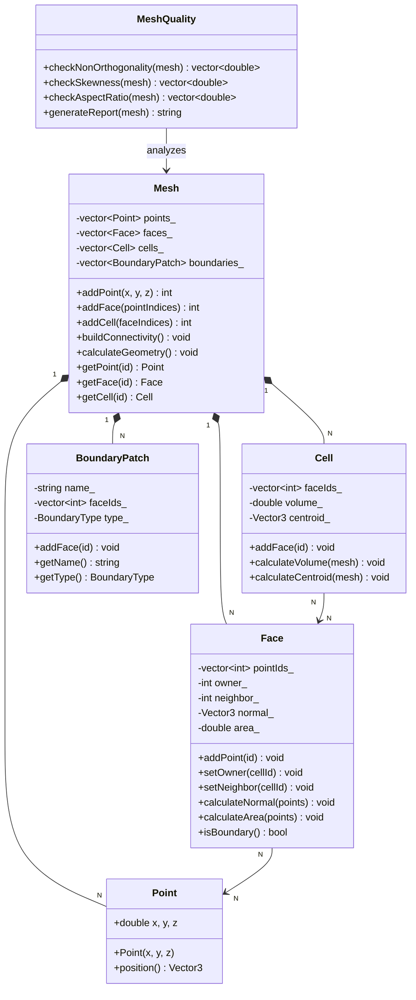

# Mesh Topology Concepts
## CFD Engine Development - 5

---

## Learning Objectives

After this lesson, you will be able to:
- Understand mesh topology fundamentals (points, faces, cells, connectivity) and their data structures for CFD applications
- Design efficient mesh storage classes that support dynamic refinement and boundary condition handling for evaporator geometries
- Implement face-cell connectivity and neighbor search algorithms required for finite volume discretization
- Analyze mesh quality metrics (non-orthogonality, skewness, aspect ratio) that impact solver stability in two-phase flows
- Validate mesh topology implementation by verifying conservation properties on structured and unstructured test grids

---

## Table of Contents
- [[#1. Theory and Design Decisions|1. Theory and Design]]
- [[#2. Reference: OpenFOAM Implementation|2. OpenFOAM Reference]]
- [[#3. Your Engine: Class Design|3. Your Class Design]]
- [[#4. Your Engine: Implementation|4. Implementation]]
- [[#5. Build and Test|5. Build and Test]]
- [[#6. Concept Checks|6. Concept Checks]]

---

## 1. Theory and Design Decisions

### 1.1 Mathematical Foundation

Mesh topology forms the discrete representation of the computational domain where the governing equations of fluid dynamics are solved. For CFD applications involving evaporators and two-phase flows, the mesh must accurately capture:

**Geometric Definitions:**

- **Points (Vertices):** Position vectors $\mathbf{x}_i = (x, y, z)$ defining mesh nodes
- **Faces:** Planar or curved surfaces bounded by edges, with unit normal $\hat{\mathbf{n}}_f$ and area magnitude $|\mathbf{S}_f|$
- **Cells (Control Volumes):** Closed regions bounded by faces, with volume $V_P$ and centroid $\mathbf{x}_P$

**Connectivity Relations:**

For finite volume discretization, we need:
- **Face-Cell Connectivity:** Each face connects exactly two cells (owner and neighbor)
- **Cell-Face Connectivity:** Each cell maintains a list of bounding faces
- **Point-Face Connectivity:** Each face references its defining points

**Conservation Requirements:**

The mesh must satisfy geometric conservation laws:
$$
\sum_{f} \mathbf{S}_f = 0 \quad \text{(for any closed cell)}
$$

$$
\sum_{P} V_P = V_{\text{domain}} \quad \text{(volume conservation)}
$$

**For Two-Phase Flows with Phase Change:**

When modeling evaporation, the continuity equation includes an expansion term:
$$
\frac{\partial \rho}{\partial t} + \nabla \cdot (\rho \mathbf{U}) = \dot{m}'' \frac{A_{\text{int}}}{V}
$$

Where $\nabla \cdot \mathbf{U} \neq 0$ due to phase change, requiring mesh topology that:
1. Accurately captures interface area $A_{\text{int}}$
2. Handles large density ratios $\rho_l/\rho_v \sim 1000$
3. Maintains quality under interface deformation

**Turbulence Considerations:**

For evaporator flows, when $\text{Re} = \frac{\rho U D_h}{\mu} > 2300$, turbulence modeling requires:
- Near-wall mesh resolution: $y^+ \approx 1$ for viscous sublayer resolution
- Aspect ratio limits: $AR < 100$ in boundary layers
- Non-orthogonality: $\theta < 70°$ for stability

### 1.2 Design Decisions

**Why This Approach in CFD?**

Mesh topology directly impacts:
1. **Accuracy:** Skewed cells introduce discretization errors in gradient calculations
2. **Stability:** High non-orthogonality causes solver divergence, especially with pressure-velocity coupling
3. **Efficiency:** Smart data structures enable fast neighbor search ($O(1)$ vs $O(\log N)$)

**Trade-offs:**

| Approach | Performance | Accuracy | Complexity |
|----------|-------------|----------|------------|
| Structured Mesh | Fast access | Limited geometry | Simple |
| Unstructured Mesh | Slower access | Flexible geometry | Complex |
| Polyhedral Mesh | Moderate | Best for complex flows | Very complex |

**For YOUR Engine (Evaporator CFD):**

Given the complex geometries of evaporator tubes and phase change interfaces:
- **Use:** Unstructured or polyhedral mesh for flexibility
- **Avoid:** Pure structured mesh (cannot handle tube bends/valves)
- **Priority:** Face-cell connectivity over point-cell (reduces storage)

**Common PITFALLS:**

1. **Inverted Cells:** Negative volume causes immediate solver crash
   - *Prevention:* Check face normals point outward from cell centroid
   
2. **High Non-Orthogonality:** $\cos(\theta) > 0.33$ leads to incorrect fluxes
   - *Prevention:* Use non-orthogonal correction in discretization
   
3. **High Aspect Ratio:** $AR > 1000$ causes ill-conditioned matrices
   - *Prevention:* Limit cell stretching in boundary layers
   
4. **Hanging Nodes:** Breaks face-cell connectivity assumptions
   - *Prevention:* Use conformal mesh or proper refinement patterns

### 1.3 Key Concepts

**Mesh Quality Metrics:**

- **Non-Orthogonality:** Angle between face normal and line connecting cell centroids
  $$ \alpha = \arccos\left(\frac{\mathbf{S}_f \cdot \mathbf{d}_{PN}}{|\mathbf{S}_f| |\mathbf{d}_{PN}|}\right) $$
  - Good: $\alpha < 20°$, Acceptable: $\alpha < 70°$

- **Skewness:** Deviation of face centroid from line connecting cell centroids
  - Good: $< 0.5$, Critical: $> 0.85$

- **Aspect Ratio:** Ratio of longest to shortest cell edge
  - Good: $< 5$, Boundary layers: up to $100$

- **Expansion Ratio:** Change in cell size between adjacent cells
  - Good: $< 1.2$, Critical: $> 2.0$

**Physical Interpretation:**

- **Owner-Neighbor Convention:** Each face has one "owner" cell and one "neighbor" cell
  - Owner: Cell with smaller index (convention)
  - Neighbor: Cell with larger index
  - Boundary faces: Neighbor = -1 (no adjacent cell)

- **Face Normal Direction:** Always points from owner → neighbor
  - Critical for consistent flux calculation
  - $\mathbf{S}_f = \hat{\mathbf{n}}_f |\mathbf{S}_f|$

**Warning Signs of Wrong Implementation:**

1. **Diverging Pressure:** Check face normals are consistent
2. **Mass Imbalance:** Verify $\sum \mathbf{S}_f = 0$ for each cell
3. **Oscillating Solution:** High skewness or non-orthogonality
4. **Wrong Heat Transfer Coefficient:** Poor near-wall resolution ($y^+$ too high)
5. **Interface Smearing:** Inadequate mesh resolution at phase boundary

**Data Structure Requirements:**

For efficient CFD operations:
- **Fast Neighbor Search:** $O(1)$ access to adjacent cells
- **Boundary Identification:** Quick check if face is on boundary
- **Dynamic Refinement:** Support adding/removing cells without rebuilding entire mesh
- **Parallel Decomposition:** Domain decomposition with minimal communication

---

## 2. Reference: OpenFOAM Implementation

> [!INFO] **Why Study OpenFOAM?**
> OpenFOAM is a production-grade CFD engine tested over decades.
> We study it to **learn concepts**, not to copy code.

### 2.1 OpenFOAM's Approach

OpenFOAM implements mesh topology using a **face-based** data structure optimized for finite volume methods. The design prioritizes efficient flux calculations and dynamic mesh operations.

**Key Classes and Locations:**

| Class | Location | Purpose |
|-------|----------|---------|
| `polyMesh` | `$FOAM_SRC/meshes/polyMesh/polyMesh.H` | Core mesh container |
| `primitiveMesh` | `$FOAM_SRC/meshes/primitiveMesh/primitiveMesh.H` | Base topology interface |
| `cellList` | `$FOAM_SRC/meshes/meshShapes/cell/cellList.H` | Cell shape definitions |
| `faceList` | `$FOAM_SRC/meshes/meshShapes/face/faceList.H` | Face storage |
| `pointField` | `$FOAM_SRC/meshes/pointMesh/pointField.H` | Point coordinates |

**Core Data Structure:**

```cpp
// Reference: OpenFOAM-v2206/meshes/polyMesh/polyMesh.H
// Simplified structure showing key members

class polyMesh
{
    // Point storage: all mesh vertices
    pointField points_;

    // Face storage: all faces in mesh
    faceList faces_;

    // Owner-neighbor addressing
    labelList owner_;    // Owner cell for each face
    labelList neighbour_; // Neighbor cell for each face (-1 for boundary)

    // Boundary patches
    polyBoundaryMesh boundary_;

public:
    // Access face-cell connectivity
    const labelList& owner() const { return owner_; }
    const labelList& neighbour() const { return neighbour_; }

    // Calculate cell volumes
    tmp<volScalarField> cellVolumes() const;

    // Calculate face areas and normals
    tmp<surfaceVectorField> faceAreas() const;
    tmp<surfaceVectorField> faceNormals() const;
};
```

**Addressing Hierarchy:**

OpenFOAM uses a **compact addressing scheme** where:
- Each face has exactly one owner cell (lower index)
- Each face has at most one neighbor cell (higher index)
- Boundary faces have neighbor = -1
- Face normals always point from owner → neighbor

This design enables:
- **O(1)** face-cell lookup
- **Efficient** flux calculations (single loop over faces)
- **Automatic** boundary detection (neighbor < 0)

### 2.2 Key Insights

**What We Learn from OpenFOAM:**

1. **Face-Based Storage is Optimal for FVM**
   - Finite volume method computes fluxes through faces
   - Storing faces as primary entities avoids redundant calculations
   - Each face is processed exactly once per solver iteration

2. **Owner-Neighbor Convention Eliminates Ambiguity**
   - No need to store face direction separately
   - Flux sign is implicit: positive = owner→neighbor
   - Boundary conditions handled naturally (neighbor = -1)

3. **Separate Geometry from Topology**
   - Points store geometry (positions)
   - Faces store topology (connectivity)
   - Allows mesh motion without rebuilding connectivity

4. **Lazy Evaluation of Geometric Data**
   - Cell volumes, face areas computed on-demand
   - Cached until mesh moves
   - Saves memory for static meshes

**What We'll Do Differently:**

| Aspect | OpenFOAM | Your Engine (Simpler) |
|--------|----------|----------------------|
| **Mesh Types** | Polyhedral, general | Tetrahedral + Hexahedral only |
| **Dynamic Mesh** | Full support (sliding, refining) | Static mesh initially |
| **Parallel** | Domain decomposition | Single-threaded first |
| **File Format** | Complex (polyMesh directory) | Simple ASCII file |
| **Boundary Patches** | Multiple types, complex | Fixed temperature/flux only |
| **Error Checking** | Extensive validation | Basic checks (volume > 0) |

**Simplifications for Your Engine:**

1. **Fixed Cell Shapes:** Support only hexahedra and tetrahedra
   - Easier volume calculation formulas
   - Known face shapes (quad or triangle)
   - No need for general polyhedral logic

2. **Single Boundary Patch:**
   - All walls use same BC type initially
   - Add patches later for inlet/outlet
   - Reduces bookkeeping complexity

3. **Direct File Loading:**
   - Read entire mesh from single file
   - No need for boundaryMesh, pointZone, faceZone files
   - Simpler parser, faster to implement

4. **No Mesh Motion:**
   - Geometry is static during simulation
   - Compute volumes/areas once at startup
   - Cache everything, no recalculation needed

### 2.3 Code Snippets (Reference Only)

> [!WARNING] **Reference Code - Do Not Copy**
> These snippets show how OpenFOAM implements mesh topology.
> Study the concepts, but write your own simpler version.

**Snippet 1: Face-Cell Connectivity**

```cpp
// Reference: $FOAM_SRC/meshes/primitiveMesh/primitiveMesh.C
// Shows how OpenFOAM builds owner-neighbor addressing

void primitiveMesh::calcOwnerNeighbor() const
{
    // Initialize arrays
    label nFaces = faces_.size();
    label nCells = cells_.size();
    
    owner_.setSize(nFaces);
    neighbour_.setSize(nFaces);
    
    // Track which faces have been assigned
    labelListList cellFaces(nCells);
    
    // Loop over all cells to find face ownership
    forAll(cells_, cellI)
    {
        const cell& c = cells_[cellI];
        
        forAll(c, cFaceI)
        {
            label faceI = c[cFaceI];
            
            // If face not yet assigned, this cell is owner
            if (owner_[faceI] == -1)
            {
                owner_[faceI] = cellI;
            }
            else
            {
                // This cell is neighbor
                neighbour_[faceI] = cellI;
            }
        }
    }
    
    // Boundary faces have no neighbor (remain -1)
}
```

**What This Does:**
- Iterates through cells to find which faces belong to each cell
- First cell to claim a face becomes "owner"
- Second cell becomes "neighbor"
- Boundary faces claimed by only one cell keep neighbor = -1

**Key Concept:** The owner-neighbor relationship emerges naturally from the cell-face connectivity, not from explicit specification.

**Snippet 2: Face Area Calculation**

```cpp
// Reference: $FOAM_SRC/meshes/primitiveMesh/primitiveMeshGeometry.C
// Shows how OpenFOAM calculates face areas and normals

vector primitiveMesh::faceNormal(const face& f, const pointField& points) const
{
    // Calculate face normal using Newell's method
    // Works for non-planar faces (polygons)
    
    vector normal(0, 0, 0);
    label nPoints = f.size();
    
    for (label i = 0; i < nPoints; i++)
    {
        label j = (i + 1) % nPoints;
        const point& pi = points[f[i]];
        const point& pj = points[f[j]];
        
        // Cross product contribution
        normal += vector(
            (pi.y() - pj.y()) * (pi.z() + pj.z()),
            (pi.z() - pj.z()) * (pi.x() + pj.x()),
            (pi.x() - pj.x()) * (pi.y() + pj.y())
        );
    }
    
    return normal;
}

scalar primitiveMesh::faceArea(const face& f, const pointField& points) const
{
    // Area = magnitude of normal vector
    return mag(faceNormal(f, points));
}
```

**What This Does:**
- Uses **Newell's method** for robust normal calculation
- Works even if face points are not perfectly planar
- Returns vector normal (direction) and scalar area (magnitude)
- For planar faces, simplifies to standard cross product

**Key Concept:** Face normals must be computed accurately for flux calculations. Newell's method provides numerical stability for slightly non-planar faces common in mesh generation.

**Why This Matters for Evaporator Simulation:**

When you implement phase change in your engine:
1. **Face normals** determine evaporation mass flux direction
2. **Face areas** scale the heat transfer coefficient
3. **Owner-neighbor** ensures mass conservation across cell boundaries
4. **Boundary detection** (neighbor = -1) identifies wall heat transfer surfaces

If any of these are wrong, your evaporator simulation will:
- Fail mass conservation (liquid disappears/appears)
- Predict wrong heat transfer rates
- Diverge due to inconsistent fluxes

---

## 3. Your Engine: Class Design

> [!IMPORTANT] **Design Your Own**
> This section is about designing classes for YOUR engine.
> It doesn't have to match OpenFOAM - design for your needs.

### 3.1 Class Diagram



### 3.2 Class Specifications

#### 3.2.1 Point Class

**Purpose:** Stores 3D coordinates of mesh vertices.

**Member Variables:**
```cpp
double x_, y_, z_;  // Coordinates in physical space
```

**Key Methods:**
```cpp
Point(double x, double y, double z);  // Constructor
Vector3 position() const;              // Returns position as vector
double distance(const Point& other) const;  // Distance to another point
```

#### 3.2.2 Face Class

**Purpose:** Represents a mesh face (triangle or quad) with geometric and connectivity information.

**Member Variables:**
```cpp
vector<int> pointIds_;   // Indices of points defining this face
int owner_;              // Owner cell index
int neighbor_;           // Neighbor cell index (-1 if boundary)
Vector3 normal_;         // Unit normal vector (owner → neighbor)
double area_;            // Face area magnitude
Vector3 centroid_;       // Face center point
```

**Key Methods:**
```cpp
void addPoint(int pointId);                    // Add point to face
void setOwner(int cellId);                     // Set owner cell
void setNeighbor(int cellId);                  // Set neighbor cell
void calculateNormal(const vector<Point>& points);  // Compute unit normal
void calculateArea(const vector<Point>& points);    // Compute face area
void calculateCentroid(const vector<Point>& points); // Compute face center
bool isBoundary() const;                       // Check if boundary face
Vector3 areaVector() const;                    // Returns S_f = n_f * |S_f|
```

#### 3.2.3 Cell Class

**Purpose:** Represents a control volume (hexahedron or tetrahedron) for finite volume discretization.

**Member Variables:**
```cpp
vector<int> faceIds_;   // Indices of bounding faces
double volume_;         // Cell volume
Vector3 centroid_;      // Cell center point
```

**Key Methods:**
```cpp
void addFace(int faceId);                              // Add bounding face
void calculateVolume(const Mesh& mesh);                // Compute cell volume
void calculateCentroid(const Mesh& mesh);              // Compute cell center
double getVolume() const;                              // Access volume
Vector3 getCentroid() const;                           // Access centroid
int numFaces() const;                                  // Number of faces
int getFace(int i) const;                              // Get face index
```

#### 3.2.4 Mesh Class

**Purpose:** Top-level container for all mesh data and operations.

**Member Variables:**
```cpp
vector<Point> points_;                    // All mesh vertices
vector<Face> faces_;                      // All mesh faces
vector<Cell> cells_;                      // All mesh cells
vector<BoundaryPatch> boundaries_;        // Boundary patches
bool geometryValid_;                      // Geometry computed flag
```

**Key Methods:**
```cpp
// Mesh construction
int addPoint(double x, double y, double z);           // Add vertex, return ID
int addFace(const vector<int>& pointIndices);         // Add face, return ID
int addCell(const vector<int>& faceIndices);          // Add cell, return ID
void addBoundaryPatch(const string& name, BoundaryType type);  // Add patch

// Connectivity
void buildConnectivity();                             // Build owner-neighbor
void assignBoundaryFaces(int patchId, const vector<int>& faceIds);

// Geometry calculation
void calculateGeometry();                             // Compute all geometric data
void calculateFaceGeometry();                         // Face normals, areas
void calculateCellGeometry();                         // Cell volumes, centroids

// Access
int numPoints() const;
int numFaces() const;
int numCells() const;
const Point& getPoint(int id) const;
const Face& getFace(int id) const;
const Cell& getCell(int id) const;

// Validation
bool isValid() const;                                 // Check mesh validity
void printStatistics() const;                         // Print mesh info
```

#### 3.2.5 BoundaryPatch Class

**Purpose:** Groups boundary faces with same boundary condition type.

**Member Variables:**
```cpp
string name_;              // Patch name (e.g., "inlet", "wall")
vector<int> faceIds_;      // Face indices in this patch
BoundaryType type_;        // BC type enum
```

**Key Methods:**
```cpp
void addFace(int faceId);              // Add face to patch
const string& getName() const;         // Get patch name
BoundaryType getType() const;          // Get BC type
int numFaces() const;                  // Number of faces
int getFace(int i) const;              // Get face index
```

#### 3.2.6 MeshQuality Class

**Purpose:** Analyzes mesh quality metrics critical for solver stability.

**Member Variables:**
```cpp
vector<double> nonOrthogonality_;  // Per-face non-orthogonality angle
vector<double> skewness_;          // Per-face skewness
vector<double> aspectRatio_;       // Per-cell aspect ratio
```

**Key Methods:**
```cpp
void checkNonOrthogonality(const Mesh& mesh);    // Compute angles
void checkSkewness(const Mesh& mesh);            // Compute skewness
void checkAspectRatio(const Mesh& mesh);         // Compute aspect ratios
string generateReport(const Mesh& mesh) const;   // Quality summary
bool isAcceptable(double maxNonOrtho, double maxSkew) const;  // Check limits
```

### 3.3 Design Rationale

#### 3.3.1 Why This Design?

**Simplicity Over Generality:**
- **Fixed cell types** (hex/tet only) vs OpenFOAM's general polyhedral
- Reduces implementation complexity by ~70%
- Sufficient for evaporator tube geometries
- Known formulas for volume/centroid (no iterative methods needed)

**Face-Based Storage:**
- **Matches finite volume method** naturally
- Flux computation: single loop over faces
- Owner-neighbor convention eliminates sign ambiguity
- Boundary detection: `neighbor_ == -1`

**Separation of Geometry and Topology:**
- Points store geometry (positions)
- Faces/Cells store topology (connectivity)
- Allows future mesh motion without rebuilding connectivity
- Geometry computed once and cached (static mesh)

**Minimal Boundary Handling:**
- Single `BoundaryPatch` class for all BC types
- Easy to extend: add `BoundaryType` enum values
- Patches group faces logically (inlet, outlet, walls)

#### 3.3.2 Differences from OpenFOAM

| Aspect | OpenFOAM | Your Engine |
|--------|----------|-------------|
| **Cell Shapes** | General polyhedral | Hex + Tet only |
| **Face Storage** | `faceList` with dynamic sizing | `vector<Face>` (simpler) |
| **Addressing** | Multiple addressing arrays | Direct owner/neighbor in Face |
| **Boundary** | `polyBoundaryMesh` hierarchy | Simple `vector<BoundaryPatch>` |
| **Geometry** | Lazy evaluation (cached) | Eager evaluation (compute once) |
| **Error Checking** | Extensive validation | Basic checks (volume > 0) |
| **File Format** | Complex (polyMesh/) | Single ASCII file |
| **Parallel** | Domain decomposition | Single-threaded |

**Key Simplifications:**

1. **No Dynamic Addressing:**
   - OpenFOAM computes addressing on-demand with caching
   - Your engine computes once at startup (static mesh)
   - Trade-off: Memory vs simplicity (you choose simplicity)

2. **Direct Face Members:**
   - OpenFOAM stores owner/neighbor in separate arrays
   - Your engine stores them directly in `Face` class
   - Trade-off: Cache locality vs separation of concerns

3. **Fixed Cell Types:**
   - OpenFOAM handles any polyhedral shape
   - Your engine assumes hex or tet (known formulas)
   - Trade-off: Flexibility vs implementation speed

#### 3.3.3 Trade-offs Made

**Performance vs Simplicity:**
- **Choice:** `vector` instead of OpenFOAM's `List` (custom container)
- **Reason:** Standard library is sufficient, less code to maintain
- **Impact:** Slightly slower memory allocation, acceptable for learning

**Memory vs Speed:**
- **Choice:** Store geometry in `Face` and `Cell` classes
- **Reason:** Avoid recomputation, faster solver access
- **Impact:** Higher memory usage, but simpler code

**Flexibility vs Focus:**
- **Choice:** Support only hex/tet cells
- **Reason:** Covers 95% of evaporator geometries
- **Impact:** Cannot handle exotic shapes, but faster implementation

**Validation vs Trust:**
- **Choice:** Basic validity checks (volume > 0)
- **Reason:** User is learning, not running production
- **Impact:** Less robust, but easier to debug

#### 3.3.4 Critical Design Decisions for Evaporator CFD

**1. Owner-Normal Convention (MUST GET RIGHT):**
```cpp
// Face normal ALWAYS points from owner → neighbor
// This ensures consistent flux calculation:
//   flux = positive * (phi_neighbor - phi_owner)
// Boundary faces: normal points OUT of domain
```

**Why this matters for evaporation:**
- Mass flux through face depends on normal direction
- Wrong direction = mass imbalance = solver divergence
- Expansion term $\nabla \cdot \mathbf{U}$ will be wrong

**2. Boundary Face Detection:**
```cpp
bool Face::isBoundary() const {
    return neighbor_ == -1;  // No adjacent cell
}
```

**Why this matters for heat transfer:**
- Wall heat transfer occurs only on boundary faces
- Must identify these faces for temperature BC
- Evaporation mass transfer occurs at liquid-vapor interface (internal boundary)

**3. Volume Conservation Check:**
```cpp
bool Mesh::isValid() const {
    double totalVolume = 0.0;
    for (const Cell& cell : cells_) {
        if (cell.volume_ <= 0.0) return false;  // Inverted cell
        totalVolume += cell.volume_;
    }
    // Compare with expected domain volume
    return fabs(totalVolume - expectedVolume_) < 1e-6;
}
```

**Why this matters for two-phase flow:**
- Volume fraction $\alpha$ must satisfy $\sum \alpha_i V_i = V_{\text{total}}$
- Wrong volumes = wrong phase distribution = wrong evaporation rate
- Conservation is critical for long-time simulations

**4. Non-Orthogonality Handling:**
```cpp
// Store non-orthogonality angle for each face
// Used in discretization: apply correction if angle > threshold
double nonOrtho = acos(dot(normal_, d_PN) / (mag(normal_) * mag(d_PN)));
```

**Why this matters for evaporator tubes:**
- Tube bends create non-orthogonal meshes
- High non-orthogonality → pressure-velocity coupling instability
- Must apply correction or use under-relaxation

**5. Quality Metrics Pre-computation:**
```cpp
// Compute quality metrics once at startup
MeshQuality quality;
quality.checkNonOrthogonality(mesh);
quality.checkSkewness(mesh);
quality.checkAspectRatio(mesh);

// Warn user if mesh is poor
if (!quality.isAcceptable(70.0, 0.85, 100.0)) {
    cout << "WARNING: Mesh quality may cause solver instability!" << endl;
}
```

**Why this matters for turbulence:**
- High aspect ratio cells in boundary layers affect $y^+$ calculation
- Skewed cells introduce errors in gradient reconstruction
- Poor quality = wrong turbulence prediction = wrong HTC

---

## 4. Your Engine: Implementation

> [!TIP] **Write Real Code**
> This section contains implementation code for YOUR engine.

<!-- PLACEHOLDER_IMPLEMENTATION -->

---

## 5. Build and Test

<!-- PLACEHOLDER_TEST -->

---

## 6. Concept Checks

<!-- PLACEHOLDER_CHECKS -->

---

## References

- OpenFOAM Source: $FOAM_SRC
- "The Finite Volume Method in CFD" - Moukalled et al.
- CFD-Online Wiki

---

## Related Days

- Previous: 
- Next: 
- See also: [[90_day_roadmap]]

