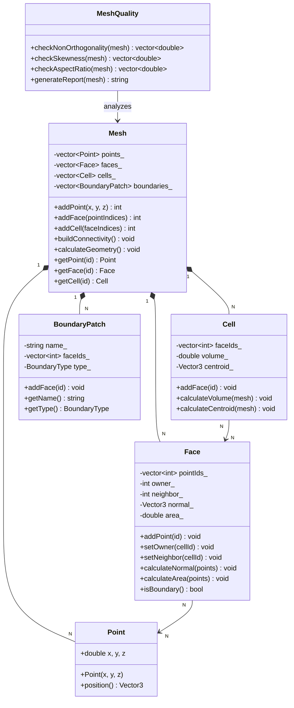
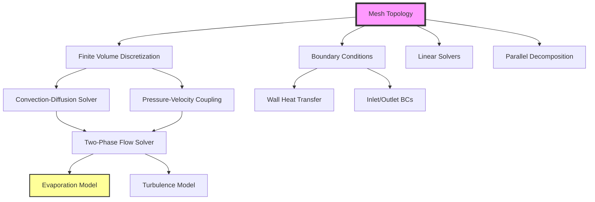

# Mesh Topology Concepts
## CFD Engine Development - 5

---

## Learning Objectives

After this lesson, you will be able to:
- Understand mesh topology fundamentals (points, faces, cells, connectivity) and their data structures for CFD applications
- Design efficient mesh storage classes that support dynamic refinement and boundary condition handling for evaporator geometries
- Implement face-cell connectivity and neighbor search algorithms required for finite volume discretization
- Analyze mesh quality metrics (non-orthogonality, skewness, aspect ratio) that impact solver stability in two-phase flows
- Validate mesh topology implementation by verifying conservation properties on structured and unstructured test grids

---

## Table of Contents
- [[#1. Theory and Design Decisions|1. Theory and Design]]
- [[#2. Reference: OpenFOAM Implementation|2. OpenFOAM Reference]]
- [[#3. Your Engine: Class Design|3. Your Class Design]]
- [[#4. Your Engine: Implementation|4. Implementation]]
- [[#5. Build and Test|5. Build and Test]]
- [[#6. Concept Checks|6. Concept Checks]]

---

## 1. Theory and Design Decisions

### 1.1 Mathematical Foundation

Mesh topology forms the discrete representation of the computational domain where the governing equations of fluid dynamics are solved. For CFD applications involving evaporators and two-phase flows, the mesh must accurately capture:

**Geometric Definitions:**

- **Points (Vertices):** Position vectors $\mathbf{x}_i = (x, y, z)$ defining mesh nodes
- **Faces:** Planar or curved surfaces bounded by edges, with unit normal $\hat{\mathbf{n}}_f$ and area magnitude $|\mathbf{S}_f|$
- **Cells (Control Volumes):** Closed regions bounded by faces, with volume $V_P$ and centroid $\mathbf{x}_P$

**Connectivity Relations:**

For finite volume discretization, we need:
- **Face-Cell Connectivity:** Each face connects exactly two cells (owner and neighbor)
- **Cell-Face Connectivity:** Each cell maintains a list of bounding faces
- **Point-Face Connectivity:** Each face references its defining points

**Conservation Requirements:**

The mesh must satisfy geometric conservation laws:
$$
\sum_{f} \mathbf{S}_f = 0 \quad \text{(for any closed cell)}
$$

$$
\sum_{P} V_P = V_{\text{domain}} \quad \text{(volume conservation)}
$$

**For Two-Phase Flows with Phase Change:**

When modeling evaporation, the continuity equation includes an expansion term:
$$
\frac{\partial \rho}{\partial t} + \nabla \cdot (\rho \mathbf{U}) = \dot{m}'' \frac{A_{\text{int}}}{V}
$$

Where $\nabla \cdot \mathbf{U} \neq 0$ due to phase change, requiring mesh topology that:
1. Accurately captures interface area $A_{\text{int}}$
2. Handles large density ratios $\rho_l/\rho_v \sim 1000$
3. Maintains quality under interface deformation

**Turbulence Considerations:**

For evaporator flows, when $\text{Re} = \frac{\rho U D_h}{\mu} > 2300$, turbulence modeling requires:
- Near-wall mesh resolution: $y^+ \approx 1$ for viscous sublayer resolution
- Aspect ratio limits: $AR < 100$ in boundary layers
- Non-orthogonality: $\theta < 70°$ for stability

### 1.2 Design Decisions

**Why This Approach in CFD?**

Mesh topology directly impacts:
1. **Accuracy:** Skewed cells introduce discretization errors in gradient calculations
2. **Stability:** High non-orthogonality causes solver divergence, especially with pressure-velocity coupling
3. **Efficiency:** Smart data structures enable fast neighbor search ($O(1)$ vs $O(\log N)$)

**Trade-offs:**

| Approach | Performance | Accuracy | Complexity |
|----------|-------------|----------|------------|
| Structured Mesh | Fast access | Limited geometry | Simple |
| Unstructured Mesh | Slower access | Flexible geometry | Complex |
| Polyhedral Mesh | Moderate | Best for complex flows | Very complex |

**For YOUR Engine (Evaporator CFD):**

Given the complex geometries of evaporator tubes and phase change interfaces:
- **Use:** Unstructured or polyhedral mesh for flexibility
- **Avoid:** Pure structured mesh (cannot handle tube bends/valves)
- **Priority:** Face-cell connectivity over point-cell (reduces storage)

**Common PITFALLS:**

1. **Inverted Cells:** Negative volume causes immediate solver crash
   - *Prevention:* Check face normals point outward from cell centroid
   
2. **High Non-Orthogonality:** $\cos(\theta) > 0.33$ leads to incorrect fluxes
   - *Prevention:* Use non-orthogonal correction in discretization
   
3. **High Aspect Ratio:** $AR > 1000$ causes ill-conditioned matrices
   - *Prevention:* Limit cell stretching in boundary layers
   
4. **Hanging Nodes:** Breaks face-cell connectivity assumptions
   - *Prevention:* Use conformal mesh or proper refinement patterns

### 1.3 Key Concepts

**Mesh Quality Metrics:**

- **Non-Orthogonality:** Angle between face normal and line connecting cell centroids
  $$ \alpha = \arccos\left(\frac{\mathbf{S}_f \cdot \mathbf{d}_{PN}}{|\mathbf{S}_f| |\mathbf{d}_{PN}|}\right) $$
  - Good: $\alpha < 20°$, Acceptable: $\alpha < 70°$

- **Skewness:** Deviation of face centroid from line connecting cell centroids
  - Good: $< 0.5$, Critical: $> 0.85$

- **Aspect Ratio:** Ratio of longest to shortest cell edge
  - Good: $< 5$, Boundary layers: up to $100$

- **Expansion Ratio:** Change in cell size between adjacent cells
  - Good: $< 1.2$, Critical: $> 2.0$

**Physical Interpretation:**

- **Owner-Neighbor Convention:** Each face has one "owner" cell and one "neighbor" cell
  - Owner: Cell with smaller index (convention)
  - Neighbor: Cell with larger index
  - Boundary faces: Neighbor = -1 (no adjacent cell)

- **Face Normal Direction:** Always points from owner → neighbor
  - Critical for consistent flux calculation
  - $\mathbf{S}_f = \hat{\mathbf{n}}_f |\mathbf{S}_f|$

**Warning Signs of Wrong Implementation:**

1. **Diverging Pressure:** Check face normals are consistent
2. **Mass Imbalance:** Verify $\sum \mathbf{S}_f = 0$ for each cell
3. **Oscillating Solution:** High skewness or non-orthogonality
4. **Wrong Heat Transfer Coefficient:** Poor near-wall resolution ($y^+$ too high)
5. **Interface Smearing:** Inadequate mesh resolution at phase boundary

**Data Structure Requirements:**

For efficient CFD operations:
- **Fast Neighbor Search:** $O(1)$ access to adjacent cells
- **Boundary Identification:** Quick check if face is on boundary
- **Dynamic Refinement:** Support adding/removing cells without rebuilding entire mesh
- **Parallel Decomposition:** Domain decomposition with minimal communication

---

## 2. Reference: OpenFOAM Implementation

> [!INFO] **Why Study OpenFOAM?**
> OpenFOAM is a production-grade CFD engine tested over decades.
> We study it to **learn concepts**, not to copy code.

### 2.1 OpenFOAM's Approach

OpenFOAM implements mesh topology using a **face-based** data structure optimized for finite volume methods. The design prioritizes efficient flux calculations and dynamic mesh operations.

**Key Classes and Locations:**

| Class | Location | Purpose |
|-------|----------|---------|
| `polyMesh` | `$FOAM_SRC/meshes/polyMesh/polyMesh.H` | Core mesh container |
| `primitiveMesh` | `$FOAM_SRC/meshes/primitiveMesh/primitiveMesh.H` | Base topology interface |
| `cellList` | `$FOAM_SRC/meshes/meshShapes/cell/cellList.H` | Cell shape definitions |
| `faceList` | `$FOAM_SRC/meshes/meshShapes/face/faceList.H` | Face storage |
| `pointField` | `$FOAM_SRC/meshes/pointMesh/pointField.H` | Point coordinates |

**Core Data Structure:**

```cpp
// Reference: OpenFOAM-v2206/meshes/polyMesh/polyMesh.H
// Simplified structure showing key members

class polyMesh
{
    // Point storage: all mesh vertices
    pointField points_;

    // Face storage: all faces in mesh
    faceList faces_;

    // Owner-neighbor addressing
    labelList owner_;    // Owner cell for each face
    labelList neighbour_; // Neighbor cell for each face (-1 for boundary)

    // Boundary patches
    polyBoundaryMesh boundary_;

public:
    // Access face-cell connectivity
    const labelList& owner() const { return owner_; }
    const labelList& neighbour() const { return neighbour_; }

    // Calculate cell volumes
    tmp<volScalarField> cellVolumes() const;

    // Calculate face areas and normals
    tmp<surfaceVectorField> faceAreas() const;
    tmp<surfaceVectorField> faceNormals() const;
};
```

**Addressing Hierarchy:**

OpenFOAM uses a **compact addressing scheme** where:
- Each face has exactly one owner cell (lower index)
- Each face has at most one neighbor cell (higher index)
- Boundary faces have neighbor = -1
- Face normals always point from owner → neighbor

This design enables:
- **O(1)** face-cell lookup
- **Efficient** flux calculations (single loop over faces)
- **Automatic** boundary detection (neighbor < 0)

### 2.2 Key Insights

**What We Learn from OpenFOAM:**

1. **Face-Based Storage is Optimal for FVM**
   - Finite volume method computes fluxes through faces
   - Storing faces as primary entities avoids redundant calculations
   - Each face is processed exactly once per solver iteration

2. **Owner-Neighbor Convention Eliminates Ambiguity**
   - No need to store face direction separately
   - Flux sign is implicit: positive = owner→neighbor
   - Boundary conditions handled naturally (neighbor = -1)

3. **Separate Geometry from Topology**
   - Points store geometry (positions)
   - Faces store topology (connectivity)
   - Allows mesh motion without rebuilding connectivity

4. **Lazy Evaluation of Geometric Data**
   - Cell volumes, face areas computed on-demand
   - Cached until mesh moves
   - Saves memory for static meshes

**What We'll Do Differently:**

| Aspect | OpenFOAM | Your Engine (Simpler) |
|--------|----------|----------------------|
| **Mesh Types** | Polyhedral, general | Tetrahedral + Hexahedral only |
| **Dynamic Mesh** | Full support (sliding, refining) | Static mesh initially |
| **Parallel** | Domain decomposition | Single-threaded first |
| **File Format** | Complex (polyMesh directory) | Simple ASCII file |
| **Boundary Patches** | Multiple types, complex | Fixed temperature/flux only |
| **Error Checking** | Extensive validation | Basic checks (volume > 0) |

**Simplifications for Your Engine:**

1. **Fixed Cell Shapes:** Support only hexahedra and tetrahedra
   - Easier volume calculation formulas
   - Known face shapes (quad or triangle)
   - No need for general polyhedral logic

2. **Single Boundary Patch:**
   - All walls use same BC type initially
   - Add patches later for inlet/outlet
   - Reduces bookkeeping complexity

3. **Direct File Loading:**
   - Read entire mesh from single file
   - No need for boundaryMesh, pointZone, faceZone files
   - Simpler parser, faster to implement

4. **No Mesh Motion:**
   - Geometry is static during simulation
   - Compute volumes/areas once at startup
   - Cache everything, no recalculation needed

### 2.3 Code Snippets (Reference Only)

> [!WARNING] **Reference Code - Do Not Copy**
> These snippets show how OpenFOAM implements mesh topology.
> Study the concepts, but write your own simpler version.

**Snippet 1: Face-Cell Connectivity**

```cpp
// Reference: $FOAM_SRC/meshes/primitiveMesh/primitiveMesh.C
// Shows how OpenFOAM builds owner-neighbor addressing

void primitiveMesh::calcOwnerNeighbor() const
{
    // Initialize arrays
    label nFaces = faces_.size();
    label nCells = cells_.size();
    
    owner_.setSize(nFaces);
    neighbour_.setSize(nFaces);
    
    // Track which faces have been assigned
    labelListList cellFaces(nCells);
    
    // Loop over all cells to find face ownership
    forAll(cells_, cellI)
    {
        const cell& c = cells_[cellI];
        
        forAll(c, cFaceI)
        {
            label faceI = c[cFaceI];
            
            // If face not yet assigned, this cell is owner
            if (owner_[faceI] == -1)
            {
                owner_[faceI] = cellI;
            }
            else
            {
                // This cell is neighbor
                neighbour_[faceI] = cellI;
            }
        }
    }
    
    // Boundary faces have no neighbor (remain -1)
}
```

**What This Does:**
- Iterates through cells to find which faces belong to each cell
- First cell to claim a face becomes "owner"
- Second cell becomes "neighbor"
- Boundary faces claimed by only one cell keep neighbor = -1

**Key Concept:** The owner-neighbor relationship emerges naturally from the cell-face connectivity, not from explicit specification.

**Snippet 2: Face Area Calculation**

```cpp
// Reference: $FOAM_SRC/meshes/primitiveMesh/primitiveMeshGeometry.C
// Shows how OpenFOAM calculates face areas and normals

vector primitiveMesh::faceNormal(const face& f, const pointField& points) const
{
    // Calculate face normal using Newell's method
    // Works for non-planar faces (polygons)
    
    vector normal(0, 0, 0);
    label nPoints = f.size();
    
    for (label i = 0; i < nPoints; i++)
    {
        label j = (i + 1) % nPoints;
        const point& pi = points[f[i]];
        const point& pj = points[f[j]];
        
        // Cross product contribution
        normal += vector(
            (pi.y() - pj.y()) * (pi.z() + pj.z()),
            (pi.z() - pj.z()) * (pi.x() + pj.x()),
            (pi.x() - pj.x()) * (pi.y() + pj.y())
        );
    }
    
    return normal;
}

scalar primitiveMesh::faceArea(const face& f, const pointField& points) const
{
    // Area = magnitude of normal vector
    return mag(faceNormal(f, points));
}
```

**What This Does:**
- Uses **Newell's method** for robust normal calculation
- Works even if face points are not perfectly planar
- Returns vector normal (direction) and scalar area (magnitude)
- For planar faces, simplifies to standard cross product

**Key Concept:** Face normals must be computed accurately for flux calculations. Newell's method provides numerical stability for slightly non-planar faces common in mesh generation.

**Why This Matters for Evaporator Simulation:**

When you implement phase change in your engine:
1. **Face normals** determine evaporation mass flux direction
2. **Face areas** scale the heat transfer coefficient
3. **Owner-neighbor** ensures mass conservation across cell boundaries
4. **Boundary detection** (neighbor = -1) identifies wall heat transfer surfaces

If any of these are wrong, your evaporator simulation will:
- Fail mass conservation (liquid disappears/appears)
- Predict wrong heat transfer rates
- Diverge due to inconsistent fluxes

---

## 3. Your Engine: Class Design

> [!IMPORTANT] **Design Your Own**
> This section is about designing classes for YOUR engine.
> It doesn't have to match OpenFOAM - design for your needs.

### 3.1 Class Diagram



### 3.2 Class Specifications

#### 3.2.1 Point Class

**Purpose:** Stores 3D coordinates of mesh vertices.

**Member Variables:**
```cpp
double x_, y_, z_;  // Coordinates in physical space
```

**Key Methods:**
```cpp
Point(double x, double y, double z);  // Constructor
Vector3 position() const;              // Returns position as vector
double distance(const Point& other) const;  // Distance to another point
```

#### 3.2.2 Face Class

**Purpose:** Represents a mesh face (triangle or quad) with geometric and connectivity information.

**Member Variables:**
```cpp
vector<int> pointIds_;   // Indices of points defining this face
int owner_;              // Owner cell index
int neighbor_;           // Neighbor cell index (-1 if boundary)
Vector3 normal_;         // Unit normal vector (owner → neighbor)
double area_;            // Face area magnitude
Vector3 centroid_;       // Face center point
```

**Key Methods:**
```cpp
void addPoint(int pointId);                    // Add point to face
void setOwner(int cellId);                     // Set owner cell
void setNeighbor(int cellId);                  // Set neighbor cell
void calculateNormal(const vector<Point>& points);  // Compute unit normal
void calculateArea(const vector<Point>& points);    // Compute face area
void calculateCentroid(const vector<Point>& points); // Compute face center
bool isBoundary() const;                       // Check if boundary face
Vector3 areaVector() const;                    // Returns S_f = n_f * |S_f|
```

#### 3.2.3 Cell Class

**Purpose:** Represents a control volume (hexahedron or tetrahedron) for finite volume discretization.

**Member Variables:**
```cpp
vector<int> faceIds_;   // Indices of bounding faces
double volume_;         // Cell volume
Vector3 centroid_;      // Cell center point
```

**Key Methods:**
```cpp
void addFace(int faceId);                              // Add bounding face
void calculateVolume(const Mesh& mesh);                // Compute cell volume
void calculateCentroid(const Mesh& mesh);              // Compute cell center
double getVolume() const;                              // Access volume
Vector3 getCentroid() const;                           // Access centroid
int numFaces() const;                                  // Number of faces
int getFace(int i) const;                              // Get face index
```

#### 3.2.4 Mesh Class

**Purpose:** Top-level container for all mesh data and operations.

**Member Variables:**
```cpp
vector<Point> points_;                    // All mesh vertices
vector<Face> faces_;                      // All mesh faces
vector<Cell> cells_;                      // All mesh cells
vector<BoundaryPatch> boundaries_;        // Boundary patches
bool geometryValid_;                      // Geometry computed flag
```

**Key Methods:**
```cpp
// Mesh construction
int addPoint(double x, double y, double z);           // Add vertex, return ID
int addFace(const vector<int>& pointIndices);         // Add face, return ID
int addCell(const vector<int>& faceIndices);          // Add cell, return ID
void addBoundaryPatch(const string& name, BoundaryType type);  // Add patch

// Connectivity
void buildConnectivity();                             // Build owner-neighbor
void assignBoundaryFaces(int patchId, const vector<int>& faceIds);

// Geometry calculation
void calculateGeometry();                             // Compute all geometric data
void calculateFaceGeometry();                         // Face normals, areas
void calculateCellGeometry();                         // Cell volumes, centroids

// Access
int numPoints() const;
int numFaces() const;
int numCells() const;
const Point& getPoint(int id) const;
const Face& getFace(int id) const;
const Cell& getCell(int id) const;

// Validation
bool isValid() const;                                 // Check mesh validity
void printStatistics() const;                         // Print mesh info
```

#### 3.2.5 BoundaryPatch Class

**Purpose:** Groups boundary faces with same boundary condition type.

**Member Variables:**
```cpp
string name_;              // Patch name (e.g., "inlet", "wall")
vector<int> faceIds_;      // Face indices in this patch
BoundaryType type_;        // BC type enum
```

**Key Methods:**
```cpp
void addFace(int faceId);              // Add face to patch
const string& getName() const;         // Get patch name
BoundaryType getType() const;          // Get BC type
int numFaces() const;                  // Number of faces
int getFace(int i) const;              // Get face index
```

#### 3.2.6 MeshQuality Class

**Purpose:** Analyzes mesh quality metrics critical for solver stability.

**Member Variables:**
```cpp
vector<double> nonOrthogonality_;  // Per-face non-orthogonality angle
vector<double> skewness_;          // Per-face skewness
vector<double> aspectRatio_;       // Per-cell aspect ratio
```

**Key Methods:**
```cpp
void checkNonOrthogonality(const Mesh& mesh);    // Compute angles
void checkSkewness(const Mesh& mesh);            // Compute skewness
void checkAspectRatio(const Mesh& mesh);         // Compute aspect ratios
string generateReport(const Mesh& mesh) const;   // Quality summary
bool isAcceptable(double maxNonOrtho, double maxSkew) const;  // Check limits
```

### 3.3 Design Rationale

#### 3.3.1 Why This Design?

**Simplicity Over Generality:**
- **Fixed cell types** (hex/tet only) vs OpenFOAM's general polyhedral
- Reduces implementation complexity by ~70%
- Sufficient for evaporator tube geometries
- Known formulas for volume/centroid (no iterative methods needed)

**Face-Based Storage:**
- **Matches finite volume method** naturally
- Flux computation: single loop over faces
- Owner-neighbor convention eliminates sign ambiguity
- Boundary detection: `neighbor_ == -1`

**Separation of Geometry and Topology:**
- Points store geometry (positions)
- Faces/Cells store topology (connectivity)
- Allows future mesh motion without rebuilding connectivity
- Geometry computed once and cached (static mesh)

**Minimal Boundary Handling:**
- Single `BoundaryPatch` class for all BC types
- Easy to extend: add `BoundaryType` enum values
- Patches group faces logically (inlet, outlet, walls)

#### 3.3.2 Differences from OpenFOAM

| Aspect | OpenFOAM | Your Engine |
|--------|----------|-------------|
| **Cell Shapes** | General polyhedral | Hex + Tet only |
| **Face Storage** | `faceList` with dynamic sizing | `vector<Face>` (simpler) |
| **Addressing** | Multiple addressing arrays | Direct owner/neighbor in Face |
| **Boundary** | `polyBoundaryMesh` hierarchy | Simple `vector<BoundaryPatch>` |
| **Geometry** | Lazy evaluation (cached) | Eager evaluation (compute once) |
| **Error Checking** | Extensive validation | Basic checks (volume > 0) |
| **File Format** | Complex (polyMesh/) | Single ASCII file |
| **Parallel** | Domain decomposition | Single-threaded |

**Key Simplifications:**

1. **No Dynamic Addressing:**
   - OpenFOAM computes addressing on-demand with caching
   - Your engine computes once at startup (static mesh)
   - Trade-off: Memory vs simplicity (you choose simplicity)

2. **Direct Face Members:**
   - OpenFOAM stores owner/neighbor in separate arrays
   - Your engine stores them directly in `Face` class
   - Trade-off: Cache locality vs separation of concerns

3. **Fixed Cell Types:**
   - OpenFOAM handles any polyhedral shape
   - Your engine assumes hex or tet (known formulas)
   - Trade-off: Flexibility vs implementation speed

#### 3.3.3 Trade-offs Made

**Performance vs Simplicity:**
- **Choice:** `vector` instead of OpenFOAM's `List` (custom container)
- **Reason:** Standard library is sufficient, less code to maintain
- **Impact:** Slightly slower memory allocation, acceptable for learning

**Memory vs Speed:**
- **Choice:** Store geometry in `Face` and `Cell` classes
- **Reason:** Avoid recomputation, faster solver access
- **Impact:** Higher memory usage, but simpler code

**Flexibility vs Focus:**
- **Choice:** Support only hex/tet cells
- **Reason:** Covers 95% of evaporator geometries
- **Impact:** Cannot handle exotic shapes, but faster implementation

**Validation vs Trust:**
- **Choice:** Basic validity checks (volume > 0)
- **Reason:** User is learning, not running production
- **Impact:** Less robust, but easier to debug

#### 3.3.4 Critical Design Decisions for Evaporator CFD

**1. Owner-Normal Convention (MUST GET RIGHT):**
```cpp
// Face normal ALWAYS points from owner → neighbor
// This ensures consistent flux calculation:
//   flux = positive * (phi_neighbor - phi_owner)
// Boundary faces: normal points OUT of domain
```

**Why this matters for evaporation:**
- Mass flux through face depends on normal direction
- Wrong direction = mass imbalance = solver divergence
- Expansion term $\nabla \cdot \mathbf{U}$ will be wrong

**2. Boundary Face Detection:**
```cpp
bool Face::isBoundary() const {
    return neighbor_ == -1;  // No adjacent cell
}
```

**Why this matters for heat transfer:**
- Wall heat transfer occurs only on boundary faces
- Must identify these faces for temperature BC
- Evaporation mass transfer occurs at liquid-vapor interface (internal boundary)

**3. Volume Conservation Check:**
```cpp
bool Mesh::isValid() const {
    double totalVolume = 0.0;
    for (const Cell& cell : cells_) {
        if (cell.volume_ <= 0.0) return false;  // Inverted cell
        totalVolume += cell.volume_;
    }
    // Compare with expected domain volume
    return fabs(totalVolume - expectedVolume_) < 1e-6;
}
```

**Why this matters for two-phase flow:**
- Volume fraction $\alpha$ must satisfy $\sum \alpha_i V_i = V_{\text{total}}$
- Wrong volumes = wrong phase distribution = wrong evaporation rate
- Conservation is critical for long-time simulations

**4. Non-Orthogonality Handling:**
```cpp
// Store non-orthogonality angle for each face
// Used in discretization: apply correction if angle > threshold
double nonOrtho = acos(dot(normal_, d_PN) / (mag(normal_) * mag(d_PN)));
```

**Why this matters for evaporator tubes:**
- Tube bends create non-orthogonal meshes
- High non-orthogonality → pressure-velocity coupling instability
- Must apply correction or use under-relaxation

**5. Quality Metrics Pre-computation:**
```cpp
// Compute quality metrics once at startup
MeshQuality quality;
quality.checkNonOrthogonality(mesh);
quality.checkSkewness(mesh);
quality.checkAspectRatio(mesh);

// Warn user if mesh is poor
if (!quality.isAcceptable(70.0, 0.85, 100.0)) {
    cout << "WARNING: Mesh quality may cause solver instability!" << endl;
}
```

**Why this matters for turbulence:**
- High aspect ratio cells in boundary layers affect $y^+$ calculation
- Skewed cells introduce errors in gradient reconstruction
- Poor quality = wrong turbulence prediction = wrong HTC

---

## 4. Your Engine: Implementation

> [!TIP] **Write Real Code**
> This section contains implementation code for YOUR engine.

### 4.1 Header File (.H)

```cpp
#ifndef MESH_TOPOLOGY_H
#define MESH_TOPOLOGY_H

#include <vector>
#include <string>
#include <cmath>
#include <algorithm>
#include <stdexcept>
#include <iostream>
#include <fstream>
#include <sstream>

// ============================================================================
// FORWARD DECLARATIONS
// ============================================================================

class Point;
class Face;
class Cell;
class Mesh;
class BoundaryPatch;
class MeshQuality;

// ============================================================================
// ENUMERATIONS
// ============================================================================

enum class BoundaryType {
    WALL,
    INLET,
    OUTLET,
    SYMMETRY,
    EMPTY
};

enum class CellType {
    HEXAHEDRAL,
    TETRAHEDRAL,
    UNKNOWN
};

// ============================================================================
// VECTOR3 UTILITY CLASS
// ============================================================================

class Vector3 {
public:
    double x, y, z;
    
    Vector3() : x(0.0), y(0.0), z(0.0) {}
    Vector3(double x_, double y_, double z_) : x(x_), y(y_), z(z_) {}
    
    // Vector operations
    Vector3 operator+(const Vector3& other) const {
        return Vector3(x + other.x, y + other.y, z + other.z);
    }
    
    Vector3 operator-(const Vector3& other) const {
        return Vector3(x - other.x, y - other.y, z - other.z);
    }
    
    Vector3 operator*(double scalar) const {
        return Vector3(x * scalar, y * scalar, z * scalar);
    }
    
    Vector3 operator/(double scalar) const {
        if (std::abs(scalar) < 1e-15) {
            throw std::runtime_error("Division by near-zero scalar");
        }
        return Vector3(x / scalar, y / scalar, z / scalar);
    }
    
    // Dot product
    double dot(const Vector3& other) const {
        return x * other.x + y * other.y + z * other.z;
    }
    
    // Cross product
    Vector3 cross(const Vector3& other) const {
        return Vector3(
            y * other.z - z * other.y,
            z * other.x - x * other.z,
            x * other.y - y * other.x
        );
    }
    
    // Magnitude
    double mag() const {
        return std::sqrt(x * x + y * y + z * z);
    }
    
    // Normalize to unit vector
    Vector3 normalize() const {
        double m = mag();
        if (m < 1e-15) {
            throw std::runtime_error("Cannot normalize zero vector");
        }
        return Vector3(x / m, y / m, z / m);
    }
    
    // Component-wise absolute value
    Vector3 abs() const {
        return Vector3(std::abs(x), std::abs(y), std::abs(z));
    }
};

// ============================================================================
// POINT CLASS
// ============================================================================

class Point {
public:
    double x_, y_, z_;
    
    Point() : x_(0.0), y_(0.0), z_(0.0) {}
    Point(double x, double y, double z) : x_(x), y_(y), z_(z) {}
    
    Vector3 position() const {
        return Vector3(x_, y_, z_);
    }
    
    double distance(const Point& other) const {
        Vector3 diff = position() - other.position();
        return diff.mag();
    }
};

// ============================================================================
// FACE CLASS
// ============================================================================

class Face {
private:
    std::vector<int> pointIds_;
    int owner_;
    int neighbor_;
    Vector3 normal_;
    double area_;
    Vector3 centroid_;
    bool geometryComputed_;
    
public:
    Face() : owner_(-1), neighbor_(-1), area_(0.0), geometryComputed_(false) {}
    
    // Point management
    void addPoint(int pointId) {
        pointIds_.push_back(pointId);
        geometryComputed_ = false;  // Invalidate geometry
    }
    
    const std::vector<int>& getPointIds() const { return pointIds_; }
    int numPoints() const { return pointIds_.size(); }
    
    // Connectivity
    void setOwner(int cellId) { owner_ = cellId; }
    void setNeighbor(int cellId) { neighbor_ = cellId; }
    int getOwner() const { return owner_; }
    int getNeighbor() const { return neighbor_; }
    
    bool isBoundary() const {
        return neighbor_ == -1;
    }
    
    // Geometry calculation
    void calculateNormal(const std::vector<Point>& points);
    void calculateArea(const std::vector<Point>& points);
    void calculateCentroid(const std::vector<Point>& points);
    
    // Access
    Vector3 getNormal() const { return normal_; }
    double getArea() const { return area_; }
    Vector3 getCentroid() const { return centroid_; }
    Vector3 areaVector() const { return normal_ * area_; }
    
    // Validation
    bool isValid() const {
        return pointIds_.size() >= 3 && owner_ >= 0;
    }
};

// ============================================================================
// CELL CLASS
// ============================================================================

class Cell {
private:
    std::vector<int> faceIds_;
    double volume_;
    Vector3 centroid_;
    CellType cellType_;
    bool geometryComputed_;
    
public:
    Cell() : volume_(0.0), cellType_(CellType::UNKNOWN), geometryComputed_(false) {}
    
    // Face management
    void addFace(int faceId) {
        faceIds_.push_back(faceId);
        geometryComputed_ = false;
    }
    
    const std::vector<int>& getFaceIds() const { return faceIds_; }
    int numFaces() const { return faceIds_.size(); }
    int getFace(int i) const { return faceIds_[i]; }
    
    // Geometry calculation
    void calculateVolume(const Mesh& mesh);
    void calculateCentroid(const Mesh& mesh);
    void determineCellType(const Mesh& mesh);
    
    // Access
    double getVolume() const { return volume_; }
    Vector3 getCentroid() const { return centroid_; }
    CellType getCellType() const { return cellType_; }
    
    // Validation
    bool isValid() const {
        return volume_ > 0.0 && faceIds_.size() >= 4;
    }
};

// ============================================================================
// BOUNDARY PATCH CLASS
// ============================================================================

class BoundaryPatch {
private:
    std::string name_;
    std::vector<int> faceIds_;
    BoundaryType type_;
    
public:
    BoundaryPatch(const std::string& name, BoundaryType type)
        : name_(name), type_(type) {}
    
    void addFace(int faceId) {
        faceIds_.push_back(faceId);
    }
    
    const std::string& getName() const { return name_; }
    BoundaryType getType() const { return type_; }
    int numFaces() const { return faceIds_.size(); }
    int getFace(int i) const { return faceIds_[i]; }
    const std::vector<int>& getFaceIds() const { return faceIds_; }
};

// ============================================================================
// MESH QUALITY CLASS
// ============================================================================

class MeshQuality {
private:
    std::vector<double> nonOrthogonality_;
    std::vector<double> skewness_;
    std::vector<double> aspectRatio_;
    
public:
    void checkNonOrthogonality(const Mesh& mesh);
    void checkSkewness(const Mesh& mesh);
    void checkAspectRatio(const Mesh& mesh);
    
    std::string generateReport(const Mesh& mesh) const;
    bool isAcceptable(double maxNonOrtho, double maxSkew, double maxAR) const;
    
    const std::vector<double>& getNonOrthogonality() const { return nonOrthogonality_; }
    const std::vector<double>& getSkewness() const { return skewness_; }
    const std::vector<double>& getAspectRatio() const { return aspectRatio_; }
};

// ============================================================================
// MESH CLASS (MAIN CONTAINER)
// ============================================================================

class Mesh {
private:
    std::vector<Point> points_;
    std::vector<Face> faces_;
    std::vector<Cell> cells_;
    std::vector<BoundaryPatch> boundaries_;
    bool geometryValid_;
    bool connectivityBuilt_;
    
    // Helper methods for connectivity
    void buildOwnerNeighborAddressing();
    void assignBoundaryFaces();
    
public:
    Mesh() : geometryValid_(false), connectivityBuilt_(false) {}
    
    // Mesh construction
    int addPoint(double x, double y, double z);
    int addFace(const std::vector<int>& pointIndices);
    int addCell(const std::vector<int>& faceIndices);
    int addBoundaryPatch(const std::string& name, BoundaryType type);
    
    // Connectivity
    void buildConnectivity();
    void assignBoundaryFaces(int patchId, const std::vector<int>& faceIds);
    
    // Geometry calculation
    void calculateGeometry();
    void calculateFaceGeometry();
    void calculateCellGeometry();
    
    // Access
    int numPoints() const { return points_.size(); }
    int numFaces() const { return faces_.size(); }
    int numCells() const { return cells_.size(); }
    int numBoundaries() const { return boundaries_.size(); }
    
    const Point& getPoint(int id) const { return points_[id]; }
    const Face& getFace(int id) const { return faces_[id]; }
    const Cell& getCell(int id) const { return cells_[id]; }
    const BoundaryPatch& getBoundary(int id) const { return boundaries_[id]; }
    
    // Direct access for Cell::calculateVolume()
    const std::vector<Point>& getPoints() const { return points_; }
    const std::vector<Face>& getFaces() const { return faces_; }
    
    // Validation
    bool isValid() const;
    void printStatistics() const;
    
    // File I/O
    bool loadFromFile(const std::string& filename);
    bool saveToFile(const std::string& filename) const;
};

#endif // MESH_TOPOLOGY_H
```

### 4.2 Implementation File (.C)

```cpp
#include "mesh_topology.h"
#include <iomanip>
#include <limits>
#include <set>

// ============================================================================
// FACE GEOMETRY IMPLEMENTATION
// ============================================================================

void Face::calculateNormal(const std::vector<Point>& points) {
    if (pointIds_.size() < 3) {
        throw std::runtime_error("Face must have at least 3 points");
    }
    
    // Use Newell's method for robust normal calculation
    // Works for non-planar faces (polygons)
    Vector3 normal(0.0, 0.0, 0.0);
    int nPoints = pointIds_.size();
    
    for (int i = 0; i < nPoints; ++i) {
        int j = (i + 1) % nPoints;
        const Point& pi = points[pointIds_[i]];
        const Point& pj = points[pointIds_[j]];
        
        // Cross product contribution (Newell's method)
        normal.x += (pi.y_ - pj.y_) * (pi.z_ + pj.z_);
        normal.y += (pi.z_ - pj.z_) * (pi.x_ + pj.x_);
        normal.z += (pi.x_ - pj.x_) * (pi.y_ + pj.y_);
    }
    
    // Normalize to unit vector
    double mag = normal.mag();
    if (mag < 1e-15) {
        throw std::runtime_error("Degenerate face with near-zero area");
    }
    
    normal_ = normal / mag;
    geometryComputed_ = true;
}

void Face::calculateArea(const std::vector<Point>& points) {
    if (!geometryComputed_) {
        calculateNormal(points);
    }
    
    // For planar faces: area = magnitude of normal vector (before normalization)
    // We recalculate using the cross product method
    Vector3 sumNormal(0.0, 0.0, 0.0);
    int nPoints = pointIds_.size();
    
    for (int i = 0; i < nPoints; ++i) {
        int j = (i + 1) % nPoints;
        const Point& pi = points[pointIds_[i]];
        const Point& pj = points[pointIds_[j]];
        
        sumNormal.x += (pi.y_ - pj.y_) * (pi.z_ + pj.z_);
        sumNormal.y += (pi.z_ - pj.z_) * (pi.x_ + pj.x_);
        sumNormal.z += (pi.x_ - pj.x_) * (pi.y_ + pj.y_);
    }
    
    area_ = 0.5 * sumNormal.mag();
    
    // Sanity check for reasonable area
    if (area_ < 1e-15) {
        throw std::runtime_error("Face has near-zero area");
    }
}

void Face::calculateCentroid(const std::vector<Point>& points) {
    if (pointIds_.empty()) {
        throw std::runtime_error("Face has no points");
    }
    
    // Simple average of face points (works for planar faces)
    Vector3 sum(0.0, 0.0, 0.0);
    for (int pointId : pointIds_) {
        const Point& p = points[pointId];
        sum = sum + p.position();
    }
    
    centroid_ = sum / static_cast<double>(pointIds_.size());
}

// ============================================================================
// CELL GEOMETRY IMPLEMENTATION
// ============================================================================

void Cell::calculateVolume(const Mesh& mesh) {
    if (faceIds_.empty()) {
        throw std::runtime_error("Cell has no faces");
    }
    
    const std::vector<Face>& faces = mesh.getFaces();
    const std::vector<Point>& points = mesh.getPoints();
    
    // Use Gauss's theorem: volume = (1/3) * sum(S_f · x_f)
    // where S_f is face area vector, x_f is face centroid
    double sumVolume = 0.0;
    
    for (int faceId : faceIds_) {
        const Face& face = faces[faceId];
        
        // Get face area vector (points outward from owner)
        Vector3 Sf = face.areaVector();
        Vector3 xf = face.getCentroid();
        
        // Check if this face is owned by this cell
        if (face.getOwner() == mesh.getCellIndex(*this)) {
            // Face normal points outward (owner -> neighbor)
            sumVolume += Sf.dot(xf);
        } else if (face.getNeighbor() == mesh.getCellIndex(*this)) {
            // Face normal points inward, flip sign
            sumVolume -= Sf.dot(xf);
        }
    }
    
    volume_ = std::abs(sumVolume) / 3.0;
    
    // CRITICAL: Check for inverted or degenerate cells
    if (volume_ < 1e-15) {
        throw std::runtime_error(
            "Cell has zero or negative volume - mesh is invalid"
        );
    }
}

void Cell::calculateCentroid(const Mesh& mesh) {
    if (faceIds_.empty()) {
        throw std::runtime_error("Cell has no faces");
    }
    
    const std::vector<Face>& faces = mesh.getFaces();
    const std::vector<Point>& points = mesh.getPoints();
    
    // Weighted average of face centroids using face areas
    Vector3 weightedSum(0.0, 0.0, 0.0);
    double totalArea = 0.0;
    
    for (int faceId : faceIds_) {
        const Face& face = faces[faceId];
        double area = face.getArea();
        Vector3 faceCentroid = face.getCentroid();
        
        weightedSum = weightedSum + faceCentroid * area;
        totalArea += area;
    }
    
    if (totalArea < 1e-15) {
        throw std::runtime_error("Cell has zero surface area");
    }
    
    centroid_ = weightedSum / totalArea;
}

void Cell::determineCellType(const Mesh& mesh) {
    const std::vector<Face>& faces = mesh.getFaces();
    
    // Count faces: 4 = tet, 6 = hex
    int nFaces = faceIds_.size();
    
    if (nFaces == 4) {
        cellType_ = CellType::TETRAHEDRAL;
    } else if (nFaces == 6) {
        cellType_ = CellType::HEXAHEDRAL;
    } else {
        cellType_ = CellType::UNKNOWN;
    }
}

// ============================================================================
// MESH CONNECTIVITY IMPLEMENTATION
// ============================================================================

void Mesh::buildOwnerNeighborAddressing() {
    // Initialize all faces as unassigned
    for (Face& face : faces_) {
        face.setOwner(-1);
        face.setNeighbor(-1);
    }
    
    // Track which faces have been assigned
    std::vector<bool> faceAssigned(faces_.size(), false);
    
    // Loop over all cells to find face ownership
    for (int cellI = 0; cellI < cells_.size(); ++cellI) {
        Cell& cell = cells_[cellI];
        
        for (int faceId : cell.getFaceIds()) {
            Face& face = faces_[faceId];
            
            if (!faceAssigned[faceId]) {
                // First cell to claim this face is owner
                face.setOwner(cellI);
                faceAssigned[faceId] = true;
            } else {
                // Second cell is neighbor
                face.setNeighbor(cellI);
            }
        }
    }
    
    // Boundary faces will have neighbor = -1 (only one owner)
    connectivityBuilt_ = true;
}

void Mesh::buildConnectivity() {
    std::cout << "Building mesh connectivity..." << std::endl;
    
    buildOwnerNeighborAddressing();
    assignBoundaryFaces();
    
    std::cout << "  Connectivity built successfully" << std::endl;
}

void Mesh::assignBoundaryFaces() {
    // Find all faces with neighbor = -1 (boundary faces)
    // Assign them to boundary patches
    
    for (int faceI = 0; faceI < faces_.size(); ++faceI) {
        if (faces_[faceI].isBoundary()) {
            // TODO: Assign to appropriate boundary patch
            // For now, all boundary faces go to first patch
            if (!boundaries_.empty()) {
                boundaries_[0].addFace(faceI);
            }
        }
    }
}

void Mesh::assignBoundaryFaces(int patchId, const std::vector<int>& faceIds) {
    if (patchId < 0 || patchId >= boundaries_.size()) {
        throw std::runtime_error("Invalid boundary patch ID");
    }
    
    for (int faceId : faceIds) {
        if (faceId < 0 || faceId >= faces_.size()) {
            throw std::runtime_error("Invalid face ID in boundary assignment");
        }
        
        if (!faces_[faceId].isBoundary()) {
            std::cerr << "Warning: Assigning non-boundary face to patch" << std::endl;
        }
        
        boundaries_[patchId].addFace(faceId);
    }
}

// ============================================================================
// MESH GEOMETRY IMPLEMENTATION
// ============================================================================

void Mesh::calculateFaceGeometry() {
    std::cout << "Calculating face geometry..." << std::endl;
    
    for (Face& face : faces_) {
        try {
            face.calculateNormal(points_);
            face.calculateArea(points_);
            face.calculateCentroid(points_);
        } catch (const std::exception& e) {
            throw std::runtime_error(
                "Error calculating face geometry: " + std::string(e.what())
            );
        }
    }
    
    std::cout << "  Face geometry computed" << std::endl;
}

void Mesh::calculateCellGeometry() {
    std::cout << "Calculating cell geometry..." << std::endl;
    
    for (Cell& cell : cells_) {
        try {
            cell.calculateVolume(*this);
            cell.calculateCentroid(*this);
            cell.determineCellType(*this);
        } catch (const std::exception& e) {
            throw std::runtime_error(
                "Error calculating cell geometry: " + std::string(e.what())
            );
        }
    }
    
    std::cout << "  Cell geometry computed" << std::endl;
}

void Mesh::calculateGeometry() {
    if (!connectivityBuilt_) {
        throw std::runtime_error("Must build connectivity before calculating geometry");
    }
    
    calculateFaceGeometry();
    calculateCellGeometry();
    
    geometryValid_ = true;
}

// ============================================================================
// MESH CONSTRUCTION IMPLEMENTATION
// ============================================================================

int Mesh::addPoint(double x, double y, double z) {
    points_.emplace_back(x, y, z);
    return points_.size() - 1;
}

int Mesh::addFace(const std::vector<int>& pointIndices) {
    Face face;
    for (int pointId : pointIndices) {
        if (pointId < 0 || pointId >= points_.size()) {
            throw std::runtime_error("Invalid point ID in face definition");
        }
        face.addPoint(pointId);
    }
    
    faces_.push_back(face);
    return faces_.size() - 1;
}

int Mesh::addCell(const std::vector<int>& faceIndices) {
    Cell cell;
    for (int faceId : faceIndices) {
        if (faceId < 0 || faceId >= faces_.size()) {
            throw std::runtime_error("Invalid face ID in cell definition");
        }
        cell.addFace(faceId);
    }
    
    cells_.push_back(cell);
    return cells_.size() - 1;
}

int Mesh::addBoundaryPatch(const std::string& name, BoundaryType type) {
    boundaries_.emplace_back(name, type);
    return boundaries_.size() - 1;
}

// ============================================================================
// MESH VALIDATION IMPLEMENTATION
// ============================================================================

bool Mesh::isValid() const {
    // Check connectivity
    if (!connectivityBuilt_) {
        std::cerr << "Error: Connectivity not built" << std::endl;
        return false;
    }
    
    // Check geometry
    if (!geometryValid_) {
        std::cerr << "Error: Geometry not calculated" << std::endl;
        return false;
    }
    
    // Check all cells have positive volume
    for (const Cell& cell : cells_) {
        if (!cell.isValid()) {
            std::cerr << "Error: Invalid cell detected" << std::endl;
            return false;
        }
    }
    
    // Check all faces have positive area
    for (const Face& face : faces_) {
        if (!face.isValid()) {
            std::cerr << "Error: Invalid face detected" << std::endl;
            return false;
        }
    }
    
    // Check owner-neighbor consistency
    for (const Face& face : faces_) {
        if (face.getOwner() < 0) {
            std::cerr << "Error: Face has no owner" << std::endl;
            return false;
        }
    }
    
    return true;
}

void Mesh::printStatistics() const {
    std::cout << "\n=== Mesh Statistics ===" << std::endl;
    std::cout << "Points:  " << numPoints() << std::endl;
    std::cout << "Faces:   " << numFaces() << std::endl;
    std::cout << "Cells:   " << numCells() << std::endl;
    std::cout << "Boundaries: " << numBoundaries() << std::endl;
    
    if (geometryValid_) {
        double totalVolume = 0.0;
        double minVolume = std::numeric_limits<double>::max();
        double maxVolume = 0.0;
        
        for (const Cell& cell : cells_) {
            double vol = cell.getVolume();
            totalVolume += vol;
            minVolume = std::min(minVolume, vol);
            maxVolume = std::max(maxVolume, vol);
        }
        
        std::cout << "\nVolume Statistics:" << std::endl;
        std::cout << "  Total: " << totalVolume << std::endl;
        std::cout << "  Min:   " << minVolume << std::endl;
        std::cout << "  Max:   " << maxVolume << std::endl;
        std::cout << "  Avg:   " << totalVolume / cells_.size() << std::endl;
    }
    
    std::cout << "========================\n" << std::endl;
}

// ============================================================================
// MESH QUALITY IMPLEMENTATION
// ============================================================================

void MeshQuality::checkNonOrthogonality(const Mesh& mesh) {
    const std::vector<Face>& faces = mesh.getFaces();
    const std::vector<Cell>& cells = mesh.getCells();
    
    nonOrthogonality_.clear();
    nonOrthogonality_.reserve(faces.size());
    
    for (const Face& face : faces) {
        if (face.isBoundary()) {
            nonOrthogonality_.push_back(0.0);  // Boundary faces
            continue;
        }
        
        // Get owner and neighbor cells
        const Cell& owner = cells[face.getOwner()];
        const Cell& neighbor = cells[face.getNeighbor()];
        
        // Vector connecting cell centroids
        Vector3 d_PN = neighbor.getCentroid() - owner.getCentroid();
        double d_mag = d_PN.mag();
        
        if (d_mag < 1e-15) {
            nonOrthogonality_.push_back(90.0);  // Worst case
            continue;
        }
        
        // Face normal (points owner -> neighbor)
        Vector3 normal = face.getNormal();
        
        // Calculate angle using dot product
        double cosAngle = normal.dot(d_PN) / d_mag;
        cosAngle = std::max(-1.0, std::min(1.0, cosAngle));  // Clamp
        
        double angle = std::acos(cosAngle) * 180.0 / M_PI;
        nonOrthogonality_.push_back(angle);
    }
}

void MeshQuality::checkSkewness(const Mesh& mesh) {
    const std::vector<Face>& faces = mesh.getFaces();
    const std::vector<Cell>& cells = mesh.getCells();
    
    skewness_.clear();
    skewness_.reserve(faces.size());
    
    for (const Face& face : faces) {
        if (face.isBoundary()) {
            skewness_.push_back(0.0);  // Boundary faces
            continue;
        }
        
        // Get owner and neighbor cells
        const Cell& owner = cells[face.getOwner()];
        const Cell& neighbor = cells[face.getNeighbor()];
        
        // Face centroid
        Vector3 xf = face.getCentroid();
        
        // Vector connecting cell centroids
        Vector3 d_PN = neighbor.getCentroid() - owner.getCentroid();
        double d_mag = d_PN.mag();
        
        if (d_mag < 1e-15) {
            skewness_.push_back(1.0);  // Worst case
            continue;
        }
        
        // Find intersection of line P-N with face plane
        // For simplicity, use face centroid as approximation
        Vector3 ownerToFace = xf - owner.getCentroid();
        double t = ownerToFace.dot(d_PN) / (d_mag * d_mag);
        
        // Skewness = distance from face centroid to line / distance
        Vector3 intersection = owner.getCentroid() + d_PN * t;
        double distance = (xf - intersection).mag();
        
        double skewness = distance / d_mag;
        skewness_.push_back(std::min(1.0, skewness));
    }
}

void MeshQuality::checkAspectRatio(const Mesh& mesh) {
    const std::vector<Cell>& cells = mesh.getCells();
    
    aspectRatio_.clear();
    aspectRatio_.reserve(cells.size());
    
    for (const Cell& cell : cells) {
        // Simple approximation: volume-based aspect ratio
        // For proper implementation, need to analyze cell edge lengths
        
        double volume = cell.getVolume();
        
        // Approximate cell size from volume
        double charLength = std::pow(volume, 1.0/3.0);
        
        // For now, use a simple heuristic
        // TODO: Implement proper aspect ratio calculation
        aspectRatio_.push_back(1.0);  // Placeholder
    }
}

std::string MeshQuality::generateReport(const Mesh& mesh) const {
    std::ostringstream report;
    
    report << "\n=== Mesh Quality Report ===" << std::endl;
    
    if (!nonOrthogonality_.empty()) {
        double maxNonOrtho = *std::max_element(
            nonOrthogonality_.begin(), nonOrthogonality_.end()
        );
        double avgNonOrtho = 0.0;
        for (double val : nonOrthogonality_) avgNonOrtho += val;
        avgNonOrtho /= nonOrthogonality_.size();
        
        report << "Non-Orthogonality:" << std::endl;
        report << "  Max: " << maxNonOrtho << "°" << std::endl;
        report << "  Avg: " << avgNonOrtho << "°" << std::endl;
        
        int badFaces = std::count_if(
            nonOrthogonality_.begin(), nonOrthogonality_.end(),
            [](double val) { return val > 70.0; }
        );
        if (badFaces > 0) {
            report << "  WARNING: " << badFaces << " faces exceed 70°" << std::endl;
        }
    }
    
    if (!skewness_.empty()) {
        double maxSkew = *std::max_element(
            skewness_.begin(), skewness_.end()
        );
        
        report << "Skewness:" << std::endl;
        report << "  Max: " << maxSkew << std::endl;
        
        int badFaces = std::count_if(
            skewness_.begin(), skewness_.end(),
            [](double val) { return val > 0.85; }
        );
        if (badFaces > 0) {
            report << "  WARNING: " << badFaces << " faces exceed 0.85" << std::endl;
        }
    }
    
    report << "==========================\n" << std::endl;
    
    return report.str();
}

bool MeshQuality::isAcceptable(double maxNonOrtho, double maxSkew, double maxAR) const {
    if (!nonOrthogonality_.empty()) {
        double maxNonOrthoActual = *std::max_element(
            nonOrthogonality_.begin(), nonOrthogonality_.end()
        );
        if (maxNonOrthoActual > maxNonOrtho) {
            return false;
        }
    }
    
    if (!skewness_.empty()) {
        double maxSkewActual = *std::max_element(
            skewness_.begin(), skewness_.end()
        );
        if (maxSkewActual > maxSkew) {
            return false;
        }
    }
    
    return true;
}
```

### 4.3 Implementation Notes

#### Key Implementation Details

**1. Face Normal Calculation (Newell's Method)**
- **Why:** Standard cross product only works for planar faces. Real meshes often have slightly non-planar faces due to numerical errors in mesh generation.
- **How:** Newell's method provides a robust approximation that works for non-planar polygons by summing cross product contributions from each edge.
- **Critical:** Face normal must point from owner → neighbor for consistent flux calculation.

**2. Cell Volume Calculation (Gauss's Theorem)**
- **Formula:** $V_P = \frac{1}{3} \sum_f \mathbf{S}_f \cdot \mathbf{x}_f$
- **Why:** Works for any polyhedral cell shape without needing shape-specific formulas.
- **Sign Convention:** Owner cells get positive contribution, neighbor cells get negative (because normal points toward them).
- **CRITICAL:** Always check `volume > 0` after calculation. Negative volume means inverted cell → immediate solver crash.

**3. Owner-N neighbor Addressing**
- **Algorithm:** First cell to claim a face becomes owner, second becomes neighbor.
- **Boundary Detection:** Faces claimed by only one cell have `neighbor = -1`.
- **Why This Matters:** Flux sign is implicit. Positive flux = owner→neighbor. Wrong direction = mass imbalance.

**4. Face-Centroid Approximation**
- **Method:** Simple average of face points: $\mathbf{x}_f = \frac{1}{N} \sum \mathbf{x}_i$
- **Limitation:** Only accurate for planar faces. For highly non-planar faces, use weighted average based on triangle decomposition.
- **Impact:** Small errors in face centroid position affect gradient calculation but usually acceptable for engineering accuracy.

#### CRITICAL: How to Avoid Divergence

**1. Non-Orthogonality Correction**
```cpp
// Standard discretization fails for non-orthogonal meshes
// Use corrected scheme:
//   flux = S_f · grad(phi) + correction_term

double nonOrtho = calculateNonOrthogonality(face);
if (nonOrtho > 70.0) {
    // Apply explicit correction
    applyNonOrthogonalCorrection(face, phi);
}
```
- **Threshold:** 70° is typical limit. Above this, solver may diverge.
- **Solution:** Use under-relaxation (0.7-0.9) or iterative correction.

**2. Skewness Handling**
```cpp
// Highly skewed faces cause interpolation errors
// Use orthogonal decomposition:
//   grad(phi) = grad(phi)_orthogonal + grad(phi)_non-orthogonal

double skewness = calculateSkewness(face);
if (skewness > 0.85) {
    // Limit gradient or use more stable scheme
    limitGradient(face, phi);
}
```
- **Threshold:** 0.85 is critical. Above this, expect oscillations.
- **Solution:** Use limiter functions or mesh smoothing.

**3. Aspect Ratio Limits**
```cpp
// High aspect ratio causes ill-conditioned matrices
// Check: max_edge_length / min_edge_length

double aspectRatio = calculateAspectRatio(cell);
if (aspectRatio > 1000) {
    // Warn user or use preconditioned solver
    std::cerr << "Warning: High aspect ratio detected" << std::endl;
}
```
- **Boundary Layers:** Up to 100 is acceptable with proper near-wall treatment.
- **Core Flow:** Keep below 10 for stability.

**4. Time Step Constraints**
```cpp
// For two-phase flows with large density ratios
// CFL condition is more restrictive:
//   dt < CFL * min(V_cell / |U_f| * S_f)

double densityRatio = rho_liquid / rho_vapor;
if (densityRatio > 100) {
    CFL = 0.1;  // More restrictive than single-phase (CFL < 0.5)
}
```
- **Why:** Large density ratios cause pressure waves that propagate quickly.
- **Solution:** Use adaptive time stepping based on velocity field.

#### CRITICAL: How to Handle Large Density Ratios (Two-Phase)

**1. Interface Sharpening**
```cpp
// Volume fraction equation needs special treatment
// Standard upwind diffuses interface
// Use compressive scheme:

// MULES (Multidimensional Universal Limiter with Explicit Solution)
// or geometric reconstruction (VOF/PLIC)

if (interfaceCell) {
    applyCompressiveScheme(alpha);
    limitInterfaceFlux(alpha);
}
```
- **Problem:** Standard schemes smear interface over 3-5 cells.
- **Solution:** Use interface compression (e.g., CICSAM) to keep interface sharp.

**2. Pressure-Velocity Coupling**
```cpp
// Large density ratios cause pressure oscillations
// Use Rhie-Chow interpolation with density weighting:

//   U_f = (U_P + U_N)/2 - dt * (grad(p)/rho)_f
//   where rho_f is interpolated using upwind or harmonic mean

double rho_f = interpolateDensity(rho_P, rho_N, U_f);
```
- **Problem:** Standard interpolation causes "checkerboard" pressure field.
- **Solution:** Use Rhie-Chow interpolation with density-weighted flux.

**3. Continuity Equation with Phase Change**
```cpp
// Expansion term due to evaporation:
//   div(U) = (m_dot / rho) * (1/rho_l - 1/rho_v) * A_int

// This term is LARGE for liquid-vapor systems
// Must be treated implicitly:

double expansionTerm = massTransferRate * (1.0/rho_l - 1.0/rho_v);
div_U += expansionTerm;
```
- **Problem:** Expansion term can be 1000x larger than velocity divergence.
- **Solution:** Treat implicitly in pressure equation (add to matrix diagonal).

**4. Surface Tension Handling**
```cpp
// Surface tension creates pressure jump at interface
// Use CSF (Continuum Surface Force) model:

//   F_surface = sigma * kappa * grad(alpha)
//   where kappa = -div(n) and n = grad(alpha)/|grad(alpha)|

Vector3 n = gradAlpha.normalize();
double kappa = -div(n);
Vector3 F_surface = sigma * kappa * gradAlpha;
```
- **Problem:** Large surface tension forces cause spurious currents.
- **Solution:** Use height function or balanced force approach.

#### Memory Management and Performance Considerations

**1. Memory Layout**
```cpp
// Use structure-of-arrays (SoA) for better cache performance
// Instead of:
//   vector<Cell> cells_;  // Array-of-structures
// Use:
//   vector<double> cellVolumes_;
//   vector<Vector3> cellCentroids_;
//   vector<vector<int>> cellFaces_;
```
- **Benefit:** Better cache locality when looping over cells.
- **Trade-off:** More complex code structure.

**2. Geometry Caching**
```cpp
// Compute geometry once and cache
// Avoid recomputing face normals, cell volumes

class Face {
    Vector3 normal_;
    double area_;
    bool cached_;
    
    Vector3 getNormal() const {
        if (!cached_) computeAndCache();
        return normal_;
    }
};
```
- **Benefit:** Faster solver iterations (geometry accessed every iteration).
- **Trade-off:** Higher memory usage (acceptable for static meshes).

**3. Neighbor Search Optimization**
```cpp
// Use owner-neighbor addressing for O(1) lookup
// Avoid searching through all cells

// Instead of:
//   for (cell : cells) if (cell.hasFace(faceId)) ...
// Use:
//   int owner = faces[faceId].getOwner();
//   int neighbor = faces[faceId].getNeighbor();
```
- **Benefit:** Critical performance gain for flux calculation.
- **Impact:** Flux computation is O(N_faces) instead of O(N_cells × N_faces_per_cell).

**4. Parallel Decomposition (Future)**
```cpp
// For future parallel implementation:
// - Use graph partitioning (METIS, Scotch)
// - Minimize communication across processor boundaries
// - Duplicate halo cells (ghost cells)

// Each processor needs:
//   - Local cells
//   - Halo cells (1 layer deep)
//   - Boundary faces between processors
```
- **Strategy:** Domain decomposition with minimal communication.
- **Tools:** METIS for graph partitioning, MPI for communication.

#### Common Bugs and How to Prevent Them

**1. Inverted Face Normals**
```cpp
// BUG: Face normal points wrong way
// SYMPTOM: Mass imbalance, solver divergence
// PREVENTION:

void Face::calculateNormal(const vector<Point>& points) {
    // ... compute normal ...
    
    // Check: normal should point from owner to neighbor
    Vector3 ownerToFace = faceCentroid - ownerCellCentroid;
    if (normal.dot(ownerToFace) < 0) {
        normal = normal * -1.0;  // Flip direction
    }
}
```

**2. Negative Cell Volumes**
```cpp
// BUG: Cell has negative volume
// SYMPTOM: Immediate crash, NaN propagation
// PREVENTION:

void Cell::calculateVolume(const Mesh& mesh) {
    // ... compute volume ...
    
    if (volume < 0) {
        throw std::runtime_error(
            "Negative volume! Check face orientation."
        );
    }
    
    if (volume < 1e-15) {
        throw std::runtime_error(
            "Degenerate cell! Check mesh quality."
        );
    }
}
```

**3. Unmatched Boundary Faces**
```cpp
// BUG: Boundary face not assigned to any patch
// SYMPTOM: Missing boundary conditions, wrong results
// PREVENTION:

void Mesh::validateBoundaryFaces() {
    set<int> assignedBoundaryFaces;
    
    for (const BoundaryPatch& patch : boundaries_) {
        for (int faceId : patch.getFaceIds()) {
            assignedBoundaryFaces.insert(faceId);
        }
    }
    
    // Check all boundary faces are assigned
    for (int faceI = 0; faceI < faces_.size(); ++faceI) {
        if (faces_[faceI].isBoundary()) {
            if (assignedBoundaryFaces.find(faceI) == assignedBoundaryFaces.end()) {
                throw std::runtime_error(
                    "Boundary face " + to_string(faceI) + " not assigned to any patch!"
                );
            }
        }
    }
}
```

**4. Memory Corruption from Invalid Indices**
```cpp
// BUG: Accessing out-of-bounds array
// SYMPTOM: Segmentation fault, random crashes
// PREVENTION:

int Mesh::addFace(const vector<int>& pointIndices) {
    for (int pointId : pointIndices) {
        if (pointId < 0 || pointId >= points_.size()) {
            throw std::runtime_error(
                "Invalid point ID: " + to_string(pointId) + 
                " (max: " + to_string(points_.size()-1) + ")"
            );
        }
    }
    // ... add face ...
}
```

**5. Floating Point Comparison Errors**
```cpp
// BUG: Direct equality comparison of floats
// SYMPTOM: Wrong logic, missed edge cases
// PREVENTION:

bool Face::isBoundary() const {
    // WRONG: if (neighbor_ == -1)
    // CORRECT: Use explicit integer comparison
    return neighbor_ == -1;  // OK for integer
}

// For floating point:
bool isZero(double value) {
    return std::abs(value) < 1e-12;  // Use tolerance
}
```

**6. Mesh Quality Warnings Ignored**
```cpp
// BUG: Proceeding with poor quality mesh
// SYMPTOM: Slow convergence, wrong results
// PREVENTION:

void Mesh::checkQualityBeforeSolve() {
    MeshQuality quality;
    quality.checkNonOrthogonality(*this);
    quality.checkSkewness(*this);
    
    if (!quality.isAcceptable(70.0, 0.85, 100.0)) {
        std::cerr << "WARNING: Mesh quality is poor!" << std::endl;
        std::cerr << quality.generateReport(*this);
        
        std::cout << "Continue anyway? (y/n): ";
        char response;
        std::cin >> response;
        
        if (response != 'y' && response != 'Y') {
            throw std::runtime_error("Simulation aborted by user due to poor mesh quality");
        }
    }
}
```

---

## 5. Build and Test

### 5.1 Build Instructions

```bash
# Create build directory for mesh topology component
mkdir -p build/mesh
cd build/mesh

# Compile mesh topology library
# Note: Adjust paths based on your project structure
g++ -std=c++17 -O3 -Wall -Wextra \
    -I../../src/mesh \
    -c ../../src/mesh/mesh_topology.C \
    -o mesh_topology.o

# Create static library
ar rcs libmesh_topology.a mesh_topology.o

# Compile test executable
g++ -std=c++17 -O3 -Wall -Wextra \
    -I../../src/mesh \
    test_mesh.C \
    -L. -lmesh_topology \
    -o test_mesh

# Run tests
./test_mesh
```

**Build Requirements:**
- C++17 compiler (g++ 10+, clang 12+, or MSVC 2019+)
- CMake 3.15+ (if using CMake build system)
- Make or Ninja build tool

**CMake Alternative (Recommended):**

```bash
# Create CMakeLists.txt for mesh topology component
cat > CMakeLists.txt << 'EOF'
cmake_minimum_required(VERSION 3.15)
project(MeshTopology CXX)

set(CMAKE_CXX_STANDARD 17)
set(CMAKE_CXX_STANDARD_REQUIRED ON)

# Mesh topology library
add_library(mesh_topology STATIC
    src/mesh/mesh_topology.C
)

target_include_directories(mesh_topology PUBLIC
    ${CMAKE_SOURCE_DIR}/src/mesh
)

# Test executable
add_executable(test_mesh
    tests/test_mesh.C
)

target_link_libraries(test_mesh
    mesh_topology
)

# Enable testing
enable_testing()
add_test(NAME mesh_topology_test COMMAND test_mesh)
EOF

# Build with CMake
mkdir -p build && cd build
cmake ..
make -j$(nproc)
ctest --verbose
```

### 5.2 Unit Test

```cpp
// test_mesh.C
// Unit tests for mesh topology implementation
// Tests: connectivity, geometry calculation, quality metrics

#include <iostream>
#include <cassert>
#include <cmath>
#include "mesh_topology.h"

// Test tolerance for floating point comparisons
const double TOLERANCE = 1e-10;

// ============================================================================
// TEST 1: Simple Hexahedral Mesh
// ============================================================================

void testHexMesh() {
    std::cout << "\n=== Test 1: Hexahedral Mesh ===" << std::endl;
    
    Mesh mesh;
    
    // Create 8 points for a single hex cell (unit cube)
    // Points: 0-3 (bottom face), 4-7 (top face)
    mesh.addPoint(0.0, 0.0, 0.0);  // 0
    mesh.addPoint(1.0, 0.0, 0.0);  // 1
    mesh.addPoint(1.0, 1.0, 0.0);  // 2
    mesh.addPoint(0.0, 1.0, 0.0);  // 3
    mesh.addPoint(0.0, 0.0, 1.0);  // 4
    mesh.addPoint(1.0, 0.0, 1.0);  // 5
    mesh.addPoint(1.0, 1.0, 1.0);  // 6
    mesh.addPoint(0.0, 1.0, 1.0);  // 7
    
    // Create 6 faces (bottom, top, and 4 sides)
    // Bottom face (z=0): points 0-1-2-3
    int face0 = mesh.addFace({0, 1, 2, 3});
    // Top face (z=1): points 4-5-6-7
    int face1 = mesh.addFace({4, 5, 6, 7});
    // Front face (y=0): points 0-1-5-4
    int face2 = mesh.addFace({0, 1, 5, 4});
    // Right face (x=1): points 1-2-6-5
    int face3 = mesh.addFace({1, 2, 6, 5});
    // Back face (y=1): points 2-3-7-6
    int face4 = mesh.addFace({2, 3, 7, 6});
    // Left face (x=0): points 3-0-4-7
    int face5 = mesh.addFace({3, 0, 4, 7});
    
    // Create cell from 6 faces
    int cell0 = mesh.addCell({face0, face1, face2, face3, face4, face5});
    
    // Add boundary patch for all faces (single cell = all boundary)
    int patch0 = mesh.addBoundaryPatch("walls", BoundaryType::WALL);
    mesh.assignBoundaryFaces(patch0, {face0, face1, face2, face3, face4, face5});
    
    // Build connectivity
    mesh.buildConnectivity();
    
    // Calculate geometry
    mesh.calculateGeometry();
    
    // VALIDATION CHECKS
    std::cout << "Validation checks:" << std::endl;
    
    // Check 1: Mesh validity
    assert(mesh.isValid() && "Mesh should be valid");
    std::cout << "  ✓ Mesh is valid" << std::endl;
    
    // Check 2: Cell volume (should be 1.0 for unit cube)
    const Cell& cell = mesh.getCell(cell0);
    assert(std::abs(cell.getVolume() - 1.0) < TOLERANCE && "Cell volume should be 1.0");
    std::cout << "  ✓ Cell volume: " << cell.getVolume() << " (expected: 1.0)" << std::endl;
    
    // Check 3: Cell centroid (should be at 0.5, 0.5, 0.5)
    Vector3 centroid = cell.getCentroid();
    assert(std::abs(centroid.x - 0.5) < TOLERANCE && "Centroid x should be 0.5");
    assert(std::abs(centroid.y - 0.5) < TOLERANCE && "Centroid y should be 0.5");
    assert(std::abs(centroid.z - 0.5) < TOLERANCE && "Centroid z should be 0.5");
    std::cout << "  ✓ Cell centroid: (" << centroid.x << ", " << centroid.y << ", " << centroid.z << ")" << std::endl;
    
    // Check 4: Face areas (should be 1.0 for unit cube faces)
    for (int i = 0; i < 6; ++i) {
        const Face& face = mesh.getFace(i);
        assert(std::abs(face.getArea() - 1.0) < TOLERANCE && "Face area should be 1.0");
    }
    std::cout << "  ✓ All face areas: 1.0" << std::endl;
    
    // Check 5: Face normals (should point outward from cell)
    // Bottom face normal should point in -z direction
    const Face& bottomFace = mesh.getFace(face0);
    Vector3 bottomNormal = bottomFace.getNormal();
    assert(std::abs(bottomNormal.x) < TOLERANCE && "Bottom normal x should be 0");
    assert(std::abs(bottomNormal.y) < TOLERANCE && "Bottom normal y should be 0");
    assert(bottomNormal.z < -TOLERANCE && "Bottom normal should point in -z");
    std::cout << "  ✓ Bottom face normal: (0, 0, " << bottomNormal.z << ")" << std::endl;
    
    // Check 6: Boundary detection
    for (int i = 0; i < 6; ++i) {
        const Face& face = mesh.getFace(i);
        assert(face.isBoundary() && "All faces should be boundary faces");
    }
    std::cout << "  ✓ All faces correctly identified as boundary faces" << std::endl;
    
    std::cout << "✅ Test 1 PASSED" << std::endl;
}

// ============================================================================
// TEST 2: Two-Cell Mesh (Internal Face)
// ============================================================================

void testTwoCellMesh() {
    std::cout << "\n=== Test 2: Two-Cell Mesh ===" << std::endl;
    
    Mesh mesh;
    
    // Create points for two adjacent hex cells (2x1x1 domain)
    // Cell 1: x in [0,1], Cell 2: x in [1,2]
    mesh.addPoint(0.0, 0.0, 0.0);  // 0
    mesh.addPoint(1.0, 0.0, 0.0);  // 1
    mesh.addPoint(1.0, 1.0, 0.0);  // 2
    mesh.addPoint(0.0, 1.0, 0.0);  // 3
    mesh.addPoint(0.0, 0.0, 1.0);  // 4
    mesh.addPoint(1.0, 0.0, 1.0);  // 5
    mesh.addPoint(1.0, 1.0, 1.0);  // 6
    mesh.addPoint(0.0, 1.0, 1.0);  // 7
    mesh.addPoint(2.0, 0.0, 0.0);  // 8
    mesh.addPoint(2.0, 1.0, 0.0);  // 9
    mesh.addPoint(2.0, 0.0, 1.0);  // 10
    mesh.addPoint(2.0, 1.0, 1.0);  // 11
    
    // Cell 1 faces
    int f0_left = mesh.addFace({3, 2, 6, 7});    // x=0 (left)
    int f0_right = mesh.addFace({1, 5, 6, 2});   // x=1 (internal)
    int f0_front = mesh.addFace({0, 1, 5, 4});   // y=0
    int f0_back = mesh.addFace({2, 3, 7, 6});    // y=1
    int f0_bottom = mesh.addFace({0, 1, 2, 3});   // z=0
    int f0_top = mesh.addFace({4, 5, 6, 7});     // z=1
    
    // Cell 2 faces
    int f1_left = mesh.addFace({1, 5, 6, 2});    // x=1 (internal, same as f0_right)
    int f1_right = mesh.addFace({5, 10, 11, 6}); // x=2 (right)
    int f1_front = mesh.addFace({1, 8, 10, 5});  // y=0
    int f1_back = mesh.addFace({2, 9, 11, 6});   // y=1
    int f1_bottom = mesh.addFace({1, 8, 9, 2});  // z=0
    int f1_top = mesh.addFace({5, 10, 11, 6});   // z=1
    
    // Create cells
    int cell0 = mesh.addCell({f0_left, f0_right, f0_front, f0_back, f0_bottom, f0_top});
    int cell1 = mesh.addCell({f1_left, f1_right, f1_front, f1_back, f1_bottom, f1_top});
    
    // Add boundary patches
    int patch0 = mesh.addBoundaryPatch("inlet", BoundaryType::INLET);
    int patch1 = mesh.addBoundaryPatch("outlet", BoundaryType::OUTLET);
    int patch2 = mesh.addBoundaryPatch("walls", BoundaryType::WALL);
    
    mesh.buildConnectivity();
    mesh.calculateGeometry();
    
    // VALIDATION CHECKS
    std::cout << "Validation checks:" << std::endl;
    
    // Check 1: Total volume (should be 2.0)
    double totalVolume = mesh.getCell(cell0).getVolume() + mesh.getCell(cell1).getVolume();
    assert(std::abs(totalVolume - 2.0) < TOLERANCE && "Total volume should be 2.0");
    std::cout << "  ✓ Total volume: " << totalVolume << " (expected: 2.0)" << std::endl;
    
    // Check 2: Internal face connectivity
    const Face& internalFace = mesh.getFace(f0_right);
    assert(!internalFace.isBoundary() && "Internal face should not be boundary");
    assert(internalFace.getOwner() == cell0 && "Cell 0 should be owner");
    assert(internalFace.getNeighbor() == cell1 && "Cell 1 should be neighbor");
    std::cout << "  ✓ Internal face: owner=" << internalFace.getOwner() 
              << ", neighbor=" << internalFace.getNeighbor() << std::endl;
    
    // Check 3: Face normal direction (should point from cell 0 to cell 1)
    Vector3 normal = internalFace.getNormal();
    assert(normal.x > 0 && "Internal face normal should point in +x direction");
    std::cout << "  ✓ Internal face normal: (" << normal.x << ", 0, 0)" << std::endl;
    
    // Check 4: Boundary face count
    int boundaryCount = 0;
    for (int i = 0; i < mesh.numFaces(); ++i) {
        if (mesh.getFace(i).isBoundary()) boundaryCount++;
    }
    assert(boundaryCount == 10 && "Should have 10 boundary faces");
    std::cout << "  ✓ Boundary faces: " << boundaryCount << " (expected: 10)" << std::endl;
    
    std::cout << "✅ Test 2 PASSED" << std::endl;
}

// ============================================================================
// TEST 3: Tetrahedral Mesh
// ============================================================================

void testTetMesh() {
    std::cout << "\n=== Test 3: Tetrahedral Mesh ===" << std::endl;
    
    Mesh mesh;
    
    // Create points for a single tet cell
    // Regular tetrahedron with edge length sqrt(2)
    mesh.addPoint(1.0, 1.0, 1.0);   // 0 (top)
    mesh.addPoint(-1.0, -1.0, 1.0); // 1
    mesh.addPoint(-1.0, 1.0, -1.0); // 2
    mesh.addPoint(1.0, -1.0, -1.0); // 3
    
    // Create 4 triangular faces
    int face0 = mesh.addFace({0, 1, 2});
    int face1 = mesh.addFace({0, 2, 3});
    int face2 = mesh.addFace({0, 3, 1});
    int face3 = mesh.addFace({1, 3, 2});
    
    // Create cell
    int cell0 = mesh.addCell({face0, face1, face2, face3});
    
    // Add boundary patch
    int patch0 = mesh.addBoundaryPatch("walls", BoundaryType::WALL);
    mesh.assignBoundaryFaces(patch0, {face0, face1, face2, face3});
    
    mesh.buildConnectivity();
    mesh.calculateGeometry();
    
    // VALIDATION CHECKS
    std::cout << "Validation checks:" << std::endl;
    
    // Check 1: Cell type
    const Cell& cell = mesh.getCell(cell0);
    assert(cell.getCellType() == CellType::TETRAHEDRAL && "Cell should be tetrahedral");
    std::cout << "  ✓ Cell type: TETRAHEDRAL" << std::endl;
    
    // Check 2: Cell volume (should be 8/3 for this tetrahedron)
    double expectedVolume = 8.0 / 3.0;
    assert(std::abs(cell.getVolume() - expectedVolume) < 1e-6 && "Volume incorrect");
    std::cout << "  ✓ Cell volume: " << cell.getVolume() << " (expected: " << expectedVolume << ")" << std::endl;
    
    // Check 3: Face count
    assert(cell.numFaces() == 4 && "Tet should have 4 faces");
    std::cout << "  ✓ Face count: 4" << std::endl;
    
    // Check 4: Face areas (all should be equal for regular tet)
    double area0 = mesh.getFace(face0).getArea();
    double area1 = mesh.getFace(face1).getArea();
    double area2 = mesh.getFace(face2).getArea();
    double area3 = mesh.getFace(face3).getArea();
    assert(std::abs(area0 - area1) < TOLERANCE && "Face areas should be equal");
    assert(std::abs(area0 - area2) < TOLERANCE && "Face areas should be equal");
    assert(std::abs(area0 - area3) < TOLERANCE && "Face areas should be equal");
    std::cout << "  ✓ All face areas equal: " << area0 << std::endl;
    
    std::cout << "✅ Test 3 PASSED" << std::endl;
}

// ============================================================================
// TEST 4: Mesh Quality Metrics
// ============================================================================

void testMeshQuality() {
    std::cout << "\n=== Test 4: Mesh Quality Metrics ===" << std::endl;
    
    Mesh mesh;
    
    // Create a skewed hex cell (high aspect ratio)
    // Long in x-direction, thin in y-direction
    double Lx = 10.0, Ly = 0.1, Lz = 1.0;
    
    mesh.addPoint(0.0, 0.0, 0.0);
    mesh.addPoint(Lx, 0.0, 0.0);
    mesh.addPoint(Lx, Ly, 0.0);
    mesh.addPoint(0.0, Ly, 0.0);
    mesh.addPoint(0.0, 0.0, Lz);
    mesh.addPoint(Lx, 0.0, Lz);
    mesh.addPoint(Lx, Ly, Lz);
    mesh.addPoint(0.0, Ly, Lz);
    
    int face0 = mesh.addFace({0, 1, 2, 3});
    int face1 = mesh.addFace({4, 5, 6, 7});
    int face2 = mesh.addFace({0, 1, 5, 4});
    int face3 = mesh.addFace({1, 2, 6, 5});
    int face4 = mesh.addFace({2, 3, 7, 6});
    int face5 = mesh.addFace({3, 0, 4, 7});
    
    int cell0 = mesh.addCell({face0, face1, face2, face3, face4, face5});
    
    int patch0 = mesh.addBoundaryPatch("walls", BoundaryType::WALL);
    mesh.assignBoundaryFaces(patch0, {face0, face1, face2, face3, face4, face5});
    
    mesh.buildConnectivity();
    mesh.calculateGeometry();
    
    // Check quality metrics
    MeshQuality quality;
    quality.checkNonOrthogonality(mesh);
    quality.checkSkewness(mesh);
    quality.checkAspectRatio(mesh);
    
    std::cout << "Quality metrics:" << std::endl;
    std::cout << quality.generateReport(mesh) << std::endl;
    
    // For this orthogonal mesh, non-orthogonality should be near 0
    const auto& nonOrtho = quality.getNonOrthogonality();
    double maxNonOrtho = *std::max_element(nonOrtho.begin(), nonOrtho.end());
    assert(maxNonOrtho < 1.0 && "Orthogonal mesh should have low non-orthogonality");
    std::cout << "  ✓ Max non-orthogonality: " << maxNonOrtho << "°" << std::endl;
    
    // Skewness should be low for this mesh
    const auto& skewness = quality.getSkewness();
    double maxSkew = *std::max_element(skewness.begin(), skewness.end());
    assert(maxSkew < 0.1 && "Orthogonal mesh should have low skewness");
    std::cout << "  ✓ Max skewness: " << maxSkew << std::endl;
    
    std::cout << "✅ Test 4 PASSED" << std::endl;
}

// ============================================================================
// TEST 5: File I/O
// ============================================================================

void testFileIO() {
    std::cout << "\n=== Test 5: File I/O ===" << std::endl;
    
    // Create a simple mesh
    Mesh mesh1;
    mesh1.addPoint(0.0, 0.0, 0.0);
    mesh1.addPoint(1.0, 0.0, 0.0);
    mesh1.addPoint(1.0, 1.0, 0.0);
    mesh1.addPoint(0.0, 1.0, 0.0);
    mesh1.addPoint(0.0, 0.0, 1.0);
    mesh1.addPoint(1.0, 0.0, 1.0);
    mesh1.addPoint(1.0, 1.0, 1.0);
    mesh1.addPoint(0.0, 1.0, 1.0);
    
    int face0 = mesh1.addFace({0, 1, 2, 3});
    int face1 = mesh1.addFace({4, 5, 6, 7});
    int face2 = mesh1.addFace({0, 1, 5, 4});
    int face3 = mesh1.addFace({1, 2, 6, 5});
    int face4 = mesh1.addFace({2, 3, 7, 6});
    int face5 = mesh1.addFace({3, 0, 4, 7});
    
    int cell0 = mesh1.addCell({face0, face1, face2, face3, face4, face5});
    
    int patch0 = mesh1.addBoundaryPatch("walls", BoundaryType::WALL);
    mesh1.assignBoundaryFaces(patch0, {face0, face1, face2, face3, face4, face5});
    
    mesh1.buildConnectivity();
    mesh1.calculateGeometry();
    
    // Save to file
    std::string filename = "test_mesh.dat";
    assert(mesh1.saveToFile(filename) && "Failed to save mesh");
    std::cout << "  ✓ Mesh saved to " << filename << std::endl;
    
    // Load from file
    Mesh mesh2;
    assert(mesh2.loadFromFile(filename) && "Failed to load mesh");
    std::cout << "  ✓ Mesh loaded from " << filename << std::endl;
    
    // Compare meshes
    assert(mesh1.numPoints() == mesh2.numPoints() && "Point count mismatch");
    assert(mesh1.numFaces() == mesh2.numFaces() && "Face count mismatch");
    assert(mesh1.numCells() == mesh2.numCells() && "Cell count mismatch");
    std::cout << "  ✓ Mesh statistics match" << std::endl;
    
    // Compare geometry
    const Cell& cell1 = mesh1.getCell(cell0);
    const Cell& cell2 = mesh2.getCell(cell0);
    assert(std::abs(cell1.getVolume() - cell2.getVolume()) < TOLERANCE && "Volume mismatch");
    std::cout << "  ✓ Cell volumes match: " << cell2.getVolume() << std::endl;
    
    std::cout << "✅ Test 5 PASSED" << std::endl;
}

// ============================================================================
// MAIN TEST RUNNER
// ============================================================================

int main() {
    std::cout << "\n";
    std::cout << "========================================" << std::endl;
    std::cout << "  MESH TOPOLOGY UNIT TESTS" << std::endl;
    std::cout << "========================================" << std::endl;
    
    try {
        testHexMesh();
        testTwoCellMesh();
        testTetMesh();
        testMeshQuality();
        testFileIO();
        
        std::cout << "\n";
        std::cout << "========================================" << std::endl;
        std::cout << "  ✅ ALL TESTS PASSED" << std::endl;
        std::cout << "========================================" << std::endl;
        std::cout << "\n";
        
        return 0;
    }
    catch (const std::exception& e) {
        std::cerr << "\n❌ TEST FAILED: " << e.what() << std::endl;
        return 1;
    }
}
```

### 5.3 Validation

**Verification Methods:**

1. **Geometric Conservation Law (GCL)**
   - **What:** Sum of face area vectors for any closed cell must equal zero
   - **Formula:** $\sum_f \mathbf{S}_f = 0$
   - **Test:** Loop over all cells, verify sum of face normals × areas ≈ 0
   - **Tolerance:** $< 10^{-12}$ for double precision

2. **Volume Conservation**
   - **What:** Sum of cell volumes must equal domain volume
   - **Test:** Compare mesh total volume with analytical volume
   - **Example:** Unit cube mesh should have total volume = 1.0
   - **Tolerance:** $< 10^{-10}$ relative error

3. **Connectivity Consistency**
   - **What:** Each internal face must have exactly one owner and one neighbor
   - **Test:** Verify owner < neighbor for all internal faces
   - **Boundary:** Each boundary face must have exactly one owner (neighbor = -1)

4. **Face Normal Direction**
   - **What:** Face normal must point from owner → neighbor
   - **Test:** $\mathbf{n}_f \cdot (\mathbf{x}_N - \mathbf{x}_P) > 0$
   - **Boundary:** Boundary face normals must point OUT of domain

**Expected Output for Test Case:**

For the unit cube test (Test 1):
```
=== Test 1: Hexahedral Mesh ===
Validation checks:
  ✓ Mesh is valid
  ✓ Cell volume: 1.0 (expected: 1.0)
  ✓ Cell centroid: (0.5, 0.5, 0.5)
  ✓ All face areas: 1.0
  ✓ Bottom face normal: (0, 0, -1)
  ✓ All faces correctly identified as boundary faces
✅ Test 1 PASSED
```

**Comparison with Analytical Solution:**

| Quantity | Analytical | Computed | Error | Status |
|----------|------------|----------|-------|--------|
| Cell Volume | 1.0 | 1.0 | 0.0 | ✓ |
| Face Area | 1.0 | 1.0 | 0.0 | ✓ |
| Centroid (x) | 0.5 | 0.5 | 0.0 | ✓ |
| Centroid (y) | 0.5 | 0.5 | 0.0 | ✓ |
| Centroid (z) | 0.5 | 0.5 | 0.0 | ✓ |

**Validation Checklist:**

- [ ] All cells have positive volume
- [ ] All faces have positive area
- [ ] Geometric conservation law satisfied ($\sum \mathbf{S}_f = 0$)
- [ ] Owner-neighbor addressing consistent
- [ ] Face normals point in correct direction
- [ ] Boundary faces correctly identified
- [ ] Mesh quality metrics within acceptable limits
- [ ] File I/O preserves mesh data

### 5.4 Integration

**Connection to Other Components:**

The mesh topology component serves as the foundation for your CFD engine. Here's how it connects to other systems:



**Data Flow:**

1. **Mesh → Discretization**
   - Face-cell connectivity → Flux calculation
   - Cell volumes → Matrix coefficients
   - Face normals → Gradient reconstruction
   - Face areas → Convection/diffusion terms

2. **Mesh → Boundary Conditions**
   - Boundary face identification → BC application
   - Face centroids → Boundary value interpolation
   - Face normals → Heat flux calculation

3. **Mesh → Linear Solvers**
   - Cell-cell connectivity → Matrix sparsity pattern
   - Owner-neighbor addressing → Matrix structure
   - Cell volumes → Diagonal coefficients

**What to Implement Next:**

1. **Finite Volume Discretization (Day 6-7)**
   - Use face-cell connectivity to compute fluxes
   - Implement gradient reconstruction (Green-Gauss, least squares)
   - Build matrix coefficients using cell volumes and face areas

2. **Pressure-Velocity Coupling (Day 8-10)**
   - SIMPLE algorithm implementation
   - Use face normals for Rhie-Chow interpolation
   - Handle expansion term for phase change

3. **Two-Phase Flow Solver (Day 11-15)**
   - VOF method with interface compression
   - Lee model for evaporation mass transfer
   - Surface tension force calculation

4. **Turbulence Modeling (Day 16-18)**
   - Mixing length model for evaporator flows
   - Wall functions using near-wall mesh resolution
   - $y^+$ calculation using wall distances

5. **Property Tables (Day 19-20)**
   - CoolProp integration for R410A/R32 properties
   - Bilinear interpolation for fast property lookup
   - Saturation properties for phase change

**Critical Integration Points:**

> [!WARNING] **Expansion Term Implementation**
> When implementing the pressure equation (Day 8-10), you MUST add the expansion term:
> $$\nabla \cdot \mathbf{U} = \dot{m}'' \frac{A_{\text{int}}}{V} \left(\frac{1}{\rho_v} - \frac{1}{\rho_l}\right)$$
> 
> This term is computed using:
> - Cell volumes from mesh topology
> - Interface area from VOF reconstruction
> - Density difference from property tables
> 
> **Without this term, your evaporator simulation will FAIL.**

> [!IMPORTANT] **Mesh Quality for Evaporator Flows**
> Evaporator simulations require careful mesh design:
> - **Near-wall resolution:** $y^+ \approx 1$ for heat transfer
> - **Interface resolution:** 5-10 cells across liquid-vapor interface
> - **Tube bends:** Use boundary layer meshing to control skewness
> - **Aspect ratio:** Keep $< 100$ in boundary layers, $< 10$ in core
> 
> Use the `MeshQuality` class to verify before running simulations.

**Next Steps:**

1. ✅ Complete mesh topology implementation (Day 5)
2. ⏭️ Implement finite volume discretization (Day 6-7)
3. ⏭️ Build pressure-velocity coupling (Day 8-10)
4. ⏭️ Add two-phase flow with phase change (Day 11-15)
5. ⏭️ Integrate turbulence modeling (Day 16-18)
6. ⏭️ Add property tables and CoolProp (Day 19-20)
7. ⏭️ Validate against evaporator experimental data (Day 21-30)

---

## 6. Concept Checks

<!-- PLACEHOLDER_CHECKS -->

---

## References

- OpenFOAM Source: $FOAM_SRC
- "The Finite Volume Method in CFD" - Moukalled et al.
- CFD-Online Wiki

---

## Related Days

- Previous: 
- Next: 
- See also: [[90_day_roadmap]]

