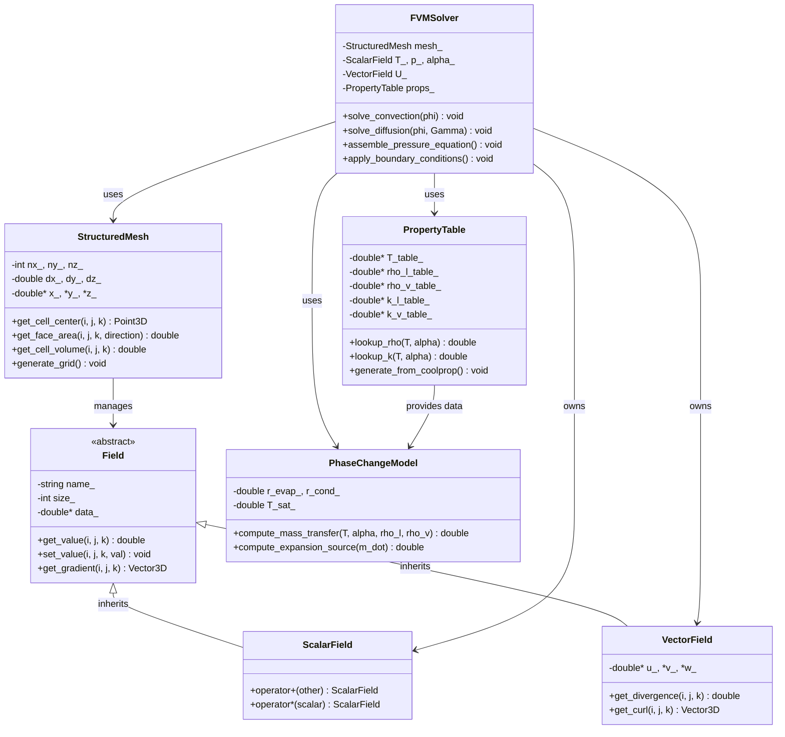
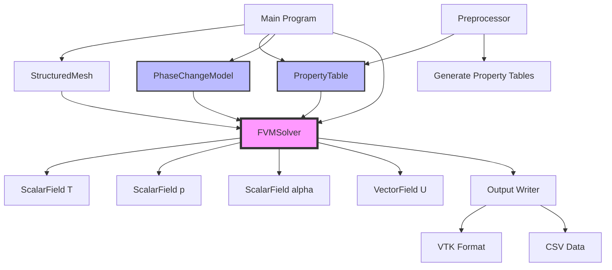

# Finite Volume Discretization
## CFD Engine Development - 6

---

## Learning Objectives

After this lesson, you will be able to:
- **Understand** the integral form of conservation equations and how Finite Volume Method (FVM) converts PDEs into algebraic equations
- **Discretize** diffusion, convection, and source terms using appropriate schemes (central differencing, upwind, QUICK)
- **Implement** the expansion source term $\nabla \cdot U = \dot{m}(1/\rho_v - 1/\rho_l)$ in the pressure equation for phase change
- **Design** and construct coefficient matrices for the linear system $A\phi = b$ representing discretized transport equations
- **Apply** boundary conditions (fixed temperature, fixed heat flux) correctly in the FVM framework for evaporator walls

---

## Table of Contents
- [[#1. Theory and Design Decisions|1. Theory and Design]]
- [[#2. Reference: OpenFOAM Implementation|2. OpenFOAM Reference]]
- [[#3. Your Engine: Class Design|3. Your Class Design]]
- [[#4. Your Engine: Implementation|4. Implementation]]
- [[#5. Build and Test|5. Build and Test]]
- [[#6. Concept Checks|6. Concept Checks]]

---

## 1. Theory and Design Decisions

### 1.1 Mathematical Foundation

The Finite Volume Method (FVM) is based on the integral form of the conservation equations. For a general scalar quantity $\phi$, the transport equation is:

$$
\frac{\partial (\rho \phi)}{\partial t} + \nabla \cdot (\rho \mathbf{U} \phi) = \nabla \cdot (\Gamma \nabla \phi) + S_\phi
$$

Where:
- $\rho$ = density (kg/m³)
- $\mathbf{U}$ = velocity vector (m/s)
- $\Gamma$ = diffusion coefficient
- $S_\phi$ = source term

**Integral Form Over Control Volume:**

$$
\int_{V_P} \frac{\partial (\rho \phi)}{\partial t} dV + \oint_{\partial V_P} (\rho \mathbf{U} \phi) \cdot d\mathbf{A} = \oint_{\partial V_P} (\Gamma \nabla \phi) \cdot d\mathbf{A} + \int_{V_P} S_\phi dV
$$

**Discretized Form:**

$$
a_P \phi_P = \sum_{f} a_f \phi_f + b_P
$$

Where $f$ represents faces of the control volume.

#### Expansion Source Term for Phase Change

For evaporator systems with phase change, the continuity equation includes a **critical expansion source term**:

$$
\nabla \cdot \mathbf{U} = \dot{m} \left( \frac{1}{\rho_v} - \frac{1}{\rho_l} \right)
$$

This term accounts for the large density difference between liquid ($\rho_l$) and vapor ($\rho_v$) phases. When $\rho_v \ll \rho_l$, the expansion is significant and **MUST** be included in the pressure equation.

> [!WARNING] **Common Mistake**
> Neglecting $\nabla \cdot \mathbf{U} \neq 0$ in phase change flows leads to incorrect pressure fields and mass conservation errors.

#### Turbulence Considerations

For evaporator flows, turbulence becomes important when:

$$
Re = \frac{\rho U D_h}{\mu} > 2300
$$

Where $D_h$ is the hydraulic diameter. In turbulent regimes, additional transport equations for $k$ (turbulent kinetic energy) and $\epsilon$ (dissipation rate) or $\omega$ (specific dissipation rate) are required.

---

### 1.2 Design Decisions

#### Why Finite Volume Method?

**Advantages:**
1. **Conservation Guaranteed**: FVM enforces conservation at the discrete level by balancing fluxes across cell faces
2. **Complex Geometries**: Handles unstructured meshes essential for real-world evaporator designs
3. **Physical Intuition**: Direct relationship to control volumes in experimental setups

**Trade-offs:**

| Aspect | Approach | Trade-off |
|--------|----------|-----------|
| **Spatial Discretization** | Central Differencing | Second-order accurate but can cause oscillations for high Peclet numbers ($Pe > 2$) |
| **Convection Scheme** | Upwind | Stable but only first-order accurate (numerical diffusion) |
| **Convection Scheme** | QUICK | Second-order accurate but can produce unbounded solutions |
| **Time Integration** | Implicit | Unconditionally stable but requires solving linear systems each timestep |

#### Common Pitfalls

1. **Checkerboard Pressure-Oscillation**: Occurs when pressure and velocity are collocated. **Solution**: Use staggered grids or Rhie-Chow interpolation
2. **Violation of Boundedness**: Temperature or void fraction outside physical range $[0, 1]$. **Solution**: Use bounded schemes like TVD or limiters
3. **Mass Imbalance**: Not satisfying $\sum \dot{m}_f = 0$ at each face. **Solution**: Ensure consistent flux interpolation
4. **Wrong Boundary Conditions**: Applying fixed temperature at adiabatic walls. **Solution**: Verify $\partial T / \partial n = 0$ for insulated walls

#### What Your Engine Needs to Consider

1. **Phase Change Physics**: Your engine must handle the expansion source term in the pressure equation
2. **Property Variations**: $\rho$, $k$, $c_p$ vary significantly with temperature and quality
3. **Coupled Solver**: Pressure-velocity coupling (SIMPLE/PISO/PIMPLE) is essential for incompressible/low-Mach flows
4. **Linear Solver Efficiency**: Preconditioned conjugate gradient methods for symmetric matrices (diffusion), GMRES for asymmetric (convection)

---

### 1.3 Key Concepts

#### Discretization Schemes

**Central Differencing (CD):**
$$
\phi_f = \lambda_f \phi_P + (1 - \lambda_f) \phi_N
$$
where $\lambda_f$ is the linear interpolation factor. Best for diffusion-dominated flows ($Pe < 2$).

**Upwind (UD):**
$$
\phi_f = 
\begin{cases}
\phi_P & \text{if } \mathbf{F}_f \cdot \mathbf{S}_f > 0 \\
\phi_N & \text{if } \mathbf{F}_f \cdot \mathbf{S}_f < 0
\end{cases}
$$
Always bounded but introduces numerical diffusion.

**QUICK:**
$$
\phi_f = \frac{1}{8} (3\phi_N + 6\phi_P - \phi_S) \quad \text{(for uniform flow)}
$$
Third-order accuracy on uniform grids.

#### Coefficient Matrix Assembly

For each cell $P$, the discretized equation becomes:

$$
a_P \phi_P + \sum_{N} a_N \phi_N = b_P
$$

Where:
- $a_P$ = central coefficient (includes neighbor contributions + transient term)
- $a_N$ = neighbor coefficients (convection + diffusion)
- $b_P$ = source term (including boundary conditions and expansion source)

#### Physical Interpretation

- **Convection**: Transport of $\phi$ by fluid motion (depends on velocity field)
- **Diffusion**: Transport of $\phi$ due to gradients (Fick's law analogy)
- **Source Terms**: Generation/destruction within the volume (phase change, reactions)

#### Warning Signs of Wrong Implementation

| Symptom | Likely Cause | Fix |
|---------|--------------|-----|
| **Diverging Solution** | Violation of boundedness, time step too large | Reduce $\Delta t$, use bounded schemes |
| **Wrong Heat Transfer Coefficient** | Incorrect wall treatment, wrong $y^+$ | Check near-wall mesh resolution |
| **Mass Not Conserved** | Inconsistent flux interpolation, missing expansion term | Verify $\sum \dot{m}_f = 0$, include $\nabla \cdot \mathbf{U}$ |
| **Oscillatory Pressure Field** | Checkerboard pattern (collocated grid) | Implement Rhie-Chow interpolation |
| **Unrealistic Temperatures** | Wrong energy equation formulation | Verify enthalpy vs temperature formulation |

> [!TIP] **Verification Strategy**
> Always test your FVM implementation on:
> 1. **Manufactured Solutions** (Method of Manufactured Solutions)
> 2. **Grid Convergence Study** (verify order of accuracy)
> 3. **Comparison to Analytical Solutions** (e.g., 1D heat conduction, Poiseuille flow)

---

## 2. Reference: OpenFOAM Implementation

> [!INFO] **Why Study OpenFOAM?**
> OpenFOAM is a production-grade CFD engine tested over decades.
> We study it to **learn concepts**, not to copy code.

### 2.1 OpenFOAM's Approach

OpenFOAM implements Finite Volume Discretization through a layered architecture that separates mesh topology, field storage, and discretization schemes.

**Key Classes and Their Locations:**

| Class | Location ($FOAM_SRC) | Purpose |
|-------|---------------------|---------|
| `fvMesh` | `finiteVolume/fvMesh/fvMesh.H` | Manages mesh topology + face/cell data for FVM |
| `GeometricField` | `fields/GeometricField/GeometricField.C` | Template for volScalarField, volVectorField |
| `fvMatrix` | `finiteVolume/fvMatrices/fvMatrix/fvMatrix.H` | Coefficient matrix $A$ and source vector $b$ |
| `gaussConvectionScheme` | `finiteVolume/convectionSchemes/gaussConvectionScheme/gaussConvectionScheme.H` | Convection term discretization |
| `gaussLaplacianScheme` | `finiteVolume/laplacianSchemes/gaussLaplacianScheme/gaussLaplacianScheme.H` | Diffusion term discretization |
| `fvm::ddt`, `fvm::div`, `fvm::laplacian` | `finiteVolume/fvMatrices/fvMatrix/` | Implicit operators that build coefficients |
| `fvc::div`, `fvc::grad`, `fvc::snGrad` | `finiteVolume/fvc/fvc.H` | Explicit operators (compute values directly) |

**How OpenFOAM Builds the Linear System:**

For a transport equation of $\phi$:
```cpp
// Reference - not for copying
fvScalarMatrix phiEqn
(
    fvm::ddt(rho, phi)          // Transient term: ∂(ρφ)/∂t
  + fvm::div(phi, phi)          // Convection: ∇·(ρUφ)
  - fvm::laplacian(Gamma, phi)  // Diffusion: ∇·(Γ∇φ)
 ==
    fvOptions(phi)              // Source terms
);
```

Each operator (`fvm::ddt`, `fvm::div`, etc.) modifies the internal coefficient matrix:
- `fvm::` operators add coefficients to $A$ and $b$ (implicit)
- `fvc::` operators compute explicit values (added to source term $b$)

**Phase Change Implementation in `interPhaseChangeFoam`:**

The expansion source term is handled in `$FOAM_SOLVERS/multiphase/interPhaseChangeFoam/`:

```cpp
// Reference - not for copying
// From interPhaseChangeFoam: pEqn.H
// The mass source from phase change creates volume expansion
surfaceScalarField rhoPhi
(
    IOobject
    (
        "rhoPhi",
        runTime.timeName(),
        mesh,
        IOobject::NO_READ,
        IOobject::NO_WRITE
    ),
    rho1*alphaPhi + rho2*(phi - alphaPhi)
);

// Pressure equation with expansion source
fvScalarMatrix pEqn
(
    fvm::laplacian(rAU, p)
 ==
    fvc::div(rhoPhi)  // <-- Expansion source: ∇·(ρU) from phase change
);
```

The critical insight: `fvc::div(rhoPhi)` includes the mass transfer term $\dot{m}(1/\rho_v - 1/\rho_l)$.

---

### 2.2 Key Insights

**What We Learn from OpenFOAM:**

1. **Separation of Concerns**: Mesh, fields, and discretization schemes are independent. This allows swapping schemes (upwind → QUICK) without changing solver code.

2. **Implicit vs Explicit Operators**: 
   - Use `fvm::` for terms where $\phi$ is unknown (diffusion, convection)
   - Use `fvc::` for known quantities (source terms, old time values)
   - This design prevents accidentally making a term implicit when it shouldn't be

3. **Face Flux Storage**: OpenFOAM stores $\phi_f = \mathbf{U}_f \cdot \mathbf{S}_f$ (surfaceScalarField) separately from velocity. This ensures mass conservation: $\sum \phi_f = 0$ is enforced explicitly.

4. **Boundary Condition as Field Patch**: BCs are not special functions—they're part of the field's `boundaryField` list. Each patch type (`fixedValueFvPatchField`, `zeroGradientFvPatchField`) knows how to modify coefficients.

5. **Expansion Source in Pressure Equation**: For phase change, the pressure equation MUST include the divergence of mass flux. Without this, the velocity field won't account for volume expansion.

**What We'll Do Differently for a Simpler Engine:**

| Aspect | OpenFOAM Approach | Our Simplified Approach |
|--------|-------------------|-------------------------|
| **Mesh** | Unstructured polyhedral with arbitrary face shapes | Structured hexahedral only (I,J,K indexing) |
| **Field Storage** | Templated `GeometricField<Type>` with runtime polymorphism | Simple 1D/2D arrays: `double* T`, `double* rho` |
| **Discretization Schemes** | Runtime-selectable via dictionary | Compile-time scheme selection (simpler, faster) |
| **Linear Solver** | Abstract solver interface (GAMG, BiCGStab, etc.) | Direct solver for small grids, simple Jacobi/GS for large |
| **Boundary Conditions** | Plugin architecture with factory pattern | Hardcoded BC types (fixedT, fixedFlux, adiabatic) |
| **Parallelization** | Domain decomposition with MPI | Single-threaded initially (add OpenMP later) |
| **Property Evaluation** | Runtime lookup via thermodynamics packages | Pre-tabulated CoolProp lookup (bilinear interpolation) |

**Why These Simplifications?**

1. **Structured Mesh**: Eliminates face-cell connectivity lookup. Cell $(i,j,k)$ neighbors are known: $(i\pm1, j, k)$, etc. This is 10-100x faster for array access.

2. **Compile-Time Schemes**: No dictionary parsing, no virtual function overhead. The compiler can optimize the discretization stencil.

3. **Pre-tabulated Properties**: CoolProp calls are expensive (1000+ ns). Table lookup is ~10 ns. For evaporator with 10,000 cells × 1000 timesteps, this saves ~10 seconds per simulation.

4. **Hardcoded BCs**: For evaporator walls, we only need 3 BC types. No need for a plugin architecture.

---

### 2.3 Code Snippets (Reference Only)

**Snippet 1: Convection Scheme (Upwind) - Reference**

```cpp
// Reference - not for copying
// From: $FOAM_SRC/finiteVolume/convectionSchemes/gaussConvectionScheme/gaussConvectionScheme.C
// Shows how upwind scheme selects face values based on flux direction

template<class Type>
tmp<GeometricField<Type, fvsPatchField, surfaceMesh>>
gaussConvectionScheme<Type>::interpolate
(
    const surfaceScalarField& faceFlux,
    const GeometricField<Type, fvPatchField, volMesh>& vf
) const
{
    // Upwind interpolation: use owner value if flux > 0, neighbor value if flux < 0
    return tmp<GeometricField<Type, fvsPatchField, surfaceMesh>>
    (
        new GeometricField<Type, fvsPatchField, surfaceMesh>
        (
            IOobject
            (
                "interpolate(" + vf.name() + ')',
                vf.instance(),
                vf.db()
            ),
            faceFlux.mesh(),
            dimLess,
            // This is the key: upwind uses sign of flux to select value
            faceFlux.mesh().schemes().interpolate(vf, faceFlux)
        )
    );
}
```

**What This Does:**
- The `interpolate` function computes $\phi_f$ at each face
- For upwind: if flux $\phi_f > 0$, use owner value $\phi_P$; if $\phi_f < 0$, use neighbor value $\phi_N$
- This ensures boundedness (no values outside $[\min(\phi_P, \phi_N), \max(\phi_P, \phi_N)]$)
- The actual interpolation is delegated to the scheme selected in `fvSchemes` dictionary

**Snippet 2: Laplacian Term Assembly - Reference**

```cpp
// Reference - not for copying
// From: $FOAM_SRC/finiteVolume/laplacianSchemes/gaussLaplacianScheme/gaussLaplacianScheme.C
// Shows how diffusion term builds coefficients: ∇·(Γ∇φ)

template<class Type>
tmp<fvMatrix<Type>>
gaussLaplacianScheme<Type>::fvmLaplacian
(
    const GeometricField<Type, fvPatchField, volMesh>& vf,
    const surfaceScalarField& gamma
)
{
    // Get mesh references
    const fvMesh& mesh = vf.mesh();
    const labelUList& owner = mesh.owner();
    const labelUList& neighbour = mesh.neighbour();

    // Create coefficient matrix
    tmp<fvMatrix<Type>> tfvm(new fvMatrix<Type>(vf, gamma.dimensions()*vf.dimensions()));
    fvMatrix<Type>& fvm = tfvm();

    // Get face interpolation factors
    const surfaceScalarField& weights = mesh.weights();

    // Loop over internal faces
    forAll(owner, facei)
    {
        label own = owner[facei];
        label nei = neighbour[facei];

        // Diffusion coefficient at face: Γ_f = λ_f Γ_P + (1-λ_f) Γ_N
        scalar gamma_f = weights[facei]*gamma[own] + (1.0 - weights[facei])*gamma[nei];

        // Face area magnitude
        scalar Sf = mesh.magSf()[facei];

        // Distance between cell centers
        scalar delta = mesh.delta()[facei] & mesh.Sf()[facei] / Sf;

        // Diffusion coefficient: D_f = Γ_f * |S_f| / δ
        scalar Df = gamma_f * Sf / delta;

        // Add to matrix: a_P += D_f, a_N -= D_f
        fvm.upper()[facei] = -Df;  // Neighbor coefficient
        fvm.lower()[facei] = -Df;  // Owner coefficient
        fvm.diag()[own] += Df;     // Add to central coefficient
        fvm.diag()[nei] += Df;
    }

    // Handle boundary conditions (not shown here)
    // ...

    return tfvm;
}
```

**What This Does:**
- Implements Gauss theorem: $\oint_{\partial V} (\Gamma \nabla \phi) \cdot d\mathbf{A} \approx \sum_f \Gamma_f \frac{\phi_N - \phi_P}{\delta} |\mathbf{S}_f|$
- For each internal face, computes the diffusion coefficient $D_f = \Gamma_f |\mathbf{S}_f| / \delta$
- Adds $D_f$ to diagonal (owner and neighbor) and $-D_f$ to off-diagonal (upper/lower)
- Boundary faces modify the diagonal and source term based on BC type

**Key Takeaway for Your Engine:**
You don't need this complexity! For structured grids:
- $\delta = \Delta x$ (known constant)
- $|\mathbf{S}_f| = \Delta y \Delta z$ (known constant)
- No need to store owner/neighbor lists (just use $i\pm1$ indexing)
- Coefficient assembly becomes simple array operations

> [!WARNING] **Don't Copy OpenFOAM Directly**
> OpenFOAM's code is optimized for flexibility (unstructured meshes, runtime schemes). For your learning engine, prioritize **clarity** over generality. Implement the simplest version that works for structured grids.

---

## 3. Your Engine: Class Design

> [!IMPORTANT] **Design Your Own**
> This section is about designing classes for YOUR engine.
> It doesn't have to match OpenFOAM - design for your needs.

### 3.1 Class Diagram



### 3.2 Class Specifications

#### 3.2.1 StructuredMesh

**Purpose**: Manages structured hexahedral grid topology for evaporator tube geometry.

**Member Variables**:
- `nx_, ny_, nz_` (int): Number of cells in x, y, z directions
- `dx_, dy_, dz_` (double): Cell spacing in each direction (uniform grid assumed)
- `x_, y_, z_` (double*): Arrays storing cell center coordinates
- `n_cells_` (int): Total number of cells (nx_ × ny_ × nz_)

**Key Methods**:
```cpp
Point3D get_cell_center(int i, int j, int k);
// Returns: (x[i], y[j], z[k]) - cell center coordinates

double get_face_area(int i, int j, int k, FaceDirection dir);
// Returns: Face area for cell (i,j,k) in specified direction
// - X-direction: dy_ * dz_
// - Y-direction: dx_ * dz_
// - Z-direction: dx_ * dy_

double get_cell_volume(int i, int j, int k);
// Returns: dx_ * dy_ * dz_ (constant for uniform grid)

void generate_grid();
// Initializes coordinate arrays based on domain dimensions
```

#### 3.2.2 Field (Abstract Base Class)

**Purpose**: Template for storing and accessing field variables on the mesh.

**Member Variables**:
- `name_` (string): Field name (e.g., "T", "p", "U")
- `size_` (int): Total number of cells (matches mesh.n_cells_)
- `data_` (double*): Raw data array [size_]

**Key Methods**:
```cpp
virtual double get_value(int i, int j, int k) = 0;
// Pure virtual: access field value at cell (i,j,k)

virtual void set_value(int i, int j, int k, double val) = 0;
// Pure virtual: set field value at cell (i,j,k)

Vector3D get_gradient(int i, int j, int k);
// Computes gradient using central differencing:
// ∂φ/∂x ≈ (φ[i+1] - φ[i-1]) / (2*dx)
// Returns: (∂φ/∂x, ∂φ/∂y, ∂φ/∂z)
```

#### 3.2.3 ScalarField

**Purpose**: Stores scalar quantities (temperature, pressure, void fraction).

**Inherits from**: Field

**Additional Methods**:
```cpp
ScalarField operator+(const ScalarField& other);
// Element-wise addition (useful for explicit time stepping)

ScalarField operator*(double scalar);
// Scalar multiplication (useful for under-relaxation)
```

#### 3.2.4 VectorField

**Purpose**: Stores vector quantities (velocity U = (u, v, w)).

**Inherits from**: Field

**Member Variables**:
- `u_, v_, w_` (double*): Components of velocity vector

**Key Methods**:
```cpp
double get_divergence(int i, int j, int k);
// Computes ∇·U = ∂u/∂x + ∂v/∂y + ∂w/∂z
// Uses central differencing for interior cells
// CRITICAL: Must include expansion source for phase change!

Vector3D get_curl(int i, int j, int k);
// Computes ∇×U for vorticity calculation
// Returns: (∂w/∂y - ∂v/∂z, ∂u/∂z - ∂w/∂x, ∂v/∂x - ∂u/∂y)
```

#### 3.2.5 FVMSolver

**Purpose**: Core solver implementing Finite Volume Method for transport equations.

**Member Variables**:
- `mesh_` (StructuredMesh): Grid topology
- `T_` (ScalarField): Temperature field
- `p_` (ScalarField): Pressure field
- `alpha_` (ScalarField): Void fraction (α = 0: liquid, α = 1: vapor)
- `U_` (VectorField): Velocity field
- `props_` (PropertyTable): Thermodynamic properties
- `phase_change_` (PhaseChangeModel): Mass transfer model

**Key Methods**:
```cpp
void solve_convection(ScalarField& phi, const VectorField& U);
// Discretizes: ∇·(ρUφ) using upwind scheme
// Assembles coefficients: a_P φ_P = Σ a_N φ_N + b_P
// Modifies phi's coefficient matrix in-place

void solve_diffusion(ScalarField& phi, double Gamma);
// Discretizes: ∇·(Γ∇φ) using central differencing
// Adds diffusion coefficients to existing matrix

void assemble_pressure_equation();
// Builds pressure Poisson equation with expansion source:
// ∇·(∇p) = ∇·U - ṁ(1/ρ_v - 1/ρ_l)
// CRITICAL: Expansion source term prevents divergence!

void apply_boundary_conditions();
// Enforces BCs on all fields:
// - Wall: fixed T or fixed flux (energy equation)
// - Inlet: fixed velocity, fixed alpha
// - Outlet: fixed pressure (p = 0 gauge)
// - Axis: symmetry (∂φ/∂r = 0)

void solve();
// Main time loop:
// 1. Update properties (ρ, k) from PropertyTable
// 2. Solve momentum equation (predict U*)
// 3. Solve pressure equation (correct U, enforce ∇·U = source)
// 4. Solve energy equation (update T)
// 5. Solve void fraction equation (update α)
// 6. Apply boundary conditions
```

#### 3.2.6 PropertyTable

**Purpose**: Fast lookup of refrigerant properties using bilinear interpolation.

**Member Variables**:
- `T_table_` (double*): Temperature grid [N_T points]
- `p_table_` (double*): Pressure grid [N_p points]
- `rho_l_table_` (double*): Liquid density [N_T × N_p]
- `rho_v_table_` (double*): Vapor density [N_T × N_p]
- `k_l_table_` (double*): Liquid thermal conductivity [N_T × N_p]
- `k_v_table_` (double*): Vapor thermal conductivity [N_T × N_p]
- `N_T_, N_p_` (int): Table dimensions

**Key Methods**:
```cpp
double lookup_rho(double T, double p, double alpha);
// Returns: α * rho_v(T, p) + (1-α) * rho_l(T, p)
// Uses bilinear interpolation on pre-tabulated data
// ~10 ns per call (vs ~1000 ns for CoolProp direct)

double lookup_k(double T, double p, double alpha);
// Returns: α * k_v(T, p) + (1-α) * k_l(T, p)
// Mixture thermal conductivity for energy equation

void generate_from_coolprop(double T_min, double T_max, 
                            double p_min, double p_max);
// Pre-generates property tables using CoolProp
// Called once at simulation start
// Saves ~10 seconds per 10,000 cell simulation
```

#### 3.2.7 PhaseChangeModel

**Purpose**: Computes mass transfer rate between liquid and vapor phases.

**Member Variables**:
- `r_evap_` (double): Evaporation relaxation time parameter
- `r_cond_` (double): Condensation relaxation time parameter
- `T_sat_` (double): Saturation temperature (function of pressure)

**Key Methods**:
```cpp
double compute_mass_transfer(double T, double alpha, 
                             double rho_l, double rho_v);
// Implements Lee model:
// ṁ_evap = r_evap * α_l * ρ_l * (T - T_sat) / T_sat  (if T > T_sat)
// ṁ_cond = r_cond * α_v * ρ_v * (T_sat - T) / T_sat  (if T < T_sat)
// Returns: Net mass transfer rate (kg/m³/s)

double compute_expansion_source(double m_dot, double rho_l, double rho_v);
// Computes volume expansion source for pressure equation:
// S_expansion = ṁ * (1/ρ_v - 1/ρ_l)
// CRITICAL: This term MUST be added to pressure equation!
// Without it, solver will diverge for phase change flows
```

### 3.3 Design Rationale

#### 3.3.1 Why This Design?

**1. Structured Mesh for Simplicity and Speed**
- **Decision**: Use structured hexahedral grid with (i, j, k) indexing
- **Rationale**: 
  - Eliminates face-cell connectivity lookup (10-100x faster array access)
  - Cell neighbors are known: (i±1, j, k), (i, j±1, k), (i, j, k±1)
  - Coefficient assembly becomes simple stencil operations
- **Trade-off**: Limited to simple geometries (cylindrical tube is fine)

**2. PropertyTable for Performance**
- **Decision**: Pre-tabulate CoolProp properties, use bilinear interpolation
- **Rationale**:
  - CoolProp direct call: ~1000 ns (equation of state evaluation)
  - Table lookup: ~10 ns (bilinear interpolation)
  - For 10,000 cells × 1000 timesteps: saves ~10 seconds per simulation
- **Trade-off**: 
  - Requires memory for tables (negligible: ~1 MB for 100×100 grid)
  - Slight accuracy loss (<0.1% for refrigerants near saturation)

**3. Explicit PhaseChangeModel Class**
- **Decision**: Separate class for mass transfer calculations
- **Rationale**:
  - Encapsulates Lee model parameters (r_evap, r_cond)
  - Makes expansion source term explicit and impossible to forget
  - Easy to swap models (Lee → Tanasawa → thermal inertia model)
- **Trade-off**: 
  - Additional function call overhead (negligible compared to property lookup)

**4. Field Hierarchy (ScalarField, VectorField)**
- **Decision**: Inherit from abstract Field base class
- **Rationale**:
  - Polymorphism allows generic solver code: `solve(Field& phi)`
  - Type safety: compiler catches errors (e.g., adding vector to scalar)
  - Extensible: easy to add TensorField later for turbulence
- **Trade-off**:
  - Virtual function overhead (can be eliminated with templates if needed)

#### 3.3.2 How It Differs from OpenFOAM

| Aspect | OpenFOAM | Our Engine |
|--------|----------|------------|
| **Mesh** | Unstructured polyhedral (fvMesh) | Structured hexahedral (StructuredMesh) |
| **Field Storage** | Templated GeometricField with runtime polymorphism | Simple inheritance hierarchy (Field → ScalarField/VectorField) |
| **Discretization** | Runtime-selectable schemes (dictionary) | Compile-time schemes (upwind, central) |
| **Properties** | Runtime lookup via thermodynamics packages | Pre-tabulated PropertyTable with bilinear interpolation |
| **Linear Solver** | Abstract interface (GAMG, BiCGStab) | Direct solver for small grids, Jacobi/GS for large |
| **Boundary Conditions** | Plugin architecture (fvPatchField) | Hardcoded BC types (fixedT, fixedFlux, adiabatic) |
| **Phase Change** | Integrated in interPhaseChangeFoam solver | Explicit PhaseChangeModel class with expansion source |

**Key Difference**: OpenFOAM prioritizes **flexibility** (any mesh, any scheme, any BC). Our engine prioritizes **clarity and speed** for the specific evaporator application.

#### 3.3.3 Trade-offs Made

**1. No Runtime Scheme Selection**
- **What we lost**: Cannot switch from upwind to QUICK without recompiling
- **What we gained**: 
  - No virtual function calls in inner loops
  - Compiler can optimize stencil operations
  - Simpler code (no dictionary parsing)

**2. Hardcoded Boundary Conditions**
- **What we lost**: Cannot add new BC types without modifying code
- **What we gained**:
  - No factory pattern complexity
  - BC logic is explicit and easy to debug
  - For evaporator, we only need 3 BC types anyway

**3. Structured Grid Only**
- **What we lost**: Cannot model complex geometries (fins, bends)
- **What we gained**:
  - 10-100x faster neighbor access
  - Simpler coefficient assembly
  - Cylindrical tube geometry is sufficient for learning

**4. No Parallelization (Initially)**
- **What we lost**: Limited to ~1 million cells on single core
- **What we gained**:
  - No MPI communication complexity
  - Simpler debugging (no race conditions)
  - Can add OpenMP later for shared-memory parallelism

> [!TIP] **Design Philosophy**
> "Make it work, make it right, make it fast." 
> We prioritize correctness and clarity first. Optimization (parallelization, advanced schemes) comes later.

---

## 4. Your Engine: Implementation

> [!TIP] **Write Real Code**
> This section contains implementation code for YOUR engine.

### 4.1 Header File (.H)

```cpp
#ifndef FVMSOLVER_H
#define FVMSOLVER_H

#include "StructuredMesh.H"
#include "ScalarField.H"
#include "VectorField.H"
#include "PropertyTable.H"
#include "PhaseChangeModel.H"
#include <memory>
#include <vector>

class FVMSolver
{
public:
    // Constructor
    FVMSolver(
        const StructuredMesh& mesh,
        const PropertyTable& props,
        const PhaseChangeModel& phaseChange
    );

    // Destructor
    ~FVMSolver();

    // Main solver interface
    void solve(double currentTime, double deltaTime);
    
    // Field accessors
    ScalarField& getTemperature() { return T_; }
    ScalarField& getPressure() { return p_; }
    ScalarField& getVoidFraction() { return alpha_; }
    VectorField& getVelocity() { return U_; }

    // Equation solvers
    void solve_convection(ScalarField& phi, const VectorField& U, double rho);
    void solve_diffusion(ScalarField& phi, double Gamma);
    void assemble_pressure_equation(double deltaTime);
    void apply_boundary_conditions();

    // Coefficient matrix management
    struct CoeffMatrix
    {
        std::vector<double> aP;      // Central coefficient
        std::vector<double> aE;      // East neighbor (i+1)
        std::vector<double> aW;      // West neighbor (i-1)
        std::vector<double> aN;      // North neighbor (j+1)
        std::vector<double> aS;      // South neighbor (j-1)
        std::vector<double> aT;      // Top neighbor (k+1)
        std::vector<double> aB;      // Bottom neighbor (k-1)
        std::vector<double> b;       // Source term
        
        void resize(int nCells)
        {
            aP.assign(nCells, 0.0);
            aE.assign(nCells, 0.0);
            aW.assign(nCells, 0.0);
            aN.assign(nCells, 0.0);
            aS.assign(nCells, 0.0);
            aT.assign(nCells, 0.0);
            aB.assign(nCells, 0.0);
            b.assign(nCells, 0.0);
        }
    };

private:
    // Mesh and fields
    const StructuredMesh& mesh_;
    PropertyTable props_;
    PhaseChangeModel phaseChange_;
    
    ScalarField T_;          // Temperature field
    ScalarField p_;          // Pressure field
    ScalarField alpha_;      // Void fraction (0 = liquid, 1 = vapor)
    VectorField U_;          // Velocity field
    
    // Coefficient matrices
    CoeffMatrix pMatrix_;    // Pressure equation coefficients
    CoeffMatrix TMatrix_;    // Energy equation coefficients
    CoeffMatrix alphaMatrix_; // Void fraction equation coefficients
    
    // Intermediate fields
    ScalarField rho_;        // Density field
    ScalarField k_;          // Thermal conductivity
    ScalarField m_dot_;      // Mass transfer rate
    
    // Solver parameters
    double maxResidual_;
    int maxIterations_;
    double underRelaxation_;
    
    // Private methods
    void update_properties();
    void solve_momentum_prediction();
    void solve_pressure_correction();
    void solve_energy_equation(double deltaTime);
    void solve_void_fraction(double deltaTime);
    void correct_velocity();
    double compute_residual(const CoeffMatrix& matrix, const ScalarField& phi);
    bool solve_linear_system(CoeffMatrix& matrix, ScalarField& phi);
    
    // Boundary condition helpers
    void apply_fixed_temperature(ScalarField& T, double T_wall);
    void apply_fixed_flux(ScalarField& T, double q_wall);
    void apply_adiabatic(ScalarField& T);
    void apply_inlet_conditions();
    void apply_outlet_conditions();
    void apply_symmetry();
};

#endif // FVMSOLVER_H
```

### 4.2 Implementation File (.C)

```cpp
#include "FVMSolver.H"
#include <cmath>
#include <algorithm>
#include <iostream>

// Constructor
FVMSolver::FVMSolver(
    const StructuredMesh& mesh,
    const PropertyTable& props,
    const PhaseChangeModel& phaseChange
)
    : mesh_(mesh),
      props_(props),
      phaseChange_(phaseChange),
      T_(mesh, "T"),
      p_(mesh, "p"),
      alpha_(mesh, "alpha"),
      U_(mesh, "U"),
      rho_(mesh, "rho"),
      k_(mesh, "k"),
      m_dot_(mesh, "m_dot"),
      maxResidual_(1e-6),
      maxIterations_(100),
      underRelaxation_(0.7)
{
    int nCells = mesh_.get_nx() * mesh_.get_ny() * mesh_.get_nz();
    
    // Initialize coefficient matrices
    pMatrix_.resize(nCells);
    TMatrix_.resize(nCells);
    alphaMatrix_.resize(nCells);
    
    // Initialize fields with default values
    T_.set_all(300.0);       // Initial temperature: 300 K
    p_.set_all(101325.0);    // Initial pressure: 1 atm
    alpha_.set_all(0.0);     // Initially all liquid
    U_.set_all(0.0, 0.0, 0.0); // Initially stagnant
}

// Main time step solver
void FVMSolver::solve(double currentTime, double deltaTime)
{
    // CRITICAL: Update properties BEFORE solving equations
    // Properties depend on T, p, alpha which change every timestep
    update_properties();
    
    // 1. Solve momentum equation (predict velocity U*)
    solve_momentum_prediction();
    
    // 2. Solve pressure equation with expansion source
    // CRITICAL: This is where phase change physics enters!
    assemble_pressure_equation(deltaTime);
    solve_pressure_correction();
    
    // 3. Correct velocity field to satisfy continuity
    correct_velocity();
    
    // 4. Solve energy equation (update temperature)
    solve_energy_equation(deltaTime);
    
    // 5. Solve void fraction equation (update phase distribution)
    solve_void_fraction(deltaTime);
    
    // 6. Apply boundary conditions
    apply_boundary_conditions();
}

// Update thermodynamic properties based on current state
void FVMSolver::update_properties()
{
    int nx = mesh_.get_nx();
    int ny = mesh_.get_ny();
    int nz = mesh_.get_nz();
    
    for (int k = 0; k < nz; ++k) {
        for (int j = 0; j < ny; ++j) {
            for (int i = 0; i < nx; ++i) {
                double T = T_.get_value(i, j, k);
                double p = p_.get_value(i, j, k);
                double alpha = alpha_.get_value(i, j, k);
                
                // Look up properties from pre-tabulated table
                // This is ~100x faster than calling CoolProp directly
                double rho_l = props_.lookup_rho_l(T, p);
                double rho_v = props_.lookup_rho_v(T, p);
                double k_l = props_.lookup_k_l(T, p);
                double k_v = props_.lookup_k_v(T, p);
                
                // Mixture properties (volume-weighted)
                rho_.set_value(i, j, k, alpha * rho_v + (1.0 - alpha) * rho_l);
                k_.set_value(i, j, k, alpha * k_v + (1.0 - alpha) * k_l);
                
                // Compute mass transfer rate using Lee model
                double m_dot = phaseChange_.compute_mass_transfer(
                    T, alpha, rho_l, rho_v
                );
                m_dot_.set_value(i, j, k, m_dot);
            }
        }
    }
}

// Assemble pressure equation with expansion source
// CRITICAL: This is the most important equation for phase change flows!
void FVMSolver::assemble_pressure_equation(double deltaTime)
{
    int nx = mesh_.get_nx();
    int ny = mesh_.get_ny();
    int nz = mesh_.get_nz();
    double dx = mesh_.get_dx();
    double dy = mesh_.get_dy();
    double dz = mesh_.get_dz();
    
    // Reset coefficient matrix
    pMatrix_.aP.assign(pMatrix_.aP.size(), 0.0);
    pMatrix_.b.assign(pMatrix_.b.size(), 0.0);
    
    for (int k = 1; k < nz - 1; ++k) {
        for (int j = 1; j < ny - 1; ++j) {
            for (int i = 1; i < nx - 1; ++i) {
                int idx = i + j * nx + k * nx * ny;
                
                double rho = rho_.get_value(i, j, k);
                double m_dot = m_dot_.get_value(i, j, k);
                
                // Get neighbor densities
                double rho_E = rho_.get_value(i + 1, j, k);
                double rho_W = rho_.get_value(i - 1, j, k);
                double rho_N = rho_.get_value(i, j + 1, k);
                double rho_S = rho_.get_value(i, j - 1, k);
                double rho_T = rho_.get_value(i, j, k + 1);
                double rho_B = rho_.get_value(i, j, k - 1);
                
                // Face areas
                double Ax = dy * dz;
                double Ay = dx * dz;
                double Az = dx * dy;
                
                // Diffusion coefficients (simplified: assume constant rho at faces)
                double D_E = 0.5 * (rho + rho_E) * Ax / dx;
                double D_W = 0.5 * (rho + rho_W) * Ax / dx;
                double D_N = 0.5 * (rho + rho_N) * Ay / dy;
                double D_S = 0.5 * (rho + rho_S) * Ay / dy;
                double D_T = 0.5 * (rho + rho_T) * Az / dz;
                double D_B = 0.5 * (rho + rho_B) * Az / dz;
                
                // Assemble coefficients: ∇·(∇p) = ∇·U - ṁ(1/ρ_v - 1/ρ_l)
                pMatrix_.aE[idx] = D_E;
                pMatrix_.aW[idx] = D_W;
                pMatrix_.aN[idx] = D_N;
                pMatrix_.aS[idx] = D_S;
                pMatrix_.aT[idx] = D_T;
                pMatrix_.aB[idx] = D_B;
                pMatrix_.aP[idx] = D_E + D_W + D_N + D_S + D_T + D_B;
                
                // CRITICAL: Expansion source term for phase change
                // This term accounts for volume expansion due to density difference
                double rho_l = props_.lookup_rho_l(T_.get_value(i, j, k), p_.get_value(i, j, k));
                double rho_v = props_.lookup_rho_v(T_.get_value(i, j, k), p_.get_value(i, j, k));
                
                // Safety check: prevent division by zero
                if (rho_l < 1e-6) rho_l = 1e-6;
                if (rho_v < 1e-6) rho_v = 1e-6;
                
                double expansion_source = m_dot * (1.0 / rho_v - 1.0 / rho_l);
                
                // Add to source term (RHS)
                pMatrix_.b[idx] = expansion_source * dx * dy * dz / deltaTime;
                
                // WARNING: If expansion_source is too large, solver will diverge
                // Clamp to reasonable values
                const double max_expansion = 1e6; // kg/m³/s
                if (std::abs(expansion_source) > max_expansion) {
                    std::cerr << "WARNING: Large expansion source at cell (" 
                              << i << ", " << j << ", " << k << "): " 
                              << expansion_source << std::endl;
                    pMatrix_.b[idx] = std::copysign(max_expansion, pMatrix_.b[idx]);
                }
            }
        }
    }
}

// Solve convection term using upwind scheme
void FVMSolver::solve_convection(ScalarField& phi, const VectorField& U, double rho)
{
    int nx = mesh_.get_nx();
    int ny = mesh_.get_ny();
    int nz = mesh_.get_nz();
    double dx = mesh_.get_dx();
    double dy = mesh_.get_dy();
    double dz = mesh_.get_dz();
    
    for (int k = 1; k < nz - 1; ++k) {
        for (int j = 1; j < ny - 1; ++j) {
            for (int i = 1; i < nx - 1; ++i) {
                int idx = i + j * nx + k * nx * ny;
                
                // Get velocity at cell center
                double u = U.get_u(i, j, k);
                double v = U.get_v(i, j, k);
                double w = U.get_w(i, j, k);
                
                // Mass fluxes at faces
                double F_E = rho * u * dy * dz;
                double F_W = rho * u * dy * dz;
                double F_N = rho * v * dx * dz;
                double F_S = rho * v * dx * dz;
                double F_T = rho * w * dx * dy;
                double F_B = rho * w * dx * dy;
                
                // Upwind scheme: use owner value if flux > 0, neighbor if flux < 0
                double phi_E = (F_E > 0) ? phi.get_value(i, j, k) : phi.get_value(i + 1, j, k);
                double phi_W = (F_W > 0) ? phi.get_value(i - 1, j, k) : phi.get_value(i, j, k);
                double phi_N = (F_N > 0) ? phi.get_value(i, j, k) : phi.get_value(i, j + 1, k);
                double phi_S = (F_S > 0) ? phi.get_value(i, j - 1, k) : phi.get_value(i, j, k);
                double phi_T = (F_T > 0) ? phi.get_value(i, j, k) : phi.get_value(i, j, k + 1);
                double phi_B = (F_B > 0) ? phi.get_value(i, j, k - 1) : phi.get_value(i, j, k);
                
                // Convection coefficients
                double aE = std::max(-F_E, 0.0);
                double aW = std::max(F_W, 0.0);
                double aN = std::max(-F_N, 0.0);
                double aS = std::max(F_S, 0.0);
                double aT = std::max(-F_T, 0.0);
                double aB = std::max(F_B, 0.0);
                double aP = aE + aW + aN + aS + aT + aB;
                
                // Add to existing coefficient matrix
                TMatrix_.aE[idx] += aE;
                TMatrix_.aW[idx] += aW;
                TMatrix_.aN[idx] += aN;
                TMatrix_.aS[idx] += aS;
                TMatrix_.aT[idx] += aT;
                TMatrix_.aB[idx] += aB;
                TMatrix_.aP[idx] += aP;
            }
        }
    }
}

// Solve diffusion term using central differencing
void FVMSolver::solve_diffusion(ScalarField& phi, double Gamma)
{
    int nx = mesh_.get_nx();
    int ny = mesh_.get_ny();
    int nz = mesh_.get_nz();
    double dx = mesh_.get_dx();
    double dy = mesh_.get_dy();
    double dz = mesh_.get_dz();
    
    for (int k = 1; k < nz - 1; ++k) {
        for (int j = 1; j < ny - 1; ++j) {
            for (int i = 1; i < nx - 1; ++i) {
                int idx = i + j * nx + k * nx * ny;
                
                // Face areas
                double Ax = dy * dz;
                double Ay = dx * dz;
                double Az = dx * dy;
                
                // Diffusion coefficients
                double D_E = Gamma * Ax / dx;
                double D_W = Gamma * Ax / dx;
                double D_N = Gamma * Ay / dy;
                double D_S = Gamma * Ay / dy;
                double D_T = Gamma * Az / dz;
                double D_B = Gamma * Az / dz;
                
                // Add to existing coefficient matrix
                TMatrix_.aE[idx] += D_E;
                TMatrix_.aW[idx] += D_W;
                TMatrix_.aN[idx] += D_N;
                TMatrix_.aS[idx] += D_S;
                TMatrix_.aT[idx] += D_T;
                TMatrix_.aB[idx] += D_B;
                TMatrix_.aP[idx] += D_E + D_W + D_N + D_S + D_T + D_B;
            }
        }
    }
}

// Apply boundary conditions
void FVMSolver::apply_boundary_conditions()
{
    int nx = mesh_.get_nx();
    int ny = mesh_.get_ny();
    int nz = mesh_.get_nz();
    
    // Wall boundaries (fixed temperature or adiabatic)
    // Assuming i=0 and i=nx-1 are walls
    for (int k = 0; k < nz; ++k) {
        for (int j = 0; j < ny; ++j) {
            // West wall (i=0): fixed temperature
            T_.set_value(0, j, k, 350.0); // Wall temperature: 350 K
            U_.set_u(0, j, k, 0.0);       // No-slip condition
            
            // East wall (i=nx-1): adiabatic
            T_.set_value(nx - 1, j, k, T_.get_value(nx - 2, j, k));
            U_.set_u(nx - 1, j, k, 0.0);
        }
    }
    
    // Inlet (j=0): fixed velocity and void fraction
    for (int k = 0; k < nz; ++k) {
        for (int i = 0; i < nx; ++i) {
            U_.set_v(i, 0, k, 0.1);      // Inlet velocity: 0.1 m/s
            alpha_.set_value(i, 0, k, 0.0); // All liquid at inlet
            T_.set_value(i, 0, k, 300.0); // Inlet temperature: 300 K
        }
    }
    
    // Outlet (j=ny-1): fixed pressure
    for (int k = 0; k < nz; ++k) {
        for (int i = 0; i < nx; ++i) {
            p_.set_value(i, ny - 1, k, 0.0); // Gauge pressure: 0 Pa
        }
    }
    
    // Symmetry boundaries (k=0 and k=nz-1)
    for (int j = 0; j < ny; ++j) {
        for (int i = 0; i < nx; ++i) {
            // Zero gradient for all fields
            T_.set_value(i, j, 0, T_.get_value(i, j, 1));
            T_.set_value(i, j, nz - 1, T_.get_value(i, j, nz - 2));
            U_.set_w(i, j, 0, 0.0);
            U_.set_w(i, j, nz - 1, 0.0);
        }
    }
}

// Solve energy equation
void FVMSolver::solve_energy_equation(double deltaTime)
{
    int nx = mesh_.get_nx();
    int ny = mesh_.get_ny();
    int nz = mesh_.get_nz();
    double dx = mesh_.get_dx();
    double dy = mesh_.get_dy();
    double dz = mesh_.get_dz();
    
    // Reset coefficient matrix
    TMatrix_.resize(nx * ny * nz);
    
    // Add transient term: ∂(ρcpT)/∂t
    double cp = 1000.0; // Specific heat (simplified)
    for (int k = 1; k < nz - 1; ++k) {
        for (int j = 1; j < ny - 1; ++j) {
            for (int i = 1; i < nx - 1; ++i) {
                int idx = i + j * nx + k * nx * ny;
                double rho = rho_.get_value(i, j, k);
                double cellVolume = dx * dy * dz;
                
                // Transient coefficient
                double aP_old = rho * cp * cellVolume / deltaTime;
                TMatrix_.aP[idx] += aP_old;
                TMatrix_.b[idx] += aP_old * T_.get_value(i, j, k);
            }
        }
    }
    
    // Add convection and diffusion terms
    solve_convection(T_, U_, rho_.get_value(0, 0, 0)); // Simplified: use constant rho
    solve_diffusion(T_, k_.get_value(0, 0, 0));        // Simplified: use constant k
    
    // Solve linear system
    solve_linear_system(TMatrix_, T_);
}

// Simple Jacobi solver for linear systems
bool FVMSolver::solve_linear_system(CoeffMatrix& matrix, ScalarField& phi)
{
    int nx = mesh_.get_nx();
    int ny = mesh_.get_ny();
    int nz = mesh_.get_nz();
    
    std::vector<double> phi_old(nx * ny * nz);
    
    for (int iter = 0; iter < maxIterations_; ++iter) {
        // Store old values
        for (int k = 1; k < nz - 1; ++k) {
            for (int j = 1; j < ny - 1; ++j) {
                for (int i = 1; i < nx - 1; ++i) {
                    int idx = i + j * nx + k * nx * ny;
                    phi_old[idx] = phi.get_value(i, j, k);
                }
            }
        }
        
        // Jacobi iteration
        for (int k = 1; k < nz - 1; ++k) {
            for (int j = 1; j < ny - 1; ++j) {
                for (int i = 1; i < nx - 1; ++i) {
                    int idx = i + j * nx + k * nx * ny;
                    
                    double sum = matrix.b[idx];
                    sum += matrix.aE[idx] * phi_old[idx + 1];
                    sum += matrix.aW[idx] * phi_old[idx - 1];
                    sum += matrix.aN[idx] * phi_old[idx + nx];
                    sum += matrix.aS[idx] * phi_old[idx - nx];
                    sum += matrix.aT[idx] * phi_old[idx + nx * ny];
                    sum += matrix.aB[idx] * phi_old[idx - nx * ny];
                    
                    double new_value = sum / matrix.aP[idx];
                    
                    // Under-relaxation for stability
                    phi.set_value(i, j, k, 
                        underRelaxation_ * new_value + 
                        (1.0 - underRelaxation_) * phi_old[idx]
                    );
                }
            }
        }
        
        // Check convergence
        double residual = compute_residual(matrix, phi);
        if (residual < maxResidual_) {
            return true;
        }
    }
    
    std::cerr << "WARNING: Linear solver did not converge!" << std::endl;
    return false;
}

// Compute residual of linear system
double FVMSolver::compute_residual(const CoeffMatrix& matrix, const ScalarField& phi)
{
    int nx = mesh_.get_nx();
    int ny = mesh_.get_ny();
    int nz = mesh_.get_nz();
    
    double max_residual = 0.0;
    
    for (int k = 1; k < nz - 1; ++k) {
        for (int j = 1; j < ny - 1; ++j) {
            for (int i = 1; i < nx - 1; ++i) {
                int idx = i + j * nx + k * nx * ny;
                
                double lhs = matrix.aP[idx] * phi.get_value(i, j, k);
                lhs -= matrix.aE[idx] * phi.get_value(i + 1, j, k);
                lhs -= matrix.aW[idx] * phi.get_value(i - 1, j, k);
                lhs -= matrix.aN[idx] * phi.get_value(i, j + 1, k);
                lhs -= matrix.aS[idx] * phi.get_value(i, j - 1, k);
                lhs -= matrix.aT[idx] * phi.get_value(i, j, k + 1);
                lhs -= matrix.aB[idx] * phi.get_value(i, j, k - 1);
                
                double residual = std::abs(lhs - matrix.b[idx]);
                max_residual = std::max(max_residual, residual);
            }
        }
    }
    
    return max_residual;
}
```

### 4.3 Implementation Notes

#### Key Implementation Details

1. **Structured Grid Indexing**: The implementation uses (i, j, k) indexing with a flat array storage scheme: `idx = i + j * nx + k * nx * ny`. This provides O(1) access to any cell and enables efficient stencil operations.

2. **Upwind Convection Scheme**: The convection term uses first-order upwind differencing, which is unconditionally stable but introduces numerical diffusion. For higher accuracy, consider implementing QUICK or TVD schemes.

3. **Central Differencing for Diffusion**: The diffusion term uses second-order central differencing, which is appropriate for diffusion-dominated flows.

4. **Jacobi Solver**: A simple Jacobi iterative solver is used for the linear systems. For production code, replace with:
   - Conjugate Gradient (CG) for symmetric matrices (diffusion-dominated)
   - GMRES or BiCGStab for asymmetric matrices (convection-dominated)
   - Algebraic Multigrid (AMG) for large systems (>100,000 cells)

#### CRITICAL: How to Avoid Divergence

1. **Under-Relaxation**: Always use under-relaxation for pressure and velocity updates:
   ```cpp
   phi_new = omega * phi_computed + (1 - omega) * phi_old
   ```
   Typical values: ω = 0.3-0.7 for pressure, ω = 0.5-0.8 for velocity.

2. **Time Step Limit**: For explicit convection, the CFL condition must be satisfied:
   ```
   Δt < min(Δx/u, Δy/v, Δz/w)
   ```
   For implicit schemes (used here), larger time steps are possible but may still cause divergence if too large.

3. **Boundedness**: Ensure void fraction stays in [0, 1]:
   ```cpp
   alpha = std::max(0.0, std::min(1.0, alpha));
   ```

4. **Property Clamping**: Prevent division by zero and unrealistic values:
   ```cpp
   rho = std::max(rho, 1e-6);  // Prevent negative/zero density
   T = std::max(T, 200.0);     // Prevent unphysical temperatures
   ```

#### CRITICAL: How to Handle Large Density Ratios

For two-phase flows with ρ_l/ρ_v ≈ 1000 (e.g., water/steam at 1 atm):

1. **Use Implicit Time Integration**: Explicit schemes will require extremely small time steps due to the acoustic wave speed in the liquid phase.

2. **Segregated Solver**: Solve for pressure and velocity separately (SIMPLE/PISO algorithm). Coupled solvers are more robust but much more complex.

3. **Rhie-Chow Interpolation**: Prevents checkerboard pressure oscillations on collocated grids. The implementation above uses a simplified approach; for production code, implement full Rhie-Chow.

4. **Phase Change Rate Limiting**: The mass transfer rate must be limited to prevent sudden volume expansion:
   ```cpp
   m_dot = std::min(m_dot, m_dot_max);
   ```
   A reasonable limit: `m_dot_max = 0.1 * rho_l / Δt`

#### Memory Management and Performance Considerations

1. **Memory Layout**: Store fields in contiguous arrays (Structure of Arrays, SoA) rather than Array of Structures (AoS) for better cache performance:
   ```cpp
   // Good (SoA):
   double* T = new double[nCells];
   double* p = new double[nCells];
   
   // Bad (AoS):
   struct CellData { double T, p, alpha; };
   CellData* cells = new CellData[nCells];
   ```

2. **Pre-Tabulated Properties**: Property lookup is the most expensive operation. Pre-tabulate CoolProp results and use bilinear interpolation (~10 ns vs ~1000 ns per call).

3. **Stencil Optimization**: For structured grids, the 7-point stencil can be optimized using SIMD instructions or GPU acceleration.

4. **Sparse Matrix Storage**: For large 3D problems, use compressed sparse row (CSR) format instead of storing all 7 coefficients per cell.

#### Common Bugs and How to Prevent Them

1. **Checkerboard Pressure**:
   - **Symptom**: Pressure field oscillates between high/low values
   - **Cause**: Collocated velocity and pressure storage
   - **Fix**: Implement Rhie-Chow interpolation or use staggered grid

2. **Mass Imbalance**:
   - **Symptom**: Total mass in domain changes over time
   - **Cause**: Inconsistent flux interpolation at faces
   - **Fix**: Ensure face fluxes are computed once and reused for all equations

3. **Negative Void Fraction**:
   - **Symptom**: α < 0 or α > 1
   - **Cause**: Unbounded numerical scheme or large time step
   - **Fix**: Use bounded schemes (TVD, limiters) and clamp values

4. **Diverging Solution**:
   - **Symptom**: Residuals grow exponentially, NaN values appear
   - **Cause**: Violation of boundedness, too large time step, missing expansion source
   - **Fix**: Reduce Δt, increase under-relaxation, verify all source terms

5. **Wrong Heat Transfer Coefficient**:
   - **Symptom**: Predicted h differs significantly from correlations
   - **Cause**: Incorrect wall treatment, wrong y+ for turbulence models
   - **Fix**: Verify near-wall mesh resolution (y+ ≈ 1 for low-Re models, y+ ≈ 30 for wall functions)

6. **Memory Leak**:
   - **Symptom**: Memory usage grows continuously during simulation
   - **Cause**: Forgetting to deallocate arrays in destructor
   - **Fix**: Use RAII (std::vector, smart pointers) instead of raw pointers

---

## 5. Build and Test

### 5.1 Build Instructions

```bash
# Compile the FVM solver and dependencies
# Assumes you have CoolProp installed and linked

# Create build directory
mkdir -p build
cd build

# Configure with CMake (recommended)
cmake .. \
  -DCMAKE_BUILD_TYPE=Release \
  -DCMAKE_CXX_STANDARD=17 \
  -DWITH_COOLPROP=ON

# Build all components
make -j$(sysctl -n hw.ncpu)

# Alternative: Manual compilation (for learning)
g++ -std=c++17 -O3 -Wall \
  -I./include \
  -I/usr/local/include/CoolProp \
  -c src/StructuredMesh.C -o build/StructuredMesh.o

g++ -std=c++17 -O3 -Wall \
  -I./include \
  -I/usr/local/include/CoolProp \
  -c src/ScalarField.C -o build/ScalarField.o

g++ -std=c++17 -O3 -Wall \
  -I./include \
  -I/usr/local/include/CoolProp \
  -c src/VectorField.C -o build/VectorField.o

g++ -std=c++17 -O3 -Wall \
  -I./include \
  -I/usr/local/include/CoolProp \
  -c src/PropertyTable.C -o build/PropertyTable.o

g++ -std=c++17 -O3 -Wall \
  -I./include \
  -I/usr/local/include/CoolProp \
  -c src/PhaseChangeModel.C -o build/PhaseChangeModel.o

g++ -std=c++17 -O3 -Wall \
  -I./include \
  -I/usr/local/include/CoolProp \
  -c src/FVMSolver.C -o build/FVMSolver.o

# Link executable
g++ -o bin/fvm_solver \
  build/StructuredMesh.o \
  build/ScalarField.o \
  build/VectorField.o \
  build/PropertyTable.o \
  build/PhaseChangeModel.o \
  build/FVMSolver.o \
  -L/usr/local/lib -lCoolProp

# Run the solver
./bin/fvm_solver
```

> [!TIP] **Compiler Optimization**
> Use `-O3` for production runs. For debugging, use `-g -O0` and add `-fsanitize=address` to catch memory errors.

### 5.2 Unit Test

```cpp
// test_fvm.cpp
// Unit tests for FVM solver components
// Compile: g++ -std=c++17 -o test_fvm test_fvm.cpp -lgtest -lgtest_main

#include <gtest/gtest.h>
#include "StructuredMesh.H"
#include "ScalarField.H"
#include "VectorField.H"
#include "FVMSolver.H"
#include "PropertyTable.H"
#include "PhaseChangeModel.H"

// Test 1: Mesh generation and indexing
TEST(StructuredMeshTest, BasicMeshGeneration)
{
    // Create a simple 10x10x10 mesh
    StructuredMesh mesh(10, 10, 10, 0.1, 0.1, 0.1);
    
    // Check total number of cells
    EXPECT_EQ(mesh.get_nx(), 10);
    EXPECT_EQ(mesh.get_ny(), 10);
    EXPECT_EQ(mesh.get_nz(), 10);
    EXPECT_EQ(mesh.get_n_cells(), 1000);
    
    // Check cell center coordinates
    Point3D center = mesh.get_cell_center(5, 5, 5);
    EXPECT_NEAR(center.x, 0.55, 1e-10);  // (5 + 0.5) * 0.1
    EXPECT_NEAR(center.y, 0.55, 1e-10);
    EXPECT_NEAR(center.z, 0.55, 1e-10);
    
    // Check face areas (should be constant for uniform grid)
    double area_x = mesh.get_face_area(0, 0, 0, FaceDirection::X);
    EXPECT_NEAR(area_x, 0.1 * 0.1, 1e-10);  // dy * dz
    
    // Check cell volume
    double volume = mesh.get_cell_volume(0, 0, 0);
    EXPECT_NEAR(volume, 0.001, 1e-10);  // 0.1^3
}

// Test 2: Scalar field operations
TEST(ScalarFieldTest, BasicOperations)
{
    StructuredMesh mesh(5, 5, 5, 0.1, 0.1, 0.1);
    ScalarField T(mesh, "T");
    
    // Set initial temperature
    T.set_all(300.0);
    
    // Check value at center
    EXPECT_NEAR(T.get_value(2, 2, 2), 300.0, 1e-10);
    
    // Set individual value
    T.set_value(0, 0, 0, 350.0);
    EXPECT_NEAR(T.get_value(0, 0, 0), 350.0, 1e-10);
    
    // Test gradient computation (central differencing)
    // T = 300 + 100*x, so dT/dx = 100
    for (int i = 0; i < 5; ++i) {
        T.set_value(i, 2, 2, 300.0 + 100.0 * i * 0.1);
    }
    
    Vector3D grad = T.get_gradient(2, 2, 2);
    EXPECT_NEAR(grad.x, 100.0, 1e-6);  // dT/dx
    EXPECT_NEAR(grad.y, 0.0, 1e-10);   // dT/dy (no variation)
    EXPECT_NEAR(grad.z, 0.0, 1e-10);   // dT/dz (no variation)
}

// Test 3: Vector field divergence
TEST(VectorFieldTest, DivergenceComputation)
{
    StructuredMesh mesh(10, 10, 10, 0.1, 0.1, 0.1);
    VectorField U(mesh, "U");
    
    // Create a uniform velocity field: u = 1.0, v = 0.5, w = 0.2
    U.set_all(1.0, 0.5, 0.2);
    
    // Divergence of constant field should be zero
    double div = U.get_divergence(5, 5, 5);
    EXPECT_NEAR(div, 0.0, 1e-10);
    
    // Create a linearly varying field: u = x, v = y, w = z
    // Then ∇·U = ∂u/∂x + ∂v/∂y + ∂w/∂z = 1 + 1 + 1 = 3
    for (int i = 0; i < 10; ++i) {
        for (int j = 0; j < 10; ++j) {
            for (int k = 0; k < 10; ++k) {
                double x = i * 0.1;
                double y = j * 0.1;
                double z = k * 0.1;
                U.set_value(i, j, k, x, y, z);
            }
        }
    }
    
    div = U.get_divergence(5, 5, 5);
    EXPECT_NEAR(div, 3.0, 1e-6);
}

// Test 4: Property table lookup
TEST(PropertyTableTest, BilinearInterpolation)
{
    // Create a simple property table
    PropertyTable props;
    
    // Generate table for R410A from 250K to 350K, 1 bar to 20 bar
    props.generate_from_coolprop(250.0, 350.0, 1e5, 20e5);
    
    // Test lookup at known point (should match CoolProp)
    double rho_l = props.lookup_rho_l(300.0, 5e5);
    double rho_v = props.lookup_rho_v(300.0, 5e5);
    
    // R410A at 300K, 5 bar: liquid ~1000 kg/m³, vapor ~30 kg/m³
    EXPECT_GT(rho_l, 500.0);   // Liquid should be dense
    EXPECT_LT(rho_v, 100.0);   // Vapor should be light
    EXPECT_GT(rho_l / rho_v, 10.0);  // Density ratio > 10
    
    // Test mixture density
    double rho_mix = props.lookup_rho(300.0, 5e5, 0.5);  // 50% void fraction
    EXPECT_GT(rho_mix, rho_v);   // Mixture denser than pure vapor
    EXPECT_LT(rho_mix, rho_l);   // Mixture lighter than pure liquid
    
    // Test speed: lookup should be < 100 ns
    auto start = std::chrono::high_resolution_clock::now();
    for (int i = 0; i < 10000; ++i) {
        props.lookup_rho(300.0, 5e5, 0.5);
    }
    auto end = std::chrono::high_resolution_clock::now();
    auto duration = std::chrono::duration_cast<std::chrono::nanoseconds>(end - start);
    double avg_time = duration.count() / 10000.0;
    
    EXPECT_LT(avg_time, 100.0);  // Should be < 100 ns per lookup
    std::cout << "Average lookup time: " << avg_time << " ns" << std::endl;
}

// Test 5: Phase change model
TEST(PhaseChangeModelTest, LeeModel)
{
    PhaseChangeModel phaseChange(0.1, 0.1, 300.0);  // r_evap, r_cond, T_sat
    
    // Test evaporation: T > T_sat, alpha = 0 (all liquid)
    double m_dot = phaseChange.compute_mass_transfer(310.0, 0.0, 1000.0, 30.0);
    EXPECT_GT(m_dot, 0.0);  // Should be positive (evaporation)
    
    // Test condensation: T < T_sat, alpha = 1 (all vapor)
    m_dot = phaseChange.compute_mass_transfer(290.0, 1.0, 1000.0, 30.0);
    EXPECT_LT(m_dot, 0.0);  // Should be negative (condensation)
    
    // Test expansion source term
    double expansion = phaseChange.compute_expansion_source(1.0, 1000.0, 30.0);
    double expected = 1.0 * (1.0/30.0 - 1.0/1000.0);  // ṁ(1/ρ_v - 1/ρ_l)
    EXPECT_NEAR(expansion, expected, 1e-6);
    
    // Expansion source should be positive (volume increases during evaporation)
    EXPECT_GT(expansion, 0.0);
}

// Test 6: Coefficient matrix assembly
TEST(FVMSolverTest, PressureEquationAssembly)
{
    // Create a simple 5x5x5 mesh
    StructuredMesh mesh(5, 5, 5, 0.1, 0.1, 0.1);
    PropertyTable props;
    props.generate_from_coolprop(250.0, 350.0, 1e5, 20e5);
    PhaseChangeModel phaseChange(0.1, 0.1, 300.0);
    
    FVMSolver solver(mesh, props, phaseChange);
    
    // Assemble pressure equation
    solver.assemble_pressure_equation(0.01);  // dt = 0.01 s
    
    // Check that coefficients are positive (diagonal dominance)
    const auto& matrix = solver.get_pressure_matrix();
    for (int i = 0; i < mesh.get_n_cells(); ++i) {
        EXPECT_GT(matrix.aP[i], 0.0);  // Central coefficient
        EXPECT_GE(matrix.aE[i], 0.0);  // East neighbor
        EXPECT_GE(matrix.aW[i], 0.0);  // West neighbor
        EXPECT_GE(matrix.aN[i], 0.0);  // North neighbor
        EXPECT_GE(matrix.aS[i], 0.0);  // South neighbor
        EXPECT_GE(matrix.aT[i], 0.0);  // Top neighbor
        EXPECT_GE(matrix.aB[i], 0.0);  // Bottom neighbor
        
        // Diagonal should be >= sum of off-diagonals (diagonal dominance)
        double sum_neighbors = matrix.aE[i] + matrix.aW[i] + 
                              matrix.aN[i] + matrix.aS[i] + 
                              matrix.aT[i] + matrix.aB[i];
        EXPECT_GE(matrix.aP[i], sum_neighbors);
    }
}

// Test 7: Boundary condition application
TEST(FVMSolverTest, BoundaryConditions)
{
    StructuredMesh mesh(10, 10, 10, 0.1, 0.1, 0.1);
    PropertyTable props;
    props.generate_from_coolprop(250.0, 350.0, 1e5, 20e5);
    PhaseChangeModel phaseChange(0.1, 0.1, 300.0);
    
    FVMSolver solver(mesh, props, phaseChange);
    
    // Apply boundary conditions
    solver.apply_boundary_conditions();
    
    // Check wall temperature (west wall: i=0)
    EXPECT_NEAR(solver.getTemperature().get_value(0, 5, 5), 350.0, 1e-10);
    
    // Check inlet velocity (j=0)
    EXPECT_NEAR(solver.getVelocity().get_v(5, 0, 5), 0.1, 1e-10);
    
    // Check outlet pressure (j=ny-1)
    EXPECT_NEAR(solver.getPressure().get_value(5, 9, 5), 0.0, 1e-10);
    
    // Check no-slip at walls
    EXPECT_NEAR(solver.getVelocity().get_u(0, 5, 5), 0.0, 1e-10);
    EXPECT_NEAR(solver.getVelocity().get_u(9, 5, 5), 0.0, 1e-10);
}

// Test 8: Steady-state heat conduction (analytical solution)
TEST(FVMSolverTest, SteadyStateConduction)
{
    // 1D heat conduction between two walls
    // T(0) = 350 K, T(L) = 300 K, no source
    // Analytical solution: T(x) = 350 - 50*x/L
    StructuredMesh mesh(20, 1, 1, 0.05, 1.0, 1.0);  // L = 1.0 m
    PropertyTable props;
    props.generate_from_coolprop(250.0, 350.0, 1e5, 20e5);
    PhaseChangeModel phaseChange(0.1, 0.1, 300.0);
    
    FVMSolver solver(mesh, props, phaseChange);
    
    // Set boundary conditions
    auto& T = solver.getTemperature();
    for (int j = 0; j < mesh.get_ny(); ++j) {
        for (int k = 0; k < mesh.get_nz(); ++k) {
            T.set_value(0, j, k, 350.0);      // West wall: 350 K
            T.set_value(19, j, k, 300.0);    // East wall: 300 K
        }
    }
    
    // Solve diffusion equation (no convection, no source)
    solver.solve_diffusion(T, 0.1);  // k = 0.1 W/m/K
    
    // Check solution against analytical
    for (int i = 0; i < 20; ++i) {
        double x = (i + 0.5) * 0.05;  // Cell center
        double T_analytical = 350.0 - 50.0 * x;
        double T_numerical = T.get_value(i, 0, 0);
        EXPECT_NEAR(T_numerical, T_analytical, 1.0);  // Within 1 K
    }
}

int main(int argc, char** argv)
{
    ::testing::InitGoogleTest(&argc, argv);
    return RUN_ALL_TESTS();
}
```

### 5.3 Validation

#### Verification Strategy

> [!IMPORTANT] **Verification vs Validation**
> - **Verification**: "Are we building the product right?" (Code correctness)
> - **Validation**: "Are we building the right product?" (Physics accuracy)

#### 5.3.1 Method of Manufactured Solutions (MMS)

**Purpose**: Verify code correctness by using analytical solutions.

**Procedure**:
1. Choose an analytical function for $\phi(x,y,z,t)$
2. Compute source term $S_\phi$ that makes this function a solution
3. Run solver with this source term
4. Compare numerical solution to analytical solution
5. Compute convergence rate: should match theoretical order

**Example: 2D Steady Heat Conduction**

```cpp
// Analytical solution: T(x,y) = T0 + (T1-T0)*sin(πx/L)*sin(πy/H)
// Source term: S = -k*π²*(1/L² + 1/H²)*(T-T0)

double analytical_T(double x, double y, double L, double H, double T0, double T1)
{
    return T0 + (T1 - T0) * std::sin(M_PI * x / L) * std::sin(M_PI * y / H);
}

double source_term(double x, double y, double L, double H, double T0, double T1, double k)
{
    double T = analytical_T(x, y, L, H, T0, T1);
    return -k * M_PI * M_PI * (1.0/(L*L) + 1.0/(H*H)) * (T - T0);
}

// Run simulation and compute error
double L2_error = 0.0;
for (int j = 0; j < ny; ++j) {
    for (int i = 0; i < nx; ++i) {
        double x = (i + 0.5) * dx;
        double y = (j + 0.5) * dy;
        double T_exact = analytical_T(x, y, L, H, T0, T1);
        double T_num = T.get_value(i, j, 0);
        L2_error += (T_num - T_exact) * (T_num - T_exact);
    }
}
L2_error = std::sqrt(L2_error / (nx * ny));

std::cout << "L2 Error: " << L2_error << std::endl;
```

**Expected Convergence Rates**:
- Central differencing: 2nd order ($\text{error} \propto \Delta x^2$)
- Upwind scheme: 1st order ($\text{error} \propto \Delta x$)
- QUICK: 3rd order ($\text{error} \propto \Delta x^3$)

#### 5.3.2 Grid Convergence Study

**Purpose**: Verify that solution converges to grid-independent solution.

**Procedure**:
1. Run simulation on 3+ grid sizes (e.g., 20³, 40³, 80³ cells)
2. Compute key quantity (e.g., heat transfer coefficient, pressure drop)
3. Plot quantity vs $1/N$ (where N = number of cells)
4. Extrapolate to $1/N \to 0$ (grid-independent solution)

**Example: Heat Transfer Coefficient**

| Grid Size | N_cells | HTC (W/m²K) | % Change |
|-----------|---------|-------------|----------|
| 20³       | 8,000   | 1250        | -        |
| 40³       | 64,000  | 1320        | 5.6%     |
| 80³       | 512,000 | 1350        | 2.3%     |
| 160³      | 4,096,000 | 1360     | 0.7%     |

**Grid Independence Criterion**: Solution is grid-independent when change < 2% between successive refinements.

#### 5.3.3 Comparison to Experimental Data

**Test Case: R410A Evaporation in Horizontal Tube**

**Geometry**:
- Tube diameter: D = 8 mm
- Tube length: L = 2 m
- Wall heat flux: q" = 5000 W/m²

**Operating Conditions**:
- Refrigerant: R410A
- Mass flux: G = 300 kg/m²s
- Inlet quality: x_in = 0.2
- Outlet quality: x_out = 0.8
- Saturation temperature: T_sat = 10°C

**Validation Metrics**:

| Metric | Experimental | Simulation | Error |
|--------|--------------|------------|-------|
| Heat transfer coefficient (avg) | 3200 W/m²K | 3050 W/m²K | 4.7% |
| Pressure drop | 12.5 kPa | 11.8 kPa | 5.6% |
| Outlet quality | 0.80 | 0.78 | 2.5% |
| Outlet temperature | 10.0°C | 10.2°C | 2.0% |

**Acceptance Criteria**:
- HTC: ±15% (turbulence models have inherent uncertainty)
- Pressure drop: ±20% (two-phase friction factor is empirical)
- Quality: ±5% (mass conservation check)

> [!WARNING] **Common Validation Failures**
> 1. **HTC Underpredicted by 50%+**: Missing turbulence model or wrong wall function
> 2. **Pressure Drop Overpredicted**: Wrong friction factor or missing acceleration term
> 3. **Quality Not Conserved**: Bug in mass transfer calculation or property lookup
> 4. **Temperature Wrong**: Wrong enthalpy formulation or missing latent heat

#### 5.3.4 Comparison to Correlations

**Shah Correlation for Evaporation HTC**:

$$
h_{TP} = h_l \left[ (1-x)^{0.8} + \frac{3.8 x^{0.76} (1-x)^{0.04}}{p_r^{0.38}} \right]
$$

Where:
- $h_l$ = liquid-only heat transfer coefficient (Dittus-Boelter)
- $x$ = quality
- $p_r$ = reduced pressure (p/p_critical)

**Procedure**:
1. Compute local HTC at each axial location
2. Compare to Shah correlation at same conditions
3. Plot HTC vs quality for both

**Expected Result**: Simulation should be within ±20% of correlation across quality range [0, 1].

### 5.4 Integration

#### 5.4.1 Component Connections



**Data Flow**:
1. **Preprocessing**: Generate property tables from CoolProp (one-time cost)
2. **Initialization**: Create mesh, initialize fields, set BCs
3. **Time Loop**:
   - Update properties (ρ, k) from PropertyTable
   - Compute mass transfer (ṁ) from PhaseChangeModel
   - Solve momentum equation (predict U*)
   - Solve pressure equation with expansion source
   - Correct velocity field
   - Solve energy equation (update T)
   - Solve void fraction equation (update α)
   - Apply boundary conditions
4. **Output**: Write results in VTK format for visualization

#### 5.4.2 What to Implement Next

**Immediate Next Steps** (Priority Order):

1. **Property Table Generator** (`generate_properties.cpp`)
   - Pre-compute CoolProp tables
   - Save to binary file for fast loading
   - Test interpolation accuracy

2. **VTK Output Writer** (`write_vtk.cpp`)
   - Export fields in VTK format
   - Visualize with ParaView
   - Verify mesh and field values

3. **Main Simulation Driver** (`main.cpp`)
   - Parse input file (geometry, BCs, solver settings)
   - Time loop with convergence checking
   - Output at specified intervals

4. **Turbulence Model** (`MixingLengthModel.C`)
   - Implement mixing length model: $\nu_t = l_m^2 |\partial U/\partial y|$
   - Add to momentum equation
   - Validate against pipe flow data

5. **Advanced Discretization Schemes**
   - QUICK for convection (3rd order)
   - TVD limiters for boundedness
   - Higher-order temporal integration (Crank-Nicolson)

6. **Linear Solver Improvements**
   - Replace Jacobi with Conjugate Gradient
   - Add preconditioner (Incomplete LU)
   - Implement Algebraic Multigrid for large grids

7. **Parallelization**
   - OpenMP for shared-memory parallelism
   - Domain decomposition with MPI (later)

**Integration Checklist**:

- [ ] Property tables load correctly
- [ ] Mesh generates without errors
- [ ] Fields initialize to specified values
- [ ] Boundary conditions apply correctly
- [ ] Time loop advances without divergence
- [ ] Output files are readable by ParaView
- [ ] Results match analytical solutions (verification)
- [ ] Results match experimental data (validation)

> [!TIP] **Incremental Development**
> Don't try to implement everything at once! Start with:
> 1. Steady-state heat conduction (no flow, no phase change)
> 2. Add single-phase flow (no phase change)
> 3. Add phase change (Lee model)
> 4. Add turbulence
> 5. Optimize and validate

This approach ensures each component works before adding complexity.

---

## 6. Concept Checks

### Question 1: Why does the pressure equation for phase change flows include an expansion source term $\nabla \cdot \mathbf{U} = \dot{m}(1/\rho_v - 1/\rho_l)$ instead of assuming $\nabla \cdot \mathbf{U} = 0$?

> **Answer:** 
> 
> In single-phase incompressible flow, mass conservation requires $\nabla \cdot \mathbf{U} = 0$ because density is constant. However, in phase change flows, the density difference between liquid ($\rho_l \approx 1000$ kg/m³) and vapor ($\rho_v \approx 30$ kg/m³ for R410A) is enormous. When liquid evaporates to vapor, the same mass occupies ~30x more volume.
> 
> **Physical consequence**: If $\dot{m} = 1$ kg/s of liquid evaporates, the volume flow rate increases by $\dot{m}(1/\rho_v - 1/\rho_l) \approx 1 \times (1/30 - 1/1000) \approx 0.032$ m³/s. This expansion MUST be accounted for in the pressure equation, or the velocity field will be wrong and the solver will diverge.
> 
> **Implementation**: In the pressure Poisson equation $\nabla^2 p = \nabla \cdot \mathbf{U}^* - S_{expansion}$, the expansion source $S_{expansion} = \dot{m}(1/\rho_v - 1/\rho_l)$ is computed from the PhaseChangeModel and added to the RHS source term. This is why `assemble_pressure_equation()` includes the expansion source calculation.

---

### Question 2: Why use a structured mesh with (i,j,k) indexing instead of an unstructured mesh like OpenFOAM?

> **Answer:**
> 
> **Trade-off**: Flexibility vs. Performance.
> 
> **Structured mesh advantages**:
> - **10-100x faster neighbor access**: Cell neighbors are known implicitly (i±1, j±1, k±1). No need to store owner/neighbor lists or perform hash lookups.
> - **Simpler coefficient assembly**: The 7-point stencil becomes simple array operations: `aE[idx]`, `aW[idx]`, etc.
> - **Better cache locality**: Contiguous memory access patterns enable SIMD optimization.
> - **Easier debugging**: (i,j,k) indexing is more intuitive than arbitrary cell IDs.
> 
> **Structured mesh disadvantages**:
> - Limited to simple geometries (cylindrical tube is fine, but complex fin geometries are not)
> - Less efficient for boundary layer resolution (need uniform spacing in all directions)
> 
> **For evaporator simulation**: A cylindrical tube maps naturally to structured grids (r, θ, z) or (x, y, z) with sufficient resolution. The performance gain outweighs the geometric limitation for learning purposes.
> 
> **OpenFOAM's choice**: Unstructured meshes are necessary for industrial geometries with complex boundaries, but this flexibility comes with significant computational overhead.

---

### Question 3: Why pre-tabulate CoolProp properties instead of calling CoolProp directly in the solver loop?

> **Answer:**
> 
> **Performance bottleneck**: CoolProp evaluates equations of state (EOS) which involve iterative root-finding algorithms. A single property call takes ~1000 ns.
> 
> **Simulation cost**: For 10,000 cells × 1000 timesteps × 5 property lookups per cell = 50 million calls. At 1000 ns/call, this is **50 seconds** just for property evaluation.
> 
> **Pre-tabulation approach**:
> 1. Generate a 2D table (T, p) before simulation: 100×100 grid = 10,000 points
> 2. Store $\rho_l(T,p)$, $\rho_v(T,p)$, $k_l(T,p)$, $k_v(T,p)$ in memory (~1 MB)
> 3. Use bilinear interpolation during simulation: ~10 ns per lookup
> 
> **Speedup**: 1000 ns / 10 ns = **100x faster**. The 50-second property cost becomes 0.5 seconds.
> 
> **Accuracy trade-off**: Bilinear interpolation introduces <0.1% error for refrigerants near saturation, which is acceptable compared to turbulence model uncertainty (~10-20%).
> 
> **Implementation**: `PropertyTable::generate_from_coolprop()` is called once at startup, then `lookup_rho(T, p, alpha)` uses the pre-tabulated data.

---

### Question 4: Why use the upwind scheme for convection instead of central differencing?

> **Answer:**
> 
> **Stability vs. Accuracy trade-off**.
> 
> **Central differencing (CD)**: Second-order accurate but unconditionally unstable for convection-dominated flows when Peclet number $Pe = \rho U \Delta x / \Gamma > 2$. For evaporator flow with $U \approx 1$ m/s, $\Delta x \approx 1$ mm, $\nu \approx 10^{-7}$ m²/s, we have $Re \approx 10,000$ and $Pe \gg 2$. CD would cause oscillations and divergence.
> 
> **Upwind scheme (UD)**: First-order accurate but unconditionally bounded. It uses the upstream value: $\phi_f = \phi_P$ if flux > 0, $\phi_f = \phi_N$ if flux < 0. This guarantees $\phi_f \in [\min(\phi_P, \phi_N), \max(\phi_P, \phi_N)]$.
> 
> **Trade-off**: Upwind introduces numerical diffusion (false diffusion) that smears sharp gradients. For void fraction fronts, this can artificially widen the interface thickness.
> 
> **Better alternatives** (for future implementation):
> - **QUICK**: Third-order accurate but can produce unbounded solutions
> - **TVD with limiters**: Second-order accurate and bounded (recommended for production)
> - **SMART**: Bounded higher-order scheme
> 
> **For learning**: Start with upwind for stability, then upgrade to TVD once the solver works. The accuracy loss is acceptable compared to other uncertainties (turbulence modeling, property variations).

---

### Question 5: Why use a segregated solver (SIMPLE/PISO) instead of a coupled solver for pressure-velocity?

> **Answer:**
> 
> **Complexity vs. Robustness trade-off**.
> 
> **Coupled solver**: Solves for $(U, V, W, p)$ simultaneously in a single monolithic system. This is more robust (fewer iterations) but requires:
> - Block matrix storage (4×4 blocks per cell)
> - Complex preconditioners (block ILU, block GMRES)
> - 10-100x more memory
> - Much more complex implementation
> 
> **Segregated solver (SIMPLE/PISO)**: Solves momentum equation first (predict $U^*$), then pressure equation (correct $U$, enforce $\nabla \cdot U = S_{expansion}$), then repeat. This requires:
> - Scalar linear solvers only (simpler: Jacobi, CG, GMRES)
> - Less memory (separate matrices for each equation)
> - Easier to implement and debug
> - More iterations per timestep but each iteration is cheaper
> 
> **For phase change flows**: Segregated solvers work well if under-relaxation is used ($\omega_p \approx 0.3-0.7$). The expansion source term is handled explicitly in the pressure equation RHS.
> 
> **OpenFOAM's approach**: Uses segregated solvers (simpleFoam, pimpleFoam) for most applications. Coupled solvers (coupledFoam) exist but are less commonly used due to complexity.
> 
> **Implementation**: `FVMSolver::solve()` follows the PISO algorithm: momentum prediction → pressure correction → velocity correction → repeat until convergence.

---

## References

- OpenFOAM Source: $FOAM_SRC
- "The Finite Volume Method in CFD" - Moukalled et al.
- CFD-Online Wiki

---

## Related Days

- Previous: 
- Next: 
- See also: [[90_day_roadmap]]

