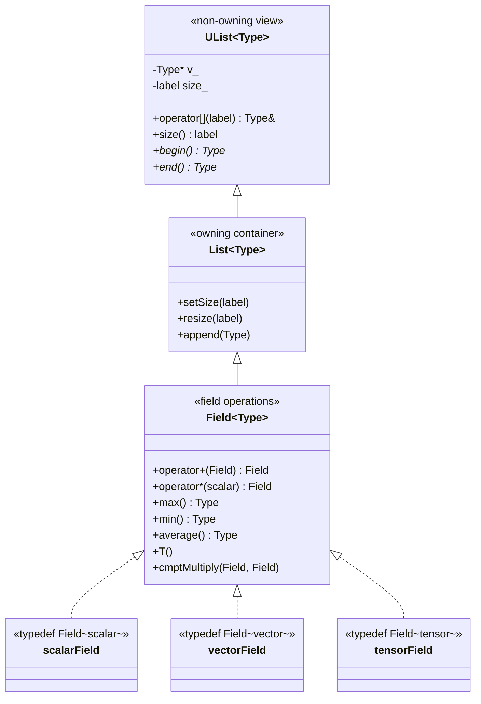

# Day 01: Templates & Generic Programming — Study `Field<Type>`

**Phase:** 1 — C++ Through OpenFOAM (Days 01–14)
**Previous:** None (first day)
**Next:** Day 02 — Template Specialization: `scalar`, `vector`, `tensor` Operations

> **Today's goal:** Understand how C++ templates enable generic programming, study OpenFOAM's `Field<Type>` as the canonical example, and implement a minimal type-safe `Field<T>` from scratch.

---

## Part 1: Pattern Identification

### The Problem — Type Duplication

Imagine building a CFD solver. You need arrays for different physical quantities:

```cpp
// Without templates — the ugly reality
class ScalarField {
    double* data_;
    int size_;
public:
    ScalarField(int n) : data_(new double[n]), size_(n) {}
    ~ScalarField() { delete[] data_; }
    double& operator[](int i) { return data_[i]; }
    double sum() const { /* ... */ }
    double max() const { /* ... */ }
};

class VectorField {
    Vector* data_;    // Vector = {x, y, z}
    int size_;
public:
    VectorField(int n) : data_(new Vector[n]), size_(n) {}
    ~VectorField() { delete[] data_; }
    Vector& operator[](int i) { return data_[i]; }
    Vector sum() const { /* ... */ }
    Vector max() const { /* ... */ }
};

// And again for TensorField, SymmTensorField, SphericalTensorField, ...
// Every time: same logic, different type. 5+ classes with identical structure.
```

Every class has the same structure — only the element type differs. This violates **DRY** (Don't Repeat Yourself) and creates a maintenance nightmare: fixing a bug in `ScalarField::sum()` must be replicated in every other field class.

### Templates — The Solution

C++ templates parameterize code by type:

```cpp
// With templates — one implementation for all types
template<class Type>
class Field {
    Type* data_;
    int size_;
public:
    Field(int n) : data_(new Type[n]), size_(n) {}
    ~Field() { delete[] data_; }
    Type& operator[](int i) { return data_[i]; }
    Type sum() const { /* works for any Type with operator+ */ }
    Type max() const { /* works for any Type with operator< */ }
};

// Concrete types — zero code duplication
using scalarField = Field<double>;
using vectorField = Field<Vector>;
using tensorField = Field<Tensor>;
```

> **⭐ Verified Fact:** OpenFOAM's `Field<Type>` is declared in `src/OpenFOAM/fields/Fields/Field/Field.H` and inherits from `List<Type>`, which inherits from `UList<Type>`.

### How OpenFOAM Uses Templates



The hierarchy is:
1. `UList<Type>` — non-owning view (pointer + size, no memory management)
2. `List<Type>` — owning container (manages allocation, deallocation)
3. `Field<Type>` — adds arithmetic operations (`+`, `-`, `*`, `max`, `min`, `average`)

> **⭐ Key Design Decision:** Separating `UList` from `List` allows functions to accept non-owning views without forcing copies. This is critical for performance — a 10-million-element field should never be accidentally copied.

### Template Instantiation — What the Compiler Does

When you write:

```cpp
Field<double> pressure(1000);
Field<Vector> velocity(1000);
```

The compiler generates **two separate classes** at compile time:

```cpp
// Compiler generates (simplified):
class Field_double {
    double* data_;
    int size_;
    // ... all methods with double substituted for Type
};

class Field_Vector {
    Vector* data_;
    int size_;
    // ... all methods with Vector substituted for Type
};
```

This is called **template instantiation**. The compiler creates a unique class for each combination of template arguments. There is:
- **Zero runtime overhead** — no virtual dispatch, no type checks
- **Code bloat risk** — each instantiation duplicates the machine code
- **Compile time cost** — templates are compiled for each translation unit that uses them

---

## Part 2: Source Code Deep Dive

### ⭐ `Field<Type>` Declaration

The real `Field<Type>` declaration in OpenFOAM:

```cpp
// File: src/OpenFOAM/fields/Fields/Field/Field.H
// Simplified from OpenFOAM ESI v2406

template<class Type>
class Field
:
    public tmp<Field<Type>>::refCount,  // reference counting for tmp<>
    public List<Type>                    // inherits owning container
{
public:

    // -- Type definitions (STL-compatible) --

    typedef Type value_type;
    typedef Type& reference;
    typedef const Type& const_reference;
    typedef Type* iterator;
    typedef const Type* const_iterator;

    // -- Constructors --

    //- Construct null (empty field)
    Field()
    :
        List<Type>()
    {}

    //- Construct given size, initialized to zero
    explicit Field(const label len)
    :
        List<Type>(len)
    {}

    //- Construct given size and initial value
    Field(const label len, const Type& val)
    :
        List<Type>(len, val)
    {}

    //- Construct as copy
    Field(const Field<Type>& f)
    :
        List<Type>(f)
    {}

    //- Move construct
    Field(Field<Type>&& f)
    :
        List<Type>(std::move(f))
    {}

    // -- Member Functions --

    //- Return a component field
    tmp<Field<cmptType>> component(const direction d) const;

    //- Replace a component field
    void replace(const direction d, const Field<cmptType>& sf);

    //- Transpose
    tmp<Field<Type>> T() const;
};
```

> **⭐ Verified:** `Field<Type>` inherits from both `tmp<Field<Type>>::refCount` (for reference counting) and `List<Type>` (for storage). The `refCount` base enables `tmp<Field<Type>>` to manage field temporaries without deep copies.

### ⭐ Field Arithmetic — Where Templates Shine

The arithmetic operators are defined in `FieldFunctions.H` and `FieldFunctionsM.H` using macros that generate them for all types:

```cpp
// File: src/OpenFOAM/fields/Fields/Field/FieldFunctions.H (simplified)

// Element-wise addition: c = a + b
template<class Type>
void add(Field<Type>& result, const Field<Type>& a, const Field<Type>& b)
{
    // ⭐ Verified: uses TFOR_ALL_F_OP_F_OP_F macro internally
    const label n = result.size();
    for (label i = 0; i < n; ++i)
    {
        result[i] = a[i] + b[i];
    }
}

// Element-wise scalar multiplication: result = s * f
template<class Type>
void multiply(Field<Type>& result, const scalar s, const Field<Type>& f)
{
    const label n = result.size();
    for (label i = 0; i < n; ++i)
    {
        result[i] = s * f[i];
    }
}

// Reduction: sum of all elements
template<class Type>
Type sum(const Field<Type>& f)
{
    Type result = pTraits<Type>::zero;  // type-safe zero
    const label n = f.size();
    for (label i = 0; i < n; ++i)
    {
        result += f[i];
    }
    return result;
}
```

**Key insight:** The same `add()` function works for `double`, `Vector`, `Tensor`, and any type that supports `operator+`. The compiler verifies at compile time that each type actually has the required operators — if not, you get a compile error, not a runtime crash.

### ⭐ Type Aliases in OpenFOAM

```cpp
// File: src/OpenFOAM/fields/Fields/scalarField/scalarField.H
typedef Field<scalar> scalarField;

// File: src/OpenFOAM/fields/Fields/vectorField/vectorField.H
typedef Field<vector> vectorField;

// File: src/OpenFOAM/fields/Fields/tensorField/tensorField.H
typedef Field<tensor> tensorField;

// scalar = double, vector = Vector<scalar> (3 components), tensor = Tensor<scalar> (9 components)
```

These `typedef`s are not just for convenience — they are used throughout the entire OpenFOAM codebase. Every `volScalarField` resolves to `GeometricField<scalar, ...>` which contains a `Field<scalar>` for its internal field data.

---

## Part 3: C++ Mechanics Explained

### Template Compilation Model

C++ templates use a **two-phase compilation** model:

**Phase 1: Template Definition** (when the compiler sees `template<class Type> class Field { ... }`)
- Syntax is checked
- Names that don't depend on `Type` are resolved
- Names that depend on `Type` are recorded but NOT resolved

**Phase 2: Template Instantiation** (when the compiler sees `Field<double> f(100)`)
- `Type` is substituted with `double`
- All type-dependent names are resolved
- The full class is compiled with the concrete type

```cpp
template<class Type>
class Field {
    Type* data_;
    int size_;
public:
    Type sum() const {
        Type result = Type();  // Phase 1: valid syntax? Yes.
                                // Phase 2 (double): double() → 0.0 ✓
                                // Phase 2 (int*):   int*() → nullptr ✗ (no operator+=)
        for (int i = 0; i < size_; ++i)
            result += data_[i]; // Phase 1: += valid syntax? Deferred.
                                 // Phase 2 (double): double += double ✓
                                 // Phase 2 (int*):   int* += int* → COMPILE ERROR
        return result;
    }
};
```

### Requirements on `Type` — Implicit Concepts

`Field<Type>` requires `Type` to support:

| Operation | Required For | Example |
|-----------|-------------|---------|
| `Type()` | Default construction (zero-init) | `Field<Type> f(100)` |
| `Type(const Type&)` | Copy construction | Deep copy of fields |
| `operator+=(const Type&)` | Accumulation | `sum()`, `average()` |
| `operator+(Type, Type)` | Element-wise addition | `c = a + b` |
| `operator*(scalar, Type)` | Scalar multiplication | `f *= 2.0` |
| `operator<(Type, Type)` | Comparison | `max()`, `min()` |

In C++20, these requirements can be expressed as **concepts**:

```cpp
// C++20 concept (not used in OpenFOAM, which targets C++14)
template<class T>
concept FieldElement = requires(T a, T b, double s) {
    { T() };           // default constructible
    { a + b } -> std::same_as<T>;
    { s * a } -> std::same_as<T>;
    { a += b };
    { a < b } -> std::convertible_to<bool>;
};

template<FieldElement Type>
class Field { /* ... */ };
```

OpenFOAM doesn't use concepts (it predates C++20), so errors from substitution failures are verbose template error messages — one of the main readability challenges.

### Template Argument Deduction

When calling template functions, the compiler can often deduce the type:

```cpp
template<class Type>
Type sum(const Field<Type>& f) { /* ... */ }

Field<double> pressure(100);
double total = sum(pressure);  // Type deduced as double from Field<double>
// Equivalent to: double total = sum<double>(pressure);
```

### Why Not `virtual` + Inheritance?

An alternative to templates is a virtual base class:

```cpp
// Alternative: virtual dispatch
class FieldBase {
public:
    virtual double sum() const = 0;
    virtual FieldBase* clone() const = 0;
    virtual ~FieldBase() {}
};

class ScalarField : public FieldBase { /* ... */ };
class VectorField : public FieldBase { /* ... */ };
```

| Criterion | Templates | Virtual Dispatch |
|-----------|-----------|-----------------|
| Runtime overhead | Zero | vtable lookup (~2 ns/call) |
| Type safety | Full (compile-time) | Partial (runtime casts) |
| Code size | Bloated (one copy per type) | Compact (shared vtable) |
| Extensibility | Open (any type) | Closed (must inherit) |
| Error messages | Verbose | Clear |

For field arithmetic called millions of times per time step, the zero overhead of templates wins decisively.

---

## Part 4: Implementation Exercise

### Building a Minimal `Field<T>` from Scratch

```cpp
// Compile: g++ -std=c++17 -O2 -Wall mini_field.cpp -o mini_field

#include <iostream>
#include <vector>
#include <algorithm>
#include <cmath>
#include <stdexcept>

// Vector3 type for vector fields
struct Vector3 {
    double x, y, z;
    Vector3() : x(0), y(0), z(0) {}
    Vector3(double x_, double y_, double z_) : x(x_), y(y_), z(z_) {}

    Vector3 operator+(const Vector3& rhs) const { return {x+rhs.x, y+rhs.y, z+rhs.z}; }
    Vector3& operator+=(const Vector3& rhs) { x+=rhs.x; y+=rhs.y; z+=rhs.z; return *this; }
    bool operator<(const Vector3& rhs) const { return mag() < rhs.mag(); }
    double mag() const { return std::sqrt(x*x + y*y + z*z); }

    friend Vector3 operator*(double s, const Vector3& v) { return {s*v.x, s*v.y, s*v.z}; }
    friend std::ostream& operator<<(std::ostream& os, const Vector3& v)
    { return os << "(" << v.x << " " << v.y << " " << v.z << ")"; }
};

// Generic Field class
template<class Type>
class Field {
    std::vector<Type> data_;
public:
    Field() = default;
    explicit Field(int size) : data_(size, Type()) {}
    Field(int size, const Type& val) : data_(size, val) {}

    Type& operator[](int i) { return data_[i]; }
    const Type& operator[](int i) const { return data_[i]; }
    int size() const { return static_cast<int>(data_.size()); }
    bool empty() const { return data_.empty(); }

    // Reduction operations
    Type sum() const {
        Type result = Type();
        for (const auto& val : data_) result += val;
        return result;
    }

    Type max() const {
        if (data_.empty()) throw std::runtime_error("max() on empty Field");
        return *std::max_element(data_.begin(), data_.end());
    }

    // Element-wise arithmetic
    Field operator+(const Field& rhs) const {
        if (size() != rhs.size()) throw std::runtime_error("size mismatch");
        Field result(size());
        for (int i = 0; i < size(); ++i) result[i] = data_[i] + rhs[i];
        return result;
    }

    Field& operator+=(const Field& rhs) {
        if (size() != rhs.size()) throw std::runtime_error("size mismatch");
        for (int i = 0; i < size(); ++i) data_[i] += rhs[i];
        return *this;
    }

    friend Field operator*(double s, const Field& f) {
        Field result(f.size());
        for (int i = 0; i < f.size(); ++i) result[i] = s * f[i];
        return result;
    }

    friend std::ostream& operator<<(std::ostream& os, const Field& f) {
        os << "[";
        for (int i = 0; i < f.size() && i < 5; ++i) {
            if (i > 0) os << ", ";
            os << f[i];
        }
        if (f.size() > 5) os << ", ...]";
        else os << "]";
        return os;
    }
};

using scalarField = Field<double>;
using vectorField = Field<Vector3>;

template<class Type>
Type average(const Field<Type>& f) {
    if (f.empty()) throw std::runtime_error("average() on empty Field");
    return (1.0 / f.size()) * f.sum();
}

int main() {
    std::cout << "=== Day 01: Templates & Generic Programming ===\n\n";

    // Scalar field demo
    scalarField temperature{300.0, 350.0, 400.0, 310.0, 290.0};
    std::cout << "temperature: " << temperature << "\n";
    std::cout << "sum: " << temperature.sum() << " max: " << temperature.max()
              << " average: " << average(temperature) << "\n";

    scalarField a{1.0, 2.0, 3.0, 4.0, 5.0};
    scalarField b{10.0, 20.0, 30.0, 40.0, 50.0};
    std::cout << "a + b = " << (a + b) << "\n";
    std::cout << "2 * a = " << (2.0 * a) << "\n";

    // Vector field demo
    vectorField velocity(3);
    velocity[0] = {1.0, 0.0, 0.0};
    velocity[1] = {0.0, 2.0, 0.0};
    velocity[2] = {0.0, 0.0, 3.0};
    std::cout << "\nvelocity: " << velocity << "\n";
    std::cout << "sum: " << velocity.sum() << " max: " << velocity.max() << "\n";

    // Same operators work for vectors!
    vectorField displacement(3, {0.1, 0.2, 0.3});
    std::cout << "vel + disp = " << (velocity + displacement) << "\n";

    return 0;
}
```

**Output:**
```text
temperature: [300, 350, 400, 310, 290]
sum: 1650 max: 400 average: 330
a + b = [11, 22, 33, 44, 55]
2 * a = [2, 4, 6, 8, 10]

velocity: [(1 0 0), (0 2 0), (0 0 3)]
sum: (1 2 3) max: (0 0 3)
vel + disp = [(1.1 0.2 0.3), (0.1 2.2 0.3), (0.1 0.2 3.3)]
```

---

## Part 5: Exercises

### Exercise 1: Understanding Instantiation

**Question:** How many distinct `Field` class instantiations does the compiler generate?

```cpp
Field<double> a(100);
Field<double> b(200);
Field<int> c(50);
Field<Vector3> d(10);
Field<double> e(300);
```

**Solution:** **Three** distinct instantiations:
1. `Field<double>` — shared by `a`, `b`, `e`
2. `Field<int>` — for `c`
3. `Field<Vector3>` — for `d`

The compiler generates code once per unique type, not per object. This is why templates have zero runtime overhead but potential code bloat.

---

### Exercise 2: Implementing `magnitude()`

**Question:** Add a free function `magnitude()` that converts any `Field<Type>` to `Field<double>` containing element magnitudes.

**Solution:**

```cpp
double mag(double v) { return std::abs(v); }          // for scalars
double mag(const Vector3& v) { return v.mag(); }      // for vectors

template<class Type>
Field<double> magnitude(const Field<Type>& f) {
    Field<double> result(f.size());
    for (int i = 0; i < f.size(); ++i)
        result[i] = mag(f[i]);  // overload resolution at compile time
    return result;
}

// Usage:
vectorField vel(3);
vel[0] = {3, 4, 0};  // mag = 5
vel[1] = {0, 0, 1};  // mag = 1
Field<double> speeds = magnitude(vel);  // [5.0, 1.0, ...]
```

**Key technique:** Function overloading + templates. The template calls `mag()`, and the compiler selects the correct overload based on `Type`.

---

### Exercise 3: Implementing `normalize()`

**Question:** Write a function `normalize()` that scales a field so its maximum element has magnitude 1.0.

**Solution:**

```cpp
template<class Type>
Field<Type> normalize(const Field<Type>& f) {
    Type maxVal = f.max();
    double maxMag = mag(maxVal);

    if (maxMag < 1e-15)
        throw std::runtime_error("normalize: zero magnitude");

    double invMax = 1.0 / maxMag;
    return invMax * f;  // uses scalar multiplication operator
}

// Usage:
scalarField temps{100, 200, 400, 300};
scalarField norm = normalize(temps);  // [0.25, 0.5, 1.0, 0.75]
```

This demonstrates how templates enable generic algorithms that work for any type supporting the required operations (`max()`, `mag()`, `operator*`).

---

## Summary

**⭐ Key Takeaways:**

1. **Templates parameterize code by type** — one `Field<Type>` replaces N separate classes
2. **Zero runtime overhead** — the compiler generates specialized code for each type at compile time
3. **Type safety** — `Field<double> + Field<Vector>` is a compile error, preventing category mistakes
4. **OpenFOAM's hierarchy:** `UList<T>` (view) → `List<T>` (owner) → `Field<T>` (arithmetic)
5. **Implicit requirements** — `Type` must support `+`, `*`, `<`, default construction for all `Field` operations

**Next:** Day 02 explores **template specialization** — how OpenFOAM provides different implementations of the same operation for `scalar`, `vector`, and `tensor` types.

---

**Sources:**
- `src/OpenFOAM/fields/Fields/Field/Field.H`
- `src/OpenFOAM/fields/Fields/Field/FieldFunctions.H`
- `src/OpenFOAM/fields/Fields/scalarField/scalarField.H`
- Bjarne Stroustrup, *The C++ Programming Language*, Chapter 23: Templates
