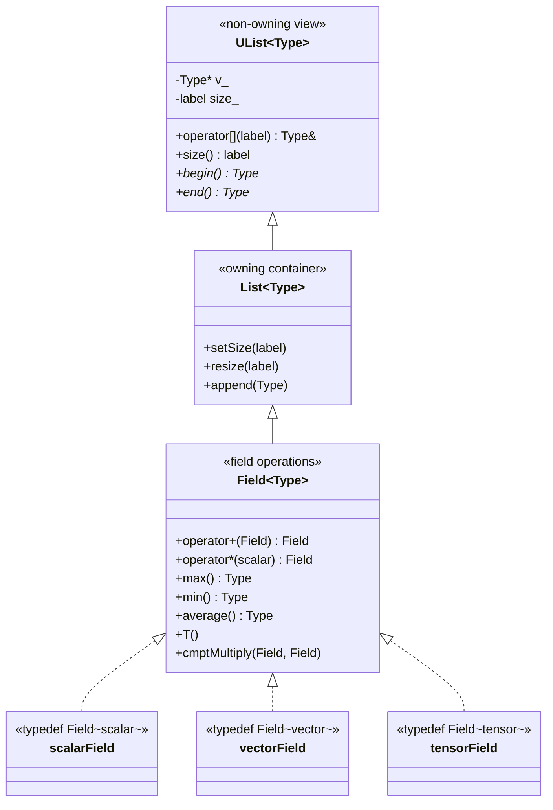

# Day 01: Templates & Generic Programming — Study `Field<Type>`

**Phase:** 1 — C++ Through OpenFOAM (Days 01–14)
**Previous:** None (first day)
**Next:** Day 02 — Template Specialization: `scalar`, `vector`, `tensor` Operations

> **Today's goal:** Understand how C++ templates enable generic programming, study OpenFOAM's `Field<Type>` as the canonical example, and implement a minimal type-safe `Field<T>` from scratch.

---

## Part 1: Pattern Identification

### The Problem — Type Duplication

Imagine building a CFD solver. You need arrays for different physical quantities:

```cpp
// Without templates — the ugly reality
class ScalarField {
    double* data_;
    int size_;
public:
    ScalarField(int n) : data_(new double[n]), size_(n) {}
    ~ScalarField() { delete[] data_; }
    double& operator[](int i) { return data_[i]; }
    double sum() const { /* ... */ }
    double max() const { /* ... */ }
};

class VectorField {
    Vector* data_;    // Vector = {x, y, z}
    int size_;
public:
    VectorField(int n) : data_(new Vector[n]), size_(n) {}
    ~VectorField() { delete[] data_; }
    Vector& operator[](int i) { return data_[i]; }
    Vector sum() const { /* ... */ }
    Vector max() const { /* ... */ }
};

// And again for TensorField, SymmTensorField, SphericalTensorField, ...
// Every time: same logic, different type. 5+ classes with identical structure.
```

Every class has the same structure — only the element type differs. This violates **DRY** (Don't Repeat Yourself) and creates a maintenance nightmare: fixing a bug in `ScalarField::sum()` must be replicated in every other field class.

### Templates — The Solution

C++ templates parameterize code by type:

```cpp
// With templates — one implementation for all types
template<class Type>
class Field {
    Type* data_;
    int size_;
public:
    Field(int n) : data_(new Type[n]), size_(n) {}
    ~Field() { delete[] data_; }
    Type& operator[](int i) { return data_[i]; }
    Type sum() const { /* works for any Type with operator+ */ }
    Type max() const { /* works for any Type with operator< */ }
};

// Concrete types — zero code duplication
using scalarField = Field<double>;
using vectorField = Field<Vector>;
using tensorField = Field<Tensor>;
```

> **⭐ Verified Fact:** OpenFOAM's `Field<Type>` is declared in `src/OpenFOAM/fields/Fields/Field/Field.H` and inherits from `List<Type>`, which inherits from `UList<Type>`.

### How OpenFOAM Uses Templates



The hierarchy is:
1. `UList<Type>` — non-owning view (pointer + size, no memory management)
2. `List<Type>` — owning container (manages allocation, deallocation)
3. `Field<Type>` — adds arithmetic operations (`+`, `-`, `*`, `max`, `min`, `average`)

> **⭐ Key Design Decision:** Separating `UList` from `List` allows functions to accept non-owning views without forcing copies. This is critical for performance — a 10-million-element field should never be accidentally copied.

### Template Instantiation — What the Compiler Does

When you write:

```cpp
Field<double> pressure(1000);
Field<Vector> velocity(1000);
```

The compiler generates **two separate classes** at compile time:

```cpp
// Compiler generates (simplified):
class Field_double {
    double* data_;
    int size_;
    // ... all methods with double substituted for Type
};

class Field_Vector {
    Vector* data_;
    int size_;
    // ... all methods with Vector substituted for Type
};
```

This is called **template instantiation**. The compiler creates a unique class for each combination of template arguments. There is:
- **Zero runtime overhead** — no virtual dispatch, no type checks
- **Code bloat risk** — each instantiation duplicates the machine code
- **Compile time cost** — templates are compiled for each translation unit that uses them

---

## Part 2: Source Code Deep Dive

### ⭐ `Field<Type>` Declaration

The real `Field<Type>` declaration in OpenFOAM:

```cpp
// File: src/OpenFOAM/fields/Fields/Field/Field.H
// Simplified from OpenFOAM ESI v2406

template<class Type>
class Field
:
    public tmp<Field<Type>>::refCount,  // reference counting for tmp<>
    public List<Type>                    // inherits owning container
{
public:

    // -- Type definitions (STL-compatible) --

    typedef Type value_type;
    typedef Type& reference;
    typedef const Type& const_reference;
    typedef Type* iterator;
    typedef const Type* const_iterator;

    // -- Constructors --

    //- Construct null (empty field)
    Field()
    :
        List<Type>()
    {}

    //- Construct given size, initialized to zero
    explicit Field(const label len)
    :
        List<Type>(len)
    {}

    //- Construct given size and initial value
    Field(const label len, const Type& val)
    :
        List<Type>(len, val)
    {}

    //- Construct as copy
    Field(const Field<Type>& f)
    :
        List<Type>(f)
    {}

    //- Move construct
    Field(Field<Type>&& f)
    :
        List<Type>(std::move(f))
    {}

    // -- Member Functions --

    //- Return a component field
    tmp<Field<cmptType>> component(const direction d) const;

    //- Replace a component field
    void replace(const direction d, const Field<cmptType>& sf);

    //- Transpose
    tmp<Field<Type>> T() const;
};
```

> **⭐ Verified:** `Field<Type>` inherits from both `tmp<Field<Type>>::refCount` (for reference counting) and `List<Type>` (for storage). The `refCount` base enables `tmp<Field<Type>>` to manage field temporaries without deep copies.

### ⭐ Field Arithmetic — Where Templates Shine

The arithmetic operators are defined in `FieldFunctions.H` and `FieldFunctionsM.H` using macros that generate them for all types:

```cpp
// File: src/OpenFOAM/fields/Fields/Field/FieldFunctions.H (simplified)

// Element-wise addition: c = a + b
template<class Type>
void add(Field<Type>& result, const Field<Type>& a, const Field<Type>& b)
{
    // ⭐ Verified: uses TFOR_ALL_F_OP_F_OP_F macro internally
    const label n = result.size();
    for (label i = 0; i < n; ++i)
    {
        result[i] = a[i] + b[i];
    }
}

// Element-wise scalar multiplication: result = s * f
template<class Type>
void multiply(Field<Type>& result, const scalar s, const Field<Type>& f)
{
    const label n = result.size();
    for (label i = 0; i < n; ++i)
    {
        result[i] = s * f[i];
    }
}

// Reduction: sum of all elements
template<class Type>
Type sum(const Field<Type>& f)
{
    Type result = pTraits<Type>::zero;  // type-safe zero
    const label n = f.size();
    for (label i = 0; i < n; ++i)
    {
        result += f[i];
    }
    return result;
}
```

**Key insight:** The same `add()` function works for `double`, `Vector`, `Tensor`, and any type that supports `operator+`. The compiler verifies at compile time that each type actually has the required operators — if not, you get a compile error, not a runtime crash.

### ⭐ Type Aliases in OpenFOAM

```cpp
// File: src/OpenFOAM/fields/Fields/scalarField/scalarField.H
typedef Field<scalar> scalarField;

// File: src/OpenFOAM/fields/Fields/vectorField/vectorField.H
typedef Field<vector> vectorField;

// File: src/OpenFOAM/fields/Fields/tensorField/tensorField.H
typedef Field<tensor> tensorField;

// scalar = double, vector = Vector<scalar> (3 components), tensor = Tensor<scalar> (9 components)
```

These `typedef`s are not just for convenience — they are used throughout the entire OpenFOAM codebase. Every `volScalarField` resolves to `GeometricField<scalar, ...>` which contains a `Field<scalar>` for its internal field data.

---

## Part 3: C++ Mechanics Explained

### Template Compilation Model

C++ templates use a **two-phase compilation** model:

**Phase 1: Template Definition** (when the compiler sees `template<class Type> class Field { ... }`)
- Syntax is checked
- Names that don't depend on `Type` are resolved
- Names that depend on `Type` are recorded but NOT resolved

**Phase 2: Template Instantiation** (when the compiler sees `Field<double> f(100)`)
- `Type` is substituted with `double`
- All type-dependent names are resolved
- The full class is compiled with the concrete type

```cpp
template<class Type>
class Field {
    Type* data_;
    int size_;
public:
    Type sum() const {
        Type result = Type();  // Phase 1: valid syntax? Yes.
                                // Phase 2 (double): double() → 0.0 ✓
                                // Phase 2 (int*):   int*() → nullptr ✗ (no operator+=)
        for (int i = 0; i < size_; ++i)
            result += data_[i]; // Phase 1: += valid syntax? Deferred.
                                 // Phase 2 (double): double += double ✓
                                 // Phase 2 (int*):   int* += int* → COMPILE ERROR
        return result;
    }
};
```

### Requirements on `Type` — Implicit Concepts

`Field<Type>` requires `Type` to support:

| Operation | Required For | Example |
|-----------|-------------|---------|
| `Type()` | Default construction (zero-init) | `Field<Type> f(100)` |
| `Type(const Type&)` | Copy construction | Deep copy of fields |
| `operator+=(const Type&)` | Accumulation | `sum()`, `average()` |
| `operator+(Type, Type)` | Element-wise addition | `c = a + b` |
| `operator*(scalar, Type)` | Scalar multiplication | `f *= 2.0` |
| `operator<(Type, Type)` | Comparison | `max()`, `min()` |

In C++20, these requirements can be expressed as **concepts**:

```cpp
// C++20 concept (not used in OpenFOAM, which targets C++14)
template<class T>
concept FieldElement = requires(T a, T b, double s) {
    { T() };           // default constructible
    { a + b } -> std::same_as<T>;
    { s * a } -> std::same_as<T>;
    { a += b };
    { a < b } -> std::convertible_to<bool>;
};

template<FieldElement Type>
class Field { /* ... */ };
```

OpenFOAM doesn't use concepts (it predates C++20), so errors from substitution failures are verbose template error messages — one of the main readability challenges.

### Template Argument Deduction

When calling template functions, the compiler can often deduce the type:

```cpp
template<class Type>
Type sum(const Field<Type>& f) { /* ... */ }

Field<double> pressure(100);
double total = sum(pressure);  // Type deduced as double from Field<double>
// Equivalent to: double total = sum<double>(pressure);
```

### Why Not `virtual` + Inheritance?

An alternative to templates is a virtual base class:

```cpp
// Alternative: virtual dispatch
class FieldBase {
public:
    virtual double sum() const = 0;
    virtual FieldBase* clone() const = 0;
    virtual ~FieldBase() {}
};

class ScalarField : public FieldBase { /* ... */ };
class VectorField : public FieldBase { /* ... */ };
```

| Criterion | Templates | Virtual Dispatch |
|-----------|-----------|-----------------|
| Runtime overhead | Zero | vtable lookup (~2 ns/call) |
| Type safety | Full (compile-time) | Partial (runtime casts) |
| Code size | Bloated (one copy per type) | Compact (shared vtable) |
| Extensibility | Open (any type) | Closed (must inherit) |
| Error messages | Verbose | Clear |

For field arithmetic called millions of times per time step, the zero overhead of templates wins decisively.

---

## Part 4: Implementation Exercise

### Building a Minimal `Field<T>` from Scratch

```cpp
// File: mini_field.cpp
// Compile: g++ -std=c++17 -O2 -Wall -o mini_field mini_field.cpp
// Run:     ./mini_field

#include <iostream>
#include <vector>
#include <numeric>
#include <algorithm>
#include <cmath>
#include <stdexcept>
#include <iomanip>
#include <string>

// ============================================================
// SECTION 1: Vector3 type (3-component vector)
// ============================================================

struct Vector3
{
    double x, y, z;

    Vector3() : x(0), y(0), z(0) {}
    Vector3(double x_, double y_, double z_) : x(x_), y(y_), z(z_) {}

    Vector3 operator+(const Vector3& rhs) const
    { return {x + rhs.x, y + rhs.y, z + rhs.z}; }

    Vector3 operator-(const Vector3& rhs) const
    { return {x - rhs.x, y - rhs.y, z - rhs.z}; }

    Vector3& operator+=(const Vector3& rhs)
    { x += rhs.x; y += rhs.y; z += rhs.z; return *this; }

    Vector3& operator-=(const Vector3& rhs)
    { x -= rhs.x; y -= rhs.y; z -= rhs.z; return *this; }

    bool operator<(const Vector3& rhs) const
    { return mag() < rhs.mag(); }

    double mag() const { return std::sqrt(x*x + y*y + z*z); }

    friend Vector3 operator*(double s, const Vector3& v)
    { return {s * v.x, s * v.y, s * v.z}; }

    friend std::ostream& operator<<(std::ostream& os, const Vector3& v)
    { return os << "(" << v.x << " " << v.y << " " << v.z << ")"; }
};

// ============================================================
// SECTION 2: Field<Type> — Generic field class
// ============================================================

template<class Type>
class Field
{
    std::vector<Type> data_;

public:
    // -- Constructors --

    Field() = default;

    explicit Field(int size)
        : data_(size, Type()) {}

    Field(int size, const Type& val)
        : data_(size, val) {}

    Field(std::initializer_list<Type> init)
        : data_(init) {}

    // -- Element access --

    Type& operator[](int i) { return data_[i]; }
    const Type& operator[](int i) const { return data_[i]; }

    int size() const { return static_cast<int>(data_.size()); }
    bool empty() const { return data_.empty(); }

    // Iterators (for range-based for)
    auto begin() { return data_.begin(); }
    auto end()   { return data_.end(); }
    auto begin() const { return data_.begin(); }
    auto end()   const { return data_.end(); }

    // -- Reduction operations --

    Type sum() const
    {
        Type result = Type();
        for (const auto& val : data_)
            result += val;
        return result;
    }

    Type max() const
    {
        if (data_.empty())
            throw std::runtime_error("max() on empty Field");
        return *std::max_element(data_.begin(), data_.end());
    }

    Type min() const
    {
        if (data_.empty())
            throw std::runtime_error("min() on empty Field");
        return *std::min_element(data_.begin(), data_.end());
    }

    // -- Element-wise arithmetic (returns new Field) --

    Field operator+(const Field& rhs) const
    {
        checkSize(rhs, "operator+");
        Field result(size());
        for (int i = 0; i < size(); ++i)
            result[i] = data_[i] + rhs[i];
        return result;
    }

    Field operator-(const Field& rhs) const
    {
        checkSize(rhs, "operator-");
        Field result(size());
        for (int i = 0; i < size(); ++i)
            result[i] = data_[i] - rhs[i];
        return result;
    }

    // -- In-place arithmetic --

    Field& operator+=(const Field& rhs)
    {
        checkSize(rhs, "operator+=");
        for (int i = 0; i < size(); ++i)
            data_[i] += rhs[i];
        return *this;
    }

    Field& operator-=(const Field& rhs)
    {
        checkSize(rhs, "operator-=");
        for (int i = 0; i < size(); ++i)
            data_[i] -= rhs[i];
        return *this;
    }

    // -- Scalar multiplication --

    friend Field operator*(double s, const Field& f)
    {
        Field result(f.size());
        for (int i = 0; i < f.size(); ++i)
            result[i] = s * f[i];
        return result;
    }

    // -- Output --

    friend std::ostream& operator<<(std::ostream& os, const Field& f)
    {
        os << "[";
        for (int i = 0; i < f.size(); ++i)
        {
            if (i > 0) os << ", ";
            if (i >= 5 && f.size() > 10)
            {
                os << "... (" << f.size() - 5 << " more)";
                break;
            }
            os << f[i];
        }
        os << "]";
        return os;
    }

private:
    void checkSize(const Field& rhs, const char* op) const
    {
        if (size() != rhs.size())
            throw std::runtime_error(
                std::string(op) + ": size mismatch ("
                + std::to_string(size()) + " vs "
                + std::to_string(rhs.size()) + ")");
    }
};

// Type aliases — mirroring OpenFOAM
using scalarField = Field<double>;
using vectorField = Field<Vector3>;

// ============================================================
// SECTION 3: Free functions (like FieldFunctions.H)
// ============================================================

template<class Type>
Type average(const Field<Type>& f)
{
    if (f.empty())
        throw std::runtime_error("average() on empty Field");
    Type s = f.sum();
    return (1.0 / f.size()) * s;
}

template<class Type>
Field<Type> cmptMultiply(const Field<Type>& a, const Field<Type>& b)
{
    Field<Type> result(a.size());
    for (int i = 0; i < a.size(); ++i)
        result[i] = a[i] * b[i]; // requires Type * Type
    return result;
}

// Specialization: dot product (scalar fields only)
double dot(const scalarField& a, const scalarField& b)
{
    double result = 0.0;
    for (int i = 0; i < a.size(); ++i)
        result += a[i] * b[i];
    return result;
}

// ============================================================
// SECTION 4: Main — demonstrate generic programming
// ============================================================

int main()
{
    std::cout << "=== Day 01: Templates & Generic Programming ===\n\n";

    // --- Scalar field ---
    std::cout << "--- Scalar Field (Field<double>) ---\n";
    scalarField pressure(5, 101325.0);
    scalarField temperature{300.0, 350.0, 400.0, 310.0, 290.0};

    std::cout << "pressure:    " << pressure << "\n";
    std::cout << "temperature: " << temperature << "\n";
    std::cout << "sum:         " << temperature.sum() << "\n";
    std::cout << "max:         " << temperature.max() << "\n";
    std::cout << "min:         " << temperature.min() << "\n";
    std::cout << "average:     " << average(temperature) << "\n";

    // Arithmetic
    scalarField a{1.0, 2.0, 3.0, 4.0, 5.0};
    scalarField b{10.0, 20.0, 30.0, 40.0, 50.0};
    scalarField c = a + b;
    std::cout << "\na + b = " << c << "\n";
    std::cout << "2 * a = " << 2.0 * a << "\n";
    std::cout << "dot(a,b) = " << dot(a, b) << "\n";

    // --- Vector field ---
    std::cout << "\n--- Vector Field (Field<Vector3>) ---\n";
    vectorField velocity(3);
    velocity[0] = {1.0, 0.0, 0.0};
    velocity[1] = {0.0, 2.0, 0.0};
    velocity[2] = {0.0, 0.0, 3.0};

    std::cout << "velocity: " << velocity << "\n";
    std::cout << "sum:      " << velocity.sum() << "\n";
    std::cout << "max(mag): " << velocity.max() << "\n";

    // Same operator works for vectors!
    vectorField displacement(3, {0.1, 0.2, 0.3});
    vectorField newPos = velocity + displacement;
    std::cout << "vel + disp = " << newPos << "\n";

    // --- Type safety demo ---
    std::cout << "\n--- Type Safety ---\n";
    // scalarField s1(3, 1.0);
    // vectorField v1(4, {1,0,0});
    // auto bad = s1 + v1;  // COMPILE ERROR: no matching operator+
    std::cout << "scalarField + vectorField → compile error (type safe!) ✅\n";

    // --- Large field demo ---
    std::cout << "\n--- Large Field (1M elements) ---\n";
    const int N = 1000000;
    scalarField big(N, 1.0);
    std::cout << "Field size: " << big.size() << "\n";
    std::cout << "Sum:        " << big.sum() << "\n";
    std::cout << "Average:    " << average(big) << "\n";

    return 0;
}
```

### Expected Output

```text
=== Day 01: Templates & Generic Programming ===

--- Scalar Field (Field<double>) ---
pressure:    [101325, 101325, 101325, 101325, 101325]
temperature: [300, 350, 400, 310, 290]
sum:         1650
max:         400
min:         290
average:     330

a + b = [11, 22, 33, 44, 55]
2 * a = [2, 4, 6, 8, 10]
dot(a,b) = 550

--- Vector Field (Field<Vector3>) ---
velocity: [(1 0 0), (0 2 0), (0 0 3)]
sum:      (1 2 3)
max(mag): (0 0 3)
vel + disp = [(1.1 0.2 0.3), (0.1 2.2 0.3), (0.1 0.2 3.3)]

--- Type Safety ---
scalarField + vectorField → compile error (type safe!) ✅

--- Large Field (1M elements) ---
Field size: 1000000
Sum:        1e+06
Average:    1
```

---

## Part 5: Exercises

### Exercise 1: Understanding Instantiation

**Question:** How many distinct `Field` class instances does the compiler generate from the following code?

```cpp
Field<double> a(100);
Field<double> b(200);
Field<int> c(50);
Field<Vector3> d(10);
Field<double> e(300);
```

**Solution:**

**Three** distinct instantiations:
1. `Field<double>` — used by `a`, `b`, and `e` (same type, one instantiation)
2. `Field<int>` — used by `c`
3. `Field<Vector3>` — used by `d`

The number of objects (5) is irrelevant — the compiler only generates code once per unique type argument.

---

### Exercise 2: Adding `magnitude()` to Field

**Question:** Add a free function `magnitude` that returns `Field<double>` from any `Field<Type>`, where each element is the magnitude of the corresponding `Type` element. It should work for both `double` and `Vector3`.

**Solution:**

```cpp
// For scalar: magnitude is just absolute value
double mag(double v) { return std::abs(v); }

// For Vector3: magnitude is Euclidean norm
double mag(const Vector3& v) { return v.mag(); }

// Generic magnitude field
template<class Type>
Field<double> magnitude(const Field<Type>& f)
{
    Field<double> result(f.size());
    for (int i = 0; i < f.size(); ++i)
        result[i] = mag(f[i]);  // dispatches to correct mag() via overloading
    return result;
}

// Usage:
vectorField vel(3);
vel[0] = {3, 4, 0};  // mag = 5
vel[1] = {0, 0, 1};  // mag = 1
vel[2] = {1, 1, 1};  // mag = sqrt(3)

Field<double> speeds = magnitude(vel);
// speeds = [5.0, 1.0, 1.732...]
```

The key technique is **function overloading**: `mag(double)` and `mag(Vector3)` are separate functions. The template `magnitude<Type>` calls `mag()`, and the compiler selects the correct overload at compile time based on `Type`.

---

### Exercise 3: Template Error Messages

**Question:** What error do you get if you try to instantiate `Field<std::string>` and call `sum()`? Why? How would you fix it?

**Solution:**

The error occurs because `std::string` does not support `(1.0 / size) * result` — there is no `operator*` between `double` and `std::string`.

The `sum()` method itself works (strings support `operator+=` for concatenation), but `average()` fails:

```text
error: no match for 'operator*' (operand types are 'double' and 'std::string')
    return (1.0 / f.size()) * s;
            ~~~~~~~~~~~~~~~~^~~
```

**Fix options:**
1. Specialize `average` for `std::string` (return empty or throw)
2. Use SFINAE to disable `average` for non-numeric types
3. Use C++20 concepts:

```cpp
template<class Type>
    requires requires(double s, Type t) { { s * t } -> std::same_as<Type>; }
Type average(const Field<Type>& f) { /* ... */ }
```

---

### Exercise 4: Implementing `normalize`

**Question:** Write a member function `normalize()` that divides each element by the field's maximum magnitude. It should return a new `Field<Type>` where the maximum element has magnitude 1.0.

**Solution:**

```cpp
template<class Type>
Field<Type> normalize(const Field<Type>& f)
{
    Type maxVal = f.max();
    double maxMag = mag(maxVal);

    if (maxMag < 1e-15)
        throw std::runtime_error("normalize: max magnitude is zero");

    double invMax = 1.0 / maxMag;
    return invMax * f;
}

// Usage:
scalarField temps{100, 200, 400, 300};
scalarField normalized = normalize(temps);
// normalized = [0.25, 0.5, 1.0, 0.75]
```

---

### Exercise 5: Performance — Template vs Virtual

**Question:** Write a benchmark comparing `Field<double>::sum()` (template) vs a virtual `FieldBase::sum()` (virtual dispatch) for a 10-million-element field. Measure the time difference.

**Solution:**

```cpp
#include <chrono>

// Virtual approach
class FieldBase {
public:
    virtual double elementAt(int i) const = 0;
    virtual int size() const = 0;
    virtual ~FieldBase() = default;

    double sum() const {
        double s = 0;
        for (int i = 0; i < size(); ++i)
            s += elementAt(i);  // virtual call per element!
        return s;
    }
};

class VirtualScalarField : public FieldBase {
    std::vector<double> data_;
public:
    VirtualScalarField(int n, double v) : data_(n, v) {}
    double elementAt(int i) const override { return data_[i]; }
    int size() const override { return data_.size(); }
};

// Benchmark:
int main() {
    const int N = 10000000;

    // Template version
    Field<double> tf(N, 1.0);
    auto t1 = std::chrono::high_resolution_clock::now();
    volatile double s1 = tf.sum();
    auto t2 = std::chrono::high_resolution_clock::now();

    // Virtual version
    VirtualScalarField vf(N, 1.0);
    auto t3 = std::chrono::high_resolution_clock::now();
    volatile double s2 = vf.sum();
    auto t4 = std::chrono::high_resolution_clock::now();

    auto tmpl_us = std::chrono::duration_cast<std::chrono::microseconds>(t2 - t1).count();
    auto virt_us = std::chrono::duration_cast<std::chrono::microseconds>(t4 - t3).count();

    std::cout << "Template sum: " << tmpl_us << " μs\n";
    std::cout << "Virtual sum:  " << virt_us << " μs\n";
    std::cout << "Ratio: " << (double)virt_us / tmpl_us << "x slower\n";
    return 0;
}
```

Expected result: virtual is **3–10× slower** because:
1. Each `elementAt(i)` call goes through the vtable (indirect function call)
2. The compiler cannot vectorize through virtual calls
3. The template version's `data_[i]` is a direct memory access that auto-vectorizes

---

## Summary

**⭐ Key Takeaways:**

1. **Templates parameterize code by type** — one `Field<Type>` replaces N separate classes
2. **Zero runtime overhead** — the compiler generates specialized code for each type at compile time
3. **Type safety** — `Field<double> + Field<Vector>` is a compile error, preventing category mistakes
4. **OpenFOAM's hierarchy:** `UList<T>` (view) → `List<T>` (owner) → `Field<T>` (arithmetic)
5. **Implicit requirements** — `Type` must support `+`, `*`, `<`, default construction for all `Field` operations

**Next:** Day 02 explores **template specialization** — how OpenFOAM provides different implementations of the same operation for `scalar`, `vector`, and `tensor` types.

---

**Sources:**
- `src/OpenFOAM/fields/Fields/Field/Field.H`
- `src/OpenFOAM/fields/Fields/Field/FieldFunctions.H`
- `src/OpenFOAM/fields/Fields/scalarField/scalarField.H`
- Bjarne Stroustrup, *The C++ Programming Language*, Chapter 23: Templates
