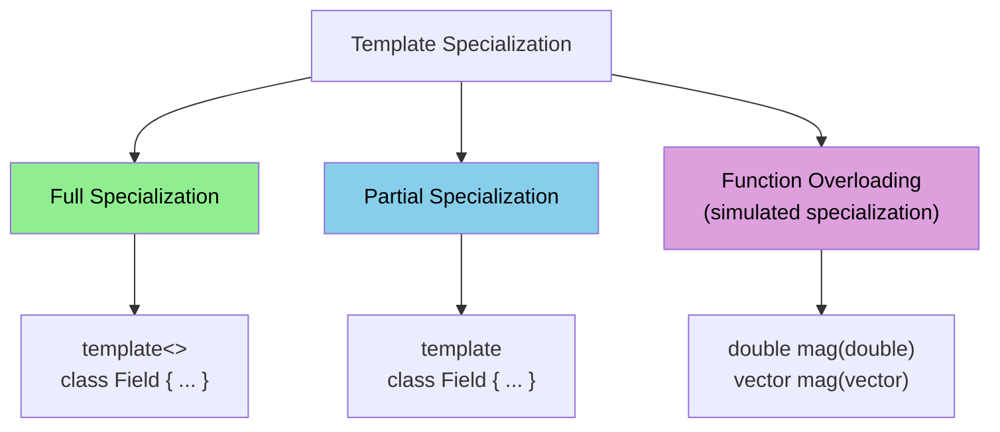

# Day 02: Template Specialization — `scalar`, `vector`, `tensor` Operations

**Phase:** 1 — C++ Through OpenFOAM (Days 01–14)
**Previous:** Day 01 — Templates & Generic Programming: `Field<Type>`
**Next:** Day 03 — Geometric Fields: `GeometricField<Type>`

> **Today's goal:** Learn how C++ template specialization allows different implementations for specific types while keeping a generic interface. Study how OpenFOAM uses specialization to provide optimized operations for `scalar`, `vector`, and `tensor`.

---

## Part 1: Pattern Identification

### The Specialization Problem

On Day 01, we built `Field<Type>` — a single generic class for any type. But not all types should behave identically. Consider these operations:

| Operation | `scalar` (double) | `vector` (3D) | `tensor` (3×3) |
|----------|-------------------|---------------|----------------|
| Magnitude | `std::abs(s)` | `sqrt(x² + y² + z²)` | `sqrt(sum of squared components)` |
| Transpose | No-op (scalar = scalar) | No-op (vector has no transpose) | Swap `T[i][j]` ↔ `T[j][i]` |
| Determinant | Just the value itself | Not defined | `det(T)` formula |
| Component count | 1 | 3 | 9 |
| Zero value | `0.0` | `(0, 0, 0)` | 9-component zero |

A fully generic `mag()` function cannot work — the computation is fundamentally different for each type. This is where **template specialization** enters.

### Three Forms of Specialization



| Form | Syntax | Use Case |
|------|--------|----------|
| **Full specialization** | `template<> class X<double> { ... }` | Completely different implementation for one type |
| **Partial specialization** | `template<class T> class X<T*> { ... }` | Different implementation for a category of types |
| **Function overloading** | `double mag(double); Vector mag(Vector)` | Type-specific free functions (preferred in OpenFOAM) |

### OpenFOAM's Approach: Overloading + Traits

OpenFOAM rarely uses full class specialization for `Field`. Instead, it uses:

1. **Function overloading** — separate `mag(scalar)`, `mag(vector)`, `mag(tensor)` functions
2. **`pTraits<Type>`** — a traits class that provides type properties (zero value, component count, etc.)
3. **Component-wise operations** — generic templates that loop over components, with `pTraits` providing the count

> **⭐ Verified Fact:** `pTraits<Type>` is defined in `src/OpenFOAM/primitives/traits/pTraits.H`. It provides `pTraits<Type>::zero`, `pTraits<Type>::one`, `pTraits<Type>::nComponents`, and the type name.

---

## Part 2: Source Code Deep Dive

### ⭐ `pTraits<Type>` — The Traits Class

```cpp
// File: src/OpenFOAM/primitives/traits/pTraits.H (simplified)

// Primary template — must be specialized for each type
template<class PrimitiveType>
class pTraits
{
public:
    // ⭐ These are the key properties every Type must define
    static const PrimitiveType zero;       // additive identity
    static const PrimitiveType one;        // multiplicative identity
    static const int nComponents;          // number of scalar components
    static const char* const typeName;     // human-readable name
};

// ⭐ Full specialization for scalar
template<>
class pTraits<double>
{
public:
    typedef double cmptType;  // component type is itself

    static const double zero;       // = 0.0
    static const double one;        // = 1.0
    static const int nComponents;   // = 1
    static const char* const typeName; // = "scalar"
};

// Definitions (in .C file)
const double pTraits<double>::zero = 0.0;
const double pTraits<double>::one = 1.0;
const int pTraits<double>::nComponents = 1;
const char* const pTraits<double>::typeName = "scalar";
```

### ⭐ Specialization for `vector`

```cpp
// File: src/OpenFOAM/primitives/traits/pTraits.H (simplified)

// Forward declaration
class vector;

template<>
class pTraits<vector>
{
public:
    typedef double cmptType;  // each component is a scalar

    static const vector zero;       // = (0, 0, 0)
    static const vector one;        // = (1, 1, 1)
    static const int nComponents;   // = 3
    static const char* const typeName; // = "vector"
};

// Definitions
const vector pTraits<vector>::zero = vector(0, 0, 0);
const vector pTraits<vector>::one = vector(1, 1, 1);
const int pTraits<vector>::nComponents = 3;
const char* const pTraits<vector>::typeName = "vector";
```

### ⭐ How `pTraits` Enables Generic Operations

With `pTraits`, generic code can access type-specific properties without specialization:

```cpp
// Generic sum() using pTraits for the zero value
template<class Type>
Type sum(const Field<Type>& f)
{
    Type result = pTraits<Type>::zero;  // ← type-safe zero!
    // For scalar: result = 0.0
    // For vector: result = (0, 0, 0)
    // For tensor: result = 9-component zero

    for (label i = 0; i < f.size(); ++i)
        result += f[i];

    return result;
}
```

Without `pTraits`, you would need to write separate `sum<scalar>`, `sum<vector>`, `sum<tensor>` specializations — defeating the purpose of templates.

### ⭐ Type-Specific Operations via Overloading

```cpp
// File: src/OpenFOAM/primitives/Scalar/doubleScalar.H
inline double mag(const double s) { return std::abs(s); }

// File: src/OpenFOAM/primitives/Vector/VectorI.H
template<class Cmpt>
inline double mag(const Vector<Cmpt>& v)
{
    return std::sqrt(v.x()*v.x() + v.y()*v.y() + v.z()*v.z());
}

// File: src/OpenFOAM/primitives/Tensor/TensorI.H
template<class Cmpt>
inline double mag(const Tensor<Cmpt>& t)
{
    return std::sqrt(magSqr(t));  // Frobenius norm
}

// ⭐ Now a generic function can call mag() on any type:
template<class Type>
Field<double> magField(const Field<Type>& f)
{
    Field<double> result(f.size());
    for (label i = 0; i < f.size(); ++i)
        result[i] = mag(f[i]);  // dispatches to correct overload
    return result;
}
```

**Key pattern:** The generic template `magField<Type>` doesn't need to know which `mag()` to call — the compiler resolves it at instantiation time via **overload resolution**.

---

## Part 3: C++ Mechanics Explained

### Full Specialization Syntax

```cpp
// Primary template
template<class T>
class Container {
    T data_;
public:
    Container(T val) : data_(val) {}
    void print() const { std::cout << "Generic: " << data_ << "\n"; }
};

// Full specialization for bool (completely different implementation)
template<>
class Container<bool> {
    unsigned char bits_;  // pack 8 bools into 1 byte
public:
    Container(bool val) : bits_(val ? 1 : 0) {}
    void print() const { std::cout << "Bool: " << (bits_ ? "true" : "false") << "\n"; }
};
```

The specialization replaces the **entire class** — you must redefine all members. There is no inheritance from the primary template.

### Partial Specialization

Partial specialization matches a **pattern** rather than a specific type:

```cpp
// Primary template
template<class T>
class Wrapper {
    T value_;
public:
    void describe() { std::cout << "Value type\n"; }
};

// Partial specialization for pointers
template<class T>
class Wrapper<T*> {
    T* ptr_;
public:
    void describe() { std::cout << "Pointer to " << typeid(T).name() << "\n"; }
};

// Partial specialization for arrays
template<class T, int N>
class Wrapper<T[N]> {
    T data_[N];
public:
    void describe() { std::cout << "Array of " << N << " elements\n"; }
};
```

> **⭐ Important:** Function templates **cannot** be partially specialized — only overloaded. Class templates can be both fully and partially specialized. This is why OpenFOAM uses function overloading for type-specific operations and class specialization only for traits.

### The Specialization Resolution Order

When the compiler sees `Wrapper<int*>`, it checks in order:

1. Is there a **full specialization** `template<> class Wrapper<int*>`? → Use it
2. Is there a **partial specialization** that matches `int*`? → `Wrapper<T*>` matches → Use it
3. Otherwise → Use the primary template

```text
Wrapper<int>    → primary template      (no specialization matches)
Wrapper<int*>   → Wrapper<T*>           (partial spec, T=int)
Wrapper<double> → primary template
Wrapper<bool>   → template<> Wrapper<bool>  (full spec, if defined)
```

### SFINAE — Substitution Failure Is Not An Error

SFINAE allows the compiler to silently discard template overloads that would cause errors:

```cpp
#include <type_traits>

// This overload is only available for arithmetic types
template<class T>
typename std::enable_if<std::is_arithmetic<T>::value, T>::type
safeDiv(T a, T b)
{
    return b != T(0) ? a / b : T(0);
}

// This overload is only available for non-arithmetic types
template<class T>
typename std::enable_if<!std::is_arithmetic<T>::value, T>::type
safeDiv(T a, T b)
{
    throw std::runtime_error("Division not supported for this type");
}

// safeDiv(10.0, 3.0) → calls arithmetic version
// safeDiv(vec1, vec2) → calls non-arithmetic version (throws)
```

The `enable_if` conditionally removes the function from the overload set. If `T = double`, `is_arithmetic<double>::value` is `true`, so the first overload is available and the second is removed. If `T = std::string`, it's the opposite.

---

## Part 4: Implementation Exercise

### Building a `pTraits` System

```cpp
// File: ptraits_demo.cpp
// Compile: g++ -std=c++17 -O2 -Wall -o ptraits_demo ptraits_demo.cpp
// Run:     ./ptraits_demo

#include <iostream>
#include <vector>
#include <cmath>
#include <string>
#include <iomanip>
#include <stdexcept>
#include <type_traits>

// ============================================================
// SECTION 1: Primitive types
// ============================================================

struct Vec3
{
    double x, y, z;

    Vec3() : x(0), y(0), z(0) {}
    Vec3(double x_, double y_, double z_) : x(x_), y(y_), z(z_) {}

    Vec3 operator+(const Vec3& r) const { return {x+r.x, y+r.y, z+r.z}; }
    Vec3 operator-(const Vec3& r) const { return {x-r.x, y-r.y, z-r.z}; }
    Vec3& operator+=(const Vec3& r) { x+=r.x; y+=r.y; z+=r.z; return *this; }
    bool operator<(const Vec3& r) const { return magSqr() < r.magSqr(); }

    double magSqr() const { return x*x + y*y + z*z; }

    friend Vec3 operator*(double s, const Vec3& v) { return {s*v.x, s*v.y, s*v.z}; }
    friend std::ostream& operator<<(std::ostream& os, const Vec3& v)
    { return os << "(" << v.x << " " << v.y << " " << v.z << ")"; }
};

struct Tensor3
{
    double xx, xy, xz;
    double yx, yy, yz;
    double zx, zy, zz;

    Tensor3() : xx(0),xy(0),xz(0), yx(0),yy(0),yz(0), zx(0),zy(0),zz(0) {}
    Tensor3(double xx_, double xy_, double xz_,
            double yx_, double yy_, double yz_,
            double zx_, double zy_, double zz_)
        : xx(xx_),xy(xy_),xz(xz_), yx(yx_),yy(yy_),yz(yz_), zx(zx_),zy(zy_),zz(zz_) {}

    Tensor3 operator+(const Tensor3& r) const
    { return {xx+r.xx,xy+r.xy,xz+r.xz, yx+r.yx,yy+r.yy,yz+r.yz, zx+r.zx,zy+r.zy,zz+r.zz}; }

    Tensor3& operator+=(const Tensor3& r)
    { xx+=r.xx;xy+=r.xy;xz+=r.xz; yx+=r.yx;yy+=r.yy;yz+=r.yz; zx+=r.zx;zy+=r.zy;zz+=r.zz; return *this; }

    bool operator<(const Tensor3& r) const { return magSqr() < r.magSqr(); }

    double magSqr() const
    { return xx*xx+xy*xy+xz*xz + yx*yx+yy*yy+yz*yz + zx*zx+zy*zy+zz*zz; }

    // Transpose
    Tensor3 T() const
    { return {xx,yx,zx, xy,yy,zy, xz,yz,zz}; }

    // Determinant
    double det() const
    { return xx*(yy*zz-yz*zy) - xy*(yx*zz-yz*zx) + xz*(yx*zy-yy*zx); }

    friend Tensor3 operator*(double s, const Tensor3& t)
    { return {s*t.xx,s*t.xy,s*t.xz, s*t.yx,s*t.yy,s*t.yz, s*t.zx,s*t.zy,s*t.zz}; }

    friend std::ostream& operator<<(std::ostream& os, const Tensor3& t)
    { return os << "((" << t.xx << " " << t.xy << " " << t.xz << ") ("
                << t.yx << " " << t.yy << " " << t.yz << ") ("
                << t.zx << " " << t.zy << " " << t.zz << "))"; }
};

// ============================================================
// SECTION 2: pTraits — Type traits system
// ============================================================

// Primary template (must be specialized)
template<class PrimitiveType>
struct pTraits
{
    static constexpr int nComponents = 0;
    static const PrimitiveType zero;
    static const PrimitiveType one;
    static constexpr const char* typeName = "unknown";
};

// Full specialization for double (scalar)
template<>
struct pTraits<double>
{
    using cmptType = double;
    static constexpr int nComponents = 1;
    static constexpr double zero = 0.0;
    static constexpr double one = 1.0;
    static constexpr const char* typeName = "scalar";
};

// Full specialization for Vec3
template<>
struct pTraits<Vec3>
{
    using cmptType = double;
    static constexpr int nComponents = 3;
    static const Vec3 zero;
    static const Vec3 one;
    static constexpr const char* typeName = "vector";
};
const Vec3 pTraits<Vec3>::zero = Vec3(0, 0, 0);
const Vec3 pTraits<Vec3>::one  = Vec3(1, 1, 1);

// Full specialization for Tensor3
template<>
struct pTraits<Tensor3>
{
    using cmptType = double;
    static constexpr int nComponents = 9;
    static const Tensor3 zero;
    static const Tensor3 one;
    static constexpr const char* typeName = "tensor";
};
const Tensor3 pTraits<Tensor3>::zero = Tensor3(0,0,0, 0,0,0, 0,0,0);
const Tensor3 pTraits<Tensor3>::one  = Tensor3(1,0,0, 0,1,0, 0,0,1); // identity

// ============================================================
// SECTION 3: Type-specific operations (overloading)
// ============================================================

// Magnitude: different formula for each type
inline double mag(double s)       { return std::abs(s); }
inline double mag(const Vec3& v)  { return std::sqrt(v.magSqr()); }
inline double mag(const Tensor3& t) { return std::sqrt(t.magSqr()); }

// Transpose: no-op for scalar/vector, real for tensor
inline double transpose(double s)       { return s; }
inline Vec3 transpose(const Vec3& v)    { return v; }
inline Tensor3 transpose(const Tensor3& t) { return t.T(); }

// Component access: different for each type
inline double component(double s, int)           { return s; }
inline double component(const Vec3& v, int d)
{
    switch(d) { case 0: return v.x; case 1: return v.y; default: return v.z; }
}
inline double component(const Tensor3& t, int d)
{
    const double* data = &t.xx;
    return data[d];  // sequential layout
}

// ============================================================
// SECTION 4: Field<Type> with traits-powered operations
// ============================================================

template<class Type>
class Field
{
    std::vector<Type> data_;

public:
    Field() = default;
    explicit Field(int n) : data_(n, pTraits<Type>::zero) {}
    Field(int n, const Type& val) : data_(n, val) {}

    Type& operator[](int i) { return data_[i]; }
    const Type& operator[](int i) const { return data_[i]; }
    int size() const { return static_cast<int>(data_.size()); }

    auto begin() { return data_.begin(); }
    auto end()   { return data_.end(); }
    auto begin() const { return data_.begin(); }
    auto end()   const { return data_.end(); }

    // Sum using pTraits for zero initialization
    Type sum() const
    {
        Type result = pTraits<Type>::zero;
        for (const auto& v : data_) result += v;
        return result;
    }

    // Max (using operator<)
    Type max() const
    {
        if (data_.empty()) throw std::runtime_error("max on empty field");
        return *std::max_element(data_.begin(), data_.end());
    }

    // Average
    Type average() const
    {
        return (1.0 / size()) * sum();
    }

    // Magnitude field (returns scalar field regardless of Type)
    Field<double> magField() const
    {
        Field<double> result(size());
        for (int i = 0; i < size(); ++i)
            result[i] = mag(data_[i]);  // dispatches to correct overload
        return result;
    }

    // Component field
    Field<double> cmptField(int d) const
    {
        Field<double> result(size());
        for (int i = 0; i < size(); ++i)
            result[i] = component(data_[i], d);
        return result;
    }

    // Arithmetic
    Field operator+(const Field& rhs) const
    {
        Field result(size());
        for (int i = 0; i < size(); ++i)
            result[i] = data_[i] + rhs[i];
        return result;
    }

    friend Field operator*(double s, const Field& f)
    {
        Field result(f.size());
        for (int i = 0; i < f.size(); ++i)
            result[i] = s * f[i];
        return result;
    }
};

using scalarField = Field<double>;
using vectorField = Field<Vec3>;
using tensorField = Field<Tensor3>;

// ============================================================
// SECTION 5: Type info display
// ============================================================

template<class Type>
void printTypeInfo()
{
    std::cout << "  Type:       " << pTraits<Type>::typeName << "\n";
    std::cout << "  Components: " << pTraits<Type>::nComponents << "\n";
    std::cout << "  Zero:       " << pTraits<Type>::zero << "\n";
    std::cout << "  One:        " << pTraits<Type>::one << "\n";
}

// ============================================================
// SECTION 6: Main
// ============================================================

int main()
{
    std::cout << "=== Day 02: Template Specialization ===\n\n";

    // --- pTraits demo ---
    std::cout << "--- pTraits<scalar> ---\n";
    printTypeInfo<double>();

    std::cout << "\n--- pTraits<vector> ---\n";
    printTypeInfo<Vec3>();

    std::cout << "\n--- pTraits<tensor> ---\n";
    printTypeInfo<Tensor3>();

    // --- Overloaded mag() ---
    std::cout << "\n--- mag() dispatch ---\n";
    double s = -3.14;
    Vec3 v(3, 4, 0);
    Tensor3 t(1,0,0, 0,1,0, 0,0,1);

    std::cout << "  mag(scalar " << s << ") = " << mag(s) << "\n";
    std::cout << "  mag(vector " << v << ") = " << mag(v) << "\n";
    std::cout << "  mag(tensor identity) = " << mag(t) << "\n";

    // --- Transpose dispatch ---
    std::cout << "\n--- transpose() dispatch ---\n";
    Tensor3 asym(0,1,2, 3,4,5, 6,7,8);
    std::cout << "  Original:   " << asym << "\n";
    std::cout << "  Transposed: " << transpose(asym) << "\n";
    std::cout << "  Determinant: " << asym.det() << "\n";

    // --- Field operations with pTraits ---
    std::cout << "\n--- scalarField (5 elements) ---\n";
    scalarField sf(5, 10.0);
    std::cout << "  sum = " << sf.sum() << ", avg = " << sf.average() << "\n";

    std::cout << "\n--- vectorField (3 elements) ---\n";
    vectorField vf(3);
    vf[0] = {1, 0, 0};
    vf[1] = {0, 2, 0};
    vf[2] = {0, 0, 3};

    std::cout << "  sum = " << vf.sum() << "\n";
    std::cout << "  avg = " << vf.average() << "\n";

    // magField — same function, different mag() dispatch
    auto mags = vf.magField();
    std::cout << "  |vf[0]| = " << mags[0]
              << ", |vf[1]| = " << mags[1]
              << ", |vf[2]| = " << mags[2] << "\n";

    // Component extraction
    auto xCmpt = vf.cmptField(0);
    std::cout << "  x-components: " << xCmpt[0] << ", " << xCmpt[1] << ", " << xCmpt[2] << "\n";

    // --- tensorField ---
    std::cout << "\n--- tensorField (2 elements) ---\n";
    tensorField tf(2);
    tf[0] = Tensor3(1,2,3, 4,5,6, 7,8,9);
    tf[1] = Tensor3(9,8,7, 6,5,4, 3,2,1);

    std::cout << "  sum = " << tf.sum() << "\n";

    auto tMags = tf.magField();
    std::cout << "  |tf[0]| = " << std::fixed << std::setprecision(4) << tMags[0]
              << ", |tf[1]| = " << tMags[1] << "\n";

    std::cout << "\n=== All specializations work correctly! ===\n";

    return 0;
}
```

### Expected Output

```text
=== Day 02: Template Specialization ===

--- pTraits<scalar> ---
  Type:       scalar
  Components: 1
  Zero:       0
  One:        1

--- pTraits<vector> ---
  Type:       vector
  Components: 3
  Zero:       (0 0 0)
  One:        (1 1 1)

--- pTraits<tensor> ---
  Type:       tensor
  Components: 9
  Zero:       ((0 0 0) (0 0 0) (0 0 0))
  One:        ((1 0 0) (0 1 0) (0 0 1))

--- mag() dispatch ---
  mag(scalar -3.14) = 3.14
  mag(vector (3 4 0)) = 5
  mag(tensor identity) = 1.73205

--- transpose() dispatch ---
  Original:   ((0 1 2) (3 4 5) (6 7 8))
  Transposed: ((0 3 6) (1 4 7) (2 5 8))
  Determinant: 0

--- scalarField (5 elements) ---
  sum = 50, avg = 10

--- vectorField (3 elements) ---
  sum = (1 2 3)
  avg = (0.333333 0.666667 1)
  |vf[0]| = 1, |vf[1]| = 2, |vf[2]| = 3
  x-components: 1, 0, 0

--- tensorField (2 elements) ---
  sum = ((10 10 10) (10 10 10) (10 10 10))
  |tf[0]| = 16.8819, |tf[1]| = 16.8819

=== All specializations work correctly! ===
```

---

## Part 5: Exercises

### Exercise 1: Adding a New Type — `SymmTensor`

**Question:** OpenFOAM has `symmTensor` (symmetric tensor) with 6 independent components instead of 9. Write a `pTraits<SymmTensor>` specialization.

**Solution:**

```cpp
struct SymmTensor
{
    double xx, xy, xz;
    double     yy, yz;
    double         zz;

    SymmTensor() : xx(0),xy(0),xz(0),yy(0),yz(0),zz(0) {}
    SymmTensor(double xx_, double xy_, double xz_,
               double yy_, double yz_, double zz_)
        : xx(xx_),xy(xy_),xz(xz_),yy(yy_),yz(yz_),zz(zz_) {}

    SymmTensor& operator+=(const SymmTensor& r)
    { xx+=r.xx; xy+=r.xy; xz+=r.xz; yy+=r.yy; yz+=r.yz; zz+=r.zz; return *this; }

    friend SymmTensor operator*(double s, const SymmTensor& t)
    { return {s*t.xx, s*t.xy, s*t.xz, s*t.yy, s*t.yz, s*t.zz}; }
};

template<>
struct pTraits<SymmTensor>
{
    using cmptType = double;
    static constexpr int nComponents = 6;
    static const SymmTensor zero;
    static const SymmTensor one;
    static constexpr const char* typeName = "symmTensor";
};

const SymmTensor pTraits<SymmTensor>::zero = SymmTensor(0,0,0, 0,0, 0);
const SymmTensor pTraits<SymmTensor>::one  = SymmTensor(1,0,0, 1,0, 1); // identity

// mag for SymmTensor
inline double mag(const SymmTensor& t)
{
    // Frobenius norm (note off-diagonal counted twice for symmetry)
    return std::sqrt(t.xx*t.xx + 2*t.xy*t.xy + 2*t.xz*t.xz
                   + t.yy*t.yy + 2*t.yz*t.yz + t.zz*t.zz);
}
```

The key insight: `Field<SymmTensor>` works immediately — `sum()`, `average()`, `magField()` all work because `pTraits<SymmTensor>` provides `zero` and `mag()` is overloaded.

---

### Exercise 2: Compile-Time Type Check

**Question:** Write a `static_assert` that verifies `pTraits<Type>::nComponents > 0` at compile time. Where should this assertion go?

**Solution:**

```cpp
// Place inside Field<Type> constructor or at class scope:
template<class Type>
class Field
{
    static_assert(pTraits<Type>::nComponents > 0,
        "Field<Type>: Type must have pTraits specialization with nComponents > 0");

    // ... rest of class
};

// Now attempting Field<std::string> will fail at compile time:
// Field<std::string> bad(10);
// error: static assertion failed: Field<Type>: Type must have pTraits
//        specialization with nComponents > 0
```

This is much better than a runtime error — you catch the mistake immediately, and the error message is clear.

---

### Exercise 3: Partial Specialization for Pointers

**Question:** Write a partial specialization of `pTraits` for pointer types `T*` that sets `zero = nullptr` and `nComponents = 1`.

**Solution:**

```cpp
template<class T>
struct pTraits<T*>
{
    using cmptType = T*;
    static constexpr int nComponents = 1;
    static constexpr T* zero = nullptr;
    static constexpr T* one = nullptr;  // no meaningful "one" for pointers
    static constexpr const char* typeName = "pointer";
};

// Now Field<double*> would work (if you had a use case for fields of pointers)
// pTraits<double*>::zero == nullptr ✓
// pTraits<int*>::zero == nullptr ✓
```

---

### Exercise 4: Tag Dispatch for Optimized Operations

**Question:** Use tag dispatch to implement an optimized `dotProduct` that uses SIMD for `double` but falls back to a generic loop for other types.

**Solution:**

```cpp
// Tags
struct ScalarTag {};
struct GenericTag {};

// Tag selector
template<class T> struct TypeTag { using type = GenericTag; };
template<> struct TypeTag<double> { using type = ScalarTag; };

// Implementation: generic
template<class Type>
Type dotProductImpl(const Field<Type>& a, const Field<Type>& b, GenericTag)
{
    Type result = pTraits<Type>::zero;
    for (int i = 0; i < a.size(); ++i)
        result += a[i] * b[i];  // generic component-wise
    return result;
}

// Implementation: optimized for double (could use SIMD)
double dotProductImpl(const Field<double>& a, const Field<double>& b, ScalarTag)
{
    double sum = 0.0;
    // Could use _mm256_fmadd_pd here for SIMD
    for (int i = 0; i < a.size(); ++i)
        sum += a[i] * b[i];
    return sum;
}

// Public interface
template<class Type>
auto dotProduct(const Field<Type>& a, const Field<Type>& b)
{
    return dotProductImpl(a, b, typename TypeTag<Type>::type{});
}
```

Tag dispatch selects the implementation at **compile time** based on the type — zero overhead, unlike virtual dispatch.

---

### Exercise 5: constexpr pTraits in C++17

**Question:** Refactor the `pTraits` specializations to use `constexpr` wherever possible. Which members can be `constexpr` and which cannot? Why?

**Solution:**

```cpp
template<>
struct pTraits<double>
{
    static constexpr int nComponents = 1;       // ✅ constexpr (integral)
    static constexpr double zero = 0.0;         // ✅ constexpr (floating-point in C++17)
    static constexpr double one = 1.0;          // ✅ constexpr
    static constexpr const char* typeName = "scalar"; // ✅ constexpr (string literal)
};

template<>
struct pTraits<Vec3>
{
    static constexpr int nComponents = 3;       // ✅ constexpr
    // static constexpr Vec3 zero{0,0,0};       // ✅ only if Vec3 constructor is constexpr
    static const Vec3 zero;                     // ⚠️ non-constexpr if constructor is not constexpr
    static constexpr const char* typeName = "vector"; // ✅ constexpr
};
```

To make `Vec3` fully `constexpr`:

```cpp
struct Vec3 {
    double x, y, z;
    constexpr Vec3() : x(0), y(0), z(0) {}              // constexpr constructor
    constexpr Vec3(double x_, double y_, double z_)      // constexpr constructor
        : x(x_), y(y_), z(z_) {}
};

// Now these are valid:
template<>
struct pTraits<Vec3> {
    static constexpr Vec3 zero{0, 0, 0};     // ✅ constexpr!
    static constexpr Vec3 one{1, 1, 1};      // ✅ constexpr!
};
```

**Why it matters:** `constexpr pTraits` values can be used in `static_assert`, template arguments, and array sizes — they are computed at compile time, incurring zero runtime cost.

---

## Summary

**⭐ Key Takeaways:**

1. **Template specialization** provides different implementations for specific types while keeping a generic interface
2. **`pTraits<Type>`** is OpenFOAM's traits system — it provides type properties (`zero`, `one`, `nComponents`, `typeName`)
3. **Function overloading** is preferred over class specialization for type-specific operations (`mag`, `transpose`, `det`)
4. **Partial specialization** works for class templates (e.g., `pTraits<T*>`) but not for function templates
5. **SFINAE** and **tag dispatch** enable compile-time selection of specialized implementations

**Next:** Day 03 explores **Geometric Fields** — how `GeometricField<Type, PatchField, GeoMesh>` adds mesh-awareness and boundary conditions on top of `Field<Type>`.

---

**Sources:**
- `src/OpenFOAM/primitives/traits/pTraits.H`
- `src/OpenFOAM/primitives/Scalar/doubleScalar.H`
- `src/OpenFOAM/primitives/Vector/VectorI.H`
- C++ Standard §14.7 — Template Specializations
