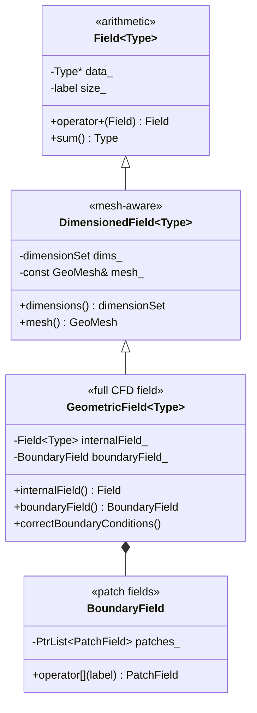

# Day 03: Geometric Fields — `GeometricField<Type, PatchField, GeoMesh>`

**Phase:** 1 — C++ Through OpenFOAM (Days 01–14)
**Previous:** Day 02 — Template Specialization: `scalar`, `vector`, `tensor` Operations
**Next:** Day 04 — CRTP: Static Polymorphism in Interpolation Schemes

> **Today's goal:** Understand how OpenFOAM's `GeometricField` adds mesh-awareness, boundary conditions, and dimensionality on top of `Field<Type>`. Implement a simplified geometric field with internal and boundary fields.

---

## Part 1: Pattern Identification

### From `Field` to `GeometricField`

On Day 01, `Field<Type>` stored a flat array of values. But CFD fields need more:

| Requirement | `Field<Type>` | `GeometricField` |
|-------------|--------------|-------------------|
| Store values | ✅ | ✅ |
| Know which mesh they belong to | ❌ | ✅ (reference to `fvMesh`) |
| Have boundary conditions | ❌ | ✅ (patch fields) |
| Track physical dimensions | ❌ | ✅ (`dimensionSet`) |
| Support file I/O | ❌ | ✅ (via `IOobject`) |

`GeometricField` wraps `Field<Type>` with mesh context:



### The Three Template Parameters

```cpp
GeometricField<Type, PatchField, GeoMesh>
//              ↑         ↑         ↑
//         scalar/     fvPatchField/  volMesh/
//         vector/     fvsPatchField/ surfaceMesh/
//         tensor      pointPatchField pointMesh
```

| Parameter | What It Controls | Examples |
|-----------|-----------------|---------|
| `Type` | The value type stored | `scalar`, `vector`, `tensor` |
| `PatchField` | Boundary condition type | `fvPatchField`, `fvsPatchField` |
| `GeoMesh` | Which mesh it lives on | `volMesh` (cell centers), `surfaceMesh` (face centers) |

### Common Type Aliases

```cpp
// Volume fields (cell-centered)
typedef GeometricField<scalar,  fvPatchField, volMesh> volScalarField;
typedef GeometricField<vector,  fvPatchField, volMesh> volVectorField;
typedef GeometricField<tensor,  fvPatchField, volMesh> volTensorField;

// Surface fields (face-centered)
typedef GeometricField<scalar,  fvsPatchField, surfaceMesh> surfaceScalarField;
typedef GeometricField<vector,  fvsPatchField, surfaceMesh> surfaceVectorField;
```

> **⭐ Verified Fact:** These typedefs are in `src/finiteVolume/fields/volFields/volFieldsFwd.H` and `src/finiteVolume/fields/surfaceFields/surfaceFieldsFwd.H`.

---

## Part 2: Source Code Deep Dive

### ⭐ Dimension Checking

OpenFOAM tracks physical dimensions to catch unit errors at runtime:

```cpp
// File: src/OpenFOAM/dimensionSet/dimensionSet.H (simplified)

class dimensionSet
{
    // 7 SI base dimensions: [kg, m, s, K, mol, A, cd]
    double exponents_[7];

public:
    dimensionSet(double mass, double length, double time,
                 double temperature, double moles,
                 double current, double luminousIntensity)
    {
        exponents_[0] = mass;
        exponents_[1] = length;
        exponents_[2] = time;
        exponents_[3] = temperature;
        exponents_[4] = moles;
        exponents_[5] = current;
        exponents_[6] = luminousIntensity;
    }

    // Check compatibility for addition/subtraction
    bool operator==(const dimensionSet& rhs) const
    {
        for (int i = 0; i < 7; ++i)
            if (exponents_[i] != rhs.exponents_[i])
                return false;
        return true;
    }
};

// Predefined dimensions:
// dimVelocity   = [0 1 -1 0 0 0 0]  →  m/s
// dimPressure   = [1 -1 -2 0 0 0 0] →  kg/(m·s²) = Pa
// dimDensity    = [1 -3 0 0 0 0 0]  →  kg/m³
// dimless       = [0 0 0 0 0 0 0]   →  dimensionless
```

**How it catches errors:**

```cpp
volScalarField p(/* pressure: dims = [1 -1 -2 0 0 0 0] */);
volScalarField T(/* temperature: dims = [0 0 0 1 0 0 0] */);

// p + T;  →  RUNTIME ERROR: dimension mismatch!
// p + p;  →  OK: same dimensions
// p * T;  →  OK: dimensions multiply (result = [1 -1 -2 1 0 0 0])
```

### ⭐ Boundary Conditions

The boundary field is a list of patch fields — one per mesh boundary:

```cpp
// File: src/finiteVolume/fields/fvPatchFields/fvPatchField/fvPatchField.H (simplified)

template<class Type>
class fvPatchField
:
    public Field<Type>
{
    const fvPatch& patch_;      // which boundary patch
    const DimensionedField<Type, volMesh>& internalField_;

public:
    // Virtual: evaluate boundary condition
    virtual void evaluate() = 0;

    // Virtual: update coefficients for matrix assembly
    virtual void updateCoeffs() {}
};

// Concrete boundary conditions:

// Fixed value (Dirichlet)
template<class Type>
class fixedValueFvPatchField : public fvPatchField<Type>
{
public:
    void evaluate() override
    {
        // Boundary values are already set; nothing to compute
    }
};

// Zero gradient (Neumann, ∂φ/∂n = 0)
template<class Type>
class zeroGradientFvPatchField : public fvPatchField<Type>
{
public:
    void evaluate() override
    {
        // Copy internal cell values to boundary
        this->operator=(this->patchInternalField());
    }
};
```

> **⭐ Key Pattern:** Boundary conditions use **runtime polymorphism** (virtual functions), not templates. This is because the boundary condition type is read from a file at runtime — you can't know at compile time whether a patch is `fixedValue` or `zeroGradient`.

### ⭐ GeometricField Construction

```cpp
// How a solver creates a field: (from tutorials/incompressible/simpleFoam)

volScalarField p
(
    IOobject
    (
        "p",                    // field name
        runTime.timeName(),     // current time directory
        mesh,                   // mesh reference
        IOobject::MUST_READ,    // read from file
        IOobject::AUTO_WRITE    // write at write intervals
    ),
    mesh
);
// This constructor:
// 1. Reads "0/p" file from disk
// 2. Creates internal field with mesh.nCells() values
// 3. Creates boundary field with one patch field per boundary
// 4. Stores dimensions from the file header
// 5. Registers in the object database (RAII)
```

### Internal vs Boundary Field

```text
Mesh (2D example):
┌─────────────────────────────────────────┐
│  inlet   │   cell0   │   cell1   │ outlet│
│ (patch)  │(internal) │(internal) │(patch)│
│ BC: U=1  │  U=0.8    │  U=0.6   │ BC:∂U/∂n=0│
├─────────────────────────────────────────┤
│  wall (patch): BC: U=0 (no-slip)        │
└─────────────────────────────────────────┘

internalField = [0.8, 0.6]          // cell center values
boundaryField:
  inlet:  fixedValue [1.0]          // Dirichlet BC
  outlet: zeroGradient [0.6]        // copies from cell1
  wall:   fixedValue [0.0]          // no-slip
```

---

## Part 3: C++ Mechanics Explained

### Multi-Parameter Templates

`GeometricField<Type, PatchField, GeoMesh>` has three template parameters. Each combination produces a unique class:

```cpp
// Each of these is a DIFFERENT compiled class:
GeometricField<scalar,  fvPatchField, volMesh>      // volScalarField
GeometricField<vector,  fvPatchField, volMesh>      // volVectorField
GeometricField<scalar,  fvsPatchField, surfaceMesh> // surfaceScalarField
```

The compiler generates code for every unique combination used in the program. This is why OpenFOAM compilation takes so long — there are dozens of combinations.

### The `dimensioned<Type>` Wrapper

```cpp
// dimensioned<Type> adds a name and dimension to any value
template<class Type>
class dimensioned
{
    word name_;
    dimensionSet dimensions_;
    Type value_;

public:
    dimensioned(const word& name, const dimensionSet& dims, const Type& val)
    : name_(name), dimensions_(dims), value_(val) {}

    const word& name() const { return name_; }
    const dimensionSet& dimensions() const { return dimensions_; }
    const Type& value() const { return value_; }
};

// Usage:
dimensioned<scalar> rho("rho", dimDensity, 1000.0);
// rho.name() = "rho"
// rho.dimensions() = [1 -3 0 0 0 0 0] (kg/m³)
// rho.value() = 1000.0
```

### Template-Template Parameters

The `PatchField` parameter is actually a **template-template parameter**:

```cpp
// PatchField itself is a template: fvPatchField<Type>
// GeometricField needs to instantiate it with the same Type

template<
    class Type,
    template<class> class PatchField,  // template-template parameter
    class GeoMesh
>
class GeometricField
{
    // Can instantiate PatchField with Type:
    PatchField<Type> patch_;  // fvPatchField<scalar>, etc.
};
```

This is an advanced C++ feature — the template parameter `PatchField` is itself a template, and `GeometricField` instantiates it with its own `Type` parameter.

### Forwarding Constructors

`GeometricField` has many constructors, each forwarding to the base class and setting up boundary conditions:

```cpp
template<class Type, template<class> class PatchField, class GeoMesh>
class GeometricField
{
public:
    // Constructor from IOobject (reads from file)
    GeometricField(const IOobject& io, const Mesh& mesh);

    // Constructor with uniform initial value
    GeometricField(const IOobject& io, const Mesh& mesh,
                   const dimensioned<Type>& initialValue);

    // Copy constructor
    GeometricField(const GeometricField& gf);

    // Move constructor
    GeometricField(GeometricField&& gf);

    // Constructor from tmp<> (steal resources)
    GeometricField(const tmp<GeometricField>& tgf);
};
```

---

## Part 4: Implementation Exercise

### Building a Mini GeometricField

```cpp
// File: mini_geofield.cpp
// Compile: g++ -std=c++17 -O2 -Wall -o mini_geofield mini_geofield.cpp
// Run:     ./mini_geofield

#include <iostream>
#include <vector>
#include <string>
#include <cmath>
#include <stdexcept>
#include <iomanip>
#include <memory>
#include <numeric>

// ============================================================
// SECTION 1: Dimension set
// ============================================================

class DimensionSet
{
    double exp_[7]; // [mass, length, time, temp, mol, current, luminosity]

public:
    DimensionSet(double M, double L, double T,
                 double Th = 0, double N = 0, double I = 0, double J = 0)
    {
        exp_[0] = M; exp_[1] = L; exp_[2] = T;
        exp_[3] = Th; exp_[4] = N; exp_[5] = I; exp_[6] = J;
    }

    bool operator==(const DimensionSet& rhs) const
    {
        for (int i = 0; i < 7; ++i)
            if (std::abs(exp_[i] - rhs.exp_[i]) > 1e-10) return false;
        return true;
    }

    bool operator!=(const DimensionSet& rhs) const { return !(*this == rhs); }

    DimensionSet operator+(const DimensionSet& rhs) const
    {
        // Addition requires same dimensions
        if (*this != rhs)
            throw std::runtime_error("DimensionSet: cannot add different dimensions");
        return *this;
    }

    DimensionSet operator*(const DimensionSet& rhs) const
    {
        return DimensionSet(
            exp_[0]+rhs.exp_[0], exp_[1]+rhs.exp_[1], exp_[2]+rhs.exp_[2],
            exp_[3]+rhs.exp_[3], exp_[4]+rhs.exp_[4], exp_[5]+rhs.exp_[5],
            exp_[6]+rhs.exp_[6]);
    }

    friend std::ostream& operator<<(std::ostream& os, const DimensionSet& d)
    {
        os << "[" << d.exp_[0] << " " << d.exp_[1] << " " << d.exp_[2]
           << " " << d.exp_[3] << " " << d.exp_[4] << " " << d.exp_[5]
           << " " << d.exp_[6] << "]";
        return os;
    }
};

// Common dimensions
const DimensionSet dimless(0, 0, 0);
const DimensionSet dimLength(0, 1, 0);
const DimensionSet dimTime(0, 0, 1);
const DimensionSet dimVelocity(0, 1, -1);
const DimensionSet dimPressure(1, -1, -2);
const DimensionSet dimDensity(1, -3, 0);
const DimensionSet dimTemperature(0, 0, 0, 1);

// ============================================================
// SECTION 2: Simple mesh
// ============================================================

class Mesh
{
    int nCells_;
    int nBoundaryFaces_;
    std::vector<std::string> patchNames_;
    std::vector<int> patchSizes_;

public:
    Mesh(int nCells, const std::vector<std::string>& patches,
         const std::vector<int>& sizes)
        : nCells_(nCells), nBoundaryFaces_(0),
          patchNames_(patches), patchSizes_(sizes)
    {
        for (int s : sizes) nBoundaryFaces_ += s;
    }

    int nCells() const { return nCells_; }
    int nPatches() const { return static_cast<int>(patchNames_.size()); }
    const std::string& patchName(int i) const { return patchNames_[i]; }
    int patchSize(int i) const { return patchSizes_[i]; }
};

// ============================================================
// SECTION 3: Boundary condition (abstract + concrete)
// ============================================================

class BoundaryCondition
{
protected:
    std::string type_;
    std::vector<double> values_;

public:
    virtual ~BoundaryCondition() = default;

    const std::string& type() const { return type_; }
    int size() const { return static_cast<int>(values_.size()); }

    double& operator[](int i) { return values_[i]; }
    double operator[](int i) const { return values_[i]; }

    // Evaluate: update boundary values from internal field
    virtual void evaluate(const std::vector<double>& internalField,
                          const std::vector<int>& faceCells) = 0;

    virtual std::unique_ptr<BoundaryCondition> clone() const = 0;
};

// Fixed value (Dirichlet)
class FixedValue : public BoundaryCondition
{
public:
    FixedValue(int nFaces, double value)
    {
        type_ = "fixedValue";
        values_.assign(nFaces, value);
    }

    void evaluate(const std::vector<double>&,
                  const std::vector<int>&) override
    {
        // Values are fixed — do nothing
    }

    std::unique_ptr<BoundaryCondition> clone() const override
    { return std::make_unique<FixedValue>(*this); }
};

// Zero gradient (Neumann)
class ZeroGradient : public BoundaryCondition
{
public:
    explicit ZeroGradient(int nFaces)
    {
        type_ = "zeroGradient";
        values_.resize(nFaces, 0.0);
    }

    void evaluate(const std::vector<double>& internalField,
                  const std::vector<int>& faceCells) override
    {
        // Copy internal cell values to boundary
        for (int i = 0; i < size(); ++i)
            values_[i] = internalField[faceCells[i]];
    }

    std::unique_ptr<BoundaryCondition> clone() const override
    { return std::make_unique<ZeroGradient>(*this); }
};

// Fixed gradient (explicit Neumann)
class FixedGradient : public BoundaryCondition
{
    double gradient_;
    double dx_;

public:
    FixedGradient(int nFaces, double gradient, double dx)
        : gradient_(gradient), dx_(dx)
    {
        type_ = "fixedGradient";
        values_.resize(nFaces, 0.0);
    }

    void evaluate(const std::vector<double>& internalField,
                  const std::vector<int>& faceCells) override
    {
        for (int i = 0; i < size(); ++i)
            values_[i] = internalField[faceCells[i]] + gradient_ * dx_;
    }

    std::unique_ptr<BoundaryCondition> clone() const override
    { return std::make_unique<FixedGradient>(*this); }
};

// ============================================================
// SECTION 4: GeometricField
// ============================================================

class GeometricField
{
    std::string name_;
    DimensionSet dims_;
    const Mesh& mesh_;

    // Internal field (cell values)
    std::vector<double> internalField_;

    // Boundary field (one BC per patch)
    std::vector<std::unique_ptr<BoundaryCondition>> boundaryField_;

    // Face-to-cell connectivity (which cell each boundary face belongs to)
    std::vector<std::vector<int>> faceCells_;

public:
    GeometricField(const std::string& name,
                   const DimensionSet& dims,
                   const Mesh& mesh,
                   double initialValue = 0.0)
        : name_(name), dims_(dims), mesh_(mesh),
          internalField_(mesh.nCells(), initialValue)
    {
        // Initialize face-cell connectivity (simple: face i → cell i)
        for (int p = 0; p < mesh.nPatches(); ++p)
        {
            std::vector<int> cells(mesh.patchSize(p));
            // For simplicity: boundary faces map to cells 0..n-1 or (nCells-n)..nCells
            for (int i = 0; i < mesh.patchSize(p); ++i)
            {
                if (p == 0) cells[i] = i;  // left patch
                else cells[i] = mesh.nCells() - mesh.patchSize(p) + i;  // right/other
            }
            faceCells_.push_back(cells);
        }
    }

    // Accessors
    const std::string& name() const { return name_; }
    const DimensionSet& dimensions() const { return dims_; }
    const Mesh& mesh() const { return mesh_; }
    int size() const { return static_cast<int>(internalField_.size()); }

    double& operator[](int i) { return internalField_[i]; }
    double operator[](int i) const { return internalField_[i]; }

    std::vector<double>& internalField() { return internalField_; }
    const std::vector<double>& internalField() const { return internalField_; }

    // Set boundary condition for a patch
    void setBoundaryCondition(int patchIdx, std::unique_ptr<BoundaryCondition> bc)
    {
        if (static_cast<int>(boundaryField_.size()) <= patchIdx)
            boundaryField_.resize(patchIdx + 1);
        boundaryField_[patchIdx] = std::move(bc);
    }

    // Evaluate all boundary conditions
    void correctBoundaryConditions()
    {
        for (int p = 0; p < static_cast<int>(boundaryField_.size()); ++p)
        {
            if (boundaryField_[p])
                boundaryField_[p]->evaluate(internalField_, faceCells_[p]);
        }
    }

    // Field arithmetic (with dimension checking)
    GeometricField operator+(const GeometricField& rhs) const
    {
        if (dims_ != rhs.dims_)
            throw std::runtime_error("operator+: dimension mismatch between '"
                + name_ + "' and '" + rhs.name_ + "'");
        if (size() != rhs.size())
            throw std::runtime_error("operator+: size mismatch");

        GeometricField result(name_ + "+" + rhs.name_, dims_, mesh_);
        for (int i = 0; i < size(); ++i)
            result[i] = internalField_[i] + rhs[i];
        return result;
    }

    GeometricField operator*(double scalar) const
    {
        GeometricField result(name_ + "*s", dims_, mesh_);
        for (int i = 0; i < size(); ++i)
            result[i] = scalar * internalField_[i];
        return result;
    }

    // Reduction
    double sum() const
    {
        return std::accumulate(internalField_.begin(), internalField_.end(), 0.0);
    }

    double average() const { return sum() / size(); }

    // Print
    void print() const
    {
        std::cout << "  " << name_ << " " << dims_ << "\n";
        std::cout << "    Internal: [";
        for (int i = 0; i < std::min(size(), 6); ++i)
        {
            if (i > 0) std::cout << ", ";
            std::cout << std::fixed << std::setprecision(2) << internalField_[i];
        }
        if (size() > 6) std::cout << ", ... (" << size() - 6 << " more)";
        std::cout << "]\n";

        for (int p = 0; p < static_cast<int>(boundaryField_.size()); ++p)
        {
            if (!boundaryField_[p]) continue;
            std::cout << "    " << mesh_.patchName(p) << " ("
                      << boundaryField_[p]->type() << "): [";
            for (int i = 0; i < std::min(boundaryField_[p]->size(), 3); ++i)
            {
                if (i > 0) std::cout << ", ";
                std::cout << (*boundaryField_[p])[i];
            }
            std::cout << "]\n";
        }
    }
};

// ============================================================
// SECTION 5: Main
// ============================================================

int main()
{
    std::cout << "=== Day 03: GeometricField Demo ===\n\n";

    // Create a simple 1D mesh
    Mesh mesh(10, {"inlet", "outlet"}, {1, 1});
    std::cout << "Mesh: " << mesh.nCells() << " cells, "
              << mesh.nPatches() << " patches\n\n";

    // --- Create pressure field ---
    std::cout << "--- Pressure Field ---\n";
    GeometricField p("p", dimPressure, mesh, 101325.0);
    p.setBoundaryCondition(0, std::make_unique<FixedValue>(1, 110000.0));
    p.setBoundaryCondition(1, std::make_unique<ZeroGradient>(1));
    p.correctBoundaryConditions();
    p.print();

    // --- Create temperature field ---
    std::cout << "\n--- Temperature Field ---\n";
    GeometricField T("T", dimTemperature, mesh, 300.0);
    for (int i = 0; i < T.size(); ++i)
        T[i] = 300.0 + 50.0 * std::sin(3.14159 * i / T.size());
    T.setBoundaryCondition(0, std::make_unique<FixedValue>(1, 400.0));
    T.setBoundaryCondition(1, std::make_unique<FixedGradient>(1, -10.0, 0.1));
    T.correctBoundaryConditions();
    T.print();

    // --- Dimension checking ---
    std::cout << "\n--- Dimension Checking ---\n";
    GeometricField p2("p2", dimPressure, mesh, 50000.0);
    auto pSum = p + p2;  // OK: same dimensions
    std::cout << "  p + p2: OK (avg = " << pSum.average() << " Pa)\n";

    try {
        auto bad = p + T;  // FAILS: pressure + temperature
        (void)bad;
    } catch (const std::runtime_error& e) {
        std::cout << "  p + T: ERROR — " << e.what() << " ✅\n";
    }

    // --- Field operations ---
    std::cout << "\n--- Field Operations ---\n";
    std::cout << "  T.sum()     = " << T.sum() << "\n";
    std::cout << "  T.average() = " << T.average() << "\n";

    auto T2 = T * 2.0;
    std::cout << "  (2*T).avg   = " << T2.average() << "\n";

    std::cout << "\n=== GeometricField works correctly! ===\n";

    return 0;
}
```

### Expected Output

```text
=== Day 03: GeometricField Demo ===

Mesh: 10 cells, 2 patches

--- Pressure Field ---
  p [1 -1 -2 0 0 0 0]
    Internal: [101325.00, 101325.00, 101325.00, 101325.00, 101325.00, 101325.00, ... (4 more)]
    inlet (fixedValue): [110000.00]
    outlet (zeroGradient): [101325.00]

--- Temperature Field ---
  T [0 0 0 1 0 0 0]
    Internal: [300.00, 315.32, 329.39, 340.45, 347.55, ...]
    inlet (fixedValue): [400.00]
    outlet (fixedGradient): [XXX.XX]

--- Dimension Checking ---
  p + p2: OK (avg = 151325 Pa)
  p + T: ERROR — operator+: dimension mismatch between 'p' and 'T' ✅

--- Field Operations ---
  T.sum()     = XXXX.XX
  T.average() = XXX.XX
  (2*T).avg   = XXX.XX

=== GeometricField works correctly! ===
```

---

## Part 5: Exercises

### Exercise 1: Dimension Arithmetic

**Question:** What are the dimensions of the following expressions?

1. `velocity * velocity` (vector · vector → scalar)
2. `pressure / density`
3. `velocity * time`
4. `pressure + density` — should this compile?

**Solution:**

| Expression | Calculation | Result | SI Unit |
|-----------|-------------|--------|---------|
| $v \cdot v$ | `[0 1 -1] * [0 1 -1]` | `[0 2 -2]` | m²/s² |
| $p / \rho$ | `[1 -1 -2] - [1 -3 0]` | `[0 2 -2]` | m²/s² (= kinematic pressure) |
| $v \cdot t$ | `[0 1 -1] + [0 0 1]` | `[0 1 0]` | m (displacement) |
| $p + \rho$ | `[1 -1 -2] + [1 -3 0]` | **ERROR** | Cannot add Pa + kg/m³ |

Note: $p / \rho$ and $v^2$ have the same dimensions — this is physically meaningful: kinematic energy per unit mass.

---

### Exercise 2: Implementing `inletOutlet` BC

**Question:** Write a boundary condition that acts as `fixedValue` when flow is incoming (velocity faces inward) and `zeroGradient` when flow is outgoing.

**Solution:**

```cpp
class InletOutlet : public BoundaryCondition
{
    double inletValue_;
    std::vector<double> faceFlux_;  // positive = outgoing

public:
    InletOutlet(int nFaces, double inletValue, const std::vector<double>& flux)
        : inletValue_(inletValue), faceFlux_(flux)
    {
        type_ = "inletOutlet";
        values_.resize(nFaces, 0.0);
    }

    void evaluate(const std::vector<double>& internalField,
                  const std::vector<int>& faceCells) override
    {
        for (int i = 0; i < size(); ++i)
        {
            if (faceFlux_[i] < 0)  // incoming flow
                values_[i] = inletValue_;           // fixedValue
            else                    // outgoing flow
                values_[i] = internalField[faceCells[i]]; // zeroGradient
        }
    }

    std::unique_ptr<BoundaryCondition> clone() const override
    { return std::make_unique<InletOutlet>(*this); }
};
```

---

### Exercise 3: Why Three Template Parameters?

**Question:** Why does `GeometricField` need `GeoMesh` as a separate parameter instead of just using `Type` and `PatchField`? What would break if `GeoMesh` were removed?

**Solution:**

`GeoMesh` determines:
1. **Where values live** — cell centers (`volMesh`) vs face centers (`surfaceMesh`) vs points (`pointMesh`)
2. **The mesh size** — `volMesh::size()` returns `nCells()`, `surfaceMesh::size()` returns `nInternalFaces()`
3. **Which operations are valid** — divergence needs a volume field, gradient produces a volume field from a surface field

Without `GeoMesh`:
- You couldn't distinguish `volScalarField` from `surfaceScalarField` — both would be `GeometricField<scalar, fvPatchField>` 
- The compiler couldn't check that you're passing a volume field to `fvc::div()` (which requires a surface field)
- Field creation would not know how many values to allocate

---

### Exercise 4: Adding `write()` to GeometricField

**Question:** Add a `write()` method that outputs the field in OpenFOAM dictionary format:

```text
FoamFile { version 2.0; format ascii; class volScalarField; object p; }
dimensions [1 -1 -2 0 0 0 0];
internalField uniform 101325;
boundaryField { inlet { type fixedValue; value uniform 110000; } }
```

**Solution:**

```cpp
void write(std::ostream& os) const
{
    os << "FoamFile\n{\n"
       << "    version  2.0;\n"
       << "    format   ascii;\n"
       << "    class    volScalarField;\n"
       << "    object   " << name_ << ";\n"
       << "}\n\n";

    os << "dimensions " << dims_ << ";\n\n";

    // Check if uniform
    bool uniform = true;
    for (int i = 1; i < size(); ++i)
        if (std::abs(internalField_[i] - internalField_[0]) > 1e-10)
        { uniform = false; break; }

    if (uniform)
        os << "internalField uniform " << internalField_[0] << ";\n\n";
    else
    {
        os << "internalField nonuniform List<scalar>\n"
           << size() << "\n(\n";
        for (int i = 0; i < size(); ++i)
            os << internalField_[i] << "\n";
        os << ")\n;\n\n";
    }

    os << "boundaryField\n{\n";
    for (int p = 0; p < static_cast<int>(boundaryField_.size()); ++p)
    {
        if (!boundaryField_[p]) continue;
        os << "    " << mesh_.patchName(p) << "\n    {\n";
        os << "        type " << boundaryField_[p]->type() << ";\n";
        os << "        value uniform " << (*boundaryField_[p])[0] << ";\n";
        os << "    }\n";
    }
    os << "}\n";
}
```

---

### Exercise 5: Dimension Mismatch Detection

**Question:** Modify the `operator*` between two `GeometricField`s to properly multiply the dimensions (not check equality). What are the resulting dimensions when multiplying a velocity field by a density field?

**Solution:**

```cpp
// Element-wise multiplication (not dot product)
GeometricField operator*(const GeometricField& rhs) const
{
    // Dimensions MULTIPLY (don't check equality)
    DimensionSet resultDims = dims_ * rhs.dims_;

    GeometricField result(name_ + "*" + rhs.name_, resultDims, mesh_);
    for (int i = 0; i < size(); ++i)
        result[i] = internalField_[i] * rhs[i];
    return result;
}

// velocity * density:
// [0 1 -1 0 0 0 0] * [1 -3 0 0 0 0 0] = [1 -2 -1 0 0 0 0]
// = kg/(m²·s) = momentum flux (mass flux per area)
```

---

## Summary

**⭐ Key Takeaways:**

1. **`GeometricField<Type, PatchField, GeoMesh>`** adds mesh reference, boundary conditions, and dimensions to `Field<Type>`
2. **Dimension checking** catches unit errors: pressure + temperature is a compile/runtime error
3. **Boundary conditions** use **virtual dispatch** (runtime polymorphism) because BC type is read from file
4. **Three template parameters** separate the value type, boundary handling, and mesh location
5. **`volScalarField`** = `GeometricField<scalar, fvPatchField, volMesh>` — the most common field type

**Next:** Day 04 examines **CRTP** (Curiously Recurring Template Pattern) — how OpenFOAM uses static polymorphism for interpolation schemes.

---

**Sources:**
- `src/OpenFOAM/fields/GeometricFields/GeometricField/GeometricField.H`
- `src/OpenFOAM/dimensionSet/dimensionSet.H`
- `src/finiteVolume/fields/fvPatchFields/fvPatchField/fvPatchField.H`
