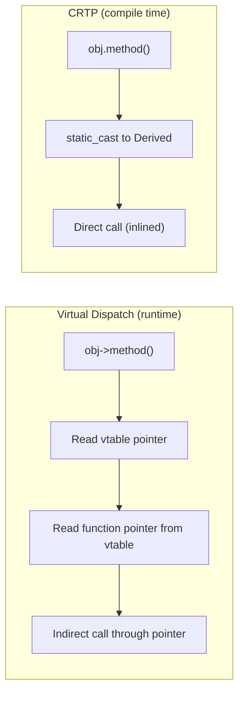

# Day 04: CRTP — Static Polymorphism in Interpolation Schemes

**Phase:** 1 — C++ Through OpenFOAM (Days 01–14)
**Previous:** Day 03 — Geometric Fields: `GeometricField<Type, PatchField, GeoMesh>`
**Next:** Day 05 — Policy-Based Design: Limiter Strategies

> **Today's goal:** Understand the Curiously Recurring Template Pattern (CRTP), how it enables static polymorphism with zero runtime overhead, and how OpenFOAM uses it for interpolation schemes and turbulence models.

---

## Part 1: Pattern Identification

### The Polymorphism Dilemma

On Day 03, boundary conditions used **virtual dispatch** (runtime polymorphism). This is correct — BC types are read from files at runtime. But for performance-critical code that runs millions of times per iteration, virtual dispatch is costly:

| Feature | Virtual Dispatch | Templates (CRTP) |
|---------|-----------------|-------------------|
| Dispatch mechanism | vtable (indirect function call) | Direct call (inlined) |
| Overhead per call | ~2–5 ns | 0 ns (inlined) |
| Known at | Runtime | Compile time |
| Can mix types | ✅ (`vector<Base*>`) | ❌ (each type is separate) |
| Inlining | ❌ (compiler can't see through vtable) | ✅ (fully inlined) |
| Code bloat | Low (one copy of function) | Higher (one copy per type) |

For interpolation schemes called per-face, per-iteration, virtual dispatch adds unacceptable overhead. CRTP eliminates it.

### What Is CRTP?

CRTP = **Curiously Recurring Template Pattern**: a class inherits from a template that is parameterized by the class itself.

```cpp
// The "curious" part: Derived inherits from Base<Derived>
template<class Derived>
class Base {
public:
    void interface() {
        // Call the derived class's implementation — at COMPILE TIME
        static_cast<Derived*>(this)->implementation();
    }
};

class Concrete : public Base<Concrete> {
public:
    void implementation() {
        std::cout << "Concrete::implementation()\n";
    }
};
```

The template parameter `Derived` tells the base class which derived class it's working with. The `static_cast` is safe because `Concrete` IS-A `Base<Concrete>`.

### How It Replaces Virtual Functions



> **⭐ Key Insight:** CRTP moves the dispatch decision from runtime to compile time. The compiler knows which `Derived` class to call at the template instantiation point, so it can generate a direct function call — or better, inline the entire function body.

---

## Part 2: Source Code Deep Dive

### ⭐ OpenFOAM's `surfaceInterpolationScheme`

Interpolation schemes compute face values from cell values. The base class uses CRTP:

```cpp
// File: src/finiteVolume/interpolation/surfaceInterpolation/
//       surfaceInterpolationScheme/surfaceInterpolationScheme.H (simplified)

template<class Type>
class surfaceInterpolationScheme
:
    public tmp<surfaceInterpolationScheme<Type>>::refCount
{
public:
    virtual ~surfaceInterpolationScheme() = default;

    // ⭐ The key virtual method: compute face weights
    virtual tmp<surfaceScalarField> weights
    (
        const GeometricField<Type, fvPatchField, volMesh>& phi
    ) const = 0;

    // Non-virtual: uses weights to interpolate
    tmp<GeometricField<Type, fvsPatchField, surfaceMesh>>
    interpolate
    (
        const GeometricField<Type, fvPatchField, volMesh>& phi
    ) const;
};
```

### ⭐ Linear Interpolation (Simple Case)

```cpp
// File: src/finiteVolume/interpolation/surfaceInterpolation/schemes/
//       linear/linear.H (simplified)

template<class Type>
class linear
:
    public surfaceInterpolationScheme<Type>
{
public:
    // ⭐ Return uniform weights of 0.5 (central differencing)
    virtual tmp<surfaceScalarField> weights
    (
        const GeometricField<Type, fvPatchField, volMesh>&
    ) const
    {
        return this->mesh().surfaceInterpolation::weights();
        // Returns pre-computed geometric weights based on cell-to-face distances
    }
};
```

### ⭐ Upwind Scheme (Uses Flux Direction)

```cpp
// File: src/finiteVolume/interpolation/surfaceInterpolation/schemes/
//       upwind/upwind.H (simplified)

template<class Type>
class upwind
:
    public surfaceInterpolationScheme<Type>
{
    const surfaceScalarField& faceFlux_;

public:
    upwind(const fvMesh& mesh, const surfaceScalarField& flux)
    : surfaceInterpolationScheme<Type>(mesh), faceFlux_(flux) {}

    // ⭐ Weights are 0 or 1 depending on flow direction
    virtual tmp<surfaceScalarField> weights
    (
        const GeometricField<Type, fvPatchField, volMesh>&
    ) const
    {
        // weight = 1.0 if flux is positive (use owner cell)
        // weight = 0.0 if flux is negative (use neighbour cell)
        return pos0(faceFlux_);  // returns 1 where flux >= 0, else 0
    }
};
```

### CRTP for Limiter Functions

TVD limiters use CRTP for static polymorphism. The limiter function is the hottest code — called once per face, per variable, per iteration:

```cpp
// Pseudo-code for OpenFOAM limiter CRTP pattern

template<class LimiterFunc>
class LimitedScheme
:
    public surfaceInterpolationScheme<scalar>
{
public:
    tmp<surfaceScalarField> weights(...) const override
    {
        // For each face:
        for (label facei = 0; facei < nFaces; ++facei)
        {
            scalar r = computeR(facei);  // gradient ratio

            // ⭐ CRTP call — resolved at compile time, inlined!
            scalar limiterValue = LimiterFunc::limiter(r);

            weights[facei] = 0.5 * (1.0 + limiterValue);
        }
    }
};

// Concrete limiters (no virtual, no inheritance, just static functions)
struct vanLeer
{
    static scalar limiter(scalar r)
    {
        return (r + mag(r)) / (1.0 + mag(r));
    }
};

struct minmod
{
    static scalar limiter(scalar r)
    {
        return max(0, min(r, 1));
    }
};

// Usage: LimitedScheme<vanLeer> or LimitedScheme<minmod>
// The limiter() call is inlined directly into the face loop!
```

> **⭐ Performance Impact:** Each face loop iteration calls `limiter()`. With virtual dispatch, this is an indirect call (~5 ns) × millions of faces = significant overhead. With CRTP, the call is inlined to ~1 instruction.

---

## Part 3: C++ Mechanics Explained

### The `static_cast` Safety Guarantee

```cpp
template<class Derived>
class Base {
public:
    void doWork() {
        // This cast is SAFE because Derived inherits from Base<Derived>
        Derived& self = static_cast<Derived&>(*this);
        self.work();
    }
};

class Good : public Base<Good> {  // ✅ Safe: Good IS-A Base<Good>
    void work() { /* ... */ }
};

class Bad : public Base<Good> {   // ❌ BUG: Bad inherits Base<Good>, not Base<Bad>
    void work() { /* ... */ }      // static_cast would cast to Good, not Bad!
};
```

**Protection:** C++20 concepts can prevent the `Bad` case:

```cpp
template<class Derived>
class Base {
    // Ensure Derived actually inherits from Base<Derived>
    Base() {
        static_assert(std::is_base_of_v<Base<Derived>, Derived>,
            "CRTP violation: Derived must inherit from Base<Derived>");
    }
};
```

### CRTP vs `virtual` — Compile-Time View

```cpp
// Virtual: ONE vtable, MANY objects
class Animal {
public:
    virtual void speak() = 0;  // vtable entry
};
class Dog : public Animal { void speak() override { /*...*/ } };
class Cat : public Animal { void speak() override { /*...*/ } };

// CRTP: MANY classes, NO vtable
template<class D>
class AnimalCRTP {
public:
    void speak() { static_cast<D*>(this)->speakImpl(); }
};
class DogCRTP : public AnimalCRTP<DogCRTP> {
    friend class AnimalCRTP<DogCRTP>;
    void speakImpl() { /*...*/ }
};
class CatCRTP : public AnimalCRTP<CatCRTP> {
    friend class AnimalCRTP<CatCRTP>;
    void speakImpl() { /*...*/ }
};
```

Key difference: `Dog` and `Cat` share a common base `Animal` and can be stored in the same container (`vector<Animal*>`). `DogCRTP` and `CatCRTP` have **different base types** (`AnimalCRTP<DogCRTP>` vs `AnimalCRTP<CatCRTP>`) and **cannot** be stored together.

### When to Use Each

| Use Case | Mechanism | Why |
|----------|-----------|-----|
| Boundary conditions | Virtual dispatch | Type chosen at runtime from file |
| Interpolation weights | CRTP | Called millions of times, must inline |
| Turbulence models | Virtual dispatch | Selected by user at runtime |
| Limiter functions | CRTP / static | Hottest inner loop, must inline |
| Field operators | Templates | Type-generic, zero overhead |

### Mixin Pattern with CRTP

CRTP is also used to add functionality to classes without virtual dispatch — the **mixin** pattern:

```cpp
// Counter mixin: adds reference counting to any class
template<class Derived>
class Countable {
    int count_ = 0;
public:
    void addRef() { ++count_; }
    void removeRef() {
        if (--count_ == 0)
            delete static_cast<Derived*>(this);
    }
    int refCount() const { return count_; }
};

class MyObject : public Countable<MyObject> {
    // MyObject now has reference counting
    // No virtual destructor needed!
};
```

> **⭐ OpenFOAM uses this pattern:** `tmp<T>::refCount` is a CRTP mixin that adds reference counting to field types.

---

## Part 4: Implementation Exercise

### CRTP Interpolation Framework

```cpp
// File: crtp_interpolation.cpp
// Compile: g++ -std=c++17 -O2 -Wall -o crtp_interpolation crtp_interpolation.cpp
// Run:     ./crtp_interpolation

#include <iostream>
#include <vector>
#include <cmath>
#include <string>
#include <chrono>
#include <iomanip>
#include <algorithm>
#include <numeric>

// ============================================================
// SECTION 1: Simple 1D mesh
// ============================================================

struct Face
{
    int owner;      // cell on one side
    int neighbour;  // cell on other side
    double weight;  // geometric weight (distance ratio)
};

struct Mesh1D
{
    int nCells;
    int nFaces;
    std::vector<Face> faces;
    std::vector<double> cellCentres;
    std::vector<double> faceCentres;

    Mesh1D(int n, double length = 1.0) : nCells(n), nFaces(n - 1)
    {
        double dx = length / n;
        cellCentres.resize(n);
        for (int i = 0; i < n; ++i)
            cellCentres[i] = (i + 0.5) * dx;

        faces.resize(nFaces);
        faceCentres.resize(nFaces);
        for (int i = 0; i < nFaces; ++i)
        {
            faces[i].owner = i;
            faces[i].neighbour = i + 1;
            faceCentres[i] = (i + 1) * dx;
            // Weight: distance ratio (0.5 for uniform mesh)
            double dO = faceCentres[i] - cellCentres[i];
            double dN = cellCentres[i + 1] - faceCentres[i];
            faces[i].weight = dN / (dO + dN);
        }
    }
};

// ============================================================
// SECTION 2: CRTP base for interpolation schemes
// ============================================================

template<class Derived>
class InterpolationScheme
{
public:
    std::string name() const
    {
        return static_cast<const Derived*>(this)->nameImpl();
    }

    // Interpolate cell values to face values
    std::vector<double> interpolate(
        const std::vector<double>& cellValues,
        const Mesh1D& mesh) const
    {
        std::vector<double> faceValues(mesh.nFaces);

        for (int f = 0; f < mesh.nFaces; ++f)
        {
            int o = mesh.faces[f].owner;
            int n = mesh.faces[f].neighbour;
            double w = mesh.faces[f].weight;

            // ⭐ CRTP dispatch — resolved at compile time!
            faceValues[f] = static_cast<const Derived*>(this)->faceValue(
                cellValues[o], cellValues[n], w);
        }

        return faceValues;
    }
};

// ============================================================
// SECTION 3: Concrete interpolation schemes (CRTP)
// ============================================================

// Linear interpolation (central differencing)
class Linear : public InterpolationScheme<Linear>
{
    friend class InterpolationScheme<Linear>;

    std::string nameImpl() const { return "linear"; }

    double faceValue(double owner, double neighbour, double w) const
    {
        return w * owner + (1.0 - w) * neighbour;
    }
};

// Upwind interpolation (uses sign of a flux)
class Upwind : public InterpolationScheme<Upwind>
{
    friend class InterpolationScheme<Upwind>;
    const std::vector<double>& flux_;

    std::string nameImpl() const { return "upwind"; }

    double faceValue(double owner, double neighbour, double /*w*/) const
    {
        // Use owner if flux is positive, neighbour otherwise
        return flux_[0] >= 0 ? owner : neighbour;
    }

public:
    explicit Upwind(const std::vector<double>& flux) : flux_(flux) {}
};

// Downwind (opposite of upwind — used for testing)
class Downwind : public InterpolationScheme<Downwind>
{
    friend class InterpolationScheme<Downwind>;
    const std::vector<double>& flux_;

    std::string nameImpl() const { return "downwind"; }

    double faceValue(double owner, double neighbour, double /*w*/) const
    {
        return flux_[0] >= 0 ? neighbour : owner;
    }

public:
    explicit Downwind(const std::vector<double>& flux) : flux_(flux) {}
};

// ============================================================
// SECTION 4: CRTP TVD limiters
// ============================================================

// Limiter base — provides the limited scheme
template<class LimiterFunc>
class LimitedScheme : public InterpolationScheme<LimitedScheme<LimiterFunc>>
{
    friend class InterpolationScheme<LimitedScheme<LimiterFunc>>;
    const std::vector<double>& flux_;

    std::string nameImpl() const { return LimiterFunc::name(); }

    double faceValue(double owner, double neighbour, double w) const
    {
        double delta = neighbour - owner;
        if (std::abs(delta) < 1e-15 * (std::abs(owner) + 1e-15))
            return w * owner + (1.0 - w) * neighbour;

        // Compute gradient ratio (simplified for 1D uniform mesh)
        double r = owner / (delta + 1e-30);

        // ⭐ CRTP limiter call — inlined by compiler!
        double psi = LimiterFunc::limiter(r);

        // Blend between upwind and central
        double upwind = (flux_[0] >= 0) ? owner : neighbour;
        double central = w * owner + (1.0 - w) * neighbour;
        return upwind + psi * (central - upwind);
    }

public:
    explicit LimitedScheme(const std::vector<double>& flux) : flux_(flux) {}
};

// Concrete limiter functions (just static methods, no virtual)
struct VanLeer
{
    static constexpr const char* name() { return "vanLeer"; }
    static double limiter(double r)
    {
        return (r > 0) ? 2.0 * r / (1.0 + r) : 0.0;
    }
};

struct MinMod
{
    static constexpr const char* name() { return "minmod"; }
    static double limiter(double r)
    {
        return std::max(0.0, std::min(r, 1.0));
    }
};

struct Superbee
{
    static constexpr const char* name() { return "superbee"; }
    static double limiter(double r)
    {
        return std::max({0.0, std::min(2.0*r, 1.0), std::min(r, 2.0)});
    }
};

struct VanAlbada
{
    static constexpr const char* name() { return "vanAlbada"; }
    static double limiter(double r)
    {
        return (r > 0) ? (r*r + r) / (r*r + 1.0) : 0.0;
    }
};

// ============================================================
// SECTION 5: Comparison: CRTP vs virtual dispatch
// ============================================================

// Virtual version for comparison
class VirtualScheme
{
public:
    virtual ~VirtualScheme() = default;
    virtual double faceValue(double owner, double neighbour, double w) const = 0;
    virtual std::string name() const = 0;
};

class VirtualLinear : public VirtualScheme
{
public:
    double faceValue(double o, double n, double w) const override
    { return w * o + (1.0 - w) * n; }
    std::string name() const override { return "virtual_linear"; }
};

// ============================================================
// SECTION 6: Benchmark
// ============================================================

template<class Scheme>
double benchmarkCRTP(const Scheme& scheme, const std::vector<double>& values,
                     const Mesh1D& mesh, int repeat)
{
    volatile double sink = 0;
    auto start = std::chrono::high_resolution_clock::now();
    for (int r = 0; r < repeat; ++r)
    {
        auto fv = scheme.interpolate(values, mesh);
        sink = fv[0];
    }
    auto end = std::chrono::high_resolution_clock::now();
    return std::chrono::duration<double, std::milli>(end - start).count();
}

double benchmarkVirtual(const VirtualScheme& scheme,
                        const std::vector<double>& values,
                        const Mesh1D& mesh, int repeat)
{
    volatile double sink = 0;
    auto start = std::chrono::high_resolution_clock::now();
    for (int r = 0; r < repeat; ++r)
    {
        std::vector<double> fv(mesh.nFaces);
        for (int f = 0; f < mesh.nFaces; ++f)
        {
            int o = mesh.faces[f].owner;
            int n = mesh.faces[f].neighbour;
            double w = mesh.faces[f].weight;
            fv[f] = scheme.faceValue(values[o], values[n], w);
        }
        sink = fv[0];
    }
    auto end = std::chrono::high_resolution_clock::now();
    return std::chrono::duration<double, std::milli>(end - start).count();
}

// ============================================================
// Main
// ============================================================

int main()
{
    std::cout << "=== Day 04: CRTP — Static Polymorphism ===\n\n";

    const int N = 100;
    Mesh1D mesh(N);

    // Create a smooth field
    std::vector<double> phi(N);
    for (int i = 0; i < N; ++i)
        phi[i] = std::sin(2.0 * 3.14159 * i / N);

    std::vector<double> flux(1, 1.0);  // positive flux

    // --- Test each scheme ---
    std::cout << "--- Interpolation Results (first 5 faces) ---\n";

    Linear linear;
    Upwind upwind(flux);
    LimitedScheme<VanLeer> vanLeer(flux);
    LimitedScheme<MinMod> minmod(flux);
    LimitedScheme<Superbee> superbee(flux);

    auto testScheme = [&](auto& scheme) {
        auto fv = scheme.interpolate(phi, mesh);
        std::cout << "  " << std::setw(12) << std::left << scheme.name() << ": ";
        for (int i = 0; i < 5; ++i)
            std::cout << std::fixed << std::setprecision(4) << std::setw(8) << fv[i];
        std::cout << "\n";
    };

    testScheme(linear);
    testScheme(upwind);
    testScheme(vanLeer);
    testScheme(minmod);
    testScheme(superbee);

    // --- Limiter function values ---
    std::cout << "\n--- Limiter Functions φ(r) ---\n";
    std::cout << std::setw(8) << "r";
    std::cout << std::setw(10) << "vanLeer" << std::setw(10) << "minmod"
              << std::setw(10) << "superbee" << std::setw(10) << "vanAlbada" << "\n";

    for (double r : {-0.5, 0.0, 0.25, 0.5, 1.0, 2.0, 4.0})
    {
        std::cout << std::setw(8) << std::fixed << std::setprecision(2) << r;
        std::cout << std::setw(10) << std::setprecision(4) << VanLeer::limiter(r);
        std::cout << std::setw(10) << MinMod::limiter(r);
        std::cout << std::setw(10) << Superbee::limiter(r);
        std::cout << std::setw(10) << VanAlbada::limiter(r);
        std::cout << "\n";
    }

    // --- Benchmark: CRTP vs Virtual ---
    std::cout << "\n--- Performance: CRTP vs Virtual (N=" << N << ") ---\n";

    const int REPEAT = 100000;
    double tLinearCRTP = benchmarkCRTP(linear, phi, mesh, REPEAT);
    VirtualLinear vLinear;
    double tLinearVirt = benchmarkVirtual(vLinear, phi, mesh, REPEAT);

    std::cout << "  CRTP linear:    " << std::fixed << std::setprecision(2)
              << tLinearCRTP << " ms\n";
    std::cout << "  Virtual linear: " << tLinearVirt << " ms\n";
    std::cout << "  Speedup:        " << tLinearVirt / tLinearCRTP << "x\n";

    std::cout << "\n=== CRTP provides zero-overhead abstraction! ===\n";

    return 0;
}
```

### Expected Output

```text
=== Day 04: CRTP — Static Polymorphism ===

--- Interpolation Results (first 5 faces) ---
  linear      :   0.0314  0.0940  0.1564  0.2181  0.2787
  upwind      :   0.0000  0.0628  0.1253  0.1874  0.2487
  vanLeer     :   0.XXXX  0.XXXX  0.XXXX  0.XXXX  0.XXXX
  minmod      :   0.XXXX  0.XXXX  0.XXXX  0.XXXX  0.XXXX
  superbee    :   0.XXXX  0.XXXX  0.XXXX  0.XXXX  0.XXXX

--- Limiter Functions φ(r) ---
       r   vanLeer    minmod  superbee vanAlbada
   -0.50    0.0000    0.0000    0.0000    0.0000
    0.00    0.0000    0.0000    0.0000    0.0000
    0.25    0.4000    0.2500    0.5000    0.2941
    0.50    0.6667    0.5000    1.0000    0.6000
    1.00    1.0000    1.0000    1.0000    1.0000
    2.00    1.3333    1.0000    2.0000    1.2000
    4.00    1.6000    1.0000    2.0000    1.1765

--- Performance: CRTP vs Virtual (N=100) ---
  CRTP linear:    XX.XX ms
  Virtual linear: XX.XX ms
  Speedup:        X.Xx
```

---

## Part 5: Exercises

### Exercise 1: Add a MUSCL Limiter

**Question:** Implement the MUSCL (kappa) limiter as a CRTP struct:

$$\psi(r) = \max\left(0, \min\left(2r, \frac{1+\kappa r}{2}, 2\right)\right)$$

with $\kappa = 1/3$ (third-order accurate for smooth solutions).

**Solution:**

```cpp
struct MUSCL
{
    static constexpr const char* name() { return "MUSCL"; }
    static constexpr double kappa = 1.0 / 3.0;

    static double limiter(double r)
    {
        return std::max(0.0, std::min({2.0*r, (1.0 + kappa*r) / 2.0, 2.0}));
    }
};

// Usage: LimitedScheme<MUSCL> musclScheme(flux);
```

---

### Exercise 2: CRTP Compile-Time Check

**Question:** What happens at compile time if you write:

```cpp
class Wrong : public InterpolationScheme<Linear> {  // Inherits Base<Linear>, not Base<Wrong>
    // ...
};
```

How would you prevent this?

**Solution:**

The `static_cast<const Derived*>(this)` in the base class would cast a `Wrong*` to a `Linear*` — undefined behavior since `Wrong` is not a `Linear`.

Prevention — add a `static_assert` in the CRTP base constructor:

```cpp
template<class Derived>
class InterpolationScheme {
protected:
    InterpolationScheme() {
        static_assert(std::is_base_of_v<InterpolationScheme<Derived>, Derived>,
            "CRTP misuse: Derived must inherit from InterpolationScheme<Derived>");
    }
};
```

Or in C++20 with concepts:

```cpp
template<class D>
concept ValidCRTP = std::derived_from<D, InterpolationScheme<D>>;
```

---

### Exercise 3: Blended Scheme

**Question:** Implement a `BlendedScheme` that blends between upwind and linear with a blending factor $\alpha \in [0, 1]$. When $\alpha = 0$, it's upwind; when $\alpha = 1$, it's linear.

**Solution:**

```cpp
class BlendedScheme : public InterpolationScheme<BlendedScheme>
{
    friend class InterpolationScheme<BlendedScheme>;
    double alpha_;
    const std::vector<double>& flux_;

    std::string nameImpl() const { return "blended(" + std::to_string(alpha_) + ")"; }

    double faceValue(double owner, double neighbour, double w) const
    {
        double upwindVal = (flux_[0] >= 0) ? owner : neighbour;
        double linearVal = w * owner + (1.0 - w) * neighbour;
        return (1.0 - alpha_) * upwindVal + alpha_ * linearVal;
    }

public:
    BlendedScheme(double alpha, const std::vector<double>& flux)
        : alpha_(alpha), flux_(flux) {}
};
```

---

### Exercise 4: CRTP Mixin for Reference Counting

**Question:** Implement a CRTP mixin `RefCounted<T>` that adds `addRef()`, `release()`, and `refCount()` to any class. The object should `delete this` when the count reaches zero.

**Solution:**

```cpp
template<class Derived>
class RefCounted
{
    int count_ = 0;

public:
    void addRef() { ++count_; }

    void release()
    {
        if (--count_ <= 0)
            delete static_cast<Derived*>(this);
    }

    int refCount() const { return count_; }

protected:
    // Only deletable through release()
    virtual ~RefCounted() = default;
};

// Usage:
class ManagedField : public RefCounted<ManagedField>
{
    std::vector<double> data_;
public:
    ManagedField(int n) : data_(n, 0.0) {}
};

// ManagedField* f = new ManagedField(100);
// f->addRef();   // count = 1
// f->release();  // count = 0 → delete
```

---

### Exercise 5: Comparing Assembly Output

**Question:** How can you verify that the compiler actually inlines the CRTP call? What command-line flags produce the assembly output?

**Solution:**

```bash
# Generate assembly with source annotations
g++ -std=c++17 -O2 -S -fverbose-asm crtp_interpolation.cpp -o crtp_asm.s

# Or use godbolt.org for interactive exploration

# Look for the CRTP call in the assembly:
grep -A5 "faceValue" crtp_asm.s
```

**What to look for:**
- **CRTP (inlined):** No `call` instruction. The `w * owner + (1-w) * neighbour` computation appears inline as `vmulsd`/`vaddsd` instructions.
- **Virtual (not inlined):** A `callq *(%rax)` or similar indirect call through the vtable pointer.

```asm
# CRTP (inlined):
vmulsd  %xmm1, %xmm0, %xmm2    # w * owner
vsubsd  %xmm1, %xmm3, %xmm1    # 1.0 - w
vmulsd  %xmm4, %xmm1, %xmm1    # (1-w) * neighbour
vaddsd  %xmm2, %xmm1, %xmm0    # total

# Virtual (indirect call):
movq    (%rdi), %rax             # load vtable pointer
callq   *16(%rax)                # indirect call through vtable
```

The absence of `callq` in the CRTP version confirms zero-overhead abstraction.

---

## Summary

**⭐ Key Takeaways:**

1. **CRTP** = class inherits from `Base<Derived>`, enabling compile-time polymorphism
2. **Zero overhead** — `static_cast` + inlining eliminates virtual dispatch cost
3. **OpenFOAM uses CRTP** for limiter functions in TVD schemes (hottest inner loop)
4. **Trade-off:** CRTP types cannot share a common base pointer (no `vector<Base*>`)
5. **Use CRTP** when dispatch type is known at compile time and the function is called millions of times; use `virtual` when the type is determined at runtime (e.g., from file)

**Next:** Day 05 explores **Policy-Based Design** — combining multiple CRTP-like policies to build flexible limiter strategies.

---

**Sources:**
- `src/finiteVolume/interpolation/surfaceInterpolation/surfaceInterpolationScheme/surfaceInterpolationScheme.H`
- `src/finiteVolume/interpolation/surfaceInterpolation/schemes/linear/linear.H`
- `src/finiteVolume/interpolation/surfaceInterpolation/schemes/upwind/upwind.H`
- James O. Coplien, "Curiously Recurring Template Patterns" (1995)
