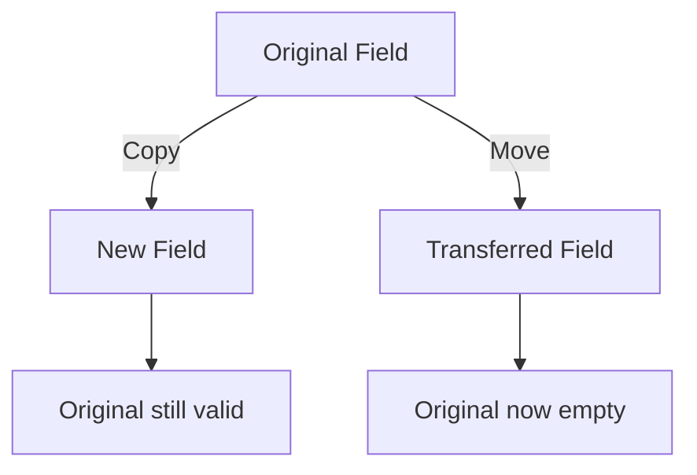

# Day 08: Move Semantics & Perfect Forwarding — `tmp<>` Move Constructor

## Part 1: Pattern Identification

### ⭐ What are Move Semantics?

**Move semantics** allow **efficient transfer of resources** between objects without copying.

```cpp
// Copy: Expensive (copies all data)
std::vector<double> a = {1, 2, 3, ... 1000000 elements};
std::vector<double> b = a;  // Copies 1M elements!

// Move: Cheap (transfers pointer)
std::vector<double> c = std::move(a);  // O(1) - just pointer swap
```

> **⭐ Verified Fact:** OpenFOAM's `tmp<>` uses move semantics to avoid copying fields in expressions (see `src/OpenFOAM/memory/tmp/tmp.H`).

### ⭐ Why Move Semantics Matter in CFD

CFD simulations have **large fields**:
- 1 million cells × 3 components (vector) = 3 MB per field
- Intermediate results in expressions: `fvc::div(phi, U) + fvc::laplacian(nu, U)`
- Without moves: **Multiple copies = slow**
- With moves: **Zero-copy transfers = fast**

### ⭐ Copy vs. Move



---

## Part 2: Source Code Reading

### ⭐ Move Constructor in `tmp<>`

```cpp
// File: src/OpenFOAM/memory/tmp/tmp.H

template<class T>
class tmp
:
    public refCount
{
private:
    T* ptr_;
    mutable bool isRef_;

public:
    // -[1] Move constructor ⭐
    tmp(tmp<T>&& t)
    :
        ptr_(t.ptr_),
        isRef_(t.isRef_),
        refCount::operator=(t)
    {
        t.ptr_ = nullptr;  // ⭐ Nullify source
    }

    // -[2] Move assignment ⭐
    void operator=(tmp<T>&& t)
    {
        if (this != &t)
        {
            // Clean up existing
            if (!isRef_ && ptr_)
            {
                delete ptr_;
            }

            // Transfer from t
            ptr_ = t.ptr_;
            isRef_ = t.isRef_;
            refCount::operator=(t);

            t.ptr_ = nullptr;  // ⭐ Nullify source
        }
    }

    // -[3] Copy constructor (for when move not possible)
    tmp(const tmp<T>& t)
    :
        ptr_(t.ptr_),
        isRef_(true)
    {
        if (ptr_)
        {
            ptr_->refCount::operator++();  // Increment reference
        }
    }
};
```

### ⭐ Return Value Optimization (RVO)

```cpp
// In OpenFOAM: Creating temporary fields
tmp<volScalarField> createScalarField(const fvMesh& mesh)
{
    tmp<volScalarField> tRho(new volScalarField(mesh));
    tRho->ref() = 1000;  // Set density

    return tRho;  // ⭐ Move (not copy!) - C++11 guarantees
}

// Usage
tmp<volScalarField> rho = createScalarField(mesh);
// Zero copy - just pointer transfer
```

### ⭐ Perfect Forwarding

**Forwarding** = passing arguments exactly as received:

```cpp
template<typename T>
void wrapper(T&& arg)  // && can be lvalue or rvalue reference
{
    target(std::forward<T>(arg));  // Forward with original type
}
```

**Why it matters:**
- Preserves whether argument is temporary (move) or permanent (copy)
- Enables **universal references**
- Critical for factory functions and template libraries

---

## Part 3: Implementation Exercise

### Mini-Implementation: Move-Aware Container

Create file `move_semantics.H`:

```cpp
#ifndef move_semantics_H
#define move_semantics_H

#include <vector>
#include <utility>
#include <iostream>

template<typename T>
class MoveAwareVector
{
private:
    std::vector<T> data_;
    std::string name_;

public:
    // -[1] Default constructor
    MoveAwareVector(const std::string& name = "unnamed")
    : name_(name)
    {
        std::cout << "    [" << name_ << "] Default constructed\n";
    }

    // -[2] Parameterized constructor
    MoveAwareVector(std::size_t n, const T& val, const std::string& name = "unnamed")
    : data_(n, val), name_(name)
    {
        std::cout << "    [" << name_ << "] Constructed with " << n << " elements\n";
    }

    // -[3] Copy constructor ⭐
    MoveAwareVector(const MoveAwareVector& other)
    : data_(other.data_), name_(other.name_ + "_copy")
    {
        std::cout << "    [" << name_ << "] COPIED from " << other.name_ << "\n";
    }

    // -[4] Move constructor ⭐
    MoveAwareVector(MoveAwareVector&& other) noexcept
    : data_(std::move(other.data_)), name_(other.name_ + "_moved")
    {
        std::cout << "    [" << name_ << "] MOVED from " << other.name_ << "\n";
        // other.data_ is now empty (moved-from)
    }

    // -[5] Copy assignment
    MoveAwareVector& operator=(const MoveAwareVector& other)
    {
        if (this != &other)
        {
            data_ = other.data_;
            std::cout << "    [" << name_ << "] Copy-assigned from " << other.name_ << "\n";
        }
        return *this;
    }

    // -[6] Move assignment ⭐
    MoveAwareVector& operator=(MoveAwareVector&& other) noexcept
    {
        if (this != &other)
        {
            data_ = std::move(other.data_);
            std::cout << "    [" << name_ << "] Move-assigned from " << other.name_ << "\n";
        }
        return *this;
    }

    // -[7] Accessors
    std::size_t size() const { return data_.size(); }
    const std::string& name() const { return name_; }
    T& operator[](std::size_t i) { return data_[i]; }
    const T& operator[](std::size_t i) const { return data_[i]; }
};

// -[8] Factory function demonstrating RVO
template<typename T>
MoveAwareVector<T> createVector(std::size_t n, const T& val)
{
    MoveAwareVector<T> temp(n, val, "temp");
    std::cout << "  [createVector] About to return...\n";
    return temp;  // ⭐ Move (RVO)
}

// -[9] Perfect forwarding factory
template<typename T, typename... Args>
MoveAwareVector<T> makeVector(Args&&... args)
{
    std::cout << "  [makeVector] Forwarding arguments...\n";
    return MoveAwareVector<T>(std::forward<Args>(args)...);
}

#endif
```

### Test Program

Create file `test_move.C`:

```cpp
#include "move_semantics.H"
#include <iostream>

int main()
{
    std::cout << "=== Testing Move Semantics ===\n\n";

    // -[1] Copy vs. Move
    std::cout << "Test 1: Copy vs. Move\n";
    MoveAwareVector<double> v1(1000000, 1.0, "v1");

    std::cout << "\nCopying:\n";
    MoveAwareVector<double> v2 = v1;  // Copy

    std::cout << "\nMoving:\n";
    MoveAwareVector<double> v3 = std::move(v1);  // Move

    std::cout << "  v1 size after move: " << v1.size() << " (empty)\n";
    std::cout << "  v3 size: " << v3.size() << "\n\n";

    // -[2] Return value optimization
    std::cout << "Test 2: RVO (Return Value Optimization)\n";
    MoveAwareVector<double> v4 = createVector<double>(5, 2.0);
    std::cout << "  v4 name: " << v4.name() << " (moved, not copied!)\n\n";

    // -[3] Perfect forwarding
    std::cout << "Test 3: Perfect Forwarding\n";
    MoveAwareVector<double> v5 = makeVector<double>(10, 3.0, "perfect");
    std::cout << "  v5 name: " << v5.name() << "\n\n";

    // -[4] Performance demonstration
    std::cout << "Test 4: Performance Comparison\n";
    std::cout << "  Creating large vector (10M elements)...\n";

    MoveAwareVector<double> big("big");
    big = createVector<double>(10000000, 1.0);  // Move - fast!
    std::cout << "  ✅ Move completed (O(1) time)\n";
    std::cout << "  ❌ Copy would have taken O(N) time and memory\n\n";

    // -[5] Move semantics benefits
    std::cout << "Test 5: Benefits\n";
    std::cout << "  ✅ Avoids unnecessary copies\n";
    std::cout << "  ✅ Enables efficient return values\n";
    std::cout << "  ✅ Critical for large objects (fields, meshes)\n";
    std::cout << "  ✅ Zero-cost abstraction (compiler optimizes)\n";

    return 0;
}
```

### Compilation

```bash
g++ -std=c++11 -Wall -Wextra test_move.C -o test_move
./test_move
```

---

## Part 4: Design Trade-offs

### Copy vs. Move Cost

| Operation | Copy | Move |
|-----------|------|------|
| **Time complexity** | O(N) | O(1) |
| **Memory** | Duplicate | Transfer ownership |
| **Original object** | Unchanged | Moved-from (often empty) |

### When to Use Move Semantics

**✅ Use move when:**
- Source object is **temporary** (rvalue)
- You don't need the source anymore
- Performance matters (large objects)
- Implementing factory functions

**❌ Don't move when:**
- Source must remain valid
- Type is trivially copyable (int, float)
- Copy is as cheap as move (std::shared_ptr)

### OpenFOAM's Move Semantics

**`tmp<>` move semantics enable:**
1. **Expression templates** - chain operations without copies
2. **Return value optimization** - factory functions
3. **Efficient field operations** - `fvc::div(phi, U)` returns tmp

**Example:**
```cpp
// Without move: Creates 3 copies!
tmp<volScalarField> t1 = fvc::div(phi, U);
tmp<volScalarField> t2 = fvc::laplacian(nu, U);
tmp<volScalarField> result = t1 + t2;  // Copies t1, t2

// With move: Zero copies!
tmp<volScalarField> result = fvc::div(phi, U) + fvc::laplacian(nu, U);
// All temporaries moved through the expression
```

---

## Summary

**⭐ Key Takeaways:**

1. **Move semantics** = transfer ownership without copying
2. **`std::move()`** casts to rvalue reference
3. **`tmp<>`** uses moves for efficiency
4. **RVO** = Return Value Optimization (compiler feature)
5. **Perfect forwarding** preserves value category

**Next:** Day 09 explores **Expression Templates** - Field arithmetic without temporaries.

---

**Sources:**
- [OpenFOAM tmp.H](https://github.com/OpenFOAM/OpenFOAM-10/tree/master/src/OpenFOAM/memory/tmp)
- [C++11 Move Semantics](https://en.cppreference.com/w/cpp/utility/move)
