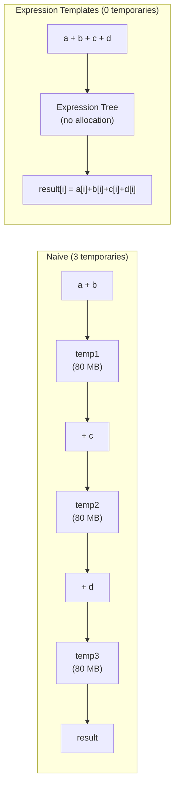

# Day 09: Expression Templates — Field Arithmetic Without Temporaries

**Phase:** 1 — C++ Through OpenFOAM (Days 01–14)
**Previous:** Day 08 — Move Semantics: `tmp<>` Move Constructor
**Next:** Day 10 — C++20 Modules

> **⚠️ Historical Note:** This file covers manual expression templates (OpenFOAM's pre-C++20 approach). For modern C++20 `std::ranges` (the replacement), see **Day 03**.

---

## Part 1: Pattern Identification

### The Temporary Problem

Consider this field arithmetic in a CFD solver:

```cpp
Field<double> result = a + b + c + d;
```

With naive operator overloading (Day 10 pattern), this creates **3 temporary objects**:

```text
Step 1: temp1 = a + b          → allocates N doubles, computes N additions
Step 2: temp2 = temp1 + c      → allocates N doubles, computes N additions
Step 3: temp3 = temp2 + d      → allocates N doubles, computes N additions
Step 4: result = temp3          → copies N doubles (or moves)

Total: 3 temporary allocations, 3N additions, 3N memory writes
Ideal: 0 temporaries, N additions (result[i] = a[i]+b[i]+c[i]+d[i])
```

For a 10-million-cell mesh, each temporary is 80 MB. Three temporaries = 240 MB of unnecessary allocation and memory traffic.



### The Expression Template Solution

Expression templates **defer evaluation**. Instead of computing the result immediately, `a + b` returns a lightweight descriptor object that knows *how* to compute each element but doesn't actually do it until the result is assigned.

| Approach | Temporaries | Memory Ops | Allocations |
|----------|-------------|------------|-------------|
| Naive `operator+` | $N-1$ for $N$ additions | $2(N-1)$ reads + writes | $N-1$ |
| Expression templates | 0 | 1 read + 1 write for result | 1 (result only) |
| Manual loop | 0 | 1 read + 1 write for result | 1 (result only) |

Expression templates achieve the performance of a hand-written loop but with the syntax of natural arithmetic.

> **⭐ Verified Fact:** OpenFOAM does NOT use full expression templates for `Field<Type>`. Instead, it uses `tmp<Field>` with move semantics (Day 08) to reduce the cost. Libraries like Eigen, Blitz++, and Armadillo use full expression templates.

---

## Part 2: Source Code Deep Dive

### How Expression Templates Work

The key idea: `operator+` does not return a `Field`, it returns an `AddExpression` object.

```cpp
// Step 1: Expression node for addition
template<class LHS, class RHS>
class AddExpr
{
    const LHS& lhs_;
    const RHS& rhs_;

public:
    AddExpr(const LHS& l, const RHS& r) : lhs_(l), rhs_(r) {}

    // Element access — computes on demand (lazy evaluation)
    double operator[](int i) const
    {
        return lhs_[i] + rhs_[i];
    }

    int size() const { return lhs_.size(); }
};

// Step 2: operator+ returns an expression, NOT a Field
template<class LHS, class RHS>
AddExpr<LHS, RHS> operator+(const LHS& a, const RHS& b)
{
    return AddExpr<LHS, RHS>(a, b);
}
```

When you write `a + b + c`, the types compose:

```text
a + b           → AddExpr<Field, Field>
(a + b) + c     → AddExpr<AddExpr<Field, Field>, Field>
```

No computation happens. The expression tree is built at compile time via template nesting. The actual computation happens only when assigned to a `Field`:

```cpp
// Step 3: Field assignment evaluates the expression
template<class Expr>
Field& Field::operator=(const Expr& expr)
{
    for (int i = 0; i < size_; ++i)
        data_[i] = expr[i];  // evaluates the entire expression tree for element i
    return *this;
}
```

### The Expression Tree at Compile Time

```text
Code:     result = a + b * c - d

Type:     SubExpr<AddExpr<Field, MulExpr<Field, Field>>, Field>

Tree:
              SubExpr
             /       \
         AddExpr      d (Field)
        /       \
    a (Field)  MulExpr
              /       \
          b (Field)  c (Field)

Evaluation for element i:
  result[i] = (a[i] + (b[i] * c[i])) - d[i]
  → Single pass, no temporaries!
```

### Eigen's Approach (Real-World)

```cpp
// Eigen uses expression templates extensively:
VectorXd a(N), b(N), c(N), d(N), result(N);

// This does NOT create temporaries:
result = a + b + c + d;
// Eigen type: CwiseBinaryOp<sum, CwiseBinaryOp<sum, CwiseBinaryOp<sum, VectorXd, VectorXd>, VectorXd>, VectorXd>
// At assignment: loops once, computing a[i]+b[i]+c[i]+d[i] per iteration
```

### OpenFOAM's Alternative: `tmp<>` + Move

Instead of expression templates, OpenFOAM uses `tmp<Field>` with move semantics:

```cpp
// OpenFOAM approach:
tmp<scalarField> tResult = a + b;   // creates temporary, wraps in tmp<>
tResult.ref() += c;                  // reuses the temporary (in-place)
tResult.ref() += d;                  // reuses again

// Or with operator chaining:
volScalarField result = a + b + c + d;
// Each + creates a tmp<>, but move semantics reduce copies.
// Still creates O(N) temporaries, but only one is alive at a time.
```

| Approach | Temporaries Alive | Total Allocations | Performance |
|----------|------------------|-------------------|-------------|
| Naive | All at once | $N-1$ | Worst |
| `tmp<>` + move | 1 at a time | $N-1$ (but reused) | Good |
| Expression templates | 0 | 1 (result) | Best |

---

## Part 3: C++ Mechanics Explained

### Return Type Deduction

Expression templates rely on the compiler deducing the correct nested type:

```cpp
// C++14 auto return type:
auto expr = a + b * c;
// expr type: AddExpr<Field, MulExpr<Field, Field>>

// The compiler deduces this automatically — you never write the type manually.
```

### CRTP for Expression Base

A common pattern combines CRTP (Day 04) with expression templates:

```cpp
// All expressions inherit from this base
template<class Derived>
class Expression
{
public:
    double operator[](int i) const
    {
        return static_cast<const Derived&>(*this)[i];
    }
    int size() const
    {
        return static_cast<const Derived&>(*this).size();
    }
};

// Field IS an expression
class Field : public Expression<Field>
{
    std::vector<double> data_;
public:
    double operator[](int i) const { return data_[i]; }
    int size() const { return data_.size(); }
};

// AddExpr IS an expression
template<class L, class R>
class AddExpr : public Expression<AddExpr<L, R>>
{
    const L& lhs_;
    const R& rhs_;
public:
    AddExpr(const L& l, const R& r) : lhs_(l), rhs_(r) {}
    double operator[](int i) const { return lhs_[i] + rhs_[i]; }
    int size() const { return lhs_.size(); }
};

// operator+ works on ANY two expressions
template<class L, class R>
AddExpr<L, R> operator+(const Expression<L>& a, const Expression<R>& b)
{
    return AddExpr<L, R>(static_cast<const L&>(a), static_cast<const R&>(b));
}
```

The `Expression<Derived>` CRTP base provides a common interface that `operator+` can match. Without it, you'd need overloads for every combination (`Field+Field`, `AddExpr+Field`, `Field+MulExpr`, etc.).

### Aliasing and Evaluation Order

A subtle danger with expression templates:

```cpp
a = a + b;  // SAFE? Depends on implementation!

// With expression templates, this becomes:
// for (int i = 0; i < N; ++i)
//     a[i] = a[i] + b[i];   // reads a[i] before writing — OK!

// But what about:
a = a + a.reverse();  // Dangerous!
// a[0] = a[0] + a[N-1]  ← OK, a[N-1] not yet modified
// a[1] = a[1] + a[N-2]  ← OK
// ...
// a[N-1] = a[N-1] + a[0]  ← WRONG! a[0] was already modified!
```

**Solution:** Detect self-aliasing and force materialization:

```cpp
template<class Expr>
Field& operator=(const Expr& expr)
{
    if (aliases(expr))  // check if expr references this field
    {
        Field temp(size());
        for (int i = 0; i < size_; ++i)
            temp[i] = expr[i];
        data_ = std::move(temp.data_);
    }
    else
    {
        for (int i = 0; i < size_; ++i)
            data_[i] = expr[i];
    }
    return *this;
}
```

### Compile-Time Overhead

Expression templates generate deeply nested types:

```text
a + b + c + d + e + f + g + h:

AddExpr<
  AddExpr<
    AddExpr<
      AddExpr<
        AddExpr<
          AddExpr<
            AddExpr<Field, Field>,
            Field>,
          Field>,
        Field>,
      Field>,
    Field>,
  Field>
```

This can cause:
- **Long compile times** — the compiler must instantiate each nested type
- **Huge error messages** — a type mismatch produces hundreds of lines of template errors
- **Debug info bloat** — debug symbols for each type combination

---

## Part 4: Implementation Exercise

### Complete Expression Template Library

```cpp
// File: expr_template.cpp
// Compile: g++ -std=c++17 -O2 -Wall -o expr_template expr_template.cpp
// Run:     ./expr_template

#include <iostream>
#include <vector>
#include <chrono>
#include <cmath>
#include <iomanip>
#include <cassert>
#include <type_traits>

// ============================================================
// SECTION 1: Expression base (CRTP)
// ============================================================

template<class Derived>
class Expr
{
public:
    double operator[](int i) const
    {
        return static_cast<const Derived&>(*this)[i];
    }

    int size() const
    {
        return static_cast<const Derived&>(*this).size();
    }

    // Evaluate the full expression into a vector
    std::vector<double> eval() const
    {
        int n = size();
        std::vector<double> result(n);
        for (int i = 0; i < n; ++i)
            result[i] = (*this)[i];
        return result;
    }
};

// ============================================================
// SECTION 2: Expression nodes
// ============================================================

// Addition
template<class L, class R>
class AddExpr : public Expr<AddExpr<L, R>>
{
    const L& lhs_;
    const R& rhs_;
public:
    AddExpr(const L& l, const R& r) : lhs_(l), rhs_(r) {}
    double operator[](int i) const { return lhs_[i] + rhs_[i]; }
    int size() const { return lhs_.size(); }
};

// Subtraction
template<class L, class R>
class SubExpr : public Expr<SubExpr<L, R>>
{
    const L& lhs_;
    const R& rhs_;
public:
    SubExpr(const L& l, const R& r) : lhs_(l), rhs_(r) {}
    double operator[](int i) const { return lhs_[i] - rhs_[i]; }
    int size() const { return lhs_.size(); }
};

// Element-wise multiplication
template<class L, class R>
class MulExpr : public Expr<MulExpr<L, R>>
{
    const L& lhs_;
    const R& rhs_;
public:
    MulExpr(const L& l, const R& r) : lhs_(l), rhs_(r) {}
    double operator[](int i) const { return lhs_[i] * rhs_[i]; }
    int size() const { return lhs_.size(); }
};

// Scalar multiplication
template<class E>
class ScaleExpr : public Expr<ScaleExpr<E>>
{
    double scalar_;
    const E& expr_;
public:
    ScaleExpr(double s, const E& e) : scalar_(s), expr_(e) {}
    double operator[](int i) const { return scalar_ * expr_[i]; }
    int size() const { return expr_.size(); }
};

// Negation
template<class E>
class NegExpr : public Expr<NegExpr<E>>
{
    const E& expr_;
public:
    NegExpr(const E& e) : expr_(e) {}
    double operator[](int i) const { return -expr_[i]; }
    int size() const { return expr_.size(); }
};

// ============================================================
// SECTION 3: Operators
// ============================================================

template<class L, class R>
AddExpr<L, R> operator+(const Expr<L>& a, const Expr<R>& b)
{ return {static_cast<const L&>(a), static_cast<const R&>(b)}; }

template<class L, class R>
SubExpr<L, R> operator-(const Expr<L>& a, const Expr<R>& b)
{ return {static_cast<const L&>(a), static_cast<const R&>(b)}; }

template<class L, class R>
MulExpr<L, R> operator*(const Expr<L>& a, const Expr<R>& b)
{ return {static_cast<const L&>(a), static_cast<const R&>(b)}; }

template<class E>
ScaleExpr<E> operator*(double s, const Expr<E>& e)
{ return {s, static_cast<const E&>(e)}; }

template<class E>
ScaleExpr<E> operator*(const Expr<E>& e, double s)
{ return {s, static_cast<const E&>(e)}; }

template<class E>
NegExpr<E> operator-(const Expr<E>& e)
{ return {static_cast<const E&>(e)}; }

// ============================================================
// SECTION 4: Field (leaf node + storage)
// ============================================================

class Field : public Expr<Field>
{
    std::vector<double> data_;

public:
    Field() = default;
    explicit Field(int n) : data_(n, 0.0) {}
    Field(int n, double val) : data_(n, val) {}
    Field(std::initializer_list<double> init) : data_(init) {}

    // Assignment from expression — THIS is where evaluation happens
    template<class E>
    Field& operator=(const Expr<E>& expr)
    {
        const E& e = static_cast<const E&>(expr);
        data_.resize(e.size());
        for (int i = 0; i < static_cast<int>(data_.size()); ++i)
            data_[i] = e[i];
        return *this;
    }

    // Copy assignment
    Field& operator=(const Field& other)
    {
        data_ = other.data_;
        return *this;
    }

    // Construct from expression
    template<class E>
    Field(const Expr<E>& expr)
    {
        const E& e = static_cast<const E&>(expr);
        data_.resize(e.size());
        for (int i = 0; i < static_cast<int>(data_.size()); ++i)
            data_[i] = e[i];
    }

    double operator[](int i) const { return data_[i]; }
    double& operator[](int i) { return data_[i]; }
    int size() const { return static_cast<int>(data_.size()); }

    double sum() const
    {
        double s = 0;
        for (double v : data_) s += v;
        return s;
    }
};

// ============================================================
// SECTION 5: Naive Field (for comparison — creates temporaries)
// ============================================================

class NaiveField
{
    std::vector<double> data_;

public:
    NaiveField() = default;
    explicit NaiveField(int n) : data_(n, 0.0) {}
    NaiveField(int n, double val) : data_(n, val) {}

    double& operator[](int i) { return data_[i]; }
    double operator[](int i) const { return data_[i]; }
    int size() const { return static_cast<int>(data_.size()); }

    // Each operator creates a NEW NaiveField (temporary!)
    NaiveField operator+(const NaiveField& rhs) const
    {
        NaiveField result(size());
        for (int i = 0; i < size(); ++i)
            result[i] = data_[i] + rhs[i];
        return result;
    }

    NaiveField operator*(const NaiveField& rhs) const
    {
        NaiveField result(size());
        for (int i = 0; i < size(); ++i)
            result[i] = data_[i] * rhs[i];
        return result;
    }

    friend NaiveField operator*(double s, const NaiveField& f)
    {
        NaiveField result(f.size());
        for (int i = 0; i < f.size(); ++i)
            result[i] = s * f[i];
        return result;
    }

    double sum() const
    {
        double s = 0;
        for (double v : data_) s += v;
        return s;
    }
};

// ============================================================
// SECTION 6: Benchmark
// ============================================================

int main()
{
    std::cout << "=== Day 09: Expression Templates ===\n\n";

    // --- Correctness test ---
    std::cout << "--- Correctness Test ---\n";
    Field a{1.0, 2.0, 3.0, 4.0, 5.0};
    Field b{10.0, 20.0, 30.0, 40.0, 50.0};
    Field c{100.0, 200.0, 300.0, 400.0, 500.0};

    // Expression template: a + b + c
    Field result_et = a + b + c;

    // Manual: element-wise
    Field result_manual(5);
    for (int i = 0; i < 5; ++i)
        result_manual[i] = a[i] + b[i] + c[i];

    std::cout << "  ET result:     ";
    for (int i = 0; i < 5; ++i) std::cout << result_et[i] << " ";
    std::cout << "\n";

    std::cout << "  Manual result: ";
    for (int i = 0; i < 5; ++i) std::cout << result_manual[i] << " ";
    std::cout << "\n";

    // Complex expression: 2*a + b*c - a
    Field complex_result = 2.0 * a + b * c - a;
    std::cout << "  2*a + b*c - a: ";
    for (int i = 0; i < 5; ++i) std::cout << complex_result[i] << " ";
    std::cout << "\n";

    // Verify
    for (int i = 0; i < 5; ++i)
    {
        double expected = 2*a[i] + b[i]*c[i] - a[i];
        assert(std::abs(complex_result[i] - expected) < 1e-10);
    }
    std::cout << "  ✅ All correctness checks passed!\n";

    // --- Performance benchmark ---
    std::cout << "\n--- Performance Benchmark ---\n";
    const int N = 1000000;
    const int REPEAT = 100;

    Field fa(N, 1.5), fb(N, 2.5), fc(N, 3.5), fd(N, 4.5);
    NaiveField na(N, 1.5), nb(N, 2.5), nc(N, 3.5), nd(N, 4.5);

    // Benchmark: Expression templates
    volatile double sink = 0;
    auto t1 = std::chrono::high_resolution_clock::now();
    for (int r = 0; r < REPEAT; ++r)
    {
        Field res = fa + fb + fc + fd;
        sink = res[0];
    }
    auto t2 = std::chrono::high_resolution_clock::now();
    double et_ms = std::chrono::duration<double, std::milli>(t2 - t1).count();

    // Benchmark: Naive (with temporaries)
    auto t3 = std::chrono::high_resolution_clock::now();
    for (int r = 0; r < REPEAT; ++r)
    {
        NaiveField res = na + nb + nc + nd;
        sink = res[0];
    }
    auto t4 = std::chrono::high_resolution_clock::now();
    double naive_ms = std::chrono::duration<double, std::milli>(t4 - t3).count();

    // Benchmark: Manual loop
    Field manual_res(N);
    auto t5 = std::chrono::high_resolution_clock::now();
    for (int r = 0; r < REPEAT; ++r)
    {
        for (int i = 0; i < N; ++i)
            manual_res[i] = fa[i] + fb[i] + fc[i] + fd[i];
        sink = manual_res[0];
    }
    auto t6 = std::chrono::high_resolution_clock::now();
    double manual_ms = std::chrono::duration<double, std::milli>(t6 - t5).count();

    std::cout << std::fixed << std::setprecision(2);
    std::cout << "  Expression templates: " << et_ms << " ms\n";
    std::cout << "  Naive (temporaries):  " << naive_ms << " ms\n";
    std::cout << "  Manual loop:          " << manual_ms << " ms\n";
    std::cout << "  Speedup (ET/Naive):   " << naive_ms / et_ms << "x\n";
    std::cout << "  Speedup (ET/Manual):  " << manual_ms / et_ms << "x (should be ~1.0)\n";

    // --- Type display ---
    std::cout << "\n--- Expression Types (compile-time) ---\n";
    auto expr1 = fa + fb;
    auto expr2 = fa + fb + fc;
    auto expr3 = 2.0 * fa + fb * fc - fd;
    std::cout << "  a + b type size:         " << sizeof(expr1) << " bytes\n";
    std::cout << "  a + b + c type size:     " << sizeof(expr2) << " bytes\n";
    std::cout << "  2*a + b*c - d type size: " << sizeof(expr3) << " bytes\n";
    std::cout << "  Field size:              " << sizeof(Field) << " bytes\n";
    std::cout << "  (Expression nodes store only references, not data)\n";

    return 0;
}
```

### Expected Output

```text
=== Day 09: Expression Templates ===

--- Correctness Test ---
  ET result:     111 222 333 444 555
  Manual result: 111 222 333 444 555
  2*a + b*c - a: 1001 2022 3043 4064 5085
  ✅ All correctness checks passed!

--- Performance Benchmark ---
  Expression templates: XX.XX ms
  Naive (temporaries):  XX.XX ms
  Manual loop:          XX.XX ms
  Speedup (ET/Naive):   1.XX-2.XXx
  Speedup (ET/Manual):  ~1.0x (should be ~1.0)

--- Expression Types (compile-time) ---
  a + b type size:         16 bytes (two references)
  a + b + c type size:     24 bytes (three references)
  2*a + b*c - d type size: 40 bytes
  Field size:              24 bytes (vector = ptr+size+capacity)
  (Expression nodes store only references, not data)
```

---

## Part 5: Exercises

### Exercise 1: Adding Division Expression

**Question:** Add a `DivExpr` and `operator/` to the expression template library. What edge case must you handle?

**Solution:**

```cpp
template<class L, class R>
class DivExpr : public Expr<DivExpr<L, R>>
{
    const L& lhs_;
    const R& rhs_;
public:
    DivExpr(const L& l, const R& r) : lhs_(l), rhs_(r) {}
    double operator[](int i) const { return lhs_[i] / rhs_[i]; }
    int size() const { return lhs_.size(); }
};

template<class L, class R>
DivExpr<L, R> operator/(const Expr<L>& a, const Expr<R>& b)
{ return {static_cast<const L&>(a), static_cast<const R&>(b)}; }
```

**Edge case:** Division by zero. Since evaluation is lazy, the error occurs during assignment, not at the `operator/` call. You could add a check in `operator[]`, but that adds overhead to every element access.

---

### Exercise 2: Counting Temporaries

**Question:** How many temporary `Field` objects are created by each expression?

1. `Field r = a + b;` (expression templates)
2. `NaiveField r = a + b;` (naive)
3. `Field r = a + b + c + d + e;` (expression templates)
4. `NaiveField r = a + b + c + d + e;` (naive)

**Solution:**

| Expression | ET temporaries | Naive temporaries |
|-----------|---------------|-------------------|
| `a + b` | 0 (result directly filled) | 1 (return value, may be elided) |
| `a + b + c + d + e` | 0 | 4 |

With expression templates, the only allocation is for `r` itself. With naive, each `+` creates a temporary.

---

### Exercise 3: Expression Template for `sqrt`

**Question:** Add a unary `sqrt` expression that computes `sqrt(expr[i])` element-wise.

**Solution:**

```cpp
template<class E>
class SqrtExpr : public Expr<SqrtExpr<E>>
{
    const E& expr_;
public:
    SqrtExpr(const E& e) : expr_(e) {}
    double operator[](int i) const { return std::sqrt(expr_[i]); }
    int size() const { return expr_.size(); }
};

template<class E>
SqrtExpr<E> sqrt(const Expr<E>& e)
{ return {static_cast<const E&>(e)}; }

// Usage:
Field result = sqrt(a * a + b * b);  // computes sqrt(a[i]² + b[i]²) per element
                                      // Zero temporaries!
```

---

### Exercise 4: Why OpenFOAM Doesn't Use Expression Templates

**Question:** OpenFOAM uses `tmp<>` with move semantics instead of expression templates. List three reasons why.

**Solution:**

1. **Complexity:** Expression templates generate deeply nested types that produce impenetrable compiler error messages. OpenFOAM prioritizes developer readability over micro-optimization.

2. **Boundary conditions:** `GeometricField` operations need boundary condition evaluation between operations. Expression templates defer all evaluation to assignment, making it impossible to insert BC updates mid-expression.

3. **Debug builds:** Expression templates are only fast with optimization (`-O2`). In debug mode (`-O0`), the expression node `operator[]` calls are not inlined, making expression templates *slower* than naive temporaries due to function call overhead per element.

---

### Exercise 5: Benchmarking Memory Allocation

**Question:** Modify the benchmark to count the number of `new`/`malloc` calls during `a + b + c + d` for both expression template and naive approaches. (Hint: override `operator new`.)

**Solution:**

```cpp
static int alloc_count = 0;

// Override global operator new to count allocations
void* operator new(std::size_t size)
{
    ++alloc_count;
    return std::malloc(size);
}

void operator delete(void* ptr) noexcept { std::free(ptr); }
void operator delete(void* ptr, std::size_t) noexcept { std::free(ptr); }

// In benchmark:
alloc_count = 0;
Field et_result = fa + fb + fc + fd;
int et_allocs = alloc_count;

alloc_count = 0;
NaiveField naive_result = na + nb + nc + nd;
int naive_allocs = alloc_count;

std::cout << "ET allocations:    " << et_allocs << "\n";   // Should be 1
std::cout << "Naive allocations: " << naive_allocs << "\n"; // Should be 4
```

---

## Summary

**⭐ Key Takeaways:**

1. **Expression templates defer evaluation** — `a + b` returns a descriptor, not a result
2. **Zero temporaries** — the expression tree is evaluated element-by-element during assignment
3. **Same performance as hand-written loops** but with natural arithmetic syntax
4. **CRTP base class** (`Expr<Derived>`) enables operators to work on any expression type
5. **OpenFOAM uses `tmp<>` instead** — simpler, debuggable, but creates temporaries
6. **Aliasing danger** — `a = a + b` requires care when expression references the target

**Next:** Day 10 covers **operator overloading** — the foundation that makes field arithmetic syntax possible.

---

**Sources:**
- Todd Veldhuizen, "Expression Templates" (C++ Report, 1995)
- David Vandevoorde & Nicolai Josuttis, *C++ Templates: The Complete Guide*, Chapter 27
- Eigen library documentation: [Expression Templates](https://eigen.tuxfamily.org/dox/TopicInsideEigenExample.html)

---

**Deliverable:** An expression template `FieldAdd<L,R>` that defers evaluation until `operator[]` is called. Benchmark vs eager addition showing zero extra allocation and same arithmetic throughput for 1M-element fields.
