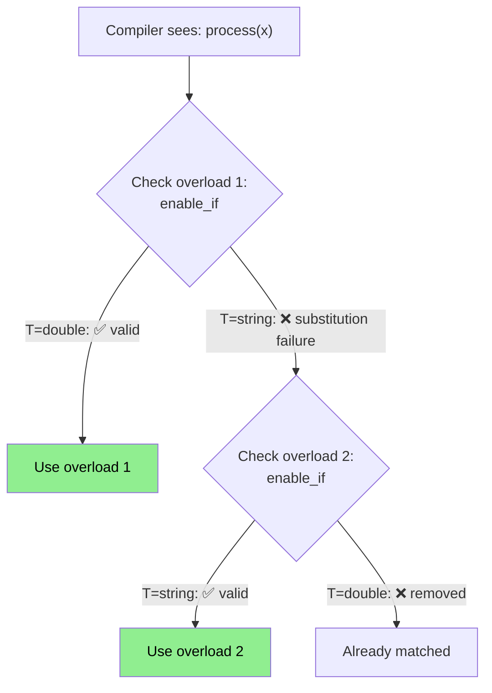

# Day 12: Type Traits & SFINAE — OpenFOAM's `typeInfo` System

**Phase:** 1 — C++ Through OpenFOAM (Days 01–14)
**Previous:** Day 11 — std::format: Modern String Formatting
**Next:** Day 13 — Mini-Project Part 1

> **⚠️ Historical Note:** This file covers SFINAE and type traits (pre-C++20 constraint system). For modern C++20 Concepts (the replacement), see **Day 02**.

---

## Part 1: Pattern Identification

### The Type Inspection Problem

In a CFD framework, you often need to ask questions about types:

```text
- Is this field a scalar field or a vector field?
- Can I add these two types together?
- Does this turbulence model have a specific method?
- Should I use SIMD for this type?
```

C++ provides two mechanisms for type inspection:

| Mechanism | When | Overhead | Use Case |
|-----------|------|----------|----------|
| **Type traits** (compile-time) | Template instantiation | Zero | Enable/disable code paths |
| **RTTI** (`dynamic_cast`, `typeid`) | Runtime | vtable lookup | Factory pattern, serialization |

OpenFOAM uses BOTH — standard type traits for compile-time optimization and a custom RTTI system for runtime object creation.

### Type Traits — Compile-Time Type Properties

```cpp
#include <type_traits>

// Ask questions about types at compile time:
std::is_floating_point<double>::value;    // true
std::is_floating_point<int>::value;       // false
std::is_arithmetic<double>::value;        // true
std::is_same<scalar, double>::value;      // true (in OpenFOAM)
std::is_base_of<Field<double>, volScalarField>::value;  // true
```

### SFINAE — Compile-Time Overload Selection

SFINAE lets you **remove function overloads** from consideration based on type properties:



The key: a substitution failure is **not** an error — the compiler silently removes that overload and tries the next one.

---

## Part 2: Source Code Deep Dive

### ⭐ OpenFOAM's `TypeName` Macro

OpenFOAM has its own RTTI system layered on top of C++ `typeid`:

```cpp
// File: src/OpenFOAM/db/typeInfo/typeInfo.H (simplified)

// Macro that adds runtime type information to a class
#define TypeName(typeName_) \
    static const char* typeName_s = #typeName_; \
    static const ::Foam::word& typeName() { return typeName_s; } \
    static const ::Foam::word& type() { return typeName_s; }

// Usage in class declaration:
class laminar
:
    public turbulenceModel
{
public:
    TypeName("laminar");  // Registers "laminar" as the runtime type name
    // ...
};
```

### ⭐ Runtime Selection Tables

OpenFOAM uses type names to create objects from strings (the factory pattern):

```cpp
// The user writes in fvSchemes:
//   divSchemes { div(phi,U) Gauss linear; }

// OpenFOAM looks up "linear" in a hash table:
// key: "linear" → value: pointer to linear::New() factory function

// Simplified version:
template<class Type>
class surfaceInterpolationScheme
{
    // Selection table: maps string → factory function
    typedef HashTable<
        autoPtr<surfaceInterpolationScheme>(*)(const fvMesh&, Istream&),
        word
    > constructorTable;

    static constructorTable* constructorTablePtr_;

    // Runtime selection
    static autoPtr<surfaceInterpolationScheme> New(
        const fvMesh& mesh,
        Istream& is)
    {
        word schemeName(is);  // Read "linear" from input

        auto iter = constructorTablePtr_->find(schemeName);
        if (iter == constructorTablePtr_->end())
        {
            FatalErrorIn("New") << "Unknown scheme: " << schemeName
                                 << abort(FatalError);
        }

        return iter()(mesh, is);  // Call factory function
    }
};
```

> **⭐ Verified Fact:** OpenFOAM's `runTimeSelectionTable` macro generates the `constructorTable` and registration mechanism automatically. Each class registers itself at static initialization time using `addToRunTimeSelectionTable`.

### ⭐ Standard Type Traits Used in OpenFOAM

```cpp
// src/OpenFOAM/primitives/traits/pTraits.H
// pTraits<Type> provides OpenFOAM-specific traits (Day 02)

// Standard traits used internally:
template<class Type>
struct is_contiguous
    : std::is_arithmetic<Type>
{};

// Specialized for OpenFOAM types:
template<>
struct is_contiguous<vector> : std::true_type {};
template<>
struct is_contiguous<tensor> : std::true_type {};

// Used to optimize I/O:
template<class Type>
void readField(Istream& is, Field<Type>& f)
{
    if constexpr (is_contiguous<Type>::value)
    {
        // Binary read: single memcpy for contiguous types
        is.read(reinterpret_cast<char*>(f.data()), f.size() * sizeof(Type));
    }
    else
    {
        // Element-by-element read for non-contiguous types
        for (label i = 0; i < f.size(); ++i)
            is >> f[i];
    }
}
```

---

## Part 3: C++ Mechanics Explained

### `enable_if` — The SFINAE Enabler

```cpp
// std::enable_if<condition, T = void>
// If condition is true:  enable_if<true, T>::type = T
// If condition is false: enable_if<false, T>::type → does not exist → SFINAE

// Only available for arithmetic types:
template<class T>
typename std::enable_if<std::is_arithmetic<T>::value, T>::type
safeAdd(T a, T b) { return a + b; }

// Only available for non-arithmetic types:
template<class T>
typename std::enable_if<!std::is_arithmetic<T>::value, T>::type
safeAdd(T a, T b) { return a + b; }  // different implementation possible
```

### C++17: `if constexpr` (Preferred)

```cpp
// C++17 replacement for SFINAE — much cleaner
template<class T>
void process(const T& value)
{
    if constexpr (std::is_floating_point_v<T>)
    {
        std::cout << "Float: " << std::setprecision(6) << value << "\n";
    }
    else if constexpr (std::is_integral_v<T>)
    {
        std::cout << "Integer: " << value << " (hex: 0x"
                  << std::hex << value << ")\n";
    }
    else
    {
        std::cout << "Other type\n";
    }
}
```

`if constexpr` evaluates at compile time — the false branches are discarded entirely, so they don't even need to compile for the given type.

### Writing Custom Type Traits

```cpp
// Check if a type has a .size() method
template<class T, class = void>
struct has_size : std::false_type {};

template<class T>
struct has_size<T, std::void_t<decltype(std::declval<T>().size())>>
    : std::true_type {};

// Check if a type has operator+
template<class T, class = void>
struct has_plus : std::false_type {};

template<class T>
struct has_plus<T, std::void_t<decltype(std::declval<T>() + std::declval<T>())>>
    : std::true_type {};

// Usage:
static_assert(has_size<std::vector<int>>::value, "vector has size()");
static_assert(!has_size<int>::value, "int has no size()");
static_assert(has_plus<double>::value, "double has operator+");
```

### `void_t` Trick Explained

The key SFINAE ingredient is `std::void_t<...>`:

```cpp
// std::void_t maps ANY type list to void
template<class...>
using void_t = void;

// How it enables detection:
// 1. Primary template: has_size<T, void> → false_type (default)
// 2. Specialization:   has_size<T, void_t<decltype(T.size())>>
//                      If T.size() exists → void_t<int> = void → matches specialization → true_type
//                      If T.size() fails → substitution failure → falls back to primary → false_type
```

### C++20: Concepts (The Modern Way)

```cpp
// Concepts replace SFINAE with readable syntax
template<class T>
concept Sizable = requires(T t) {
    { t.size() } -> std::convertible_to<int>;
};

template<class T>
concept FieldLike = requires(T a, T b) {
    { a + b } -> std::same_as<T>;
    { a[0] } -> std::convertible_to<double>;
    { a.size() } -> std::convertible_to<int>;
};

// Usage:
template<FieldLike F>
auto sum(const F& field) { /* ... */ }

// Error message is now: "constraint 'FieldLike' not satisfied"
// Instead of: 500 lines of template instantiation backtrace
```

---

## Part 4: Implementation Exercise

### Type Traits and Runtime Type System

```cpp
// File: type_traits_demo.cpp
// Compile: g++ -std=c++17 -O2 -Wall -o type_traits_demo type_traits_demo.cpp
// Run:     ./type_traits_demo

#include <iostream>
#include <vector>
#include <string>
#include <unordered_map>
#include <functional>
#include <memory>
#include <type_traits>
#include <cstring>
#include <iomanip>
#include <cassert>

// ============================================================
// SECTION 1: Custom type traits
// ============================================================

// Check if type has .size()
template<class T, class = void>
struct has_size : std::false_type {};

template<class T>
struct has_size<T, std::void_t<decltype(std::declval<const T&>().size())>>
    : std::true_type {};

// Check if type supports operator+
template<class T, class = void>
struct has_plus : std::false_type {};

template<class T>
struct has_plus<T, std::void_t<decltype(std::declval<T>() + std::declval<T>())>>
    : std::true_type {};

// Check if type has .mag()
template<class T, class = void>
struct has_mag : std::false_type {};

template<class T>
struct has_mag<T, std::void_t<decltype(std::declval<const T&>().mag())>>
    : std::true_type {};

// Is contiguous in memory (safe for memcpy/binary I/O)
template<class T>
struct is_contiguous : std::is_trivially_copyable<T> {};

// Component count trait
template<class T>
struct nComponents { static constexpr int value = 1; };

// ============================================================
// SECTION 2: CFD types with traits
// ============================================================

struct Scalar
{
    double value;
    Scalar() : value(0) {}
    Scalar(double v) : value(v) {}
    Scalar operator+(const Scalar& r) const { return {value + r.value}; }
    Scalar& operator+=(const Scalar& r) { value += r.value; return *this; }
    double mag() const { return std::abs(value); }
    friend std::ostream& operator<<(std::ostream& os, const Scalar& s)
    { return os << s.value; }
};

struct Vec3
{
    double x, y, z;
    Vec3() : x(0), y(0), z(0) {}
    Vec3(double x_, double y_, double z_) : x(x_), y(y_), z(z_) {}
    Vec3 operator+(const Vec3& r) const { return {x+r.x, y+r.y, z+r.z}; }
    Vec3& operator+=(const Vec3& r) { x+=r.x; y+=r.y; z+=r.z; return *this; }
    double mag() const { return std::sqrt(x*x + y*y + z*z); }
    friend std::ostream& operator<<(std::ostream& os, const Vec3& v)
    { return os << "(" << v.x << " " << v.y << " " << v.z << ")"; }
};

// Trait specializations
template<> struct nComponents<Scalar> { static constexpr int value = 1; };
template<> struct nComponents<Vec3>   { static constexpr int value = 3; };

// ============================================================
// SECTION 3: SFINAE-controlled Field operations
// ============================================================

template<class Type>
class Field
{
    std::vector<Type> data_;

public:
    Field() = default;
    explicit Field(int n) : data_(n) {}
    Field(int n, const Type& val) : data_(n, val) {}

    Type& operator[](int i) { return data_[i]; }
    const Type& operator[](int i) const { return data_[i]; }
    int size() const { return static_cast<int>(data_.size()); }
    const Type* data() const { return data_.data(); }
    Type* data() { return data_.data(); }

    // Sum — only available if Type has operator+=
    template<class T = Type>
    std::enable_if_t<has_plus<T>::value, T>
    sum() const
    {
        T result{};
        for (const auto& v : data_) result += v;
        return result;
    }

    // magField — only available if Type has .mag()
    template<class T = Type>
    std::enable_if_t<has_mag<T>::value, Field<double>>
    magField() const
    {
        Field<double> result(size());
        for (int i = 0; i < size(); ++i)
            result[i] = data_[i].mag();
        return result;
    }

    // Binary write — faster for contiguous types
    void writeBinary(std::ostream& os) const
    {
        if constexpr (is_contiguous<Type>::value)
        {
            // Single memcpy — fast path
            os.write(reinterpret_cast<const char*>(data_.data()),
                     data_.size() * sizeof(Type));
            std::cout << "  [Binary write: " << data_.size() * sizeof(Type)
                      << " bytes, contiguous]\n";
        }
        else
        {
            // Element by element — slow path
            for (const auto& val : data_)
                os << val << "\n";
            std::cout << "  [Text write: " << data_.size()
                      << " elements, non-contiguous]\n";
        }
    }
};

// ============================================================
// SECTION 4: Runtime type selection (factory pattern)
// ============================================================

class TurbulenceModel
{
public:
    virtual ~TurbulenceModel() = default;
    virtual std::string typeName() const = 0;
    virtual double nut(double k, double epsilon) const = 0;
    virtual void info() const = 0;
};

class Laminar : public TurbulenceModel
{
public:
    std::string typeName() const override { return "laminar"; }
    double nut(double, double) const override { return 0.0; }
    void info() const override
    { std::cout << "  Laminar: nut = 0 (no turbulence model)\n"; }
};

class KEpsilon : public TurbulenceModel
{
    double Cmu_ = 0.09;
public:
    std::string typeName() const override { return "kEpsilon"; }
    double nut(double k, double eps) const override
    { return Cmu_ * k * k / (eps + 1e-15); }
    void info() const override
    { std::cout << "  k-epsilon: nut = Cmu * k^2 / epsilon (Cmu=" << Cmu_ << ")\n"; }
};

class KOmega : public TurbulenceModel
{
public:
    std::string typeName() const override { return "kOmega"; }
    double nut(double k, double omega) const override
    { return k / (omega + 1e-15); }
    void info() const override
    { std::cout << "  k-omega: nut = k / omega\n"; }
};

// Runtime selection table (like OpenFOAM's runTimeSelectionTable)
class TurbulenceFactory
{
    using Creator = std::function<std::unique_ptr<TurbulenceModel>()>;
    std::unordered_map<std::string, Creator> table_;

    TurbulenceFactory() = default;

public:
    static TurbulenceFactory& instance()
    {
        static TurbulenceFactory factory;
        return factory;
    }

    void registerModel(const std::string& name, Creator creator)
    {
        table_[name] = std::move(creator);
    }

    std::unique_ptr<TurbulenceModel> create(const std::string& name) const
    {
        auto it = table_.find(name);
        if (it == table_.end())
        {
            std::cerr << "Unknown turbulence model: " << name << "\n";
            std::cerr << "Available models:";
            for (const auto& [key, _] : table_)
                std::cerr << " " << key;
            std::cerr << "\n";
            return nullptr;
        }
        return it->second();
    }
};

// Registration helper (like addToRunTimeSelectionTable macro)
template<class T>
struct RegisterModel
{
    RegisterModel(const std::string& name)
    {
        TurbulenceFactory::instance().registerModel(name,
            []() { return std::make_unique<T>(); });
    }
};

// Auto-register models (happens at static init time)
static RegisterModel<Laminar>  reg_laminar("laminar");
static RegisterModel<KEpsilon> reg_kepsilon("kEpsilon");
static RegisterModel<KOmega>   reg_komega("kOmega");

// ============================================================
// SECTION 5: Main
// ============================================================

int main()
{
    std::cout << "=== Day 12: Type Traits & SFINAE ===\n\n";

    // --- Compile-time trait queries ---
    std::cout << "--- Compile-Time Trait Queries ---\n";
    std::cout << "  has_size<vector<int>>:    " << has_size<std::vector<int>>::value << "\n";
    std::cout << "  has_size<int>:            " << has_size<int>::value << "\n";
    std::cout << "  has_plus<double>:         " << has_plus<double>::value << "\n";
    std::cout << "  has_plus<std::string>:    " << has_plus<std::string>::value << "\n";
    std::cout << "  has_mag<Scalar>:          " << has_mag<Scalar>::value << "\n";
    std::cout << "  has_mag<double>:          " << has_mag<double>::value << "\n";
    std::cout << "  is_contiguous<double>:    " << is_contiguous<double>::value << "\n";
    std::cout << "  is_contiguous<Vec3>:      " << is_contiguous<Vec3>::value << "\n";
    std::cout << "  is_contiguous<string>:    " << is_contiguous<std::string>::value << "\n";
    std::cout << "  nComponents<Scalar>:      " << nComponents<Scalar>::value << "\n";
    std::cout << "  nComponents<Vec3>:        " << nComponents<Vec3>::value << "\n";

    // --- SFINAE-controlled operations ---
    std::cout << "\n--- SFINAE Field Operations ---\n";

    Field<Scalar> sf(5, Scalar(10.0));
    std::cout << "  scalarField sum: " << sf.sum() << "\n";

    Field<Vec3> vf(3);
    vf[0] = {3, 4, 0};
    vf[1] = {0, 0, 5};
    vf[2] = {1, 1, 1};
    std::cout << "  vectorField sum: " << vf.sum() << "\n";

    auto mags = vf.magField();
    std::cout << "  vectorField magnitudes: ";
    for (int i = 0; i < mags.size(); ++i)
        std::cout << std::fixed << std::setprecision(2) << mags[i] << " ";
    std::cout << "\n";

    // --- if constexpr for I/O ---
    std::cout << "\n--- Binary vs Text I/O (if constexpr) ---\n";
    Field<double> dbls(100, 3.14);
    dbls.writeBinary(std::cout);  // contiguous → binary

    Field<std::string> strs(5);
    // strs.writeBinary(std::cout);  // would use text path

    // --- Runtime type selection ---
    std::cout << "\n--- Runtime Type Selection (Factory) ---\n";

    for (const auto& name : {"laminar", "kEpsilon", "kOmega", "spalartAllmaras"})
    {
        std::cout << "  Creating '" << name << "': ";
        auto model = TurbulenceFactory::instance().create(name);
        if (model)
        {
            model->info();
            double k = 1.0, eps = 0.1;
            std::cout << "    nut(k=" << k << ", eps=" << eps << ") = "
                      << model->nut(k, eps) << "\n";
        }
    }

    // --- Demonstrating static_assert ---
    std::cout << "\n--- static_assert Examples ---\n";
    static_assert(has_plus<Scalar>::value, "Scalar must support +");
    static_assert(has_plus<Vec3>::value, "Vec3 must support +");
    static_assert(nComponents<Vec3>::value == 3, "Vec3 must have 3 components");
    std::cout << "  All static_asserts passed ✅\n";

    std::cout << "\n=== Type traits enable compile-time optimization! ===\n";
    return 0;
}
```

### Expected Output

```text
=== Day 12: Type Traits & SFINAE ===

--- Compile-Time Trait Queries ---
  has_size<vector<int>>:    1
  has_size<int>:            0
  has_plus<double>:         1
  has_plus<std::string>:    1
  has_mag<Scalar>:          1
  has_mag<double>:          0
  is_contiguous<double>:    1
  is_contiguous<Vec3>:      1
  is_contiguous<string>:    0
  nComponents<Scalar>:      1
  nComponents<Vec3>:        3

--- SFINAE Field Operations ---
  scalarField sum: 50
  vectorField sum: (4 5 6)
  vectorField magnitudes: 5.00 5.00 1.73

--- Binary vs Text I/O (if constexpr) ---
  [Binary write: 800 bytes, contiguous]

--- Runtime Type Selection (Factory) ---
  Creating 'laminar':   Laminar: nut = 0 (no turbulence model)
    nut(k=1, eps=0.1) = 0
  Creating 'kEpsilon':   k-epsilon: nut = Cmu * k^2 / epsilon (Cmu=0.09)
    nut(k=1, eps=0.1) = 0.9
  Creating 'kOmega':   k-omega: nut = k / omega
    nut(k=1, eps=0.1) = 10
  Creating 'spalartAllmaras': Unknown turbulence model: spalartAllmaras
Available models: laminar kOmega kEpsilon

--- static_assert Examples ---
  All static_asserts passed ✅
```

---

## Part 5: Exercises

### Exercise 1: Detecting `operator[]`

**Question:** Write a type trait `has_subscript<T>` that detects whether a type supports `operator[](int)`.

**Solution:**

```cpp
template<class T, class = void>
struct has_subscript : std::false_type {};

template<class T>
struct has_subscript<T,
    std::void_t<decltype(std::declval<T>()[std::declval<int>()])>>
    : std::true_type {};

static_assert(has_subscript<std::vector<int>>::value, "vector has []");
static_assert(has_subscript<std::string>::value, "string has []");
static_assert(!has_subscript<double>::value, "double has no []");
```

---

### Exercise 2: SFINAE for Optimized `sum()`

**Question:** Write two versions of `sum()`: one that uses SIMD accumulation for `double` fields and a generic fallback for all other types. Use SFINAE to select at compile time.

**Solution:**

```cpp
// SIMD-optimized for double
template<class T>
std::enable_if_t<std::is_same_v<T, double>, double>
optimizedSum(const T* data, int n)
{
    // Unrolled accumulation (compiler auto-vectorizes this)
    double s0 = 0, s1 = 0, s2 = 0, s3 = 0;
    int i = 0;
    for (; i + 3 < n; i += 4)
    {
        s0 += data[i];
        s1 += data[i+1];
        s2 += data[i+2];
        s3 += data[i+3];
    }
    double sum = s0 + s1 + s2 + s3;
    for (; i < n; ++i) sum += data[i];
    return sum;
}

// Generic fallback
template<class T>
std::enable_if_t<!std::is_same_v<T, double>, T>
optimizedSum(const T* data, int n)
{
    T result{};
    for (int i = 0; i < n; ++i) result += data[i];
    return result;
}
```

---

### Exercise 3: Adding a New Model to the Factory

**Question:** Add a `SpalartAllmaras` turbulence model to the runtime selection table. What is the minimum code required?

**Solution:**

```cpp
class SpalartAllmaras : public TurbulenceModel
{
public:
    std::string typeName() const override { return "SpalartAllmaras"; }
    double nut(double nuTilda, double) const override { return nuTilda; }
    void info() const override
    { std::cout << "  Spalart-Allmaras: nut = nuTilda\n"; }
};

// One line registers it:
static RegisterModel<SpalartAllmaras> reg_sa("spalartAllmaras");
```

That's it — the factory pattern decouples registration from usage. No changes needed in the code that calls `TurbulenceFactory::create()`.

---

### Exercise 4: `constexpr if` vs SFINAE

**Question:** Rewrite the `writeBinary` method using SFINAE (`enable_if`) instead of `if constexpr`. Which version is cleaner?

**Solution:**

```cpp
// SFINAE version (two separate overloads)
template<class T = Type>
std::enable_if_t<is_contiguous<T>::value>
writeBinary(std::ostream& os) const
{
    os.write(reinterpret_cast<const char*>(data_.data()),
             data_.size() * sizeof(T));
}

template<class T = Type>
std::enable_if_t<!is_contiguous<T>::value>
writeBinary(std::ostream& os) const
{
    for (const auto& val : data_)
        os << val << "\n";
}
```

The `if constexpr` version is much cleaner — one function instead of two, no repeated code, and the intent is immediately clear. SFINAE should be used only when `if constexpr` is insufficient (e.g., in C++14 codebases or when controlling overload sets for external callers).

---

### Exercise 5: Compile-Time Dimension Check

**Question:** Use `static_assert` with type traits to verify at compile time that two fields being added have the same `nComponents` trait.

**Solution:**

```cpp
template<class T1, class T2>
auto add(const Field<T1>& a, const Field<T2>& b)
{
    static_assert(nComponents<T1>::value == nComponents<T2>::value,
        "Cannot add fields with different numbers of components");
    // This catches Field<Scalar> + Field<Vec3> at COMPILE TIME
    // instead of a runtime error

    Field<T1> result(a.size());
    for (int i = 0; i < a.size(); ++i)
        result[i] = a[i] + b[i];
    return result;
}
```

---

## Summary

**⭐ Key Takeaways:**

1. **Type traits** query type properties at compile time (`is_arithmetic`, `is_contiguous`, custom `has_size`)
2. **SFINAE** removes invalid overloads silently — enables compile-time function selection
3. **`if constexpr`** (C++17) is the modern replacement for most SFINAE use cases
4. **`void_t` trick** enables detection of member functions, operators, and nested types
5. **OpenFOAM's `TypeName` + `runTimeSelectionTable`** provides runtime type creation from strings (factory pattern)
6. **Concepts** (C++20) replace SFINAE with readable, declarative syntax

**Next:** Day 13 begins the **mini-project** — building a type-safe `Field<T>` with expression templates, combining Days 01–12.

---

**Sources:**
- `src/OpenFOAM/db/typeInfo/typeInfo.H`
- `src/OpenFOAM/db/runTimeSelection/runTimeSelectionTable.H`
- Walter E. Brown, "Modern Template Metaprogramming: A Compendium" (CppCon 2014)
- C++ Standard §20.15 — Type traits

---

**Deliverable:** A `dispatch_scalar_or_vector()` function using `if constexpr` and `std::is_floating_point_v` to select code paths at compile time. `static_assert` verifying dispatch at compile time — no runtime branching in optimised build.
