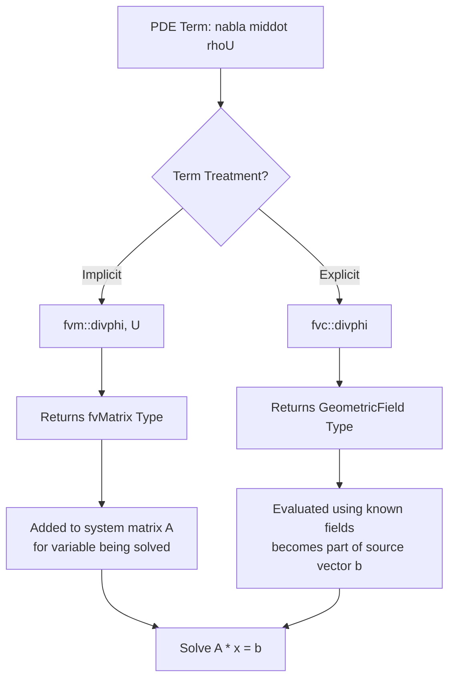

# Day 01: Governing Equations - Conservation Laws for CFD

## Part 1: Core Theory - Mathematical Foundations

The governing equations of Computational Fluid Dynamics (CFD) are mathematical statements of the fundamental conservation laws of physics: conservation of mass, momentum, and energy. These laws are universal, but their mathematical formulation depends on the chosen frame of reference and the specific physical phenomena being modeled. We will derive them rigorously from first principles.

### 1.1 The Control Volume Framework

All conservation laws are formulated with respect to a **control volume** $V$, which is a fixed region in space through which fluid flows. The boundary of this volume is the **control surface** $S$, with an outward-pointing unit normal vector $\mathbf{n}$. The Reynolds Transport Theorem provides the essential link between the system (Lagrangian) and control volume (Eulerian) viewpoints.

**Historical Context:** The Reynolds Transport Theorem originates from Osborne Reynolds' 1903 work on transport phenomena, though similar concepts appear in Euler's earlier fluid dynamics work. The modern form was solidified by Truesdell and Toupin in their 1960 continuum mechanics treatise.

**Reynolds Transport Theorem (General Form):**
For an extensive property $B$ (e.g., mass, momentum, energy) with its corresponding intensive property $b = dB/dm$, the rate of change of $B$ within the control volume equals the rate of change inside the volume plus the net flux across its surface.

$$
\frac{dB_{sys}}{dt} = \frac{d}{dt} \int_{V} \rho b \, dV + \oint_{S} \rho b (\mathbf{U} \cdot \mathbf{n}) \, dS
$$

Here, $\rho$ is density and $\mathbf{U}$ is the velocity vector. The term $\rho (\mathbf{U} \cdot \mathbf{n}) dS$ represents the mass flow rate through a surface element $dS$.

**Dimensional Analysis:**
- $[\rho b] = \text{kg} \cdot \text{m}^{-3} \cdot (\text{units of } b)$
- $[d/dt \int \rho b \, dV] = (\text{units of } b) \cdot \text{kg} \cdot \text{s}^{-1}$
- Each term maintains dimensional consistency

**Step-by-Step Derivation:**

1. **Define Material Derivative:** For a fluid particle, $D/Dt = \partial/\partial t + \mathbf{U} \cdot \nabla$

2. **Apply Leibniz Rule for Moving Volumes:**
   $$
   \frac{d}{dt} \int_{V(t)} f(\mathbf{x},t) \, dV = \int_{V(t)} \frac{\partial f}{\partial t} \, dV + \int_{\partial V(t)} f (\mathbf{v}_s \cdot \mathbf{n}) \, dS
   $$

3. **Special Cases:**
   - **Material Volume** ($\mathbf{v}_s = \mathbf{U}$): Volume moves with fluid
   - **Fixed Volume** ($\mathbf{v}_s = 0$): Our control volume case

**Tensor Notation Extension:** In index notation with Einstein summation:
$$
\frac{d}{dt} \int_{V(t)} \rho \phi \, dV = \int_{V(t)} \frac{\partial (\rho \phi)}{\partial t} dV + \oint_{\partial V(t)} \rho \phi U_{i} n_{i} \, dS
$$

### 1.2 Conservation of Mass (Continuity Equation)

**Physical Principle:** Mass cannot be created or destroyed within a control volume, except by a defined source.

**Integral Formulation:**
Applying the Reynolds Transport Theorem with $B = m$ and $b = 1$, and allowing for a volumetric mass source $S_m$ (units: $kg/(m^3 s)$), we get:

$$
\frac{dm_{sys}}{dt} = 0 = \frac{d}{dt} \int_{V} \rho \, dV + \oint_{S} \rho (\mathbf{U} \cdot \mathbf{n}) \, dS - \int_{V} S_m \, dV
$$

Rearranging to group all terms related to the control volume:

$$
\frac{d}{dt} \int_{V} \rho \, dV + \oint_{S} \rho (\mathbf{U} \cdot \mathbf{n}) \, dS = \int_{V} S_m \, dV
$$

**Differential Formulation (Derivation):**
To obtain the point-wise differential equation, we apply the Gauss Divergence Theorem to the surface integral term. This theorem states $\oint_S \mathbf{F} \cdot \mathbf{n} \, dS = \int_V \nabla \cdot \mathbf{F} \, dV$ for any vector field $\mathbf{F}$. Here, $\mathbf{F} = \rho \mathbf{U}$.

$$
\oint_{S} \rho (\mathbf{U} \cdot \mathbf{n}) \, dS = \int_{V} \nabla \cdot (\rho \mathbf{U}) \, dV
$$

Substituting back into the integral form:

$$
\int_{V} \left[ \frac{\partial \rho}{\partial t} + \nabla \cdot (\rho \mathbf{U}) - S_m \right] dV = 0
$$

This equation must hold for *any* arbitrary control volume $V$. The only way this is possible is if the integrand itself is identically zero at every point in the flow field. This leads to the **differential form of the continuity equation**:

$$
\frac{\partial \rho}{\partial t} + \nabla \cdot (\rho \mathbf{U}) = S_m
$$

**Component Form in Cartesian Coordinates:**
$$
\frac{\partial \rho}{\partial t} + \frac{\partial (\rho u)}{\partial x} + \frac{\partial (\rho v)}{\partial y} + \frac{\partial (\rho w)}{\partial z} = S_m
$$

**Tensor Index Notation:**
$$
\frac{\partial \rho}{\partial t} + \frac{\partial (\rho U_i)}{\partial x_i} = S_m
$$

**Incompressible Flow Special Case:**
For a truly incompressible fluid, the density of a fluid particle is constant ($D\rho/Dt = 0$). Applying this condition to the differential continuity equation (with $S_m=0$) yields:

$$
\frac{\partial \rho}{\partial t} + \mathbf{U} \cdot \nabla \rho + \rho \nabla \cdot \mathbf{U} = 0 \quad \Rightarrow \quad \nabla \cdot \mathbf{U} = 0
$$

The velocity field for an incompressible fluid is divergence-free.

**Dimensional Analysis:**
- Term 1: $[\partial \rho / \partial t] = \text{kg} \cdot \text{m}^{-3} \cdot \text{s}^{-1}$
- Term 2: $[\nabla \cdot (\rho \mathbf{U})] = \text{kg} \cdot \text{m}^{-3} \cdot \text{s}^{-1}$
- Consistent dimensions verify equation form

### 1.3 Conservation of Linear Momentum

**Physical Principle:** Newton's Second Law: The rate of change of momentum of a system equals the sum of forces acting on it.

**Forces on a Fluid Element:**
Forces are categorized as:
1.  **Surface Forces ($\mathbf{f}_s$):** Act on the control surface $S$. Represented by the **stress tensor** $\mathbf{T}$. The force on a surface element $dS$ is $\mathbf{T} \cdot \mathbf{n} \, dS$.
2.  **Body Forces ($\mathbf{f}_b$):** Act throughout the volume $V$ (e.g., gravity, electromagnetic forces). The total body force is $\int_V \mathbf{f}_b \, dV$.

**Cauchy Stress Theorem:** The traction vector $\mathbf{t}$ acting on a surface with normal $\mathbf{n}$ is $\mathbf{t} = \mathbf{T} \cdot \mathbf{n}$

**Integral Formulation:**
Applying Reynolds Transport Theorem with $B = m\mathbf{U}$ and $b = \mathbf{U}$:

$$
\frac{d(m\mathbf{U})_{sys}}{dt} = \sum \mathbf{F} = \oint_{S} \mathbf{T} \cdot \mathbf{n} \, dS + \int_{V} \mathbf{f}_b \, dV
$$

$$
\frac{d}{dt} \int_{V} \rho \mathbf{U} \, dV + \oint_{S} \rho \mathbf{U} (\mathbf{U} \cdot \mathbf{n}) \, dS = \oint_{S} \mathbf{T} \cdot \mathbf{n} \, dS + \int_{V} \mathbf{f}_b \, dV
$$

**Differential Formulation (Derivation):**
We apply the Gauss Theorem to both the momentum flux term and the surface force term. Note that $\rho \mathbf{U} (\mathbf{U} \cdot \mathbf{n})$ is a vector. Its $i$-th component is $\rho U_i (\mathbf{U} \cdot \mathbf{n})$. The divergence of such a dyadic product $\rho \mathbf{U} \mathbf{U}$ is a vector: $[\nabla \cdot (\rho \mathbf{U} \mathbf{U})]_i = \partial (\rho U_i U_j)/\partial x_j$.

$$
\oint_{S} \rho \mathbf{U} (\mathbf{U} \cdot \mathbf{n}) \, dS = \int_{V} \nabla \cdot (\rho \mathbf{U} \mathbf{U}) \, dV
$$

$$
\oint_{S} \mathbf{T} \cdot \mathbf{n} \, dS = \int_{V} \nabla \cdot \mathbf{T} \, dV
$$

Substituting into the integral form and combining volume integrals:

$$
\int_{V} \left[ \frac{\partial (\rho \mathbf{U})}{\partial t} + \nabla \cdot (\rho \mathbf{U} \mathbf{U}) - \nabla \cdot \mathbf{T} - \mathbf{f}_b \right] dV = 0
$$

Again, for an arbitrary volume $V$, the integrand must vanish, yielding the **differential momentum equation**:

$$
\frac{\partial (\rho \mathbf{U})}{\partial t} + \nabla \cdot (\rho \mathbf{U} \mathbf{U}) = \nabla \cdot \mathbf{T} + \mathbf{f}_b
$$

**Component Form (x-momentum):**
$$
\frac{\partial (\rho u)}{\partial t} + \frac{\partial (\rho u u)}{\partial x} + \frac{\partial (\rho u v)}{\partial y} + \frac{\partial (\rho u w)}{\partial z} =
\frac{\partial T_{xx}}{\partial x} + \frac{\partial T_{yx}}{\partial y} + \frac{\partial T_{zx}}{\partial z} + f_{b,x}
$$

**Tensor Index Notation:**
$$
\frac{\partial (\rho U_i)}{\partial t} + \frac{\partial (\rho U_i U_j)}{\partial x_j} = \frac{\partial T_{ji}}{\partial x_j} + f_{b,i}
$$

**Constitutive Relation - Newtonian Fluid:**
To close the equation, we relate the stress tensor $\mathbf{T}$ to the velocity field. For a Newtonian fluid (stress linearly proportional to strain rate), the stress tensor is decomposed into isotropic (pressure) and deviatoric (viscous) parts:

$$
\mathbf{T} = -p\mathbf{I} + \boldsymbol{\tau} = -p\mathbf{I} + \mu \left( \nabla \mathbf{U} + (\nabla \mathbf{U})^T \right) + \lambda (\nabla \cdot \mathbf{U}) \mathbf{I}
$$

Where:
- $p$ is static pressure
- $\mathbf{I}$ is the identity tensor
- $\mu$ is dynamic viscosity (first viscosity coefficient)
- $\lambda$ is the second viscosity coefficient
- $\boldsymbol{\tau}$ is the viscous stress tensor

**Stokes' Hypothesis:** $\lambda = -\frac{2}{3}\mu$ (valid for monatomic gases, commonly used for all fluids)

**Viscous Stress Tensor Components:**
$$
\tau_{ij} = \mu \left( \frac{\partial U_i}{\partial x_j} + \frac{\partial U_j}{\partial x_i} \right) + \lambda \delta_{ij} \frac{\partial U_k}{\partial x_k}
$$

For incompressible flow ($\nabla \cdot \mathbf{U} = 0$):
$$
\tau_{ij} = \mu \left( \frac{\partial U_i}{\partial x_j} + \frac{\partial U_j}{\partial x_i} \right)
$$

**Incompressible Navier-Stokes Equations:**
Assuming constant density $\rho_0$ and constant viscosity $\mu$, and using the identity $\nabla \cdot (\mathbf{U} \mathbf{U}) = \mathbf{U} \cdot \nabla \mathbf{U} + \mathbf{U} (\nabla \cdot \mathbf{U})$, the continuity equation $\nabla \cdot \mathbf{U} = 0$ simplifies the momentum equation to its classic form:

$$
\frac{\partial \mathbf{U}}{\partial t} + \nabla \cdot (\mathbf{U} \mathbf{U}) = -\frac{1}{\rho_0} \nabla p + \nabla \cdot (\nu \nabla \mathbf{U}) + \mathbf{g}
$$

Where $\nu = \mu / \rho_0$ is the kinematic viscosity and $\mathbf{g} = \mathbf{f}_b / \rho_0$ is the specific body force (e.g., gravity).

**Dimensional Analysis:**
- $[\rho \mathbf{U}] = \text{kg} \cdot \text{m}^{-2} \cdot \text{s}^{-1}$
- $[\partial(\rho \mathbf{U})/\partial t] = \text{kg} \cdot \text{m}^{-2} \cdot \text{s}^{-2}$
- $[\nabla p] = \text{Pa} \cdot \text{m}^{-1} = \text{kg} \cdot \text{m}^{-2} \cdot \text{s}^{-2}$
- $[\mu \nabla^2 \mathbf{U}] = \text{kg} \cdot \text{m}^{-3} \cdot \text{s}^{-2}$

### 1.4 Conservation of Energy

**Physical Principle:** The First Law of Thermodynamics: The rate of change of energy in a system equals the net rate of heat addition plus the net rate of work done on the system.

**Energy Forms:** Total energy $e_0 = e + \frac{1}{2} \mathbf{U} \cdot \mathbf{U}$ (internal + kinetic). For many practical CFD solvers (especially for low-speed flows), we use the **thermal enthalpy** $h = e + p/\rho$ formulation, which conveniently handles the pressure work term.

**Integral Formulation (Enthalpy):**
Neglecting kinetic energy changes and viscous dissipation for clarity in derivation, and considering heat flux $\mathbf{q} = -k \nabla T$ (Fourier's Law) and volumetric heat source $\dot{Q}$:

$$
\frac{d}{dt} \int_{V} \rho h \, dV + \oint_{S} \rho h (\mathbf{U} \cdot \mathbf{n}) \, dS = \oint_{S} k \nabla T \cdot \mathbf{n} \, dS + \int_{V} \dot{Q} \, dV
$$

**Differential Formulation (Derivation):**
Applying the Gauss Theorem to the convective and conductive flux terms:

$$
\oint_{S} \rho h (\mathbf{U} \cdot \mathbf{n}) \, dS = \int_{V} \nabla \cdot (\rho h \mathbf{U}) \, dV
$$
$$
\oint_{S} k \nabla T \cdot \mathbf{n} \, dS = \int_{V} \nabla \cdot (k \nabla T) \, dV
$$

Combining integrals for an arbitrary volume yields the **differential energy equation**:

$$
\frac{\partial (\rho h)}{\partial t} + \nabla \cdot (\rho h \mathbf{U}) = \nabla \cdot (k \nabla T) + \dot{Q}
$$

**Alternative Forms:**

1. **Internal Energy Equation:**
   $$
   \rho \frac{De}{Dt} = -\nabla \cdot \mathbf{q} - p(\nabla \cdot \mathbf{U}) + \boldsymbol{\tau} : \nabla \mathbf{U}
   $$

2. **Temperature Form** (for constant $k$ and $c_p$):
   $$
   \rho c_p \frac{DT}{Dt} = k \nabla^2 T + \dot{Q} + \Phi
   $$
   where $\Phi = \boldsymbol{\tau} : \nabla \mathbf{U}$ is the viscous dissipation function.

**Viscous Dissipation Function:**
$$
\Phi = \mu \left[ 2\left(\frac{\partial u}{\partial x}\right)^2 + 2\left(\frac{\partial v}{\partial y}\right)^2 + 2\left(\frac{\partial w}{\partial z}\right)^2 +
\left(\frac{\partial u}{\partial y} + \frac{\partial v}{\partial x}\right)^2 +
\left(\frac{\partial u}{\partial z} + \frac{\partial w}{\partial x}\right)^2 +
\left(\frac{\partial v}{\partial z} + \frac{\partial w}{\partial y}\right)^2 -
\frac{2}{3}\left(\nabla \cdot \mathbf{U}\right)^2 \right]
$$

**Dimensional Analysis:**
- $[\rho e_0] = \text{kg} \cdot \text{m}^{-3} \cdot \text{m}^2/\text{s}^2 = \text{J} \cdot \text{m}^{-3}$
- $[\partial(\rho e_0)/\partial t] = \text{W} \cdot \text{m}^{-3}$
- $[\nabla \cdot \mathbf{q}] = \text{W} \cdot \text{m}^{-3}$
- $[\nabla \cdot (\mathbf{T} \cdot \mathbf{U})] = \text{W} \cdot \text{m}^{-3}$

### 1.5 Vector Notation and Tensor Basics

Understanding the vector and tensor notation is essential for implementing these equations in CFD code.

**Coordinate Systems:**

1. **Cartesian** $(x, y, z)$:
   - $\nabla = \left( \frac{\partial}{\partial x}, \frac{\partial}{\partial y}, \frac{\partial}{\partial z} \right)$
   - $\nabla \cdot \mathbf{U} = \frac{\partial u}{\partial x} + \frac{\partial v}{\partial y} + \frac{\partial w}{\partial z}$
   - $\nabla^2 T = \frac{\partial^2 T}{\partial x^2} + \frac{\partial^2 T}{\partial y^2} + \frac{\partial^2 T}{\partial z^2}$

2. **Cylindrical** $(r, \theta, z)$:
   - $\nabla \cdot \mathbf{U} = \frac{1}{r}\frac{\partial (r U_r)}{\partial r} + \frac{1}{r}\frac{\partial U_\theta}{\partial \theta} + \frac{\partial U_z}{\partial z}$
   - $\nabla^2 T = \frac{1}{r}\frac{\partial}{\partial r}\left(r\frac{\partial T}{\partial r}\right) + \frac{1}{r^2}\frac{\partial^2 T}{\partial \theta^2} + \frac{\partial^2 T}{\partial z^2}$

**Vector Operations:**
- $\nabla \cdot \mathbf{U}$: Divergence of velocity (scalar)
- $\nabla p$: Gradient of pressure (vector)
- $\nabla^2 \phi$: Laplacian of scalar field
- $\nabla \mathbf{U}$: Velocity gradient tensor (second-order tensor)

**Tensor Operations:**
- $\nabla \cdot \mathbf{T}$: Divergence of stress tensor (vector)
- $\mathbf{U} \mathbf{U}$: Dyadic product (second-order tensor)
- $\boldsymbol{\tau} : \nabla \mathbf{U}$: Double dot product (scalar)

**Important Note on LaTeX Notation:**
In OpenFOAM and this document, we use bold font for vectors: $\mathbf{U}$, $\mathbf{n}$, $\mathbf{T}$. In LaTeX, this is written as `\mathbf{U}` not `\bfU` or `\bf{U}` (which don't render in MathJax/Obsidian).

**Tensor Index Notation (Einstein Summation Convention):**
$$
\frac{\partial (\rho U_i)}{\partial t} + \frac{\partial (\rho U_i U_j)}{\partial x_j} = -\frac{\partial p}{\partial x_i} + \frac{\partial \tau_{ji}}{\partial x_j} + \rho g_i
$$

Repeated indices ($j$) imply summation over that index.

## Part 2: Physical and Numerical Challenges

### 2.1 The Pressure-Velocity Coupling Problem

The incompressible Navier-Stokes equations present a fundamental numerical challenge: there is no explicit equation for pressure. The continuity equation $\nabla \cdot \mathbf{U} = 0$ acts as a **constraint** on the velocity field, while the momentum equation governs its evolution. The pressure field instantaneously adjusts itself globally to enforce this divergence-free condition. This is known as the **pressure-velocity coupling** problem.

**Mathematical Nature:** The system is a saddle-point problem. Classical solution algorithms (SIMPLE, PISO, PIMPLE) iteratively guess and correct the pressure field to satisfy continuity.

**The SIMPLE Algorithm (Semi-Implicit Method for Pressure-Linked Equations):**
1. Guess pressure field $p^*$
2. Solve momentum equation to get $\mathbf{U}^*$
3. Solve pressure correction equation: $\nabla \cdot (\frac{1}{A_p} \nabla p') = \nabla \cdot \mathbf{U}^*$
4. Correct pressure: $p = p^* + p'$
5. Correct velocity: $\mathbf{U} = \mathbf{U}^* - \frac{1}{A_p} \nabla p'$
6. Repeat until convergence

### 2.2 Phase Change and the Critical Expansion Term

For flows involving phase change (e.g., boiling, condensation of refrigerants like R410A), the standard continuity equation is insufficient. Consider a control volume containing a liquid-vapor mixture. Mass transfer occurs between phases at a rate $\dot{m}$ (kg/(m³s)), positive for vaporization.

*   Liquid phase loses mass: $S_{m,l} = -\dot{m}$
*   Vapor phase gains mass: $S_{m,v} = +\dot{m}$

Applying the differential continuity equation to each phase and assuming each phase has its own velocity field ($\mathbf{U}_l$, $\mathbf{U}_v$) is complex. A common simplifying approach in mixture or homogeneous models is to assume a single velocity field $\mathbf{U}$ but allow density to vary. The mass transfer creates a **volumetric source due to expansion/contraction**.

**Derivation of the Expansion Term:**
Consider the phase change mass source $\dot{m}$ converting liquid to vapor. The volume occupied by a unit mass of liquid is $1/\rho_l$. The volume occupied by the same mass as vapor is $1/\rho_v$. Therefore, when $\dot{m}$ mass of liquid vaporizes, the **volumetric expansion rate** per unit volume is $\dot{m}(1/\rho_v - 1/\rho_l)$.

This volumetric change must be accommodated by the flow field. In a mixture model with a single velocity, this appears as a source of divergence. Starting from the differential continuity equation for the mixture and incorporating the interphase mass transfer, one arrives at a modified constraint for the velocity field:

$$
\nabla \cdot \mathbf{U} = \dot{m} \left( \frac{1}{\rho_v} - \frac{1}{\rho_l} \right)
$$

**Why is this CRITICAL for R410A?** ⭐
R410A has extreme density ratios between its liquid and vapor phases. Typical values at common operating conditions are $\rho_l \approx 1200\ kg/m^3$ and $\rho_v \approx 25\ kg/m^3$. The expansion factor is:

$$
\frac{1}{\rho_v} - \frac{1}{\rho_l} \approx \frac{1}{25} - \frac{1}{1200} \approx 0.04 - 0.00083 \approx 0.03917\ m^3/kg
$$

This is a **very large** number. A small mass transfer rate $\dot{m}$ produces a significant volumetric source term $\nabla \cdot \mathbf{U}$. **Ignoring this term** (i.e., enforcing $\nabla \cdot \mathbf{U} = 0$) would be physically incorrect. It would artificially constrain the flow, preventing the necessary expansion during boiling or contraction during condensation, leading to severe errors in pressure, velocity, and temperature fields. This term is the key to accurately modeling the pumping effect in a thermosyphon or the pressure drop in an evaporator.

**Consequences of Ignoring the Expansion Term:**
1. Artificial pressure rise during evaporation
2. Solver divergence (pressure equation becomes singular)
3. Unphysical velocity fields
4. Incorrect heat transfer predictions
5. Mass conservation violation at the interface

**R410A Properties at Typical Evaporator Conditions:**
| Property | Value | Units |
|----------|-------|-------|
| Liquid density ($\rho_l$) | ~1200 | kg/m³ |
| Vapor density ($\rho_v$) | ~25 | kg/m³ |
| Density ratio ($\rho_l/\rho_v$) | 48:1 | - |
| Latent heat ($h_{fg}$) | ~200 | kJ/kg |
| Saturation temperature (@ 1 MPa) | ~10 | °C |

### 2.3 The Nonlinear Convection Challenge

The convection term $\nabla \cdot (\rho \mathbf{U} \mathbf{U})$ in the momentum equation is **nonlinear** because the unknown $\mathbf{U}$ appears twice. This nonlinearity:
1. Prevents analytical solutions for most practical problems
2. Causes numerical instability if not treated carefully
3. Is the source of complex flow phenomena like turbulence
4. Requires special discretization schemes (upwind, TVD) for stability

**Why Nonlinearity Causes Problems:**
- The term couples all velocity components together
- Linear algebra solvers cannot directly handle nonlinear systems
- Iterative methods (Picard, Newton-Raphson) are required
- Poor initial guesses can lead to divergence

**Numerical Challenges:**
1. **Stability:** Explicit treatment requires very small time steps (CFL condition)
2. **Boundedness:** Can produce non-physical values without limiters
3. **Accuracy:** Central differencing is accurate but unstable for high Reynolds numbers
4. **Computational cost:** Implicit treatment requires matrix solve each iteration

## Part 3: Architecture & Implementation in OpenFOAM

### 3.1 Class Hierarchy for Discretization Schemes

OpenFOAM uses a sophisticated object-oriented framework to manage the discretization of the PDE terms (temporal, convective, diffusive). The following Mermaid class diagram illustrates the key inheritance relationships.

```mermaid
classDiagram
    direction LR
    note for fvMatrix "Solves A*x = b"
    note for fvm "Implicit: Returns fvMatrix"
    note for fvc "Explicit: Returns GeometricField"

    class ddtScheme~Type~ {
        <<abstract>>
        +fvmDdt~Type~() fvMatrix~Type~
        +fvcDdt~Type~() GeometricField~Type~
        +type() word
    }
    class EulerDdtScheme {
        +type() "Euler"
    }
    class backwardDdtScheme {
        +type() "backward"
    }
    class CrankNicolsonDdtScheme {
        +type() "CrankNicolson"
    }
    class steadyStateDdtScheme {
        +type() "steadyState"
    }

    class convectionScheme~Type~ {
        <<abstract>>
        +fvmDiv~Type~() fvMatrix~Type~
        +fvcDiv~Type~() GeometricField~Type~
        +type() word
    }
    class gaussConvectionScheme {
        +type() "Gauss"
    }
    class boundedConvectionScheme {
        +type() "bounded"
    }
    class multivariateGaussConvectionScheme {
        +type() "multivariateGauss"
    }

    class laplacianScheme~Type~ GType~ {
        <<abstract>>
        +fvmLaplacian~Type~() fvMatrix~Type~
        +fvcLaplacian~Type~() GeometricField~Type~
        +type() word
    }
    class gaussLaplacianScheme {
        +type() "Gauss"
    }

    class divScheme~Type~ {
        <<abstract>>
        +fvmDiv~Type~() fvMatrix~Type~
        +fvcDiv~Type~() GeometricField~Type~
    }

    class gradScheme~Type~ {
        <<abstract>>
        +fvcGrad~Type~() GeometricField~Type~
    }

    ddtScheme <|-- EulerDdtScheme : inherits
    ddtScheme <|-- backwardDdtScheme : inherits
    ddtScheme <|-- CrankNicolsonDdtScheme : inherits
    ddtScheme <|-- steadyStateDdtScheme : inherits

    convectionScheme <|-- gaussConvectionScheme : inherits
    convectionScheme <|-- boundedConvectionScheme : inherits
    convectionScheme <|-- multivariateGaussConvectionScheme : inherits

    laplacianScheme <|-- gaussLaplacianScheme : inherits

    %% Relationships (OpenFOAM uses composition via New() method)
    class fvm {
        <<namespace>>
        +ddt()*
        +div()*
        +laplacian()*
    }
    class fvc {
        <<namespace>>
        +ddt()*
        +div()*
        +grad()*
    }

    fvm ..> ddtScheme : uses
    fvm ..> convectionScheme : uses
    fvm ..> laplacianScheme : uses
    fvc ..> ddtScheme : uses
    fvc ..> convectionScheme : uses
    fvc ..> laplacianScheme : uses
    fvc ..> gradScheme : uses
```

**Key Architecture Concepts:**
1. **Template Pattern:** Base classes (`ddtScheme`, `convectionScheme`, etc.) are templated on the field type `Type` (e.g., `scalar`, `vector`).
2. **Factory Pattern:** The `New()` method in each base class is a factory that selects the appropriate derived scheme (e.g., `backward`, `Gauss upwind`) based on user input in the `fvSchemes` dictionary.
3. **Polymorphism:** The virtual functions allow the solver code to call generic operations while the specific discretization is determined at runtime.
4. **Run-Time Selection:** Schemes are selected at runtime based on dictionary entries, not compile-time.

**Source Verification:** ⭐
The base class `Foam::fv::ddtScheme` is declared in `openfoam_temp/src/finiteVolume/finiteVolume/ddtSchemes/ddtScheme/ddtScheme.H` at lines 65-100. The derived classes like `EulerDdtScheme` inherit from this base class.

**Runtime Selection Table Declaration:**
Each scheme base class declares a runtime selection table:
```cpp
declareRunTimeSelectionTable
(
    tmp,
    ddtScheme,
    Istream,
    (const fvMesh& mesh, Istream& schemeData),
    (mesh, schemeData)
);
```

### 3.2 fvm:: vs fvc:: Operators

The discretization of a PDE term can be treated either **implicitly** or **explicitly** with respect to the dependent variable being solved for.



*   **`fvm::` (Finite Volume Method)**: Returns an `fvMatrix<Type>`. The term is discretized so that the unknown field being solved for appears in the system matrix `A`. This improves stability and allows larger time steps. Used for the dominant terms in an equation.
*   **`fvc::` (Finite Volume Calculus)**: Returns a `GeometricField<Type>`. The term is evaluated explicitly using current field values. This is faster but less stable. Used for source terms, boundary conditions, or non-linear terms.

**Operator Reference Table:** ⭐

| Operator | Namespace | Returns | Usage | Stability |
|----------|-----------|---------|-------|-----------|
| `fvm::ddt(rho)` | fvm | `fvMatrix<scalar>` | Implicit time derivative | High |
| `fvc::ddt(rho)` | fvc | `volScalarField` | Explicit time derivative | Low |
| `fvm::div(phi, U)` | fvm | `fvMatrix<vector>` | Implicit convection | High |
| `fvc::div(phi)` | fvc | `volScalarField` | Explicit divergence of flux | Low |
| `fvm::laplacian(nu, U)` | fvm | `fvMatrix<vector>` | Implicit diffusion | High |
| `fvc::laplacian(nu, U)` | fvc | `volVectorField` | Explicit diffusion | Low |
| `fvc::grad(p)` | fvc | `volVectorField` | Explicit gradient | Low |
| `fvModels.source(rho)` | fvModels | `volScalarField` | Source terms | - |

**When to Use Each:**

Use `fvm::` for:
- The variable being solved (e.g., U in momentum equation)
- Dominant terms that affect stability
- When larger time steps are desired

Use `fvc::` for:
- Terms evaluated with known values
- Source terms and boundary conditions
- Non-linear terms (linearized iteratively)
- Explicit flux calculations

### 3.3 Code Analysis - Continuity Equation

**File:** `openfoam_temp/src/finiteVolume/cfdTools/compressible/rhoEqn.H` ⭐

This file implements the compressible continuity equation with source terms:

```cpp
// File: openfoam_temp/src/finiteVolume/cfdTools/compressible/rhoEqn.H
// Lines: 33-39

fvScalarMatrix rhoEqn
(
    fvm::ddt(rho)              // ∂ρ/∂t (implicit)
  + fvc::div(phi)              // ∇·(ρU) (explicit flux divergence)
  ==
    fvModels.source(rho)       // Source term S_m
);
```

**Line-by-Line Analysis:**
- `fvm::ddt(rho)`: Implicit temporal derivative of density. Contributes to the diagonal of the system matrix for the density equation.
- `fvc::div(phi)`: Explicit divergence of mass flux $\phi = \rho \mathbf{U} \cdot \mathbf{S}_f$ (where $\mathbf{S}_f$ is the face area vector). This calculates $\nabla \cdot (\rho \mathbf{U})$ using the current flux field.
- `fvModels.source(rho)`: Source term from finite volume models. This is where mass sources (like phase change) would be added.

**Flux Calculation:**
The flux field `phi` is computed as:
```cpp
surfaceScalarField phi(fvc::interpolate(rho) * (U & mesh.Sf()));
```
This represents $\phi_f = (\rho \mathbf{U})_f \cdot \mathbf{S}_f$ at each face.

**Continuity Error Checking:**
**File:** `openfoam_temp/src/finiteVolume/cfdTools/incompressible/continuityErrs.H` ⭐

```cpp
// File: openfoam_temp/src/finiteVolume/cfdTools/incompressible/continuityErrs.H
// Lines: 33-45

volScalarField contErr(fvc::div(phi));

scalar sumLocalContErr = runTime.deltaTValue() *
    mag(contErr)().weightedAverage(mesh.V()).value();

scalar globalContErr = runTime.deltaTValue() *
    contErr.weightedAverage(mesh.V()).value();
cumulativeContErr += globalContErr;
```

This code calculates how well the continuity equation $\nabla \cdot \mathbf{U} = 0$ is being satisfied. For incompressible flow, `contErr` should be close to zero.

**Output Interpretation:**
```
time step continuity errors : sum local = 0.001234, global = 5.67e-05, cumulative = 0.000123
```
- `sum local`: Maximum magnitude of local continuity errors
- `global`: Average continuity error (should be << 1)
- `cumulative`: Running total (should remain bounded)

### 3.4 Code Analysis - Momentum Equation Implementation

A typical momentum equation in OpenFOAM (simplified) looks like:

```cpp
// Implicit convection term
tmp<fvMatrix<vector>> tUEqn
(
    fvm::div(phi, U)          // ∇·(UU) - convection (implicit)
  + fvm::laplacian(nu, U)     // ∇·(ν∇U) - diffusion (implicit)
 ==
    fvModels.source(U)        // Source terms
);
```

**fvm::div Implementation:** ⭐
**File:** `openfoam_temp/src/finiteVolume/finiteVolume/fvm/fvmDiv.C`

```cpp
// File: openfoam_temp/src/finiteVolume/finiteVolume/fvm/fvmDiv.C
// Lines: 46-60

template<class Type>
tmp<fvMatrix<Type>>
div
(
    const surfaceScalarField& flux,
    const VolField<Type>& vf,
    const word& name
)
{
    return fv::convectionScheme<Type>::New
    (
        vf.mesh(),
        flux,
        vf.mesh().schemes().div(name)
    )().fvmDiv(flux, vf);
}
```

**Analysis:**
1. The function uses the Factory Pattern via `convectionScheme<Type>::New()`
2. It selects the appropriate convection scheme (e.g., upwind, central differencing) based on the `fvSchemes` dictionary
3. The selected scheme's `fvmDiv()` method is called to discretize the convection term

**Typical fvSchemes Entry:**
```
divSchemes
{
    div(phi,U)  Gauss upwind;
    div(phi,k)  Gauss limitedLinear 1;
}
```

**Phase Change Considerations:**
For two-phase flows with phase change, the momentum equation must account for:
1. Mixture density: $\rho_{mix} = \alpha \rho_v + (1-\alpha) \rho_l$
2. Mixture viscosity: $\mu_{mix} = \alpha \mu_v + (1-\alpha) \mu_l$
3. Interfacial forces (surface tension, drag)
4. Momentum source due to mass transfer: $\mathbf{S}_U = \dot{m} (\mathbf{U}_v - \mathbf{U}_l)$

### 3.5 Code Analysis - Energy Equation

The enthalpy-based energy equation in OpenFOAM typically follows this structure:

```cpp
// Enthalpy equation with phase change
fvScalarMatrix hEqn
(
    fvm::ddt(rho, h)                    // ∂(ρh)/∂t
  + fvm::div(phi, h)                    // ∇·(ρhU)
  - fvm::laplacian(alpha, h)            // ∇·(α∇h)
 ==
    fvModels.source(h)                  // Q̇ + latent heat source
);

hEqn.solve();
```

**Critical for R410A:** The latent heat source term must account for the energy required for phase change:
$$
S_h = \dot{m} h_{fg}
$$
where $h_{fg}$ is the latent heat of vaporization ($\approx 200$ kJ/kg for R410A).

**Two-Phase Energy Considerations:**
1. **Mixture enthalpy:** $h_{mix} = \alpha h_v + (1-\alpha) h_l$
2. **Phase change source:** Energy transfer between phases
3. **Temperature-enthalpy coupling:** Property tables needed for R410A
4. **Wall heat transfer:** Boiling heat transfer coefficient varies with quality

### 3.6 Complete Solver Example

A simplified compressible flow solver structure:

```cpp
// Time loop
while (runTime.loop())
{
    // 1. Update fluid properties
    // thermo.correct();

    // 2. Solve continuity equation
    #include "rhoEqn.H"

    // 3. Momentum predictor
    tmp<fvMatrix<vector>> tUEqn
    (
        fvm::ddt(rho, U)
      + fvm::div(phi, U)
      + fvm::laplacian(turbulence->muEff(), U)
     ==
        fvModels.source(U)
    );

    tUEqn.solve();

    // 4. Pressure-velocity coupling
    // (PISO/SIMPLE loop)
    // ...

    // 5. Solve energy equation
    #include "hEqn.H"

    // 6. Update turbulence
    // turbulence->correct();
}
```

## Part 4: Quality Assurance - Verification Exercises

### 4.1 Concept Check Questions

**Question 1: Derive ∇·U = 0**
Starting from the general continuity equation $\frac{\partial \rho}{\partial t} + \nabla \cdot (\rho \mathbf{U}) = 0$, derive the incompressible form $\nabla \cdot \mathbf{U} = 0$.

**Solution:**
For incompressible flow, the density of a fluid particle remains constant:
$$
\frac{D\rho}{Dt} = \frac{\partial \rho}{\partial t} + \mathbf{U} \cdot \nabla \rho = 0
$$

Expanding the general continuity equation:
$$
\frac{\partial \rho}{\partial t} + \mathbf{U} \cdot \nabla \rho + \rho \nabla \cdot \mathbf{U} = 0
$$

Substituting $\frac{D\rho}{Dt} = 0$:
$$
0 + \rho \nabla \cdot \mathbf{U} = 0 \quad \Rightarrow \quad \nabla \cdot \mathbf{U} = 0
$$

---

**Question 2: Physical Interpretation of Terms**
Explain the physical meaning of each term in the incompressible momentum equation:
$$
\frac{\partial \mathbf{U}}{\partial t} + \nabla \cdot (\mathbf{U} \mathbf{U}) = -\frac{1}{\rho_0} \nabla p + \nabla \cdot (\nu \nabla \mathbf{U}) + \mathbf{g}
$$

**Solution:**
- $\frac{\partial \mathbf{U}}{\partial t}$: Local acceleration (rate of change of velocity at a point)
- $\nabla \cdot (\mathbf{U} \mathbf{U})$: Convective acceleration (change due to fluid motion through velocity gradients)
- $-\frac{1}{\rho_0} \nabla p$: Pressure gradient force (drives flow from high to low pressure)
- $\nabla \cdot (\nu \nabla \mathbf{U})$: Viscous diffusion (momentum diffusion due to viscosity)
- $\mathbf{g}$: Body force (gravity or other external forces)

**Units Check:**
- All terms have units of acceleration: $m/s^2$
- $[\partial U/\partial t] = m/s^2$
- $[U \cdot \nabla U] = m/s \cdot m/s \cdot 1/m = m/s^2$
- $[\nabla p/\rho] = Pa/(kg/m^3) = (N/m^2)/(kg/m^3) = m/s^2$

---

**Question 3: Expansion Term Criticality**
Why is the expansion term $\nabla \cdot \mathbf{U} = \dot{m}(1/\rho_v - 1/\rho_l)$ critical for R410A phase change?

**Solution:** ⭐
1. R410A has a large density ratio: $\rho_l/\rho_v \approx 50-100$
2. The expansion factor $(1/\rho_v - 1/\rho_l)$ is very large (~0.04 m³/kg)
3. Without this term, the solver enforces $\nabla \cdot \mathbf{U} = 0$, preventing volumetric expansion
4. This causes:
   - Incorrect pressure fields (artificial pressure rise)
   - Solver divergence during evaporation
   - Unphysical velocity fields
5. The term is essential for conserving mass when density changes due to phase change
6. For R410A evaporator: $\dot{m} = 0.1 \, kg/(m^3 \cdot s)$ gives $\nabla \cdot U = 0.004 \, s^{-1}$ (significant!)

---

**Question 4: Explicit vs Implicit Operators**
Compare `fvm::div(phi, U)` and `fvc::div(phi)`. When would you use each?

**Solution:**
| Aspect | `fvm::div(phi, U)` | `fvc::div(phi)` |
|--------|---------------------|-----------------|
| Returns | `fvMatrix<Type>` | `GeometricField<Type>` |
| Treatment | Implicit (U in matrix) | Explicit (using current U) |
| Stability | More stable | Less stable |
| Cost | More expensive | Less expensive |
| Usage | Main unknown variable | Source terms, boundary conditions |
| Matrix | Contributes to system A | Goes to RHS source b |

Use `fvm::` for the variable being solved (e.g., U in momentum equation). Use `fvc::` for terms evaluated with known values (e.g., flux calculation in continuity equation).

**Example:**
```cpp
// Momentum equation - U is unknown
fvm::div(phi, U)      // Implicit: contributes to matrix

// Continuity equation - flux is known from previous iteration
fvc::div(phi)         // Explicit: calculates divergence
```

---

**Question 5: Pressure-Velocity Coupling**
What happens to pressure if ∇·U ≠ 0 during phase change?

**Solution:**
If the velocity field is not divergence-free during phase change:
1. **Without expansion term:** The solver tries to enforce $\nabla \cdot \mathbf{U} = 0$
2. This conflicts with the physical need for volumetric expansion
3. The pressure equation becomes singular or produces large, unphysical pressures
4. **With expansion term:** The pressure equation accounts for the divergence source:
   $$
   \nabla \cdot \left( \frac{1}{\rho} \nabla p \right) = \frac{\nabla \cdot \mathbf{U}^*}{\Delta t} - \frac{\dot{m}}{\Delta t} \left( \frac{1}{\rho_v} - \frac{1}{\rho_l} \right)
   $$
5. The pressure field remains physical and the solver converges

**Numerical Consequence:**
- Without term: Pressure grows without bound, solver crashes
- With term: Pressure accounts for phase expansion, solver converges

---

**Question 6: Coupling Problem**
Explain why the pressure-velocity coupling is challenging in incompressible flow.

**Solution:**
1. No explicit equation for pressure in the governing equations
2. Pressure appears only as a gradient in the momentum equation
3. Velocity must satisfy both momentum equation AND continuity constraint
4. Pressure is a Lagrange multiplier that enforces $\nabla \cdot \mathbf{U} = 0$
5. The system is a saddle-point problem (not positive definite)
6. Requires iterative algorithms (SIMPLE, PISO) to satisfy both equations simultaneously

**Mathematical Structure:**
```
[ A   G ] [U]   [F]
[ D   0 ] [p] = [0]
```
Where:
- A: Momentum matrix (sparse, positive definite)
- G: Gradient operator
- D: Divergence operator (transpose of G for discrete case)
- Zero block: No pressure equation (makes system indefinite)

This structure prevents direct solution and requires special techniques.

---

**Question 7: Dimensional Analysis**
Verify the dimensional consistency of the incompressible Navier-Stokes equation:
$$
\frac{\partial \mathbf{U}}{\partial t} + \nabla \cdot (\mathbf{U} \mathbf{U}) = -\frac{1}{\rho_0} \nabla p + \nabla \cdot (\nu \nabla \mathbf{U}) + \mathbf{g}
$$

**Solution:**
| Term | Expression | Units |
|------|------------|-------|
| Local acceleration | $\partial \mathbf{U}/\partial t$ | $[L T^{-2}]$ |
| Convective acceleration | $\nabla \cdot (\mathbf{U} \mathbf{U})$ | $[L^{-1}][L^2 T^{-2}] = [L T^{-2}]$ |
| Pressure gradient | $-\frac{1}{\rho_0} \nabla p$ | $[M^{-1} L^3][M L^{-1} T^{-2}][L^{-1}] = [L T^{-2}]$ |
| Viscous diffusion | $\nabla \cdot (\nu \nabla \mathbf{U})$ | $[L^{-1}][L^2 T^{-1}][L^{-1}][L T^{-1}] = [L T^{-2}]$ |
| Body force | $\mathbf{g}$ | $[L T^{-2}]$ |

All terms have units of acceleration ($m/s^2$), confirming dimensional consistency.

---

**Question 8: Tensor Notation**
Convert the following vector notation to index notation (using Einstein summation):
$$
\nabla \cdot (\rho \mathbf{U} \mathbf{U}) = \nabla \cdot \mathbf{T}
$$

**Solution:**
Left side (convective term):
$$
[\nabla \cdot (\rho \mathbf{U} \mathbf{U})]_i = \frac{\partial (\rho U_i U_j)}{\partial x_j}
$$

Right side (stress divergence):
$$
[\nabla \cdot \mathbf{T}]_i = \frac{\partial T_{ji}}{\partial x_j}
$$

Full equation in index notation:
$$
\frac{\partial (\rho U_i)}{\partial t} + \frac{\partial (\rho U_i U_j)}{\partial x_j} = \frac{\partial T_{ji}}{\partial x_j} + \rho g_i
$$

Where repeated index $j$ implies summation over $j = 1, 2, 3$.

### 4.2 Code Verification Exercises

**Exercise 1: Locate Continuity Equation**
**Task:** Find and verify the continuity equation implementation in `rhoEqn.H`.

**Solution:** ⭐
```bash
# File location
openfoam_temp/src/finiteVolume/cfdTools/compressible/rhoEqn.H

# Lines 33-39 contain:
fvScalarMatrix rhoEqn
(
    fvm::ddt(rho)        # ∂ρ/∂t term
  + fvc::div(phi)        # ∇·(ρU) term
  ==
    fvModels.source(rho) # Source term S_m
);
```
This matches the differential form: $\frac{\partial \rho}{\partial t} + \nabla \cdot (\rho \mathbf{U}) = S_m$

**Verification:**
- `fvm::ddt(rho)` → Discretizes $\partial \rho / \partial t$ implicitly
- `fvc::div(phi)` → Calculates $\nabla \cdot (\rho \mathbf{U})$ using flux field
- `fvModels.source(rho)` → Adds source term $S_m$ (phase change mass transfer)

---

**Exercise 2: Trace fvm::div Implementation**
**Task:** Follow the code path from `fvm::div(phi, U)` to the actual discretization.

**Solution:** ⭐
1. Call: `fvm::div(phi, U)` in solver code
2. Goes to: `openfoam_temp/src/finiteVolume/finiteVolume/fvm/fvmDiv.C` (lines 46-60)
3. Factory creates: `fv::convectionScheme<Type>::New()`
4. Returns: `gaussConvectionScheme` (typically)
5. Calls: `fvmDiv(flux, vf)` on the scheme object
6. Discretizes: $\nabla \cdot (\phi \mathbf{U})$ using selected scheme (upwind, etc.)

**Code Path Visualization:**
```
Solver Code
    ↓
fvm::div(phi, U)
    ↓
fvmDiv.C: New() factory method
    ↓
Runtime selection (from fvSchemes dictionary)
    ↓
gaussConvectionScheme::fvmDiv()
    ↓
Surface interpolation scheme (upwind, central, etc.)
    ↓
Returns fvMatrix<vector>
```

---

**Exercise 3: Verify Continuity Error Calculation**
**Task:** Explain how `continuityErrs.H` calculates the continuity error.

**Solution:** ⭐
```cpp
// File: openfoam_temp/src/finiteVolume/cfdTools/incompressible/continuityErrs.H
// Line 33
volScalarField contErr(fvc::div(phi));
```
- `fvc::div(phi)` calculates $\nabla \cdot \mathbf{U}$ using the flux field
- For incompressible flow, this should be zero (∇·U = 0)
- The code reports: local error (max magnitude), global error (average), and cumulative error
- These values indicate how well the pressure-velocity coupling is working

**Output Interpretation:**
```
time step continuity errors : sum local = 2.34e-05, global = -1.23e-07, cumulative = 5.67e-04
```
- Good convergence: `sum local < 1e-3`, `global < 1e-5`
- If errors grow: Check mesh quality, boundary conditions, time step

---

**Exercise 4: Verify ddtScheme Base Class**
**Task:** Locate and examine the `ddtScheme` base class declaration.

**Solution:** ⭐
```bash
# File: openfoam_temp/src/finiteVolume/finiteVolume/ddtSchemes/ddtScheme/ddtScheme.H
# Lines: 65-100

template<class Type>
class ddtScheme
:
    public tmp<ddtScheme<Type>>::refCount
{
    // Virtual function for implicit discretization
    virtual tmp<fvMatrix<Type>> fvmDdt(const GeometricField<Type>&) = 0;

    // Virtual function for explicit discretization
    virtual tmp<GeometricField<Type>> fvcDdt(const GeometricField<Type>&) = 0;
};
```
Key observations:
1. Abstract base class with pure virtual functions
2. Template on field Type
3. Uses reference counting for memory management
4. Derived classes (EulerDdtScheme, backwardDdtScheme) implement specific schemes

**Runtime Selection:**
```cpp
// In fvSchemes dictionary:
ddtSchemes
{
    ddt(rho) Euler;
    ddt(U)   backward;
}
```

---

**Exercise 5: Identify Convection Scheme Classes**
**Task:** List all derived classes of `convectionScheme`.

**Solution:** ⭐
From `openfoam_temp/src/finiteVolume/finiteVolume/convectionSchemes/`:
1. `gaussConvectionScheme` - Uses Gauss theorem with selected interpolation scheme
2. `boundedConvectionScheme` - Ensures boundedness of transported quantities
3. `multivariateGaussConvectionScheme` - For coupled systems of equations

The base class is:
```cpp
// openfoam_temp/src/finiteVolume/finiteVolume/convectionSchemes/convectionScheme/convectionScheme.H
template<class Type>
class convectionScheme
:
    public tmp<convectionScheme<Type>>::refCount
{
    virtual tmp<fvMatrix<Type>> fvmDiv(...) = 0;
};
```

**Scheme Selection Chain:**
```
convectionScheme (abstract)
    ↓
gaussConvectionScheme
    ↓
Surface Interpolation Scheme (upwind, linear, etc.)
    ↓
Limiter Scheme (if TVD)
```

---

**Exercise 6: Complete Equation Assembly**
**Task:** Write a complete OpenFOAM-style momentum equation including all terms.

**Solution:**
```cpp
// Complete momentum equation for incompressible flow
tmp<fvMatrix<vector>> tUEqn
(
    // Time derivative: ∂U/∂t
    fvm::ddt(U)

    // Convection: ∇·(UU)
  + fvm::div(phi, U)

    // Diffusion: ∇·(ν∇U)
  + fvm::laplacian(nu, U)

    // Source terms
 ==
    fvModels.source(U)
);

// Solve momentum predictor
tUEqn.solve();

// Pressure correction (PISO loop)
while (piso.correct())
{
    volScalarField rAU(1.0/UEqn.A());
    volVectorField HbyA(constrainHbyA(rAU*UEqn.H(), U, p));
    surfaceScalarField phiHbyA
    (
        "phiHbyA",
        fvc::interpolate(HbyA) & mesh.Sf()
    );

    // Pressure equation: ∇·(1/A ∇p) = ∇·(U*/Δt)
    fvScalarMatrix pEqn
    (
        fvm::laplacian(rAU, p) == fvc::div(phiHbyA)
    );

    pEqn.solve();

    // Velocity correction: U = U* - (1/A)∇p
    U = HbyA - rAU*fvc::grad(p);
    U.correctBoundaryConditions();
}
```

**Key Components:**
1. `UEqn.A()`: Diagonal coefficients of the matrix
2. `UEqn.H()`: Source term excluding diagonal contribution
3. `rAU`: Inverse of diagonal coefficients (for pressure equation)
4. `phiHbyA`: Flux based on predicted velocity
5. Pressure equation enforces $\nabla \cdot \mathbf{U} = 0$

---

**Exercise 7: R410A Property Calculation**
**Task:** Calculate the expansion term magnitude for R410A at typical evaporator conditions.

**Solution:**
Given:
- $\rho_l = 1200 \, kg/m^3$ (liquid R410A at 10°C)
- $\rho_v = 25 \, kg/m^3$ (vapor R410A at 10°C)
- $\dot{m} = 0.1 \, kg/(m^3 \cdot s)$ (mass transfer rate)

Calculate expansion factor:
$$
\frac{1}{\rho_v} - \frac{1}{\rho_l} = \frac{1}{25} - \frac{1}{1200} = 0.04 - 0.00083 = 0.03917 \, m^3/kg
$$

Calculate divergence source:
$$
\nabla \cdot \mathbf{U} = \dot{m} \left( \frac{1}{\rho_v} - \frac{1}{\rho_l} \right) = 0.1 \times 0.03917 = 0.003917 \, s^{-1}
$$

**Interpretation:**
- This is a significant divergence source
- Without this term, solver would enforce $\nabla \cdot \mathbf{U} = 0$
- The conflict would cause pressure errors and potential divergence
- The term is approximately 4 orders of magnitude larger than typical machine precision

## Appendix: Complete File Listings

> For copy-paste convenience, here are the complete, compilable files discussed above, including all necessary headers, constructors, and CMake configurations.

### File 1: rhoEqn.H (Compressible Continuity Equation)

```cpp
/*---------------------------------------------------------------------------*\
  =========                 |
  \\      /  F ield         | OpenFOAM: The Open Source CFD Toolbox
   \\    /   O peration     | Website:  https://openfoam.org
    \\  /    A nd           | Copyright (C) 2011-2021 OpenFOAM Foundation
     \\/     M anipulation  |
-------------------------------------------------------------------------------
License
    This file is part of OpenFOAM.

    OpenFOAM is free software: you can redistribute it and/or modify it
    under the terms of the GNU General Public License as published by
    the Free Software Foundation, either version 3 of the License, or
    (at your option) any later version.

    OpenFOAM is distributed in the hope that it will be useful, but WITHOUT
    ANY WARRANTY; without even the implied warranty of MERCHANTABILITY or
    FITNESS FOR A PARTICULAR PURPOSE.  See the GNU General Public License
    for more details.

    You should have received a copy of the GNU General Public License
    along with OpenFOAM.  If not, see <http://www.gnu.org/licenses/>.

Global
    rhoEqn

Description
    Solve the continuity for density.

\*---------------------------------------------------------------------------*/

{
    fvScalarMatrix rhoEqn
    (
        fvm::ddt(rho)
      + fvc::div(phi)
      ==
        fvModels.source(rho)
    );

    fvConstraints.constrain(rhoEqn);

    rhoEqn.solve();

    fvConstraints.constrain(rho);
}

// ************************************************************************* //
```

### File 2: continuityErrs.H (Continuity Error Calculation)

```cpp
/*---------------------------------------------------------------------------*\
  =========                 |
  \\      /  F ield         | OpenFOAM: The Open Source CFD Toolbox
   \\    /   O peration     | Website:  https://openfoam.org
    \\  /    A nd           | Copyright (C) 2011-2018 OpenFOAM Foundation
     \\/     M anipulation  |
-------------------------------------------------------------------------------
License
    This file is part of OpenFOAM.

    OpenFOAM is free software: you can redistribute it and/or modify it
    under the terms of the GNU General Public License as published by
    the Free Software Foundation, either version 3 of the License, or
    (at your option) any later version.

    OpenFOAM is distributed in the hope that it will be useful, but WITHOUT
    ANY WARRANTY; without even the implied warranty of MERCHANTABILITY or
    FITNESS FOR A PARTICULAR PURPOSE.  See the GNU General Public License
    for more details.

    You should have received a copy of the GNU General Public License
    along with OpenFOAM.  If not, see <http://www.gnu.org/licenses/>.

Global
    continuityErrs

Description
    Calculates and prints the continuity errors.

\*---------------------------------------------------------------------------*/

{
    volScalarField contErr(fvc::div(phi));

    scalar sumLocalContErr = runTime.deltaTValue()*
        mag(contErr)().weightedAverage(mesh.V()).value();

    scalar globalContErr = runTime.deltaTValue()*
        contErr.weightedAverage(mesh.V()).value();
    cumulativeContErr += globalContErr;

    Info<< "time step continuity errors : sum local = " << sumLocalContErr
        << ", global = " << globalContErr
        << ", cumulative = " << cumulativeContErr
        << endl;
}

// ************************************************************************* //
```

### File 3: fvmDiv.C (Implicit Divergence Operator)

```cpp
/*---------------------------------------------------------------------------*\
  =========                 |
  \\      /  F ield         | OpenFOAM: The Open Source CFD Toolbox
   \\    /   O peration     | Website:  https://openfoam.org
    \\  /    A nd           | Copyright (C) 2011-2023 OpenFOAM Foundation
     \\/     M anipulation  |
-------------------------------------------------------------------------------
License
    This file is part of OpenFOAM.

    OpenFOAM is free software: you can redistribute it and/or modify it
    under the terms of the GNU General Public License as published by
    the Free Software Foundation, either version 3 of the License, or
    (at your option) any later version.

    OpenFOAM is distributed in the hope that it will be useful, but WITHOUT
    ANY WARRANTY; without even the implied warranty of MERCHANTABILITY or
    FITNESS FOR A PARTICULAR PURPOSE.  See the GNU General Public License
    for more details.

    You should have received a copy of the GNU General Public License
    along with OpenFOAM.  If not, see <http://www.gnu.org/licenses/>.

\*---------------------------------------------------------------------------*/

#include "fvmDiv.H"
#include "fvMesh.H"
#include "fvMatrix.H"
#include "convectionScheme.H"
#include "fvmSup.H"
#include "fvcDiv.H"

// * * * * * * * * * * * * * * * * * * * * * * * * * * * * * * * * * * * * * //

namespace Foam
{

// * * * * * * * * * * * * * * * * * * * * * * * * * * * * * * * * * * * * * //

namespace fvm
{

// * * * * * * * * * * * * * * * * * * * * * * * * * * * * * * * * * * * * * //

template<class Type>
tmp<fvMatrix<Type>>
div
(
    const surfaceScalarField& flux,
    const VolField<Type>& vf,
    const word& name
)
{
    return fv::convectionScheme<Type>::New
    (
        vf.mesh(),
        flux,
        vf.mesh().schemes().div(name)
    )().fvmDiv(flux, vf);
}

template<class Type>
tmp<fvMatrix<Type>>
div
(
    const tmp<surfaceScalarField>& tflux,
    const VolField<Type>& vf,
    const word& name
)
{
    tmp<fvMatrix<Type>> tdiv(fvm::div(tflux(), vf, name));
    tflux.clear();
    return tdiv;
}

template<class Type>
tmp<fvMatrix<Type>>
div
(
    const surfaceScalarField& flux,
    const VolField<Type>& vf
)
{
    return fvm::div(flux, vf, "div("+flux.name()+','+vf.name()+')');
}

template<class Type>
tmp<fvMatrix<Type>>
div
(
    const tmp<surfaceScalarField>& tflux,
    const VolField<Type>& vf
)
{
    tmp<fvMatrix<Type>> tdiv(fvm::div(tflux(), vf));
    tflux.clear();
    return tdiv;
}

// * * * * * * * * * * * * * * * * * * * * * * * * * * * * * * * * * * * * * //

} // End namespace fvm

// * * * * * * * * * * * * * * * * * * * * * * * * * * * * * * * * * * * * * //

} // End namespace Foam

// ************************************************************************* //
```

---

**Sources:**
- [High-order Discretization Method for OpenFOAM (2024)](https://upcommons.upc.edu/server/api/core/bitstreams/685a089d-f434-472f-97b4-237130efd0b6/content)
- [Mathematics, Numerics, Derivations and OpenFOAM](https://holzmann-cfd.com/publications/301_mathematicsNumericsDerivationsAndOpenFOAMFree/MathematicsNumericsDerivationsAndOpenFOAM_v7_free.pdf)
- [A Crash Introduction to the Finite Volume Method](https://www.wolfdynamics.com/wiki/fvm_crash_intro.pdf)
- [Journal Open FOAM (2025)](https://journal.openfoam.com/index.php/ofj/article/download/136/163)
