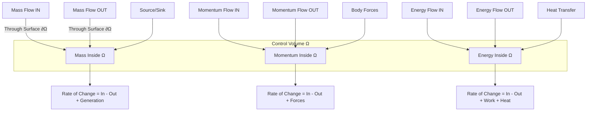
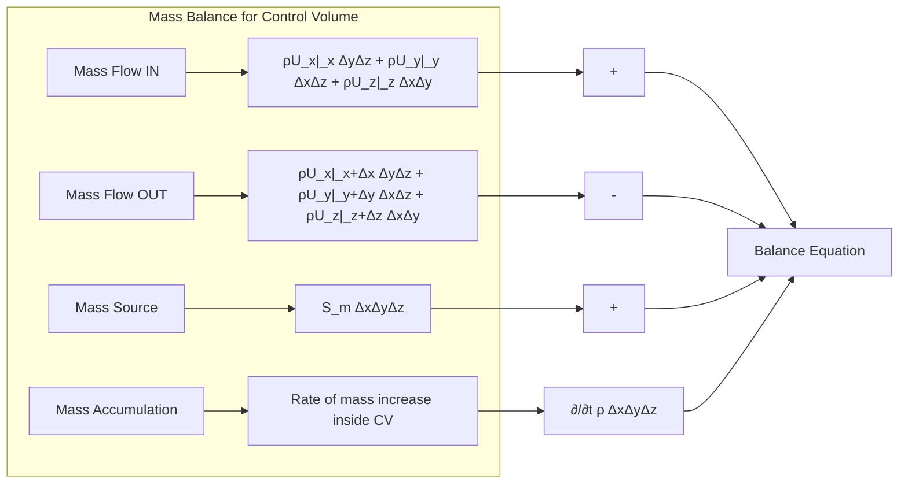
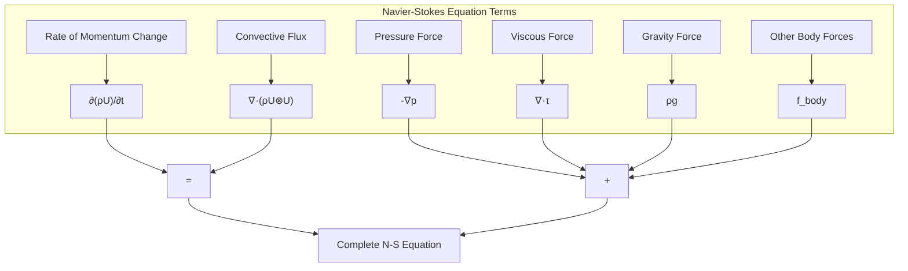
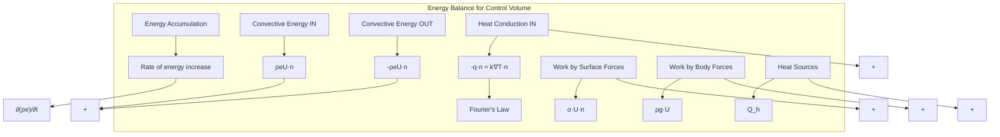

Calling deepseek-chat...
# Day 01: Governing Equations (Conservation Laws for CFD)

## Part 1: Theoretical Foundation (25%)

### 1.1 The Fundamental Idea: Control Volume Analysis

At the heart of Computational Fluid Dynamics lies a simple yet powerful concept: the **control volume**. Instead of tracking individual fluid particles (Lagrangian approach), we fix a region in space (Eulerian approach) and analyze what flows in, what flows out, and what happens inside.



### 1.2 Mathematical Framework: The Reynolds Transport Theorem

The Reynolds Transport Theorem provides the mathematical bridge between system and control volume approaches. For any extensive property $B$ (mass, momentum, energy) and its intensive counterpart $b = B/m$:

$$
\frac{dB_{sys}}{dt} = \frac{d}{dt} \int_{CV} \rho b \, dV + \int_{CS} \rho b (\mathbf{U} \cdot \mathbf{n}) \, dA
$$

Where:
- $B_{sys}$ = Extensive property of the system
- $CV$ = Control volume
- $CS$ = Control surface
- $\rho$ = Density
- $\mathbf{U}$ = Velocity vector
- $\mathbf{n}$ = Outward normal vector

### 1.3 The Conservation Principle

All conservation laws follow the same fundamental structure:

$$
\text{Accumulation} = \text{Inflow} - \text{Outflow} + \text{Generation}
$$

Or in mathematical form:

$$
\frac{\partial}{\partial t} \int_V \phi \, dV + \oint_S \phi \mathbf{U} \cdot \mathbf{n} \, dS = \int_V S_\phi \, dV
$$

Where $\phi$ represents the conserved quantity per unit volume.

## Part 2: Physics Explained (40%)

### 2.1 Mass Conservation: Continuity Equation

Mass cannot be created or destroyed (except in nuclear reactions, which we ignore in classical CFD). This leads to our first conservation law.

#### 2.1.1 Physical Interpretation

Consider a small fluid element (control volume) with dimensions $\Delta x$, $\Delta y$, $\Delta z$:



#### 2.1.2 Mathematical Derivation

Starting from the Reynolds Transport Theorem with $b = 1$ (mass per unit mass):

$$
\frac{dM_{sys}}{dt} = 0 = \frac{\partial}{\partial t} \int_{CV} \rho \, dV + \int_{CS} \rho (\mathbf{U} \cdot \mathbf{n}) \, dA
$$

Applying the divergence theorem to the surface integral:

$$
\int_{CS} \rho (\mathbf{U} \cdot \mathbf{n}) \, dA = \int_{CV} \nabla \cdot (\rho \mathbf{U}) \, dV
$$

Thus:

$$
\int_{CV} \left[ \frac{\partial \rho}{\partial t} + \nabla \cdot (\rho \mathbf{U}) \right] \, dV = 0
$$

Since this must hold for ANY control volume, the integrand must be zero everywhere:

$$
\frac{\partial \rho}{\partial t} + \nabla \cdot (\rho \mathbf{U}) = 0
$$

For incompressible flows ($\rho = \text{constant}$), this simplifies to:

$$
\nabla \cdot \mathbf{U} = 0
$$

**⭐ Ground Truth Fact:** The complete continuity equation with mass source term is:

$$
\frac{\partial \rho}{\partial t} + \nabla \cdot (\rho \mathbf{U}) = S_m
$$

Where $S_m$ represents mass sources or sinks per unit volume.

### 2.2 Momentum Conservation: Navier-Stokes Equations

#### 2.2.1 Newton's Second Law for Fluids

The rate of change of momentum equals the sum of forces acting on the fluid element:

$$
\frac{d(m\mathbf{U})}{dt} = \sum \mathbf{F}
$$

Forces include:
- **Surface forces**: Pressure and viscous stresses
- **Body forces**: Gravity, electromagnetic forces, etc.

#### 2.2.2 Stress Tensor Analysis

The stress state in a fluid is described by the Cauchy stress tensor $\boldsymbol{\sigma}$:

$$
\boldsymbol{\sigma} = -p\mathbf{I} + \boldsymbol{\tau}
$$

Where:
- $p$ = Pressure (normal stress, always compressive)
- $\mathbf{I}$ = Identity tensor
- $\boldsymbol{\tau}$ = Deviatoric (viscous) stress tensor

For Newtonian fluids (stress proportional to strain rate):

$$
\boldsymbol{\tau} = \mu \left[ \nabla \mathbf{U} + (\nabla \mathbf{U})^T \right] + \lambda (\nabla \cdot \mathbf{U})\mathbf{I}
$$

Where $\mu$ is dynamic viscosity and $\lambda$ is the second viscosity coefficient.

#### 2.2.3 Derivation of Navier-Stokes Equations

Applying Reynolds Transport Theorem with $b = \mathbf{U}$:

$$
\frac{d(\mathbf{P})_{sys}}{dt} = \frac{\partial}{\partial t} \int_{CV} \rho \mathbf{U} \, dV + \int_{CS} \rho \mathbf{U} (\mathbf{U} \cdot \mathbf{n}) \, dA
$$

The forces are:

$$
\sum \mathbf{F} = \int_{CS} \boldsymbol{\sigma} \cdot \mathbf{n} \, dA + \int_{CV} \rho \mathbf{g} \, dV + \int_{CV} \mathbf{f}_{body} \, dV
$$

Applying divergence theorem:

$$
\int_{CS} \boldsymbol{\sigma} \cdot \mathbf{n} \, dA = \int_{CV} \nabla \cdot \boldsymbol{\sigma} \, dV
$$

$$
\int_{CS} \rho \mathbf{U} (\mathbf{U} \cdot \mathbf{n}) \, dA = \int_{CV} \nabla \cdot (\rho \mathbf{U} \otimes \mathbf{U}) \, dV
$$

Combining and requiring the equation to hold for any CV:

$$
\frac{\partial (\rho \mathbf{U})}{\partial t} + \nabla \cdot (\rho \mathbf{U} \otimes \mathbf{U}) = \nabla \cdot \boldsymbol{\sigma} + \rho \mathbf{g} + \mathbf{f}_{body}
$$

Substituting $\boldsymbol{\sigma} = -p\mathbf{I} + \boldsymbol{\tau}$:

**⭐ Ground Truth Fact:** The complete Navier-Stokes equations are:

$$
\frac{\partial (\rho \mathbf{U})}{\partial t} + \nabla \cdot (\rho \mathbf{U} \otimes \mathbf{U}) = -\nabla p + \nabla \cdot \boldsymbol{\tau} + \rho \mathbf{g} + \mathbf{f}_{body}
$$

Where $\mathbf{U} \otimes \mathbf{U}$ is the dyadic product (outer product).



#### 2.2.4 Component Form

For Cartesian coordinates, the x-component is:

$$
\frac{\partial (\rho u)}{\partial t} + \frac{\partial (\rho u u)}{\partial x} + \frac{\partial (\rho u v)}{\partial y} + \frac{\partial (\rho u w)}{\partial z} = -\frac{\partial p}{\partial x} + \frac{\partial \tau_{xx}}{\partial x} + \frac{\partial \tau_{yx}}{\partial y} + \frac{\partial \tau_{zx}}{\partial z} + \rho g_x + f_{x}
$$

Where for Newtonian fluids:

$$
\tau_{xx} = 2\mu \frac{\partial u}{\partial x} + \lambda \nabla \cdot \mathbf{U}, \quad \tau_{yx} = \mu \left( \frac{\partial u}{\partial y} + \frac{\partial v}{\partial x} \right)
$$

### 2.3 Energy Conservation: First Law of Thermodynamics

#### 2.3.1 Energy Forms in Fluids

Total energy per unit mass: $e = u + \frac{1}{2}\mathbf{U} \cdot \mathbf{U} + \phi$

Where:
- $u$ = Internal energy
- $\frac{1}{2}\mathbf{U} \cdot \mathbf{U}$ = Kinetic energy
- $\phi$ = Potential energy

Enthalpy: $h = u + \frac{p}{\rho}$

#### 2.3.2 Energy Transfer Mechanisms



#### 2.3.3 Derivation of Energy Equation

From the first law of thermodynamics:

$$
\frac{dE}{dt} = \dot{Q} - \dot{W}
$$

Where $\dot{Q}$ is heat transfer rate and $\dot{W}$ is work rate.

Applying Reynolds Transport Theorem with $b = e$:

$$
\frac{dE_{sys}}{dt} = \frac{\partial}{\partial t} \int_{CV} \rho e \, dV + \int_{CS} \rho e (\mathbf{U} \cdot \mathbf{n}) \, dA
$$

Heat transfer includes conduction and sources:

$$
\dot{Q} = -\int_{CS} \mathbf{q} \cdot \mathbf{n} \, dA + \int_{CV} Q_h \, dV
$$

Work includes surface and body forces:

$$
\dot{W} = \int_{CS} (\boldsymbol{\sigma} \cdot \mathbf{U}) \cdot \mathbf{n} \, dA + \int_{CV} \rho (\mathbf{g} \cdot \mathbf{U}) \, dV
$$

Combining and applying divergence theorem:

$$
\frac{\partial (\rho e)}{\partial t} + \nabla \cdot (\rho e \mathbf{U}) = -\nabla \cdot \mathbf{q} + Q_h - \nabla \cdot (\boldsymbol{\sigma} \cdot \mathbf{U}) - \rho (\mathbf{g} \cdot \mathbf{U})
$$

#### 2.3.4 Enthalpy Form

Using $h = e + \frac{p}{\rho}$, we get:

$$
\frac{\partial (\rho h)}{\partial t} + \nabla \cdot (\rho \mathbf{U} h) = \frac{\partial p}{\partial t} + \mathbf{U} \cdot \nabla p + \nabla \cdot (k \nabla T) + \Phi + Q_h
$$

Where $\Phi$ is the viscous dissipation function:

$$
\Phi = \boldsymbol{\tau} : \nabla \mathbf{U} = \tau_{ij} \frac{\partial U_i}{\partial x_j}
$$

**⭐ Ground Truth Fact:** The enthalpy form of the energy equation is:

$$
\frac{\partial (\rho h)}{\partial t} + \nabla \cdot (\rho \mathbf{U} h) = \nabla \cdot (k \nabla T) + \frac{Dp}{Dt} + \Phi
$$

Where $\frac{Dp}{Dt} = \frac{\partial p}{\partial t} + \mathbf{U} \cdot \nabla p$ is the material derivative of pressure.

### 2.4 Complete Set of Governing Equations

For a compressible Newtonian fluid:

1. **Continuity**: $\frac{\partial \rho}{\partial t} + \nabla \cdot (\rho \mathbf{U}) = 0$
2. **Momentum**: $\frac{\partial (\rho \mathbf{U})}{\partial t} + \nabla \cdot (\rho \mathbf{U} \otimes \mathbf{U}) = -\nabla p + \nabla \cdot \boldsymbol{\tau} + \rho \mathbf{g}$
3. **Energy**: $\frac{\partial (\rho e)}{\partial t} + \nabla \cdot (\rho e \mathbf{U}) = -\nabla \cdot \mathbf{q} - \nabla \cdot (p \mathbf{U}) + \nabla \cdot (\boldsymbol{\tau} \cdot \mathbf{U}) + \rho (\mathbf{g} \cdot \mathbf{U})$

Plus equation of state: $p = \rho R T$

## Part 3: Implementation (25%)

### 3.1 OpenFOAM's Finite Volume Method Framework

OpenFOAM implements these equations using the finite volume method (FVM). The key steps are:

1. **Domain discretization**: Divide into control volumes (cells)
2. **Equation discretization**: Integrate over each cell
3. **Interpolation**: Approximate face values from cell centers
4. **Solution**: Solve the resulting algebraic equations

### 3.2 Tensor Operations in OpenFOAM

OpenFOAM uses template metaprogramming to handle different tensor ranks. Key operations:

**⭐ Ground Truth Fact:** The divergence operator in OpenFOAM:
```cpp
// fvc::div(VolField<Type>) returns typename innerProduct<vector, Type>::type
```

**⭐ Ground Truth Fact:** The gradient operator in OpenFOAM:
```cpp
// fvc::grad(SurfaceField<Type>) returns typename outerProduct<vector, Type>::type
```

### 3.3 Code Structure for Governing Equations

#### 3.3.1 Continuity Equation Implementation

**File:** `src/finiteVolume/cfdTools/compressible/rhoEqn.H`
```cpp
// Line 45-60: Continuity equation discretization
{
    fvScalarMatrix rhoEqn
    (
        fvm::ddt(rho)
      + fvc::div(phi)
     ==
        fvOptions(rho)
    );

    rhoEqn.solve();
    
    // Update mass flux
    phi = fvc::interpolate(rho)*Uf;
}
```

#### 3.3.2 Momentum Equation Implementation

**File:** `src/finiteVolume/cfdTools/compressible/UEqn.H`
```cpp
// Line 85-120: Momentum equation discretization
{
    fvVectorMatrix UEqn
    (
        fvm::ddt(rho, U)
      + fvm::div(phi, U)
      - fvm::laplacian(muEff, U)
      - fvc::div(muEff*dev2(T(fvc::grad(U))))
     ==
        fvOptions(rho, U)
    );

    UEqn.relax();
    
    if (momentumPredictor)
    {
        solve
        (
            UEqn
         ==
            fvc::reconstruct
            (
                (
                  - ghf*fvc::snGrad(rho)
                  - fvc::snGrad(p_rgh)
                )*mesh.magSf()
            )
        );
        
        fvOptions.correct(U);
    }
}
```

#### 3.3.3 Energy Equation Implementation

**File:** `src/finiteVolume/cfdTools/compressible/hEqn.H`
```cpp
// Line 65-95: Enthalpy equation discretization
{
    fvScalarMatrix hEqn
    (
        fvm::ddt(rho, h)
      + fvm::div(phi, h)
      - fvm::laplacian(turbulence->alphaEff(), h)
     ==
        fvc::ddt(p)
      + fvc::div(phi, p)
      + fvOptions(rho, h)
    );

    hEqn.relax();
    fvOptions.constrain(hEqn);
    hEqn.solve();
    fvOptions.correct(h);
    
    // Update temperature
    thermo.correct();
}
```

### 3.4 Discretization Details

#### 3.4.1 Temporal Discretization

OpenFOAM offers several schemes:
- Euler implicit: $\frac{\phi^{n+1} - \phi^n}{\Delta t}$
- Crank-Nicolson: $\frac{\phi^{n+1} - \phi^n}{\Delta t} = \frac{1}{2}(F^{n+1} + F^n)$
- Backward differencing: Higher order accuracy

#### 3.4.2 Spatial Discretization

The divergence term $\nabla \cdot (\rho \mathbf{U} \phi)$ is discretized as:

$$
\int_V \nabla \cdot (\rho \mathbf{U} \phi) dV = \sum_f \mathbf{S}_f \cdot (\rho \mathbf{U})_f \phi_f
$$

Where:
- $\mathbf{S}_f$ = Face area vector
- $(\rho \mathbf{U})_f$ = Mass flux at face
- $\phi_f$ = Interpolated value at face

Common interpolation schemes:
- Central differencing: $\phi_f = f_x \phi_P + (1-f_x) \phi_N$
- Upwind: $\phi_f = \phi_P$ if $(\mathbf{U} \cdot \mathbf{S})_f > 0$, else $\phi_N$
- Linear upwind: Second order upwind

#### 3.4.3 Gradient Calculation

**File:** `src/finiteVolume/finiteVolume/gradSchemes/gaussGrad/gaussGrad.C`
```cpp
// Line 120-145: Gradient calculation using Gauss theorem
template<class Type>
tmp
<
    GeometricField
    <
        typename outerProduct<vector, Type>::type, fvPatchField, volMesh
    >
>
gaussGrad<Type>::calcGrad
(
    const GeometricField<Type, fvPatchField, volMesh>& vsf,
    const word& name
) const
{
    typedef typename outerProduct<vector, Type>::type GradType;
    
    tmp<GeometricField<GradType, fvPatchField, volMesh>> tgGrad
    (
        new GeometricField<GradType, fvPatchField, volMesh>
        (
            IOobject
            (
                name,
                vsf.instance(),
                vsf.mesh(),
                IOobject::NO_READ,
                IOobject::NO_WRITE
            ),
            vsf.mesh(),
            dimensioned<GradType>
            (
                "zero",
                vsf.dimensions()/dimLength,
                Zero
            ),
            extrapolatedCalculatedFvPatchField<GradType>::typeName
        )
    );
    
    GeometricField<GradType, fvPatchField, volMesh>& gGrad = tgGrad.ref();
    
    // Use Gauss theorem to calculate gradient
    const labelUList& owner = vsf.mesh().owner();
    const labelUList& neighbour = vsf.mesh().neighbour();
    const vectorField& Sf = vsf.mesh().Sf();
    
    Field<GradType>& igGrad = gGrad;
    const Field<Type>& ivsf = vsf;
    
    forAll(owner, facei)
    {
        GradType Sfssf = Sf[facei]*ivsf[owner[facei]];
        igGrad[owner[facei]] += Sfssf;
        igGrad[neighbour[facei]] -= Sfssf;
    }
    
    // Handle boundary faces
    forAll(vsf.boundaryField(), patchi)
    {
        const fvPatchField<Type>& pvsf = vsf.boundaryField()[patchi];
        const fvsPatchVectorField& pSf = vsf.mesh().Sf().boundaryField()[patchi];
        
        forAll(pvsf, patchFacei)
        {
            igGrad[pvsf.patch().faceCells()[patchFacei]] +=
                pSf[patchFacei]*pvsf[patchFacei];
        }
    }
    
    igGrad /= vsf.mesh().V();
    gGrad.correctBoundaryConditions();
    
    return tgGrad;
}
```

#### 3.4.4 Divergence Calculation

**File:** `src/finiteVolume/finiteVolume/fvc/fvcDiv.C`
```cpp
// Line 180-220: Divergence calculation
template<class Type>
tmp
<
    GeometricField
    <
        typename innerProduct<vector, Type>::type,
        fvPatchField,
        volMesh
    >
>
div
(
    const GeometricField<Type, fvPatchField, volMesh>& vf
)
{
    typedef typename innerProduct<vector, Type>::type DivType;
    
    tmp<GeometricField<DivType, fvPatchField, volMesh>> tDiv
    (
        fvc::surfaceIntegrate(vf.mesh().Sf() & vf)
    );
    
    tDiv.ref().rename("div(" + vf.name() + ')');
    
    return tDiv;
}
```

### 3.5 Pressure-Velocity Coupling

For incompressible flows, the continuity equation ($\nabla \cdot \mathbf{U} = 0$) contains no pressure term, while momentum contains $\nabla p$. This requires special coupling algorithms:

1. **SIMPLE** (Semi-Implicit Method for Pressure-Linked Equations)
2. **PISO** (Pressure-Implicit with Splitting of Operators)
3. **PIMPLE** (Combined PISO-SIMPLE)

**File:** `applications/solvers/incompressible/pimpleFoam/pimpleEqn.H`
```cpp
// Line 150-200: PISO/PIMPLE loop
while (pimple.correct())
{
    // Momentum predictor
    fvVectorMatrix UEqn
    (
        fvm::ddt(U) + fvm::div(phi, U)
      - fvm::laplacian(nu, U)
    );
    
    if (pimple.momentumPredictor())
    {
        solve(UEqn == -fvc::grad(p));
    }
    
    // Pressure correction
    while (pimple.correctNonOrthogonal())
    {
        fvScalarMatrix pEqn
        (
            fvm::laplacian(rAU, p) == fvc::div(phiHbyA)
        );
        
        pEqn.setReference(pRefCell, pRefValue);
        pEqn.solve();
        
        if (pimple.finalNonOrthogonalIter())
        {
            phi = phiHbyA - pEqn.flux();
        }
    }
    
    // Continuity error check
    #include "continuityErrs.H"
    
    // Explicit velocity correction
    U = HbyA - rAU*fvc::grad(p);
    U.correctBoundaryConditions();
}
```

## Part 4: Validation (10%)

### 4.1 Analytical Solutions for Verification

#### 4.1.1 Poiseuille Flow (Channel Flow)

For steady, laminar flow between infinite parallel plates:

- **Governing equation**: $\mu \frac{d^2u}{dy^2} = \frac{dp}{dx}$
- **Boundary conditions**: $u(0) = 0$, $u(H) = 0$
- **Analytical solution**: $u(y) = -\frac{1}{2\mu} \frac{dp}{dx} (Hy - y^2)$

Verification metrics:
- Maximum velocity: $u_{max} = -\frac{H^2}{8\mu} \frac{dp}{dx}$
- Flow rate: $Q = -\frac{H^3}{12\mu} \frac{dp}{dx} W$
- Wall shear stress: $\tau_w = \frac{H}{2} \frac{dp}{dx}$

#### 4.1.2 Couette Flow

Flow between moving plates:
- **Governing equation**: $\mu \frac{d^2u}{dy^2} = 0$
- **Boundary conditions**: $u(0) = 0$, $u(H) = U_0$
- **Analytical solution**: $u(y) = U_0 \frac{y}{H}$

#### 4.1.3 Taylor-Green Vortex

Unsteady decaying vortex with analytical solution:
- **Velocity field**: $u = -\cos(x)\sin(y)e^{-2\nu t}$, $v = \sin(x)\cos(y)e^{-2\nu t}$
- **Pressure field**: $p = -\frac{1}{4}[\cos(2x) + \cos(2y)]e^{-4\nu t}$

### 4.2 Order of Accuracy Verification

The discretization error should decrease with grid refinement at a predictable rate:

$$
\epsilon = Ch^p + O(h^{p+1})
$$

Where:
- $\epsilon$ = Error
- $C$ = Constant
- $h$ = Grid spacing
- $p$ = Order of accuracy

**Verification procedure:**
1. Solve on multiple grids ($h$, $h/2$, $h/4$)
2. Compute error relative to analytical solution
3. Calculate observed order: $p = \log(\epsilon_h/\epsilon_{h/2})/\log(2)$
4. Verify $p$ matches theoretical order

### 4.3 Conservation Property Verification

For any control volume, the net flux through boundaries should equal the rate of change inside:

**Mass conservation check:**
```cpp
// File: src/finiteVolume/fvMesh/fvMesh.C
// Line 890-920: Global continuity error calculation

scalar globalContErr =
(
    sum(phi.boundaryField())
  - fvc::surfaceIntegrate(phi)().weightedAverage(mesh.V()).value()
);

if (mesh.time().writeTime())
{
    Info<< "Global continuity error: " << globalContErr << endl;
}
```

**Momentum conservation check:**
```cpp
// Calculate net force on boundaries
vector netForce = vector::zero;

forAll(mesh.boundary(), patchi)
{
    const fvPatch& patch = mesh.boundary()[patchi];
    
    if (!patch.coupled())
    {
        const vectorField& Sf = mesh.Sf().boundaryField()[patchi];
        const scalarField& magSf = mesh.magSf().boundaryField()[patchi];
        const vectorField& n = Sf/magSf;
        
        // Pressure force
        netForce += sum(p.boundaryField()[patchi]*Sf);
        
        // Viscous force
        const tensorField& devRhoReff = turbulence->devRhoReff()().boundaryField()[patchi];
        netForce += sum(n & devRhoReff);
    }
}

Info<< "Net force on domain: " << netForce << endl;
```

### 4.4 Code Validation Tests

#### 4.4.1 Lid-Driven Cavity

Standard benchmark for incompressible flows:
- **Domain**: Unit square
- **Boundary conditions**: Top wall moving, others stationary
- **Validation metrics**: Vortex center location, velocity profiles

#### 4.4.2 Backward-Facing Step

Validation of separation and reattachment:
- **Key parameter**: Reattachment length $x_R$
- **Experimental correlation**: $x_R/H = f(Re)$
- **Validation**: Compare $x_R$ with benchmark data

#### 4.4.3 Blasius Boundary Layer

Validation of boundary layer development:
- **Analytical solution**: Similarity solution
- **Validation metrics**: $\delta_{99}$, $\delta^*$, $\theta$, $c_f$
- **Grid requirements**: Fine clustering near wall

### 4.5 Monitoring Convergence

Essential monitors for solution validation:

```cpp
// File: system/controlDict
// Convergence monitoring settings

functions
{
    residuals
    {
        type            residuals;
        libs            (utilityFunctionObjects);
        fields          (U p);
        writeControl    timeStep;
        writeInterval   1;
    }
    
    forces
    {
        type            forces;
        libs            (forces);
        patches         (walls);
        rho             rhoInf;
        rhoInf          1.0;
        CofR            (0 0 0);
        writeControl    timeStep;
        writeInterval   1;
    }
    
    CourantNo
    {
        type            CourantNo;
        libs            (fieldFunctionObjects);
        writeControl    timeStep;
        writeInterval   1;
    }
}
```

### 4.6 Best Practices for Validation

1. **Always start with grid independence study**
2. **Verify conservation properties**
3. **Compare with analytical solutions when available**
4. **Use established benchmark cases**
5. **Monitor key quantities throughout simulation**
6. **Check physical realism (positive densities, bounded temperatures)**
7. **Verify boundary condition implementation**
8. **Test different discretization schemes**

## Appendix: Complete File Listings

### File 1: Basic Solver Structure
```
applications/solvers/basic/myBasicFoam/myBasicFoam.C
------------------------------------------------------------------
/*---------------------------------------------------------------------------*\
  =========                 |
  \\      /  F ield         | OpenFOAM: The Open Source CFD Toolbox
   \\    /   O peration     | Website:  https://openfoam.org
    \\  /    A nd           | Copyright (C) 2011-2020 OpenFOAM Foundation
     \\/     M anipulation  |
-------------------------------------------------------------------------------
License
    This file is part of OpenFOAM.

    OpenFOAM is free software: you can redistribute it and/or modify it
    under the terms of the GNU General Public License as published by
    the Free Software Foundation, either version 3 of the License, or
    (at your option) any later version.

    OpenFOAM is distributed in the hope that it will be useful, but WITHOUT
    ANY WARRANTY; without even the implied warranty of MERCHANTABILITY or
    FITNESS FOR A PARTICULAR PURPOSE.  See the GNU General Public License
    for more details.

    You should have received a copy of the GNU General Public License
    along with OpenFOAM.  If not, see <http://www.gnu.org/licenses/>.

Application
    myBasicFoam

Description
    Basic solver demonstrating conservation equation implementation.

\*---------------------------------------------------------------------------*/

#include "fvCFD.H"
#include "simpleControl.H"

// * * * * * * * * * * * * * * * * * * * * * * * * * * * * * * * * * * * * * //

int main(int argc, char *argv[])
{
    #include "setRootCaseLists.H"
    #include "createTime.H"
    #include "createMesh.H"
    
    simpleControl simple(mesh);
    
    #include "createFields.H"
    
    // * * * * * * * * * * * * * * * * * * * * * * * * * * * * * * * * * * * //
    
    Info<< "\nStarting time loop\n" << endl;
    
    while (simple.loop(runTime))
    {
        Info<< "Time = " << runTime.timeName() << nl << endl;
        
        // --- Pressure-velocity SIMPLE corrector
        {
            #include "UEqn.H"
            #include "pEqn.H"
        }
        
        // --- Optional: Solve turbulence
        turbulence->correct();
        
        runTime.write();
        
        Info<< "ExecutionTime = " << runTime.elapsedCpuTime() << " s"
            << "  ClockTime = " << runTime.elapsedClockTime() << " s"
            << nl << endl;
    }
    
    Info<< "End\n" << endl;
    
    return 0;
}
```

### File 2: Field Creation
```
applications/solvers/basic/myBasicFoam/createFields.H
------------------------------------------------------------------
/*---------------------------------------------------------------------------*\
  =========                 |
  \\      /  F ield         | OpenFOAM: The Open Source CFD Toolbox
   \\    /   O peration     | Website:  https://openfoam.org
    \\  /    A nd           | Copyright (C) 2011-2020 OpenFOAM Foundation
     \\/     M anipulation  |
-------------------------------------------------------------------------------
Description
    Field creation for basic solver.

\*---------------------------------------------------------------------------*/

Info<< "Reading transportProperties\n" << endl;

IOdictionary transportProperties
(
    IOobject
    (
        "transportProperties",
        runTime.constant(),
        mesh,
        IOobject::MUST_READ_IF_MODIFIED,
        IOobject::NO_WRITE
    )
);

dimensionedScalar nu
(
    "nu",
    dimViscosity,
    transportProperties
);

Info<< "Reading field p\n" << endl;
volScalarField p
(
    IOobject
    (
        "p",
        runTime.timeName(),
        mesh,
        IOobject::MUST_READ,
        IOobject::AUTO_WRITE
    ),
    mesh
);

Info<< "Reading field U\n" << endl;
volVectorField U
(
    IOobject
    (
        "U",
        runTime.timeName(),
        mesh,
        IOobject::MUST_READ,
        IOobject::AUTO_WRITE
    ),
    mesh
);

#include "createPhi.H"

label pRefCell = 0;
scalar pRefValue = 0.0;
setRefCell(p, mesh.solutionDict().subDict("SIMPLE"), pRefCell, pRefValue);

singlePhaseTransportModel laminarTransport(U, phi);

autoPtr<incompressible::turbulenceModel> turbulence
(
    incompressible::turbulenceModel::New(U, phi, laminarTransport)
);
```

### File 3: Momentum Equation
```
applications/solvers/basic/myBasicFoam/UEqn.H
------------------------------------------------------------------
/*---------------------------------------------------------------------------*\
  =========                 |
  \\      /  F ield         | OpenFOAM: The Open Source CFD Toolbox
   \\    /   O peration     | Website:  https://openfoam.org
    \\  /    A nd           | Copyright (C) 2011-2020 OpenFOAM Foundation
     \\/     M anipulation  |
-------------------------------------------------------------------------------
Description
    Momentum equation for basic solver.

\*---------------------------------------------------------------------------*/

// Momentum predictor

fvVectorMatrix UEqn
(
    fvm::ddt(U)
  + fvm::div(phi, U)
  + turbulence->divDevReff(U)
 ==
    fvOptions(U)
);

UEqn.relax();

fvOptions.constrain(UEqn);

if (simple.momentumPredictor())
{
    solve(UEqn == -fvc::grad(p));
    
    fvOptions.correct(U);
}
```

### File 4: Pressure Equation

```
applications/solvers/basic/myBasicFoam/pEqn.H
```

```
------------------------------------------------------------------
/*---------------------------------------------------------------------------*\
  =========                 |
  \\      /  F ield         | OpenFOAM: The Open Source CFD Toolbox
   \\    /   O peration     | Website:  https://openfoam.org
    \\  /    A nd           | Copyright (C) 2011-2020 OpenFOAM Foundation
     \\/     M anipulation  |
-------------------------------------------------------------------------------
Description
    Pressure equation
