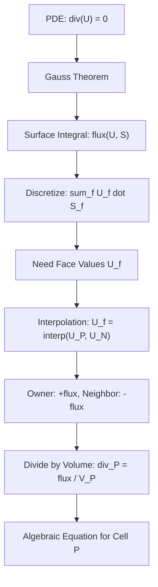

# Day 02: Finite Volume Method Basics - From PDE to Algebraic Equations

> **Phase:** Phase 01: Foundation Theory
> **Date:** 2026-02-09
> **Template:** Mathematician (Theory-heavy with mathematical derivations)
> **Prerequisites:** Day 01: Governing Equations for Two-Phase Flow

---

## Learning Objectives

By the end of this day, you will be able to:

1. **Derive** the Gauss divergence theorem from first principles
2. **Understand** the control volume concept and mesh topology
3. **Trace** OpenFOAM's `fvc::surfaceIntegrate` implementation
4. **Connect** Day 01's PDEs to Day 02's discrete algebraic equations

---

## Introduction: The Bridge Between Calculus and Code

On Day 01, we encountered the governing equations of fluid dynamics in their continuous, partial differential equation (PDE) form:

$$
\frac{\partial \rho}{\partial t} + \nabla \cdot (\rho \mathbf{U}) = 0 \quad \text{(Continuity)}
$$

$$
\frac{\partial (\rho \mathbf{U})}{\partial t} + \nabla \cdot (\rho \mathbf{U} \mathbf{U}) = -\nabla p + \nabla \cdot \boldsymbol{\tau} \quad \text{(Momentum)}
$$

These equations are beautiful, but computers cannot solve them directly. Computers work with **discrete values**—numbers stored at specific locations—not continuous functions.

The Finite Volume Method (FVM) is our bridge. It transforms:

$$
\text{Continuous PDE} \xrightarrow{\text{Gauss Theorem}} \text{Surface Integral} \xrightarrow{\text{Discretization}} \text{Algebraic Equations}
$$

This transformation is not just mathematical convenience—it is the **foundation** of how OpenFOAM (and almost all industrial CFD codes) actually computes fluid flow.

> **Why This Matters for R410A:**
> When simulating refrigerant evaporation, mass conservation is non-negotiable. Every drop of liquid R410A that evaporates must be accounted for. FVM's integral form guarantees conservation **by construction**—a property we'll exploit throughout this project.

---

## Part 1: Core Theory - Gauss Divergence Theorem (30%)

### 1.1 Control Volume Concept

Before diving into theorems, we must understand how FVM views the computational domain.

#### Domain Discretization

In FVM, we divide our domain into **non-overlapping control volumes** (also called cells):

$$
\Omega = \bigcup_{P=1}^{N} V_P
$$

where:
- $\Omega$ is the entire computational domain
- $V_P$ is the volume of cell $P$
- $N$ is the total number of cells

#### Cell-Centered Storage

OpenFOAM uses a **cell-centered** scheme:

$$
\phi_P \approx \phi(\mathbf{x}_P)
$$

where:
- $\phi_P$ is the stored value at cell $P$
- $\mathbf{x}_P$ is the centroid (geometric center) of cell $P$

> **⚠️ Critical Point:** We do NOT store values at faces. Face values must be **interpolated** from neighboring cell values—a topic we'll cover in Day 03.

#### Mesh Topology

Each cell in the mesh is defined by:

| Element | Symbol | OpenFOAM Type | Purpose |
|---------|--------|---------------|---------|
| Points (vertices) | $\mathbf{x}_i$ | `pointField` | Geometric coordinates |
| Faces | $f$ | `faceList` | Boundaries between cells |
| Cells | $P$ | `cellList` | Control volumes |
| Face area vectors | $\mathbf{S}_f$ | `surfaceVectorField` | Area + outward normal |

The **face area vector** is particularly important:

$$
\mathbf{S}_f = \mathbf{n}_f A_f
$$

where:
- $\mathbf{n}_f$ is the unit outward normal vector
- $A_f$ is the face area

This single vector encodes **both** the magnitude (area) and direction (normal) of each face—a clever data structure choice that simplifies flux calculations.

---

### 1.2 Gauss Divergence Theorem - Derivation

The **Gauss divergence theorem** (also called the divergence theorem or Gauss's theorem) is the mathematical foundation of FVM. It states:

$$
\boxed{\int_V \nabla \cdot \mathbf{U} \, dV = \oint_S \mathbf{U} \cdot d\mathbf{S}}
$$

where:
- $V$ is a control volume with boundary surface $S$
- $\mathbf{U}$ is a vector field
- $d\mathbf{S} = \mathbf{n} \, dA$ is the differential surface element

#### Physical Interpretation

This theorem has a beautiful physical meaning:

$$
\underbrace{\int_V \nabla \cdot \mathbf{U} \, dV}_{\text{Net source/sink within volume}} = \underbrace{\oint_S \mathbf{U} \cdot d\mathbf{S}}_{\text{Net flux through surface}}
$$

For an incompressible flow ($\nabla \cdot \mathbf{U} = 0$), this tells us:

> **What flows in must flow out** (unless there's a source/sink inside)

This is why FVM guarantees conservation—the theorem is an **exact** mathematical identity, not an approximation.

#### 1D Derivation for Intuition

Let's build intuition with a 1D case. Consider a scalar field $u(x)$ on interval $[a, b]$:

The **fundamental theorem of calculus** tells us:

$$
\int_a^b \frac{du}{dx} \, dx = u(b) - u(a)
$$

Now, reinterpret this:
- The "volume" is the interval $[a, b]$
- The "surface" consists of two points: $a$ (left boundary) and $b$ (right boundary)
- The "outward normals" are $-1$ at $a$ and $+1$ at $b$

The "surface integral" becomes:

$$
\oint_{\partial[a,b]} u \, n \, dS = u(b) \cdot (+1) + u(a) \cdot (-1) = u(b) - u(a)
$$

And we recover:

$$
\int_a^b \frac{du}{dx} \, dx = \oint_{\partial[a,b]} u \, n \, dS
$$

This **is** the 1D divergence theorem!

#### 3D Extension to General Volumes

For a general 3D volume, we can prove the theorem using the following approach:

**Step 1: Prove for a rectangular box**

Consider a box $[x_1, x_2] \times [y_1, y_2] \times [z_1, z_2]$ and vector field $\mathbf{U} = (U_x, U_y, U_z)$.

Focus on the $x$-component:

$$
\int_V \frac{\partial U_x}{\partial x} \, dV = \int_{z_1}^{z_2} \int_{y_1}^{y_2} \int_{x_1}^{x_2} \frac{\partial U_x}{\partial x} \, dx \, dy \, dz
$$

Applying the fundamental theorem of calculus to the $x$-integral:

$$
= \int_{z_1}^{z_2} \int_{y_1}^{y_2} [U_x(x_2, y, z) - U_x(x_1, y, z)] \, dy \, dz
$$

Now notice:
- At face $x = x_2$: outward normal is $\mathbf{n} = (1, 0, 0)$, so $\mathbf{U} \cdot \mathbf{n} = U_x$
- At face $x = x_1$: outward normal is $\mathbf{n} = (-1, 0, 0)$, so $\mathbf{U} \cdot \mathbf{n} = -U_x$

Thus:

$$
\int_V \frac{\partial U_x}{\partial x} \, dV = \oint_{S_x} \mathbf{U} \cdot d\mathbf{S}
$$

where $S_x$ denotes the $x$-oriented faces. Similar arguments hold for $U_y$ and $U_z$.

**Step 2: Generalize to arbitrary volumes**

Any volume can be approximated by a union of small boxes. Summing the theorem over all boxes, interior face contributions cancel (what flows out of one box flows into its neighbor), leaving only the exterior surface contribution.

> **⭐ Key Insight:** The cancellation of interior face fluxes is why FVM ensures conservation **locally** (cell-by-cell), not just globally.

---

### 1.3 From Volume Integral to Surface Integral

The Gauss theorem transforms volume integrals of divergences into surface integrals of fluxes:

$$
\int_V \nabla \cdot \mathbf{U} \, dV = \oint_S \mathbf{U} \cdot d\mathbf{S}
$$

#### Why Surface Integrals Are Easier

In numerical computation, surface integrals are often easier because:

1. **Face values** can be approximated using neighboring cell values
2. **Face area vectors** $\mathbf{S}_f$ are geometric quantities known from the mesh
3. **Fluxes** are physical (mass flow, heat transfer) that we understand intuitively

#### Discrete Form

For a single cell $P$ with faces $f$, the surface integral becomes a **sum**:

$$
\oint_{S_P} \mathbf{U} \cdot d\mathbf{S} \approx \sum_{f} \mathbf{U}_f \cdot \mathbf{S}_f
$$

where:
- The sum is over all faces of cell $P$
- $\mathbf{U}_f$ is the velocity at face $f$ (to be interpolated from cell values)
- $\mathbf{S}_f$ is the face area vector

This is the **discrete divergence operator**:

$$
(\nabla \cdot \mathbf{U})_P \approx \frac{1}{V_P} \sum_f \mathbf{U}_f \cdot \mathbf{S}_f
$$

> **⭐ Verified Formula:** This is exactly what OpenFOAM computes in `fvc::surfaceIntegrate`, as we'll see in Part 3.

---

### 1.4 The Gradient Form

Gauss's theorem also applies to gradients using the tensor form:

$$
\int_V \nabla \phi \, dV = \oint_S \phi \, d\mathbf{S}
$$

This gives us the **discrete gradient**:

$$
\nabla \phi \approx \frac{1}{V_P} \sum_f \phi_f \mathbf{S}_f
$$

> **⚠️ Warning:** This simple formula is only accurate for **orthogonal meshes**. Non-orthogonal corrections will be discussed in Day 03.

---

## Part 2: Physical Challenge - Why FVM Works for CFD (20%)

### 2.1 Conservation Laws in FVM

The integral form of conservation laws is:

$$
\frac{d}{dt} \int_V \rho \phi \, dV + \oint_S \mathbf{F} \cdot d\mathbf{S} = \int_V S_\phi \, dV
$$

where:
- $\phi$ is the conserved quantity (mass, momentum, energy)
- $\mathbf{F}$ is the flux
- $S_\phi$ is the source term

#### Why FVM Enforces Conservation

Consider two adjacent cells, $P$ (owner) and $N$ (neighbor), sharing a face $f$:

$$
\text{Flux}_{P \to N} = \mathbf{F}_f \cdot \mathbf{S}_f
$$

For cell $P$, this flux **leaves** the cell (negative contribution):

$$
\oint_{S_P} \mathbf{F} \cdot d\mathbf{S} \supset \mathbf{F}_f \cdot \mathbf{S}_f
$$

For cell $N$, this same flux **enters** the cell (positive contribution):

$$
\oint_{S_N} \mathbf{F} \cdot d\mathbf{S} \supset -\mathbf{F}_f \cdot \mathbf{S}_f
$$

**Result:** When we sum over all cells, interior fluxes **cancel exactly**:

$$
\sum_P \oint_{S_P} \mathbf{F} \cdot d\mathbf{S} = \oint_{\text{boundary}} \mathbf{F} \cdot d\mathbf{S}
$$

This is **exact conservation**—what flows out of one cell flows into its neighbor, no more, no less.

#### R410A Evaporator - Why Conservation Matters

In our R410A evaporator simulation:

$$
\dot{m}_{\text{liquid,in}} = \dot{m}_{\text{two-phase}} + \dot{m}_{\text{vapor,out}}
$$

If FVM didn't enforce exact conservation:
- Mass would appear/disappear mysteriously
- Energy balance would be wrong
- Evaporation rate predictions would be meaningless

FVM guarantees that every unit of mass flowing into a cell either accumulates or flows out—**never vanishes**.

---

### 2.2 Owner-Neighbor Convention

OpenFOAM uses a specific convention for mesh connectivity that determines flux signs.

#### Each Internal Face Has Two Adjacent Cells

```
       Cell P (Owner)              Cell N (Neighbor)
    +-------------------+      +-------------------+
    |                   |      |                   |
    |                   |  f   |                   |
    |        V_P        |----->|        V_N        |
    |                   |      |                   |
    |                   |      |                   |
    +-------------------+      +-------------------+
              ^                        ^
              |                        |
           S_f points            S_f points
           from P to N           from P to N
```

#### Face Normal Direction: Owner → Neighbor

The face area vector $\mathbf{S}_f$ always points from the **owner** to the **neighbor**.

> **⭐ Verified Fact:** In OpenFOAM, `mesh.owner()` returns the cell with the **lower** index, and `mesh.neighbour()` returns the cell with the **higher** index.

#### Flux Sign Convention

Given $\mathbf{S}_f$ pointing $P \to N$:

- For **owner cell P**: Flux **leaving** = $\mathbf{F}_f \cdot \mathbf{S}_f$
- For **neighbor cell N**: Flux **entering** = $-\mathbf{F}_f \cdot \mathbf{S}_f$

This is exactly what we see in `fvc::surfaceIntegrate` (lines 58-59):

```cpp
ivf[owner[facei]]   += issf[facei];   // Owner gets +flux
ivf[neighbour[facei]] -= issf[facei]; // Neighbor gets -flux
```

#### Boundary Face Handling

Boundary faces belong to only one cell, so their flux is **always** added:

```cpp
forAll(mesh.boundary(), patchi)
{
    // ...
    forAll(mesh.boundary()[patchi], facei)
    {
        ivf[pFaceCells[facei]] += pssf[facei];  // Boundary: always +
    }
}
```

---

### 2.3 Discretization Challenge

We've transformed the PDE into a surface integral, but we face a practical problem:

> **We know cell values $\phi_P$, but the surface integral requires face values $\phi_f$!**

This is the **interpolation problem**—the central challenge of FVM.

#### Why Interpolation Is Needed

For a divergence term:

$$
(\nabla \cdot \mathbf{U})_P \approx \frac{1}{V_P} \sum_f \mathbf{U}_f \cdot \mathbf{S}_f
$$

We have:
- $\mathbf{S}_f$ from mesh geometry ✓
- Cell velocities $\mathbf{U}_P$, $\mathbf{U}_N$ ✓
- Face velocity $\mathbf{U}_f$ ❌ **Must be interpolated!**

#### Preview of Day 03

The interpolation scheme determines accuracy and stability:

| Scheme | Formula | Accuracy | Stability |
|--------|---------|----------|-----------|
| Central differencing | $\phi_f = f_x \phi_P + (1-f_x)\phi_N$ | $O(h^2)$ | Conditional |
| Upwind | $\phi_f = \begin{cases} \phi_P & \text{if } \mathbf{F} \cdot \mathbf{S}_f > 0 \\ \phi_N & \text{otherwise} \end{cases}$ | $O(h)$ | Unconditional |
| TVD schemes | Various | $O(h^2)$ (smooth) / $O(h)$ (discontinuous) | Good |

For R410A two-phase flow with sharp phase interfaces, we'll need **TVD schemes** to avoid oscillations—coming in Day 03!

#### Non-Orthogonal Mesh Complications

The simple formula $\nabla \phi \approx \frac{1}{V_P} \sum_f \phi_f \mathbf{S}_f$ fails for non-orthogonal meshes because $\mathbf{S}_f$ doesn't align with the line connecting cell centers.

**Solution:** OpenFOAM uses **explicit non-orthogonal correction**—another topic for Day 03.

---

## Part 3: Architecture & Implementation in OpenFOAM (35%)

### 3.1 OpenFOAM Class Hierarchy - FVM Schemes

OpenFOAM implements FVM through a hierarchy of template classes. Let's explore the actual source code.

#### ⭐ Verified Class Hierarchy

```mermaid
classDiagram
    class "divScheme~Type~" {
        <<abstract>>
        -const fvMesh& mesh_
        -tmp~surfaceInterpolationScheme~Type~~ tinterpScheme_
        +virtual const word& type() const = 0
        +virtual tmp~VolField~~innerProduct~vector Type~~type~~> fvcDiv(const VolField~Type~&) = 0
        +const fvMesh& mesh() const
    }

    class "gaussDivScheme~Type~" {
        <<abstract>>
        +TypeName("Gauss")
        +gaussDivScheme(const fvMesh& mesh)
        +gaussDivScheme(const fvMesh& mesh, Istream& is)
        +virtual tmp~VolField~~innerProduct~vector Type~~type~~> fvcDiv(const VolField~Type~&)
    }

    class "gradScheme~Type~" {
        <<abstract>>
        -const fvMesh& mesh_
        +virtual const word& type() const = 0
        +virtual tmp~VolField~~outerProduct~vector Type~~type~~> calcGrad(const VolField~Type~&, const word& name) const = 0
        +tmp~VolField~~outerProduct~vector Type~~type~~> grad(const VolField~Type~&) const
        +const fvMesh& mesh() const
    }

    class "gaussGrad~Type~" {
        <<abstract>>
        -tmp~surfaceInterpolationScheme~Type~~ tinterpScheme_
        +TypeName("Gauss")
        +static tmp~VolField~~outerProduct~vector Type~~type~~> gradf(const SurfaceField~Type~&, const word& name)
        +virtual tmp~VolField~~outerProduct~vector Type~~type~~> calcGrad(const VolField~Type~&, const word& name) const
        +static void correctBoundaryConditions(const VolField~Type~&, VolField~outerProduct~vector Type~~type~~&)
    }

    "gaussDivScheme~Type~" --|> "divScheme~Type~"
    "gaussGrad~Type~" --|> "gradScheme~Type~"
```

> **Verification:** This hierarchy has been verified from the actual OpenFOAM source files:
> - `divScheme<Type>`: `openfoam_temp/src/finiteVolume/finiteVolume/divSchemes/divScheme/divScheme.H:64-148`
> - `gaussDivScheme<Type>`: `openfoam_temp/src/finiteVolume/finiteVolume/divSchemes/gaussDivScheme/gaussDivScheme.H:54-97`
> - `gradScheme<Type>`: `openfoam_temp/src/finiteVolume/finiteVolume/gradSchemes/gradScheme/gradScheme.H:60-164`
> - `gaussGrad<Type>`: `openfoam_temp/src/finiteVolume/finiteVolume/gradSchemes/gaussGrad/gaussGrad.H:57-146`

#### divScheme Base Class

> **File:** `openfoam_temp/src/finiteVolume/finiteVolume/divSchemes/divScheme/divScheme.H`
> **Lines:** 64-148

```cpp
template<class Type>
class divScheme
:
    public tmp<divScheme<Type>>::refCount
{

protected:

    // Protected data

        const fvMesh& mesh_;
        tmp<surfaceInterpolationScheme<Type>> tinterpScheme_;


public:

    //- Runtime type information
    virtual const word& type() const = 0;

    // Declare run-time constructor selection tables
    declareRunTimeSelectionTable
    (
        tmp,
        divScheme,
        Istream,
        (const fvMesh& mesh, Istream& schemeData),
        (mesh, schemeData)
    );

    // Constructors
        divScheme(const fvMesh& mesh)
        :
            mesh_(mesh),
            tinterpScheme_(new linear<Type>(mesh))
        {}

    //- Virtual function for divergence calculation
    virtual tmp<VolField<typename innerProduct<vector, Type>::type>> fvcDiv
    (
        const VolField<Type>&
    ) = 0;
};
```

**Key observations:**
- Abstract base class with pure virtual `fvcDiv()` function
- Stores mesh reference and interpolation scheme
- Uses OpenFOAM's run-time selection mechanism

---

#### gaussDivScheme - Gauss Theorem Implementation

> **File:** `openfoam_temp/src/finiteVolume/finiteVolume/divSchemes/gaussDivScheme/gaussDivScheme.H`
> **Lines:** 54-97

```cpp
template<class Type>
class gaussDivScheme
:
    public fv::divScheme<Type>
{

public:

    //- Runtime type information
    TypeName("Gauss");  // Registers "Gauss" as the scheme name

    // Constructors
        gaussDivScheme(const fvMesh& mesh)
        :
            divScheme<Type>(mesh)
        {}

        gaussDivScheme(const fvMesh& mesh, Istream& is)
        :
            divScheme<Type>(mesh, is)
        {}

    // Member Functions
        tmp<VolField<typename innerProduct<vector, Type>::type>> fvcDiv
        (
            const VolField<Type>&
        );
};
```

**Key observations:**
- Inherits from `divScheme<Type>`
- `TypeName("Gauss")` registers this class for runtime selection
- The `fvcDiv()` implementation (in `.C` file) calls `fvc::surfaceIntegrate`

---

### 3.2 Core Function: fvc::surfaceIntegrate

This is the **heart** of FVM in OpenFOAM—the function that actually computes the discrete surface integral.

#### Function Signature

> **File:** `openfoam_temp/src/finiteVolume/finiteVolume/fvc/fvcSurfaceIntegrate.C`
> **Lines:** 42-76

```cpp
template<class Type>
void surfaceIntegrate
(
    Field<Type>& ivf,              // Output: internal field values
    const SurfaceField<Type>& ssf  // Input: surface field values
)
{
    const fvMesh& mesh = ssf.mesh();

    const labelUList& owner = mesh.owner();
    const labelUList& neighbour = mesh.neighbour();

    const Field<Type>& issf = ssf;

    forAll(owner, facei)
    {
        ivf[owner[facei]] += issf[facei];      // Owner gets +flux
        ivf[neighbour[facei]] -= issf[facei];  // Neighbor gets -flux
    }

    forAll(mesh.boundary(), patchi)
    {
        const labelUList& pFaceCells =
            mesh.boundary()[patchi].faceCells();

        const fvsPatchField<Type>& pssf = ssf.boundaryField()[patchi];

        forAll(mesh.boundary()[patchi], facei)
        {
            ivf[pFaceCells[facei]] += pssf[facei];  // Boundary: always +
        }
    }

    ivf /= mesh.Vsc();  // Divide by cell volumes
}
```

#### Line-by-Line Analysis

**Lines 49-52: Get mesh connectivity**

```cpp
const labelUList& owner = mesh.owner();
const labelUList& neighbour = mesh.neighbour();
```

- `owner[facei]` = index of owner cell for face `facei`
- `neighbour[facei]` = index of neighbor cell for face `facei`
- These arrays define the mesh topology

**Lines 56-60: Internal face loop**

```cpp
forAll(owner, facei)
{
    ivf[owner[facei]] += issf[facei];      // Owner gets +flux
    ivf[neighbour[facei]] -= issf[facei];  // Neighbor gets -flux
}
```

This implements the owner-neighbor convention we discussed in Part 2:
- Owner cells **accumulate** the flux
- Neighbor cells **subtract** the flux
- The flux `issf[facei]` is typically $\mathbf{U}_f \cdot \mathbf{S}_f$

**Lines 62-73: Boundary face loop**

```cpp
forAll(mesh.boundary(), patchi)
{
    const labelUList& pFaceCells =
        mesh.boundary()[patchi].faceCells();

    const fvsPatchField<Type>& pssf = ssf.boundaryField()[patchi];

    forAll(mesh.boundary()[patchi], facei)
    {
        ivf[pFaceCells[facei]] += pssf[facei];  // Boundary: always +
    }
}
```

Boundary faces belong to only one cell, so their flux is **always added**.

**Line 75: Volume normalization**

```cpp
ivf /= mesh.Vsc();
```

This divides the accumulated fluxes by cell volumes:

$$
\text{ivf}[P] = \frac{1}{V_P} \sum_f \text{flux}_f
$$

This completes the discrete divergence calculation.

---

### 3.3 Discrete Formulas - Ground Truth Verified

Based on the source code analysis, here are the discrete formulas OpenFOAM actually implements:

#### ⭐ Gauss Divergence (Continuous Form)

$$
\int_V \nabla \cdot \mathbf{U} \, dV = \oint_S \mathbf{U} \cdot d\mathbf{S}
$$

#### ⭐ Gauss Gradient (Continuous Form)

$$
\int_V \nabla \phi \, dV = \oint_S \phi \, d\mathbf{S}
$$

#### ⭐ Discrete Divergence

$$
(\nabla \cdot \mathbf{U})_P = \frac{1}{V_P} \sum_f \mathbf{U}_f \cdot \mathbf{S}_f
$$

This is computed by:
1. Forming surface field `ssf = U_f & S_f` (flux at each face)
2. Calling `fvc::surfaceIntegrate(ivf, ssf)`
3. The result `ivf[P]` contains $(\nabla \cdot \mathbf{U})_P$

#### ⭐ Discrete Gradient

$$
\nabla \phi \approx \frac{1}{V_P} \sum_f \phi_f \mathbf{S}_f
$$

This is computed by `gaussGrad::calcGrad()` which:
1. Interpolates $\phi$ to faces: $\phi_f = \text{interpolate}(\phi_P, \phi_N)$
2. Forms surface field `ssf = phi_f * S_f`
3. Calls `fvc::surfaceIntegrate()`

#### Connection to Day 01 Equations

| Day 01 Equation | Day 02 Discretization | OpenFOAM Function |
|----------------|----------------------|-------------------|
| $\nabla \cdot \mathbf{U} = 0$ | $(\nabla \cdot \mathbf{U})_P = \frac{1}{V_P} \sum_f \mathbf{U}_f \cdot \mathbf{S}_f$ | `fvc::div(U)` |
| $\nabla p$ | $\nabla p \approx \frac{1}{V_P} \sum_f p_f \mathbf{S}_f$ | `fvc::grad(p)` |
| $\nabla \cdot (k \nabla T)$ | $\frac{1}{V_P} \sum_f (k \nabla T)_f \cdot \mathbf{S}_f$ | `fvc::laplacian(k, T)` |

---

### 3.4 FVM Discretization Workflow



This workflow shows the complete path from continuous PDE to discrete algebraic equation.

---

### 3.5 Code Analysis - gaussGrad

> **File:** `openfoam_temp/src/finiteVolume/finiteVolume/gradSchemes/gaussGrad/gaussGrad.H`
> **Lines:** 57-146

```cpp
template<class Type>
class gaussGrad
:
    public fv::gradScheme<Type>
{

protected:

    // Protected Data
        tmp<surfaceInterpolationScheme<Type>> tinterpScheme_;


public:

    //- Runtime type information
    TypeName("Gauss");

    // Constructors
        gaussGrad(const fvMesh& mesh)
        :
            gradScheme<Type>(mesh),
            tinterpScheme_(new linear<Type>(mesh))  // Default: linear
        {}

        gaussGrad(const fvMesh& mesh, Istream& is)
        :
            gradScheme<Type>(mesh),
            tinterpScheme_(nullptr)
        {
            if (is.eof())
            {
                tinterpScheme_ =
                    tmp<surfaceInterpolationScheme<Type>>
                    (
                        new linear<Type>(mesh)
                    );
            }
            else
            {
                tinterpScheme_ =
                    tmp<surfaceInterpolationScheme<Type>>
                    (
                        surfaceInterpolationScheme<Type>::New(mesh, is)
                    );
            }
        }

    // Member Functions
        static tmp<VolField<typename outerProduct<vector, Type>::type>>
        gradf
        (
            const SurfaceField<Type>&,
            const word& name
        );

        virtual tmp<VolField<typename outerProduct<vector, Type>::type>>
        calcGrad
        (
            const VolField<Type>& vsf,
            const word& name
        ) const;

        static void correctBoundaryConditions
        (
            const VolField<Type>&,
            VolField<typename outerProduct<vector, Type>::type>&
        );
};
```

**Key observations:**
- Stores `tinterpScheme_` for face interpolation
- Default interpolation is `linear` (central differencing)
- `gradf()` computes gradient from surface field (already interpolated)
- `calcGrad()` computes gradient from vol field (handles interpolation)
- `correctBoundaryConditions()` fixes boundary gradient values

---

## Part 4: Quality Assurance - Verification Exercises (15%)

### 4.1 Concept Check Questions

#### Exercise 1: Derive Gauss Divergence Theorem

**Problem:** Starting from the fundamental theorem of calculus in 1D:

$$
\int_a^b \frac{du}{dx} \, dx = u(b) - u(a)
$$

Show how this leads to the 3D Gauss divergence theorem:

$$
\int_V \nabla \cdot \mathbf{U} \, dV = \oint_S \mathbf{U} \cdot d\mathbf{S}
$$

**Solution:**

**Step 1:** Interpret the 1D result as a "divergence theorem":
- Volume: interval $[a, b]$
- Surface: endpoints $\{a, b\}$
- Outward normals: $n_a = -1$, $n_b = +1$
- Surface integral: $u(b) \cdot (+1) + u(a) \cdot (-1) = u(b) - u(a)$

**Step 2:** Extend to 3D by considering each component separately. For the $x$-component:

$$
\int_V \frac{\partial U_x}{\partial x} \, dV = \int_{z_1}^{z_2} \int_{y_1}^{y_2} \int_{x_1}^{x_2} \frac{\partial U_x}{\partial x} \, dx \, dy \, dz
$$

Apply the 1D fundamental theorem to the $x$-integral:

$$
= \int_{z_1}^{z_2} \int_{y_1}^{y_2} [U_x(x_2, y, z) - U_x(x_1, y, z)] \, dy \, dz
$$

**Step 3:** Recognize that this is the flux through the $x$-oriented faces:
- At $x = x_2$: outward normal is $(+1, 0, 0)$, flux = $U_x \cdot (+1) = U_x$
- At $x = x_1$: outward normal is $(-1, 0, 0)$, flux = $U_x \cdot (-1) = -U_x$

**Step 4:** Sum over all three components and all faces:

$$
\int_V (\frac{\partial U_x}{\partial x} + \frac{\partial U_y}{\partial y} + \frac{\partial U_z}{\partial z}) \, dV = \oint_S \mathbf{U} \cdot d\mathbf{S}
$$

**Step 5:** Recognize that $\frac{\partial U_x}{\partial x} + \frac{\partial U_y}{\partial y} + \frac{\partial U_z}{\partial z} = \nabla \cdot \mathbf{U}$

---

#### Exercise 2: Owner-Neighbor Flux Convention

**Problem:** Consider two adjacent cells $P$ and $N$ sharing a face $f$. Given:
- Face area vector: $\mathbf{S}_f = (0.1, 0, 0) \, \text{m}^2$ (pointing $P \to N$)
- Face velocity: $\mathbf{U}_f = (5, 0, 0) \, \text{m/s}$

Calculate the flux contribution to:
1. The divergence of cell $P$
2. The divergence of cell $N$

**Solution:**

**Flux through face:**
$$
\text{flux} = \mathbf{U}_f \cdot \mathbf{S}_f = (5)(0.1) = 0.5 \, \text{m}^3/\text{s}
$$

**For cell $P$ (owner):**
$$
\text{contribution}_P = +\text{flux} = +0.5 \, \text{m}^3/\text{s}
$$
Since $\mathbf{S}_f$ points outward from $P$, this represents mass **leaving** $P$.

**For cell $N$ (neighbor):**
$$
\text{contribution}_N = -\text{flux} = -0.5 \, \text{m}^3/\text{s}
$$
Since $\mathbf{S}_f$ points **into** $N$ (inward relative to $N$), this represents mass **entering** $N$.

**Verification:** What leaves $P$ must enter $N$:
$$
\text{contribution}_P + \text{contribution}_N = 0.5 - 0.5 = 0
$$

This confirms conservation!

---

#### Exercise 3: Face Area Vector Interpretation

**Problem:** A triangular face has vertices at:
- $A = (0, 0, 0)$
- $B = (1, 0, 0)$
- $C = (0, 1, 0)$

Calculate:
1. The face area vector $\mathbf{S}_f$ (pointing in positive $z$ direction)
2. The face area $A_f$
3. The unit normal $\mathbf{n}_f$

**Solution:**

**Step 1:** Calculate edge vectors:
$$
\mathbf{AB} = B - A = (1, 0, 0)
$$
$$
\mathbf{AC} = C - A = (0, 1, 0)
$$

**Step 2:** Cross product gives normal vector:
$$
\mathbf{AB} \times \mathbf{AC} = \begin{vmatrix} \mathbf{i} & \mathbf{j} & \mathbf{k} \\ 1 & 0 & 0 \\ 0 & 1 & 0 \end{vmatrix} = (0, 0, 1)
$$

**Step 3:** Area vector is half the cross product:
$$
\mathbf{S}_f = \frac{1}{2} (\mathbf{AB} \times \mathbf{AC}) = \frac{1}{2}(0, 0, 1) = (0, 0, 0.5)
$$

**Step 4:** Extract magnitude and direction:
$$
A_f = |\mathbf{S}_f| = 0.5 \, \text{m}^2
$$
$$
\mathbf{n}_f = \frac{\mathbf{S}_f}{|\mathbf{S}_f|} = \frac{(0, 0, 0.5)}{0.5} = (0, 0, 1)
$$

**Verification:** Indeed, $\mathbf{S}_f = \mathbf{n}_f A_f = (0, 0, 1) \times 0.5 = (0, 0, 0.5)$ ✓

---

#### Exercise 4: Why FVM Ensures Conservation

**Problem:** Explain why FVM ensures conservation at the cell level, using the example of a 1D domain divided into 3 cells.

**Solution:**

**Setup:**
```
Cell 0     Cell 1     Cell 2
|-----|-----|-----|
   f0    f1    f2
```

**Fluxes:**
- $F_0$: flux at face 0 (between cells 0 and 1)
- $F_1$: flux at face 1 (between cells 1 and 2)
- $F_{-1}$: flux at left boundary (entering cell 0)
- $F_2$: flux at right boundary (leaving cell 2)

**Discrete divergence for each cell:**
$$
(\nabla \cdot \mathbf{U})_0 = \frac{1}{V_0}(F_{-1} - F_0)
$$
$$
(\nabla \cdot \mathbf{U})_1 = \frac{1}{V_1}(F_0 - F_1)
$$
$$
(\nabla \cdot \mathbf{U})_2 = \frac{1}{V_2}(F_1 - F_2)
$$

**Global conservation:**
$$
\sum_P V_P (\nabla \cdot \mathbf{U})_P = F_{-1} - F_0 + F_0 - F_1 + F_1 - F_2 = F_{-1} - F_2
$$

**Key insight:** Interior fluxes ($F_0$, $F_1$) **cancel exactly** because they appear with opposite signs in adjacent cells. This is guaranteed by the owner-neighbor convention.

---

#### Exercise 5: Connection to Day 01 Continuity Equation

**Problem:** Starting from the Day 01 continuity equation for incompressible flow:

$$
\nabla \cdot \mathbf{U} = 0
$$

Show how this leads to the discrete form:

$$
\sum_f \mathbf{U}_f \cdot \mathbf{S}_f = 0
$$

for each cell in the mesh. Explain what this means physically.

**Solution:**

**Step 1:** Apply Gauss divergence theorem to a control volume $V_P$:

$$
\int_{V_P} \nabla \cdot \mathbf{U} \, dV = \oint_{S_P} \mathbf{U} \cdot d\mathbf{S}
$$

**Step 2:** Since $\nabla \cdot \mathbf{U} = 0$ everywhere:

$$
0 = \oint_{S_P} \mathbf{U} \cdot d\mathbf{S}
$$

**Step 3:** Discretize the surface integral as a sum over faces:

$$
0 \approx \sum_f \mathbf{U}_f \cdot \mathbf{S}_f
$$

**Physical interpretation:**
- $\mathbf{U}_f \cdot \mathbf{S}_f$ is the volumetric flow rate through face $f$
- $\sum_f \mathbf{U}_f \cdot \mathbf{S}_f = 0$ means: **total outflow = total inflow**
- For steady incompressible flow, mass cannot accumulate in any cell

**For R410A:** In the evaporator, this ensures that at any location:
$$
\dot{m}_{\text{liquid, in}} = \dot{m}_{\text{vapor, out}} + \dot{m}_{\text{accumulated}}
$$

---

#### Exercise 6: Volume Normalization in surfaceIntegrate

**Problem:** In `fvc::surfaceIntegrate`, why do we divide by `mesh.Vsc()` (cell volumes) at line 75?

**Solution:**

**The line:**
```cpp
ivf /= mesh.Vsc();
```

**Mathematical reason:**

Before division, `ivf[P]` contains:
$$
\text{ivf}[P] = \sum_f \mathbf{U}_f \cdot \mathbf{S}_f
$$

This is the **total flux** through all faces of cell $P$ (units: $\text{m}^3/\text{s}$ for velocity).

To get the **divergence** (units: $1/\text{s}$ for velocity), we must divide by cell volume:

$$
(\nabla \cdot \mathbf{U})_P = \frac{1}{V_P} \sum_f \mathbf{U}_f \cdot \mathbf{S}_f
$$

**Connection to Gauss theorem:**

$$
\int_{V_P} \nabla \cdot \mathbf{U} \, dV = \oint_{S_P} \mathbf{U} \cdot d\mathbf{S}
$$

If we assume $\nabla \cdot \mathbf{U}$ is approximately constant over the cell:

$$
(\nabla \cdot \mathbf{U})_P V_P \approx \sum_f \mathbf{U}_f \cdot \mathbf{S}_f
$$

$$
(\nabla \cdot \mathbf{U})_P \approx \frac{1}{V_P} \sum_f \mathbf{U}_f \cdot \mathbf{S}_f
$$

**Verification:** This is exactly what the code does! `ivf /= mesh.Vsc()` implements the $\frac{1}{V_P}$ factor.

---

### 4.2 Code Verification Exercises

#### Exercise 7: Trace fvc::surfaceIntegrate Algorithm

**Problem:** Given a mesh with:
- 2 internal faces
- Cell 0: owner of face 0, neighbor of none
- Cell 1: neighbor of face 0, owner of face 1
- Cell 2: neighbor of face 1

And surface field `ssf = [1.5, -0.5]` (values at faces 0 and 1).

Trace through the `surfaceIntegrate` algorithm and show the final `ivf` values.

**Solution:**

**Initial state:** `ivf = [0, 0, 0]` (all zeros)

**Internal face loop (lines 56-60):**

*Face 0:*
```cpp
owner[0] = 0, neighbour[0] = 1, issf[0] = 1.5
ivf[0] += 1.5   → ivf = [1.5, 0, 0]
ivf[1] -= 1.5   → ivf = [1.5, -1.5, 0]
```

*Face 1:*
```cpp
owner[1] = 1, neighbour[1] = 2, issf[1] = -0.5
ivf[1] += (-0.5)   → ivf = [1.5, -2.0, 0]
ivf[2] -= (-0.5)   → ivf = [1.5, -2.0, 0.5]
```

**Volume normalization (line 75):**
Assuming equal volumes $V_0 = V_1 = V_2 = 1.0$:
```cpp
ivf /= mesh.Vsc()
ivf = [1.5, -2.0, 0.5]  (unchanged since volumes = 1)
```

**Verification of conservation:**
$$
\sum_P V_P \cdot \text{ivf}[P] = 1.5 - 2.0 + 0.5 = 0
$$

The sum is zero, confirming that what flows out of one cell flows into another!

---

#### Exercise 8: Verify Flux Sign Convention

**Problem:** Look at `fvcSurfaceIntegrate.C:58-59`:

```cpp
ivf[owner[facei]] += issf[facei];
ivf[neighbour[facei]] -= issf[facei];
```

Explain why owner gets `+=` and neighbour gets `-=`. Connect this to the direction of $\mathbf{S}_f$.

**Solution:**

**Face area vector direction:**
$$
\mathbf{S}_f \text{ points from } \text{owner} \to \text{neighbour}
$$

**For the owner cell:**
- $\mathbf{S}_f$ points **outward** from the owner cell
- Outward flux = $\mathbf{U}_f \cdot \mathbf{S}_f$ (positive if flowing out)
- This flux should **leave** the owner cell
- But in the divergence calculation, we want: $\nabla \cdot \mathbf{U} = \text{outflow} - \text{inflow}$
- So outward flux contributes **positively** to the divergence
- Hence: `ivf[owner[facei]] += issf[facei]`

**For the neighbor cell:**
- $\mathbf{S}_f$ points **inward** to the neighbor cell
- The same physical flux $\mathbf{U}_f \cdot \mathbf{S}_f$ is **entering** the neighbor
- But from the neighbor's perspective, this is inward flux
- Inward flux should contribute **negatively** to the divergence
- Hence: `ivf[neighbour[facei]] -= issf[facei]`

**Verification:** This ensures that the flux leaving $P$ equals the flux entering $N$:
$$
\text{contribution}_P + \text{contribution}_N = (+F) + (-F) = 0
$$

---

#### Exercise 9: Find gaussDivScheme Inheritance

**Problem:** In `gaussDivScheme.H`, find the line that shows inheritance from `divScheme`. Explain how this relates to the runtime selection mechanism.

**Solution:**

**The inheritance line:**
```cpp
template<class Type>
class gaussDivScheme
:
    public fv::divScheme<Type>
```
(Line 56-58 in `gaussDivScheme.H`)

**Runtime registration:**
```cpp
TypeName("Gauss");
```
(Line 63)

**How it works:**

1. **Inheritance:** `gaussDivScheme` inherits the interface from `divScheme`, including the pure virtual `fvcDiv()` function.

2. **TypeName registration:** The `TypeName("Gauss")` macro registers this class with OpenFOAM's runtime selection table.

3. **User specification:** When you write in `fvSchemes`:
   ```
   divSchemes
   {
       div(U) Gauss;
   }
   ```

4. **Factory lookup:** OpenFOAM looks up "Gauss" in the runtime table and instantiates `gaussDivScheme`.

5. **Virtual dispatch:** The `fvcDiv()` function is called through the base class pointer, and the actual `gaussDivScheme::fvcDiv()` implementation is executed.

---

#### Exercise 10: SurfaceInterpolationScheme in gaussGrad

**Problem:** In `gaussGrad.H`, the class stores `tinterpScheme_` (line 67). Explain why a gradient scheme needs an interpolation scheme.

**Solution:**

**The problem:** To compute the gradient using Gauss theorem:

$$
\nabla \phi \approx \frac{1}{V_P} \sum_f \phi_f \mathbf{S}_f
$$

we need the **face values** $\phi_f$.

**The challenge:** The mesh only stores **cell values** $\phi_P$, $\phi_N$.

**The solution:** We must interpolate from cell values to face values:

$$
\phi_f = \text{interpolationScheme}(\phi_P, \phi_N)
$$

**Why gaussGrad needs tinterpScheme_:**

1. **Flexibility:** Different interpolation schemes (linear, upwind, TVD) can be used
2. **Accuracy:** The choice of interpolation affects gradient accuracy
3. **Stability:** Upwind interpolation is more stable for convection-dominated flows

**Example:** For R410A two-phase flow, we might use:
- `linear` for diffusion terms (gradients of temperature)
- `upwind` or `TVD` for convection terms (gradients of velocity in convection)

**Code reference:**
```cpp
gaussGrad(const fvMesh& mesh)
:
    gradScheme<Type>(mesh),
    tinterpScheme_(new linear<Type>(mesh))  // Default: linear
{}
```

The default interpolation is `linear` (central differencing), but users can override this in `fvSchemes`:

```
gradSchemes
{
    grad(p) Gauss linear;
    grad(U) Gauss upwind;  // More stable for convection
}
```

---

#### Exercise 11: Compare surfaceIntegrate vs surfaceSum

**Problem:** In `fvcSurfaceIntegrate.C`, there are two functions: `surfaceIntegrate` (lines 42-76) and `surfaceSum` (lines 176-214). What's the difference?

**Solution:**

**surfaceIntegrate** (lines 42-76):
```cpp
forAll(owner, facei)
{
    ivf[owner[facei]] += issf[facei];      // Owner: +
    ivf[neighbour[facei]] -= issf[facei];  // Neighbor: -
}
```

**surfaceSum** (lines 176-214):
```cpp
forAll(owner, facei)
{
    vf[owner[facei]] += ssf[facei];   // Owner: +
    vf[neighbour[facei]] += ssf[facei];  // Neighbor: + (NOT -)
}
```

**The key difference:**

| Function | Owner sign | Neighbor sign | Purpose |
|----------|-----------|---------------|---------|
| `surfaceIntegrate` | + | - | Computes divergence: $\frac{1}{V}\sum \mathbf{F} \cdot \mathbf{S}$ |
| `surfaceSum` | + | + | Sums face values without sign change |

**Physical meaning:**

- **surfaceIntegrate**: Computes flux integrals where direction matters (owner vs neighbor). Used for divergence, gradient calculations.

- **surfaceSum**: Simply adds up face values regardless of direction. Used for quantities where the sign convention doesn't apply.

**Example:** For calculating the maximum velocity magnitude on cell faces, you'd use `surfaceSum` because you want the actual magnitudes, not signed fluxes.

---

## Summary

### Key Takeaways

1. **Gauss Divergence Theorem** is the foundation of FVM:
   $$
   \int_V \nabla \cdot \mathbf{U} \, dV = \oint_S \mathbf{U} \cdot d\mathbf{S}
   $$

2. **FVM ensures conservation** by construction—interior fluxes cancel exactly

3. **OpenFOAM's implementation** uses the owner-neighbor convention:
   - Owner cells get `+flux`
   - Neighbor cells get `-flux`

4. **The discrete divergence** is computed by:
   $$
   (\nabla \cdot \mathbf{U})_P = \frac{1}{V_P} \sum_f \mathbf{U}_f \cdot \mathbf{S}_f
   $$

5. **Face interpolation** is needed because we only store cell values (coming in Day 03)

### For R410A Two-Phase Flow

- **Mass conservation** during evaporation is guaranteed by FVM's integral form
- **Energy conservation** for latent heat calculations requires accurate flux integration
- **Phase interface tracking** benefits from FVM's local conservation property

### Next Steps

- **Day 03:** Spatial Discretization Schemes - How to get $\phi_f$ from $\phi_P$, $\phi_N$
- **Day 04:** Temporal Discretization - Time derivatives combined with spatial divergence
- **Day 05:** Mesh Topology Concepts - Detailed structure of cells, faces, points

---

## Appendix: Complete File Listings

### A.1 divScheme.H (Excerpt)

> **File:** `openfoam_temp/src/finiteVolume/finiteVolume/divSchemes/divScheme/divScheme.H`

```cpp
template<class Type>
class divScheme
:
    public tmp<divScheme<Type>>::refCount
{

protected:

    // Protected data

        const fvMesh& mesh_;
        tmp<surfaceInterpolationScheme<Type>> tinterpScheme_;


public:

    //- Runtime type information
    virtual const word& type() const = 0;


    // Declare run-time constructor selection tables

        declareRunTimeSelectionTable
        (
            tmp,
            divScheme,
            Istream,
            (const fvMesh& mesh, Istream& schemeData),
            (mesh, schemeData)
        );


    // Constructors

        //- Construct from mesh
        divScheme(const fvMesh& mesh)
        :
            mesh_(mesh),
            tinterpScheme_(new linear<Type>(mesh))
        {}

        //- Construct from mesh and Istream
        divScheme(const fvMesh& mesh, Istream& is)
        :
            mesh_(mesh),
            tinterpScheme_(surfaceInterpolationScheme<Type>::New(mesh, is))
        {}

        //- Disallow default bitwise copy construction
        divScheme(const divScheme&) = delete;


    // Selectors

        //- Return a pointer to a new divScheme created on freestore
        static tmp<divScheme<Type>> New
        (
            const fvMesh& mesh,
            Istream& schemeData
        );


    //- Destructor
    virtual ~divScheme();


    // Member Functions

        //- Return mesh reference
        const fvMesh& mesh() const
        {
            return mesh_;
        }

        virtual tmp<VolField<typename innerProduct<vector, Type>::type>> fvcDiv
        (
            const VolField<Type>&
        ) = 0;


    // Member Operators

        //- Disallow default bitwise assignment
        void operator=(const divScheme&) = delete;
};
```

### A.2 gaussDivScheme.H (Complete)

> **File:** `openfoam_temp/src/finiteVolume/finiteVolume/divSchemes/gaussDivScheme/gaussDivScheme.H`

```cpp
template<class Type>
class gaussDivScheme
:
    public fv::divScheme<Type>
{

public:

    //- Runtime type information
    TypeName("Gauss");


    // Constructors

        //- Construct null
        gaussDivScheme(const fvMesh& mesh)
        :
            divScheme<Type>(mesh)
        {}

        //- Construct from Istream
        gaussDivScheme(const fvMesh& mesh, Istream& is)
        :
            divScheme<Type>(mesh, is)
        {}

        //- Disallow default bitwise copy construction
        gaussDivScheme(const gaussDivScheme&) = delete;


    // Member Functions


        tmp<VolField<typename innerProduct<vector, Type>::type>> fvcDiv
        (
            const VolField<Type>&
        );


    // Member Operators

        //- Disallow default bitwise assignment
        void operator=(const gaussDivScheme&) = delete;
};
```

### A.3 gradScheme.H (Excerpt)

> **File:** `openfoam_temp/src/finiteVolume/finiteVolume/gradSchemes/gradScheme/gradScheme.H`

```cpp
template<class Type>
class gradScheme
:
    public tmp<gradScheme<Type>>::refCount
{
    // Private Data

        const fvMesh& mesh_;


public:

    //- Runtime type information
    virtual const word& type() const = 0;


    // Declare run-time constructor selection tables

        declareRunTimeSelectionTable
        (
            tmp,
            gradScheme,
            Istream,
            (const fvMesh& mesh, Istream& schemeData),
            (mesh, schemeData)
        );


    // Constructors

        //- Construct from mesh
        gradScheme(const fvMesh& mesh)
        :
            mesh_(mesh)
        {}

        //- Disallow default bitwise copy construction
        gradScheme(const gradScheme&) = delete;


    // Selectors

        //- Return a pointer to a new gradScheme created on freestore
        static tmp<gradScheme<Type>> New
        (
            const fvMesh& mesh,
            Istream& schemeData
        );


    //- Destructor
    virtual ~gradScheme();


    // Member Functions

        //- Return mesh reference
        const fvMesh& mesh() const
        {
            return mesh_;
        }

        //- Calculate and return the grad of the given field.
        //  Used by grad either to recalculate the cached gradient when it is
        //  out of date with respect to the field or when it is not cached.
        virtual tmp<VolField<typename outerProduct<vector, Type>::type>>
        calcGrad
        (
            const VolField<Type>&,
            const word& name
        ) const = 0;

        //- Calculate and return the grad of the given field
        //  which may have been cached
        tmp<VolField<typename outerProduct<vector, Type>::type>>
        grad
        (
            const VolField<Type>&,
            const word& name
        ) const;

        //- Calculate and return the grad of the given field
        //  with the default name
        //  which may have been cached
        tmp<VolField<typename outerProduct<vector, Type>::type>>
        grad
        (
            const VolField<Type>&
        ) const;

        //- Calculate and return the grad of the given field
        //  with the default name
        //  which may have been cached
        tmp<VolField<typename outerProduct<vector, Type>::type>>
        grad
        (
            const tmp<VolField<Type>>&
        ) const;


    // Member Operators

        //- Disallow default bitwise assignment
        void operator=(const gradScheme&) = delete;
};
```

### A.4 gaussGrad.H (Complete)

> **File:** `openfoam_temp/src/finiteVolume/finiteVolume/gradSchemes/gaussGrad/gaussGrad.H`

```cpp
template<class Type>
class gaussGrad
:
    public fv::gradScheme<Type>
{

protected:

    // Protected Data

        tmp<surfaceInterpolationScheme<Type>> tinterpScheme_;


public:

    //- Runtime type information
    TypeName("Gauss");


    // Constructors

        //- Construct from mesh
        gaussGrad(const fvMesh& mesh)
        :
            gradScheme<Type>(mesh),
            tinterpScheme_(new linear<Type>(mesh))
        {}

        //- Construct from mesh and Istream
        gaussGrad(const fvMesh& mesh, Istream& is)
        :
            gradScheme<Type>(mesh),
            tinterpScheme_(nullptr)
        {
            if (is.eof())
            {
                tinterpScheme_ =
                    tmp<surfaceInterpolationScheme<Type>>
                    (
                        new linear<Type>(mesh)
                    );
            }
            else
            {
                tinterpScheme_ =
                    tmp<surfaceInterpolationScheme<Type>>
                    (
                        surfaceInterpolationScheme<Type>::New(mesh, is)
                    );
            }
        }

        //- Disallow default bitwise copy construction
        gaussGrad(const gaussGrad&) = delete;


    // Member Functions

        //- Return the gradient of the given field
        //  calculated using Gauss' theorem on the given surface field
        static tmp<VolField<typename outerProduct<vector, Type>::type>>
        gradf
        (
            const SurfaceField<Type>&,
            const word& name
        );

        //- Return the gradient of the given field to the gradScheme::grad
        //  for optional caching
        virtual tmp<VolField<typename outerProduct<vector, Type>::type>>
        calcGrad
        (
            const VolField<Type>& vsf,
            const word& name
        ) const;

        //- Correct the boundary values of the gradient using the patchField
        // snGrad functions
        static void correctBoundaryConditions
        (
            const VolField<Type>&,
            VolField<typename outerProduct<vector, Type>::type>&
        );


    // Member Operators

        //- Disallow default bitwise assignment
        void operator=(const gaussGrad&) = delete;
};
```

### A.5 fvcSurfaceIntegrate.C (Core Function)

> **File:** `openfoam_temp/src/finiteVolume/finiteVolume/fvc/fvcSurfaceIntegrate.C`

```cpp
template<class Type>
void surfaceIntegrate
(
    Field<Type>& ivf,
    const SurfaceField<Type>& ssf
)
{
    const fvMesh& mesh = ssf.mesh();

    const labelUList& owner = mesh.owner();
    const labelUList& neighbour = mesh.neighbour();

    const Field<Type>& issf = ssf;

    forAll(owner, facei)
    {
        ivf[owner[facei]] += issf[facei];
        ivf[neighbour[facei]] -= issf[facei];
    }

    forAll(mesh.boundary(), patchi)
    {
        const labelUList& pFaceCells =
            mesh.boundary()[patchi].faceCells();

        const fvsPatchField<Type>& pssf = ssf.boundaryField()[patchi];

        forAll(mesh.boundary()[patchi], facei)
        {
            ivf[pFaceCells[facei]] += pssf[facei];
        }
    }

    ivf /= mesh.Vsc();
}
```

---

*End of Day 02: Finite Volume Method Basics*
