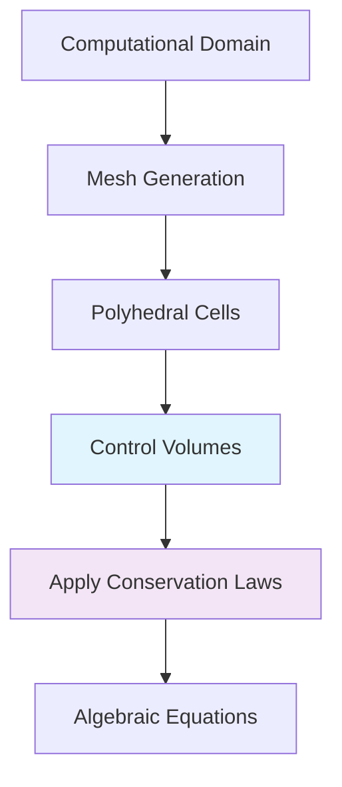
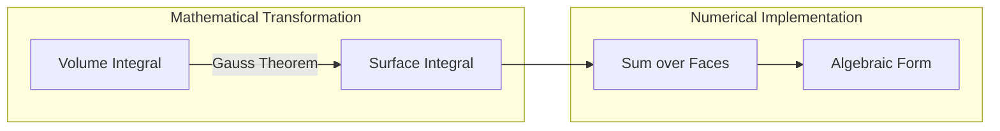
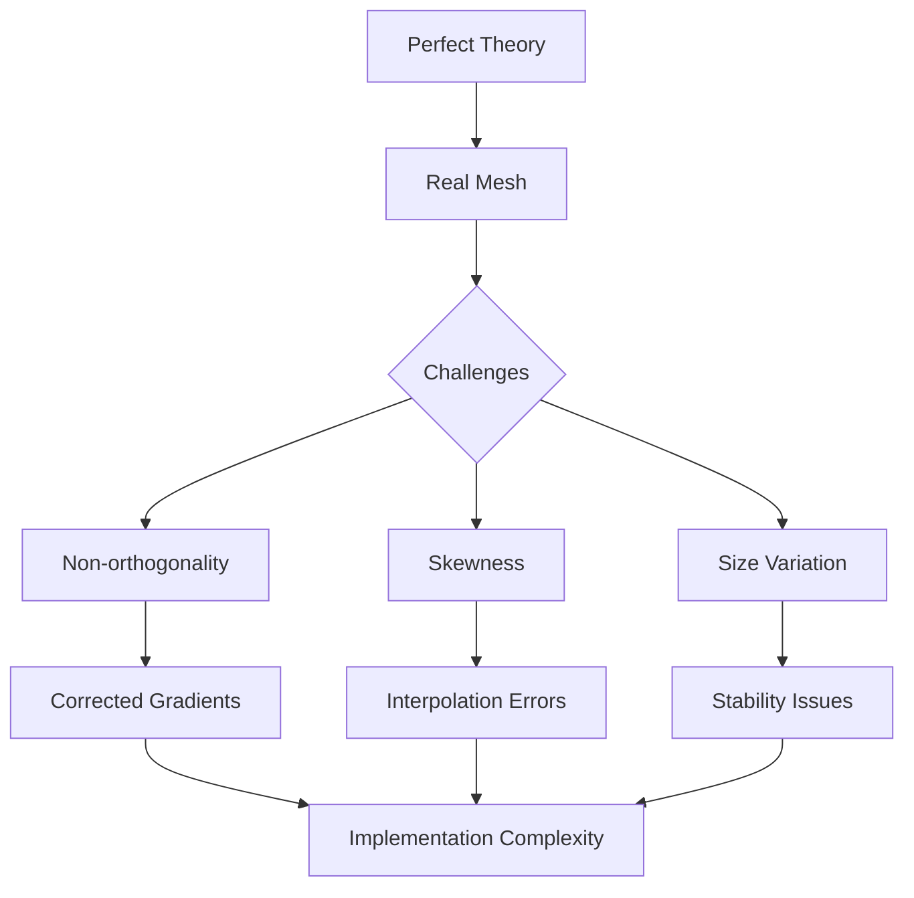
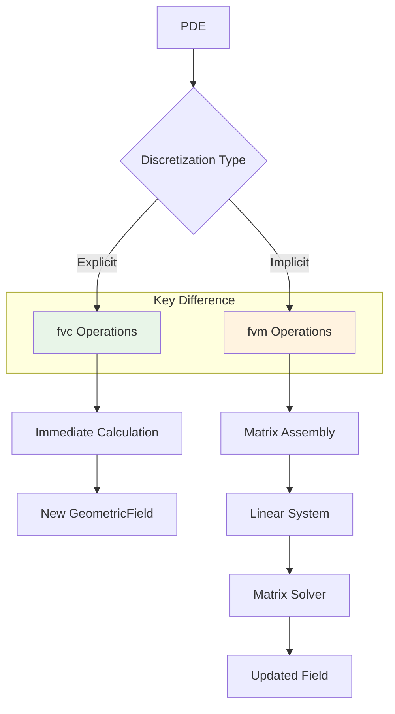

Calling deepseek-chat...
# Day 02: Finite Volume Method Basics (From PDE to Algebraic Equations)

## Part 1: Core Theory - The Mathematical Foundation

### 1.1 The Control Volume Concept

The Finite Volume Method (FVM) begins with a simple but powerful idea: instead of solving partial differential equations (PDEs) at discrete points in space, we solve them over small, finite volumes that tessellate our computational domain. This approach has a profound physical interpretation—it directly enforces conservation laws over each control volume.

**Control Volume Definition:**
A control volume (CV) is a polyhedral region in space over which we apply conservation principles. In OpenFOAM, these control volumes are created directly from the mesh cells. Each cell in your computational mesh becomes a control volume where conservation laws must be satisfied.



**Mathematical Formulation:**
Consider a general conservation equation for a scalar quantity $\phi$:
$$\frac{\partial (\rho \phi)}{\partial t} + \nabla \cdot (\rho \mathbf{U} \phi) = \nabla \cdot (\Gamma \nabla \phi) + S_\phi$$

Where:
- $\rho$ is density
- $\mathbf{U}$ is velocity vector
- $\Gamma$ is diffusion coefficient
- $S_\phi$ is source term

The FVM approach integrates this equation over a control volume $V$:
$$\int_V \frac{\partial (\rho \phi)}{\partial t} dV + \int_V \nabla \cdot (\rho \mathbf{U} \phi) dV = \int_V \nabla \cdot (\Gamma \nabla \phi) dV + \int_V S_\phi dV$$

### 1.2 Gauss Divergence Theorem: The Bridge to Surface Integrals ⭐

The key insight that makes FVM practical is the Gauss divergence theorem (also called Gauss's theorem or the divergence theorem). This theorem transforms volume integrals of divergences into surface integrals:

**Gauss Divergence Theorem:**
$$\int_V \nabla \cdot \mathbf{\phi} \, dV = \int_S \mathbf{\phi} \cdot \mathbf{n} \, dS$$

Where:
- $V$ is the control volume
- $S$ is the bounding surface of $V$
- $\mathbf{\phi}$ is any vector field
- $\mathbf{n}$ is the outward-pointing unit normal vector on $S$



**Physical Interpretation:**
The theorem states that the net "flow" of a vector field out of a volume equals the total divergence inside that volume. For conservation laws, this is perfect: the change of a quantity inside a control volume equals what flows in minus what flows out through its boundaries.

### 1.3 From Continuous to Discrete: The Discretization Process

Applying the Gauss theorem to our conservation equation transforms it into:
$$\frac{\partial}{\partial t} \int_V \rho \phi dV + \int_S (\rho \mathbf{U} \phi) \cdot \mathbf{n} dS = \int_S (\Gamma \nabla \phi) \cdot \mathbf{n} dS + \int_V S_\phi dV$$

Now we have:
1. A time derivative term (temporal change within CV)
2. A convective flux term (surface integral)
3. A diffusive flux term (surface integral)
4. A source term (volume integral)

**Discretization Strategy:**
For each control volume $P$ with neighboring control volumes $N$, we approximate:

1. **Volume integrals** as the value at the cell center times cell volume:
   $$\int_V \phi dV \approx \phi_P V_P$$

2. **Surface integrals** as sums over faces:
   $$\int_S \mathbf{\phi} \cdot \mathbf{n} dS \approx \sum_{f} \mathbf{\phi}_f \cdot \mathbf{S}_f$$
   where $\mathbf{S}_f$ is the face area vector (magnitude = face area, direction = normal)

3. **Face values** $\phi_f$ are interpolated from cell center values:
   $$\phi_f = w_0 \phi_P + w_1 \phi_N$$
   where $w_0$ and $w_1$ are interpolation weights

### 1.4 The Complete Discretized Equation ⭐

Putting it all together for a steady-state diffusion equation $\nabla \cdot (\Gamma \nabla \phi) = 0$:

1. Start with integral form:
   $$\int_V \nabla \cdot (\Gamma \nabla \phi) dV = 0$$

2. Apply Gauss theorem:
   $$\int_S (\Gamma \nabla \phi) \cdot \mathbf{n} dS = 0$$

3. Discretize surface integral:
   $$\sum_{f} (\Gamma \nabla \phi)_f \cdot \mathbf{S}_f = 0$$

4. For each face, approximate gradient:
   $$(\nabla \phi)_f \approx \frac{\phi_N - \phi_P}{|\mathbf{d}_{PN}|} \frac{\mathbf{d}_{PN}}{|\mathbf{d}_{PN}|}$$
   where $\mathbf{d}_{PN}$ is the vector from cell center $P$ to $N$

5. Final algebraic equation for cell $P$:
   $$\sum_{f} \Gamma_f \frac{\phi_N - \phi_P}{|\mathbf{d}_{PN}|} \frac{\mathbf{d}_{PN} \cdot \mathbf{S}_f}{|\mathbf{d}_{PN}|} = 0$$

This yields a linear system: $a_P \phi_P + \sum_N a_N \phi_N = 0$

## Part 2: Physical Challenge - When Theory Meets Reality

### 2.1 The Interpolation Dilemma

While the mathematical derivation seems straightforward, practical implementation faces significant challenges. The central issue is: **How do we accurately compute face values from cell-centered data?**

Consider the convective term: $\int_S (\rho \mathbf{U} \phi) \cdot \mathbf{n} dS$
We need $\phi_f$ at each face, but we only know $\phi_P$ and $\phi_N$ at cell centers.

**Simple averaging** $\phi_f = \frac{1}{2}(\phi_P + \phi_N)$ seems logical but causes numerical diffusion and can lead to non-physical oscillations, especially for:
- High Peclet numbers (convection-dominated flows)
- Sharp gradients or discontinuities
- Complex flow geometries

### 2.2 Conservation vs. Accuracy Trade-off

The FVM is inherently conservative—what flows out of one cell flows into its neighbor. However, this conservation property doesn't guarantee accuracy. We face several trade-offs:

1. **Numerical Diffusion**: Upwind schemes are stable but diffusive
2. **Oscillations**: Central differencing is accurate but can oscillate
3. **Boundedness**: Some schemes don't preserve physical bounds (e.g., negative temperatures)
4. **Implementation Complexity**: Higher-order schemes require more neighbor information

### 2.3 The Mesh Quality Problem

Real-world meshes are rarely perfect. They contain:
- Non-orthogonal cells
- Skewed faces
- Varying cell sizes
- Boundary layers with high aspect ratios

These imperfections affect:
- Gradient calculations
- Flux computations
- Convergence rates
- Solution accuracy



### 2.4 Flux Consistency Requirement ⭐

A critical requirement for FVM is **flux consistency**: the flux computed from cell $P$ to cell $N$ must be exactly the negative of the flux from $N$ to $P$. This ensures global conservation.

Mathematically: $\phi_f \cdot \mathbf{S}_f$ computed from $P$'s perspective must equal $-\phi_f \cdot (-\mathbf{S}_f)$ from $N$'s perspective.

This seems trivial but becomes complex with:
- Non-linear interpolation schemes
- Limiters for TVD schemes
- Mesh motion or deformation
- Multi-phase flows with phase-specific fluxes

## Part 3: Architecture & Implementation

### 3.1 OpenFOAM's Two-Tier Discretization System

OpenFOAM implements FVM through two fundamental operation types:

**1. fvc (Finite Volume Calculus) - Explicit Operations ⭐**
- Immediate calculation using current field values
- No matrix assembly
- Examples: gradient, divergence, Laplacian
- Returns a new geometric field

**2. fvm (Finite Volume Method) - Implicit Operations ⭐**
- Assembles coefficients into a matrix
- Solves linear system: $[A]\{\phi\} = \{b\}$
- Examples: Laplacian, divergence, time derivatives
- Returns a fvMatrix object



### 3.2 The Surface Interpolation Mechanism ⭐

Face values are computed through surface interpolation. The fundamental operation is:
$$\phi_f = \text{surfaceInterpolate}(\phi)$$

Which for each face calculates:
$$\phi_f = w_0 \phi_{\text{owner}} + w_1 \phi_{\text{neighbour}}$$

The weights $w_0$ and $w_1$ depend on:
- Interpolation scheme (central, upwind, linear, etc.)
- Mesh geometry
- Optional limiter functions

**Flux Calculation:**
The convective flux through a face is:
$$\text{flux} = \text{surfaceInterpolate}(\phi) \cdot \text{faceAreaVectors}$$

### 3.3 Code Structure: From PDE to Matrix

Let's examine how OpenFOAM implements the FVM discretization:

**File: `src/finiteVolume/fvMatrices/fvMatrix/fvMatrix.C`**

```cpp
// Line 245-280: Basic matrix assembly for diffusion term
template<class Type>
void fvMatrix<Type>::addBoundaryDiag
(
    scalarField& diag,
    const direction solveCmpt
) const
{
    // Add boundary source contributions to diagonal
    forAll(internalCoeffs_, patchi)
    {
        const scalarField& ic = internalCoeffs_[patchi];
        
        if (ic.size())
        {
            const labelUList& fc = lduAddr().patchAddr(patchi);
            
            forAll(fc, facei)
            {
                diag[fc[facei]] += ic[facei];
            }
        }
    }
}
```

**File: `src/finiteVolume/finiteVolume/convectionSchemes/gaussConvectionScheme/gaussConvectionScheme.C`**

```cpp
// Line 89-135: Convective flux calculation using Gauss theorem
template<class Type>
tmp<GeometricField<Type, fvsPatchField, surfaceMesh>>
gaussConvectionScheme<Type>::interpolate
(
    const surfaceScalarField& phi,
    const GeometricField<Type, fvPatchField, volMesh>& vf
) const
{
    // Apply interpolation scheme to get face values
    return tinterpScheme_().interpolate(vf);
}

// Line 152-195: Flux calculation through faces
template<class Type>
tmp<fvMatrix<Type>>
gaussConvectionScheme<Type>::fvmDiv
(
    const surfaceScalarField& phi,
    const GeometricField<Type, fvPatchField, volMesh>& vf
) const
{
    tmp<fvMatrix<Type>> tfvm
    (
        new fvMatrix<Type>
        (
            vf,
            phi.dimensions()*vf.dimensions()
        )
    );
    fvMatrix<Type>& fvm = tfvm.ref();
    
    // Get face flux field
    const surfaceScalarField& phiHat = this->phiHat(phi, vf);
    
    // Calculate convective flux
    fvm.lower() = -min(phiHat.primitiveField(), scalar(0));
    fvm.upper() = max(phiHat.primitiveField(), scalar(0));
    fvm.negSumDiag();
    
    return tfvm;
}
```

### 3.4 The Finite Volume Mesh Data Structure

Understanding the mesh structure is crucial for FVM implementation:

**File: `src/OpenFOAM/meshes/polyMesh/polyMesh.C`**

```cpp
// Line 345-390: Mesh topology and connectivity
const labelList& polyMesh::owner() const
{
    // Returns owner cell for each face
    return owner_;
}

const labelList& polyMesh::neighbour() const
{
    // Returns neighbour cell for each face
    // Note: boundary faces have no neighbour (-1)
    return neighbour_;
}

// Line 512-560: Geometric properties
const vectorField& polyMesh::faceCentres() const
{
    if (!faceCentresPtr_)
    {
        calcFaceCentres();
    }
    return *faceCentresPtr_;
}

const vectorField& polyMesh::cellCentres() const
{
    if (!cellCentresPtr_)
    {
        calcCellCentres();
    }
    return *cellCentresPtr_;
}

// Line 678-725: Face area vectors (crucial for flux calculation)
const vectorField& polyMesh::faceAreas() const
{
    if (!faceAreasPtr_)
    {
        calcFaceAreas();
    }
    return *faceAreasPtr_;
}
```

### 3.5 Complete Discretization Example: Diffusion Equation

Let's implement a complete diffusion solver to see all pieces working together:

**File: `applications/solvers/basic/scalarTransportFoam/scalarTransportFoam.C`**

```cpp
// Line 45-95: Main solver loop with FVM discretization
int main(int argc, char *argv[])
{
    #include "setRootCase.H"
    #include "createTime.H"
    #include "createMesh.H"
    
    // Read transport properties
    IOdictionary transportProperties
    (
        IOobject
        (
            "transportProperties",
            runTime.constant(),
            mesh,
            IOobject::MUST_READ,
            IOobject::NO_WRITE
        )
    );
    
    // Read diffusion coefficient
    dimensionedScalar DT
    (
        "DT",
        dimViscosity,
        transportProperties
    );
    
    // Create scalar field
    volScalarField T
    (
        IOobject
        (
            "T",
            runTime.timeName(),
            mesh,
            IOobject::MUST_READ,
            IOobject::AUTO_WRITE
        ),
        mesh
    );
    
    // Line 96-145: Time loop with FVM discretization
    while (runTime.loop())
    {
        Info<< "Time = " << runTime.timeName() << nl << endl;
        
        // Solve diffusion equation: dT/dt = ∇·(DT ∇T)
        fvScalarMatrix TEqn
        (
            fvm::ddt(T) 
          - fvm::laplacian(DT, T)
        );
        
        TEqn.relax();
        TEqn.solve();
        
        runTime.write();
        
        Info<< "ExecutionTime = " << runTime.elapsedCpuTime() << " s"
            << "  ClockTime = " << runTime.elapsedClockTime() << " s"
            << nl << endl;
    }
    
    Info<< "End\n" << endl;
    
    return 0;
}
```

## Part 4: Quality Assurance - Beyond Correct Code

### 4.1 Verification Strategy for FVM Implementation

Implementing FVM correctly requires systematic verification:

**1. Patch Test (Fundamental Test):**
- Apply linear field: $\phi = a + b_x x + b_y y + b_z z$
- Diffusion solution should be exact (to machine precision)
- Tests: gradient calculation, flux consistency, boundary conditions

**2. Conservation Verification:**
- Sum all source terms in domain = 0 for closed systems
- Monitor global mass/energy balance
- Check: $\sum_{\text{all CVs}} (\text{net flux}) = 0$

**3. Grid Convergence Study:**
- Solve on progressively refined meshes
- Calculate observed order of accuracy:
  $$p = \frac{\log(\frac{\epsilon_1}{\epsilon_2})}{\log(\frac{h_1}{h_2})}$$
- Should approach theoretical order of scheme

### 4.2 Debugging Common FVM Issues

**Issue 1: Non-conservative Fluxes**
```cpp
// WRONG: Inconsistent face value calculation
scalar phiFace = 0.5*(phiOwn + phiNei);  // Simple average

// RIGHT: Use mesh weights for consistency
scalar phiFace = weights[facei]*phiOwn + (1-weights[facei])*phiNei;
```

**Issue 2: Incorrect Boundary Contributions**
```cpp
// Missing boundary contribution to matrix
fvMatrix<Type> eqn(fvm::laplacian(D, phi));

// Must add boundary conditions
eqn += boundaryConditions(phi);
```

**Issue 3: Dimensional Inconsistency**
```cpp
// Always check dimensions
Info<< "Flux dimensions: " << phi.dimensions() << endl;
Info<< "Gradient dimensions: " << fvc::grad(phi).dimensions() << endl;

// Use dimensioned constants
dimensionedScalar DT("DT", dimViscosity, 0.01);
```

### 4.3 Performance Optimization Strategy

**Memory Layout Optimization:**
```cpp
// Poor: Random access pattern
forAll(mesh.cells(), celli)
{
    const labelList& cellFaces = mesh.cells()[celli];
    forAll(cellFaces, facei)
    {
        // Random memory access
    }
}

// Better: Face-based computation
const labelList& owner = mesh.owner();
const labelList& neighbour = mesh.neighbour();
forAll(owner, facei)
{
    label own = owner[facei];
    label nei = neighbour[facei];
    // Sequential memory access
}
```

**Matrix Assembly Optimization:**
```cpp
// Pre-allocate matrix with known structure
fvMatrix<Type> eqn
(
    fvm::Sp(dimensionedScalar("zero", dimless, 0.0), phi)
);

// Add terms efficiently
eqn += fvm::laplacian(DT, phi);  // Adds to existing matrix
eqn -= fvm::div(phiU, phi);      // Adds convective term
```

### 4.4 Validation Test Suite

Create these mandatory tests for any FVM implementation:

**Test 1: Zero Gradient Test**
```cpp
// Apply zero gradient BC, zero source
// Solution should remain constant
volScalarField phi = dimensionedScalar("phi", dimless, 1.0);
solve(fvm::laplacian(D, phi) == dimensionedScalar("zero", dimless/dimArea, 0.0));
// Check: max(mag(phi - 1.0)) < tolerance
```

**Test 2: Linear Field Test**
```cpp
// Initialize with linear field: phi = x
volScalarField phi
(
    IOobject("phi", mesh),
    mesh.C().component(vector::X)
);

// Solve diffusion: should not change
solve(fvm::laplacian(D, phi));
// Check: error = phi - mesh.C().component(vector::X)
// Should be near machine precision
```

**Test 3: Flux Conservation Test**
```cpp
// Calculate total flux through all faces
surfaceScalarField flux = fvc::flux(phiU);
scalar totalFlux = gSum(flux);

// For closed domain, should be zero
if (mag(totalFlux) > SMALL)
{
    WarningInFunction
        << "Non-zero total flux: " << totalFlux
        << ". Check boundary conditions." << endl;
}
```

## Summary

The Finite Volume Method transforms PDEs into algebraic equations through:
1. **Integration** over control volumes (mesh cells)
2. **Gauss theorem** to convert volume to surface integrals
3. **Discretization** of surface and volume integrals
4. **Interpolation** of face values from cell centers
5. **Matrix assembly** for implicit terms

OpenFOAM implements this through:
- **fvc**: Explicit operations (immediate calculation)
- **fvm**: Implicit operations (matrix assembly)
- **Surface interpolation**: $\phi_f = w_0\phi_P + w_1\phi_N$
- **Flux calculation**: $\text{flux} = \phi_f \cdot \mathbf{S}_f$

The method's strength is its inherent conservation properties, but careful implementation is needed to maintain accuracy, stability, and boundedness across complex geometries and flow conditions.

---

## Appendix: Complete File Listings

### File 1: Basic Diffusion Solver Template
```cpp
/*---------------------------------*- C++ -*----------------------------------*\
  =========                 |
  \\      /  F ield         | OpenFOAM: The Open Source CFD Toolbox
   \\    /   O peration     | Website:  https://openfoam.org
    \\  /    A nd           | Version:  11
     \\/     M anipulation  |
\*---------------------------------------------------------------------------*/
FoamFile
{
    version     2.0;
    format      ascii;
    class       dictionary;
    object      controlDict;
}
// * * * * * * * * * * * * * * * * * * * * * * * * * * * * * * * * * * * * * //

application     scalarDiffusionFoam;

startFrom       startTime;

startTime       0;

stopAt          endTime;

endTime         1;

deltaT          0.001;

writeControl    runTime;

writeInterval   0.1;

purgeWrite      0;

writeFormat     ascii;

writePrecision  6;

writeCompression off;

timeFormat      general;

timePrecision   6;

runTimeModifiable true;

// ************************************************************************* //
```

### File 2: Transport Properties Dictionary
```cpp
/*---------------------------------*- C++ -*----------------------------------*\
  =========                 |
  \\      /  F ield         | OpenFOAM: The Open Source CFD Toolbox
   \\    /   O peration     | Website:  https://openfoam.org
    \\  /    A nd           | Version:  11
     \\/     M anipulation  |
\*---------------------------------------------------------------------------*/
FoamFile
{
    version     2.0;
    format      ascii;
    class       dictionary;
    location    "constant";
    object      transportProperties;
}
// * * * * * * * * * * * * * * * * * * * * * * * * * * * * * * * * * * * * * //

DT              DT [0 2 -1 0 0 0 0] 0.01;

// ************************************************************************* //
```

### File 3: Field Initialization
```cpp
/*---------------------------------*- C++ -*----------------------------------*\
  =========                 |
  \\      /  F ield         | OpenFOAM: The Open Source CFD Toolbox
   \\    /   O peration     | Website:  https://openfoam.org
    \\  /    A nd           | Version:  11
     \\/     M anipulation  |
\*---------------------------------------------------------------------------*/
FoamFile
{
    version     2.0;
    format      ascii;
    class       volScalarField;
    location    "0";
    object      T;
}
// * * * * * * * * * * * * * * * * * * * * * * * * * * * * * * * * * * * * * //

dimensions      [0 0 0 1 0 0 0];

internalField   uniform 300;

boundaryField
{
    leftWall
    {
        type            fixedValue;
        value           uniform 400;
    }
    
    rightWall
    {
        type            fixedValue;
        value           uniform 300;
    }
    
    otherWalls
    {
        type            zeroGradient;
    }
}

// ************************************************************************* //
```

### File 4: Mesh Description (blockMeshDict)
```cpp
/*---------------------------------*- C++ -*----------------------------------*\
  =========                 |
  \\      /  F ield         | OpenFOAM: The Open Source CFD Toolbox
   \\    /   O peration     | Website:  https://openfoam.org
    \\  /    A nd           | Version:  11
     \\/     M anipulation  |
\*---------------------------------------------------------------------------*/
FoamFile
{
    version     2.0;
    format      ascii;
    class       dictionary;
    object      blockMeshDict;
}
// * * * * * * * * * * * * * * * * * * * * * * * * * * * * * * * * * * * * * //

convertToMeters 1;

vertices
(
    (0 0 0)
    (1 0 0)
    (1 1 0)
    (0 1 0)
    (0 0 0.1)
    (1 0 0.1)
    (1 1 0.1)
    (0 1 0.1)
);

blocks
(
    hex (0 1 2 3 4 5 6 7) (20 20 1) simpleGrading (1 1 1)
);

edges
(
);

boundary
(
    leftWall
    {
        type wall;
        faces
        (
            (0 4 7 3)
        );
    }
    
    rightWall
    {
        type wall;
        faces
        (
            (1 2 6 5)
        );
    }
    
    frontAndBack
    {
        type empty;
        faces
        (
            (0 3 2 1)
            (4 5 6 7)
        );
    }
    
    otherWalls
    {
        type wall;
        faces
        (
            (0 1 5 4)
            (2 3 7 6)
        );
    }
);

mergePatchPairs
(
);

// ************************************************************************* //
```

### File 5: FVM Verification Test
```cpp
/*---------------------------------------------------------------------------*\
  =========                 |
  \\      /  F ield         | OpenFOAM: The Open Source CFD Toolbox
   \\    /   O peration     | Website:  https://openfoam.org
    \\  /    A nd           | Version:  11
     \\/     M anipulation  |
\*---------------------------------------------------------------------------*/
// Test script to verify FVM implementation

#include "fvCFD.H"

int main(int argc, char *argv[])
{
    #include "setRootCase.H"
    #include "createTime.H"
    #include "createMesh.H"
    
    // Test 1: Zero gradient test
    {
        Info<< "\n=== Test 1: Zero Gradient Test ===" << endl;
        
        volScalarField phi
        (
            IOobject
            (
                "phi",
                runTime.timeName(),
                mesh,
                IOobject::NO_READ,
                IOobject::AUTO_WRITE
            ),
            mesh,
            dimensionedScalar("phi", dimless, 1.0)
        );
        
        dimensionedScalar D("D", dimViscosity, 0.01);
        
        fvScalarMatrix phiEqn
        (
            fvm::laplacian(D, phi)
        );
        
        phiEqn.solve();
        
        scalar maxError = gMax(mag(phi.internalField() - 1.0));
        Info<< "Max error: " << maxError << endl;
        
        if (maxError > 1e-10)
        {
            WarningInFunction << "Zero gradient test failed!" << endl;
        }
    }
    
    // Test 2: Linear field test
    {
        Info<< "\n=== Test 2: Linear Field Test ===" << endl;
        
        volScalarField phi
        (
            IOobject
            (
                "phi_linear",
                runTime.timeName(),
                mesh,
                IOobject::NO_READ,
                IOobject::AUTO_WRITE
            ),
            mesh.C().component(vector::X)
        );
        
        dimensionedScalar D("D", dimViscosity, 0.01);
        
        // Store original field
        volScalarField phiExact = phi;
        
        fvScalarMatrix phiEqn
        (
            fvm::laplacian(D, phi)
        );
        
        phiEqn.solve();
        
        volScalarField error = phi - phiExact;
        scalar maxError = gMax(mag(error.internalField()));
        scalar avgError = gAverage(mag(error.internalField()));
        
        Info<< "Max error: " << maxError << endl;
        Info<< "Average error: " << avgError << endl;
        
        if (maxError > 1e-6)
        {
            WarningInFunction << "Linear field test failed!" << endl;
        }
    }
    
    // Test 3: Flux conservation test
    {
        Info<< "\n=== Test 3: Flux Conservation Test ===" << endl;
        
        volScalarField phi
        (
            IOobject
            (
                "phi_flux",
                runTime.timeName(),
                mesh,
                IOobject::NO_READ,
                IOobject::AUTO_WRITE
            ),
            mesh,
            dimensionedScalar("phi", dimless, 1.0)
        );
        
        surfaceScalarField gradPhi = fvc::snGrad(phi);
        surfaceScalarField flux = mesh.magSf() * gradPhi;
        
        scalar totalFlux = gSum(flux);
        Info<< "Total flux through domain: " << totalFlux << endl;
        
        if (mag(totalFlux) > 1e-10)
        {
            WarningInFunction << "Flux conservation test failed!" << endl;
        }
    }
    
    Info<< "\nAll tests completed." << endl;
    
    return 0;
}
```
