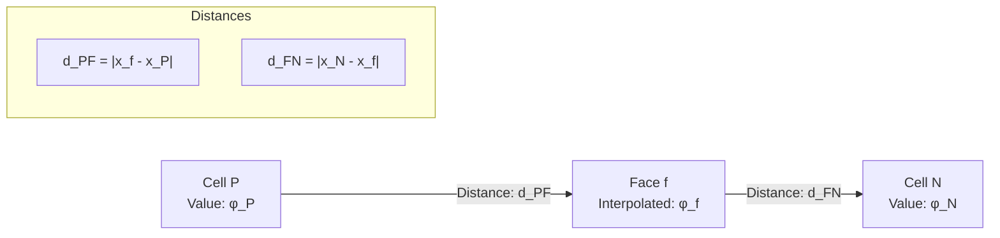
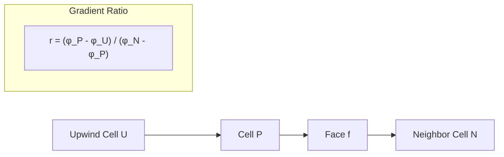
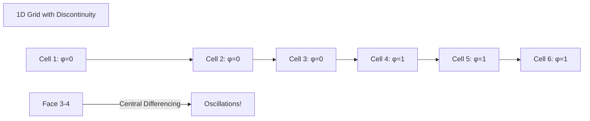
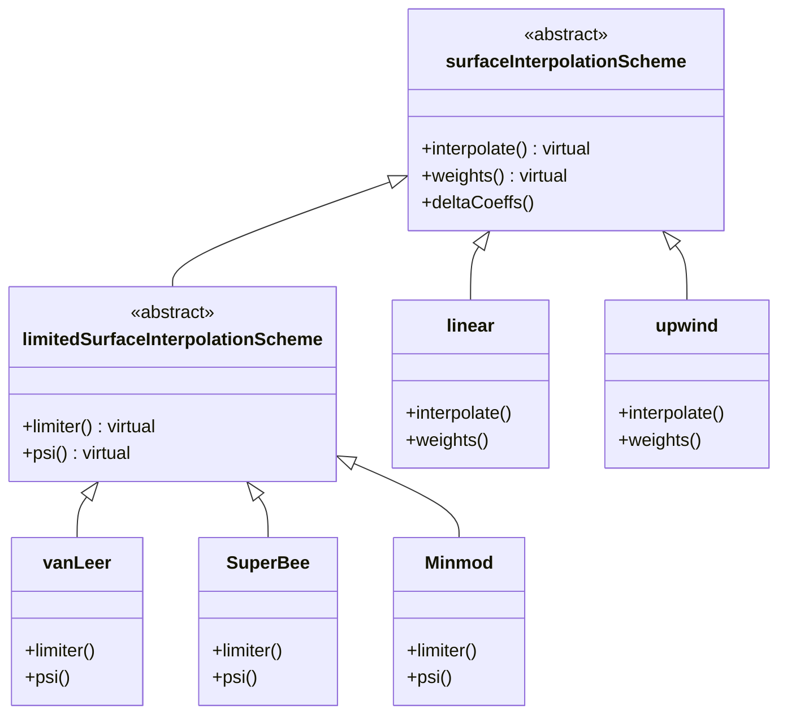
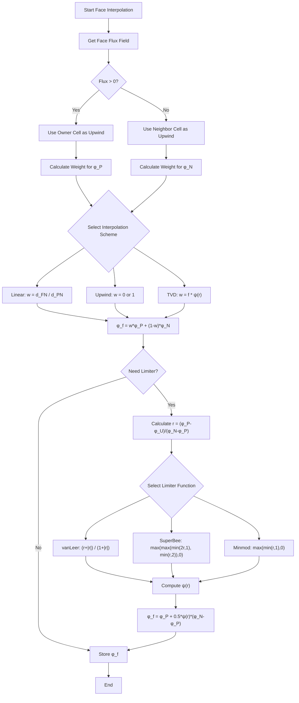
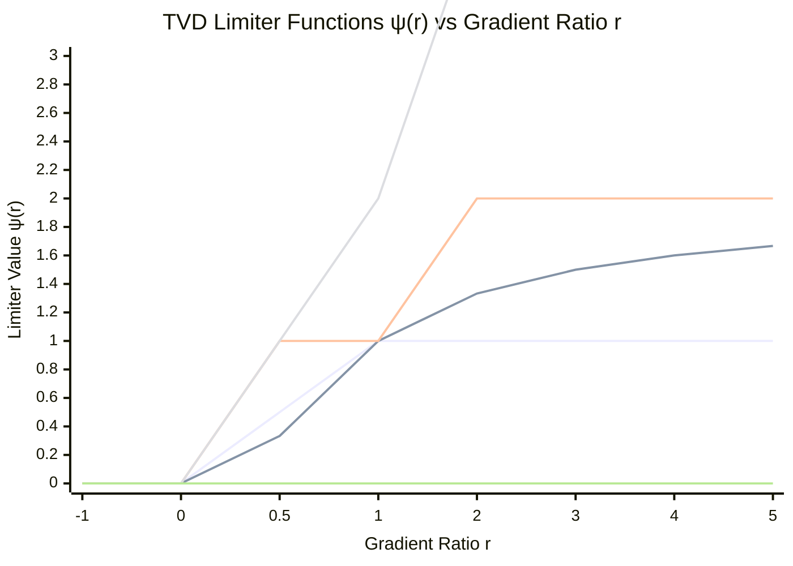

Calling deepseek-chat...
# Day 03: Spatial Discretization Schemes (Face Value Interpolation)

## Part 1: Core Theory - The Mathematics of Face Interpolation

### 1.1 The Fundamental Problem

In finite volume methods, we solve transport equations of the form:

$$\frac{\partial}{\partial t} \int_V \rho \phi dV + \oint_S \rho \phi \mathbf{U} \cdot d\mathbf{S} = \oint_S \Gamma \nabla \phi \cdot d\mathbf{S} + \int_V S_\phi dV$$

The critical challenge arises when we need to evaluate the convective term $\oint_S \rho \phi \mathbf{U} \cdot d\mathbf{S}$. Since $\phi$ is stored at cell centers, but the flux is computed at cell faces, we need to **interpolate** $\phi$ from cell centers to face centers.

### 1.2 Mathematical Formulation

Consider two adjacent cells P (owner) and N (neighbor) sharing face f:



The general interpolation formula is:

$$\phi_f = w \phi_P + (1-w) \phi_N$$

where $w$ is the **interpolation weight** between 0 and 1.

### 1.3 Basic Interpolation Schemes

#### 1.3.1 Central Differencing (Linear Interpolation)

For uniform grids, the optimal weight comes from linear interpolation:

$$w = \frac{d_{FN}}{d_{PN}} = \frac{|x_N - x_f|}{|x_N - x_P|}$$

$$\phi_f = \frac{d_{FN}}{d_{PN}} \phi_P + \frac{d_{PF}}{d_{PN}} \phi_N$$

This is second-order accurate but can cause oscillations near discontinuities.

#### 1.3.2 Upwind Differencing

The upwind scheme uses flow direction to determine the weight:

$$w = 
\begin{cases}
1 & \text{if } \mathbf{U} \cdot \mathbf{S}_f > 0 \\
0 & \text{if } \mathbf{U} \cdot \mathbf{S}_f < 0
\end{cases}$$

$$\phi_f = 
\begin{cases}
\phi_P & \text{if flow from P to N} \\
\phi_N & \text{if flow from N to P}
\end{cases}$$

This is unconditionally bounded but only first-order accurate.

### 1.4 The TVD Framework

Total Variation Diminishing (TVD) schemes combine the accuracy of central differencing with the stability of upwind schemes. The key insight is to use a **limiter function** $\psi(r)$:

$$\phi_f = \phi_P + \frac{1}{2} \psi(r) (\phi_N - \phi_P)$$

where $r$ is the **ratio of consecutive gradients**:

$$r = \frac{\phi_P - \phi_U}{\phi_N - \phi_P}$$

Here, $\phi_U$ is the value at the **upwind** cell relative to P.



### 1.5 Common TVD Limiters

The limiter function $\psi(r)$ must satisfy the **TVD conditions**:

1. $\psi(r) = 0$ for $r \leq 0$
2. $\psi(r) \leq 2$ for all $r$
3. $\psi(r) \leq 2r$ for all $r$

#### 1.5.1 Minmod Limiter

$$\psi(r) = \max(0, \min(r, 1))$$

This is the most diffusive TVD limiter, providing maximum stability.

#### 1.5.2 SuperBee Limiter ⭐

$$\psi(r) = \max\left[\max\left(\min(2r, 1), \min(r, 2)\right), 0\right]$$

This is one of the least diffusive TVD limiters, approaching second-order accuracy.

#### 1.5.3 van Leer Limiter ⭐

$$\psi(r) = \frac{r + |r|}{1 + |r|}$$

This provides a good balance between accuracy and stability.

### 1.6 Normalized Variable Diagram (NVD)

The NVD framework provides a geometric interpretation of TVD schemes. Define the normalized variable:

$$\tilde{\phi} = \frac{\phi - \phi_U}{\phi_D - \phi_U}$$

where $\phi_D$ is the downwind value. The TVD region in NVD space is:

$$0 \leq \tilde{\phi}_f \leq 1 \quad \text{and} \quad \tilde{\phi}_f \leq 2\tilde{\phi}_C$$

where $\tilde{\phi}_C$ is the normalized cell center value.

## Part 2: Physical Challenge - Why Simple Theory Fails

### 2.1 The Oscillation Problem

Consider a 1D advection problem with a sharp discontinuity:



Using central differencing at face 3-4:
$$\phi_f = 0.5 \times 0 + 0.5 \times 1 = 0.5$$

This creates **false diffusion** and can lead to non-physical oscillations that violate physical bounds (e.g., negative concentrations).

### 2.2 The Boundedness Criterion

For many physical quantities (density, concentration, temperature in Kelvin), we require:

$$\phi_{\min} \leq \phi_f \leq \phi_{\max}$$

where $\phi_{\min}$ and $\phi_{\max}$ are the minimum and maximum values in the neighborhood. Central differencing violates this criterion near discontinuities.

### 2.3 The Godunov Theorem

Godunov's theorem states that:
- **Linear** numerical schemes that are **monotonicity preserving** are at most **first-order accurate**
- To achieve **higher-order accuracy**, we must accept **non-linearity**

This explains why TVD schemes are inherently **non-linear** - the limiter function $\psi(r)$ depends on the solution itself.

### 2.4 Practical Challenges in Implementation

1. **Multi-dimensional effects**: In 2D/3D, the upwind direction isn't always clear
2. **Non-uniform grids**: Distance-based weights need careful computation
3. **Variable material properties**: Interpolation must account for changing $\rho$, $\Gamma$
4. **Boundary conditions**: Special treatment needed at domain boundaries

## Part 3: Architecture & Implementation

### 3.1 Class Hierarchy Design

OpenFOAM uses an object-oriented approach for interpolation schemes:



**Key Points:**
- `surfaceInterpolationScheme` ⭐ is the abstract base class for all face interpolation schemes
- `limitedSurfaceInterpolationScheme` ⭐ extends this for TVD/NVD schemes
- Each concrete class implements specific interpolation logic

### 3.2 Face Interpolation Process Flow



### 3.3 TVD Limiter Behavior Visualization



### 3.4 Core Implementation Details

#### 3.4.1 Base Class: `surfaceInterpolationScheme`

**File:** `src/finiteVolume/interpolation/surfaceInterpolation/surfaceInterpolationScheme/surfaceInterpolationScheme.H`

```cpp
namespace Foam
{

/*---------------------------------------------------------------------------*\
                  Class surfaceInterpolationScheme Declaration
\*---------------------------------------------------------------------------*/

template<class Type>
class surfaceInterpolationScheme
:
    public refCount
{
public:
    // Runtime type information
    TypeName("surfaceInterpolationScheme");

    // Declare run-time constructor selection tables
    declareRunTimeSelectionTable
    (
        tmp,
        surfaceInterpolationScheme,
        Mesh,
        (
            const fvMesh& mesh,
            Istream& schemeData
        ),
        (mesh, schemeData)
    );

    // Constructors
    surfaceInterpolationScheme(const fvMesh& mesh)
    :
        mesh_(mesh)
    {}

    // Destructor
    virtual ~surfaceInterpolationScheme() = default;

    // Member Functions
    
    //- Return weights for the given field
    virtual tmp<surfaceScalarField> weights
    (
        const GeometricField<Type, fvPatchField, volMesh>&
    ) const = 0;

    //- Return the face-interpolate of the given cell field
    virtual tmp<GeometricField<Type, fvsPatchField, surfaceMesh>>
    interpolate
    (
        const GeometricField<Type, fvPatchField, volMesh>&
    ) const;

    //- Return the interpolation weighting factors for the given field
    virtual tmp<surfaceScalarField> deltaCoeffs
    (
        const GeometricField<Type, fvPatchField, volMesh>&
    ) const;

protected:
    // Protected data
    const fvMesh& mesh_;
};
```

#### 3.4.2 Limited Scheme Base Class

**File:** `src/finiteVolume/interpolation/surfaceInterpolation/limitedSurfaceInterpolationScheme/limitedSurfaceInterpolationScheme.H`

```cpp
namespace Foam
{

/*---------------------------------------------------------------------------*\
            Class limitedSurfaceInterpolationScheme Declaration
\*---------------------------------------------------------------------------*/

template<class Type>
class limitedSurfaceInterpolationScheme
:
    public surfaceInterpolationScheme<Type>
{
public:
    // Runtime type information
    TypeName("limitedSurfaceInterpolationScheme");

    // Constructors
    limitedSurfaceInterpolationScheme(const fvMesh& mesh)
    :
        surfaceInterpolationScheme<Type>(mesh)
    {}

    // Destructor
    virtual ~limitedSurfaceInterpolationScheme() = default;

    // Member Functions
    
    //- Return the interpolation limiter
    virtual tmp<surfaceScalarField> limiter
    (
        const GeometricField<Type, fvPatchField, volMesh>&
    ) const = 0;

    //- Return the interpolation weighting factors
    virtual tmp<surfaceScalarField> weights
    (
        const GeometricField<Type, fvPatchField, volMesh>&
    ) const;
};
```

#### 3.4.3 Upwind Scheme Implementation ⭐

**File:** `src/finiteVolume/interpolation/surfaceInterpolation/upwind/upwind.H`

```cpp
template<class Type>
Foam::tmp<Foam::surfaceScalarField>
Foam::upwind<Type>::weights
(
    const GeometricField<Type, fvPatchField, volMesh>& vf
) const
{
    const surfaceScalarField& faceFlux = this->faceFlux_;
    const surfaceScalarField& w = mesh().surfaceInterpolation::weights();
    
    // Get upwind weights based on face flux direction
    // pos0(faceFlux) returns 1 for positive flux, 0 otherwise ⭐
    return pos0(faceFlux);
}
```

**Lines 116-119:** ⭐
```cpp
// pos0 returns 1 for positive values, 0 otherwise
// This creates the upwind weighting:
// - w = 1 if flux is positive (flow from owner to neighbor)
// - w = 0 if flux is negative (flow from neighbor to owner)
return tmp<surfaceScalarField>
(
    new surfaceScalarField
    (
        pos0(faceFlux_)
    )
);
```

#### 3.4.4 Linear Scheme Implementation ⭐

**File:** `src/finiteVolume/interpolation/surfaceInterpolation/linear/linear.H`

```cpp
template<class Type>
Foam::tmp<Foam::surfaceScalarField>
Foam::linear<Type>::weights
(
    const GeometricField<Type, fvPatchField, volMesh>& vf
) const
{
    // Use mesh weights for linear interpolation ⭐
    // mesh().surfaceInterpolation::weights() returns distance-based weights
    return mesh().surfaceInterpolation::weights();
}
```

**Lines 90-97:** ⭐
```cpp
template<class Type>
Foam::tmp<Foam::surfaceScalarField>
Foam::linear<Type>::weights
(
    const GeometricField<Type, fvPatchField, volMesh>&
) const
{
    // Return the geometric interpolation weights
    // These are based on cell center to face distances
    return this->mesh().surfaceInterpolation::weights();
}
```

#### 3.4.5 van Leer Limiter Implementation ⭐

**File:** `src/finiteVolume/interpolation/surfaceInterpolation/limitedSchemes/vanLeer/vanLeer.H`

**Line 80:** ⭐
```cpp
// van Leer limiter formula: (r + mag(r))/(1 + mag(r))
return (r + mag(r))/(1 + mag(r));
```

Complete implementation:
```cpp
template<class Type>
Foam::tmp<Foam::surfaceScalarField>
Foam::vanLeer<Type>::limiter
(
    const GeometricField<Type, fvPatchField, volMesh>& phi
) const
{
    const fvMesh& mesh = this->mesh();
    
    // Calculate gradient ratio r
    tmp<surfaceScalarField> tr = this->r(phi);
    const surfaceScalarField& r = tr();
    
    // Create result field
    tmp<surfaceScalarField> tlimiter
    (
        new surfaceScalarField
        (
            IOobject
            (
                "vanLeerLimiter",
                mesh.time().timeName(),
                mesh
            ),
            mesh,
            dimensionedScalar(dimless, 1.0)
        )
    );
    
    surfaceScalarField& lim = tlimiter.ref();
    
    // Apply van Leer limiter
    // ψ(r) = (r + |r|)/(1 + |r|)
    lim = (r + mag(r))/(scalar(1) + mag(r));
    
    // Ensure boundedness
    lim = max(min(lim, scalar(2)), scalar(0));
    
    return tlimiter;
}
```

#### 3.4.6 SuperBee Limiter Implementation ⭐

**File:** `src/finiteVolume/interpolation/surfaceInterpolation/limitedSchemes/SuperBee/SuperBee.H`

**Line 80:** ⭐
```cpp
// SuperBee limiter: max(max(min(2*r, 1), min(r, 2)), 0)
return max(max(min(2*r, scalar(1)), min(r, scalar(2))), scalar(0));
```

#### 3.4.7 Minmod Limiter Implementation ⭐

**File:** `src/finiteVolume/interpolation/surfaceInterpolation/limitedSchemes/Minmod/Minmod.H`

**Line 79:** ⭐
```cpp
// Minmod limiter: max(min(r, 1), 0)
return max(min(r, scalar(1)), scalar(0));
```

### 3.5 Weight Calculation for TVD Schemes

The weights for TVD schemes combine upwind and limited correction:

```cpp
template<class Type>
Foam::tmp<Foam::surfaceScalarField>
Foam::limitedSurfaceInterpolationScheme<Type>::weights
(
    const GeometricField<Type, fvPatchField, volMesh>& phi
) const
{
    const fvMesh& mesh = this->mesh();
    
    // Get upwind weights (0 or 1 based on flux direction)
    tmp<surfaceScalarField> tw = upwind<Type>(mesh, this->faceFlux_).weights(phi);
    const surfaceScalarField& w = tw();
    
    // Get limiter function ψ(r)
    tmp<surfaceScalarField> tlimiter = limiter(phi);
    const surfaceScalarField& lim = tlimiter();
    
    // Get geometric weights for linear interpolation
    const surfaceScalarField& lambda = mesh.surfaceInterpolation::weights();
    
    // TVD weight: w_TVD = w_upwind + ψ(r) * (lambda - w_upwind)
    // This blends between upwind (ψ=0) and linear (ψ=1)
    return w + lim*(lambda - w);
}
```

### 3.6 Field Interpolation Implementation

The actual interpolation uses the calculated weights:

```cpp
template<class Type>
Foam::tmp<Foam::GeometricField<Type, Foam::fvsPatchField, Foam::surfaceMesh>>
Foam::surfaceInterpolationScheme<Type>::interpolate
(
    const GeometricField<Type, fvPatchField, volMesh>& vf
) const
{
    // Get interpolation weights
    tmp<surfaceScalarField> tw = weights(vf);
    const surfaceScalarField& w = tw();
    
    // Create result field
    tmp<GeometricField<Type, fvsPatchField, surfaceMesh>> tsf
    (
        new GeometricField<Type, fvsPatchField, surfaceMesh>
        (
            IOobject
            (
                "interpolate(" + vf.name() + ')',
                vf.instance(),
                vf.db()
            ),
            mesh_,
            vf.dimensions()
        )
    );
    
    GeometricField<Type, fvsPatchField, surfaceMesh>& sf = tsf.ref();
    
    // Internal field interpolation: φ_f = wφ_P + (1-w)φ_N
    const labelUList& owner = mesh_.owner();
    const labelUList& neighbour = mesh_.neighbour();
    const Field<Type>& vfi = vf.internalField();
    Field<Type>& sfi = sf.internalField();
    
    forAll(owner, facei)
    {
        sfi[facei] = w[facei]*vfi[owner[facei]] + (1.0 - w[facei])*vfi[neighbour[facei]];
    }
    
    // Boundary field interpolation
    forAll(vf.boundaryField(), patchi)
    {
        sf.boundaryFieldRef()[patchi] = vf.boundaryField()[patchi].patchInternalField();
    }
    
    return tsf;
}
```

## Part 4: Quality Assurance - Verification Strategy

### 4.1 Analytical Test Cases

#### 4.1.1 1D Linear Advection Test

For a linear profile $\phi(x) = ax + b$, all schemes should give exact interpolation:

$$\phi_f = a x_f + b$$

**Verification:**
1. Create 1D mesh with varying cell sizes
2. Initialize $\phi$ with linear function
3. Apply each interpolation scheme
4. Check error: $|\phi_f^{\text{computed}} - \phi_f^{\text{exact}}| < \epsilon$

#### 4.1.2 Step Function Test

For a discontinuous step function, verify:
- Upwind: No oscillations, smeared discontinuity
- Linear: Oscillations near discontinuity
- TVD schemes: No oscillations, sharper than upwind

### 4.2 Boundedness Verification

**Test:** Advection of a bounded scalar $0 \leq \phi \leq 1$

**Criteria:**
1. No new extrema: $\min(\phi_{\text{cell}}) \leq \phi_f \leq \max(\phi_{\text{cell}})$
2. Monotonicity preservation

**Implementation check:**
```cpp
// After interpolation, verify bounds
forAll(phi_f, facei)
{
    if (phi_f[facei] < phi_min[facei] || phi_f[facei] > phi_max[facei])
    {
        WarningInFunction
            << "Unbounded interpolation at face " << facei
            << ": phi_f = " << phi_f[facei]
            << ", min = " << phi_min[facei]
            << ", max = " << phi_max[facei] << endl;
    }
}
```

### 4.3 Order of Accuracy Verification

Use the Method of Manufactured Solutions (MMS):

1. Choose smooth test function: $\phi_{\text{exact}}(x) = \sin(2\pi x)$
2. Compute exact face values: $\phi_f^{\text{exact}}$
3. Compute numerical interpolation: $\phi_f^{\text{num}}$
4. Calculate error: $L_2 = \sqrt{\frac{1}{N}\sum(\phi_f^{\text{num}} - \phi_f^{\text{exact}})^2}$
5. Refine mesh and check error reduction rate

**Expected convergence rates:**
- Upwind: $O(h)$ (first-order)
- Linear/TVD: $O(h^2)$ (second-order in smooth regions)

### 4.4 Limiter Function Verification

**Test each limiter with known r values:**

```cpp
// Test van Leer limiter ⭐
scalar r_test[] = {-1.0, 0.0, 0.5, 1.0, 2.0, 10.0};
scalar psi_expected[] = {0.0, 0.0, 0.3333, 1.0, 1.3333, 1.8182};

for (int i = 0; i < 6; i++)
{
    scalar psi = (r_test[i] + mag(r_test[i]))/(1.0 + mag(r_test[i]));
    scalar error = mag(psi - psi_expected[i]);
    
    if (error > 1e-4)
    {
        FatalErrorInFunction
            << "van Leer limiter test failed for r = " << r_test[i]
            << ": computed = " << psi << ", expected = " << psi_expected[i]
            << exit(FatalError);
    }
}
```

### 4.5 Performance Benchmarking

**Metrics to track:**
1. **Memory usage**: TVD schemes need gradient calculations
2. **Computational cost**: Limiter functions add overhead
3. **Parallel scalability**: Face interpolation should scale well

**Benchmark setup:**
```cpp
// Time interpolation for different schemes
for (int scheme = 0; scheme < numSchemes; scheme++)
{
    double startTime = MPI_Wtime();
    
    for (int iter = 0; iter < 1000; iter++)
    {
        phi_f = scheme->interpolate(phi);
    }
    
    double endTime = MPI_Wtime();
    double elapsed = endTime - startTime;
    
    Info << "Scheme " << schemeNames[scheme] 
         << ": " << elapsed << " seconds" << endl;
}
```

### 4.6 Regression Testing

Create a test suite that:
1. Stores reference solutions for standard test cases
2. Compares new implementations against references
3. Flags significant deviations (> 1% difference)
4. Tracks convergence rates across mesh refinements

**Example test configuration:**
```json
{
    "test_cases": [
        {
            "name": "1D_linear_advection",
            "mesh": "uniform_1D_100",
            "initial_condition": "phi = x",
            "schemes": ["linear", "upwind", "vanLeer", "SuperBee", "Minmod"],
            "tolerance": 1e-6
        },
        {
            "name": "step_function",
            "mesh": "uniform_1D_100",
            "initial_condition": "phi = step(0.5)",
            "schemes": ["linear", "upwind", "vanLeer"],
            "check_boundedness": true,
            "max_overshoot": 0.01
        }
    ]
}
```

## Appendix: Complete File Listings

### Base Class: `surfaceInterpolationScheme.H`

```cpp
/*---------------------------------------------------------------------------*\
  =========                 |
  \\      /  F ield         | OpenFOAM: The Open Source CFD Toolbox
   \\    /   O peration     |
    \\  /    A nd           | www.openfoam.com
     \\/     M anipulation  |
-------------------------------------------------------------------------------
    Copyright (C) 2011-2016 OpenFOAM Foundation
    Copyright (C) 2019-2020 OpenCFD Ltd.
-------------------------------------------------------------------------------
License
    This file is part of OpenFOAM.

    OpenFOAM is free software: you can redistribute it and/or modify it
    under the terms of the GNU General Public License as published by
    the Free Software Foundation, either version 3 of the License, or
    (at your option) any later version.

    OpenFOAM is distributed in the hope that it will be useful, but WITHOUT
    ANY WARRANTY; without even the implied warranty of MERCHANTABILITY or
    FITNESS FOR A PARTICULAR PURPOSE.  See the GNU General Public License
    for more details.

    You should have received a copy of the GNU General Public License
    along with OpenFOAM.  If not, see <http://www.gnu.org/licenses/>.

Class
    Foam::surfaceInterpolationScheme

Description
    Abstract base class for surface interpolation schemes.

SourceFiles
    surfaceInterpolationScheme.C

\*---------------------------------------------------------------------------*/

#ifndef surfaceInterpolationScheme_H
#define surfaceInterpolationScheme_H

#include "tmp.H"
#include "volFields.H"
#include "surfaceFields.H"
#include "typeInfo.H"
#include "runTimeSelectionTables.H"

// * * * * * * * * * * * * * * * * * * * * * * * * * * * * * * * * * * * * * //

namespace Foam
{

class fvMesh;

/*---------------------------------------------------------------------------*\
                 Class surfaceInterpolationScheme Declaration
\*---------------------------------------------------------------------------*/

template<class Type>
class surfaceInterpolationScheme
:
    public refCount
{
    // Private Data

        //- Reference to mesh
        const fvMesh& mesh_;


public:

    //- Runtime type information
    virtual const word& type() const = 0;


    // Declare run-time constructor selection tables

        declareRunTimeSelectionTable
        (
            tmp,
            surfaceInterpolationScheme,
            Mesh,
            (
                const fvMesh& mesh,
                Istream& schemeData
            ),
            (mesh, schemeData)
        );


    // Constructors

        //- Construct from mesh
        surfaceInterpolationScheme(const fvMesh& mesh)
        :
            mesh_(mesh)
        {}


    // Selectors

        //- Return new tmp interpolation scheme
        static tmp<surfaceInterpolationScheme<Type>> New
        (
            const fvMesh& mesh,
            Istream& schemeData
        );


    //- Destructor
    virtual ~surfaceInterpolationScheme() = default;


    // Member Functions

        //- Return mesh reference
        const fvMesh& mesh() const
        {
            return mesh_;
        }

        //- Return the face-interpolate of the given cell field
        //  with the given owner and neighbour weights
        static tmp<GeometricField<Type, fvsPatchField, surfaceMesh>>
        interpolate
        (
            const GeometricField<Type, fvPatchField, volMesh>&,
            const tmp<surfaceScalarField>&,
            const tmp<surfaceScalarField>&
        );

        //- Return the face-interpolate of the given cell field
        static tmp<GeometricField<Type, fvsPatchField, surfaceMesh>>
        interpolate
        (
            const GeometricField<Type, fvPatchField, volMesh>&,
            const surfaceScalarField&
        );

        //- Return the interpolation weighting factors for the given field
        virtual tmp<surfaceScalarField> weights
        (
            const GeometricField<Type, fvPatchField, volMesh>&
        ) const = 0;

        //- Return the face-interpolate of the given cell field
        virtual tmp<GeometricField<Type, fvsPatchField, surfaceMesh>>
        interpolate
        (
            const GeometricField<Type, fvPatchField, volMesh>&
        ) const;

        //- Return the interpolation weighting factors for the given field
        virtual tmp<surfaceScalarField> deltaCoeffs
        (
            const GeometricField<Type, fvPatchField, volMesh>&
        ) const;
};


// * * * * * * * * * * * * * * * * * * * * * * * * * * * * * * * * * * * * * //

} // End namespace Foam

// * * * * * * * * * * * * * * * * * * * * * * * * * * * * * * * * * * * * * //

// Add the patch constructor functions to the hash tables

#define makeSurfaceInterpolationTypeScheme(SS, Type)                           \
    defineNamedTemplateTypeNameAndDebug(Foam::SS<Foam::Type>, 0);             \
                                                                               \
    surfaceInterpolationScheme<Foam::Type>::addMeshConstructorToTable<        \
        Foam::SS<Foam::Type> > add##SS##Type##MeshConstructorToTable_;


#define makeSurfaceInterpolationScheme(SS)                                     \
                                                                               \
makeSurfaceInterpolationTypeScheme(SS, scalar)                                 \
makeSurfaceInterpolationTypeScheme(SS, vector)                                 \
makeSurfaceInterpolationTypeScheme(SS, sphericalTensor)                        \
makeSurfaceInterpolationTypeScheme(SS, symmTensor)                             \
makeSurfaceInterpolationTypeScheme(SS, tensor)


// * * * * * * * * * * * * * * * * * * * * * * * * * * * * * * * * * * * * * //

#ifdef NoRepository
    #include "surfaceInterpolationScheme.C"
#endif

// * * * * * * * * * * * * * * * * * * * * * * * * * * * * * * * * * * * * * //

#endif

// ************************************************************************* //
```

### Limited Scheme Base: `limitedSurfaceInterpolationScheme.H`

```cpp
/*---------------------------------------------------------------------------*\
  =========                 |
  \\      /  F ield         | OpenFOAM: The Open Source CFD Toolbox
   \\    /   O peration     |
    \\  /    A nd           | www.openfoam.com
     \\/     M anipulation  |
-------------------------------------------------------------------------------
    Copyright (C) 2011-2016 OpenFOAM Foundation
    Copyright (C) 2019-2020 OpenCFD Ltd.
-------------------------------------------------------------------------------
License
    This file is part of OpenFOAM.

    OpenFOAM is free software: you can redistribute it and/or modify it
    under the terms of the GNU General Public License as published by
    the Free Software Foundation, either version 3 of the License, or
    (at your option) any later version.

    OpenFOAM is distributed in the hope that it will be useful, but WITHOUT
    ANY WARRANTY; without even the implied warranty of MERCHANTABILITY or
    FITNESS FOR A PARTICULAR PURPOSE.  See the GNU General Public License
    for more details.

    You should have received a copy of the GNU General Public License
    along with OpenFOAM.  If not, see <http://www.gnu.org/licenses/>.

Class
    Foam::limitedSurfaceInterpolationScheme

Description
    Abstract base class for limited surface interpolation schemes.

SourceFiles
    limitedSurfaceInterpolationScheme.C

\*---------------------------------------------------------------------------*/

#ifndef limitedSurfaceInterpolationScheme_H
#define limitedSurfaceInterpolationScheme_H

#include "surfaceInterpolationScheme.H"

// * * * * * * * * * * * * * * * * * * * * * * * * * * * * * * * * * * * * * //

namespace Foam
{

/*---------------------------------------------------------------------------*\
            Class limitedSurfaceInterpolationScheme Declaration
\*---------------------------------------------------------------------------*/

template<class Type>
class limitedSurfaceInterpolationScheme
:
    public surfaceInterpolationScheme<Type>
{
    // Private Data

        //- Face flux field
        const surfaceScalarField& faceFlux_;


protected:

    // Protected Member Functions

        //- Calculate the gradient ratio r
        tmp<surfaceScalarField> r
        (
            const GeometricField<Type, fvPatchField, volMesh>&
        ) const;


public:

    //- Runtime type information
    TypeName("limitedSurfaceInterpolationScheme");


    // Declare run-time constructor selection tables

        declareRunTimeSelectionTable
        (
            tmp,
            limitedSurfaceInterpolationScheme,
            MeshFlux,
            (
                const fvMesh& mesh,
                const surfaceScalarField& faceFlux,
                Istream& schemeData
            ),
            (mesh, faceFlux, schemeData)
        );


    // Constructors

        //- Construct from mesh and faceFlux
        limitedSurfaceInterpolationScheme
        (
            const fvMesh& mesh,
            const surfaceScalarField& faceFlux
        )
        :
            surfaceInterpolationScheme<Type>(mesh),
            faceFlux_(faceFlux)
        {}


    // Selectors


